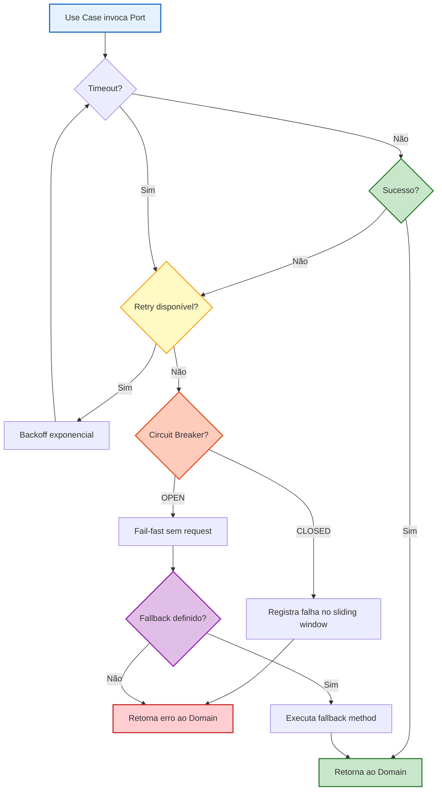

# ADR-0011 - Resilience Strategy: Retry, Circuit Breaker, and Fault Tolerance for External Integrations

- Date: 2026-04-17
- Status: Accepted
- Version: 1.3
- Authors / Owners: @AgentOrchestrator, @ImplementerCore
- Reviewers: @CleanArchitecture, @DomainExpert, @AdapterDev, @DevOps-Agent
- Stakeholders: Engineering Team, Product Owner, Startup Founders

---

# 1. Context

O Contador Fiscal Inteligente depende de **quatro integrações externas críticas** que operam fora do controle da plataforma:

| Integração | Módulo Spring Modulith | Outbound Port | Database | Natureza da Falha |
|---|---|---|---|---|
| **SERPRO Integra Contador** | `fiscal` | `SerproFiscalPort` | `saas_fiscal` | Indisponibilidade frequente (manutenção programada, rate-limiting, timeouts longos) |
| **Meta Cloud API (WhatsApp)** | `whatsapp` | `WhatsAppMessagePort` | `saas_whatsapp` | Rate-limiting (80 msg/s por WABA), throttling, webhook delivery failures |
| **Provider de pagamento definido no [ADR-0023](./ADR-0023-agnostic-payment-provider-integration.md)** | `billing` | `PaymentProviderPort` | `saas_billing` | Webhook delivery delays, idempotency conflicts, estado financeiro ambíguo e consistência eventual |
| **Provedores LLM (Gemini/OpenAI)** | `whatsapp` | `LlmResponsePort` | `saas_whatsapp` | Rate-limiting de tokens, timeouts de inferência (>30s), quota exhaustion |

**O problema:** Atualmente, os ADRs existentes mencionam resiliência de forma pontual — o ADR-0001 cita "circuit breakers" como princípio, o ADR-0004 fala em "fallback graceful" para o chatbot, e o ADR-0007 define fallback em cascata para LLMs. Porém, **nenhum ADR define a estratégia unificada de resiliência**: quais patterns usar, como configurar, como propagar falhas entre módulos via Spring Modulith Events, e como garantir que a VPS única (ADR-0001) não seja derrubada por um efeito cascata.

**Por que é crítico agora:**

- **Efeito cascata real:** Se o SERPRO ficar lento (timeout de 30s) e o chatbot WhatsApp acumular 50 sessões simultâneas esperando resposta, as virtual threads do Java 21 seguram conexões HTTP que seguram connections do HikariCP do `saas_fiscal`, que eventualmente drenam as connections do `saas_whatsapp`. Uma VPS com 4GB de RAM não sobrevive.
- **Spring Modulith Events sem DLQ nativo:** O Spring Modulith usa `@ApplicationModuleListener` para eventos assíncronos entre módulos. Se o handler do evento `FiscalQueryResultEvent` falhar por timeout do SERPRO, o evento é **perdido** — não há Dead Letter Queue nativa. O evento precisa ser re-publicado manualmente ou persistido.
- **Rate-limiting da Meta:** A Meta Cloud API limita a 80 mensagens/segundo por WABA. Um tenant com alto volume pode drenar a cota da WABA compartilhada, afetando outros tenants no mesmo WABA.
- **Quota de tokens LLM:** Se o Gemini retornar `429 Too Many Requests`, o fallback do ADR-0007 precisa de um mecanismo técnico concreto — o que acontece com a mensagem WhatsApp do cliente enquanto o sistema tenta o provedor B?

Restrições:

- Infraestrutura em VPS única com Docker Compose (ADR-0001) — não há message broker externo (Kafka, RabbitMQ) na fase 1.
- Spring Modulith Events é o mecanismo de comunicação inter-módulos (ADR-0001, ADR-0004).
- Clean Architecture: a lógica de resiliência pertence à camada de **adapter/infrastructure** — o domínio não deve saber se haverá retry ou circuit breaker.
- Multi-tenancy: falhas de um tenant não podem degradar o serviço de outros tenants (ADR-0005).
- Budget zero de cloud: a solução deve funcionar sem serviços externos adicionais.

---

# 2. Decision Statement

O sistema adotará **Resilience4j** como framework de resiliência, integrado com Spring Boot via `resilience4j-spring-boot3`. Cada outbound port (adapter de integração externa) será protegido por uma combinação configurável de **Circuit Breaker**, **Retry**, **Timeout**, **Bulkhead** e **Rate Limiter**, aplicados na camada de adapter (infraestrutura) via anotações declarativas. Para comunicação inter-módulos, os Spring Modulith Events serão persistidos em banco de dados (`event_publication` table) com reprocessamento automático de eventos falhados. Todas as falhas serão observáveis via métricas Prometheus e logs estruturados com `tenant_id` no MDC.

---

# 3. Decision Drivers

- **Isolamento de falhas (Bulkhead):** Uma integração lenta (SERPRO) não pode drenar recursos de outra integração (WhatsApp). Thread pools e connection pools devem ser isolados.
- **Proteção contra cascata (Circuit Breaker):** Quando um serviço externo está fora, o sistema deve parar de enviar requests rapidamente (fail-fast) em vez de acumular timeouts.
- **Recuperação automática (Retry):** Falhas transitórias (network glitch, 503 temporário) devem ser retentadas com backoff exponencial antes de escalar para fallback.
- **Tempo previsível (Timeout):** O cliente no WhatsApp não pode esperar 60 segundos por uma resposta. Cada integração deve ter um orçamento de tempo (time budget).
- **Preservação de eventos (Event Store):** Eventos do Spring Modulith que falharam não podem ser perdidos — devem ser persistidos e reprocessados.
- **Multi-tenancy (Rate Limiter por Tenant):** Um tenant com alto volume não pode monopolizar a cota de API de um serviço compartilhado (ex: WABA).
- **Observabilidade:** Todo circuit breaker open, retry exausted e timeout deve gerar log + métrica + alerta.
- **Clean Architecture:** A resiliência é um cross-cutting concern da camada de infraestrutura. O domínio invoca a port; o adapter decide como tolerar falhas.
- **Zero custo adicional:** Resilience4j é library-only (in-process), sem servidor externo. Spring Modulith Event Publication usa a mesma base PostgreSQL.

---

# 4. Considered Options

## Option 1: Resilience4j com Spring Boot Starter (Selecionada)

Description: Usar `resilience4j-spring-boot3` para aplicar Circuit Breaker, Retry, Timeout, Bulkhead e Rate Limiter via anotações (`@CircuitBreaker`, `@Retry`, `@TimeLimiter`, `@Bulkhead`, `@RateLimiter`) nos adapters de cada outbound port. Configuração via `application.yml`. Métricas expostas nativamente ao Micrometer/Prometheus.

Pros:
- Library-only — roda no mesmo JVM, zero infraestrutura adicional
- Integração nativa com Spring Boot Actuator e Micrometer (métricas Prometheus out-of-the-box)
- Configuração declarativa via `application.yml` — sem código boilerplate
- Suporte a decorators compostos (CircuitBreaker → Retry → Timeout → Bulkhead numa mesma chamada)
- Funciona com virtual threads do Java 21 (semaphore-based bulkhead)
- Padrão de mercado consolidado (substituto do Hystrix)

Cons:
- Configuração por instância exige nomes únicos por integração — verbose no `application.yml`
- Não substitui message broker para DLQ — precisa do Spring Modulith Event Publication para persistência de eventos
- Métricas por tenant exigiriam cardinalidade/risco incompatíveis; ADR-0012 v1.2 determina
  métricas agregadas e investigação tenant-scoped por logs/traces/stores protegidos

## Option 2: Spring Retry + @Retryable

Description: Usar `spring-retry` nativo do Spring com anotação `@Retryable` nos adapters.

Pros:
- Já faz parte do ecossistema Spring
- Simples de configurar para retry com backoff

Cons:
- Não oferece Circuit Breaker, Bulkhead ou Rate Limiter
- Sem métricas Prometheus nativas
- Sem suporte a composição de patterns (retry + circuit breaker + timeout)
- Limitado a retry — precisaria de outra library para os demais patterns

## Option 3: Implementação Manual (Custom)

Description: Implementar patterns de resiliência manualmente dentro dos adapters usando `try/catch`, contadores e `ScheduledExecutor`.

Pros:
- Zero dependências externas
- Controle total

Cons:
- Alto risco de bugs em edge cases (half-open state, backoff jitter, thread safety)
- Código boilerplate massivo em cada adapter
- Sem métricas padronizadas
- Duplicação de lógica entre módulos
- Manutenção a longo prazo insustentável

## Option 4: Istio / Envoy Service Mesh (Sidecar Proxy)

Description: Usar Istio ou Envoy como sidecar proxy para aplicar resiliência a nível de rede.

Pros:
- Resiliência transparente à aplicação
- Configuração centralizada de políticas

Cons:
- Requer Kubernetes — incompatível com Docker Compose na VPS (ADR-0001)
- Overhead de memória significativo (Envoy sidecar consome ~50-100MB por instância)
- Complexidade operacional desproporcional para uma VPS única
- Não protege chamadas internas entre módulos (Spring Modulith Events)

---

# 5. Decision Outcome

**Option 1 (Resilience4j com Spring Boot Starter)** foi selecionada.

Fatores decisivos:

- **Compatibilidade com ADR-0001:** Resilience4j é library-only. Adiciona uma dependência Gradle, não um container Docker. Zero impacto na infraestrutura da VPS.
- **Composição de patterns:** Uma chamada ao SERPRO pode ser protegida por `Timeout(5s) → Retry(3x, backoff) → CircuitBreaker(50% failure threshold) → Bulkhead(10 concurrent)` de forma declarativa. Nenhuma outra opção oferece essa composição.
- **Observabilidade nativa:** Resilience4j export automaticamente métricas para Micrometer, que já está configurado no Spring Boot Actuator (ADR-0001). Os dashboards Prometheus/Grafana ganham painéis de resiliência sem código adicional.
- **Virtual threads:** O Bulkhead do Resilience4j suporta modo `SEMAPHORE` (não thread-pool), que funciona nativamente com virtual threads do Java 21 — sem conflito com o `SEMAPHORE` vs `THREAD_POOL` issue do Hystrix.
- **Custo zero:** Sem licença, sem serviço externo, sem container adicional.

Trade-offs aceitos:

- `application.yml` ficará verboso com as configurações de cada instância de circuit breaker — aceitável em troca de configuração centralizada e explícita.
- Rate limiter per-tenant exigirá implementação customizada usando `RateLimiterRegistry` dinâmico — o rate limiter padrão é por instância, não por tenant.
- A persistência de eventos (DLQ do Modulith) depende do Spring Modulith Event Publication com JPA — adiciona uma tabela `event_publication` por database de contexto.

Opções rejeitadas:

- Spring Retry é insuficiente (só retry, sem circuit breaker, sem métricas).
- Implementação custom é insustentável e propensa a bugs.
- Istio/Envoy é incompatível com a infraestrutura de VPS única (ADR-0001).

---

# 6. Consequences

Positive Consequences:

- O chatbot WhatsApp nunca trava esperando SERPRO — timeout de 5s garante resposta ao cliente em tempo previsível com mensagem de indisponibilidade humanizada.
- Circuit breaker previne efeito cascata: quando SERPRO está fora, o sistema para de tentar após o threshold ser atingido, liberando threads e connections para outros módulos.
- Eventos inter-módulos (Spring Modulith) não se perdem — a tabela `event_publication` garante persistência e reprocessamento automático.
- Métricas Prometheus permitem dashboards de saúde por integração (SERPRO, WhatsApp, provider de pagamento e LLM) com alertas configuráveis em Grafana (ADR-0001).
- Resiliência é declarativa e auditável — a configuração está em `application.yml`, não espalhada em `try/catch` pelo código.

Negative Consequences:

- `application.yml` cresce significativamente com as configurações de resiliência (estimativa: ~120 linhas adicionais). Mitigação: seção dedicada `resilience4j:` com comentários descritivos.
- A tabela `event_publication` em cada database de contexto adiciona overhead de storage (mitigação: cleanup job periódico para eventos processados com sucesso).
- Rate limiter per-tenant requer registro dinâmico, adicionando complexidade ao adapter. Mitigação: componente `TenantAwareRateLimiterFactory` encapsula a lógica.

Neutral Consequences:

- Dependências Gradle adicionais: `resilience4j-spring-boot3`, `resilience4j-micrometer`, `resilience4j-reactor` (se necessário para WebClient).
- Cada adapter de integração externa ganhará anotações de resiliência (`@CircuitBreaker`, `@Retry`, etc.), tornando a responsabilidade de proteção explícita na camada correta.

---

# 7. Impact

## 7.1 Arquitetura — Decorators no Adapter Layer

A resiliência será aplicada exclusivamente na camada `adapter.out.external` de cada módulo, respeitando a Clean Architecture:

```
┌──────────────────────────────────────────────────┐
│                  Domain Layer                    │
│  (Use Cases invocam Outbound Ports)              │
│                                                  │
│  fiscal:  ExecuteFiscalQueryUseCase               │
│           └── calls SerproFiscalPort.query()      │
│                                                  │
│  whatsapp: SendOutboundMessageUseCase             │
│           └── calls WhatsAppMessagePort.send()    │
│           └── calls LlmResponsePort.format()      │
│                                                  │
│  billing:  SyncSubscriptionUseCase                │
│           └── calls PaymentGatewayPort.sync()     │
└──────────────────────────────────────────────────┘
                         │
                         ▼
┌──────────────────────────────────────────────────┐
│          Adapter Layer (Infrastructure)          │
│  (Resilience4j decorators applied HERE)          │
│                                                  │
│  SerproFiscalAdapter                             │
│    @Retry("serpro") @CircuitBreaker("serpro")     │
│    @TimeLimiter("serpro") @Bulkhead("serpro")     │
│    implements SerproFiscalPort                    │
│                                                  │
│  MetaWhatsAppAdapter                             │
│    @Retry("whatsapp") @CircuitBreaker("whatsapp")│
│    @TimeLimiter("whatsapp")                      │
│    @RateLimiter("whatsapp")                      │
│    implements WhatsAppMessagePort                │
│                                                  │
│  PaymentProviderAdapter                          │
│    @Retry("payment-provider-{code}")             │
│    @CircuitBreaker("payment-provider-{code}")    │
│    @TimeLimiter("payment-provider-{code}")       │
│    implements PaymentProviderPort                │
│                                                  │
│  GeminiLlmAdapter                                │
│    @Retry("llm-gemini") @CircuitBreaker("llm")   │
│    @TimeLimiter("llm") @Bulkhead("llm")          │
│    implements LlmResponsePort                    │
└──────────────────────────────────────────────────┘
```

## 7.2 Configuração — Parâmetros por Integração

```yaml
# application.yml — Seção Resilience4j
resilience4j:

  # ============================================================
  # CIRCUIT BREAKER — Protege contra serviços persistentemente fora
  # ============================================================
  circuitbreaker:
    configs:
      default:
        registerHealthIndicator: true
        slidingWindowType: COUNT_BASED
        slidingWindowSize: 10
        minimumNumberOfCalls: 5
        permittedNumberOfCallsInHalfOpenState: 3
        automaticTransitionFromOpenToHalfOpenEnabled: true
        waitDurationInOpenState: 30s
        failureRateThreshold: 50
        slowCallRateThreshold: 80
        slowCallDurationThreshold: 5s
        recordExceptions:
          - java.net.ConnectException
          - java.net.SocketTimeoutException
          - org.springframework.web.client.HttpServerErrorException
          - org.springframework.web.client.ResourceAccessException
    instances:
      serpro:
        baseConfig: default
        slidingWindowSize: 20
        waitDurationInOpenState: 60s       # SERPRO demora mais para se recuperar
        slowCallDurationThreshold: 8s
      whatsapp:
        baseConfig: default
        waitDurationInOpenState: 15s       # Meta se recupera rápido
        failureRateThreshold: 60
      payment-provider-primary:
        baseConfig: default
        waitDurationInOpenState: 45s
        failureRateThreshold: 40           # Billing é sensível — abre CB mais cedo
      llm:
        baseConfig: default
        slidingWindowSize: 15
        waitDurationInOpenState: 20s
        slowCallDurationThreshold: 10s     # LLMs podem ser lentos

  # ============================================================
  # RETRY — Retenta falhas transitórias com backoff exponencial
  # ============================================================
  retry:
    configs:
      default:
        maxAttempts: 3
        waitDuration: 500ms
        enableExponentialBackoff: true
        exponentialBackoffMultiplier: 2.0
        retryExceptions:
          - java.net.ConnectException
          - java.net.SocketTimeoutException
          - org.springframework.web.client.HttpServerErrorException
        ignoreExceptions:
          - org.springframework.web.client.HttpClientErrorException  # 4xx — não retenta
    instances:
      serpro:
        baseConfig: default
        maxAttempts: 3
        waitDuration: 1s                   # SERPRO tem rate-limit — backoff maior
      whatsapp:
        baseConfig: default
        maxAttempts: 2                     # Deadline de 5s do webhook
        waitDuration: 300ms
      payment-provider-primary:
        baseConfig: default
        maxAttempts: 3
        waitDuration: 500ms
      llm-gemini:
        baseConfig: default
        maxAttempts: 2
        waitDuration: 1s
      llm-openai:
        baseConfig: default
        maxAttempts: 2
        waitDuration: 1s

  # ============================================================
  # TIMEOUT — Orçamento de tempo por integração
  # ============================================================
  timelimiter:
    configs:
      default:
        timeoutDuration: 5s
        cancelRunningFuture: true
    instances:
      serpro:
        timeoutDuration: 8s               # SERPRO pode ser lento
      whatsapp:
        timeoutDuration: 3s               # Webhook deve responder rápido
      payment-provider-primary:
        timeoutDuration: 10s              # Checkout/portal hospedado pode demorar
      llm:
        timeoutDuration: 15s              # LLMs são inerentemente lentos

  # ============================================================
  # BULKHEAD — Isolamento de recursos (semaphore para virtual threads)
  # ============================================================
  bulkhead:
    configs:
      default:
        maxConcurrentCalls: 20
        maxWaitDuration: 500ms
    instances:
      serpro:
        maxConcurrentCalls: 15             # Limita conexões ao SERPRO
        maxWaitDuration: 1s
      whatsapp:
        maxConcurrentCalls: 50             # WhatsApp suporta mais concorrência
        maxWaitDuration: 300ms
      llm:
        maxConcurrentCalls: 10             # LLM é caro — limita paralelismo
        maxWaitDuration: 2s

  # ============================================================
  # RATE LIMITER — Rispeitando quotas de API por período
  # ============================================================
  ratelimiter:
    configs:
      default:
        limitForPeriod: 50
        limitRefreshPeriod: 1s
        timeoutDuration: 0s               # Fail-fast se exceder
    instances:
      whatsapp-global:
        limitForPeriod: 70                 # 80 mensagens/s por WABA (margem de segurança)
        limitRefreshPeriod: 1s
      serpro-global:
        limitForPeriod: 30                 # Rate-limit conservador do SERPRO
        limitRefreshPeriod: 1s
      llm-global:
        limitForPeriod: 20                 # Controle de custo
        limitRefreshPeriod: 1s
```

## 7.3 Spring Modulith Event Publication (Dead Letter)

Para garantir que eventos inter-módulos não se percam:

```java
// Spring Modulith Event Publication — habilitar persistência JPA
// application.yml
spring:
  modulith:
    events:
      republish-outstanding-events-on-restart: true
    republication:
      cron: "0 */5 * * * *"   # A cada 5 minutos, reprocessar eventos falhados
```

Cada database de contexto terá a tabela `event_publication` (criada automaticamente pelo Spring Modulith JPA):

| Coluna | Tipo | Descrição |
|---|---|---|
| `id` | UUID | PK |
| `listener_id` | VARCHAR | Identificador do listener que deve processar |
| `event_type` | VARCHAR | Classe Java do evento |
| `serialized_event` | TEXT (JSON) | Payload serializado do evento |
| `publication_date` | TIMESTAMP | Data da publicação original |
| `completion_date` | TIMESTAMP | NULL até ser processado com sucesso |

Eventos com `completion_date = NULL` após 5 minutos são automaticamente reprocessados. Se falharem 3 vezes consecutivas, geram métrica `modulith_event_failed_total` e alerta.

## 7.4 Fallback Chain — Diagrama de Comportamento



## 7.5 Fallback Methods por Integração

| Integração | Método de Fallback | Comportamento |
|---|---|---|
| **SERPRO** | `serproFallback()` | Retorna mensagem ao cliente: "⚠️ Os servidores da Receita estão indisponíveis neste momento. Tente novamente em alguns minutos. Código: {correlationId}". Registra `FiscalQueryFailedEvent`. |
| **WhatsApp (Meta)** | `whatsappFallback()` | Persiste mensagem pendente em tabela `outbound_message_queue` (saas_whatsapp) com status `PENDING_RETRY`. Job agendado reprocessa a cada 60 segundos. |
| **Provider de pagamento (./ADR-0023-agnostic-payment-provider-integration.md))** | `paymentProviderFallback()` | Preserva o comando e o estado local em Billing, marca resultado ambíguo para reconciliação e publica `BillingReconciliationRequiredEvent`. Não troca automaticamente de provider nem repete mutação financeira sem prova de segurança. |
| **LLM (Gemini)** | `llmFallback()` | Cascata definida no ADR-0007: Gemini → OpenAI → Template fixo sem IA. Se todos falharem, envia dados SERPRO com formatação básica (plain text com emojis hardcoded). |

## 7.6 Observabilidade

Métricas Prometheus expostas automaticamente pelo Resilience4j Micrometer:

```
# Circuit Breaker
resilience4j_circuitbreaker_state{name="serpro"} 0|1|2  # CLOSED|OPEN|HALF_OPEN
resilience4j_circuitbreaker_calls_seconds_count{name="serpro", kind="successful|failed"}
resilience4j_circuitbreaker_failure_rate{name="serpro"}

# Retry
resilience4j_retry_calls_total{name="serpro", kind="successful_without_retry|successful_with_retry|failed_with_retry|failed_without_retry"}

# Bulkhead
resilience4j_bulkhead_available_concurrent_calls{name="serpro"}

# Rate Limiter
resilience4j_ratelimiter_available_permissions{name="whatsapp-global"}

# Spring Modulith Events
modulith_event_publications_outstanding_count
modulith_event_publications_failed_total
```

Alertas Grafana recomendados:

| Alerta | Condição | Severidade |
|---|---|---|
| SERPRO Circuit Breaker Open | `resilience4j_circuitbreaker_state{name="serpro"} == 1` por > 2 min | 🔴 Critical |
| WhatsApp Rate Limit Near | `resilience4j_ratelimiter_available_permissions{name="whatsapp-global"} < 10` | 🟡 Warning |
| LLM Fallback Ativado | `resilience4j_retry_calls_total{name="llm-gemini", kind="failed_with_retry"} > 5` em 5 min | 🟡 Warning |
| Eventos Modulith Pendentes | `modulith_event_publications_outstanding_count > 20` por > 10 min | 🔴 Critical |
| Reconciliação de pagamento pendente | Evento `BillingReconciliationRequiredEvent` não completado em 1 hora | 🟡 Warning |

## 7.7 Impacto na Infraestrutura (Docker Compose / VPS)

- **Nenhum container adicional.** Resilience4j é in-process. As métricas são coletadas pelo Prometheus já existente (ADR-0001).
- **Tabela `event_publication`:** Criada automaticamente em cada database pelo Spring Modulith JPA. Impacto de storage desprezível (~10KB por evento).
- **Cleanup job:** Eventos processados com sucesso são removidos da tabela `event_publication` após 7 dias por um `@Scheduled` job.

---

# 8. AI Agent Considerations (For Autonomous Agent Environments)

Agent Roles Impacted:

- **@ImplementerCore:** Implementa os adapters com anotações Resilience4j. Deve garantir que **nenhuma anotação de resiliência seja aplicada em classes da camada domain** — apenas em `adapter.out.external`.
- **@AdapterDev:** Configura o `application.yml` com os parâmetros de resiliência por integração. Implementa os métodos de fallback em cada adapter.
- **@CleanArchitecture:** Valida que a resiliência não vaza para o domain layer. A interface `SerproFiscalPort` no domain retorna `Result<T>` ou lança `DomainException` — nunca `CircuitBreakerOpenException`.
- **@DevOps-Agent:** Configura dashboards Grafana e alertas para as métricas de resiliência.
- **@MultiTenantEng:** Implementa o `TenantAwareRateLimiterFactory` para rate limiting per-tenant na integração WhatsApp/WABA.

Operational Considerations:

- Ao gerar código para adapters de integração externa, os agentes DEVEM incluir as anotações Resilience4j conforme a configuração definida neste ADR.
- Ao criar novos outbound ports, os agentes DEVEM registrar uma nova instância de circuit breaker/retry no `application.yml` e documentar o fallback method.
- Os parâmetros numéricos (thresholds, timeouts, retry counts) são valores iniciais. Serão ajustados com base em métricas de produção.

LLM Considerations:

- Prompts de geração de código para adapters devem incluir o contexto de Resilience4j para evitar que o agente ignore anotações de resiliência.
- O ADR-0007 (LLM fallback cascade) é complementar a este ADR — o fallback do `LlmResponsePort` segue a cadeia Gemini → OpenAI → Template fixo, e CADA etapa da cadeia é protegida individualmente por circuit breaker.

Safety Considerations:

- Alterações nos parâmetros de Circuit Breaker de qualquer adapter de pagamento (`billing`) requerem revisão humana — configuração incorreta pode causar dupla cobrança ou perda de pagamento. A troca de provider segue exclusivamente o [ADR-0023](./ADR-0023-agnostic-payment-provider-integration.md).
- O cleanup job da tabela `event_publication` deve reter eventos falhados (`completion_date = NULL`) indefinidamente — nunca apagá-los automaticamente. Apenas eventos processados com sucesso podem ser purgados.

---

# 9. Implementation Plan

## Phase 1 — Foundation (Sprint N)

- Adicionar dependências Gradle: `resilience4j-spring-boot3`, `resilience4j-micrometer`.
- Configurar seção `resilience4j:` no `application.yml` com instâncias para SERPRO, WhatsApp, cada adapter habilitado de pagamento e LLM.
- Habilitar Spring Modulith Event Publication com JPA (`spring.modulith.events.republish-outstanding-events-on-restart: true`).
- Criar `ResilienceConfig.java` bean global com customizações de registry.
- Responsible: @ImplementerCore, @AdapterDev

## Phase 2 — Adapter Annotation (Sprint N)

- Anotar `SerproFiscalAdapter` com `@CircuitBreaker("serpro")`, `@Retry("serpro")`, `@TimeLimiter("serpro")`, `@Bulkhead("serpro")`.
- Anotar `MetaWhatsAppAdapter` com `@CircuitBreaker("whatsapp")`, `@Retry("whatsapp")`, `@RateLimiter("whatsapp-global")`.
- Decorar cada implementação de `PaymentProviderPort` com instância própria (`payment-provider-{code}`), `@CircuitBreaker`, `@Retry` e `@TimeLimiter`, conforme seleção governada pelo [ADR-0023](./ADR-0023-agnostic-payment-provider-integration.md).
- Anotar `GeminiLlmAdapter` e `OpenAiLlmAdapter` com `@CircuitBreaker("llm")`, `@Retry("llm-gemini|llm-openai")`, `@Bulkhead("llm")`.
- Implementar `fallbackMethod` em cada adapter anotado.
- Responsible: @ImplementerCore, @AdapterDev

## Phase 3 — Tenant-Aware Rate Limiting (Sprint N+1)

- Criar `TenantAwareRateLimiterFactory` para registrar dinamicamente rate limiters por `tenant_id` para a integração WhatsApp.
- Integrar com `TenantContext` (ADR-0005) para resolver o tenant corrente.
- Responsible: @MultiTenantEng, @AdapterDev

## Phase 4 — Observability (Sprint N+1)

- Criar dashboard Grafana "Resilience — External Integrations" com painéis por integração.
- Configurar alertas Grafana conforme tabela da seção 7.6.
- Validar métricas `modulith_event_publications_outstanding_count` no Prometheus.
- Responsible: @DevOps-Agent

## Phase 5 — Tuning (Sprint N+2, contínuo)

- Ajustar parâmetros de resiliência com base em métricas de produção (primeiras 2 semanas).
- Calibrar `slidingWindowSize`, `waitDurationInOpenState` e `failureRateThreshold` por integração.
- Responsible: @ImplementerCore, @DevOps-Agent

Dependencies:

- Phase 1 requer ADR-0001 (Spring Boot + Gradle configurados).
- Phase 2 requer que os adapters de cada outbound port existam (ADR-0004, ADR-0007 e [ADR-0023](./ADR-0023-agnostic-payment-provider-integration.md)).
- Phase 3 requer ADR-0005 (TenantContext implementado).
- Phase 4 requer stack Prometheus/Grafana (ADR-0001).

Rollback Plan:

- Resilience4j é aditivo. Se houver regressão, remover anotações `@CircuitBreaker`/`@Retry` dos adapters restaura o comportamento original (sem proteção, mas funcional).
- A configuração `resilience4j:` pode ser desabilitada por instância no `application.yml` sem remoção de código.
- Spring Modulith Event Publication pode ser desabilitado sem impacto funcional (eventos voltam a ser fire-and-forget).

---

# 10. Validation

Architecture Validation:

- ArchUnit test: classes do package `domain` e `application` não devem importar `io.github.resilience4j.*`. Resiliência é exclusiva do `adapter.out.external`.
- Spring Modulith `ApplicationModules.verify()` confirma que a dependência `resilience4j` não cria acoplamento entre módulos.
- Code review por @CleanArchitecture em cada adapter anotado.

Performance Benchmarks:

- Simular indisponibilidade do SERPRO por 5 minutos. Verificar que o circuit breaker abre em < 30s e que nenhuma thread do aplicativo fica bloqueada.
- Simular 100 mensagens WhatsApp simultâneas com SERPRO indisponível. Verificar que a VPS não excede 80% de memória.
- Verificar que o tempo de resposta do chatbot (mensagem WhatsApp → resposta ao cliente) permanece < 10s com circuit breaker open (fallback executa).

Load Testing:

- Usar ferramenta de carga (JMeter/Gatling) para simular:
  - 50 consultas fiscais paralelas com SERPRO timeout de 30s → validar Bulkhead limita a 15 e retorna fallback para as demais.
  - 100 mensagens WhatsApp/s → validar Rate Limiter limita a 70/s e rejeita excedentes com `429`.
  - Circuit Breaker half-open recovery: após SERPRO voltar, validar que o CB transiciona para CLOSED em < 2 minutos.

Observability Metrics:

- Verificar que métricas `resilience4j_*` aparecem no endpoint `/actuator/prometheus`.
- Verificar que `modulith_event_publications_outstanding_count` reporta corretamente eventos pendentes.

Success Criteria:

- [ ] Todas as 4 integrações externas protegidas por Circuit Breaker + Retry + Timeout.
- [ ] Fallback funcional para cada integração (SERPRO, WhatsApp, provider de pagamento e LLM).
- [ ] Spring Modulith Event Publication habilitado e reprocessando eventos falhados.
- [ ] Métricas Prometheus expostas para todas as instâncias Resilience4j.
- [ ] Dashboard Grafana "Resilience" com alertas configurados.
- [ ] ArchUnit test impedindo resiliência no domain layer.
- [ ] Load test confirma isolamento de bulkhead sob carga.

---

# 11. Risks and Mitigations

Risk 1:
Description: Configuração incorreta de Circuit Breaker (threshold muito baixo) causa circuit breaker abrir prematuramente, recusando chamadas a um serviço saudável.
Mitigation: Iniciar com thresholds conservadores (50% failure rate, janela de 20 chamadas). Monitorar métricas de circuit breaker state por 2 semanas antes de ajustar. Alertas Grafana para CB open > 5 minutos.

Risk 2:
Description: Retry com backoff insuficiente causa burst de requests ao SERPRO durante recuperação, piorando a situação (thundering herd).
Mitigation: Backoff exponencial com jitter aleatório (`exponentialRandomBackoff`). Rate limiter global limita requests totais por segundo independente de retries.

Risk 3:
Description: Spring Modulith Event Publication acumula eventos indefinidamente se um listener estiver permanentemente falhando, consumindo storage do PostgreSQL.
Mitigation: Alerta para `outstanding_events > 20` por mais de 10 minutos. Job agendado de cleanup para eventos processados com sucesso (retenção de 7 dias). Eventos com 3+ falhas consecutivas geram alerta Critical para intervenção manual.

Risk 4:
Description: Rate Limiter per-tenant no WhatsApp pode ter memory leak se novos tenants são criados continuamente e rate limiters antigos não são removidos.
Mitigation: `TenantAwareRateLimiterFactory` usa cache com TTL (ex: Caffeine com expireAfterAccess de 1 hora). Rate limiters inativos são automaticamente evicted.

Risk 5:
Description: O fallback do provider de pagamento opera com estado local. Se o circuit breaker ficar aberto por muito tempo, o estado local pode divergir do provider, causando inconsistências em Billing.
Mitigation: Reconciliação obrigatória quando o circuit breaker transiciona para HALF_OPEN. `BillingReconciliationRequiredEvent` dispara a consulta pelo mesmo provider; qualquer troca segue o procedimento auditado e sem fallback automático do [ADR-0023](./ADR-0023-agnostic-payment-provider-integration.md). Alerta se a reconciliação não completar em 1 hora.

Risk 6:
Description: Virtual threads do Java 21 interagem de forma inesperada com `synchronized` blocks internos do Resilience4j, causando pinning de carrier threads.
Mitigation: Resilience4j usa `Semaphore`-based bulkhead (não `synchronized`). Validar com testes de carga usando `-Djdk.tracePinnedThreads=short` para detectar pinning. Se detectado, migrar para `ReentrantLock` via PR ao Resilience4j.

---

# 12. Related ADRs

- [ADR-0001 - Technology Stack and Architecture Foundation](./ADR-0001-technology-stack-and-architecture.md) — Define a stack (Java 21, Spring Boot, VPS única) e menciona resilience como princípio. Este ADR concretiza a implementação.
- [ADR-0002 - Multi-Tenant Database Isolation Strategy](./ADR-0002-separacao-banco-por-contexto-multitenancy.md) — Define databases por contexto. A tabela `event_publication` será criada em cada database.
- [ADR-0004 - WhatsApp Integration Architecture](./ADR-0004-whatsapp-integration-architecture.md) — Define `WhatsAppMessagePort` como outbound port. Este ADR adiciona resiliência ao adapter.
- [ADR-0005 - Multi-Tenancy Architecture](./ADR-0005-multi-tenancy-architecture.md) — Define `TenantContext`. Este ADR usa `TenantContext` para rate limiting per-tenant.
- [ADR-0006 - Audit and Compliance](./ADR-0006-audit-compliance.md) — Circuit breaker open e fallback activation são ações que devem ser registradas no audit log.
- [ADR-0007 - Multi-Provider LLM Integration](./ADR-0007-multi-provider-llm-integration.md) — Define fallback cascade para LLM. Este ADR adiciona circuit breaker/retry em cada etapa da cascade.
- [ADR-0023 - Integração agnóstica de provedores de pagamento](./ADR-0023-agnostic-payment-provider-integration.md) — Define `PaymentProviderPort`, seleção de adapters, idempotência, reconciliação e proíbe fallback financeiro automático entre providers.
- [ADR-0008 - Stripe Billing & Subscription](./ADR-0008-stripe-billing-subscription.md) — Baseline histórico substituído pelo ADR-0023.
- [ADR-0010 - Tenant Plan Parametrization](./ADR-0010-tenant-plan-parametrization.md) — Limites de plano informam os rate limiters per-tenant e por canal conversacional (ex: `max_chatbot_msg_daily`).

---

# 13. References

- [Resilience4j Documentation](https://resilience4j.readme.io/docs/getting-started)
- [Resilience4j Spring Boot 3 Integration](https://resilience4j.readme.io/docs/getting-started-3)
- [Spring Modulith Event Publication](https://docs.spring.io/spring-modulith/reference/events.html#publication-registry)
- [Circuit Breaker Pattern — Microsoft Cloud Design Patterns](https://learn.microsoft.com/en-us/azure/architecture/patterns/circuit-breaker)
- [Bulkhead Pattern — Microsoft Cloud Design Patterns](https://learn.microsoft.com/en-us/azure/architecture/patterns/bulkhead)
- [Release It! — Michael Nygard (2nd Edition)](https://pragprog.com/titles/mnee2/release-it-second-edition/) — Definição original do stability pattern
- [Resilience4j & Virtual Threads (Java 21)](https://github.com/resilience4j/resilience4j/issues/1937) — Discussão sobre compatibilidade com virtual threads
- [Meta WhatsApp Business API Rate Limits](https://developers.facebook.com/docs/whatsapp/cloud-api/overview#rate-limits)
- Requisitos e referências externas de providers de pagamento estão centralizados no [ADR-0023](./ADR-0023-agnostic-payment-provider-integration.md).
- Business Requirements: [Visão de produto](../product/business/product-vision.md)

---

# 14. Decision Lifecycle

Current State: **Accepted**

Este ADR consolida menções fragmentadas a "resiliência" e "fallback" dos ADRs anteriores em uma estratégia unificada e implementável. A resiliência financeira é especializada pelo ADR-0023.

---

# 15. Change Log

Version: 1.0
Date: 2026-04-17
Author: @AgentOrchestrator
Changes:
- Initial ADR creation defining resilience strategy for all external integrations.
- Defined Resilience4j as the standard framework with configuration per integration.
- Documented fallback methods, observability metrics, and tenant-aware rate limiting.
- Documented Spring Modulith Event Publication as DLQ replacement.

Version: 1.1
Date: 2026-08-21
Author: @AgentOrchestrator
Changes:
- Especialização da resiliência financeira pelo ADR-0023, com adapters neutros, instâncias por provider e proibição de fallback financeiro automático entre providers.

Version: 1.2
Date: 2026-08-21
Author: Produto / Codex
Changes:
- Alinhada a referência de rate limiting ao recurso Omnichannel `max_chatbot_msg_daily` definido pelo ADR-0010 e REQ-00011.

Version: 1.3
Date: 2026-08-23
Author: Codex / @ObservabilityDev / @SecurityAgent
Changes:
- Reconciliada observabilidade com ADR-0012 v1.2: métricas de resiliência não recebem identidade
  tenant; correlação por tenant permanece em logs/traces/stores protegidos.

---

# 16. Repository Structure

All ADRs are stored in:

```
docs/
  adrs/
    ADR-0001-technology-stack-and-architecture.md
    ADR-0002-separacao-banco-por-contexto-multitenancy.md
    ADR-0003-multitenancy-schema-vs-tenant-id.md
    ADR-0004-whatsapp-integration-architecture.md
    ADR-0005-multi-tenancy-architecture.md
    ADR-0006-audit-compliance.md
    ADR-0007-multi-provider-llm-integration.md
    ADR-0008-stripe-billing-subscription.md
    ADR-0009-dynamic-rbac-evolution.md
    ADR-0010-tenant-plan-parametrization.md
    ADR-0011-resilience-retry-circuit-breaker.md   ← NEW
    ADR-0023-agnostic-payment-provider-integration.md
    README.md
```

---

# 17. Review Process

1. Este ADR foi criado em status "Proposed" por @AgentOrchestrator.
2. Revisores (@CleanArchitecture, @DomainExpert, @AdapterDev, @DevOps-Agent) devem validar:
   - A alocação correta de anotações Resilience4j na camada de adapter (não no domain).
   - Os parâmetros numéricos de circuit breaker e retry por integração.
   - O impacto da tabela `event_publication` nos 5 databases existentes.
   - A viabilidade do rate limiter per-tenant para a integração WhatsApp/WABA.
3. Após aprovação, o status muda para "Accepted" e os parâmetros tornam-se imutáveis (ajustes finos de valores numéricos podem ocorrer via `application.yml` sem alterar o ADR).

---

# 18. Notes

Este ADR é transversal a todos os módulos que possuem outbound ports para serviços externos. Ele não substitui as decisões de fallback específicas de cada módulo (ex: ADR-0007 define a cadeia de fallback LLM) — ele **complementa** essas decisões com o mecanismo técnico de proteção (como o fallback é ativado, quão rápido, com que frequência).

Princípios codificados por este ADR:

- **Fail-fast over wait-and-hope:** Circuit breaker aberto retorna imediatamente em vez de esperar timeout.
- **Isolation over shared-fate:** Bulkhead impede que uma integração lenta drene recursos de outra.
- **Retry is not retry-forever:** Backoff exponencial com limite de tentativas (max 3). Retry infinito é um ataque DoS auto-imposto.
- **Events must not be lost:** Spring Modulith Event Publication persiste eventos — fire-and-forget não é aceitável para operações fiscais e financeiras.
- **Observability is non-negotiable:** Se o circuit breaker abriu e ninguém viu, o sistema vai degradar silenciosamente.
