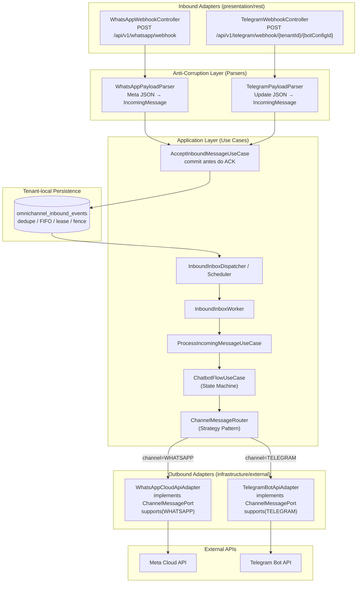

# ADR-0015 - Telegram Integration Architecture

- Date: 2026-05-30  
- Status: Accepted  
- Version: 1.6
- Authors / Owners: Architecture Team / AgentOrchestrator  
- Reviewers: Engineering Team  
- Stakeholders: Product, Engineering  

---

# 1. Context

O Contador Fiscal Inteligente atualmente fornece integração exclusiva com o WhatsApp (ADR-0004) para permitir que os clientes finais interajam com o sistema, validem acesso (via Documento), consultem situação fiscal e, futuramente, emitam DARF. Toda a lógica da máquina de estados do chatbot, validação de acesso e persistência de conversas está fortemente acoplada ao módulo `whatsapp`.

Como o sistema tem o objetivo de ser agnóstico e oferecer suporte omnichannel (múltiplos canais de entrada), surgiu a necessidade de integrar o Telegram. O Telegram oferece uma API de Bots robusta, gratuita e amplamente utilizada, servindo como uma alternativa viável e de baixo custo comparada ao modelo de precificação do WhatsApp Business API (WABA).

A introdução de um novo canal exige que repensemos como a lógica do chatbot interage com as plataformas de mensageria para evitar a duplicação de código e garantir que novos canais (como Web Chat ou MS Teams) possam ser adicionados no futuro com esforço mínimo.

### 1.1. Acoplamento Identificado no Código Atual

Com base na análise do código-fonte, os seguintes pontos de acoplamento ao WhatsApp foram identificados:

| Camada | Arquivo | Acoplamento |
|---|---|---|
| **Domain** | `Conversation.java` | Campo `phoneNumberId` (WhatsApp-específico) |
| **Domain** | `Message.java` | Mensagem de erro referenciando "limite do WhatsApp" |
| **Application** | `WhatsAppMessagePort.java` | Nome da interface e Javadoc referenciam WABA |
| **Application** | `ChatbotFlowUseCase.java` | Injeção direta de `WhatsAppMessagePort` (sem abstração) |
| **Application** | `HandleFiscalQueryResultUseCase.java` | Campo `whatsAppMessagePort` |
| **Application** | `InitiateFiscalQueryUseCase.java` | Campo `whatsAppMessagePort` |
| **Infrastructure** | `WhatsAppMetaCloudApiAdapter.java` | `implements WhatsAppMessagePort` |

---

# 2. Decision Statement

O sistema suportará a integração com o Telegram através da refatoração do domínio do chatbot atual para um modelo agnóstico de canal (Omnichannel). 

1. A lógica core do chatbot (State Machine, Conversation, Message, AccessValidation) será desacoplada de detalhes específicos do WhatsApp.
2. Criaremos adaptadores específicos para cada canal de entrada (`presentation/rest/WhatsAppWebhookController` e `presentation/rest/TelegramWebhookController`) para lidar com Webhooks.
3. Criaremos uma porta de saída agnóstica (`ChannelMessagePort`) com implementações específicas (`WhatsAppCloudApiAdapter` e `TelegramBotApiAdapter`) para enviar mensagens, selecionadas dinamicamente via **Strategy Pattern**.

---

# 3. Decision Drivers

- **Suporte Multi-canal:** Necessidade de atender usuários em plataformas alternativas.
- **Redução de Custos:** A API do Telegram é gratuita, ao contrário do modelo pago (WABA) do WhatsApp.
- **Reusabilidade de Código:** Evitar a duplicação da complexa máquina de estados do chatbot (ADR-0004).
- **Extensibilidade:** Facilitar a adição de futuros canais de atendimento (ex: Web Chat, Teams, Slack).
- **Clean Architecture:** Manter o core de negócios isolado de detalhes de infraestrutura e plataformas externas.

---

# 4. Considered Options

### Option 1: Criar um módulo `telegram` totalmente isolado
Description: Duplicar a lógica do módulo `whatsapp` em um novo módulo `telegram`, possuindo sua própria máquina de estados, tabelas e regras.

Pros:
- Menor impacto e risco no módulo WhatsApp existente.
- Isolamento total entre as integrações.

Cons:
- Alta duplicação de código.
- Inconsistência na evolução do chatbot (uma melhoria no fluxo teria que ser implementada duas vezes).
- Aumento de complexidade na manutenção.

### Option 2: Generalizar o módulo `whatsapp` para um módulo `conversations` (Omnichannel)
Description: Renomear o módulo `whatsapp` para `conversations` ou `chatbot`, extraindo detalhes de provedor para a borda (adapters) e tornando as entidades `Conversation` e `Message` agnósticas de canal (adicionando um campo `channel_type`).

Pros:
- Única fonte de verdade para a máquina de estados e fluxos de conversa.
- Banco de dados unificado para histórico de interações, independentemente do canal.
- Arquitetura limpa, aderente ao princípio Open-Closed (aberto para novos canais, fechado para modificação no core).

Cons:
- Maior esforço inicial de refatoração do módulo existente.
- Migrações complexas de banco de dados (Flyway) para renomear e adequar tabelas atuais do WhatsApp.

### Option 3: Utilizar Event-Driven Architecture (EDA) com módulo Central de Chatbot
Description: O módulo `chatbot` recebe eventos genéricos `MessageReceivedEvent` e publica `SendMessageCommand`. Os módulos `whatsapp` e `telegram` agem apenas como tradutores (gateways) entre a API externa e os eventos do sistema.

Pros:
- Desacoplamento máximo entre o motor do chatbot e os canais de comunicação.
- Escalabilidade independente por canal.

Cons:
- Aumenta a complexidade arquitetural (eventual consistency e debug de fluxos assíncronos).

---

# 5. Decision Outcome

**A Opção 2 foi a escolhida**, com elementos da Opção 3. 

Transformaremos o atual módulo `whatsapp` em um módulo de domínio genérico (ex: `chatbot` ou `conversations`), adaptando a Clean Architecture para suportar múltiplos canais via Ports e Adapters. 
As entidades `Conversation` e `Message` ganharão uma propriedade `channel` (`WHATSAPP`, `TELEGRAM`). O `ChatbotFlowUseCase` passará a operar de forma completamente agnóstica ao canal. A identidade de conversa não será reduzida ao contato: a chave conceitual canônica é `tenantId + channel + channelAccountId + remoteId`.

Para a recepção de mensagens, teremos controllers separados (`TelegramWebhookController` e `WhatsAppWebhookController`) que padronizam o payload recebido e acionam o mesmo `ProcessIncomingMessageUseCase`. Para o envio, utilizaremos uma interface `ChannelMessagePort` que terá implementações distintas (via `TelegramBotApiAdapter` e `WhatsAppCloudApiAdapter`) selecionadas dinamicamente com base no `channel` da conversa.

### 5.1. Nomenclatura Padronizada

Para evitar ambiguidade entre este ADR, o Implementation Plan e o código, a seguinte nomenclatura é canônica:

| Conceito | Nome Canônico | Nomes Descartados |
|---|---|---|
| Porta de saída genérica | `ChannelMessagePort` | ~~MessageSenderPort~~, ~~WhatsAppMessagePort~~ |
| Adapter WhatsApp (saída) | `WhatsAppCloudApiAdapter` | ~~WhatsAppMetaCloudApiAdapter~~ (será renomeado) |
| Adapter Telegram (saída) | `TelegramBotApiAdapter` | ~~TelegramMessageAdapter~~ |
| Parser WhatsApp (entrada) | `WhatsAppPayloadParser` | ~~WebhookPayloadParser~~ |
| Parser Telegram (entrada) | `TelegramPayloadParser` | — |
| Identificador da conta no canal | `channelAccountId` | ~~phoneNumberId~~ |
| Identificador do contato/chat remoto | `remoteId` | `remoteNumber`, `remotePhone` quando usados como identidade genérica |
| Enum de canal | `ChannelType` | — |
| Router (Strategy) | `ChannelMessageRouter` | — |

### 5.2. Diagrama de Arquitetura Omnichannel



### 5.3. Identidade de Conversa e Lifecycle da Conta

O endereço lógico de uma conversa é a tupla:

```text
(tenantId, channel, channelAccountId, remoteId)
```

- `tenantId` define o boundary de dados;
- `channel` define o protocolo/adaptador;
- `channelAccountId` define qual bot, número ou conta do tenant recebe e envia;
- `remoteId` define o contato/chat dentro daquela conta.

O mesmo `remoteId` pode conversar com mais de uma conta do mesmo canal sem compartilhar sessão ou
histórico. Consequentemente, repository lookup, índice/constraint aplicável, deduplicação contextual,
cache e testes devem preservar os quatro componentes. O lookup account-aware e o índice de apoio V31
materializam essa decisão; dados históricos anteriores à correção ainda exigem lifecycle explícito.

A deduplicação respeita os domínios de unicidade do Telegram: inbound persiste
`botConfigId + update_id`; outbound persiste `botConfigId + SHA-256(chat_id)[96 bits] + message_id`. IDs brutos não são
globais e não podem alimentar diretamente a constraint omnichannel.

Configuração de canal é parte do lifecycle da conversa, não apenas uma credencial substituível. Delete
ou recreate que gere outro `channelAccountId` deve adotar uma política explícita antes da remoção:

1. bloquear a exclusão enquanto houver conversa ativa;
2. migrar somente conversas da mesma conta lógica, com auditoria e verificação;
3. ou encerrar as sessões antigas e iniciar novas conversas.

Nunca se deve reutilizar uma conversa apenas porque `tenantId + channel + remoteId` coincidem. Antes do
lookup account-aware, o webhook novo reutilizava a referência órfã e o outbound falhava ao resolver a
credencial pelo ID antigo. A correção isola novos inbounds; o lifecycle da referência histórica continua
obrigatório. Consulte [LL-BE-00088](../delivery/lessons-learned/backend/LL-BE-00088-conversation-identity-includes-channel-account.md).

### 5.4. Lifecycle e Reconciliação do Webhook

- `APP_BASE_URL` deve ser uma origem pública HTTPS válida;
- create/update/delete da configuração executam na transação tenant e só agendam a operação remota
  after-commit;
- o domínio gera o secret do webhook e o rotaciona quando o bot token muda, sem aceitar um secret
  fornecido pelo cliente como substituto nessa troca;
- cada tarefa recarrega a configuração atual antes de agir e usa lock local por config para evitar
  operações concorrentes no mesmo processo;
- sucesso exige `setWebhook ok=true` e confirmação exata por `getWebhookInfo.url`;
- `ApplicationReady` e um scheduler periódico configurável reconciliam configs ativas idempotentemente;
- desativação/exclusão agenda `deleteWebhook` after-commit em best effort;
- na troca de token, o delete do token antigo é tentado primeiro, mas sua falha não impede o registro
  prioritário do token/secret atuais;
- as operações usam executor dedicado, fila limitada e timeouts HTTP de conexão/leitura;
- `telegram.webhook.operations{operation,outcome}` expõe `register`, `replace` e `delete`, incluindo
  `success`, `partial_success`, `failure` e `skipped`, sem registrar tokens, secrets ou mensagens de
  exceção que possam contê-los.

Esse control plane ainda é memória de processo: não há tombstone/outbox durável para repetir
`deleteWebhook` de config desativada/excluída, e o lock local não coordena múltiplas réplicas. A topologia
de deploy atual mantém uma única réplica do backend; qualquer scale-out exige antes claim/lease ou lock
distribuído e uma estratégia durável de retry.

### 5.5. Extensão por inbox durável tenant-local

O [ADR-0054](ADR-0054-omnichannel-tenant-local-durable-inbox.md) estende esta
decisão sem criar outro core conversacional. Após autenticar e normalizar, o
controller persiste o envelope no banco dedicado do tenant. Insert novo ou
duplicata já durável permitem o ACK; falha de rota/commit retorna erro transitório.
O control plane do WhatsApp guarda somente `(wabaId, phoneNumberId) -> tenantId` e
nunca recebe conteúdo, remote ID ou callback.

O ACK não depende do executor. Um wake-up pós-commit é best-effort e o scheduler
tenant-scoped é a recuperação autoritativa. O worker reclama somente a cabeça
elegível da conversa com `FOR UPDATE SKIP LOCKED`, lease e fencing; contenção em
conversa, admissão ou PostgreSQL falha imediatamente com estágio tipado e volta à
inbox com backoff. Outcome inesperado ou posterior ao checkpoint vai para revisão,
sem replay cego de efeito fiscal.

Essa extensão cobre mensagens conversacionais Telegram e WhatsApp. Receipts
WhatsApp continuam fora do primeiro recorte. A implementação local candidata do
`IP-BE-3.2.12-omnichannel-durable-inbound-processing` não altera o status deste ADR nem comprova os critérios ainda
pendentes do [REQ-00050](../product/requirements/REQ-00050-omnichannel-durable-inbound-processing.md).

---

# 6. Consequences

**Positive Consequences:**
- Unificação total da lógica de atendimento, simplificando manutenções e evolução do chatbot.
- Nova opção de canal gratuita para os tenants, reduzindo custos operacionais.
- Fundação pronta para a adição de qualquer outro canal de texto no futuro.

**Negative Consequences:**
- Necessidade de refatoração do módulo atual e migrações estruturais de banco de dados (`phone_number_id` → `channel_account_id`).
- A tabela `whatsapp_phone_numbers` permanecerá com escopo WhatsApp-específico. Uma nova tabela `telegram_bot_configs` será criada para o Telegram.
- Exclusão/recriação de conta exige tratamento de referências; apagar somente a config pode deixar conversas órfãs e interromper o outbound.

**Neutral Consequences:**
- O esquema de validação de acesso precisará generalizar `phone_number` para `channel_remote_id` e adicionar `channel_type` à tabela `access_validations`, mapeando o `chat_id` do Telegram de forma análoga ao `phoneNumber` do WhatsApp.

---

# 7. Impact

- **Architecture:** O bounded context do WhatsApp evoluirá para um contexto Omnichannel. A porta de saída `WhatsAppMessagePort` será substituída por `ChannelMessagePort` com Strategy Pattern (`ChannelMessageRouter`) para seleção dinâmica do adapter. O `ChatbotFlowUseCase` (154 linhas, 10 referências à porta antiga) será refatorado para usar o router.
- **Data architecture:** Atualização das tabelas para suportar `channel_type` (`WHATSAPP`, `TELEGRAM`) e identificadores agnósticos (de `phone_number_id` para `channel_account_id`). Flyway V2 migration adicionará coluna `channel_type` em `conversations` e `messages`. Nova tabela `telegram_bot_configs`.
- **Security:** O endpoint público usa IDs técnicos no path `/api/v1/telegram/webhook/{tenantId}/{botConfigId}` para roteamento e valida o segredo recebido no header `X-Telegram-Bot-Api-Secret-Token` em tempo constante. O `SecurityConfig` libera o endpoint sem JWT, mas a autenticidade continua obrigatória no caso de uso.
- **Resilience (ADR-0011):** O outbound de mensagens usa a instância Resilience4j `telegram`; as operações de lifecycle do webhook usam executor dedicado limitado e timeouts HTTP configuráveis. Esses mecanismos não equivalem a uma fila durável.
- **Inbound resilience (ADR-0054):** A inbox tenant-local é a autoridade de
  custódia e recuperação; wake-up in-memory não participa da semântica do ACK.
- **Observability (ADR-0012):** Novas métricas Micrometer com tag `channel` para unificar dashboards: `chatbot.messages.received.total{channel=TELEGRAM|WHATSAPP}`, `chatbot.messages.sent.total`, `chatbot.messages.errors.total`. Dashboards Grafana atualizados.
- **Audit (ADR-0006):** Ações auditáveis: `telegram:message_received`, `telegram:message_sent`, `telegram:access_denied`, `telegram:bot_configured`. Registros via `AuditPort` com `channel_type` nos details JSONB.
- **Plan Limits (ADR-0010 e REQ-00011):** Decisão de Produto resolvida em 2026-08-21: o recurso canônico é `max_chatbot_msg_daily`, aplicado como teto independente por `tenant_id + channel_type + billing_day`. WhatsApp e Telegram usam `CHATBOT_MSG`; atingir o limite em um canal não consome nem bloqueia a franquia do outro.

---

# 8. AI Agent Considerations (For Autonomous Agent Environments)

**Agent Roles Impacted:**
- **Architect Agent:** Responsável por guiar a refatoração das tabelas e pacotes para suportar o design agnóstico. Deve validar que o `ChannelMessagePort` respeita o ISP (Interface Segregation Principle).
- **Backend Agent:** Implementará o novo `TelegramWebhookController`, o `TelegramBotApiAdapter`, o `ChannelMessageRouter` e refatorará o `ChatbotFlowUseCase`.
- **QA Agent:** Garantir cobertura de testes para ambos os canais com cenários cross-channel e parametrização por `ChannelType`.

**Operational Considerations:**
- Durante a refatoração, o agente deve garantir que a integração atual com o WhatsApp não seja quebrada, utilizando os 78 testes unitários existentes como safety net.
- A migração de banco deve ser non-breaking (adicionar colunas com DEFAULT, não remover) para permitir rollback.

**Safety Considerations:**
- O Bot Token do Telegram é um segredo crítico — deve ser armazenado criptografado (similar ao `EncryptedStringConverter` do WhatsApp, LL-BE-00034).
- O token do bot e o secret do webhook não pertencem à URL. O path contém apenas tenant/config IDs; secrets não devem aparecer em logs, métricas, audit ou Traffic Inspector (PII/LL-BE-00031).
- HTTP `200` possui dois resultados válidos: no-op para update não processável ou
  custódia de mensagem processável após insert/duplicata durável. Ele nunca prova
  conclusão do worker, persistência do histórico conversacional nem outbound.
  Falha de rota/commit anterior à custódia retorna erro transitório para permitir
  replay convergente do provider.

**Lessons Learned Referências Obrigatórias:**
- [LL-BE-00031](../delivery/lessons-learned/backend/LL-BE-00031-pii-leak-via-exception-messages-audit.md) — PII Leak via Exception Messages (token no path da URL)
- [LL-BE-00034](../delivery/lessons-learned/backend/LL-BE-00034-aes-ecb-deterministic-encryption.md) — AES/ECB Encryption (usar AES/GCM para bot token)
- [LL-BE-00043](../delivery/lessons-learned/backend/LL-BE-00043-circuitbreaker-placement-adr-violation.md) — CircuitBreaker exclusivamente em `adapter.out.external`
- [LL-BE-00047](../delivery/lessons-learned/backend/LL-BE-00047-adapter-todomain-create-vs-reconstitute.md) — Usar `reconstitute()` nos mappers JPA
- [LL-BE-00048](../delivery/lessons-learned/backend/LL-BE-00048-webmvctest-securityconfig-default-fallback.md) — `@Import(SecurityConfig.class)` nos testes `@WebMvcTest`
- [LL-BE-00050](../delivery/lessons-learned/backend/LL-BE-00050-triple-audit-duplication-aop-service-event.md) — Evitar auditoria triplicada
- [LL-BE-00051](../delivery/lessons-learned/backend/LL-BE-00051-omnichannel-chatbot-refactoring.md) — Lições do Omnichannel Refactoring
- [LL-BE-00088](../delivery/lessons-learned/backend/LL-BE-00088-conversation-identity-includes-channel-account.md) — Identidade completa, ACK assíncrono e incidente de conversa órfã
- [LL-BE-00093](../delivery/lessons-learned/backend/LL-BE-00093-webhook-ack-is-not-worker-completion.md) — ACK como transferência de custódia, polling, checkpoint e retry seguro em qualquer canal

---

# 9. Implementation Plan

- **Phase 1 - Refactoring Core:** Adicionar `ChannelType` enum e `ChannelMessagePort` interface (com método `supports(ChannelType)`). Criar `ChannelMessageRouter` (Strategy). Refatorar `ChatbotFlowUseCase` para usar `ChannelMessageRouter` ao invés de `WhatsAppMessagePort`. Atualizar `Conversation` (`phoneNumberId` → `channelAccountId`, adicionar `ChannelType channel`). Flyway V2: `ALTER TABLE conversations ADD COLUMN channel_type`, `RENAME COLUMN phone_number_id TO channel_account_id`.
- **Phase 2 - Telegram Inbound:** Implementar `TelegramWebhookController` (endpoint canônico `POST /api/v1/telegram/webhook/{tenantId}/{botConfigId}` com secret no header) + `TelegramPayloadParser` para traduzir `Update` objects da Telegram Bot API em `IncomingMessage` genérico. Atualizar `SecurityConfig`.
- **Phase 3 - Telegram Outbound:** Criar `TelegramBotApiAdapter` (implementação de `ChannelMessagePort` com `supports(TELEGRAM)`) usando `RestClient` com Resilience4j (`@CircuitBreaker(name="telegram")`, `@RateLimiter(name="telegram")`).
- **Phase 4 - Validação & Testes:** Rodar testes de integração do Modulith e ArchUnit. Garantir que fluxos WhatsApp e Telegram funcionem simultaneamente. Testes parametrizados por `ChannelType`.
- **Extensão durável - IP-BE-3.2.12-omnichannel-durable-inbound-processing:** Persistir antes do ACK, executar por worker
  tenant-scoped e provar dedupe/FIFO/lease/fence/backoff em PostgreSQL, sem alterar
  a máquina de estados compartilhada.

**Rollback Plan:**
- Phase 1 é non-breaking (colunas novas com default). Rollback = remover a coluna `channel_type` e reverter rename.
- Phases 2-3 são aditivas (novos controllers/adapters). Rollback = remover os novos arquivos e desativar o endpoint no `SecurityConfig`.

**Implementation Plan Detalhado:** [IP-BE-3.1.9-omnichannel-telegram-integration.md](../delivery/plans/implementation_plans/backend/IP-BE-3.1.9-omnichannel-telegram-integration.md)

---

# 10. Validation

- **Architecture review:** Garantir via ArchUnit que os módulos de domínio do chatbot não conheçam detalhes do provedor (nem Telegram, nem Meta/WhatsApp). Especificamente: `domain.model` não importa nenhuma classe de `infrastructure.external`.
- **Performance benchmarks:** Validar que o tratamento de webhooks de múltiplos canais simultaneamente não cria gargalos. O `ChannelMessageRouter.resolve()` deve ter complexidade O(n) onde n = número de canais (atualmente 2).
- **Testes Manuais:** Validar um fluxo completo de acesso, menu e consulta fiscal utilizando o Telegram e verificar a geração correta do Audit Log (ADR-0006) com os identificadores do Telegram.
- **Cross-Channel/Account:** Verificar que conversas com canal ou `channelAccountId` distintos, inclusive para o mesmo tenant e `remoteId`, são isoladas e não compartilham estado de sessão.
- **Provider ID scope:** Repetir `update_id` em bots distintos e `message_id` em chats distintos não pode acionar deduplicação cruzada.
- **Configuration lifecycle:** Excluir/recriar config com conversa existente deve bloquear, migrar de forma auditada ou encerrar a sessão; nunca produzir referência órfã silenciosa.
- **Webhook reconciliation:** Provar a transação tenant, after-commit, fresh-state, startup/período,
  `setWebhook` + `getWebhookInfo`, prioridade do registro atual após falha no delete antigo, timeouts e
  métricas por outcome. Como gates futuros, provar tombstone/retry durável para delete e coordenação
  entre réplicas antes de scale-out.
- **Durable ACK:** Provar separadamente o no-op `200`, o ACK após insert/duplicata
  durável, o `503` anterior ao commit, a conclusão do worker e a entrega outbound.
  Provar também dedupe concorrente, FIFO por conversa, `SKIP LOCKED`, lease/fence,
  backoff tipado e recuperação após wake-up rejeitado/restart. O registry do Spring
  Modulith não é evidência dessa inbox. Esses gates permanecem pendentes no
  `REQ-00050` até a integração final.

---

# 11. Risks and Mitigations

**Risk 1:** Quebra da integração atual do WhatsApp durante a refatoração do core.
**Mitigation:** Abordagem iterativa. Primeiro criar as interfaces agnósticas (`ChannelMessagePort`, `ChannelMessageRouter`) e plugar o `WhatsAppCloudApiAdapter` existente como implementação sem alterar o banco. Só no segundo passo unificar as tabelas. Os 78 testes existentes servem como safety net.

**Risk 2:** Diferenças entre os modelos de mensagens do WhatsApp e do Telegram (ex: botões interativos, IDs de sessão).
**Mitigation:** Definir um modelo de `IncomingMessage` genérico interno e lidar com as peculiaridades e transformações de layout visual apenas nos Adapters periféricos (Anti-Corruption Layer). No WhatsApp, botões têm `payload` oculto. No Telegram, `ReplyKeyboardMarkup` envia o texto literal. O `TelegramPayloadParser` deve mapear texto → ID de ação.

**Risk 3:** Bot Token do Telegram vazado em logs ou audit trail.
**Mitigation:** Criptografia AES/GCM no banco (`EncryptedStringConverter`). Sanitização via `PiiMaskingConverter` para paths contendo `/telegram/webhook/`. Referências: LL-BE-00031, LL-BE-00034.

**Risk 4:** Configuração apagada/recriada deixa conversa apontando para `channelAccountId` inexistente.
**Mitigation:** Tratar a tupla completa como identidade, impedir delete órfão e cobrir rotação/recreate com teste de persistência e outbound. O ACK assíncrono deve possuir métrica/log de conclusão independente.

**Risk 5:** Custódia durável ser confundida com conclusão ou exactly-once; o worker
pode falhar depois do ACK e um efeito externo pode ter outcome incerto.
**Mitigation:** Métricas separadas de `persisted`/`processed`, polling autoritativo,
lease/fencing e checkpoint. Somente falha tipada anterior ao trabalho recebe
backoff; outcome incerto vai para revisão. Os gates integrados continuam pendentes.

**Risk 6:** Operação remota de desativação/exclusão pode falhar depois do commit local, e locks locais não
serializam processos diferentes.
**Mitigation:** A topologia atual fica restrita a uma réplica; tombstone/retry durável e coordenação
distribuída são pré-requisitos de qualquer scale-out ou garantia forte de remoção remota.

---

# 12. Related ADRs

- ADR-0001 Technology Stack and Architecture Foundation (Clean Architecture, Spring Modulith)
- ADR-0004 WhatsApp Integration Architecture (state machine, chatbot flow, domain model)
- ADR-0006 Audit and Compliance Strategy (audit entries para novo canal)
- ADR-0007 Multi-Provider LLM Integration Architecture (formatação de respostas por canal)
- ADR-0010 Tenant Plan Parametrization & Resource Limits (limites de mensagens por canal)
- ADR-0011 Resilience: Retry, Circuit Breaker & Fault Tolerance (proteção da Telegram Bot API)
- ADR-0012 Error Handling & Observability (métricas e logs do novo canal)
- ADR-0054 Omnichannel Tenant-local Durable Inbox (custódia anterior ao ACK e worker recuperável)

---

# 13. References

- [Telegram Bot API Documentation](https://core.telegram.org/bots/api)
- [Telegram Bot API — setWebhook](https://core.telegram.org/bots/api#setwebhook)
- [Telegram Bot API — Update object](https://core.telegram.org/bots/api#update)
- Enterprise Integration Patterns — Channel Adapters (Hohpe & Woolf)
- [IP-BE-3.1.9-omnichannel-telegram-integration — Implementation Plan](../delivery/plans/implementation_plans/backend/IP-BE-3.1.9-omnichannel-telegram-integration.md)
- [LL-BE-00051 — Lesson Learned](../delivery/lessons-learned/backend/LL-BE-00051-omnichannel-chatbot-refactoring.md)
- [LL-BE-00088 — Lesson Learned](../delivery/lessons-learned/backend/LL-BE-00088-conversation-identity-includes-channel-account.md)
- [REQ-00050 — Processamento inbound durável omnichannel](../product/requirements/REQ-00050-omnichannel-durable-inbound-processing.md)
- [ADR-0054 — Inbox durável omnichannel no banco do tenant](ADR-0054-omnichannel-tenant-local-durable-inbox.md)
- [LL-BE-00093 — ACK de webhook não é conclusão do worker](../delivery/lessons-learned/backend/LL-BE-00093-webhook-ack-is-not-worker-completion.md)

---

# 14. Decision Lifecycle

Accepted  
The ADR has been approved. Clarificações versionadas podem registrar evidência operacional sem reverter
a decisão arquitetural.

---

# 15. Change Log

Version: 1.0  
Date: 2026-05-30  
Author: AgentOrchestrator  
Changes:
- Initial ADR creation

Version: 1.1  
Date: 2026-05-30  
Author: AgentOrchestrator  
Changes:
- Status changed from Proposed to Accepted
- Added Observability and Audit impacts (Section 7)
- Added Safety Considerations and QA Agent role (Section 8)
- Added Rollback Plan (Section 9)
- Added missing Related ADRs: ADR-0001, ADR-0006, ADR-0012 (Section 12)

Version: 1.2  
Date: 2026-05-31  
Author: AgentOrchestrator  
Changes:
- Added Section 1.1 (Current State Analysis — tabela de acoplamentos no código)
- Corrigida inconsistência de nomenclatura: padronizado `ChannelMessagePort` (substituiu `MessageSenderPort` da Seção 2) e `TelegramBotApiAdapter` (substituiu `TelegramMessageAdapter` da Seção 9)
- Added Section 5.1 (Nomenclatura Padronizada — tabela canônica de nomes)
- Added Section 5.2 (Diagrama de Arquitetura Omnichannel — Mermaid)
- Added ADR-0010 às Related ADRs (limites de plano por canal)
- Added referências cruzadas para Lessons Learned (LL-BE-00031, LL-BE-00034, LL-BE-00043, LL-BE-00047, LL-BE-00048, LL-BE-00050, LL-BE-00051) na Seção 8
- Added link para IP-BE-3.1.9-omnichannel-telegram-integration na Seção 9
- Detalhamento dos impactos em Plan Limits (Seção 7)
- Expandida Seção 11 (Risks) com Risk 3 (Bot Token leak)
- Added referências técnicas do Telegram (setWebhook, Update object) na Seção 13

Version: 1.3
Date: 2026-08-18
Author: Codex
Changes:
- Formalizada a identidade `tenantId + channel + channelAccountId + remoteId`
- Registrado o lifecycle obrigatório de delete/recreate da conta e o risco de conversa órfã
- Documentados IDs Telegram escopados e reconciliação verificada de webhooks
- Atualizado o endpoint canônico para IDs no path e secret no header
- Distinguido ACK HTTP `200` de conclusão assíncrona, persistência e entrega
- Adicionada referência à LL-BE-00088

Version: 1.4
Date: 2026-08-18
Author: Codex
Changes:
- Alinhado o lifecycle à transação tenant, rotação de secret, fresh-state, lock local, executor dedicado e timeouts
- Documentada a prioridade do registro atual após delete antigo best-effort e a observabilidade secret-safe
- Registrados como gates futuros a inbox inbound, o retry durável de delete e a coordenação entre réplicas
- Clarificada a dupla semântica do `200` e a ausência de retry Telegram após falha assíncrona

Version: 1.5
Date: 2026-08-21
Author: Produto / Codex
Changes:
- Resolvida a decisão de limites de plano: `max_chatbot_msg_daily` substitui o nome WhatsApp-específico e aplica teto diário independente por canal conversacional.

Version: 1.6
Date: 2026-08-29
Author: Codex
Changes:
- Reconciliada a integração Telegram com a extensão ADR-0054: commit tenant-local
  anterior ao ACK, dedupe/FIFO/claim/lease/fencing e worker recuperável.
- Separados custódia, conclusão e outbound; coordenação tipada retorna à inbox sem
  replay cego e receipts WhatsApp permanecem fora do recorte.
- Referenciados REQ-00050 e LL-BE-00093 sem declarar seus gates concluídos.
