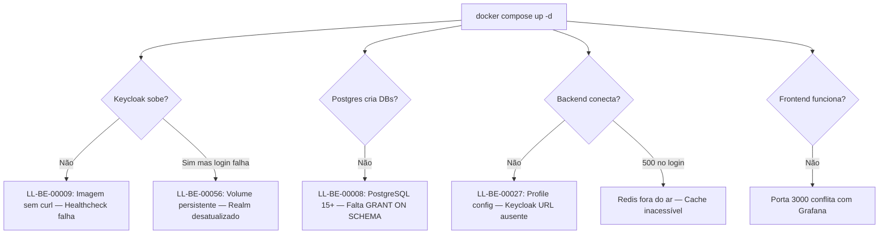
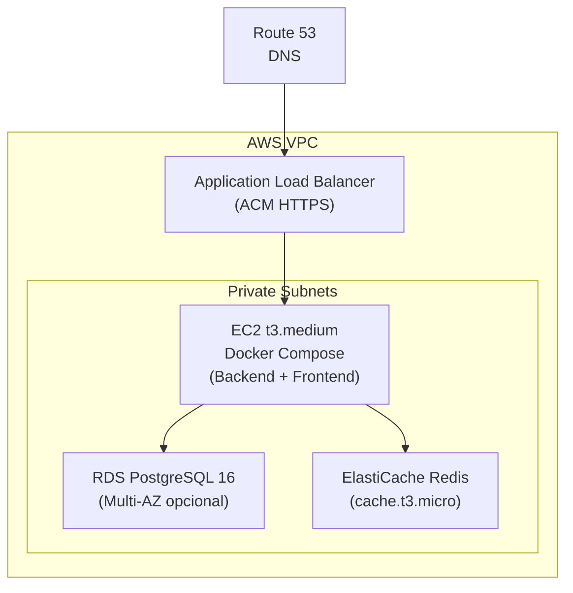

# ADR-0016 — Infrastructure Environment Provisioning

- Date: 2026-06-12 (local lifecycle reconciled 2026-09-05)
- Status: Partially Superseded
- Version: 1.7
- Authors / Owners: DevOps-Agent, AgentOrchestrator
- Reviewers: ArquitetoHexagonal, ImplementerCore
- Stakeholders: Engineering Team, Startup Founders
- Supersedes: REQ-00006-telegram-chatbot-local-setup (deprecated)
- VPS production procedure superseded by: [Deploy de produção em VPS](../onboarding/production-vps-deployment.md)
- Local reset procedure superseded by: [ADR-0056](ADR-0056-global-docker-development-reset.md)

---

> [!CAUTION]
> As decisões históricas de desenvolvimento local e evolução futura deste ADR permanecem como referência. Todos os comandos de **VPS/produção**, Caddy, reset de Keycloak, backup e `docker compose down -v` abaixo estão superseded e não podem ser usados em produção. O único procedimento operacional vigente é o [runbook de produção](../onboarding/production-vps-deployment.md), baseado em Nginx e `deploy-production.sh`.
>
> Para desenvolvimento local, a preparação vigente do acesso Docker está no
> [guia de bootstrap do host](../onboarding/local-development-host-bootstrap.md).
> Receitas manuais ou fallback `sudo docker compose` não substituem esse fluxo.

# 1. Context

O projeto Contador Fiscal Inteligente opera com uma stack de infraestrutura composta por **9 serviços Docker** (PostgreSQL App, PostgreSQL Keycloak, Keycloak, Redis, Prometheus, Alertmanager, Loki, Grafana) além do Backend (Spring Boot) e Frontend (Next.js). A correta inicialização desses serviços é pré-condição para qualquer atividade de desenvolvimento ou deploy.

**Problemas identificados:**

1. **Bloqueios recorrentes no setup local:** Desenvolvedores enfrentam ciclos de "setup → falha → pesquisa → tentativa" a cada novo clone ou troca de branch. As 8 Lessons Learned de infraestrutura (../delivery/lessons-learned/backend/LL-BE-00008-postgresql-15-schema-grants.md), [LL-BE-00009](../delivery/lessons-learned/backend/LL-BE-00009-keycloak-health-check-no-curl.md), [LL-BE-00010](../delivery/lessons-learned/backend/LL-BE-00010-dev-credentials-externalization.md), [LL-BE-00011](../delivery/lessons-learned/backend/LL-BE-00011-docker-compose-root-placement.md), [LL-BE-00026](../delivery/lessons-learned/backend/LL-BE-00026-alertmanager-invalid-discord-configs.md), [LL-BE-00027](../delivery/lessons-learned/backend/LL-BE-00027-profile-config-fragmentation.md), [LL-BE-00056](../delivery/lessons-learned/backend/LL-BE-00056-keycloak-local-volume-persistence.md)) documentam problemas reais que se repetiram múltiplas vezes.

2. **Ausência de documentação para VPS/Cloud:** O [ADR-0001](ADR-0001-technology-stack-and-architecture.md) define "VPS única com Docker Compose" como estratégia de deploy, mas nenhum documento detalha **como** provisionar essa VPS nem os pré-requisitos de hardware/software.

3. **Documento REQ-00006 inadequado:** O [REQ-00006-telegram-chatbot-local-setup](../product/requirements/REQ-00006-telegram-chatbot-local-setup.md) é classificado como "Requisito" mas funciona como guia parcial de setup. Cobre apenas Telegram/Ngrok, ignora os outros 8 serviços de infraestrutura, e não incorpora as Lessons Learned.

4. **Conflito de porta Grafana vs Frontend:** O `docker-compose.yml` expõe o Grafana na porta `3000`, a mesma porta padrão do Next.js, impossibilitando a execução simultânea do frontend e dos dashboards.

5. **Evolução para cloud não documentada:** A estratégia de quando e como migrar de VPS para AWS não possui nenhum registro formal.



---

# 2. Decision Statement

O projeto adotará um **documento único de provisionamento de infraestrutura** (este ADR) cobrindo três ambientes-alvo:

1. **Local (Linux/Ubuntu 22.04+)** — Ambiente de desenvolvimento
2. **VPS Hostinger (Ubuntu 22.04 VPS)** — Primeiro target de produção (zero cloud cost)
3. **AWS (Evolução Futura)** — Target de escala quando triggers forem atingidos

O documento consolida todos os pré-requisitos, procedimentos de startup, troubleshooting unificado, e referências às Lessons Learned existentes. O REQ-00006-telegram-chatbot-local-setup será formalmente **deprecated** em favor deste ADR.

---

# 3. Decision Drivers

- **Redução de tempo de onboarding:** Novos desenvolvedores devem levantar toda a infra em <15min seguindo um checklist único.
- **Eliminação de bloqueios recorrentes:** Incorporar os 8+ LLs de infraestrutura num troubleshooting consolidado.
- **Documento único:** Evitar 70%+ de duplicação que existiria em 3 documentos separados (os serviços são idênticos — só muda onde rodam).
- **Decisão arquitetural:** Provisionamento de infraestrutura é uma decisão arquitetural (impacta deploy, segurança, custo), não um requisito funcional.
- **Evolução planejada:** Documentar a estratégia VPS → AWS num registro formal de decisão.

---

# 4. Stack de Infraestrutura Comum

Todos os ambientes compartilham os mesmos serviços. A diferença está em **como** são orquestrados.

| Serviço | Imagem Docker | Porta Interna | Porta Host (Local) | Banco/Volume | Finalidade |
|:---|:---|:---:|:---:|:---|:---|
| PostgreSQL (App) | `postgres:16-alpine` | 5432 | 5432 | `postgres-app-data` | 5 databases por bounded context (ADR-0002) |
| PostgreSQL (KC) | `postgres:16-alpine` | 5432 | 5433 | `postgres-kc-data` | Banco isolado do Keycloak |
| Keycloak | `quay.io/keycloak/keycloak:26.2` | 8080 | 8180 | — | Identity Provider (ADR-0005) |
| Redis | `redis:7-alpine` | 6379 | 6379 | `redis-data` | Cache de sessões e dados transientes |
| Prometheus | `prom/prometheus:v2.52.0` | 9090 | 9090 | `prometheus-data` | Métricas (ADR-0012) |
| Alertmanager | `prom/alertmanager:v0.27.0` | 9093 | 9093 | `alertmanager-data` | Roteamento de alertas |
| Loki | `grafana/loki:3.0.0` | 3100 | 3100 | `loki-data` | Agregação de logs |
| Grafana | `grafana/grafana:11.0.0` | 3000 | **3001** | `grafana-data` | Dashboards de observabilidade |
| Backend | `ghcr.io/duoset/saas-backend:latest` | 8080 | 8080 | — | Aplicação Java (Spring Boot) |
| Frontend | Dev server (Next.js) | 3000 | 3000 | — | Web Client (React) |

> [!IMPORTANT]
> **Resolução de conflito de porta:** A porta do Grafana foi alterada de `3000:3000` para `3001:3000` no `docker-compose.yml` para evitar conflito com o frontend Next.js que utiliza a porta 3000.

### Databases (PostgreSQL App — ADR-0002)

O script `infra/db/init-databases.sql` cria 4 bancos adicionais além do default:

| Database | Bounded Context | Criado por |
|:---|:---|:---|
| `saas_tenant` | Tenant Management | `POSTGRES_DB` env var (default) |
| `saas_certificate` | Certificate Management | `init-databases.sql` |
| `saas_fiscal` | Fiscal Integration | `init-databases.sql` |
| `saas_billing` | Billing | `init-databases.sql` |
| `saas_whatsapp` | Omnichannel (WhatsApp/Telegram) | `init-databases.sql` |

### Keycloak Realm

O realm de desenvolvimento é importado automaticamente a partir de `infra/keycloak/saas-dev-realm.json` na primeira inicialização do container.

> [!WARNING]
> **LL-BE-00056:** O Keycloak **NÃO re-importa** o realm se o banco já existir no volume persistente. Se o arquivo `saas-dev-realm.json` for atualizado (novos usuários, roles), é necessário **destruir o volume** do PostgreSQL do Keycloak antes de recriar. Veja Seção 8 — Troubleshooting.

---

# 5. Pré-requisitos por Ambiente

## 5.1 — Local (Linux / Ubuntu 22.04+)

### Bootstrap canônico antes do Compose

O acesso ao daemon pertence ao provisionamento do host e deve estar resolvido
antes do primeiro Compose. O bootstrap local versionado:

1. exige usuário regular e opt-in explícito para o grupo `docker` root-equivalent;
2. valida Docker/Compose, endpoint Unix local, grupo e socket `root:docker 0660`;
3. usa associação aditiva/idempotente e valida `docker info` em processo novo;
4. pode continuar um entrypoint DEV allowlisted nessa sessão renovada;
5. não lê secrets, não executa Compose como root e não usa `chmod 666`, ACL,
   `sudo -E`, `sudo docker compose` ou sudoers como atalho.

O procedimento executável e suas limitações estão no
[guia local](../onboarding/local-development-host-bootstrap.md). Alterar o arquivo de
grupos não modifica retroativamente um shell, IDE ou agente já aberto; a
continuação usa uma sessão-filho nova e os demais processos precisam ser reabertos
uma única vez. Instalação/migração de Docker ou mudança de distribuição permanece
fora deste incremento.

### Hardware Mínimo

| Recurso | Mínimo | Recomendado |
|:---|:---:|:---:|
| RAM | 8 GB | 16 GB |
| CPU | 2 cores | 4 cores |
| Disco | 20 GB livres | 40 GB SSD |

**Distribuição de memória estimada:**
- Docker containers (todos): ~3-4 GB
- JVM Backend (`-Xmx768m`): ~1 GB
- Node.js Frontend: ~500 MB
- IDE + SO: ~2-3 GB

### Software Obrigatório

| Software | Versão Mínima | Comando de Verificação | Instalação |
|:---|:---|:---|:---|
| Docker Engine | 24.0+ | `docker --version` | [docs.docker.com/engine/install/ubuntu](https://docs.docker.com/engine/install/ubuntu/) |
| Docker Compose | v2.20+ (plugin) | `docker compose version` | Incluído no Docker Engine |
| Java (JDK) | 25 | `java --version` | Selecionar uma distribuição Java 25 suportada via SDKMAN conforme ADR-0053. |
| Node.js | 20 LTS | `node --version` | `nvm install 20` |
| npm | 10+ | `npm --version` | Incluído no Node.js |
| Git | 2.34+ | `git --version` | `sudo apt install git` |

### Software Opcional

| Software | Quando Necessário | Instalação |
|:---|:---|:---|
| Ngrok | Desarrollo com Webhooks (Telegram/WhatsApp) | `snap install ngrok` ou [ngrok.com/download](https://ngrok.com/download) |
| SDKMAN | Gestão de versões Java | `curl -s "https://get.sdkman.io" \| bash` |
| nvm | Gestão de versões Node.js | `curl -o- https://raw.githubusercontent.com/nvm-sh/nvm/v0.39.7/install.sh \| bash` |

### Portas que Devem Estar Livres

```
3000  — Frontend (Next.js)
3001  — Grafana (Dashboards)
3100  — Loki (Log aggregation)
5432  — PostgreSQL App
5433  — PostgreSQL Keycloak
6379  — Redis
8080  — Backend (Spring Boot)
8180  — Keycloak (Identity Provider)
9090  — Prometheus (Métricas)
9093  — Alertmanager
```

**Verificação rápida de portas ocupadas:**
```bash
sudo ss -tlnp | grep -E ':(3000|3001|3100|5432|5433|6379|8080|8180|9090|9093)\b'
```

### Checklist de Verificação Rápida

Execute o bootstrap canônico antes deste checklist. Os comandos abaixo são
somente verificações e não devem possuir fallback privilegiado.

```bash
#!/bin/bash
# Executar antes do primeiro "docker compose up"

echo "=== Checklist de Pré-requisitos ==="

echo -n "Docker Engine: "; docker --version 2>/dev/null || echo "❌ NÃO INSTALADO"
echo -n "Docker Compose: "; docker compose version 2>/dev/null || echo "❌ NÃO INSTALADO"
echo -n "Java: "; java --version 2>&1 | head -1 || echo "❌ NÃO INSTALADO"
echo -n "Node.js: "; node --version 2>/dev/null || echo "❌ NÃO INSTALADO"
echo -n "npm: "; npm --version 2>/dev/null || echo "❌ NÃO INSTALADO"
echo -n "Git: "; git --version 2>/dev/null || echo "❌ NÃO INSTALADO"

echo ""
echo "=== Portas Ocupadas (deve estar vazio) ==="
sudo ss -tlnp | grep -E ':(3000|3001|3100|5432|5433|6379|8080|8180|9090|9093)\b' || echo "✅ Todas as portas livres"
```

---

## 5.2 — VPS Hostinger (Ubuntu 22.04 VPS)

> [!WARNING]
> **Seção histórica — não executar.** O provisionamento atual usa [bootstrap Ubuntu e GitHub Actions](../onboarding/github-production-cicd.md) e o [runbook incremental de produção](../onboarding/production-vps-deployment.md). Eles substituem integralmente Caddy, o instalador de conveniência do Docker e os comandos Compose desta seção.

### Plano Mínimo Recomendado

| Recurso | Mínimo Viável | Recomendado |
|:---|:---:|:---:|
| Tipo | KVM VPS | KVM VPS |
| vCPU | 2 | 4 |
| RAM | 4 GB | 8 GB |
| SSD | 80 GB | 120 GB |
| Banda | 4 TB/mês | 8 TB/mês |
| SO | Ubuntu 22.04 LTS | Ubuntu 22.04 LTS |

### Pré-requisitos de Instalação

```bash
# 1. Atualizar e instalar dependências base
sudo apt update && sudo apt upgrade -y
sudo apt install -y curl git ufw fail2ban

# 2. Docker Engine + Docker Compose
curl -fsSL https://get.docker.com | sudo sh
sudo usermod -aG docker $USER
# Logout e login novamente para aplicar grupo docker

# 3. Caddy (Reverse Proxy + HTTPS automático via Let's Encrypt)
sudo apt install -y debian-keyring debian-archive-keyring apt-transport-https
curl -1sLf 'https://dl.cloudsmith.io/public/caddy/stable/gpg.key' | sudo gpg --dearmor -o /usr/share/keyrings/caddy-stable-archive-keyring.gpg
curl -1sLf 'https://dl.cloudsmith.io/public/caddy/stable/debian.deb.txt' | sudo tee /etc/apt/sources.list.d/caddy-stable.list
sudo apt update && sudo apt install -y caddy

# 4. Swap (Prevenir OOM Killer em VPS de 4GB)
sudo fallocate -l 2G /swapfile
sudo chmod 600 /swapfile
sudo mkswap /swapfile
sudo swapon /swapfile
echo '/swapfile none swap sw 0 0' | sudo tee -a /etc/fstab

# 5. Java 25 (se backend rodar fora do Docker)
curl -s "https://get.sdkman.io" | bash
source "$HOME/.sdkman/bin/sdkman-init.sh"
sdk list java  # selecionar um identificador Java 25 suportado
```

### Firewall (ufw)

```bash
sudo ufw default deny incoming
sudo ufw default allow outgoing
sudo ufw allow 22/tcp    # SSH
sudo ufw allow 80/tcp    # HTTP (Caddy redirect → HTTPS)
sudo ufw allow 443/tcp   # HTTPS (Caddy + Let's Encrypt)
sudo ufw enable
```

> [!CAUTION]
> **NUNCA exponha** as portas 5432, 5433, 6379, 8080, 8180, 9090, 9093 diretamente na internet. Todos os serviços internos são acessados via Caddy (reverse proxy) ou exclusivamente pela rede Docker interna.

### DNS

- Criar registro `A` apontando `app.seudominio.com.br` → IP da VPS
- Opcional: `grafana.seudominio.com.br` → mesmo IP (Caddy roteará)

### Caddy Configuration (Caddyfile)

```
app.seudominio.com.br {
    # Backend API
    handle /api/* {
        reverse_proxy localhost:8080
    }

    # Frontend
    handle {
        reverse_proxy localhost:3000
    }
}

grafana.seudominio.com.br {
    reverse_proxy localhost:3001
}
```

### Backup Diário

```bash
# /etc/cron.daily/backup-saas
#!/bin/bash
BACKUP_DIR="/opt/backups/$(date +%Y-%m-%d)"
mkdir -p "$BACKUP_DIR"

# Dump de todos os 5 bancos
for DB in saas_tenant saas_certificate saas_fiscal saas_billing saas_whatsapp; do
  docker exec saas-postgres-app pg_dump -U saas_app "$DB" | gzip > "$BACKUP_DIR/$DB.sql.gz"
done

# Remover backups com mais de 30 dias
find /opt/backups -type d -mtime +30 -exec rm -rf {} +
```

### Monitoramento em Produção

- Prometheus + Grafana rodam internamente nos containers Docker
- Alertmanager configurado para Discord/Webhook de notificação (LL-BE-00026 corrigido)
- Spring Boot Actuator expõe `/actuator/health` para healthchecks do Caddy

---

## 5.3 — AWS (Evolução Futura)

> [!NOTE]
> A migração para AWS é uma decisão futura conforme definido no ADR-0001 ("zero cloud cost" como princípio inicial). Esta seção documenta o planejamento estratégico para quando a escala exigir.

### Triggers de Migração (quando considerar AWS)

| Trigger | Indicador |
|:---|:---|
| **CPU/RAM saturada** | Uso médio de CPU >80% ou OOM frequente em VPS de 8GB |
| **Latência alta** | P95 de resposta API >500ms consistentemente |
| **Multi-região** | Clientes em regiões geográficas distintas |
| **Compliance** | Exigência contratual de cloud certificada |
| **SLA exigido** | Clientes exigindo uptime >99.5% com SLA formal |
| **Time-to-recovery** | Recovery manual da VPS >1h após incidente |

### Arquitetura AWS Recomendada



### Mapeamento de Serviços VPS → AWS

| Serviço Atual (VPS) | Equivalente AWS | Tipo/Tamanho |
|:---|:---|:---|
| Docker PostgreSQL (App) | **RDS PostgreSQL** | db.t3.micro → db.t3.small |
| Docker PostgreSQL (KC) | **RDS PostgreSQL** (outra instância ou schema) | db.t3.micro |
| Docker Keycloak | **EC2** (container) ou **ECS Fargate** | t3.small |
| Docker Redis | **ElastiCache Redis** | cache.t3.micro |
| Caddy (HTTPS) | **ALB + ACM** | — |
| Prometheus + Grafana | **CloudWatch** ou **Amazon Managed Grafana** | — |
| Loki | **CloudWatch Logs** | — |
| Backend container | **EC2** (Docker) ou **ECS Fargate** | t3.medium |
| Frontend (Next.js) | **Amplify** ou **EC2** + Nginx | — |

### Alternativa Econômica (EC2 + Docker Compose)

Para minimizar custo, é possível replicar o modelo da VPS numa EC2:

```
EC2 t3.medium (2 vCPU, 4GB RAM) ~$30/mês
EBS gp3 80GB                     ~$6/mês
Elastic IP                       ~$4/mês
ALB                               ~$22/mês
Total estimado:                   ~$62/mês (~R$350/mês)
```

### Estimativa com Serviços Gerenciados

```
EC2 t3.medium                     ~$30/mês
RDS db.t3.micro (PostgreSQL)      ~$15/mês
ElastiCache cache.t3.micro        ~$13/mês
ALB + ACM                         ~$22/mês
CloudWatch (básico)               ~$5/mês
Total estimado:                   ~$85/mês (~R$480/mês)
```

> [!NOTE]
> Valores estimados para região `sa-east-1` (São Paulo) com preços on-demand (jun/2026). Reserved Instances ou Savings Plans podem reduzir em 30-40%.

---

# 6. Procedimento de Startup (Local)

## 6.1 — Primeiro Clone (Fresh Start)

```bash
# 1. Clone do repositório
git clone <url-do-repo> saas-service
cd saas-service

# 2. Subir toda a infraestrutura Docker
sudo docker compose up -d

# 3. Aguardar todos os serviços ficarem healthy (~60-90s)
echo "Aguardando healthchecks..."
sleep 10
sudo docker compose ps

# 4. Verificar se os 5 databases foram criados
sudo docker exec saas-postgres-app psql -U saas_app -l

# 5. Backend (novo terminal)
cd backend
cd backend && ./mvnw spring-boot:run

# 6. Frontend (novo terminal)
cd frontend
npm install    # Somente na primeira vez
npm run dev

# 7. Acessar o sistema
# Frontend:     http://localhost:3000
# Keycloak:     http://localhost:8180  (admin/admin)
# Grafana:      http://localhost:3001  (admin/admin)
# Prometheus:   http://localhost:9090
# Backend API:  http://localhost:8080/actuator/health
```

## 6.2 — Startup Diário (Ambiente já configurado)

```bash
# 1. Subir containers (se parados)
sudo docker compose up -d

# 2. Backend
cd backend && ./mvnw spring-boot:run

# 3. Frontend
cd frontend && npm run dev
```

## 6.3 — Procedimento Opcional: Telegram Webhook (Dev)

> Este procedimento substitui integralmente o conteúdo do REQ-00006-telegram-chatbot-local-setup (deprecated).

> [!IMPORTANT]
> Ngrok é exclusivo do desenvolvimento local. HML e produção usam a origem HTTPS estável da API por
> DNS/TLS. Em todos os ambientes, `APP_BASE_URL` é a origem pública do callback da aplicação — não é a
> URL da Telegram Bot API e nunca contém bot token ou webhook secret.

### Passo 1: Criação do Robô no Telegram (BotFather)

1. Abra o Telegram e busque pelo usuário oficial **@BotFather** (conta verificada).
2. Envie o comando `/newbot`.
3. Escolha um nome legível (Ex: `Hub Contabil QA Bot`) e um *username* único terminando com `_bot` (Ex: `hub_qa_duoset_bot`).
4. O BotFather responderá com um **HTTP API Token** (formato: `123456789:ABCDefGHIJKlmnOPQRST...`).
5. **Copie esse Token** — você precisará dele na interface do sistema.

### Passo 2: Túnel Público (Ngrok)

O Telegram **só** envia Webhooks para URLs públicas HTTPS. Configure na `.env` da raiz:

```dotenv
NGROK_AUTHTOKEN=<credencial-do-ngrok>
APP_BASE_URL=https://<dominio-reservado>.ngrok-free.dev
```

`APP_BASE_URL` deve conter esquema `https://`, host e nenhuma barra/path final. Os scripts de bot e o
backend rejeitam origem pública inválida antes de registrar uma configuração ativa. Inicie a stack a
partir da raiz:

```bash
./start-dev-bot.sh
```

O script combina `docker-compose.yml`, `docker-compose.override.yml` e
`docker-compose.dev-bot.yml`. O serviço `ngrok-bot` encaminha exclusivamente para `backend:8080` e
expõe a API local de inspeção em `127.0.0.1:4041`. A URL descoberta nessa API é exibida no terminal,
mas não é gravada em `APP_BASE_URL` nem enviada automaticamente ao Telegram.

A `.env` da raiz prevalece sobre `.env.dev.local`; variáveis já exportadas no shell prevalecem sobre
ambos. Se uma edição parecer ignorada, use um shell limpo ou remova apenas as variáveis exportadas
envolvidas antes de iniciar novamente. O token do bot Telegram e o webhook secret não são variáveis de
startup: são credenciais tenant-scoped persistidas cifradas pela aplicação.

O bootstrap também provisiona uma chave HMAC independente para o ledger idempotente de outbound. O
material permanece em `.dev-secrets/` com permissão `0600`; somente o ID ativo e o caminho interno do
container entram em `.env.dev.local`. Um serviço one-shot copia o arquivo para volume nomeado, ajusta-o
ao usuário não-root `spring` com permissão `0400` e o backend monta o volume como read-only. A chave é
estável entre reinícios e não deve ser removida enquanto os bancos locais forem preservados, pois sua
regeneração mudaria a identidade dos attempts já gravados. Ambientes HML/PRD exigem keyrings próprios e
não reutilizam esse material de desenvolvimento.

### Passo 3: Registro da Chave via App

1. Acesse `http://localhost:3000` e faça login como *Tenant Admin* ou *Super Admin*.
2. Navegue até **Configurações > Chatbots / Integrações**.
3. Selecione a aba **Telegram** → "Nova Configuração".
4. Preencha:
   - **Bot Token:** O token do Passo 1
   - **Custom Secret Token:** Uma senha aleatória para segurança (ex: `minha_senha_secreta_123`)
5. Ao clicar **Salvar**, o backend automaticamente registrará o Webhook no Telegram.

Create/update de configuração ativa agenda o registro assíncrono somente after-commit. A operação exige
`setWebhook ok=true` e, em seguida, confirma que `getWebhookInfo.url` é exatamente a URL esperada.
Resposta de sucesso da API administrativa significa que a configuração foi persistida; acompanhe a
conclusão remota em logs e em `telegram.webhook.operations{operation,outcome}`.

O reconciliador executa uma vez no `ApplicationReady` e depois, por padrão, a cada 15 minutos. Ele
percorre tenants provisionados e registra idempotentemente as configs ativas. As propriedades são:

```dotenv
TELEGRAM_WEBHOOK_RECONCILIATION_ENABLED=true
TELEGRAM_WEBHOOK_RECONCILIATION_INITIAL_DELAY_MS=60000
TELEGRAM_WEBHOOK_RECONCILIATION_DELAY_MS=900000
```

O evento de startup é imediato; o delay inicial se aplica à repetição agendada. Mantenha a reconciliação
habilitada nos ambientes operacionais. Desativar ou excluir uma config agenda `deleteWebhook` after-commit.
Troca de token executa delete no token anterior e registro no novo sequencialmente no mesmo worker.

### Passo 4: Teste Real

1. Abra o bot no Telegram (link do BotFather) → pressione **INICIAR**.
2. Envie "Olá" → a mensagem deve aparecer na Inbox do frontend.
3. O fluxo: `Celular → Telegram API → Ngrok → Backend:8080 → Frontend:3000`

O HTTP `200` devolvido pelo controller confirma somente que o webhook autenticado foi aceito/encaminhado
ao executor. A máquina de estados, a persistência e o outbound executam depois do ACK e podem falhar.
O status `200` do Traffic Inspector atual também não comprova conclusão do worker.

### Passo 5: Reconciliação após mudança de URL ou configuração

1. Confirme que o host HTTPS de `APP_BASE_URL` coincide exatamente com o túnel ativo.
2. Inicie/reinicie o backend com a nova origem. O `ApplicationReady` reconcilia todas as configs ativas;
   o scheduler repara falha transitória no intervalo configurado.
3. Acompanhe `telegram.webhook.operations` e o log sanitizado. Sucesso de `register` já inclui a
   verificação interna da URL via `getWebhookInfo`.
4. Se precisar antecipar nova tentativa, atualize a configuração ativa existente pela interface,
   preservando campos mascarados; o commit agenda outro registro.
5. Para validação independente, consulte `getWebhookInfo` por cliente/ferramenta que mantenha o bot
   token fora de argumentos de processo, histórico, logs e screenshots. Confirme URL HTTPS, path com
   tenant/config ativos, `pending_update_count` e último erro remoto.
6. Envie uma mensagem de teste e confirme separadamente recepção do webhook, persistência inbound e
   resposta outbound.

Não use delete/recreate como mecanismo rotineiro de re-registro. O novo registro recebe outro
`channelAccountId`; conversas existentes podem continuar ligadas ao ID removido. Se a configuração já
foi recriada, valide se é a mesma conta lógica antes de qualquer reconciliação. Bot diferente exige nova
conversa/histórico separado.

### Contrato por Ambiente

| Ambiente | Origem de `APP_BASE_URL` | Ngrok | Re-registro |
|---|---|---|---|
| Dev local | `https://<dominio-reservado>.ngrok-free.dev` | sim, somente para `backend:8080` | startup + periodicidade; update ativo antecipa retry |
| HML | `https://api-hml.agentefiscal.com.br` ou origem HML equivalente aprovada | não | startup + periodicidade após mudança coordenada |
| Produção | `PUBLIC_API_URL`, por exemplo `https://api.agentefiscal.com.br` | não | startup + periodicidade após migração coordenada |

### Diagnóstico sem Secrets ou PII

1. **Túnel/API:** confirme container/health, uma URL HTTPS na API `:4041` e destino
   `http://backend:8080`; compare hosts sem imprimir token.
2. **Telegram:** verifique a métrica `telegram.webhook.operations` e logs sanitizados; com ferramenta
   secret-safe, confirme que `getWebhookInfo` aponta para
   `/api/v1/telegram/webhook/{tenantId}/{botConfigId}` da config ativa.
3. **Banco:** consulte apenas IDs técnicos, flags e agregados. Compare config ativa,
   `conversations.channel_account_id`, contagens/timestamps de `webhook_request_logs`, `messages` por
   direction e publicações pendentes em `event_publication`; não selecione token, secret, remote ID ou
   conteúdo.
4. **Worker:** procure erro depois do ACK, especialmente config ausente para o `channelAccountId` da
   conversa. Webhook recente com mensagens sem avanço indica falha assíncrona, não falha do túnel.
5. **Reparo:** corrija primeiro origem/registro. Referência órfã só pode ser reconciliada mediante backup,
   aprovação e confirmação de que o novo config representa o mesmo bot lógico; caso contrário encerre a
   sessão antiga e inicie outra.

---

# 7. Reset e Rebuild da Infraestrutura

> [!DANGER]
> Os resets desta seção são exclusivos de ambientes locais comprovadamente descartáveis. Em VPS/produção, são proibidos: preserve volumes e use somente `deploy-production.sh update` ou o procedimento explícito de recuperação do runbook atual.

## 7.1 — Reset Parcial (Keycloak desatualizado)

Quando o `saas-dev-realm.json` foi atualizado mas o Keycloak não reflete as mudanças:

> [!WARNING]
> A receita parcial abaixo é histórica e não é o lifecycle DEV canônico. Não a
> execute com `sudo docker`. O caminho suportado e fail-closed para ambiente
> descartável é o reset total da Seção 7.2; uma futura automação parcial deve
> reutilizar o mesmo preflight Docker e a mesma composição do start canônico.

```bash
# Parar e remover SOMENTE o Keycloak e seu banco
sudo docker compose stop keycloak postgres-keycloak
sudo docker compose rm -v keycloak postgres-keycloak
sudo docker volume rm saas-service_postgres-kc-data

# Recriar do zero
sudo docker compose up -d
```

> Referência: [LL-BE-00056](../delivery/lessons-learned/backend/LL-BE-00056-keycloak-local-volume-persistence.md)

## 7.2 — Reset Total (Limpar tudo)

O contrato de reset limitado ao projeto e com reinício automático desta seção
foi substituído pelo [ADR-0056](ADR-0056-global-docker-development-reset.md).
O `reset-dev-bot.sh` atual, após confirmação interativa, limpa recursos de todo
o daemon Docker local, inclusive de outros projetos, e não reinicia a stack.
Consulte o novo ADR antes de qualquer uso. O start incremental continua sendo
governado pelas seções próprias deste ADR.

---

# 8. Troubleshooting Unificado

| Sintoma | Causa Raiz | Solução | Referência |
|:---|:---|:---|:---:|
| **Keycloak: `Invalid user credentials`** | Volume persistente do PostgreSQL-KC ignora `saas-dev-realm.json` atualizado | Reset parcial do Keycloak (Seção 7.1) | [LL-BE-00056](../delivery/lessons-learned/backend/LL-BE-00056-keycloak-local-volume-persistence.md) |
| **Flyway: `permission denied for schema public`** | PostgreSQL 15+ removeu `CREATE` privilege padrão no schema `public` | Verificar que `init-databases.sql` tem `GRANT ALL ON SCHEMA public` para cada database | [LL-BE-00008](../delivery/lessons-learned/backend/LL-BE-00008-postgresql-15-schema-grants.md) |
| **Keycloak healthcheck: `exec: curl: not found`** | Imagem Keycloak 26.x é distroless, sem `curl` | Usar healthcheck via raw TCP `/dev/tcp` (já corrigido no `docker-compose.yml` atual) | [LL-BE-00009](../delivery/lessons-learned/backend/LL-BE-00009-keycloak-health-check-no-curl.md) |
| **Backend: HTTP 500 no login** | Redis desligado — cache de sessão inacessível | `sudo docker compose up -d redis` e reiniciar o backend | — |
| **Warning Lettuce seguido de shutdown gracioso de Tomcat/JPA/Hikari** | O timestamp pode refletir recriação externa pelo Compose; o fechamento Hikari é cleanup e não prova timeout por ociosidade ou falha do pool tenant | Correlacionar lifecycle dos containers e usar o start incremental canônico, que não força a recriação de serviços stateful | [Guia DEV](../onboarding/local-development-host-bootstrap.md) |
| **Frontend e Grafana na mesma porta** | Ambos mapeados para porta 3000 | Grafana alterado para porta `3001` neste ADR | — |
| **Profile hml/prd: `No qualifying bean JwtDecoder`** | Keycloak OAuth2 configurado só no `dev.properties`, ausente nos outros profiles | Consolidar configurações em `.yml` por profile | [LL-BE-00027](../delivery/lessons-learned/backend/LL-BE-00027-profile-config-fragmentation.md) |
| **Alertmanager não sobe** | `discord_configs` inexistente e `${ENV}` não suportado pelo Alertmanager | Usar literal strings ao invés de variáveis de ambiente no config | [LL-BE-00026](../delivery/lessons-learned/backend/LL-BE-00026-alertmanager-invalid-discord-configs.md) |
| **Credenciais de dev expostas no Compose** | Senhas hardcoded no `docker-compose.yml` | Usar arquivo `.env` na raiz (gitignored) com valores via `${VARIABLE}` | [LL-BE-00010](../delivery/lessons-learned/backend/LL-BE-00010-dev-credentials-externalization.md) |
| **Docker Compose: paths relativos não resolvem** | `docker-compose.yml` colocado em subpasta `/infra` | Manter na **raiz** do monorepo; `/infra` é só gabinete auxiliar | [LL-BE-00011](../delivery/lessons-learned/backend/LL-BE-00011-docker-compose-root-placement.md) |
| **Token Telegram rejeitado ao salvar** | Token copiado com espaços extras ou truncado | Colar o token exato do @BotFather, sem espaços nas extremidades | — |
| **Mensagem não chega ao backend** | túnel diferente de `APP_BASE_URL`, origem sem `https://`, reconciliação desabilitada/falha ou webhook remoto antigo | alinhar a origem, reiniciar o backend, observar a reconciliação/métrica e verificar `getWebhookInfo`; update ativo antecipa retry | [LL-BE-00057](../delivery/lessons-learned/backend/LL-BE-00057-webhook-registration-url-mismatch.md) |
| **Webhook aparece com `200`, mas mensagens/respostas não avançam** | ACK assíncrono encobre falha do worker; bootstrap legado pode não possuir o keyring HMAC outbound; conversa também pode apontar para config removida | executar novamente `./start-dev-bot.sh` para migrar o bootstrap local, confirmar o init do keyring e então comparar config ativa, `channel_account_id`, logs do worker e timestamps agregados; não inferir sucesso pelo status HTTP | [LL-BE-00088](../delivery/lessons-learned/backend/LL-BE-00088-conversation-identity-includes-channel-account.md) |
| **`docker compose up` falha: porta ocupada** | Outro processo já usa a porta requerida | `sudo ss -tlnp \| grep :<porta>` para identificar e `sudo kill <PID>` | — |

---

# 9. Script de Validação da Infraestrutura

Um script automatizado está disponível em `infra/scripts/health-check.sh` para validar todos os serviços após o startup:

```bash
# Executar da raiz do projeto
bash infra/scripts/health-check.sh
```

O script verifica:
- ✅ Containers Docker em execução e healthy
- ✅ 5 databases existem no PostgreSQL App
- ✅ Keycloak respondendo com realm configurado
- ✅ Redis respondendo PONG
- ✅ Prometheus coletando métricas
- ✅ Grafana acessível na porta 3001
- ✅ Portas livres para Backend e Frontend

---

# 10. Consequences

**Positivas:**
- Tempo de onboarding de desenvolvedor reduzido de ~2h para ~15min
- Troubleshooting consolidado elimina pesquisa dispersa entre LLs e docs
- Documentação de VPS e AWS permite planejamento de deploy real
- Conflito de porta Grafana/Frontend resolvido permanentemente

**Negativas:**
- Documento extenso (~1 ADR) requer manutenção quando serviços forem adicionados/removidos
- Reset do Keycloak continua sendo manual (limitação do Keycloak, não do ADR)

**Neutras:**
- REQ-00006 deprecated — referência histórica mantida com banner apontando para este ADR
- Script de health-check precisa ser atualizado conforme novos serviços forem adicionados

---

# 11. Impact

- **Infrastructure:** Porta do Grafana alterada de `3000` para `3001`. Script de health-check adicionado em `infra/scripts/`.
- **Development Process:** Novo procedimento padrão de startup local documentado. Checklist de pré-requisitos formalizado.
- **Deployment Pipeline:** Procedimento de VPS Hostinger documentado com firewall, Caddy, backup e monitoramento.
- **Architecture:** Estratégia de evolução VPS → AWS formalizada com triggers e estimativas de custo.
- **Documentation:** REQ-00006 deprecated. Índice de ADRs atualizado.

---

# 12. Risks and Mitigations

**Risk 1: VPS de 4GB insuficiente para todos os serviços + JVM**
- *Mitigation:* Swap de 2GB configurado. Monitoramento de OOM via Prometheus/Grafana. Upgrade para 8GB se necessário (~$4/mês adicional na Hostinger).

**Risk 2: Keycloak realm desincroniza silenciosamente**
- *Mitigation:* Documentado em Seção 7.1 com procedimento de reset. Possível automação futura via `kcadm.sh`.

**Risk 3: Backup manual na VPS pode ser esquecido**
- *Mitigation:* Cron job automatizado (Seção 5.2). Alertmanager notifica se backup falhar (quando configurado).

**Risk 4: Migração AWS mal planejada causa downtime**
- *Mitigation:* Triggers formais documentados. Alternativa econômica (EC2 + Docker Compose) permite migração incremental mantendo mesma arquitetura.

---

# 13. Related ADRs

- [ADR-0001 — Technology Stack and Architecture Foundation](ADR-0001-technology-stack-and-architecture.md): Define "VPS única + Docker Compose" como estratégia de deploy.
- [ADR-0002 — Multi-Tenant Database Isolation Strategy](ADR-0002-separacao-banco-por-contexto-multitenancy.md): Define as 5 databases por bounded context provisionadas no PostgreSQL App.
- [ADR-0005 — Multi-Tenancy Architecture](ADR-0005-multi-tenancy-architecture.md): Define Keycloak como Identity Provider com realm-per-tenant.
- [ADR-0012 — Error Handling & Observability](ADR-0012-error-handling-observability.md): Define a stack PLG (Prometheus + Loki + Grafana) como infraestrutura de observabilidade.
- [ADR-0015 — Telegram Integration Architecture](ADR-0015-telegram-integration.md): Define a integração Telegram que requer Ngrok para dev local.

---

# 14. References

- [Docker Compose Documentation](https://docs.docker.com/compose/)
- [Keycloak Server Administration — Realm Import](https://www.keycloak.org/server/importExport)
- [Caddy Documentation](https://caddyserver.com/docs/)
- [Hostinger VPS Plans](https://www.hostinger.com.br/servidor-vps)
- [AWS Pricing Calculator](https://calculator.aws/)
- [Ngrok Documentation](https://ngrok.com/docs/)
- REQ-00006-telegram-chatbot-local-setup (deprecated, historical reference)
- Lessons Learned: LL-BE-00008, LL-BE-00009, LL-BE-00010, LL-BE-00011, LL-BE-00026, LL-BE-00027, LL-BE-00056, LL-BE-00057, LL-BE-00088

---

# 15. Decision Lifecycle

Current State: **Partially Superseded**

Este ADR consolida e formaliza decisões de infraestrutura que estavam dispersas entre REQ-00006, Lessons Learned, e conhecimento tribal. Torna-se a referência única para provisionamento de qualquer ambiente do Contador Fiscal Inteligente.

---

# 16. Change Log

Version: 1.0
Date: 2026-06-12
Author: DevOps-Agent, AgentOrchestrator
Changes:
- Criação inicial do ADR
- Consolidação de 8 Lessons Learned de infraestrutura
- Documentação de 3 ambientes-alvo (Local, VPS Hostinger, AWS)
- Resolução do conflito de porta Grafana/Frontend (3000 → 3001)
- Deprecation do REQ-00006-telegram-chatbot-local-setup
- Criação do script health-check.sh

Version: 1.1
Date: 2026-08-18
Author: Codex
Changes:
- Atualizado o startup Telegram local para `start-dev-bot.sh`, `.env` e ngrok exclusivo do backend
- Separados os contratos de callback de dev, HML e produção
- Documentados lifecycle after-commit, reconciliação no startup/periódica, confirmação por `getWebhookInfo`, métricas e semântica do ACK assíncrono
- Adicionado diagnóstico de conversa órfã após delete/recreate e referência à LL-BE-00088

Version: 1.2
Date: 2026-08-19
Author: Codex
Changes:
- Provisionado keyring HMAC outbound independente e estável no bootstrap local
- Documentada a cópia owner-only para volume nomeado e montagem read-only no backend não-root
- Adicionado o keyring ausente ao troubleshooting de webhook `200` sem avanço do worker

Version: 1.3
Date: 2026-08-25
Author: Codex
Changes:
- Reconciliado o bootstrap local fail-closed e o acesso Docker direto conforme REQ-00045
- Registrados testes herméticos e a separação entre implementação repo-only e execução real do host

Version: 1.4
Date: 2026-08-26
Author: Codex
Changes:
- Reset DEV padrão passa a delegar rebuild, startup e readiness ao `start-dev-bot.sh`
- Adicionado `--no-start` para teardown-only explícito
- Modo host rejeita selector bundled residual e dotenv não pode selecionar esse modo
- Modo Docker-in-Docker preserva imagens bundled, env persistido e ferramentas necessárias ao restart
- Sucesso exige URL ngrok igual a `APP_BASE_URL` e readiness pelo túnel público
- Explicitado que configurações Telegram tenant-scoped são apagadas com os volumes

Version: 1.5
Date: 2026-09-05
Author: Codex
Changes:
- Separado o lifecycle incremental em Prepare, Commit, Verify e Cleanup
- Build e preflights stateful/Keycloak antecedem o gate de disponibilidade
- Cutover deixa de forçar a recriação de Redis, PostgreSQL ou Keycloak
- Registrado que warnings Lettuce e shutdown Hikari ordenado exigem correlação com o lifecycle externo dos containers

Version: 1.6
Date: 2026-09-06
Author: Codex
Changes:
- Reconciliado o pré-requisito local do backend com o baseline Java 25 do ADR-0053
- Preservados como superseded os comandos históricos de VPS e produção

Version: 1.7
Date: 2026-10-02
Author: Maintainer Humano / AgentOrchestrator
Changes:
- Substituído somente o contrato de reset local da Seção 7.2 pelo ADR-0056 aceito
