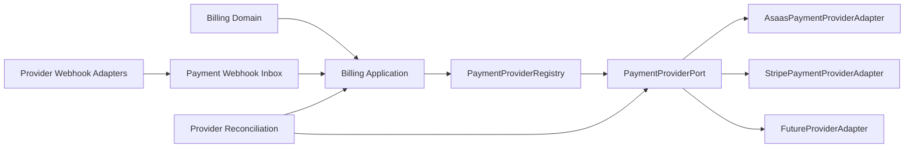
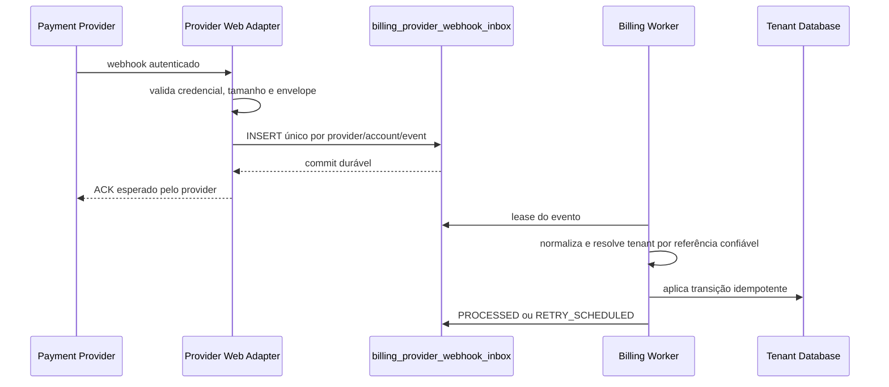

# ADR-0023 - Integração agnóstica de provedores de pagamento

- Document ID: `ADR-0023`
- Primary Nature: `Decisao`
- Objective: Definir uma arquitetura de cobrança independente de fornecedor, fechar os rails e a semântica financeira de `D-08`, manter ASAAS como provedor primário, Stripe como contingência e permitir extensão segura para novos provedores.
- Scope: `contexts.billing`, contratos de pagamento, seleção de provider, adapters externos, checkout hospedado, webhooks, idempotência, reconciliação, observabilidade e migração do baseline Stripe.
- Non-objectives: Não definir preços, impostos, dunning, crédito ou regras fiscais/contábeis; não implementar NFS-e, split, subcontas, antecipação, checkout transparente, Pix Automático, wallet ou pagamento manual/offline no primeiro slice; não autorizar fallback automático de mutação financeira ambígua; não atestar capability ASAAS, PCI, Sandbox ou implementação inexistente.
- Keywords: payment provider, gateway agnóstico, ASAAS, Stripe, billing, cobrança, fatura, webhook, idempotência, reconciliação, Pix, boleto, cartão, checkout hospedado
- Related Files: `docs/product/requirements/REQ-00034-phase2-billing-subscription-usage.md`, `docs/product/requirements/REQ-00042-enterprise-multitenant-billing-invoicing.md`, `docs/product/use-cases/UC-00042-billing-payment-reconciliation-dunning.md`, `ADR-0008-stripe-billing-subscription.md`, `ADR-0010-tenant-plan-parametrization.md`, `ADR-0011-resilience-retry-circuit-breaker.md`, `ADR-0012-error-handling-observability.md`, `ADR-0019-database-per-tenant.md`, `ADR-0024-seguranca-tokenizacao-cartao-recorrente.md`, `ADR-0025-suspensao-tenant-inadimplencia-recuperacao.md`, `../../../docs/specs/TP-00013-enterprise-billing-implementation-task-plan.md`, `docs/architecture/module-registry.md`
- Code References: Baseline legado em `app/src/main/java/br/com/duoset/saas_service/contexts/billing/`, `PaymentGatewayPort`, `StripePaymentAdapter` e `StripeWebhookController`; destinos planejados `PaymentProviderPort`, `PaymentProviderRegistry`, `PaymentWebhookIngressPort`, `AsaasPaymentProviderAdapter`, `StripePaymentProviderAdapter`, `BillingProviderCommand` e `PaymentProviderReconciliationJob`.
- Principal Decision: Billing mantém contrato, uso, fatura, pagamento efetivo e allocation como autoridades locais e acessa provedores somente por portas neutras; o primeiro slice de `D-08` usa fatura comercial local com Pix Cobrança, boleto e cartão hosted avulso ASAAS, enquanto recorrência hosted de base fixa permanece arquiteturalmente aceita porém `OFF` até seus gates, e nenhum redirect, callback ou status externo ativa entitlement.
- Date: 2026-08-25
- Status: Accepted
- Version: 3.0
- Decision Provenance: `AI_DELEGATED` para `D-08`; versões anteriores preservam sua proveniência histórica
- Decision Actor: `AI_AGENT — Codex (OpenAI)`
- Authority Basis: `OWNER_DELEGATION — AUTH-BILLING-2026-08-25-001`
- Human Review Status: `NOT_PERFORMED` para a revisão `3.0`
- Reviewability: `OPEN`
- Authors: Codex (Artificial Intelligence), sob autoridade delegada, para a revisão `3.0`; autoria histórica preservada no changelog
- Owners: Arquitetura e Billing
- Reviewers: AI — análise de arquitetura, domínio, segurança e custo; Human — N/A, nenhuma revisão substantiva de `D-08` foi realizada
- Stakeholders: Engenharia, Operações, Financeiro, Tenant Admins e responsáveis pela plataforma
- Supersedes: `ADR-0008` integralmente e `ADR-0010` somente nas referências a Stripe Usage Records
- Superseded by: N/A

---

# 0. Decision Provenance

| Field | Value |
| --- | --- |
| Normative status | `Accepted` |
| Decision package | `D-08` |
| Decision provenance | `AI_DELEGATED` |
| Decision actor | `AI_AGENT — Codex (OpenAI)` |
| Authority holder | Solicitante, declarado proprietário do SaaS; identidade não verificada criptograficamente pelo repositório |
| Authority grant | `AUTH-BILLING-2026-08-25-001`, registrada no TP-00013 |
| Authority scope | Escolher e materializar as decisões documentais restantes de Billing a partir de `D-04.4-E` |
| Human substantive review | `NOT_PERFORMED` para `D-08` |
| Reviewability | `OPEN`; revisão humana pode ratificar, emendar ou superseder sem apagar a origem IA |
| Excluded attestations | Ownership/capabilities da merchant ASAAS, PCI/SAQ/QSA, Sandbox, produção, tarifas, dados legais/fiscais e implementação |

`Accepted` indica vigência normativa de `D-08` sob autoridade delegada. Não
representa aprovação humana nem comprova que qualquer rail, adapter, conta ASAAS ou
controle operacional esteja implementado, homologado ou habilitado. A proveniência
das versões anteriores não é reescrita por esta revisão.

---

# 1. Context

O módulo Billing precisa cobrar mensalidade, add-ons e excedentes sem transferir ao
fornecedor a autoridade sobre plano, preço, competência, entitlement ou composição
da fatura. O baseline possui nomes, DTOs, colunas, configuração e um adapter Stripe
parcialmente simulado. O acoplamento dificulta trocar o provedor e pode induzir
outros módulos a tratar conceitos externos como regras do domínio.

A decisão de produto vigente é usar o ASAAS como executor primário de cobrança. A
arquitetura, entretanto, não pode tornar o ASAAS um conceito de domínio: Stripe deve
permanecer disponível como plano B controlado e outro provedor deve poder ser
adicionado sem modificar casos de uso centrais.

Esta decisão separa quatro responsabilidades:

1. Billing calcula e fecha a fatura local.
2. Um contrato neutro descreve intenções e resultados de pagamento.
3. Cada adapter traduz o contrato para a API do seu provider.
4. Webhooks e reconciliação convertem fatos externos em eventos internos idempotentes.

## 1.1 Vocabulário canônico

| Termo | Significado |
| --- | --- |
| `Payment Provider` | Serviço externo que cria, apresenta, processa ou informa uma cobrança. |
| `Provider Code` | Identificador interno estável, como `ASAAS` ou `STRIPE`; não é regra de negócio. |
| Provider primário | Provider habilitado para novas cobranças: `ASAAS`. |
| Provider de contingência | Adapter certificado e desligado por padrão: `STRIPE`. |
| `Invoice` | Fatura comercial imutável, calculada e fechada pelo Billing. |
| `Payment Intent` | Intenção local de obter pagamento para uma fatura, anterior à chamada externa. |
| `Provider Payment` | Cobrança externa correlacionada a uma intenção local. |
| Hosted payment | URL HTTPS do provider para coleta de Pix, boleto ou cartão sem trânsito de PAN/CVV pela aplicação. |
| Resultado ambíguo | Timeout ou falha de rede em que não é possível provar se a mutação externa ocorreu. |

## 1.2 Estado atual e estado-alvo

| Aspecto | Baseline legado | Estado-alvo governado por este ADR |
| --- | --- | --- |
| Provider | Stripe codificado em nomes e contratos | ASAAS primário, Stripe contingencial e providers extensíveis |
| Domínio | Campos e métodos `stripe*` | Referências externas neutras por provider |
| Porta | API semelhante ao Stripe Billing | Capacidades neutras de cobrança e consulta |
| Uso | `reportUsage` enviado ao gateway | Uso fecha fatura local; provider recebe valor final |
| Webhook | Endpoint e parser Stripe acoplados | Ingress adapter por provider e evento normalizado |
| Idempotência | Parcial e temporária | Command journal, chave lógica e inbox durável |
| Reconciliação | Ausente | Consulta imediata para ambiguidade e job periódico |

---

# 2. Decision Statement

O sistema DEVE integrar meios de pagamento por uma arquitetura ports-and-adapters.
Domínio e application DEVEM depender somente de contratos neutros. SDKs, headers,
payloads, URLs, tipos de evento e status proprietários DEVEM permanecer nos adapters
de infraestrutura.

O provider primário para novas cobranças é `ASAAS`. `STRIPE` é o provider de
contingência e NÃO participa de roteamento automático. Um provider adicional PODE
ser conectado por um novo adapter quando satisfizer o contrato de capacidades,
segurança, testes, reconciliação e operação desta decisão.

O Billing DEVE persistir a fatura e a intenção antes de chamar qualquer provider.
Uma resposta de checkout, redirect ou criação externa NUNCA confirma pagamento.
Confirmação decorre de webhook autenticado ou consulta reconciliada e produz no
máximo um efeito interno por fato financeiro.

## 2.1 Regra de referência documental

Documentos vigentes fora deste ADR NÃO DEVEM apresentar ASAAS como dependência
solta. Devem referenciar o **provider primário definido pelo
[ADR-0023](ADR-0023-agnostic-payment-provider-integration.md)**. Quando o nome for
necessário para configuração, migração ou teste do adapter, a mesma seção DEVE
apontar para este ADR.

Menções a Stripe PODEM permanecer apenas quando:

- descrevem código, schema ou evidência histórica ainda existente;
- identificam o adapter contingencial;
- registram a decisão superseded do ADR-0008;
- estão acompanhadas da relação com este ADR e não são apresentadas como decisão vigente.

## 2.2 Primeiro slice funcional de `D-08`

O primeiro slice funcional fecha somente a cadeia necessária para cobrar uma
fatura comercial local já finalizada:

1. Billing materializa a obrigação e a intenção tenant-local antes de qualquer
   efeito externo;
2. ASAAS executa **Pix Cobrança**, **boleto** ou **cartão hosted avulso**;
3. a plataforma recebe apenas hosted action/instrução e referências opacas;
4. webhook autenticado ou consulta reconciliada produz fatos canônicos;
5. allocation tenant-local liga o recebimento à obrigação correta;
6. a policy de ativação pode derivar `PAYMENT_EFFECTIVE` somente da evidência
   financeira elegível da Section 4.4.

O contrato continua provider-neutral. `ASAAS` é nome permitido apenas no adapter,
configuração, certificação e apresentação operacional; domínio, application e APIs
públicas expressam rail, capability, intenção, fato financeiro e estado canônicos.

O cartão recorrente hosted é aceito arquiteturalmente apenas para a **base fixa e
determinística** da obrigação, conforme ADR-0024. Sua capability começa e permanece
`OFF` até existir avaliação PCI aplicável, capability comprovada na merchant account,
certificação Sandbox e gate de rollout. Componentes variáveis de uso, overage,
proration, crédito ou ajuste usam checkout hosted avulso por fatura; não atualizam
uma assinatura externa por estimativa.

Ficam fora do primeiro slice e desabilitados por default:

- Pix Automático;
- split, subconta, marketplace e antecipação;
- checkout transparente, hosted fields/iframe ou captura de cartão pelo Hub;
- token de cartão local ou cobrança direta por token;
- wallet, prepaid/top-up, transferência, saque ou movimentação entre contas;
- cobrança manual/offline;
- fallback automático ASAAS → Stripe ou entre quaisquer providers.

Adicionar uma dessas capacidades exige decisão/requisito próprios, capability
explícita, controles de segurança, contract tests e rollout. Ausência de capability
falha de forma explícita; não seleciona alternativa silenciosa.

---

# 3. Architectural Contract

## 3.1 Boundaries



As classes concretas são infraestrutura interna de `contexts.billing`. Nenhum
outro bounded context importa adapters, SDKs ou DTOs de provider. Consumidores
cross-module usam somente `BillingApi` e eventos públicos do Billing.

## 3.2 Outbound port

O alvo arquitetural é uma porta com operações de negócio externo estritamente
necessárias, sem reproduzir uma API proprietária:

```java
interface PaymentProviderPort {
    ProviderCustomer ensureCustomer(EnsureProviderCustomerCommand command);
    ProviderPayment createPayment(CreateProviderPaymentCommand command);
    Optional<ProviderPayment> findPayment(ProviderPaymentQuery query);
    ProviderPayment cancelPayment(CancelProviderPaymentCommand command);
    ProviderRefund refundPayment(RefundProviderPaymentCommand command);
    ProviderCapabilities capabilities();
}
```

Os nomes são contrato de arquitetura, não autorização para implementação textual
sem requirement e plano aprovados. A implementação PODE evoluir o
`PaymentGatewayPort` existente de forma compatível ou substituí-lo por migration
planejada; não deve manter métodos específicos como `reportUsage` ou Customer
Portal quando não representam capacidade comum.

## 3.3 Provider registry and selection

`PaymentProviderRegistry` resolve adapters por `ProviderCode`. A seleção vigente é:

| Papel | Provider | Estado operacional esperado |
| --- | --- | --- |
| Primário | `ASAAS` | Habilitado para novas cobranças após gates de Sandbox e rollout |
| Contingência | `STRIPE` | Desligado por padrão; preservado/certificado como plano B |
| Futuro | Código registrado | Desligado até homologação e aprovação explícita |

A escolha não vem do frontend, de header arbitrário ou de parâmetro do tenant. Ela
é configuração de plataforma validada no startup, auditada e protegida por feature
flag. Roteamento por tenant ou produto exige requisito próprio.

## 3.4 Capability contract

Cada adapter publica capacidades, evitando que o caso de uso presuma que todos os
providers oferecem os mesmos recursos:

| Capability | Obrigatória para provider primário | Observação |
| --- | :---: | --- |
| Criar/consultar cliente | Sim | ID externo permanece opaco. |
| Criar/consultar cobrança | Sim | Correlacionada por chave lógica estável. |
| Hosted payment URL | Sim | HTTPS e host allowlisted. |
| Pix | Sim | Homologado no ambiente de teste. |
| Boleto | Sim | Homologado no ambiente de teste. |
| Cartão hospedado | Sim | PAN/CVV não transitam na plataforma. |
| Webhook autenticável | Sim | Persistência durável antes do ACK. |
| Reconciliação por ID/referência | Sim | Necessária para resultado ambíguo. |
| Cancelamento | Sim quando o estado permitir | Sem traduzir falha em sucesso. |
| Refund | Conforme produto aprovado | Capability explícita; nunca presumida. |
| Recorrência hosted de base fixa | Não | Capability opcional e `OFF` até ADR-0024/PCI/Sandbox; Billing local continua fonte de verdade. |

Casos de uso verificam a capability antes da operação. Ausência produz resultado
de negócio explícito; nunca cast, `instanceof` ou chamada direta ao adapter.

## 3.5 Neutral commands and results

Commands DEVEM usar IDs internos e `externalReference` opaca, valores inteiros em
centavos, moeda explícita, vencimento, URLs geradas no servidor, chave lógica
idempotente e metadados allowlisted. Results DEVEM expor somente provider, IDs
opacos, estado normalizado, hosted URL validada, timestamps, correlação e resultado
`SUCCEEDED`, `PENDING`, `REJECTED` ou `RECONCILIATION_REQUIRED`.

---

# 4. Financial Integrity

## 4.1 Authority of data

| Informação | Fonte de verdade | Projeção externa/local |
| --- | --- | --- |
| Plano, catálogo, limites e entitlement | Billing | Eventos públicos para consumidores |
| Uso, itens, descontos e total da fatura | Billing | Valor/descrição enviados ao provider |
| Cliente e cobrança externos | Provider selecionado | IDs opacos e projeção mínima no Billing |
| Confirmação financeira | Webhook/consulta autenticada | Estado financeiro local idempotente |
| Auditoria | `AuditPort` | Logs técnicos sem payload sensível |

## 4.2 Persist-before-call

Toda mutação externa exige `billing_provider_commands` persistido antes da chamada,
com `UNIQUE(provider, logical_operation_key)`. Estados mínimos:

`PENDING -> IN_FLIGHT -> SUCCEEDED | REJECTED | UNKNOWN -> RECONCILED | MANUAL_REVIEW`

O adapter envia a chave idempotente quando o provider suportar essa capacidade,
mas a integridade local não depende exclusivamente da retenção ou semântica do
fornecedor.

## 4.3 No automatic cross-provider fallback

Stripe como plano B NÃO significa repetir automaticamente no Stripe uma cobrança
que falhou ou ficou ambígua no ASAAS. Uma mutação só pode mudar de provider quando:

1. o command original está bloqueado para novas tentativas;
2. consulta e reconciliação provam ausência de cobrança efetiva no provider original;
3. a troca é autorizada e auditada;
4. uma nova chave lógica referencia a substituição;
5. webhooks/reconciliação do provider original permanecem ativos até zerar pendências.

Essa regra vale para qualquer par de providers e impede dupla cobrança.

## 4.4 Payment confirmation

Os fatos canônicos têm semânticas separadas:

| Fato | Semântica | Efeito sobre entitlement |
| --- | --- | --- |
| `PAYMENT_CONFIRMED` | Pagamento da obrigação foi autenticado, normalizado e reconciliado; o caixa pode ainda não estar disponível. | Somente após allocation confirmada contra a obrigação correta PODE produzir `PAYMENT_EFFECTIVE` uma vez. |
| `PAYMENT_SETTLED` | Valor se tornou financeiramente disponível e alimenta caixa, settlement, fees e reconciliação. | Não é pré-requisito adicional para ativação quando `PAYMENT_EFFECTIVE` já foi legitimamente produzido. |
| `PAYMENT_EFFECTIVE` | Decisão local derivada, causal e idempotente que sela payment + allocation elegíveis para a obligation/revision. | Único fato desta decisão que satisfaz activation/recovery policy; nunca nasce de callback ou status de assinatura. |

O evento proprietário ASAAS `PAYMENT_RECEIVED` pode ser o primeiro fato observado,
especialmente no Pix. O adapter o normaliza simultaneamente como evidência de
confirmação efetiva e disponibilidade financeira, sem exigir que um evento
`PAYMENT_CONFIRMED` proprietário tenha chegado antes. Essa normalização preserva
dedupe, monotonicidade, valor/moeda, merchant account, referência, consulta
reconciliada quando necessária e allocation local antes de `PAYMENT_EFFECTIVE`.

- Redirect, success URL, callback, checkout concluído, criação de cobrança e status
  de assinatura externa não concedem acesso nem recuperam inadimplência.
- Evento duplicado ou concorrente não repete activation, allocation, settlement,
  receita ou notificação.
- Eventos fora de ordem não podem regredir estado; `SETTLED` não apaga a evidência
  anterior e confirmation tardia torna-se no-op causal.
- Falta de evidência, referência ambígua, valor divergente, `UNKNOWN` ou allocation
  ausente não é pagamento nem falha definitiva: é pendência reconciliável.
- Inadimplência inicia a policy da ADR-0025; não restringe diretamente no adapter,
  webhook ou controller.

---

# 5. Webhooks and Reconciliation

## 5.1 Ingress architecture

Cada provider possui um web adapter que valida seu mecanismo de autenticação e
traduz o envelope para `NormalizedPaymentEvent`. A porta de ingresso e o worker são
neutros. O endpoint PODE ser dedicado por provider, mas não expõe detalhes ao
domínio.

Antes de resolver o banco dedicado do tenant, o store de plataforma mantém somente
o índice mínimo e o envelope sanitizado necessários a
`(provider, environment, merchantAccountAlias, externalId/eventId) -> tenant e
recurso interno opacos`. Não contém contrato, invoice, payment, allocation, body
bruto ou PII desnecessária. A autoridade financeira e o processamento permanecem
no database tenant-local; rota ausente/conflitante vai para quarentena sanitizada,
nunca para varredura ou datasource default.



Regras comuns:

- autenticar antes de persistir;
- limitar corpo, tempo e taxa;
- tolerar campos adicionais sem aceitar eventos desconhecidos como comandos;
- responder sucesso somente após commit durável;
- deduplicar por provider, conta e event ID;
- descartar o body bruto após autenticação/parsing em memória e persistir somente
  envelope canônico construído por allowlist;
- nunca persistir token, API key, PAN, validade, CVV, holder data,
  `creditCardToken`, objeto de cartão ou PII não necessária;
- resolver tenant por referência interna opaca, sem datasource default.

## 5.2 Normalized events

| Evento interno | Efeito mínimo |
| --- | --- |
| `PAYMENT_CREATED` | Atualiza projeção sem conceder acesso. |
| `PAYMENT_CONFIRMED` | Registra confirmação reconciliada; somente payment + allocation elegíveis podem derivar `PAYMENT_EFFECTIVE`. |
| `PAYMENT_SETTLED` | Registra disponibilidade financeira/caixa, fees e settlement; não é gate adicional de entitlement. |
| `PAYMENT_OVERDUE` | Marca atraso e inicia carência. |
| `PAYMENT_FAILED` | Registra falha recuperável. |
| `PAYMENT_REFUNDED` | Atualiza saldo/estado e publica revisão. |
| `PAYMENT_DISPUTED` | Publica evento de risco sem efeito ad hoc no controller. |
| `PAYMENT_CANCELED` | Concilia cancelamento sem apagar histórico. |

O mapeamento provider -> evento interno é testado por contrato e versionado no
adapter. Evento desconhecido gera métrica/quarentena e zero efeito de domínio.

## 5.3 Reconciliation

Webhook é o caminho primário, não a única evidência. O reconciliador executa
consulta imediata para command `UNKNOWN`, reconciliação incremental e paginada,
verificação de faturas abertas/vencidas/divergentes, replay do mesmo normalizador e
fila manual após esgotar tentativas seguras. Cada execução salva cursor, provider,
quantidade inspecionada, divergências, reparos e falhas.

---

# 6. Provider Profiles

## 6.1 ASAAS - primary

O adapter primário é `AsaasPaymentProviderAdapter`. Detalhes específicos ficam
somente neste perfil e no código de infraestrutura:

- autenticação da API pelo mecanismo oficial do provider;
- webhook validado pelo header `asaas-access-token`;
- entrega de webhook tratada como at-least-once e, portanto, idempotente;
- no primeiro slice, Pix Cobrança, boleto e cartão hosted avulso, todos ainda
  condicionados à homologação no Sandbox e à capability da merchant account;
- cartão hosted recorrente somente para base fixa, capability `OFF` até os gates
  do ADR-0024; componente variável usa hosted checkout por invoice;
- `externalReference` correlacionada ao registry local;
- eventos proprietários convertidos para a taxonomia da Section 5.2;
- configuração e métricas sob o provider code `ASAAS`.

Pix Automático, split/subconta, antecipação, checkout transparente, token local,
pagamento manual/offline e fallback automático não integram esse perfil inicial.

O nome ASAAS não aparece em entidades, value objects, portas públicas, eventos de
domínio, DTOs cross-module ou contratos frontend, exceto quando a interface precisa
mostrar ao operador qual provider executou a cobrança.

## 6.2 Stripe - contingency

O baseline `StripePaymentAdapter` não é automaticamente considerado adapter de
contingência pronto: suas operações simuladas e gaps precisam ser removidos. O
target `StripePaymentProviderAdapter` deve implementar o mesmo contrato neutro,
usar idempotency key, validar assinatura de webhook, normalizar eventos e passar os
mesmos gates do provider primário.

Enquanto não certificado, Stripe permanece legado desativado. O ADR-0008 registra
a decisão histórica e está superseded por este ADR.

## 6.3 Adding another provider

Um novo provider exige, sem alterar domínio/application:

1. `ProviderCode` e configuração registrada;
2. adapter do `PaymentProviderPort`;
3. web adapter e normalizador de eventos;
4. capability matrix preenchida;
5. idempotência, reconciliação, segurança e observabilidade;
6. contract tests comuns e testes específicos em ambiente não produtivo;
7. runbook, rollback e aprovação humana para habilitação.

---

# 7. Persistence and Migration

## 7.1 Provider-neutral schema

Novas migrations são aditivas e introduzem nomes neutros:

| Tabela/campo | Responsabilidade |
| --- | --- |
| `billing_provider_commands` | Journal de mutações externas e resultados ambíguos. |
| `billing_provider_references` | Provider, conta, referência lógica e IDs externos opacos. |
| `billing_provider_webhook_inbox` | Ingresso durável e deduplicado. |
| `provider` | Código do provider que originou a referência. |
| `provider_customer_id` | ID externo opaco do pagador. |
| `provider_payment_id` | ID externo opaco da cobrança. |
| `provider_subscription_id` | ID externo opcional de agenda/assinatura. |
| `provider_invoice_url` | Hosted URL validada. |

Migrations já aplicadas com colunas `stripe_*` NÃO DEVEM ser reescritas. Elas são
legado factual e permanecem durante backfill/cutover. Código novo não cria outra
dependência provider-specific; lê o legado por migration adapter até sua retirada.

## 7.2 Cutover

1. Inventariar se existem clientes, cobranças ou assinaturas Stripe reais.
2. Introduzir schema e contracts neutros.
3. Backfill de referências legadas com `provider=STRIPE` sem alterar IDs.
4. Implementar e homologar ASAAS no Sandbox.
5. Desligar jobs que criam novas mutações Stripe.
6. Habilitar ASAAS gradualmente por feature flag de plataforma.
7. Manter webhooks e reconciliação do legado até zerar pendências.
8. Certificar o adapter Stripe como contingência separada.

Rollback pausa novas mutações. Não troca provider de uma cobrança já criada e não
desativa ingestão/reconciliação do provider que ainda possui pendências.

---

# 8. Security, Configuration and Observability

## 8.1 Security

- Segredos são separados por provider, conta e ambiente.
- Sandbox e produção usam credenciais e base URLs distintas.
- Startup falha para provider habilitado sem configuração obrigatória válida.
- Callbacks são gerados no servidor; hosted URLs retornadas são validadas.
- Dados de cartão usam página hospedada; PAN/CVV não transitam nem são persistidos.
- Logs contêm trace, provider, operação e IDs opacos, nunca credencial ou payload sensível.
- Rotação de API key e webhook secret/token possui janela, validação e rollback.
- Replay manual e troca de provider exigem autorização e auditoria.

## 8.2 Configuration

```yaml
billing:
  payment-provider:
    primary: asaas
    contingency: stripe
    providers:
      asaas:
        enabled: true
      stripe:
        enabled: false
```

Nomes e segredos concretos pertencem aos adapters e ao ambiente. Nenhum segredo ou
provider é escolhido pelo frontend.

## 8.3 Observability

- `billing_provider_requests_total{provider,operation,outcome,status_class}`;
- `billing_provider_request_duration_seconds{provider,operation}`;
- `billing_webhook_received_total{provider,event_type,outcome}`;
- `billing_webhook_inbox_oldest_seconds{provider}`;
- `billing_webhook_dead_letter_total{provider,event_type}`;
- `billing_provider_commands_pending{provider,state}`;
- `billing_reconciliation_divergences_total{provider,kind}`.

Alertas cobrem inbox parada, dead letter, command `UNKNOWN` envelhecido, falhas de
autenticação, rate limit, circuit breaker aberto e divergência não reparada.

---

# 9. Consequences

## Positive Consequences

- ASAAS pode ser adotado agora sem se tornar conceito do domínio.
- Stripe permanece plano B por adapter, não por duplicação de casos de uso.
- Um terceiro provider entra sem alterar regras comerciais ou consumidores.
- Fatura e uso continuam explicáveis e independentes do fornecedor.
- Webhooks, retries e reconciliação seguem controles financeiros comuns.

## Negative Consequences

- Provider registry, command journal, inbox e reconciliador aumentam a operação.
- Cada provider precisa de homologação e contract tests próprios.
- O legado Stripe exige migration compatível, não simples rename.
- Contingência não é instantânea quando existe resultado financeiro ambíguo.

## Neutral Consequences

- Hosted payment é a experiência inicial; checkout transparente continua fora do escopo.
- Adapters podem suportar capabilities diferentes sem vazar essa diferença ao domínio.
- O código atual continua legado até execução de requirement/plano de implementação.

---

# 10. Implementation Sequence

Esta seção define ordem arquitetural. Mudança de software requer plano persistido e
testes conforme o ciclo de engenharia.

## Phase 0 - Documentation and inventory

- Atualizar requisitos e casos de uso para este ADR.
- Marcar ADR-0008 como superseded.
- Classificar referências Stripe como legado factual ou substituir por contrato neutro.
- Inventariar dados e integrações externas existentes.

## Phase 1 - Provider-neutral foundation

- Introduzir contracts, registry, capabilities e configuração neutra.
- Criar migrations aditivas, command journal, references e inbox.
- Remover `reportUsage` do gateway; uso passa pelo fechamento local da fatura.
- Adicionar testes de arquitetura impedindo tipos de provider no domínio/application.

## Phase 2 - ASAAS primary adapter

- Implementar customer, payment, hosted URL, consulta, cancelamento e refund aprovado.
- Implementar ingress autenticado, normalização e reconciliação.
- Homologar Pix, boleto e cartão hospedado no Sandbox.
- Executar rollout progressivo com flags e gates operacionais.

## Phase 3 - Stripe contingency adapter

- Encapsular ou substituir o adapter legado pelo contrato neutro.
- Remover stubs e certificar idempotência, webhook e reconciliação.
- Manter desligado até teste de contingência e aprovação operacional.

## Phase 4 - Additional providers

- Repetir o onboarding da Section 6.3 sem modificar domínio/application.

---

# 11. Validation and Acceptance Criteria

## Architecture

- Domain e application não importam SDK, DTO ou classe ASAAS/Stripe.
- `ApplicationModules.verify()` permanece verde.
- Cada adapter implementa o mesmo contract test suite.
- Provider-specific configuration não aparece em contratos públicos.
- Nenhum novo campo persistente de domínio recebe prefixo de fornecedor.

## Financial integrity

- Uma chave lógica produz no máximo uma cobrança ativa.
- Timeout após criação converge sem retry cego ou cobrança no plano B.
- Evento duplicado/concorrente produz um efeito.
- Evento fora de ordem não regride estado.
- ACK de webhook possui inbox durável.
- Referência desconhecida não abre datasource default.
- Redirect/callback/status de assinatura produz zero activation/recovery.
- `PAYMENT_CONFIRMED` autenticado/reconciliado sem allocation ainda não produz
  `PAYMENT_EFFECTIVE`.
- Evento ASAAS `PAYMENT_RECEIVED` como primeiro evento converge para confirmation
  efetiva + settlement, sem depender de evento predecessor ausente.
- `PAYMENT_SETTLED` atualiza disponibilidade financeira sem repetir entitlement.

## Provider certification

- Provider primário passa Sandbox para customer, cobrança, Pix, boleto, cartão hospedado e reconciliação.
- Provider contingencial passa os mesmos contratos antes de ser considerado disponível.
- Nenhum teste usa endpoint, chave ou dado de produção.
- Skips não contam como evidência de aceite.

---

# 12. Risks and Mitigations

| Risco | Mitigação |
| --- | --- |
| Domínio voltar a depender do provider primário | ArchUnit, contratos neutros e review de boundaries. |
| Cobrança duplicada após timeout | Persist-before-call, chave lógica, estado `UNKNOWN` e reconciliação. |
| Fallback cobrar em dois providers | Proibição de fallback automático e troca auditada após prova de ausência. |
| Webhook aceito e perdido | Inbox durável antes do ACK, lease, retry e dead letter. |
| Evento falso ou cross-tenant | Autenticação por adapter, referência opaca e sem datasource default. |
| Capability ausente | Negociação explícita e falha de negócio, nunca chamada implícita. |
| Credencial/ambiente incorreto | Configuração segregada, startup validation e rotação testada. |
| Aumento de escopo PCI | Hosted payment e proibição de PAN/CVV; revisão própria para tokenização. |

---

# 13. Related ADRs

- [ADR-0000 - Governança documental](../../harness/governance/decisions/ADR-0000-governanca-do-harness-documental.md)
- [ADR-0006 - Audit and Compliance](ADR-0006-audit-compliance.md)
- [ADR-0008 - Stripe Billing, superseded](ADR-0008-stripe-billing-subscription.md)
- [ADR-0010 - Tenant Plan Parametrization](ADR-0010-tenant-plan-parametrization.md)
- [ADR-0011 - Resilience](ADR-0011-resilience-retry-circuit-breaker.md)
- [ADR-0012 - Error Handling and Observability](ADR-0012-error-handling-observability.md)
- [ADR-0019 - Database per Tenant](ADR-0019-database-per-tenant.md)

---

# 14. External References

## Central de Ajuda ASAAS fornecida para o release

Estes links compõem o conjunto de referência solicitado para desenho,
implementação, homologação e operação do primeiro release. Como a Central de
Ajuda e a documentação de desenvolvedores podem evoluir de forma independente,
ambas devem ser revalidadas no início da execução de cada plano.

- [Documento central com a documentação](https://central.ajuda.asaas.com/hc/pt-br/sections/32107364983451)
- [Códigos de respostas e erros de webhook](https://central.ajuda.asaas.com/hc/pt-br/articles/32107653311643-C%C3%B3digos-de-respostas-e-erros-de-webhook)
- [Como utilizar o Sandbox — área de testes](https://central.ajuda.asaas.com/hc/pt-br/articles/32107684279579-Como-utilizar-nosso-Sandbox-%C3%A1rea-de-testes)
- [Quais funcionalidades podem ser testadas em Sandbox](https://central.ajuda.asaas.com/hc/pt-br/articles/32107816472219-Quais-funcionalidades-podem-ser-testadas-em-Sandbox)
- [Como liberar parâmetros na conta em Sandbox](https://central.ajuda.asaas.com/hc/pt-br/articles/43327091402011-Como-liberar-par%C3%A2metros-na-conta-em-Sandbox)
- [O ASAAS possui checkout transparente?](https://central.ajuda.asaas.com/hc/pt-br/articles/32108011423643-O-Asaas-possui-checkout-transparente)
- [Links de Pagamento](https://central.ajuda.asaas.com/hc/pt-br/articles/32108068317979-Links-de-Pagamento)
- [Tokenização](https://central.ajuda.asaas.com/hc/pt-br/articles/32108539373083-Tokeniza%C3%A7%C3%A3o)
- [Como gerar uma chave de API](https://central.ajuda.asaas.com/hc/pt-br/articles/33618186066331-Como-gerar-uma-chave-de-API)

## ASAAS provider profile

- [Authentication](https://docs.asaas.com/docs/authentication)
- [Create webhook](https://docs.asaas.com/reference/create-new-webhook)
- [Webhook authentication](https://docs.asaas.com/docs/webhooks-3)
- [Webhook delivery and retries](https://docs.asaas.com/docs/create-new-webhook-via-api)
- [Webhook idempotence](https://docs.asaas.com/docs/how-to-implement-idempotence-in-webhooks)
- [Payment events](https://docs.asaas.com/docs/payment-events)
- [List payments and reconciliation](https://docs.asaas.com/reference/list-payments)

## Stripe contingency profile

- [Idempotent requests](https://docs.stripe.com/api/idempotent_requests)
- [Webhook endpoints](https://docs.stripe.com/webhooks)
- [Checkout Sessions](https://docs.stripe.com/payments/checkout-sessions)

Fontes externas verificadas em 2026-08-21. Parâmetros operacionais devem ser
revalidados antes de implementação e homologação.

---

# 15. Decision Lifecycle

Current State: **Accepted**

Esta decisão substitui o ADR-0008 como arquitetura vigente de integração de
pagamentos. ASAAS é o provider primário; Stripe é contingência controlada. O aceite
não declara a migração de código concluída: referências AS-IS permanecem históricas
até o plano de implementação executar schema, adapters, configuração e cutover.

A revisão `3.0` fecha `D-08` sob autoridade delegada de IA. Ela aceita os rails e
a semântica canônica, mas mantém todas as capabilities externas `OFF` até evidência
de implementação, merchant account, Segurança/PCI, Sandbox e rollout. Uma revisão
humana futura permanece aberta e não pode apagar a proveniência `AI_DELEGATED`.

---

# 16. Change Log

| Version | Date | Changes |
| --- | --- | --- |
| 3.0 | 2026-08-25 | `D-08`, decidido por Codex sob `AUTH-BILLING-2026-08-25-001`: fecha fatura local + Pix Cobrança/boleto/cartão hosted avulso ASAAS; aceita recorrência hosted apenas para base fixa e a mantém `OFF`; separa confirmação, `PAYMENT_EFFECTIVE` e settlement; normaliza `PAYMENT_RECEIVED` Pix; proíbe ativação por redirect/callback/status, minimiza inbox/índice pré-tenant e exclui capabilities avançadas/fallback automático. Nenhuma implementação ou evidência externa é afirmada. |
| 2.1 | 2026-08-21 | Preserva no ADR o documento central e os oito subassuntos da Central de Ajuda ASAAS fornecidos para o release e normaliza referências técnicas oficiais de autenticação e entrega de webhooks. |
| 2.0 | 2026-08-21 | Decisão aceita e generalizada para providers plugáveis; ASAAS primário, Stripe contingencial, contracts/capabilities neutros e política de referência documental. |
| 1.0 | 2026-08-21 | Proposta inicial específica para cobrança com ASAAS. |

---

# 17. Repository Structure

```text
docs/
  adrs/
    ADR-0023-agnostic-payment-provider-integration.md
```

---

# 18. Notes

- `ASAAS` e `STRIPE` são códigos de providers em configuração e infraestrutura.
- Documentação corrente referencia esta decisão, não o nome comercial isolado.
- Artefatos AS-IS podem citar símbolos `stripe*` quando descrevem fielmente código
  ou banco legado e devem declarar que a decisão vigente é este ADR.
- O desenho garante efeito exatamente uma vez sobre transporte pelo menos uma vez;
  não promete entrega exatamente uma vez.
