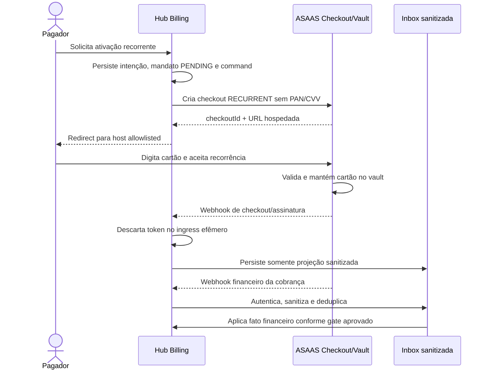

# ADR-0024 - Segurança e tokenização de cartão para cobrança recorrente

- Document ID: `ADR-0024`
- Primary Nature: `Decisao`
- Objective: Definir se e como Billing pode oferecer cobrança recorrente por cartão sem custodiar dados de cartão e sem ampliar silenciosamente o escopo PCI da plataforma.
- Scope: `contexts.billing`, checkout hospedado recorrente, credenciais e referências de pagamento, mandato de cobrança, projeção de assinatura no provider, webhooks, reconciliação, frontend de Billing, isolamento multitenancy, classificação e retenção de dados.
- Non-objectives: Não implementar ou habilitar o fluxo; não declarar certificação PCI, capability de merchant account ou homologação Sandbox; não escolher preço contratual, política de dunning ou termos jurídicos; não autorizar checkout transparente, captura própria de cartão, armazenamento de PAN/CVV/token ou roteamento automático entre providers.
- Keywords: cartão recorrente, cartão salvo, card-on-file, credencial armazenada, cobrança off-session, ASAAS Checkout, assinatura recorrente, tokenização, creditCardToken, PAN, CVV, PCI DSS, CollectionMandate, PaymentMethodReference, webhook, redaction
- Related Files: `harness/governance/decisions/ADR-0000-governanca-do-harness-documental.md`, `docs/adrs/ADR-0006-audit-compliance.md`, `docs/adrs/ADR-0008-stripe-billing-subscription.md`, `docs/adrs/ADR-0011-resilience-retry-circuit-breaker.md`, `docs/adrs/ADR-0012-error-handling-observability.md`, `docs/adrs/ADR-0019-database-per-tenant.md`, `docs/adrs/ADR-0023-agnostic-payment-provider-integration.md`, `docs/adrs/ADR-0025-suspensao-tenant-inadimplencia-recuperacao.md`, `docs/product/requirements/REQ-00034-phase2-billing-subscription-usage.md`, `docs/product/requirements/REQ-00042-enterprise-multitenant-billing-invoicing.md`, `docs/product/use-cases/UC-00042-billing-payment-reconciliation-dunning.md`, `docs/delivery/plans/TP-00011-billing-asaas-first-release-task-plan.md`, `docs/delivery/plans/implementation_plans/backend/IP-BE-11.2.2-asaas-customer-charge-hosted-payment.md`, `docs/architecture/module-registry.md`
- Code References: Baseline atual em `backend/src/main/java/br/com/duoset/saas_service/contexts/billing/` e `frontend/src/`; destinos planejados `CollectionMandate`, `PaymentMethodReference`, projeção provider-neutral de recorrência, sanitização de webhook e contratos de checkout hospedado, ainda não implementados por este ADR.
- Principal Decision: A recorrência ASAAS é arquiteturalmente aceita somente por Checkout hospedado `RECURRENT` para base fixa determinística, mas sua capability permanece `OFF` até PCI/merchant/Sandbox/rollout; o ASAAS custodia o PAN/instrumento ou credencial tokenizada, CVV jamais é retido, e browser, domínio, APIs de negócio e stores do Hub não aceitam nem armazenam PAN, validade, CVV ou `creditCardToken`. Somente o ingress dedicado de webhook pode encontrar um campo `creditCardToken` enviado pelo provider, de forma efêmera, e DEVE descartá-lo antes de domínio, contrato de API, store, cache, fila, quarentena, DLQ, replay, log, trace ou métrica; componentes variáveis usam checkout hosted avulso por fatura.
- Date: 2026-08-25
- Status: Accepted
- Version: 2.1
- Decision Provenance: `AI_DELEGATED` para a aceitação de `D-08`; versões propostas anteriores preservam sua proveniência histórica
- Decision Actor: `AI_AGENT — Codex (OpenAI)`
- Authority Basis: `OWNER_DELEGATION — AUTH-BILLING-2026-08-25-001`
- Human Review Status: `NOT_PERFORMED` para a revisão `2.1`
- Reviewability: `OPEN`
- Authors: Codex (Artificial Intelligence), sob autoridade delegada, para a revisão `2.1`; autoria histórica preservada no changelog
- Owners: Arquitetura, Segurança e Billing
- Reviewers: AI — análise de arquitetura, segurança, domínio e custo; Human — N/A, nenhuma revisão substantiva da aceitação foi realizada
- Stakeholders: Engenharia, Operações, Financeiro, Compliance, Tenant Billing Admins e pagadores
- Supersedes: N/A
- Superseded by: N/A

---

# 0. Decision Provenance

| Field | Value |
| --- | --- |
| Normative status | `Accepted` |
| Decision package | `D-08`, especialização de cartão hosted recorrente |
| Decision provenance | `AI_DELEGATED` |
| Decision actor | `AI_AGENT — Codex (OpenAI)` |
| Authority holder | Solicitante, declarado proprietário do SaaS; identidade não verificada criptograficamente pelo repositório |
| Authority grant | `AUTH-BILLING-2026-08-25-001`, registrada no TP-00013 |
| Human substantive review | `NOT_PERFORMED` |
| Reviewability | `OPEN`; revisão humana pode ratificar, emendar ou superseder sem apagar a origem IA |
| Excluded attestations | PCI/SAQ/QSA, merchant account/capability ASAAS, Sandbox, termos jurídicos, produção e implementação |

`Accepted` torna o boundary hosted-only normativo sob a autoridade delegada, mas
não habilita a capability. A ausência das evidências excluídas mantém recorrência
`OFF`; o fallback funcional permanece checkout hosted avulso por fatura. A
proveniência proposta das versões anteriores permanece histórica.

---

# 1. Context

## 1.1 Pergunta arquitetural

Cobrança recorrente por cartão costuma ser descrita informalmente como “guardar o
cartão”. Essa expressão mistura três coisas diferentes:

1. guardar o número do cartão, validade e CVV;
2. guardar um token reutilizável que autoriza novas cobranças;
3. guardar somente IDs de uma assinatura ou mandato cujo cartão permanece no
   cofre do provedor.

Essas alternativas têm riscos e escopos PCI distintos. O Hub precisa definir qual
delas é permitida antes que o primeiro release de Billing implemente cartão
recorrente no ASAAS.

## 1.2 Cobertura já existente no repositório

| Fonte | Cobertura atual | Lacuna para recorrência por cartão |
| --- | --- | --- |
| [ADR-0023](ADR-0023-agnostic-payment-provider-integration.md) | Exige hosted payment, proíbe trânsito/persistência de PAN/CVV, mantém Billing como autoridade local e pede revisão própria para tokenização. | Não fecha custódia de token, mandato, troca de cartão, revogação, webhook contendo token nem ciclo de vida da recorrência. |
| [REQ-00034](../product/requirements/REQ-00034-phase2-billing-subscription-usage.md) | Caracteriza o AS-IS aprovado e registra que os modelos auditados não possuem PAN/CVV. | Não existe fluxo financeiro recorrente real nem security scan que prove ausência do dado em todos os canais. |
| [REQ-00042](../product/requirements/REQ-00042-enterprise-multitenant-billing-invoicing.md) | Prevê hosted checkout, `CollectionMandate` e referências opacas; `BR-EBILL-033` mantém cartão no ambiente/token do provider. | Deve permanecer reconciliado com base fixa, `PAYMENT_EFFECTIVE` e capability `OFF`, sem inferir implementação. |
| [UC-00042](../product/use-cases/UC-00042-billing-payment-reconciliation-dunning.md) | Prevê hosted flow sem cartão no Hub, command journal, webhook e reconciliação. | Deve refletir onboarding/substituição/revogação e os evidence gates desta revisão. |
| [TP-00011](../delivery/plans/TP-00011-billing-asaas-first-release-task-plan.md) | Impõe que PAN/CVV não transitem e que checkout/tokenização dependam de capability aprovada. | Rail/evento foram decididos por D-08; PCI, merchant, Sandbox e rollout continuam bloqueadores. |
| [IP-BE-11.2.2-asaas-customer-charge-hosted-payment](../delivery/plans/implementation_plans/backend/IP-BE-11.2.2-asaas-customer-charge-hosted-payment.md) | Planeja cartão hospedado e exclui cartão transparente/tokenização do slice. | Só pode incorporar recorrência fixed-base como capability desligada e condicionada aos gates deste ADR. |

Essa cobertura parcial motivou D-08. A revisão `2.0` agora fecha a decisão
arquitetural, sem converter lacunas de evidência em implementação ou habilitação.
O ADR-0008 descrevia uma tokenização Stripe histórica, porém está `Superseded` e
não governa o novo fluxo.

### 1.2.1 Evidência AS-IS no software

- `PaymentMethod` é um modelo legado com referência Stripe opaca, mas não possui
  entity JPA, tabela, adapter de repository ou caso de uso ativo; ele não comprova
  armazenamento funcional de cartão ou token.
- As migrations de Billing não criam tabela de meios de pagamento nem colunas de
  PAN/CVV.
- `PaymentProviderPort` suporta customer e pagamento, mas ainda não possui operação
  de mandato, recurring setup, troca de instrumento ou cobrança off-session.
- A foundation provider-neutral permanece desabilitada e não existe adapter ASAAS
  operacional.
- O frontend apenas solicita uma URL de checkout e não contém formulário de cartão
  ou SDK ASAAS. O callback legado ainda depende de query param para UX e, por isso,
  não pode ser reaproveitado como evidência financeira.

Consequentemente, a resposta para o estado atual é: o Hub não armazena PAN/CVV,
mas também não executa recorrência real por cartão. A ausência atual de campos não
substitui os controles de um fluxo futuro.

## 1.3 Restrições observadas no ASAAS

A documentação oficial vigente diferencia dois caminhos relevantes:

- o **Checkout ASAAS** é uma página hospedada e aceita
  `billingTypes=[CREDIT_CARD]` com `chargeTypes=[RECURRENT]`; concluído o fluxo, o
  ASAAS cria a assinatura e executa cobranças futuras;
- o endpoint de **tokenização server-side** recebe `creditCard`,
  `creditCardHolderInfo` e `remoteIp`. Nesse caminho, o dado do cartão passa pela
  infraestrutura do integrador antes de chegar ao ASAAS.

O próprio guia PCI do ASAAS classifica API e tokenização server-side como fluxos em
que a infraestrutura do cliente permanece em escopo, enquanto checkout/fatura/link
hospedados podem reduzir o escopo. A forma de integração, isoladamente, não define
o SAQ aplicável.

A documentação de webhook de cobrança também demonstra que o objeto recebido pode
conter `creditCard.creditCardToken`. Assim, apenas “não criar uma coluna de token”
não basta: payload bruto, logs, dead letters, traces e ferramentas de suporte podem
armazená-lo acidentalmente.

## 1.4 Restrições PCI relevantes

O PCI SSC determina que o código de verificação do cartão é dado de autenticação
sensível e não pode ser retido após a autorização, nem mesmo criptografado, inclusive
para card-on-file ou recorrência. Tokenização pode reduzir ocorrências de PAN e o
escopo de avaliação, mas não elimina automaticamente obrigações PCI; o fluxo e a
capacidade de gerar, resgatar ou usar o token precisam ser avaliados no desenho
concreto.

Este ADR não afirma conformidade nem escolhe um SAQ. Ele define uma fronteira
técnica de minimização, sujeita à validação formal de Segurança/Compliance e da
entidade responsável pelo programa PCI.

## 1.5 Problema a resolver

Sem uma decisão explícita, uma implementação pode:

- criar formulário de cartão no frontend e enviar PAN/CVV ao backend;
- persistir `creditCardToken` recebido em response ou webhook sem classificá-lo;
- tratar o retorno do checkout como pagamento e conceder entitlement;
- deixar uma assinatura externa cobrar após cancelamento local;
- associar token ou assinatura ao customer, conta ASAAS ou tenant errado;
- duplicar recorrência durante troca de cartão ou resultado ambíguo;
- declarar “zero PCI” sem evidência ou avaliação aplicável.

---

# 2. Decision Statement

## 2.1 Acceptance and capability guard

Esta decisão está **Accepted** por decisão de IA sob autoridade delegada. O aceite
fecha somente a arquitetura: checkout hosted, base fixa, autoridade local, nenhum
PAN/CVV/validade em superfície do Hub e nenhum `creditCardToken` além do encontro
efêmero no ingress dedicado de webhook, que o descarta antes de qualquer consumidor
ou sink. Ele não autoriza código, migração, integração externa, Sandbox ou
produção; o fallback permanece avulso.

A capability `HOSTED_FIXED_RECURRING_CARD` começa e permanece `OFF` em todos os
ambientes. Somente pode ser habilitada por ambiente/merchant account após evidência
de capability, avaliação PCI aplicável, threat model/data flow, certificação
Sandbox, testes de sanitização, reconciliação e gate de rollout. Ausência ou
expiração de qualquer evidência mantém `OFF`; não existe fallback transparente
para captura própria ou token local.

## 2.2 Fluxo permitido no primeiro release ASAAS

Quando a capability for habilitada após todos os gates, o primeiro release DEVE usar exclusivamente o Checkout
hospedado do ASAAS para coletar e manter o cartão recorrente:

1. Billing fecha ou referencia a obrigação local autorizada e persiste intenção,
   mandato preliminar e command journal antes da chamada externa.
2. O adapter cria um Checkout ASAAS com `CREDIT_CARD` + `RECURRENT`, itens, ciclo,
   datas, `externalReference` opaca e callbacks controlados pelo servidor.
3. O Hub devolve apenas uma URL HTTPS validada e redireciona o pagador para a página
   controlada pelo ASAAS.
4. O pagador informa o cartão diretamente ao ASAAS. Nenhum campo de cartão existe
   em formulário, DTO, state ou telemetria controlados pelo Hub.
5. O ASAAS mantém em seu ambiente o PAN/instrumento ou a credencial tokenizada
   necessária à recorrência e cria a assinatura externa; CVV é usado somente quando
   necessário à autorização e não é retido após ela.
6. O Hub persiste somente a projeção mínima descrita na Seção 2.4.
7. Checkout, assinatura e pagamentos são sincronizados por webhooks autenticados e
   consulta reconciliada; redirect/callback nunca confirma valor recebido.



## 2.3 Autoridade local e projeção externa

O ASAAS PODE manter a agenda técnica necessária à cobrança hospedada, mas essa
assinatura externa é uma **projeção de execução**:

| Assunto | Autoridade |
| --- | --- |
| Contrato, plano, preço, uso, entitlement, competência e fatura | Billing local |
| Consentimento/mandato comercial registrado pelo Hub | Billing local |
| Custódia do cartão e autorização técnica de cada tentativa | ASAAS |
| Checkout, customer, subscription e payment externos | ASAAS, projetados por IDs opacos |
| Evidência de confirmação/liquidação | Webhook autenticado ou consulta reconciliada |
| Cancelamento do serviço | Policy local; gera comando externo idempotente e auditado |

Um status proprietário de assinatura não pode recalcular fatura, alterar contrato
ou suspender acesso diretamente. Divergência entre agenda local e externa bloqueia
novas mutações e abre reconciliação; não escolhe silenciosamente o provider como
fonte de verdade comercial.

## 2.4 Dados permitidos e proibidos

### Dados que o Hub PODE persistir

| Dado | Finalidade | Controle mínimo |
| --- | --- | --- |
| IDs internos de mandato, contrato, payer, invoice e intent | Autoridade e correlação local | Tenant/account scoped, RBAC e auditoria |
| `provider`, alias da merchant account e ambiente | Resolver o adapter e o namespace correto | Nunca escolhidos pelo frontend; Sandbox/produção segregados |
| `providerCustomerId` | Correlacionar pagador no provider | Referência opaca, acesso somente por Billing |
| `providerCheckoutId` | Expiração, suporte e reconciliação do onboarding | Referência opaca e retenção definida |
| `providerSubscriptionId` | Consultar, atualizar/inativar projeção recorrente | Referência opaca, vinculada a provider/account/customer/tenant |
| `providerPaymentId` e `externalReference` | Reconciliar cada cobrança | Identidade estável, opaca e idempotente |
| Estado, ciclo, datas, valor/escopo autorizados e versões | Aplicar mandato e detectar divergências | Snapshots imutáveis ou effective-dated |
| Evidência do aceite comercial | Demonstrar quem aceitou o quê e quando | Actor/session, termos/policy version, timestamp e purpose; PII mínima |
| Bandeira e últimos quatro dígitos, opcionalmente | Exibição e suporte sem autenticar transações | Somente se retornados pelo provider e aprovados; nunca combinados com outros dígitos |

URLs hospedadas são instruções temporárias, não credenciais permanentes. DEVEM ter
scheme/host/length validados, ser redigidas em logs e respeitar expiração/retenção.

### 2.4.1 Posse lógica e placement das referências do tenant

“Guardar uma referência no cliente/tenant” significa manter uma projeção
**server-side**, sob ownership de Billing e vinculada ao tenant correto. Não
significa salvar cartão ou identificador do provider em `localStorage`, cookie,
query string, configuração editável pelo cliente ou estado persistente do browser.

O vínculo lógico mínimo é equivalente a:

```text
tenantId
  + billingAccountId
  + provider
  + environment
  + merchantAccountAlias
  + providerCustomerId
  + providerCheckoutId/providerSubscriptionId
```

Esse conjunto permite localizar a assinatura do ASAAS, consultar suas cobranças,
inativá-la e reconciliá-la sem possuir uma credencial que autorize uma cobrança
avulsa e sem conhecer PAN/CVV. IDs públicos internos continuam distintos dos IDs
externos e nenhuma API tenant-facing aceita ou devolve a referência como parâmetro
de roteamento arbitrário.

A projeção comercial, o mandato e as referências ligadas ao contrato/payer
pertencem definitivamente ao dado tenant-scoped de Billing. Um
índice mínimo platform-scoped PODE conter a rota
`(provider, account, environment, externalId) -> tenant/internalResource` para que
um webhook autenticado resolva o datasource antes de existir `TenantContext`. O
gate da atividade `1.2` do TP-00011 decide somente o placement desse índice mínimo
e do envelope de inbox já autenticado e sanitizado; não pode mover mandato ou
projeção financeira para o store de plataforma. Qualquer distribuição DEVE garantir
que:

- uma referência ativa resolve no máximo um tenant;
- o registry pré-tenant não contém mandato comercial, cartão, token, payload bruto
  ou PII desnecessária;
- o database tenant mantém a autoridade do recurso financeiro e do vínculo com o
  contrato/payer;
- ausência ou conflito de rota resulta em quarentena, nunca em varredura de tenants
  ou datasource default.

### Dados que não podem entrar nas superfícies funcionais nem persistir

O browser e as APIs de negócio do Hub NÃO DEVEM receber nenhum dos dados abaixo.
A única exceção de transporte é o ingress dedicado de webhook do provider, que
PODE encontrar um campo `creditCardToken` no corpo recebido somente de forma
efêmera. Esse campo DEVE ser eliminado no boundary de sanitização antes de
desserialização em domínio ou contrato de API e antes de store, cache, fila,
quarentena, DLQ, replay, log, trace, métrica ou ferramenta de suporte. A exceção
NÃO se aplica a PAN, CVV, validade, `creditCard` ou `creditCardHolderInfo`.

| Dado proibido | Onde a proibição se aplica |
| --- | --- |
| PAN completo ou parcial além dos últimos quatro permitidos | Browser controlado pelo Hub, API, backend, DB, cache, fila, evento, log, trace, analytics, error tracker, export, backup e fixture |
| CVV/CVC/CID | Todos os componentes e ambientes, antes ou depois da autorização; não pode ser “protegido” por criptografia para reuso |
| Validade do cartão | Contratos e stores do Hub no release inicial; a necessidade futura exige minimização/revisão |
| Trilha magnética, PIN/PIN block e valores de autenticação/3DS | Todos os componentes e ambientes |
| Objeto `creditCard` ou `creditCardHolderInfo` do ASAAS | DTO público/interno, persistência, fila, log, fixture e ferramenta de suporte |
| `creditCardToken` | Browser, frontend, domínio, contratos de API, projeções, banco, cache, filas, eventos, quarentena, DLQ, replay e observabilidade; somente o encontro efêmero no ingress dedicado de webhook é admitido para descarte imediato |
| Payload bruto de webhook que contenha token ou dado de cartão | Inbox, banco, cache, fila, evento, quarentena, DLQ, replay store, log, trace, métrica e ferramenta de suporte |
| API key ou token de webhook | Código, banco de negócio, URL, frontend, log ou evento; pertencem ao mecanismo aprovado de secrets |

Nome, documento, contato e endereço do payer podem existir por necessidade de
faturamento e cadastro, sob as regras de PII do produto. Isso não autoriza copiar
o snapshot específico do portador recebido em uma operação de cartão.

## 2.5 Política para `creditCardToken`

O `creditCardToken` ASAAS é uma credencial opaca, vinculada ao customer, capaz de
participar de novas cobranças. Mesmo sem ser PAN, possui valor para fraude e DEVE
ser tratado como credencial financeira, não como um ID comum.

No primeiro release:

- o Hub NÃO solicita tokenização server-side;
- browser, frontend e APIs de negócio do Hub NÃO recebem, aceitam nem retornam
  `creditCardToken`;
- somente o ingress dedicado de webhook PODE encontrar o campo de forma efêmera,
  exclusivamente para sanitizá-lo; contratos de response do provider não o
  aceitam nem o desserializam;
- o adapter elimina o campo antes de domínio, contrato de API, projeção, banco,
  cache, fila, evento, quarentena, DLQ, replay, log, trace, métrica ou suporte;
- a inbox grava event ID, tipo, referências opacas e campos canônicos necessários,
  nunca o JSON bruto contendo o token;
- contract tests usam fixture sintética com token sentinela e provam sua ausência
  em domínio, respostas, banco, cache, filas, eventos, quarentena, DLQ, replay,
  logs, traces e métricas.

Uma futura necessidade de cobrar invoices variáveis diretamente com token exige
emenda aceita deste ADR ou novo ADR, requirement aprovado e threat model. O gate
deve provar, no mínimo:

1. motivo pelo qual checkout hospedado não atende;
2. caminho de emissão do token sem PAN/CVV transitar pelo Hub, ou expansão PCI
   explicitamente avaliada e aprovada;
3. habilitação da capability na conta/ambiente de produção;
4. binding imutável `(tenant, provider, merchantAccount, providerCustomer)`;
5. criptografia por mecanismo corporativo aprovado, least privilege, auditoria e
   ausência em API/frontend/observabilidade;
6. expiração, substituição, revogação, retenção e resposta a comprometimento;
7. decisão formal da entidade responsável por PCI/QSA sobre escopo e evidências.

A aplicação NÃO DEVE expor a API key ASAAS no browser para tentar tokenização
direta. Também não deve criar um endpoint proxy que apenas encaminhe PAN/CVV.

## 2.6 Mandato de cobrança recorrente

Cartão no vault do provider não é autorização ilimitada. Antes de ativar a
recorrência, Billing DEVE registrar um `CollectionMandate` provider-neutral com:

- tenant, billing account, payer e contrato/assinatura local;
- escopo da autorização: serviço, moeda, periodicidade e regra de valor aprovada;
- data de início/fim ou regra de renovação;
- versão dos termos/policy apresentada e timestamp do aceite;
- actor/session/correlation que originou a jornada;
- provider/account e referências de checkout/assinatura externas;
- estado, motivo, timestamps e vínculo de substituição/revogação;
- provenance de cada mudança e command externo correspondente.

Texto jurídico, base legal, limite para valor variável, prazo de cancelamento e
forma de renovação são decisões de Produto/Financeiro/Jurídico, não inferidas por
este ADR. Sem esses campos aprovados, o mandato não alcança `ACTIVE`.

## 2.7 Ciclo de vida mínimo

```text
DRAFT
  -> AWAITING_CUSTOMER
  -> PENDING_CONFIRMATION
  -> ACTIVE
  -> SUSPENDED | REPLACEMENT_REQUIRED | CANCEL_PENDING
  -> REVOKED | EXPIRED
```

Invariantes:

- somente evidência hospedada correlacionada pode levar o mandato a `ACTIVE`;
- criação da assinatura, success URL ou `CHECKOUT_PAID` isolado não confirma uma
  fatura nem concede entitlement;
- somente `PAYMENT_EFFECTIVE`, derivado de pagamento autenticado/reconciliado e
  allocation elegível conforme ADR-0023, ativa/renova entitlement;
- `PAYMENT_CONFIRMED` pode originar `PAYMENT_EFFECTIVE` antes de settlement; o
  evento ASAAS `PAYMENT_RECEIVED` pode normalizar confirmação efetiva + settlement
  quando for o primeiro fato observado; `PAYMENT_SETTLED` isolado não repete
  entitlement;
- hard decline registra tentativa recusada; não inventa novo cartão nem retry fora
  da policy aprovada;
- soft decline/risco/3DS produz estado pendente ou ação hospedada, nunca bypass;
- cartão expirado/inválido leva a `REPLACEMENT_REQUIRED` e nova jornada hospedada;
- revogação local bloqueia novas intenções imediatamente, mesmo se o cancelamento
  externo estiver `UNKNOWN`;
- troca de cartão/assinatura só ativa a nova projeção depois de bloquear e
  reconciliar a anterior, evitando duas agendas ativas;
- token ou assinatura não migra entre customers, merchant accounts, ambientes,
  tenants ou providers;
- fallback para Stripe ou outro provider exige nova jornada hospedada e segue a
  proibição de fallback automático do ADR-0023.

## 2.8 Valores fixos e invoices variáveis

O Checkout recorrente documentado cria uma assinatura no ASAAS. Nesta decisão, a
agenda externa só pode representar a **base recorrente fixa**, com valor, moeda,
ciclo e boundary determinísticos e pinados na revisão local aprovada.

- Para base fixa determinística, a assinatura externa PODE projetar a agenda
  local, desde que toda alteração seja persist-before-call, idempotente e
  reconciliada.
- Uso, overage, créditos, proration, correções e qualquer valor ainda desconhecido
  NÃO integram a agenda recorrente. Cada obrigação variável finalizada usa checkout
  hospedado avulso por invoice.
- O Hub NÃO DEVE alterar a assinatura externa “a tempo” por suposição, consolidar
  base fixa e variável em valor estimado nem cobrar diferença por token local.
- Se a capability certificada não garantir valor, janela, cobrança já gerada e
  cancelamento de forma compatível com a invoice local, toda a recorrência fica
  `OFF` e o checkout avulso continua sendo o único caminho.
- Nunca se usa token local como atalho enquanto a exceção da Seção 2.5 não tiver
  aprovação.

## 2.9 Webhooks, minimização e evidência financeira

O ingress segue o ADR-0023, com controles adicionais:

1. validar endpoint, ambiente, account namespace e `asaas-access-token` dedicado;
2. impor limite de corpo, tempo e taxa;
3. fazer parsing tolerante a novos campos;
4. rejeitar PAN, CVV, validade e holder snapshot e remover por estrutura e nome
   canônico `creditCardToken` no ingress efêmero, antes de domínio, contrato de
   API, store, cache, fila, evento, quarentena, DLQ, replay, log, trace ou métrica;
5. persistir event ID, tipo, account, IDs opacos, estado, valores e projeção
   canônica mínima;
6. ACK somente após commit da projeção sanitizada/dedupe;
7. processar assincronamente, de modo idempotente e tenant-safe;
8. quarentenar evento desconhecido já sanitizado;
9. reconciliar por API quando a evidência estiver ausente, fora de ordem ou
   contraditória.

O adapter não desserializa payload do provider diretamente em entidade ou evento
de domínio. Replays usam a projeção sanitizada; debug nunca recupera o corpo bruto.

Eventos de checkout e assinatura atualizam onboarding/projeção. Efeitos financeiros
usam eventos de pagamento e consultas autenticadas conforme a matriz aprovada. A
disponibilidade de eventos `SUBSCRIPTION_*` precisa ser certificada no Sandbox;
Billing não depende deles como única evidência.

## 2.10 Frontend e browser boundary

O frontend:

- exibe resumo do mandato e botão para abrir o hosted checkout;
- não renderiza inputs de número, validade ou CVV;
- não mantém cartão/token em React state, query cache, storage, cookie, analytics,
  session replay, error report, DOM dump ou teste snapshot;
- recebe somente URL allowlisted e estado canônico;
- usa `Referrer-Policy` e navegação que não propague segredo local;
- após retorno, consulta o estado interno; não transforma query param ou success
  callback em pagamento;
- inicia troca/atualização por nova jornada hospedada certificada.

Iframe, hosted fields, SDK client-side ou checkout transparente estão fora do
release e exigem revisão desta decisão, CSP/threat model e reavaliação PCI.

## 2.11 Isolamento, acesso e retenção

- Todas as referências usam namespace `(provider, environment, merchantAccount)`.
- O vínculo com tenant/billing account/payer é resolvido por referência interna
  opaca; nunca por parâmetro livre do webhook ou datasource default.
- Somente o adapter Billing acessa IDs usados em mutações externas; APIs públicas
  retornam IDs internos e apresentação mascarada.
- Acesso operacional exige RBAC, purpose e audit trail; suporte não consulta token
  nem payload bruto.
- Segredos do provider e token de webhook ficam em secret store aprovado, separados
  por ambiente/account e sujeitos a rotação.
- Referências e evidências seguem retenção financeira/contratual aprovada; ao
  cancelar, o valor utilizável para nova cobrança deixa de ser acessível.
- Backup, restore, export, replica e ambiente de teste obedecem à mesma
  classificação; dados reais não são copiados para Sandbox.
- Não se implementa criptografia própria. Campo que futuramente funcione como
  credencial exige criptografia de aplicação e gestão de chaves aprovadas.

## 2.12 Cancelamento, substituição e falha segura

| Situação | Comportamento seguro |
| --- | --- |
| Pagador cancela recorrência | Bloquear novas cobranças locais, persistir command de inativação externa e reconciliar até prova terminal. |
| Timeout ao criar assinatura | Marcar resultado `UNKNOWN`; consultar por checkout/external reference; nunca criar outra automaticamente. |
| Timeout ao cancelar | Manter mandato não utilizável localmente, alertar e reconciliar; não assumir cancelamento externo. |
| Cartão recusado | Registrar attempt/state canônico, seguir retry/dunning aprovado e oferecer ação hospedada. |
| Cartão expirado ou substituído | Nova jornada hospedada; sem pedir cartão no Hub. |
| Webhook duplicado/fora de ordem | Deduplication + transição monotônica; um único efeito financeiro. |
| Token aparece em payload do webhook | Descartar no ingress efêmero antes de domínio/API/store/fila/quarentena/DLQ/replay/observabilidade; emitir somente contador sem valor sensível. |
| Associação cross-tenant/customer/account | Rejeitar, quarentenar e alertar; nunca tentar “corrigir” escolhendo outro tenant. |
| Provider indisponível | Não trocar provider automaticamente; manter estado pendente e reconciliação. |
| Evidência insuficiente | Não ativar, não renovar e não marcar pagamento por presunção. |

## 2.13 Recorrência não elimina inadimplência

Recorrência e suspensão por falta de pagamento não são alternativas excludentes.
Mesmo com cartão no vault do ASAAS, a captura pode ser recusada, o cartão pode
expirar e as tentativas automáticas podem se esgotar. O status da assinatura externa
não comprova que uma cobrança específica foi paga e não suspende o tenant.

Falha de captura ou vencimento atualiza a projeção financeira local e pode abrir um
`DunningCase`; somente a policy provider-neutral do
[ADR-0025](ADR-0025-suspensao-tenant-inadimplencia-recuperacao.md) decide grace,
restrição, suspensão e recuperação. Se a recorrência hospedada não passar na
certificação, o fallback continua sendo checkout hospedado avulso por invoice e a
mesma policy de inadimplência permanece aplicável.

---

# 3. Decision Drivers

- Minimizar a superfície que recebe, processa ou persiste dados de cartão.
- Atender à proibição absoluta de retenção de CVV após autorização.
- Evitar que token reutilizável se torne uma credencial invisível em banco/log.
- Preservar Billing como fonte local de contrato, invoice e entitlement.
- Compatibilizar recorrência com idempotência, resultado ambíguo e reconciliação.
- Manter isolamento por tenant, customer, merchant account, ambiente e provider.
- Entregar experiência recorrente sem exigir reentrada mensal do cartão.
- Evitar alegação de redução de escopo PCI sem avaliação aplicável.
- Permitir cancelamento, troca de cartão e resposta a fraude sem dupla cobrança.
- Manter contratos de domínio e frontend independentes do ASAAS.
- Permitir cobrança automática e, ainda assim, recuperação segura quando a captura
  falhar, sem transformar status ASAAS em decisão de acesso.

---

# 4. Considered Options

## Option 1 - Armazenar PAN/CVV no Hub

**Description:** construir cofre próprio e reutilizar dados do cartão em cobranças
futuras.

**Pros:**

- controle integral da experiência e portabilidade teórica entre providers.

**Cons:**

- CVV não pode ser armazenado após autorização, mesmo criptografado;
- amplia drasticamente CDE, operação, auditoria e impacto de incidente;
- exige cofre, gestão de chaves, segmentação, monitoramento e compliance que não
  pertencem ao objetivo do SaaS;
- conflita com ADR-0023, REQ-00042 e TP-00011.

**Outcome:** Rejected.

## Option 2 - Checkout transparente/API ASAAS pelo backend

**Description:** formulário do Hub envia cartão para o backend, que cria assinatura
ou chama tokenização no ASAAS.

**Pros:**

- UX integralmente controlada;
- token reutilizável permite cobranças variáveis.

**Cons:**

- PAN/CVV transitam pela infraestrutura do Hub;
- a documentação ASAAS classifica API/tokenização server-side como infraestrutura
  em escopo PCI;
- aumenta risco de vazamento em DTO, logs, APM, proxy, exception, fixture e backup;
- contradiz o limite aprovado do primeiro release.

**Outcome:** Rejected for the first release; requires separate approval and PCI
scope expansion.

## Option 3 - Checkout hospedado recorrente e vault no provider

**Description:** redirecionar para Checkout ASAAS `RECURRENT`; o provider coleta e
mantém o cartão, e o Hub guarda mandato e IDs opacos.

**Pros:**

- PAN/CVV não transitam pelo Hub;
- recorrência é suportada sem reentrada mensal;
- menor superfície de ataque e menor probabilidade de vazamento acidental;
- compatível com ports neutras, webhooks e reconciliação do ADR-0023.

**Cons:**

- UX depende da página e das capabilities do provider;
- agenda externa exige sincronização rigorosa com a obrigação local;
- valor variável, troca de cartão e 3DS precisam de homologação específica;
- não elimina automaticamente obrigações PCI do merchant.

**Outcome:** Chosen and accepted as the release-one architecture for fixed base;
capability remains `OFF` until the operational evidence gates pass.

## Option 4 - Checkout hospedado avulso a cada invoice

**Description:** não manter recorrência; pedir pagamento em página hospedada para
cada fatura.

**Pros:**

- mantém cartão fora do Hub;
- funciona para valor variável e reduz complexidade de agenda externa.

**Cons:**

- não oferece card-on-file/renovação automática;
- aumenta atrito e potencial inadimplência.

**Outcome:** Chosen as the safe executable fallback/default enquanto a recorrência
não cumprir todos os gates e como caminho permanente para parcelas variáveis ou
incompatíveis com a agenda recorrente certificada.

---

# 5. Decision Outcome

A opção hospedada recorrente foi aceita porque é o caminho selecionado que
simultaneamente oferece recorrência e impede o trânsito de
PAN/CVV pela aplicação. A plataforma armazena a autorização comercial e referências
operacionais, não os dados de autenticação do cartão nem o token de cobrança.

O tradeoff aceito é tratar a assinatura ASAAS como projeção operacional que precisa
ser reconciliada. A flexibilidade de cobrar qualquer valor via token fica adiada
até existir necessidade aprovada, desenho seguro e enquadramento PCI confirmado.

---

# 6. Consequences

## Positive Consequences

- Cartão e CVV ficam fora do frontend, backend e stores do Hub.
- O token ASAAS não se torna credencial distribuída por APIs, filas e operadores.
- O fluxo aproveita checkout recorrente oficialmente documentado.
- Cancelamento, onboarding e cobrança ficam rastreáveis por mandato e command.
- Provider-specific IDs permanecem em infraestrutura, sem contaminar domínio.
- A alternativa avulsa oferece fail-safe para valores não suportados.

## Negative Consequences

- O produto depende da experiência e do lifecycle hospedado do ASAAS.
- A projeção recorrente requer reconciliação, monitoramento e runbook adicionais.
- Troca de cartão pode exigir cancelar/recriar checkout/assinatura após homologação.
- Uso/overage pode não caber na mesma cobrança recorrente do release.
- Segurança/Compliance ainda precisam determinar SAQ, evidências e scans aplicáveis.

## Neutral Consequences

- ASAAS pode possuir certificação própria sem certificar automaticamente o Hub.
- `providerSubscriptionId` pode existir localmente sem transferir autoridade
  comercial ao provider.
- A custódia do cartão pelo ASAAS reduz a exposição do Hub, mas não elimina a
  responsabilidade compartilhada por redirect, aplicação própria, referências,
  webhooks, acesso, logs, patching, vendor management e evidências PCI aplicáveis.
- Bandeira/last4 são opcionais e não participam de autorização.
- O ADR não declara a capacidade implementada nem pronta para produção.

---

# 7. Impact

## Architecture

- Especializa o ADR-0023 para cartão recorrente sem mudar a seleção de provider.
- Exige modelo provider-neutral de mandato e referências, não entidade ASAAS no
  domínio.
- Requer separar estado de contrato, mandato, checkout, assinatura externa,
  tentativa, pagamento e settlement.
- Delega restrição por inadimplência ao ADR-0025; este ADR não transforma falha de
  cartão em suspensão direta.

## Backend

- O adapter cria checkout recorrente sem DTO de cartão.
- Inbox persiste projeção sanitizada em vez de payload financeiro bruto.
- Commands de criar/alterar/inativar projeção usam persist-before-call, fencing,
  idempotência e reconciliação.
- Nenhum endpoint aceita `creditCard`, `cardNumber`, `expiry`, `cvv` ou token.

## Frontend

- A jornada é redirect hospedado; não existe formulário próprio de cartão.
- APIs retornam ação hospedada e estado canônico, nunca provider token.
- Session replay, analytics e error reporting precisam excluir a superfície de
  pagamento e URLs sensíveis.

## Data Architecture

- Novas migrations, se autorizadas, guardam mandato e IDs opacos mínimos.
- Nenhuma migration cria coluna de PAN, CVV, validade, holder ou card token.
- Retenção, indexes e uniqueness incluem provider/account/tenant de forma segura.
- O placement físico separa a projeção tenant-scoped de eventual índice mínimo de
  roteamento pré-tenant e permanece gate de arquitetura antes do DDL.

## Security and Compliance

- Threat model e data-flow diagram do fluxo hospedado tornam-se gates.
- Segurança/Compliance validam escopo/SAQ com a entidade responsável; não há
  autodeclaração “zero PCI”.
- Testes negativos precisam cobrir tráfego, store, telemetria, backups e suporte.

## Operations and Observability

- Métricas observam mandato, checkout, external subscription, recusas, unknown,
  divergência e sanitização, sempre sem token/PII em labels.
- Runbooks cobrem cancelamento incerto, checkout expirado, falha de cartão, troca,
  webhook parado e duplicidade de agenda.

---

# 8. AI Agent Considerations

## Agent Roles Impacted

| Agent | Boundary |
| --- | --- |
| Architect Agent | Preservar autoridade local e impedir provider token no domínio. |
| Security Agent | Aprovar data flow, threat model, redaction, PCI evidence e secrets. |
| Backend Agent | Não criar DTO/store de cartão; implementar somente hosted flow aprovado. |
| Frontend Agent | Não renderizar/capturar cartão; consumir apenas hosted action e estado. |
| QA Agent | Inserir sentinelas sintéticas e provar ausência em todas as superfícies. |
| SRE Agent | Monitorar divergência sem registrar payload, token, payer ou tenant em labels. |
| Documentation Agent | Atualizar REQ/UC/TP/IP sem declarar aprovação ou implementação inexistente. |

## Autonomy Limits

Agentes NÃO PODEM:

- interpretar “tokenização disponível” como autorização de implementação;
- adicionar campos de cartão/token por conveniência de SDK;
- mudar de hosted para transparent checkout;
- habilitar tokenização ou recorrência em produção;
- alterar `PAYMENT_EFFECTIVE`, introduzir valor variável na agenda recorrente ou
  escolher retry/dunning fora das decisões próprias;
- declarar SAQ/conformidade sem evidência e aprovação humana;
- persistir payload bruto para “debug futuro”.

Qualquer descoberta de PAN/CVV em tráfego do Hub ou de `creditCardToken` fora do
buffer efêmero do ingress dedicado de webhook interrompe o slice afetado e deve
ser tratada como incidente/gate de segurança, não como dívida aceitável. Isso
inclui domínio, API, store, cache, fila, quarentena, DLQ, replay, log, trace,
métrica, fixture não sentinela e ferramenta de suporte.

---

# 9. Implementation Plan

Este plano descreve dependências futuras; não inicia backend ou frontend.

## Phase 0 - Decisions and requirements

1. Reconciliar o aceite `AI_DELEGATED` deste ADR nos requisitos/UC/TP, sem tratar
   a aceitação arquitetural como habilitação operacional.
2. Atualizar REQ-00042 com capacidade explícita de cartão recorrente, mandato,
   cancelamento, substituição e critérios de aceite; promover seu lifecycle quando
   efetivamente aprovado.
3. Registrar no TP-00011 se cartão recorrente entra no primeiro release e como se
   relaciona aos gates 0.1–0.6.
4. Preservar base fixa e `PAYMENT_EFFECTIVE` decididos por D-08; termos
   comerciais/jurídicos e dunning seguem suas autoridades próprias.
5. Obter avaliação PCI/SAQ e documentar shared responsibility/evidências.

## Phase 1 - Threat model and contracts

1. Produzir data-flow diagram do browser ao ASAAS e retorno por webhook.
2. Inventariar proxies, CDN/WAF, APM, analytics, session replay, error tracking,
   backups e support tools que poderiam observar cartão/token.
3. Definir contrato canônico de `CollectionMandate`, hosted action e referências.
4. Definir schemas de webhook sanitizado e regras de redaction recursiva.
5. Atualizar `IP-BE-11.2.2-asaas-customer-charge-hosted-payment` e planos
   frontend/QA com deliverables e gates deste ADR.

## Phase 2 - Provider-neutral foundation

1. Criar migrations aditivas do mandato/referências, sem campo de cartão/token.
2. Implementar state machine, uniqueness e tenant/account binding.
3. Estender capability contract com recurring hosted checkout de forma neutra.
4. Implementar commands idempotentes de create/inactivate/query projection.
5. Implementar sanitizer antes da inbox e contract tests com token sentinela.

## Phase 3 - ASAAS hosted recurrence

1. Mapear `RECURRENT`, ciclo, datas, items, callback e external reference.
2. Validar URL retornada e segregação Sandbox/produção.
3. Correlacionar Checkout → customer → subscription → payments.
4. Implementar webhooks/consultas e reconciliação sem payload bruto.
5. Implementar cancelamento e safe default para troca de cartão.

## Phase 4 - Frontend

1. Exibir resumo/aceite do mandato aprovado.
2. Abrir checkout hospedado sem iframe ou formulário local no primeiro release.
3. Consultar estado local após retorno.
4. Exibir bandeira/last4 apenas se aprovados e necessários.
5. Desabilitar captura de analytics/session replay em toda a jornada sensível.

## Phase 5 - Certification and rollout

1. Executar suíte local/WireMock antes de qualquer Sandbox.
2. Certificar recorrência, recusa, expiração, cancelamento, webhook duplicado,
   reorder, indisponibilidade e reconciliação no Sandbox.
3. Inspecionar tráfego, logs, DB, cache, filas, dead letters, backups e APM para
   sentinelas de PAN/CVV/token.
4. Validar update/replacement de cartão e eventos disponíveis com o ASAAS.
5. Obter sign-off de Segurança, Produto, Financeiro, QA e Operações.
6. Rollout por flag/coorte; rollback bloqueia novas recorrências sem interromper
   webhook/reconciliação das projeções já existentes.

---

# 10. Validation

## 10.1 Architecture and contract tests

- ArchUnit/repository checks impedem tipos ASAAS e campos proibidos em
  domain/application/public API.
- OpenAPI/Zod/DTO/entity/migration schemas não contêm número, validade, CVV,
  holder snapshot ou provider token.
- Contract suite prova que capability ausente falha fechada e não cai para outro
  provider.
- External reference e binding provider/account/customer/tenant não colidem.

## 10.2 Security tests

- Browser/network inspection comprova que o origin do Hub não recebe campos de
  cartão; somente o host ASAAS hospedado os recebe.
- Fixture de webhook inclui `creditCardToken=TOKEN_SENTINEL_DO_NOT_STORE`; busca em
  DB, logs, cache, fila, DLQ, trace, report e response retorna zero ocorrências.
- Fixtures com chaves variantes/case/objetos aninhados continuam redigidas.
- URL com HTTP, host não allowlisted, userinfo, CRLF ou tamanho excessivo é rejeitada.
- BOLA: tenant A não consulta, cancela ou substitui mandato/referência de tenant B.
- Segredos não aparecem em actuator, problem details, exception ou configuration
  dump.

## 10.3 Financial integrity tests

- Duas criações concorrentes resultam em um checkout/mandato lógico.
- Timeout após efeito remoto produz `UNKNOWN` e consulta, nunca segundo POST cego.
- Callback/success URL, `CHECKOUT_PAID` e criação de subscription não ativam invoice
  sozinhos.
- Webhook duplicado/fora de ordem produz um efeito financeiro no máximo.
- Cancelamento local bloqueia nova intenção antes da confirmação externa.
- Troca de cartão não deixa duas projeções recorrentes ativas.
- Chargeback/refund não apaga invoice nem aceite histórico.

## 10.4 Sandbox certification

| Scenario | Required evidence |
| --- | --- |
| Checkout recorrente aprovado | IDs correlacionados, cartão ausente do Hub e cobrança futura observada |
| Cartão recusado/risco | Estado canônico, ação segura e zero falso sucesso |
| Checkout expirado/cancelado | Mandato não ativo e nova tentativa idempotente |
| Primeira cobrança em data atual/futura | Sequência de eventos registrada e reconciliada |
| Assinatura inativada | Nenhuma nova cobrança após prova terminal |
| Update/replacement de cartão | Jornada hospedada comprovada ou capability declarada indisponível |
| Webhook interrompido/replay | Inbox sanitizada, dedupe e reconciliação convergem |
| Campo novo/token em webhook | Parser tolera, sanitizer remove e evento continua processável |

## 10.5 Compliance evidence

- diagrama de fluxo e inventário de componentes revisados;
- decisão documentada da entidade PCI responsável sobre SAQ/escopo;
- evidência vigente do service provider e shared-responsibility matrix;
- scans e controles requeridos pelo enquadramento aprovado;
- política de retenção, acesso, cancelamento e incidente;
- relatório de teste sem skips usados como aceite.

---

# 11. Risks and Mitigations

| Risk | Impact | Mitigation |
| --- | --- | --- |
| Token chega pelo webhook e escapa do ingress efêmero | Credencial financeira disponível a domínio, stores, filas ou operadores | Sanitização estrutural antes de qualquer consumer/sink, fixture sentinela e zero raw payload em store, quarentena, DLQ ou replay |
| Backend captura cartão para chamar tokenização | Ampliação silenciosa do CDE | Hosted-only, DTO denylist/allowlist, architecture test e review PCI |
| Assinatura ASAAS vira fonte de preço | Divergência comercial/fiscal | Billing local authority, snapshots, command journal e reconciliation |
| Duas assinaturas durante replacement | Dupla cobrança | Bloqueio local, idempotência, supersession link e prova de inativação |
| Cancelamento externo fica ambíguo | Cobrança após revogação | Fail closed local, alerta, query/reconciliation e manual review |
| Redirect tratado como confirmação | Entitlement sem pagamento | Status interno consultado; evento financeiro aprovado como única evidência |
| Valor variável não cabe na agenda | Cobrança incorreta | Gate por capability; checkout avulso/fatia posterior |
| Associação entre tenants/customers | Cobrança ou exposição cross-tenant | Namespace composto, reference registry e rejeição/quarentena |
| Tokenização reduz escopo apenas no discurso | Non-compliance | Não alegar zero PCI; avaliação/SAQ/QSA e evidências vigentes |
| Documentação ASAAS muda | Contrato ou evento inesperado | Revalidação na execução, tolerância a campos novos e Sandbox por capability |
| Session replay/analytics captura jornada | Exposição no browser/tooling | Hosted redirect, exclusão da superfície e testes de telemetria |
| Provider desabilita tokenização/recorrência | Feature indisponível | Capability por ambiente, startup/readiness gate e fallback avulso seguro |

---

# 12. Resolved Decisions and Evidence Gates

`D-08` resolveu as escolhas arquiteturais. Os itens que dependem do provider,
compliance ou operação permanecem como **evidência pendente** e bloqueiam a
capability, não o status normativo deste ADR.

| ID | Question | Owner | Safe default / gate |
| --- | --- | --- | --- |
| `OQ-0024-01` | Cartão recorrente entra no primeiro release ou somente hosted checkout avulso? | `Resolved by AI / D-08` | Arquitetura hosted recorrente aceita para base fixa; capability `OFF`; avulso é fallback/default executável. |
| `OQ-0024-02` | Quais ciclo, data, termo, renovação e regra de valor o mandato autoriza? | Produto + Financeiro + Jurídico | Arquitetura limita a base fixa pinned; termos concretos continuam evidência comercial/jurídica e mandato não ativa sem eles. |
| `OQ-0024-03` | Base fixa e overage serão uma cobrança ou instruções separadas? | `Resolved by AI / D-08` | Separadas; variável usa checkout hosted avulso por invoice. |
| `OQ-0024-04` | Qual evento financeiro ativa/renova entitlement por cartão? | `Resolved by AI / D-08` | Somente `PAYMENT_EFFECTIVE`, após confirmação reconciliada + allocation elegível; callback/status não ativa. |
| `OQ-0024-05` | Qual jornada hospedada substitui cartão vencido e ela atualiza a assinatura existente? | ASAAS certification + Produto | Evidência pendente; bloquear a projeção anterior e usar nova jornada hosted somente após reconciliação. |
| `OQ-0024-06` | Recorrência hospedada, 3DS/antifraude e eventos necessários estão habilitados por merchant account? | Adapter + Segurança + ASAAS | Evidência pendente; capability `OFF`. |
| `OQ-0024-07` | Qual SAQ/escopo, scans e evidências se aplicam ao desenho final? | Segurança/Compliance + entidade PCI responsável | Evidência/parecer pendente; sem produção. |
| `OQ-0024-08` | Quais eventos `SUBSCRIPTION_*` são garantidos no account/profile usado? | Adapter + QA | Evidência pendente; payment events + polling reconciliado, sem dependência exclusiva de subscription status. |
| `OQ-0024-09` | Qual retenção de mandato, referências, last4 e evidências após cancelamento/LGPD? | Privacy + Financeiro + Compliance | Evidência/policy pendente; minimização e nenhuma credencial utilizável. |
| `OQ-0024-10` | Hosted checkout representa corretamente amendments, proration e cobrança já gerada? | `Resolved by AI / D-08` + certificação | Agenda aceita somente para base fixa; qualquer componente variável/duvidoso usa avulso. Certificação concreta permanece pendente. |

O aceite arquitetural não atesta os itens externos. Habilitação do rail exige
resolver e anexar evidência vigente para `OQ-0024-02`, `OQ-0024-05`,
`OQ-0024-06`, `OQ-0024-07`, `OQ-0024-08` e `OQ-0024-09`, além dos gates de D-13
e D-14. Até lá, o comportamento obrigatório é capability `OFF`.

---

# 13. Related ADRs

- [ADR-0000 - Governança documental](../../harness/governance/decisions/ADR-0000-governanca-do-harness-documental.md)
- [ADR-0006 - Audit and Compliance](ADR-0006-audit-compliance.md)
- [ADR-0008 - Stripe Billing, histórico superseded](ADR-0008-stripe-billing-subscription.md)
- [ADR-0011 - Resilience](ADR-0011-resilience-retry-circuit-breaker.md)
- [ADR-0012 - Error Handling and Observability](ADR-0012-error-handling-observability.md)
- [ADR-0019 - Database per Tenant](ADR-0019-database-per-tenant.md)
- [ADR-0023 - Integração agnóstica de provedores de pagamento](ADR-0023-agnostic-payment-provider-integration.md)
- [ADR-0025 - Suspensão do tenant por inadimplência e recuperação](ADR-0025-suspensao-tenant-inadimplencia-recuperacao.md)

Este ADR complementa o ADR-0023. Em conflito, ADR-0023 continua governando seleção
de provider, contrato neutro, command journal, webhook, reconciliação e fallback;
este ADR especializa somente custódia, captura e lifecycle de cartão recorrente.

---

# 14. References

## Internal references

- [REQ-00034 - Billing subscription and usage AS-IS](../product/requirements/REQ-00034-phase2-billing-subscription-usage.md)
- [REQ-00042 - Enterprise Billing TO-BE](../product/requirements/REQ-00042-enterprise-multitenant-billing-invoicing.md)
- [UC-00042 - Payment, reconciliation and dunning](../product/use-cases/UC-00042-billing-payment-reconciliation-dunning.md)
- [TP-00011 - Billing ASAAS first release](../delivery/plans/TP-00011-billing-asaas-first-release-task-plan.md)
- [IP-BE-11.2.2-asaas-customer-charge-hosted-payment](../delivery/plans/implementation_plans/backend/IP-BE-11.2.2-asaas-customer-charge-hosted-payment.md)
- [Module Registry](../architecture/module-registry.md)

## Official ASAAS references

- [Central de documentação ASAAS](https://central.ajuda.asaas.com/hc/pt-br/sections/32107364983451)
- [PCI DSS e impacto do formato de integração](https://docs.asaas.com/docs/pci-dss-1)
- [ASAAS Checkout hospedado](https://docs.asaas.com/docs/checkout-asaas)
- [Checkout com assinatura recorrente](https://docs.asaas.com/docs/checkout-com-assinatura-recorrente)
- [Introdução às assinaturas ASAAS](https://docs.asaas.com/docs/assinaturas)
- [FAQ de assinaturas ASAAS](https://docs.asaas.com/docs/faq-assinaturas)
- [Como funcionam cobranças recorrentes por cartão](https://central.ajuda.asaas.com/hc/pt-br/articles/31975240886555-Como-funcionam-as-cobran%C3%A7as-por-assinatura-recorrentes)
- [Criar novo checkout](https://docs.asaas.com/reference/criar-novo-checkout)
- [Checkout transparente](https://central.ajuda.asaas.com/hc/pt-br/articles/32108011423643-O-Asaas-possui-checkout-transparente)
- [Tokenização - Central de Ajuda](https://central.ajuda.asaas.com/hc/pt-br/articles/32108539373083-Tokeniza%C3%A7%C3%A3o)
- [Tokenização de cartão de crédito - API](https://docs.asaas.com/reference/tokenizacao-de-cartao-de-credito)
- [Criando assinatura com cartão pela API](https://docs.asaas.com/docs/criando-assinatura-com-cartao-de-credito)
- [Eventos para cobranças](https://docs.asaas.com/docs/webhook-para-cobrancas)
- [Eventos de Checkout](https://docs.asaas.com/docs/checkout-events)
- [Eventos para assinaturas](https://docs.asaas.com/docs/subscription-events)
- [Parâmetros liberáveis no Sandbox](https://central.ajuda.asaas.com/hc/pt-br/articles/43327091402011-Como-liberar-par%C3%A2metros-na-conta-em-Sandbox)

## Official PCI SSC references

- [FAQ 1280 - CVV em card-on-file e recorrência](https://www.pcisecuritystandards.org/faqs/1280/)
- [PCI DSS Tokenization Guidelines](https://www.pcisecuritystandards.org/documents/Tokenization_Guidelines_Info_Supplement.pdf)
- [FAQ 1384 - Tipos de token](https://www.pcisecuritystandards.org/faqs/1384/)
- [FAQ 1604 - ASV scans em SAQ A com redirect/iframe](https://www.pcisecuritystandards.org/faqs/1604/)

Fontes externas verificadas em 2026-08-22. Capabilities, payloads e exigências de
compliance devem ser revalidados antes da implementação e da homologação.

---

# 15. Decision Lifecycle

Current State: **Accepted**

## Normative scope

- hosted-only para cartão: browser, domínio, APIs de negócio e stores nunca
  recebem PAN/CVV/validade ou `creditCardToken`; somente o ingress de webhook pode
  encontrar o token efemeramente para descartá-lo antes de qualquer consumer/sink;
- base recorrente fixa separada das invoices variáveis;
- autoridade comercial/financeira local e projeção ASAAS reconciliada;
- `PAYMENT_EFFECTIVE` como único gate de entitlement;
- capability recorrente `OFF` até evidência operacional e de compliance.

## Operational activation conditions

- threat model/data-flow e sanitizer aprovados;
- termos/mandato concreto e retenção definidos;
- capability por merchant account e eventos comprovados;
- PCI/SAQ/escopo e evidências determinados pela autoridade competente;
- Sandbox, contract/security tests, observabilidade, rollback e rollout verdes.

Falha em qualquer condição impede habilitação, mas não reabre a escolha
arquitetural nem autoriza alternativa menos segura.

## Disablement/fallback

Enquanto os gates não forem cumpridos, ou se uma revisão futura desabilitar a
capability, o sistema não oferece cartão recorrente. Cada invoice pode usar checkout
hospedado avulso conforme ADR-0023, sem custódia local de cartão ou token.

---

# 16. Change Log

| Version | Date | Changes |
| --- | --- | --- |
| 2.1 | 2026-08-25 | Clarifica por `AI_DELEGATED`, sob `AUTH-BILLING-2026-08-25-001` e sem revisão humana, que somente o ingress dedicado de webhook pode encontrar `creditCardToken` efemeramente e deve descartá-lo antes de domínio/API/store/cache/fila/quarentena/DLQ/replay/log/trace/métrica; browser e APIs de negócio nunca o recebem. `D-00` permanece `ACTIVE`; nenhuma implementação é autorizada. |
| 2.0 | 2026-08-25 | Aceita por decisão `AI_DELEGATED` em `D-08` a arquitetura hosted recurring somente para base fixa, mantendo a capability `OFF`; fixa checkout avulso para variáveis, `PAYMENT_EFFECTIVE` como gate, separa aceite normativo de evidências PCI/merchant/Sandbox e preserva zero PAN/CVV/token. Nenhuma implementação ou homologação é afirmada. |
| 1.2 | 2026-08-22 | Torna explícito que PAN/instrumento ou credencial tokenizada podem permanecer sob custódia do ASAAS, mas CVV é transitório e jamais retido; fixa mandato/projeção financeira no store tenant-scoped, limita o gate ao índice/envelope pré-tenant mínimo e elimina ambiguidade entre fallback seguro proposto e aceite formal do ADR. |
| 1.1 | 2026-08-22 | Registra recorrência hospedada como caminho preferencial, define a projeção de referências opacas vinculada ao tenant, explicita shared responsibility e separa inadimplência para o ADR-0025. |
| 1.0 | 2026-08-22 | Proposta inicial: hosted recurrence ASAAS, vault no provider, zero PAN/CVV/token no Hub, mandato local, sanitização de webhook, lifecycle e gates PCI/Sandbox. |

---

# 17. Repository Structure

```text
docs/
├── adrs/
│   ├── ADR-0023-agnostic-payment-provider-integration.md
│   ├── ADR-0024-seguranca-tokenizacao-cartao-recorrente.md
│   ├── ADR-0025-suspensao-tenant-inadimplencia-recuperacao.md
│   └── README.md
├── requirements/
│   ├── REQ-00034-phase2-billing-subscription-usage.md
│   └── REQ-00042-enterprise-multitenant-billing-invoicing.md
├── task_plans/
│   ├── TP-00011-billing-asaas-first-release-task-plan.md
│   └── implementation_plans/backend/
│       └── IP-BE-11.2.2-asaas-customer-charge-hosted-payment.md
└── use_cases/
    └── UC-00042-billing-payment-reconciliation-dunning.md
```

Os modelos e componentes citados como destinos permanecem planejados até requisito,
plano e autorização de implementação próprios.

---

# 18. Review and Approval

| Reviewer | Required decision |
| --- | --- |
| Arquitetura | Autoridade local, external projection, state boundaries e relação com ADR-0023 |
| Segurança/Privacidade | Data flow, threat model, redaction, secrets, retenção e resposta a incidente |
| Produto | Experiência recorrente, replacement e fallback avulso |
| Financeiro | Ciclo, valor, invoice mapping, evento de ativação e cancelamento |
| Compliance / PCI owner | Escopo, SAQ, shared responsibility e evidências |
| Backend Billing | Viabilidade de journal, mandate, sanitizer e reconciliação |
| Frontend | Redirect boundary, retorno, telemetria e ausência de formulário local |
| QA / SRE | Sandbox, testes negativos, observabilidade, rollout e rollback |

Na revisão `2.0`, nenhuma aprovação humana foi realizada. O status `Accepted`
decorre exclusivamente da autoridade delegada `AUTH-BILLING-2026-08-25-001` e da
decisão do agente Codex. Os papéis humanos da tabela permanecem owners dos gates
operacionais e podem ratificar, emendar ou superseder; não se presume que tenham
revisado PCI, merchant account, termos, Sandbox ou produção.

---

# 19. Notes

- “O ASAAS guarda o cartão” descreve a custódia do PAN/instrumento ou de sua
  credencial tokenizada no provider; não significa guardar CVV, cuja retenção após
  autorização é proibida. “O Hub guarda o cartão” é falso no desenho aceito.
- Referência opaca não deve ser chamada de cartão nem exposta como token de sessão.
- Criptografar PAN/CVV no Hub não torna a opção aceitável.
- O fato de um provider permitir tokenização em Sandbox não significa que a conta
  de produção esteja habilitada ou que o fluxo esteja aprovado.
- Este ADR é uma decisão de segurança/arquitetura; termos comerciais, jurídicos e
  financeiros continuam pertencendo aos requisitos e gates indicados.
