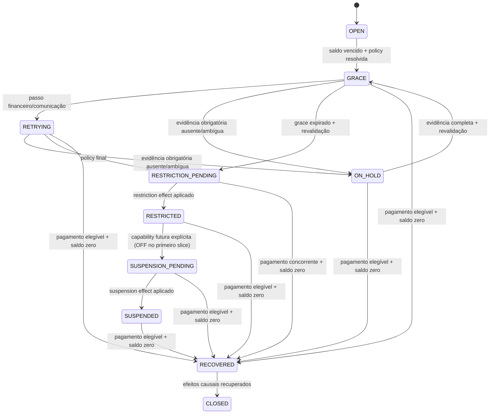

# ADR-0025 - Suspensão de tenant por inadimplência e recuperação segura

- Document ID: `ADR-0025`
- Primary Nature: `Decisao`
- Objective: Fechar `D-09` definindo como uma obrigação vencida aplica restrição financeira gradual e recuperável após sete dias corridos, com comunicação comprovável, sem acoplar acesso ao ASAAS, desativar administrativamente o tenant ou bloquear pagamento/reconciliação.
- Scope: `contexts.billing`, policy de entitlement/acesso, `contexts.tenant`, `contexts.omnichannel`, `contexts.fiscal`, `contexts.client`, `contexts.certificate`, `contexts.notification`, integrações externas, jobs assíncronos, frontend, dunning, grace, suspensão, recuperação, auditoria, observabilidade e isolamento multitenancy.
- Non-objectives: Não implementar, comunicar clientes ou habilitar produção; não definir copy final, retenção legal ou SLO operacional de D-14; não suspender a entidade administrativa `Tenant`; não substituir ADR-0023/ADR-0024; não tratar fraude, abuso, segurança, decisão judicial ou encerramento contratual como inadimplência.
- Keywords: inadimplência, dunning, grace, carência, suspensão, recovery, entitlement, tenant, escritório, business plane, recovery plane, `PAYMENT_DELINQUENCY`, policy versionada, effective-dated, ASAAS, integração, webhook, idempotência
- Related Files: `harness/governance/decisions/ADR-0000-governanca-do-harness-documental.md`, `docs/adrs/ADR-0005-multi-tenancy-architecture.md`, `docs/adrs/ADR-0006-audit-compliance.md`, `docs/adrs/ADR-0010-tenant-plan-parametrization.md`, `docs/adrs/ADR-0011-resilience-retry-circuit-breaker.md`, `docs/adrs/ADR-0012-error-handling-observability.md`, `docs/adrs/ADR-0019-database-per-tenant.md`, `docs/adrs/ADR-0023-agnostic-payment-provider-integration.md`, `docs/adrs/ADR-0024-seguranca-tokenizacao-cartao-recorrente.md`, `docs/product/requirements/REQ-00042-enterprise-multitenant-billing-invoicing.md`, `docs/product/use-cases/UC-00042-billing-payment-reconciliation-dunning.md`, `docs/delivery/plans/TP-00011-billing-asaas-first-release-task-plan.md`, `docs/delivery/plans/implementation_plans/backend/IP-BE-11.3.2-dunning-grace-and-suspension.md`, `docs/architecture/module-registry.md`
- Code References: Baseline em `backend/src/main/java/br/com/duoset/saas_service/contexts/billing/`, `contexts/tenant/`, `contexts/omnichannel/` e demais entry points de integração; símbolos atuais `Subscription`, `BillingApi`, `BillingApiAdapter`, `SuspendOverdueTenantUseCase`, `SubscriptionSuspendedEvent` e `Tenant.suspend()`; alvos planejados `DunningPolicy`, `DunningCase`, `TenantAccessPolicy`, `EntitlementRestriction` e contratos públicos idempotentes de restrição/recuperação.
- Principal Decision: `PAYMENT_DELINQUENCY` produz o eixo separado `FINANCIAL_ACCESS_RESTRICTION`: após sete dias corridos desde `dueAt/overdueAt` e avisos in-app + email nos marcos 0/+3/+6 com evidência obrigatória, Billing aplica somente `RESTRICTED`, bloqueia novas operações pagas/de custo externo e preserva o recovery plane; apenas `PAYMENT_EFFECTIVE` reconciliado, alocado e com saldo elegível zero remove causalmente seus efeitos.
- Date: 2026-08-25
- Status: Accepted
- Version: 2.0
- Decision Provenance: `AI_DELEGATED` para `D-09`; versões propostas anteriores preservam sua proveniência histórica
- Decision Actor: `AI_AGENT — Codex (OpenAI)`
- Authority Basis: `OWNER_DELEGATION — AUTH-BILLING-2026-08-25-001`
- Human Review Status: `NOT_PERFORMED` para a revisão `2.0`
- Reviewability: `OPEN`
- Authors: Codex (Artificial Intelligence), sob autoridade delegada, para a revisão `2.0`; autoria histórica preservada no changelog
- Owners: Arquitetura, Produto, Financeiro e Billing
- Reviewers: AI — análise de arquitetura, domínio, segurança, produto e custo; Human — N/A, nenhuma revisão substantiva de `D-09` foi realizada
- Stakeholders: Tenant Admins, pagadores, Engenharia, Operações, Financeiro, Compliance e owners das integrações
- Supersedes: N/A
- Superseded by: N/A

---

# 0. Decision Provenance

| Field | Value |
| --- | --- |
| Normative status | `Accepted` |
| Decision package | `D-09` |
| Decision provenance | `AI_DELEGATED` |
| Decision actor | `AI_AGENT — Codex (OpenAI)` |
| Authority holder | Solicitante, declarado proprietário do SaaS; identidade não verificada criptograficamente pelo repositório |
| Authority grant | `AUTH-BILLING-2026-08-25-001`, registrada no TP-00013 |
| Human substantive review | `NOT_PERFORMED` |
| Reviewability | `OPEN`; revisão humana pode ratificar, emendar ou superseder sem apagar a origem IA |
| Excluded attestations | Conteúdo jurídico final, entrega real de comunicação, Sandbox/produção, retenção legal, SLO medido e implementação |

`Accepted` torna os defaults de `D-09` normativos sob autoridade delegada, sem
afirmar revisão humana ou execução. Evidência operacional ausente falha a favor do
tenant: o case entra em `ON_HOLD` e não produz restrição material.

---

# 1. Context

## 1.1 Pergunta arquitetural

O produto precisa continuar cobrando sem custodiar cartão. O caminho preferencial
é a recorrência hospedada definida pelo ADR-0024: o ASAAS mantém o instrumento e o
Hub guarda apenas mandato e referências opacas. Mesmo nesse caminho, uma cobrança
pode falhar por limite, expiração, recusa, chargeback, cancelamento ou
indisponibilidade. Pix e boleto também podem vencer sem pagamento.

A pergunta deste ADR é independente do meio:

> Quando uma obrigação SaaS permanece vencida por sete dias corridos, como restringir o
> escritório e impedir novas integrações que gerem serviço ou custo, sem confundir
> inadimplência com suspensão administrativa e sem eliminar o caminho pelo qual o
> cliente paga e recupera o acesso?

## 1.2 Cobertura documental existente

| Fonte | Cobertura | Lacuna |
| --- | --- | --- |
| [ADR-0023](ADR-0023-agnostic-payment-provider-integration.md) | Billing é autoridade local, status externo não suspende diretamente e resultado ambíguo exige reconciliação. | Não define o enforcement cross-module nem quais capacidades sobrevivem. |
| [ADR-0024](ADR-0024-seguranca-tokenizacao-cartao-recorrente.md) | Permite recorrência hospedada sem PAN/CVV/token local e encaminha recusas à policy aprovada. | Declara dunning como non-objective. |
| [REQ-00042](../product/requirements/REQ-00042-enterprise-multitenant-billing-invoicing.md) | `FR-EBILL-128` e `131` exigem dunning, grace e restrição/recuperação configuráveis; `BR-EBILL-032` separa acesso do gateway. | Deve permanecer reconciliado com os defaults aceitos de D-09 sem afirmar implementação. |
| [UC-00042](../product/use-cases/UC-00042-billing-payment-reconciliation-dunning.md) | Desenha `DunningCase` e recuperação idempotente. | Deve refletir `FINANCIAL_ACCESS_RESTRICTION`, notices/evidence e recovery de D-09. |
| [TP-00011](../delivery/plans/TP-00011-billing-asaas-first-release-task-plan.md) | Torna grace/dunning/restrição o gate `0.5` e a atividade `3.2`. | D-09 fecha a decisão; evidência de implementação/rollout permanece bloqueadora. |
| [IP-BE-11.3.2-dunning-grace-and-suspension](../delivery/plans/implementation_plans/backend/IP-BE-11.3.2-dunning-grace-and-suspension.md) | Planeja policy, state machine, scheduler, efeitos e recuperação. | Deve materializar esta decisão; plano não prova código, testes ou operação. |

## 1.3 Evidência e dívida AS-IS

O software atual contém uma aproximação herdada do ADR-0008, hoje
`Superseded`:

- `Subscription.GRACE_PERIOD` fixa três dias;
- `SuspendOverdueTenantUseCase` seleciona `PAST_DUE` pela idade de
  `updated_at`, que não é o vencimento comercial;
- `SubscriptionSuspendedEvent` carrega tenant, texto e timestamp, sem case,
  policy version ou effect ID;
- `BillingApiAdapter.hasAvailableQuota` mistura quota e status financeiro, usa
  `Instant.now()` e aplica fail-open quando não encontra assinatura;
- os consumidores síncronos encontrados cobrem somente parte de Omnichannel/Fiscal;
- não foi identificado consumidor transversal de `SubscriptionSuspendedEvent`;
- `Tenant.suspend()` altera `active=false` e representa suspensão administrativa,
  não uma restrição financeira reversível.

Esse baseline não prova que “todas as integrações param” e não é seguro promovê-lo
como comportamento alvo. Uma atualização técnica pode deslocar `updated_at` e
antecipar ou adiar a suspensão; uma desativação administrativa pode impedir login,
pagamento e recuperação.

## 1.4 Dois planos operacionais

Este ADR usa duas fronteiras:

| Plano | Definição | Comportamento sob `PAYMENT_DELINQUENCY` |
| --- | --- | --- |
| `Business plane` | Funcionalidades que prestam o serviço contratado, consomem quota, geram custo ou iniciam integração de negócio. | Bloqueado conforme o perfil de restrição vigente. |
| `Recovery plane` | Capacidades mínimas para autenticar, compreender a dívida, pagar, reconciliar, operar segurança e restaurar acesso. | Permanece disponível e monitorado. |

“Suspender o escritório e parar todas as integrações” significa interromper novas
operações do business plane. Não significa desligar processos necessários para
receber a regularização nem apagar, revogar ou corromper dados existentes.

## 1.5 Restrições

- Billing local, e não ASAAS, decide se existe saldo vencido elegível.
- Redirect, callback ou um único webhook não provam pagamento nem inadimplência
  terminal.
- Cobrança recorrente não elimina dunning: cartão hospedado também pode falhar.
- A policy deve ser reproduzível depois de alterações comerciais.
- Um tenant pago não pode permanecer suspenso porque o próprio caminho de
  reconciliação foi bloqueado.
- Suspensão e recuperação atravessam bounded contexts e exigem contratos públicos;
  Billing não pode importar internals dos consumidores.
- O status `Accepted` torna o desenho normativo; execução continua sujeita aos
  gates de evidência, segurança e rollout.

---

# 2. Decision Statement

## 2.1 Acceptance and execution guard

Este ADR está `Accepted` por decisão de IA sob autoridade delegada. Ele fecha
classificação, tempo, comunicação, perfil e recuperação de `D-09`, mas não autoriza
migration, scheduler, mensagem real, restrição de tenant, Sandbox ou produção.
Execução permanece `OFF` até os planos, contratos, inventário de entry points,
testes, observabilidade e rollout de D-13/D-14 estarem verdes.

## 2.2 Regra central

O sistema DEVE:

1. detectar saldo vencido a partir da obrigação/fatura local;
2. resolver uma `DunningPolicy` vigente e autorizada;
3. abrir no máximo um `DunningCase` efetivo para a mesma obrigação/policy;
4. congelar a referência ou snapshot da policy no caso;
5. calcular `graceEndsAt` a partir de `overdueAt`, nunca de `updated_at`;
6. emitir avisos in-app + email nos marcos `overdueAt`, `+3 dias` e `+6 dias`,
   cada um com evidência durável de dispatch/aceite da mensagem versionada;
7. quando faltar qualquer evidência obrigatória, mover o case para `ON_HOLD`,
   alertar e não aplicar restrição;
8. revalidar saldo, comunicação e resultado ambíguo imediatamente antes do efeito material;
9. em `overdueAt + 7 dias corridos`, solicitar idempotentemente somente o estágio
   `RESTRICTED`, classificado como `FINANCIAL_ACCESS_RESTRICTION` com reason code
   `PAYMENT_DELINQUENCY`;
10. bloquear novas operações pagas ou que iniciem custo externo, conforme Section 2.7;
11. manter `SUSPENDED` representável no modelo, mas com escalada automática `OFF`;
12. preservar o recovery plane;
13. após `PAYMENT_EFFECTIVE` reconciliado e alocado zerar o saldo elegível da
    obrigação, solicitar recuperação idempotente somente dos efeitos causados por
    seu `DunningCase`; nunca reabilitar globalmente o tenant enquanto outro efeito
    impeditivo permanecer ativo.

## 2.3 `DunningPolicy` versionada e effective-dated

O default inicial não será uma constante espalhada no código. A duração pertence
a uma policy com, no
mínimo:

| Dimensão | Regra |
| --- | --- |
| Identidade | `policyCode` e `policyVersion` imutáveis. |
| Vigência | `effectiveFrom` obrigatório e `effectiveTo` opcional, sem overlap no mesmo escopo/prioridade. |
| Escopo | Default seller-owned da entidade legal no primeiro slice; produto/segmento/tenant overrides ficam `OFF`. |
| Anchor | `overdueAt` derivado do vencimento canônico da obrigação com saldo aberto. |
| Carência | Sete dias corridos desde `overdueAt`; instantes em UTC e calendário/timezone IANA da policy contratual, sem feriados ou dias úteis. |
| Comunicação | In-app + email em `D+0`, `D+3`, `D+6`, com template/version, destinatário autorizado, idempotency key, timestamp e outcome duráveis. |
| Passos | Aviso e restrição independentes; retries financeiros não são presumidos; hold/waiver comercial ficam `OFF`. |
| Perfil | `RESTRICTED` bloqueia novas operações pagas/de custo externo; `SUSPENDED` é representável, mas sua escalada automática fica `OFF`; recovery plane permanece permitido. |
| Encargos | Juros, multa e desconto por antecipação iguais a zero e capabilities `OFF`. |
| Recuperação | Evento elegível, SLA, transição e resposta a reversal. |
| Governança | Owner, aprovação, reason, effective date e audit trail. |

Alterar a duração, canais ou marcos cria nova versão com vigência. Não edita cases abertos, não recalcula
retroativamente uma suspensão e não reescreve audit trail. O case registra
`policyCode`, `policyVersion`, `overdueAt`, `graceEndsAt` e o perfil aplicado.

### 2.3.1 Resolução determinística

A resolução do primeiro slice aceita somente o default seller-owned da entidade
legal. Scope de produto/segmento e override tenant-scoped são extensões futuras
`OFF`, dependentes de nova decisão/policy versionada; sua ausência não permite
parâmetro ad hoc.

Ausência, overlap, empate de prioridade ou policy fora de vigência resulta em
`BILLING_RULE_NOT_EFFECTIVE`. O sistema alerta e não suspende por fallback
silencioso. Tenant Admin não escolhe a carência nem reduz controles por parâmetro de API,
salvo produto self-service futuro aprovado em requisito e ADR.

### 2.3.2 Comunicação obrigatória e `ON_HOLD`

Cada marco gera duas mensagens pelo outbox: uma in-app e uma por email. A evidência
mínima não afirma leitura pelo destinatário; prova que o sistema selecionou o
contato autorizado, congelou template/locale/version, persistiu idempotency key,
submeteu o comando e recebeu outcome durável do canal. PII e conteúdo integral não
entram em logs ou métricas.

Uma policy pode exigir outcome `DISPATCHED` ou `ACCEPTED_BY_CHANNEL`, mas não pode
tratar ausência de registro, timeout, dead letter, endereço inexistente ou resultado
ambíguo como aviso cumprido. Se qualquer evidência requerida de `D+0`, `D+3` ou
`D+6` faltar na revalidação de `D+7`, o case entra em `ON_HOLD`, novas tentativas de
comunicação/reconciliação continuam e nenhuma restrição é publicada.

Esse `ON_HOLD` é um safety state automático, não a capability comercial de
adiamento. Hold manual, promise-to-pay que pause enforcement, waiver/perdão,
juros, multa e desconto por antecipação permanecem `OFF` no primeiro slice.

## 2.4 Fonte temporal e elegibilidade

`overdueAt` DEVE derivar do `dueAt` canônico da obrigação/fatura e de saldo local
aberto, considerando allocations, créditos e ajustes autorizados. Não pode derivar
de:

- `updated_at` de subscription/invoice;
- horário de recebimento do webhook;
- callback do browser;
- status proprietário ASAAS isolado;
- falha técnica, timeout ou circuit breaker;
- ausência temporária de consulta ao provider.

Resultado externo `UNKNOWN`, divergência de reconciliação, disputa ou payment
concorrente pausa qualquer efeito de suspensão até decisão segura.

### 2.4.1 Elegibilidade financeira e causalidade da recuperação

Cada `DunningCase` representa uma obrigação vencida identificável e mantém sua
própria cadeia de efeitos. O estado de acesso do tenant é uma projeção agregada dos
efeitos ativos, não um boolean sobrescrito pelo último pagamento recebido.

O default seguro para recuperar um case é cumulativo:

1. existe `PAYMENT_EFFECTIVE` causal, derivado conforme ADR-0023 e reconciliado;
2. a allocation foi confirmada contra a obrigação correta;
3. o saldo elegível dessa obrigação é exatamente zero;
4. não existe `UNKNOWN`, divergência, hold ou disputa que torne o resultado
   ambíguo.

Pagamento parcial, allocation parcial, crédito insuficiente ou pagamento não
alocado NÃO move o case para `RECOVERED` enquanto houver saldo elegível residual.
Threshold de tolerância, baixa, perdão, write-off ou waiver não equivalem a
pagamento e não recuperam acesso no primeiro slice. Essas capabilities ficam
`OFF`; aplica-se zero exato na unidade monetária canônica.

Ao recuperar, Billing publica nova identidade causal que aponta para o
`dunningCaseId` e para os `effectId` exatos a encerrar. O consumidor desativa
somente esses efeitos. Se outra obrigação possuir efeito
`PAYMENT_DELINQUENCY` ativo, o entitlement continua `RESTRICTED` ou `SUSPENDED`
conforme o maior estágio restante. Também permanecem intactos efeitos
administrativos, legais, de segurança ou de qualquer outro reason code.

## 2.5 Separação de estados

Os seguintes eixos permanecem independentes:

| Eixo | Exemplos | Autoridade |
| --- | --- | --- |
| Contrato/assinatura | `ACTIVE`, `PAUSED`, `CANCELED` | Billing contratual |
| Collection da obrigação | `OPEN`, `PAST_DUE`, `IN_DUNNING`, `PAID` | Billing financeiro local |
| Dunning | `OPEN`, `GRACE`, `RETRYING`, `ON_HOLD`, `RESTRICTION_PENDING`, `RESTRICTED`, `SUSPENSION_PENDING`, `SUSPENDED`, `RECOVERED`, `CLOSED` | `DunningCase` |
| Restrição financeira de acesso | `NONE`, `RESTRICTED`, `SUSPENDED`, `RECOVERING` | `FINANCIAL_ACCESS_RESTRICTION`, owner Billing/Entitlements |
| Risco/segurança | `RISK_RESTRICTION` conforme ADR-0029 | Owner de Segurança/Compliance; nunca usado para inadimplência |
| Tenant administrativo | ativo, suspenso por administração/segurança, encerrado | Tenant Management |
| Provider | status ASAAS/Stripe projetado | Adapter e reconciliação |

Inadimplência NÃO chama `Tenant.suspend()` e NÃO altera `Tenant.active`. A
restrição financeira é uma entidade/estado próprio, reversível, com
`restrictionType=FINANCIAL_ACCESS_RESTRICTION` e
`reasonCode=PAYMENT_DELINQUENCY`. Ela não é `RISK_RESTRICTION`,
`OPERATIONAL_EXCEPTION` nem alteração do contrato. Suspensões administrativas, de segurança ou
legais usam outros fluxos e não são sobrescritas por pagamento.

`RESTRICTED` é o único estágio material automático do primeiro slice após a
carência. `SUSPENDED` permanece representável para evolução compatível, mas nenhuma
policy publicável pode agendá-lo e sua escalada automática fica `OFF`. Uma decisão
futura precisa definir novo passo/limiar, comunicação, perfil, alçada e rollout;
até lá o case permanece em `RESTRICTED`. Ambos preservam o recovery plane e aceitam
recuperação causal.

## 2.6 Contrato cross-module

Billing é owner do saldo, `DunningCase` e elegibilidade financeira. O
Tenant/Entitlement boundary é owner da decisão de acesso aplicada. A comunicação
ocorre somente por API pública/evento canônico, nunca por import de internals.

Cada efeito material possui:

- `effectId` estável;
- `tenantId` e billing account resolvidos;
- `dunningCaseId`;
- `policyCode` e `policyVersion`;
- `restrictionType=FINANCIAL_ACCESS_RESTRICTION`;
- `reasonCode=PAYMENT_DELINQUENCY`;
- `effectiveAt`;
- `stage` canônico da progressão, como `RESTRICTED` ou `SUSPENDED`;
- `restrictionProfileCode`;
- causalidade/correlation ID;
- schema version.

O contrato de restrição é idempotente: replay do mesmo `effectId` devolve o
resultado anterior; payload divergente com a mesma identidade é conflito. O
contrato de recuperação usa nova identidade causal, inclui o mesmo
`dunningCaseId` e referencia os `effectId` materiais que encerra. Ele também
aplica no máximo uma vez. Seu resultado é a remoção causal desses efeitos, não um
comando global `set ENABLED`: a projeção recalcula o maior estágio entre todos os
efeitos ainda ativos do tenant.

Consumidores não consultam ASAAS, não calculam carência e não inferem atraso. Eles
aplicam a projeção de entitlement e registram o efeito. Falha parcial é
reprocessável por outbox/event publication e consumer dedupe.

## 2.7 Business plane bloqueado

Após a restrição efetiva, toda nova operação que dependa de capability paga,
reserve quota faturável ou inicie custo/efeito externo DEVE ser negada antes da
reserva/chamada. Leitura administrativa e export autorizado de dados já existentes
permanecem disponíveis; não são convertidos em acesso ao serviço pago.

| Área | Bloquear | Tratamento seguro |
| --- | --- | --- |
| Omnichannel/chatbot | Nova execução de chatbot, LLM, consulta fiscal iniciada pelo canal e envio de resposta de negócio. | Ingress autenticado pode ser aceito/deduplicado para evitar retry storm; responder somente mensagem transacional aprovada, sem chamar integrações pagas. |
| Fiscal/SERPRO | Nova consulta, emissão ou mutação externa. | Histórico já produzido permanece conforme autorização/retenção; trabalho não iniciado falha com reason canônico. |
| Client | Nova operação que dependa de entitlement pago ou dispare integração. | Leitura administrativa mínima segue perfil aprovado; nenhuma mutação indireta contorna o guard. |
| Certificate | Uso do certificado para iniciar nova integração de negócio. | Não apagar/revogar certificado; manutenção de segurança, expiração e auditoria continuam. |
| LLM e providers auxiliares | Nova chamada tarifada ou geração associada ao serviço. | Fallback não contorna suspensão. |
| Schedulers/workers de negócio | Novo item tenant-scoped que geraria efeito externo. | Reavaliar entitlement no início do item; checkpointar `RESTRICTED`/`SUSPENDED` sem travar outros tenants. |
| APIs e frontend de negócio | Commands/mutations protegidos. | Resposta canônica, sem expor dívida a ator sem permissão. |
| Administração e export | Nenhuma leitura administrativa é bloqueada apenas por inadimplência. | Permitir consulta e export autorizado de dados existentes, Billing, segurança e suporte; impedir que export dispare enriquecimento, recomputação ou provider pago. |

Uma chamada já enviada a terceiro não é “desfeita” por apagar estado. O protocolo
de in-flight, cancelamento e compensação segue a capability e a policy aprovada.

Nenhum módulo pode manter allowlist privada capaz de reabilitar o serviço. O perfil
de restrição é central, versionado e testado contra o inventário de entry points.

## 2.8 Recovery plane preservado

As capacidades seguintes DEVEM continuar funcionando durante suspensão financeira:

1. autenticação e sessão necessárias para Tenant Billing Admin autorizado;
2. visão de Billing, faturas, saldo, prazo e estado de dunning permitido, além de
   leitura administrativa/export autorizado de dados já existentes;
3. obtenção de checkout/link hospedado e regularização;
4. nova jornada hospedada para atualizar/substituir cartão, quando certificada;
5. callbacks server-controlled que apenas iniciem consulta do estado local;
6. webhook ASAAS autenticado, inbox sanitizada, outbox, dedupe e processamento;
7. polling/reconciliação de payment, checkout, subscription e resultado `UNKNOWN`;
8. allocation, fechamento/recuperação do `DunningCase` e publicação do recovery;
9. remoção causal idempotente dos efeitos do case e recomputação do entitlement;
10. auditoria, segurança, suporte autorizado e notifications de cobrança;
11. operações de cancelamento que evitem nova cobrança indevida;
12. health/observabilidade e tarefas técnicas indispensáveis à recuperação.

O recovery plane não oferece uma rota genérica para funcionalidade de negócio.
Cada bypass exige capability enumerada, finalidade explícita, RBAC e teste
negativo. Bloquear webhook, reconciliação ou checkout durante rollback é defeito
crítico, pois pode prolongar suspensão após pagamento.

## 2.9 Jornada e concorrência

```mermaid
sequenceDiagram
    participant A as ASAAS/rail
    participant B as Billing
    participant D as DunningCase
    participant E as Entitlement/Tenant Access
    participant M as Módulos de negócio
    participant P as Pagador

    B->>B: Obrigação local alcança dueAt com saldo
    B->>D: Abre case e fixa policy/version
    D->>D: Calcula graceEndsAt
    A-->>B: Eventos/tentativas durante grace
    B->>B: Autentica, deduplica e reconcilia
    alt pagamento elegível durante a carência
        B->>D: Allocation confirmada + saldo zero; case RECOVERED/CLOSED
    else grace termina com saldo certo
        D->>D: Revalida saldo e ambiguidade
        D->>E: Restrict(effectId, caseId, PAYMENT_DELINQUENCY)
        E-->>D: applied/already-applied
        E-->>M: Projeção RESTRICTED
        opt capability futura de escalada; OFF no primeiro slice
            D->>E: Suspend(suspensionEffectId, caseId)
            E-->>M: Projeção SUSPENDED
        end
        M-->>P: Business plane negado; Billing permitido
        P->>A: Paga em jornada hospedada
        A-->>B: Webhook + consulta reconciliada
        B->>D: Fato elegível + allocation + saldo da obrigação zero
        D->>E: Recover(recoveryEffectId, caseId, targetEffectIds)
        E-->>M: Recalcula projeção pelos efeitos ativos restantes
    end
```

Pagamento concorrente com suspensão exige lock/version ou protocolo equivalente.
Antes de publicar `Restrict`, o worker revalida saldo, allocations, `UNKNOWN`,
holds e versão. Se o pagamento vencer a corrida, não suspende; se a restrição já
foi aplicada, o recovery converge exatamente uma vez.

## 2.10 Estado do `DunningCase`



`WRITTEN_OFF`, cancelamento contratual, fraude ou dispute não são sinônimos de
`PAID` e não restauram/suspendem silenciosamente. Se entrarem no produto, usam
transições e policies aprovadas.

`RECOVERED` e `CLOSED` são estados do case, não garantia de entitlement global
`ENABLED`. Ao entrar em `RECOVERED`, o case solicita o encerramento apenas de seus
efeitos `RESTRICTED`/`SUSPENDED`; ao entrar em `CLOSED`, comprova que esses efeitos
foram aplicados como recuperados. Outro case ou reason ativo mantém a projeção no
estágio agregado correspondente.

As transições `SUSPENSION_PENDING`/`SUSPENDED` existem apenas para compatibilidade
do modelo e evolução futura. Nenhuma `DunningPolicy` do primeiro slice pode
selecioná-las; seu feature flag é invariavelmente `OFF`.

## 2.11 Configuração e autorização

- O primeiro slice publica somente o default seller-owned; override por
  tenant/segmento self-service fica `OFF` e nunca vem do adapter ASAAS.
- Preview mostra população, effective date, policy anterior/nova e efeito esperado.
- Alteração material exige audit trail; four-eyes é obrigatório quando alçada
  aprovada assim determinar.
- Evolução futura de override exige escopo, justificativa, início, expiração,
  owner, approval e nova versão de policy.
- Hold manual, promise-to-pay com pausa e waiver ficam `OFF`; `ON_HOLD` existe
  somente como estado fail-safe por evidência/ambiguidade.
- Toda leitura/mutação resolve tenant antes do repository.
- Operação global usa projeção administrativa autorizada, não percorre bancos
  arbitrariamente.

## 2.12 Frontend e respostas

O frontend:

- exibe estados canônicos separados de contrato, cobrança e acesso;
- informa prazo e próxima ação somente com dados calculados pelo servidor;
- mantém CTA de pagamento/atualização hospedada acessível durante suspensão;
- não calcula carência, juros, multa, saldo ou recovery;
- não confia em query param/callback para restaurar a UI;
- reconsulta o estado interno após retorno do provider;
- não expõe provider IDs, policy interna, documento do pagador ou causa financeira
  a ator sem permissão;
- oferece mensagem acessível e i18n para a negação canônica.

APIs retornam problem code estável, por exemplo
`BILLING_FINANCIAL_ACCESS_RESTRICTED`, e action segura quando autorizada. O status HTTP
definitivo e o payload pertencem ao contrato API aprovado, não a decisões locais
de componentes.

## 2.13 Falha segura e rollback

| Condição | Comportamento |
| --- | --- |
| Policy ausente/ambígua | Não suspender; alertar `BILLING_RULE_NOT_EFFECTIVE`. |
| Provider `UNKNOWN` ou reconciliação pendente | Pausar efeito material. |
| Evento externo sem tenant mapping | Quarentena; nunca datasource default. |
| Consumer de restrição indisponível | Preservar intent/outbox e reprocessar o mesmo effect ID. |
| Módulo sem projeção aplicável | Não inventar `ACTIVE`; sinalizar rollout incompleto e manter flag do módulo desligada. |
| Pagamento durante grace | Fechar/recuperar o case somente com allocation confirmada e saldo elegível zero. |
| Pagamento após restrição/suspensão | Recovery plane encerra idempotentemente apenas os efeitos daquele case; outros efeitos ativos continuam restringindo. |
| Reversal após recovery | Nova decisão/caso conforme policy; não editar o efeito anterior. |
| Rollback do scheduler | Parar novos passos, preservar cases, ingestão de pagamentos, reconciliação e recovery. |
| Tenant administrativamente suspenso | Pagamento não o reativa; reason axes independentes. |

---

# 3. Decision Drivers

- Permitir recorrência e cobrança sem que uma falha de cartão gere acesso gratuito
  indefinido.
- Aplicar a mesma política a cartão, Pix, boleto e providers futuros.
- Manter Billing como fonte de verdade financeira local.
- Evitar falso positivo causado por webhook, timeout ou status proprietário.
- Tornar o default de sete dias versionado, auditável e reproduzível.
- Interromper novas operações que gerem custo ou prestação de serviço.
- Garantir que o cliente consiga pagar e recuperar o acesso.
- Não confundir inadimplência com suspensão administrativa, segurança ou
  encerramento.
- Preservar isolamento tenant, idempotência, concorrência e recuperação após
  restart.
- Oferecer evidência operacional, jurídica e financeira revisável.
- Impedir que cada integração implemente sua própria regra de atraso.

---

# 4. Considered Options

## Option 1 - Desativar administrativamente o tenant

Description:

Chamar `Tenant.suspend()` ou definir `active=false` quando o pagamento vence.

Pros:

- Aproveita um estado já existente.
- Parece bloquear o sistema de forma abrangente.

Cons:

- Mistura motivo financeiro com administração, segurança e lifecycle.
- Pode bloquear login, Billing e recuperação.
- Pagamento poderia reativar um tenant suspenso por outro motivo.
- Não oferece policy version, grace anchor, reason axis ou effect ID.

Decision: Rejected.

## Option 2 - Cada módulo consulta Billing/ASAAS e decide

Description:

Omnichannel, Fiscal e demais módulos consultam status de subscription/payment e
aplicam suas próprias regras.

Pros:

- Mudanças locais aparentam ser rápidas.
- Cada módulo escolhe seu comportamento.

Cons:

- Duplica carência, calendário e semântica de estados.
- Cria dependência síncrona e acoplamento ao provider.
- Produz janelas inconsistentes e bypass por entry point.
- Dificulta recuperação exatamente uma vez.

Decision: Rejected.

## Option 3 - Bloquear absolutamente tudo

Description:

Negar login, APIs, workers, webhooks e integrações quando o tenant está vencido.

Pros:

- Reduz rapidamente o business plane.
- É simples de explicar como “tenant desligado”.

Cons:

- Bloqueia pagamento, webhook, reconciliação e restauração.
- Cria retry storms externos e suspensão indefinida após regularização.
- Pode interromper segurança, auditoria e obrigações de retenção.

Decision: Rejected.

## Option 4 - Policy local versionada, entitlement separado e recovery plane

Description:

Billing conduz `DunningCase` por policy effective-dated, solicita efeito idempotente
a um boundary de entitlement e bloqueia o business plane, preservando capacidades
enumeradas de recuperação.

Pros:

- Provider-neutral e aplicável a todos os rails.
- Auditável, reproduzível e testável.
- Evita confundir tenant administrativo com acesso financeiro.
- Permite pagamento e recuperação durante suspensão.
- Centraliza regra sem acoplar módulos a internals de Billing.

Cons:

- Exige novo modelo, contracts, projeções e inventário de entry points.
- Requer coordenação cross-module, concorrência e rollout cuidadoso.
- Mantém uma superfície mínima ativa que precisa de segurança própria.

Decision: Chosen.

## Option 5 - Somente comunicação, sem suspensão

Description:

Manter acesso indefinidamente e enviar avisos de pagamento.

Pros:

- Menor risco de falso bloqueio.
- Implementação inicial simples.

Cons:

- Não controla custo/serviço após inadimplência persistente.
- Não atende à decisão de suspensão parametrizável.
- Incentiva dívida acumulada e intervenção manual.

Decision: Rejected como target; permanece default temporário até os gates.

---

# 5. Decision Outcome

A Option 4 foi selecionada. Ela separa corretamente fato financeiro, decisão de
dunning, estado de entitlement e lifecycle administrativo. A suspensão deixa de
ser uma tradução de `OVERDUE` do ASAAS e passa a ser efeito local, policy-driven,
idempotente e reversível.

O tradeoff aceito é implementar uma fronteira adicional de acesso e proteger o
recovery plane. Essa complexidade é necessária: uma flag administrativa única não
consegue distinguir “não prestar novos serviços” de “permitir que o cliente pague”.

Este ADR complementa o fluxo preferencial do ADR-0024. Se a recorrência hospedada
for certificada, referências opacas apontam para a assinatura ASAAS e recusas
entram no mesmo dunning. Se não for, checkout hospedado avulso por invoice usa a
mesma policy. A capacidade de suspender não depende de armazenar cartão nem de
recorrência.

---

# 6. Consequences

## Positive Consequences

- PAN/CVV/token continuam fora do Hub; suspensão não exige cartão local.
- Um único modelo governa cartão recorrente, checkout avulso, Pix e boleto.
- A carência pode evoluir por nova versão, sem redeploy ou alteração retroativa de cases.
- Tenant conserva caminho de reconciliação; a regularização integral de cada
  obrigação remove somente seu efeito causal e o acesso global só retorna quando
  nenhum outro efeito impeditivo permanecer.
- Integrações param antes de produzir novo custo/efeito.
- Suspensão administrativa e financeira deixam de compartilhar um boolean.
- Replay, restart e concorrência possuem identidade e resultado determinísticos.
- Auditoria consegue explicar qual policy, vencimento e efeito causaram a restrição.

## Negative Consequences

- Todos os entry points, workers e integrações de negócio precisam de inventário e
  teste de enforcement.
- Billing, Tenant/Entitlement, Notification e módulos consumidores ganham contratos
  e projeções adicionais.
- Rollout parcial pode produzir módulos bloqueados e outros liberados.
- Recovery plane exige hardening para não virar bypass do business plane.
- Copy jurídica final, retenção e evidência operacional ainda exigem validação dos
  owners competentes antes do rollout.

## Neutral Consequences

- `SubscriptionStatus.SUSPENDED` do baseline vira compatibilidade, não autoridade
  do target.
- O reason `PAYMENT_DELINQUENCY` passa a coexistir com motivos administrativos e
  de segurança sem substituí-los.
- O frontend precisa apresentar vários eixos em vez de um único status.
- O provider continua cobrando/guardando o cartão conforme mandato e comandos
  externos; suspensão local não cancela automaticamente a assinatura ASAAS.

---

# 7. Impact

## Architecture

- Introduz boundary público de entitlement/acesso entre Billing e consumidores.
- Proíbe dependência dos módulos de negócio em status/DTO ASAAS.
- Exige outbox/publication, consumer dedupe e projeção tenant-safe.
- Mantém separação de bounded contexts e database-per-tenant.

## Backend

- Substituir grace hardcoded e `updated_at` por policy/anchor canônicos.
- Modelar `DunningPolicy`, `DunningCase`, steps, effects, agregação causal e
  recovery por obrigação.
- Implementar guards em HTTP, casos de uso, schedulers e consumidores assíncronos.
- Não reutilizar `Tenant.suspend()` para inadimplência.
- Manter webhook/reconciliação/recovery disponíveis sob restrição.

## Frontend

- Exibir collection, dunning e entitlement separadamente.
- Preservar billing portal/checkout e ação de atualização.
- Bloquear CTAs de negócio com resposta server-driven.
- Não calcular prazo ou interpretar callback como pagamento.

## Data Architecture

- Cases e steps ficam no store Billing tenant-scoped.
- Restrição aplicada e reasons ficam sob o owner do acesso/Tenant, sem copiar
  detalhes financeiros desnecessários.
- Policy snapshot/ref, effect IDs, uniqueness, version e timestamps são persistidos.
- Nenhuma PII financeira, payload provider ou dado de cartão entra no modelo.

## Security and Privacy

- BOLA e cross-tenant access falham antes do repository/mutação.
- Recovery endpoints usam RBAC, rate limiting, purpose e audit.
- Mensagem de suspensão não expõe saldo/meio de pagamento a usuário não autorizado.
- Replay/reconcile manual exige autorização e auditoria; overrides, hold manual e
  waiver não estão disponíveis no primeiro slice.

## Operations and Observability

- Métricas usam baixa cardinalidade por state/policy code, sem tenant em label.
- Alertar backlog, policy ausente, efeito pendente, conflito, recovery atrasado e
  módulos sem projeção.
- Dashboards separam atraso, restrição solicitada, aplicada e recuperada.
- Kill switches param novos passos por coorte/módulo sem parar recovery.

## Commercial and Support

- Contratos precisam declarar grace, comunicação, suspensão e recuperação.
- Suporte vê timeline sanitizada e ações permitidas; não muda banco/status.
- Exceções comerciais são versionadas, temporárias e auditadas.

---

# 8. AI Agent Considerations

## Agent Roles Impacted

| Agent | Responsabilidade |
| --- | --- |
| Architect Agent | Preservar boundaries, state axes, contracts públicos e recovery plane. |
| Product/Finance Agent | Preservar defaults aprovados, preparar copy/evidência e propor futuras versões sem retroatividade. |
| Backend Agent | Implementar policy/case/effects sem importar internals ou status ASAAS. |
| Frontend Agent | Manter cobrança acessível e não inferir estados no browser. |
| Security Agent | Threat model do recovery plane, RBAC, BOLA, overrides e bypasses. |
| SRE Agent | Rollout por coorte, kill switches, backlog, recovery SLO e rollback. |
| QA Agent | Matriz cross-module, temporal, concorrência, restart e A→B. |
| Documentation Agent | Atualizar REQ/UC/TP/IP sem declarar decisão aceita ou código pronto. |

## Autonomy Limits

Agentes NÃO PODEM:

- alterar unilateralmente sete dias corridos, canais/marcos ou
  `FINANCIAL_ACCESS_RESTRICTION`;
- habilitar scheduler, comunicação ou suspensão real;
- usar `Tenant.suspend()` para acelerar o slice;
- bloquear checkout, webhook, reconciliação ou recovery;
- criar bypass não enumerado no recovery plane;
- inferir pagamento por redirect/callback;
- traduzir status ASAAS diretamente em entitlement;
- editar policy aplicada a case aberto;
- tratar hold/waiver/write-off como payment ou recovery;
- habilitar produção, acessar dados reais ou contatar clientes.

Descoberta de um entry point de negócio sem guard é blocker de rollout. Descoberta
de recovery bloqueado é incidente funcional crítico e exige correção antes da
coorte seguinte.

---

# 9. Implementation Plan

Este plano descreve a sequência futura. Não inicia backend ou frontend.

## Phase 0 - Decisões e requisitos

1. Reconciliar o aceite `AI_DELEGATED` nos REQ/UC/TP sem inferir implementação.
2. Materializar sete dias corridos, D+0/D+3/D+6 in-app+email, perfil
   `RESTRICTED` e capabilities desligadas nos contratos versionados.
3. Materializar `PAYMENT_EFFECTIVE` + allocation + saldo elegível zero como
   recovery causal.
4. Atualizar REQ-00042, UC-00042 e TP-00011 gate `0.5`.
5. Manter o boundary em Billing/Entitlements conforme ADR-0037 e congelar
   contratos públicos versionados antes de código.

## Phase 1 - Inventário e threat model

1. Inventariar HTTP endpoints, use cases, events, schedulers e workers por módulo.
2. Classificar cada capacidade em business ou recovery plane.
3. Threat-modelar bypass, BOLA, replay, stale projection e falha parcial.
4. Congelar reason codes, problem details, event schema e effect identity.

## Phase 2 - Policy e dunning

1. Implementar `DunningPolicy` effective-dated e resolução determinística.
2. Implementar `DunningCase`, steps e state machine com `Clock`, publicando
   somente `RESTRICTED`; `SUSPENDED` permanece representável e desabilitado.
3. Criar migrations aditivas, constraints, índices, leases e repositories.
4. Abrir cases a partir de obrigação local e não de status externo.
5. Implementar dry-run/shadow sem comunicação ou restrição.

## Phase 3 - Entitlement e enforcement

1. Implementar contrato público de restriction/recovery e consumer dedupe.
2. Criar projeção de acesso separada de `Tenant.active`.
3. Aplicar guards nos entry points e workers do business plane.
4. Manter allowlist fechada do recovery plane.
5. Adicionar testes arquiteturais que detectem integração sem guard.

## Phase 4 - Frontend e operação

1. Expor projeções canônicas e hosted recovery actions.
2. Implementar UI de grace/restrição/regularização e acessibilidade/i18n.
3. Criar somente replay/reconcile seguro com RBAC e auditoria; hold/override/waiver
   permanecem fora do primeiro slice.
4. Configurar métricas, alertas, runbook e filas operacionais.

## Phase 5 - Certificação e rollout

1. Certificar no Sandbox pagamentos durante grace, `RESTRICTED` e recovery.
2. Executar dry-run com dados sintéticos e comparar decisões esperadas.
3. Habilitar coorte interna/canary, um módulo por vez, com flags default-off.
4. Provar business plane bloqueado e recovery plane funcional.
5. Ensaiar rollback preservando pagamentos/recovery.
6. Obter aceite Produto, Financeiro, Jurídico, Segurança, SRE e QA.

## Migration Strategy

- Não inferir `overdueAt` de `updated_at` legado.
- Classificar assinaturas `PAST_DUE/SUSPENDED` em `MAPPABLE`,
  `REQUIRES_RECONCILIATION`, `REQUIRES_POLICY_DECISION` ou `INCONSISTENT`.
- Backfill gera preview; não abre case nem aplica restrição até aprovação.
- O grace histórico de três dias não vira default por conveniência.
- Migrations são aditivas; retirada do status legado ocorre somente após
  compatibilidade, telemetria e rollback aprovados.

## Rollback

- Desabilitar case worker/restriction publisher impede novos efeitos.
- Não excluir cases, steps, effects ou audit trail.
- Ingestão de payment, webhook, reconciliação e recovery continuam.
- Restrição já aplicada é compensada por recovery effect autorizado, nunca por
  update manual.
- Policy rollback cria nova versão/effective date.

---

# 10. Validation

## 10.1 Architecture and contract tests

- Billing não importa internals de Tenant/Omnichannel/Fiscal.
- Consumidores não importam DTO/status ASAAS nem calculam carência.
- Restriction/recovery schemas têm versão, IDs, tenant e reason allowlisted.
- Mesmo effect ID e payload retorna mesmo resultado; payload divergente conflita.
- `PAYMENT_DELINQUENCY` não altera `Tenant.active`.

## 10.2 Policy and temporal tests

- Boundary exato de `dueAt`, `graceEndsAt=overdueAt+7 dias corridos` e timezone IANA aprovado.
- D+0/D+3/D+6 geram in-app + email idempotentes; evidência ausente em qualquer
  marco leva a `ON_HOLD` e produz zero restriction effect.
- Policy v1 continua em case aberto após publicação da v2.
- Overlap/ausência/empate falha sem suspensão.
- `updated_at` nunca influencia elegibilidade.
- Clock controlado; nenhum wall clock oculto no domínio.

## 10.3 Financial integrity and concurrency

- Payment antes do grace: zero suspensão.
- Payment concorrente: no máximo uma restrição e uma recuperação convergente.
- Pagamento/allocation parcial com saldo residual: zero recovery.
- Recuperar case A encerra somente seus efeitos; case B ativo mantém o tenant no
  maior estágio agregado aplicável.
- Recovery a partir de `RESTRICTED` e de `SUSPENDED` converge sem saltar a
  validação de saldo zero.
- `UNKNOWN`/divergência: efeito material pausado.
- Replay/restart/two-instance: um case e um effect.
- Reversal não edita efeitos históricos.
- Juros, multa, antecipação, hold manual e waiver permanecem zero/`OFF`.
- `SUSPENDED` não é alcançável por nenhuma policy publicável do primeiro slice.

## 10.4 Cross-module enforcement matrix

Para cada HTTP entry point, event consumer, scheduler e worker:

- tenant A não influencia tenant B;
- nova operação paga/de custo externo não inicia chamada quando `RESTRICTED`;
- leitura administrativa/export autorizado de dados existentes continuam ativos;
- fallback não contorna o guard;
- in-flight segue protocolo explícito;
- recovery capability continua ativa;
- módulos não cobertos impedem rollout global.

## 10.5 Recovery-plane tests

- Billing Admin autenticado acessa invoice e hosted action.
- Usuário sem permissão não vê dívida nem ação sensível.
- Webhook é aceito, deduplicado e processado durante suspensão.
- Reconciliation resolve payment `UNKNOWN`.
- Pagamento elegível encerra exatamente uma vez os efeitos do case pago; efeitos
  de outros cases/reasons continuam aplicados.
- Rollback mantém o recovery path.
- Recovery endpoint não permite executar serviço de negócio.

## 10.6 Security, observability and operations

- BOLA A→B, forged event, stale version e replay divergente falham.
- Logs/traces/eventos não expõem PII, saldo indevido ou payload provider.
- Métricas não usam tenant/case/invoice como label.
- Dry-run não envia comunicação nem aplica entitlement.
- Alertas detectam policy missing, backlog, mismatch e recovery atrasado.

## Operational activation success criteria

- As decisões de D-09 estão reconciliadas em REQ/UC/TP e nenhuma evidência
  pendente é tratada como aprovação presumida.
- TP-00011 `0.5` está aprovado com evidência.
- Matriz completa de entry points possui owner, classificação e teste.
- Zero uso de `updated_at`/status ASAAS como gatilho direto.
- Business plane bloqueado e recovery plane disponível em E2E/Sandbox.
- Rollback e recuperação concorrente são reproduzíveis.
- Gates documentais, arquitetura, testes focalizados e suíte impactada passam sem
  mandatory skip.

---

# 11. Risks and Mitigations

| Risk | Impact | Mitigation |
| --- | --- | --- |
| Usar `updated_at` como anchor | Suspensão precoce ou tardia | `dueAt/overdueAt` canônicos e testes temporais |
| Status ASAAS suspender diretamente | Falso positivo e acoplamento | Projeção local, dunning policy e reconciliação |
| `Tenant.active=false` por dívida | Login/recovery bloqueado e reason perdido | Entitlement restriction separada |
| Bloquear literalmente tudo | Cliente paga, mas não recupera | Recovery plane obrigatório e testes de rollback |
| Recovery virar bypass | Serviço gratuito por endpoint financeiro | Allowlist fechada, RBAC, purpose e negative tests |
| Entry point sem guard | Custo/serviço continua | Inventário, architecture test e rollout por módulo |
| Guard somente em HTTP | Workers continuam executando | Enforcement em use case e worker tenant-scoped |
| Policy alterada retroativamente | Decisão irreproduzível | Version/effective date e snapshot/ref no case |
| Dois workers suspendem/restauram | Efeito duplicado | Lease/fencing, optimistic version e effect ID |
| Pagamento concorre com suspensão | Tenant pago perde acesso | Revalidação sob lock/version e recovery convergente |
| Recovery global após pagar uma de várias obrigações | Serviço reabilitado com dívida elegível remanescente | Recovery por `dunningCaseId`/`effectId`, saldo zero por obrigação e projeção agregada |
| Falha de comunicação antecipa suspensão | Suspensão sem aviso requerido | Steps independentes e gate da policy |
| Provider indisponível parece inadimplência | Suspensão indevida | `UNKNOWN` + reconciliação; falha técnica não é dívida |
| Override eterno ou sem alçada | Tratamento inconsistente/fraude | Expiração, owner, audit e four-eyes |
| Suspensão financeira cancela ASAAS | Cobrança/contrato divergentes | Comandos externos separados e explicitamente autorizados |
| Dados financeiros em mensagem/log | Exposição LGPD | Projeção mínima, authorization e redaction |
| Rollout parcial inconsistente | Alguns canais funcionam | Coorte/módulo, readiness matrix e fail-safe flag |
| Recovery parado no rollback | Suspensão prolongada | Kill switch separado; recovery sempre preservado |

---

# 12. Resolved Decisions and Evidence Gates

| ID | Question | Owner | Safe default / gate |
| --- | --- | --- | --- |
| `OQ-0025-01` | Qual é a carência default do primeiro release? | `Resolved by AI / D-09` | Sete dias corridos desde `overdueAt`. |
| `OQ-0025-02` | Dias corridos/úteis, timezone, feriados e cutoff? | `Resolved by AI / D-09` | Dias corridos, sem calendário de feriado; instante UTC e timezone IANA da policy contratual. |
| `OQ-0025-03` | Quais notices/canais/evidência antecedem a restrição? | `Resolved by AI / D-09` | In-app + email em D+0/D+3/D+6; ausência de evidência durável obrigatória => `ON_HOLD`, sem restrição. Copy jurídica final é evidência pendente de rollout. |
| `OQ-0025-04` | Quais capabilities e escalada? | `Resolved by AI / D-09` | Apenas `RESTRICTED`; bloqueia novas operações pagas/de custo externo, preserva admin read/export e recovery. `SUSPENDED` representável, escalada automática `OFF`. |
| `OQ-0025-05` | Qual fato restaura e haverá threshold/write-off/waiver? | `Resolved by AI / D-09` | `PAYMENT_EFFECTIVE` reconciliado + allocation + saldo elegível zero. Parcial, `UNKNOWN`, dispute, write-off ou waiver não recuperam. |
| `OQ-0025-06` | Qual SLO de recovery e resposta a chargeback/reversal? | D-14 + Financeiro/SRE | SLO é autoridade de D-14; reversal/dispute abre novo efeito/case causal e não reescreve recovery. Evidência operacional permanece pendente. |
| `OQ-0025-07` | Haverá overrides por tenant/segmento? | `Resolved by AI / D-09` | `OFF` no primeiro slice; somente default seller-owned versionado. |
| `OQ-0025-08` | Qual problem code e contrato UX? | `Resolved by AI / D-09` + G-API | `BILLING_FINANCIAL_ACCESS_RESTRICTED`, server-driven hosted action e sem cálculo client-side; HTTP/schema exatos permanecem evidência G-API. |
| `OQ-0025-09` | Qual owner do boundary/projeção? | `Resolved by AI / D-09` | Slice Billing/Entitlements dentro de `contexts.billing`, conforme ADR-0037; sem novo módulo/serviço. |
| `OQ-0025-10` | Como webhooks não financeiros evitam retry storm? | `Resolved by AI / D-09` | Autenticar/deduplicar/ACK seguro; negar efeito pago coberto sem desabilitar o ingress. |
| `OQ-0025-11` | Como tratar jobs in-flight? | `Resolved by AI / D-09` | Não iniciar novo trabalho; item já externo segue checkpoint/reconcile/compensação do runbook, nunca delete/abandono. |
| `OQ-0025-12` | Quais retenção/auditoria/acesso de suporte? | Privacy + Compliance + D-13 | Minimização, RBAC/purpose e audit são normativos; prazo legal concreto permanece evidência pendente, sem bloquear aceite arquitetural. |
| `OQ-0025-13` | Juros, multa, antecipação, holds, promise e waiver entram? | `Resolved by AI / D-09` | Juros/multa/desconto iguais a zero; capabilities de hold manual, promise que pause e waiver `OFF`. |

Não resta escolha arquitetural aberta em `D-09`. Evidências jurídicas,
operacionais, G-API e de D-14 bloqueiam implementação/rollout correspondente, mas
não podem ser inventadas por IA nem convertidas em aprovação humana.

---

# 13. Related ADRs

- [ADR-0000 - Governança documental](../../harness/governance/decisions/ADR-0000-governanca-do-harness-documental.md)
- [ADR-0005 - Multi-Tenancy Architecture](ADR-0005-multi-tenancy-architecture.md)
- [ADR-0006 - Audit and Compliance](ADR-0006-audit-compliance.md)
- [ADR-0010 - Tenant Plan Parametrization](ADR-0010-tenant-plan-parametrization.md)
- [ADR-0011 - Resilience, Retry and Circuit Breaker](ADR-0011-resilience-retry-circuit-breaker.md)
- [ADR-0012 - Error Handling and Observability](ADR-0012-error-handling-observability.md)
- [ADR-0019 - Database per Tenant](ADR-0019-database-per-tenant.md)
- [ADR-0023 - Integração agnóstica de provedores de pagamento](ADR-0023-agnostic-payment-provider-integration.md)
- [ADR-0024 - Segurança e tokenização de cartão recorrente](ADR-0024-seguranca-tokenizacao-cartao-recorrente.md)

Este ADR complementa, não substitui, o ADR-0023 e o ADR-0024. O ADR-0008
permanece histórico `Superseded`; seus três dias e seu status único não governam o
target.

---

# 14. References

## Internal references

- [REQ-00042 - Enterprise Multitenant Billing](../product/requirements/REQ-00042-enterprise-multitenant-billing-invoicing.md)
- [UC-00039 - Contract and Subscription Amendments](../product/use-cases/UC-00039-billing-contract-subscription-amendments.md)
- [UC-00042 - Payment, Reconciliation and Dunning](../product/use-cases/UC-00042-billing-payment-reconciliation-dunning.md)
- [TP-00011 - Billing ASAAS First Release](../delivery/plans/TP-00011-billing-asaas-first-release-task-plan.md)
- [IP-BE-11.3.1-payment-entitlement-activation - Payment Entitlement Activation](../delivery/plans/implementation_plans/backend/IP-BE-11.3.1-payment-entitlement-activation.md)
- [IP-BE-11.3.2-dunning-grace-and-suspension - Dunning, Grace and Suspension](../delivery/plans/implementation_plans/backend/IP-BE-11.3.2-dunning-grace-and-suspension.md)
- [IP-FE-11.3.3-billing-api-compatibility-and-ui-cutover - Billing API and UI Cutover](../delivery/plans/implementation_plans/frontend/IP-FE-11.3.3-billing-api-compatibility-and-ui-cutover.md)
- [Module Registry](../architecture/module-registry.md)
- [Security Standard](../agents/standards/security-standard.md)
- [Modulith Standard](../agents/standards/modulith-standard.md)
- [Backend Testing Standard](../agents/standards/backend-testing-standard.md)

---

# 15. Decision Lifecycle

## Accepted

Esta decisão está normativa por `AI_DELEGATED`: sete dias corridos, avisos
D+0/D+3/D+6, fail-safe `ON_HOLD`, `FINANCIAL_ACCESS_RESTRICTION`, somente
`RESTRICTED`, recovery plane preservado e recuperação por `PAYMENT_EFFECTIVE` +
allocation + saldo elegível zero. O aceite não habilita execução.

Implementação e rollout exigem reconciliação do REQ/UC/TP, contratos G-API,
inventário/testes de todos os entry points, threat model, copy/evidência jurídica,
observabilidade, rollback e gates D-13/D-14. Se qualquer requisito de evidência
falhar, a capability fica `OFF` ou o case permanece `ON_HOLD`.

## Superseded or Deprecated

Mudança futura que una tenant administrativo a entitlement, altere o recovery
plane ou transfira autoridade ao provider exige novo ADR e marcação explícita do
lifecycle.

---

# 16. Change Log

| Version | Date | Author | Changes |
| --- | --- | --- | --- |
| 2.0 | 2026-08-25 | Codex (AI), sob `AUTH-BILLING-2026-08-25-001` | Aceita `D-09` com eixo `FINANCIAL_ACCESS_RESTRICTION`, grace default de sete dias corridos, notices in-app+email D+0/D+3/D+6 e `ON_HOLD` sem evidência, apenas `RESTRICTED`, business/recovery planes fechados, encargos/hold/waiver `OFF` e recovery somente por `PAYMENT_EFFECTIVE` reconciliado+alocado com saldo zero. Nenhuma implementação ou revisão humana é afirmada. |
| 1.1 | 2026-08-22 | Arquitetura / Codex | Torna `RESTRICTED` estágio explícito anterior a `SUSPENDED` e define recovery causal por obrigação/effect, sem reabilitação global diante de saldo ou efeitos ativos. |
| 1.0 | 2026-08-22 | Arquitetura / Codex | Criação da decisão proposta sobre policy versionada, suspensão financeira separada, business plane, recovery plane, idempotência e recuperação. |

---

# 17. Repository Structure

```text
docs/
├── adrs/
│   ├── ADR-0023-agnostic-payment-provider-integration.md
│   ├── ADR-0024-seguranca-tokenizacao-cartao-recorrente.md
│   ├── ADR-0025-suspensao-tenant-inadimplencia-recuperacao.md
│   └── README.md
├── requirements/
│   └── REQ-00042-enterprise-multitenant-billing-invoicing.md
├── use_cases/
│   └── UC-00042-billing-payment-reconciliation-dunning.md
└── task_plans/
    ├── TP-00011-billing-asaas-first-release-task-plan.md
    └── implementation_plans/backend/
        └── IP-BE-11.3.2-dunning-grace-and-suspension.md
```

Naming convention: `ADR-NNNN-short-title.md`.

---

# 18. Review and Approval

| Review | Required evidence |
| --- | --- |
| Arquitetura | Ownership, contracts públicos, state separation e dependency graph |
| Produto | Copy, restriction profile, recovery UX e in-flight behavior |
| Financeiro | Anchor, balance eligibility, retries, recovery event e overrides |
| Jurídico/Compliance | Grace, comunicação, multa/juros, evidência e retenção |
| Segurança | Threat model, RBAC, BOLA, recovery bypass e audit |
| Backend owners | Guard coverage, idempotência, concurrency e migration |
| Frontend | Hosted recovery, states, accessibility, i18n e no client inference |
| SRE | Scheduler, flags, alertas, recovery SLO, rollout e rollback |
| QA | Matriz temporal/cross-module/E2E e evidência Sandbox |

Na revisão `2.0`, nenhuma aprovação humana foi realizada. O status `Accepted`
decorre exclusivamente da autoridade delegada `AUTH-BILLING-2026-08-25-001` e da
decisão do agente Codex. Os papéis humanos da tabela permanecem owners dos gates
de implementação/rollout e podem ratificar, emendar ou superseder sem apagar a
proveniência `AI_DELEGATED`.

---

# 19. Notes

- “Tenant guarda uma referência” significa uma projeção server-side, tenant-scoped
  no boundary de Billing, nunca storage do browser nem posse de PAN/CVV/token.
- Recorrência hospedada é o caminho preferido, mas não elimina recusas nem dunning.
- Checkout avulso por invoice continua compatível com esta decisão.
- Uma referência de pagamento ou quitação de uma obrigação não limpa o estado do
  tenant: somente os efeitos daquele `DunningCase` são recuperados, e saldo
  residual impede a transição.
- Suspensão local não cancela automaticamente a recorrência ASAAS; cancelamento é
  comando financeiro próprio, idempotente e reconciliado.
- A plataforma não custodia cartão nesse desenho, mas mantém responsabilidade
  compartilhada sobre integração, autorização, PCI aplicável, segurança,
  disponibilidade e tratamento correto das referências.
- O objetivo é impedir novo serviço/custo sem criar um beco sem saída para o
  cliente regularizar a obrigação.
