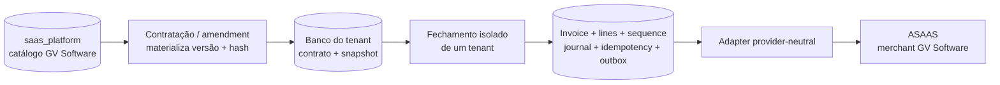

# ADR-0027 - Catálogo global da GV Software e faturamento local por tenant

- Document ID: `ADR-0027`
- Primary Nature: `Decisao`
- Objective: Definir a autoridade, o placement e a fronteira transacional entre o catálogo comercial global da GV Software e os contratos, cálculos e faturas isolados nos bancos dedicados dos tenants.
- Scope: Catálogo de Billing seller-owned, `saas_platform`, materialização de snapshots contratuais, roteamento database-per-tenant, fechamento de fatura, outbox e integração posterior de cobrança.
- Non-objectives: Definir preços, modelos de cálculo, eligibility/cupom, waterfall/stacking, budgets/concorrência ou alçadas de promoções, grandfathering completo, OpenAPI/DDL finais, numeração fiscal, NFS-e ou autorizar implementação; a taxonomia promocional posterior é governada pelo ADR-0039, eligibility/coupon security pelo ADR-0040 e combinação/waterfall pelo ADR-0041.
- Keywords: billing catalog, GV Software, control plane, saas_platform, database per tenant, snapshot, invoice, outbox, idempotency, seller, payer
- Related Files: `docs/product/requirements/REQ-00042-enterprise-multitenant-billing-invoicing.md`, `docs/product/use-cases/UC-00038-billing-catalog-pricing-promotions.md`, `docs/product/use-cases/UC-00040-billing-usage-rating-invoice-close.md`, `../../../docs/specs/TP-00013-enterprise-billing-implementation-task-plan.md`, `ADR-0010-tenant-plan-parametrization.md`, `ADR-0019-database-per-tenant.md`, `ADR-0023-agnostic-payment-provider-integration.md`, `ADR-0028-entitlements-versionados-tenant-local.md`, `ADR-0029-taxonomia-tipificada-entitlements.md`, `ADR-0030-composicao-deterministica-enforcement-entitlements.md`, `ADR-0032-adocao-versionada-grandfathering-entitlements.md`, `ADR-0034-efeitos-transicao-nao-destrutiva-entitlements.md`, `ADR-0035-migracao-evidence-first-entitlements-legados.md`, `ADR-0036-cache-lkg-fail-safe-entitlements.md`, `ADR-0037-boundary-fisico-entitlements-billing.md`, `ADR-0038-pricing-tipado-moeda-cadencia.md`, `ADR-0039-taxonomia-beneficios-promocionais.md`, `ADR-0040-elegibilidade-promocional-seguranca-cupons.md`, `ADR-0041-stacking-waterfall-promocional-deterministico.md`
- Code References: Alvos planejados em `app/src/main/java/br/com/duoset/saas_service/contexts/billing/`, `PlatformDataSourceConfig`, `TenantRoutingDataSource`, `platformTransactionManager`, `tenantTransactionManager`; o Invoice Release 0 já persiste em `JdbcCommercialInvoicePersistenceAdapter`.
- Principal Decision: A GV Software mantém o catálogo comercial canônico no control plane `saas_platform`; cada contratação materializa um snapshot imutável no banco dedicado do tenant, onde toda fatura e seus fatos transacionais são gerados e persistidos com GV Software como seller e o tenant como payer.
- Date: 2026-08-25
- Status: Accepted
- Version: 1.14
- Authors / Owners: Arquitetura / Billing
- Reviewers: Responsável pelo produto, com aprovação explícita de `D-04.1` em 2026-08-23; Arquitetura
- Current-State Reconciliation: `AI_DELEGATED` por Codex (IA) sob `AUTH-BILLING-2026-08-25-001`; revisão humana desta reconciliação `NOT_PERFORMED`, `Reviewability: OPEN`; não altera a origem humana de `D-04.1`
- Stakeholders: Produto, Financeiro, Backend, Frontend, Segurança, Operações e tenants contratantes
- Supersedes: N/A; esta decisão especializa o placement de Billing sem encerrar o lifecycle do ADR-0010. `D-04.2-A` a `D-04.2-H` foram posteriormente aceitas pelos ADR-0028, ADR-0029, ADR-0030, ADR-0032, ADR-0034, ADR-0035, ADR-0036 e ADR-0037; `D-04.3` pelo ADR-0038, `D-04.4-A` pelo ADR-0039, `D-04.4-B` pelo ADR-0040 e `D-04.4-C` pelo ADR-0041.
- Superseded by: N/A

---

# 1. Context

O Contador Fiscal usa uma arquitetura de banco dedicado por tenant conforme o
[ADR-0019](ADR-0019-database-per-tenant.md). Invoice, linhas, idempotência,
sequência, journal e outbox já pertencem ao banco isolado do tenant. Ao mesmo
tempo, produtos, ofertas, preços e promoções vendidos pela GV Software são
definições comerciais comuns da entidade vendedora, e não dados particulares que
cada tenant deva editar ou replicar integralmente.

Sem uma decisão explícita, havia quatro riscos:

1. replicar o catálogo completo em todos os bancos e criar drift entre versões;
2. centralizar também invoices e reduzir o isolamento definido pelo ADR-0019;
3. consultar o preço “vigente agora” durante o fechamento e reprecificar contratos
   históricos silenciosamente;
4. tentar manter consistência por transação distribuída entre `saas_platform` e
   um ou vários bancos de tenant.

A decisão `D-03` já fixou GV Software como entidade cobradora/seller e o tenant
como cliente/payer. A `D-04.1` precisa transformar essa relação comercial em uma
fronteira de dados reproduzível e de baixo custo operacional.

---

# 2. Decision Statement

O sistema DEVE adotar **catálogo global seller-owned com snapshots e faturamento
tenant-local**:

1. a GV Software é a autoridade comercial e proprietária do catálogo canônico;
2. `contexts.billing` é o owner lógico do catálogo, ainda que use dois adapters
   de persistência com escopos transacionais distintos;
3. versões publicadas de produto, oferta, price book, preço e promoção residem no
   control plane compartilhado `saas_platform`, sempre vinculadas ao
   `sellerLegalEntityId` da GV Software;
4. o catálogo completo NÃO é replicado para cada banco de tenant;
5. ao contratar ou alterar termos, o workflow materializa no banco dedicado do
   tenant uma referência de versão e um snapshot canônico imutável, com schema e
   hash verificáveis;
6. rating e fechamento usam somente o snapshot contratual local aplicável; nunca
   consultam o “catálogo atual” para recalcular obrigação já contratada;
7. invoice, linhas, sequência, evidência de idempotência, journal de controle e
   outbox são gravados atomicamente no banco do respectivo tenant;
8. cada execução financeira opera sobre exatamente um tenant e uma transação
   local; não existem transação ACID, foreign key ou join cross-database/cross-tenant;
9. um coordenador compartilhado pode enumerar trabalho, mas deve resolver o
   tenant por registro confiável, abrir contexto isolado, rotear via
   `TenantRoutingDataSource` e limpar o contexto ao terminar;
10. após o commit local, a outbox pode iniciar a cobrança provider-neutral; a
    merchant account ASAAS é resolvida server-side para a GV Software e o tenant
    continua sendo o payer;
11. clientes contábeis internos do tenant não entram no catálogo contratado,
    snapshot de payer, invoice, provider customer ou cobrança do Hub;
12. indisponibilidade do catálogo impede nova contratação/publicação que dependa
    dele, mas não deve impedir o fechamento de um contrato já materializado.

Esta decisão foi aprovada como `D-04.1` pelo responsável do produto em
2026-08-23. Ela não libera código enquanto o checklist decisório do
[TP-00013](../../../docs/specs/TP-00013-enterprise-billing-implementation-task-plan.md)
permanecer incompleto.

---

# 3. Ownership and Data Placement

| Dado / capacidade | Owner lógico | Store canônico | Invariante |
| --- | --- | --- | --- |
| Famílias, produtos e identidade comercial | Billing / GV Software | `saas_platform` | Identidade global da seller; sem PII de cliente do tenant. |
| Offer, PriceBook, Price e Promotion versions | Billing / GV Software | `saas_platform` | Publicado é versionado, seller-scoped e não sofre mutação material. |
| Aprovação/publicação do catálogo | Billing / operadores autorizados da plataforma | `saas_platform` | Baseline de autorização e SoD segue `D-13`/ADR-0050; configuração e enforcement permanecem pendentes. |
| Contrato e snapshot comercial aceito | Billing / tenant contratante | Banco dedicado do tenant | Versão, payload canônico, schema, source hash e contract hash preservados. |
| Usage, aggregation e rated result aplicados | Billing / tenant | Banco dedicado do tenant | Lineage local até o snapshot contratado. |
| Invoice, lines, sequence, idempotency, journal e outbox | Billing / tenant | Banco dedicado do tenant | Um commit local e nenhuma escrita financeira no control plane. |
| Cobrança e referências opacas do provider | Billing / tenant | Banco dedicado do tenant | Provider executa; Billing preserva verdade local e merchant da GV Software. |
| Agregação global de KPIs | `D-12`/ADR-0049 | Projeção planejada, ainda não implementada | Não varrer indiscriminadamente bancos nem copiar detalhe financeiro por conveniência. |

O snapshot tenant-local deve preservar, no mínimo em nível conceitual:

- IDs e versões canônicas de origem;
- versão do schema de serialização;
- `sourceCatalogHash`, igual para o mesmo payload global publicado;
- `contractSnapshotHash`, que sela seller, payer e termos tenant-local e pode
  diferir entre contratações da mesma versão;
- componentes e parâmetros necessários para reproduzir o cálculo;
- moeda, vigência, timezone e regra de arredondamento quando aprovados;
- referência/snapshot da GV Software como seller e do tenant como payer;
- identidade, versão, hash, benefícios e funding attribution da `PromotionVersion`
  efetivamente aceita conforme ADR-0039;
- identidade/versão/hash da `PromotionEligibilityPolicyVersion`, fatos/reasons
  sanitizados e referência verificada de cupom, nunca código ou digest, no
  `EligibilityContextSnapshot` aceito conforme ADR-0040;
- identidade/versão/schema/hash da `PromotionCombinationPolicyVersion` e
  `PromotionCombinationResult` pinado conforme ADR-0041, incluindo candidatas
  selecionadas/rejeitadas, stages, caps, alocação e result hash; reserva/aplicação
  e lifecycle seguem `D-04.4-D`/ADR-0042 e `D-04.4-E`/ADR-0043, ainda sem runtime.

Os nomes de tabelas, colunas, schemas e DTOs serão congelados no plano de
implementação e no OpenAPI. Esta ADR fixa ownership e placement, não DDL.

---

# 4. Runtime and Transaction Flow

## 4.1 Catalog publication

Uma publicação de catálogo é uma transação própria do control plane. Sua versão e
seu hash tornam-se imutáveis antes que uma contratação possa referenciá-la. A
publicação não abre transações em bancos de tenants e não faz fan-out de cópias.

## 4.2 Contract snapshot materialization

O workflow lê uma versão já publicada, valida identidade, seller, vigência e
`sourceCatalogHash`, e então persiste o snapshot dentro de uma transação do banco
do tenant. A leitura central e o commit tenant-local são correlacionados por ID +
versão + `sourceCatalogHash`; o `contractSnapshotHash` sela o resultado local e
não se declara atomicidade distribuída.

Se a materialização falhar, o workflow deve ficar pendente ou falhar fechado sem
ativar um contrato parcial. Lifecycle, retry e compensação seguem
`D-05`/ADR-0044 e UC-00039.

## 4.3 Invoice close

O código de geração roda na aplicação, não dentro do PostgreSQL. Para cada item de
trabalho, a aplicação:

1. obtém um tenant opaco de uma fonte confiável;
2. resolve server-side o datasource registrado, sem aceitar database slug do ator;
3. abre o contexto e a transação tenant-scoped;
4. lê contrato, snapshot, uso e ajustes locais;
5. calcula e persiste invoice, linhas, sequência, journal, idempotência e outbox;
6. commita ou reverte todos esses fatos como unidade;
7. limpa o contexto mesmo em erro;
8. somente após o commit permite que workers processem a outbox.

Um fechamento em lote é uma coleção de unidades independentes por tenant, com
checkpoint, retry e concorrência limitada. Falha no tenant A não pode reverter,
contaminar ou redirecionar o tenant B.

## 4.4 Collection after local commit

A criação de cobrança no ASAAS é efeito externo posterior e idempotente. Falha ou
resultado desconhecido do provider não apaga nem reabre a invoice; segue command
journal e reconciliação do [ADR-0023](ADR-0023-agnostic-payment-provider-integration.md).
A invoice preserva GV Software como seller e o tenant como payer mesmo quando o
provider usa identificadores próprios.

---

# 5. Security and Isolation Invariants

- O tenant efetivo vem de autenticação/impersonação governada ou de job interno
  confiável; não é inferido de payload financeiro.
- Path tenant, contexto efetivo e datasource registrado devem coincidir antes do
  primeiro repository tenant-scoped.
- Não existe fallback para datasource compartilhado quando o tenant não puder ser
  resolvido com segurança.
- O frontend não escolhe seller, merchant account, credencial ASAAS, datasource,
  database slug ou transaction manager.
- O catálogo global não armazena PAN, CVV, token de cartão, detalhes de invoice,
  dados de clientes contábeis do tenant ou PII financeira tenant-scoped.
- Credenciais do provider permanecem em configuração/secret store server-side,
  nunca no catálogo ou snapshot.
- IDs de tenant presentes em fatos globais estritamente necessários são opacos e
  não viram labels de métrica, export irrestrito ou chave para varredura.
- Operações administrativas de catálogo e consultas tenant-scoped usam as famílias
  HTTP separadas pelo [ADR-0026](ADR-0026-billing-api-tenant-admin-cutover.md); os
  paths exatos dependem do OpenAPI e as permissions seguem `D-13`/ADR-0050;
  ambos permanecem artefatos executáveis pendentes.
- Testes devem provar isolamento tenant A/B em controller, service, repository,
  native query, constraint, sequência, outbox e processamento assíncrono.

---

# 6. Clean Architecture and Coupling Boundary

A decisão preserva o Spring Modulith atual. Não será criado microserviço ou banco
de catálogo separado no primeiro horizonte. `contexts.billing` continua como
bounded context, com fronteiras internas explícitas:

- domínio e application services dependem de ports, não de `DataSource`, JPA,
  Flyway, ASAAS ou classes de `config`;
- um adapter de catálogo usa explicitamente o store/transaction manager da
  plataforma;
- adapters de contrato, rating, invoice e collection usam explicitamente o
  `TenantRoutingDataSource`/transaction manager tenant-scoped;
- nenhum método de negócio tenta abranger os dois stores em uma única anotação
  `@Transactional`;
- publicação, materialização e consumo downstream comunicam identidades, versões,
  hashes e eventos idempotentes, não entidades de persistência;
- projeção, cache e LKG de entitlement permanecem derivados e logicamente owned
  por Billing; não migram para `shared` apenas por usarem infraestrutura de cache,
  e sua representação física segue o ADR-0037;
- uma futura extração do catálogo para serviço próprio reutiliza os ports e não
  muda os snapshots históricos.

Os boundaries, APIs e famílias de packages foram definidos no ADR-0037; DTOs,
classes auxiliares e DDL completos permanecem para os implementation plans. Esta
ADR impede o acoplamento de domínio aos mecanismos de persistência.

---

# 7. Decision Drivers

- isolamento físico e backup/restore granular por tenant;
- uma única autoridade comercial para a GV Software;
- histórico reproduzível e proteção contra reprecificação silenciosa;
- custo operacional compatível com o início pré-produção;
- ausência de transações distribuídas e fan-out de migrations de catálogo;
- fechamento resiliente mesmo com control plane temporariamente indisponível;
- Clean Architecture, SOLID e possibilidade de extração futura;
- menor superfície para BOLA, PII e vazamento cross-tenant.

---

# 8. Considered Options

## Option 1: Catálogo e invoices integralmente centralizados

**Rejected.** Simplifica consultas globais, mas contradiz a fronteira database-per-
tenant para fatos financeiros, aumenta blast radius e exige um novo mecanismo de
isolamento para invoice, journal e outbox.

## Option 2: Catálogo integral replicado em todo banco de tenant

**Rejected.** Evita leitura central, mas multiplica publicação, migrations,
reconciliação e risco de drift por quantidade de tenants. Uma correção de catálogo
viraria fan-out operacional sem benefício para contratos já congelados.

## Option 3: Catálogo global e snapshots/faturamento locais

**Accepted.** Mantém uma autoridade seller-owned, preserva isolamento financeiro,
permite fechar a invoice somente com fatos locais e não exige transação distribuída.

## Option 4: Microserviço e banco de catálogo dedicados desde agora

**Deferred.** É uma evolução compatível com os ports, mas adicionaria deploy,
observabilidade, disponibilidade e custo antes de existir carga que justifique a
extração.

---

# 9. Consequences

## Positive Consequences

- Um preço publicado possui uma única fonte canônica.
- Alteração futura do catálogo não modifica contrato ou invoice histórica.
- Fechamento de um tenant não depende da disponibilidade online do catálogo.
- Falha, backup, restore e investigação permanecem isolados por tenant.
- O provider não se torna pricing engine nem source of truth comercial.
- A arquitetura pode extrair catálogo no futuro sem migrar o detalhe de invoices.

## Negative Consequences

- O mesmo bounded context precisará de adapters e transaction managers explícitos
  para dois stores, elevando a disciplina de wiring e testes.
- Contratação exige materialização idempotente e verificação de versão/hash.
- Consultas globais não podem usar join direto entre catálogo e fatos financeiros.
- Migrations de plataforma e migrations tenant-scoped terão ciclos distintos.

## Neutral Consequences

- O número/series definitivo da invoice segue `D-06`/ADR-0045; esta ADR fixa
  apenas que sua autoridade transacional é tenant-local.
- Núcleo de pricing e preço negociado foram fechados pelo ADR-0038; a taxonomia
  promocional foi fechada pelo ADR-0039 e eligibility/coupon security pelo
  ADR-0040; waterfall/stacking foi fechado pelo ADR-0041; budgets/redemption/
  concorrência seguem ADR-0042 e lifecycle promocional segue ADR-0043. Contrato,
  metering, financial/fiscal, subledger, alçadas e rollout seguem os ADR-0044 a
  ADR-0051 e ADR-0023 a ADR-0025; grandfathering foi fechado pelo ADR-0032 e
  migração do enum legado pelo ADR-0035.
- A identificação legal formal da GV Software e o vínculo da merchant account
  continuam evidências de `D-03`, não são inventados por esta decisão.

---

# 10. Compatibility with Existing Decisions

- **ADR-0019:** complementado. Dados tenant-scoped de Billing permanecem no banco
  dedicado; o catálogo seller-owned é dado global da plataforma, não dado de um
  tenant.
- **ADR-0010:** parcialmente restringido. `plan_default_limits` não é o catálogo
  comercial canônico e não define seu placement. O ADR-0028 resolveu
  `D-04.2-A`: entitlement publicado é versionado/imutável e o contrato usa snapshot
  e projeção tenant-local sem default vivo, `COALESCE`, enum ou fallback como
  autoridade. O ADR-0029 resolveu `D-04.2-B` com fontes tipadas e sem override
  genérico. O ADR-0030 resolveu `D-04.2-C` com composição determinística,
  restrições dominantes e enforcement explícito. O ADR-0032 resolveu `D-04.2-D`
  com adoção por versão exata e nova revisão/snapshot. O ADR-0034 resolveu
  `D-04.2-E` com efeitos não destrutivos, debt e lease; o ADR-0035 resolveu
  `D-04.2-F` com migração evidence-first e cutover tenant-local; o ADR-0036
  resolveu `D-04.2-G` com cache derivado, LKG low-risk limitado e fail-safe para
  quota, financeiro, administração e risco; o ADR-0037 resolveu `D-04.2-H` com o
  slice dentro de Billing, adapters platform/tenant, tracks Flyway separados,
  marker/outbox/cache e tenant guard.
- **ADR-0028:** complementa esta decisão ao aplicar o placement global/local aos
  entitlements, sem alterar a fronteira transacional de invoice definida aqui.
- **ADR-0029:** complementa esta decisão ao tipificar as fontes que poderão ser
  materializadas ou derivadas, sem alterar o placement.
- **ADR-0030:** complementa esta decisão ao compor deterministicamente a projeção
  tenant-local, sem alterar o placement ou a fronteira transacional.
- **ADR-0032:** complementa esta decisão ao adotar nova versão por revisão e
  snapshot tenant-local, sem catálogo vivo ou fan-out.
- **ADR-0034:** complementa esta decisão ao ativar efeitos all-or-nothing no banco
  do tenant, preservando dados e sem transação distribuída.
- **ADR-0036:** complementa esta decisão mantendo snapshot como autoridade,
  proibindo LKG em rating/invoice/provider e exigindo tenant efetivo, epochs e
  recuperação tenant-local sem fallback.
- **ADR-0037:** complementa esta decisão materializando o placement em adapters e
  migrations separados, sem novo módulo, banco, join, FK ou XA cross-store.
- **ADR-0038:** complementa esta decisão com `PriceVersion` seller-owned e pin
  tenant-local, sem catálogo vivo no cálculo.
- **ADR-0039:** complementa esta decisão com `PromotionVersion` seller-owned,
  outputs tipados e snapshot tenant-local, sem misturar benefício, entitlement ou
  crédito.
- **ADR-0040:** complementa esta decisão com `PromotionEligibilityPolicyVersion`,
  `SegmentVersion`, `CouponBatchVersion` e registry seller-owned em
  `saas_platform`, enquanto `EligibilityContextSnapshot` aceito permanece no banco
  dedicado do tenant, sem plaintext, XA, FK ou join cross-store.
- **ADR-0041:** complementa esta decisão com `PromotionCombinationPolicyVersion`
  seller-owned em `saas_platform`, enquanto o `PromotionCombinationResult`
  aceito/pinado permanece no fluxo tenant-local; rating/invoice nunca recompõem
  promoção consultando catálogo ou policy viva e não há XA, FK ou join cross-store.
- **ADR-0023:** preservado. Billing calcula e persiste a obrigação; ASAAS executa a
  cobrança somente depois do fato local.
- **ADR-0026:** preservado. Administração global de catálogo e operações de tenant
  permanecem em namespaces diferentes.
- **Invoice Release 0:** compatível quanto à persistência local. O formato atual de
  plano/linha não prova que o catálogo global ou UC-00038 estejam implementados.

---

# 11. Future Implementation Sequence

Esta sequência é planejamento futuro e não autorização de software:

1. materializar em contratos executáveis os ADR-0029, ADR-0030, ADR-0032,
   ADR-0034 a ADR-0051 e as revisões vigentes de ADR-0023 a ADR-0025;
2. congelar modelo, ports, OpenAPI, RBAC/SoD e dois tracks de migration;
3. implementar/publicar catálogo global com version/hash/outbox no control plane;
4. implementar materialização idempotente do snapshot no UC-00039;
5. migrar planos legados somente pela política evidence-first do ADR-0035 e após os gates restantes;
6. fazer rating e invoice consumirem exclusivamente snapshots locais;
7. provar isolamento, indisponibilidade parcial, retry e ausência de cross-store
   transaction em PostgreSQL real;
8. integrar a outbox local ao fluxo provider-neutral/ASAAS certificado;
9. habilitar por flags e piloto conciliado conforme `D-14`/ADR-0051, somente
   após evidência e autorização operacional; `D-00` cobre apenas implementação local.

Rollback desabilita novas publicações/materializações e preserva versões, snapshots
e invoices existentes. Não executa down migration destrutiva nem converte o
catálogo vivo em fallback de cálculo.

---

# 12. Validation

A implementação futura deve demonstrar:

- publicar nova versão não altera snapshots já materializados;
- dois tenants que contratam a mesma versão preservam o mesmo
  `sourceCatalogHash`, possuem `contractSnapshotHash` local verificável e
  persistem apenas nos próprios bancos;
- tenant A não lê, grava, numera ou despacha outbox no banco do tenant B;
- finalizar uma invoice grava invoice, linhas, sequência, journal, idempotência e
  outbox em um único commit tenant-local;
- nenhuma invoice, linha, journal ou outbox tenant-scoped é persistida em
  `saas_platform`;
- control plane indisponível bloqueia nova contratação, mas contrato já
  materializado continua calculável e faturável somente com snapshot, fatos e
  policies tenant-local atuais; LKG nunca autoriza rating ou invoice;
- retry e concorrência não duplicam contrato, invoice, número ou cobrança;
- não existe join, FK ou transação distribuída entre stores;
- seller GV Software e payer tenant sobrevivem intactos até o command ASAAS;
- clientes internos do tenant nunca aparecem como payer/provider customer;
- os gates Modulith, Clean Architecture, segurança, PostgreSQL e E2E backend-real
  passam sem MSW como prova de integração.

---

# 13. Risks and Mitigations

| Risk | Mitigation |
| --- | --- |
| Adapter usa transaction manager incorreto | Qualifiers explícitos, architecture tests e integration tests por store. |
| Contexto de tenant vaza entre itens do scheduler | Scope estruturado com cleanup obrigatório e teste A/B concorrente. |
| Snapshot diverge da versão publicada | Serialização canônica, schema version, hash e rejeição fail-closed. |
| Billing consulta catálogo vivo por conveniência | Port local de snapshot e sentinela arquitetural que proíbe dependência no close. |
| Catálogo global recebe PII tenant-scoped | Schema allowlisted, revisão de dados e testes de ausência/redaction. |
| Falha parcial na contratação | Estado pendente/idempotente; não ativar sem commit local confirmado. |
| Job tenta uma transação para vários tenants | Work item, lease, checkpoint e commit independentes por tenant. |
| Central analytics vira varredura de bancos | Eventos/projeções mínimos seguem `D-12`/ADR-0049; detalhe tenant-local não é copiado. |
| ADR-0010 muda limites, preço, reseta ou mistura fontes por override | Aplicar ADR-0028 a ADR-0041; migração é evidence-first, cache/LKG é fail-safe e a execução hermética local segue `D-00`; effects/rollout aguardam os gates próprios. |

---

# 14. Related ADRs

- [ADR-0000 - Governança documental](../../harness/governance/decisions/ADR-0000-governanca-do-harness-documental.md)
- [ADR-0001 - Technology and architecture](ADR-0001-technology-stack-and-architecture.md)
- [ADR-0010 - Parametrização de planos e limites](ADR-0010-tenant-plan-parametrization.md)
- [ADR-0011 - Resiliência](ADR-0011-resilience-retry-circuit-breaker.md)
- [ADR-0012 - Error handling and observability](ADR-0012-error-handling-observability.md)
- [ADR-0019 - Database per tenant](ADR-0019-database-per-tenant.md)
- [ADR-0023 - Integração agnóstica de pagamentos](ADR-0023-agnostic-payment-provider-integration.md)
- [ADR-0026 - APIs de Billing tenant/admin](ADR-0026-billing-api-tenant-admin-cutover.md)
- [ADR-0028 - Entitlements versionados tenant-local](ADR-0028-entitlements-versionados-tenant-local.md)
- [ADR-0029 - Taxonomia tipificada de entitlements](ADR-0029-taxonomia-tipificada-entitlements.md)
- [ADR-0030 - Composição determinística e enforcement de entitlements](ADR-0030-composicao-deterministica-enforcement-entitlements.md)
- [ADR-0032 - Adoção versionada e grandfathering de entitlements](ADR-0032-adocao-versionada-grandfathering-entitlements.md)
- [ADR-0034 - Efeitos não destrutivos de transições](ADR-0034-efeitos-transicao-nao-destrutiva-entitlements.md)
- [ADR-0035 - Migração evidence-first do legado](ADR-0035-migracao-evidence-first-entitlements-legados.md)
- [ADR-0036 - Cache/LKG fail-safe de entitlements](ADR-0036-cache-lkg-fail-safe-entitlements.md)
- [ADR-0037 - Boundary físico e ownership de entitlements](ADR-0037-boundary-fisico-entitlements-billing.md)
- [ADR-0038 - Pricing tipado, moeda e cadência](ADR-0038-pricing-tipado-moeda-cadencia.md)
- [ADR-0039 - Taxonomia tipada de benefícios promocionais](ADR-0039-taxonomia-beneficios-promocionais.md)
- [ADR-0040 - Elegibilidade promocional e segurança de cupons](ADR-0040-elegibilidade-promocional-seguranca-cupons.md)
- [ADR-0041 - Stacking e waterfall promocional determinísticos](ADR-0041-stacking-waterfall-promocional-deterministico.md)

---

# 15. Decision Lifecycle

Current State: **Accepted**

`D-04.1` fecha ownership/placement do catálogo e da invoice. O ADR-0028 fecha
subsequentemente `D-04.2-A`, o ADR-0029 fecha `D-04.2-B`, o ADR-0030 fecha
`D-04.2-C`, o ADR-0032 fecha `D-04.2-D`, o ADR-0034 fecha `D-04.2-E` e o ADR-0035
fecha `D-04.2-F`; o ADR-0036 fecha `D-04.2-G` e o ADR-0037 fecha `D-04.2-H`.
O ADR-0038 fecha `D-04.3` e governa modelos de preço, moeda, cadência, aritmética,
pin e simulação. O ADR-0039 fecha `D-04.4-A` para taxonomia promocional;
o ADR-0040 fecha `D-04.4-B` para eligibility/coupon security e fixa policies,
batches e registry no control plane com snapshot aceito tenant-local. O ADR-0041
fecha `D-04.4-C` para stacking/waterfall determinístico, com policy global e
resultado pinado tenant-local. `D-04.4-D` foi aceita explicitamente pelo humano no
ADR-0042; `D-04.4-E` e `D-05` a `D-14` foram aceitas por IA sob
`AUTH-BILLING-2026-08-25-001` nos ADR-0043 a ADR-0051 e nas revisões de
ADR-0023 a ADR-0025. Esta reconciliação não altera a origem humana de `D-04.1`,
não prova DDL/API/runtime/evidência. `D-00 = RELEASED_WITH_SCOPE — HUMAN_EXPLICIT
— TP-00013 local-only` permite implementação hermética local e mantém effects `OFF`.

---

# 16. Change Log

| Version | Date | Author | Changes |
| --- | --- | --- | --- |
| 1.14 | 2026-08-25 | Solicitante humano, proprietário declarado / Codex (IA), materialização | Registra `D-00 = RELEASED_WITH_SCOPE — HUMAN_EXPLICIT — TP-00013 local-only`; permite backend/frontend/DDL/migrations/testes herméticos locais e mantém chamadas externas, Sandbox ASAAS, piloto BP Farias, produção, flags `ON` e efeitos reais bloqueados. |
| 1.13 | 2026-08-25 | Codex (IA), sob `AUTH-BILLING-2026-08-25-001` | Reconcilia placement e lifecycle com ADR-0042–ADR-0051 e revisões ADR-0023–ADR-0025: `D-04.4-D` preserva origem humana, sucessores são `AI_DELEGATED`, revisão humana `NOT_PERFORMED`/`OPEN`; mantém artefatos/evidências e `D-00` ativos. |
| 1.12 | 2026-08-24 | Responsável pelo produto / Arquitetura | Registra ADR-0041 como decisão subsequente de `D-04.4-C`: `PromotionCombinationPolicyVersion` permanece seller-owned em `saas_platform`, enquanto `PromotionCombinationResult` aceito/pinado é materializado tenant-local e consumido sem catálogo/policy viva; `D-04.4-D`, `D-04.4-E` e `D-00` permanecem abertos. |
| 1.11 | 2026-08-24 | Responsável pelo produto / Arquitetura | Registra ADR-0040 como decisão subsequente de `D-04.4-B`: policies/segments/batches/registry permanecem seller-owned em `saas_platform`, enquanto eligibility aceita materializa snapshot mínimo no banco dedicado do tenant, sem plaintext, código/digest, XA, FK, join ou provider; `D-04.4-C` a `D-04.4-E` e `D-00` permanecem abertos. |
| 1.10 | 2026-08-24 | Responsável pelo produto / Arquitetura | Registra ADR-0039 como decisão subsequente de `D-04.4-A`: `PromotionVersion` permanece seller-owned em `saas_platform`, e somente aplicação aceita futura materializa referência/snapshot tenant-local; subdecisões e implementação continuam bloqueadas. |
| 1.9 | 2026-08-24 | Responsável pelo produto / Arquitetura | Registra ADR-0038 como decisão subsequente de `D-04.3`: pricing tipado/versionado ocupa o catálogo global e o contrato tenant-local pina versão/hash, enquanto promoções/waterfall e implementação permanecem abertas. |
| 1.8 | 2026-08-24 | Responsável pelo produto / Arquitetura | Registra ADR-0037 como decisão subsequente de `D-04.2-H`: slice coeso dentro de Billing, adapters/migrations platform e tenant separados, marker/outbox/cache e tenant guard; `D-00` e implementação permanecem abertos. |
| 1.7 | 2026-08-23 | Responsável pelo produto / Arquitetura | Registra ADR-0036 como decisão subsequente de `D-04.2-G`: cache/LKG derivados e fail-safe por classe de operação, mantendo `D-04.2-H`, `D-00` e implementação abertos. |
| 1.6 | 2026-08-23 | Responsável pelo produto / Arquitetura | Registra o ADR-0035 como decisão subsequente de `D-04.2-F`, mantendo failure/LKG, boundary físico e implementação abertos. |
| 1.5 | 2026-08-23 | Responsável pelo produto / Arquitetura | Registra o ADR-0034 como decisão subsequente de `D-04.2-E`, mantendo `D-04.2-F` a `D-04.2-H` e a implementação abertas. |
| 1.4 | 2026-08-23 | Responsável pelo produto / Arquitetura | Registra o ADR-0032 como decisão subsequente de `D-04.2-D`, mantendo `D-04.2-E` a `D-04.2-H` e a implementação abertas. |
| 1.3 | 2026-08-23 | Responsável pelo produto / Arquitetura | Registra o ADR-0030 como decisão subsequente de `D-04.2-C`, mantendo `D-04.2-D` a `D-04.2-H` e a implementação abertas. |
| 1.2 | 2026-08-23 | Responsável pelo produto / Arquitetura | Registra o ADR-0029 como decisão subsequente de `D-04.2-B`, mantendo `D-04.2-C` a `D-04.2-H` e a implementação abertas. |
| 1.1 | 2026-08-23 | Responsável pelo produto / Arquitetura | Registra o ADR-0028 como decisão subsequente de `D-04.2-A`, mantendo `D-04.2-B` a `D-04.2-H` e a implementação abertas. |
| 1.0 | 2026-08-23 | Responsável pelo produto / Arquitetura | `D-04.1` aceita: catálogo global da GV Software em `saas_platform`, snapshot contratual e faturamento integral no banco dedicado do tenant. |
