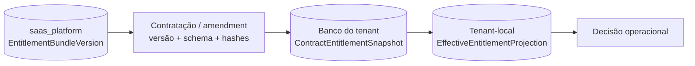

# ADR-0028 - Entitlements versionados e snapshots contratuais tenant-local

- Document ID: `ADR-0028`
- Primary Nature: `Decisao`
- Objective: Definir a autoridade dos entitlements contratados e impedir que defaults globais mutáveis, enums ou fallbacks alterem silenciosamente os direitos de um tenant.
- Scope: `EntitlementBundleVersion` no catálogo global, `ContractEntitlementSnapshot` no banco dedicado do tenant e projeção tenant-local derivada para avaliação operacional.
- Non-objectives: Definir termos comerciais e restrições operacionais, semântica de capability/quota/enforcement, grandfathering dos tenants legados, upgrade/downgrade, migração/cutover, resposta exata à indisponibilidade, boundary modular definitivo, DDL, OpenAPI ou autorizar implementação.
- Keywords: entitlement, entitlement bundle version, contract snapshot, tenant local, immutable, catalog, plan limits, no fallback, no coalesce
- Related Files: `docs/product/requirements/REQ-00042-enterprise-multitenant-billing-invoicing.md`, `docs/product/use-cases/UC-00038-billing-catalog-pricing-promotions.md`, `docs/product/use-cases/UC-00039-billing-contract-subscription-amendments.md`, `docs/product/use-cases/UC-00040-billing-usage-rating-invoice-close.md`, `docs/delivery/plans/TP-00013-enterprise-billing-implementation-task-plan.md`, `docs/adrs/ADR-0010-tenant-plan-parametrization.md`, `docs/adrs/ADR-0019-database-per-tenant.md`, `docs/adrs/ADR-0027-catalogo-global-faturamento-local.md`, `docs/adrs/ADR-0029-taxonomia-tipificada-entitlements.md`, `docs/adrs/ADR-0030-composicao-deterministica-enforcement-entitlements.md`, `docs/adrs/ADR-0032-adocao-versionada-grandfathering-entitlements.md`, `docs/adrs/ADR-0034-efeitos-transicao-nao-destrutiva-entitlements.md`, `docs/adrs/ADR-0035-migracao-evidence-first-entitlements-legados.md`, `docs/adrs/ADR-0036-cache-lkg-fail-safe-entitlements.md`, `docs/adrs/ADR-0037-boundary-fisico-entitlements-billing.md`
- Code References: Estado legado em `TenantSettings`, `TenantApiImpl`, `Plan`, `SubscriptionPlan`, `BillingApiAdapter`, `TenantPlanInvoiceSourceAdapter` e migrations `tenant/V10` e `billing/V2`; boundary e destinos planejados sob `backend/src/main/java/br/com/duoset/saas_service/contexts/billing/` definidos no ADR-0037, ainda não implementados.
- Principal Decision: Entitlements publicados são versões globais imutáveis e cada contratação ou amendment materializa um snapshot completo no banco dedicado do tenant; a avaliação operacional usa somente projeção local derivada desse snapshot, sem catálogo vivo, `COALESCE` contra defaults mutáveis, fallback hardcoded ou enum como autoridade.
- Date: 2026-08-25
- Status: Accepted
- Version: 1.9
- Authors / Owners: Arquitetura / Billing
- Reviewers: Responsável pelo produto, com aprovação explícita de `D-04.2-A` em 2026-08-23; Arquitetura
- Current-State Reconciliation: `AI_DELEGATED` por Codex (IA) sob `AUTH-BILLING-2026-08-25-001`; revisão humana desta reconciliação `NOT_PERFORMED`, `Reviewability: OPEN`; não altera a origem humana de `D-04.2-A`
- Stakeholders: Produto, Financeiro, Backend, Frontend, Segurança, Operações e tenants contratantes
- Supersedes: N/A; restringe cláusulas conflitantes de autoridade do ADR-0010. Taxonomia foi aceita no ADR-0029, composição no ADR-0030, adoção no ADR-0032, efeitos no ADR-0034, migração legada no ADR-0035, failure/cache/LKG no ADR-0036 e boundary físico no ADR-0037.
- Superseded by: N/A

---

# 1. Context

O [ADR-0010](ADR-0010-tenant-plan-parametrization.md) definiu
`plan_default_limits` mutável, resolução dinâmica por
`COALESCE(tenant_override, plan_default)` e propagação imediata de alterações
globais a tenants sem override. Também propôs que a troca de plano removesse os
overrides anteriores.

Esse modelo não preserva a versão efetivamente contratada: uma alteração posterior
do default pode modificar direitos de contratos existentes sem nova contratação,
amendment, snapshot ou evidência tenant-local. A sobreposição entre `NULL`, herança
e ilimitado também permite fallback permissivo e cria uma segunda autoridade ao
lado do contrato.

O [ADR-0027](ADR-0027-catalogo-global-faturamento-local.md) já fixou o catálogo
seller-owned da GV Software em `saas_platform` e o snapshot contratual no banco
dedicado do tenant. O [UC-00038](../product/use-cases/UC-00038-billing-catalog-pricing-promotions.md)
exige versão publicada imutável e o
[UC-00039](../product/use-cases/UC-00039-billing-contract-subscription-amendments.md)
exige timeline contratual reproduzível. Esta decisão especializa essa fronteira
para entitlements.

O desenho de duas tabelas do ADR-0010 ainda não foi implementado. O estado AS-IS
possui limites completos e mutáveis em `tenant_settings`, enums de plano em mais
de um contexto, defaults hardcoded divergentes e contratos booleanos ou
permissivos de quota. Isso torna mais barato corrigir a autoridade antes de criar
novas tabelas, dual-write ou dependência de um catálogo vivo.

---

# 2. Decision Statement

O sistema DEVE observar os seguintes invariantes:

1. `EntitlementBundleVersion` publicado pertence ao catálogo global seller-owned
   da GV Software em `saas_platform`, sob o ownership lógico de Billing já
   aprovado no ADR-0027.
2. O conteúdo material de uma versão publicada é imutável. Correção, evolução ou
   mudança de vigência cria outra versão; não reescreve a publicada.
3. Contratação ou amendment materializa no banco dedicado do tenant um
   `ContractEntitlementSnapshot` completo, imutável e vinculado ao termo aceito.
4. “Completo” significa conter, segundo o schema aprovado futuramente, todos os
   dados necessários para determinar os entitlements contratados sem herdar campo
   de default global vivo.
5. O snapshot preserva, no mínimo conceitualmente, IDs e versão de origem, versão
   de schema, `sourceCatalogHash`, `contractSnapshotHash`, vigência e conteúdo
   canônico dos entitlements materializados.
6. O `ContractEntitlementSnapshot` tenant-local é a autoridade dos direitos daquele
   contrato. O catálogo global define o que pode ser materializado para novas
   intenções; não decide novamente o que um contrato anterior possui.
7. A avaliação operacional usa somente `EffectiveEntitlementProjection`
   tenant-local, derivada, reconstruível e vinculada à identidade, versão e hash do
   snapshot autoritativo.
8. A projeção é um read model de hot path, nunca uma nova autoridade comercial.
9. Publicar `EntitlementBundleVersion` nova não executa fan-out e não altera
   snapshots, projeções ou direitos anteriormente materializados.
10. O runtime NÃO DEVE resolver direitos consultando catálogo vivo, default global
    mutável, enum/código de plano, constante hardcoded ou configuração corrente de
    preço.
11. O runtime NÃO DEVE calcular entitlement efetivo por
    `COALESCE(tenant_override, live_plan_default)`.
12. Ausência, corrupção ou indisponibilidade da autoridade local NÃO autoriza
    substituí-la por enum, default global ou fallback permissivo. O ADR-0030
    posteriormente definiu os estados indeterminados e o ADR-0036 fechou a policy:
    somente `INDETERMINATE_UNAVAILABLE` pode considerar LKG positivo low-risk
    allowlisted; `MISSING`, `CORRUPT` e `CONFLICT` falham de forma segura, e cache
    nunca substitui snapshot.
13. `Plan`, `SubscriptionPlan`, colunas de plano e limites de `TenantSettings`
    permanecem evidência/compatibilidade legada até cutover aprovado; não são a
    autoridade do modelo-alvo.
14. Entitlement não chama, consulta ou atualiza ASAAS. Qualquer obrigação externa
    continua posterior à invoice/outbox e às decisões comerciais aplicáveis.

Esta decisão foi aprovada como `D-04.2-A` em 2026-08-23. Ela não aprovou as
subdecisões seguintes; `D-04.2-B` foi posteriormente aceita pelo ADR-0029,
`D-04.2-C` pelo ADR-0030, `D-04.2-D` pelo ADR-0032, `D-04.2-E` pelo ADR-0034 e
`D-04.2-F` pelo ADR-0035, `D-04.2-G` pelo ADR-0036 e `D-04.2-H` pelo ADR-0037.
Nenhuma delas isoladamente removeu o freeze então vigente. A autorização humana
posterior registrou `D-00 = RELEASED_WITH_SCOPE — HUMAN_EXPLICIT — TP-00013
local-only` no [TP-00013](../delivery/plans/TP-00013-enterprise-billing-implementation-task-plan.md).

---

# 3. Decision Drivers

- reproduzir os direitos efetivamente contratados;
- impedir alteração retroativa ou concessão silenciosa;
- preservar database-per-tenant e funcionamento local;
- manter uma autoridade global de publicação e uma autoridade contratual por tenant;
- eliminar autoridades concorrentes baseadas em enum, constante ou configuração;
- permitir evolução do catálogo por novas versões sem fan-out;
- manter projeções operacionais reconstruíveis e rastreáveis;
- não criar dependência síncrona do control plane no hot path;
- evitar o custo de implementar e depois migrar o modelo mutável ainda inexistente;
- preservar independência completa do payment provider.

---

# 4. Considered Options

## Option 1: Default global mutável mais override tenant-scoped

Description: Implementar o ADR-0010 literalmente e resolver cada limite por
`COALESCE` entre override e default atual.

Pros:

- poucas entidades conceituais;
- alteração global aparentemente simples.

Cons:

- altera direitos de contratos existentes sem amendment;
- mistura ausência, herança e ilimitado;
- depende de autoridade viva fora do contrato;
- torna o cálculo histórico difícil de reproduzir;
- cria um modelo que ainda precisaria ser migrado para atender aos UCs enterprise.

## Option 2: Versão global imutável consultada diretamente pelo runtime

Description: Versionar o bundle, mas consultar a versão global em cada decisão.

Pros:

- elimina a mutação da versão publicada;
- evita uma projeção local adicional.

Cons:

- cria dependência síncrona do control plane;
- amplia blast radius e latência do hot path;
- não sela customizações/termos tenant-local;
- contraria a materialização local aprovada no ADR-0027.

## Option 3: Replicar o catálogo completo em cada banco de tenant

Description: Copiar todas as versões globais para todos os bancos e resolver
localmente.

Pros:

- leitura local;
- catálogo completo disponível durante indisponibilidade central.

Cons:

- fan-out, drift e reconciliação por quantidade de tenants;
- replica dados não contratados;
- multiplica migrations e custo operacional;
- foi rejeitada pelo ADR-0027.

## Option 4: Versão global imutável, snapshot contratual e projeção local derivada

Description: Publicar uma versão global, materializar somente o termo contratado e
derivar uma projeção local reconstruível.

Pros:

- contrato reproduzível e isolado;
- hot path local;
- nenhuma alteração retroativa por publicação;
- baixo custo de armazenamento e operação no estágio atual;
- permite evolução futura por ports sem migrar o histórico.

Cons:

- contratação exige materialização e verificação;
- projeção precisa preservar lineage e ser reconstruível;
- mudança global exige fluxo contratual explícito quando aplicável a contratos existentes.

## Option 5: Policy engine externo ou event sourcing genérico completo

Description: Introduzir desde já serviço/policy engine genérico para toda decisão de
entitlement.

Pros:

- alta flexibilidade teórica;
- potencial de extração e múltiplos produtos.

Cons:

- custo, disponibilidade e complexidade prematuros;
- adiciona infraestrutura antes de existir volume justificável;
- não elimina a necessidade do snapshot contratual.

---

# 5. Decision Outcome

A **Option 4** foi aceita.

Ela preserva o catálogo global da GV Software sem transformar o catálogo atual em
regra retroativa. O snapshot completo evita herança dinâmica e o read model local
atende aos consumidores sem consulta remota. O custo de armazenar snapshots por
contratação/amendment é pequeno comparado ao custo de reconciliação, disputa
comercial e migração posterior de autoridades concorrentes.

As Options 1, 2 e 3 foram rejeitadas por violarem, respectivamente, imutabilidade
contratual, autonomia local e custo/consistência do database-per-tenant. A Option 5
foi diferida; a separação por ports deve permitir evolução futura sem introduzir
essa infraestrutura agora.

---

# 6. Consequences

## Positive Consequences

- Nova versão não modifica direitos já contratados.
- A decisão operacional possui lineage até contrato e catálogo.
- O hot path não depende da disponibilidade do catálogo.
- Enum, constante e default mutável deixam de ser fontes comerciais do alvo.
- A implementação evita as tabelas mutáveis ainda inexistentes do ADR-0010.
- O payment provider não participa da decisão de entitlement.

## Negative Consequences

- Contratação exige materialização e verificação do snapshot.
- Projeções precisam preservar versão/hash e ser reconstruíveis.
- Correções de catálogo exigem nova versão e fluxo contratual explícito.
- O legado exigirá inventário, attestation e cutover conforme o ADR-0035.

## Neutral Consequences

- Esta decisão não escolhe DDL, DTO, evento ou estratégia de cutover. A policy e
  os limites máximos de cache/LKG foram fechados no ADR-0036; store, keyspace,
  envelope e contratos físicos seguem o ADR-0037.
- A adoção entre versões canônicas foi fechada no ADR-0032; tenants legados e
  cutover seguem a decisão evidence-first do ADR-0035.
- Os efeitos de redução, dados e operações em voo foram fechados no ADR-0034, sem
  definir nomes físicos, rating ou lifecycle.
- A composição de add-ons, concessões e restrições foi posteriormente fechada no
  ADR-0030, sem alterar a autoridade definida aqui.
- O ADR-0030 define composição/precedência e enforcement; `D-06`/ADR-0045 é o
  owner de metering, rating e cobrança de overage.

---

# 7. Impact

## Authority and Data Placement

| Artefato | Store | Papel | Autoridade |
| --- | --- | --- | --- |
| `EntitlementBundleVersion` | `saas_platform` | Definição global publicada para futuras materializações. | Catálogo global, não runtime de contrato existente. |
| `ContractEntitlementSnapshot` | Banco dedicado do tenant | Conteúdo completo do entitlement contratado. | Autoridade contratual tenant-local. |
| `EffectiveEntitlementProjection` | Persistência/cache tenant-local a definir | Read model reconstruível para avaliação operacional. | Não; deriva do snapshot. |
| Enum ou código de plano | Legado/apresentação | Alias ou projeção temporária. | Não. |
| `tenant_settings` e defaults hardcoded | Legado | Fonte AS-IS até cutover aprovado. | Não no modelo-alvo. |
| `plan_default_limits` do ADR-0010 | Não implementado | Modelo histórico proposto. | Não pode ser criado como autoridade viva. |



## Temporal Boundary

- Uma versão global nova fica disponível para intenções elegíveis futuras.
- Um snapshot já materializado continua invariável.
- Qualquer troca de snapshot segue a policy fechada no ADR-0032 e os efeitos não
  destrutivos do ADR-0034; lifecycle, notice e proration seguem
  `D-05`/ADR-0044.
- Esta decisão original não presumiu grandfathering; o ADR-0032 posteriormente
  fixou default pinned e proibiu migração em lote implícita.

## Compatibility with Existing Decisions

- **ADR-0019:** preservado; snapshot e projeção permanecem tenant-local.
- **ADR-0027:** especializado; `EntitlementBundleVersion` integra o catálogo global
  e `ContractEntitlementSnapshot` integra o snapshot contratual local.
- **ADR-0010:** restringido nas cláusulas que declaram `plan_default_limits` como
  autoridade canônica mutável, propagação automática, resolução por `COALESCE`,
  enum/default como fallback e alteração retroativa. Objetivos de enforcement
  local permanecem compatíveis; o ADR-0029 tipifica as fontes e proíbe override
  genérico; o ADR-0030 define composição, estados e enforcement; o ADR-0032 define
  adoção/grandfathering; o ADR-0034 define efeitos não destrutivos de
  upgrade/downgrade. Migração legada segue o ADR-0035; failure/cache/LKG segue o
  ADR-0036; boundary físico segue o ADR-0037.
- **ADR-0023:** preservado; entitlement não depende de provider e não cria cobrança
  externa por si só.
- **Invoice Release 0:** não é promovido a implementação desta decisão; plano e
  preço atuais continuam no legado. Efeito/cutover serão executados somente no
  rollout aprovado de `D-14`; `D-00` cobre apenas implementação local.

---

# 8. AI Agent Considerations (For Autonomous Agent Environments)

Agentes de arquitetura, backend, frontend e testes DEVEM tratar esta ADR como
autoridade somente para `D-04.2-A`, aplicando ADR-0029, ADR-0030 e ADR-0032 para
taxonomia, composição/enforcement e adoção/grandfathering.

Eles NÃO DEVEM:

- implementar fora do escopo hermético local liberado por `D-00`;
- inventar fallback/degraded mode fora da matriz do ADR-0036 ou mapeamento
  concreto de modo por plano;
- criar `plan_default_limits` como source of truth vivo;
- inferir entitlement a partir de preço, status ASAAS ou enum;
- descrever `ContractEntitlementSnapshot` como implementado;
- criar aliases, endpoints, migrations ou roles não aprovados;
- tratar o aceite desta ADR ou dos ADR-0029 a ADR-0036 como substituto do
  boundary aceito no ADR-0037 ou como autorização externa além de `D-00`.

Agentes PODEM realizar análise read-only, atualizar documentação aprovada e preparar
desenho/testes condicionais que não produzam efeito de runtime.

---

# 9. Implementation Plan

Esta sequência é incremental e pode produzir software hermético local sob `D-00`:

1. aplicar a taxonomia do ADR-0029, a composição do ADR-0030, a adoção do
   ADR-0032, os efeitos do ADR-0034, a migração do ADR-0035, failure/cache/LKG do
   ADR-0036 e o boundary físico do ADR-0037;
2. materializar os contratos executáveis das decisões já aceitas `D-05`, `D-06`,
   `D-08`, `D-13` e `D-14` conforme ADR-0044, ADR-0045, ADR-0023/ADR-0024,
   ADR-0050 e ADR-0051;
3. preservar REQ-00042 e UCs aprovados como baseline e aplicar a liberação
   local-only de `D-00` sem habilitar capability/efeito;
4. congelar modelo, OpenAPI, ports, schemas e dois tracks de migration;
5. inventariar o legado real sem inferir precedência ou significado ausente;
6. implementar publicação global e materialização tenant-local de forma aditiva;
7. implementar projeção local derivada somente com comportamento de falha aprovado;
8. validar shadow comparison, isolamento e compatibilidade;
9. executar cutover por tenant conforme ADR-0035 e rollout ADR-0051;
10. remover legado somente após piloto, reconciliação e gate destrutivo próprio.

Nenhum código, migration, configuração, integração ASAAS ou rollout é autorizado
por esta ADR enquanto o TP-00013 mantiver o freeze.

---

# 10. Validation

A implementação futura deverá demonstrar:

- publicar `EntitlementBundleVersion` V2 não altera snapshot ou projeção de V1;
- dois tenants não leem ou gravam snapshots/projeções um do outro;
- a avaliação permanece local quando `saas_platform` está indisponível;
- toda projeção é rastreável e reconstruível a partir do snapshot exato;
- o mesmo snapshot canônico produz a mesma identidade/hash de projeção segundo o
  schema aprovado;
- nenhum caminho usa enum, constante, default vivo ou `COALESCE` legado como
  autoridade;
- snapshot ausente ou inválido nunca aciona fallback comercial implícito;
- publicação não executa fan-out para tenants existentes;
- nenhum evento de entitlement chama ASAAS ou cria cobrança direta;
- gates Modulith, Clean Architecture, PostgreSQL, isolamento A/B e E2E
  backend-real passam sem MSW como substituto de integração.

A validação documental imediata desta decisão é `./infra/scripts/validate-docs.sh`.

---

# 11. Risks and Mitigations

| Risk | Mitigation decidida ou boundary |
| --- | --- |
| Projeção divergir do snapshot | Versão/hash obrigatórios e reconstrução verificável. |
| Snapshot incompleto | Completude contra schema aprovado antes do uso; schema exato permanece gate. |
| Código legado continuar usando enum/default | Sentinelas e cutover futuros; o legado não ganha autoridade normativa. |
| ADR-0010 ser interpretado como vigente no conflito | Precedência explícita desta ADR para as cláusulas enumeradas. |
| Ausência local virar ilimitado/fail-open | ADR-0030 exige estado indeterminado; ADR-0036 permite LKG positivo somente em `UNAVAILABLE` low-risk allowlisted e falha seguro nos demais casos. |
| Snapshot ser confundido com réplica integral | Materializar somente o termo contratado, conforme ADR-0027. |
| Liberação local ser confundida com rollout | `D-00` local-only, open boundaries e capabilities/efeitos `OFF` preservados. |
| Escopo crescer para policy engine genérico | Ports preparados para evolução, sem serviço ou infraestrutura adicional agora. |

---

# 12. Related ADRs

- [ADR-0000 - Governança documental](../../harness/governance/decisions/ADR-0000-governanca-do-harness-documental.md)
- [ADR-0001 - Technology and architecture](ADR-0001-technology-stack-and-architecture.md)
- [ADR-0010 - Parametrização de planos e limites](ADR-0010-tenant-plan-parametrization.md)
- [ADR-0019 - Database per tenant](ADR-0019-database-per-tenant.md)
- [ADR-0023 - Integração agnóstica de pagamentos](ADR-0023-agnostic-payment-provider-integration.md)
- [ADR-0027 - Catálogo global e faturamento tenant-local](ADR-0027-catalogo-global-faturamento-local.md)
- [ADR-0029 - Taxonomia tipificada de entitlements](ADR-0029-taxonomia-tipificada-entitlements.md)
- [ADR-0030 - Composição determinística e enforcement](ADR-0030-composicao-deterministica-enforcement-entitlements.md)
- [ADR-0032 - Adoção versionada e grandfathering](ADR-0032-adocao-versionada-grandfathering-entitlements.md)
- [ADR-0034 - Efeitos não destrutivos de transições](ADR-0034-efeitos-transicao-nao-destrutiva-entitlements.md)
- [ADR-0035 - Migração evidence-first do legado](ADR-0035-migracao-evidence-first-entitlements-legados.md)
- [ADR-0036 - Cache/LKG fail-safe de entitlements](ADR-0036-cache-lkg-fail-safe-entitlements.md)
- [ADR-0037 - Boundary físico e ownership de entitlements](ADR-0037-boundary-fisico-entitlements-billing.md)

---

# 13. References

- [REQ-00005 - Matriz de funcionalidades por plano](../product/requirements/REQ-00005-plan-feature-matrix.md)
- [REQ-00034 - Billing AS-IS](../product/requirements/REQ-00034-phase2-billing-subscription-usage.md)
- [REQ-00042 - Billing enterprise](../product/requirements/REQ-00042-enterprise-multitenant-billing-invoicing.md)
- [UC-00038 - Catálogo, pricing e promoções](../product/use-cases/UC-00038-billing-catalog-pricing-promotions.md)
- [UC-00039 - Contratos, assinaturas e amendments](../product/use-cases/UC-00039-billing-contract-subscription-amendments.md)
- [UC-00040 - Uso, rating e fechamento](../product/use-cases/UC-00040-billing-usage-rating-invoice-close.md)
- [TP-00013 - Enterprise Billing Implementation](../delivery/plans/TP-00013-enterprise-billing-implementation-task-plan.md)
- [Manifesto de módulos](../architecture/module-registry.md)

---

# 14. Decision Lifecycle

Current State: **Accepted**

A aprovação original alcança somente `D-04.2-A`; `D-04.2-B` foi aceita
posteriormente no ADR-0029, `D-04.2-C` no ADR-0030, `D-04.2-D` no ADR-0032 e
`D-04.2-E` no ADR-0034, `D-04.2-F` no ADR-0035, `D-04.2-G` no ADR-0036 e
`D-04.2-H` no ADR-0037. `D-04.4-D` foi aceita explicitamente pelo humano no
ADR-0042; `D-04.4-E` e `D-05` a `D-14` foram aceitas por IA sob
`AUTH-BILLING-2026-08-25-001`. `D-00` está `RELEASED_WITH_SCOPE — HUMAN_EXPLICIT
— TP-00013 local-only`; contratos restantes, evidências externas e readiness
permanecem gates ativos, sem alterar a origem humana de `D-04.2-A`.

---

# 15. Change Log

| Version | Date | Author | Changes |
| --- | --- | --- | --- |
| 1.9 | 2026-08-25 | Solicitante humano, proprietário declarado / Codex (IA), materialização | Registra `D-00 = RELEASED_WITH_SCOPE — HUMAN_EXPLICIT — TP-00013 local-only`; permite backend/frontend/DDL/migrations/testes herméticos locais e mantém chamadas externas, Sandbox ASAAS, piloto BP Farias, produção, flags `ON` e efeitos reais bloqueados. |
| 1.8 | 2026-08-25 | Codex (IA), sob `AUTH-BILLING-2026-08-25-001` | Reconcilia lifecycle, metering, provider, SoD e rollout com decisões sucessoras aceitas; preserva a origem humana de `D-04.2-A`, marca a reconciliação `AI_DELEGATED` com revisão `NOT_PERFORMED`/`OPEN` e mantém runtime/evidências/`D-00` pendentes. |
| 1.7 | 2026-08-24 | Responsável pelo produto / Arquitetura | Registra ADR-0037 como decisão subsequente de `D-04.2-H`: snapshot/projeção tenant-local ganham boundary, stores, migrations, tabelas, marker/outbox/cache e tenant guard planejados; `D-00` continua aberto. |
| 1.6 | 2026-08-23 | Responsável pelo produto / Arquitetura | Registra ADR-0036 como decisão subsequente de `D-04.2-G`: cache derivado, LKG somente para `UNAVAILABLE` low-risk allowlisted e fail-safe nas classes críticas; mantém `D-04.2-H`, `D-00` e implementação abertos. |
| 1.5 | 2026-08-23 | Responsável pelo produto / Arquitetura | Registra o ADR-0035 como decisão subsequente de `D-04.2-F`, mantendo failure/LKG, boundary físico e implementação abertos. |
| 1.4 | 2026-08-23 | Responsável pelo produto / Arquitetura | Registra o ADR-0034 como decisão subsequente de `D-04.2-E`, mantendo `D-04.2-F` a `D-04.2-H` e a implementação abertas. |
| 1.3 | 2026-08-23 | Responsável pelo produto / Arquitetura | Registra o ADR-0032 como decisão subsequente de `D-04.2-D`, mantendo `D-04.2-E` a `D-04.2-H` e a implementação abertas. |
| 1.2 | 2026-08-23 | Responsável pelo produto / Arquitetura | Registra o ADR-0030 como decisão subsequente de `D-04.2-C`, mantendo `D-04.2-D` a `D-04.2-H` e a implementação abertas. |
| 1.1 | 2026-08-23 | Responsável pelo produto / Arquitetura | Registra o ADR-0029 como decisão subsequente de `D-04.2-B`, mantendo `D-04.2-C` a `D-04.2-H` e a implementação abertas. |
| 1.0 | 2026-08-23 | Responsável pelo produto / Arquitetura | Aceite de `D-04.2-A`: entitlement global versionado e imutável, snapshot tenant-local completo, projeção local derivada e proibição de autoridades/fallbacks vivos. |

---

# 16. Repository Structure

Esta decisão reside em:

```text
docs/adrs/ADR-0028-entitlements-versionados-tenant-local.md
```

Alvos físicos de software, schemas e contratos permanecem planejados e serão
registrados nos IPs após os gates decisórios.

---

# 17. Review Process

1. A subdecisão `D-04.2-A` foi apresentada com alternativas, conflitos e impacto.
2. O responsável pelo produto registrou aprovação explícita em 2026-08-23.
3. Arquitetura materializou somente o boundary aprovado nesta ADR.
4. Mudança normativa desta decisão exige nova versão aceita ou ADR sucessora.
5. Aprovações posteriores devem ser materializadas sem converter boundaries abertas
   em decisões implícitas.

---

# 18. Notes

Os nomes `EntitlementBundleVersion`, `ContractEntitlementSnapshot` e
`EffectiveEntitlementProjection` são conceitos canônicos aprovados. Seus nomes
físicos em DDL, Java, OpenAPI e frontend permanecem sujeitos ao plano e aos gates.

Esta ADR não declara o alvo implementado. O AS-IS continua documentado no
REQ-00034 e no código até uma migração futura aprovada e comprovada.
