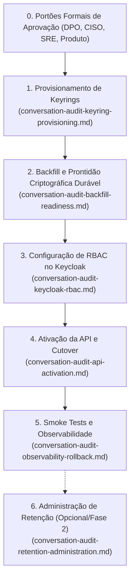

# Guia Mestre de Onboarding — Conversation Audit em HML e PRD

**Document ID:** `ONBOARD-CONVERSATION-AUDIT-HML-PRD`  
**Owner:** DevOps, SRE e Segurança  
**Status:** `Active`  
**Date:** 2026-09-29  
**Version:** 1.0  
**Ambientes Alvo:** Homologação (HML) e Produção (PRD)

---

## 1. Visão Geral e Orquestração de Features

Este documento é o **orquestrador mestre** consumido pelo **Agente de IA de Infraestrutura (DevOps/SRE)** para habilitar a capacidade de **Conversation Audit (Auditoria de Conversas)** nos ambientes externos `HML` e `PRD`.

Para assegurar granularidade, testabilidade e separação estrita de responsabilidades, o ciclo de onboarding foi decomposto em **seis features/runbooks independentes**, que DEVEM ser executados na ordem sequencial abaixo:

---

## 2. Mapa das Responsabilidades Independentes

| Ordem | Feature / Responsabilidade | Documento Dedicado | Objetivo Principal |
|:---:|---|---|---|
| **1** | **Provisionamento Criptográfico** | [Keyrings e Criptografia](conversation-audit-keyring-provisioning.md) | Geração CSPRNG de 32 bytes, validação de chaves não compartilhadas, permissões `0600`/`0700` e montagem somente-leitura em `/run/saas-secrets`. |
| **2** | **Backfill e Prontidão Durável** | [Backfill e Data Protection Readiness](conversation-audit-backfill-readiness.md) | Execução do backfill unitário (50x1), eliminação de texto plano e prova SQL de zero riscos sob fingerprint definitivo na tabela `conversation_audit_data_protection_readiness`. |
| **3** | **Controle de Acesso e Identidade** | [Keycloak RBAC](conversation-audit-keycloak-rbac.md) | Configuração de `ROLE_TENANT_AUDIT` (role simples), escopo explícito no SPA com `fullScopeAllowed=false`, personificação de Super Admin e renovação de tokens JWT. |
| **4** | **Ativação e Deployment** | [Ativação da API e Governança](conversation-audit-api-activation.md) | Configuração de allowlist de tenants, habilitação de `APP_CONVERSATION_AUDIT_API_ENABLED=true`, camuflagem HTTP 404 e recriação forçada (`--force-recreate`) do backend. |
| **5** | **Validação e Contingência** | [Observabilidade e Rollback](conversation-audit-observability-rollback.md) | Bateria de smoke tests sanitizados de caixa-preta (zero PII), métricas e alertas Prometheus, dashboards Grafana e playbook de rollback *fail-closed*. |
| **6** | **Política de Retenção (Fase 2)** | [Administração de Retenção](conversation-audit-retention-administration.md) | Gestão de prazos de expurgo (1 a 180 dias) com acesso restrito a Super Admin personificado, preview com token opaco e salvamento fail-closed sem deleção síncrona. |

---

## 3.1 Gate específico do webhook Telegram

O webhook Telegram em HML/PRD depende da persistência durável de inbound. Antes de registrar, reconciliar ou testar o endpoint externo, a Feature 1 deve comprovar os três keyrings (AES, HMAC de identificador e HMAC de outbound), as seis variáveis `CONVERSATION_*`, a montagem somente leitura em `/run/saas-secrets` e a conclusão dos init services. Sem isso, o backend responde `503 PERSISTENCE_UNAVAILABLE` e o Telegram não entrega um update aceito. A sequência detalhada está em [Configuração de webhooks omnichannel](omnichannel-webhook-configuration.md) e [Deploy de produção em VPS](production-vps-deployment.md).

## 3. Portões de Bloqueio Globais (*Global Blocking Gates*)

O agente de infraestrutura DEVE verificar se os seguintes requisitos estão satisfeitos antes de iniciar a Feature 1:

1. **Aprovação de Governança de Dados:** [REQ-00043](../product/requirements/REQ-00043-conversation-audit-data-governance.md) formalmente aprovado para o ambiente.
2. **Backup Offsite Verificado:** Existência de backup recente e drill de restauração com sucesso comprovado nos últimos 31 dias.
3. **Migrações Flyway:** Schema de banco alinhado com Omnichannel `V32` a `V44` e Tenant `V59` a `V63`, `V91`.
4. **Isolamento de Segredos:** Diretórios de chaves protegidos e ausência de chaves em texto plano em repositórios ou logs.

---

## 4. Invariantes de Execução Autônoma

- **Fail-Closed por Padrão:** Na ocorrência de qualquer anomalia em qualquer uma das fases, o agente DEVE interromper a cadeia e acionar o playbook de contenção em [Observabilidade e Rollback](conversation-audit-observability-rollback.md).
- **Sanitização Absoluta:** O agente NUNCA deve registrar payloads, telefones, mensagens ou tokens JWT em relatórios ou logs de execução.
- **Transição Ordenada:** Nenhuma fase posterior pode ser iniciada se os critérios de aceitação da fase anterior não tiverem sido 100% satisfeitos.

## 5. Plano de Execução e Matriz de Paridade

Esta seção é o plano executável do onboarding e deve ser usada como checklist de
handoff. A ordem é obrigatória; uma falha interrompe o fluxo e exige rollback
fail-closed antes de nova tentativa.

| Gate | DEV | HML | PRD | Evidência obrigatória |
|---|---|---|---|---|
| Três keyrings AES/HMAC/Outbound montados em `/run/saas-secrets` | Sim, pelo overlay local | Sim, pelos init services HML | Sim, pelos init services PRD | `test -r` dos três arquivos, IDs ativos, permissões e backup confirmado; pré-requisito do webhook Telegram |
| Migrations aplicadas | Local | V32–V44 Omnichannel e V59–V63/V91 Tenant | Mesmo conjunto, forward-only | `flyway_schema_history` sem migration pendente |
| Backfill/readiness durável | Fixture/local | Um tenant por vez | Um tenant por vez | Query canônica com `ready=true` e todos os riscos em zero |
| RBAC Keycloak | Overlay local | `hml.sh` | `production.sh` | Role simples, scopes explícitos, sessão renovada |
| API fechada antes do cutover | Default-off | `APP_CONVERSATION_AUDIT_API_ENABLED=false` | `APP_CONVERSATION_AUDIT_API_ENABLED=false` | Probe 404 |
| API aberta após readiness | Opcional | Allowlist explícita | Allowlist explícita | Smoke 404/403/400/200 + headers |
| Rollback | Local | `--force-recreate` | `deploy-production.sh update` | API retorna 404 e keyrings permanecem intactos |

### 5.1 Definition of Done do agente de infraestrutura

- [ ] Os três arquivos de keyring existem no volume do backend e correspondem aos
  três IDs ativos do ambiente.
- [ ] O Compose renderizado contém os init services criptográficos e o backend
  depende da conclusão bem-sucedida deles.
- [ ] Migrations e readiness foram comprovadas para cada tenant da allowlist.
- [ ] RBAC foi reconciliado e um token novo foi emitido após a atribuição.
- [ ] O smoke test positivo usa `POST` real (não `HEAD`) e registra somente status
  e headers sanitizados.
- [ ] Prometheus/Grafana estão coletando as métricas e não há alerta crítico.
- [ ] O rollback fail-closed foi testado em HML antes de qualquer PRD.

Nenhum item pode ser marcado por inferência ou por `docker compose up` isolado.
