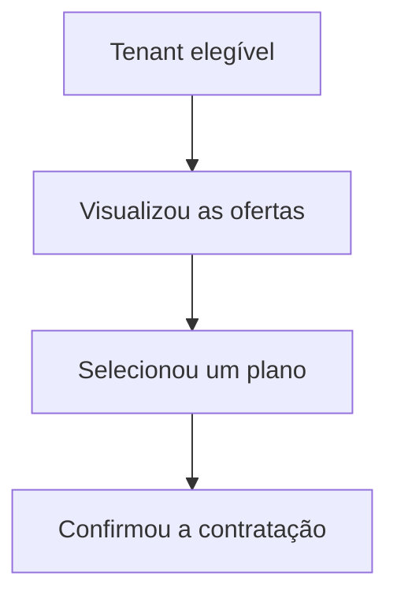

# PRD-00001 — Billing Enterprise

## 1. Executive summary

A plataforma precisa transformar capacidades fiscais e conversacionais em uma
oferta comercial sustentável, compreensível para o escritório assinante e operável
pelo `SUPER_ADMIN`. A iniciativa agrega descoberta de planos, catálogo,
contratação, uso, faturamento, pagamento e conciliação sem converter este PRD em
especificação funcional ou técnica.

Este documento foi sintetizado das fontes versionadas do projeto. A existência de
requisitos aprovados e implementação repository-local comprova maturidade técnica,
mas não comprova adoção, disposição a pagar ou resultado econômico. Essas
limitações não bloqueiam o ciclo pre-market e não são apresentadas como validação
de mercado.

## Problema e evidência

### Problem statement

Sem uma experiência integrada de monetização, o tenant pode não compreender o que
está disponível, contratado ou consumido, enquanto o owner e o `SUPER_ADMIN` enfrentam
risco de operar catálogo, preços, faturas e provedores como verdades separadas. O
produto precisa tornar oferta e cobrança previsíveis para o cliente e controláveis
para a operação.

### Evidence currently available

| Evidence | What it supports | Limitation |
| --- | --- | --- |
| [Visão do produto](../business/product-vision.md) | Planos progressivos e papel do Administrador do SaaS. | Não contém pesquisa de cliente nem metas de monetização. |
| [Análise financeira e precificação](../business/analise-financeira-precificacao.md) | Custos, unit economics, franquias e preços sugeridos. | Proposta documental não equivale a disposição a pagar observada. |
| [REQ-00042](../requirements/REQ-00042-enterprise-multitenant-billing-invoicing.md) | Cobertura funcional ampla do ciclo financeiro enterprise. | Aprovação funcional não valida resultado de produto. |
| [REQ-00053](../requirements/REQ-00053-billing-tenant-plan-offer-discovery.md) | Descoberta de ofertas implementada no repositório. | Provas ambientais e comportamento real de adoção permanecem ausentes. |
| [REQ-00054](../requirements/REQ-00054-super-admin-unified-billing-price-version.md) e [REQ-00056](../requirements/REQ-00056-payment-provider-management-observability.md) | Operação unificada e control plane provider-neutral aprovados para implementação local. | Rollout, chamadas externas e resultado operacional real estão excluídos. |

Não foi localizada evidência versionada de entrevistas, conversão, churn, receita,
tempo operacional ou satisfação relacionada a Billing. Essa ausência não bloqueia
o ciclo pre-market aprovado e volta a ser requisito quando o gatilho da Seção 7
ocorrer; ela também não autoriza estimar valores.

## Público e contexto

| Audience | Need / job | Expected value |
| --- | --- | --- |
| `SUPER_ADMIN` | Publicar, manter e governar ofertas e mudanças comerciais. | Uma autoridade operacional rastreável para catálogo e preço. |
| Financeiro e Operações | Acompanhar faturamento, cobrança, pagamentos e exceções. | Redução de reconciliação manual e decisões auditáveis. |
| Tenant Admin do escritório | Comparar ofertas e entender contratação, consumo e cobrança. | Previsibilidade comercial e autonomia compatível com seu papel. |
| Liderança de Produto | Avaliar viabilidade e evolução da monetização. | Métricas confiáveis para priorizar oferta e roadmap. |

## Outcomes e não-objetivos

> Outcomes quantitativos de tempo, qualidade, cobertura e garantia não são aplicáveis ao escopo MVP.

1. Tornar ofertas publicadas compreensíveis e comparáveis pelo tenant elegível.
2. Manter catálogo, preço contratado, uso e faturamento coerentes ao longo do tempo.
3. Permitir operação financeira segura e auditável sem expor dados ou controles
   indevidos ao tenant.
4. Medir aquisição, adoção, receita e carga operacional para orientar evolução do
   produto.

### Tenant-restricted PriceVersion selection

Decisão do owner em 2026-09-18: ao criar uma `PriceVersion` com público
`TENANT_RESTRICTED`, o campo **Tenant autorizado** deve permitir pesquisar
assíncronamente pelo nome ou nome fantasia do escritório e selecionar um tenant
exato, exibindo identificação legível e persistindo somente seu ID. A busca deve
ser paginada, limitada e acionada somente após texto mínimo, sem carregar todos os
tenants no navegador.

### Approval queue identification

Decisão do owner em 2026-09-18: a listagem de aprovações do catálogo deve
identificar uma publicação de `PriceVersion` pelo produto associado, exibindo o
nome de negócio e o código do produto no cartão de pendência, além da ação e da
versão. O detalhe continua disponível para hashes, valor e decisão; a listagem
deve permitir reconhecer a pendência sem abrir cada item.

### Non-goals

- Aprovar valores comerciais ou política de desconto neste documento.
- Permitir ao tenant escolher livremente o provedor de pagamento.
- Certificar integração externa, ativar provider ou autorizar produção.
- Definir endpoints, schemas, classes, DDL, algoritmos ou topologia.
- Substituir requisitos, UCs, ADRs ou planos existentes.

## 5. Product scope and limits

### In scope

- descoberta e comparação de ofertas publicadas;
- catálogo, versões de preço e entitlements;
- contrato, assinatura, alterações e uso medido;
- fatura comercial, cobrança, pagamento, correção e conciliação;
- operação e observabilidade provider-neutral;
- visibilidade adequada a tenant, Produto, Financeiro e Operações.

### Out of scope for this validation cycle

- emissão fiscal como decisão tributária autônoma do Billing;
- aconselhamento contábil ou financeiro;
- rollout ambiental, certificação de provider e transação real;
- preços finais sem decisão humana do owner do produto/projeto;
- expansão para marketplace ou billing de terceiros.

### Initial audience, offer and conversion funnel

Decisão aprovada pelo owner em 2026-09-10: o público inicial são tenants ativos
administrados por escritórios contábeis. O `SUPER_ADMIN` publica e mantém os planos
disponíveis. O primeiro ciclo validável compreende visualizar as ofertas elegíveis,
comparar os planos, selecionar uma oferta e concluir a contratação. Preços finais,
descontos especiais, troca de provider e cobrança real ficam fora deste ciclo.

O diagrama representa etapas de produto para mensuração do funil. Não especifica
telas, endpoints, transições técnicas ou fluxos de caso de uso.

### Initial SUPER_ADMIN autonomy policy

Decisão aprovada pelo owner em 2026-09-10: a revisão por outro usuário não integra
o ciclo inicial. Em desenvolvimento, homologação e produção, o mesmo usuário com
perfil `SUPER_ADMIN` pode aplicar, editar, validar, ativar, desativar e publicar as
configurações de Billing que estejam dentro de sua alçada.

Não existe exigência atual ou futura de segundo aprovador nesse escopo. Qualquer
`SUPER_ADMIN` autorizado pode preparar e executar a transição explícita dentro de
sua alçada; a responsabilização decorre da identidade registrada no log, não da
separação entre maker e checker.

Para minimizar impacto sobre o produto já implementado, drafts e registros antigos
de aprovação são preservados sem reescrita, exclusão ou novo status. Registros
antigos passam a ser exibidos somente como histórico de auditoria e deixam de
bloquear drafts. Os drafts continuam `DRAFT`; o fluxo `produto → preço → oferta` é
preservado; publicação e demais transições continuam ações explícitas do
`SUPER_ADMIN` e nunca acontecem automaticamente.

Esta é uma decisão de produto, não a definição de flag, endpoint, state machine ou
controle técnico. [ADR-0050](../../adrs/ADR-0050-rbac-sod-aprovacoes-financeiras.md),
[REQ-00054](../requirements/REQ-00054-super-admin-unified-billing-price-version.md),
[REQ-00056](../requirements/REQ-00056-payment-provider-management-observability.md)
e os casos de uso relacionados ainda contêm partes do workflow antigo e precisam
ser reconciliados antes de qualquer implementação ou promoção deste PRD.

### Chatbot message quota and tenant subscription KPI

Decisão aprovada pelo owner humano em 2026-09-10: para franquia de mensagens do
chatbot, uma unidade corresponde exclusivamente a uma mensagem regular recebida
do usuário e aceita pelo sistema. Respostas do bot, mensagens de sistema ou de
controle, tentativas bloqueadas e replays deduplicados não consomem nova unidade.

O KPI de assinatura do tenant deve usar a mesma unidade de negócio e a mesma
janela aplicável à quota. O numerador não pode ser derivado do total da auditoria
conversacional nem da soma de tráfego de entrada e saída por canal. A auditoria
pode continuar exibindo os dois sentidos para fins operacionais, desde que essa
métrica seja identificada como volume conversacional e não como consumo do plano.

No incidente que motivou a decisão, a auditoria exibia `51` mensagens: `20`
entradas do usuário e `31` saídas do bot. Portanto, o KPI contratual correto era
`20 / 30`, não `51 / 30`. A implementação e seus critérios verificáveis permanecem
em [REQ-00011](../requirements/REQ-00011-chatbot-usage-limits-and-billing.md),
[UC-00022](../use-cases/UC-00022-chatbot-quota-enforcement.md) e nos planos
relacionados; este PRD fixa apenas o significado de produto.

Em 2026-09-10, o owner humano aprovou também a publicação repository-local de
`getUsageRecords` em contrato Active dedicado. A leitura usa competência civil
mensal `America/Sao_Paulo`, reconcilia observações legadas com o piso durável
`baseline_usage + confirmed_count`, exclui reservas em andamento e não usa cache
como autoridade. `TENANT_ADMIN` acessa somente o próprio tenant; `SUPER_ADMIN`
acessa a mesma rota apenas sob personificação explícita com path e contexto
coincidentes. O protocolo usa `Cache-Control: no-store` e erros RFC 9457
`400/401/403/409/500`, sem alias legado.

## 6. Product validation criteria

O PRD somente pode mudar para `Validated` quando o owner humano do produto/projeto
confirmar, com evidência versionada:

- problema e públicos prioritários;
- proposta comercial e limites da oferta inicial;
- métricas, baselines, targets e janelas de observação;
- resultado das hipóteses `H-BIL-*`;
- respostas das perguntas `OQ-BIL-*`;
- reviewer adicional aplicável ou `N/A` justificado e aprovação da versão corrente.

Esses são critérios de fechamento do PRD, não acceptance criteria de software.

zada a tenant real; nesse momento `M-BIL-001`
volta a `Open` e uma nova versão do PRD define a régua.

## Métricas

Não aplicável ao escopo MVP; métricas de tempo, qualidade, cobertura e garantia ficam fora desta fase.

## Product Hypotheses

| ID | Hypothesis | Validation method | Evidence | Owner | State |
| --- | --- | --- | --- | --- | --- |
| `H-BIL-001` | A descrição e o fluxo inicial permitem distinguir internamente as ofertas antes da publicação comercial. | Revisão interna pelo owner usando nomes, descrições, funcionalidades, limites e o funil da Seção 5. | `REQ-00005` diferencia Start (até 2), Business (até 20) e Premium (capacidade contratual), `REQ-00053` cobre comparação e os testes de `PlanCard`/página comprovam apresentação distinta; aceite humano desta revisão em 2026-09-10. Não é validação de mercado. | Proprietário do SaaS / owner do produto | Validated |
| `H-BIL-003` | Um `SUPER_ADMIN` consegue realizar o ciclo administrativo básico de Billing sem depender da revisão de outro usuário. | Revisão interna do ciclo de aplicar, editar, validar, ativar, desativar e publicar somente itens dentro de sua alçada. | ADR-0050 v1.8, REQ-00042 v1.22, REQ-00054 v1.23, REQ-00056 v1.14, REQ-00059 v1.8 e UCs reconciliados; aceite humano atualizado em 2026-09-12. A implementação permanece sujeita ao plano/readiness. | Proprietário do SaaS / owner do produto | Validated |

Hipóteses técnicas não pertencem a esta tabela. Escolhas de arquitetura permanecem
nos ADRs e incertezas funcionais permanecem nos requisitos.

### 8.1 Post-launch commercial learning — outside the current gate

Após existir uma oferta comercial e operação financeira publicadas, o produto
poderá investigar se a relação valor/preço é aceitável, acompanhar receita e
retenção por oferta/coorte e medir automação do faturamento e resolução de exceções.
Esse aprendizado substitui a antiga `H-BIL-002` e as antigas `M-BIL-003`/`M-BIL-004`,
não integra o gate desta versão e não autoriza afirmar validação de mercado ou ganho
operacional. Para se tornar bloqueante, deverá entrar como hipótese ou métrica ativa
em uma futura versão `In Review`, com método, owner e evidência próprios.

## Features e mapa de requirements

| Requirement | Contribution | Current documentary state |
| --- | --- | --- |
| [REQ-00005](../requirements/REQ-00005-plan-feature-matrix.md) | Relação entre planos, funcionalidades e perfis. | Approved |
| [REQ-00011](../requirements/REQ-00011-chatbot-usage-limits-and-billing.md) | Limites de uso e integração com faturamento. | Approved |
| [REQ-00034](../requirements/REQ-00034-phase2-billing-subscription-usage.md) | Assinatura, uso e Billing da fase 2. | Approved |
| [REQ-00042](../requirements/REQ-00042-enterprise-multitenant-billing-invoicing.md) | Modelo funcional TO-BE do ciclo financeiro. | Approved; não autoriza implementação por si só. |
| [REQ-00053](../requirements/REQ-00053-billing-tenant-plan-offer-discovery.md) | Descoberta tenant-scoped das ofertas. | Implemented repository-local; provas ambientais pendentes. |
| [REQ-00054](../requirements/REQ-00054-super-admin-unified-billing-price-version.md) | Gestão unificada de catálogo, PriceVersion e faturamento. | Approved para implementação repository-local. |
| [REQ-00056](../requirements/REQ-00056-payment-provider-management-observability.md) | Gestão e observabilidade de provedores. | Approved para implementação repository-local. |

Os acceptance criteria permanecem exclusivamente nesses requisitos.

### 9.1 Feature inventory and acceptance coverage

| Feature ID | Product feature / audience outcome | Requirements | Canonical acceptance coverage | Documentary state |
| --- | --- | --- | --- | --- |
| `F-01` | Descobrir ofertas elegíveis e comparar o plano aplicável antes da contratação. | [REQ-00053](../requirements/REQ-00053-billing-tenant-plan-offer-discovery.md) | [REQ-00053 AC-001–AC-018](../requirements/REQ-00053-billing-tenant-plan-offer-discovery.md#7-acceptance-criteria) | Implemented repository-local; provas PostgreSQL/backend-real pendentes. |
| `F-02` | Entender funcionalidades, limites e acesso incluídos por plano e perfil. | [REQ-00005](../requirements/REQ-00005-plan-feature-matrix.md) | [REQ-00005 AC-001–AC-030](../requirements/REQ-00005-plan-feature-matrix.md#7-acceptance-criteria) | Approved; evidência parcial repository-local do kernel quantitativo, sem fechar a feature. |
| `F-03` | Consumir chatbot dentro de franquias previsíveis, contando somente mensagens regulares recebidas do usuário e refletindo a mesma unidade no KPI de assinatura. | [REQ-00011](../requirements/REQ-00011-chatbot-usage-limits-and-billing.md) | [REQ-00011 AC-001–AC-037](../requirements/REQ-00011-chatbot-usage-limits-and-billing.md#7-acceptance-criteria) | Approved; unidade e KPI `HUMAN_EXPLICIT` em 2026-09-10. |
| `F-04` | Administrar assinatura, ciclo de vida e consumo atribuído ao tenant. | [REQ-00034](../requirements/REQ-00034-phase2-billing-subscription-usage.md) | [REQ-00034 AC-BILL-001–AC-BILL-035](../requirements/REQ-00034-phase2-billing-subscription-usage.md#9-acceptance-criteria) | Approved. |
| `F-05` | Governar catálogo, preços, promoções e direitos comerciais versionados. | [REQ-00042](../requirements/REQ-00042-enterprise-multitenant-billing-invoicing.md), [REQ-00054](../requirements/REQ-00054-super-admin-unified-billing-price-version.md) | [REQ-00042 AC-EBILL-001–AC-EBILL-145](../requirements/REQ-00042-enterprise-multitenant-billing-invoicing.md#10-acceptance-criteria); [REQ-00054 AC-001–AC-064](../requirements/REQ-00054-super-admin-unified-billing-price-version.md#7-acceptance-criteria) | Approved; kernel QUANTITY possui evidência parcial repository-local e não conclui catálogo, direitos comerciais ou a feature. |
| `F-06` | Gerir contratos, add-ons, descontos, vigência e mudanças de assinatura, preservando a autorização do launcher durante a entrada no workspace. | [REQ-00042](../requirements/REQ-00042-enterprise-multitenant-billing-invoicing.md), [REQ-00054](../requirements/REQ-00054-super-admin-unified-billing-price-version.md) | [REQ-00042 AC-EBILL-001–AC-EBILL-145](../requirements/REQ-00042-enterprise-multitenant-billing-invoicing.md#10-acceptance-criteria); [REQ-00054 AC-001–AC-065](../requirements/REQ-00054-super-admin-unified-billing-price-version.md#7-acceptance-criteria) | Approved; transição RBAC corrigida repository-local. |
| `F-07` | Medir uso, aplicar rating e produzir preview/fechamento de fatura auditável. | [REQ-00034](../requirements/REQ-00034-phase2-billing-subscription-usage.md), [REQ-00042](../requirements/REQ-00042-enterprise-multitenant-billing-invoicing.md), [REQ-00054](../requirements/REQ-00054-super-admin-unified-billing-price-version.md) | [REQ-00034 AC-BILL-001–AC-BILL-035](../requirements/REQ-00034-phase2-billing-subscription-usage.md#9-acceptance-criteria); [REQ-00042 AC-EBILL-001–AC-EBILL-145](../requirements/REQ-00042-enterprise-multitenant-billing-invoicing.md#10-acceptance-criteria); [REQ-00054 AC-001–AC-064](../requirements/REQ-00054-super-admin-unified-billing-price-version.md#7-acceptance-criteria) | Approved. |
| `F-08` | Consultar e administrar faturas, documentos, correções, créditos e reemissões. | [REQ-00042](../requirements/REQ-00042-enterprise-multitenant-billing-invoicing.md), [REQ-00054](../requirements/REQ-00054-super-admin-unified-billing-price-version.md) | [REQ-00042 AC-EBILL-001–AC-EBILL-145](../requirements/REQ-00042-enterprise-multitenant-billing-invoicing.md#10-acceptance-criteria); [REQ-00054 AC-001–AC-064](../requirements/REQ-00054-super-admin-unified-billing-price-version.md#7-acceptance-criteria) | Approved. |
| `F-09` | Acompanhar pagamentos, conciliação, inadimplência e recuperação financeira. | [REQ-00042](../requirements/REQ-00042-enterprise-multitenant-billing-invoicing.md), [REQ-00056](../requirements/REQ-00056-payment-provider-management-observability.md) | [REQ-00042 AC-EBILL-001–AC-EBILL-145](../requirements/REQ-00042-enterprise-multitenant-billing-invoicing.md#10-acceptance-criteria); [REQ-00056 AC-PPM-001–AC-PPM-034](../requirements/REQ-00056-payment-provider-management-observability.md#9-acceptance-criteria) | Approved; implementação local usa contrato neutro e simuladores herméticos ASAAS-first; efeitos externos excluídos. |
| `F-10` | Operar planos, PriceVersions, contratos e faturamento em uma administração coerente, sem falso bloqueio entre seleção do tenant e workspace. | [REQ-00054](../requirements/REQ-00054-super-admin-unified-billing-price-version.md) | [REQ-00054 AC-001–AC-065](../requirements/REQ-00054-super-admin-unified-billing-price-version.md#7-acceptance-criteria) | Approved; implementação e correção RBAC repository-local verificadas. |
| `F-11` | Configurar, pausar e inspecionar provedores de pagamento com segurança. | [REQ-00056](../requirements/REQ-00056-payment-provider-management-observability.md) | [REQ-00056 AC-PPM-001–AC-PPM-034](../requirements/REQ-00056-payment-provider-management-observability.md#9-acceptance-criteria) | Approved; implementação e testes repository-local autorizados com simuladores provider-neutral ASAAS-first; enablement e chamadas externas excluídos. |
| `F-12` | Observar operação financeira, exceções e integridade sem expor dados indevidos. | [REQ-00042](../requirements/REQ-00042-enterprise-multitenant-billing-invoicing.md), [REQ-00054](../requirements/REQ-00054-super-admin-unified-billing-price-version.md), [REQ-00056](../requirements/REQ-00056-payment-provider-management-observability.md) | [REQ-00042 AC-EBILL-001–AC-EBILL-145](../requirements/REQ-00042-enterprise-multitenant-billing-invoicing.md#10-acceptance-criteria); [REQ-00054 AC-001–AC-064](../requirements/REQ-00054-super-admin-unified-billing-price-version.md#7-acceptance-criteria); [REQ-00056 AC-PPM-001–AC-PPM-034](../requirements/REQ-00056-payment-provider-management-observability.md#9-acceptance-criteria) | Approved; evidência local pode ser sintética e hermética, sem alegar operação ou certificação ambiental. |

As faixas indicam cobertura documental, não que todo critério se aplique a cada
recorte da feature. O requisito linkado continua sendo a fonte para essa decisão.

### 9.2 Incremental repository-local evidence — QUANTITY kernel

O [IP-BE-13.1.4-quantity-entitlement-decision-kernel](../../delivery/plans/implementation_plans/backend/IP-BE-13.1.4-quantity-entitlement-decision-kernel.md)
foi concluído em `2026-09-12` para a subfunção pura que compõe entitlement
`QUANTITY`. O recorte contém exatamente uma classe de domínio e dois testes,
todos abaixo de `500` linhas e `64 KiB`. As execuções observadas registraram
focal `30/30`, suíte impactada `78/78`, arquitetura `29/29` e Quality Gate
focused `107/107`, todos sem falha, erro ou skip.

Essa evidência é parcial para `F-BIL-002` e `F-BIL-005`: prova somente
`SUM|MAXIMUM`, `FINITE|UNLIMITED`, `CAP|DENY`, estados, freshness, lineage e hash
canônico em memória. Não materializa API, store, projection, resolver upstream,
cache/LKG, contrato/amendment, catálogo, admission, uso, billing, provider ou
efeito de runtime e, portanto, não encerra nenhuma das duas features.

## 10. Use cases and decisions by reference

- Assinatura e uso: [UC-00031](../use-cases/UC-00031-phase2-billing-subscription-and-usage.md).
- Catálogo e ofertas: [UC-00038](../use-cases/UC-00038-billing-catalog-pricing-promotions.md),
  [UC-00047](../use-cases/UC-00047-billing-tenant-plan-offer-discovery.md) e
  [UC-00048](../use-cases/UC-00048-super-admin-billing-catalog-price-versions.md).
- Contratos e fechamento: [UC-00039](../use-cases/UC-00039-billing-contract-subscription-amendments.md),
  [UC-00040](../use-cases/UC-00040-billing-usage-rating-invoice-close.md),
  [UC-00049](../use-cases/UC-00049-super-admin-tenant-contract-add-ons-discounts.md)
  e [UC-00050](../use-cases/UC-00050-super-admin-billing-preview-invoice-close.md).
- Pagamentos: [UC-00042](../use-cases/UC-00042-billing-payment-reconciliation-dunning.md),
  [UC-00053](../use-cases/UC-00053-manage-payment-provider-configuration.md) e
  [UC-00054](../use-cases/UC-00054-inspect-payment-provider-interactions.md).
- Decisões arquiteturais: selecionar somente os ADRs de Billing pela
  [rota temática](../../adrs/README.md#rotas-temáticas); este PRD não as redefine.

## 11. Current phase assessment

| Dimension | Observed state | Product implication |
| --- | --- | --- |
| Product vision | Planos progressivos e administração de Billing estão declarados. | A intenção existe, mas precisa de segmentação e outcomes mensuráveis. |
| Functional definition | Há requisitos amplos e casos de uso para o ciclo financeiro. | Boa cobertura para decomposição; não substitui validação de problema/valor. |
| Repository implementation | Descoberta de oferta está implementada; decisões próprias de catálogo, invoice e provider foram reconciliadas localmente pelo TP-00054; o kernel puro QUANTITY possui evidência local delimitada. | Permite teste controlado futuro, mas não conclui F-BIL-002/F-BIL-005 nem prova adoção ou operação real. |
| External operation | Provider enablement, rollout e transações reais estão excluídos ou pendentes. | Métricas operacionais e comerciais ainda não podem ser afirmadas. |
| Product evidence | Não foi encontrado baseline de conversão, receita, retenção ou carga manual; a ausência foi aprovada como `Not applicable` no ciclo pre-market. | Mantém a validação interna do PRD sem alegar validação de mercado; reabre as métricas quando houver oferta comercial real. |

## 12. Dependencies and product risks

| Item | Impact | Owner |
| --- | --- | --- |
| Definição da oferta e segmento inicial | Condiciona targets e interpretação de conversão. | Produto |
| Governança financeira e fiscal | Condiciona operação e mensuração confiável. | Financeiro e Compliance |
| Instrumentação de produto | Condiciona baseline e decisão pós-lançamento. | Produto e Dados |
| Certificação/ativação de provider | Condiciona prova de pagamento real, sem ser autorizada por este PRD. | Operações e Segurança |
| Reconciliação da autonomia do `SUPER_ADMIN` | Resolvida documentalmente; o TP-00054 implementa o recorte Active de catálogo, invoice e provider sem mudar o wire. Menções legadas permanecem rotuladas e pesquisáveis. | Owner do produto/projeto e Arquitetura |

## Assumptions e Open Questions

| ID | Question / decision needed | Decision owner | Resolution / evidence | Date | State |
| --- | --- | --- | --- | --- | --- |
| `OQ-BIL-001` | Qual segmento e etapa do funil definem a primeira medição de conversão? | Owner do produto/projeto | Tenants ativos administrados por escritórios contábeis; funil `oferta visualizada → plano selecionado → contratação confirmada`, conforme decisão registrada na Seção 5. | 2026-09-10 | Resolved |
| `OQ-BIL-002` | Qual target e janela da conversão do funil inicial tornam a clareza da oferta mensurável? | Owner do produto/projeto | Não aplicável no ciclo pre-market; reabre após a primeira oferta comercial disponibilizada a tenant real. | 2026-09-10 | Resolved |
| `OQ-BIL-003` | A operação exige revisão por outro usuário para ações de Billing do `SUPER_ADMIN`? | Owner do produto/projeto | Não, agora ou futuramente neste escopo. Qualquer `SUPER_ADMIN` autorizado pode executar o ciclo completo dentro de sua alçada em DEV, HML e PRD; logs identificam o ator, conforme Seção 5. | 2026-09-10 | Resolved |
| `OQ-BIL-004` | Qual é o conjunto mínimo de oferta e operação que compõe o primeiro ciclo validável? | Owner do produto/projeto | Visualizar ofertas elegíveis, comparar planos, selecionar oferta e confirmar contratação; preços finais, descontos especiais, troca de provider e cobrança real estão excluídos, conforme decisão registrada na Seção 5. | 2026-09-10 | Resolved |
| `OQ-BIL-005` | Qual evento consome uma unidade da franquia de mensagens e qual numerador deve aparecer no KPI de assinatura do tenant? | Owner do produto/projeto | Somente mensagem regular recebida do usuário e aceita consome uma unidade; o KPI usa essa mesma contagem e janela, sem somar respostas do bot ou volume total de auditoria, conforme Seção 5. | 2026-09-10 | Resolved |
| `OQ-BIL-006` | Qual contrato, boundary e política temporal publicam o KPI de uso do chatbot? | Owner do produto/projeto | `getUsageRecords` em contrato Active dedicado, tenant-scoped, no-store, mês civil `America/Sao_Paulo`, reconciliação sem `RESERVED`, Tenant Admin próprio ou Super Admin personificado e erros RFC 9457 `400/401/403/409/500`, sem alias. | 2026-09-10 | Resolved |
| `OQ-BIL-007` | Como comprovar localmente integrações de pagamento ainda não autorizadas a acessar o provider? | Owner do produto/projeto | Implementação e testes usam o mesmo contrato provider-neutral e simuladores herméticos derivados da documentação oficial vigente, começando pelo ASAAS. Fixtures e detalhes proprietários ficam confinados ao adapter/teste; não há rede, segredo, dado real, fallback de runtime, Sandbox, enablement ou alegação de certificação. | 2026-09-12 | Resolved |

## Approval

| Role | Accountable party | Decision | Date | Evidence |
| --- | --- | --- | --- | --- |
| Owner | Proprietário do SaaS / owner humano do produto | `Validated` para problema, público, objetivos, limites, hipóteses, métricas, unidade de quota, contrato de leitura e boundary de validação hermética da versão 1.14. | 2026-09-12 | Aprovações explícitas desta conversa, consolidadas nas Seções 5, 7, 8 e 13; sem alegar validação de mercado, provider ou ambiente. |
| Reviewer adicional | Segurança/Compliance | N/A nesta versão: manutenção repository-local pelo `SUPER_ADMIN`, sem ativação de provider, rollout ou transação real. | 2026-09-10 | Limites do ciclo declarados na Seção 5 e decisão de escopo desta versão. |
| Decisão de escopo | Owner humano do produto/projeto | Público, oferta inicial e funil aprovados; `OQ-BIL-001` e `OQ-BIL-004` resolvidas. | 2026-09-10 | Declaração aprovada e diagrama registrados na Seção 5. |
| Decisão operacional | Owner humano do produto/projeto | Autonomia de qualquer `SUPER_ADMIN` autorizado aprovada para DEV, HML e PRD, sem segundo aprovador atual ou futuro; drafts e aprovações antigas são preservados, deixam de bloquear e publicação permanece explícita. | 2026-09-10 | Política registrada na Seção 5 e `OQ-BIL-003` resolvida. |
| Decisão de métricas | Owner humano do produto/projeto | Métricas e targets `Not applicable` no ciclo pre-market; reativação na primeira oferta comercial para tenant real. | 2026-09-10 | `M-BIL-001` e `OQ-BIL-002` encerradas nesta versão. |
| Decisão de quota | Owner humano do produto/projeto | Uma unidade `CHATBOT_MSG` é uma mensagem regular recebida do usuário e aceita; o KPI de assinatura usa a mesma contagem e janela, excluindo saídas, controles, bloqueios e replays. | 2026-09-10 | Declaração explícita do solicitante, consolidada na Seção 5 e em `OQ-BIL-005`. |
| Decisão de contrato do KPI | Owner humano do produto/projeto | Aprova a operação tenant-scoped, a personificação explícita, a competência `America/Sao_Paulo`, a reconciliação confirmada, no-store, erros RFC 9457 e ausência de alias. | 2026-09-10 | Resposta explícita “sim, aprovado”, consolidada na Seção 5 e em `OQ-BIL-006`. |
| Decisão de validação de provider | Owner humano do produto/projeto | Aprova implementação repository-local condicionada a mocks provider-neutral aderentes às fontes oficiais, com ASAAS primeiro e zero externalidade. | 2026-09-12 | Resposta humana explícita consolidada em `OQ-BIL-007`; autorização executável permanece nos requisitos e planos de implementação aplicáveis. |

## Product Definition Gate

**Product Definition Gate:** `PASS`.

As hipóteses estão `Validated`, as perguntas estão `Resolved`, a métrica pre-market
está justificadamente `Not applicable` e a reconciliação normativa foi concluída.
Disposição a pagar, preço final, receita, retenção e eficiência financeira
permanecem fora do gate inicial e não são apresentados como validação de mercado
ou ganho operacional.
Mudanças executáveis ainda dependem de plano, contratos aplicáveis, readiness e
quality gates próprios.

## 15. Validation journey checklist

Este checklist é o roteiro operacional para promover o PRD de `In Review` para
`Validated`. Pense nele como uma travessia por sete marcos: cada marco só fica
concluído quando sua evidência estiver versionada e ligada neste documento. Marcar
uma caixa sem registrar a evidência não encerra a pendência.

> Regra do jogo: validar o PRD significa aprovar a definição do produto e como seu
> sucesso será medido. Não é necessário que os targets já tenham sido atingidos;
> é necessário que problema, público, escopo, métricas e hipóteses tenham sido
> decididos com evidência pelos owners humanos.

### Marco 1 — Definir quem segura o mapa

- [x] Confirmar o proprietário do SaaS como owner humano do produto/projeto; não é
  necessário formar uma equipe de Produto, Financeiro ou Billing nesta fase.
- [x] Registrar `SUPER_ADMIN` como papel operacional responsável pela manutenção de
  Billing no produto, sem confundi-lo com a pessoa que aprova o PRD.
- [x] Registrar revisão adicional de Segurança/Compliance como `N/A` para este
  recorte repository-local, que não ativa provider, rollout ou transações reais.
- [x] Registrar na Seção 14 o aceite do owner humano para a versão corrente.
- [x] Definir `docs/delivery/reports/` para futuras evidências de pesquisa e operação, com links
  estáveis e sem dados pessoais ou financeiros reais.

**Pronto quando:** existir um único owner humano identificável, seu aceite estiver
registrado e cada decisão dos marcos seguintes puder ser atribuída a ele. O acesso
operacional continua restrito ao `SUPER_ADMIN`.

### Marco 2 — Escolher a primeira ilha: público e oferta validável

- [x] Resolver `OQ-BIL-004`: declarar o conjunto mínimo de oferta, contratação,
  faturamento e operação que forma o primeiro ciclo validável.
- [x] Resolver `OQ-BIL-001`: escolher o segmento inicial de escritórios, os critérios
  de elegibilidade e as etapas exatas do funil de conversão.
- [x] Conferir se o recorte continua dentro de In scope/Out of scope da Seção 5;
  se mudar materialmente, atualizar problema, público e escopo antes de continuar.

**Pronto quando:** `OQ-BIL-001` e `OQ-BIL-004` estiverem `Resolved`, cada uma com
resposta, decision owner, data e link para evidência ou decisão versionada.

### Marco 3 — Conferir internamente se a oferta está clara

- [x] Conferir se cada plano possui nome, descrição, funcionalidades e limites
  compreensíveis para publicação pelo `SUPER_ADMIN`.
- [x] Verificar internamente se as diferenças entre os planos e o efeito de confirmar
  a contratação podem ser explicados sem informação implícita.
- [x] Registrar a revisão como evidência interna provisória, deixando explícito que
  ela não representa pesquisa de cliente nem validação de mercado.
- [x] Classificar `H-BIL-001` como `Validated` ou `Rejected`, com owner, data e
  evidência da revisão interna.
- [x] Manter preço final e disposição a pagar fora do ciclo inicial; a antiga
  `H-BIL-002` foi movida para aprendizado pós-lançamento não bloqueante na Seção 8.1.

**Pronto quando:** `H-BIL-001` não estiver mais `Proposed` e houver evidência de que
o owner consegue distinguir e explicar as ofertas. Isso não prova compreensão do
mercado nem disposição a pagar.

### Marco 4 — Validar a operação básica pelo SUPER_ADMIN

- [x] Definir que não haverá revisão obrigatória por outro usuário na fase inicial.
- [x] Definir que a autonomia vale em DEV, HML e PRD, sem exigência atual ou futura
  de segundo aprovador neste escopo.
- [x] Preservar drafts e registros antigos de aprovação como histórico, sem novo
  status, sem bloqueio do draft e sem publicação automática.
- [x] Reconciliar REQ-00042, REQ-00054, REQ-00056, REQ-00059 e casos de uso para representar a
  política aprovada antes de implementação ou promoção do PRD.
- [x] Verificar internamente que o mesmo `SUPER_ADMIN` autorizado consegue aplicar,
  editar, validar, ativar, desativar e publicar somente itens dentro de sua alçada.
- [x] Confirmar que cada ação permanece identificável e auditável, mesmo sem um
  segundo usuário, e que nenhuma permissão fora da alçada é concedida.
- [x] Implementar e testar no recorte Active de catálogo, invoice e provider que
  maker e decision actor podem ser o mesmo `SUPER_ADMIN`, mantendo
  publicação/finalização/ativação como comandos separados.
- [x] Classificar `H-BIL-003` como `Validated` ou `Rejected`, com owner, data e
  evidência versionada.

**Pronto quando:** as fontes canônicas estiverem reconciliadas, `H-BIL-003` estiver
encerrada e a operação básica tiver evidência interna. Métricas de eficiência
financeira continuam reservadas ao pós-lançamento.

### Marco 5 — Não criar placar antes do jogo começar

- [x] Resolver `OQ-BIL-002` como não aplicável no ciclo pre-market.
- [x] Resolver `OQ-BIL-003`: revisão independente não é obrigatória no ciclo inicial.
- [x] Marcar `M-BIL-001` como `Not applicable`, com owner, data e justificativa.
- [x] Definir o gatilho: primeira oferta comercial disponibilizada a tenant real.
- [x] Manter conversão, receita, retenção e eficiência fora do gate inicial.

**Pronto quando:** concluído nesta versão. Quando o gatilho ocorrer, uma nova versão
reabre `M-BIL-001` como `Open`; até lá não existe target artificial.

### Marco 6 — Fazer a inspeção final do mapa

- [x] Revalidar problema, públicos, objetivos, non-goals e limites à luz das
  evidências obtidas.
- [x] Confirmar que o mapa de requisitos e as doze features ainda cobrem o primeiro
  ciclo validável, sem copiar acceptance criteria nem fluxos de casos de uso.
- [x] Verificar que nenhuma hipótese permanece `Proposed`, nenhuma pergunta
  permanece `Open` e nenhuma métrica permanece `Open` ou incompleta.
- [x] Registrar explicitamente qualquer hipótese `Rejected` e o impacto da decisão
  no escopo; se o impacto for material, manter o PRD em `In Review` até a nova
  versão ser revisada.

**Pronto quando:** o owner humano consegue revisar a mesma versão sem lacuna,
contradição ou decisão apenas conversacional.

### Marco 7 — Abrir o portão, com aprovação humana

- [x] O owner humano do produto/projeto aprovar problema, público, objetivos,
  limites, métricas e resultados das hipóteses da versão corrente.
- [x] Registrar a não aplicabilidade de reviewer adicional para o recorte inicial;
  reabrir essa decisão se provider, rollout ou transação real entrar no escopo.
- [x] Atualizar a Seção 14 com decisão, data e evidência de cada aprovação.
- [x] Atualizar os metadados `status`, `version` e `last_reviewed`, mudar o Product
  Definition Gate para `PASS` e sincronizar o estado no índice da coleção.
- [x] Executar `./infra/scripts/validate-docs.sh` e preservar o resultado como
  evidência do fechamento documental (PASS em 2026-09-12; reexecutar após esta
  reconciliação).

**Pronto quando:** o PRD estiver `Validated`, todas as aprovações se referirem à
mesma versão, o índice estiver sincronizado e o gate documental retornar sucesso.

### Placar atual

| Trilha bloqueante | Estado atual | Condição de saída |
| --- | --- | --- |
| Owner e aprovação | Concluído; proprietário do SaaS aceitou a versão 1.14 e reviewer adicional está `N/A` | Reabrir somente por mudança material de produto |
| Escopo inicial | Concluído em 2026-09-10; `OQ-BIL-001` e `OQ-BIL-004` `Resolved` | Reabrir somente se segmento, funil ou primeiro ciclo mudar materialmente |
| Clareza interna da oferta | `H-BIL-001` `Validated`; disposição a pagar fora do gate | Reabrir quando houver oferta comercial real ou mudança material |
| Operação básica | `H-BIL-003` `Validated`; ADR/REQ/UC reconciliados | Implementação segue plano e readiness próprios |
| Métricas | Concluído como `Not applicable` pre-market; reabre na primeira oferta comercial real | Nenhuma ação até o gatilho ocorrer |
| Perguntas | `OQ-BIL-001`–`OQ-BIL-007` `Resolved` | Reabrir somente diante de mudança material ou gatilho registrado |
| Gate final | `PASS` | Reabrir se problema, público, objetivo, limite, métrica ou hipótese mudar materialmente |

## 16. Change log

| Version | Date | Change |
| --- | --- | --- |
| 1.15 | 2026-09-12 | Registra a evidência parcial repository-local do kernel `QUANTITY`: três paths abaixo dos limites, focal 30/30, impactada 78/78, arquitetura 29/29 e Quality Gate 107/107, todos zero-skip; preserva F-BIL-002/F-BIL-005, API, store, runtime, provider e efeitos como não concluídos. |
| 1.14 | 2026-09-12 | Registra a decisão humana de validar integrações repository-local por contrato neutro e simuladores herméticos derivados das fontes oficiais, começando pelo ASAAS, sem rede, segredo, dado real, Sandbox, enablement ou certificação externa. |
| 1.13 | 2026-09-10 | Registra aprovação humana explícita do contrato Active `getUsageRecords`: boundary tenant/personificação, mês civil de São Paulo, reconciliação confirmada sem reservas, no-store, RFC 9457 e ausência de alias. |
| 1.16 | 2026-09-18 | Materializa a decisão do owner para Tenant autorizado pesquisável por AJAX na criação de PriceVersion restrita, com seleção por ID exato e sem carga completa de tenants. |
| 1.17 | 2026-09-18 | Define a identificação de aprovações de PriceVersion na fila por nome e código do produto associado. |
| 1.12 | 2026-09-10 | Incorpora a correção do launcher de contratos: instalar a personificação não pode produzir falso bloqueio antes da navegação, sem ampliar acesso a outras rotas administrativas. |
| 1.11 | 2026-09-10 | Registra a decisão humana de que somente mensagens regulares recebidas do usuário consomem `CHATBOT_MSG` e que o KPI de assinatura deve usar essa mesma unidade e janela, sem somar saídas ou volume de auditoria. |
| 1.10 | 2026-09-10 | Registra a evidência repository-local do TP-00054, corrige o assessment para o estado Validated e mantém explícito que testes técnicos não constituem validação de mercado. |
| 1.9 | 2026-09-10 | Valida definição pre-market, fecha H-BIL-001/H-BIL-003 com evidência interna e reconciliação normativa, registra aceite do proprietário do SaaS e promove o Product Definition Gate para PASS sem alegar validação de mercado. |
| 1.8 | 2026-09-10 | Remove definitivamente o segundo aprovador do escopo SUPER_ADMIN em DEV/HML/PRD; preserva drafts, cadeia produto-preço-oferta e registros antigos como histórico não bloqueante; mantém transições explícitas e proíbe publicação automática. |
