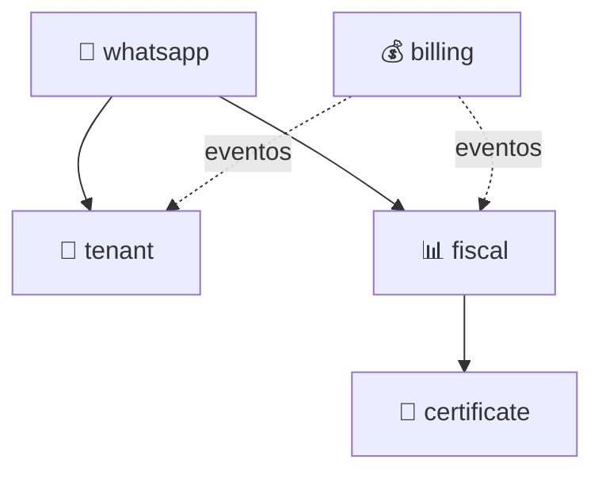

# DDD Clean Architecture Standard — Estrutura de Bounded Contexts

Este documento é a **fonte única de verdade** para a estrutura de pacotes, camadas Clean Architecture, e convenções DDD do projeto SaaS Service.

**Stack:** Spring Boot 4.0.x · Spring Modulith 2.0.x · Java 25 · Maven

**Pacote Base:** `br.com.duoset.saas_service`

---

## Sumário

1. [Bounded Context Map](#1-bounded-context-map)
2. [Estrutura Top-Level do Projeto](#2-estrutura-top-level-do-projeto)
3. [Estrutura Interna de um Bounded Context](#3-estrutura-interna-de-um-bounded-context)
4. [Regra de Dependência (Dependency Rule)](#4-regra-de-dependência-dependency-rule)
5. [Camada de Domínio](#5-camada-de-domínio)
6. [Camada de Aplicação](#6-camada-de-aplicação)
7. [Camada de Infraestrutura](#7-camada-de-infraestrutura)
8. [Camada de Apresentação](#8-camada-de-apresentação)
9. [API Pública do Módulo](#9-api-pública-do-módulo)
10. [Eventos de Domínio](#10-eventos-de-domínio)
11. [Shared Kernel](#11-shared-kernel)
12. [Estrutura de Testes](#12-estrutura-de-testes)
13. [Relacionamento entre Módulos](#13-relacionamento-entre-módulos)

---

## 1. Bounded Context Map

O projeto SaaS Service é organizado como um **Spring Modulith** onde cada Bounded Context corresponde a um módulo.

| Módulo | Display Name | Pacote | Responsabilidade |
|--------|-------------|--------|------------------|
| `tenant` | Tenant Management | `contexts.tenant` | CRUD de escritórios contábeis, gestão de assinaturas e planos, gestão de contadores |
| `fiscal` | Fiscal Integration | `contexts.fiscal` | Consultas fiscais via SERPRO Integra Contador, emissão de DARFs |
| `certificate` | Certificate Management | `contexts.certificate` | Gestão de certificados digitais A1/A3 |
| `whatsapp` | WhatsApp Channel | `contexts.whatsapp` | Integração WhatsApp Business API, chatbot, templates de mensagens |
| `billing` | Billing | `contexts.billing` | Faturamento, créditos, planos de assinatura |

### Mapa de Dependências



- **→** Dependência direta (`allowedDependencies`)
- **- - →** Comunicação via eventos (acoplamento fraco)

---

## 2. Estrutura Top-Level do Projeto

```
br.com.duoset.saas_service/              ← Pacote raiz (@SpringBootApplication)
├── contexts/                             ← Pacote agrupador de módulos
│   ├── tenant/                           ← Módulo: Tenant Management
│   │   ├── package-info.java             ← @ApplicationModule declaration
│   │   ├── TenantApi.java                ← API Pública do módulo
│   │   ├── events/                       ← Eventos de domínio (públicos)
│   │   │   └── EscritorioRegistradoEvent.java
│   │   └── internal/                     ← Implementação interna (PRIVADA)
│   │       ├── application/
│   │       ├── domain/
│   │       ├── infrastructure/
│   │       └── presentation/
│   │
│   ├── fiscal/                           ← Módulo: Fiscal Integration
│   │   ├── package-info.java
│   │   ├── FiscalApi.java
│   │   ├── events/
│   │   └── internal/
│   │
│   ├── certificate/                      ← Módulo: Certificate Management
│   ├── whatsapp/                         ← Módulo: WhatsApp Channel
│   └── billing/                          ← Módulo: Billing
│
├── shared/                               ← Shared Kernel (tipos compartilhados)
│   ├── exception/
│   ├── messaging/
│   └── types/
│
└── config/                               ← Configurações Spring (global)
```

> [!IMPORTANT]
> O pacote `internal/` é tratado pelo Spring Modulith como **pacote interno**. Classes neste pacote **não podem** ser acessadas por outros módulos. Qualquer violação é detectada por `ApplicationModules.verify()`.

---

## 3. Estrutura Interna de um Bounded Context

Esta é a **estrutura canônica** que todo Bounded Context deve seguir:

```
{context}/internal/
├── application/
│   ├── port/              # Interfaces (Ports) — contratos de entrada/saída
│   ├── usecase/            # Casos de uso — orquestração de domínio
│   └── service/            # Serviços de aplicação (cross-cutting)
│
├── domain/
│   ├── model/              # Entidades, Aggregate Roots, Value Objects
│   ├── repository/         # Interfaces de repositório (SPI do domínio)
│   └── exception/          # Exceções de domínio (regras de negócio)
│
├── infrastructure/
│   ├── adapter/            # Implementações de Ports (application/port/)
│   ├── persistence/        # Entidades JPA, Repositórios JPA, Mappers
│   ├── external/           # Clientes de APIs externas (HTTP, SOAP)
│   ├── messaging/          # Listeners de eventos (@ApplicationModuleListener)
│   └── scheduler/          # Jobs agendados (orquestram use cases)
│
└── presentation/
    └── rest/               # Controllers REST
        └── dto/            # DTOs de apresentação (request/response)
```

### Descrição de Cada Pacote

| Pacote | Camada | Conteúdo | Exemplo |
|--------|--------|----------|---------|
| `application/port/` | Aplicação | Interfaces de entrada e saída | `EmailPort.java`, `TenantContextPort.java` |
| `application/usecase/` | Aplicação | Classes `@Service` com lógica de orquestração | `CreateUserUseCase.java` |
| `application/service/` | Aplicação | Serviços de aplicação cross-cutting | `MonitoringStatusService.java` |
| `domain/model/` | Domínio | Aggregate Roots, Entidades, Value Objects | `User.java`, `Email.java`, `TenantId.java` |
| `domain/model/valueobjects/` | Domínio | Value Objects (sub-pacote opcional) | `ServiceOrderStatus.java` |
| `domain/repository/` | Domínio | Interfaces de repositório (SPI) | `UserRepository.java` |
| `domain/exception/` | Domínio | Exceções de regras de negócio | `UserNotFoundException.java` |
| `infrastructure/adapter/` | Infra | Implementações de Ports | `MailAdapter.java` |
| `infrastructure/persistence/` | Infra | JPA Entities, Repositories, Mappers | `UserJpaEntity.java`, `UserJpaRepository.java` |
| `infrastructure/external/` | Infra | Clientes HTTP para APIs externas | `SerproClient.java`, `WhatsAppClient.java` |
| `infrastructure/messaging/` | Infra | Listeners de eventos de outros módulos | `TenantRegisteredListener.java` |
| `infrastructure/scheduler/` | Infra | Jobs agendados (`@Scheduled`) | `FiscalSyncScheduler.java` |
| `presentation/rest/` | Apresentação | Controllers REST | `UserController.java` |
| `presentation/rest/dto/` | Apresentação | DTOs de request/response | `UserResponseDTO.java`, `CreateUserRequestDTO.java` |

---

## 4. Regra de Dependência (Dependency Rule)

As dependências devem apontar **sempre para dentro** — camadas externas dependem de internas, nunca o contrário.

```
┌─────────────────────────────────────────────────────────────────────┐
│                        DEPENDENCY RULE                               │
│                                                                      │
│   presentation/ ──→ application/ ──→ domain/                        │
│   infrastructure/ ──→ application/ ──→ domain/                      │
│                                                                      │
│   ✅ domain/      NÃO importa nada de application, infra, ou pres. │
│   ✅ application/ NÃO importa nada de infrastructure ou presentation│
│   ✅ infrastructure/ implementa ports definidos em application/     │
│   ✅ presentation/   consome use cases de application/              │
│                                                                      │
│   ❌ domain/ NUNCA importa @Service, @Repository, @RestController   │
│   ❌ domain/ NUNCA importa javax.persistence.*, Spring, Jackson     │
│   ❌ application/ NUNCA importa classes de infrastructure/          │
└─────────────────────────────────────────────────────────────────────┘
```

---

## 5. Camada de Domínio

A camada de domínio é **pura** — sem dependências de framework.

### Entidades e Aggregate Roots

- Localizadas em `domain/model/`
- Sem sufixo no nome de classe (ex: `User`, `ServiceOrder`)
- Factory methods para criação e reconstituição
- Construtor privado
- Validação via `Objects.requireNonNull()`

### Value Objects

- Localizados em `domain/model/` ou `domain/model/valueobjects/`
- Implementados como **Records** (imutáveis por natureza)
- Sem sufixo no nome (ex: `Email`, `TenantId`, `Cnpj`)
- Validação no construtor compacto do Record

### Interfaces de Repositório

- Localizadas em `domain/repository/`
- Sufixo `Repository` (ex: `UserRepository`)
- Definem o contrato; implementação fica em `infrastructure/persistence/`

### Exceções de Domínio

- Localizadas em `domain/exception/`
- Sufixo `Exception` (ex: `UserNotFoundException`, `InvalidCnpjException`)
- Representam violações de regras de negócio

---

## 6. Camada de Aplicação

Orquestra o domínio sem conter lógica de negócio própria.

### Use Cases

- Localizados em `application/usecase/`
- Sufixo `UseCase` (ex: `CreateUserUseCase`)
- Anotados com `@Service` e `@RequiredArgsConstructor`
- Uma classe por caso de uso (Single Responsibility)
- Dependem de **Ports** e **Repositories**, nunca de implementações

### Ports (Interfaces)

- Localizados em `application/port/`
- Sufixo `Port` (ex: `EmailPort`, `TenantContextPort`)
- Definem contratos para serviços externos que o use case precisa
- Implementação fica em `infrastructure/adapter/`

### Serviços de Aplicação

- Localizados em `application/service/`
- Sufixo `Service` (ex: `MonitoringStatusService`)
- Cross-cutting concerns que não são use cases como health checks, monitoramento

---

## 7. Camada de Infraestrutura

Implementa os contratos das camadas internas.

### Adapters (Implementações de Ports)

- Localizados em `infrastructure/adapter/`
- Sufixo `Adapter` (ex: `MailAdapter`, `KeycloakAdapter`)
- Implementam interfaces de `application/port/`
- Anotados com `@Component`

### Persistência (JPA)

- Localizada em `infrastructure/persistence/`
- JPA Entity: sufixo `JpaEntity` (ex: `UserJpaEntity`)
- JPA Repository: sufixo `JpaRepository` (ex: `UserJpaRepository`)
- Mapper: sufixo `Mapper` (ex: `UserPersistenceMapper`)
- Implementa `domain/repository/` interfaces

### Clientes Externos

- Localizados em `infrastructure/external/`
- Sufixo `Client` (ex: `SerproClient`, `WhatsAppApiClient`)
- Encapsulam chamadas HTTP, SOAP, ou gRPC

### Messaging (Listeners de Eventos)

- Localizados em `infrastructure/messaging/`
- Sufixo `Listener` (ex: `TenantRegisteredListener`)
- Anotados com `@ApplicationModuleListener` (Spring Modulith)
- Consomem eventos publicados por outros módulos

### Schedulers (Jobs Agendados)

- Localizados em `infrastructure/scheduler/`
- Sufixo `Scheduler` (ex: `FiscalSyncScheduler`)
- Anotados com `@Scheduled`
- Orquestram use cases em agendamentos periódicos

---

## 8. Camada de Apresentação

Interface com o mundo externo via HTTP.

### Controllers REST

- Localizados em `presentation/rest/`
- Sufixo `Controller` (ex: `UserController`)
- Implementam interface gerada pelo OpenAPI Generator
- Anotados com `@RestController`
- Delegam para Use Cases da camada de aplicação

### DTOs de Apresentação

- Localizados em `presentation/rest/dto/`
- Sufixo `DTO` (ex: `UserResponseDTO`, `CreateUserRequestDTO`)
- DTOs de request e response para a API REST
- Podem ser gerados pelo OpenAPI Generator ou criados manualmente

---

## 9. API Pública do Módulo

Cada módulo expõe uma **API pública** no pacote raiz do contexto (fora de `internal/`):

```java
// Em contexts/{context}/{Context}Api.java — PÚBLICO
public interface TenantApi {
    Optional<TenantSummaryDTO> findById(UUID tenantId);
    boolean isActive(UUID tenantId);
}
```

- A implementação da API fica em `internal/` (ex: `TenantApiImpl`)
- Outros módulos interagem **apenas** via `{Context}Api` ou via eventos
- DTOs expostos na API pública devem ser **mínimos** (sem expor entidades internas)

---

## 10. Eventos de Domínio

Eventos que cruzam fronteiras de módulo ficam no pacote `events/` (fora de `internal/`):

```
{context}/
├── events/                           ← PÚBLICO — visível para outros módulos
│   ├── {Entity}CreatedEvent.java
│   ├── {Entity}UpdatedEvent.java
│   └── {Entity}DeletedEvent.java
└── internal/                         ← PRIVADO
```

**Regras:**
- Eventos são **Records** imutáveis
- Sufixo `Event` (ex: `EscritorioRegistradoEvent`)
- Carregam apenas **IDs e dados mínimos** — nunca entidades completas ou PII
- Publicados via `ApplicationEventPublisher`
- Consumidos via `@ApplicationModuleListener` em `infrastructure/messaging/`

---

## 11. Shared Kernel

Tipos compartilhados entre todos os módulos ficam no pacote `shared/`:

```
br.com.duoset.saas_service/
└── shared/
    ├── exception/        # BusinessException, ValidationException
    ├── messaging/        # DomainEventPublisher (interface)
    └── types/            # TenantId, AuditableEntity (tipos base)
```

> [!WARNING]
> O shared kernel deve ser **mínimo**. Se um tipo é usado por apenas dois módulos, considere comunicação via eventos ao invés de compartilhar tipos.

---

## 12. Estrutura de Testes

Os testes espelham a mesma estrutura de pacotes:

```
src/test/java/br/com/duoset/saas_service/contexts/{context}/
│
├── {Context}ModuleTest.java               # Testes de módulo (API + eventos)
│
└── internal/
    ├── domain/
    │   └── model/
    │       ├── {Entity}Test.java          # Testes do aggregate
    │       └── valueobjects/
    │           └── {VO}Test.java          # Testes de value objects
    │
    ├── application/
    │   └── usecase/
    │       ├── Create{Entity}UseCaseTest.java
    │       └── ...
    │
    └── infrastructure/
        ├── persistence/
        │   └── {Entity}JpaRepositoryTest.java
        └── messaging/
            └── {Event}ListenerTest.java
```

> 📘 Consulte [`backend-testing-standard.md`](backend-testing-standard.md) para padrões detalhados de testes (JUnit 5, Mockito, Testcontainers).

---

## 13. Relacionamento entre Módulos

### Regras de Comunicação

```
┌─────────────────────────────────────────────────────────────────────┐
│              REGRAS DE COMUNICAÇÃO CROSS-MODULE                      │
│                                                                      │
│  ✅ PERMITIDO                                                        │
│  ─────────────                                                       │
│  • Acessar {Context}Api.java de módulos em allowedDependencies      │
│  • Consumir eventos do pacote events/ de qualquer módulo            │
│  • Usar tipos do pacote shared/                                      │
│                                                                      │
│  ❌ PROIBIDO                                                         │
│  ───────────                                                         │
│  • Acessar classes do pacote internal/ de outro módulo              │
│  • Depender de módulo não listado em allowedDependencies            │
│  • Criar dependências circulares entre módulos                       │
│  • Importar classes de infrastructure/ de outro módulo               │
│  • Fazer JOINs SQL com tabelas de outro módulo                       │
└─────────────────────────────────────────────────────────────────────┘
```

### Padrões de Integração

| Padrão | Quando Usar | Exemplo |
|--------|-------------|---------|
| **API Pública** | Consultas síncronas | `fiscalApi.consultarSituacao(documento)` |
| **Eventos** | Notificações assíncronas | `ConsultaFiscalRealizadaEvent` → Billing debita créditos |
| **Shared Kernel** | Tipos universais | `TenantId`, `BusinessException` |

---

## Referências Cruzadas

| Standard | Complementa |
|----------|-------------|
| [`java-standard.md`](java-standard.md) | Convenções Java: nomenclatura de classes, anotações, Lombok, Records |
| [`modulith-standard.md`](modulith-standard.md) | Spring Modulith: `package-info.java`, testes de módulo, eventos, observabilidade |
| [`development-standard.md`](./development-standard.md) | Guia prático: como criar endpoints, use cases, testes |
| [`backend-testing-standard.md`](backend-testing-standard.md) | Testes: JUnit 5, Mockito, Testcontainers, JaCoCo |

---
