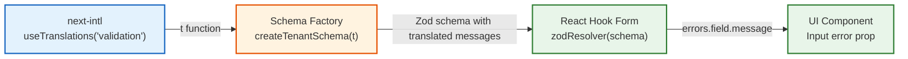

# Form Validation Standard — @FrontendWeb

> **Mandatory rules** for building client-side form validation with internationalized error messages. This standard defines the integration pattern between **Zod** (schema validation), **React Hook Form** (form state), and **next-intl** (i18n), ensuring all validation messages are locale-aware across every screen in the application.

> **Prerequisite:** Read [`component-design-standard.md`](./component-design-standard.md) (Input/Select error prop API) and [`i18n-standard.md`](./i18n-standard.md) (all user-facing text through `t()`).

---

## 1. Problem Statement

Zod schemas are defined outside of React components (at module level). The `useTranslations()` hook from `next-intl` is only available inside React components. This creates a mismatch: validation messages cannot be directly internationalized at schema definition time.

**This standard resolves this mismatch** by establishing a **Schema Factory Function** pattern.

---

## 2. Architecture Overview



---

## 3. Dependencies

| Package | Purpose |
|---|---|
| `zod` | Schema definition & validation |
| `@hookform/resolvers/zod` | Bridge Zod → React Hook Form |
| `react-hook-form` | Form state management |
| `next-intl` | Internationalization (`useTranslations`) |

---

## 4. Pattern: Schema Factory Function

### 4.1. i18n Validation Messages

All validation messages are centralized in a single namespace: `validation`.

```json
// src/i18n/messages/pt-BR/validation.json
{
  "validation": {
    "required": "Campo obrigatório",
    "email": "E-mail inválido",
    "url": "URL inválida",
    "minLength": "Mínimo de {min} caracteres",
    "maxLength": "Máximo de {max} caracteres",
    "minValue": "Valor mínimo: {min}",
    "maxValue": "Valor máximo: {max}",
    "integer": "Deve ser um número inteiro",
    "invalidNumber": "Informe um número válido",
    "documentoFormat": "Documento inválido. Formato: XX.XXX.XXX/XXXX-XX",
    "whatsappFormat": "WhatsApp inválido. Formato: (99) 99999-9999",
    "phoneFormat": "Telefone inválido",
    "selectOption": "Selecione uma opção",
    "selectPlan": "Selecione um plano",
    "selectRole": "Selecione uma permissão"
  }
}
```

### 4.2. Schema Factory (Module Schema File)

```tsx
// src/schemas/tenantSchemas.ts
import { z } from 'zod';

// ---- Regex Patterns (module-level, no i18n needed) ----
const Documento_REGEX = /^\d{2}\.\d{3}\.\d{3}\/\d{4}-\d{2}$/;
const WHATSAPP_REGEX = /^\(\d{2}\) \d{5}-\d{4}$/;

// ---- Type alias for the translation function ----
type TValidation = (key: string, params?: Record<string, string | number>) => string;

// ---- Schema Factory: receives t() from the component ----
export const createTenantSchema = (t: TValidation) =>
  z.object({
    name: z
      .string()
      .min(1, t('required'))
      .max(150, t('maxLength', { max: 150 })),
    taxId: z
      .string()
      .min(1, t('required'))
      .regex(Documento_REGEX, t('documentoFormat')),
    email: z
      .string()
      .min(1, t('required'))
      .email(t('email'))
      .max(100, t('maxLength', { max: 100 })),
    planId: z.enum(['START', 'BUSINESS', 'PREMIUM'], {
      message: t('selectPlan'),
    }),
  });

// ---- Type inference uses a dummy factory call ----
export type CreateTenantFormData = z.infer<ReturnType<typeof createTenantSchema>>;
```

### 4.3. Component Integration

```tsx
// In the form component
'use client';

import { useTranslations } from 'next-intl';
import { useForm } from 'react-hook-form';
import { zodResolver } from '@hookform/resolvers/zod';
import { createTenantSchema, type CreateTenantFormData } from '@/schemas/tenantSchemas';

export function CreateTenantForm() {
  const tValidation = useTranslations('validation');

  // Schema is created inside the component with access to i18n
  const schema = React.useMemo(() => createTenantSchema(tValidation), [tValidation]);

  const {
    register,
    handleSubmit,
    formState: { errors },
  } = useForm<CreateTenantFormData>({
    resolver: zodResolver(schema),  // ← translated schema
    defaultValues: { name: '', taxId: '', email: '', planId: '' as any },
  });

  return (
    <form onSubmit={handleSubmit(onSubmit, onInvalid)} noValidate>
      <Input
        label="Nome"
        {...register('name')}
        error={errors.name?.message}  {/* ← already translated */}
      />
    </form>
  );
}
```

### 4.4. Form Submission & Invalid State Handlers

Always disable native browser validation (which differs across browsers and is hard to style) in favor of Zod's validation cycle.

```tsx
// 1. Get the generic validation toast message
const tValidation = useTranslations('validation');
const { error: toastError } = useToast();

// 2. Define the onInvalid callback
const onInvalid = () => {
  toastError(tValidation('formErrors'));
};

// 3. Connect to form with noValidate
<form onSubmit={handleSubmit(onSubmit, onInvalid)} noValidate>
```

---

## 5. Visual Error Behavior

When validation fails, the UI components (`Input` and `Select`) **must** exhibit the following behavior — already implemented in the component base:

| Behavior | Implementation |
|---|---|
| **Red border** | CSS class `border-destructive` applied when `error` prop is truthy |
| **Red focus ring** | CSS class `focus-visible:ring-destructive` applied when `error` prop is truthy |
| **Error message** | `<p role="alert">` rendered below the field with `text-xs text-destructive` |
| **ARIA invalid** | `aria-invalid={!!error}` set on the input element |
| **Screen reader** | `aria-describedby` points to the error `<p>` element |

> [!IMPORTANT]
> The `error` prop on `Input` and `Select` is the **single source of truth** for visual error states. Components MUST NOT have separate "isError" boolean props. The presence of an `error` string triggers all visual and accessibility behaviors simultaneously.

---

## 6. Input Masks

For fields requiring formatted input (Documento, WhatsApp, Telefone), the standard pattern is:

1. **Define a pure formatter function** at module level (outside the component).
2. **Use `<Controller>`** from React Hook Form instead of `register()`.
3. **Apply the formatter** on the `onChange` handler.

```tsx
// Pure formatter (module-level)
const formatWhatsApp = (val: string) => {
  const d = val.replace(/\D/g, '').substring(0, 11);
  let res = '';
  if (d.length > 0) res += '(' + d.substring(0, 2);
  if (d.length > 2) res += ') ' + d.substring(2, 7);
  if (d.length > 7) res += '-' + d.substring(7, 11);
  return res;
};

// In JSX — use Controller, not register
<Controller
  control={control}
  name="whatsapp"
  render={({ field }) => (
    <Input
      label={t('whatsappLabel')}
      placeholder="(99) 99999-9999"
      {...field}
      onChange={(e) => field.onChange(formatWhatsApp(e.target.value))}
      error={errors.whatsapp?.message}
    />
  )}
/>
```

### Rules

1. Formatters strip all non-digit characters (`/\D/g`) then rebuild the mask.
2. `maxLength` truncation happens **inside** the formatter, not on the `<input>`.
3. The Zod regex validates the **final formatted output**, not raw digits.

---

## 7. Type Inference with Factories

Since the schema is created by a factory function, the type must be inferred from the **return type**:

```tsx
// ✅ Correct — infer from ReturnType
export type CreateTenantFormData = z.infer<ReturnType<typeof createTenantSchema>>;

// ❌ Wrong — cannot infer from a function, only from a schema instance
export type CreateTenantFormData = z.infer<typeof createTenantSchema>;
```

---

## 8. Rules (Mandatory)

| # | Rule | Rationale |
|---|---|---|
| 1 | **Every Zod schema** with user-facing messages MUST be a factory function `(t: TValidation) => z.object(...)` | Enables i18n |
| 2 | The `t` function comes from `useTranslations('validation')` | Single namespace for all validation messages |
| 3 | Schema is created inside the component via `React.useMemo(() => schemaFactory(t), [t])` | Memoized, reactive to locale changes |
| 4 | **No hardcoded Portuguese strings** in schema files | All strings via `t()` |
| 5 | Regex patterns remain at module level (constants) | They don't need i18n |
| 6 | Type alias `TValidation` is defined in each schema file | Keeps schema files self-contained |
| 7 | The `validation` namespace in i18n is **shared across all modules** | Consistent messages app-wide |
| 8 | Form error messages appear as `<p role="alert">` below the field | Accessibility (screen readers) |
| 9 | Masked fields use `<Controller>` + pure formatter function | Clean separation of concerns |
| 10 | `maxLength` prop on `<Input>` enforces character limits at DOM level | Defense in depth beyond Zod |
| 11 | `<form>` elements MUST have the `noValidate` prop | Prevents conflicting native browser tooltips |
| 12 | Forms MUST handle `onInvalid` in `handleSubmit` and show `tValidation('formErrors')` toast | Alerts users to scroll/check fields |

---

## 9. Namespace Convention

| i18n Namespace | Purpose | Example Key |
|---|---|---|
| `validation` | Shared validation error messages | `validation.required` |
| `{module}.forms.{action}` | Form-specific labels, placeholders, toasts | `tenants.forms.create.nameLabel` |

> [!NOTE]
> Validation messages (`required`, `email`, `maxLength`) go in `validation.*`. Form-specific UI text (labels, placeholders, button text, toast messages) go in `{module}.forms.{action}.*`. This separation prevents duplication of generic messages across modules.

---

## 10. Checklist

Before merging any form implementation, verify:

| # | Check | Required |
|---|---|---|
| 1 | Schema uses factory function pattern `(t) => z.object(...)` | ✅ |
| 2 | All error messages come from `t('validation.*')` | ✅ |
| 3 | Type inferred via `z.infer<ReturnType<typeof factory>>` | ✅ |
| 4 | Schema memoized with `useMemo` in component | ✅ |
| 5 | Masked fields use `Controller` + formatter | ✅ |
| 6 | `maxLength` prop set on text inputs | ✅ |
| 7 | `error` prop wired from `errors.field?.message` | ✅ |
| 8 | Red border visible on invalid fields | ✅ |
| 9 | Error message visible below invalid fields | ✅ |
| 10 | No hardcoded strings in schema file | ✅ |
| 11 | `<form>` element has `noValidate` prop | ✅ |
| 12 | `handleSubmit(onSubmit, onInvalid)` triggers error toast | ✅ |
