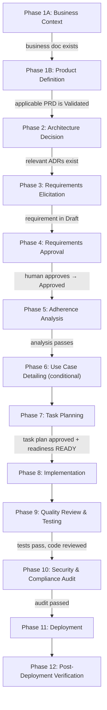

# Software Engineering Lifecycle Standard

## 1. Purpose

This document defines the **mandatory software engineering lifecycle** that AgentOrchestrator and all specialized agents must follow before, during, and after implementation of any feature or capability in the Software Factory.

Every implementation activity must progress through the lifecycle phases defined here, producing the required reference documents at each stage. No phase may be skipped unless explicitly marked as conditional.

---

## 2. Lifecycle Phases

The lifecycle follows a sequential pipeline with quality gates between phases. Some phases may run in parallel when explicitly noted.



---

## 3. The C.L.E.A.R. Methodology

To simplify communication and provide an executive view of the 12-phase lifecycle, the SaaS Service project groups the phases into the **C.L.E.A.R.** macro-workflow:

* **[C] Context** *(Business, Product Definition & Requirements)*
  *Phases 1A, 1B, 3, 4:* Understanding the business vision, validating the
  initiative PRD, eliciting detailed requirements, and securing human approval.
  The context dictates the rules.
* **[L] Logic & Layout** *(Architecture & Planning)*
  *Phases 2, 5, 6, 7:* Defining Architecture Decision Records (ADRs), conducting adherence analysis, detailing use cases, producing the orchestrated task plan, and closing the Implementation Readiness Gate.
* **[E] Execution** *(Implementation)*
  *Phase 8:* Specialized technical agents (`@CleanArchitecture`, `@AdapterDev`, etc.) implement the actual code based on the task plan.
* **[A] Assurance** *(Test, Quality, Security & Audit)*
  *Phases 9, 10:* A1 Test Gate demonstra o comportamento; A2 Quality Gate verifica
  cobertura e manutenção conforme os standards aplicáveis; A3 Security & Compliance
  Gate avalia segurança, LGPD/GDPR e auditoria. Um subgate verde não aprova os demais.
* **[R] Release** *(Deployment & Verification)*
  *Phases 11, 12:* Automated CI/CD deployment, smoke testing, and telemetry verification (Grafana/Prometheus) in the live environment.

---

## 4. Phase Details

### Phase 1A: Business Context

| Attribute | Value |
|:--|:--|
| **Owner** | Human Stakeholders |
| **Gate** | Business document exists in `docs/product/business/` |
| **Artifact** | `docs/product/business/product-vision.md` or feature-specific business brief |
| **Description** | The business vision, personas, product outcomes, subscription plans, and domain constraints are documented. User Story View is materialized inside the requirement rather than as an ungoverned standalone artifact. |

---

### Phase 1B: Product Definition

| Attribute | Value |
|:--|:--|
| **Owner** | Human Product Owner, with required domain reviewers |
| **Gate** | Applicable PRD exists in `docs/product/requirements/` with status `Validated` for the current version and scope |
| **Artifact** | `projects/backend/docs/prds/PRD-NNNNN-short-title.md` |
| **Template** | Must follow `harness/templates/TPL-00012-prd.md` |
| **Description** | The PRD closes problem, audience, objectives, limits, metrics and product hypotheses before architecture or requirements progress. It groups requirements by reference without copying acceptance criteria, refers to use cases without flows and never decides architecture. A Product Hypothesis `Proposed`, Open Question, metric without decided target/source/owner or missing human approval keeps the gate blocked. |

Small maintenance or purely technical work may record `PRD not applicable` with a
specific justification in the readiness audit. Creating or changing product
behavior, audience, value, offering or initiative scope always requires a PRD.

---

### Phase 2: Architecture Decision

| Attribute | Value |
|:--|:--|
| **Owner** | @CleanArchitecture |
| **Gate** | Relevant ADRs exist in `../../adrs/` for the feature's domain |
| **Artifact** | `../../adrs/ADR-NNNN-description.md` |
| **Description** | After the Product Definition Gate passes, architecture decisions (technology stack, bounded contexts, integration patterns, multi-tenancy strategy) are formalized as ADRs before any requirement or implementation begins. If the feature requires architectural decisions not yet covered by existing ADRs, @CleanArchitecture must produce new ADRs first. |

---

### Phase 3: Requirements Elicitation

| Attribute | Value |
|:--|:--|
| **Owner** | @RequirementAgent |
| **Gate** | Requirement document exists in `docs/product/requirements/` with status `Draft` |
| **Artifact** | `docs/product/requirements/REQ-NNNNN-short-name.md` |
| **Template** | Must follow `harness/templates/TPL-00003-requirement.md` |
| **Description** | @RequirementAgent analyzes business context (`docs/product/business/`) and architectural constraints (`../../adrs/`) to produce structured requirement documents with User Story View, testable acceptance criteria, business rules, assumptions, Open Questions, data model impact, and AI agent responsibilities. If the requirement creates, changes or consumes a backend HTTP API, it also creates or updates the canonical OpenAPI in `docs/api_contracts/`, auto-approves it under the API Client Standard and references its version and operations. |

---

### Phase 4: Requirements Approval

| Attribute | Value |
|:--|:--|
| **Owner** | Human Stakeholders |
| **Gate** | Requirement status changed from `Draft` to `Approved` |
| **Artifact** | Updated `docs/product/requirements/REQ-NNNNN-short-name.md` |
| **Description** | A human stakeholder reviews the requirement document and approves it. Only approved requirements can be referenced by downstream phases. Rejected requirements return to Phase 3 for revision. |

---

### Phase 5: Adherence Analysis

| Attribute | Value |
|:--|:--|
| **Owner** | @RequirementAgent or @CodeGuardian |
| **Gate** | Analysis document confirms adherence to business context and ADRs |
| **Artifact** | `artefatos de análise/ANL-NNNNN-req-adherence-analysis.md` |
| **Description** | Cross-check the approved requirement against the business plan (`docs/product/business/product-vision.md`) and all relevant ADRs. Verify coverage of business rules, architectural alignment, and identify gaps. Non-blocking gaps are documented; blocking gaps return to Phase 2 or Phase 3. |

---

### Phase 6: Use Case Detailing (Conditional)

| Attribute | Value |
|:--|:--|
| **Owner** | @RequirementAgent |
| **Gate** | Use case document exists (only required for complex multi-step interaction flows) |
| **Artifact** | `docs/product/use-cases/UC-NNNNN-short-name.md` |
| **Template** | Must follow `harness/templates/TPL-00004-use-case.md` |
| **Condition** | This phase is **conditional** — it is required only when the requirement involves complex user-system interactions (e.g., chatbot state machines, multi-step wizards, approval workflows). Simple CRUD requirements do not need a Use Case document. |
| **Description** | Produces a Use Case document detailing main success scenario, alternative and exception flows, preconditions, postconditions, actor interactions, business rules and the mapping from each applicable requirement AC to flow and planned evidence. It never creates acceptance behavior independently; a newly discovered criterion returns to the requirement for approval. |

---

### Phase 7: Task Planning

| Attribute | Value |
|:--|:--|
| **Owner** | @AgentOrchestrator |
| **Gate** | Task plan exists, every task has finite contract, API operations are agent-defined/auto-approved when applicable, and `implementation-readiness` records `READY` for the exact source versions and scope |
| **Artifact** | `docs/delivery/plans/TP-NNNNN-feature-task-plan.md` |
| **Description** | @AgentOrchestrator decomposes the approved requirement into semantic units with one observable result and one handoff each, maps What, Where, Depends on, Reuses and Requirements, and defines Gate Audit, Acceptance Tests, Prohibited, Mandatory and finite Definition of Done. A granularity failure is corrected automatically with parent → child mapping, index/dependency updates and a separate IRG rerun for every child; it is not a final `BLOCKED` reason. For API work, every plan binds the canonical path, `info.version`, status and exact `operationId`s and plans parity tests. API contract incompleteness is auto-repaired as `REPAIRING` and never blocks; only a newly discovered product/architecture decision can block. Any assumption `Proposed`, Open Question, missing dependency or non-verifiable DoD still produces `BLOCKED`. |

---

### Phase 8: Implementation

| Attribute | Value |
|:--|:--|
| **Owner** | Specialized agents (@CleanArchitecture, @DomainExpert, @ImplementerCore, @AdapterDev, @FrontendWeb, etc.) |
| **Gate** | Implementation Plan exists in `docs/delivery/plans/implementation_plans/`, contains a task-scoped `READY` result and, for API work, references an agent-defined auto-approved canonical OpenAPI/version/operations; the executor confirms the evidence before the first executable edit. |
| **Artifact** | Implementation Plan, Source code, configuration files, migrations, centralized lessons learned update |
| **Description** | **MANDATORY PRE-CONDITION:** Before writing code, the assigned agent MUST have an Implementation Plan and valid `READY` evidence for the exact task, source versions and paths. The agent MUST REFUSE an absent, stale or `BLOCKED` handoff. Each agent consults relevant standards during implementation and records critical transferable challenges in `docs/delivery/lessons-learned/{domain}/`; no lesson is required when none occurred. |

---

### Phase 9: Quality Review & Testing

| Attribute | Value |
|:--|:--|
| **Owner** | @CodeGuardian (review), @TestAutomator (testing) |
| **Gate** | Evidência `READY` vigente para o mesmo task ID/versões/paths e A1 Test Gate e A2 Quality Gate aplicáveis aprovados conforme `software-quality-standard.md` e os standards do pacote |
| **Artifact** | Matriz Teste x QA, relatório atual de testes/cobertura, métricas dos targets, resultado de arquitetura/análise estática e build |
| **Description** | @TestAutomator e implementadores exercitam critérios de aceite; @CodeGuardian verifica readiness e mede cobertura, tamanho e comentários. `FAIL` inicia correção iterativa limitada; blocker real retorna ao owner ou à Phase 7. Limiar quantitativo é definido pelo standard e materializado em configuração executável. |

Subgates obrigatórios da Phase 9:

| Subgate | Critério de avanço |
| --- | --- |
| A1 — Test Gate | Teste focalizado e suíte impactada aprovados, com zero falhas/erros e tratamento explícito de skips. |
| A2 — Quality Gate | Cobertura, tamanho, comentários, arquitetura/análise estática, lint, typecheck e build aplicáveis aprovados. |

O comando de orquestração recebe todos os arquivos alterados explicitamente:
`./infra/scripts/validate-quality-gates.sh --scope <escopo> --level <nivel>
--target <path>`. Resultado inaceitável é corrigido e reexecutado enquanto houver
progresso; três iterações sem progresso na mesma causa ou dependência externa real
terminam `BLOCKED`, nunca em loop infinito ou relaxamento de regra.
Gates especializados do plano continuam obrigatórios e sua ausência produz
`BLOCKED`, não aprovação implícita.

Depois de A1, A2 e A3 aplicáveis em `PASS`, a mesma execução em `pr` ou `release`
com `--delivery --branch-name <nome>` certifica a branch para o push restrito da
política global. Essa transição não autoriza merge, tag, deploy ou branch protegida.

---

### Phase 10: Security & Compliance Audit

| Attribute | Value |
|:--|:--|
| **Owner** | @SecurityOAuth, @SecurityAgent, @ComplianceAgent |
| **Gate** | Security review and compliance audit passed |
| **Artifact** | Security review report, compliance audit report |
| **Description** | Security review for authentication, authorization, and data handling. LGPD/GDPR compliance audit for PII-handling features. This phase runs in parallel with Phase 9 when possible. |

---

### Phase 11: Deployment

| Attribute | Value |
|:--|:--|
| **Owner** | @DevOps-Agent |
| **Gate** | CI/CD pipeline passes, artifact deployed to staging |
| **Artifact** | CI/CD configuration, deployment manifest |
| **Description** | Build, test, and deploy artifacts through the CI/CD pipeline. Deploy to staging environment for final validation. |

---

### Phase 12: Post-Deployment Verification

| Attribute | Value |
|:--|:--|
| **Owner** | @TestAutomator, @Monitoring-Agent |
| **Gate** | Smoke tests pass in staging, monitoring confirms healthy metrics |
| **Artifact** | Verification report |
| **Description** | Run smoke tests in the deployed environment. Verify that observability metrics (Prometheus, Grafana) show expected behavior. Confirm that the feature works end-to-end in the staging environment before promoting to production. |

---

## 5. Document Traceability Chain

Every artifact produced in the lifecycle must reference its predecessor(s). The traceability chain is:

```
Business Context (`docs/product/business/product-vision.md`)
  └── Validated PRD (projects/backend/docs/prds/PRD-NNNNN-*.md)
        └── ADR (../../adrs/ADR-NNNN-*.md)
              └── Requirement + User Story View (docs/product/requirements/REQ-NNNNN-*.md)
              ├── Adherence Analysis (artefatos de análise/ANL-NNNNN-*.md)
              ├── Use Case [conditional] (docs/product/use-cases/UC-NNNNN-*.md)
              ├── OpenAPI Contract [when API applies] (docs/api_contracts/*-vN.openapi.yaml)
              └── Task Plan (docs/delivery/plans/TP-NNNNN-*.md)
                    └── Implementation Plan (docs/delivery/plans/implementation_plans/{backend|frontend}/*.md)
                          └── Implementation Readiness READY
                                └── Implementation → Tests → Security → Deployment → Verification
```

---

## 6. Gate Enforcement Rules

1. **No phase may begin without its predecessor's gate being satisfied.** If a gate condition is not met, the workflow halts and escalates to the appropriate owner.
2. **Product Definition Gate:** uma iniciativa ou mudança de comportamento somente
   avança após o PRD aplicável estar `Validated`. `Draft`, `In Review`,
   `Deprecated`, hipótese `Proposed`, Open Question ou métrica não decidida bloqueia
   arquitetura, requisito e execução. Trabalho sem impacto de produto pode usar
   `not applicable` somente com justificativa específica auditada.
3. **Conditional phases** (Phase 6: Use Case) may be skipped when the condition is not met. The decision to skip must be documented in the task plan.
4. **UI/UX Lifecycle Rule (Frontend Blocking Gate):** Any frontend implementation task (Phase 8) that introduces new layouts, screens, or visual components **MUST** have its corresponding visual wireframes (e.g., Google Stitch) formally **approved** by a human stakeholder (Product Owner / Client) **before** any React/Tailwind code is written. The visual design acts as the single source of truth to avoid rework during coding.
5. **Implementation Plan Rule (Blocking Gate):** Any technical agent (e.g., `@AdapterDev`, `@ImplementerCore`, `@DevOps-Agent`) **MUST REFUSE** to write code or execute configuration commands if there is no corresponding `.md` Implementation Plan created in the `docs/delivery/plans/implementation_plans/` directory. The plan must be generated and approved first.
6. **Parallel execution** is allowed between Phases 9 and 10 (Quality Review and Security Audit).
7. **Rollback:** If a gate fails, the workflow returns to the earliest phase where the gap was identified. For example, if the adherence analysis (Phase 5) finds architectural gaps, the workflow returns to Phase 2 (Architecture Decision).
8. **Assurance Evidence Rule:** A1, A2 e A3 são registrados separadamente como `PASS`, `FAIL` ou `BLOCKED`; somente todos os gates aplicáveis em `PASS` autorizam avanço.
9. **Uncertainty Hard Gate:** Assumption `Proposed`, Open Question, `TBD`,
   placeholder, conflito ou decisão humana ausente sempre interrompe o fluxo antes
   da Phase 8. Não existe waiver ou `READY WITH ASSUMPTIONS`.
10. **Materialized Answer Rule:** O agente pergunta ao humano/owner competente e
   registra resposta, data e evidência no requisito/caso de uso antes de reexecutar
   o gate. A conversa isolada não autoriza implementação.
11. **Readiness Audit Rule:** @AgentOrchestrator sempre executa a skill
    `implementation-readiness` antes de todo handoff de implementação; o executor
    confere o `READY`, e @CodeGuardian registra ausência como blocker processual.
12. **Finite Task Rule:** Cada task publica What, Where, Depends on, Reuses,
    Requirements, Gate Audit, Acceptance Tests, Prohibited, Mandatory e Definition
    of Done binária. Achado fora do escopo vira blocker ou nova task.
13. **API Contract Rule:** Toda especificação que cria, altera ou consome API HTTP
    do backend cria/atualiza o OpenAPI canônico em `docs/api_contracts/` e registra
    versão e operações exatas. Contrato ausente, `Draft` na implementação ou sem
    método/path, roles/authorities, request, responses, bodies, erros RFC 9457 e
    compatibilidade entra em `REPAIRING` e não bloqueia; só decisão nova de
    produto/arquitetura descoberta pelo reparo mantém o fluxo `BLOCKED`.
14. **Automatic Semantic Decomposition Rule:** Antes do resultado do IRG, toda
    task/IP com resultados, owners, dependências, riscos, áreas, autorizações,
    handoffs ou ciclos independentemente aceitáveis é decomposta automaticamente.
    O Orchestrator preserva escopo e aceite, registra pai → filhos, atualiza índices
    e dependências e reaudita cada unidade. Tamanho isolado apenas aciona revisão.

---

## 7. AgentOrchestrator Integration

@AgentOrchestrator must consult this document as the **primary reference** for determining the correct sequence of activities when planning any new feature or capability. Specifically:

- Before creating a task plan, verify that Phases 1A, 1B and 2–5 are complete (and Phase 6 if applicable).
- In the task plan, explicitly reference the artifacts produced in each phase.
- Before every implementation handoff, invoke `implementation-readiness` and bind
  the result to the exact task, source versions and paths.
- If granularity fails, decompose semantically without asking the human how to
  split, update parent → child mappings, indexes and dependencies, and re-run the
  IRG for every resulting unit before deciding its final state.
- If the result is `BLOCKED`, do not assign an executor; ask the decision owner,
  materialize the answer and re-run the audit.
- If Assurance finds missing, stale or scope-divergent readiness, return the work
  to Phase 7 as a process `BLOCKED`; do not split already produced code inside the
  Quality Gate.
- When a gate is not satisfied, log the blocker in the task ledger and escalate to the appropriate phase owner.
- The lifecycle sequence defined here takes precedence over ad-hoc planning decisions.

---

## 8. Reference Documents

| Document | Path | Purpose |
|:--|:--|:--|
| Business Context | `docs/product/business/product-vision.md` | Product vision, personas, outcomes and subscription plans |
| Product Requirements Index | `docs/product/requirements/README.md` | Semantic discovery, lifecycle and Product Definition Gate |
| PRD Template | `harness/templates/TPL-00012-prd.md` | Mandatory AI-safe structure for initiative PRDs |
| Product Requirements | `projects/backend/docs/prds/PRD-NNNNN-*.md` | Validated problem, audience, outcomes, metrics and hypotheses |
| Implementation Readiness Standard | `./implementation-readiness-standard.md` | Hard gate, uncertainty states, task contract and role boundaries |
| API Contract Standard | `./api-client-standard.md` | Contract-first, mandatory operation fields, RFC baseline, versioning and parity |
| API Contracts | `docs/api_contracts/*-vN.openapi.yaml` | Canonical versioned wire protocol for backend HTTP APIs |
| OpenAPI Contract Template | `harness/templates/TPL-00011-api-contract.md` | Governed skeleton and mandatory official-document reference block |
| ADRs | `../../adrs/ADR-NNNN-*.md` | Architecture decisions and constraints |
| Requirements Template | `harness/templates/TPL-00003-requirement.md` | Mandatory structure for requirement documents |
| Requirements | `docs/product/requirements/REQ-NNNNN-*.md` | Structured functional/non-functional requirements |
| Adherence Analysis | `artefatos de análise/ANL-NNNNN-*.md` | Cross-check of requirements vs. business + ADRs |
| Use Case Template | `harness/templates/TPL-00004-use-case.md` | Structure for use case documents (conditional) |
| Use Cases | `docs/product/use-cases/UC-NNNNN-*.md` | Detailed interaction flows (conditional) |
| Task Plans | `docs/delivery/plans/TP-NNNNN-*.md` | Orchestration breakdown per feature |
| Implementation Plans | `docs/delivery/plans/implementation_plans/{backend\|frontend}/*.md` | Technical blueprint and Lessons Learned per task |
| Lessons Learned | `docs/delivery/lessons-learned/{domain}/README.md` | Centralized technical debt and bug resolution registry |
| Agent Specifications | `../*.md` | Agent responsibilities and handoff protocols |
| Standards | `./*.md` | Technical standards for implementation |
| Software Quality Standard | `./software-quality-standard.md` | Separação Teste x QA, matriz, evidência, waivers e resultados |
| Quality Gate Executor | `infra/scripts/validate-quality-gates.sh` | Orquestra gates por escopo e nível sem descobrir mudanças por Git |
| Quality Metrics | `infra/scripts/validate-quality-metrics.mjs` e wrapper em `infra/scripts/` | Mede cobertura, tamanho, comentários e branch de entrega nos targets explícitos |
| Implementation Readiness Skill | `.agents/skills/implementation-readiness/SKILL.md` / `.claude/skills/implementation-readiness/SKILL.md` | Audita READY/BLOCKED antes de todo handoff executável |

---

## 9. Change Log

| Version | Date | Author | Changes |
|:--|:--|:--|:--|
| v1.11 | 2026-09-10 | Arquitetura e Qualidade / Codex | Integra métricas locais, correção iterativa com parada segura e certificação da branch para push restrito pós-Assurance. |
| v1.10 | 2026-09-10 | Arquitetura, Produto e Qualidade / Codex | Posiciona decomposição semântica automática e reauditoria por filho na Phase 7; Assurance exige readiness vigente e devolve divergência à fase de planejamento. |
| v2.0 | 2026-09-18 | Arquitetura, Produto e Qualidade / Codex | Torna contrato OpenAPI agent-owned, autoaprovado e não bloqueante no readiness; falhas posteriores entram no loop automático de reparo. |
| v1.9 | 2026-09-09 | Arquitetura, Produto e Qualidade / Codex | Integra contrato OpenAPI canônico ao lifecycle: nasce no requisito e precisa estar completo, `Active` e referenciado por versão/operação antes de qualquer provider/consumer API. |
| v1.8 | 2026-09-09 | Arquitetura, Produto e Qualidade / Codex | Introduz Phase 1B e Product Definition Gate: PRD aplicável `Validated` antes de arquitetura, requisitos e execução, com adoção do legado na próxima mudança. |
| v1.7 | 2026-09-08 | Arquitetura, Produto e Qualidade / Codex | Exige no Use Case a cobertura de cada AC por fluxo e teste/evidência, devolvendo comportamento novo ao Requirement. |
| v1.6 | 2026-09-08 | Arquitetura, Produto e Qualidade / Codex | Insere o Implementation Readiness Gate, bloqueia incertezas abertas, incorpora User Story View ao requisito e torna task/DoD finitas. |
| v1.5 | 2026-09-08 | Arquitetura e Qualidade / Codex | Separa A1 Test, A2 Quality e A3 Security/Compliance; delega limiares aos standards de pacote e ativa o executor canônico. |
| v1.2 | 2026-03-30 | @AgentOrchestrator | Added UI/UX Lifecycle Rule as a mandatory blocking gate prior to frontend implementation |
| v1.1 | 2026-03-13 | AgentOrchestrator | Added C.L.E.A.R. methodology macro-workflow |
| v1.0 | 2026-03-11 | AgentOrchestrator / Engineering Team | Initial lifecycle definition |
