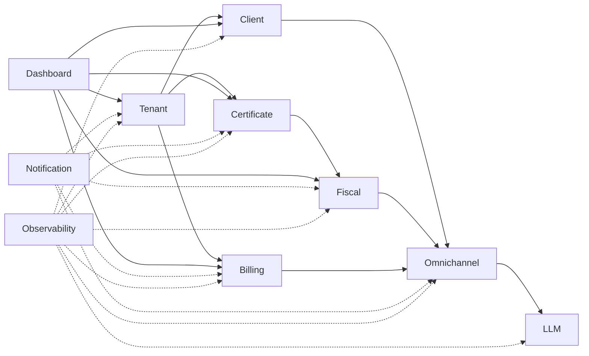
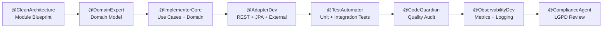
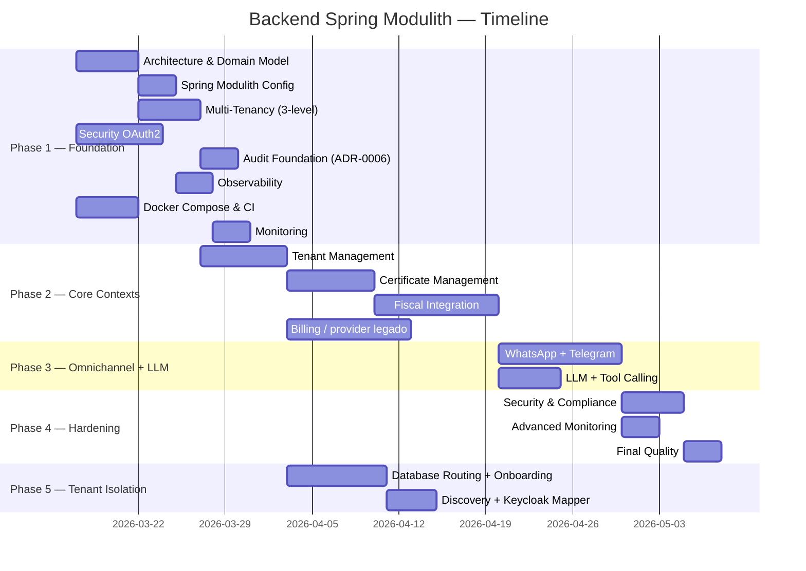

# TP-00001 — Backend Spring Modulith

**Document ID:** `TP-00001`  

**Project:** Contador Fiscal Inteligente
**Created:** 2026-03-12
**Last reconciled:** 2026-09-13 (v4.27)
**Status:** 🔄 In Progress
**Author:** @AgentOrchestrator

> **Reconciliation source:** 360° audit of `/backend`, cross-layer frontend contracts, implementation plans, Task Plans 006/007, security RPT-0004 and later authorized slices. The 2026-09-06 Dashboard tenant amendment is governed separately by REQ-00057/TP-00040 and therefore does not rewrite the historical Phase 3 denominator below. Its evidence is reconciled in that plan. Evidence distinguishes green non-container regressions from Testcontainers blocked before execution and from concurrent changes outside each slice.

**References:**
[ADR-0001](../../backend/docs/adrs/ADR-0001-technology-stack-and-architecture.md) ·
[ADR-0002](../../backend/docs/adrs/ADR-0002-separacao-banco-por-contexto-multitenancy.md) ·
[ADR-0003](../../backend/docs/adrs/ADR-0003-multitenancy-schema-vs-tenant-id.md) ·
[ADR-0004](../../backend/docs/adrs/ADR-0004-whatsapp-integration-architecture.md) ·
[ADR-0005](../../backend/docs/adrs/ADR-0005-multi-tenancy-architecture.md) ·
[ADR-0006](../../backend/docs/adrs/ADR-0006-audit-compliance.md) ·
[ADR-0007](../../backend/docs/adrs/ADR-0007-multi-provider-llm-integration.md) ·
[ADR-0023 — pagamento agnóstico, vigente](../../backend/docs/adrs/ADR-0023-agnostic-payment-provider-integration.md) ·
[ADR-0008 — baseline histórico](../../backend/docs/adrs/ADR-0008-stripe-billing-subscription.md) ·
[ADR-0009](../../backend/docs/adrs/ADR-0009-dynamic-rbac-evolution.md) ·
[ADR-0015](../../backend/docs/adrs/ADR-0015-telegram-integration.md) ·
[ADR-0018](../../backend/docs/adrs/ADR-0018-keycloak-realm-provisioning-automation.md) ·
[ADR-0019](../../backend/docs/adrs/ADR-0019-database-per-tenant.md) ·
[ADR-0020](../../backend/docs/adrs/ADR-0020-centralized-tenant-discovery.md) ·
[ADR-0021](../../backend/docs/adrs/ADR-0021-llm-resilience-fallback-strategy.md) ·
[REQ-00001](../../product/requirements/REQ-00001-whatsapp-business-integration.md) ·
[REQ-00002](../../product/requirements/REQ-00002-function-registry-dynamic-menu.md) ·
[REQ-00003](../../product/requirements/REQ-00003-rbac-profile-responsibility-matrix.md) ·
[REQ-00004](../../product/requirements/REQ-00004-rbac-security-mapping.md) ·
[REQ-00005](../../product/requirements/REQ-00005-plan-feature-matrix.md) ·
[REQ-00011](../../product/requirements/REQ-00011-chatbot-usage-limits-and-billing.md) ·
[REQ-00029 — Architecture enforcement](../../product/requirements/REQ-00029-backend-architecture-enforcement-gates.md) ·
[REQ-00030 — Multitenancy isolation](../../product/requirements/REQ-00030-multitenancy-isolation-verification.md) ·
[REQ-00031 — Phase 2 Tenant AS-IS](../../product/requirements/REQ-00031-phase2-tenant-lifecycle-and-access.md) ·
[REQ-00032 — Phase 2 Certificate AS-IS](../../product/requirements/REQ-00032-phase2-certificate-lifecycle-security.md) ·
[REQ-00033 — Phase 2 Fiscal AS-IS](../../product/requirements/REQ-00033-phase2-fiscal-serpro-operations.md) ·
[REQ-00034 — Phase 2 Billing AS-IS](../../product/requirements/REQ-00034-phase2-billing-subscription-usage.md) ·
[REQ-00035 — Phase 3 WhatsApp/Omnichannel AS-IS](../../product/requirements/REQ-00035-phase3-whatsapp-omnichannel-foundation.md) ·
[REQ-00036 — Phase 3 Omnichannel Administration AS-IS](../../product/requirements/REQ-00036-phase3-omnichannel-administration-and-channels.md) ·
[REQ-00037 — Phase 3 LLM/Observability AS-IS](../../product/requirements/REQ-00037-phase3-llm-and-administration-observability.md) ·
[REQ-00041 — Conversation Audit target](../../product/requirements/REQ-00041-chatbot-conversation-audit.md) ·
[REQ-00057 — Dashboard fiscal tenant](../../product/requirements/REQ-00057-tenant-dashboard-fiscal-overview.md) ·
[REQ-00062 — Omnichannel audit action taxonomy](../../product/requirements/REQ-00062-omnichannel-event-audit-action-taxonomy.md) ·
[UC-00026 — Architecture compliance gate](../../product/use-cases/UC-00026-backend-architecture-compliance-gate.md) ·
[UC-00027 — Multitenancy isolation gate](../../product/use-cases/UC-00027-multitenancy-isolation-gate.md) ·
[UC-00028 — Phase 2 Tenant](../../product/use-cases/UC-00028-phase2-tenant-lifecycle-and-user-management.md) ·
[UC-00029 — Phase 2 Certificate](../../product/use-cases/UC-00029-phase2-certificate-lifecycle-management.md) ·
[UC-00030 — Phase 2 Fiscal](../../product/use-cases/UC-00030-phase2-fiscal-operations.md) ·
[UC-00031 — Phase 2 Billing](../../product/use-cases/UC-00031-phase2-billing-subscription-and-usage.md) ·
[UC-00032 — Phase 3 WhatsApp/Omnichannel](../../product/use-cases/UC-00032-phase3-whatsapp-omnichannel-foundation.md) ·
[UC-00033 — Phase 3 Omnichannel Administration](../../product/use-cases/UC-00033-phase3-omnichannel-administration-and-channels.md) ·
[UC-00034 — Phase 3 LLM/Observability](../../product/use-cases/UC-00034-phase3-llm-and-administration-observability.md) ·
[UC-00035 — Conversation Audit](../../product/use-cases/UC-00035-chatbot-conversation-audit.md) ·
[UC-00001 — Dashboard](../../product/use-cases/UC-00001-dashboard-view.md) ·
[Business Context](../../product/business/product-vision.md) ·
[Agent Catalog](../../agents/README.md)

**Cross-Layer Orchestration:**
[Phase 3 specification index](phase-3-backend-specification-index.md) — 29 canonical activities + 9 supporting evidence documents ·
[TP-00003-omnichannel-integration-task-plan.md](TP-00003-omnichannel-integration-task-plan.md) — Telegram + Omnichannel ·
[TP-00006-frontend-backend-cibersecurity-implementation-plan.md](TP-00006-frontend-backend-cibersecurity-implementation-plan.md) — security hardening ·
[TP-00007-arch-memory-llm-tool-calling-omnichannel.md](TP-00007-arch-memory-llm-tool-calling-omnichannel.md) — tool calling/conversational lifecycle ·
[TP-00008-chatbot-conversation-audit-implementation-plan.md](TP-00008-chatbot-conversation-audit-implementation-plan.md) — evolução aditiva cross-stack da auditoria de conversas; plano integrador fora do denominador ·
[TP-00040-tenant-dashboard-fiscal-overview.md](TP-00040-tenant-dashboard-fiscal-overview.md) — projeção fiscal tenant de sete dias; plano integrador autorizado fora do denominador histórico ·
[IP-BE-3.2.17-fiscal-report-terminal-publication-serialization](../../backend/docs/specs/IP-BE-3.2.17-fiscal-report-terminal-publication-serialization.md) — folha fiscal corretiva `BE-FIS-TERMINAL-ONCE-001`, Done repository-local/DEV e fora do denominador histórico ·
[RPT-0004](../reports/RPT-0004-frontend-backend-cibersecurity.md) — repository controls and external gates

---

# 1. Overview

This plan defines the coordinated activities for building the backend Spring Modulith system. Each task is mapped to a responsible agent with explicit dependencies and acceptance criteria. Execution now spans 5 phases and incorporates the later Omnichannel, security, database-per-tenant, tenant-discovery and conversational-orchestration decisions.

---

# 2. Execution Tracking Matrix

> **Status rule:** ✅ implementation **and** task-specific acceptance evidence complete · 🔄 code/validation partially complete or a required gate is missing · ⬜ not implemented · ⏸ `BLOCK` means deferred by an explicit product decision, has no executable scope and is excluded from the denominator · ❌ cancelled/superseded is also excluded. Progress is `Done / (Catalogued - BLOCK - Cancelled)`, rounded to the nearest integer.

### Phase 1 — Foundation (Sprint 1-2)

| # | Activity | Agent | Status | Notes |
|---|---|---|:---:|---|
| 1.1.1 | Clean Architecture package layout | @CleanArchitecture | ✅ | |
| 1.1.2 | Bounded contexts and ports | @CleanArchitecture | ✅ | |
| 1.1.3 | Aggregates, entities, VOs per context | @DomainExpert | ✅ | Depends on 1.1.2 |
| 1.1.4 | Cross-validate domain model vs. arch | @CleanArchitecture + @DomainExpert | ✅ | Depends on 1.1.3 |
| 1.2.1 | `@Modulith` and `module-info` config | @ModulithConfig | ✅ | Depends on 1.1.1 |
| 1.2.2 | Coupling verification test | @ModulithConfig | ✅ | [IP-BE-1.2.2-coupling-verification-test — Plano detalhado](../../backend/docs/specs/IP-BE-1.2.2-coupling-verification-test.md) — gate ativo; 13 módulos irmãos, namespace `contexts`, zero ciclos/violações, 6/6 testes e zero skips. |
| 1.2.3 | Event publication (Spring Modulith Events) | @ModulithConfig | ✅ | Depends on 1.2.1 |
| 1.2.4 | ArchUnit rules for Clean Architecture | @ModulithConfig + @CleanArchitecture | ✅ | [IP-BE-1.2.4-archunit-clean-architecture-rules — Plano detalhado](../../backend/docs/specs/IP-BE-1.2.4-archunit-clean-architecture-rules.md) — 16 regras ativas + 7 testes-sentinela; 23/23 testes e zero skips. |
| 1.3.1 | `TenantContext` and `TenantContextFilter` | @MultiTenantEng | ✅ | Depends on 1.1.2 |
| 1.3.2 | `TenantAwareEntity` and Hibernate `@Filter` | @MultiTenantEng | ✅ | Depends on 1.3.1 |
| 1.3.3 | Flyway multi-database config | @MultiTenantEng | ✅ | Historical shared-database milestone; topology evolved through ADR-0019/Phase 5. |
| 1.3.4 | Multi-tenancy isolation tests | @TestAutomator | ✅ | [IP-BE-1.3.4-multi-tenancy-isolation-tests — Plano detalhado](../../backend/docs/specs/IP-BE-1.3.4-multi-tenancy-isolation-tests.md) — gate canônico `-Ptenant-isolation-gate verify` em BUILD SUCCESS: Keycloak L1 7/7, HTTP/TenantContext L2 8/8, Hibernate/PostgreSQL L3 7/7 e routing ADR-0019 7/7; total 29/29, zero failures/errors/skips. |
| 1.4.1 | Keycloak Docker Compose config | @SecurityOAuth | ✅ | Docker verification completed |
| 1.4.2 | Spring Security OAuth2 Resource Server | @SecurityOAuth | ✅ | JWT validation + Role conversion implemented |
| 1.4.3 | RBAC roles + scopes | @SecurityOAuth | ✅ | URL/method RBAC and 401/403 handlers tested; current realms also contain fiscal/tenant roles beyond the original 2-role baseline. |
| 1.4.4 | `AuthenticatedUser` context | @SecurityOAuth | ✅ | Record + Holder interface (shared) + Spring Security impl. 11 tests passing. |
| 1.5.1 | `audit_log` table (Flyway) | @ComplianceAgent + @AdapterDev | ✅ | Flyway V2 script created in saas_tenant. |
| 1.5.2 | `AuditPort` (outbound port) | @ImplementerCore | ✅ | AuditPort + AuditEntry + AuditResult in shared kernel. 8 tests. |
| 1.5.3 | `AuditService` adapter | @AdapterDev | ✅ | JPA entity + repository + adapter in tenant module. 6 tests. |
| 1.5.4 | `@Audited` AOP annotation | @AdapterDev | ✅ | @Audited annotation + AuditAspect (infrastructure). 6 tests. |
| 1.6.1 | Spring Boot Actuator endpoints | @ObservabilityDev | ✅ | Health, Info, Prometheus endpoints exposed and secured |
| 1.6.2 | Structured logging (JSON + MDC) | @ObservabilityDev | ✅ | Depends on 1.3.1 |
| 1.6.3 | Micrometer + Prometheus | @ObservabilityDev | ✅ | Depends on 1.6.1 |
| 1.7.1 | Docker Compose database baseline | @DevOps-Agent | ✅ | Historical shared-database milestone; superseded/evolved by ADR-0019. |
| 1.7.2 | Multi-stage Dockerfile | @DevOps-Agent | ✅ | Parallel |
| 1.7.3 | CI (GitHub Actions) | @DevOps-Agent | ✅ | Depends on 1.7.2 |
| 1.7.4 | `application.yml` per profile (dev/hml/prd) | @DevOps-Agent | ✅ | Depends on 1.7.1 |
| 1.8.1 | Prometheus scraping config | @Monitoring-Agent | ✅ | Depends on 1.6.3, 1.7.1 |
| 1.8.2 | Grafana dashboards (base) | @Monitoring-Agent | ✅ | Depends on 1.8.1 |
| 1.8.3 | Alerting (Slack/Discord webhook) | @Monitoring-Agent | ✅ | Depends on 1.8.2 |

### Phase 2 — Core Bounded Contexts (Sprint 3-5)

> **Regra de evolução da Fase 2:** o baseline funcional existente continua protegido. A solicitação explícita de 2026-08-21 autoriza, depois da atualização documental, a implementação compatível das atividades 2.1.5, 2.1.6, 2.2.5–2.2.7, 2.3.6–2.3.8 e 2.3.10–2.3.12. O loop de conformidade de 2026-09-12 decompõe `TENANT-STANDALONE-GATE-001` na folha 2.1.5.1 e `TENANT-ONBOARDING-GRANT-COMP-001` na folha 2.1.3.1. Esta última autoriza somente a compensação síncrona de database após CREATE confirmado/GRANT falho nos dois paths congelados; saga durável, API, migration e externalidade ficam proibidas. A mesma decisão autoriza separadamente as folhas mínimas 2.2.9, 2.3.14, 2.3.15, 2.3.16 e 2.3.17 exatamente nos paths de seus IPs; 2.3.16 e 2.3.17 são test-only e perdem validade se o adapter produtivo precisar ser alterado. Essas autorizações não alcançam as demais folhas da Fase 2. A atividade 2.3.12 conserva sua restrição específica: somente novos testes de caracterização, sem alteração de produção, testes existentes, build, workflow ou migrations.

> **Lote aditivo de 2026-08-22:** a execução foi deliberadamente limitada a novos testes e atualização de evidência. Nenhum fonte de produção dos contextos Tenant, Certificate ou Fiscal, teste preexistente, migration, contrato, POM ou workflow foi alterado por este lote. As pastas produtivas dos três contextos permaneceram idênticas ao snapshot isolado usado na validação. O 2.3.12 não recebeu arquivo novo nem edição.

> **Semântica de bloqueio:** somente 2.3.3 está em `⏸ BLOCK` na matriz e fora do denominador por decisão explícita. Quando os planos [IP-BE-2.3.8-fiscal-lgpd-review](../../backend/docs/specs/IP-BE-2.3.8-fiscal-lgpd-review.md) e [IP-BE-2.3.11-gerar-das-12-traffic-inspector](../../backend/docs/specs/IP-BE-2.3.11-gerar-das-12-traffic-inspector.md) registram aceite `BLOCKED` por DPO/jurídico ou produto/provedor, a atividade permanece `🔄` e elegível nesta matriz: o termo identifica critérios externos ainda não resolvidos, não uma nova exclusão do cálculo.

| # | Activity | Agent | Status | Notes |
|---|---|---|:---:|---|
| 2.1.1 | Tenant module blueprint | @CleanArchitecture | ✅ | [IP-BE-2.1.1-tenant-module-blueprint — Detailed plan](../../backend/docs/specs/IP-BE-2.1.1-tenant-module-blueprint.md) — blueprint, API/eventos e fronteiras globais existentes formam o baseline AS-IS; gate nominal delegado à folha 2.1.5.1. |
| 2.1.2 | Tenant domain modeling | @DomainExpert | ✅ | [IP-BE-2.1.2-tenant-domain-modeling — Detailed plan](../../backend/docs/specs/IP-BE-2.1.2-tenant-domain-modeling.md) — modelo atual de Tenant, TenantUser, settings e plano documentado como baseline; modelos adicionais não integram o escopo autorizado. |
| 2.1.3 | Tenant use cases | @ImplementerCore | ✅ | [IP-BE-2.1.3-tenant-use-cases — Detailed plan](../../backend/docs/specs/IP-BE-2.1.3-tenant-use-cases.md) — fluxos Tenant existentes foram catalogados e preservados; extensões de idempotência/reconciliação são somente gaps. |
| 2.1.3.1 | Compensate CREATE when GRANT fails | @ImplementerCore + @TestAutomator | ✅ | [IP-BE-2.1.3.1-tenant-onboarding-grant-compensation — folha atômica](../../backend/docs/specs/IP-BE-2.1.3.1-tenant-onboarding-grant-compensation.md) v1.1 — focal 6/6, impactada 14/14, arquitetura 33/33 e QG 47/47 zero-skip; saga durável permanece fora. Esta decomposição não altera o denominador histórico. |
| 2.1.4 | Tenant adapters | @AdapterDev | ✅ | [IP-BE-2.1.4-tenant-adapters — Detailed plan](../../backend/docs/specs/IP-BE-2.1.4-tenant-adapters.md) — adapters REST, JPA, Flyway, IAM, eventos e crypto atuais documentados sem autorizar alteração. |
| 2.1.5 | Tenant tests | @TestAutomator | 🔄 | [IP-BE-2.1.5-tenant-tests — Detailed plan](../../backend/docs/specs/IP-BE-2.1.5-tenant-tests.md) — regressão histórica 232/232 preservada; ativação nominal foi decomposta na folha 2.1.5.1, enquanto PostgreSQL/cobertura integral seguem independentes. |
| 2.1.5.1 | Tenant standalone module gate | @TestAutomator + @ModulithConfig | ✅ | [IP-BE-2.1.5.1-tenant-standalone-module-gate — folha atômica](../../backend/docs/specs/IP-BE-2.1.5.1-tenant-standalone-module-gate.md) v1.4 — focal `1/1`, matriz impactada `33/33` e Quality Gate focused `PASS`, todos zero-skip, com 14 doubles no mesmo path test-only e sem externalidade. Esta decomposição não altera o denominador histórico. |
| 2.1.6 | Tenant quality audit | @CodeGuardian | 🔄 | [IP-BE-2.1.6-tenant-quality-audit — Detailed plan](../../backend/docs/specs/IP-BE-2.1.6-tenant-quality-audit.md) — TEN-QA-002 delegado à folha 2.1.5.1; cobertura, relatório final e reexecução PostgreSQL seguem pendentes. |
| 2.1.7 | Tenant LGPD review | @ComplianceAgent | ✅ | [IP-BE-2.1.7-tenant-lgpd-review — Detailed plan](../../backend/docs/specs/IP-BE-2.1.7-tenant-lgpd-review.md) — revisão e inventário do tratamento atual entregues; workflows adicionais permanecem gaps futuros não autorizados. |
| 2.2.1 | Certificate module blueprint | @CleanArchitecture | ✅ | [IP-BE-2.2.1-certificate-blueprint — Detailed plan](../../backend/docs/specs/IP-BE-2.2.1-certificate-blueprint.md) — public boundary, ports and blueprint baseline are delivered. |
| 2.2.2 | Certificate domain modeling | @DomainExpert | ✅ | [IP-BE-2.2.2-certificate-domain-modeling — Detailed plan](../../backend/docs/specs/IP-BE-2.2.2-certificate-domain-modeling.md) — aggregate, VOs e invariantes-base existentes são o baseline AS-IS; metadata/status/Clock adicionais são gaps não autorizados. |
| 2.2.3 | Certificate use cases | @ImplementerCore | ✅ | [IP-BE-2.2.3-certificate-use-cases — Detailed plan](../../backend/docs/specs/IP-BE-2.2.3-certificate-use-cases.md) — upload, validação e revogação-base existentes foram catalogados; isolamento/audit/concurrency/expiry adicionais são observações sem autorização. |
| 2.2.4 | Certificate adapters | @AdapterDev | ✅ | [IP-BE-2.2.4-certificate-adapters — Detailed plan](../../backend/docs/specs/IP-BE-2.2.4-certificate-adapters.md) — adapters REST, crypto, JPA e migrations-base existentes formam o baseline imutável. |
| 2.2.5 | Certificate security review | @SecurityOAuth | 🔄 | [IP-BE-2.2.5-certificate-security-review — Detailed plan](../../backend/docs/specs/IP-BE-2.2.5-certificate-security-review.md) — novos testes cobrem limites HTTP, RBAC/tenant, auditoria AOP, PFX real, AES-GCM e migração legada; a regressão não-container fechou 71/71. JWT/JWKS real, política X.509, unicidade por tenant, PostgreSQL atual e sign-off externo continuam abertos. |
| 2.2.6 | Certificate tests | @TestAutomator | 🔄 | [IP-BE-2.2.6-certificate-tests — Detailed plan](../../backend/docs/specs/IP-BE-2.2.6-certificate-tests.md) — 28 cenários aditivos não-container ficaram verdes dentro de 71/71; claim tenant ausente falha com 401 e malformado com 403, ambos antes do port. A migration V7→V8 compilou, mas o gate PostgreSQL foi bloqueado antes do corpo do teste; o bootstrap standalone agora está ativo e verde na folha 2.2.9, enquanto `jwt()` ainda não prova JWKS. |
| 2.2.7 | Certificate quality audit | @CodeGuardian | 🔄 | [IP-BE-2.2.7-certificate-quality-audit — Detailed plan](../../backend/docs/specs/IP-BE-2.2.7-certificate-quality-audit.md) — regressão Certificate 71/71 e arquitetura 25/25 verdes, sem mudança produtiva. Paginação com filtro pós-página, metadata hardcoded, cobertura quantitativa, relatório final e gates externos permanecem abertos. |
| 2.2.8 | Certificate list/detail queries | @ImplementerCore + @AdapterDev | ✅ | [IP-BE-2.2.8-certificate-queries — Detailed plan](../../backend/docs/specs/IP-BE-2.2.8-certificate-queries.md) — endpoints, queries, use cases, persistência e testes focados existentes foram aceitos AS-IS; limitações de paginação/metadata/camadas permanecem apenas documentadas. |
| 2.2.9 | Certificate standalone bootstrap evidence | @TestAutomator + @ModulithConfig | ✅ | [IP-BE-2.2.9-certificate-module-bootstrap — folha test-only](../../backend/docs/specs/IP-BE-2.2.9-certificate-module-bootstrap.md) — `CERT-MODULE-BOOTSTRAP-001` concluída repository-local: focal 1/1, suíte Certificate 72/72, arquitetura 29/29 e Quality Gate focal `PASS`, com dois mocks, duas exclusões globais, um switch local e zero produção/externalidade. |
| 2.3.1 | Fiscal module blueprint | @CleanArchitecture | ✅ | [IP-BE-2.3.1-fiscal-blueprint — Detailed plan](../../backend/docs/specs/IP-BE-2.3.1-fiscal-blueprint.md) — blueprint baseline delivered; global Modulith/ArchUnit gates are satisfied by 1.2.2/1.2.4. |
| 2.3.2 | Fiscal domain modeling | @DomainExpert | ✅ | [IP-BE-2.3.2-fiscal-domain-modeling — Detailed plan](../../backend/docs/specs/IP-BE-2.3.2-fiscal-domain-modeling.md) — base domain delivered; DAS consolidation is tracked in 2.3.12. |
| 2.3.3 | Fiscal use cases | @ImplementerCore + @ProductOwner | ⏸ BLOCK | [IP-BE-2.3.3-fiscal-use-cases — Decision record](../../backend/docs/specs/IP-BE-2.3.3-fiscal-use-cases.md) — product has not decided whether this capability belongs in the chatbot; excluded from progress. |
| 2.3.4 | Fiscal adapters | @AdapterDev | ✅ | [IP-BE-2.3.4-fiscal-adapters — Detailed plan](../../backend/docs/specs/IP-BE-2.3.4-fiscal-adapters.md) v5.3 — baseline REST/JPA/SERPRO entregue; onze ACs permanecem provados e AC-006 foi decomposto na folha 2.3.17 sem crédito antecipado. |
| 2.3.5 | Fiscal caching | @Cache-Agent | ✅ | [IP-BE-2.3.5-fiscal-caching — Detailed plan](../../backend/docs/specs/IP-BE-2.3.5-fiscal-caching.md) — cache/TTLs/tenant-aware keys existentes formam o baseline AS-IS; history producer inativo e prova Redis são gaps não autorizados. |
| 2.3.6 | Fiscal tests | @TestAutomator | 🔄 | [IP-BE-2.3.6-fiscal-tests — Detailed plan](../../backend/docs/specs/IP-BE-2.3.6-fiscal-tests.md) — quatro classes aditivas acrescentam 11 cenários; os 7 não-container e a regressão de 48 classes/273 testes estão verdes. Os 4 cenários PostgreSQL/Redis compilaram, mas não executaram por indisponibilidade do Docker; standalone Modulith continua pendente. |
| 2.3.7 | Fiscal quality audit | @CodeGuardian | 🔄 | [IP-BE-2.3.7-fiscal-quality-audit — Detailed plan](../../backend/docs/specs/IP-BE-2.3.7-fiscal-quality-audit.md) — regressão Fiscal 273/273 e arquitetura 25/25 verdes, incluindo políticas effectful e fluxo DAS existente. JaCoCo/limite quantitativo, scanners, relatório final e containers atuais permanecem ausentes. |
| 2.3.8 | Fiscal LGPD review | @ComplianceAgent | 🔄 | [IP-BE-2.3.8-fiscal-lgpd-review — Detailed plan](../../backend/docs/specs/IP-BE-2.3.8-fiscal-lgpd-review.md) — canaries de telemetria/headers/payload e perda observável ficaram 2/2 verdes; prova de criptografia/isolamento PostgreSQL está implementada e compilada, porém não reexecutada. Retenção, legal hold e DSAR dependem de DPO/jurídico. |
| 2.3.9 | SERPRO authentication + HTTP integration | @AdapterDev | ✅ | [IP-BE-2.3.9-fiscal-serpro-auth-integration — Detailed plan](../../backend/docs/specs/IP-BE-2.3.9-fiscal-serpro-auth-integration.md) — tenant mTLS/token baseline delivered; operational hardening is documented. |
| 2.3.10 | SERPRO Traffic Inspector — redacted metadata | @ImplementerCore + @AdapterDev | 🔄 | [IP-BE-2.3.10-serpro-traffic-inspector — Detailed plan](../../backend/docs/specs/IP-BE-2.3.10-serpro-traffic-inspector.md) v8.0 — REQ-00038 AC-004/005/008/010 possuem evidência DEV de replay `5/5`, HTTP `5/5`, PostgreSQL `3/3`, scheduler `1/1`, projeção comercial `7/7`, migration `2/2` e UI preservada zero-skip; retenção e critérios restantes mantêm a atividade em progresso. |
| 2.3.11 | DAS 12 Traffic Inspector endpoint | @ImplementerCore + @AdapterDev | 🔄 | [IP-BE-2.3.11-gerar-das-12-traffic-inspector — Detailed plan](../../backend/docs/specs/IP-BE-2.3.11-gerar-das-12-traffic-inspector.md) — a regressão Fiscal 273/273 revalidou a política já implementada de não repetir GERARDAS12 após resultado ambíguo, sem editar produção. Idempotência externa, feature flag e contrato final continuam dependentes de produto/provedor. |
| 2.3.12 | DAS business flow | @ImplementerCore + @AdapterDev | ✅ | [IP-BE-2.3.12-emissao-das-business-flow — Detailed plan](../../backend/docs/specs/IP-BE-2.3.12-emissao-das-business-flow.md) — concluída estritamente test-only: cinco novos arquivos caracterizam domínio, evento e idempotência sem alterar produção, testes preexistentes, build, workflow ou migration; 32/32 verdes, incluindo PostgreSQL. |
| 2.3.14 | Fiscal business-zone default | @ImplementerCore + @TestAutomator | ✅ | [IP-BE-2.3.14-fiscal-business-zone-default — Detailed plan](../../backend/docs/specs/IP-BE-2.3.14-fiscal-business-zone-default.md) — `Done` repository-local: três consumidores diretos e o mock usam default `America/Recife`, o override foi preservado e default/fronteira passaram sem tocar quarentenas. |
| 2.3.15 | DAS Regular future-date guard | @ImplementerCore + @TestAutomator | ✅ | [IP-BE-2.3.15-das-regular-future-date-guard — folha atômica](../../backend/docs/specs/IP-BE-2.3.15-das-regular-future-date-guard.md) — `Done` repository-local/DEV: focal `4/4`, impactada `30/30`, regressão adicional `41/41`, arquitetura `29/29` e QG focused `59/59`, zero-skip, em dois paths e sem provider. |
| 2.3.16 | DAS Regular request-tag contract | @Integration + @TestAutomator | ✅ | [IP-BE-2.3.16-das-regular-request-tag-contract — folha atômica](../../backend/docs/specs/IP-BE-2.3.16-das-regular-request-tag-contract.md) v1.1 — `Done` repository-local/DEV após `15/15`, `18/18`, `29/29` e QG focused `47/47`, zero-skip, sem produção ou provider. Folha corretiva fora do denominador histórico. |
| 2.3.17 | DAS Regular HTTP 200 business outcome | @Integration + @TestAutomator | ✅ | [IP-BE-2.3.17-das-regular-http200-business-outcome-contract — folha atômica](../../backend/docs/specs/IP-BE-2.3.17-das-regular-http200-business-outcome-contract.md) v1.1 — `Done` repository-local/DEV após `16/16`, `19/19`, `29/29` e QG focused `48/48`, zero-skip, sem produção ou provider. Folha corretiva fora do denominador histórico. |
| 2.3.18 | DAS Regular response alias | @Integration + @TestAutomator | ✅ | [IP-BE-2.3.18-das-regular-response-alias-contract — folha atômica](../../backend/docs/specs/IP-BE-2.3.18-das-regular-response-alias-contract.md) v1.0 — `Done` repository-local/DEV após focal `17/17`, zero-skip, sem produção ou provider. Folha corretiva fora do denominador histórico. |
| 2.4.1 | Billing module blueprint | @CleanArchitecture | ✅ | [IP-BE-2.4.1-billing-module-blueprint — Detailed plan](../../backend/docs/specs/IP-BE-2.4.1-billing-module-blueprint.md) — fronteira, APIs, eventos e dependências atuais documentados como capacidade-base AS-IS. |
| 2.4.2 | Billing domain modeling | @DomainExpert | ✅ | [IP-BE-2.4.2-billing-domain-modeling — Detailed plan](../../backend/docs/specs/IP-BE-2.4.2-billing-domain-modeling.md) — state machine, invoice and usage invariants have focused unit evidence. |
| 2.4.3 | Billing use cases | @ImplementerCore | ✅ | [IP-BE-2.4.3-billing-use-cases — Detailed plan](../../backend/docs/specs/IP-BE-2.4.3-billing-use-cases.md) — casos de uso presentes catalogados como baseline; webhook sem efeitos e stubs de query/crédito permanecem explícitos e não autorizados. |
| 2.4.4 | Adapter Stripe legado | @AdapterDev | ✅ | [IP-BE-2.4.4-billing-stripe-adapter — Detailed plan](../../backend/docs/specs/IP-BE-2.4.4-billing-stripe-adapter.md) — evidência AS-IS anterior ao ADR-0023; operações dummy/no-op estão registradas como não implementadas e não definem a arquitetura futura. |
| 2.4.5 | Usage reporter | @ImplementerCore | ✅ | [IP-BE-2.4.5-billing-usage-reporter — Detailed plan](../../backend/docs/specs/IP-BE-2.4.5-billing-usage-reporter.md) — fluxo existente foi inventariado; o risco de falso sucesso permanece documentado e não autoriza remediação. |
| 2.4.6 | Billing tests | @TestAutomator | 🔄 | [IP-BE-2.4.6-billing-tests — Detailed plan](../../backend/docs/specs/IP-BE-2.4.6-billing-tests.md) — 55 tests declared; integration, module, concurrency and coverage gates remain. |
| 2.4.7 | Billing quality audit | @CodeGuardian | 🔄 | [IP-BE-2.4.7-billing-quality-audit — Detailed plan](../../backend/docs/specs/IP-BE-2.4.7-billing-quality-audit.md) — initial eight findings recorded; final evidence/sign-off remains. |

### Phase 3 — WhatsApp + LLM + Omnichannel (Sprint 6-8)

> **Baseline AS-IS imutável:** esta fase documenta os módulos `contexts.omnichannel`, `contexts.llm`, `contexts.dashboard` e `contexts.observability` exatamente como existem. Nenhum plano 3.1, 3.2 ou 3.7 autoriza modificar código, testes, migrations, configuração, workflow ou contrato atual. `✅ Done AS-IS` representa capacidade-base existente e evidenciada; `🔄` registra implementação ou evidência parcial. Todo gap exige autorização futura separada e compatível com o baseline.

> **Autorização aditiva de 2026-09-06:** REQ-00057 e TP-00040 autorizam
> especificamente o endpoint tenant-scoped `GET /api/v1/dashboard/fiscal-overview`,
> a projeção pública Fiscal, queries bounded, índice DAS e testes correspondentes.
> Esse slice não altera os endpoints administrativos 3.7.1, não amplia papéis e é
> rastreado fora do denominador histórico desta matriz.

> **Autorização corretiva de 2026-09-12:** REQ-00062 e a folha atômica 3.1.20
> autorizam exclusivamente a taxonomia neutra das actions gravadas por dois
> listeners cross-channel, nos quatro paths executáveis do IP. A folha é
> rastreada fora do denominador histórico e não reescreve o baseline 3.1.6.

> **Fechamento fiscal corretivo de 2026-09-12:** o IRG foi autorizado pelo
> snapshot PRD-00002 v1.33, PRD-00004 v1.8, REQ-00009 v1.6, REQ-00010 v1.3,
> REQ-00028 v1.15 e UC-00007 v1.5. A reconciliação pós-evidência publica
> PRD-00002 v1.34, PRD-00004 v1.9, REQ-00009 v1.7, REQ-00010 v1.4,
> REQ-00028 v1.16 e UC-00007 v1.6. `BE-FIS-TERMINAL-ONCE-001` ficou restrita
> aos sete paths exatos do
> IP-BE-3.2.17-fiscal-report-terminal-publication-serialization, fora do denominador histórico; não altera
> provider, DAS/GERARDAS12 nem delivery de eventos.

| # | Activity | Agent | Status | Notes |
|---|---|---|:---:|---|
| 3.1.1 | WhatsApp/Omnichannel module blueprint | @CleanArchitecture | ✅ | [IP-BE-3.1.1-whatsapp-module-blueprint — Plano detalhado](../../backend/docs/specs/IP-BE-3.1.1-whatsapp-module-blueprint.md) — `contexts.omnichannel`, API/eventos públicos, ports e fronteiras existem; nomes WhatsApp no display/Javadoc são drift documental do baseline. |
| 3.1.2 | Omnichannel domain modeling | @DomainExpert | ✅ | [IP-BE-3.1.2-whatsapp-domain-modeling — Plano detalhado](../../backend/docs/specs/IP-BE-3.1.2-whatsapp-domain-modeling.md) — `Message`, `Conversation`, `AccessValidation`, sessão, configurações e VOs channel-neutral existentes formam o baseline. |
| 3.1.3 | Chatbot flow use cases | @ImplementerCore | ✅ | [IP-BE-3.1.3-whatsapp-chatbot-use-cases — Plano detalhado](../../backend/docs/specs/IP-BE-3.1.3-whatsapp-chatbot-use-cases.md) — entrada, acesso, state machine, consulta fiscal e retorno existentes estão catalogados; 2.3.3 continua fora deste escopo. |
| 3.1.4 | WhatsApp Multi-WABA adapter | @AdapterDev | 🔄 | [IP-BE-3.1.4-whatsapp-multi-waba-adapter — Plano detalhado](../../backend/docs/specs/IP-BE-3.1.4-whatsapp-multi-waba-adapter.md) — configuração/persistência e documento HTTP existem; texto, template e mensagens interativas ainda retornam IDs simulados. |
| 3.1.5 | WhatsApp webhook controller | @AdapterDev | ✅ | [IP-BE-3.1.5-whatsapp-webhook-controller — Plano detalhado](../../backend/docs/specs/IP-BE-3.1.5-whatsapp-webhook-controller.md) — verificação, HMAC, parser e despacho assíncrono atuais documentados; limitações de telemetria ficam em 3.1.17. |
| 3.1.6 | Omnichannel audit trail | @ComplianceAgent + @AdapterDev | ✅ | [IP-BE-3.1.6-whatsapp-audit-trail — Plano detalhado](../../backend/docs/specs/IP-BE-3.1.6-whatsapp-audit-trail.md) — serviços/listeners de audit e metadados redigidos existentes são o baseline AS-IS. |
| 3.1.7 | WhatsApp/Omnichannel tests | @TestAutomator | 🔄 | [IP-BE-3.1.7-whatsapp-tests — Plano detalhado](../../backend/docs/specs/IP-BE-3.1.7-whatsapp-tests.md) — ampla suíte focada existe; prova Multi-WABA de alta fidelidade e `WhatsAppModuleTest` ativo permanecem ausentes. |
| 3.1.8 | Omnichannel security review | @SecurityOAuth + @SecurityAgent | 🔄 | [IP-BE-3.1.8-whatsapp-security-review — Plano detalhado](../../backend/docs/specs/IP-BE-3.1.8-whatsapp-security-review.md) — controles SEC-003/005/006/009/010/013/014 existem; DAST/pentest autenticado em ambiente continua sem evidência. |
| 3.1.9 | Telegram Integration Core | @AdapterDev | ✅ | [IP-BE-3.1.9-omnichannel-telegram-integration — Plano detalhado](../../backend/docs/specs/IP-BE-3.1.9-omnichannel-telegram-integration.md) — `ChannelType`, router/port genéricos, configuração Telegram e persistência channel-neutral existentes. |
| 3.1.10 | Telegram Inbound Webhook | @AdapterDev | ✅ | [IP-BE-3.1.10-telegram-inbound-webhook — Plano detalhado](../../backend/docs/specs/IP-BE-3.1.10-telegram-inbound-webhook.md) — rota tenant/config, secret obrigatório em header, parser, ACK de callback, async e cleanup atuais documentados. |
| 3.1.11 | Telegram Outbound & Observability | @ObservabilityDev | ✅ | [IP-BE-3.1.11-telegram-outbound-observability — Plano detalhado](../../backend/docs/specs/IP-BE-3.1.11-telegram-outbound-observability.md) — Bot API adapter, resilience, métricas e testes existentes formam o baseline. |
| 3.1.12 | Omnichannel Tests & Validation | @TestAutomator | ✅ | [IP-BE-3.1.12-omnichannel-tests-validation — Plano detalhado](../../backend/docs/specs/IP-BE-3.1.12-omnichannel-tests-validation.md) — testes cross-channel/controller/parser/router existem; bootstrap desabilitado é registrado sem ser tratado como executado. |
| 3.1.13 | Omnichannel Admin & Config API | @ImplementerCore + @AdapterDev | ✅ | [IP-BE-3.1.13-omnichannel-config-management — Plano detalhado](../../backend/docs/specs/IP-BE-3.1.13-omnichannel-config-management.md) — inbox, métricas e APIs de configuração WhatsApp/Telegram atuais foram inventariados. A evolução aditiva de auditoria é rastreada pelo [TP-00008](TP-00008-chatbot-conversation-audit-implementation-plan.md), atualmente RED/default-off, sem alterar o status AS-IS nem o denominador desta folha. |
| 3.1.14 | Omnichannel Access Validation & Billing | @ImplementerCore + @AdapterDev | ✅ | [IP-BE-3.1.14-omnichannel-access-and-billing — Plano detalhado](../../backend/docs/specs/IP-BE-3.1.14-omnichannel-access-and-billing.md) — autorização, proteção contra abuso, quota e contabilização `CHATBOT_MSG` existentes são o baseline. |
| 3.1.15 | Chatbot Function Registry API | @ImplementerCore + @AdapterDev | 🔄 | [IP-BE-3.1.15-chatbot-function-registry-api — Plano detalhado](../../backend/docs/specs/IP-BE-3.1.15-chatbot-function-registry-api.md) — migration/domínio/APIs/cache/write contract existem; delete administrativo, isolamento do toggle e testes tenant permanecem incompletos. |
| 3.1.16 | Dynamic menus and inbound state machine | @ImplementerCore | 🔄 | [IP-BE-3.1.16-chatbot-inbound-state-machine-and-dynamic-menus — Plano detalhado](../../backend/docs/specs/IP-BE-3.1.16-chatbot-inbound-state-machine-and-dynamic-menus.md) — registry participa do menu e tool lifecycle; parte do dispatch continua hardcoded e o outbound WhatsApp permanece parcial. |
| 3.1.17 | Webhook Traffic Inspector — redacted metadata + ephemeral diagnostics | @ImplementerCore + @AdapterDev | 🔄 | [IP-BE-3.1.17-webhook-traffic-inspector — baseline redigido](../../backend/docs/specs/IP-BE-3.1.17-webhook-traffic-inspector.md) e [IP-BE-3.1.17.1-ephemeral-webhook-diagnostics — extensão efêmera](../../backend/docs/specs/IP-BE-3.1.17.1-ephemeral-webhook-diagnostics.md) — somente metadados redigidos são persistidos; sessão bruta é tenant-scoped, limitada, in-memory e expira automaticamente. |
| 3.1.18 | Chatbot Channel Templates API | @ImplementerCore + @AdapterDev | 🔄 | [IP-BE-3.1.18-chatbot-channel-templates-api — Plano detalhado](../../backend/docs/specs/IP-BE-3.1.18-chatbot-channel-templates-api.md) — migration/domínio/CRUD/controller existem; evidência dedicada de entidade/controller continua ausente. |
| 3.1.19 | Chatbot Quota Enforcement | @ImplementerCore | ✅ | [IP-BE-3.1.19-chatbot-quota-enforcement — Plano canônico](../../backend/docs/specs/IP-BE-3.1.19-chatbot-quota-enforcement.md) — availability check, short-circuit, dedução de uso e testes focados existentes; o antigo plano IP-BE-3.1.15-chatbot-quota-enforcement é apenas evidência legada. |
| 3.1.20 | Omnichannel event audit action taxonomy | @ImplementerCore + @TestAutomator + @ComplianceAgent | ✅ | [IP-BE-3.1.20-omnichannel-event-audit-action-taxonomy — folha corretiva](../../backend/docs/specs/IP-BE-3.1.20-omnichannel-event-audit-action-taxonomy.md) — duas actions neutras materializadas; 11/11 focais, 29/29 arquiteturais e Quality Gate focal `PASS`; fora do denominador histórico. |
| 3.2.1 | LLM response port | @CleanArchitecture + @ImplementerCore | ✅ | [IP-BE-3.2.1-llm-multiprovider-integration — Plano detalhado](../../backend/docs/specs/IP-BE-3.2.1-llm-multiprovider-integration.md) — `LlmResponsePort`, resultados/configuração, models e tool-calling provider-agnostic existentes. |
| 3.2.2 | Gemini adapter | @AdapterDev | ✅ | [IP-BE-3.2.2-gemini-adapter — Plano canônico](../../backend/docs/specs/IP-BE-3.2.2-gemini-adapter.md) — o adapter real é `SpringAiLlmAdapter`, compatível com Gemini/OpenAI; não existe classe produtiva `GeminiLlmAdapter`. |
| 3.2.3 | LLM fallback adapter | @AdapterDev | ✅ | [IP-BE-3.2.3-llm-fallback-adapter — Plano canônico](../../backend/docs/specs/IP-BE-3.2.3-llm-fallback-adapter.md) — `FixedTemplateFallbackAdapter` e `LlmProviderChain` atuais documentados AS-IS. |
| 3.2.4 | LLM response service | @ImplementerCore | ✅ | [IP-BE-3.2.4-llm-response-service — Plano detalhado](../../backend/docs/specs/IP-BE-3.2.4-llm-response-service.md) — templates, provider chain, fallback, métricas e uso são orquestrados pelo serviço existente. |
| 3.2.5 | PII masking | @SecurityOAuth | ✅ | [IP-BE-3.2.5-pii-masking — Plano detalhado](../../backend/docs/specs/IP-BE-3.2.5-pii-masking.md) — mascaramento atual de Documento/CPF antes da chamada LLM registrado com seus limites conhecidos. |
| 3.2.6 | Prompt templates seed data | @ImplementerCore | ✅ | [IP-BE-3.2.6-prompt-template-seed-data — Plano detalhado](../../backend/docs/specs/IP-BE-3.2.6-prompt-template-seed-data.md) — migrations de providers, prompts, funções e templates globais existentes inventariadas. |
| 3.2.7 | LLM usage logging | @AdapterDev | ✅ | [IP-BE-3.2.7-llm-usage-logging — Plano detalhado](../../backend/docs/specs/IP-BE-3.2.7-llm-usage-logging.md) — domínio/tabelas/repositórios e persistência de uso atuais são baseline; IDs fallback e custo zero ficam documentados. |
| 3.2.8 | LLM tests | @TestAutomator | ✅ | [IP-BE-3.2.8-llm-tests — Plano detalhado](../../backend/docs/specs/IP-BE-3.2.8-llm-tests.md) — testes de serviço, provider/tool calling, sanitização e adapters existentes catalogados sem alegar execução nova. |
| 3.2.17 | Fiscal report terminal publication serialization | @ImplementerCore + @AdapterDev + @TestAutomator | ✅ | [IP-BE-3.2.17-fiscal-report-terminal-publication-serialization](../../backend/docs/specs/IP-BE-3.2.17-fiscal-report-terminal-publication-serialization.md) — `Done` repository-local/DEV: focal `24/24`, PostgreSQL `2/2` em `16.14`, impactada `41/41`, arquitetura `29/29` e Quality Gate canônico `26/26`, zero-skip; fora do denominador histórico e sem garantia de delivery exactly-once. |
| 3.7.1 | Admin Dashboard API | @ImplementerCore + @AdapterDev | ✅ | [IP-BE-3.7.1-admin-dashboard-api — Plano detalhado](../../backend/docs/specs/IP-BE-3.7.1-admin-dashboard-api.md) — KPIs, top tenants, activity projection, RBAC e testes existentes formam o baseline. |
| 3.7.2 | Admin Loki Log Proxy API | @ImplementerCore + @AdapterDev | 🔄 | [IP-BE-3.7.2-admin-loki-log-proxy-api — Plano detalhado](../../backend/docs/specs/IP-BE-3.7.2-admin-loki-log-proxy-api.md) — port/adapter/controller e política outbound existem; não há testes próprios de adapter/controller. |

**Slice autorizado separado:** [TP-00040](TP-00040-tenant-dashboard-fiscal-overview.md)
coordena a leitura Situação Fiscal/DAS, a janela civil D-6…D, quatro movimentos
mascarados, `no-store` e RBAC Tenant Admin/personificação. Ele não é uma nova
folha da matriz AS-IS e não altera os totais acima.

### Phase 4 — Hardening (Sprint 8)

| # | Activity | Agent | Status | Notes |
|---|---|---|:---:|---|
| 4.1.1 | OWASP Top 10 scan | @SecurityAgent | 🔄 | Repository controls/report exist; authenticated DAST and HML pentest remain external. |
| 4.1.2 | Dependency scan | @SecurityAgent | 🔄 | Dependency Review and Trivy filesystem configured; no Grype/current execution report. |
| 4.1.3 | Container image scan | @SecurityAgent | ⬜ | No `trivy image` or equivalent image-scan evidence. |
| 4.1.4 | Full LGPD audit | @ComplianceAgent | 🔄 | Partial inventories exist; all-context retention/erasure workflow is incomplete. |
| 4.1.5 | Security headers | @AdapterDev | ✅ | CSP, frame, nosniff, referrer and permissions policies implemented and tested. |
| 4.1.6 | Security gate in CI/CD | @DevOps-Agent | 🔄 | Filesystem gate exists; image/Grype gate and execution evidence remain incomplete. |
| 4.2.1 | Grafana dashboards per bounded context | @Monitoring-Agent | ⬜ | Only generic JVM/Spring dashboards found. |
| 4.2.2 | SLOs and alerts | @Monitoring-Agent | 🔄 | Basic backend/error/heap alerts exist; target p99/error/uptime SLOs are incomplete. |
| 4.2.3 | Cache and LLM cost dashboard | @Monitoring-Agent + @Cache-Agent | 🔄 | Business metrics exist; Redis/cost/quota dashboards are absent. |
| 4.3.1 | Global coverage audit | @CodeGuardian + @TestAutomator | ⬜ | No JaCoCo plugin or configured threshold. |
| 4.3.2 | Final Modulith verification | @ModulithConfig | 🔄 | `ApplicationModules.verify()` está ativo e verde na Fase 1; permanece parcial até a evidência final consolidada da Fase 4. |
| 4.3.3 | Performance test | @TestAutomator | ⬜ | No load-test artifact found. |

### Phase 5 — Database-per-Tenant (ADR-0019)

| # | Activity | Agent | Status | Notes |
|---|---|---|:---:|---|
| 5.1.1 | Database-per-Tenant Infrastructure | @MultiTenantEng | 🔄 | Routing/onboarding exist; fallback, migration-location, slug-contract and integration-test gaps remain. |
| 5.2.1 | Public Tenant Discovery endpoint | @ImplementerCore + @AdapterDev | 🔄 | POST endpoint/use case/rate limit exist; validation contract and focused tests remain incomplete. |
| 5.2.3 | Keycloak tenant mapper and realm template | @SecurityOAuth + @MultiTenantEng | ✅ | Mapper/template/compensation scripts, focused tests and recorded local smoke evidence present. |

### Summary

| Phase | Catalogued | Eligible | ⬜ Pending | 🔄 In Progress | ⏸ BLOCK | ✅ Done | Progress |
|---|:---:|:---:|:---:|:---:|:---:|:---:|---|
| **Phase 1 — Foundation** | 30 | 30 | 0 | 0 | 0 | 30 | 100% |
| **Phase 2 — Core Contexts** | 37 | 36 | 0 | 12 | 1 | 24 | 67% |
| **Phase 3 — WhatsApp + LLM + Omnichannel** | 29 | 29 | 0 | 8 | 0 | 21 | 72% |
| **Phase 4 — Observability and Hardening** | 12 | 12 | 4 | 7 | 0 | 1 | 8% |
| **Phase 5 — Database-per-Tenant** | 3 | 3 | 0 | 2 | 0 | 1 | 33% |
| **Total** | **111** | **110** | **4** | **29** | **1** | **77** | **70%** |

> Phase 2 progress is `24 / (37 - 1 BLOCK) = 66.67%`, rounded to **67%**. Global progress is `77 / (111 - 1 BLOCK) = 70%`; activity 2.3.3 is present for traceability but contributes to neither numerator nor denominator.

> Phase 1 progress is `30 / 30 = 100%`. Activity 1.3.4 closed after the task-specific canonical profile executed its four mandatory Testcontainers reports with 29/29 tests and zero failures, errors or skips; the separate Conversation Audit PostgreSQL job remains owned by Plan 008 and is not part of this denominator.

> **Canonicalization decisions:** Function Registry keeps 3.1.15; Dynamic Menus, Webhook Inspector and Channel Templates keep 3.1.16–3.1.18; Quota Enforcement is canonicalized as 3.1.19. Os seis subplanos/reviews `3.1.9.1`, `3.1.10.1`, `3.1.11.1`, `3.1.12.1`, `3.1.15.1` e `3.1.15.2`, o plano legado de quota com ID 3.1.15 e os dois documentos históricos 3.2.2/3.2.3 são evidência, não novas atividades. Os nove planos filhos `8.x` são WPs/evidências do TP-00008 e não nove novas atividades da matriz. Legacy implementation plans that collide with Phase 4 IDs (notifications, office invitation and Super Admin) are delivered cross-layer capabilities but are not double-counted as hardening tasks.

#### Legacy capability inventory — not counted again

| Colliding plan | Code found in 360° audit | Canonical treatment |
|---|---|---|
| [IP-BE-4.1.1-async-notification-system Async Notification System](../../backend/docs/specs/IP-BE-4.1.1-async-notification-system.md) | Notification domain/use cases, SSE service and event listeners exist. | Reserve a future non-hardening Notification ID; do not confuse with 4.1.1 OWASP. |
| [IP-BE-4.1.3-notification-center-management Notification Center Management](../../backend/docs/specs/IP-BE-4.1.3-notification-center-management.md) | Provider/template/log domain, persistence and admin/audit controllers exist. | Map with frontend 3.10.1 after canonical ID assignment; do not confuse with 4.1.3 image scan. |
| [IP-BE-4.2.1-office-user-invitation-flow Office User Invitation](../../backend/docs/specs/IP-BE-4.2.1-office-user-invitation-flow.md) | Invite/list/resend/activation flow and Keycloak integration exist. | Supporting evidence for Tenant 2.1.3–2.1.5; do not confuse with 4.2.1 dashboards. |
| [IP-BE-4.2.3-super-admin-backend Super Admin Backend](../../backend/docs/specs/IP-BE-4.2.3-super-admin-backend.md) | Admin user CRUD/password reset and IAM adapter exist. | Supporting evidence for Tenant 2.1.3–2.1.5 and frontend 4.2.3; do not confuse with 4.2.3 cost dashboard. |

#### Reconciliation evidence — 2026-08-21

| Check | Result | Interpretation |
|---|---|---|
| `cd backend && ./mvnw -B -DskipTests test-compile` | ✅ BUILD SUCCESS | Snapshot isolado compilou 914 fontes de produção e 315 fontes de teste. |
| Regressão focal das 11 atividades | ✅ BUILD SUCCESS | 121 testes Tenant/Certificate/Fiscal, zero failures/errors/skips. A política effectful Fiscal recebeu ainda um lote dedicado de 38/38. |
| Architecture gates | ✅ BUILD SUCCESS | `ModuleStructureVerificationTest`, `CleanArchitectureRulesTest`, contratos-sentinela e `TenantArchitectureTest`: 32/32, zero failures/errors/skips. |
| PostgreSQL task-specific | ✅ BUILD SUCCESS | Quatro classes Testcontainers — slug Tenant, material sensível Certificate, idempotência DAS e migrations Traffic — totalizaram 12/12, zero failures/errors/skips. |
| Tenant isolation profile | ✅ BUILD SUCCESS | `./mvnw -B -Ptenant-isolation-gate verify`: Keycloak 7/7, HTTP/context 8/8, Hibernate/PostgreSQL 7/7 e routing físico 7/7; total 29/29, zero failures/errors/skips. |
| Full Maven suite | ⚠️ BLOCKED outside this scope | 1.489 testes: 2 failures, 8 errors e 9 skips, todos em Conversation Audit/Omnichannel. Quatro erros de contrato decorreram do snapshot somente de `backend` não conter o OpenAPI do monorepo e passaram em rerun no workspace completo (7/7); os seis problemas reais restantes são duas divergências V39 e quatro binds JDBC de `Instant` no backfill, sem relação causal com Tenant/Certificate/Fiscal. |
| Coverage | ⬜ Not configured | `pom.xml` contains no JaCoCo plugin/threshold. |

# 3. Context and Constraints

## RBAC Profiles (REQ-00003, REQ-00004)

| Role | Profile | Web Access |
|---|---|---|
| `ROLE_SUPER_ADMIN` | Global SaaS administrator | ✅ |
| `ROLE_TENANT_ADMIN` | Accounting firm administrator (also operates certificates and fiscal data) | ✅ |

> End clients interact through supported Omnichannel bots (currently WhatsApp and Telegram) and do not require a dashboard role.

## Bounded Contexts

| Module in `contexts/` | Responsibility |
|---|---|
| **tenant** | Firms, users, plans, onboarding, tenant registry and audit foundation |
| **certificate** | Encrypted certificate lifecycle and queries |
| **client** | Accounting-office clients and authorized contacts |
| **fiscal** | SERPRO queries, DAS/documents and sanitized traffic metadata |
| **billing** | Subscriptions, invoices, usage and quota enforcement |
| **omnichannel** | WhatsApp/Telegram ingress, conversations, access, functions and templates |
| **llm** | Providers, prompts, fallback orchestration and usage |
| **dashboard** | Cross-context administration projections |
| **notification** | Asynchronous notifications and template management |
| **observability** | Logs, metrics and operational integrations |

> Database ownership evolves from the historical shared/context databases to tenant-routed databases under ADR-0019. Phase 5 records the remaining compatibility and routing gates; old “5 databases” wording is historical, not the current target architecture.

---

# 4. Phase Details

## Phase 1 — Foundation (Sprint 1-2)

> Objective: Complete project scaffold with Clean Architecture, 3-level multi-tenancy, security, audit, observability, and local infrastructure.

### 1.1 Architecture Definition

| # | Activity | Agent | Dep. | Deliverable |
|---|---|---|---|---|
| 1.1.1 | Define Clean Architecture package layout | @CleanArchitecture | — | Package conventions: `domain/model`, `domain/port/in`, `domain/port/out`, `application/usecase`, `application/service`, `adapter/in/web`, `adapter/out/persistence`, `adapter/out/external` |
| 1.1.2 | Define bounded contexts and ports | @CleanArchitecture | — | Module blueprint per context: input ports, output ports, domain events, anti-corruption layers |
| 1.1.3 | Define aggregates, entities, and VOs per context | @DomainExpert | 1.1.2 | Domain model spec: aggregate roots, entities, value objects, invariants, domain events |
| 1.1.4 | Cross-validate domain model vs. architecture | @CleanArchitecture + @DomainExpert | 1.1.3 | Cross-validation: aggregates respect bounded contexts, ports cover all use cases |

**Acceptance Criteria:**
- Each bounded context has a documented package layout
- Each module has complete list of ports (in/out)
- Domain model validates with 0 conflicts

---

### 1.2 Spring Modulith Configuration

| # | Activity | Agent | Dep. | Deliverable |
|---|---|---|---|---|
| 1.2.1 | Configure `@Modulith` and `module-info` | @ModulithConfig | 1.1.1 | `@ApplicationModule`, `@NamedInterface`, `package-info.java` per module |
| 1.2.2 | Configure coupling verification | @ModulithConfig | 1.2.1 | [IP-BE-1.2.2-coupling-verification-test — Plano detalhado](../../backend/docs/specs/IP-BE-1.2.2-coupling-verification-test.md): `ApplicationModules.of(SaasServiceApplication.class).verify()` ativo; 13 módulos irmãos, zero ciclos/violações, 6/6 local; etapas bloqueantes configuradas nas duas pipelines, sem alegar execução hospedada |
| 1.2.3 | Configure event publication (Spring Modulith Events) | @ModulithConfig | 1.2.1 | `spring-modulith-starter-jpa` with event publication store, `@ApplicationModuleListener` |
| 1.2.4 | Create ArchUnit rules for Clean Architecture | @ModulithConfig + @CleanArchitecture | 1.2.1 | [IP-BE-1.2.4-archunit-clean-architecture-rules — Plano detalhado](../../backend/docs/specs/IP-BE-1.2.4-archunit-clean-architecture-rules.md): 16 regras ativas, sem bypass/freeze/allowlist, mais 7 sentinelas de contrato; 23/23 local e etapas bloqueantes configuradas nas duas pipelines |

**Acceptance Criteria:**
- ✅ `ApplicationModules.verify()` executa localmente em 6/6, sem ciclos, acessos internos ou skips
- ✅ ArchUnit executa 16 regras + 7 sentinelas em 23/23, sem falhas, erros ou skips
- ✅ As duas pipelines possuem etapas bloqueantes e preservam os relatórios; execução hospedada não foi inferida da configuração versionada
- ✅ Event publication configured with JPA event store

---

### 1.3 Multi-Tenancy (ADR-0002, ADR-0003, ADR-0005)

> Defense-in-depth decision: database-per-tenant routing under ADR-0019, reinforced by L1 Keycloak realm/token isolation, L2 HTTP/TenantContext isolation and L3 Hibernate/tenant-write guards. `tenant_id` remains an application-level invariant; it is no longer described as the sole storage boundary.

| # | Activity | Agent | Dep. | Deliverable |
|---|---|---|---|---|
| 1.3.1 | Implement `TenantContext` and `TenantContextFilter` | @MultiTenantEng | 1.1.2 | `TenantContext` (ThreadLocal), `TenantContextFilter` (HTTP filter → extract `tenant_id` from JWT → set context → clear in finally) |
| 1.3.2 | Implement `TenantAwareEntity` and Hibernate `@Filter` | @MultiTenantEng | 1.3.1 | `TenantAwareEntity` base class with `@Filter("tenantFilter")`, `TenantHibernateInterceptor` |
| 1.3.3 | Configure Flyway multi-database baseline | @MultiTenantEng | 1.3.1 | Historical context-database migration locations; current target adds tenant-routed provisioning under ADR-0019 |
| 1.3.4 | Implement isolation tests | @TestAutomator | 1.3.2 | [IP-BE-1.3.4-multi-tenancy-isolation-tests — Plano detalhado](../../backend/docs/specs/IP-BE-1.3.4-multi-tenancy-isolation-tests.md): quatro ITs obrigatórios para Keycloak, cadeia HTTP/TenantContext, Hibernate/PostgreSQL e routing ADR-0019; implementação e evidência canônica completas, 29/29 sem skips |

**Acceptance Criteria:**
- ✅ `TenantContext.getCurrentTenantId()` available in any layer
- ✅ Profile Failsafe e quatro executions independentes implementados; ausência de Docker falha o build em vez de ignorar o teste
- ✅ Flyway, Keycloak e isolamento L1/L2/L3/routing executados em containers reais: 29/29, zero failures/errors/skips
- ✅ Os quatro relatórios Failsafe obrigatórios existem, são não vazios e apresentam zero failures, errors e skips

---

### 1.4 Security and OAuth2 (ADR-0005, REQ-00003, REQ-00004)

| # | Activity | Agent | Dep. | Deliverable |
|---|---|---|---|---|
| 1.4.1 | Configure Keycloak (Docker Compose) | @SecurityOAuth | — | `docker-compose.yml` with Keycloak, realm config, client config, realm-per-tenant |
| 1.4.2 | Configure Spring Security OAuth2 Resource Server | @SecurityOAuth | 1.4.1 | `SecurityConfig` with JWT validation, multi-tenant realm support |
| 1.4.3 | Define RBAC (roles and scopes) | @SecurityOAuth | 1.4.1 | Roles de sistema: `ROLE_SUPER_ADMIN`, `ROLE_TENANT_ADMIN`, `ROLE_TENANT_AUDIT`. Audit é standalone/convidável/read-only, exige tenant efetivo e autoriza somente a API canônica de Auditoria de Conversas (REQ-00003/REQ-00004/TP-00008) |
| 1.4.4 | Implement `AuthenticatedUser` context | @SecurityOAuth | 1.4.2, 1.3.1 | `AuthenticatedUser` extracting `tenantId` + `userId` + roles from JWT |

**Acceptance Criteria:**
- Keycloak runs in Docker Compose with configured realm
- JWT validation works with Spring Security
- Roles correctly mapped from Keycloak claims per REQ-00003

---

### 1.5 Audit & Compliance Foundation (ADR-0006)

| # | Activity | Agent | Dep. | Deliverable |
|---|---|---|---|---|
| 1.5.1 | Create `audit_log` table in `saas_tenant` | @ComplianceAgent + @AdapterDev | 1.3.3 | Flyway migration: `audit_log` table (user, tenant, action, resource, timestamp, IP, result) |
| 1.5.2 | Implement `AuditPort` (outbound port) | @ImplementerCore | 1.1.2 | Interface `AuditPort` in domain: `void audit(AuditEntry)` |
| 1.5.3 | Implement `AuditService` adapter | @AdapterDev | 1.5.2 | JPA adapter persisting audit entries to `audit_log` |
| 1.5.4 | Implement `@Audited` AOP annotation | @AdapterDev | 1.5.3 | AOP aspect that auto-audits annotated use cases |

**Acceptance Criteria:**
- `AuditPort.audit()` persists entries to `audit_log` with `tenant_id`
- `@Audited` annotation works on use case methods
- Audit entries include: userId, tenantId, action, resource, timestamp, clientIp, result

---

### 1.6 Observability

| # | Activity | Agent | Dep. | Deliverable |
|---|---|---|---|---|
| 1.6.1 | Configure Spring Boot Actuator endpoints | @ObservabilityDev | — | `application.yml` with health, metrics, prometheus, info endpoints |
| 1.6.2 | Configure structured logging (JSON) | @ObservabilityDev | 1.3.1 | Logback config with JSON layout, MDC: `tenantId`, `userId`, `correlationId`, `requestId` |
| 1.6.3 | Configure Micrometer + Prometheus | @ObservabilityDev | 1.6.1 | Micrometer tags somente finitas/allowlisted (`module`, `method`, outcomes); identidades ficam em traces/logs/stores conforme ADR-0012 v1.2. SLA histograms |

**Acceptance Criteria:**
- `/actuator/health` returns status with module details
- `/actuator/prometheus` exposes Prometheus metrics
- Logs in JSON format with tenant-aware MDC

---

### 1.7 Local Infrastructure (Docker Compose) (ADR-0001, ADR-0005)

| # | Activity | Agent | Dep. | Deliverable |
|---|---|---|---|---|
| 1.7.1 | Create Docker Compose database baseline | @DevOps-Agent | 1.4.1 | Compose the shared registry/platform dependencies and the services required for ADR-0019 tenant provisioning |
| 1.7.2 | Create multi-stage Dockerfile | @DevOps-Agent | — | Dockerfile: build stage (Maven) → runtime (eclipse-temurin:21-jre-alpine) |
| 1.7.3 | Configure CI (GitHub Actions) | @DevOps-Agent | 1.7.2 | Build/test and security workflows now contain blocking Modulith, ArchUnit and fail-closed tenant-isolation jobs; coverage remains separately tracked by 4.3.1 |
| 1.7.4 | Configure `application.yml` per profile | @DevOps-Agent | 1.7.1 | Profiles: `dev` (local Docker Compose deps), `hml` (staging), `prd` (production). Testcontainers for tests |

**Acceptance Criteria:**
- `docker compose up` starts the current shared + tenant-routed topology and dependencies
- CI configuration runs build/test, Modulith 6/6 and ArchUnit 23/23, and requires four zero-skip tenant-isolation reports; hosted execution of the new jobs is not claimed by this document
- Dockerfile produces image < 300MB

---

### 1.8 Monitoring

| # | Activity | Agent | Dep. | Deliverable |
|---|---|---|---|---|
| 1.8.1 | Configure Prometheus scraping | @Monitoring-Agent | 1.6.3, 1.7.1 | `prometheus.yml` scraping Spring Boot Actuator endpoint |
| 1.8.2 | Create Grafana dashboards | @Monitoring-Agent | 1.8.1 | Dashboards: JVM metrics, HTTP request rate/latency/errors, module health |
| 1.8.3 | Configure alerting (Slack/Discord webhook) | @Monitoring-Agent | 1.8.2 | AlertManager rules: app down, error rate > 5%, memory > 80% |

**Acceptance Criteria:**
- Prometheus scrapes metrics automatically
- Grafana dashboards functional with live data
- Alerts fire to configured webhook

---

## Phase 2 — Historical Scope Catalog (Sprint 3-5)

> Este catálogo preserva a intenção histórica. Não é uma ordem de implementação e não autoriza modificar código existente. O estado AS-IS, os status e as evidências válidas estão na matriz detalhada e nos planos 2.1–2.4 acima.

### 2.1 Tenant Management Module

| # | Activity | Agent | Deliverable |
|---|---|---|---|
| 2.1.1 | Module blueprint | @CleanArchitecture | Ports in/out, dependencies, events |
| 2.1.2 | Domain modeling | @DomainExpert | Entities: `Tenant`, `Subscription`, `TenantUser`. VOs: `TenantId`, `SubscriptionPlan`, `Email`, `Phone`. Events: `TenantCreatedEvent`, `SubscriptionActivatedEvent` |
| 2.1.3 | Implement use cases | @ImplementerCore | `CreateTenantUseCase`, `ActivateSubscriptionUseCase`, `ManageUsersUseCase`. Output ports: `TenantRepositoryPort`, `EventPublisherPort`. Audit via `@Audited` (ADR-0006) |
| 2.1.3.1 | Compensate CREATE when GRANT fails | @ImplementerCore + @TestAutomator | Folha atômica em dois paths: distinguir CREATE confirmado, compensar antes do erro de GRANT e provar o contraexemplo de CREATE falho. |
| 2.1.4 | Implement adapters | @AdapterDev | REST: `/api/v1/tenants/**`. JPA: `JpaTenantRepository`. Flyway: `V1__create_tenant_tables.sql` |
| 2.1.5 | Write tests | @TestAutomator | Domain unit tests, use case tests (mocked ports), repository integration tests (Testcontainers), controller tests (`@WebMvcTest`) |
| 2.1.5.1 | Activate nominal standalone gate | @TestAutomator + @ModulithConfig | Entregue em `TenantModuleTest.java`: API/services Tenant reais, replacements nomeados de cache, preview Omnichannel e outbound profile/Keycloak, focal 1/1 + arquitetura 33/33 sem skip/externalidade |
| 2.1.6 | Quality audit | @CodeGuardian | SOLID/Clean Code review, cyclomatic complexity, test coverage > 80% |
| 2.1.7 | LGPD review | @ComplianceAgent | Data inventory: tenant PII mapping, consent requirements, retention policy |

---

### 2.2 Certificate Management Module

| # | Activity | Agent | Deliverable |
|---|---|---|---|
| 2.2.1 | Module blueprint | @CleanArchitecture | Ports for upload/download, integration with tenant context |
| 2.2.2 | Domain modeling | @DomainExpert | Entities: `CertificadoDigital`, `CertificadoMetadata`. VOs: `CertificateId`, `Thumbprint`, `ValidityPeriod`. Events: `CertificadoUploadedEvent`, `CertificadoExpiredEvent` |
| 2.2.3 | Implement use cases | @ImplementerCore | `UploadCertificadoUseCase`, `ValidateCertificadoUseCase`, `RevokeCertificadoUseCase`. Java KeyStore encryption. Audit via `@Audited` |
| 2.2.4 | Implement adapters | @AdapterDev | REST: `/api/v1/certificates/**` (multipart upload). JPA + at-rest encryption |
| 2.2.5 | Security review | @SecurityOAuth | Verify encryption, RBAC access (`ROLE_TENANT_ADMIN`), audit log for certificate access (ADR-0006) |
| 2.2.6 | Write tests | @TestAutomator | Unit tests (certificate validation), integration tests (upload/download), security tests (`@WithMockUser`) |
| 2.2.7 | Quality audit | @CodeGuardian | SOLID review, security pattern review |
| 2.2.8 | Certificate list/detail queries | @ImplementerCore + @AdapterDev | Query use cases, REST endpoints, persistence projections and focused unit/controller tests. [IP-BE-2.2.8-certificate-queries — Impl Plan](../../backend/docs/specs/IP-BE-2.2.8-certificate-queries.md) |

---

### 2.3 Fiscal Integration Module

| # | Activity | Agent | Deliverable |
|---|---|---|---|
| 2.3.1 | Module blueprint | @CleanArchitecture | Output port: `SerproGatewayPort`. Anti-corruption layer for SERPRO API |
| 2.3.2 | Domain modeling | @DomainExpert | Current fiscal query/report/DAS model and the remaining consolidation work are defined in the [IP-BE-2.3.2-fiscal-domain-modeling — detailed plan](../../backend/docs/specs/IP-BE-2.3.2-fiscal-domain-modeling.md). |
| 2.3.3 | Product decision — chatbot fiscal capability | @ImplementerCore + @ProductOwner | `⏸ BLOCK`: no implementation is authorized until product decides whether the capability belongs in the chatbot. See the [IP-BE-2.3.3-fiscal-use-cases — decision record](../../backend/docs/specs/IP-BE-2.3.3-fiscal-use-cases.md); excluded from progress. |
| 2.3.4 | Implement adapters | @AdapterDev | REST: `/api/v1/fiscal/**`. SERPRO client adapter (HTTP + digital certificate). JPA repository |
| 2.3.5 | Configure caching | @Cache-Agent | Cache `fiscal:situacao` (TTL 5min), `fiscal:historico` (TTL 2min). `TenantAwareCacheKey` |
| 2.3.6 | Write tests | @TestAutomator | Domain tests (Documento validation), use case tests (circuit breaker), adapter tests (WireMock for SERPRO), cache tests (Testcontainers Redis) |
| 2.3.7 | Quality audit | @CodeGuardian | Circuit breaker patterns, error handling, SOLID review |
| 2.3.8 | LGPD review | @ComplianceAgent | Documento as PII, audit trail, data inventory |
| 2.3.9 | Serpro Authentication & HTTP Integration | @AgentOrchestrator | `SerproAuthClient`, `SerproTokenCacheAdapter` e `SslContextFactory` atuais (integração de credenciais por tenant) ✅ Done AS-IS |
| 2.3.10 | SERPRO Traffic Inspector — redacted metadata (UC-00006) | @ImplementerCore + @AdapterDev | Metadata-only em produção e detalhe sanitizado somente no diagnóstico já existem; completar limites, perda observável, PostgreSQL e retenção. [IP-BE-2.3.10-serpro-traffic-inspector — Impl Plan](../../backend/docs/specs/IP-BE-2.3.10-serpro-traffic-inspector.md) |
| 2.3.11 | Generate DAS 12 Traffic Inspector (UC-00006) | @ImplementerCore + @AdapterDev | Delegação e conversão `AAAA-MM`→`AAAAMM` existem; remover retry pós-envio e manter idempotência/feature flag/response sob decisão explícita. [IP-BE-2.3.11-gerar-das-12-traffic-inspector — Impl Plan](../../backend/docs/specs/IP-BE-2.3.11-gerar-das-12-traffic-inspector.md) |
| 2.3.12 | DAS business flow | @ImplementerCore + @AdapterDev | Fluxo REGULAR e testes atuais preservados; somente novos arquivos de teste de caracterização são escopo futuro da folha. [IP-BE-2.3.12-emissao-das-business-flow — Impl Plan](../../backend/docs/specs/IP-BE-2.3.12-emissao-das-business-flow.md) |
| 2.3.14 | Fiscal business-zone default | @ImplementerCore + @TestAutomator | `Done` repository-local: default `America/Recife`, override `APP_FISCAL_BUSINESS_ZONE` preservado e testes de fronteira civil nos consumidores diretos, sem provider ou timezone global. [IP-BE-2.3.14-fiscal-business-zone-default — Impl Plan](../../backend/docs/specs/IP-BE-2.3.14-fiscal-business-zone-default.md) |
| 2.3.15 | DAS Regular future-date guard | @ImplementerCore + @TestAutomator | `Done` repository-local/DEV: hoje/passado e formato inválido param antes de `FiscalApi`, enquanto a data futura usa o `Clock` fiscal; evidência `4/4`, `30/30`, `41/41`, `29/29` e QG `59/59`, zero-skip. [IP-BE-2.3.15-das-regular-future-date-guard — Impl Plan](../../backend/docs/specs/IP-BE-2.3.15-das-regular-future-date-guard.md) |
| 2.3.16 | DAS Regular request-tag contract | @Integration + @TestAutomator | `Done` repository-local/DEV: ausência/blank, preservação exata em 32 e rejeição pré-efeito em 33 caracteres passaram `15/15`, `18/18`, `29/29` e QG `47/47`, zero-skip. [IP-BE-2.3.16-das-regular-request-tag-contract — Impl Plan](../../backend/docs/specs/IP-BE-2.3.16-das-regular-request-tag-contract.md) |
| 2.3.17 | DAS Regular HTTP 200 business outcome | @Integration + @TestAutomator | `Done` repository-local/DEV: HTTP/envelope `200` com `MSG_ISN_070` resulta em rejeição canônica não retryable após `16/16`, `19/19`, `29/29` e QG `48/48`, zero-skip, sem produção ou provider. [IP-BE-2.3.17-das-regular-http200-business-outcome-contract — Impl Plan](../../backend/docs/specs/IP-BE-2.3.17-das-regular-http200-business-outcome-contract.md) |
---

### 2.4 Billing Module — baseline histórico Stripe

> **Direção vigente:** esta tabela preserva o plano que originou o código AS-IS e
> não autoriza novas dependências Stripe. Toda evolução de pagamentos usa portas,
> seleção e adapters definidos no
> [ADR-0023](../../backend/docs/adrs/ADR-0023-agnostic-payment-provider-integration.md); o
> [ADR-0008](../../backend/docs/adrs/ADR-0008-stripe-billing-subscription.md) é somente histórico.

| # | Activity | Agent | Deliverable |
|---|---|---|---|
| 2.4.1 | Module blueprint | @CleanArchitecture | Ports: `PaymentGatewayPort`. Integration with Tenant (plan ↔ subscription) and Fiscal/WhatsApp (usage counters) |
| 2.4.2 | Domain modeling | @DomainExpert | Entities: `Subscription`, `Invoice`, `UsageRecord`. VOs: `Plan` (START, BUSINESS, PREMIUM), `SubscriptionStatus`. Events: `SubscriptionActivatedEvent`, `SubscriptionSuspendedEvent`, `PaymentReceivedEvent`, `PaymentFailedEvent` |
| 2.4.3 | Implement use cases | @ImplementerCore | `CreateCheckoutSessionUseCase`, `HandleWebhookUseCase`, `ReportUsageUseCase`, `SuspendTenantUseCase`. Audit via `@Audited` |
| 2.4.4 | Implement Stripe adapter | @AdapterDev | `StripePaymentAdapter` implements `PaymentGatewayPort`. `StripeWebhookController` (validates signature, processes events). Stripe Java SDK. Events: `checkout.session.completed`, `invoice.paid`, `invoice.payment_failed`, `customer.subscription.updated` |
| 2.4.5 | Implement Usage Reporter | @ImplementerCore | `@Scheduled` job aggregating SERPRO queries + LLM tokens + WhatsApp messages per tenant → Stripe Usage Records API. Runs hourly |
| 2.4.6 | Write tests | @TestAutomator | Unit tests (webhook handling, subscription state machine), integration tests (Stripe Test Mode, Stripe CLI `stripe listen`), mock `PaymentGatewayPort` for use case tests |
| 2.4.7 | Quality audit | @CodeGuardian | Webhook idempotency, error handling, SOLID review |

**Acceptance Criteria:**
- Stripe Checkout creates sessions with Pix, Boleto, and Card
- Webhooks update local subscription state (ACTIVE, PAST_DUE, SUSPENDED, CANCELED)
- Usage Reporter aggregates counters and reports to Stripe
- Grace period (3 days) before suspension on payment failure
- `SubscriptionActivatedEvent` consumed by Tenant module to update plan

---

## Phase 3 — Catálogo de referência AS-IS: Omnichannel, LLM e Administração (Sprint 6-8)

> **Finalidade documental:** esta seção descreve exclusivamente o baseline já codificado. Os antigos textos em modo “implementar” foram substituídos por evidência observável e links para as especificações canônicas. Nenhum item desta seção autoriza alterar código, teste, migration, configuração, workflow, contrato HTTP ou comportamento existente. Limitações são registradas como gaps sem escopo executável.

### Arquitetura efetivamente observada

| Módulo irmão | Responsabilidade AS-IS | Regra de leitura |
|---|---|---|
| `contexts.omnichannel` | Domínio channel-neutral, WhatsApp, Telegram, fluxo conversacional, registry, templates, quota e execução LLM usada pelo chatbot | É a fronteira operacional da conversa; nomes históricos “WhatsApp module” não criam outro módulo. |
| `contexts.llm` | Catálogo administrativo de modelos/provedores e health/fetch | Não deve ser confundido nem contado novamente como o pipeline LLM do Omnichannel. |
| `contexts.dashboard` | KPIs e feed administrativo agregados por APIs públicas de outros contextos | Capacidade administrativa independente do proxy de logs. |
| `contexts.observability` | Consulta/proxy para Loki | Permanece parcial enquanto seus testes e evidências específicas não existirem. |

### 3.1 Omnichannel, canais e administração

| # | Atividade canônica | Baseline e referência |
|---|---|---|
| 3.1.1 | Blueprint Omnichannel | API, eventos, ports, package boundary e dependências atuais: [IP-BE-3.1.1-whatsapp-module-blueprint — plano](../../backend/docs/specs/IP-BE-3.1.1-whatsapp-module-blueprint.md). |
| 3.1.2 | Modelo de domínio | `Message`, `Conversation`, sessão, validação de acesso, configurações e VOs channel-neutral: [IP-BE-3.1.2-whatsapp-domain-modeling — plano](../../backend/docs/specs/IP-BE-3.1.2-whatsapp-domain-modeling.md). |
| 3.1.3 | Fluxo do chatbot | Entrada, autorização, state machine, consulta fiscal e resposta: [IP-BE-3.1.3-whatsapp-chatbot-use-cases — plano](../../backend/docs/specs/IP-BE-3.1.3-whatsapp-chatbot-use-cases.md). A decisão 2.3.3 continua `BLOCK`. |
| 3.1.4 | Adapter Multi-WABA | `WhatsAppCloudApiAdapter` e resolução de configuração existem; caminhos outbound ainda simulados são preservados como gap: [IP-BE-3.1.4-whatsapp-multi-waba-adapter — plano](../../backend/docs/specs/IP-BE-3.1.4-whatsapp-multi-waba-adapter.md). |
| 3.1.5 | Webhook WhatsApp | Verificação, parsing, resolução por `phone_number_id`, ACK e dispatch existentes: [IP-BE-3.1.5-whatsapp-webhook-controller — plano](../../backend/docs/specs/IP-BE-3.1.5-whatsapp-webhook-controller.md). |
| 3.1.6 | Trilha de mensagens | Persistência/auditoria existentes e limites observados: [IP-BE-3.1.6-whatsapp-audit-trail — plano](../../backend/docs/specs/IP-BE-3.1.6-whatsapp-audit-trail.md). |
| 3.1.7 | Testes Omnichannel/WhatsApp | Cobertura existente e lacunas de integração caracterizadas: [IP-BE-3.1.7-whatsapp-tests — plano](../../backend/docs/specs/IP-BE-3.1.7-whatsapp-tests.md). |
| 3.1.8 | Segurança de canal | Controles locais existentes, evidência do RPT-0004 e gates externos ausentes: [IP-BE-3.1.8-whatsapp-security-review — plano](../../backend/docs/specs/IP-BE-3.1.8-whatsapp-security-review.md). |
| 3.1.9 | Core Telegram | Modelo/router genérico e configuração persistida: [IP-BE-3.1.9-omnichannel-telegram-integration — plano](../../backend/docs/specs/IP-BE-3.1.9-omnichannel-telegram-integration.md). |
| 3.1.10 | Webhook Telegram | Rota com tenant/bot, segredo em header, ACK imediato, dispatch assíncrono e cleanup de contexto: [IP-BE-3.1.10-telegram-inbound-webhook — plano](../../backend/docs/specs/IP-BE-3.1.10-telegram-inbound-webhook.md). |
| 3.1.11 | Outbound e observabilidade Telegram | Adapter Bot API, resiliência e métricas existentes: [IP-BE-3.1.11-telegram-outbound-observability — plano](../../backend/docs/specs/IP-BE-3.1.11-telegram-outbound-observability.md). |
| 3.1.12 | Validação cross-channel | Suíte Omnichannel existente e limites de bootstrap/integração: [IP-BE-3.1.12-omnichannel-tests-validation — plano](../../backend/docs/specs/IP-BE-3.1.12-omnichannel-tests-validation.md). |
| 3.1.13 | Administração/configuração | Inbox e APIs de configuração WhatsApp/Telegram existentes: [IP-BE-3.1.13-omnichannel-config-management — plano](../../backend/docs/specs/IP-BE-3.1.13-omnichannel-config-management.md). Evolução de auditoria: [TP-00008](TP-00008-chatbot-conversation-audit-implementation-plan.md), integrador e fora do denominador. |
| 3.1.14 | Acesso e billing | Whitelist, brute-force protection e contabilização `CHATBOT_MSG` existentes: [IP-BE-3.1.14-omnichannel-access-and-billing — plano](../../backend/docs/specs/IP-BE-3.1.14-omnichannel-access-and-billing.md). |
| 3.1.15 | Function Registry | CRUD tenant/global, toggle, cache e contrato de escrita: [IP-BE-3.1.15-chatbot-function-registry-api — plano](../../backend/docs/specs/IP-BE-3.1.15-chatbot-function-registry-api.md). |
| 3.1.16 | Menus e state machine dinâmicos | Resolução de função e menus dirigidos pelo registry: [IP-BE-3.1.16-chatbot-inbound-state-machine-and-dynamic-menus — plano](../../backend/docs/specs/IP-BE-3.1.16-chatbot-inbound-state-machine-and-dynamic-menus.md). |
| 3.1.17 | Webhook Traffic Inspector | Somente metadados redigidos são persistidos; diagnóstico bruto autorizado existe apenas em sessão in-memory expirada: [IP-BE-3.1.17-webhook-traffic-inspector — baseline](../../backend/docs/specs/IP-BE-3.1.17-webhook-traffic-inspector.md) e [IP-BE-3.1.17.1-ephemeral-webhook-diagnostics — extensão](../../backend/docs/specs/IP-BE-3.1.17.1-ephemeral-webhook-diagnostics.md). |
| 3.1.18 | Templates por canal | Domínio, persistência e API atuais: [IP-BE-3.1.18-chatbot-channel-templates-api — plano](../../backend/docs/specs/IP-BE-3.1.18-chatbot-channel-templates-api.md). |
| 3.1.19 | Quota do chatbot | Verificação, short-circuit e dedução existentes, canonicalizados sem colidir com Function Registry: [IP-BE-3.1.19-chatbot-quota-enforcement — plano](../../backend/docs/specs/IP-BE-3.1.19-chatbot-quota-enforcement.md) e [UC-00022](../../product/use-cases/UC-00022-chatbot-quota-enforcement.md). |

**Folha corretiva posterior, fora do denominador histórico:** `3.1.20` aplicou e
testou a taxonomia aprovada em [REQ-00062](../../product/requirements/REQ-00062-omnichannel-event-audit-action-taxonomy.md)
pelos quatro paths exatos do
[IP-BE-3.1.20-omnichannel-event-audit-action-taxonomy](../../backend/docs/specs/IP-BE-3.1.20-omnichannel-event-audit-action-taxonomy.md),
sem alterar a contagem ou o baseline AS-IS acima.

### 3.2 Pipeline LLM usado pelo Omnichannel

| # | Atividade canônica | Baseline e referência |
|---|---|---|
| 3.2.1 | `LlmResponsePort` | Contrato provider-agnostic, resultados e tool calling atuais: [IP-BE-3.2.1-llm-multiprovider-integration — plano](../../backend/docs/specs/IP-BE-3.2.1-llm-multiprovider-integration.md). |
| 3.2.2 | Adapter Gemini | Implementação real via adapter genérico Spring AI e configuração do provider, sem inventar `GeminiLlmAdapter`: [IP-BE-3.2.2-gemini-adapter — plano](../../backend/docs/specs/IP-BE-3.2.2-gemini-adapter.md). |
| 3.2.3 | Fallback | `LlmProviderChain` e `FixedTemplateFallbackAdapter`: [IP-BE-3.2.3-llm-fallback-adapter — plano](../../backend/docs/specs/IP-BE-3.2.3-llm-fallback-adapter.md). |
| 3.2.4 | Orquestração da resposta | Templates, mascaramento, cadeia de providers, métricas e usage no `LlmResponseService`: [IP-BE-3.2.4-llm-response-service — plano](../../backend/docs/specs/IP-BE-3.2.4-llm-response-service.md). |
| 3.2.5 | Mascaramento de PII | Proteções atuais de Documento/CPF e limites catalogados: [IP-BE-3.2.5-pii-masking — plano](../../backend/docs/specs/IP-BE-3.2.5-pii-masking.md). |
| 3.2.6 | Templates e seed | Migrations e templates globais/tenant existentes: [IP-BE-3.2.6-prompt-template-seed-data — plano](../../backend/docs/specs/IP-BE-3.2.6-prompt-template-seed-data.md). |
| 3.2.7 | Usage logging | Persistência de provider/model/tokens/latência/custo e limitações de attribution/custo: [IP-BE-3.2.7-llm-usage-logging — plano](../../backend/docs/specs/IP-BE-3.2.7-llm-usage-logging.md). |
| 3.2.8 | Testes LLM | Suíte atual de port, chain, template, mascaramento e integração simulada: [IP-BE-3.2.8-llm-tests — plano](../../backend/docs/specs/IP-BE-3.2.8-llm-tests.md). |

### 3.7 Administração e Observabilidade

| # | Atividade canônica | Baseline e referência |
|---|---|---|
| 3.7.1 | Admin Dashboard API | KPIs/feed cross-context e testes focados existentes: [IP-BE-3.7.1-admin-dashboard-api — plano](../../backend/docs/specs/IP-BE-3.7.1-admin-dashboard-api.md). |
| 3.7.2 | Admin Loki Log Proxy API | Proxy RBAC-scoped existente; testes próprios e evidências específicas seguem como gap não autorizado: [IP-BE-3.7.2-admin-loki-log-proxy-api — plano](../../backend/docs/specs/IP-BE-3.7.2-admin-loki-log-proxy-api.md). |

Extensão tenant autorizada: [TP-00040 — visão fiscal do Dashboard tenant](TP-00040-tenant-dashboard-fiscal-overview.md),
sem alteração dos contratos globais e fora do denominador histórico desta seção.

### Evidências auxiliares da Fase 3 — fora do denominador

Os subplanos `3.1.9.1`, `3.1.10.1`, `3.1.11.1`, `3.1.12.1`, `3.1.15.1` e `3.1.15.2`, o plano legado de quota com ID `3.1.15` e os documentos históricos `3.2.2`/`3.2.3` de continuidade conversacional e recuperação fiscal são decomposições/evidências. Eles não representam nove atividades adicionais, não alteram o total 29 e não podem ser usados para duplicar progresso.

---

## Phase 4 — Observability and Hardening (Sprint 8)

> Objective: Security hardening, LGPD compliance, performance, and advanced monitoring.

### 4.1 Security and Compliance

| # | Activity | Agent | Deliverable |
|---|---|---|---|
| 4.1.1 | OWASP Top 10 scan | @SecurityAgent | Vulnerability report, headers validation, pen-test scripts |
| 4.1.2 | Dependency scan (Trivy/Grype) | @SecurityAgent | Dependency vulnerability report, remediation |
| 4.1.3 | Container image scan | @SecurityAgent | Image scan report, base image recommendations |
| 4.1.4 | Full LGPD audit | @ComplianceAgent | Data inventory across all 6 contexts, consent management spec, erasure workflow (`DELETE WHERE tenant_id = ?`), retention catalog |
| 4.1.5 | Configure security headers | @AdapterDev | CSP, HSTS, X-Frame-Options, Referrer-Policy on all endpoints |
| 4.1.6 | Security gate in CI/CD | @DevOps-Agent | Trivy/Grype integrated in pipeline, fail on Critical/High |

### 4.2 Advanced Monitoring

| # | Activity | Agent | Deliverable |
|---|---|---|---|
| 4.2.1 | Grafana dashboards per bounded context | @Monitoring-Agent | Dashboards: Fiscal (SERPRO latency, cache hit ratio), Billing (MRR, payment status, usage), WhatsApp (messages/min, webhook latency), LLM (tokens, cost, fallback rate) |
| 4.2.2 | Define SLOs and alerts | @Monitoring-Agent | SLOs: API < 200ms p99, error rate < 1%, uptime > 99.5%. Alerts for violations |
| 4.2.3 | Cache and LLM cost dashboard | @Monitoring-Agent + @Cache-Agent | Redis: hit ratio, memory, eviction. LLM: cost per tenant, quota utilization |

### 4.3 Final Quality

| # | Activity | Agent | Deliverable |
|---|---|---|---|
| 4.3.1 | Global coverage audit | @CodeGuardian + @TestAutomator | JaCoCo report: > 80% global, > 95% domain layer |
| 4.3.2 | Final Modulith verification | @ModulithConfig | `ApplicationModules.verify()` + C4 documentation generation |
| 4.3.3 | Performance test | @TestAutomator | Load test: 100 concurrent WhatsApp sessions, API < 200ms, JVM < 1GB |

## Phase 5 — Database-per-Tenant (ADR-0019)

This phase evolves the database architecture to provide dedicated PostgreSQL databases for each new tenant, as documented in `../../backend/docs/specs/IP-BE-5.1.1-database-per-tenant.md`.

| Task | Description | Agent | Acceptance Criteria |
|---|---|---|---|
| 5.1.1 | Database-per-Tenant Infrastructure | @MultiTenantEng | `TenantRoutingDataSource` implemented, 6 context DataSources wrapped, `TenantOnboardingUseCase` provisions databases and Keycloak realms. Backward compatible with shared databases. |
| 5.2.1 | Public Tenant Discovery endpoint | @ImplementerCore + @AdapterDev | POST `/api/v1/public/tenant-discovery`, normalized email lookup, enumeration-safe response, rate limiting and use-case/controller tests. [IP-BE-5.2.1-tenant-discovery-endpoint — Impl Plan](../../backend/docs/specs/IP-BE-5.2.1-tenant-discovery-endpoint.md) |
| 5.2.3 | Keycloak tenant mapper and realm template | @SecurityOAuth + @MultiTenantEng | Realm template/protocol mapper produces trusted `tenant_id`, onboarding compensation is tested and smoke evidence is recorded. [IP-BE-5.2.3-keycloak-protocol-mapper-realm-template — Impl Plan](../../backend/docs/specs/IP-BE-5.2.3-keycloak-protocol-mapper-realm-template.md) |

---

# 5. Agent Chain per Module

This chain is applied to each module in the plan:
1. **@CleanArchitecture** — Define ports and integration boundaries
2. **@DomainExpert** — Define core entities, VOs, and invariants
3. **@ImplementerCore** — Implement application use cases and business rules
4. **@AdapterDev** — Implement REST endpoints, JPA repositories, and external clients
5. **@TestAutomator** — Write unit and integration (Testcontainers) tests
6. **@CodeGuardian** — Review code quality, cyclomatic complexity, and SOLID adherence
7. **@ObservabilityDev** — Add metrics and structured logging
8. **@ComplianceAgent** — Verify LGPD compliance and audit trail

---

# 6. Dependency Diagram

---

# 7. Agent Responsibility Matrix

| Agent | Phase 1 | Phase 2 | Phase 3 | Phase 4 | Phase 5 |
|---|---|---|---|---|---|
| **@CleanArchitecture** | Package layout, contexts, ArchUnit | Blueprint per module | Omnichannel + LLM boundaries | — | Routing boundaries |
| **@DomainExpert** | Domain model overview | Entities/VOs/events | Omnichannel + LLM model | — | Onboarding/discovery model |
| **@ModulithConfig** | Modulith/events/ArchUnit | Coupling verification | Coupling verification | Final verification | New-module verification |
| **@MultiTenantEng** | TenantContext/Flyway baseline | — | — | — | Database routing/onboarding |
| **@SecurityOAuth** | Keycloak, Spring Security, current RBAC/JWT | Certificate security | Webhook security, PII masking | — | Realms and mapper |
| **@ImplementerCore** | Audit port | Core-context use cases | Omnichannel + LLM use cases | — | Onboarding/discovery |
| **@AdapterDev** | Audit adapter/AOP | REST/JPA/external adapters | Channel/LLM adapters | Security headers | Registry/provisioning adapters |
| **@TestAutomator** | Isolation tests | Module tests | Omnichannel + LLM tests | Coverage/load gates | Routing/onboarding integration |
| **@CodeGuardian** | — | Module quality audits | Omnichannel quality | Global coverage audit | Final isolation audit |
| **@Cache-Agent** | — | Fiscal cache | Function cache | Cache metrics | — |
| **@ObservabilityDev** | Actuator/logging/Micrometer | Module metrics | Channel + LLM metrics | — | Onboarding metrics |
| **@DevOps-Agent** | Compose/Dockerfile/CI | — | — | Security gate CI | Database provisioning |
| **@Monitoring-Agent** | Prometheus/Grafana/alerts | — | — | Dashboards/SLOs | Provisioning visibility |
| **@ComplianceAgent** | Audit foundation | Tenant/Fiscal LGPD | Omnichannel audit trail | Full LGPD audit | Tenant erasure/retention |
| **@SecurityAgent** | — | — | Omnichannel pentest | OWASP/dependency/image scan | Discovery abuse tests |
| **@FrontendWeb** | — | — | — | — | Discovery/login contract in plan 002 |

---

# 8. Coordination Rules (@AgentOrchestrator)

1. **Sequencing:** Within each module: @CleanArchitecture → @DomainExpert → @ImplementerCore → @AdapterDev → @TestAutomator → @CodeGuardian
2. **Parallelism Phase 1:** Activities 1.4 (Security), 1.6 (Observability), 1.7 (DevOps) can run in parallel with 1.1 (Architecture)
3. **Parallelism Phase 2:** Billing (2.4) can run in parallel with Certificate (2.2) after Tenant (2.1) is complete
4. **Quality Gate:** A documentação não presume cobertura; qualquer evolução futura depende de autorização separada e de evidência específica configurada, sem alterar o baseline por inferência
5. **Security Gate:** Qualquer evolução autorizada de Certificate, Billing ou canais Omnichannel exige revisão de segurança; a presente reconciliação não equivale a pentest/DAST
6. **Compliance Gate:** Qualquer evolução autorizada que trate PII em Tenant, Fiscal ou Omnichannel exige revisão LGPD; gaps atuais permanecem somente documentais
7. **Audit Gate:** All use cases handling sensitive data must use `@Audited` annotation or explicit `AuditPort` invocation (ADR-0006)

---

## Granularity / Decomposition Review

- **Outcome:** Decomposed
- **Rationale:** O TP coordenador excede 500 linhas porque mantém matriz,
  dependências, progresso e evidência agregada; cada mudança executável permanece
  em IP filho por resultado e handoff, sem usar este pai como autorização genérica.
- **Children:** `TENANT-ONBOARDING-GRANT-COMP-001` →
  IP-BE-2.1.3.1-tenant-onboarding-grant-compensation;
  `TENANT-STANDALONE-GATE-001` →
  IP-BE-2.1.5.1-tenant-standalone-module-gate;
  `CERT-MODULE-BOOTSTRAP-001` → IP-BE-2.2.9-certificate-module-bootstrap;
  `FIS-TZ-DEFAULT-B` → IP-BE-2.3.14-fiscal-business-zone-default;
  `FIS-DAS-REGULAR-FUTURE-DATE-001` →
  IP-BE-2.3.15-das-regular-future-date-guard;
  `FIS-DAS-REGULAR-REQUEST-TAG-001` →
  IP-BE-2.3.16-das-regular-request-tag-contract;
  `FIS-DAS-REGULAR-HTTP200-BUSINESS-001` →
  IP-BE-2.3.17-das-regular-http200-business-outcome-contract;
  `OMNI-AUD-TAX-001` →
  IP-BE-3.1.20-omnichannel-event-audit-action-taxonomy;
  `BE-FIS-TERMINAL-ONCE-001` →
  IP-BE-3.2.17-fiscal-report-terminal-publication-serialization; demais folhas
  continuam nos IPs individualmente indexados pelas matrizes.
- **Reviewed on:** 2026-09-13

# 9. Verification

### Automated Tests
- **Modulith:** `cd backend && ./mvnw -B test -Dtest=ModuleStructureVerificationTest` — gate ativo; verifica inventário, grafo, ciclos e acessos internos
- **ArchUnit:** `cd backend && ./mvnw -B test -Dtest=CleanArchitectureRulesTest,CleanArchitectureRuleContractTest` — 16 regras ativas e 7 testes-sentinela
- **Tenant isolation:** `cd backend && ./mvnw -B -Ptenant-isolation-gate verify` — `BUILD SUCCESS`, 4 ITs obrigatórios com Keycloak/PostgreSQL reais, 29/29 e zero failures/errors/skips
- **Phase 2 prior focused evidence (2026-08-21):** `cd backend && ./mvnw -B test -Dtest=<classes Tenant,Certificate,Fiscal>` — `BUILD SUCCESS`, 121/121; os quatro ITs PostgreSQL task-specific somaram 12/12 em execução com Docker local
- **Phase 2 additive evidence (2026-08-22):** em cópia efêmera isolada, `./mvnw -o -B -DskipTests test-compile` compilou 951 fontes de produção e 352 fontes de teste em `BUILD SUCCESS`; regressões não-container: Tenant 225/225 em 42 classes, Certificate 71/71 em 16 classes e Fiscal 273/273 em 48 classes; arquitetura/estrutura 25/25. Dos 146 cenários adicionados, 141 executaram verdes e 5 dependem de PostgreSQL/Redis.
- **Final concurrent-state revalidation (2026-08-22):** após detectar alterações externas posteriores em Tenant/Billing e segurança compartilhada, um segundo snapshot estável compilou 953 fontes de produção/356 de teste em `BUILD SUCCESS`; as regressões atuais fecharam Tenant 44 classes/232 testes, Certificate 16/71, Fiscal 48/273 e arquitetura 25/25, todas verdes. O delta externo de duas classes/sete testes Tenant foi preservado e não é contabilizado entre os 146 cenários deste lote; os contextos produtivos Certificate/Fiscal permaneceram idênticos ao snapshot anterior.
- **FIS-TZ-DEFAULT-B (2026-09-12):** os quatro seletores fiscais de configuração, Dashboard BASIC, JWT/RBAC e fronteira GERARDAS12 integraram um lote Maven combinado `22/22`, sem falhas, erros ou skips, em `BUILD SUCCESS`; o total do lote também inclui quatro seletores Billing e não é apropriado como contagem fiscal isolada. O gate arquitetural passou `29/29` sem skips. Os dois testes frontend impactados passaram `9/9`. Testes herméticos não alteraram a timezone global nem acessaram rede/provider.
- **FIS-DAS-REGULAR-FUTURE-DATE-001 (2026-09-12):** focal `4/4`, suíte impactada planejada `30/30`, regressão adicional `DasToolCallHandlerTest` `41/41`, arquitetura `29/29` e Quality Gate focused `59/59` passaram com zero failure/error/skip. Handler `378` linhas/`18.313` bytes e teste `148`/`6.944`; nenhum terceiro executável, rede ou provider integrou o slice. O crédito cobre somente REQ-00016 AC-025/Flow 3a, sem promover F-FIS-013 inteira, quarentenas ou UNKNOWN/manual.
- **FIS-DOC-EVIDENCE-RECONCILIATION (2026-09-12):** reconciliação docs-only dos relatórios DEV atuais. REQ-00016 recebeu crédito somente em AC-001/002/003/005/007/009/011/016/017/018 após `SerproRegularDasEmitterAdapterTest` `12/12`, `SerproApiAdapterDasBridgeTest` `1/1` e `FiscalTelemetryPrivacyCanaryTest` `2/2`. REQ-00038 recebeu crédito somente em AC-SERPRO-DIAG-004/005/008/010 após replay `5/5`, HTTP `5/5`, repository PostgreSQL `3/3`, scheduler `1/1`, projeção comercial `7/7`, migration `2/2` e evidência UI preservada. Todos os resultados creditados são zero-skip e repository-local; não houve execução nova, código, provider, promoção de feature, quarentena ou resolução de UNKNOWN/manual nesta folha.
- **OMNI-AUD-TAX-001 (2026-09-12):** os dois handler tests passaram `11/11`, a suíte impactada Modulith/Clean Architecture passou `29/29` e o Quality Gate focal com 12 targets retornou `PASS`, todos sem falha, erro ou skip. As actions legadas não aparecem nos quatro executáveis; nenhum evento, produtor, schema, payload ou externalidade foi alterado. O wrapper documental foi executado e apontou somente o IP Certificate concorrente ainda sem entrada no índice imediato.
- **CERT-MODULE-BOOTSTRAP-001 (2026-09-12):** o focal `CertificateModuleTest` passou 1/1, a suíte Certificate impactada passou 72/72 e os gates de Module Structure/Clean Architecture passaram 29/29, todos sem falha, erro ou skip. O Quality Gate focal com 13 targets retornou `PASS`; o teste usa `STANDALONE`, profile `test`, somente os mocks de `TenantApi` e `SpringDataCertificateRepository`, duas exclusões globais e um switch de health membership estritamente locais, sem produção, rede, banco, container ou segredo.
- **BE-FIS-TERMINAL-ONCE-001 (2026-09-12):** focal `24/24`, concorrência PostgreSQL `2/2` em `16.14`, impactada `41/41`, arquitetura `29/29` e Quality Gate canônico `26/26` nos sete targets passaram sem falha, erro ou skip. BUSINESS comprovou provider/certificado/save terminal/publicação lógica `1` e commit `ERRO_RECEITA`; DIAGNOSTIC comprovou provider/terminal `1` e evento de negócio `0`; outro tenant recebeu vazio. Todos os targets ficaram em `<=500` linhas e `<64 KiB`, com o teste PostgreSQL em `494` linhas. Uma rodada focal diagnóstica `24/24` durante ajuste temporal da fixture não integra esta contagem. A evidência não certifica provider externo nem delivery/consumer exactly-once.
- **Current container revalidation:** `CertificateMigrationPostgresIT` foi invocado, mas Testcontainers 2.0.3 falhou antes do corpo do teste com `Permission denied` em `unix:///var/run/docker.sock`; os demais quatro cenários novos PostgreSQL/Redis não foram alegados como executados. O bloqueio é ambiental e permanece evidência pendente, não skip nem sucesso.
- **TENANT-STANDALONE-GATE-001 tentativa 1 (2026-09-12):** o focal executou 1 teste, com 0 failures, 1 error e 0 skips em 59.566 s; falhou antes do método porque `RedisConversationAuditRetentionPolicyCacheAdapter` possui dois construtores não anotados e o container tentou o no-arg inexistente. O IRG v1.0 foi invalidado; a folha v1.1 congela o 12º `@MockitoBean` como replacement nomeado do único `ConversationAuditRetentionPolicyCachePort`. Nenhum resultado verde é alegado.
- **TENANT-STANDALONE-GATE-001 tentativa 2 (2026-09-12):** o focal executou 1 teste, com 0 failures, 1 error e 0 skips em 66.116 s; o cache seam foi resolvido e o contexto avançou até faltar `ConversationAuditRetentionPreviewPort` no mutation service real. A única implementação main é o adapter JDBC interno de Omnichannel, corretamente excluído de `STANDALONE`; o IRG v1.1 foi invalidado e a folha v1.2 congela somente o 13º double nomeado desse port externo, sem stub, novo seam antecipado ou crédito verde.
- **TENANT-STANDALONE-GATE-001 tentativa 3 (2026-09-12):** o focal executou 1 teste, com 0 failures, 1 error e 0 skips em 73.56 s; os dois seams anteriores foram resolvidos e o contexto avançou até `KeycloakUserProfileAdapter` exigir `RestClient.Builder`. Mockar o builder deixaria o adapter inválido sem stubbing; o IRG v1.2 foi invalidado e a folha v1.3 congela somente o 14º `@MockitoBean`, replacement nomeado e tipado como `UserProfileManagementPort`, preservando `UserProfileService` real e impossibilitando transporte IAM/HTTP. Nenhum resultado verde é alegado.
- **TENANT-STANDALONE-GATE-001 final (2026-09-12):** após aplicar o IRG v1.3, o focal passou `1/1`, a matriz impactada passou `33/33` e o Quality Gate focused dos 12 targets retornou `PASS`, todos sem failure, error ou skip. O alvo possui 107 linhas, 14 doubles, dez propriedades e zero `@Disabled`; não existe classe duplicada, produção ou externalidade. Fecha somente AC-TEN-004/TEN-QA-002.
- **Unit + Integration:** `cd backend && ./mvnw -B test` — a execução global chegou a 1.489 testes, mas permanece vermelha por 2 failures/8 errors exclusivamente em Conversation Audit/Omnichannel; o contrato que não foi localizado no snapshot passou em rerun no monorepo (7/7), e as regressões das 11 folhas desta revisão estão verdes
- **Compile:** `cd backend && ./mvnw -DskipTests compile`
- **Coverage Gate:** not configured; add JaCoCo thresholds before completing 4.3.1

### Manual Verification
- `docker compose config --quiet` validates the current shared + tenant-routed topology, and `/actuator/health` returns `UP` after startup
- Grafana and Prometheus load their configured dashboards/rules with live application data
- Keycloak provisions the tenant realm and trusted `tenant_id` mapper; repeat the Phase 5 isolation smoke for more than one tenant
- O smoke `stripe listen --forward-to localhost:8080/api/v1/webhooks/stripe` comprova somente o adapter legado; certificação e smoke de qualquer provider vigente seguem o ADR-0023.

---

# 10. Change Log

| Version | Date | Author | Changes |
|---|---|---|---|
| 4.27 | 2026-09-13 | Codex / @TestAutomator / @CodeGuardian | Conclui `TENANT-ONBOARDING-GRANT-COMP-001`/folha 2.1.3.1 v1.1 após focal 6/6, impactada 14/14, arquitetura 33/33 e QG focused 47/47 zero-skip; fecha somente a fronteira síncrona CREATE/GRANT, preservando saga durável e denominador histórico. |
| 4.26 | 2026-09-13 | Solicitante humano / Codex / @AgentOrchestrator | Decompõe `TENANT-ONBOARDING-GRANT-COMP-001` na folha 2.1.3.1 com IRG READY para corrigir a fronteira síncrona CREATE confirmado/GRANT falho em dois paths e dois testes; preserva saga durável, API, migration, provider e denominador histórico. |
| 4.25 | 2026-09-13 | Codex / @TestAutomator / @CodeGuardian | Conclui `FIS-DAS-REGULAR-HTTP200-BUSINESS-001`/folha 2.3.17 v1.1 após focal 16/16, impactada 19/19, arquitetura 29/29 e Quality Gate focused 48/48 zero-skip; fecha somente REQ-00016 AC-006 e preserva produção, provider, quarentenas, UNKNOWN/manual e denominador histórico. |
| 4.24 | 2026-09-12 | Solicitante humano / Codex / @AgentOrchestrator | Decompõe `FIS-DAS-REGULAR-HTTP200-BUSINESS-001` na folha 2.3.17 com IRG `READY`, um único path test-only e fixture HTTP/envelope `200` + `MSG_ISN_070`; preserva produção, provider, quarentenas, UNKNOWN/manual e denominador histórico, sem crédito antecipado. |
| 4.23 | 2026-09-12 | Codex / @TestAutomator / @CodeGuardian | Conclui `FIS-DAS-REGULAR-REQUEST-TAG-001`/folha 2.3.16 v1.1 após focal 15/15, impactada 18/18, arquitetura 29/29 e Quality Gate focused 47/47 zero-skip; fecha somente REQ-00016 AC-004 e preserva produção, provider, mTLS, quarentenas, UNKNOWN/manual e denominador histórico. |
| 4.22 | 2026-09-12 | Solicitante humano / Codex / @AgentOrchestrator | Decompõe `FIS-DAS-REGULAR-REQUEST-TAG-001` na folha 2.3.16 com IRG `READY`, um único path test-only e quatro cenários vinculados à documentação oficial do SERPRO; preserva produção, provider, mTLS, quarentenas, UNKNOWN/manual e o denominador histórico. |
| 4.21 | 2026-09-12 | Codex / @TestAutomator / @CodeGuardian | Conclui `TENANT-STANDALONE-GATE-001`/folha 2.1.5.1 v1.4 após focal 1/1, matriz impactada 33/33 e Quality Gate focused PASS, todos zero-skip; fecha somente AC-TEN-004/TEN-QA-002 e preserva AC-TEN-025, produção, externalidades e demais gaps Tenant. |
| 4.20 | 2026-09-12 | Codex / @TestAutomator / @CodeGuardian | Reconcilia docs-only 14 falsos pendentes com evidência DEV atual: dez ACs do REQ-00016 em IP-BE-2.3.4-fiscal-adapters v5.0 e quatro ACs do REQ-00038 em IP-BE-2.3.10-serpro-traffic-inspector v8.0; registra a revisão estruturada de decomposição do TP e preserva a folha Tenant v1.3, os totais históricos, código, provider, features integrais, quarentenas e UNKNOWN/manual. |
| 4.19 | 2026-09-12 | Codex / @AgentOrchestrator | Registra a tentativa 3 de `TENANT-STANDALONE-GATE-001` em 1 error/0 skip após resolver os dois seams anteriores, invalida o IRG v1.2 e pinna a folha v1.3 reauditada `READY` com o 14º replacement nomeado do `UserProfileManagementPort`; preserva `UserProfileService` real, zero transporte externo e o fechamento FIS v4.16. |
| 4.18 | 2026-09-12 | Codex / @AgentOrchestrator | Registra a tentativa 2 de `TENANT-STANDALONE-GATE-001` em 1 error/0 skip após resolver cache, invalida o IRG v1.1 e pinna a folha v1.2 reauditada `READY` com o 13º double nomeado do port cuja única implementação é Omnichannel; preserva services Tenant reais e o fechamento FIS v4.16. |
| 4.17 | 2026-09-12 | Codex / @AgentOrchestrator | Registra a tentativa 1 de `TENANT-STANDALONE-GATE-001` em 1 error/0 skip, invalida o IRG v1.0 e pinna a folha v1.1 reauditada `READY` com 12º double nomeado no único path test-only; preserva integralmente o fechamento FIS v4.16. |
| 4.16 | 2026-09-12 | Codex / @TestAutomator / @CodeGuardian | Conclui `FIS-DAS-REGULAR-FUTURE-DATE-001` repository-local/DEV após focal `4/4`, impactada `30/30`, regressão adicional `41/41`, arquitetura `29/29` e QG focused `59/59`, todos zero-skip; recalcula Fase 2 para 24/36 e total para 77/110 elegíveis, preservando child TENANT, provider, quarentenas e UNKNOWN/manual. |
| 4.15 | 2026-09-12 | Solicitante humano / Codex / @AgentOrchestrator | Reconcilia REQ-00031/UC-00028 e decompõe `TENANT-STANDALONE-GATE-001` na folha 2.1.5.1 com IRG `READY`, um único path test-only e classe duplicada proibida; preserva o denominador e não alega execução. |
| 4.14 | 2026-09-12 | Solicitante humano / Codex | Decompõe `FIS-DAS-REGULAR-FUTURE-DATE-001` na folha 2.3.15 com IRG `READY`, exatamente o handler e um teste novo, para rejeitar hoje/passado antes de `FiscalApi`; recalcula Fase 2 para 23/36 e total para 76/110 elegíveis, sem código, provider, quarentenas ou conflito UNKNOWN/manual. |
| 4.13 | 2026-09-12 | Codex / @TestAutomator / @CodeGuardian | Conclui `BE-FIS-TERMINAL-ONCE-001` repository-local/DEV após focal `24/24`, PostgreSQL `2/2`, impactada `41/41`, arquitetura `29/29` e Quality Gate `26/26`, todos zero-skip; fecha as fontes aplicáveis sem recontar o catálogo histórico, acessar provider externo ou prometer delivery exactly-once. |
| 4.12 | 2026-09-12 | Produto e Arquitetura / Codex / @AgentOrchestrator | Registra `BE-FIS-TERMINAL-ONCE-001` em IRG READY nos sete paths exatos do IP-BE-3.2.17-fiscal-report-terminal-publication-serialization, com duas fontes PRD validadas, requisitos/caso de uso aprovados, lock pessimista tenant-scoped e prova PostgreSQL de dois pollers pendente; preserva o denominador histórico e não promove código/evidência. |
| 4.11 | 2026-09-12 | Codex / @AgentOrchestrator | Conclui a folha 2.2.9 repository-local após focal 1/1, suíte Certificate 72/72, arquitetura 29/29 e Quality Gate focal `PASS`; recalcula Fase 2 para 23/35 e total para 76/109, sem promover coverage ou qualquer outro gap Certificate. |
| 4.10 | 2026-09-12 | Codex / @AgentOrchestrator | Conclui a folha 3.1.20 repository-local após 11/11 focais, 29/29 arquiteturais e Quality Gate focal `PASS`, sem recontar a Fase 3; registra isoladamente o finding documental do índice Certificate concorrente. |
| 4.9 | 2026-09-12 | Solicitante humano / Codex | Materializa REQ-00032 v2.2 e decompõe `CERT-MODULE-BOOTSTRAP-001` na folha 2.2.9 em IRG `READY`, com um path test-only e zero externalidade; nenhum outro `CERT-GAP` recebe autoridade. |
| 4.8 | 2026-09-12 | Solicitante humano / Codex | Vincula REQ-00062 e IP-BE-3.1.20-omnichannel-event-audit-action-taxonomy como folha corretiva atômica com IRG `READY`, exatamente quatro paths executáveis e rastreabilidade explícita fora do denominador histórico; nenhuma evidência de runtime é alegada antes dos gates. |
| 4.7 | 2026-09-12 | Codex | Conclui a folha 2.3.14 repository-local após default Recife/override/fronteiras passarem nos gates focais e arquiteturais; recalcula Fase 2 para 22/34 e total para 75/108, sem alterar quarentenas. |
| 4.6 | 2026-09-12 | Solicitante humano / Codex | Adiciona a folha 2.3.14 `READY` para unificar o default fiscal em `America/Recife`, preservar o override e testar Dashboard/GERARDAS12/mock; recalcula Fase 2 para 21/34 e total para 74/108 elegíveis. |
| 4.5 | 2026-09-06 | Solicitante humano / Codex | Registra REQ-00057/TP-00040 como slice aditivo autorizado do Dashboard tenant: projeção Fiscal pública, sete dias Situação Fiscal/DAS, quatro movimentos mascarados e endpoint fail-closed, sem recontar o catálogo histórico. |
| 4.4 | 2026-08-23 | Codex / @ObservabilityDev / @SecurityAgent | Reconciliado o contrato Micrometer com ADR-0012 v1.2: tenant e outras identidades não são tags; investigação tenant-scoped usa traces/logs/stores protegidos. |
| 4.3 | 2026-08-22 | Codex / @SecurityOAuth | Reconciliado o baseline RBAC com a terceira role de sistema `ROLE_TENANT_AUDIT`, seu escopo exclusivo/tenant-bound e a implementação detalhada em 1.4.3/TP-00008; runtime Keycloak permanece gate operacional separado. |
| 4.2 | 2026-08-22 | Codex | Revalidação do estado concorrente final: snapshot estável 953/356 compilado; Tenant 44 classes/232 testes, Certificate 16/71, Fiscal 48/273 e arquitetura 25/25 verdes. O delta externo de duas classes/sete testes Tenant e as mudanças Billing/segurança compartilhada foram preservados sem apropriação; a entrega continua sendo 30 classes + um helper/146 cenários, com 141 verdes e cinco bloqueados por containers. Status, percentuais e 2.3.12 permanecem inalterados. |
| 4.1 | 2026-08-22 | Codex | Lote estritamente aditivo: 30 classes de teste e um helper, 146 cenários; 141 não-container verdes, com regressões Tenant 225/225, Certificate 71/71, Fiscal 273/273 e arquitetura 25/25. Cinco cenários PostgreSQL/Redis estão compilados, mas o daemon Docker bloqueou a execução antes do corpo do primeiro IT. Nenhum código produtivo dos três contextos, teste preexistente, migration, contrato, POM ou workflow foi alterado por este lote; 2.3.12 permaneceu intocado e apenas revalidado. Status e percentuais não mudaram. |
| 4.0 | 2026-08-21 | Codex | Implementação compatível das 11 folhas revisadas: Tenant recebeu invariantes, cópia defensiva, redaction, alinhamento slug V58 e testes arquiteturais/PostgreSQL; Certificate recebeu DTO redigido, acesso tenant-scoped, auditoria e purge transacional com rollback; Fiscal recebeu paginação/RBAC seguros, métricas de perda, telemetria redigida, política GERARDAS12 sem retry pós-envio e cinco arquivos test-only para 2.3.12. Evidências: 121/121 focais, 38/38 effectful, 32/32 arquitetura, 12/12 PostgreSQL e 29/29 isolamento. A 2.3.12 passa a ✅; Fase 2 a 21/33 (64%) e total a 74/107 (69%). A suíte global permanece vermelha somente por Conversation Audit/Omnichannel fora do escopo. |
| 3.9 | 2026-08-21 | Codex | Revisão 360 das 11 atividades solicitadas da Fase 2: Tenant reconciliado para 19 classes/snapshot 94+1 e isolamento 29/29; Certificate para 34 declarados/28 executados/6 não descobertos/1 disabled; Fiscal para 42 classes/221 métodos e snapshot 229/0/0/3, creditando Traffic Inspector e lifecycle DAS já existentes. A autorização atual foi limitada aos lotes compatíveis desses planos e 2.3.12 permaneceu estritamente test-only. |
| 3.7 | 2026-08-19 | Codex | Fase 1 concluída em `30/30 = 100%`: 1.3.4 promovida a ✅ após `./mvnw -B -Ptenant-isolation-gate verify` em BUILD SUCCESS, com L1 `7/7`, L2 `8/8`, L3 `7/7` e routing `7/7` (29/29, zero failures/errors/skips). O profile foi isolado dos testes unitários e do gate PostgreSQL próprio do TP-00008; o total global passa a `73/107 = 68%`. |
| 3.6 | 2026-08-18 | Codex | TP-00008/REQ-00041/UC-00035 adicionados como rastreabilidade cross-layer da evolução de auditoria de conversas. Os nove filhos `8.x` permanecem evidência integradora fora do denominador; a folha 3.1.13 continua ✅ como baseline AS-IS e as contagens `108/107/72/67%` não mudam. |
| 3.5 | 2026-08-16 | Codex | Fase 3 reconciliada estritamente contra o backend AS-IS e tratada como baseline imutável: índice próprio, 29 atividades canônicas, nove documentos auxiliares fora do denominador, REQ-00035–REQ-00037 e UC-00032–UC-00034. Foram separados o pipeline LLM operacional em `contexts.omnichannel`, o catálogo `contexts.llm`, Dashboard e Observability; IDs 3.1.15/3.1.19 foram desambiguados e metadados redigidos permaneceram a regra dos inspectors. Nenhum gap autoriza mudança técnica. Status preservado em `21✅ / 8🔄`, progresso da fase `21/29 = 72%` e global `72/107 = 67%`. |
| 3.4 | 2026-08-16 | Codex | Documentação da Fase 2 reconciliada estritamente com o código AS-IS, tratado como baseline imutável. REQ-00031–REQ-00034, UC-00028–UC-00031 e os 34 planos 2.1–2.4 distinguem capacidade existente de gap documental sem autorizar refactor, correção ou nova implementação. Status: `20✅ / 13🔄 / 1 BLOCK`, com 2.3.3 fora do denominador; progresso da fase `20/33 = 61%` e global `72/107 = 67%`. |
| 3.3 | 2026-08-16 | Codex | Matriz da Fase 1 reconciliada após as três implementações: 1.2.2 e 1.2.4 permanecem ✅ com evidências 6/6 e 23/23; 1.3.4 permanece 🔄 porque o código e os quatro ITs estão prontos, mas a execução Testcontainers falhou fechada por permissão do socket Docker. Detalhes, critérios, fórmula `29/30 = 97%` e distinção entre CI configurado e CI hospedado foram alinhados. |
| 3.2 | 2026-08-16 | Codex | Fechamento técnico das atividades 1.2.2 e 1.2.4: gates ativos em 6/6 e 23/23, regressão completa em `BUILD SUCCESS` (862 testes, zero falhas/erros). A atividade 1.3.4 recebeu profile fail-closed, quatro ITs e regressões sem containers, mas permanece 🔄: a execução canônica falhou explicitamente por `Permission denied` no socket Docker, sem converter a ausência do ambiente em skip. Fase 1 permanece `29/30 = 97%`. |
| 3.1 | 2026-08-16 | Codex | Phase 2 fully reconciled into 34 leaf-level implementation/decision plans. Strict evidence review reclassified the phase to `6✅ / 27🔄 / 1 BLOCK`; 2.3.3 is product-deferred and excluded from the eligible denominator (`6/33 = 18%`). Added a plan/evidence link to every Phase 2 row, updated the global denominator and documented the primary remediation gaps. |
| 3.0 | 2026-08-14 | Codex | Reconciliação 360° contra backend, contratos frontend, planos TP-00006/TP-00007 e RPT-0004: fases iniciadas expandidas; tarefas órfãs incorporadas; colisão 3.1.15 normalizada; webhook/SERPRO reescritos para metadados redigidos; estados recalculados por aceite/evidência (`108 total / 70✅ / 34🔄 / 4⬜ = 65%`); comandos de verificação, referências e baseline de 5 fases atualizados. Capacidades legadas com IDs colidentes foram registradas sem dupla contagem. |
| 2.6 | 2026-07-09 | Codex | Reconciliação da Phase 3 contra a implementação real em `/backend`: WhatsApp base, Telegram/Omnichannel core, LLM/Gemini e Dashboard API atualizados; 3.1.8, 3.1.13, 3.1.14 e 3.7.1 mantidos em progresso por evidências/testes/gates pendentes; 3.7.2 mantido pendente. Summary recalculado. |
| 2.5 | 2026-06-30 | Antigravity AI | Adicionada task 3.7.2 (Admin Loki Log Proxy API) para consulta segura de logs do Loki pelo Super Admin. |
| 2.4 | 2026-06-28 | @AgentOrchestrator | Adicionada task 3.7.1 (Admin Dashboard API) para prover KPIs de multi-modulos consolidados de forma sincronizada. Atualizado número total de tarefas. |
| 2.3 | 2026-06-27 | @AgentOrchestrator | Adicionada task 2.3.10 referente a implementação do Traffic Inspector do SERPRO no módulo Fiscal. Atualizado número total de tarefas. |
| 2.2 | 2026-06-03 | @CodeGuardian | INC-01/02/04: Adicionada referência ao TP-00003-omnichannel-integration-task-plan, ADR-0015. Expandida Tracking Matrix Phase 3 com tasks 3.1.9–3.1.14 (Telegram + Omnichannel). Atualizado Summary (16→22 tasks, 87→93 total). |
| 2.1 | 2026-03-12 | @AgentOrchestrator | Status → Approved. Added Execution Tracking Matrix. RBAC unification: `ROLE_CONTADOR` removed (2 roles). |
| 2.0 | 2026-03-12 | @AgentOrchestrator | Full rewrite aligned with ADR-0001 to ADR-0009, REQ-00001 to REQ-00005. Corrected RBAC roles, Stripe billing, Multi-WABA WhatsApp, LLM integration, audit module, 5-database architecture, Spring profiles |
| 1.0 | 2026-03-07 | @AgentOrchestrator | Initial version (superseded) |
