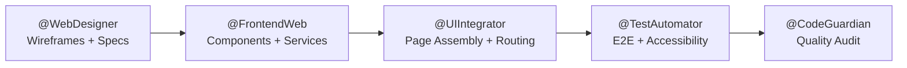
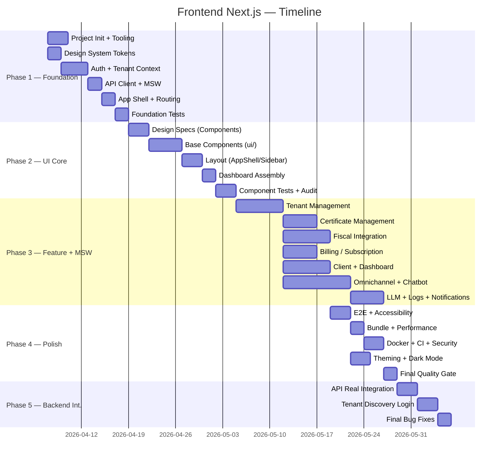

# TP-00002 — Frontend Next.js

**Document ID:** `TP-00002`  

**Project:** Contador Fiscal Inteligente
**Created:** 2026-03-24
**Last reconciled:** 2026-09-12 (v2.17)
**Status:** 🔄 In Progress

> **Reconciliation source:** 360° audit of the `/frontend` implementation and its backend contracts at repository baseline `516489a8`, followed by targeted reconciliations of the current working tree. The 2026-09-06 amendment is governed by REQ-00057/TP-00040 and replaces the Dashboard fiscal mock-only contracts with one tenant-scoped backend snapshot. Evidence includes focused Vitest, TypeScript/ESLint/build gates when recorded below, the dedicated real-Keycloak Playwright lane, Task Plans 006/007/040 and security RPT-0004.
**Author:** @AgentOrchestrator
 
**References:**
[ADR-0001](../../backend/docs/adrs/ADR-0001-technology-stack-and-architecture.md) ·
[ADR-0005](../../backend/docs/adrs/ADR-0005-multi-tenancy-architecture.md) ·
[ADR-0007](../../backend/docs/adrs/ADR-0007-multi-provider-llm-integration.md) ·
[ADR-0023 — pagamento agnóstico, vigente](../../backend/docs/adrs/ADR-0023-agnostic-payment-provider-integration.md) ·
[ADR-0008 — baseline histórico](../../backend/docs/adrs/ADR-0008-stripe-billing-subscription.md) ·
[ADR-0009](../../backend/docs/adrs/ADR-0009-dynamic-rbac-evolution.md) ·
[ADR-0013](../../frontend/docs/adrs/ADR-0013-frontend-architecture-state-management.md) ·
[ADR-0020](../../backend/docs/adrs/ADR-0020-centralized-tenant-discovery.md) ·
[REQ-00003](../../product/requirements/REQ-00003-rbac-profile-responsibility-matrix.md) ·
[REQ-00004](../../product/requirements/REQ-00004-rbac-security-mapping.md) ·
[REQ-00005](../../product/requirements/REQ-00005-plan-feature-matrix.md) ·
[REQ-00041 — Conversation Audit target](../../product/requirements/REQ-00041-chatbot-conversation-audit.md) ·
[REQ-00057 — Dashboard fiscal tenant](../../product/requirements/REQ-00057-tenant-dashboard-fiscal-overview.md) ·
[UC-00001 — Dashboard](../../product/use-cases/UC-00001-dashboard-view.md) ·
[UC-00035 — Conversation Audit](../../product/use-cases/UC-00035-chatbot-conversation-audit.md) ·
[frontend-standard](../agents/standards/frontend-standard.md) ·
[nextjs-standard](../agents/standards/nextjs-standard.md) ·
[keycloak-frontend-standard](../agents/standards/keycloak-frontend-standard.md) ·
[rbac-frontend-standard](../agents/standards/rbac-frontend-standard.md) ·
[component-design-standard](../agents/standards/component-design-standard.md) ·
[webdesigner-standard](../agents/standards/webdesigner-standard.md) ·
[api-client-standard](../agents/standards/api-client-standard.md) ·
[state-management-standard](../agents/standards/state-management-standard.md) ·
[i18n-standard](../agents/standards/i18n-standard.md) ·
[a11y-standard](../agents/standards/a11y-standard.md) ·
[frontend-testing-standard](../agents/standards/frontend-testing-standard.md) ·
[websocket-standard](../agents/standards/websocket-standard.md) ·
[TP-00001](TP-00001-backend-spring-modulith-task-plan.md) ·
[FrontendWeb Agent](../agents/FrontendWeb.md) ·
[UIIntegrator Agent](../agents/UIIntegrator.md) ·
[WebDesigner Agent](../agents/WebDesigner.md)

**Cross-Layer Orchestration:**
[TP-00003-omnichannel-integration-task-plan.md](TP-00003-omnichannel-integration-task-plan.md) — Omnichannel ·
[TP-00006-frontend-backend-cibersecurity-implementation-plan.md](TP-00006-frontend-backend-cibersecurity-implementation-plan.md) — security hardening ·
[TP-00007-arch-memory-llm-tool-calling-omnichannel.md](TP-00007-arch-memory-llm-tool-calling-omnichannel.md) — tool calling/conversational lifecycle ·
[TP-00008-chatbot-conversation-audit-implementation-plan.md](TP-00008-chatbot-conversation-audit-implementation-plan.md) — evolução aditiva da Inbox/auditoria, integradora e fora do denominador ·
[TP-00040-tenant-dashboard-fiscal-overview.md](TP-00040-tenant-dashboard-fiscal-overview.md) — snapshot fiscal real de sete dias exclusivo do escritório ·
[RPT-0004](../reports/RPT-0004-frontend-backend-cibersecurity.md) — repository controls and external gates

---

# 1. Overview

This plan defines the coordinated activities for building the **frontend Next.js application** for the Contador Fiscal Inteligente platform. Execution is structured in 5 phases across 7 sprints, using a **Mock-First approach**. This allows the frontend to be built and validated by clients immediately, utilizing Mock Service Worker (MSW) to simulate APIs, and deferring the real backend integration to the final phase.

> **Dashboard amendment (2026-09-06):** o Mock-First permanece ferramenta de teste,
> mas não é fonte de verdade. O bloco fiscal tenant consome o endpoint backend real
> `GET /api/v1/dashboard/fiscal-overview`; o MSW replica esse contrato somente em
> desenvolvimento/testes. A visão global não monta a query.

> **Technology:** Next.js 16.3 (App Router) · React 19.2 · TypeScript 5 · Tailwind CSS 4 · TanStack Query · MSW (Mock Service Worker) · Keycloak JS (PKCE) · Vitest · Playwright · next-intl · Zustand (minimal) · Lucide Icons

---

# 2. Execution Tracking Matrix

> **Status rule:** ✅ implementation **and** task-specific acceptance evidence complete · 🔄 code/validation partially complete or a required gate is missing · ⬜ not implemented · ⏸️ blocked by an external dependency · ❌ cancelled/superseded and excluded from the denominator. Progress is `Done / (Total - Cancelled)`, rounded to the nearest integer.

### Phase 1 — Project Foundation & Design System (Sprint F1)

| # | Activity | Agent | Status | Notes |
|---|---|---|:---:|---|
| 1.1.1 | Initialize Next.js project (App Router, TypeScript, Tailwind) | @FrontendWeb | ✅ | |
| 1.1.2 | Configure ESLint, Prettier, Vitest, Playwright | @FrontendWeb | ✅ | Depends on 1.1.1 |
| 1.1.3 | Configure `next-intl` (pt-BR default) | @FrontendWeb | ✅ | Depends on 1.1.1 |
| 1.1.4 | Configure environment variables (`.env.local`, `.env.example`) | @FrontendWeb | ✅ | Depends on 1.1.1 |
| 1.2.1 | Design system tokens (colors, typography, spacing, shadows) | @WebDesigner | ✅ | |
| 1.2.2 | Tailwind CSS config (`tailwind.config.ts`) | @FrontendWeb | ✅ | Depends on 1.2.1 |
| 1.2.3 | Global CSS (`globals.css`) with CSS custom properties for theming | @FrontendWeb | ✅ | Inter variable is self-hosted through `next/font/local`, with `@fontsource-variable/inter@5.3.0` pinned exactly; focused gates and the 38-route Webpack production build prove the hashed WOFF2 artifact. |
| 1.3.1 | Implement Keycloak JS singleton + `AuthProvider` (PKCE) | @FrontendWeb | ✅ | Depends on backend 1.4.1 |
| 1.3.2 | Implement `useAuth` hook + `ProtectedRoute` component | @FrontendWeb | ✅ | Depends on 1.3.1 |
| 1.3.3 | Implement `PermissionGate` + `usePermission` hook | @FrontendWeb | ✅ | Depends on 1.3.2 |
| 1.3.4 | Implement authoritative tenant context (JWT claim / explicit Super Admin impersonation) | @FrontendWeb | ✅ | Depends on 1.3.1 |
| 1.4.1 | Configure API client (Axios/Fetch + interceptors) | @FrontendWeb | ✅ | Depends on 1.3.4 |
| 1.4.2 | Configure TanStack Query (`QueryClientProvider`) | @FrontendWeb | ✅ | Depends on 1.4.1 |
| 1.4.3 | Implement error taxonomy (`ApiError`, `ValidationError`, `NetworkError`) | @FrontendWeb | ✅ | Delivered in 1.4.1. Scope redefined → 1.4.3-R1 |
| 1.4.4 | Configure MSW (Mock Service Worker) for API simulation | @FrontendWeb | ✅ | Depends on 1.4.1 |
| 1.5.1 | App root layout (`layout.tsx`) with Providers wrapper | @UIIntegrator | ✅ | Depends on 1.3.1, 1.4.2, 1.1.3 |
| 1.5.2 | Configure Next.js proxy (auth redirect, locale) | @UIIntegrator | ✅ | Next.js 16 proxy enforces a signed, short-lived HttpOnly navigation session, safe redirects and locale; RS256/JWKS/issuer/audience/`azp`, lifecycle/logout and edge hardening passed focused tests and security review. |
| 1.5.3 | Implement route groups: `(auth)`, `(dashboard)`, `(public)` | @UIIntegrator | ✅ | Depends on 1.5.1 |
| 1.6.1 | Write unit tests for AuthProvider + hooks | @TestAutomator | ✅ | Depends on 1.3.3 |
| 1.6.2 | Write E2E test: login → redirect → dashboard | @TestAutomator | ✅ | Dedicated Playwright lane passed 1/1 against real Keycloak 26.6.3, covering PKCE login, return to the protected deep link, reload/session continuity, POST logout and ephemeral-user cleanup. |
| 1.6.3 | Write E2E test: unauthenticated redirect to Keycloak | @TestAutomator | ✅ | Depends on 1.5.3 |

### Phase 2 — UI Core Components & Layouts (Sprint F2)

> [!IMPORTANT]
> **UI/UX Lifecycle Rule:** O fluxo de design e desenvolvimento do frontend opera de forma assíncrona e em fases distintas. É **obrigatório** que os wireframes gerados no Google Stitch (ex: Task 2.1.1) sejam revisados e **aprovados** pelos stakeholders (Product Owner / Cliente) ANTES de se iniciar qualquer codificação React/Tailwind nas trilhas de implementação (2.2.x Componentes e 2.3.x Layout). O Stitch atua como a única fonte de verdade visual.

| # | Activity | Agent | Status | Notes |
|---|---|---|:---:|---|
| 2.1.1 | Design wireframes: AppShell, Sidebar, TopBar | @WebDesigner | ✅ | Google Stitch MCP screens as design aide |
| 2.1.2 | Component specs: Button, Input, Select, Badge, Card, Modal, Toast, Table | @WebDesigner | ✅ | Specs at ../../frontend/docs/specs/IP-FE-2.1.2-component-specs-button-input-select.md |
| 2.1.3 | Component specs: EmptyState, ErrorState, ConfirmDialog, SkeletonLoader | @WebDesigner | ✅ | Specs at ../../frontend/docs/specs/IP-FE-2.1.3-component-specs-emptystate-errorstate-confirmdialog-skeletonloader.md |
| 2.2.1 | Implement `ui/` base components (Button, Input, Select, Badge, Card) | @FrontendWeb | ✅ | Depends on 2.1.2, 1.2.2 |
| 2.2.2 | Implement `ui/` compound components (Modal, Toast, Tabs, Table) | @FrontendWeb | ✅ | Depends on 2.2.1 |
| 2.2.3 | Implement `shared/` components (EmptyState, ErrorState, ConfirmDialog, SkeletonLoader) | @FrontendWeb | ✅ | Depends on 2.1.3, 2.2.1 |
| 2.2.4 | Implement `cn()` utility + CVA variants | @FrontendWeb | ✅ | Depends on 1.2.2 |
| 2.3.1 | Implement AppShell layout (Sidebar + TopBar + ContentArea) | @FrontendWeb | ✅ | Depends on 2.1.1, 2.2.1 |
| 2.3.2 | Implement responsive Sidebar with RBAC filtering (`useModuleAccess`) | @FrontendWeb | ✅ | Depends on 2.3.1, 1.3.3 |
| 2.3.3 | Implement TopBar (user menu, tenant label, logout) | @FrontendWeb | ✅ | Depends on 2.3.1, 1.3.2. Update E2E logout test once implemented. |
| 2.3.4 | Implement Breadcrumbs component | @FrontendWeb | ✅ | Depends on 2.3.1 |
| 2.4.1 | Assemble `(dashboard)` layout with AppShell | @UIIntegrator | ✅ | Depends on 2.3.1 |
| 2.4.2 | Configure loading/error/not-found boundaries per route group | @UIIntegrator | 🔄 | Root/dashboard boundaries exist; coverage is incomplete for all route groups. |
| 2.5.1 | Write unit tests for all `ui/` components | @TestAutomator | ✅ | Depends on 2.2.2 |
| 2.5.2 | Write unit tests for Sidebar RBAC filtering | @TestAutomator | ✅ | Depends on 2.3.2 |
| 2.5.3 | WCAG accessibility audit (axe-core) on base components | @TestAutomator | ✅ | Depends on 2.2.2 |
| 2.6.1 | Quality audit: component design patterns + bundle size | @CodeGuardian | ✅ | Depends on 2.5.1 |

### Phase 3 — Feature Modules (Sprint F3-F5)

> Frontend pages are built per bounded context using **Mock Service Worker (MSW)** to simulate backend REST APIs. This allows parallel development and immediate client validation.

| # | Activity | Agent | Status | Notes |
|---|---|---|:---:|---|
| 3.1.1 | Tenant wireframes | @WebDesigner | ✅ | Approved task artifact. |
| 3.1.2 | Tenant service + MSW | @FrontendWeb | ✅ | Service, hooks and handlers present. |
| 3.1.3 | Tenant page components | @FrontendWeb | ✅ | List, detail, users and subscription UI present. |
| 3.1.4 | Tenant forms | @FrontendWeb | ✅ | Create/edit/invite forms present; legacy invitation plan is supporting evidence, not a new task. |
| 3.1.5 | Tenant pages + routing | @UIIntegrator | ✅ | Tenant routes and RBAC present. |
| 3.1.6 | Tenant E2E | @TestAutomator | ✅ | Dedicated Playwright coverage present. |
| 3.1.7 | Tenant quality audit | @CodeGuardian | ✅ | Dedicated audit artifact present. |
| 3.2.1 | Certificate wireframes | @WebDesigner | ✅ | Specification exists; its stale Pending header does not override the delivered artifact. |
| 3.2.2 | Certificate service + MSW | @FrontendWeb | ✅ | Service, query hooks and handlers present. |
| 3.2.3 | Certificate page components | @FrontendWeb | 🔄 | List/detail/modal exist; planned `CertificateUploadPage` does not. |
| 3.2.4 | Certificate multipart upload | @FrontendWeb | 🔄 | Validation and loading exist; no real upload progress. |
| 3.2.5 | Certificate pages + routing | @UIIntegrator | 🔄 | List/detail RBAC exist; `/certificates/upload` is absent. |
| 3.2.6 | Certificate E2E | @TestAutomator | ⬜ | No dedicated Playwright spec. |
| 3.2.7 | SERPRO credential settings | @FrontendWeb | ✅ | Delivered in `/settings/serpro`; scope moved out of certificate upload. |
| 3.2.8 | DAS 12 Traffic Inspector UI | @FrontendWeb | ✅ | GERARDAS12 card/action and service call implemented. |
| 3.2.9 | Certificate quality audit | @CodeGuardian | ⬜ | No dedicated audit artifact. |
| 3.3.1 | Fiscal wireframes | @WebDesigner | ✅ | Task artifact present. |
| 3.3.2 | Fiscal service + MSW | @FrontendWeb | ✅ | Service, hooks and handlers present. |
| 3.3.3 | Fiscal page components | @FrontendWeb | ✅ | Consulta, status, histórico e downloads reais de PDF de consulta/DAS presentes; DARF genérico foi expurgado por ausência de controller. |
| 3.3.4 | Fiscal document mask + validation | @FrontendWeb | ✅ | Documento validation and currency formatting present. |
| 3.3.5 | Fiscal pages + routing | @UIIntegrator | ✅ | Rotas suportadas de consulta fiscal e DAS presentes; `/fiscal/darf`, `/fiscal/batch` e `/fiscal/documents` foram expurgadas pelo TP-00056. |
| 3.3.6 | Fiscal E2E | @TestAutomator | 🔄 | Spec exists but does not close every promised isolation/journey case. |
| 3.3.7 | Fiscal quality audit | @CodeGuardian | ⬜ | No current dedicated audit artifact found. |
| 3.4.1 | Billing wireframes | @WebDesigner | ✅ | Task artifact present. |
| 3.4.2 | Billing service + MSW | @FrontendWeb | ✅ | Service, hooks and handlers present. |
| 3.4.3 | Billing page components | @FrontendWeb | ✅ | Plans, subscription, invoices and usage UI present. |
| 3.4.4 | Redirect de checkout hospedado | @FrontendWeb | ✅ | Fluxo genérico de redirect presente; o nome do componente Stripe é legado AS-IS e a evolução segue o ADR-0023. |
| 3.4.5 | Billing pages + routing | @UIIntegrator | ✅ | Routes and RBAC present. |
| 3.4.6 | Billing E2E | @TestAutomator | 🔄 | Spec exists but does not close every acceptance journey. |
| 3.4.7 | Billing quality audit | @CodeGuardian | ✅ | [RPT-0005](../reports/RPT-0005-billing-quality-audit.md). |
| 3.5.1 | Client wireframes | @WebDesigner | ✅ | Task artifact present. |
| 3.5.2 | Client service + MSW | @FrontendWeb | ✅ | Service, hooks and handlers present. |
| 3.5.3 | Client page components | @FrontendWeb | ✅ | Client UI present. |
| 3.5.4 | Client forms | @FrontendWeb | ✅ | Validated create/edit flows present. |
| 3.5.5 | Client pages + routing | @UIIntegrator | ✅ | Routes and RBAC present. |
| 3.5.6 | Client E2E | @TestAutomator | 🔄 | Spec exists but does not close every planned phone/limit journey. |
| 3.5.7 | Client quality audit | @CodeGuardian | ⬜ | No dedicated audit artifact. |
| 3.6.1 | Chatbot config wireframes | @WebDesigner | ✅ | Task artifact present. |
| 3.6.2 | Chatbot config service + MSW | @FrontendWeb | ✅ | Service and handlers present. |
| 3.6.3 | Chatbot config components | @FrontendWeb | ✅ | Function, template and prompt UI present. |
| 3.6.4 | Chatbot config forms | @FrontendWeb | ✅ | Forms and schemas present. |
| 3.6.5 | Chatbot config pages + routing | @UIIntegrator | ✅ | Admin/settings routes present. |
| 3.6.6 | Chatbot config E2E | @TestAutomator | 🔄 | Spec exists but promised CRUD/validation coverage is incomplete. |
| 3.6.7 | Chatbot config quality audit | @CodeGuardian | ⬜ | No dedicated audit artifact. |
| 3.7.1 | Dashboard wireframe review | @WebDesigner | ✅ | [IP-FE-3.7.1-dashboard-central-wireframes v1.2](../../frontend/docs/specs/IP-FE-3.7.1-dashboard-central-wireframes.md) reconcilia e fecha o layout tenant de sete dias e Últimas Movimentações. |
| 3.7.2 | Dashboard service + MSW | @FrontendWeb | ✅ | Uma query consome `/api/v1/dashboard/fiscal-overview`; MSW espelha sete buckets e quatro movimentos sem mascarar falhas reais. |
| 3.7.3 | Dashboard widgets | @FrontendWeb | ✅ | Gráfico Situação Fiscal/DAS e lista de movimentos usam o snapshot real, i18n, alternativa acessível e estados distintos. |
| 3.7.4 | Tenant impersonation view | @FrontendWeb | ✅ | Tenant selector and cache refresh flow present. |
| 3.7.5 | Dashboard page + RBAC | @UIIntegrator | ✅ | O bloco é montado apenas para Tenant Admin ou Super Admin personificado; Super Admin global e Tenant User não disparam a query. |
| 3.7.6 | Dashboard E2E | @TestAutomator | ✅ | Playwright passou desktop `3/3` e 320 px `2/2` com um skip esperado; backend-real permanece no gate transversal da Fase 5. |
| 3.7.7 | Dashboard quality audit | @CodeGuardian | ✅ | Contrato, RBAC, cache, erro sem logout, i18n, a11y, responsividade, lint focal, typecheck e build Webpack revisados. |
| 3.8.1 | Omnichannel deep refactor | @FrontendWeb | ✅ | Types, services, hooks, RBAC, routes and i18n delivered. |
| 3.8.2 | Omnichannel inbox UI | @FrontendWeb | ✅ | Multi-channel list and timeline present. A evolução de auditoria segura é rastreada pelo [TP-00008](TP-00008-chatbot-conversation-audit-implementation-plan.md), sem duplicar esta folha. |
| 3.8.3 | Channel settings UI | @FrontendWeb | ✅ | WhatsApp/Telegram settings present. |
| 3.8.4 | Access validation UI | @FrontendWeb | ✅ | Table, modal, schema, hook and handler present. |
| 3.8.5 | Billing/tenant label refactor | @FrontendWeb | ✅ | `CHATBOT_MSG` and `chatbotLimit` adopted. |
| 3.8.6 | Omnichannel E2E | @TestAutomator | 🔄 | Inbox/access specs exist; full settings/CRUD/billing journeys remain incomplete. |
| 3.8.7 | Omnichannel quality audit | @CodeGuardian | 🔄 | O [RPT-0006](../reports/RPT-0006-conversation-audit-security-quality-audit.md), fornece auditoria parcial/RED da evolução de conversas; coverage, backend-real, PostgreSQL, DAST e rollout continuam abertos. |
| 3.8.8 | Function Registry UI | @FrontendWeb | ✅ | Registry table/actions present. |
| 3.8.9 | Channel Templates UI | @FrontendWeb | ✅ | Page, form and route present. |
| 3.8.10 | LLM Prompts UI | @FrontendWeb | 🔄 | Core UI exists; model/temperature and last-active safeguards are absent. |
| 3.8.11 | Webhook Traffic Inspector — redacted metadata + ephemeral diagnostics | @FrontendWeb | ✅ | Copy humana, sessão Telegram `dev`-only de cinco minutos, consentimento, TTL/stop, contratos, MSW e testes focais implementados. Legacy plan ID: 3.1.18. |
| 3.9.1 | Fiscal batch monitor | @FrontendWeb | Cancelled | Expurgado pelo TP-00056: não existe controller backend para `/api/v1/fiscal/batch*`. |
| 3.9.2 | Fiscal document repository | @FrontendWeb | Cancelled | Expurgado pelo TP-00056: listagem/download genéricos eram mock-only; PDFs reais de consulta e DAS permanecem em 3.9.3 e no fluxo DAS. |
| 3.9.3 | SERPRO Conecta grid | @FrontendWeb | ✅ | Grid and PDF download implemented. |
| 3.9.4 | LLM provider configuration | @FrontendWeb | ✅ | CRUD, ping, chat test, hooks and E2E present. |
| 3.9.5 | Super Admin Log Explorer | @FrontendWeb | ✅ | Page, service, mocks and E2E present. |
| 3.10.1 | Notification Center Templates | @FrontendWeb | 🔄 | UI exists; protected-route/RBAC gates and MSW toggle contract are incomplete. |

### Phase 4 — Polish, E2E & Optimization (Sprint F6)

| # | Activity | Agent | Status | Notes |
|---|---|---|:---:|---|
| 4.1.1 | Full E2E test suite (Playwright): all critical journeys | @TestAutomator | 🔄 | 18 specs exist, but module coverage is incomplete and the last stored Playwright run failed. |
| 4.1.2 | WCAG 2.1 AA full audit (all pages) | @TestAutomator | 🔄 | `wcag.spec.ts` covers only dashboard, billing and plans; no global manual audit. |
| 4.2.1 | Bundle analysis and optimization (target < 100KB gzipped) | @FrontendWeb | 🔄 | Analyzer configured; no current report proving the target. |
| 4.2.2 | Performance audit: FCP < 1.5s, TTI < 3s, CLS < 0.1 | @FrontendWeb | ⬜ | No Lighthouse evidence. |
| 4.2.3 | Super Admin Management Screen (UC-00018) | @FrontendWeb | ✅ | Screen and management modals implemented. |
| 4.3.1 | Docker multi-stage build (Node 22 + Next standalone) | @DevOps-Agent | 🔄 | Dockerfile exists; image size `<150 MB` and runtime public-env behavior are not proven. |
| 4.3.2 | CI pipeline (build, test, lint, E2E, coverage) | @DevOps-Agent | 🔄 | Security CI runs install/unit/lint/audit; build, Playwright and coverage gate are missing. |
| 4.3.3 | Configure CSP headers and security hardening | @DevOps-Agent | ✅ | Nonce CSP, HSTS and other headers implemented in `proxy.ts` and verified by plan 006/RPT-0004. |
| 4.4.1 | Multi-tenant theming via CSS custom properties | @FrontendWeb + @WebDesigner | 🔄 | Primary color is dynamic; accent and logo overrides remain absent. |
| 4.4.2 | Dark mode support | @FrontendWeb + @WebDesigner | ✅ | `ThemeProvider`, `[data-theme="dark"]` tokens and TopBar theme selector implemented. |
| 4.5.1 | Global quality audit: code, coverage ≥ 70%, SOLID | @CodeGuardian | 🔄 | 491 unit tests pass, but current global coverage and full cross-module E2E gates are not proven; stored coverage remains stale and below target. |
| 4.5.2 | Final bundle report (Markdown) | @FrontendWeb | ⬜ | No final report. |

### Phase 5 — Backend Integration (Sprint F7)

| # | Activity | Agent | Status | Notes |
|---|---|---|:---:|---|
| 5.1.1 | Disable MSW and point API to real backend | @FrontendWeb | 🔄 | MSW is dev-only and compose URLs exist; container build-time public variables remain unsafe/incomplete. |
| 5.1.2 | Map and fix contract mismatches | @FrontendWeb | 🔄 | Most contracts map; notification toggle and webhook pagination still diverge. |
| 5.1.3 | Re-run full E2E suite against live backend | @TestAutomator | ⏸️ | Blocked by contract/environment/credential readiness. |
| 5.1.4 | Resolve integration bugs and stabilize | @CodeGuardian | ⏸️ | Blocked by 5.1.3. |
| 5.2.2 | Login flow with tenant discovery | @FrontendWeb | 🔄 | Core discovery/workspace/realm flow exists; auto-redirect, 429 UX, route acceptance and tests are incomplete. |

### Summary

| Phase | Total Activities | ⬜ Pending | 🔄 In Progress | ⏸️ Blocked | ✅ Done | Progress |
|---|:---:|:---:|:---:|:---:|:---:|---|
| **Phase 1 — Frontend Infrastructure** | 21 | 0 | 0 | 0 | 21 | 100% |
| **Phase 2 — Base UI Components** | 17 | 0 | 1 | 0 | 16 | 94% |
| **Phase 3 — Feature Modules** | 68 | 5 | 11 | 0 | 52 | 76% |
| **Phase 4 — Polish & Optimization** | 12 | 2 | 7 | 0 | 3 | 25% |
| **Phase 5 — Backend Integration** | 5 | 0 | 3 | 2 | 0 | 0% |
| **TOTAL** | **123** | **7** | **22** | **2** | **92** | **75%** |

> **Canonicalization decisions:** `3.7.8 Recent Activity Feed` is supporting evidence for 3.7.3/3.7.6, and legacy `4.2.2 Office User Invitation` supports 3.1.4–3.1.6; neither is counted again. The former frontend `3.1.18 Webhook Traffic Inspector` is canonicalized as 3.8.11. Os nove planos filhos `8.x` apoiam 3.8.2/3.8.6/3.8.7 e os gates 4.x/5.x, mas não criam novas folhas. SEC-013 continua proibindo retenção de body bruto; a única exceção de exibição é o detalhe individual da sessão Telegram efêmera, `dev`-only e sem cache, autorizada por REQ-00036 v1.5.

#### Reconciliation evidence — 2026-08-25

| Check | Result | Interpretation |
|---|---|---|
| Traffic Inspector focused Vitest | ✅ 3 files / 43 tests | Copy redigida, consentimento, TTL/stop, descarte por contexto, schemas e service passam com dados sintéticos. |
| `tsc --noEmit` | ✅ Exit 0 | Contratos do modo diagnóstico compilam. |
| `npm run lint` | ✅ Exit 0 | Zero erro e 58 warnings preexistentes; nenhum nos arquivos da extensão. |
| Focused Prettier | ✅ 12 files | Todos os arquivos da extensão seguem o formato; o check global inclui artefatos/preexistências e permanece vermelho. |
| Isolated Next.js build | ✅ 39/39 pages | Build com envs `example.invalid` e `.next-security-audit` concluído. |
| Full `npm test` | 🔄 143/147 files; 907/912 tests | Cinco timeouts de 5 s em quatro suites não relacionadas (`UserGrid`, `CertificateListPage`, `SerproTrafficInspector`, `ChannelTemplateForm`); os 43 testes focais permanecem verdes. |
| Playwright/backend real | ⏸️ Not run | MSW cobre o contrato sem usar credencial, tenant, webhook ou payload real; a lane live permanece em 3.8.6/5.1.3. |

#### Reconciliation evidence — 2026-08-19

| Check | Result | Interpretation |
|---|---|---|
| Phase 1 focused Vitest gates | ✅ 81/81 tests | Font, proxy/session, authentication lifecycle, logout, edge and real-Keycloak boundary checks pass. |
| `npx tsc --noEmit` | ✅ Exit 0 | Current TypeScript source compiles. |
| `npm run test` | ✅ 95 files / 491 tests | Full unit suite passes; this command does not measure coverage. |
| `npm run lint` | ✅ 0 errors / 63 warnings | Lint gate is non-failing; warning debt remains outside the three closed activities. |
| `npx next build --webpack` | ✅ 38 routes | Supported Next.js 16 production build passes and emits the self-hosted Inter asset as a hashed WOFF2 file. |
| `npm run test:e2e:keycloak` | ✅ 1/1 test | Real Keycloak 26.6.3 proves PKCE login, protected deep link, reload, logout and ephemeral-user teardown. |
| `npm run test:coverage` | 🔄 Not re-run | Stored coverage artifact is stale and reports 48.3%, below the 70% gate. |
| `npm run test:e2e` | 🔄 Full suite not re-run | The dedicated authentication lane is green; the complete cross-module/live-backend suite remains tracked by Phases 4 and 5. |
| Default Turbopack production build | ⏸️ Host bind limitation | This execution host does not permit Turbopack's internal bind during PostCSS. The supported Webpack production path above is green; this environmental limitation does not reopen 1.2.3. |

---

# 3. Context and Constraints

## RBAC Profiles (REQ-00003, REQ-00004)

| Role | Profile | Web Access |
|---|---|---|
| `ROLE_SUPER_ADMIN` | Global SaaS administrator | ✅ Full access to all modules and all tenants |
| `ROLE_TENANT_ADMIN` | Accounting firm administrator | ✅ Access scoped to own tenant only |

> End clients interact through supported Omnichannel bots (currently WhatsApp and Telegram); dashboard access remains limited to administrative profiles.

## Frontend Technology Constraints

- **Framework:** Next.js 16.3 with App Router (Server + Client Components) and React 19.2
- **Styling:** Tailwind CSS 4 with design tokens from `../agents/standards/webdesigner-standard.md`
- **Mocking:** MSW (Mock Service Worker) for API interception and simulation
- **State Management:** TanStack Query (server state) + Zustand (minimal UI state) + React Context (auth, tenant, theme)
- **Auth:** Keycloak JS with PKCE flow, in-memory token storage (never localStorage)
- **i18n:** `next-intl` with pt-BR as default locale
- **Bundle Budget:** Production bundle < 100KB gzipped
- **Accessibility:** WCAG 2.1 Level AA compliance mandatory
- **Testing:** Vitest (unit) + Playwright (E2E) + axe-core (accessibility)
- **Icons:** Lucide (open-source, zero-cost)
- **Font:** Inter variable self-hosted through `next/font/local`, backed by the exact-pinned `@fontsource-variable/inter@5.3.0` WOFF2 asset; no external font request is required

## Frontend Bounded Context Pages

Each bounded context from the backend maps to a route group in the frontend:

| # | Module | Route Group | Key Pages |
|---|---|---|---|
| 1 | **Tenant Management** | `/(dashboard)/tenants` | Tenant list, tenant detail, user management, subscription status |
| 2 | **Certificate Management** | `/(dashboard)/certificates` | Certificate upload, certificate list, expiration alerts |
| 3 | **Fiscal Integration** | `/(dashboard)/fiscal` | Busca por documento, status, histórico e downloads de PDF de consulta/DAS suportados pelo backend |
| 4 | **Billing** | `/(dashboard)/billing` | Plan selection, subscription management, invoice history, usage dashboard |
| 5 | **Client Management** | `/(dashboard)/clients` | Firm clients list, Documento binding, WhatsApp numbers |
| 6 | **Chatbot Config** | `/(dashboard)/admin` & `/(dashboard)/settings` | Function registry, LLM Prompts, WhatsApp Meta templates |
| 7 | **Omnichannel Inbox** | `/(dashboard)/inbox` | Cross-channel conversations and timelines |
| 8 | **Notifications** | `/(dashboard)/admin/notifications` | Notification templates and administration |
| 9 | **Observability** | `/(dashboard)/admin/logs` | Loki-backed log explorer |
| 10 | **Tenant Discovery** | `/login`, `/callback` | Workspace discovery and dynamic Keycloak realm selection |

---

# 4. Phase Details

## Phase 1 — Project Foundation & Design System (Sprint F1)

> Objective: Establish the Next.js project with all cross-cutting infrastructure: auth, API client, i18n, and routing skeleton.

### 1.1 Project Initialization

| # | Activity | Agent | Dep. | Deliverable |
|---|---|---|---|---|
| 1.1.1 | Initialize Next.js project | @FrontendWeb | — | `npx create-next-app@latest ./frontend` with App Router, TypeScript, Tailwind, ESLint |
| 1.1.2 | Configure tooling | @FrontendWeb | 1.1.1 | ESLint (jsx-a11y plugin), Prettier, Vitest config, Playwright config, Husky pre-commit |
| 1.1.3 | Configure `next-intl` | @FrontendWeb | 1.1.1 | `NextIntlClientProvider` in root layout, `messages/pt-BR.json` seed, `useTranslations()` pattern |
| 1.1.4 | Configure environment variables | @FrontendWeb | 1.1.1 | `.env.local` and `.env.example` with `NEXT_PUBLIC_API_BASE_URL`, `NEXT_PUBLIC_KEYCLOAK_URL`, `NEXT_PUBLIC_KEYCLOAK_REALM`, `NEXT_PUBLIC_KEYCLOAK_CLIENT_ID` |

**Acceptance Criteria:**
- `npm run dev` starts Next.js dev server in < 5s
- `npm run lint` passes with zero errors
- `npm run test` (Vitest) runs and passes

---

### 1.2 Design System Implementation

| # | Activity | Agent | Dep. | Deliverable |
|---|---|---|---|---|
| 1.2.1 | Define design system tokens | @WebDesigner | — | Color palette (hex/HSL), typography scale (Inter), spacing grid (4px base), shadows, border-radius, breakpoints, transitions (per `../agents/standards/webdesigner-standard.md`) |
| 1.2.2 | Configure Tailwind CSS | @FrontendWeb | 1.2.1 | `tailwind.config.ts` encoding all design tokens. Theme extension with custom colors, fonts, spacing |
| 1.2.3 | Implement global CSS | @FrontendWeb | 1.2.2 | `globals.css` theme properties plus Inter variable self-hosted by `src/styles/fonts.ts` through `next/font/local`, using the exact-pinned `@fontsource-variable/inter@5.3.0` WOFF2 asset |

**Acceptance Criteria:**
- Tailwind IntelliSense recognizes all custom tokens
- CSS custom properties enable light/dark theme switching
- Inter font loaded via `next/font` (no external CSS links)

---

### 1.3 Authentication & Tenant Context

| # | Activity | Agent | Dep. | Deliverable |
|---|---|---|---|---|
| 1.3.1 | Implement Keycloak JS singleton + `AuthProvider` | @FrontendWeb | Backend 1.4.1 | Keycloak JS with PKCE init, `AuthProvider` context, in-memory token storage, silent refresh |
| 1.3.2 | Implement `useAuth` hook + `ProtectedRoute` | @FrontendWeb | 1.3.1 | `useAuth()`: `isAuthenticated`, `user`, `tenantId`, `roles`, `login()`, `logout()`. `ProtectedRoute` redirects to Keycloak login |
| 1.3.3 | Implement `PermissionGate` + `usePermission` | @FrontendWeb | 1.3.2 | `PermissionGate` hides/shows children based on role. `usePermission(permission)` returns boolean. Permission registry (`permissions.ts`) |
| 1.3.4 | Implement tenant context | @FrontendWeb | 1.3.1 | `TenantProvider` extracts `tenant_id` for tenant identity; Super Admin global stays context-free; only explicit impersonation emits `X-Tenant-ID`. Cache clear on tenant switch. |

**Acceptance Criteria:**
- User redirected to Keycloak login on unauthenticated access
- After login, JWT decoded and `tenantId` + `roles` available via `useAuth()`
- Access token stored in memory only (never localStorage)
- Tenant identity requires the signed `tenant_id` claim without a duplicated header; Super Admin
  global sends no tenant context; explicit Super Admin impersonation sends the selected
  `X-Tenant-ID`, and caller-supplied values cannot override it
- `PermissionGate` correctly hides UI elements based on role

---

### 1.4 API Client Infrastructure

| # | Activity | Agent | Dep. | Deliverable |
|---|---|---|---|---|
| 1.4.1 | Configure API client | @FrontendWeb | 1.3.4 | Fetch wrapper with base URL, auth token interceptor, three-state tenant resolver and response error transformer |
| 1.4.2 | Configure TanStack Query | @FrontendWeb | 1.4.1 | `QueryClientProvider` with default options (staleTime, retry, refetchOnWindowFocus). Query key factory pattern |
| 1.4.3 | Implement error taxonomy | @FrontendWeb | 1.4.1 | `ApiError`, `ValidationError`, `NetworkError` classes. Global error handler: 401→logout redirect, 403→forbidden page, 500→generic error |
| 1.4.4 | Configure MSW | @FrontendWeb | 1.4.1 | Setup `mockServiceWorker.js`, handlers directory, and initialization logic tied to `NEXT_PUBLIC_API_MOCK_ENABLED` env var |

**Acceptance Criteria:**
- API calls automatically include the auth token and add tenant header only for explicit Super
  Admin impersonation
- 401 responses trigger automatic logout + redirect
- TanStack Query caches and deduplicates requests
- MSW intercepts requests when mock env var is true

---

### 1.5 Application Shell & Routing

| # | Activity | Agent | Dep. | Deliverable |
|---|---|---|---|---|
| 1.5.1 | Implement root layout | @UIIntegrator | 1.3.1, 1.4.2, 1.1.3 | `app/layout.tsx` with `Providers` wrapper nesting: `AuthProvider` → `TenantProvider` → `QueryClientProvider` → `NextIntlClientProvider` → `ThemeProvider` |
| 1.5.2 | Configure Next.js proxy | @UIIntegrator | 1.3.1 | `proxy.ts` gates dashboard navigation with a signed short-lived HttpOnly session, safe return URLs and locale handling; the session endpoint validates RS256/JWKS/issuer/audience/`azp`, while lifecycle, POST logout and edge controls fail closed |
| 1.5.3 | Implement route groups | @UIIntegrator | 1.5.1 | `(auth)/login/page.tsx`, `(dashboard)/layout.tsx` (wraps AppShell), `(public)/page.tsx` (landing/redirect) |

**Acceptance Criteria:**
- `/login` accessible without authentication
- All `/(dashboard)/*` routes require authentication
- Refresh on any dashboard route maintains session (deep link support)

---

### 1.6 Foundation Tests

| # | Activity | Agent | Dep. | Deliverable |
|---|---|---|---|---|
| 1.6.1 | Unit tests for auth hooks | @TestAutomator | 1.3.3 | Vitest: `useAuth`, `usePermission` with mocked Keycloak |
| 1.6.2 | E2E test: login flow | @TestAutomator | 1.5.3 | Playwright against real Keycloak 26.6.3: protected deep link → PKCE login → return to dashboard → reload/session continuity → POST logout; provision and remove an ephemeral test user |
| 1.6.3 | E2E test: unauthenticated redirect | @TestAutomator | 1.5.3 | Playwright: navigate to `/fiscal` without session → redirected to Keycloak |

**Acceptance Criteria:**
- All unit tests pass with Vitest
- E2E tests pass with Playwright against local Keycloak (Docker Compose)

---

## Phase 2 — UI Core Components & Layouts (Sprint F2)

> Objective: Implement the reusable component library and the dashboard layout.

### 2.1 Design Specifications

| # | Activity | Agent | Dep. | Deliverable |
|---|---|---|---|---|
| 2.1.1 | Wireframes: AppShell, Sidebar, TopBar | @WebDesigner | — | Google Stitch MCP screens for mobile (320px), tablet (768px), desktop (1024px) breakpoints. Stitch is used as a UI exploration component, without strong dependency coupling. |
| 2.1.2 | Component specs: Button, Input, Select, Badge, Card, Modal, Toast, Table | @WebDesigner | — | Full specs: all visual states, responsive variants, ARIA requirements, CVA variants (size, variant) |
| 2.1.3 | Component specs: EmptyState, ErrorState, ConfirmDialog, SkeletonLoader | @WebDesigner | — | Full specs with illustrations, messaging, and retry patterns |

### 2.2 Base Component Implementation

| # | Activity | Agent | Dep. | Deliverable |
|---|---|---|---|---|
| 2.2.1 | Implement `ui/` base components | @FrontendWeb | 2.1.2, 1.2.2 | `Button`, `Input`, `Select`, `Badge`, `Card` with CVA variants, `forwardRef`, typed props |
| 2.2.2 | Implement `ui/` compound components | @FrontendWeb | 2.2.1 | `Modal`, `Toast` (Zustand store), `Tabs`, `Table` (sortable, paginated), `Dropdown` |
| 2.2.3 | Implement `shared/` components | @FrontendWeb | 2.1.3, 2.2.1 | `EmptyState`, `ErrorState`, `ConfirmDialog`, `SkeletonLoader`, `LoadingSpinner` |
| 2.2.4 | Implement `cn()` utility + CVA | @FrontendWeb | 1.2.2 | `cn()` = `clsx` + `tailwind-merge`. CVA variant definitions for all `ui/` components |

### 2.3 Layout Implementation

| # | Activity | Agent | Dep. | Deliverable |
|---|---|---|---|---|
| 2.3.1 | Implement AppShell | @FrontendWeb | 2.1.1, 2.2.1 | Responsive shell: collapsible sidebar on mobile, fixed on desktop. ContentArea with max-width |
| 2.3.2 | Implement Sidebar with RBAC | @FrontendWeb | 2.3.1, 1.3.3 | Sidebar with `useModuleAccess` hook filtering menu items by role. Icons via Lucide |
| 2.3.3 | Implement TopBar | @FrontendWeb | 2.3.1, 1.3.2 | User avatar, tenant name, notification bell (placeholder), logout button |
| 2.3.4 | Implement Breadcrumbs | @FrontendWeb | 2.3.1 | Auto-generated from route path. `Home > Module > Page` pattern |

### 2.4 Dashboard Assembly

| # | Activity | Agent | Dep. | Deliverable |
|---|---|---|---|---|
| 2.4.1 | Assemble `(dashboard)` layout | @UIIntegrator | 2.3.1 | `app/(dashboard)/layout.tsx` wrapping AppShell, wiring Sidebar and TopBar |
| 2.4.2 | Configure boundaries | @UIIntegrator | 2.4.1, 2.2.3 | `loading.tsx` (skeleton), `error.tsx` (ErrorState + retry), `not-found.tsx` per route group |

### 2.5 Component Tests

| # | Activity | Agent | Dep. | Deliverable |
|---|---|---|---|---|
| 2.5.1 | Unit tests for `ui/` components | @TestAutomator | 2.2.2 | Vitest + RTL: rendering, state changes, keyboard events |
| 2.5.2 | Unit tests for Sidebar RBAC | @TestAutomator | 2.3.2 | Vitest: `ROLE_SUPER_ADMIN` sees global items, `ROLE_TENANT_ADMIN` sees tenant-scoped items, and standalone `ROLE_TENANT_AUDIT` sees only `/audit` when a tenant is effective |
| 2.5.3 | WCAG accessibility audit | @TestAutomator | 2.2.2 | axe-core integration: zero violations on all `ui/` components |

### 2.6 Quality Gate

| # | Activity | Agent | Dep. | Deliverable |
|---|---|---|---|---|
| 2.6.1 | Quality audit | @CodeGuardian | 2.5.1 | Review: component patterns (CVA, forwardRef), props naming, file organization, initial bundle size |

**Acceptance Criteria:**
- All `ui/` components render correctly across 4 breakpoints
- Sidebar correctly filters items based on RBAC role
- axe-core: zero accessibility violations
- Bundle stays under 50KB gzipped at this point

---

## Phase 3 — Feature Modules (Sprint F3-F5)

> Objective: Implement frontend pages for each bounded context using **MSW** to simulate all backend interactions. This ensures the client can test UI flows realistically without waiting for backend deployments.

### 3.1 Tenant Management Module

| # | Activity | Agent | Dep. | Deliverable |
|---|---|---|---|---|
| 3.1.1 | Design wireframes (tenant pages) | @WebDesigner | — | Tenant list (table + filters), tenant detail (tabs), user management, subscription status card |
| 3.1.2 | Create service + MSW handlers | @FrontendWeb | 3.1.1 | `services/tenantService.ts`, `hooks/useTenants.ts`, MSW `handlers/tenantHandlers.ts` with mock JSONs |
| 3.1.3 | Implement page components | @FrontendWeb | 3.1.1, 2.2.2 | `TenantListPage`, `TenantDetailPage`, `UserManagementPage`, `SubscriptionStatusCard` |
| 3.1.4 | Implement forms (React Hook Form + Zod) | @FrontendWeb | 3.1.3 | `CreateTenantForm`, `EditTenantForm`, `InviteUserForm` with validation from OpenAPI schemas |
| 3.1.5 | Assemble pages + routing | @UIIntegrator | 3.1.3 | Routes: `/(dashboard)/tenants`, `/(dashboard)/tenants/[id]`, `/(dashboard)/tenants/[id]/users`. RBAC: `ROLE_SUPER_ADMIN` only |
| 3.1.6 | Write E2E tests | @TestAutomator | 3.1.5 | Playwright: CRUD tenant, invite user, RBAC enforcement. 33 tests (5 specs). |
| 3.1.7 | Quality audit | @CodeGuardian | 3.1.6 | 71/71 checklist items passed (100%). 8 gaps found and fixed (i18n, Next.js boundaries, form validation). |

### 3.2 Certificate Management Module

| # | Activity | Agent | Dep. | Deliverable |
|---|---|---|---|---|
| 3.2.1 | Design wireframes (certificate pages) | @WebDesigner | — | Upload form (drag & drop), certificate list (expiration badges), detail view |
| 3.2.2 | Create service + MSW handlers | @FrontendWeb | — | `services/certificateService.ts`, `hooks/useCertificates.ts`, MSW `handlers/certificateHandlers.ts` |
| 3.2.3 | Implement page components | @FrontendWeb | 3.2.1, 2.2.2 | List/detail/modal exist; add the separately routed `CertificateUploadPage` required by acceptance |
| 3.2.4 | Implement file upload (multipart) | @FrontendWeb | 3.2.3 | Drag/drop, validation, password and loading exist; add measurable upload progress |
| 3.2.5 | Assemble pages + routing | @UIIntegrator | 3.2.3 | Existing list/detail RBAC plus missing `/(dashboard)/certificates/upload` route |
| 3.2.6 | Write E2E tests | @TestAutomator | 3.2.5 | **PENDING:** dedicated certificate spec not found in `frontend/e2e`. Planned: upload certificate, view list, expiration alert. |
| 3.2.7 | Implement SERPRO Credentials Configuration | @FrontendWeb | 3.2.3 | O fluxo `/settings/serpro` e sua fronteira Tenant Admin estão `Done — repository-local/DEV` no [IP-FE-1.5.5-settings-serpro-route-boundary v1.2](../../frontend/docs/specs/IP-FE-1.5.5-settings-serpro-route-boundary.md), com Vitest 18/18, Playwright 3/3, build 54/54 e QG 18/18. |
| 3.2.8 | SERPRO Traffic Inspector (DAS 12) | @FrontendWeb | 3.2.7 | Runtime GERARDAS12 e evidência test-only do aviso pré-emissão concluídos repository-local/DEV. [IP-FE-3.2.8-gerar-das-12-traffic-inspector](../../frontend/docs/specs/IP-FE-3.2.8-gerar-das-12-traffic-inspector.md) · [IP-FE-3.2.8.1-serpro-external-cost-warning-evidence](../../frontend/docs/specs/IP-FE-3.2.8.1-serpro-external-cost-warning-evidence.md) |
| 3.2.9 | Quality audit | @CodeGuardian | 3.2.8 | **PENDING:** no dedicated audit artifact found during `/frontend` reconciliation. Review file upload patterns and security. |

### 3.3 Fiscal Integration Module

| # | Activity | Agent | Dep. | Deliverable |
|---|---|---|---|---|
| 3.3.1 | Design wireframes (fiscal pages) | @WebDesigner | — | Plano histórico parcialmente superado pelo TP-00056; permanecem busca, status, histórico e fluxos de PDF de consulta/DAS. |
| 3.3.2 | Create service + MSW handlers | @FrontendWeb | — | `fiscalService`, query hooks and fiscal MSW handlers |
| 3.3.3 | Implement page components | @FrontendWeb | 3.3.1, 2.2.2 | Fiscal query, status, history and document components |
| 3.3.4 | Implement Documento mask + validation | @FrontendWeb | 3.3.3 | CPF/CNPJ validation and BRL formatting |
| 3.3.5 | Assemble pages + routing | @UIIntegrator | 3.3.3 | `/(dashboard)/fiscal` routes with both-role RBAC |
| 3.3.6 | Write E2E tests | @TestAutomator | 3.3.5 | Playwright: consulta, histórico e isolamento tenant nas rotas suportadas; cenários DARF/batch/repositório genérico foram expurgados. |
| 3.3.7 | Quality audit | @CodeGuardian | 3.3.6 | Error handling, document validation, i18n and form-pattern audit |

### 3.4 Billing / Subscription Module

| # | Activity | Agent | Dep. | Deliverable |
|---|---|---|---|---|
| 3.4.1 | Design wireframes (billing pages) | @WebDesigner | — | Plan comparison, subscription status, invoices and usage dashboard |
| 3.4.2 | Create service + MSW handlers | @FrontendWeb | — | Billing types, service, hooks and handlers |
| 3.4.3 | Implement page components | @FrontendWeb | 3.4.1, 2.2.2 | Plans, subscription, invoices and usage components |
| 3.4.4 | Implementar redirect de checkout hospedado | @FrontendWeb | 3.4.3 | Criar checkout pelo backend, redirecionar e tratar success/cancel conforme ADR-0023 |
| 3.4.5 | Assemble pages + routing | @UIIntegrator | 3.4.3 | Billing routes and role-scoped views |
| 3.4.6 | Write E2E tests | @TestAutomator | 3.4.5 | Plans, subscription, invoices and RBAC journeys |
| 3.4.7 | Quality audit | @CodeGuardian | 3.4.6 | Fluxo de pagamento, currency, accessibility e error handling; evidência histórica em [RPT-0005](../reports/RPT-0005-billing-quality-audit.md) e direção vigente no ADR-0023. |

### 3.5 Client Tenant Management Module

| # | Activity | Agent | Dep. | Deliverable |
|---|---|---|---|---|
| 3.5.1 | Design wireframes (client management) | @WebDesigner | — | Client list, form and authorized contact views |
| 3.5.2 | Create service + MSW handlers | @FrontendWeb | — | Client service, hooks and handlers |
| 3.5.3 | Implement page components | @FrontendWeb | 3.5.1, 2.2.2 | Client list/detail and authorized contacts |
| 3.5.4 | Implement forms | @FrontendWeb | 3.5.3 | Documento and contact validation with React Hook Form + Zod |
| 3.5.5 | Assemble pages + routing | @UIIntegrator | 3.5.3 | Client routes with Tenant Admin RBAC |
| 3.5.6 | Write E2E tests | @TestAutomator | 3.5.5 | Client CRUD, contact linkage and limit journeys |
| 3.5.7 | Quality audit | @CodeGuardian | 3.5.6 | Tenant isolation, validation, responsiveness and i18n audit |

### 3.6 Chatbot System Configuration Module

| # | Activity | Agent | Dep. | Deliverable |
|---|---|---|---|---|
| 3.6.1 | Design wireframes (chatbot config) | @WebDesigner | — | Function registry list, Meta HSM templates status, LLM prompt configurator |
| 3.6.2 | Create service + MSW handlers | @FrontendWeb | — | `services/chatbotConfigService.ts`, MSW `handlers/chatbotHandlers.ts` |
| 3.6.3 | Implement page components | @FrontendWeb | 3.6.1, 2.2.2 | `ChatbotFunctionsPage`, `WhatsappTemplatesPage`, `LlmPromptsPage` |
| 3.6.4 | Implement forms (React Hook Form + Zod) | @FrontendWeb | 3.6.3 | `FunctionRegistryForm`, `MetaTemplateForm`, `LlmPromptForm` |
| 3.6.5 | Assemble pages + routing | @UIIntegrator | 3.6.3 | Routes: `/(dashboard)/admin/chatbot`, `/(dashboard)/settings/chatbot`. RBAC: `ROLE_SUPER_ADMIN` e `ROLE_TENANT_ADMIN` |
| 3.6.6 | Write E2E tests | @TestAutomator | 3.6.5 | Playwright: admin CRUD functions, tenant activate/deactivate, form validation |
| 3.6.7 | Quality audit | @CodeGuardian | 3.6.6 | Review form complexity, template replacements logic, separation of duties (SaaS vs Tenant Admin) |

### 3.7 Dashboard Central Module (UC-00001)

| # | Activity | Agent | Dep. | Deliverable |
|---|---|---|---|---|
| 3.7.1 | Review wireframes (dashboard home) | @WebDesigner | — | Reconciliar o layout de referência com UC-00001/REQ-00057: gráfico 70% + Últimas Movimentações 30% somente no escritório; Top Escritórios permanece global. |
| 3.7.2 | Create service + MSW handlers | @FrontendWeb | — | `dashboardService`, hook e MSW compartilham `GET /api/v1/dashboard/fiscal-overview`; sete dias e quatro movimentos, sem endpoints mock-only paralelos. |
| 3.7.3 | Implement dashboard widget components | @FrontendWeb | 3.7.1, 3.7.2 | `FiscalEvolutionChart` representa Situação Fiscal/DAS em `dd/MM`; `RecentMovementsList` apresenta tipo, sujeito mascarado, status e divisores. |
| 3.7.4 | Implement Impersonate View (Tenant Selector) | @FrontendWeb | 3.7.2 | `TenantSelector` ComboBox in TopBar (Super Admin only). Context switch for dashboard data re-fetch. Badge visual "Visualizando: Escritório X" |
| 3.7.5 | Assemble dashboard page + RBAC views | @UIIntegrator | 3.7.3, 3.7.4 | Grid 70/30 no desktop e empilhado no mobile; snapshot exclusivo de Tenant Admin ou Super Admin personificado, sem chamada global/Tenant User. |
| 3.7.6 | Write E2E tests | @TestAutomator | 3.7.5 | `frontend/e2e/dashboard/dashboard.spec.ts`: sete linhas acessíveis, séries/status, ausência global e ciclo de personificação; backend-real continua gate separado. |
| 3.7.7 | Quality audit | @CodeGuardian | 3.7.6 | Verificar responsividade, i18n, alternativa acessível, cache por contexto, erro recuperável sem logout e RBAC. |

### 3.8 Módulo Omnichannel Inbox & Settings (ADR-0015)

> Refatoração profunda: eliminar acoplamento WhatsApp e prover Inbox multi-canal + configurações de bots + validações de acesso.

| # | Activity | Agent | Dep. | Deliverable |
|---|---|---|---|---|
| 3.8.1 | Deep Refactoring: Types, Services, Hooks, Mocks, RBAC, Rotas, i18n | @FrontendWeb | — | Implemented: `chatbotService.ts`, `useChatbotQueries.ts`, `/inbox` routes, `CHATBOT_MSG`, `chatbotLimit`, menu/breadcrumb/module access updates. [IP-FE-3.8.1-omnichannel-inbox-and-settings — Impl Plan](../../frontend/docs/specs/IP-FE-3.8.1-omnichannel-inbox-and-settings.md) |
| 3.8.2 | Inbox UI: Componentes multi-canal com ícones dinâmicos | @FrontendWeb | 3.8.1 | Implemented in `components/inbox/` and `app/(dashboard)/inbox`. Conversation list/timeline present. |
| 3.8.3 | Bot Settings UI: Configuração de Telegram e WhatsApp | @FrontendWeb | 3.8.1 | Implemented in `app/(dashboard)/settings/chatbot` with WhatsApp and Telegram config forms and query hooks. |
| 3.8.4 | Access Validation UI: Tabela + Modal + Zod dinâmico | @FrontendWeb | 3.8.1 | Implemented in `settings/chatbot/access` with `AccessValidationList.tsx`, `CreateAccessValidationModal.tsx`, service, hook, schema and MSW handler. [IP-FE-3.8.2-omnichannel-access-and-billing-ui — Impl Plan](../../frontend/docs/specs/IP-FE-3.8.2-omnichannel-access-and-billing-ui.md) |
| 3.8.5 | Billing & Tenant Labels Refactoring | @FrontendWeb | 3.8.1 | Implemented: `chatbotLimit` and `CHATBOT_MSG` found; legacy `whatsappLimit`/`WHATSAPP_MSG` not found in `/frontend`. |
| 3.8.6 | Write E2E tests (Omnichannel) | @TestAutomator | 3.8.2–3.8.5 | Inbox/access specs exist; close the remaining settings/CRUD/billing journeys. [IP-FE-3.8.6-omnichannel-e2e-tests — Impl Plan](../../frontend/docs/specs/IP-FE-3.8.6-omnichannel-e2e-tests.md) |
| 3.8.7 | Quality audit (Omnichannel) | @CodeGuardian | 3.8.6 | Auditoria parcial/RED disponível no [RPT-0006](../reports/RPT-0006-conversation-audit-security-quality-audit.md); fechar coverage, backend-real, PostgreSQL, performance, DAST e rollout antes do status final. |
| 3.8.8 | Chatbot Function Registry UI | @FrontendWeb | 3.8.1 | `FunctionRegistryTable` with channel and actions. [IP-FE-3.8.8-chatbot-function-registry-ui — Impl Plan](../../frontend/docs/specs/IP-FE-3.8.8-chatbot-function-registry-ui.md) |
| 3.8.9 | Chatbot Channel Templates UI | @FrontendWeb | 3.8.1 | `ChannelTemplatesPage`, form and route. [IP-FE-3.8.9-chatbot-channel-templates-ui — Impl Plan](../../frontend/docs/specs/IP-FE-3.8.9-chatbot-channel-templates-ui.md) |
| 3.8.10 | Chatbot LLM Prompts UI | @FrontendWeb | 3.8.1 | Complete model/temperature and last-active safeguards. [IP-FE-3.8.10-chatbot-llm-prompts-ui — Impl Plan](../../frontend/docs/specs/IP-FE-3.8.10-chatbot-llm-prompts-ui.md) |
| 3.8.11 | Webhook Traffic Inspector — redacted metadata + ephemeral diagnostics | @FrontendWeb | 3.8.3 | Explain source redaction, add confirmed 5-minute diagnostic sessions, align API contracts and cover removal of ephemeral data. [IP-FE-3.8.11-webhook-traffic-inspector-secure-diagnostics](../../frontend/docs/specs/IP-FE-3.8.11-webhook-traffic-inspector-secure-diagnostics.md); legacy baseline: `../../frontend/docs/specs/IP-FE-3.1.18-webhook-traffic-inspector.md`. |

### 3.9 Integrações Fiscais Avançadas

| # | Activity | Agent | Dep. | Deliverable |
|---|---|---|---|---|
| 3.9.1 | Monitor de Processamento | @FrontendWeb | — | **Cancelled/expurgado:** não existe contrato implementado/controller para `/api/v1/fiscal/batch*`; ver TP-00056. |
| 3.9.2 | Repositório de Documentos | @FrontendWeb | — | **Cancelled/expurgado:** listagem e download genéricos eram mock-only. Preservados os downloads implementados de PDF de consulta e DAS; ver TP-00056. |
| 3.9.3 | SERPRO Conecta Grid | @FrontendWeb | backend 2.3 | Implemented in `fiscal/page.tsx` with PDF download and `FiscalController` integration. [IP-FE-3.9.3-serpro-conecta-grid — Impl Plan](../../frontend/docs/specs/IP-FE-3.9.3-serpro-conecta-grid.md) |
| 3.9.4 | LLM Providers Config | @FrontendWeb | backend 3.2 | Implemented in admin LLM pages/components/service/hooks/MSW and E2E. [IP-FE-3.9.4-llm-providers-config — Impl Plan](../../frontend/docs/specs/IP-FE-3.9.4-llm-providers-config.md) |
| 3.9.5 | Super Admin Log Explorer | @FrontendWeb | backend 3.7.2 | Implemented in admin logs page/service/MSW and E2E. [IP-FE-3.9.5-super-admin-log-explorer — Impl Plan](../../frontend/docs/specs/IP-FE-3.9.5-super-admin-log-explorer.md) |

### 3.10 Central de Notificações (UC-00017)

| # | Activity | Agent | Dep. | Deliverable |
|---|---|---|---|---|
| 3.10.1 | Templates de Notificação UI (Modelos) | @FrontendWeb | backend notification API | Complete protected-route/RBAC gates and align the MSW toggle contract for `/admin/notifications/templates`. |

**Acceptance Criteria (Phase 3 global):**
- Each module renders correctly on all 4 breakpoints
- RBAC correctly restricts pages per role
- All API integrations work seamlessly with local MSW mocks
- Tenant isolation enforced under MSW inspection for all three states: tenant claim/no header,
  Super Admin global/no header and Super Admin impersonated/authoritative header
- Forms validate per OpenAPI schemas
- i18n: all user-facing text via `useTranslations()`

---

## Phase 4 — Polish, E2E & Optimization (Sprint F6)

> Objective: Final quality pass — E2E coverage, accessibility, performance, and production readiness.

### 4.1 Comprehensive Testing

| # | Activity | Agent | Dep. | Deliverable |
|---|---|---|---|---|
| 4.1.1 | Full E2E test suite | @TestAutomator | Phase 3 | Playwright: all critical journeys (login → CRUD → logout) across all modules |
| 4.1.2 | WCAG 2.1 AA full audit | @TestAutomator | Phase 3 | axe-core + manual audit on all pages. Zero violations |

### 4.2 Performance & Bundle

| # | Activity | Agent | Dep. | Deliverable |
|---|---|---|---|---|
| 4.2.1 | Bundle analysis + optimization | @FrontendWeb | Phase 3 | `@next/bundle-analyzer` report. Code splitting per route. Tree shaking. Target: < 100KB gzipped |
| 4.2.2 | Performance audit | @FrontendWeb | 4.2.1 | Lighthouse: FCP < 1.5s, TTI < 3s, CLS < 0.1 (4G simulation) |
| 4.2.3 | Super Admin Management Screen | @FrontendWeb | Phase 3 | UC-00018 screen and management modals; the legacy office-invitation plan supports Tenant Management and is not counted here |

### 4.3 Production Build & CI

| # | Activity | Agent | Dep. | Deliverable |
|---|---|---|---|---|
| 4.3.1 | Docker multi-stage build | @DevOps-Agent | 4.2.1 | Node 22 build/deps/runner stages with Next.js standalone output; prove image < 150MB and inject required public variables at build time |
| 4.3.2 | CI pipeline | @DevOps-Agent | 4.3.1 | GitHub Actions: lint + test (Vitest) + build + Playwright E2E + coverage gate (≥ 70%) |
| 4.3.3 | Security hardening | @DevOps-Agent | 4.3.1 | CSP headers, HSTS, X-Frame-Options, Referrer-Policy. No inline scripts |

### 4.4 Theming

| # | Activity | Agent | Dep. | Deliverable |
|---|---|---|---|---|
| 4.4.1 | Multi-tenant theming | @FrontendWeb + @WebDesigner | Phase 3 | CSS custom properties override via tenant config endpoint. Theme-able: `--color-primary`, `--color-accent`, logo |
| 4.4.2 | Dark mode | @FrontendWeb + @WebDesigner | 4.4.1 | `[data-theme="dark"]` CSS variables. `prefers-color-scheme` detection. Toggle in TopBar |

### 4.5 Final Quality Gate

| # | Activity | Agent | Dep. | Deliverable |
|---|---|---|---|---|
| 4.5.1 | Global quality audit | @CodeGuardian | 4.1.1 | Code review: SOLID, complexity, duplication. Coverage ≥ 70%. Component patterns |
| 4.5.2 | Final bundle report | @FrontendWeb | 4.2.1 | Markdown report: total size, per-route chunks, dependency breakdown |

**Acceptance Criteria:**
- All E2E tests pass consistently (zero flaky tests)
- WCAG 2.1 AA: zero violations
- Production bundle < 100KB gzipped
- FCP < 1.5s on 4G simulation
- Docker image < 150MB
- CI pipeline green: lint + test + build + E2E

---

## Phase 5 — Backend Integration (Sprint F7)

> Objective: Strip the MSW mocks and integrate the UI strictly with the real backend. Conduct final bug fixing on integration contracts.

| # | Activity | Agent | Dep. | Deliverable |
|---|---|---|---|---|
| 5.1.1 | Point to real API | @FrontendWeb | Phase 4 | Set `NEXT_PUBLIC_API_MOCK_ENABLED=false` and configure base URL to backend Gateway. |
| 5.1.2 | Map contract mismatches | @FrontendWeb | 5.1.1 | Identify and fix any discrepancies between MSW data and real backend endpoints. |
| 5.1.3 | Final E2E Suite pass | @TestAutomator | 5.1.2 | Re-run Playwright tests against live local backend/staging to assert integration stability. |
| 5.1.4 | Resolve Integration Bugs | @CodeGuardian | 5.1.3 | Fix any runtime integration issues, authentication drops, or tenant routing errors. |
| 5.2.2 | Login flow with tenant discovery | @FrontendWeb | backend 5.2.1 | POST `/api/v1/public/tenant-discovery`, workspace choice, `saas-{slug}` realm and callback; add single-result redirect, explicit 429 handling and feature/E2E tests. [IP-FE-5.2.2-login-flow-tenant-discovery — Impl Plan](../../frontend/docs/specs/IP-FE-5.2.2-login-flow-tenant-discovery.md) |

**Acceptance Criteria:**
- Application fully operational without MSW
- All API calls return 200/201 from the live backend
- E2E suite passes fully against the live staging/local backend
- Zero contract mismatch errors

---

# 5. Agent Chain per Module (Phase 3)

This chain is applied to each feature module in Phase 3:
1. **@WebDesigner** — Wireframes, component specs, interaction flows, accessibility checklist
2. **@FrontendWeb** — React components, API service modules, TanStack Query hooks, forms (RHF + Zod)
3. **@UIIntegrator** — Page assembly, routing, RBAC guards, loading/error boundaries, navigation integration
4. **@TestAutomator** — E2E tests (Playwright), unit tests (Vitest), accessibility audit (axe-core)
5. **@CodeGuardian** — Code quality, component patterns, bundle size, coverage

---

# 6. Dependency Diagram

---

# 7. Agent Responsibility Matrix

| Agent | Phase 1 | Phase 2 | Phase 3 | Phase 4 | Phase 5 |
|---|---|---|---|---|---|
| **@WebDesigner** | Design system tokens | Wireframes/specs/a11y | Wireframes per module | Theming specs/dark mode | Discovery/login UX |
| **@FrontendWeb** | Project/auth/API/i18n | Components/layouts | Pages/services/forms | Bundle/theming/report | Real contracts + discovery |
| **@UIIntegrator** | Root layout/proxy/routes | Dashboard/boundaries | Routing/RBAC/navigation | — | Callback/workspace routing |
| **@TestAutomator** | Auth unit/E2E | Component/WCAG tests | Module E2E/RBAC | Full E2E/WCAG | Live-backend E2E |
| **@CodeGuardian** | — | Component audit | Module audits | Global quality | Integration stabilization |
| **@DevOps-Agent** | — | — | — | Standalone Docker/CI/headers | Runtime/build env contract |

---

# 8. Coordination Rules (@AgentOrchestrator)

1. **Sequencing:** Within each module: @WebDesigner → @FrontendWeb → @UIIntegrator → @TestAutomator → @CodeGuardian
2. **Backend Independence:** Phase 3 modules utilize MSW mapping and do NOT require the backend to be deployed to start. This enables rapid prototyping and immediate UI value delivery.
3. **Parallelism Phase 3:** Certificate (3.2), Fiscal (3.3), and Billing (3.4) can run in parallel after Tenant Management (3.1) is complete (Tenant provides auth context patterns reused by all modules)
4. **Quality Gate:** No module advances without @CodeGuardian audit, @TestAutomator E2E passing, and axe-core zero violations
5. **Bundle Gate:** After each Phase 3 module, @FrontendWeb must verify incremental bundle impact. Escalate if approaching 100KB gzipped budget
6. **RBAC Gate:** All pages with role restrictions must have both Vitest unit test and Playwright E2E test verifying the restriction
7. **SEO Gate:** Every page must have proper `<title>`, `<meta description>`, and single `<h1>` per `../agents/standards/nextjs-standard.md`

---

# 9. Verification

### Automated Tests

- `npm run lint` — ESLint + jsx-a11y compliance
- `npm run test` — Vitest unit tests (pass/fail only)
- `npm run test:coverage` — Vitest coverage report and configured ≥ 70% gate
- `npx tsc --noEmit` — TypeScript compile check
- `npm run test:e2e` — Playwright E2E (all critical journeys)
- `npm run build` and `npm run analyze` — production build and bundle-size verification (< 100KB gzipped)
- Lighthouse CI — FCP < 1.5s, TTI < 3s, CLS < 0.1

### Manual Verification

- `npm run dev` starts in < 5s, serves dashboard with live backend (Docker Compose)
- Login flow: navigate to dashboard → redirect to Keycloak → authenticate → redirect back
- RBAC: `ROLE_SUPER_ADMIN` sees global modules but does not inherit dedicated entitlements;
  `ROLE_TENANT_ADMIN` sees its scoped modules; standalone `ROLE_TENANT_AUDIT` can use the shared
  `/dashboard` and its own `/audit` surface with an effective tenant. A valid audit return-to is
  preserved; `/audit` is the fallback only if `/dashboard` is not authorized. Super Admin+Audit
  requires explicit tenant impersonation for Audit.
- Responsive: all pages render correctly on mobile (320px), tablet (768px), desktop (1024px)
- Dark mode toggle works without page reload
- Tenant switch clears all cached data

### SERPRO settings route-boundary Assurance

[IP-FE-1.5.5-settings-serpro-route-boundary v1.2](../../frontend/docs/specs/IP-FE-1.5.5-settings-serpro-route-boundary.md)
está `Done — repository-local/DEV`. Os três paths já existentes permaneceram
sem drift e comprovam que `/settings/serpro` exige Tenant Admin efetiva, nega
Super Admin global antes de qualquer request e aceita a projeção tenant de uma
personificação válida. Vitest passou `18/18`, Playwright Chromium/MSW local
`3/3`, typecheck/ESLint/Prettier tiveram exit `0`, o build Webpack sanitizado
passou `54/54` e o Quality Gate focused passou `18/18`, todos sem skip. As
fixtures excluíram `.env*`; nenhum provider, backend, IdP, segredo ou dado real
foi acessado. O crédito fecha somente REQ-00004 AC-023, não toda F-IAM-002.

### SERPRO external-cost warning evidence

O plano pai [IP-FE-3.2.8-gerar-das-12-traffic-inspector](../../frontend/docs/specs/IP-FE-3.2.8-gerar-das-12-traffic-inspector.md)
e o filho [IP-FE-3.2.8.1-serpro-external-cost-warning-evidence](../../frontend/docs/specs/IP-FE-3.2.8.1-serpro-external-cost-warning-evidence.md)
estão `Done — repository-local/DEV`. O único path executável foi
`frontend/src/app/(dashboard)/settings/serpro/components/__tests__/SerproTrafficInspector.test.tsx`:
o teste usa a copy pt-BR real, comprova o `note` antes da execução, remove-o ao
selecionar serviço não emissor e mantém a mutation em zero. O focal passou `5/5`,
a suíte impactada `9/9`, typecheck/ESLint/Prettier tiveram exit `0`, o build
Webpack sanitizado passou `54/54` rotas/páginas estáticas e o Quality Gate
canônico focused passou `5/5`, sem falha, erro ou skip. A tentativa Turbopack
ficou bloqueada apenas pelo bind interno de porta do executor; a configuração
alternativa permaneceu exclusivamente em `/tmp`.

Este crédito fecha somente `REQ-00038 AC-SERPRO-DIAG-012`: `REQ-00017` e as
demais modalidades DAS continuam em quarentena; o conflito timeout/resultado
`UNKNOWN` versus revisão manual permanece separado. API, mock HTTP/provider,
runtime e externalidade SERPRO não integraram a mudança.

### Tenant Audit return-to baseline

[IP-FE-1.5.6-tenant-audit-dashboard-return-baseline v1.2](../../frontend/docs/specs/IP-FE-1.5.6-tenant-audit-dashboard-return-baseline.md)
está `Done — repository-local`. O único path executável foi
`frontend/src/lib/__tests__/auth-return-to.test.ts`; focal `15/15`, impactada
`33/33`, ESLint, Prettier e Quality Gate focused passaram. REQ-00041 v1.70 e
UC-00035 v1.50 permanecem atendidos: `/dashboard` é preservado para
`ROLE_TENANT_AUDIT` quando autorizado, `/audit` é apenas fallback quando o
dashboard não é autorizado e um return-to `/audit` válido continua preservado.
Não houve mudança de runtime nem interação externa. O fechamento é exclusivo de
`IAM-FE-AUDIT-LANDING-001` e não promove toda `F-IAM-002`.

---

## Granularity / Decomposition Review

- **Outcome:** Decomposed
- **Rationale:** este plano coordena múltiplos módulos e handoffs independentes;
  execução ocorre exclusivamente nos implementation plans filhos por resultado.
- **Children:** IP-FE-1.5.4-tenant-admin-route-boundary-alignment,
  IP-FE-1.5.5-settings-serpro-route-boundary,
  IP-FE-1.5.6-tenant-audit-dashboard-return-baseline,
  IP-FE-3.2.8.1-serpro-external-cost-warning-evidence
- **Reviewed on:** 2026-09-12

# 10. Change Log

| Version | Date | Author | Changes |
|---|---|---|---|
| 2.17 | 2026-09-12 | Codex / @AgentOrchestrator | Fecha `IP-FE-1.5.5-settings-serpro-route-boundary` v1.2 repository-local/DEV sem edição executável após Vitest 18/18, Playwright 3/3, checks estáticos, build Webpack 54/54 e Quality Gate 18/18, zero-skip; fecha somente REQ-00004 AC-023 e preserva zero externalidade. |
| 2.16 | 2026-09-12 | Codex / @AgentOrchestrator | Reaudita `IP-FE-1.5.5-settings-serpro-route-boundary` v1.1 contra as fontes vigentes e reemite IRG `READY` somente para Assurance dos três paths já presentes em fixture `/tmp` sem `.env*`; nenhum código, provider, segredo ou crédito de execução é antecipado. |
| 2.15 | 2026-09-12 | Codex / @AgentOrchestrator | Fecha `IP-FE-3.2.8-gerar-das-12-traffic-inspector` v1.2 e `IP-FE-3.2.8.1-serpro-external-cost-warning-evidence` v1.1 repository-local/DEV após focal `5/5`, impactada `9/9`, checks estáticos, build Webpack sanitizado `54/54` e Quality Gate canônico focused `5/5`, zero-skip; preserva quarentenas, conflito `UNKNOWN`/manual e zero externalidade. |
| 2.14 | 2026-09-12 | Codex / @AgentOrchestrator | Reconcilia `IP-FE-3.2.8-gerar-das-12-traffic-inspector` v1.1 sem `REQ-00017` em quarentena e registra `IP-FE-3.2.8.1-serpro-external-cost-warning-evidence`/`SERPRO-EXTERNAL-COST-WARNING-EVIDENCE` em IRG READY para um único teste, copy pt-BR real e zero mutation/API/provider; nenhum código ou teste foi executado. |
| 2.13 | 2026-09-12 | Codex / @AgentOrchestrator | Fecha `IAM-FE-AUDIT-LANDING-001` via IP-FE-1.5.6-tenant-audit-dashboard-return-baseline v1.2: único teste autorizado alterado, focal `15/15`, impactada `33/33`, ESLint, Prettier e Quality Gate focused PASS, sem mudança de runtime ou externalidade. Não promove toda `F-IAM-002`. |
| 2.12 | 2026-09-12 | Codex / @AgentOrchestrator | Reconcilia a baseline Tenant Audit com REQ-00041 v1.70 e UC-00035 v1.50 e registra IP-FE-1.5.6-tenant-audit-dashboard-return-baseline v1.1 como IRG READY para um único path test-only. `/dashboard` permanece quando autorizado; `/audit` é fallback condicional e return-to Audit válido é preservado. Nenhum teste frontend foi executado. |
| 2.11 | 2026-09-12 | Codex / @AgentOrchestrator | Decompõe a reconciliação test-only IAM-FE-AUDIT-LANDING-001 no IP-FE-1.5.6-tenant-audit-dashboard-return-baseline e alinha a verificação manual ao dashboard compartilhado aprovado, preservando return-to `/audit`. |
| 2.10 | 2026-09-12 | Codex / @AgentOrchestrator | Decompõe a correção IAM-FE-SERPRO-ROUTE-001 no IP-FE-1.5.5-settings-serpro-route-boundary, com três paths, Vitest/Playwright herméticos e IRG condicionado apenas à validação documental. |
| 2.9 | 2026-09-11 | Codex, sob solicitação humana | Expurga do estado vigente DARF frontend, batch e repositório fiscal genérico sem controller; preserva consulta, DAS e seus downloads PDF implementados e vincula TP-00056/Fiscal OpenAPI 0.6.0. |
| 2.8 | 2026-09-06 | Codex | Conclui 3.7.6/3.7.7 com E2E desktop/mobile, ausência global/Tenant User, personificação, quality audit, typecheck e build Webpack; falhas globais concorrentes permanecem no TP-00040. |
| 2.7 | 2026-09-06 | Solicitante humano / Codex | REQ-00057/TP-00040 substituem no Dashboard tenant os endpoints mock-only de evolução/consultas pelo snapshot real de sete dias Situação Fiscal/DAS e até quatro movimentações; visão global e Tenant User permanecem sem a query. |
| 2.6 | 2026-08-25 | Codex / @FrontendWeb / @SecurityAgent | 3.8.11 concluída com copy honesta de conteúdo redigido e sessão diagnóstica Telegram `dev`-only, temporária, tenant-scoped e fail-closed; Phase 3 passa a `6⬜/12🔄/50✅` e o total a `8⬜/23🔄/2⏸️/90✅ = 73%`. |
| 2.5 | 2026-08-22 | Codex / @FrontendWeb / @SecurityOAuth | Corrigido o contrato transversal do apiClient: identidade tenant usa claim sem header, Super Admin global permanece sem contexto e somente impersonação explícita envia `X-Tenant-ID`; testes impedem header forjado e cobrem JSON/blob. |
| 2.4 | 2026-08-22 | Codex / @FrontendWeb / @SecurityOAuth | Reconciliado o acesso frontend da terceira role fixa `ROLE_TENANT_AUDIT`: menu/rota/landing exclusivos de `/audit` com tenant efetivo, sem herança de Tenant Admin/Super Admin; evidência backend-real/IdP vivo permanece no TP-00008. |
| 2.2 | 2026-08-19 | Codex | Phase 1 fechada com evidência executável: 1.2.3, 1.5.2 e 1.6.2 passam de 🔄 para ✅. Inter variável self-hosted, proxy/sessão segura e E2E 1/1 contra Keycloak real foram reconciliados; Phase 1 passa a `21/21 = 100%` e o total a `8⬜/24🔄/2⏸️/89✅`, isto é, `89/123 = 72%`. O limite de bind do Turbopack neste host fica explicitado sem substituir a evidência do build de produção Webpack verde (38 rotas). |
| 2.1 | 2026-08-18 | Codex | TP-00008/REQ-00041/UC-00035 incorporados como rastreabilidade cross-layer sem nova folha. O relatório RED do `IP-BE-8.3.1-conversation-audit-security-and-quality-gates` move 3.8.7 de ⬜ para 🔄; Phase 3 passa a `6⬜/13🔄/49✅`, total a `8⬜/27🔄/2⏸/86✅`, mantendo `86/123 = 70%`. |
| 2.0 | 2026-08-14 | Codex | Reconciliação 360° contra frontend, contratos backend, planos TP-00006/TP-00007 e RPT-0004: Phase 3 expandida e seção 3.3–3.6 restaurada; 3.8.11 e 5.2.2 incorporadas; estados recalculados por aceite/evidência (`123 total / 86✅ / 26🔄 / 2⏸ / 9⬜ = 70%`); baseline Next/React/Tailwind, Docker, verificação e referências atualizados. Planos legados colidentes/duplicados foram mapeados sem dupla contagem. |
| 1.0 | 2026-03-24 | @AgentOrchestrator | Initial version |
| 1.1 | 2026-03-28 | @AgentOrchestrator | Update task 1.6.1 to done (Auth Unit Tests) |
| 1.2 | 2026-03-31 | @FrontendWeb | Update tasks 2.3.1 and 2.3.2 to done |
| 1.3 | 2026-04-01 | @FrontendWeb | Update task 2.3.3 to in-progress and fix global progress summary |
| 1.4 | 2026-04-01 | @FrontendWeb | Task 2.3.3 (TopBar) concluída. tsc + lint 0 erros. |
| 1.5 | 2026-04-02 | @TestAutomator | Task 2.5.1 (UI Component Tests) concluída. 79 testes passando. |
| 1.6 | 2026-04-02 | @TestAutomator | Task 2.5.2 (Sidebar RBAC Unit Tests) concluída. |
| 1.7 | 2026-04-02 | @TestAutomator | Task 2.5.3 (WCAG Accessibility audit com axe-core) concluída. 30 testes passando. |
| 1.8 | 2026-04-02 | @CodeGuardian | Task 2.6.1 (Quality Audit: Component Design Patterns + Bundle Size) concluída. |
| 1.9 | 2026-04-02 | @WebDesigner | Task 3.1.1 (Design Wireframes: Tenant Pages) concluída. |
| 1.10 | 2026-04-04 | @FrontendWeb | Tasks 3.1.2 e 3.1.3 concluídas. Sincronizando tracker principal. |
| 1.11 | 2026-04-05 | @FrontendWeb | Tasks 3.1.4, 3.1.5, 3.1.6 concluídas. Forms, routing e E2E tests completos. |
| 1.12 | 2026-04-10 | @CodeGuardian | Task 3.1.7 (Quality Audit Tenant Management) concluída. 71/71 checklists pass (100%). 8 gaps corrigidos. Phase 3.1 Tenant Management ✅ Done. |
| 1.13 | 2026-04-14 | @AgentOrchestrator | Sincronizando tracker principal: Tasks 3.5.1 a 3.5.5 já haviam sido concluídas no desenvolvimento do painel de clientes. Pendente apenas 3.5.6 (E2E) e 3.5.7. |
| 1.14 | 2026-04-14 | @TestAutomator | Task 3.5.6 (E2E Tests Playwright) concluída para o módulo de clientes, cobrindo UC-00005 (CRUD, Limits Mock). |
| 1.15 | 2026-04-14 | @CodeGuardian | Task 3.5.7 (Quality Audit Client Management) concluída. Sem pendências estruturais de isolamento ou de acessibilidade (Componentes DataTable e Modals nativos aderentes). Phase 3.5 Client Management ✅ Done. |
| 1.16 | 2026-04-17 | @AgentOrchestrator | Inclusão do Módulo 3.6 (Chatbot System Configuration) de acordo com o REQ-00002, prevendo o frontend de Function Registry e HSM Templates. |
| 1.17 | 2026-04-22 | @WebDesigner | Task 3.3.1 (Design Wireframes: Fiscal Pages) concluída e revisada rigorosamente com base nas lições LL-FE-00014 (CTAs explícitos) e LL-FE-00020 (Spec Drift). Módulo Fiscal (3.3) em progresso. |
| 1.18 | 2026-04-22 | @FrontendWeb | Task 3.3.2 (Service Layer + MSW Handlers para módulo Fiscal) concluída. Mocks e hooks criados com endpoints em `fiscalHandlers.ts` padronizados por Absolute URLs (LL-FE-00005) e Queries com macro-invalidação corrigida (LL-FE-00013). |
| 1.19 | 2026-04-22 | @FrontendWeb | Task 3.3.3 (Componentes Fiscais) concluída. Implementação fiel aos wireframes protegendo referências em componentes CnpjInput (LL-FE-00019) e botões de ação explícita (LL-FE-00014). Componentes base de formatação monetária (CurrencyDisplay) validados sem erros (tsc 0 erros). |
| 1.20 | 2026-04-24 | @UIIntegrator | Task 3.3.5 (Assemble Pages + Routing) concluída. 13 arquivos criados/modificados: pages fiscal/page.tsx e fiscal/darf/page.tsx com Tabs, formulário Documento+Zod, DebitoTable, DarfCard, histórico com paginação. Rotas RBAC atualizadas (SUPER_ADMIN + TENANT_ADMIN). Corrigida referência obsoleta FISCAL_REPORTS→FISCAL_DARF. Lições aplicadas: LL-FE-00004, LL-FE-00014, LL-FE-00015, LL-FE-00017, LL-FE-00018, LL-FE-00021. tsc 0 erros, lint 0 erros novos. |
| 1.21 | 2026-04-24 | @TestAutomator | Task 3.3.6 (E2E Tests Playwright) concluída. Testes E2E para o módulo Fiscal implementados e estabilizados. Cobertos fluxos de Consulta, Erros Zod, Histórico e Emissão de DARF. Resolvidos gargalos com o Keycloak init fallback MSW. |
| 1.22 | 2026-04-24 | @CodeGuardian | Task 3.3.7 (Quality Audit) concluída. Resolvidos 24 problemas de lint/tsc. Centralizadas traduções faltantes em `fiscal.labels`. Corrigidos problemas de acessibilidade no Sidebar e dependências de hooks no módulo Fiscal. Cobertura de 100% dos critérios de aceite. |
| 1.23 | 2026-04-27 | @WebDesigner | Task 3.4.1 (Design Wireframes: Billing Pages) executada e concluída. Plano atualizado com a seção Next Steps e mockups visuais gerados. |
| 1.24 | 2026-04-27 | @FrontendWeb | Task 3.4.2 (Create service + MSW handlers) concluída. Implementados os DTOs em `types/billing.ts`, `billingService.ts`, e `useBillingQueries.ts` respeitando `staleTime` e invalidações pontuais (LL-FE-00013). Adicionados `billingHandlers.ts` com URLs absolutas (LL-FE-00005) e `mock/data/billing.ts`. tsc e lint limpos. |
| 1.25 | 2026-04-28 | @AgentOrchestrator | Inclusão do Módulo 3.7 (Dashboard Central) conforme UC-00001. Define 7 tasks cobrindo service layer, widgets KPI, Impersonate View, Evolução Fiscal (chart) e dual-view RBAC (Tenant Admin vs Super Admin). Atualizada Summary Table (+7 tasks). |
| 1.26 | 2026-04-30 | @FrontendWeb | Task 3.7.3 (Implement dashboard widget components) concluída. Componentes React para os widgets (`KpiCard`, `ActivityFeed`, `FiscalEvolutionChart`, `RecentQueriesList`, `TopTenantsCard`, `CertificateExpiryCard`) auditados e validados com tsc e lint zero erros. |
| 1.27 | 2026-04-30 | @FrontendWeb | Task 3.7.4 (Implement Impersonate View - Tenant Selector) concluída. O componente `TenantSelector` e sua integração com a `TopBar` e RBAC (`SUPER_ADMIN`) foram validados no frontend. |
| 1.28 | 2026-04-30 | @UIIntegrator | Task 3.7.5 (Assemble dashboard page + RBAC views) concluída. Arquivo `page.tsx` estruturado usando os views de Tenant e Admin, passando corretamente o estado de `impersonatedTenantId` e mantendo a responsividade do Grid layout em 4/2/2 cols. |
| 1.29 | 2026-04-30 | @CodeGuardian | Task 3.7.7 (Quality audit) concluída. Correção da performance e avisos de largura do `recharts` através da classe `min-w-0` no grid de layout. Internacionalização (i18n) aprimorada removendo strings hardcoded ("Ativo", "SUCESSO", "ERRO") dos cards de Dashboard (`TopTenantsCard`, `RecentQueriesList`). Validação RBAC estática concluída com sucesso sem erros TypeScript. |
| 1.30 | 2026-04-30 | @CodeGuardian | Task 3.7.1 (Review Wireframes) concluída retrospectivamente após Code Review da implementação real. Identificados e corrigidos gaps de aderência: conversão de Gráfico de Barras para Áreas (`FiscalEvolutionChart`) e ajuste do Feed de Atividades de grade horizontal (3 cards) para lista vertical (5 itens). |
| 1.31 | 2026-04-30 | @CodeGuardian | Code Review 3.7.2 (Service + MSW Handlers). Gaps corrigidos: (1) Return types do `dashboardService` estreitados de `DashboardKpis` (union) para `TenantDashboardKpis` / `SuperAdminDashboardKpis` específicos, eliminando type guards `in` verbosos no `page.tsx`. (2) `mockActivity` ampliado de 4 para 5 itens para satisfazer mínimo do wireframe (§3.2: "5-10 eventos"). Hooks, endpoints e caching strategy validados 100% aderentes ao wireframe §4. |
| 1.32 | 2026-05-01 | @CodeGuardian | Code Review 3.7.3 (Widget Components). Gaps corrigidos: (1) `DashboardSkeleton` — adicionado `animate-pulse` nos Rows 1 e 2 que estavam estáticos, e corrigido breakpoint de `md:grid-cols-2` para `sm:grid-cols-2` para consistência com `page.tsx`. (2) `KpiCard` — `aria-hidden="true"` no container do ícone decorativo e no símbolo de seta do trend badge para screen readers. (3) `ActivityFeed` — `aria-hidden="true"` no ícone `History` decorativo do header. Barrel exports e props interfaces validados. |
| 1.33 | 2026-05-01 | @CodeGuardian | Code Review 3.7.4 (Impersonate View). TenantSelector, TopBar (RBAC gating), Zustand store e fluxo de re-render validados. Gaps corrigidos: (1) `aria-label` adicionado ao botão de exit do impersonate badge (apenas `title` era insuficiente para a11y). (2) `aria-hidden="true"` nos ícones decorativos `Eye` e `X` do badge. |
| 1.34 | 2026-05-01 | @CodeGuardian | Code Review 3.7.7 (Quality Audit). Auditoria final: (1) **i18n** — varredura completa de strings hardcoded nos 7 widget components e `page.tsx`: zero ocorrências restantes. (2) **Responsividade** — breakpoints `sm:grid-cols-2 lg:grid-cols-4` (Row1) e `lg:grid-cols-3` (Row3) consistentes entre TenantView e AdminView, ambos com `min-w-0`. (3) **Performance de gráficos** — adicionado `minWidth={0}` ao `ResponsiveContainer` do `FiscalEvolutionChart` para eliminar o warning `width(-1)` do recharts durante hidratação SSR. (4) **Verificação visual** — Dashboard renderizado com sucesso via dev server + MSW mock: 4 KPI cards, 5 atividades, gráfico de área e lista lateral confirmados visualmente. |
| 1.35 | 2026-06-03 | @CodeGuardian | INC-01/03: Adicionada referência cross-layer ao TP-00003-omnichannel-integration-task-plan. Seção 3.8 reescrita de 3 tasks vagas para 7 tasks detalhadas (Deep Refactoring, Inbox UI, Bot Settings, Access Validation, Billing Labels, E2E, Quality Audit) com links para IP-FE-3.8.1-omnichannel-inbox-and-settings e IP-FE-3.8.2-omnichannel-access-and-billing-ui. Summary atualizado (49→53 tasks, 102→106 total). |
| 1.36 | 2026-06-22 | @AgentOrchestrator | Inclusão da Task 3.9.3 - Serpro Conecta Grid referenciando o 3.9.3 na seção de Integrações Fiscais Avançadas. |
| 1.37 | 2026-06-28 | @AgentOrchestrator | Inclusão da Task 3.9.4 - LLM Providers Config (UC-00009) e criação do seu Implementation Plan detalhado. |
| 1.38 | 2026-06-30 | Antigravity AI | Inclusão da Task 3.9.5 - Super Admin Log Explorer referenciando a implementação da tela de logs consolidados (UC-00015). |
| 1.39 | 2026-07-09 | Codex | Reconciliação do plano contra a implementação real em `/frontend`: Billing e Dashboard marcados como implementados; Certificate E2E/audit, Omnichannel E2E/audit, Serpro Conecta Grid parcial, Super Admin Log Explorer, Docker/CI/performance/final bundle report e backend live integration mantidos como pendentes ou parciais conforme evidência encontrada. |
| 1.40 | 2026-07-19 | Antigravity AI | Adicionada task 4.2.3 (Super Admin Management Screen - UC-00018) à matriz de atividades e plano de implementação marcado como concluído. |
