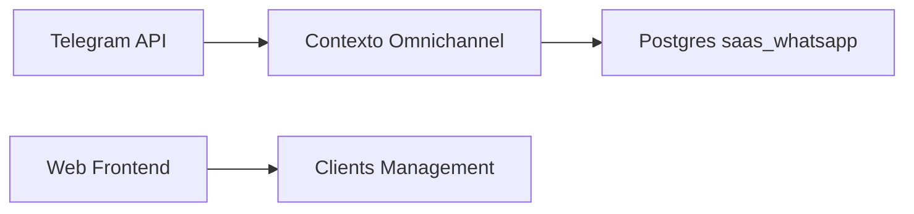
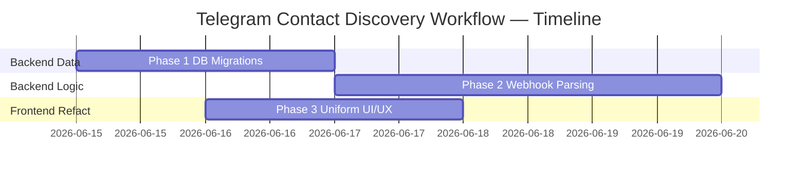

# TP-00004 — �� Telegram Contact Discovery 

**Document ID:** `TP-00004`  

**Project:** Contador Fiscal Inteligente
**Date:** 2026-06-14 (v1.0)
**Status:** Accepted
**Author:** @AgentOrchestrator

**References:**
[ADR-0004](../../backend/docs/adrs/ADR-0004-whatsapp-integration-architecture.md) ·
[ADR-0016](../../backend/docs/adrs/ADR-0016-infrastructure-environment-provisioning.md) ·
[REQ-00007](../../product/requirements/REQ-00007-telegram-contact-discovery-authorization.md) ·
[REQ-00001](../../product/requirements/REQ-00001-whatsapp-business-integration.md)

---

# 1. Overview

Este plano define as atividades coordenadas para a implementação do fluxo de descoberta e autorização automática de contatos no canal Telegram (Contact Discovery). O objetivo é unificar a interface do administrador para exigir apenas o cadastro do número de celular, transferindo a complexidade da captura do *Telegram Chat ID* para o bot nativo através da funcionalidade `request_contact`. 
A execução passará por 3 fases, garantindo alterações graduais no banco de dados, no módulo *omnichannel* do backend e ajustes pontuais de UI no frontend.

---

# 2. Execution Tracking Matrix

> **Legend:** ⬜ Pending · 🔄 In Progress · ✅ Done · ⏸️ Blocked · ❌ Cancelled

## Phase 1 — Database & Persistence 

| # | Activity | Agent | Status | Notes |
|---|---|---|:---:|---|
| 1.1 | Implementar Flyway migration (VX__add_pending_links.sql) para criar tabela `pending_telegram_links` | @ImplementerCore | ⬜ | Requer suporte a TTL / Índices de status |
| 1.2 | Atualizar a Entity `AccessValidation` permitindo `telegram_chat_id` como opcional e implementando busca reversa | @ImplementerCore | ⬜ | Depends on 1.1 |
| 1.3 | Criar Port e Adapter (Repository) para a nova tabela `pending_telegram_links` com cache para checagens rápidas | @AdapterDev | ⬜ | Depends on 1.2 |

## Phase 2 — Omnichannel Domain (Inbound & Outbound)

| # | Activity | Agent | Status | Notes |
|---|---|---|:---:|---|
| 2.1 | Refatorar `TelegramPayloadParser` para decodificar e processar payloads de `message.contact` | @AdapterDev | ⬜ | Cria instrução `CONTACT_SHARED` |
| 2.2 | Implementar envio outbound de Request Contact (`ReplyKeyboardMarkup`) no `TelegramMessageAdapter` | @AdapterDev | ⬜ | Deve ser invocado caso o chat_id não passe na validação |
| 2.3 | Desenvolver o `ContactDiscoveryDomainService` (lógica agnóstica de vinculação ou rejeição por telefone cruzado) | @ImplementerCore | ⬜ | Depends on 1.3 & 2.1 |
| 2.4 | Ajustar `ProcessIncomingMessageUseCase` e `ValidateAccessUseCase` para interceptar chat_ids desconhecidos e injetar o fluxo de Discovery | @ImplementerCore | ⬜ | Depends on 2.2 & 2.3 |

## Phase 3 — Frontend UI & Experience Uniformity

| # | Activity | Agent | Status | Notes |
|---|---|---|:---:|---|
| 3.1 | Remover campo fallback de "Telegram ID" da UI `AddContactModal.tsx` | @FrontendReact | ⬜ | Cadastro usará componente único de celular com máscara |
| 3.2 | Ajustar tipagens e _serializers_ de envio de formulário para omitir o Chat ID na API de clients | @FrontendReact | ⬜ | Ensures API compliance |
| 3.3 | Adicionar indicador visual de status "Pendente" ou "Vinculado" no `AuthorizedContactList` | @FrontendReact | ⬜ | |
| 3.4 | Testes Unitários e Integrados cobrindo parseamento E.164 e cenários de vinculação negada e autorizada no backend | @TestAutomator | ⬜ | Depends on Phase 2 e 3 |

## Summary

| Phase | Total Activities | ⬜ Pending | 🔄 In Progress | ✅ Done | Progress |
|---|:---:|:---:|:---:|:---:|---|
| **Phase 1 — Persistence** | 3 | 3 | 0 | 0 | 0% |
| **Phase 2 — Omnichannel Domain** | 4 | 4 | 0 | 0 | 0% |
| **Phase 3 — UI & Uniformity** | 4 | 4 | 0 | 0 | 0% |
| **TOTAL** | **11** | **11** | **0** | **0** | **0%** |

---

# 3. Context and Constraints

- **Restrições da Bot API**: O payload `request_contact` só pode ser solicitado após o usuário enviar enviar de forma inicial ativa ("start"). Bots não instigam conversa no Telegram por número.
- **Normalização de Strings**: As comparações de busca no serviço de domínio utilizarão puramente o formato algorítmico E.164 normalizado, omitindo eventuais "+", parênteses e traços.

## Bounded Contexts / Modules

---

# 4. Phase Details

## Phase 1 — Database & Persistence 

> Objective: Estabelecer a infraestrutura de dados para registrar transições temporárias garantindo o mapeamento idempotente e seguro das requisições.

### 1.1 Persistência e Repositórios
| # | Activity | Agent | Dep. | Deliverable |
|---|---|---|---|---|
| 1.1 | Flyway migration `pending_telegram_links` | @ImplementerCore | — | Migration `.sql` |
| 1.2 | Atualizar `AccessValidation` mapping | @ImplementerCore | 1.1 | JpaEntities Code |
| 1.3 | Repository Patterns | @AdapterDev | 1.2 | Adapters JpaRepository para uso no Core |

**Acceptance Criteria:**
- Testes ArchUnit apontam ausência de dependências Framework no Domain.
- As migrations conectam de forma transacional sem SideEffects.

## Phase 2 — Omnichannel Domain

> Objective: Orquestrar e interceptar mensagens oriundas de IDs desconhecidos que pertencem à infraestrutura do Bot, efetuando o cruzamento E.164.

### 2.0 Webhook Traffic & Dispatcher
| # | Activity | Agent | Dep. | Deliverable |
|---|---|---|---|---|
| 2.1 | Payload Parser de \`contact\` | @AdapterDev | — | Retorno de Command `CONTACT_SHARED` |
| 2.2 | Adapter Bot API: Send KeyboardContactRequest | @AdapterDev | — | Outbound Http Request via RestTemplate/WebClient |
| 2.3 | Domain Service: `ContactDiscoveryDomainService` | @ImplementerCore | 1.3 | Função com lógica Pure-Java que valida o \`access_validations\` vs Payload extraído. |
| 2.4 | Update `ProcessIncomingMessage` UseCase | @ImplementerCore | 2.3 | Redirecionamento da state-machine do chatbot. |

**Acceptance Criteria:**
- Validações de payload são efetuadas imediatamente e retornam 200 pro Telegram, despachando eventos assíncronos.
- Mensagens sem verificação ou em janela posterior a expiração de 24 horas (`AWAITING_CONTACT`) são re-solicitadas até threshold delimitado em REQ.

## Phase 3 — Frontend UI & Experience Uniformity

> Objective: Modernizar a UI, extirpando conceitos técnicos ("Telegram Chat IDs") e garantindo a paridade para o cliente-admin. O admin verá que um celular foi liberado, porem a "conversa" via Telegram ainda está pendente de associação.

### 3.0 Formulários e Listagem
| # | Activity | Agent | Dep. | Deliverable |
|---|---|---|---|---|
| 3.1 | Refatorar `AddContactModal` Zod Schema | @FrontendReact | — | Extinção de input secundário, preservando `Channel` e mascarando `PhoneInput` para ambos |
| 3.2 | Adapter Frontend de Comunicação (Fetch/GQL) | @FrontendReact | 3.1 | Payload envia Phone em vez de TelegramID |
| 3.3 | Display de Badge/Status `AuthorizedContactList.tsx` | @FrontendReact | — | Componentes React de UI alertando ("Vinculado", "Pendente") na listagem do Documento |
| 3.4 | Testes Regressivos / CI | @TestAutomator | 2.4 | Cobertura total > 80% para novas ramificações E.164. |

---

# 5. Dependency Diagram

---

# 6. Verification

## Automated Tests
- `./mvnw clean test` — Executar testes em Java Validando isolamento transacional
- Unidade no Node `npm run test` com validações no formulário `Zod`.

## Manual Verification
- Abertura de terminal com `./ngrok http` interceptando logs do Bot, enviar mensagem do celular
- Excepcionar o *Compartilhar Telefone* para validar auto-inserção de ID
- Check visual do Admin Panel sobre a troca de ícones.

---

# 7. Change Log

| Version | Date | Author | Changes |
|---|---|---|---|
| 1.0 | 2026-06-14 | @AgentOrchestrator | Initial version and workflow definition |
