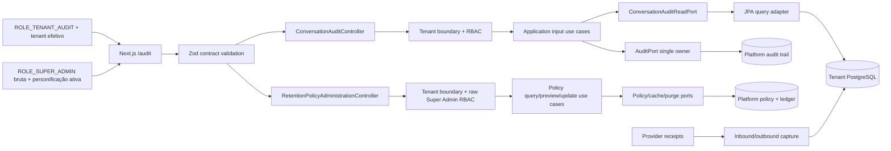
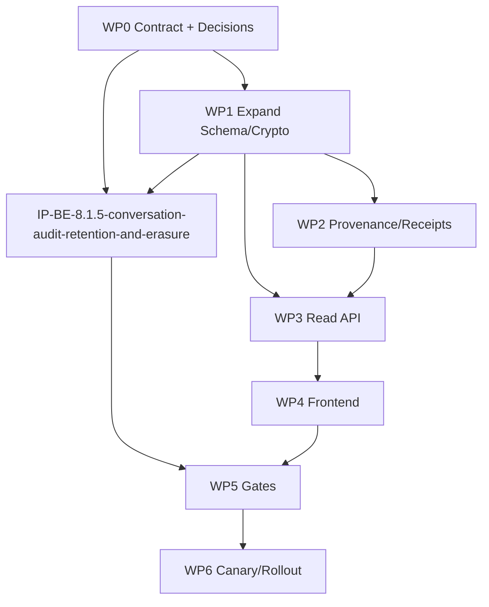

# TP-00008 — Chatbot Conversation Audit Implementation Plan

**Document ID:** `TP-00008`  

**File Path:** `/docs/delivery/plans/TP-00008-chatbot-conversation-audit-implementation-plan.md`

> [!IMPORTANT]
> Este artefato foi criado como especificação futura. Em 2026-08-18, a solicitação explícita para criar seus planos filhos e implementar a capacidade forneceu a autorização separada prevista no REQ-00041/UC-00035. A execução permanece subordinada ao lifecycle: documentação e contrato antes do backend; wireframe aprovado antes do frontend; decisões externas antes de dados reais/go-live.

---

## 1. Plan Metadata

| Field | Value |
|---|---|
| **Plan ID** | `TP-00008-chatbot-conversation-audit-implementation-plan` |
| **Title** | `Auditoria Operacional de Conversas do Chatbot por Tenant` |
| **Date** | `2026-08-18` |
| **Version** | `v1.130` |
| **Last Reconciled** | `2026-09-12 — BE-RET-009A v1.2 repository-local/focused complete` |
| **Status** | `🟡 In Progress — F-AUDRET-001/003 local/DEV completas; F-AUDRET-002/004 parciais nos hardenings duráveis` |
| **Scope Type** | `Cross-stack: Backend + Frontend + Data + Security + Observability` |
| **Business Role** | `Tenant Conversation Auditor` para leitura e `Super Administrator` bruto sob personificação ativa para política de retenção; capabilities independentes |
| **Primary Requirement** | [REQ-00041](../../product/requirements/REQ-00041-chatbot-conversation-audit.md) |
| **Primary Use Case** | [UC-00035](../../product/use-cases/UC-00035-chatbot-conversation-audit.md) |
| **Business Context** | [Contador Fiscal Inteligente](../../product/business/product-vision.md) |
| **Adherence Analysis** | [ANL-00041 — aderência ao REQ-00041](../../analysis/ANL-00041-req-adherence-analysis.md) |
| **Security Baseline** | [RPT-0004](../reports/RPT-0004-frontend-backend-cibersecurity.md) e [TP-00006](TP-00006-frontend-backend-cibersecurity-implementation-plan.md) |
| **Suggested Owners** | `@AgentOrchestrator`, `@ImplementerCore`, `@AdapterDev`, `@FrontendWeb`, `@UIIntegrator`, `@SecurityAgent`, `@TestAutomator`, `@ComplianceAgent`, `@ObservabilityDev` |

### 1.1 Matrix and Counting Rule

Este plano é uma evolução cross-stack das capacidades já catalogadas, especialmente backend `3.1.13` e frontend `3.8.2`, `3.8.6`, `3.8.7`, `5.1.2` e `5.1.3`. Ele funciona como plano integrador e **não cria uma nova folha no denominador** das matrizes nesta entrega documental.

Os critérios abaixo não podem ser usados para promover atividades existentes antes da execução e da coleta de evidência. A autorização existe, mas cada item permanece pendente até sua evidência real; `In Progress` não equivale a `Done`.

### 1.2 Normative Precedence

1. [REQ-00043 v1.33](../../product/requirements/REQ-00043-conversation-audit-data-governance.md) é a fonte única para retenção, anonimização, backup, receipts, dataset/SLO e aplicação multiambiente; v1.33 registra a reconciliação 009A commit-safe concluída, preserva Super Admin personificado, `1..180` e V92 separada.
2. [REQ-00041 v1.74](../../product/requirements/REQ-00041-chatbot-conversation-audit.md) define o restante do contrato, regras e critérios normativos desta evolução.
3. [UC-00035 v1.54](../../product/use-cases/UC-00035-chatbot-conversation-audit.md) define o fluxo do ator e suas exceções.
4. Este plano define sequência, arquivos, gates, rollout e rollback.
5. [REQ-00036](../../product/requirements/REQ-00036-phase3-omnichannel-administration-and-channels.md) e [UC-00033](../../product/use-cases/UC-00033-phase3-omnichannel-administration-and-channels.md) permanecem evidência fiel do baseline AS-IS.
6. O [RPT-0004](../reports/RPT-0004-frontend-backend-cibersecurity.md) prevalece para controles de segurança já aprovados.

### 1.3 Child Implementation Plan Index

| Order | Plan | Scope | Repository implementation | External evidence / release |
|---:|---|---|:---:|---|
| 1 | [IP-BE-8.1.1-conversation-audit-contract-and-baseline Contract and Baseline](../../backend/docs/specs/IP-BE-8.1.1-conversation-audit-contract-and-baseline.md) | WP0/OpenAPI/fixtures/legacy snapshots | ✅ v1.7 complete/focused-green | CI observed run, backend-real and release remain open |
| 2 | [IP-BE-8.1.2-conversation-audit-data-protection-and-migration Data Protection and Migration](../../backend/docs/specs/IP-BE-8.1.2-conversation-audit-data-protection-and-migration.md) | WP1/schema/AES/HMAC/backfill/readiness | ✅ v1.27 complete/focused-green | PostgreSQL zero-skip, live backfill/readiness/backup and rollout remain RED |
| 3 | [IP-BE-8.1.3-conversation-audit-message-provenance-and-delivery-evidence Provenance and Delivery Evidence](../../backend/docs/specs/IP-BE-8.1.3-conversation-audit-message-provenance-and-delivery-evidence.md) | WP2/write paths/evidence | ✅ v1.27 corrective source verified/focused-green | PostgreSQL, provider, runtime and release remain RED |
| 4 | [IP-BE-8.1.4-conversation-audit-read-api Read API](../../backend/docs/specs/IP-BE-8.1.4-conversation-audit-read-api.md) | WP3/query/API/audit/limits | ✅ v1.12 complete/focused-green | PostgreSQL, readiness, backend-real and rollout remain RED; API off |
| 5 | [IP-BE-8.1.5-conversation-audit-retention-and-erasure Retention and Erasure](../../backend/docs/specs/IP-BE-8.1.5-conversation-audit-retention-and-erasure.md) | WP1/policy/cache/purge/anonymization | ✅ v1.31 complete/focused-green | Ativação destrutiva e evidência externa permanecem separadas; flags off |
| 6 | [IP-FE-8.2.0-conversation-audit-wireframes Wireframes](../../frontend/docs/specs/IP-FE-8.2.0-conversation-audit-wireframes.md) | WP4 visual source of truth | ✅ v1.12 custom-calendar amendment complete | External visual acceptance/release remains separate |
| 7 | [IP-FE-8.2.1-conversation-audit-ui-integration UI Integration](../../frontend/docs/specs/IP-FE-8.2.1-conversation-audit-ui-integration.md) | WP4 React/Zod/MSW/i18n | 🟡 v1.32 In Progress — promoção do calendário canônico | experiência `/audit` anterior segue verde; novo standard compartilhado ainda exige implementação/evidência |
| 8 | [IP-FE-8.2.2-conversation-audit-e2e-accessibility E2E and Accessibility](../../frontend/docs/specs/IP-FE-8.2.2-conversation-audit-e2e-accessibility.md) | WP4/5 frontend assurance | ✅ v1.33 i18n Playwright `3/3` complete | Search `200` remains valid; external CI/release remains open |
| 9 | [IP-BE-8.3.1-conversation-audit-security-and-quality-gates Security and Quality Gates](../../backend/docs/specs/IP-BE-8.3.1-conversation-audit-security-and-quality-gates.md) | WP5 assurance | 🟡 v1.32 startup green; global architecture RED on Billing | PostgreSQL/runtime/DAST/live backup/environment/release remain RED |
| 10 | [IP-BE-8.3.2-conversation-audit-operations-and-rollout Operations and Rollout](../../backend/docs/specs/IP-BE-8.3.2-conversation-audit-operations-and-rollout.md) | WP6/runbooks/canary/rollback | ✅ v1.57 repository operations/local host bootstrap implemented | Real host mutation, persisted runtime/provider/live backup/HML/PRD/canary/release remain RED |
| 11 | [IP-BE-8.3.2.1-conversation-audit-local-activation-and-search-smoke Local Activation and Search Smoke](../../backend/docs/specs/IP-BE-8.3.2.1-conversation-audit-local-activation-and-search-smoke.md) | WP6/DEV activation/backfill/readiness/search | 🟡 v1.24 In Progress — runtime reconciliado | Backend healthy, feature/API true, allowlist unitária e POST anônimo `401`; smoke autenticado aguarda sessão humana |
| 12 | [IP-BE-8.1.6-conversation-audit-retention-policy-administration-api](../../backend/docs/specs/IP-BE-8.1.6-conversation-audit-retention-policy-administration-api.md) | WP1/API de policy, RBAC, `1..180`, V91/normalizador e scheduler | 🟡 v1.27 — F-AUDRET-001/003, `BE-RET-004`, A1/A2 e 009A repository-local/focused complete | `BE-RET-005B+007+009B`, due, PR/global e V92 permanecem separados |
| 13 | [IP-BE-8.1.8-conversation-audit-retention-phase-a-preflight-and-schema](../../backend/docs/specs/IP-BE-8.1.8-conversation-audit-retention-phase-a-preflight-and-schema.md) | `BE-RET-003`: EPP pré-datasource, marker A, V91 e testes | 🟡 v1.5 — implementation repository-local/focused complete | PR gate pending global loop; frontend/OpenAPI N/A, normalizador e V92 fora do handoff |
| 14 | [IP-BE-8.1.9-conversation-audit-retention-phase-a-normalization](../../backend/docs/specs/IP-BE-8.1.9-conversation-audit-retention-phase-a-normalization.md) | `BE-RET-004`: normalizador, máquina do checkpoint, fence preview/PUT e barreira Redis antes de COMPLETE | ✅ v1.2 repository-local/focused complete — focal/QG `56/56`, impactada `99/99`, arquitetura `29/29`, zero skip | PR/global, V92 e purge fora do handoff; packaging regression `29/29` + `3/3` verde |
| 15 | [IP-BE-8.1.10-conversation-audit-retention-eligibility-extraction](../../backend/docs/specs/IP-BE-8.1.10-conversation-audit-retention-eligibility-extraction.md) | `BE-RET-005A1`: extrair eligibility/publication/fence sem mudar purge | ✅ v1.1 repository-local/focused complete; QG `51/51` zero-skip | não inclui counts/token/capacity/idempotência |
| 16 | [IP-BE-8.1.11-conversation-audit-retention-bounded-preview-counts](../../backend/docs/specs/IP-BE-8.1.11-conversation-audit-retention-bounded-preview-counts.md) | `BE-RET-005A2`: snapshot PostgreSQL e counts bounded dos dois datasets | ✅ v1.1 repository-local/focused complete; QG canônico `68/68` zero-skip | token continua transitório; B/007/008/009B permanecem separados |
| 17 | [IP-BE-8.1.12-conversation-audit-retention-capacity-reconciliation](../../backend/docs/specs/IP-BE-8.1.12-conversation-audit-retention-capacity-reconciliation.md) | `BE-RET-009A`: reconciliação bounded dos quatro stores | ✅ v1.2 repository-local/focused complete; QG canônico `70/70` zero-skip | N/N+1, writers, cleanup e capability positiva permanecem em 009B/011 |
| 18 | [IP-FE-8.2.3-conversation-audit-retention-policy-tab](../../frontend/docs/specs/IP-FE-8.2.3-conversation-audit-retention-policy-tab.md) | WP4/aba `/audit`, formulário, preview e confirmação | ✅ v1.17 T01A..T06R repository-local complete | T06E continua evidência integrada não executada, sem reabrir o código frontend |

Contracts: [conversation-audit-v1.openapi.yaml](../../contracts/conversation-audit-v1.openapi.yaml) e
[conversation-audit-retention-policy-v1.openapi.yaml](../../contracts/conversation-audit-retention-policy-v1.openapi.yaml).
Provider capability: [evidence matrix](../../architecture/conversation-audit-provider-evidence-matrix.md).

#### 1.3.1 Most recent executable handoff — `BE-RET-003`

O handoff
[IP-BE-8.1.8-conversation-audit-retention-phase-a-preflight-and-schema v1.5](../../backend/docs/specs/IP-BE-8.1.8-conversation-audit-retention-phase-a-preflight-and-schema.md)
concluiu sua implementação repository-local e seus gates focais:
EPP anterior ao datasource, registro `spring.factories`, marker empacotado `A`,
migration estrutural V91, packaging pós-package e regressão platform decomposta.
Packaging EPP `29/29` + PackagingIT `3/3` uma vez, Phase A `3/3`, platform `7/7`,
arquitetura `29/29` e Quality Gate focused `39/39` passaram sem falha, erro ou
skip. A tentativa sandbox com dez skips foi descartada e o PR gate agregado
permanece pendente no loop global. Normalizador/cache, hardenings HTTP, V92,
frontend, OpenAPI, ambientes externos e purge não foram autorizados por esse gate.
O forward fix Billing V90.1, fora desses treze paths, já satisfez a dependência de
ordenação com PostgreSQL 16 `22/22`, zero falha, erro ou skip; V91 permanece o
primeiro ID da retenção já materializado, e V92 continua reservado exclusivamente
para a Phase B posterior.

#### 1.3.2 Most recent completed handoff — `BE-RET-004`

O plano atômico
[IP-BE-8.1.9-conversation-audit-retention-phase-a-normalization v1.2](../../backend/docs/specs/IP-BE-8.1.9-conversation-audit-retention-phase-a-normalization.md)
está implementation-complete no recorte repository-local/focado. O
resultado inseparável é NORMALIZE→VERIFY→barreira Redis confirmada→`COMPLETE`, com
bootstrap regular/cache/capability/purge fechados, preview/PUT em 503 pré-efeito e
preservação da exceção segura insert-only/GET durável sem cache. V92/BE-RET-014,
POM, `application.yml`, V91, EPP e marker não pertencem ao handoff. Focal e Quality
Gate focused `56/56`, impactada `99/99` e arquitetura `29/29` passaram sem
falha/erro/skip; a regressão de packaging permaneceu verde em EPP `29/29` +
PackagingIT `3/3`, também sem skip. PR/global e externalidades não foram promovidos.

#### 1.3.3 Most recent completed handoff — `BE-RET-005A2`

O amplo `BE-RET-005` não é atômico no código corrente: V91 semeia a capacity
`PREVIEW` como `SUSPECT` e o PUT baseline ainda consome token bruto em memória.
O [IP-BE-8.1.10-conversation-audit-retention-eligibility-extraction v1.1](../../backend/docs/specs/IP-BE-8.1.10-conversation-audit-retention-eligibility-extraction.md)
concluiu A1 com Quality Gate `51/51` zero-skip e revisão independente sem findings.
O [IP-BE-8.1.11-conversation-audit-retention-bounded-preview-counts v1.1](../../backend/docs/specs/IP-BE-8.1.11-conversation-audit-retention-bounded-preview-counts.md)
concluiu A2: callback transacional extensível, clock/policy snapshot PostgreSQL e
counts bounded dos dois datasets. Focal `24/24`, impactada `15/15`, arquitetura
`29/29` e Quality Gate canônico `68/68` passaram zero-skip em PostgreSQL `16.14`,
e a revisão independente terminou `PASS`. Token continua transitório;
durabilidade/consumo/admission/cleanup ficam em `BE-RET-005B+007+009B`, com o
limiter BE-RET-008 posterior.

#### 1.3.4 Most recent completed handoff — `BE-RET-009A`

O [IP-BE-8.1.12-conversation-audit-retention-capacity-reconciliation v1.2](../../backend/docs/specs/IP-BE-8.1.12-conversation-audit-retention-capacity-reconciliation.md)
concluiu a reconciliação bounded dos quatro stores V91 nos mesmos 11 paths. Focal
`11/11`, PostgreSQL `12/12`, impactada `18/18`, arquitetura `29/29` e Quality
Gate canônico `70/70` passaram zero-skip em PostgreSQL `16.14`. Nova passagem usa
capacity-first, fence `SHARE`, watermark em `READ COMMITTED` e rollback integral
por timeout, incluindo a corrida entre sequência menor não committed e maior
committed. O source corrente possui zero writer runtime nesses stores, portanto o
slice segue independente de A2; 009B deve adotar capacity→entry antes de introduzir
writers. Não recebe crédito por N/N+1, insert/delete, cleanup ou capability
positiva; as quatro gauges permanecem em `0` e due continua negativa até
`BE-RET-011`.

### 1.4 Current Status and Pending Work by Phase

Esta seção é o resumo autoritativo de acompanhamento do TP-00008. Os checklists detalhados dos WPs descrevem o Definition of Done completo e não devem ser contados diretamente como progresso, pois possuem granularidades diferentes e incluem gates externos.

**Legend:** a coluna de implementação mede somente artefatos versionados; a coluna de lifecycle
mede evidência observada em infraestrutura/ambiente e autorização de release. ✅ em implementação
não promove um gate 🔴 de lifecycle.

| Phase / Work Package | Child Plans | Repository implementation | Lifecycle evidence | Evidence already available | What remains pending |
|---|---|:---:|:---:|---|---|
| **Phase 0 — Contract and baseline (WP0)** | `8.1.1` | ✅ complete | 🟡 open | OpenAPI, DTOs Java, seis golden fixtures, Zod/TypeScript/MSW, gate Java↔golden↔OpenAPI e snapshots legados materializados | execução observada em CI, inspeção de artifacts e sign-offs de release |
| **Phase 1 — Data protection, retention and migration (WP1)** | `8.1.2`, `8.1.5`, `8.1.6`, slices `8.1.7`/`8.1.8`/`8.1.9`/`8.1.10`/`8.1.11`/`8.1.12` | 🟡 partial | 🟡 DEV partial | Motor/cache/purges, GET/RBAC/default/CORS, rotas baseline, A2 snapshot/counts e 009A capacity reconciliation estão materializados e testados; BE-RET-003/004/A1/A2/009A concluíram gates focais zero-skip | Implementar `BE-RET-005B+007+009B`, limiter, fila due/coalescing, PR gate agregado e futura Phase B/V92 |
| **Phase 2 — Provenance and delivery evidence (WP2)** | `8.1.3` | ✅ complete | 🔴 RED | Writers, V40/V41/V60/V63, receipts, callback same-generation, fencing e executores bounded estão materializados e focais verdes | PostgreSQL zero-skip, provider/fault injection, rotação e publications Modulith em runtime autorizado |
| **Phase 3 — Read API (WP3)** | `8.1.4` | ✅ complete | 🟡 DEV partial | API/read model/RBAC Audit, PostgreSQL A×B `2/2`, query plan milissegundos, readiness viva e busca backend-real `200` | dataset/p95 oficial, matriz backend-real detail/reveal, HML/PRD e release |
| **Phase 4 — Frontend and accessibility (WP4)** | `8.2.0`, `8.2.1`, `8.2.2`, `8.2.3` | 🟡 partial pelo `8.2.1`; retenção complete | 🟡 DEV partial | Retenção T01A–T06R, formulário, service, preview/confirm, estados, MSW, Playwright e build estão repository-local complete | Evolução canônica de calendário do `8.2.1` e evidência integrada T06E/CI/HML/PRD; nenhum gap de código da policy frontend |
| **Phase 5 — Security and quality gates (WP5)** | `8.3.1`, assurance `8.2.2` | 🟡 reopened | 🔴 RED | Startup: focal `8/8` e contexto isolado `1/1`; correção verificada | resolver violações arquiteturais Billing fora deste recorte; depois DAST/HML/sign-offs |
| **Phase 6 — Operations and rollout (WP6)** | `8.3.2`, `8.3.2.1` | ✅ complete | 🟡 DEV partial | Ativação/backfill/readiness, seletor explícito multi-tenant, rebuild e busca backend-real `200` concluídos em DEV | Keycloak provisioner drift, HML/PRD, canary e release governado |

#### 1.4.1 Informative Counts

| View | Repository implementation complete | Lifecycle/release complete | External evidence open |
|---|---:|---:|---:|
| **7 work packages/phases** | **4/7** | **0/7** | **7/7** |
| **14 child plans** | **12/14** | **0/14** | **14/14** |

Estas contagens são inventário de lifecycle, não percentual das matrizes 001/002. O TP-00008 permanece integrador e não adiciona atividade ao denominador.

#### 1.4.2 Operational Evidence Closure Order

1. Concluir o bootstrap canônico do host pelo
   [TP-00019](TP-00019-local-development-host-bootstrap.md), sem username/path
   hardcoded nem fallback sudo nos entrypoints; comprovar `docker info` em sessão
   nova e então executar o gate canônico das 18 classes/XMLs PostgreSQL com zero
   skip.
2. Preservar os gates Keycloak v2.6.1 verdes e executar em ambiente autorizado a reconciliação
   idempotente de volume, atribuição, invalidação e token/sessão novos.
3. Manter API/flags default-off e executar Flyway, backfill bounded, fingerprint, readiness dos
   cinco riscos, query plan/p95 e purges dry-run/hold/atomicidade com restore comprovado.
4. Executar provider/fault injection, exactly-once/fencing/timeline accountability, rotação e
   publicações Modulith sem transformar `UNKNOWN` simulado em receipt real.
5. Executar full backend/arquitetura no runner oficial e smoke backend-real A×B autenticado.
6. Executar frontend contra backend/IdP reais sem MSW, pipeline remota e revisão PII dos artifacts.
7. Executar dataset/SLO oficial, DAST/HML, backup/restore live, scrape/firing, canary e rollback
   antes de qualquer exposição além do default-off.

#### 1.4.3 Docs-first final local blocker freeze — 2026-08-23

Antes do próximo patch executável, o IP-BE-8.3.2-conversation-audit-operations-and-rollout v1.35 e o runbook v1.40 congelam dois blockers:

1. `.env.dev.local` novo/legado deve materializar/reparar atomicamente as seis configurações bounded
   dos executores inbound (2/4/100), preservar valores não vazios, falhar em duplicidade e manter
   `0600` antes do Compose;
2. o manifesto de retirement outbound-HMAC deve ser capturado uma única vez; validação, conjunto,
   evidências, `approvalId`, one-shot, pending e estado usam o mesmo snapshot privado, com teste
   adversarial de troca do bind vivo.

Ambos estão **FROZEN / PENDING IMPLEMENTATION / PENDING EVIDENCE**. Nenhuma flag ou ambiente foi
promovido por esta decisão.

#### 1.4.4 Post-freeze local blocker evidence — 2026-08-23

Depois do registro acima, ambos foram implementados. O teste lifecycle troca o manifesto A por B
após o snapshot e prova que approval/tombstone/state consomem A; o teste do bootstrap cobre arquivo
novo e legado, defaults `2/4/100`, preservação/reparo, duplicidade fail-closed e modo `0600`.
Lifecycle, bootstrap, sintaxe e diff passaram localmente. Compose/runtime vivo, drill e todos os
gates externos permanecem RED; flags continuam off.

#### 1.4.5 Docs-first HML/PRD keyring activation freeze — 2026-08-23

A auditoria independente constatou que o backend carrega o keyring outbound-HMAC no startup. DEV
já recria containers, mas HML e PRD poderiam concluir o initializer e manter um backend existente
com a geração anterior em memória. O IP-BE-8.3.2-conversation-audit-operations-and-rollout v1.38 e
o runbook v1.43 congelam, antes do código, a ordem boundary fail-closed → initializer → backend
`--force-recreate` → health → frontend/proxy/restantes. PRD deve separar backend e frontend; HML
deve usar entrypoint versionado. Falha entre instalação e health deve parar backend/proxy antigos,
impedindo serviço com a geração anterior. Estado: **FROZEN / PENDING IMPLEMENTATION / PENDING EVIDENCE**.
Nenhum ambiente externo foi acessado e todas as flags continuam off.

#### 1.4.6 Post-freeze HML/PRD keyring activation evidence — 2026-08-23

PRD agora marca o boundary antes do initializer, força a recriação isolada do backend, espera health
e só então sobe frontend. HML ganhou entrypoint versionado com env-file owner-only, a mesma ordem e
trap fail-closed. Em ambos, falha antes do backend saudável para proxy/backend antigos e não religa
writer stale. Sintaxe, regressão fake-Docker HML e gate PRD/Compose passaram; o último precisou sair
do sandbox somente para o snap renderizar arquivos versionados com exemplo. Nenhum `up`, `run`,
HML, PRD, secret ou dado real foi acessado. Drill vivo, gate humano e release continuam RED.

#### 1.4.7 Docs-first local host bootstrap replacement — 2026-08-25

Antes do patch executável, o REQ-00045, ANL-00046 e TP-00019 substituem a
correção manual tardia pelo bootstrap geral do host DEV. A identidade deve ser
explícita, o grupo `docker` é tratado como root-equivalent, a associação é
aditiva/idempotente e a pós-condição ocorre em sessão nova. `start-dev-*`, stop e
reset não podem usar `sudo docker compose`; `chmod 666`, socket owner/ACL, sudoers
e migração Snap também permanecem proibidos. Estado: **FROZEN / IMPLEMENTATION IN
PROGRESS / LIVE EXECUTION NOT AUTHORIZED**.

#### 1.4.8 Post-implementation local host bootstrap evidence — 2026-08-25

O freeze de §1.4.7 foi implementado. O bootstrap canônico é root-only, recebe
identidade e opt-in explícitos, valida host/daemon/socket antes da associação,
serializa a transação e comprova acesso em sessão nova. Falha posterior ou
`usermod` parcialmente aplicado remove apenas a associação criada nesta execução.
Os cinco entrypoints, health check e recovery Keycloak local usam preflight
direto compartilhado e não elevam Docker.

Passaram testes herméticos do bootstrap/start/reset e hardening Keycloak,
sintaxe, executable bits, scan dos sete caminhos governados, seleção CI e Compose
base+DEV com configuração dummy.
`shellcheck` ficou SKIP por indisponibilidade do binário. Nenhuma mutação real de
grupo/host ou runtime Docker ocorreu. Estado: **REPOSITORY IMPLEMENTED / LOCAL
GATES GREEN / REAL HOST NOT EXECUTED**.
O review final corrigiu docs-first os três contadores do health check para não
abortar sob `set -e`; a regressão focal também está verde.

### 1.5 Docs-first Corrective Freeze — `/audit` and Backend-real (2026-08-20)

Esta decisão precede qualquer alteração executável da nova correção:

1. `/audit` e `/audit/{conversationId}` são os únicos paths canônicos da Auditoria de Conversas.
2. `/inbox` e `/inbox/{conversationId}` permanecem temporariamente apenas como redirect HTTP `307`
   same-origin para o correspondente `/audit`, sob a mesma autenticação, RBAC e `no-store`. O
   redirect preserva somente o path seguro, descarta query/fragment, não renderiza UI e será
   removido após telemetria sanitizada demonstrar ausência de uso na janela aprovada.
3. `/index` não existe no baseline e não será criado como rota ou alias.
4. `paths`, menu, protected routes, labels/breadcrumbs, return-to e testes devem mudar juntos; todo
   novo builder/link produz somente `/audit`.
5. MSW permanece opt-in exclusivo de desenvolvimento. Com `NEXT_PUBLIC_ENABLE_MSW=false` ou
   ausente, o frontend implantado usa `NEXT_PUBLIC_API_BASE_URL` e IdP/Keycloak reais, envia JWT e
   tenant efetivo e nunca faz fallback para handler, fixture ou identidade mock.
6. Backend-real só passa com identidades sintéticas A/B, sentinela cross-tenant, requests reais de
   lista/detalhe/timeline e reveal autorizado, contratos Zod válidos, zero failures/errors/skips e
   artifacts sem PII. Ausência de ambiente é **NOT EXECUTED**, não PASS.

O checkpoint `/inbox` de 2026-08-18 permanece evidência histórica pre-rename. Esta seção não
promove backend-real, coverage, CI ou release, e todos os switches backend/readiness continuam
default-off fora do ambiente autorizado.

Depois desse registro, a fatia de rota foi implementada localmente. Focused Vitest passou `8`
arquivos/`68` testes. O primeiro full de `96` arquivos/`502` testes teve dois timeouts sob carga; os
dois arquivos afetados passaram `11/11` isoladamente e o rerun controlado com `--maxWorkers=4`
passou `96/502`, com zero falhas e sem skips reportados. TypeScript, lint amplo de `src`, `e2e` e
`next.config.ts`, e build de produção passaram; o build gerou `39` rotas com `/audit`,
`/audit/[conversationId]` e wrappers `/inbox`. Playwright Chrome passou o cenário dirigido `1/1` e
o full `54/54` (`18` cenários × três viewports), com zero falhas. Backend-real/IdP real permanece
**NOT EXECUTED** e nenhum gate de release é promovido.

### 1.6 Docs-first Corrective Freeze — `DD/MM/AAAA` and Timezone Copy (2026-08-20)

Esta decisão foi registrada depois da evidência de rota e antes de qualquer código da nova
correção de apresentação:

1. Os campos `De` e `Até` exibem e aceitam somente `DD/MM/AAAA`, com dois dígitos por segmento e
   validação de data civil real.
2. O comportamento é determinístico mesmo sob locale `en-US` ou outro locale do browser; não pode
   depender apenas de `input type=date`, placeholder ou renderização regional nativa.
3. `De` mapeia exclusivamente para `from` e `Até` para `to`; o parser/formatter visível converte
   para o estado já existente sem inverter os limites.
4. A mudança preserva o contrato da API e a semântica interna já congelada: instantes ISO/UTC,
   limites inclusivos do dia e cálculos em `America/Sao_Paulo` não mudam.
5. A frase visível `Datas e horários em America/Sao_Paulo` deve ser removida do conteúdo e da
   árvore acessível; nenhuma copy substituta deve expor o timezone configurado nessa página.
6. Antes de reconciliação pós-implementação, os gates devem cobrir parser/formatter unitário,
   componente de filtros, request mapping, locale divergente, datas inválidas e E2E responsivo,
   além de provar a ausência da copy. Resultados anteriores permanecem históricos e não satisfazem
   estes novos asserts.

O escopo é frontend/documentação/testes. Não há mudança de endpoint, schema, backend, regra de
timezone ou payload; backend-real e todos os blockers de release permanecem no estado anterior.

### 1.7 Recorded Checkpoint — Post-date/copy Amendment (2026-08-20)

Depois do freeze §1.6, a correção foi implementada localmente:

- `ConversationAuditDateInput` combina campo textual controlado `DD/MM/AAAA` com picker nativo
  separado e acessível; máscara/parser civil estritos rejeitam valor incompleto ou impossível;
- defaults permanecem dia/mês e o builder preserva os limites e o payload ISO/UTC existentes;
- lista, detalhe e catálogos deixaram de renderizar a copy do timezone; os cálculos internos em
  `America/Sao_Paulo` não mudaram;
- o primeiro focused executou `34` testes com `33` passes e uma falha de foco. Após a correção, o
  arquivo de filtros passou `9/9` isoladamente; focused final e rerun pela raiz passaram `5`
  arquivos/`34` testes;
- `npx tsc --noEmit`, ESLint exato e amplo (`src e2e next.config.ts`), Prettier e diff-check
  passaram;
- Playwright Chrome dirigido passou `3/3` em desktop, mobile-320 e tablet-768, provando defaults
  `DD/MM`, payload ISO, `31/02` sem request e ausência da copy;
- o full Vitest controlado passou `96` arquivos/`511` testes, zero falhas e sem skips reportados;
  o build de produção passou com `39` rotas.

Esse checkpoint satisfaz localmente `FR-AUD-033–034`, `BR-AUD-040` e `AC-AUD-051–052`. Não fecha
backend-real, cobertura global, CI, runtime inglês, gates backend/PostgreSQL/provider nem release;
todos os switches permanecem default-off.

### 1.8 Docs-first Freeze — Strictly Local Activation, Backfill and Readiness (2026-08-21)

Esta decisão foi registrada antes de qualquer mutação de runtime decorrente da autorização
explícita do solicitante para fazer a consulta local funcionar:

1. o alvo é exclusivamente o Docker Compose da workstation atual e um único tenant piloto
   resolvido do contexto autenticado local; HML, PRD, hosts remotos, importação de dados e expansão
   de allowlist não estão autorizados;
2. antes de qualquer smoke, o schema frontend de `tenantId` no path deve ser separado do schema
   UUID estrito dos recursos: aceitar somente UUID textual canônico PostgreSQL em `8-4-4-4-12`
   hexadecimal, normalizar lowercase e permitir o legado sintético/local sem version nibble RFC.
   Malformed falha antes do fetch; `conversationId`, `messageId`, `errorId` e demais IDs continuam
   estritos. O UUID concreto não entra em documentação/evidência;
3. antes de migration, writer, backfill ou mudança de flag, deve existir backup local cifrado,
   owner-only, fora do Git, com restauração isolada verificada; falha de backup/restore bloqueia;
4. os keyrings AES do identificador, HMAC do blind index e HMAC das tentativas outbound usam IDs e
   materiais independentes, arquivos fora do repositório, diretório `0700`, arquivos `0600` e
   mounts read-only; segredo, checksum, material e caminho efetivo não entram em evidência;
5. a primeira inicialização usa proteção ligada e API desligada. Allowlist começa vazia;
   reconciliation outbound e detector terminal V41 permanecem desligados, sem provider call;
6. legacy read só pode ficar ligado durante a janela bounded necessária. O backfill inicia
   desligado e, quando habilitado, executa lotes supervisionados de no máximo `50` linhas e uma
   unidade por invocação, sem scan/startup implícito nem recriptografia de ciphertext conforme;
7. API continua desligada até a verificação independente registrar separadamente
   `eligible_plaintext=0`, `missing_or_invalid_hash=0`, `unknown_key_id=0`,
   `missing_or_stale_attestation=0` e `pending_activity=0`, além de `failed=0`; cursor concluído ou
   `remaining=0` isolado não basta;
8. depois do zero-risk de plaintext, somente legacy read volta a `false`; backfill permanece
   `50 x 1` até readiness pronta e cinco zeros sob o fingerprint definitivo;
9. somente então backfill volta a `false`; uma nova inicialização/API-off precisa manter a
   readiness e o live stale-marker check verdes;
10. depois desse gate, a allowlist recebe exatamente o UUID do tenant piloto e a API pode ser ligada.
   RBAC, tenant context, `no-store`, rate limit e readiness continuam cumulativos;
11. o smoke backend-real não registra response body. Ele verifica apenas status, headers, contrato
    e contagens agregadas para lista/detalhe/timeline/reveal autorizado, mais negação de tenant não
    allowlisted. Deve também provar que o tenant legado sintético/local chega ao `POST` e que um
    tenant malformed faz zero fetch; screenshots, dumps ou logs com identificador/conteúdo são
    proibidos;
12. qualquer falha primeiro desliga API e esvazia allowlist, depois desliga backfill. Migrations e
    ciphertext permanecem forward-only; legacy read não é religado como rollback e nenhum dado é
    revertido para plaintext.

O procedimento completo e seus abort thresholds estão congelados no
[runbook §4.0.2](../../backend/docs/onboarding/conversation-audit-operations-runbook.md). Neste checkpoint, backup,
restore, keyrings, flags, migrations, backfill, readiness, allowlist e smoke permanecem **NOT
EXECUTED**. A compatibilidade `FR-AUD-035`/`BR-AUD-041`/`AC-AUD-053` está **PENDING IMPLEMENTATION
/ PENDING EVIDENCE**. A autorização local não promove `AC-AUD-048`, PostgreSQL oficial, provider,
DAST, HML, retenção, canary, rollback de release ou produção; o release continua RED.

### 1.9 Historical Docs-first Freeze — Dedicated Audit Entitlement and Standalone Journey (2026-08-22)

Esta decisão é anterior a qualquer mudança de código, realm, usuário ou runtime da nova política e
permanece normativa para a consulta de conversas. A emenda posterior da Section 1.56 a supersede
somente quanto ao menu e à raiz exata `/audit`, que se tornam um shell compartilhado por capability:

1. `ROLE_TENANT_AUDIT` é o único entitlement da aba `Conversas`, de `/audit/{conversationId}`,
   dos aliases `/inbox` e dos quatro endpoints de leitura. `ROLE_TENANT_ADMIN`,
   `ROLE_SUPER_ADMIN` e demais roles isoladas são negadas nessas superfícies; nenhuma delas injeta
   ou implica Audit. O menu e a raiz exata `/audit` também aceitam Tenant Admin exclusivamente para
   alcançar a aba de retenção definida na Section 1.56.
2. Audit tenant com tenant claim válido é permitido; Tenant Admin+Audit também é permitido porque
   contém o entitlement explícito. Super Admin+Audit é negado no contexto global e só é permitido
   depois de impersonação explícita de tenant ativo; Super Admin sem Audit segue negado mesmo
   impersonando.
3. O perfil tenant Audit é standalone, convidável/editável e read-only. Ele não recebe gestão de
   usuários/configurações, e a gestão existente deve poder atribuí-lo sem exigir Tenant Admin.
4. Keycloak deve definir e expor Audit ao SPA nos realms admin e tenant e em seus templates. O
   usuário de desenvolvimento `djmarcellopedrosa@gmail.com` recebe explicitamente Super Admin+Audit
   no realm admin, sem tenant claim global; Audit não Super Admin exige tenant claim válido.
5. Login, callback, `/` e return-to escolhem `/audit` como landing segura para o auditor standalone
   sem acesso ao dashboard. Menu/guard/sessão usam a mesma matriz; o shell esconde links proibidos
   e não dispara polling ou requests auxiliares para APIs sem autorização própria.
6. Backend JWT/security chain/controller exigem Audit + tenant efetivo antes de query/reveal. A
   resolução de contexto preserva a role explicitamente emitida, mas nunca a cria a partir de
   Super Admin/Tenant Admin; o contexto global Super Admin+Audit pode autenticar sem `tenant_id`,
   porém não pode usar a API até impersonar.
7. Os gates adicionados devem provar provisionamento/token, login/callback/home, convite/edição,
   menu, lista/detalhe, zero fetch/query nos negados e API A×B para toda a matriz de
   `AC-AUD-054–055`.

Estado desta emenda: **FROZEN / PENDING IMPLEMENTATION / PENDING EVIDENCE**. Checkpoints e
contagens anteriores a 2026-08-22 permanecem históricos e não satisfazem a nova política.

### 1.10 Post-freeze Local Implementation Reconciliation (2026-08-22)

Sem alterar o freeze histórico §1.9, a emenda dedicada foi implementada e recebeu evidência
focada local:

- o backend passou `117/117` testes em snapshot isolado sem Docker;
- o frontend passou `90/90`; TypeScript global, build de `39` rotas e lint/Prettier focal também
  passaram;
- a compatibilidade tenant-path passou o gate dedicado `21/21` sem relaxar IDs de recurso;
- o validador Keycloak e dois testes shell passaram sobre os oito exports/templates versionados.

Assim, `ROLE_TENANT_AUDIT`, o perfil standalone, a landing, o menu/guard, a gestão convidável e a
matriz negativa estão **IMPLEMENTED / FOCUSED-VERIFIED LOCAL**. O Keycloak versionado está
**STATICALLY VERIFIED LOCAL**. O gerador e o contrato owner-only do segredo inicial foram
implementados; a inclusão efetiva no `.env.dev.local` real continua bloqueada junto do volume
persistido, da atribuição viva e de uma sessão nova.

A correção JDBC do backfill usa `Timestamp.from(reconciledLastInteraction)` e está implementada.
O bounded retry, a verificação independente dos cinco riscos, o backend-real autenticado e a
sessão Keycloak persistida permanecem **NOT EXECUTED / BLOCKED BY LOCAL HOST ACCESS**. Readiness
continua falsa, allowlist vazia e API desligada. Nenhum acceptance criterion cross-stack foi
promovido a completo; HML, PRD, canary, go-live e release permanecem **RED / NOT EXECUTED**.

### 1.11 Docs-first Keycloak v2.5 Hardening Freeze (2026-08-22)

Antes de novo patch de script/validator, ADR-0018 v2.5 e os runbooks congelaram quatro controles
cumulativos: Audit non-composite/sem heranca de Tenant Admin ou Super Admin; remocao e verificacao
fail-closed de composite drift; reconciliacao forcada da Service Account para a allowlist minima
sem early-success por `client_credentials`; e inspecao de `tenant_id` tanto em mappers diretos
quanto via client scopes default/optional efetivos.

Os passes do validator e dos dois testes shell em §1.10 continuam evidencia estatica do contrato
v2.4. Eles ainda nao cobrem v2.5, que esta **FROZEN / PENDING IMPLEMENTATION / PENDING EVIDENCE**.
Este novo gate nao altera API off nem autoriza volume/sessao, backend-real, HML ou PRD.

### 1.12 Docs-first Single-tenant Backfill Target Freeze (2026-08-22)

Antes da retomada do runtime, uma revisão somente leitura confirmou que o runner percorre todos os
datasources registrados, embora §1.8 autorize somente um tenant piloto. Fica congelada uma
propriedade própria `APP_CONVERSATION_AUDIT_BACKFILL_TENANT_ID`, obrigatória/canônica/registrada
quando o backfill estiver ativo. A implementação deve resolver apenas esse datasource, manter a
allowlist da API independente e abortar antes de qualquer efeito para alvo ausente, inválido ou
não registrado, sem expor o UUID. O gate A/B prova zero interação fora do alvo.

Estado: **FROZEN / PENDING IMPLEMENTATION / PENDING EVIDENCE**. Backfill/readiness e API continuam
desligados até a implementação e os testes de `AC-AUD-056`.

### 1.13 Docs-first Final-fingerprint Readiness Freeze (2026-08-22)

Como o fingerprint inclui o estado de legacy-read, o passe com legacy ligado não é readiness do
estado definitivo. Depois de plaintext zero, legacy desliga sozinho; backfill e tenant alvo
permanecem ativos em `50 x 1` até a verificação persistir readiness pronta, cinco riscos zero e
`failed=0` sob o fingerprint novo. Só então backfill desliga, ocorre restart/API-off e o live
recheck deve continuar verde. Remover legacy do fingerprint não faz parte desta decisão.

Estado: **FROZEN / PENDING RUNTIME EVIDENCE** (`AC-AUD-057`).

### 1.14 Docs-first Supervised Restart and Timeout Freeze (2026-08-22)

Antes do código/runtime, cada lote passa a exigir um override Compose versionado aplicado por
último, com backend `restart: "no"`, além de timeout `1..300s` aplicado à transação e statements.
Falha/lock timeout reverte sem auto-retry e cada nova invocação é explícita. A policy normal só
retorna depois de backfill off. Actuator readiness é saúde geral e não substitui o gate Audit
durável+live. Estado: **FROZEN / PENDING IMPLEMENTATION / PENDING EVIDENCE**
(`AC-AUD-058–059`).

### 1.15 Docs-first Keycloak v2.6 Corrective Freeze (2026-08-22)

Depois dos testes estaticos v2.5 e antes de novo patch, uma revisao independente tornou
obrigatorios: zero password/secret em `argv` host/container; deteccao fail-closed de pagina
repetida, duplicacao, falta de progresso e limite em toda enumeracao Admin API; prova do conjunto
efetivo exato antes de o init normal declarar ready; e reconciliacao somente de mapper/client scope
gerido e inequivoco, com compartilhamento/origem desconhecida abortando sem remocao ampla.

Estado: **FROZEN / PENDING IMPLEMENTATION / PENDING EVIDENCE**. Os passes v2.5 permanecem
historicos e nao autorizam volume, sessao, backend-real, HML ou PRD.

### 1.16 Post-freeze Local Backfill Guard Reconciliation (2026-08-22)

O target tenant canonico/direto e obrigatório, a ausência de iteração global, o timeout comum de
statement/transação em `1..300s` e o override Compose `restart: "no"` foram implementados depois
dos freezes.
O seletor bounded atual passou `30/30`, incluindo A selecionado/B zero interacao, startup fail-closed,
rollback por timeout, eligibility e protecao; shell e Compose combinado passaram. Os UUIDs nao
entram em erro/log e o binding `Timestamp.from(...)` foi preservado.

As guardas estao **IMPLEMENTED / FOCUSED-VERIFIED LOCAL**. O lote PostgreSQL vivo, cinco riscos,
legacy-off/fingerprint final, readiness, API-on e backend-real continuam **NOT EXECUTED**; a
correção Keycloak v2.6 de §1.15 foi implementada e reconciliada posteriormente como v2.6.1; a
evidência viva continua pendente.

### 1.17 Post-plan Local Implementation-artifact Closure (2026-08-22)

Os contratos preexistentes deste TP foram materializados para os gaps locais restantes:

- snapshots integrais v1 dos dois endpoints legados passaram `7/7`;
- defaults `batch-size=50`/`max-batches-per-run=1` e limites fail-fast `1..50 × exatamente 1`,
  timeout até `300s`, target obrigatório e restart-no foram fixados em código/config;
- harness backend-real tornou ambiente/sessões/sentinela obrigatórios e artefatos PII-free; CI
  rejeita zero testes e nomeia type/lint/build/E2E hermético;
- dataset técnico v1 (`6.000` conversas/`48.092` mensagens, timeline sentinela de `100`) e
  `ConversationAuditPerformancePostgresTest` para queries completas, `EXPLAIN ANALYZE`, índices e
  p95 foram incluídos no checkpoint PostgreSQL histórico de onze classes/XMLs;
- histogramas, dashboard corrente de quatorze painéis, vinte alertas owned e métricas finitas de
  backfill/conflito passaram o teste estrutural.

O seletor misto serial compilou `953` fontes de produção/`365` de teste e terminou em `56 PASS / 2
SKIPPED`; os dois testes de `ConversationAuditPerformancePostgresTest` foram descobertos e pulados
pela indisponibilidade Docker, portanto planner/p95 permanecem **NOT EXECUTED**. O harness
backend-real e a observabilidade estão implementados localmente, mas backend-real, CI remoto,
observabilidade viva,
volume/sessão/readiness, HML/PRD e release continuam RED; API off.

### 1.18 Docs-first Frontend CI Evidence Closure Freeze (2026-08-22)

Antes de alterar scripts, Playwright ou workflows, ficam congelados os dois controles locais ainda
ausentes em `8.2.1`, `8.2.2` e `8.3.1`:

1. os workflows frontend executam `npm run test:coverage` com os quatro thresholds globais de
   `70%` já definidos no standard/Vitest; a falha global permanece RED e não pode ser convertida
   em warning;
2. um gate adicional calcula cobertura somente das linhas executáveis alteradas presentes no
   LCOV e exige `>=70%`; pull request usa base SHA e head SHA explícitos, push usa before/head e
   dispatch usa o pai do HEAD; ref inválida, LCOV ausente/malformado ou fonte coberta ausente
   falham fechado, enquanto diff sem linha executável aplicável registra `N/A` sem falso erro;
3. antes de qualquer upload de `playwright-report`, um scanner sem dependência externa rejeita
   diretório ausente/vazio, symlink, mídia, trace, archive/storage-state, binário, credencial e
   padrões de PII; valores exatos fornecidos por arquivo owner-only também são denylisted e nunca
   aparecem no diagnóstico;
4. trace, screenshot e vídeo do gate Audit hermético ficam desabilitados; o upload só ocorre se o
   scanner passar. Falha de teste ou de scanner não autoriza artifact inseguro.

Estado deste freeze: **FROZEN / PENDING IMPLEMENTATION / PENDING EVIDENCE**. Ele não promove a
cobertura global atual, pipeline remoto, backend-real, runtime `en` ou release.

### 1.19 Post-freeze Frontend CI Evidence Reconciliation (2026-08-22)

Os controles do §1.18 foram implementados sem reduzir thresholds: o script de changed-lines exige
LCOV e refs/diff válidos, o scanner inspeciona inclusive o ZIP base64 interno do relatório HTML, o
Playwright hermético desliga trace/screenshot/video e os workflows condicionam o upload ao scanner
verde. A revisão adversarial acrescentou telefone E.164 BR sem `+`, storage state parcial e mídia
inline; somente os dois assets estáticos do reporter Playwright 1.58.2 com SHA-256 fixo são aceitos,
e qualquer mudança falha fechado. Os dois testes shell autocontidos passaram; o scanner também
aprovou o `playwright-report` local existente sem expor conteúdo, PII ou credencial.

O full Vitest executou `107` arquivos/`590` testes com sucesso, mas `npm run test:coverage`
terminou RED nos thresholds globais: `41.31%` statements/lines, `78.66%` branches e `58.51%`
functions. Sobre o diff executável corrente, o gate calculou `71/127 = 55.91%`, também abaixo de
`70%`. Portanto os controles estão **IMPLEMENTED / STATIC-LOCAL VERIFIED**, enquanto coverage,
pipeline remoto, backend-real e release permanecem **RED / NOT EXECUTED**; nenhum artifact foi
promovido por exceção.

### 1.20 Local Runtime Access Checkpoint (2026-08-22)

O daemon Docker Snap está ativo e consultas sem conteúdo retornaram `307` para `/audit` sem sessão,
`200` para o health geral do backend e `200` para o discovery OIDC do Keycloak. Isso comprova
somente que a stack está respondendo; não comprova role viva, sessão nova, backfill ou readiness
Audit.

A execução atual não controla o daemon: dentro do namespace Snap, o socket pertence ao grupo
`docker` (`GID 124`) e o processo `duoset` não possui esse grupo. O `.env.dev.local` permanece
`0600`, pertencente a `nobody:nogroup`, e não foi lido. A tentativa não interativa de corrigir o
owner parou em `sudo: a password is required`; nenhum estado da stack, volume, role viva ou dado de
conversa foi alterado.

O pré-requisito humano é estritamente operacional: corrigir owner/mode do arquivo local, adicionar
`duoset` ao grupo `docker` e iniciar uma nova sessão de login/processo. Depois disso, a sequência
segura do runbook deve reconciliar o Keycloak persistido, invalidar a sessão, obter token novo,
executar o backfill bounded `50 x 1`, provar os cinco riscos em zero sob o fingerprint definitivo e
somente então considerar API/allowlist. Até essa prova, API off e readiness RED permanecem
obrigatórias.

### 1.21 Docs-first Data-governance Freeze (2026-08-23)

O [REQ-00043](../../product/requirements/REQ-00043-conversation-audit-data-governance.md) foi
aprovado como fonte técnica única das cinco questões de governança antes de
qualquer código de retenção. Ele resolve:

1. política parametrizável de retenção e cache somente como projeção;
2. retenção independente e expurgo allowlisted dos eventos de acesso;
3. fonte conservadora e verificável de receipts por provider;
4. dataset/SLO oficial e sua classificação de evidência;
5. mesma semântica e os mesmos gates em todos os ambientes.

Os valores e allowlists desses cinco temas não são republicados neste plano; a
autoridade exclusiva é `BR-AUD-GOV-001–040` e `AC-AUD-GOV-001–055` do REQ-00043.

A técnica primária de anonimização é exclusão física dos dados elegíveis. Masking,
UUID, HMAC e ciphertext continuam pseudonimização. `legalHold=true` bloqueia ambos
os expurgos; conversa exige também `backupRestoreReady=true`. O único ponto humano
restante é a política/evidência de backup e restore a cargo de DevOps/SRE; enquanto
isso não for resolvido, a guarda permanece falsa e o expurgo funcional faz zero
delete.

O plano filho
[IP-BE-8.1.5-conversation-audit-retention-and-erasure](../../backend/docs/specs/IP-BE-8.1.5-conversation-audit-retention-and-erasure.md)
reserva `tenant/V59` e `omnichannel/V42`, define cache não autoritativo, lotes,
concorrência, ordem atômica, configuração default-off/dry-run e gates. Estado
histórico deste freeze: **DOCUMENTED BEFORE IMPLEMENTATION**. O estado corrente
está reconciliado na §1.24 e nas emendas posteriores; release continua RED.

### 1.22 Pre-code Retention Concurrency Correction (2026-08-23)

Antes de qualquer SQL/Java, a revisão do freeze §1.21 encontrou e corrigiu três
lacunas. REQ-00043 v1.2 e
IP-BE-8.1.5-conversation-audit-retention-and-erasure v1.1 agora exigem: ledger
transacional PII-free para toda mudança material da política; propriedades
explícitas de `legalHold`, `backupRestoreReady` e `effectiveFrom`; e uma janela
`withStablePolicy` que mantém locks advisory/row compartilhados no banco de
plataforma durante o callback destrutivo, enquanto writers usam locks exclusivos.

A migration Omnichannel V42 também deve criar FK composta de
`conversation_outbound_attempts` para a identidade completa da conversa e o
adapter deve fazer dupla revalidação dos children. JPA cascade fica proibido nesse
fluxo; o delete será JDBC, terminal attempts → messages → conversation. Não haverá
FK attempt→message nem gate de readiness criptográfica para expurgo, pois attempts
nascem antes da timeline e dados legacy inválidos não podem tornar-se
inapagáveis. Estado: **CORRECTED IN DOCUMENTATION / CODE NOT STARTED**.

### 1.23 Pre-code Replay-stability Correction (2026-08-23)

Uma segunda revisão pré-código comprovou que dedupe por
`messages.external_message_id` desapareceria no purge e que os parsers descartavam
o timestamp do provider. REQ-00043 v1.3 e
IP-BE-8.1.5-conversation-audit-retention-and-erasure v1.2 agora exigem freshness
fail-closed antes de qualquer persistência/efeito: timestamp autenticado ausente,
antigo além de `1m..12h` configurável ou futuro além de `0s..5m` recebe ACK seguro
sem recriar conversa.

O worker também preserva candidato com publication Modulith incompleta
correlacionada por JSON exato e event type allowlisted; texto parcial e logging do
payload são proibidos. Attempts/fences/leases continuam guardas independentes.
Estado: **CORRECTED IN DOCUMENTATION / CODE NOT STARTED**.

### 1.24 Post-implementation Governance Reconciliation (2026-08-23)

As seções 1.21–1.23 preservam o checkpoint docs-first e seus números físicos então reservados;
elas são históricas, não o estado atual. A fonte única corrente é o
[REQ-00043 v1.17](../../product/requirements/REQ-00043-conversation-audit-data-governance.md). O source local
agora contém tenant V60–V63 para registro de rota, política/fence/capability e ator/audit atômico,
além de Omnichannel V43/V44 para a guarda/serialização de publications e fence tenant-local;
policy/cache, purges bounded, ledgers PII-free, freshness autenticada, callback por geração e
transição monotônica de receipts também estão materializados.

O estado é **SOURCE IMPLEMENTED / FOCUSED LOCAL GREEN / POSTGRESQL PENDING**: migrations aplicadas, rota provisionada,
revalidação tenant-local, PostgreSQL/purge/provider/restore e rollout não foram comprovados. O gate
autoritativo agora exige 18 classes/XMLs. `providerDeliveryReceipts`, API e flags destrutivas
permanecem `false`/off; runtime e release seguem RED. Naquele checkpoint,
`OQ-AUD-GOV-001` ainda era a única decisão humana aberta; ela foi posteriormente resolvida pelo
REQ-00043 v1.19 e pela reconciliação §1.35, sem promover evidência live.

O REQ-00043 corrente também fixa os gates técnicos, sem nova decisão humana: o purge de
`audit_access` usa deadline monotônico total de 20s por tenant, cada statement em no máximo 5s e
rollback integral ao expirar; `DELETE` direto da policy continua proibido. Somente o
`ON DELETE CASCADE` iniciado pelo offboarding pode remover um override quando o trigger comprova
`tenant_id` não nulo, profundidade aninhada e ausência do tenant pai na mesma transação, preservando
default e ledger PII-free. O source existe, mas a prova PostgreSQL/runtime permanece pendente.

### 1.25 Historical 15-class Local Verification Reconciliation (2026-08-23)

O checkpoint final compilou `1.006` fontes backend e passou o seletor focado
`153/153` após as correções, além do gate de arquitetura `42/42`, todos sem
failure, error ou skip. O contrato de observabilidade, a allowlist estática dos
writers da retenção e a sintaxe YAML/JSON/shell passaram. A migration histórica
`tenant/V59` permaneceu byte-identical.

O gate PostgreSQL canônico descobriu exatamente `15` classes e produziu os `15`
XMLs requeridos, porém os `72` testes foram `SKIPPED` por `Permission denied` em
`/var/run/docker.sock`. O gate permanece **RED** pela regra zero-skip; isso não
comprova migration, isolamento, purge, receipt, performance ou runtime. API,
capability provider e flags destrutivas continuam off.

`./infra/scripts/validate-docs.sh` passou no rerun reconciliado. PostgreSQL,
runtime, provider e backup/restore continuavam gates abertos; naquele checkpoint,
`OQ-AUD-GOV-001` ainda era a única decisão humana e foi resolvida depois no REQ-00043 v1.19.

### 1.26 REQ-00043 v1.11 Docs-first Blocker Freeze (2026-08-23)

Antes de novo código, os planos
IP-BE-8.1.5-conversation-audit-retention-and-erasure v1.11 e
IP-BE-8.1.3-conversation-audit-message-provenance-and-delivery-evidence v1.18
congelaram: capability
operation-scoped; V62 para fence de access; V44 para fence tenant-local e
serialização publication/delete; V63 para ator UUID e rota+change
evidence+`audit_log` atômicos; callback Telegram pela mesma generation e tipo
`INTERACTIVE`; e executores inbound bounded com `AbortPolicy`. Saturação retorna
`503`/non-`2xx` para retry e zero efeito/callback answer. A allowlist de access
purge permanece exatamente nas quatro actions canônicas e preserva as actions
administrativas da rota.

O checkpoint 15-class/`72/72 SKIPPED` continua histórico RED. Depois que os três
novos testes PostgreSQL existirem, o alvo é 18 classes/XMLs sem skip; nenhuma
migration/runtime/provider/backup é promovida por este freeze documental.

### 1.27 Docs-first Final HMAC Lifecycle Blocker Freeze (2026-08-23)

Antes de novo código, IP-BE-8.3.1-conversation-audit-security-and-quality-gates v1.22 e
IP-BE-8.3.2-conversation-audit-operations-and-rollout v1.42 congelam blockers técnicos:

- HML/PRD usam snapshots owner-only únicos de env e Compose efetivo durante toda a transição;
- initializer e backend usam o mesmo image ID/digest imutável, mesmo após retag/troca do YAML;
- o lifecycle é serializado por advisory lock crash-safe no target volume; HML também serializa o
  wrapper host e PRD preserva seu lock global;
- DEV preserva bootstrap fresh, aceita `1..32` chaves e oferece staging explícito
  `--stage-outbound-hmac-keyring FILE ACTIVE_KEY_ID`, sem iniciar container nem combinar
  add/switch/retirement; candidate com adição e retirada simultâneas é rejeitado.

Env/YAML/tag swap, identidade de image, concorrência, crash/retry, staging multi-chave e zero output
protegido são gates obrigatórios. Estado: **FROZEN / PENDING IMPLEMENTATION / PENDING EVIDENCE**.
Nenhuma flag é ligada, ambiente externo é acessado ou nova decisão humana é criada.

### 1.28 Docs-first Frontend Shared-catalog Merge Freeze (2026-08-23)

O full coverage gate posterior ficou RED em `614/615` antes de calcular coverage: o spread raso do
catálogo Audit substituiu todo `common` e removeu `common.buttons.retry`. Antes do patch,
IP-FE-8.2.1-conversation-audit-ui-integration v1.20 e
IP-FE-8.2.2-conversation-audit-e2e-accessibility v1.21 exigem um helper deep-merge único para
runtime/testes, preservação simultânea de shared+feature keys, inputs imutáveis e rerun full.
Coverage continua um gate independente de `70%`; o resultado `614/615` permanece histórico RED.

### 1.29 Docs-first DEV Commit-receipt and Serialization Freeze (2026-08-23)

A revisão do primeiro patch confirmou que `--prepare-env-only` não executa o initializer e não pode
autorizar o switch seguinte. Antes da correção,
IP-BE-8.3.1-conversation-audit-security-and-quality-gates v1.23 e
IP-BE-8.3.2-conversation-audit-operations-and-rollout v1.43 exigem:

- receipt host owner-only autenticado sobre source+active, emitido somente após `up`/initializer
  bem-sucedido e obrigatório para switch ou retirement;
- um mesmo advisory lock host crash-safe cobrindo bootstrap/start, receipt e staging source→env;
- paridade exata da gramática Base64 com o lifecycle, além do decode de 32 bytes;
- precedência canônica do active/path validado sob lock sobre process env/`.env` em todo Compose;
- regressões que provem prepare-only sem promoção, receipt stale/tampered, concorrência com zero
  mutação, crash conservador e `up` fake add→commit→switch→commit→retirement.

Estado: **FROZEN / PENDING IMPLEMENTATION / PENDING EVIDENCE**. O achado é técnico, não cria
decisão humana nem autoriza Compose externo, provider, flags ou dados reais.

### 1.30 Docs-first HML Path and Effective-boundary Recheck (2026-08-23)

Antes da correção HML, o path vivo deve ser revalidado após a cópia para rejeitar rename/symlink
swap. O Compose efetivo deve provar, antes do pin/run, entrypoint lifecycle, env exato,
network/hardening, source+approval RO, target RW e o mesmo target RO/dependency no backend.
Regressões por campo crítico falham antes de `run`/`up`. Isso complementa §1.27 sem autorizar HML.

### 1.31 Historical DEV sudo Canonical-environment Freeze (2026-08-23)

O caminho `sudo docker compose`, selecionado quando `docker info` direto falha, não pode depender
de o host preservar o ambiente inteiro. Antes da correção, o plano exige preservar explicitamente
apenas os nomes active/path outbound já canonizados sob o lock, sem valores em argv nem `sudo -E`.
Um fake sudo deve simular `env_reset`, executar o `up` completo e provar que `.env`/process env
stale não alteram a geração carregada nem o receipt. Este blocker é técnico, não cria decisão
humana, e não autoriza Docker real ou ambiente externo.

Este checkpoint foi supersedido pelo bootstrap direto de §1.4.7–§1.4.8; não
reintroduzir fallback sudo nos entrypoints.

### 1.32 Docs-first Frontend Coverage and Lint Closure (2026-08-23)

O deep merge e o full `111/618` estão verdes, mas coverage falhou em
`45,80/80,16/61,72/45,80` contra `70%`. A remediação usa LCOV íntegro e testes comportamentais dos
maiores déficits, sem threshold/exclude/ignore menor nem import-only. Separadamente, o lint
canônico encontrou `5.110` erros/`41.545` warnings em builds `.next-*`, enquanto `eslint src` teve
zero erro. Antes do patch, fica congelado ignore somente para artefatos root `.next*/**`, com
regressão que prova dist dir adicional ignorado e erro em `src` ainda detectado. Full coverage e
`npm run lint` precisam ficar verdes; ambos são blockers locais, não externos.

### 1.33 Docs-first Global Metric-cardinality Correction (2026-08-23)

O gate estático de observabilidade era falso-verde: `TenantObservationFilter` adiciona
`tenant_id=<UUID>` como low-cardinality em todas as Observations, inclusive
`http.server.requests`, e `BusinessMetricsService` repete o label nos contadores de uso do chatbot
e em métricas transversais. Isso contradiz §13.1, §13.3 e o NFR-AUD-PERF-005.

Antes do patch, o ADR-0012 v1.2 separa campos controlados de logs/traces de labels Prometheus:
nenhum tenant/user/resource ID ou modelo LLM pode ser low-cardinality label/Meter tag. O filtro
global mantém somente `module` allowlisted em low-cardinality e move `tenant_id` presente apenas
para high-cardinality tracing. `BusinessMetricsService` remove tenant de todas as assinaturas/tags,
remove `model`, valida antes do registro as allowlists exatas do ADR-0012 v1.2 e converte seus
gauges em totais agregados single-registration: segunda inscrição sequencial/concorrente falha e
falha Micrometer libera retry. Os dois counters de uso recebem `channel_type` e reason allowlisted
conforme REQ-00011; o usage reporter de Billing mantém somente `metric_type` enum allowlisted e o
fallback LLM fica agregado, sem função. Testes percorrem todos os Meter IDs, exercitam uma Observation
`http.server.requests`, cada valor positivo/negativo e colisão/rollback dos gauges; o gate shell
cobre os emissores Java.
Logs/traces protegidos e audit store permanecem o caminho tenant-scoped. Estado:
**FROZEN / PENDING IMPLEMENTATION / PENDING EVIDENCE**.

### 1.34 Current Local Closure Evidence — Frontend Coverage and Metric Cardinality (2026-08-23)

Esta é a seção autoritativa para o estado local corrente e substitui somente rótulos “current” e
números de execução anteriores. Os freezes, falhas e checkpoints precedentes continuam preservados
como evidência histórica.

| Gate | Current result | Evidence / remaining boundary |
|---|:---:|---|
| frontend global Vitest | PASS LOCAL | `145/145` arquivos e `876/876` testes passaram. |
| frontend global V8 coverage | PASS LOCAL | statements `78,97%`, branches `84,93%`, functions `83,31%` e lines `78,97%`; thresholds e exclusões não foram reduzidos. |
| backend metric-cardinality focused suite | PASS LOCAL | `79/79` testes passaram. |
| static observability gate | PASS LOCAL | O gate estático passou; isso não substitui scrape/firing ou telemetria viva. |
| frontend lint | PASS LOCAL | `npm run lint` terminou com zero erros e `61` warnings não bloqueantes. |
| frontend TypeScript | PASS LOCAL | `npx tsc --noEmit` passou. |
| frontend Prettier | PASS FOCUSED / LOCAL | O gate focal de Prettier passou. |
| isolated frontend build | PASS LOCAL | Next `16.3.0` gerou `39/39` páginas, incluindo `/audit` e `/audit/[conversationId]`. |
| frontend changed-lines | PASS LOCAL / VALID N/A | O gate real terminou `Changed-lines coverage: N/A (valid diff contains no applicable executable lines)` porque o diff atual contém somente config/script/testes; `base/head` força texto e input binário externo falha antes do cálculo. |
| Docker live | RED | Acesso a `/var/run/docker.sock` falha com `permission denied`. |
| canonical PostgreSQL gate | RED / NOT EXECUTED | `82/82` testes foram skipped; não há prova PostgreSQL zero-skip. |
| external execution | OPEN | Readiness, backfill, provider, HML, PRD, canary e release continuam sem evidência final. |
| human governance | RESOLVED | `OQ-AUD-GOV-001` foi resolvida no REQ-00043 v1.19; enforcement repo-only está local-green e restore live continua gate operacional, sem alterar `backupRestoreReady=false`. |

A implementação de repositório está completa; o lifecycle/release permanece 🔴 porque os passes
locais não promovem infraestrutura viva, ambientes externos e as flags continuam default-off.

#### 1.34.1 Docs-first Changed-lines Runner Compatibility Remediation

Antes de editar o gate, fica aprovada e congelada a seguinte implementação:

1. materializar o diff em arquivo temporário **regular e privado**, sem seguir symlink;
2. executar `git apply --numstat <arquivo>` pelo path validado, sem enviar o patch por stdin/input;
3. remover o arquivo em `finally`, tanto em sucesso quanto em erro/interrupção tratada;
4. preservar o limite de `64 MiB`, a validação UTF-8, as proteções de symlink/path e o threshold
   imutável de `70%`;
5. adicionar regressões para o runner endurecido, cleanup em sucesso/falha e todas as guardas
   preservadas.

O gate changed-lines permanece **BLOCKED / PENDING IMPLEMENTATION / PENDING TEST EVIDENCE** até a
remediação ser implementada e executada; a conclusão imediata com arquivo regular é somente
evidência diagnóstica, não PASS do gate.

#### 1.34.2 Post-implementation Changed-lines Reconciliation

Depois do freeze §1.34.1, o gate passou a criar diretório/arquivo temporário regular privado,
executar `git apply --numstat -- <path>` sem stdin e limpar em `finally`. O contrato shell passou,
incluindo cleanup em sucesso e falha, e o Prettier passou. Limite de `64 MiB`, validação UTF-8,
proteções de symlink/path, exclusões e threshold de `70%` foram preservados.

O gate real também passou e informou exatamente
`Changed-lines coverage: N/A (valid diff contains no applicable executable lines)`: o diff corrente
é válido, porém suas mudanças são config/script/testes e não contêm linhas executáveis cobertas às
quais o cálculo se aplique. Este `N/A` válido não reduz o threshold nem transforma linha ausente em
cobertura; uma mudança executável futura continua subordinada aos `70%`.

#### 1.34.3 Docs-first Binary-diff Fail-closed Remediation

A auditoria independente posterior reproduziu um bypass P1: `.gitattributes` pode marcar fonte
TypeScript como `-diff`; nesse caso, `git apply --numstat` aceita a seção `Binary files ... differ`,
mas o parser não recebe `---`/`+++`, registra zero linhas e poderia devolver `N/A`. Antes de novo
patch executável, fica congelada a correção:

1. o modo `base/head` deve gerar o patch com `--text`, ignorando classificação binária por atributo;
2. todo input externo com `Binary files ... differ` ou `GIT binary patch` deve falhar explicitamente
   antes do cálculo e nunca virar `N/A`;
3. regressões devem cobrir `.gitattributes -diff` no fluxo `base/head`, diff-file binário e cleanup
   do temporário em sucesso/falha;
4. threshold `70%`, limite `64 MiB`, UTF-8, path/symlink safety, include/exclude e semântica de
   `N/A` somente para diff textual válido sem linha executável permanecem inalterados.

Estado neste freeze: **P1 CONFIRMED / PENDING IMPLEMENTATION / PENDING TEST EVIDENCE**. A seção
seguinte somente poderá fechá-lo após contrato adversarial e gate real verdes.

#### 1.34.4 Post-implementation Binary-diff Reconciliation

Depois do freeze §1.34.3, o modo `base/head` passou a executar `git diff --text`, e o parser passou
a rejeitar explicitamente `Binary files ... differ` e `GIT binary patch` antes de produzir mapa de
linhas. O contrato shell agora cria `.gitattributes` com `frontend/src/**/*.ts -diff`, comprova que
o diff-file binário falha, que o fluxo `base/head` textual continua calculando `100,00%` e que o
temporário não vaza em sucesso ou falha. Sintaxe Bash e Prettier passaram.

O gate real voltou a passar com `N/A` válido somente porque o diff corrente contém config,
scripts e testes sem linha executável LCOV aplicável. O P1 está **CLOSED LOCAL**; threshold `70%`,
limite `64 MiB`, UTF-8, proteções de path/symlink e include/exclude seguem inalterados. Pipeline
remota permanece obrigatória e não foi promovida.

### 1.35 Docs-first Backup-policy Decision and Enforcement Freeze (2026-08-23)

Por delegação expressa do solicitante, o REQ-00043 v1.18 resolveu a última
decisão humana: bundle integral dos dois clusters, storage local cifrado com 7
gerações, S3 privado/versionado com `age` + SSE-KMS, Object Lock
`COMPLIANCE/35d`, lifecycle `45d`, duas janelas UTC, RPO 24h, RTO 4h, rotação,
owner, verify semanal, restore mensal e DR anual.

Antes do código, o
IP-BE-8.3.2-conversation-audit-operations-and-rollout v1.47 congela o incremento repo-only: timer UTC,
uploader fail-closed para controles de bucket/KMS/retention, marcador PII-free,
teste AWS falso positivo/negativo, documentação e gates shell. Nenhuma chamada a
AWS, Docker, HML ou PRD é autorizada. Bucket, storage cifrado, alertas, custódia e
restore reais continuam RED; portanto `backupRestoreReady`, API e purges seguem
off. Estado: **DECISION RESOLVED / DOCUMENTED BEFORE IMPLEMENTATION / LIVE
EVIDENCE RED**.

### 1.36 Post-implementation Backup-enforcement Checkpoint (2026-08-24)

Após os freezes §1.35 e
IP-BE-8.3.2-conversation-audit-operations-and-rollout §3.28, o uploader implementa o ID
`conversation-audit-backup-v1`, preflight fail-closed de região/BPA/versioning/
Object Lock/lifecycle/KMS, retenção normalizada por `LastModified + 35d` e adoção
explícita/atômica de marcadores legados. A suíte AWS falsa prova zero `s3 cp` em
falhas de preflight e cobre caminhos positivos/negativos.

Passaram também sintaxe Bash, restore sintético integral (`3` bancos app + `2`
Keycloak), expressão systemd das duas janelas UTC e `git diff --check`.
`shellcheck` não está instalado. Nenhuma infraestrutura ou dado externo foi
acessado; bucket/KMS/IAM/storage/alertas/custódia/restore live, PostgreSQL e
rollout seguem RED, logo `backupRestoreReady=false`, API e purges continuam off.
Estado: **REPOSITORY ENFORCEMENT LOCAL-GREEN / LIVE EVIDENCE RED**.

### 1.37 Docs-first Lock-safe Adoption Reopen (2026-08-24)

A segunda revisão revogou o local-green de §1.36 antes do patch corretivo. O modo
de adoção usa exclusivamente o wrapper oficial como entrada operacional, que
repassa o FD exato, e executa zero snapshot/cifra/`s3 cp`/nova versão. O uploader
confere o inode e adquire ou confirma a exclusão; essa prova garante serialização,
não autentica a identidade do pai. Em seguida valida controles e versões remotas,
atualiza o marcador e aplica o pruning explicitamente autorizado.

Além disso, cada geração fixa seu próprio recipient `age`; rotação não torna
gerações antigas inelegíveis nem exige que o recipient histórico seja o corrente.
Os gates adicionais são: ausência/contenda do lock falha sem efeito, adoption-only
tem contador de uploads igual a zero e geração cifrada antes do switch continua
revalidável/prunável. Estado: **CORRECTION PLANNED AFTER DOCUMENTATION / LOCAL AND
LIVE RED**.

A revisão final acrescenta um gate de completude: uma varredura mista continua
até diagnosticar todos os candidatos, mas retorna non-zero se qualquer legado não
for adotado. O candidato falho fica byte-identical e fora do pruning; candidatos
válidos já adotados permanecem confirmados, porém nenhum pruning local ocorre na
invocação parcial. Marcador corrente apenas inelegível não é contado como falha de
adoção. O teste deve provar zero `age`/`s3 cp` e que o wrapper oficial propaga a
falha, sem falso sucesso. Estado:
**DOCUMENTED BEFORE FINAL PATCH / LOCAL AND LIVE RED**.

### 1.38 Post-implementation Lock-safe Adoption Checkpoint (2026-08-24)

O wrapper e o uploader agora compartilham o lock exato antes dos marcadores; a
adoção executa zero snapshot/cifra/`s3 cp`, preserva o recipient histórico e
falha non-zero sem pruning se qualquer legado reprovar estrutura local ou
`HeadObject`. A suíte provou cenário misto `3/1/2`, marcadores falhos
byte-identical, wrapper propagando erro, correntes orphan/swapped fora do contador
e retry íntegro `2/2/0`.

Sintaxe, suíte AWS falsa, restore sintético `3 app + 2 Keycloak`, timer UTC, diff
e revisão independente passaram. O fechamento vale somente para o repositório;
AWS/KMS/IAM/storage/alertas/restore reais, PostgreSQL zero-skip e rollout externo
continuam RED. Estado: **REPOSITORY BACKUP ENFORCEMENT LOCAL-GREEN / LIVE RED /
`backupRestoreReady=false`**.

### 1.39 Final Repository Implementation Reconciliation (2026-08-24)

O inventário final confrontou cada um dos dez planos filhos com source, migrations,
configuração, contratos, testes, scripts, runbooks e seleção de CI. O resultado é
**10 PLANOS ANTERIORES REPOSITORY IMPLEMENTATION COMPLETE; 1 CORREÇÃO EM PROGRESSO** nas versões
listadas em §1.3. Não existe decisão de
produto/governança aberta nem deliverable repo-only conhecido sem implementação.

Um único gap executável foi reproduzido no fechamento: o fixture isolado
`ConversationAuditBackfillRunnerContextTest` não fornecia o `MeterRegistry` obrigatório do runner.
A correção foi registrada primeiro no
[IP-BE-8.1.2-conversation-audit-data-protection-and-migration v1.26](../../backend/docs/specs/IP-BE-8.1.2-conversation-audit-data-protection-and-migration.md)
e somente depois o fixture recebeu um `SimpleMeterRegistry` real; o pós-checkpoint v1.27 registra
`3/3` isolado e seletor serial com
`68` testes, `61 PASS`, zero failure/error e `7` skips exclusivamente Testcontainers/Docker.
Esses skips continuam RED para PostgreSQL e não foram promovidos a PASS.

Frontend Audit passou `16` suítes/`133` testes e RBAC/landing `10` suítes/`96` testes, sem skips.
Assurance/operações passaram os gates repo-only de observabilidade, backfill safety, privacidade,
coverage contract, Keycloak, lifecycle DEV/HML sintético, uploader AWS falso, restore sintético
integral `3 app + 2 Keycloak`, timer UTC, sintaxe e diff. O full frontend concorrente que sofreu
timeouts de carga fica diagnóstico; não substitui o último full controlado verde `145/876`.

O lifecycle permanece **RED / NOT EXECUTED** onde exige Docker/PostgreSQL zero-skip, sessão/IdP,
provider, infraestrutura de backup/restore viva, backend-real, DAST, HML/PRD, canary ou release.
O antigo gap de código do bootstrap do host foi fechado por TP-00019/REQ-00045.
A associação e a renovação de sessão no host real não foram executadas neste ciclo
repo-only e continuam uma pré-condição operacional da máquina, sem receita tardia
nem fallback sudo. API, capabilities destrutivas, purges e
`backupRestoreReady` continuam fail-closed/default-off.

### 1.40 Docs-first 404 runtime and date-field corrective freeze (2026-09-04)

Uma chamada real iniciada pela tela `/audit` retornou `AUD-404-NOT_FOUND`: **FAIL observado**. A
rota do frontend, o contrato e o controller permanecem alinhados; o estado indica que o lifecycle
DEV não foi promovido no runtime efetivo. Antes de novo código, o filho `8.3.2.1` foi reaberto para
condicionar a disponibilidade da UI à conclusão do ativador, validar com segurança overlay e
configuração/runtime efetivos (`feature=true`, `API=true`, allowlist unitária,
`legacy=false`, `backfill=false`) e impedir frontend remanescente em falha/interrupção por
`trap`/cleanup que não altera o banco. Filter, readiness, RBAC, allowlist e defaults fail-closed não
podem ser enfraquecidos. O rerun canônico deve concluir backfill/readiness; somente um smoke
autenticado posterior pode registrar PASS backend-real.

O filho frontend `8.2.1` também foi reaberto antes do código para que clicar dentro de `De` ou
`Até` abra o calendário nativo sem remover a digitação `DD/MM/AAAA`. Assim, este freeze corrige o
inventário atual para **9/11 planos filhos repository-complete**. Os resultados verdes anteriores
permanecem históricos; a implementação, os testes corretivos e o smoke verde não são declarados
nesta versão documental.

### 1.41 Docs-first Fail-closed Exit and Signal Freeze (2026-09-04)

A revisão adversarial do novo boundary encontrou dois HIGH antes do patch final. Uma falha entre a
possível promoção pelo ativador e a liberação do startup ainda podia deixar API/allowlist abertas;
além disso, `SIGINT` enviado ao Bash filho assíncrono podia ser ignorado e permitir promoção depois
do retorno do pai.

O filho `8.3.2.1` v1.5 agora congela a correção: o gate permanece armado até todas as provas finais;
qualquer erro, `INT` ou `TERM` para o frontend, encerra a árvore dedicada do ativador sempre com
`TERM`, espera limitada, término dirigido e `wait`, preservando status externos `130/143`. Somente
depois o startup usa um novo descritor com identidade pinada para executar
`--close-exposure-only`, que preserva proteção/legacy, fecha API/allowlist/backfill, não opera
tenant/backup/restore/backfill/readiness/dados e recria/verifica o backend. Falha dessa prova para o
backend exige que o supervisor o pare e verifique antes do retorno. Nenhum processo filho pode
promover posteriormente.

O plano continua **9/11 repository-complete** neste freeze. A implementação e as regressões de
falha pós-promoção, close-only e sinais permanecem pendentes; Docker real, rerun, readiness e smoke
autenticado continuam RED/NOT EXECUTED.

### 1.42 Post-implementation Corrective Reconciliation (2026-09-04)

Os dois filhos reabertos estão novamente completos no repositório. No frontend,
`ConversationAuditDateInput` chama `showPicker()` no clique do campo textual habilitado com
fallback seguro. O focal passou `13/13`, a feature passou `15` arquivos/`132` testes, TypeScript,
ESLint e Prettier passaram e o Playwright instrumentado passou `3/3` fora da sandbox em Chromium,
mobile-320 e tablet-768.

No lifecycle DEV, close-only, rollback e startup passaram em sintaxe e nas suítes
`activate-dev-conversation-audit-test.sh`, `start-dev-bot-outbound-keyring-test.sh` e
`conversation-audit-backfill-safety-test.sh`. Os wrappers do coordenador usam
`timeout --signal=TERM --kill-after=2s`. O supervisor usa stop/probe com timeout máximo de `30s`,
`kill-after` máximo de `5s` e close em sessão isolada com timeout externo máximo de `900s`; a
regressão com processos que ignoram `TERM` matou três PIDs e comprovou frontend/runtime/backend em
estado seguro. Os casos reais `INT`/`TERM` passaram.

Lock contention direto do close-only retorna nonzero sem mutar runtime ou Docker. O supervisor é
responsável por tratar qualquer nonzero com stop+probe; o coordenador contendente não interrompe o
owner do lock. O inventário volta a **11/11 planos filhos e 7/7 WPs repository-complete**.

O lifecycle permanece **0/7 completo**: Docker/PostgreSQL reais, rerun de backfill/readiness e
smoke autenticado `/audit` continuam **RED / NOT EXECUTED**. O `AUD-404-NOT_FOUND` observado não é
declarado resolvido e nenhuma resposta `200` é inferida das suítes herméticas.

### 1.43 Docs-first Supervisor Reopen — Spawn Handoff and Compose Bounds (2026-09-04)

A revisão pós-implementação encontrou dois HIGH adicionais no filho `8.3.2.1`. Um sinal externo
podia chegar depois do spawn e antes de o pai publicar/confirmar PID e PGID, criando uma janela sem
ownership operacional estável. Além disso, chamadas Compose posteriores à possível promoção ainda
podiam bloquear sem hard timeout, adiando o cleanup enquanto a exposição estivesse incerta.

O filho v1.7 foi reaberto antes do corretivo final. Ele exige handlers armados antes do spawn,
preservação do primeiro status `INT=130`/`TERM=143` durante o handoff, aquisição imediata do grupo
dedicado, TERM→KILL limitado e `wait`, sem processo sobrevivente ou promoção tardia. Depois de
`EXPOSURE_MAY_BE_OPEN=true`, config, backend, frontend e cleanup Compose devem rodar em sessão
isolada sob hard timeout default `300s`, máximo `600s`, com graça limitada antes de `KILL`.

As regressões devem injetar ambos os sinais antes da publicação do PID e antes da confirmação do
PGID, além de usar Compose resistente a `TERM` após promoção. Até essa evidência, apenas o picker
permanece repository-verified; o inventário volta a **10/11 filhos e 6/7 WPs
repository-complete**. Docker/PostgreSQL, backfill/readiness reais e smoke autenticado `/audit`
continuam **RED / NOT EXECUTED**, e o `AUD-404-NOT_FOUND` observado não foi resolvido.

### 1.44 Handoff Evidence and Immediate Docs-first Wrapper Reopen (2026-09-04)

O incremento de `8.3.2.1` v1.8 fechou o handoff original com start-gate `SIGSTOP`, `set +m`,
PID/PGID/SID confirmado, pending signal e `TERM→CONT→grace→KILL→wait`. Seis classes Compose
pós-promoção passaram a usar sessão isolada e timeout/kill-after. Na execução independente,
`bash -n` passou nos quatro scripts e as três suítes shell focais passaram. Docker continuou sem
permissão, o bootstrap canônico não interativo exigiu senha e os probes saíram curl `7`/HTTP `000`;
runtime e smoke não foram promovidos.

Uma revisão subsequente encontrou um terceiro HIGH antes do próximo patch: `setsid --wait timeout`
em foreground pode reter o controle do entrypoint e adiar seu trap até o timeout operacional. O
filho v1.9 congela a correção: cada wrapper pós-promoção deve rodar async em sessão própria,
publicar PID/PGID antes da execução e usar `wait` interruptível. `INT/TERM` real durante proof
backend e frontend-up, com descendente resistente, deve executar
`TERM→CONT→grace→KILL→wait` antes do close-only e terminar dentro da graça de shutdown, preservando
`130/143`.

Assim, o checkpoint v1.80 de **11/11 e 7/7** torna-se histórico e o inventário corrente volta a
**10/11 filhos e 6/7 WPs repository-complete**. O picker permanece verde; Docker/PostgreSQL,
backfill/readiness e smoke autenticado `/audit` continuam **RED / NOT EXECUTED**.

O rerun preliminar da máquina async não fecha o filho: uma revisão identificou lost-wakeup entre a
checagem do first-signal latch e o `wait`. O contrato v1.81 já exige wait interruptível; seu gate
final agora inclui polling curto de latch/processo e o checkpoint determinístico
`before-supervised-wait`. Até o novo PASS, a evidência preliminar permanece histórica.

### 1.45 Final Repository Corrective Reconciliation (2026-09-04)

O filho `8.3.2.1` v1.10 fecha o gate de §1.44 com máquina async, start-gate `SIGSTOP`,
PID/starttime/PGID/SID, first-signal latch e polling curto de latch+`/proc` antes do wait, inclusive
no checkpoint `before-supervised-wait`. A terminação ocorre antes do `wait` por
`TERM→CONT→grace→KILL`, seguida de coleta, group-drain e leitura final fail-closed.

Os proofs Compose executam integralmente no child supervisionado; config retorna apenas digest,
backend recebe allowlist via stdin e frontend/cleanup verificam `ps` internamente. A execução
independente passou `bash -n` nos dois scripts, a suíte startup com exit `0` em aproximadamente
`68s`, o teste de ativação e o safety do backfill. A revisão read-only final encontrou zero
blocker/HIGH e confirmou proteção PID/starttime/PGID/SID, first-signal e terminação limitada.

O inventário volta a **11/11 filhos e 7/7 WPs repository-complete**. O frontend permanece verde
com focal `13/13`, feature `15/132`, TypeScript, ESLint, Prettier e Playwright `3/3` fora da
sandbox. O lifecycle continua **0/7**: Docker permaneceu sem permissão, bootstrap não interativo
exigiu senha e probes saíram curl `7`/HTTP `000`. Docker/PostgreSQL, backfill/readiness e smoke
autenticado `/audit` seguem **RED / NOT EXECUTED**; o 404 não foi declarado resolvido.

### 1.46 Docs-first Runtime Timeout Corrective Freeze (2026-09-04)

O acesso Docker foi comprovado em sessão fresca e a falha real foi reproduzida. O startup externo
de `300s` confirmou readiness, mas o filho
`IP-BE-8.3.2.1-conversation-audit-local-activation-and-search-smoke` v1.11 abortou antes de
backup/backfill porque seu recreate/readiness interno ainda usa default `120s`. A API permaneceu
fechada. O filho congela antes do código o alinhamento para `300s`, diagnóstico sanitizado por fase,
regressão hermética e rerun com launcher único. Até essa prova, o inventário corrente é **10/11
filhos e 6/7 WPs repository-complete** e o runtime `/audit` permanece RED.

### 1.47 Docs-first Child Lock-Inheritance Corrective Freeze (2026-09-04)

Uma build Compose concorrente interrompida deixou dois clientes Docker órfãos segurando o
`outbound-hmac-stage.lock` herdado do launcher, mesmo após o shell pai terminar. O filho
`IP-BE-8.3.2.1-conversation-audit-local-activation-and-search-smoke` v1.12 congela antes do código o
fechamento explícito desse descritor somente nos filhos Compose/supervisor/ativador, preservando o
lock no pai e a exclusão mútua. Trocar/remover o inode para contornar os PIDs existentes é proibido.
O inventário permanece **10/11 e 6/7** até testes e rerun vivo com processo único.

### 1.48 Docs-first Pinned Coordinator Stdin Corrective Freeze (2026-09-04)

O launcher único corrigido atravessou a readiness inicial e a recriação antes bloqueada. Em seguida,
o coordenador pinado saiu com zero logo após fechar a API, sem promover o overlay: `bash -s` usava o
mesmo stdin para o programa e para `docker compose exec -T ... psql`, e o cliente real consumiu o
restante do script. O filho 8.3.2.1 v1.13 congela antes do código a execução do inode já validado por
`/proc/self/fd/<fd>` com stdin `/dev/null`, preservando supervisão, rollback e gates. O inventário
permanece **10/11 e 6/7** até regressão e rerun vivo.

### 1.49 Docs-first Ephemeral `BASH_SOURCE` Corrective Freeze (2026-09-04)

O rerun de v1.85 abriu o programa pinado fora do stdin, mas Bash fechou o descritor usado como
filename e deixou `BASH_SOURCE[0]` apontando para `/proc/self/fd/<fd>` efêmero. A descoberta por
`dirname` falhou também no close-only; o supervisor manteve o frontend fechado e solicitou stop do
backend. O filho v1.14 congela antes do código a precedência do project root explícito, ainda
submetido a `realpath`, escopo DEV e marcador do repositório. Inventário permanece **10/11 e 6/7**.

### 1.50 Docs-first `psql -c` Readiness Parameterization Freeze (2026-09-04)

Depois de o prologue pinado funcionar, a consulta agregada falhou porque `psql -c` não interpola os
tokens `:'variavel'`. A mesma consulta por stdin retornou o shape 13/13 e os metadados esperados,
sem expor tenant ou conversa. O filho v1.15 congela antes do código o pipe explícito para psql,
mantendo `-v`, quoting, shape e rollback. Inventário permanece **10/11 e 6/7**.

### 1.51 DEV Runtime Activation Evidence (2026-09-04)

O corretivo de v1.87 passou hermeticamente e no host DEV. Um launcher único terminou `0` depois de
backup cifrado/restore isolado, backfill legacy com zero risco, fingerprint final com readiness
durável, backfill/legacy desligados, allowlist unitária e API ligada. Prova sanitizada confirmou
backend promovido, locks zero, backend healthy e frontend running. O POST sem token agora retorna
`401 AUTH-401`, não `AUD-404-NOT_FOUND`, comprovando que o filtro de exposure não camufla mais a
rota. O agente não leu token/sessão/credencial; por isso o `200` autenticado permanece uma checagem
humana e o inventário continua **10/11 e 6/7**, sem promover HML/PRD/release.

### 1.52 Authenticated Search PostgreSQL Binding Freeze (2026-09-05)

O smoke humano fechou a lacuna de autenticação e mostrou `AUD-503-QUERY_TIMEOUT`. A correlação do
erro ocorreu abaixo do limite configurado, e o plano agregado da query terminou em milissegundos.
O teste existente `ConversationAuditTenantIsolationIT` reproduziu 2/2 erros com a causa explícita:
o driver PostgreSQL não infere o tipo de `java.time.Instant`; o adapter converte toda
`DataAccessException` em indisponibilidade e o handler a rotula como timeout.

O filho v1.17 congela antes do código: `Timestamp` apenas no boundary JDBC para `from`, `to` e
`expirationCutoff`, `AUD-503-QUERY_TIMEOUT` somente quando a cadeia causal realmente contém timeout
e `AUD-503-QUERY_UNAVAILABLE` para as demais indisponibilidades sanitizadas,
regressões unitárias e PostgreSQL A×B sem skip, rebuild do backend e Playwright backend-real
autenticado em `/audit` até `POST /search = 200`, sem MSW/fallback. Inventário permanece **10/11 e
6/7** até essa evidência.

### 1.53 Local DEV Search Normalization Evidence (2026-09-05)

O corretivo preservou `Instant` no domínio e converteu `from`, `to` e `expirationCutoff` para
`Timestamp` no boundary JDBC. Timeout causal ganhou exceção própria; outra falha de acesso a dados
retorna `AUD-503-QUERY_UNAVAILABLE`, sem SQL ou parâmetros. O backend passou `55/55` em contrato,
adapter, handler e arquitetura, e o PostgreSQL A×B passou `2/2` sem skip.

O primeiro browser pós-patch revelou um segundo gate: o bootstrap havia parado numa deriva do
provisionador Keycloak e o ativador recusou escolher implicitamente em catálogo com múltiplos
tenants. O filho foi documentado antes do patch e ganhou seletor DEV UUID opcional, parametrizado e
exato; sem seletor, a regra histórica de catálogo unitário permanece. A suíte hermética cobre alvo
válido, ausente e inválido, e o runtime seguiu o caminho idempotente sem novo backfill.

O Playwright final provisionou uma identidade efêmera `example.invalid` com
`ROLE_TENANT_AUDIT`, autenticou via Keycloak/PKCE e abriu `/audit` contra frontend/API/PostgreSQL
reais. O `POST /search` retornou `200`, validou Zod, `no-store` e Authorization, sem
`X-Tenant-ID`, MSW ou Service Worker; o scanner de artifacts passou. Isso fecha `11/11` filhos e
`7/7` WPs no repositório e normaliza a busca no DEV, sem promover provider, HML, PRD, canary ou
release.

### 1.54 Docs-first Custom Date Calendar Amendment (2026-09-05)

O Product Owner/Client solicitou remover os botões/ícones laterais de `De` e `Até`, abrir o
calendário ao focar o próprio campo e melhorar sua apresentação. Antes do código, REQ-00041 v1.58,
UC-00035 v1.37 e os filhos frontend 8.2.0–8.2.2 congelam um calendário próprio, localizado,
responsivo e acessível, sem `input type=date` ou `showPicker`.

O plano preserva digitação `DD/MM/AAAA`, parser civil, mapping e ISO/UTC. Component/axe devem
cobrir foco, mês, seleção, hoje, limpar, `Escape`, pointer externo e restauração de foco;
Playwright deve provar nas três viewports que o popover fica contido e que o trigger lateral não
existe. O inventário reabre para **8/11 filhos e 5/7 WPs repository-complete** até implementação e
evidência. A busca backend-real DEV `200` permanece válida e não é reaberta.

### 1.55 Post-implementation Custom Date Calendar Closure (2026-09-05)

Após o freeze de §1.54, os três filhos frontend voltaram a `Done`. A UI removeu o botão/ícone
lateral, `input type=date` e `showPicker`; o input textual é o trigger único por foco. O novo
`ConversationAuditDateCalendar` entrega navegação mensal, datas civis/localizadas, hoje, limpar,
estados atual/selecionado, fechamento seguro e posicionamento responsivo limitado pelo viewport.

O ciclo browser manteve os asserts estritos: o primeiro run revelou overflow desktop/mobile, o
posicionamento foi corrigido e a repetição passou `3/3` em Chromium, mobile-320 e tablet-768. A
evidência final inclui component/axe `13/13`, suíte Audit `15` arquivos/`131/131`, TypeScript,
Prettier, lint completo com zero erros e build 39 rotas. O config MSW também passou a excluir a
spec Keycloak-real, preservando seu gate dedicado; o comando E2E genérico final passou `3/3` sem
credenciais reais. O inventário retorna a **11/11 filhos e
7/7 WPs repository-complete**. Busca DEV `200` permanece verde; provider, HML, PRD, canary, CI e
release continuam gates separados.

### 1.56 Docs-first Tenant Retention Administration Freeze (2026-09-08)

Antes de qualquer código desta evolução, REQ-00041 v1.66, REQ-00043 v1.25 e UC-00035 v1.46
congelam o limite absoluto `1..180`, ativação tenant-facing opcional, dois períodos independentes,
separação Audit/Tenant Admin, preview obrigatório para ativação/redução,
Policy-Version/idempotência e purge assíncrono bounded. O OpenAPI v1.1.1 e os
filhos `8.1.6` v1.5 e `8.2.3` v1.5 definem a implementação.

As decisões estão resolvidas e o readiness documental repository-local é `READY`; os filhos
continuam `Pending` e esta versão não declara API, migration, aba ou teste implementado. O início
de frontend que dependa de backend real fica condicionado à implementação contratual do filho
backend, sem bloquear componentes, schemas e testes isolados orientados pelo OpenAPI.

### 1.57 Checkpoint T01 — Super Admin personificado e aliases Audit-only (2026-09-09)

Antes do corretivo frontend, o filho `IP-FE-8.2.3-conversation-audit-retention-policy-tab` v1.7 restringe o handoff
executável a `T01`. A raiz exata `/audit` aceita `ROLE_TENANT_AUDIT` ou
`ROLE_TENANT_ADMIN` efetiva com tenant ativo; seus filhos e `/inbox*` continuam
Audit-only. Assim, um principal bruto somente `ROLE_SUPER_ADMIN` vê a aba
`Política de retenção` apenas quando personifica um tenant e nunca herda a aba
`Conversas`.

Para que o redirect HTTP `307` de `/inbox*` não contorne a separação, a decisão
Audit ocorre antes da canonicalização por um único bit de capability derivado do
JWT validado e protegido no envelope curto já assinado. O envelope não carrega
JWT, tenant, identidade, PII ou lista de roles; versão anterior, assinatura
inválida, bit ausente ou falso falham com `403` sem `Location`. Mesmo quando o bit
é verdadeiro, o destino canônico ainda exige tenant efetivo antes de montar a UI
ou consultar conversas.

Neste checkpoint a aba de retenção apresenta somente um estado localizado e
honesto de indisponibilidade, sem formulário, controles ou requests aos endpoints
de policy. Concluir `T01` não conclui o plano: `T02..T06`, API administrativa,
backend-real e promoção permanecem pendentes e exigem novo readiness.

### 1.58 Post-implementation T01 Repository Closure (2026-09-09)

O freeze de §1.57 foi executado sem ampliar capabilities. A raiz `/audit` agora
renderiza abas por role efetiva e tenant ativo: Audit-only vê `Conversas`,
TenantAdmin-only vê `Política de retenção`, dual-role vê ambas, Super Admin global
vê nenhuma e Super Admin puro personificado vê somente retenção pela
`ROLE_TENANT_ADMIN` efetiva. A personificação não fabrica
`ROLE_TENANT_AUDIT`, portanto não concede leitura de conversas.

O alias `/inbox*` passou a usar o path bruto e um único bit Audit derivado do JWT
validado dentro do envelope de navegação assinado. Bit ausente/falso, versão
anterior, payload inválido ou assinatura inválida falham com `403` sem `Location`;
Audit explícita recebe somente o `307` no-store/sem query e ainda depende do
tenant efetivo no canônico. A aba de retenção permanece um placeholder pt-BR
honesto, sem controles e com zero request aos endpoints de policy.

A evidência observada inclui Vitest focal agregado `14` arquivos/`152` testes,
quality focused `5/5`, Playwright do Super Admin puro personificado `3/3` nas três
viewports e matriz complementar Chromium `6/6`, além de typecheck, lint e
Prettier focal verdes. O `format:check` global permanece vermelho por baseline
amplo e artifact UTF-16 preexistente; o build Turbopack sofreu `EPERM` de bind e o
fallback `npm run build -- --webpack` terminou com código `0`, compilou em `76s`,
validou TypeScript em `2.6min`, gerou `56/56` páginas e materializou as rotas
`/audit` e `/audit/[conversationId]`. O quality gate PR canônico não permaneceu em
execução: terminou `FAIL/incompleto` com código `143` antes do resumo, depois de
registrar cerca de `23` falhas/timeouts amplamente não relacionados. Os dois
arquivos Audit que sofreram timeout sob carga foram reexecutados isoladamente e
passaram `2` arquivos/`15` testes; isso não transforma o PR amplo em verde. Assim,
somente `T01` é repository-complete;
`T02..T06`, API administrativa, backend-real e release continuam pendentes.

### 1.59 Docs-first Super Admin-only Retention Correction (2026-09-09)

A decisão humana de 2026-09-09 supersede, somente para a administração da policy,
as regras de `§1.56` a `§1.58` que tratavam `ROLE_TENANT_ADMIN` efetiva como grant.
A aba e a futura API GET/preview/PUT passam a exigir simultaneamente a autoridade
**bruta** `ROLE_SUPER_ADMIN`, personificação ativa do tenant alvo e coerência entre
tenant selecionado, `X-Tenant-ID` e `{tenantId}`. A role temporária
`ROLE_TENANT_ADMIN` materializada no workspace não é grant suficiente.

A matriz corrigida é: Audit-only vê `Conversas`; TenantAdmin-only não acessa
`/audit`; TenantAdmin+Audit vê somente `Conversas`; Super Admin global não acessa
`/audit`; Super Admin personificado vê somente `Política de retenção`; Super
Admin+Audit personificado vê ambas. `/audit/{conversationId}` e `/inbox*`
permanecem Audit-only. Uma chamada de policy feita por Tenant Admin deve ser
negada antes de catálogo, repository, cache, preview ou qualquer store de negócio.

O corretivo frontend `T01A` foi concluído dentro de `useModuleAccess`, menu, rota e testes
correspondentes, depois do `READY` registrado abaixo. O backend administrativo continua inexistente em runtime; o
OpenAPI `1.2.0` e o filho `8.1.6` v1.6 corrigem o contrato antes dessa implementação.
O IRG `READY` registrado para os paths exatos foi consumido sem ampliação. `T02..T06`,
backend real e qualquer promoção continuam pendentes.

#### 1.59.1 Gate Audit — T01A

| Controle | Evidência | Resultado |
|---|---|---|
| Fontes superiores | REQ-00003 v2.11, REQ-00004 v1.16, REQ-00041 v1.67 e REQ-00043 v1.26 estão `Approved`; ADR-0005 v1.1 e ADR-0013 v1.2 estão `Accepted` | `PASS` |
| User Story View | Super Administrator personificado administra a retenção do tenant sem ampliar a leitura de conversas; AC-AUD-064/072 e AC-AUD-GOV-056/057/063 | `PASS` |
| Use Case | UC-00035 v1.47 está `Approved` e liga a matriz ao fluxo 2b, E13 e aos testes de rota/menu/tabs | `PASS` |
| Assumptions | REQ-00043 §20 e UC-00035 §§20–21 registram nenhuma assumption implícita | `PASS` |
| Open Questions | nenhuma pergunta humana permanece `Open`; a decisão de 2026-09-09 está materializada nas fontes aprovadas | `PASS` |
| Contrato | OpenAPI 1.2.0 exige `ROLE_SUPER_ADMIN` original, personificação ativa e nega Tenant Admin injetado | `PASS` |
| Dependências | os onze arquivos T01A e seus harnesses existem; API/backend são dependências somente de T02..T06 | `PASS` |
| Escopo e tarefa | What/Where/Depends on/Reuses/Requirements e fronteiras estão definidos no IP-FE 8.2.3 v1.10 §2/§5.1.1 | `PASS` |
| Governança documental | `./infra/scripts/validate-docs.sh`: 24/24 contrato, 7/7 quality-contract, 762 Markdown/744 artefatos indexados | `PASS` |

#### 1.59.2 Acceptance Tests — T01A

| Critério | Evidência planejada | Resultado esperado |
|---|---|---|
| TenantAdmin-only | hook, menu, protected route, return-to, Sidebar e Playwright | não vê item/shell/policy, navegação direta é negada e produz zero request Audit/policy |
| TenantAdmin+Audit | mesma matriz unitária/browser | vê somente `Conversas`; retenção não monta nem consulta API |
| Super global | protected route/menu/Playwright | não acessa `/audit` sem `selectedTenantId` personificado |
| Super personificado | hook/menu/route/tabs/Playwright | vê somente `Política de retenção` quando não possui Audit |
| Super+Audit personificado | hook/menu/route/tabs/Playwright | vê ambas as tabs, respeitando cada capability |
| Detalhes e aliases | protected route/return-to e regressão Playwright | `/audit/{id}` e `/inbox*` permanecem Audit-only |

#### 1.59.3 Prohibited — T01A

- usar `ROLE_TENANT_ADMIN` nativa ou efetiva como grant da policy;
- alterar `effective-roles.ts`, proxy, verifier, cookie/sessão, backend, OpenAPI ou
  o componente de produção das tabs;
- iniciar request de conversas ou policy para capability ausente;
- ampliar silenciosamente os onze paths auditados ou promover T02..T06.

#### 1.59.4 Mandatory — T01A

- derivar retenção da dupla prova `hasRole(ROLE_SUPER_ADMIN)` +
  `selectedTenantId`, mantendo tenant efetivo válido;
- manter Audit explícita como único grant de conversas, detalhes e aliases;
- ajustar em conjunto hook, menu, rota, return-to e testes da matriz;
- executar testes Vitest impactados, Playwright do fluxo e os níveis `focused` e
  `pr` da skill `quality-gate`, sem converter falha/skip em verde.

#### 1.59.5 Definition of Done — T01A

- [x] Os seis cenários da matriz acima passam em rota, menu, tabs e browser.
- [x] Tenant Admin e capabilities ausentes produzem zero request downstream.
- [x] Nenhum path fora do escopo foi alterado e detalhes/aliases continuam Audit-only.
- [x] TypeScript, lint/format focal, testes impactados e quality gates têm evidência registrada.
- [x] O plano e este checkpoint registram os resultados reais sem declarar T02..T06 completos.

#### 1.59.6 Result — T01A

| Campo | Valor |
|---|---|
| Resultado | `READY — somente T01A` |
| Auditor | `@AgentOrchestrator usando implementation-readiness — 2026-09-09` |
| Fontes congeladas | `TP-00008 v1.105; REQ-00003 v2.11; REQ-00004 v1.16; REQ-00041 v1.67; REQ-00043 v1.26; UC-00035 v1.47; OpenAPI 1.2.0; IP-FE 8.2.3 v1.10; RBAC Frontend v1.7; ADR-0005 v1.1; ADR-0013 v1.2` |
| What | restringir shell/menu/aba de policy a Super Admin bruto com personificação ativa, preservando conversas Audit-only |
| Where | `useModuleAccess.ts`, seu teste; `menu-config.ts`; `menu-utils.ts`, seu teste; `protected-routes.ts`, seus testes de rota/return-to; `Sidebar.rbac.test.tsx`; `ConversationAuditCapabilityTabs.test.tsx`; `inbox.spec.ts` |
| Depends on | fontes aprovadas acima e componentes/harnesses frontend existentes; sem dependência da API para este placeholder local |
| Reuses | `useAuth`, `useImpersonateStore`, roles brutas/efetivas, menu/guard existentes, Vitest/MSW/Playwright |
| Blockers | nenhum no T01A; IP-BE v1.6, T02..T06, backend-real e release permanecem fora do handoff |
| Execução | `REPOSITORY-COMPLETE — Vitest 86/86; quality focused 5/5; Playwright 15/15; typecheck/lint/Prettier focal verdes` |
| Quality PR | `FAIL amplo — 1244/1246 testes e format baseline; dois timeouts alheios passaram isolados 14/14; build BLOCKED por .env.local não lido` |

#### 1.59.7 Evidência observada — T01A

| Gate | Resultado observado | Classificação |
|---|---|---|
| Autorização unitária | seis arquivos Vitest, `86/86`; inclui Tenant Admin com `selectedTenantId` local forjado | `PASS` |
| Browser | Playwright serial, `15/15` em Chromium, mobile-320 e tablet-768; cobre menu, rota, tabs, aliases e ausência de requests proibidos | `PASS` |
| Estática focal | typecheck, ESLint e Prettier dos onze paths | `PASS` |
| Quality focused | wrapper `conversationAuditCapabilityTabs`, `5/5` | `PASS` |
| Quality PR amplo | `1244/1246`; dois timeouts externos passaram isolados `14/14`, mas formato global falhou e build ficou bloqueado pela política de `.env.local` | `FAIL/BLOCKED`, sem falso verde |
| Revisão independente | nenhum grant residual de retenção para Tenant Admin nos onze paths | `PASS` |

As provas acima encerram somente o corretivo T01A. A aba permanece em placeholder
localizado e não chama uma API de policy; formulário, preview, confirmação,
backend e release continuam em `T02..T06` e no filho backend `8.1.6`.

### 1.60 Handoff frontend T02 (2026-09-09)

Após o pedido humano para iniciar a implementação, o IRG foi reaplicado ao menor
incremento independente. Resultado: `READY — somente T02`, cobrindo exclusivamente
os onze paths enumerados no IP-FE 8.2.3 v1.12 §1.6.2. As fontes congeladas são
REQ-00003 v2.11, REQ-00004 v1.16, REQ-00041 v1.67, REQ-00043 v1.26,
UC-00035 v1.47 e OpenAPI 1.2.0. Nenhuma assumption ou pergunta aberta permanece.

O objetivo binário é criar tipos/schemas/service aderentes ao contrato e impedir
efeitos tardios de autenticação entre epochs. Componentes, hooks de query, mocks,
backend, infraestrutura, requests reais e T03..T06 são proibidos neste handoff.
Testes de contrato, service, apiClient, regressão de conversa, TypeScript,
lint/format focal e quality focused são obrigatórios.

Resultado pós-implementação: `REPOSITORY-COMPLETE`. Os onze paths autorizados no
IP-FE v1.13 foram materializados; Vitest focal passou `33/33`, o quality wrapper
focal passou `16/16`, e TypeScript, ESLint e Prettier passaram. Nenhum componente,
hook, mock, backend, request real ou ambiente foi promovido. O primeiro ciclo
`31/32` revelou e corrigiu a validação de ausência literal do header
`Idempotency-Resolution`; a evidência final não reutiliza esse resultado falho.

### 1.61 Handoff `BE-RET-DEV-001` — bootstrap legível e não destrutivo (2026-09-10)

**What:** corrigir o `503 RETENTION_POLICY_NOT_READY` no DEV por meio de um
default durável `180/180`, desativado e inserido somente quando ausente.

**Where:** properties/bootstrap/port/service/JDBC de retenção, seus testes,
bindings em `application.yml`, `.env.example`, Compose base/DEV e contrato shell
focal. Nenhuma migration, endpoint novo ou tela entra neste handoff.

**Depends on / Reuses / Requirements:** PRD-00006 v1.1 `Validated`, REQ-00043
v1.27, REQ-00041 v1.67, UC-00035 v1.47, OpenAPI v1.2.0 e o GET/RBAC/store/ledger
existentes. Reutiliza o writer suportado, transação de ledger e invalidação de
cache.

**Gate Audit:** `PASS` para definição de produto, requisitos/UC, contrato HTTP,
assumptions/questions e dependências. A decomposição é atômica: policy legível é
aceitável e reversível sem V91/V92, preview/PUT ou ativação destrutiva.

**Acceptance Tests:** `AC-AUD-GOV-056/057/062/064` exigem `1..180`, RBAC
inalterado, master/purges off, dry-run/legal hold on, backup/restore not ready,
primeira inserção durável e reexecução/row existente como no-op.

**Prohibited:** SQL manual, update de default existente, purge/capability ativos,
remoção de guardas, ambiente externo, dado real ou alegação de concluir a Phase A.

**Mandatory:** flag de bootstrap default-off separada da master, writer
`insert-only`, testes Java/shell, Compose `config --quiet`, docs gate e quality gate
focado. Recriação do backend limita-se ao stack DEV local autorizado.

**Definition of Done:** documentos passam antes do código; testes e render passam;
backend inicia saudável; existe uma única policy default desativada; env runtime
mantém todas as guardas; GET autenticado é `200` quando houver sessão sintética
disponível, ou fica explicitamente bloqueado sem falso verde.

**Result:** `READY`, auditado por `@AgentOrchestrator` com
`implementation-readiness` em 2026-09-10 para os paths exatos do
IP-BE-8.1.6-conversation-audit-retention-policy-administration-api
v1.11. Nenhum outro deliverable recebeu autorização por este resultado.

**Checkpoint pós-implementação:** `REPOSITORY/RUNTIME COMPLETE` para o handoff
atômico. Documentação pré-código, shell, Compose e quality gates passaram; Java
focal passou `11/11`, PostgreSQL `7/7` e regressão impactada `26/26`. O backend
DEV foi recriado saudável, as dez flags efetivas preservam o envelope seguro, há
exatamente uma policy global `180/180/off` e a rota interna anônima retorna `401`,
não `503`. O smoke `200` autenticado continua bloqueado sem sessão sintética e não
é declarado verde; Phase A ampla permanece fora deste checkpoint.

### 1.62 Handoffs corretivos após validação humana (2026-09-10)

O novo browser smoke separou dois resultados independentes:

- `BE-RET-CORS-001`: alinhar o CORS ao OpenAPI de retenção v1.2.0 para o
  frontend ler `Policy-Version` e não converter um GET `200` em erro contratual;
- `AUD-DEV-RECONCILE-003`: reaplicar o overlay owner-only pelo coordenador
  canônico, pois o rebuild manual deixou feature/API false e allowlist vazia.

Ambos estão `READY` nos planos filhos v1.13 e v1.23. São proibidos fallback no
frontend, hardcode de flags/tenant no Compose, bypass de readiness, leitura de
segredos, alteração de RBAC e ativação de purge. A DoD conjunta exige backend
saudável, headers CORS legíveis, policy renderizada e busca sem 404 na sessão
personificada.

**Checkpoint de execução:** ambos os handoffs terminaram no repositório/runtime.
Backend `9/9`, frontend `17/17` e quality gate backend `2/2` passaram; imagem
reconstruída e backend saudável. O coordenador reconheceu readiness existente sem
reprocessar rows e restaurou feature/API true com allowlist unitária. Preflight
CORS real expõe os headers contratuais e POST anônimo da busca retorna `401`, não
`404`. Falta apenas a confirmação visual na sessão humana já autenticada.

---

## 2. Objective and Expected Outcome

Implementar em `/audit` um shell de capacidades separadas: consulta read-only para
`ROLE_TENANT_AUDIT` e administração da política de retenção para a autoridade bruta
`ROLE_SUPER_ADMIN` somente sob personificação ativa, ambas com contexto tenant efetivo. Na aba de conversas, o auditor deve:

- consulte apenas conversas do tenant efetivo;
- filtre server-side por canal conversacional, identificador remoto exato, período e situação da sessão;
- veja identificador mascarado, estado, contagens e última interação;
- abra uma timeline paginada com mensagens inbound/outbound;
- diferencie origem comprovada (`CLIENT`, `BOT`, `SYSTEM`, `OPERATOR`) de legado incerto;
- diferencie aceite do provedor, entrega, leitura, falha e ausência de evidência;
- revele o identificador integral somente por ação explícita e auditada;
- não modifique conversa, sessão, configuração de canal ou mensagem.

Na aba `Política de retenção`, o Super Admin personificado deve:

- ativar ou desativar conjuntamente os expurgos tenant-facing;
- definir períodos independentes de conversas/mensagens e eventos de acesso entre `1` e `180` dias;
- revisar preview agregado antes de ativar ou reduzir prazo e confirmar conscientemente;
- salvar sob Policy-Version/idempotência, sem aguardar nem disparar purge na request;
- compreender quando uma guarda operacional server-owned impede a exclusão.

O resultado é uma **auditoria operacional**, não um log forense imutável e não uma Inbox de atendimento humano. Nenhuma label deve afirmar que uma mensagem foi entregue, lida ou produzida pela LLM sem evidência persistida.

---

## 3. Scope

### 3.1 In Scope

- API aditiva e versionada para busca, detalhe, timeline e reveal.
- Contrato explícito compartilhado entre Java, TypeScript, Zod e MSW.
- Read model tenant-scoped, paginado e otimizado.
- Filtros por `WHATSAPP`, `TELEGRAM`, período, status e identificador exato.
- Mascaramento e reveal controlado do identificador remoto.
- Criptografia do identificador remoto em repouso e blind index HMAC para busca exata.
- Atribuição explícita de origin para novas mensagens.
- Evidência conservadora de aceite/delivery/read/failure.
- Preservação de registros históricos com `UNKNOWN_LEGACY`/`UNKNOWN`.
- Menu, rota protegida, componentes, estados de erro, i18n e acessibilidade.
- Aba `Política de retenção`, API GET/preview/PUT e schemas compartilhados.
- Validação frontend/backend/banco de `1..180`, toggle conjunto e preservação dos valores ao desativar.
- Preview/confirm, Policy-Version, idempotência, V91/V92, cache versionado e purge assíncrono bounded.
- Audit access sem PII e observabilidade de baixa cardinalidade.
- Testes unitários, integração PostgreSQL, contrato, frontend, E2E, acessibilidade, performance e DAST autenticado A×B.
- Rollout forward-only, backfill, canary, monitoramento e rollback de aplicação.

### 3.2 Out of Scope

- Responder, assumir, encerrar ou transferir uma conversa.
- Alterar o fluxo do chatbot, prompt, function calling ou estado da sessão pela tela.
- Exportar CSV/PDF/JSON.
- Busca substring/full-text no telefone ou conteúdo.
- Exibir prompt, argumentos de tool, chain-of-thought, token, secret ou payload bruto.
- Inferir autoria da LLM a partir de `OUTBOUND`.
- Inferir `DELIVERED`/`READ` a partir de HTTP `2xx` ou provider message ID.
- Polling automático, WebSocket ou presença “online” no MVP.
- Botão de expurgo manual, delete síncrono na request ou configuração tenant-facing dos controles
  operacionais `master switch`, `dryRun`, `legalHold` e `backupRestoreReady`.
- Conceder leitura de conversas ao Tenant Admin, mutação da policy ao Auditor ou qualquer acesso à policy ao Tenant Admin.
- Renumerar atividades das matrizes ou alterar percentuais.
- Descontinuar endpoints legados durante a primeira entrega.

---

## 4. AS-IS Architecture Assessment

### 4.1 Existing Frontend

| Capability | AS-IS Evidence | Gap for Target |
|---|---|---|
| List route | `frontend/src/app/(dashboard)/inbox/page.tsx` | não está no menu; filtros são locais/limitados |
| Detail route | `frontend/src/app/(dashboard)/inbox/[conversationId]/page.tsx` | carrega contrato incompleto e não comprova origin/delivery |
| List component | `frontend/src/components/inbox/ConversationList.tsx` | busca apenas nos itens carregados; sem paginação server-side |
| Timeline | `frontend/src/components/inbox/ConversationTimeline.tsx` | direction apenas; sem origin, receipt ou paginação robusta |
| Service | `frontend/src/services/chatbotService.ts` | espera envelope `{success,data}` incompatível com backend real |
| Types | `frontend/src/types/chatbot.ts` | campos de mock divergem dos DTOs reais |
| Route access | `frontend/src/lib/protected-routes.ts` | permite roles além da política target |
| Navigation | `frontend/src/lib/menu-config.ts` | não contém entrada para `/inbox` |
| E2E | `frontend/e2e/chatbot/inbox.spec.ts` | usa URL direta e mocks; não valida detalhe, RBAC ou A×B |

### 4.2 Existing Backend

| Capability | AS-IS Evidence | Gap for Target |
|---|---|---|
| Legacy endpoints | `ChatbotAdminController` | contrato direto `Page`/DTO não é o contrato de auditoria |
| Read adapter | `ChatbotAdminQueryAdapter` | sem filtros target e timeline dedicada |
| Conversation persistence | `ConversationEntity` | `remoteNumber` permanece plaintext |
| Message persistence | `MessageEntity` | conteúdo cifrado, mas sem origin/delivery/type/correlation completos |
| Repositories | `SpringDataConversationRepository`, `SpringDataMessageRepository` | sem projeções tenant-first target e índices completos |
| Outbound owner | `ChannelMessageRouter` | nem todo caminho de saída é capturado de modo uniforme |
| Provider evidence | WhatsApp/Telegram adapters | aceite não significa entrega; caminhos WhatsApp ainda podem usar IDs mock |
| Audit | `AuditPort`/audit trail central | deve haver um único owner por ação para evitar duplicidade |

### 4.3 Contract Drift to Eliminate

O frontend atual espera `clientName`, `clientPhone`, `status`, `lastMessage`, `messageCount`, `startedAt`, `type`, `metadata` e envelope `{success,data}`. O backend real entrega uma estrutura `Page` com campos como `remoteNumber`, `currentState`, `lastInteraction` e `channelType`.

O plano **não corrige essa divergência alterando silenciosamente o endpoint legado**. A solução é uma API aditiva, DTOs dedicados, um contrato versionado e validação Zod runtime. Isso preserva consumidores existentes e torna drift uma falha de teste, não uma surpresa em produção.

### 4.4 Security and Privacy Gaps

- `remoteNumber` é PII em plaintext no baseline.
- A política anterior vinculava a capacidade a `ROLE_TENANT_ADMIN`; a emenda §1.9 exige entitlement Audit dedicado e ainda não possui implementação/evidência.
- A listagem atual não aplica todos os filtros no servidor.
- Não há evidência integrada A×B para lista, detalhe, timeline e reveal.
- Direction não prova origin; provider ID/HTTP `2xx` não prova delivery/read.
- Mocks escondem divergências do backend.
- Conteúdo e telefone não podem aparecer em URL, logs, traces, métricas, analytics ou erros.

---

## 5. Target Architecture



### 5.1 Architectural Invariants

1. Presentation depende somente de input ports/use cases e application models.
2. Application não importa Spring MVC, JPA, DTO REST ou adapters.
3. Domain não importa Spring/JPA/Jackson.
4. Output ports residem em `application.port.out` e terminam em `Port`.
5. Adapters JPA/crypto/provider residem em infrastructure.
6. DTOs REST não expõem entity, aggregate, `Page`, `Pageable` ou objetos internos.
7. Tenant context é instalado antes da transação/conexão.
8. Cada query combina tenant efetivo e identificador do recurso.
9. Frontend valida resposta em runtime; interface TypeScript isolada não basta.
10. API legada permanece sem mudança até descontinuação formal.
11. Toda consulta da API de auditoria exige simultaneamente proteção criptográfica habilitada, allowlist de exposição válida e readiness durável do banco do tenant com os cinco riscos em zero: plaintext elegível, blind index ausente/inválido, key ID desconhecido, atestação ausente/obsoleta e atividade pendente.
12. Persistência, lookup e deduplicação de conversa, mensagem, evidência e tentativa de entrega são sempre tenant+channel scoped; `channelAccountId` também participa quando a identidade do provider é account-scoped.
13. Toda saída com efeito externo cria e confirma uma tentativa canônica, durável e idempotente antes de chamar o provider. Retry reutiliza a mesma chave; resultado ambíguo não autoriza reenvio cego.
14. Logs, traces, métricas e audit details nunca contêm PII, conteúdo, provider ID, payload externo ou mensagem de exception; somente categoria allowlisted, `errorId` e `correlationId` opaco são permitidos.
15. O limite `1..180` é aplicado no caso de uso, domínio e banco; frontend nunca é a barreira autoritativa.
16. Salvar policy nunca executa delete; o scheduler bounded aplica cutoff estrito,
    `scheduleDelay` configurável `1m..24h`, due eligibility, fairness, heartbeat e
    backpressure, sem prometer instante da primeira tentativa ou da exclusão.
17. Desativação tenant-facing preserva os períodos e impede delete; controles operacionais server-owned sempre prevalecem.

### 5.2 Authorization Model

- `ADMIN_TENANT` é linguagem histórica; as authorities canônicas são
  `ROLE_TENANT_AUDIT` para consulta e `ROLE_SUPER_ADMIN` bruta, sob personificação ativa, para policy.
- Os quatro endpoints de conversa usam `hasRole('TENANT_AUDIT')`; GET/preview/PUT de policy usam
  `hasRole('SUPER_ADMIN')`, em prefixo settings separado do filtro estrito Audit e com boundary de personificação.
- Tenant Admin sem Audit não acessa `/audit`; Audit vê somente conversas; Tenant Admin+Audit continua vendo somente conversas.
- `CHATBOT_OPERATOR`, `CHATBOT_ADMIN` e usuários comuns não acessam a feature target.
- Super Admin sem personificação explícita recebe `403`; sob personificação de tenant ativo,
  a policy exige a role bruta Super Admin e conversas continuam exigindo Audit explícita.
- Menu/route guard são UX; controller/filter/repository são as barreiras autoritativas.
- Path tenant diferente do contexto autenticado: `403` antes de consultar o banco.
- Conversation ID de outro tenant: `404`, idêntico a inexistente.
- Ausência de TenantContext: fail-closed, sem datasource default.

---

## 6. Canonical API Contract

### 6.1 Additive Endpoints

| Method | Endpoint | Purpose | Audit Action |
|---|---|---|---|
| `POST` | `/api/v1/tenants/{tenantId}/chatbot/audit/conversations/search` | busca paginada; PII fora da URL | `conversation_audit:list` |
| `GET` | `/api/v1/tenants/{tenantId}/chatbot/audit/conversations/{conversationId}` | detalhe seguro | `conversation_audit:view` |
| `GET` | `/api/v1/tenants/{tenantId}/chatbot/audit/conversations/{conversationId}/messages` | timeline paginada | incluído em view ou evento único explicitamente definido |
| `POST` | `/api/v1/tenants/{tenantId}/chatbot/audit/conversations/{conversationId}/remote-identifier/reveal` | reveal explícito | `conversation_audit:reveal_identifier` |

#### 6.1.1 Retention Policy Administration

| Method | Endpoint | Purpose | Authorization |
|---|---|---|---|
| `GET` | `/api/v1/tenants/{tenantId}/settings/conversation-audit-retention` | policy efetiva segura + `Policy-Version` | `ROLE_SUPER_ADMIN` bruta + personificação ativa |
| `POST` | `/api/v1/tenants/{tenantId}/settings/conversation-audit-retention/preview` | impacto agregado + token curto ligado ao payload | `ROLE_SUPER_ADMIN` bruta + personificação ativa |
| `PUT` | `/api/v1/tenants/{tenantId}/settings/conversation-audit-retention` | ativação e dois períodos sob concorrência/idempotência | `ROLE_SUPER_ADMIN` bruta + personificação ativa |

O contrato separado
[conversation-audit-retention-policy-v1.openapi.yaml](../../contracts/conversation-audit-retention-policy-v1.openapi.yaml)
é autoritativo para shapes, headers e erros. A request pública contém somente ativação única,
`conversationRetentionDays`, `auditAccessRetentionDays` e preview token quando necessário; não
aceita ator, tenant, `effectiveFrom` nem controles operacionais server-owned.

### 6.2 Legacy Compatibility

Preservar, sem alterar payload, status ou semântica:

- `GET /api/v1/tenants/{tenantId}/chatbot/conversations`;
- `GET /api/v1/tenants/{tenantId}/chatbot/conversations/{id}`.

O frontend novo usa apenas a API de auditoria. A remoção futura do contrato legado exige telemetria de consumo, anúncio, janela de compatibilidade e plano próprio.

### 6.3 Search Request

```json
{
  "channels": ["WHATSAPP"],
  "remoteIdentifier": "+5581999991234",
  "sessionStatuses": ["ACTIVE"],
  "from": "2026-08-01T00:00:00Z",
  "to": "2026-08-19T00:00:00Z",
  "page": 0,
  "size": 25,
  "sort": "LAST_INTERACTION_DESC"
}
```

Validation:

- channels: allowlist `WHATSAPP|TELEGRAM`, sem duplicata; vazio significa todos;
- remote identifier: `1..64`, normalização específica do canal e busca exata;
- WhatsApp: E.164; Telegram: `chat_id` numérico válido e nunca rotulado como telefone;
- período: UTC, `from <= to`, máximo 366 dias;
- page: `>=0`; size: `1..100`;
- sort: somente `LAST_INTERACTION_DESC|LAST_INTERACTION_ASC`;
- nenhuma string do cliente vira nome de coluna ou fragmento SQL/JPQL.

### 6.4 Canonical Page

```json
{
  "items": [],
  "page": {
    "number": 0,
    "size": 25,
    "totalElements": 0,
    "totalPages": 0,
    "hasNext": false,
    "hasPrevious": false
  }
}
```

Não serializar `PageImpl`, `Pageable`, entidade JPA ou wrapper mock `{success,data}`.

### 6.5 Evidence Semantics

| Field | Allowed Values | Mandatory Rule |
|---|---|---|
| `direction` | `INBOUND`, `OUTBOUND` | descreve fluxo, não autoria |
| `origin` | `CLIENT`, `BOT`, `SYSTEM`, `OPERATOR`, `UNKNOWN_LEGACY` | legado não comprovável usa unknown |
| `deliveryStatus` | `PROVIDER_ACCEPTED`, `DELIVERED`, `READ`, `FAILED`, `UNKNOWN` | somente receipt confiável produz delivered/read |
| `remoteIdentifierType` | `PHONE`, `CHAT_ID` | Telegram não é chamado de telefone automaticamente |
| `sessionStatus` | `ACTIVE`, `EXPIRED`, `COMPLETED` | não significa presença online |

Status da sessão é derivado no backend com `Clock` testável. A implementação deve preservar `workflowState` real separadamente.

### 6.6 Response Security

- `Cache-Control: no-store` em todas as respostas.
- Sem request/response body em logs.
- Erros externos possuem `code`, mensagem genérica e `errorId`.
- `401` para JWT ausente/inválido.
- `403` para role/context/path boundary.
- `404` indistinguível para recurso inexistente ou cross-tenant.
- `400` para validação; `429` com `Retry-After`; timeout controlado como `503`.
- Nunca retornar ciphertext, stack trace, provider payload, prompt ou configuração de canal.

---

## 7. Work Package 0 — Baseline Freeze and Contract First

**Goal:** impedir que implementação comece sobre contratos implícitos ou mocks divergentes.

### 7.1 Tasks

- [ ] Registrar snapshots dos dois endpoints legados em testes de contrato.
- [ ] Criar `docs/contracts/conversation-audit-v1.openapi.yaml` ou contrato equivalente aprovado.
- [ ] Descrever campos, enum, nulabilidade, paginação e códigos de erro field-by-field.
- [ ] Fixar timezone UTC no contrato e locale apenas na apresentação.
- [ ] Fixar limites default/máximo conforme REQ-00041.
- [ ] Definir owner único de cada audit event.
- [x] Definir semântica conservadora de status por provider e tipo de mensagem no REQ-00043.
- [x] Aprovar a política técnica de retenção/anonimização no REQ-00043; validação de base legal para dados reais permanece gate de Compliance/DPO.
- [ ] Aprovar secret/key ownership, rotação e recovery.
- [x] Definir dataset oficial v1 e orçamento de query no REQ-00043; execução e sign-off permanecem pendentes.
- [ ] Criar teste sentinel que falha se MSW voltar a usar envelope distinto.

### 7.2 Deliverables

- `[NEW] docs/contracts/conversation-audit-v1.openapi.yaml`.
- `[NEW] backend contract fixtures` sem PII real.
- `[NEW] frontend contract fixtures` geradas ou validadas contra o mesmo schema.
- `[MODIFY] REQ/UC/plan` apenas se uma decisão aprovada mudar o normativo.

### 7.3 Exit Criteria

- [ ] Contrato aprovado por Backend, Frontend, QA e Security.
- [x] Retenção e receipts classificados no REQ-00043; nenhum campo “provisório” sem semântica.
- [ ] APIs legadas protegidas por snapshot/compatibility tests.
- [ ] `FR-AUD-029–032`, `AC-AUD-018–019`, `AC-AUD-043–044` mapeados a testes concretos.

---

## 8. Work Package 1 — Data, Encryption and Safe Migration

**Goal:** criar o read model e a evidência futura sem perder compatibilidade nem materializar PII desnecessária.

### 8.1 Schema Additions

`conversations`:

- [ ] `remote_identifier_lookup_hash` nullable no primeiro deploy.
- [ ] envelope cifrado versionado para o identificador remoto, reutilizando primitive segura aprovada, mas com chave separada.
- [ ] índices tenant-first para canal, última interação e blind index.

`messages`:

- [ ] `origin` com default conservador para legado.
- [ ] `message_type` nullable/default seguro.
- [ ] `delivery_status` com `UNKNOWN` para legado.
- [ ] `provider_accepted_at`, `delivered_at`, `read_at`, `failed_at` nullable.
- [ ] `failure_category` enum/allowlist sanitizada.
- [ ] `correlation_id` sem PII.
- [ ] índice `(tenant_id, conversation_id, sent_at, id)`.

### 8.2 Cryptography Design

- [ ] AES-256-GCM com nonce aleatório e envelope versionado para o identificador.
- [ ] Chave de criptografia distinta da chave HMAC do blind index.
- [ ] Chaves fornecidas por secret file/manager; nunca `.env` versionado, default ou log.
- [ ] HMAC sobre forma canônica contextualizada por tipo/canal; não usar hash simples.
- [ ] Comparação constant-time quando aplicável.
- [ ] Proibir criptografia determinística.
- [ ] Preservar suporte de leitura ao envelope legado durante a janela de migração.
- [ ] Falha de chave/decrypt deve ser fail-closed e alertada.

### 8.3 Expand–Migrate–Contract Sequence

1. [ ] Backup lógico cifrado e restore drill em ambiente temporário.
2. [ ] Migration forward-only adiciona colunas nullable e índices de modo compatível com locks/volume.
3. [ ] Reader novo aceita legado e novo formato sem afirmar origin/delivery ausente.
4. [ ] Writer passa a produzir envelope, blind index e metadata nova.
5. [ ] Backfill por lotes pequenos, checkpointável e idempotente.
6. [ ] Métricas registram contagem/sucesso/falha sem valor sensível.
7. [ ] Verificação SQL sanitizada prova os cinco riscos em zero: plaintext, hash, key ID, atestação e atividade.
8. [ ] Somente depois avaliar constraints `NOT NULL`/defaults definitivos.
9. [ ] Retirar leitura plaintext apenas após canary, janela de rollback e sign-off.

O inventário de migrations é forward-only: `V32` metadata, `V33` índices tenant-first, `V34`
readiness durável, `V35` ledger outbound inicial imutável, `V36` hardening do ledger, `V37`
reconciliation metadata, `V38` eligibility attestation imutável, `V39` continuous readiness,
`V40` immutable outbound association/provider-call fence e `V41` terminal timeline
accountability/owner proof, todos presentes localmente e ainda sujeitos aos blockers descritos.
Migration aplicada nunca é editada.

### 8.4 Backfill Rules

- o `SELECT` processa somente linhas elegíveis: identificador plaintext, blind index ausente/inválido, key ID fora da política de rotação, atestação ausente/obsoleta ou metadata de atividade pendente; ciphertext íntegro com hash/key ID válidos não é recriptografado;
- elegibilidade e update usam sempre `tenant_id` e canal; nenhum checkpoint global atravessa tenant database;
- cada execução produz contadores agregados de `eligible_plaintext`, `missing_or_invalid_hash`, `unknown_key_id`, `missing_or_stale_attestation`, `pending_activity`, `processed`, `skipped`, `failed` e `remaining`, sem amostras ou valores;
- `completed=true` isolado não prova readiness; o gate só fecha quando uma varredura independente confirma os cinco contadores de risco em zero e registra migration/keyring versions, fingerprint de policy e instante UTC;
- inbound histórico somente recebe `CLIENT` quando o caminho de persistência prova origem remota;
- outbound histórico sem provenance explícita recebe `UNKNOWN_LEGACY`;
- nenhum backfill heurístico usa direction para inventar `BOT`;
- provider ID histórico isolado não vira `DELIVERED` ou `READ`;
- delivery legado permanece `UNKNOWN`, salvo receipt persistido e verificável;
- erro em um lote não apaga checkpoint nem deixa registro parcialmente migrado;
- processo pode ser retomado sem duplicar ou recriptografar indefinidamente.

### 8.4.1 V39 Continuous Readiness and Remediation Decision — frozen before each code stage (RED)

- `V38` permanece imutável; `V39` foi a correção aditiva reservada e agora existe localmente;
- insert/update relevante de conversa e insert/update/move/delete de mensagem invalidam a
  atestação da conversa afetada;
- writer ordinário conforme somente reatesta em fase 2 depois de flush e revalidação commit-safe
  de fonte, crypto/hash/policy e atividade;
- readiness durável não é evergreen: toda operação API também exige live tenant-scoped check
  de nenhum marcador ausente/obsoleto e falha fechada se não puder prová-lo;
- testes obrigatórios cobrem ordering/rollback, mutations de conversa/mensagem, normal writer,
  mutation-after-ready, concorrência e custo/index em PostgreSQL.

A revisão pós-artefato congelou antes do reparo:

- mensagem referencia pai pela identidade composta `(conversation_id, tenant_id, channel_type)`;
  mismatch legado ou novo falha fechado e não é reparentado;
- trigger invalida o pai real antigo/novo; update relevante de mensagem é mudança de associação
  ou `sent_at`, não qualquer alteração de conteúdo/delivery;
- com legacy-read ativo, o writer pode converter por CAS somente a linha plaintext bloqueada na
  transação corrente; ciphertext conforme permanece byte-stable;
- fase 2 sincroniza somente a entidade-alvo e jamais limpa globalmente o persistence context;
- todo `AUD-503-DATA_PROTECTION_NOT_READY` inclui `Retry-After: 1`.

O estado acima registra a decisão pré-remediação. Estado atual: **IMPLEMENTED LOCAL / PARTIALLY
EVIDENCED / RELEASE RED**. Os reparos V39 integram o seletor focado final `110/110` e o seletor
dirigido LLM+JPA `21/21`, ambos sem failure/error/skip. O gate PostgreSQL oficial descobriu `45`
testes e pulou todos por permissão do Docker socket, portanto é **NOT EXECUTED**, não pass.

### 8.5 Proposed Files

- `[SOURCE IMPLEMENTED / VERIFICATION PENDING / RELEASE RED] backend/src/main/resources/db/migration/omnichannel/V32–V43`; V39 inclui readiness, V40/V41 o outbound ledger, V42 retenção/FK e V43 a guarda indexada de publications incompletas, todos sem prova PostgreSQL zero-skip corrente.
- `[SOURCE IMPLEMENTED / VERIFICATION PENDING / RELEASE RED] backend/src/main/resources/db/migration/tenant/V59–V61`; V60 cria o registro global de rotas receipt e V61 endurece a política durável.
- `[IMPLEMENTED LOCALLY / PARTIALLY EVIDENCED / RELEASE RED] V41` terminal timeline ack, sticky
  gap/conflict timestamps, bounded detector, `updated_at` grace/index, association index, inline
  `MISSING` and owner-only completed-fence digest; provider/PostgreSQL/fault-injection remain open.
- `[SOURCE IMPLEMENTED / VERIFICATION PENDING] infrastructure crypto/blind-index, policy/cache,
  purge, receipt route/transition and backfill adapters` com ports estreitos e testes.
- `[SOURCE IMPLEMENTED / VERIFICATION PENDING] ConversationEntity, MessageEntity and JPA/domain mappers`, sem levar JPA/crypto ao domínio.
- `[DOCUMENTED / DEFAULT-OFF] secret examples/runbook`; nunca incluir segredo real.

`V39`, `V40` e `V41` foram reservadas documentalmente antes de seus respectivos códigos. Nunca
reusar, renumerar ou editar migration com checksum aplicado. O artefato V39 somente pode receber
o reparo pré-aplicação se a verificação de todos os alvos confirmar ausência de checksum; caso
contrário, parar e criar `V42` ou a próxima migration livre depois da V41 local.

### 8.6 Tests and Exit Criteria

- [ ] AES-GCM: round-trip, nonce distinto, tamper, chave errada e envelope legado.
- [ ] Blind index: canonicalização, estabilidade, separação por canal/contexto e chave errada.
- [ ] Migration em PostgreSQL real via Flyway.
- [ ] Backfill interrompido/reiniciado/idempotente.
- [ ] Backfill seleciona somente linhas elegíveis e preserva ciphertext/hash/key ID já conformes.
- [ ] Readiness durável prova `eligible_plaintext=0`, `missing_or_invalid_hash=0`, `unknown_key_id=0`, `missing_or_stale_attestation=0` e `pending_activity=0` por tenant database.
- [ ] V39 invalida continuamente por conversa/mensagem, reatesta writes conformes em ordem commit-safe e o read path nega quando o registro durável diverge do risco live.
- [ ] FK composta rejeita mensagem com tenant/canal divergente, upgrade CAS legacy cobre somente
  uma linha, fase 2 preserva o restante do persistence context e todo 503 readiness inclui header.
- [ ] Banco não expõe novo identificador plaintext após fechamento da migração.
- [ ] Query exata usa blind index; nenhuma decriptação full-table.
- [ ] `AC-AUD-005–006`, `AC-AUD-034–035`, `NFR-AUD-PRV-001–007` atendidos.

---

## 9. Work Package 2 — Message Provenance and Delivery Evidence

**Goal:** capturar metadata nova no ponto correto, sem reescrever história nem confundir aceite com entrega.

### 9.1 Single Write Owner

- [ ] Inventariar todos os caminhos inbound/outbound: texto, interativo, template, documento, progresso, erro, Telegram callback, WhatsApp webhook e tool result.
- [ ] Definir owner único para persistir a saída semântica e evitar duplicate history.
- [ ] Fazer adapters retornarem evidence neutra (`providerMessageId`, acceptedAt, safe failure category), sem regra de negócio no adapter.
- [ ] Persistir uma tentativa outbound canônica `PENDING`, tenant+channel(+account)-scoped e com chave idempotente antes de qualquer efeito externo.
- [ ] Fazer o application service completar a mesma tentativa como accepted/failed/unknown e materializar a mensagem funcional exatamente uma vez após resultado conhecido.
- [ ] Derivar o token opaco da tentativa com HMAC contextual e chave server-side; não persistir SHA/digest direto de conteúdo, filename, account, telefone/chat ID ou payload.
- [ ] Exigir `tenantId == TenantContext` em claim/transição e receber do caller uma chave lógica estável, sem deduplicar mensagens legítimas apenas por conteúdo igual.
- [ ] Classificar timeout/conexão/erro genérico como resultado ambíguo `UNKNOWN/PENDING`; somente rejeição pré-aceite comprovada e allowlisted pode virar `FAILED`.
- [ ] Impedir caminhos de documento/progresso de contornar o owner.
- [ ] Idempotência de webhook/receipt deve impedir transições duplicadas.

O checkpoint atual já persiste a tentativa durável `PENDING` antes do provider e inclui reconciliação V37 e keyring HMAC active/read-old. Isso satisfaz o desenho local, mas não fecha o release gate: PostgreSQL/concurrency, provider fault injection, exactly-once externo, receipts e drills de rotação ainda precisam de evidência reproduzível.

Uma revisão posterior encontrou duas lacunas não cobertas por esse checkpoint. Antes do código
V40, ficou congelada a decisão forward-only:

- claim identity continua independente de `conversationId`, mas sua primeira associação de
  conversa/UUID interno é provenance canônica imutável;
- replay do claim por outra conversa faz zero provider call, nunca reparenta/nunca recria o UUID
  global e segue para outcome ambíguo/manual;
- cada `PENDING` nasce com dispatch fence durável antes do provider; todos os adapters têm hard
  timeout e o fence é estritamente maior que o maior timeout total mais margem;
- `PENDING` sob fence vigente não é candidato do reconciler;
- sender tardio finaliza por compare-and-set do pending/fence sem ownership concorrente e jamais
  sobrescreve terminal; somente terminal exatamente igual é idempotente.

O artefato V40 foi implementado localmente depois dessa decisão, com timeouts e wiring de deploy,
mas continua **RED** sem PostgreSQL/provider/fault injection. O cutover é stop/drain obrigatório:
writers anteriores a V40 não podem operar em paralelo com o novo schema/protocolo.

### 9.1.1 V41 Terminal Timeline Accountability — local, corrective freeze before patch (RED)

- `V41` é a próxima migration forward-only e adiciona `timeline_materialized_at`, mantido
  transacionalmente por trigger de `messages` para a associação canônica exata;
- insert/move/update/delete relevante reavalia o ack; um scan terminal separado usa ack ausente
  apenas como candidato e revalida `NOT EXISTS` sob transação/lock bounded;
- o trigger localiza a tentativa pelo índice de associação
  `(tenant_id, conversation_id, channel_type, internal_message_id)`; mutação do ack e transição
  terminal atualizam `updated_at`;
- terminal `PROVIDER_ACCEPTED`/`FAILED` sem mensagem recebe
  `terminal_timeline_gap_detected_at` sticky, outcome durável/manual e métrica segura;
  o scan é query-only, não chama provider, não reenvia e não reconstrói conteúdo;
- grace, candidato, ordenação e índice parcial do scan usam `(tenant_id, updated_at, id)`, não
  `created_at`, para conceder graça depois da transição terminal ou mutação de ack;
- o scan possui switch subordinado próprio
  `outbound-reconciliation.terminal-gap-detection-enabled=false`; ligar a reconciliação normal
  não o ativa implicitamente, embora batch/minimum-age bounded possam ser compartilhados;
  child=true com o parent=false falha startup;
- esse switch governa somente o sweep. Completion normal conclusivo cuja associação resulte
  `MISSING` grava sticky+outcome manual/incidente na própria conclusão mesmo com o child `false`,
  sem provider call, resend ou reconstrução;
- materialização tardia pode preencher o ack, mas não apaga o timestamp/histórico do alerta;
- replay cross-conversation registra `association_conflict_detected_at` sticky e
  `ASSOCIATION_CONFLICT` sem reparent/provider/content; o marcador exclui claims automáticos e
  preserva o fato se o last-outcome mudar;
- sender concluído persiste
  `lowerHex(SHA-256(UTF-8("conversation-audit-completed-dispatch-fence-v1|" + lowerCaseUuid)))`
  do fence aleatório antes de limpar o token.
  Exact idempotency exige mesmo digest e mesmos campos materiais: status+provider ID ou
  status+failure category; timestamps de observação são não materiais. `NULL→digest` é permitido
  exclusivamente no CAS atômico sender-owner `PENDING→PROVIDER_ACCEPTED/FAILED` sob o fence bruto
  correspondente; reconciler, retry, backfill e update terminal não podem preencher/reparar o campo.

Estado histórico no momento da decisão: V41 local/pré-remediação, com `105 = 102 + 3` e JPA
`13/13`. Estado atual: **IMPLEMENTED LOCAL / PARTIALLY EVIDENCED / RELEASE RED**. O seletor final
V39/V41 passou `110/110` e o seletor dirigido de fixtures LLM+JPA passou `21/21`, ambos sem
failures/errors/skips. O oficial PostgreSQL de dez classes ficou `45/45 SKIPPED` por permissão do
Docker socket e permanece **NOT EXECUTED**; provider/fault injection e rollout seguem bloqueados.

### 9.2 Origin Assignment

| Source | Target Origin | Rule |
|---|---|---|
| mensagem recebida do canal | `CLIENT` | somente após validação/auth/idempotência do webhook |
| resposta do chatbot/LLM entregue ao router | `BOT` | origin explícita no command; não inferir de direction |
| aviso técnico/determinístico | `SYSTEM` | conteúdo permitido e classificado |
| futura resposta humana autorizada | `OPERATOR` | fora do MVP de resposta, mas enum reservada |
| registro antigo/incerto | `UNKNOWN_LEGACY` | fallback obrigatório |

### 9.3 Delivery State Machine

```text
UNKNOWN
  ├─ provider accepted ─> PROVIDER_ACCEPTED
  │                         ├─ verified receipt ─> DELIVERED ─> READ
  │                         └─ verified failure ─> FAILED
  └─ immediate verified failure ─> FAILED
```

Rules:

- [ ] nunca regredir `READ` para `DELIVERED`;
- [ ] receipt fora de ordem converge de forma idempotente;
- [ ] `2xx` sem semântica do provider não produz `DELIVERED`;
- [ ] ID mock WhatsApp não produz `PROVIDER_ACCEPTED` real;
- [ ] Telegram API success significa, no máximo, aceite pelo provider;
- [ ] falha salva apenas categoria allowlisted, nunca body/header/token;
- [ ] nenhum log persiste provider ID, conteúdo ou `exception.getMessage()` de fronteira externa;
- [ ] timestamps vêm de `Clock` ou receipt confiável e permanecem UTC.

### 9.4 Proposed Files

- `[NEW] domain/application value objects`: `MessageOrigin`, `MessageDeliveryStatus`, `ConversationMessageType`, `DeliveryEvidence`.
- `[NEW] application commands/ports` para captura e atualização idempotente de receipt.
- `[MODIFY] ChannelMessageRouter.java` para enviar metadata explícita ao owner.
- `[MODIFY] inbound webhook handlers` para origin `CLIENT` e receipts verificados.
- `[MODIFY] WhatsApp/Telegram outbound adapters` para retornar evidência neutra e sanitizada.
- `[MODIFY] ConversationMessagePort`/repositório e mappers, preservando contratos públicos existentes.

### 9.5 Tests and Exit Criteria

- [ ] Uma mensagem inbound é persistida uma vez com `CLIENT`.
- [ ] Cada classe de outbound recebe origin explícita.
- [ ] Documento/progresso/texto/interativo não bypassam o histórico.
- [ ] Crash/retry entre persistência e provider reutiliza a tentativa durável e não duplica efeito nem histórico.
- [ ] Mesmo provider ID em tenant/canal distintos não colide; duplicata no mesmo tenant+channel(+account) converge idempotentemente.
- [ ] Replay cross-conversation preserva associação original, não colide o UUID global, faz zero provider call e abre tratamento ambíguo/manual.
- [ ] `PENDING` com dispatch fence ativo não é reclamado; fence expirada por crash é reconciliável somente por probe query-only.
- [ ] Hard provider timeouts satisfazem `dispatch fence > max timeout + margin` e late-sender CAS não sobrescreve terminal reconciliado.
- [ ] V41 usa `updated_at` para graça/candidato/index terminal e o índice exato de associação no trigger.
- [ ] Completion conclusivo `MISSING` grava sticky/manual/incidente com o child detector desligado.
- [ ] Banco rejeita qualquer `NULL→completed_dispatch_fence_digest` fora do CAS owner `PENDING→terminal`.
- [ ] Reprocessar o mesmo receipt não duplica nem regride status.
- [ ] Receipt cross-tenant/provider mismatch é rejeitado.
- [ ] IDs mock não aparecem como evidência real.
- [ ] Nenhum provider payload é persistido/logado.
- [ ] `AC-AUD-011–014`, `BR-AUD-016–023` atendidos.

---

## 10. Work Package 3 — Backend Read Model and Audit API

**Goal:** fornecer consultas tenant-scoped, estáveis, paginadas e independentes do modelo JPA/REST legado.

### 10.1 Application Boundaries

Proposed input ports:

- `[NEW] application/port/in/SearchConversationAuditUseCase.java`;
- `[NEW] application/port/in/GetConversationAuditUseCase.java`;
- `[NEW] application/port/in/ListConversationAuditMessagesUseCase.java`;
- `[NEW] application/port/in/RevealConversationRemoteIdentifierUseCase.java`.

Proposed output ports:

- `[NEW] application/port/out/ConversationAuditReadPort.java`;
- `[NEW] application/port/out/RemoteIdentifierProtectionPort.java` somente se a primitive compartilhada não fornecer contrato neutro suficiente;
- reutilizar `AuditPort` existente em vez de criar um segundo audit subsystem.

Technology-neutral application models:

- `ConversationAuditCriteria`;
- `ConversationAuditSummary`;
- `ConversationAuditDetail`;
- `ConversationAuditMessage`;
- `ConversationAuditPage<T>`;
- `ConversationAuditSessionStatus`;
- `RemoteIdentifierRevealResult`.

Nenhum desses tipos pode importar `Page`, `Pageable`, `Specification`, JPA, Jackson ou DTO REST.

### 10.2 Application Services

- `[NEW] SearchConversationAuditService` valida policy, normaliza criteria, chama port e registra um audit event.
- `[NEW] GetConversationAuditService` busca por tenant+conversation, mascara metadata e registra view uma vez.
- `[NEW] ListConversationAuditMessagesService` pagina timeline sem carregar aggregate inteiro.
- `[NEW] RevealConversationRemoteIdentifierService` revalida ownership, decripta somente o registro necessário e audita reveal.
- Serviços usam `Clock` injetável para status e timestamps.
- Transações de leitura são read-only e iniciadas somente depois do TenantContext.
- O serviço nunca aceita tenant do body; o path é cruzado com o contexto antes do use case.

### 10.3 Query Adapter

`[NEW] infrastructure/persistence/adapter/JpaConversationAuditReadAdapter.java` deve:

- aplicar `tenant_id` como primeiro predicado em toda query;
- combinar canais/status/período/blind index com parâmetros bindados;
- usar projection dedicada, não `ConversationEntity` completa;
- agregar contagens inbound/outbound sem N+1;
- aplicar sort allowlisted e desempate por UUID;
- consultar detalhe por `tenantId + conversationId`;
- consultar mensagens diretamente por `tenantId + conversationId`;
- paginar no banco;
- não inicializar `ConversationEntity.messages`;
- não decriptar identificadores para filtrar;
- aplicar query timeout/configuração aprovada;
- mapear ausência cross-tenant para o mesmo `not found`.

Supporting artifacts:

- `[NEW] persistence projection interfaces/records`;
- `[NEW] ConversationAuditSpecifications` ou query repository customizado;
- `[MODIFY] SpringDataConversationRepository` apenas com extensões aditivas, ou criar repository dedicado;
- `[MODIFY] SpringDataMessageRepository` apenas com query tenant-scoped aditiva;
- `[NEW] repository integration tests` com PostgreSQL/Flyway.

### 10.4 Status Derivation

O algoritmo target deve ser central e testável:

1. Se o workflow terminal real for `COMPLETED`, retornar `COMPLETED`.
2. Se não terminal e `lastInteractionAt + sessionTimeout < evaluatedAt`, retornar `EXPIRED`.
3. Caso contrário, retornar `ACTIVE`.
4. `ACTIVE` significa sessão dentro da janela, nunca usuário online.
5. O timeout deve vir da política já usada no fluxo conversacional; evitar constante divergente no frontend.
6. O response inclui `workflowState` separadamente.

### 10.5 REST Adapter

Proposed files:

- `[NEW] presentation/rest/ConversationAuditController.java`;
- `[NEW] presentation/rest/dto/audit/ConversationAuditSearchRequest.java`;
- `[NEW] presentation/rest/dto/audit/ConversationAuditPageResponse.java`;
- `[NEW] presentation/rest/dto/audit/ConversationAuditSummaryResponse.java`;
- `[NEW] presentation/rest/dto/audit/ConversationAuditDetailResponse.java`;
- `[NEW] presentation/rest/dto/audit/ConversationAuditMessageResponse.java`;
- `[NEW] presentation/rest/dto/audit/RemoteIdentifierRevealResponse.java`;
- `[NEW] presentation/rest/dto/audit/ConversationAuditErrorResponse.java`;
- `[NEW] presentation/rest/mapper/ConversationAuditRestMapper.java` se o package canonical do projeto suportar mapper dedicado.

Controller rules:

- [ ] `@PreAuthorize("hasRole('TENANT_AUDIT')")` (ou authority canônica equivalente) em fronteira adequada, sem bypass de Admin/Super Admin.
- [ ] Bean Validation para shape/limits e validação sem ecoar PII.
- [ ] Cross-check tenant path/context antes de abrir transação.
- [ ] Nenhum controller acessa repository/adapters diretamente.
- [ ] Nenhuma response serializa domain/entity/application internal inadvertidamente.
- [ ] `Cache-Control: no-store` e media type explícito.
- [ ] Erro segue handler central com `errorId`.
- [ ] Body logging desabilitado/redigido para a rota.

Antes de rate limit, audit protegido ou query de negócio, toda operação executa o gate de data protection. A resposta é `503 AUD-503-DATA_PROTECTION_NOT_READY`, sem consultar/retornar dados, quando `app.conversation-audit.enabled` estiver falso, a readiness durável da migration/policy atual não comprovar os cinco riscos plaintext/hash/key-ID/attestation/activity em zero, ou a checagem live V39 não conseguir excluir marcador ausente/obsoleto no tenant database. `api.enabled=true` e allowlist não substituem esse gate; o registro durável nunca é evergreen.

### 10.6 Audit Access Ownership

| Operation | Owner | Event Count | Data Allowed |
|---|---|---:|---|
| search/list | application service | exactly 1 | canais/status/período categórico, page/size, outcome |
| detail/timeline | owner definido no WP0 | exactly 1 por intenção explícita | conversation UUID, outcome, correlationId |
| reveal | reveal service | exactly 1 | conversation UUID, outcome, correlationId |
| denied | security filter/handler | exactly 1 | route/resource/reason allowlisted |

Prohibited audit details: telefone/chat ID, conteúdo, filtro sensível, token, prompt, tool args, provider payload ou ciphertext.

Falhas/denials devem sobreviver ao rollback da operação protegida conforme política auditável aprovada. Não combinar AOP + service + listener para a mesma ação.

### 10.7 Rate Limiting and Resource Controls

- key: tenant efetivo + user ID + route/operation;
- Redis como mecanismo distribuído quando disponível;
- fallback local limitado e observável, sem capacidade ilimitada;
- política configurável por ambiente;
- `429` com `Retry-After`;
- limite de body, page, date range e query timeout;
- nenhum label de métrica por tenant/user/conversation;
- teste usa configuração injetada, não constante duplicada.

### 10.8 Backend Test Matrix

| Layer | Required Tests |
|---|---|
| model/service | normalization, status via Clock, masking, origin/evidence, page mapping |
| controller | 200, 400, 401, 403, 404, 429, 500/503, no-store, sanitização |
| security | matriz AC-AUD-054, path mismatch, missing context, Super Admin+Audit impersonation e zero query nos negados |
| persistence | combined filters, exact blind-index lookup, counts, sort, pagination |
| isolation | tenant A/B list/detail/messages/reveal and concurrent cleanup |
| audit | exactly once, no PII, denied/failure survives rollback |
| compatibility | legacy endpoint snapshots unchanged |
| architecture | Modulith and ArchUnit gates remain green |

### 10.9 Exit Criteria

- [ ] `FR-AUD-003–022`, `FR-AUD-028`, `FR-AUD-030–032` implemented.
- [ ] `AC-AUD-002–016`, `AC-AUD-020–044` e `AC-AUD-049–050` backed by named tests.
- [ ] Zero N+1 and expected indexes confirmed with sanitized plan evidence.
- [ ] Zero query without tenant predicate.
- [ ] Legacy endpoints unchanged.
- [ ] Focused, architecture and full backend suites green with zero feature skips.

---

## 11. Work Package 4 — Frontend Integration and Accessible Audit UI

**Goal:** substituir o uso do contrato fictício na Inbox por uma integração real e segura, preservando componentes apenas quando compatíveis.

O freeze corretivo §1.5 passa a governar este WP antes de novo código: `/audit` é canônico,
`/inbox` é somente redirect `307` temporário e backend-real exige MSW off e execução A×B zero-skip.
As referências `/inbox` nas subseções de checkpoint abaixo registram a implementação pre-rename.

### 11.1 Feature Structure

Implemented files at the local checkpoint:

- `frontend/src/types/conversationAudit.ts`;
- `frontend/src/schemas/conversationAuditSchemas.ts`;
- `frontend/src/services/conversationAuditService.ts`;
- `frontend/src/hooks/queries/useConversationAuditQueries.ts`;
- `frontend/src/components/conversation-audit/ConversationAuditFilters.tsx`;
- `frontend/src/components/conversation-audit/ConversationAuditListPage.tsx`;
- `frontend/src/components/conversation-audit/ConversationAuditResults.tsx`;
- `frontend/src/components/conversation-audit/ConversationAuditPagination.tsx`;
- `frontend/src/components/conversation-audit/ConversationAuditDetailPage.tsx`;
- `frontend/src/components/conversation-audit/ConversationAuditTimeline.tsx`;
- `frontend/src/components/conversation-audit/RemoteIdentifierReveal.tsx`;
- feature-specific loading, empty, error and filter-form helpers under the same directory;
- unit/component tests adjacent or in the project test convention.

The implementation uses one `components/conversation-audit` placement and does not duplicate
service/types in a second feature tree.

### 11.2 Historical Files Modified at the Pre-route Checkpoint

- `frontend/src/app/(dashboard)/inbox/page.tsx`;
- `frontend/src/app/(dashboard)/inbox/[conversationId]/page.tsx`;
- `frontend/src/lib/paths.ts`;
- `frontend/src/lib/menu-config.ts`;
- `frontend/src/lib/protected-routes.ts`;
- `frontend/src/lib/route-labels.ts`;
- `frontend/src/i18n/messages/pt-BR/navigation.json`;
- feature translation files for pt-BR and en;
- `frontend/src/mocks/data/conversationAudit.ts`;
- `frontend/src/mocks/handlers/conversationAuditHandlers.ts`;
- `frontend/src/mocks/handlers.ts` for registration;
- `frontend/e2e/chatbot/inbox.spec.ts`;
- `frontend/e2e/playwright.config.ts` plus the isolated backend-real config/spec.

### 11.2.1 Corrective Route and Backend-real Deliverables — Route Implemented Locally / Backend-real Pending

- `[IMPLEMENTED LOCAL — NEW/MOVE]` `frontend/src/app/(dashboard)/audit/page.tsx` e
  `frontend/src/app/(dashboard)/audit/[conversationId]/page.tsx`, com seus estados `loading` e
  `error`, como únicos renderizadores da feature;
- `[IMPLEMENTED LOCAL — MODIFY]` os segmentos `/inbox` para responder somente com redirect HTTP `307` protegido para o
  equivalente `/audit`, sem propagar query/fragment;
- `[IMPLEMENTED LOCAL — MODIFY]` `paths`, menu, protected routes, labels/breadcrumbs e return-to para produzir
  exclusivamente `/audit`; `/index` permanece inexistente;
- `[IMPLEMENTED LOCAL — MODIFY]` testes unitários/browser para provar path canônico, redirect legacy, ausência de UI
  duplicada e build com as rotas novas;
- `[PENDING / NOT EXECUTED]` gate backend-real para exigir frontend/API/IdP reais, MSW ausente, storage states A/B,
  sentinela cross-tenant, requests canônicos observados e zero failures/errors/skips.

Preserve `chatbotService`, `useChatbotQueries` and legacy types until formal deprecation. Do not mutate their contract to satisfy the new UI implicitly.

### 11.3 Contract Runtime Validation

- [x] Zod schema para request, page, summary, detail, message, reveal e error.
- [x] Parse de resposta antes de chegar ao component.
- [x] Falha de schema vira estado seguro com error ID/correlation ID, não objeto parcial.
- [x] Canal futuro uppercase limitado recebe fallback visual seguro; demais drift de enum falha em estado seguro e filtros continuam fechados a `WHATSAPP|TELEGRAM`.
- [x] MSW usa fixtures validadas pelo mesmo schema.
- [x] Contract test local detecta campo extra relevante, campo ausente, nullability e enum divergente.
- [x] Nenhum `as unknown as` ou optional chaining mascara contrato quebrado no boundary da feature.

Os itens acima, combinados com o gate backend que serializa os DTOs Java reais contra
seis fixtures golden e os valida recursivamente no OpenAPI, satisfazem localmente
`AC-AUD-043`. CI, backend-real e release permanecem gates separados.

### 11.4 Search and Filter UX

- período default dos últimos 30 dias, calculado em UTC e exibido nos campos `De`/`Até` em
  `DD/MM/AAAA`;
- parser/formatter controlado e determinístico, independente do locale/renderização nativa do
  browser, com `De→from` e `Até→to` sem inversão;
- `MM/DD/AAAA`, datas civis impossíveis e valores incompletos são rejeitados antes do request;
- a frase `Datas e horários em America/Sao_Paulo` não é renderizada; cálculos, limites de dia e
  payload ISO/UTC preservam o timezone configurado internamente;
- channel multiselect `Todos`, `WhatsApp`, `Telegram`;
- remote identifier exato enviado somente no body do `POST /search`;
- status `ACTIVE`, `EXPIRED`, `COMPLETED` com explicação de que não representa presença online;
- Apply e Clear com labels acessíveis;
- filtro válido reinicia page para zero;
- invalid input bloqueia request e associa mensagem ao campo;
- loading preserva layout; double submit desabilitado;
- URL não contém telefone/chat ID;
- filtros sensíveis não entram em analytics.

### 11.5 List UX

Cada row/card mostra apenas:

- channel com texto e ícone;
- tipo do identificador e valor mascarado;
- workflow/session status;
- last interaction no timezone configurado `America/Sao_Paulo` e locale ativo no MVP;
- total/inbound/outbound counts;
- último delivery status apenas quando disponível;
- ação de abrir detalhe.

A lista não mostra preview integral da mensagem. Paginação usa page metadata do backend; nenhuma busca local é apresentada como busca completa.

### 11.6 Detail and Timeline UX

- header com masked identifier, channel, status, timestamps e counts;
- botão reveal explícito com explicação de privacidade;
- timeline carrega primeira página somente;
- “load older/newer” ou pagination segue ordem estável do contrato;
- visual final é cronológico;
- direction, origin e delivery usam texto + ícone + descrição, não cor/posição apenas;
- `UNKNOWN_LEGACY` aparece como “Origem não disponível”;
- `PROVIDER_ACCEPTED` aparece como “Aceito pelo provedor”, nunca “Entregue”;
- content renderizado como text node com whitespace seguro;
- sem Markdown ativo, HTML, auto-link inseguro ou `dangerouslySetInnerHTML`;
- documento/mídia mostra somente metadata allowlisted, sem URL/token bruto;
- refresh é manual e atualiza “Atualizado em”; não há polling no MVP.

### 11.7 Reveal Privacy Lifecycle

1. Clique explícito solicita reveal.
2. Backend revalida role, tenant e ownership.
3. UI mostra valor somente no component de detalhe.
4. Valor não entra em query key, URL, log, toast, analytics ou clipboard automaticamente.
5. Ao desmontar, trocar tenant, encerrar impersonação, logout ou expirar sessão, limpar memória/query cache.
6. Resposta e página permanecem `no-store`.
7. Erro não faz fallback para masked/ciphertext como se fosse valor integral.

### 11.8 Navigation and RBAC Triangle

O mesmo change deve atualizar:

1. path builder;
2. menu visibility;
3. protected route map/layout guard;
4. route label/breadcrumb;
5. backend `@PreAuthorize`/filter;
6. tests positivos e negativos.

Target frontend access:

- Tenant Audit com tenant efetivo: allowed;
- Tenant Admin sem Audit: denied; Tenant Admin+Audit: allowed;
- Chatbot Operator/Admin: denied para esta feature enquanto REQ-00041 não mudar;
- Super Admin+Audit: denied globalmente e allowed somente com tenant efetivo por impersonação válida;
- Super Admin sem Audit: denied mesmo durante impersonação;
- anonymous/other role: denied.

### 11.9 Browser and Query Cache Controls

- nenhuma persistência em localStorage, sessionStorage, IndexedDB ou service worker;
- query key inclui tenant efetivo, filtros não sensíveis, page e endpoint version;
- remote identifier não deve ser usado como key exposta a devtools persistente/analytics; se necessário, usar token efêmero local não logado;
- `staleTime: 0` para detalhe/reveal; `gcTime` mínimo aprovado;
- remover queries ao mudar tenant/logout/fim da impersonação;
- não habilitar session replay em elementos com PII;
- CSP/no-store/frame protection permanecem ativos.

### 11.10 Frontend Tests

| Area | Required Evidence |
|---|---|
| schemas/service | success/error/page/enum/nullability and abort behavior |
| filters | channel, period, status, exact identifier, reset/page zero |
| list | masked value, no content preview, pagination and empty state |
| timeline | all origins/statuses, legacy unknown, XSS literal, pagination |
| reveal | explicit action, cleanup, no storage, error handling |
| RBAC | matriz AC-AUD-054 no menu + URL lista/detalhe + roles efetivas + impersonação, com zero fetch nos negados |
| standalone landing | login, callback, `/`, return-to e shell/TopBar sem requests auxiliares proibidos |
| profile management | types/schema/invite/edit/grid permitem Audit standalone sem conceder gestão ao auditor |
| tenant path ID | canonical PostgreSQL UUID legacy reaches fetch in lowercase; malformed performs zero fetch; resource/response IDs stay strict |
| accessibility | keyboard, focus, labels, live regions, axe/WCAG |
| responsive | 320 px, tablet and desktop |
| integration | MSW exact contract and backend-real smoke |

### 11.11 Exit Criteria

- [ ] `FR-AUD-001–002`, `FR-AUD-006–029` e `FR-AUD-031–038` possuem evidência final, incluindo backend-real; FR-AUD-033–034 estão satisfeitos apenas sob a política histórica, enquanto FR-AUD-035–038 e a emenda RBAC permanecem pendentes.
- [ ] `AC-AUD-001–019`, `AC-AUD-036–038`, `AC-AUD-043–059` passam integralmente; nenhum pass anterior satisfaz AC-AUD-054–059.
- [x] `AC-AUD-047` no escopo local: zero copy literal nova, pt-BR/en route-scoped executáveis, negociação/fallback seguros e paridade/ICU/scanner AST `14/14`; shell global permanece corretamente pt-BR.
- [ ] Zero PII em URL/storage/analytics e em artifacts de CI/backend-real; a evidência local não substitui os gates ausentes.
- [ ] Rota não é órfã; menu/path/guard/API compartilham a mesma role policy em evidência cross-stack final.
- [ ] Auditor standalone é convidável; login/callback/home preservam `/dashboard` quando autorizado,
  usam `/audit` apenas quando o dashboard não é autorizado e preservam return-to Audit válido; o
  shell executa zero request auxiliar não autorizado.
- [x] **Local route slice:** `/audit` e `/audit/[conversationId]` são os únicos destinos canônicos; `/inbox` responde apenas
  com `307` temporário/protegido, sem query/fragment, e `/index` não resolve.
- [ ] Backend-real executa sem MSW/fallback, com API/IdP reais, tenants A/B, sentinela obrigatória,
  requests canônicos e zero failures/errors/skips.
- [x] **Historical pre-rename evidence:** o build isolado anterior passou com MSW de produção
  excluído e gerou 38 rotas, incluindo `/inbox` e `/inbox/[conversationId]`; isso não prova o
  target `/audit`.

---

## 12. Work Package 5 — Security, Quality and Verification Gates

**Goal:** provar a capacidade em profundidade; alteração de código isolada não conclui o plano.

### 12.1 Security Traceability to RPT-0004

| Control | Implementation Obligation | Required Evidence |
|---|---|---|
| `SEC-001` BOLA/IDOR | path/context cross-check + tenant predicate + 404 cross-tenant | MVC + PostgreSQL A×B + DAST |
| `SEC-002` JWT/realm | issuer/aud/azp/realm/role; no implicit Super Admin tenant | auth matrix + impersonation tests |
| `SEC-003` exposure | Audit entitlement only; no Admin/Super Admin implicit access | controller inventory + AC-AUD-054 matrix |
| `SEC-006` sensitive persistence | message content remains encrypted; remote identifier migrated | SQL inspection + crypto/migration tests |
| `SEC-013` logging/errors | no body/PII; generic errorId | log capture + redaction tests |
| `SEC-014` exhaustion | bounded body/page/range/rate/query | 400/429/load/timeout tests |
| `SEC-016` XSS | text-only rendering | malicious payload component/E2E/DAST |
| `SEC-018` mocks | development-only and contract-identical | production build + contract sentinel |
| `SEC-019` browser | CSP, CORS, no-store, frame/referrer/HSTS | header tests + browser inspection |
| `SEC-020` tenant context | fail-closed before transaction, cleanup | no-context + concurrent A×B tests |
| `SEC-021` supply chain | dependency/SBOM/scan gates remain green | security CI artifacts |

### 12.2 Backend Unit and Slice Gates

As classes reais que compõem o checkpoint backend incluem, no mínimo:

- `ConversationAuditPoliciesTest`;
- `ConversationAuditServicesTest`;
- `RemoteIdentifierProtectionAdapterTest`;
- `DeliveryEvidenceTest`;
- `MessageTest`;
- `ChannelMessageRouterParameterizedTest`;
- `ConversationAuditControllerTest`;
- `ConversationAuditAccessRecorderTest`;
- `ConversationAuditSecurityFilterTest`;
- `ConversationAuditHttpSecurityMvcTest`;
- `ConversationAuditBackfillTest`;
- `ConversationAuditMigrationPostgresTest`;
- `ConversationAuditTenantIsolationIT`.
- `SecurityConfigTest`, `TenantContextFilterTest` e
  `ConversationAuditSecurityConfigurationTest`, cobrindo a composição real da nova role.

Suggested command after implementation:

```bash
cd backend
./mvnw -B -Dtest='ConversationAudit*Test,RemoteIdentifierProtectionAdapterTest,DeliveryEvidenceTest,MessageTest,ChannelMessageRouterParameterizedTest' test
```

### 12.3 PostgreSQL and Tenant Isolation Gate

Required Testcontainers/Flyway scenarios:

- tenant A has WhatsApp/Telegram conversations; tenant B has distinct sentinels;
- filters and counts return exact expected rows;
- A cannot list/detail/page/reveal B;
- guessed B conversation UUID returns 404;
- context absent fails before default datasource;
- context exists before transaction/connection acquisition;
- concurrent requests retain isolated context and clean ThreadLocal/MDC;
- query plans use expected indexes;
- migrations/backfill run from clean and upgraded schema;
- audit failure/rollback behavior is verified.
- the real Spring/JPA writer, one-row legacy CAS, ciphertext stability, rollback and preservation of
  unrelated managed changes are verified by `JpaConversationRepositoryAdapterPostgresTest`;
- the V39 transactional readiness window/TOCTOU behavior is verified by
  `ConversationAuditReadinessToctouPostgresTest`;
- V41 trigger/ack, `updated_at` grace, association index, inline completion `MISSING`, sticky
  history and owner-only digest transition are verified by
  `OutboundDeliveryTerminalTimelinePostgresTest`.

Integrate with the existing tenant isolation profile or a dedicated profile only after ensuring all mandatory IT classes are explicitly included and zero tests can disappear silently.

```bash
cd backend
./mvnw -B -Ptenant-isolation-gate verify
```

Os checkpoints históricos de expansão para dez, onze e quinze classes permanecem registrados. O
seletor canônico corrente exige exatamente as 18 classes nomeadas abaixo:

```bash
./mvnw -B -Dtest='ConversationAuditContinuousReadinessPostgresTest,ConversationAuditBackfillTest,ConversationAuditMigrationPostgresTest,ConversationAuditRetentionPlatformPostgresTest,ConversationAuditRetentionCommitFencePostgresTest,ConversationAuditPublicationSerializationPostgresTest,JpaConversationRepositoryAdapterPostgresTest,ConversationAuditReadinessToctouPostgresTest,JdbcConversationRetentionPurgeAdapterPostgresTest,JdbcOutboundDeliveryAttemptAdapterTest,OutboundDeliveryAttemptDurabilityPostgresTest,OutboundDeliveryReconciliationPostgresTest,OutboundDeliveryTerminalTimelinePostgresTest,WhatsAppReceiptRoutePostgresTest,WhatsAppReceiptTransitionPostgresTest,TelegramCallbackGenerationPostgresTest,ConversationAuditTenantIsolationIT,ConversationAuditPerformancePostgresTest' clean test
```

The gate must fail if Docker is unavailable, any required IT is absent/skipped, or any of the 18
Surefire XMLs is missing/empty/non-green. CI must run the same selector and assert all 18 reports
have `tests>0`, `errors=0`, `skipped=0` and `failures=0`; a permission failure or stale local XML is
not acceptance evidence. The CI job is statically aligned to the 18-report assertion, including
retention platform/commit fence/publication serialization/purge, receipt route/transition,
callback generation and performance classes. A execução local canônica descobriu as 18 classes e
os 18 XMLs, mas terminou `82/82 SKIPPED` por
`Permission denied` em `/var/run/docker.sock`; o runbook contém a checagem exata. O gate permanece
RED/not executed pelo contrato zero-skip.

### 12.4 Architecture and Full Backend Gates

```bash
cd backend
./mvnw -B -Dtest='ModuleStructureVerificationTest,CleanArchitectureRulesTest' test
./mvnw -B clean test
```

Acceptance:

- zero failure/error in feature tests;
- zero skip/disabled in feature tests;
- Modulith and ArchUnit remain green;
- default suite skips, if any, are inventoried and unrelated;
- reports preserved as CI artifacts.

Current local evidence: the combined architecture selector passed `42/42`, with
zero failures, errors or skips. This does not replace the clean full backend suite
or any PostgreSQL/runtime gate.

### 12.5 Frontend Gates

Use scripts actually declared in `frontend/package.json`; exact focused paths may be adjusted to the final placement.

```bash
cd frontend
npm test -- conversationAudit --no-passWithNoTests
npm run lint
npx tsc --noEmit
npm run test:coverage
npm run build
npm run test:e2e -- e2e/chatbot/inbox.spec.ts
# Opt-in; exige ambiente real e identidades sintéticas A/B:
npm run test:e2e:backend-real
```

Acceptance:

- a matriz `AC-AUD-054` passa em roles efetivas, menu, rota e API; casos negados fazem zero fetch/query;
- login/callback/home, convite/edição standalone e shell sem request auxiliar proibido satisfazem `AC-AUD-055`;
- canonical navigation/build assertions use `/audit`; `/inbox` is tested only as protected `307`
  compatibility without query/fragment, and `/index` remains absent;
- backend-real runs with MSW/Service Worker absent, API/IdP reais, authenticated synthetic tenants
  A/B, mandatory cross-tenant sentinel, observed canonical requests and zero skips;
- network/auth/schema errors never enable mock fallback;
- schema/service/component tests green;
- no feature skipped;
- coverage threshold global and changed-lines policy satisfied;
- production build excludes MSW;
- Playwright tests real navigation, detail, channel filter, RBAC and safe errors;
- no secrets/PII in screenshots, traces or videos.

O gate RBAC planejado deve atualizar, no mínimo,
`frontend/src/lib/__tests__/{effective-roles,protected-routes,menu-utils,auth-return-to}.test.ts`,
`frontend/src/hooks/__tests__/useModuleAccess.test.tsx`,
`frontend/src/components/layout/__tests__/Sidebar.rbac.test.tsx`, os testes de sessão do
`AuthProvider`, e criar cobertura focal para `TopBar.rbac` e `tenantSchemas`. Os specs
`frontend/e2e/chatbot/inbox.spec.ts` e `inbox.backend-real.spec.ts` preservam seus nomes físicos,
mas passam a provar a matriz Audit, landing standalone, perfil convidável e zero request nos casos
negados. Nada nesta lista é evidência de execução.

#### 12.5.1 Historical Recorded Frontend Checkpoint — Pre-route Amendment

| Gate | Result | Evidence / limitation |
|---|:---:|---|
| Java DTO/golden/OpenAPI + Zod/TypeScript/MSW | PASS FOCUSED | `ConversationAuditContractTest` 7/7 serializa DTOs Java reais, compara seis fixtures golden e valida o OpenAPI recursivamente com sentinelas negativas; o frontend acrescenta assertions bidirecionais e drift sentinels. `AC-AUD-043` está satisfeito localmente; CI/release permanecem abertos. |
| Playwright/MSW desktop | PASS | `17/17` in 4.7 min, zero skips, via installed Chrome. |
| Playwright/MSW mobile-320 | PASS | `17/17` in 4.2 min, zero skips. |
| Playwright/MSW tablet-768 | PASS | `17/17` in 4.1 min, zero skips. |
| Playwright/MSW aggregate | PASS | Three separate executions and 51/51 scenario executions total; the same 17 scenarios were exercised in each viewport, so this is not a claim of 51 unique tests. |
| feature-focused coverage | PASS FOCUSED | Components `92.96/79.55/81.81`, service `95.85/91.66/92.85`, hooks `82.38/71.42/58.33` (`lines/branches/functions`). |
| global coverage | RED | `35.25%` lines/statements, `76.53%` branches and `55.62%` functions versus the `70%` threshold. |
| full Vitest | PASS | `npm test -- --no-passWithNoTests`: 80 files, 409 tests and zero failures. |
| TypeScript | PASS | `npx tsc --noEmit` completed successfully. |
| lint | PASS | `npm run lint -- --quiet` completed with zero errors; baseline warnings remain inventoried without a warning count asserted. |
| isolated production build | PASS | Build completed with the required environment and `NEXT_DIST_DIR=.next-security-audit`; 38 routes were generated, including `/inbox` and `/inbox/[conversationId]`. |
| runtime en / `AC-AUD-047` | HISTORICAL PARTIAL / OPEN AT THIS PRE-ROUTE CHECKPOINT | Feature catalog parity existed for pt-BR/en, but runtime locales then enabled only pt-BR; the current post-freeze result is recorded in §16. |
| backend-real smoke | NOT EXECUTED | Real environment and tenant A/B authenticated states were not provisioned. |
| CI wiring | PENDING | Local commands/configuration exist, but pipeline execution and artifact review are not evidenced. |

Consequently, the local browser/MSW gate is green while the complete frontend quality gate,
`AC-AUD-048` and release remain open.

#### 12.5.2 Recorded Frontend Checkpoint — Post-route Amendment

| Gate | Result | Evidence / limitation |
|---|:---:|---|
| focused Vitest | PASS FOCUSED | `8` files / `68` tests passed. |
| first full Vitest under load | RED / HISTORICAL, THEN PASS ISOLATED | Initial `96`-file/`502`-test run had two timeouts; the two affected files passed `11/11` in isolation. |
| controlled full Vitest | PASS | `npm test -- --no-passWithNoTests --maxWorkers=4`: `96` files / `502` tests, zero failures; output did not report skips. |
| TypeScript and broad lint | PASS | `npx tsc --noEmit` and `npx eslint --quiet src e2e next.config.ts` passed. |
| production build | PASS | `39` routes generated, including `/audit`, `/audit/[conversationId]` and temporary `/inbox` wrappers. |
| directed redirect browser gate | PASS | Chrome `1/1` covered `307`, query discard, `no-store` and `/index` `404`. |
| full Playwright/MSW | PASS LOCAL | `54/54`: `18` scenarios passed in desktop, mobile-320 and tablet-768, with zero failures; not backend-real evidence. |
| backend-real / real IdP | NOT EXECUTED | Real API/IdP and authenticated synthetic tenants A/B were not provisioned; this is not PASS or skipped-green. |

#### 12.5.3 Recorded Frontend Checkpoint — Post-date/copy Amendment

| Gate | Result | Evidence / limitation |
|---|:---:|---|
| first corrective focused | RED / HISTORICAL, THEN FIXED | `34` tests executed: `33` passed and one focus assertion failed. The implementation was corrected; this run is preserved and is not the final aggregate. |
| isolated filter component | PASS ISOLATED | `ConversationAuditFilters` passed `9/9` after the focus correction. |
| corrective focused final + root rerun | PASS FOCUSED | Both executions passed the same `5` files / `34` tests, zero failures. |
| TypeScript, lint, formatting and diff | PASS | `npx tsc --noEmit`, exact ESLint, broad `npx eslint --quiet src e2e next.config.ts`, Prettier and diff-check passed. |
| directed date/copy Playwright | PASS LOCAL | Chrome `3/3`, one execution in each desktop/mobile-320/tablet-768 project; defaults `DD/MM`, ISO payload, `31/02` without request and absent timezone copy were asserted. |
| controlled full Vitest | PASS | `96` files / `511` tests, zero failures; output did not report skips. |
| production build | PASS | Production build completed with `39` routes. |
| backend-real / real IdP | NOT EXECUTED | No real frontend/API/IdP or authenticated synthetic tenants A/B were provisioned; local evidence is not release evidence. |

### 12.6 Contract Gate

Checkpoint local: `ConversationAuditContractTest` executou 7/7 sem falhas, erros ou
skips. O gate compara o wire JSON real de request, page summary, detail, message page,
reveal e error com seis golden fixtures e valida `$ref`/`oneOf`, campos,
required/optional, nullability, enums, formatos, ranges, arrays e
`additionalProperties` contra o OpenAPI. Mutações negativas provam que relaxamentos ou
drift falham. O frontend mantém equivalência bidirecional TypeScript↔Zod e sentinelas
OpenAPI. Este resultado fecha `AC-AUD-043` localmente, mas não substitui CI, smoke
backend-real ou aprovação de release.

- backend serializes golden fixtures from DTOs;
- OpenAPI/schema validates fixtures;
- frontend Zod parses the same fixtures;
- MSW fixtures are parsed during tests;
- nullable/enum/page/error changes fail CI;
- legacy snapshots prevent accidental breaking changes;
- generated artifacts, if used, are deterministic and reviewed.

### 12.7 Performance Gate

The REQ-00043 v1.28 dataset/SLO is already resolved; its source and execution report must be
verified with at least:

- multiple tenants;
- high conversation count per tenant;
- long timelines;
- both channels and all session statuses;
- no production PII.

Targets from REQ-00041:

- list p95 ≤2 s for page 25;
- detail p95 ≤1 s;
- timeline p95 ≤1.5 s;
- zero N+1;
- bounded memory;
- expected indexes used;
- rate limit and timeout recover safely.

### 12.8 Authenticated DAST and Security Review

Run only in authorized HML with two isolated tenants:

- BOLA path/resource mutation;
- role downgrade/direct-route access;
- XSS payloads rendered as literal text;
- oversized page/date/body;
- invalid enums/UUIDs;
- rate limit and Retry-After;
- cache/security headers;
- response/error PII checks;
- no Critical/High finding open.

DAST/pentest result must be stored as controlled evidence, without real conversation content.

### 12.9 Exit Criteria

- [ ] `AC-AUD-020–050` has test or operational evidence.
- [ ] SecurityAgent signs RBAC, tenant isolation, crypto, logging and XSS.
- [ ] ComplianceAgent signs retention, masking/reveal and erasure behavior.
- [ ] TestAutomator signs contract, full suites, HML smoke and DAST.
- [ ] Zero Critical/High open; exceptions require owner, expiry and compensating control.

---

## 13. Work Package 6 — Observability, Rollout and Operations

**Goal:** colocar a feature em produção sem exposição abrupta, com rollback de aplicação e migration forward-compatible.

### 13.1 Metrics

Allowed metrics:

- `conversation_audit_requests_total{operation,outcome,http_status}`;
- `conversation_audit_duration_seconds{operation}`;
- `conversation_audit_result_size{operation}`;
- `conversation_audit_access_denied_total{reason}`;
- `conversation_audit_rate_limited_total{operation}`;
- `conversation_audit_reveal_total{outcome}`;
- `conversation_audit_decrypt_failure_total{field}`;
- migration/backfill counters without values or record identifiers.

Forbidden metric labels:

- tenant ID/name;
- user ID/e-mail;
- conversation/message ID;
- telephone/chat ID;
- content/filter text;
- correlation ID as high-cardinality label.

### 13.2 Structured Logs

Allowed fields: operation, outcome, HTTP status, duration, page size, safe enum categories, correlationId and errorId.

Forbidden fields: JWT, authorization/cookie headers, request/response body, phone/chat ID, message content, Documento, provider ID/body, prompt, tool args, ciphertext, secret ou mensagem de exception externa. Stack trace/cause externa não é serializada nem usada como campo de log; somente categoria allowlisted e IDs opacos.

Access proxies must not log the search request body and must not add sensitive values to query strings. Stack traces remain internal and sanitized.

### 13.3 Dashboards and Alerts

- [ ] request rate/error/latency by operation;
- [ ] p95/p99 against approved SLO;
- [ ] denied and rate-limited anomaly;
- [ ] decrypt/backfill/receipt processing failures;
- [ ] query timeout/index regression;
- [ ] audit write failures;
- [ ] feature adoption without tenant/user labels;
- [ ] alert runbook and owner.

### 13.4 Rollout Sequence

1. [ ] Verify both contracts and REQ-00043 v1.28 governance source, provision independent keys and
   prove its backup/restore controls before real-data migration/HML/PRD exposure; the resolved
   decision does not replace restore evidence.
   Development with synthetic data follows the adherence-analysis exception.
2. [ ] Drain/pause all provider sends, prove no call remains in flight and deploy Omnichannel
   V32–V43 plus tenant/platform V59–V61 forward-only with feature hidden, all seven
   conversation-audit switches disabled and destructive/capability flags off. V40 is not compatible with
   mixed legacy writers; local V39/V41 implementation does not lift the block while PostgreSQL,
   provider/fault-injection and operational evidence are absent.
3. [ ] Deploy compatible reader/writer and start eligibility-only bounded backfill.
4. [ ] Verify HML migration, isolation, contract, performance and DAST.
5. [ ] Enable the independently default-off backend API gate only for the explicit internal/canary tenant UUID allowlist, depois de proteção habilitada, readiness durável V39 com os cinco riscos plaintext/hash/key-ID/attestation/activity em zero, live stale-marker check verde e nenhuma violação da integridade composta; os gates são distintos e todos são cumulativos.
6. [ ] Deploy frontend with menu hidden by flag.
7. [ ] Enable one authorized pilot tenant; monitor latency, denial, decrypt and audit.
8. [ ] Expand gradually after Security/Compliance/QA sign-off.
9. [ ] Confirm zero legacy consumer regression.
10. [ ] Only after stability, plan removal of plaintext compatibility and legacy endpoints separately.

Feature flags must not bypass RBAC or tenant checks. A hidden menu is not a security control.

### 13.5 Rollback Strategy

Application rollback:

- hide menu/disable feature exposure first;
- rollback frontend to legacy Inbox if safe, without changing legacy API;
- backend additive endpoints may remain unavailable/disabled;
- previous app version must tolerate nullable new columns;
- do not delete or downgrade migrated data automatically.

Data rollback:

- migrations are forward-only; never edit an applied migration;
- preserve old/new keys during the approved window;
- if new ciphertext cannot be read by the old app, use a dual-reader compatible release or restore the verified backup;
- do not revert encrypted identifiers to plaintext as a rollback shortcut;
- do not drop blind index/metadata until the release is formally retired.

Operational incident:

- revoke feature exposure;
- preserve sanitized logs/audit evidence;
- rotate compromised keys through the approved key lifecycle;
- notify Security/DPO when PII exposure criteria are met;
- document root cause and add a lesson learned before re-enable.

### 13.6 Runbooks

Os runbooks/matrizes versionados já existem; sua execução e aprovação permanecem pendentes:

- [conversation audit operations runbook](../../backend/docs/onboarding/conversation-audit-operations-runbook.md), cobrindo migration/backfill e key provisioning/rotation/recovery;
- query performance troubleshooting;
- audit access failure handling;
- privacy incident and erasure/offboarding behavior;
- feature flag/canary/rollback;
- [provider receipt capability matrix](../../architecture/conversation-audit-provider-evidence-matrix.md).

### 13.7 Exit Criteria

- [ ] Dashboards/alerts active before broad enablement.
- [ ] Restore drill and rollback rehearsal recorded.
- [ ] Pilot evidence contains no PII.
- [ ] SLOs met under reference dataset and pilot.
- [ ] Retention/offboarding/erasure procedures verified against REQ-00043 v1.28 with source,
      PostgreSQL and operational evidence; no second policy decision is inferred.
- [ ] Production enablement has named owner and change record.

---

## 14. Implementation File Inventory and Current Treatment

Este inventário nasceu como planejamento futuro. A maior parte dos artefatos já existe no checkpoint local; os marcadores `[NEW]`/`[MODIFY]` abaixo preservam a intenção histórica, não representam o estado atual. Para status e evidência, prevalecem a seção 1.4, os dez planos filhos e o IP-BE-8.3.1-conversation-audit-security-and-quality-gates.

### 14.1 Backend — New

| Layer | Planned Artifact | Purpose |
|---|---|---|
| contract | `docs/contracts/conversation-audit-v1.openapi.yaml` | canonical HTTP schema |
| application/in | `SearchConversationAuditUseCase` | list boundary |
| application/in | `GetConversationAuditUseCase` | detail boundary |
| application/in | `ListConversationAuditMessagesUseCase` | timeline boundary |
| application/in | `RevealConversationRemoteIdentifierUseCase` | controlled reveal boundary |
| application/out | `ConversationAuditReadPort` | technology-neutral query SPI |
| application/model | criteria, page, summary, detail, message, reveal models | no Spring/JPA/REST |
| application/service | four orchestrators | validation, policy, audit ownership |
| infrastructure | `JpaConversationAuditReadAdapter` | projections and tenant-first queries |
| infrastructure | projection/specification/custom repository artifacts | pagination/filtering |
| presentation | `ConversationAuditController` | additive endpoints |
| presentation DTO | request/page/summary/detail/message/reveal/error | explicit wire contract |
| persistence | forward migrations and backfill runner | metadata, encryption, indexes |
| security | normalization/masking/blind-index adapter if not reusable | PII controls |
| tests | unit, MVC, PostgreSQL, migration, contract, isolation | verification |

### 14.2 Backend — Modify Conservatively

| Artifact | Allowed Change | Forbidden Shortcut |
|---|---|---|
| `ConversationEntity` | encrypted remote identifier + lookup hash mapping | deterministic encryption/plaintext fallback |
| `MessageEntity` | additive origin/type/delivery/correlation fields | infer legacy BOT/delivery |
| persistence mappers | map new neutral fields | expose JPA to application/domain |
| `ChannelMessageRouter` | propagate explicit provenance/evidence | duplicate persistence |
| webhook/provider adapters | verified receipt/accepted metadata | raw payload persistence |
| Spring Data repos | additive tenant-scoped projections | generic findById without tenant |
| security config/filter | route policy/rate limit/no-store | frontend-only authorization |
| environment/runbooks | secret file names and operational steps | secret values/defaults |
| `Role.java` e `AuthenticatedUser.java` | adicionar a role convidável e o predicado explícito de auditor, sem ampliar poderes administrativos | tratar Tenant Admin/Super Admin como auditor implícito |
| `MultiRealmJwtConfig.java` e `TenantContextFilter.java` | exigir tenant claim para Audit não Super Admin, aceitar token global Super Admin+Audit sem claim e preservar Audit somente durante contexto efetivo válido | fabricar tenant claim ou injetar Audit durante impersonação |
| `ConversationAuditSecurityFilter.java` e `ConversationAuditSecurityConfiguration.java` | exigir authority Audit bruta + tenant efetivo antes de exposure/readiness/rate/query | trocar o gate dedicado por Tenant Admin ou executar trabalho protegido antes da negação |
| `ConversationAuditAccessRecorder.java` | reconhecer somente Audit em outcomes de sucesso/não-forbidden e preservar o owner único dos eventos negados | registrar sucesso para Admin/Super Admin sem Audit ou duplicar evento |
| `ConversationAuditController.java` | substituir a role antiga por Audit na fronteira REST | aceitar Admin/Super Admin isolado |
| testes `Role`, `AuthenticatedUser`, JWT/contexto, filtro/configuração, recorder, controller e HTTP security | provar AC-AUD-054, claim/contexto e zero query/reveal nos negados | usar somente teste unitário sem a security chain real |
| realms/templates Keycloak e validator de token | definir/scopar Audit em admin+tenant, permitir perfil tenant e atribuir o usuário dev exato no admin realm | atribuição implícita, role fora do client scope ou tenant claim global no superadmin |

### 14.3 Frontend — New

| Area | Planned Artifact |
|---|---|
| types | `conversationAudit.ts` |
| runtime schema | `conversationAuditSchemas.ts` |
| service | `conversationAuditService.ts` |
| query hooks | `useConversationAuditQueries.ts` |
| UI | filters, list, pagination, timeline, status, reveal components |
| test fixtures | schema-valid, synthetic tenant/channel data |
| tests | service/schema/hook/component/a11y/E2E |

### 14.4 Frontend — Modify Conservatively

| Artifact | Planned Change |
|---|---|
| `/audit` page | canonical list using the audit service and server-side filters |
| `/audit/[conversationId]` | canonical detail + paginated timeline + reveal |
| `/inbox` and legacy detail | temporary protected HTTP `307` redirects only; no duplicated UI or propagated query/fragment |
| `paths.ts` | canonical builders |
| `permissions.ts`, `menu-config.ts`, `menu-utils.ts`, `protected-routes.ts`, `useModuleAccess.ts` | Shell/menu `/audit` para Audit efetiva ou Super Admin bruto personificado; conversas/filhos Audit-only e retenção SuperAdmin-personified-only |
| `effective-roles.ts` e mocks/helpers de auth | preservar Audit explícita, sem derivar de Admin/Super Admin; modelar a matriz real |
| `app/page.tsx`, `auth-return-to.ts`, login e callback | landing `/audit` para auditor standalone e return-to seguro por permissão |
| `TopBar.tsx` | ocultar links e impedir polling/requests auxiliares não autorizados |
| `tenant.ts`, `tenantSchemas.ts`, Invite/Edit modals, InviteUserForm e UserGrid | expor Audit standalone/convidável/editável sem conceder gestão ao auditor |
| route labels/i18n | translated labels and states |
| MSW data/handlers | exact audit contract, development-only |
| Audit E2E | canonical `/audit`, legacy redirect, real flows, negative RBAC and tenant evidence |

Arquivos planejados para o freeze RBAC incluem explicitamente:

- `frontend/src/lib/{permissions,menu-config,protected-routes,effective-roles,auth-return-to}.ts`;
- `frontend/src/app/page.tsx`, `frontend/src/hooks/useModuleAccess.ts`,
  `frontend/src/components/layout/TopBar.tsx` e páginas
  `frontend/src/app/(public)/{login,callback}/page.tsx`;
- `frontend/src/types/tenant.ts`, `frontend/src/schemas/tenantSchemas.ts`, modais Invite/Edit,
  `frontend/src/app/(dashboard)/tenants/[id]/components/InviteUserForm.tsx` e
  `frontend/src/components/users/UserGrid.tsx`;
- `backend/src/main/java/br/com/duoset/saas_service/contexts/tenant/internal/domain/model/valueobjects/Role.java`
  e `backend/src/main/java/br/com/duoset/saas_service/shared/types/AuthenticatedUser.java`;
- `backend/src/main/java/br/com/duoset/saas_service/infrastructure/security/MultiRealmJwtConfig.java`
  e `backend/src/main/java/br/com/duoset/saas_service/config/TenantContextFilter.java`;
- `ConversationAuditSecurityFilter.java`, `ConversationAuditSecurityConfiguration.java`,
  `ConversationAuditAccessRecorder.java` e `ConversationAuditController.java` nos packages
  canônicos de omnichannel;
- `RoleTest`, `AuthenticatedUserTest`, `MultiRealmJwtConfigTest`, `TenantContextFilterTest`,
  `ConversationAuditSecurityFilterTest`, `ConversationAuditSecurityConfigurationTest`,
  `ConversationAuditAccessRecorderTest`, `ConversationAuditControllerTest` e
  `ConversationAuditHttpSecurityMvcTest`;
- `infra/keycloak/{dev,hml,prd}/saas-admin-realm.json`, realms tenant correspondentes,
  `infra/keycloak/realm-template.json`, `backend/src/main/resources/keycloak/realm-template.json`
  e `infra/keycloak/bootstrap/validate-realm-token-contracts.sh`.

Os artefatos desta emenda estão **IMPLEMENTED / FOCUSED-VERIFIED LOCAL** no software e
**STATICALLY VERIFIED LOCAL** no hardening estrutural Keycloak v2.6.1. Os marcadores
`[NEW]`/`[MODIFY]` permanecem como intenção histórica. Estado vivo de Keycloak/sessão,
backend-real autenticado, bounded retry/five-risk readiness e release continuam **NOT EXECUTED**;
a API permanece desligada.

### 14.5 Explicitly Unchanged in First Release

- legacy conversation endpoints and DTOs;
- chatbot behavior/prompts/tools;
- current message history data except additive migration/backfill;
- matrices and phase numbering;
- export capability;
- human operator reply workflow.

---

## 15. Lessons Learned Applied

### 15.1 Frontend Lessons

| Lesson | Failure Prevented | Application Here |
|---|---|---|
| [LL-FE-00005](../../frontend/docs/lessons-learned/LL-FE-00005-msw-url-mismatch-cross-origin.md) | MSW route mismatch | handler exact endpoint/method and backend-real smoke |
| [LL-FE-00014](../../frontend/docs/lessons-learned/LL-FE-00014-spec-drift-inert-buttons-feature-components.md) | UI appears complete but is inert | every filter/reveal/pagination action has integration evidence |
| [LL-FE-00017](../../frontend/docs/lessons-learned/LL-FE-00017-schema-drift-zod-in-types.md) | static type differs at runtime | Zod at service boundary and shared fixtures |
| [LL-FE-00028](../../frontend/docs/lessons-learned/LL-FE-00028-orphan-routes-and-stub-forms.md) | route exists but is undiscoverable | update path/menu/guard/label together |
| [LL-FE-00030](../../frontend/docs/lessons-learned/LL-FE-00030-protected-route-map-desync.md) | RBAC differs among layers | one role matrix, positive/negative tests |
| [LL-FE-00031](../../frontend/docs/lessons-learned/LL-FE-00031-hook-api-signature-mismatch.md) | caller/hook contract drift | typed criteria object and hook tests |
| [LL-FE-00032](../../frontend/docs/lessons-learned/LL-FE-00032-frontend-backend-dto-contract-drift.md) | mocks hide production break | canonical schema + contract CI |

### 15.2 Backend Lessons

| Lesson | Failure Prevented | Application Here |
|---|---|---|
| [LL-BE-00031](../../backend/docs/lessons-learned/LL-BE-00031-pii-leak-via-exception-messages-audit.md) | PII in error/audit | generic errorId and PII-free audit details |
| [LL-BE-00044](../../backend/docs/lessons-learned/LL-BE-00044-domain-entity-leak-via-rest-response.md) | entity/domain serialized | dedicated REST/application models |
| [LL-BE-00045](../../backend/docs/lessons-learned/LL-BE-00045-fetch-type-eager-n1-and-lazy-init-exception.md) | N+1/unbounded timeline | projection and database pagination |
| [LL-BE-00048](../../backend/docs/lessons-learned/LL-BE-00048-webmvctest-securityconfig-default-fallback.md) | false-green MVC security | import real security chain/policy in tests |
| [LL-BE-00050](../../backend/docs/lessons-learned/LL-BE-00050-triple-audit-duplication-aop-service-event.md) | duplicate audit entries | explicit single owner per action |
| [LL-BE-00061](../../backend/docs/lessons-learned/LL-BE-00061-super-admin-impersonation-architecture.md) | implicit global tenant access | explicit active impersonation only |
| [LL-BE-00066](../../backend/docs/lessons-learned/LL-BE-00066-cross-tenant-findbyid-without-tenant-filter.md) | BOLA by UUID | tenant+conversation repository lookup |
| [LL-BE-00076](../../backend/docs/lessons-learned/LL-BE-00076-controller-tenant-context-and-provisioned-rbac.md) | controller trusts request tenant/unknown role | canonical context and provisioned role |
| [LL-BE-00080](../../backend/docs/lessons-learned/LL-BE-00080-super-admin-token-must-not-carry-tenant-id.md) | privilege confusion | no implicit tenant in global token |
| [LL-BE-00082](../../backend/docs/lessons-learned/LL-BE-00082-conversational-history-outbound-persistence-inbound-once.md) | incomplete/duplicate history | single persistence owner for inbound/outbound |
| [LL-BE-00085](../../backend/docs/lessons-learned/LL-BE-00085-tenant-context-before-transaction-and-real-postgres.md) | routing test false-green | context before tx and PostgreSQL real |

### 15.3 Mandatory Review Questions

Before each PR is approved:

1. Does the change preserve legacy endpoints?
2. Can any query run without tenant predicate/context?
3. Can any response/log/error expose remote identifier or content?
4. Is authorship/delivery being inferred rather than evidenced?
5. Does an adapter/domain/entity cross a forbidden architectural boundary?
6. Can MSW pass while real backend fails?
7. Can a feature route become orphaned or role policy drift?
8. Can pagination/date/body/rate limits be bypassed?
9. Does audit occur exactly once and without PII?
10. Is rollback safe after new ciphertext is written?

---

## 16. Requirement and Acceptance Traceability

| Scope | Work Package | Primary Evidence |
|---|---|---|
| `FR-AUD-001–002` | WP4 | menu/path/guard/API role tests |
| `FR-AUD-003–005` | WP3 | boundary, tenant query and page tests |
| `FR-AUD-006–012` | WP3 + WP4 | filter contract and component/E2E tests |
| `FR-AUD-013–017` | WP3 + WP4 | summary/detail/reveal tests |
| `FR-AUD-018–025` | WP2 + WP3 + WP4 | paginated provenance/delivery timeline |
| `FR-AUD-026–032` | WP0 + WP3 + WP4 + WP5 | state, contract, audit and compatibility gates |
| `FR-AUD-033–034` | WP4 + WP5 | PASS LOCAL: input híbrido `DD/MM/AAAA`, mapping De/from e Até/to, ausência da copy e preservação ISO/UTC/timezone cobertos por focused/E2E |
| `FR-AUD-035` | WP4 + WP5 | PASS FOCUSED / LOCAL `21/21`: schema tenant-path PostgreSQL-canônico separado, normalização lowercase e malformed sem fetch, mantendo IDs de recurso/resposta estritos; backend-real permanece aberto |
| `FR-AUD-036–038` | WP4 + WP5 | IMPLEMENTED / FOCUSED-VERIFIED LOCAL: perfil standalone, landing autorizada e shell sem requests auxiliares proibidos; sessão IdP/backend-real continuam abertos |
| `BR-AUD-001–009` | WP3 + WP5 | RBAC and tenant isolation A×B |
| `BR-AUD-010–015` | WP1 + WP3 + WP4 | crypto/masking/reveal/DTO tests |
| `BR-AUD-016–023` | WP2 | provenance/receipt/idempotency tests |
| `BR-AUD-024–029` | WP3 + WP5 | pagination/order/audit owner tests |
| `BR-AUD-030–039` | WP0 + WP3 + WP4 + WP6 | XSS/storage/error/retention/legacy and protected exposure rollout |
| `BR-AUD-040` | WP4 + WP5 | PASS LOCAL: parser/máscara civil estritos e mapping/payload testados sem alteração do contrato temporal |
| `BR-AUD-041` | WP4 + WP5 | PASS FOCUSED / LOCAL `21/21`: exceção mínima somente para tenant no path, sem relaxar contrato, RBAC, allowlist ou tenant boundary |
| `BR-AUD-042–045` | WP3 + WP4 + WP5 | IMPLEMENTED / FOCUSED-VERIFIED LOCAL: matriz Audit, roles efetivas, gestão e landing; Keycloak v2.6.1 STATICALLY VERIFIED, volume/token/sessão/backend-real abertos |
| `AC-AUD-001–019` | WP3 + WP4 | functional, contract and frontend evidence; current full frontend `145/145` files and `876/876` tests PASS locally |
| `AC-AUD-020–027` | WP3 + WP5 | authentication, role, BOLA and context evidence |
| `AC-AUD-028–033` | WP3 + WP5 | validation, abuse and performance evidence |
| `AC-AUD-034–042` | WP1 + WP3 + WP4 + WP5 | privacy, security, audit and DAST |
| `AC-AUD-043` | WP0 + WP4 + WP5 | PASS FOCUSED / LOCAL: DTOs Java reais ↔ seis golden fixtures ↔ OpenAPI, mais Zod/TypeScript/MSW; CI/release permanecem abertos |
| `AC-AUD-001` route slice | WP4 + WP5 | PASS LOCAL: `/audit`, detalhe, wrappers `307`, query discard, `no-store` e `/index` `404` cobertos por build, unit/integration e Playwright; release não promovido |
| `AC-AUD-019` backend-real | WP3 + WP4 + WP5 | NOT EXECUTED: frontend/API/IdP reais, tenants A/B e sentinela cross-tenant não provisionados |
| `AC-AUD-044–046` | WP4 + WP5 | Playwright/MSW `54/54`: `18` cenários em cada um dos três viewports |
| `AC-AUD-047` | WP4 + WP5 | PASS FOCUSED / LOCAL: runtime pt-BR/en route-scoped em `/audit`, negociação/fallback seguros, provider/metadata/`lang` coerentes e paridade/ICU/scanner AST `14/14`; shell global permanece pt-BR |
| `AC-AUD-048` | WP4 + WP5 | PARTIAL/OPEN: full Vitest `145/876`, V8 `78,97/84,93/83,31/78,97`, lint zero-error, TypeScript, Prettier focal, build `39/39` e changed-lines `PASS LOCAL / N/A` passam sem reduzir threshold/exclusões; backend-real, CI e release permanecem abertos |
| `AC-AUD-049` | WP1 + WP3 + WP5 + WP6 | V39 continuous invalidation, composite parent integrity, one-row legacy CAS, targeted context sync and durable+live fail-closed exposure gate with uniform `Retry-After` |
| `AC-AUD-050` | WP2 + WP5 + WP6 | V40 durable pre-effect fence/immutable association plus corrective V41 `updated_at` grace/index, trigger association index, inline `MISSING`, durable conflict and owner-only digest proof; gate oficial corrente de 18 XMLs inclui retention commit fence/publication serialization, callback generation, purge, receipts e performance, mas PostgreSQL/CI permanecem RED/não executados |
| `AC-AUD-051–052` | WP4 + WP5 | PASS LOCAL: focused 5/34, E2E 3/3 nas três viewports e full corrente `145/876` preservam formato, rejeição de `31/02`, mapping/payload e copy ausente; backend-real/release abertos |
| `AC-AUD-053` | WP4 + WP5 | PASS FOCUSED / LOCAL `21/21`: service/schema provam request para tenant legado sintético/local e zero fetch para malformed, sem documentar o UUID concreto; backend-real não executado |
| `AC-AUD-054–055` | WP3 + WP4 + WP5 | PARTIAL / LOCAL: backend RBAC/IAM/security `144/144`, frontend full `145/876`, arquitetura `29/29` e Keycloak v2.6.1 estático cobrem a matriz no software; token/sessão persistidos, backend-real autenticado e aceite cross-stack completo permanecem NOT EXECUTED/PENDING |

No acceptance criterion may be checked based only on the existence of a class, migration, UI component or passing mock test.

---

## 17. Delivery Sequence and Dependencies



### 17.1 Handoff Rules

- `@ComplianceAgent` valida base legal para dados reais sem redefinir a política técnica aprovada no REQ-00043; ausência de default durável ou guarda válida falha fechado.
- `@SecurityAgent` reviews schema/crypto before migration merge and RBAC/API before exposure.
- `@ImplementerCore` freezes application semantics before `@AdapterDev` locks REST/JPA mappings.
- `@FrontendWeb` begins against approved contract fixtures, not handwritten divergent mocks.
- `@TestAutomator` authors negative contract/isolation tests before the implementation is considered green.
- `@ObservabilityDev` defines PII-safe telemetry before canary.
- CI/build commands run serially in the shared workspace when concurrent agents could race on `target` or `.next`.

### 17.2 External Dependencies

- DevOps/SRE, Dados e Segurança devem materializar e provar a política de
  backup/restore resolvida no REQ-00043 v1.28; isso é dependência operacional, não
  decisão humana aberta.
- Secret management/KMS/file provisioning for independent keys.
- PostgreSQL test/runtime environment.
- Redis for distributed rate limiting where required.
- Authenticated provider webhook/receipt fixtures per the conservative REQ-00043 matrix.
- Execution and SRE/QA sign-off of the official REQ-00043 performance dataset/SLO.
- Authorized HML identities for two tenants and negative roles.
- DAST/pentest window and evidence storage.

---

## 18. Risks and Mitigations

| Risk | Probability / Impact | Mitigation | Release Gate |
|---|---|---|---|
| plaintext remote identifier during migration | high/high | expand-migrate-contract, AES-GCM, blind index, backup | zero unexpected plaintext |
| full-table decrypt/search | medium/high | exact HMAC lookup and tenant-first index | EXPLAIN evidence |
| false bot attribution | high/high | explicit origin + legacy unknown | provenance tests |
| false delivered/read claim | high/high | verified receipts only | provider capability matrix |
| cross-tenant IDOR | medium/critical | boundary+context+repo defense | A×B + DAST |
| route/RBAC drift | high/high | navigation triangle + role matrix test | contract/E2E |
| mock hides backend drift | high/high | Zod/shared fixture/backend-real smoke | contract gate |
| N+1/unbounded timeline | high/high | projection/page/index | SQL/performance gate |
| PII in logs/browser | medium/high | POST search, no-store, redaction, no storage | log/browser inspection |
| duplicate audit | medium/medium | single owner | exactly-once test |
| backfill locks/volume | medium/high | batches/checkpoints/canary | HML rehearsal |
| API expõe banco ainda não protegido | high/critical | proteção + readiness durável em toda operação | cinco riscos plaintext/hash/key-ID/attestation/activity em zero antes da query |
| efeito outbound duplicado após crash/retry | medium/critical | tentativa durável/idempotente antes do provider | fault-injection exactly-once test |
| readiness evergreen após nova atividade | high/critical | V39 invalida conversa/mensagem, reatesta commit-safe e read path confere risco live | mutation-after-ready PostgreSQL gate |
| metadata de mensagem diverge do pai | medium/critical | FK composta tenant+channel+conversation e invalidação do pai real | mismatch/move PostgreSQL gate |
| writer legacy não consegue concluir write conforme | medium/high | upgrade CAS oportunista de uma linha e sync dirigido | JPA/PostgreSQL legacy/CAS gate |
| replay reparenta timeline/colide UUID global | medium/critical | associação canônica imutável; replay cross-conversation sem provider/materialização | V40 collision/provenance gate |
| reconciler disputa provider call em voo | medium/critical | dispatch fence > hard timeout + margem e terminal CAS | V40 race/fault-injection gate |
| ledger terminal fica sem mensagem após crash | medium/critical | ack V41 + scan bounded `NOT EXISTS` por `updated_at`; completion `MISSING` marca sticky/manual mesmo com child off, sem resend/reconstrução | V41 crash/late-materialization gate |
| trigger ack não possui lookup bounded | medium/high | índice `(tenant_id, conversation_id, channel_type, internal_message_id)` | V41 EXPLAIN/concurrency gate |
| retry terminal sem prova do owner | medium/critical | digest nasce apenas no CAS owner `PENDING→terminal` + igualdade material, timestamps não materiais | V41 correct/wrong-token/non-owner gate |
| dedup cross-tenant/canal | medium/critical | chave e constraint tenant+channel(+account) | collision/isolation test |
| rollback cannot read new cipher | medium/critical | dual-reader release/key retention/restore | rollback drill |
| política durável ausente/stale | high/high | REQ-00043, version token, releitura durável e zero delete | migration/cache/PostgreSQL gate |
| provider receipts unavailable | high/medium | conservative unknown/accepted | no false label |
| Docker/HML unavailable | medium/high | fail gate, do not count as evidence | environment restored |

---

## 19. Governance Decisions and Remaining Gates

As questões de governança têm uma única fonte normativa: o
[REQ-00043 v1.28](../../product/requirements/REQ-00043-conversation-audit-data-governance.md), cuja Section 10
resolve backup/restore e preserva os demais controles congelados anteriormente. Esta
seção registra estado e gate, sem republicar ou alterar a política.

| Decision | Owner | Current Position | Blocking Scope |
|---|---|---|---|
| conversation retention and anonymization | Product + Compliance/DPO | `Resolved` by REQ-00043 v1.28: ativação opcional, período `1..180`; motor atual existe, administração é parcial | implementar os hardenings 8.1.6/8.1.8, PostgreSQL zero-skip, purge/restore drill e go-live |
| `OQ-AUD-GOV-001` — backup/restore policy and evidence | DevOps/SRE + Dados + Segurança | **Resolved by REQ-00043 v1.28**; repository enforcement local-green, live evidence RED and `backupRestoreReady=false` until proven | real-data conversation purge and production go-live |
| audit access retention | Security + Compliance | `Resolved` by REQ-00043 v1.28: segundo período `1..180`, mesma ativação e apenas quatro actions; administração parcial | implementar sem expurgar mutation ledger; PostgreSQL purge e go-live |
| provider receipt source and semantics | Backend + Provider Owner | `Resolved` by REQ-00043 current; V63/callback/executor remediations source-implemented and focused-local evidenced | delivery/read labels remain unavailable until PostgreSQL/provider/runtime gates pass |
| official performance dataset/SLO | SRE + QA | `Resolved 2026-08-23` by REQ-00043; execution/sign-off pending | performance sign-off |
| DEV/HML/canary/PRD applicability | Product + Security + SRE | `Resolved 2026-08-23`: same semantic policy and gates in every environment | environment promotion |
| backend exposure mechanism | Architecture + Product | frozen: default-off API flag + allowlist + proteção habilitada + readiness durável com cinco riscos plaintext/hash/key-ID/attestation/activity em zero; nenhum gate substitui RBAC/boundary | rollout |
| continuous data readiness | Backend + Security + SRE | `IMPLEMENTED LOCAL / PARTIALLY EVIDENCED`: V39 composite parent integrity, real-parent invalidation, one-row legacy CAS, targeted persistence-context sync and uniform readiness 503 | PostgreSQL zero-skip, restore/backfill and backend/release |
| canonical outbound attempt | Backend + Architecture | `IMPLEMENTED LOCAL / PARTIALLY EVIDENCED`: V40/V41 `updated_at` grace/index, bounded trigger association, inline `MISSING`, durable conflict and owner-only completed-fence digest; V40 cutover is stop/drain | PostgreSQL/provider/fault-injection/backend release |
| reveal without free-text justification | Product + Compliance | explicit audited click accepted for MVP | monitor abuse |
| export | Product + Security | out of MVP | separate requirement |
| polling/realtime | Product + Architecture | manual refresh in MVP | separate evolution |
| authorization split | Product + Security + Architecture | `Resolved 2026-09-09`: Audit lê conversas; somente Super Admin bruto sob personificação ativa administra policy; Tenant Admin é sempre negado nessa capability | corrigir T01A, implementar nova API/aba e provar matriz AC-AUD-064/072 |

Nenhum documento derivado ou implementador pode redefinir essas decisões.
Qualquer mudança normativa deve ocorrer primeiro no REQ-00043 e depois ser
propagada aos artefatos derivados. A evidência de backup não pode ser inferida
em código, cache, fixture ou configuração.

---

## 20. Definition of Done

### 20.1 Documentation and Contract

- [x] Todas as decisões de governança estão resolvidas e centralizadas no
      REQ-00043 v1.28; backup/restore permanece fail-closed até evidência operacional live.
- [x] Contrato OpenAPI da administração de retenção existe antes do código e é rastreável aos
      requisitos, UC e planos filhos.
- [ ] Canonical contract approved and validated in all four representations: backend, frontend, Zod and MSW.
- [ ] Legacy endpoints protected by compatibility snapshots.
- [ ] Runbooks, provider capability matrix and traceability updated.

### 20.2 Functional

- [ ] Tenant Audit com tenant efetivo pode listar/filtrar WhatsApp/Telegram, abrir detalhe, paginar timeline e revelar com segurança.
- [ ] Perfil Audit standalone é convidável/editável e login/callback/home resolve `/audit` sem acesso administrativo implícito.
- [ ] A aba `Conversas` não expõe write; a única mutação em `/audit` é a policy exclusiva de Super Admin personificado.
- [ ] Aba de retenção aplica `1..180`, toggle conjunto, preservação ao desativar, preview/confirm,
      Policy-Version/idempotência e estados operacionais seguros em pt-BR.
- [ ] Save não aguarda purge; scheduler prova due eligibility por `scheduleDelay`,
      fairness/heartbeat/backpressure, cutoff estrito e lotes bounded, sem promessa temporal.
- [ ] Origin/delivery labels reflect only persisted evidence.
- [ ] Historical uncertainty appears as unknown.
- [ ] Manual refresh works; no hidden polling.

### 20.3 Security and Privacy

- [ ] Role policy é idêntica por capacidade em menu, aba, rota e backend.
- [ ] Audit é o único entitlement de conversas; Super Admin bruto sob personificação explícita é
      o único entitlement da policy; Tenant Admin nativo ou efetivo nunca recebe essa capability.
- [ ] V91 apenas instala proteção/checkpoint; o normalizador application-level
      corrige defaults/overrides legados `>180` para `180` com expurgos off e
      ledger. V92 posterior valida constraints `1..180`, sem truncamento silencioso
      ou delete durante a transição.
- [ ] Real../../../harness/templates/tokens e `djmarcellopedrosa@gmail.com` satisfazem AC-AUD-055 sem tenant claim global fabricado.
- [ ] Tenant A cannot access any resource of B.
- [ ] Missing TenantContext fails closed before connection.
- [ ] Identifier and content are protected at rest and in transit/use.
- [ ] Toda operação API falha fechada antes da query se proteção/readiness durável ou risco live V39 estiver indisponível.
- [ ] Relação mensagem↔conversa possui integridade composta; writer legacy atualiza no máximo
  uma linha por CAS e a fase de ateste não limpa o persistence context global.
- [ ] Toda tentativa outbound é durável/idempotente antes do efeito externo, mantém associação canônica imutável e usa dispatch fence/hard timeout/CAS V40.
- [ ] Todo terminal possui ack revalidável ou outcome manual V41; detecção de gap e conflito não
  fazem provider call/resend/reconstrução, e retry exato prova o owner pelo fence digest.
- [ ] Zero PII in URL, log, trace, error, metric, audit detail or browser storage.
- [ ] Audit actions are exactly once and survive required failure paths.
- [ ] DAST/pentest has zero open Critical/High.
- [ ] REQ-00043 v1.28 implementado/verificado no gate PostgreSQL alvo atualizado pelos planos filhos,
      incluindo V62/V63/V44, remediações inbound e enforcement de backup; restore
      DevOps/SRE válido ainda é necessário para dados reais.
- [ ] Purge de audit access comprova deadline monotônico total de 20s, statement de no máximo 5s e
      rollback integral; policy rejeita DELETE direto e aceita somente cascade de offboarding
      comprovado pelo trigger, preservando default e ledger.

### 20.4 Quality

- [ ] Backend focused, PostgreSQL, architecture and full suites green.
- [ ] Frontend unit/component/coverage/lint/type/build/E2E green.
- [ ] No feature test skipped/disabled.
- [ ] Contract gate and production real-backend smoke green.
- [ ] WCAG 2.1 AA evidence approved.
- [ ] Performance SLOs met without N+1.

### 20.5 Operations

- [ ] Backup/restore and rollback rehearsed.
- [ ] Backfill complete, idempotent and observable.
- [ ] Dashboards/alerts/runbooks active.
- [ ] Canary stable and approved by Product, Security, Compliance and QA.
- [ ] Matrices/reports updated only after evidence exists.

The plan is complete only when every applicable item above is checked with reproducible evidence.
An explicit, time-bounded risk acceptance may document residual risk, but it never substitutes for
an unmet mandatory item or acceptance criterion. Code presence alone is insufficient.

---

## 21. Historical Documentation Checkpoint and Current Execution State

O checklist abaixo registra a entrega documental v1.0/v1.1, anterior ao checkpoint de implementação:

- [x] requirement includes functional and non-functional requirements;
- [x] use case covers success, alternatives, exceptions and security invariants;
- [x] plan preserves the AS-IS baseline and legacy endpoints;
- [x] `ADMIN_TENANT` foi normalizado historicamente para `ROLE_TENANT_ADMIN`; este item foi supersedido pela emenda §1.9 e não comprova a política Audit;
- [x] channel filtering is server-side and allowlisted;
- [x] privacy, masking/reveal, encryption and blind index are specified;
- [x] origin/delivery semantics avoid unsupported claims;
- [x] RPT-0004 controls and lessons learned are traceable;
- [x] backend/frontend/data/test/rollout/rollback work packages are detailed;
- [x] a entrega documental original não alterou artefato executável; esta frase é histórica e não descreve o estado v1.3.

Estado v1.19 preserva o checkpoint v1.13: V39/V41 corrective work está **IMPLEMENTED LOCAL / PARTIALLY EVIDENCED**, preservando
as decisões docs-first e todos os resultados anteriores como históricos. Compile passou com `862`
production/`282` test sources; o focado V39/V41 passou `110/110` e o dirigido de fixtures LLM+JPA
`21/21`, todos sem failures/errors/skips. O seletor PostgreSQL oficial de dez classes descobriu
`45` testes e pulou todos; o retry escalado/unsandboxed ainda retornou
`BindException: Permission denied` no Docker socket do host: **RED / NOT EXECUTED**, não apenas
não tentado. O wiring CI dos
dez XMLs está alinhado estaticamente, ainda não executado. Arquitetura executou `22` testes: Clean
Architecture `16/16` PASS e duas falhas baseline `shared → fiscal`, zero errors/skips. O full backend
final executou `1.323` testes, com as mesmas duas falhas baseline, zero errors e `56` skips. O
checkpoint frontend pre-rename de Vitest `80/409`, build `38` rotas e Playwright/MSW `51/51`
permanece histórico. Todos os switches permanecem default-off. Evidência:
[RPT-0006 — Conversation Audit Security and Quality Audit](../reports/RPT-0006-conversation-audit-security-quality-audit.md), produzido pela Task 8.3.1.

Separadamente, a correção frontend `/audit` + redirect `307` temporário de `/inbox` e o contrato
backend-real MSW-off foram congelados em documentação antes de qualquer código em 2026-08-20. A
fatia de rota foi implementada depois: focused Vitest `8/68`, rerun full controlado `96/502`,
TypeScript/lint/build de `39` rotas, Playwright dirigido `1/1` e full Chrome `54/54` passaram. O
primeiro full com dois timeouts e o isolado `11/11` permanecem registrados. Backend-real/IdP real
continua **NOT EXECUTED**; coverage global, changed-lines/CI, provider/pre-production, performance,
restore, DAST e rollout permanecem abertos ou RED.

Ainda separadamente, a correção dos campos `De`/`Até` em `DD/MM/AAAA` e a remoção exclusiva da
copy visível do timezone foram congeladas em §1.6 antes de código e implementadas depois. A
evidência atual é focused final e rerun `5/34`, E2E dirigido `3/3`, full Vitest `96/511`,
type/lint/format/diff e build de `39` rotas verdes. O focused inicial `33/34` por foco e o isolado
corretivo `9/9` permanecem históricos. Isso não altera o contrato ISO/UTC nem promove
backend-real, coverage global, CI ou qualquer gate externo/release.

Em 2026-08-21, a ativação/backfill/readiness de um único tenant piloto no Docker local foi
explicitamente autorizada e congelada em §1.8 antes de qualquer runtime. Este registro é plano,
não evidência operacional. A compatibilidade tenant-path congelada no mesmo freeze foi depois
implementada e passou o gate dedicado `21/21`, sem expor o UUID legado sintético/local. O
gerador/contrato de material owner-only e a correção JDBC
`Timestamp.from(reconciledLastInteraction)` também foram implementados. A inclusão no
`.env.dev.local` real, volume persistido, bounded retry, cinco riscos, sessão viva e backend-real
permanecem **NOT EXECUTED / BLOCKED BY LOCAL HOST ACCESS**; readiness continua falsa, allowlist
vazia e API off. Isso não altera o RED de release.

Em 2026-08-22, a emenda §1.9 foi congelada docs-first. Nenhuma evidência anterior comprova
`ROLE_TENANT_AUDIT`, perfil standalone, landing ou matriz estrita. A implementação posterior
passou backend `117/117` em snapshot isolado sem Docker, frontend `90/90`, TypeScript global,
build de `39` rotas, lint/Prettier focal, validador Keycloak e dois testes shell. O software está
**IMPLEMENTED / FOCUSED-VERIFIED LOCAL** e o Keycloak v2.4 versionado **STATICALLY VERIFIED
LOCAL**. O hardening v2.5 esta congelado/pending. Volume/atribuição/token/sessão vivos,
backend-real autenticado e aceite cross-stack completo
continuam **NOT EXECUTED**. HML/PRD/release permanecem RED.

Depois dos freezes Keycloak v2.5/v2.6 e das correções estruturais adicionais, o estado corrente
v2.6.1 passou parser JSON Bash puro `38/38`, hardening adversarial, contratos dos realms,
start-dev/keyring, sintaxe e Compose base+DEV com valores sintéticos. A revisão final também fechou
o fingerprint obrigatório de mapper direto com regressão de zero delete. O CI versionado executa
os novos gates. Isso promove somente a evidência estática: volume persistido, atribuição viva,
sessão/token novos, bounded backfill/readiness e backend-real continuam **NOT EXECUTED / BLOCKED
BY LOCAL HOST PERMISSIONS**, com API off.

---

## 22. References

### 22.1 Requirements and Use Cases

- [REQ-00043 — Conversation Audit Data Governance](../../product/requirements/REQ-00043-conversation-audit-data-governance.md)
- [REQ-00041 — Chatbot Conversation Audit](../../product/requirements/REQ-00041-chatbot-conversation-audit.md)
- [UC-00035 — Chatbot Conversation Audit](../../product/use-cases/UC-00035-chatbot-conversation-audit.md)
- [REQ-00036 — Phase 3 Omnichannel Administration](../../product/requirements/REQ-00036-phase3-omnichannel-administration-and-channels.md)
- [UC-00033 — Phase 3 Omnichannel Administration](../../product/use-cases/UC-00033-phase3-omnichannel-administration-and-channels.md)
- [REQ-00028 — Conversational Mode](../../product/requirements/REQ-00028-chatbot-llm-conversational-mode.md)
- [REQ-00004 — RBAC Security Mapping](../../product/requirements/REQ-00004-rbac-security-mapping.md)

### 22.2 Security and Architecture

- [RPT-0004](../reports/RPT-0004-frontend-backend-cibersecurity.md)
- [TP-00006](TP-00006-frontend-backend-cibersecurity-implementation-plan.md)
- [ADR-0004 — WhatsApp Integration Architecture](../../backend/docs/adrs/ADR-0004-whatsapp-integration-architecture.md)
- [ADR-0005 — Multi-tenancy Architecture](../../backend/docs/adrs/ADR-0005-multi-tenancy-architecture.md)
- [ADR-0006 — Audit Compliance](../../backend/docs/adrs/ADR-0006-audit-compliance.md), currently Proposed
- [ADR-0012 — Error Handling and Observability](../../backend/docs/adrs/ADR-0012-error-handling-observability.md)
- [ADR-0013 — Frontend Architecture and State Management](../../frontend/docs/adrs/ADR-0013-frontend-architecture-state-management.md)
- [ADR-0015 — Telegram Integration](../../backend/docs/adrs/ADR-0015-telegram-integration.md)
- [ADR-0019 — Database per Tenant](../../backend/docs/adrs/ADR-0019-database-per-tenant.md)

### 22.3 Implementation Plans

- [IP-BE-8.1.5-conversation-audit-retention-and-erasure — Conversation Audit Retention and Erasure](../../backend/docs/specs/IP-BE-8.1.5-conversation-audit-retention-and-erasure.md)
- [IP-BE-8.1.6-conversation-audit-retention-policy-administration-api](../../backend/docs/specs/IP-BE-8.1.6-conversation-audit-retention-policy-administration-api.md) — Retention Policy Administration API
- [IP-BE-8.1.8-conversation-audit-retention-phase-a-preflight-and-schema](../../backend/docs/specs/IP-BE-8.1.8-conversation-audit-retention-phase-a-preflight-and-schema.md) — BE-RET-003 Phase A Preflight and Schema
- [IP-BE-8.1.9-conversation-audit-retention-phase-a-normalization](../../backend/docs/specs/IP-BE-8.1.9-conversation-audit-retention-phase-a-normalization.md) — BE-RET-004 Phase A Normalization and Cache Barrier
- [IP-BE-8.1.10-conversation-audit-retention-eligibility-extraction](../../backend/docs/specs/IP-BE-8.1.10-conversation-audit-retention-eligibility-extraction.md) — BE-RET-005A1 Eligibility Extraction
- [IP-BE-8.1.11-conversation-audit-retention-bounded-preview-counts](../../backend/docs/specs/IP-BE-8.1.11-conversation-audit-retention-bounded-preview-counts.md) — BE-RET-005A2 Bounded Preview Counts
- [IP-BE-8.1.12-conversation-audit-retention-capacity-reconciliation](../../backend/docs/specs/IP-BE-8.1.12-conversation-audit-retention-capacity-reconciliation.md) — BE-RET-009A Capacity Reconciliation
- [IP-FE-8.2.3-conversation-audit-retention-policy-tab](../../frontend/docs/specs/IP-FE-8.2.3-conversation-audit-retention-policy-tab.md) — Retention Policy Tab
- [Conversation Audit Retention Policy v1](../../contracts/conversation-audit-retention-policy-v1.openapi.yaml)

---

## Granularity / Decomposition Review

- **Outcome:** Decomposed
- **Rationale:** O TP coordena outcomes independentes de contrato, proteção de dados, leitura, retenção, frontend, assurance e rollout; cada child mantém owner, paths, gate e evidência próprios.
- **Children:** `IP-BE-8.1.5-conversation-audit-retention-and-erasure`, `IP-BE-8.1.6-conversation-audit-retention-policy-administration-api`, `IP-BE-8.1.7-conversation-audit-retention-preview-save`, `IP-BE-8.1.8-conversation-audit-retention-phase-a-preflight-and-schema`, `IP-BE-8.1.9-conversation-audit-retention-phase-a-normalization`, `IP-BE-8.1.10-conversation-audit-retention-eligibility-extraction`, `IP-BE-8.1.11-conversation-audit-retention-bounded-preview-counts`, `IP-BE-8.1.12-conversation-audit-retention-capacity-reconciliation` e `IP-FE-8.2.3-conversation-audit-retention-policy-tab`, além dos demais filhos da Section 1.3.
- **Reviewed on:** 2026-09-12

---

## 23. Change Log

| Version | Date | Author | Changes |
|---|---|---|---|
| `v1.130` | `2026-09-12` | `Codex / @AgentOrchestrator / Backend / Dados / Segurança / Observabilidade / Qualidade` | Fecha BE-RET-009A no IP-BE-8.1.12-conversation-audit-retention-capacity-reconciliation v1.2: focal `11/11`, PostgreSQL `12/12`, impactada `18/18`, arquitetura `29/29` e QG canônico `70/70` passam zero-skip em PostgreSQL `16.14`. Atualiza o pai para v1.27 e preserva 009B/011, N/N+1, writers, cleanup e as quatro capabilities positivas fora do crédito. |
| `v1.129` | `2026-09-12` | `Codex / @AgentOrchestrator / Backend / Dados / Segurança / Observabilidade / Qualidade` | Revoga o READY 009A v1.0 e coordena o fresh READY v1.1 nos mesmos 11 paths contra PRD-00006 v1.8, REQ-00041 v1.73, REQ-00043 v1.32, UC-00035 v1.53 e parent v1.26. O claim corrige identidade versus ordem de commit por capacity-first + `SHARE` + watermark em `READ COMMITTED`, rollback integral e teste PostgreSQL determinístico. Confirma zero writers runtime atuais; 009B deve ser capacity→entry antes de introduzi-los. Sem migration ou crédito de implementação/capability. |
| `v1.128` | `2026-09-12` | `Codex / @AgentOrchestrator / Backend / Dados / Segurança / Observabilidade / Qualidade` | Fecha BE-RET-005A2 no IP-BE-8.1.11-conversation-audit-retention-bounded-preview-counts v1.1 com focal `24/24`, impactada `15/15`, arquitetura `29/29`, QG canônico `68/68` zero-skip em PostgreSQL `16.14` e revisão `PASS`; indexa IP-BE-8.1.12-conversation-audit-retention-capacity-reconciliation v1.0 IRG `READY` em 11 paths para BE-RET-009A, independente de A2. N/N+1, cleanup e capability positiva permanecem em `BE-RET-005B+007+009B`/`BE-RET-011`. |
| `v1.127` | `2026-09-12` | `Codex / @AgentOrchestrator / Backend / Dados / Segurança / Qualidade` | Fecha BE-RET-005A1 no IP-BE-8.1.10-conversation-audit-retention-eligibility-extraction v1.1 com revisão sem findings e Quality Gate `51/51` zero-skip; indexa IP-BE-8.1.11-conversation-audit-retention-bounded-preview-counts v1.0 IRG READY em 17 paths para callback transacional, snapshot PostgreSQL e counts bounded dos dois datasets. Token permanece transitório e B/007/008/009 continuam sem crédito. |
| `v1.126` | `2026-09-12` | `Codex / @AgentOrchestrator / Backend / Dados / Segurança / Qualidade` | Decompõe BE-RET-005 por resultado: indexa IP-BE-8.1.10-conversation-audit-retention-eligibility-extraction v1.0 READY somente para A1 eligibility/publication/fence em seis paths; A2 clock/snapshot/counts aguarda A1 e token durável permanece coordenado com BE-RET-007/009, sem pergunta humana nem falso crédito. |
| `v1.125` | `2026-09-12` | `Codex / @AgentOrchestrator / Backend / Dados / Segurança / Qualidade` | Reconcilia BE-RET-004/IP-BE-8.1.9-conversation-audit-retention-phase-a-normalization v1.2 como repository-local/focused complete: focal e Quality Gate focused `56/56`, impactada `99/99`, arquitetura `29/29` e packaging regression EPP `29/29` + PackagingIT `3/3`, todos sem skip. F-AUDRET-004 permanece parcial somente por due/coalescing e Phase B/V92; PR/global, purge e externalidades não foram promovidos. |
| `v1.124` | `2026-09-12` | `Codex / @AgentOrchestrator / Backend / Dados / Segurança / Qualidade` | Reaudita BE-RET-004 após detectar preview sem fence no escopo v1.0: promove parent IP-BE-8.1.6-conversation-audit-retention-policy-administration-api a v1.21 e filho IP-BE-8.1.9-conversation-audit-retention-phase-a-normalization a v1.1 READY em 33 paths, acrescentando somente mutation service/test para 503 antes de efeitos. Preserva GET durável seguro, registra 12 drafts sem crédito e mantém V92/purge/POM/application.yml fora. |
| `v1.123` | `2026-09-12` | `Codex / @AgentOrchestrator / Backend / Dados / Segurança / Qualidade` | Reconciliado o próximo handoff Phase A com PRD-00006 v1.5, REQ-00043 v1.29, UC-00035 v1.49 e OpenAPI 1.2.1: adiciona IP-BE-8.1.9-conversation-audit-retention-phase-a-normalization v1.0 READY para BE-RET-004, normalizador+VERIFY+barreira Redis+COMPLETE em 31 paths exatos. Registra implementação ainda não iniciada e mantém V92/BE-RET-014, purge, POM/application.yml/V91/EPP/marker e ambientes externos fora. |
| `v1.122` | `2026-09-12` | `Codex / @AgentOrchestrator / Backend / Dados / Qualidade` | Registra `BE-RET-003`/IP-BE-8.1.8-conversation-audit-retention-phase-a-preflight-and-schema v1.5 com implementation repository-local/focused complete: packaging `32/32`, Phase A `3/3`, platform `7/7`, arquitetura `29/29` e Quality Gate focused `39/39`, todos zero skip. Descarta a tentativa sandbox com dez skips e mantém PR/global, normalizador, V92, purge ativo e externalidades pendentes. |
| `v1.121` | `2026-09-12` | `Codex / @AgentOrchestrator / Backend / Qualidade` | Reaudita `BE-RET-003` no IP-BE-8.1.8-conversation-audit-retention-phase-a-preflight-and-schema v1.4 após a regressão platform `7/7` verde e o `verify` focal comprovar EPP `29/29`, mas revelar PackagingIT duplicado pelo Failsafe `default` herdado e falha posterior do check global JaCoCo no seletor. Congela um único PackagingIT nos profiles PR/focal, sem skip, redução de thresholds, V92 ou expansão de escopo. |
| `v1.120` | `2026-09-12` | `Codex / @AgentOrchestrator / Backend / Dados / Segurança / Qualidade` | Decompõe `BE-RET-003` no IP-BE-8.1.8-conversation-audit-retention-phase-a-preflight-and-schema v1.0 e registra IRG READY exclusivamente para EPP, marker A, V91 e três testes em sete paths exatos; atualiza o freeze para UC-00035 v1.48 e reconhece o predecessor Billing V90.1 já materializado/testado (`22/22`, zero falha/erro/skip), sem autorizar normalizador, V92, frontend/OpenAPI, ambiente externo ou purge. |
| `v1.119` | `2026-09-12` | `Codex / @AgentOrchestrator / Backend / Frontend / Dados` | Reconcilia PRD-00006 v1.4/REQ-00043 v1.28 evidence-first: `F-AUDRET-001/003` ficam completas no repositório/DEV, frontend 8.2.3 conclui T01A–T06R e `F-AUDRET-002/004` permanecem parciais somente nos hardenings duráveis. Remove GET/503 do estado corrente e reserva V91/V92 após colisão dos IDs V89/V90, sem editar migrations ou concluir a Phase A ampla. |
| `v1.118` | `2026-09-10` | `Codex / Backend / DevOps / Segurança / Testes` | Conclui no repositório/runtime `BE-RET-CORS-001` e `AUD-DEV-RECONCILE-003`: testes/gate verdes, backend saudável, CORS contratual exposto, activation idempotente e busca anônima `401`; confirmação autenticada humana permanece pendente. |
| `v1.117` | `2026-09-10` | `Solicitante humano / Codex / @AgentOrchestrator / Backend / DevOps / Segurança / Testes` | Reabre docs-first dois handoffs atômicos após o browser mostrar policy GET `200` descartado por CORS e busca POST `404` com exposure off: `BE-RET-CORS-001` e `AUD-DEV-RECONCILE-003` ficam READY antes do código/runtime. |
| `v1.116` | `2026-09-10` | `Codex / Backend / DevOps / Segurança / Testes` | Registra a implementação e o runtime de `BE-RET-DEV-001`: bootstrap separado/insert-only, policy DEV `180/180/off`, backend saudável, rota anônima `401`, Java `11/11` + PostgreSQL `7/7` + regressão `26/26` e quality gates verdes; smoke autenticado e Phase A ampla permanecem pendentes. |
| `v1.115` | `2026-09-10` | `Solicitante humano / Codex / @AgentOrchestrator / Backend / DevOps / Segurança` | Incorpora PRD-00006 v1.1 `Validated` e REQ-00043 v1.27, decompõe e autoriza `BE-RET-DEV-001`: bootstrap DEV `insert-only` de default desativado, separado da master e com todas as guardas destrutivas fechadas. |
| `v1.114` | `2026-09-10` | `Solicitante humano / Codex / @AgentOrchestrator` | Registra o 503 atual da aba de retenção e sua causa: master false, campos de default vazios e bootstrap condicionado, mantendo a policy durável ausente. Reclassifica o handoff executável de IP-BE-8.1.6-conversation-audit-retention-policy-administration-api v1.10 como `BLOCKED` porque PRD-00002 v1.1 e PRD-00005 v1.0 estão `In Review`; nenhum runtime, migration ou default foi alterado. |
| `v1.113` | `2026-09-09` | `Solicitante humano / Codex / Backend / DevOps / Segurança / Testes` | Repete rebuild/bootstrap DEV até backend/frontend saudáveis e feature/API/allowlist promovidas; JAR contém ambos os controllers, POST anônimo chega a `401` e gate backend passa `104/104`. Registra em `IP-BE-8.1.6-conversation-audit-retention-policy-administration-api` que a tabela de policy existe sem default durável e, portanto, GET autenticado deve falhar fechado em `503`, enquanto preview/PUT e o novo smoke autenticado permanecem pendentes. |
| `v1.112` | `2026-09-09` | `Solicitante humano / Codex / Backend / DevOps / Segurança / Testes` | Reconcilia o incidente: runtime da busca estava com feature/API off e allowlist vazia; ativação explícita do tenant concluiu backup/restore, backfill e readiness e removeu o 404 de exposure. Registra também `IP-BE-8.1.6-conversation-audit-retention-policy-administration-api` v1.8 com GET/RBAC implementados e `47/47 PASS`, sem declarar preview/PUT nem smoke autenticado novos. |
| `v1.111` | `2026-09-09` | `Solicitante humano / Codex / @AgentOrchestrator / Backend / DevOps / Segurança / Testes` | Registra os dois 404 reais: reabre a ativação local v1.20 porque `/search` continua existente e o 404 vem do gate de exposure; confirma que a rota de retenção não possui produtor backend e reaudita `IP-BE-8.1.6-conversation-audit-retention-policy-administration-api` v1.7 como `READY` somente para Phase A repository-local. |
| `v1.110` | `2026-09-09` | `Solicitante humano / Codex / @AgentOrchestrator / @FrontendWeb / @UIIntegrator / @TestAutomator` | Registra IP-FE-8.2.3-conversation-audit-retention-policy-tab v1.15 com T03–T06R repository-complete: quality focused `47/47`, Playwright `6/6`, build `56/56`, privacy scan e harness real fail-closed; T06E/backend/release permanecem bloqueados e não executados. |
| `v1.109` | `2026-09-09` | `Solicitante humano / Codex / @AgentOrchestrator / @FrontendWeb / @UIIntegrator / @TestAutomator` | Registra, antes do código, o IRG `READY` para T03–T06R frontend e seus paths exatos; execução backend-real T06E permanece `BLOCKED` até IP-BE 8.1.6 e ambiente sintético autorizado. |
| `v1.108` | `2026-09-09` | `Solicitante humano / Codex / @AgentOrchestrator / @FrontendWeb / @TestAutomator` | Conclui T02 frontend no repositório: tipos/Zod/OpenAPI, service GET/PREVIEW/PUT, metadata e guard de sessão nos onze paths autorizados. Registra Vitest `33/33`, quality focused `16/16`, typecheck e lint/format verdes; T03..T06/backend-real/release permanecem pendentes. |
| `v1.107` | `2026-09-09` | `Solicitante humano / Codex / @AgentOrchestrator / @FrontendWeb / @TestAutomator` | Registra, antes do código, o IRG `READY` exclusivamente para T02 frontend: tipos, schemas, service e hardening de epoch nos onze paths do IP-FE v1.12. Mantém backend, T03..T06, E2E e release fora do handoff. |
| `v1.106` | `2026-09-09` | `Solicitante humano / Codex / @AgentOrchestrator / @FrontendWeb / @SecurityAgent / @TestAutomator` | Conclui T01A no repositório após o freeze/READY: somente Super Admin bruto personificado recebe a aba de retenção; Tenant Admin é negado e Admin+Audit vê apenas Conversas. Registra Vitest `86/86`, quality focused `5/5`, Playwright `15/15`, checks estáticos focais e revisão independente verdes, mantendo o quality PR amplo `FAIL/BLOCKED`, T02..T06, API funcional e release pendentes. |
| `v1.105` | `2026-09-09` | `Solicitante humano / Codex / @AgentOrchestrator / @RequirementAgent / @FrontendWeb / @SecurityAgent` | Restringe docs-first a policy à autoridade bruta ROLE_SUPER_ADMIN com personificação ativa; Tenant Admin e Admin+Audit deixam de ver a aba/API. Reabre T01 como corretivo T01A, atualiza OpenAPI/filhos planejados e mantém T02..T06, backend e release pendentes. |
| `v1.104` | `2026-09-09` | `Solicitante humano / Codex / @AgentOrchestrator / @FrontendWeb / @SecurityAgent / @TestAutomator` | Fecha a reconciliação de evidências de T01 sem promover o plano: build Webpack exit `0` com `56/56` páginas e rotas Audit, enquanto o quality PR amplo terminou `FAIL/incompleto` exit `143` após cerca de `23` falhas/timeouts majoritariamente alheios. A reexecução dos dois arquivos Audit passou `15/15`; Turbopack/format global continuam explícitos e T02..T06, API real, backend-real e release permanecem pendentes. |
| `v1.103` | `2026-09-09` | `Solicitante humano / Codex / @AgentOrchestrator / @FrontendWeb / @SecurityAgent / @TestAutomator` | Encerra somente T01 do frontend no repositório: shell `/audit` por capability, aba de retenção para Super Admin puro apenas sob personificação válida, nenhuma leitura de conversa implícita, alias `/inbox*` Audit-only por envelope assinado e placeholder sem API. Registra os gates focais/browser verdes e preserva `format:check` amplo vermelho, build não conclusivo, PR em curso, T02..T06, backend-real e release como pendências explícitas; contagens permanecem 9/13 filhos e 4/7 WPs completos. |
| `v1.102` | `2026-09-09` | `Solicitante humano / Codex / @AgentOrchestrator / @FrontendWeb / @SecurityAgent / @TestAutomator` | Reconciliado antes do código o conflito de `/inbox*`: aliases permanecem Audit-only e o `307` passa a depender de bit mínimo assinado derivado de Audit explícita, enquanto `/audit` canônico aplica tenant e roles efetivas. Atualiza o filho frontend para v1.7 e autoriza somente T01: Super Admin puro personificado vê a aba de retenção com estado localizado indisponível e zero request; T02..T06 e o plano completo continuam Pending. |
| `v1.101` | `2026-09-09` | `Solicitante humano / Codex / @AgentOrchestrator / @FrontendWeb / @SecurityAgent / @TestAutomator` | Congela antes do código a visibilidade da aba `Política de retenção` para um principal bruto somente `ROLE_SUPER_ADMIN` quando houver tenant ativo personificado: a autorização deriva de `ROLE_TENANT_ADMIN` efetiva, nunca de grant global direto; sem personificação permanece negado e Conversas continua exigindo Audit explícita. Reconciliado `/inbox` raiz como redirect 307 neutro para o shell `/audit`, mantendo detalhes Audit-only. Atualiza o filho frontend 8.2.3 para v1.6; backend-real e release permanecem downstream. |
| `v1.100` | `2026-09-09` | `Codex / @AgentOrchestrator / @RequirementAgent / @Data-Agent / @FrontendWeb / @SecurityAgent / @TestAutomator` | Congela a reconciliação final do pacote docs-first em REQ-00043 v1.25, REQ-00041 v1.66, UC-00035 v1.46, OpenAPI 1.1.1, backend 8.1.6 v1.5 e frontend 8.2.3 v1.5. Fecha os únicos lookups causais anteriores ao deny, distingue versão-base da versão committed em PUT/replay e fixa a matriz 503 por operação: capacidade de sujeitos rastreados em GET/PUT/preview, capacidade auxiliar somente em PUT/preview e timeout de lock idempotente somente em PUT. O IRG fica READY apenas para os paths repository-local definidos: V91+normalizador pertencem à Phase A e V92 permanece Phase B sob novo IRG. Implementação, backend-real e release continuam etapas posteriores, sem pergunta humana aberta. |
| `v1.99` | `2026-09-09` | `Codex / @AgentOrchestrator / @RequirementAgent / @Data-Agent / @FrontendWeb / @SecurityAgent / @TestAutomator` | Reconciliado o pacote docs-first final da administração de retenção: REQ-00043 v1.24, REQ-00041 v1.65, UC-00035 v1.45, OpenAPI 1.1.0, backend 8.1.6 v1.4 e frontend 8.2.3 v1.4. Mantém máximo absoluto `180`, ativação opcional e purge assíncrono; corrige promessa temporal, atribui a normalização ao worker pós-V91 e delimita Phase A READY/Phase B sob futuro IRG. Inventário corrente permanece `9/13` filhos e `4/7` WPs repository-complete; nenhuma implementação nova é alegada. |
| `v1.98` | `2026-09-09` | `Codex / @AgentOrchestrator / @RequirementAgent / @Data-Agent / @FrontendWeb / @SecurityAgent / @TestAutomator` | Checkpoint intermediário da reauditoria pré-código: congelou Policy-Version, snapshot atômico, concorrência de preview/idempotência, limiter/capacidade, normalizador e planos revisados, sem promover os dois novos filhos a implementados. |
| `v1.97` | `2026-09-08` | `Product Owner / Client / Codex / @AgentOrchestrator / @RequirementAgent / @Data-Agent / @FrontendWeb / @SecurityAgent` | Emenda docs-first incorpora administração de retenção em `/audit`: REQ/UC/contrato reconciliados, dois novos planos filhos, máximo `180`, ativação opcional, roles separadas, preview/ETag/idempotência, V91/V92 e purge assíncrono. Inventário passa a `10/13` filhos e `4/7` WPs repository-complete; nenhuma implementação nova é alegada. |
| `v1.96` | `2026-09-06` | `Codex / @AgentOrchestrator / @SecurityAgent / @TestAutomator` | Startup corrigido: namespace `app.security` restaurado, fallback trusted-proxy fail-closed, focal `8/8` e contexto isolado `1/1` verdes. Mantidos 10/11 e 6/7 porque o gate arquitetural amplo está RED por Billing fora do recorte. |
| `v1.95` | `2026-09-06` | `Codex / @AgentOrchestrator / @SecurityAgent / @TestAutomator` | Antes do código, reaberto o filho 8.3.1 para corrigir a falha de startup do trusted IP resolver e proteger a hierarquia YAML; inventário temporário 10/11 e 6/7. |
| `v1.94` | `2026-09-05` | `Codex / @AgentOrchestrator / @FrontendWeb / @TestAutomator` | `/audit` em pt-BR verificado por testes focais `15/15` e Playwright `3/3`; filhos voltaram a 11/11 e WPs a 7/7, sem promoção externa. |
| `v1.93` | `2026-09-05` | `Codex / @AgentOrchestrator / @FrontendWeb / @TestAutomator` | Correção i18n docs-first reabriu os filhos frontend para impedir ativação isolada de inglês por cookie/header. |
| `v1.92` | `2026-09-05` | `Codex / @AgentOrchestrator / @WebDesigner / @FrontendWeb / @UIIntegrator / @TestAutomator` | Calendário próprio fechado após o freeze: sem trigger nativo/lateral, focal `13/13`, Audit `131/131`, axe, type/lint/format, Playwright `3/3` e build 39. Filhos voltam a 11/11 e WPs a 7/7 repository-complete, sem promover gates externos. |
| `v1.91` | `2026-09-05` | `Product Owner / Client / Codex / @AgentOrchestrator / @WebDesigner / @FrontendWeb / @UIIntegrator / @TestAutomator` | Antes do código, reabre os filhos frontend 8.2.0–8.2.2 para substituir picker nativo/botão lateral por calendário próprio aberto pelo foco, com component/axe/Playwright nas três viewports; inventário temporário 8/11 e 5/7. |
| `v1.90` | `2026-09-05` | `Codex / @ImplementerCore / @FrontendWeb / @Data-Agent / @DevOps-Agent / @SecurityAgent / @TestAutomator` | Reconciliados JDBC temporal, taxonomia causal, seletor DEV multi-tenant e smoke Keycloak/Playwright real `1/1` com search `200` sem MSW. Backend `55/55`, PostgreSQL `2/2`, frontend `39/39`, shells e privacy scan passaram; inventário repository-complete 11/11 e 7/7, sem promover ambientes externos/release. |
| `v1.89` | `2026-09-05` | `Codex / @ImplementerCore / @Data-Agent / @SecurityAgent / @TestAutomator` | Antes do patch, o smoke autenticado reproduziu falso `AUD-503-QUERY_TIMEOUT`; `EXPLAIN` foi milissegundos e o gate PostgreSQL falhou 2/2 por `Instant` sem tipo. Congela `Timestamp` no boundary, taxonomia causal, rebuild e Playwright backend-real até `200`; inventário 10/11 e 6/7. |
| `v1.88` | `2026-09-04` | `Codex / @ImplementerCore / @Data-Agent / @DevOps-Agent / @SecurityAgent / @TestAutomator` | Bootstrap DEV terminou `0`: backup/restore, backfill legacy/final, readiness durável, flags promovidas, locks zero, backend healthy e frontend running. POST sem token mudou de 404 de exposure para `401 AUTH-401`; smoke `200` pela sessão humana segue pendente, inventário 10/11 e 6/7. |
| `v1.87` | `2026-09-04` | `Codex / @ImplementerCore / @Data-Agent / @SecurityAgent / @TestAutomator` | O runtime atravessou stdin/root pinados e isolou a readiness: `psql -c` rejeitou tokens `:'variavel'`, enquanto stdin produziu 13/13 agregados. Congela pipe explícito com `-v`, fake anti-`-c` e rollback; API verificada fechada, inventário 10/11 e 6/7. |
| `v1.86` | `2026-09-04` | `Codex / @ImplementerCore / @DevOps-Agent / @SecurityAgent / @TestAutomator` | O rerun com stdin separado revelou `BASH_SOURCE` efêmero após Bash fechar o FD-filename. Congela precedência do project root explícito com validações integrais e regressão pelo FD real; frontend fechado/backend em stop fail-safe, inventário 10/11 e 6/7. |
| `v1.85` | `2026-09-04` | `Codex / @ImplementerCore / @DevOps-Agent / @SecurityAgent / @TestAutomator` | Após timeout/lock passarem no runtime, congela antes do código o terceiro boundary: `bash -s` entregava o programa pinado pelo mesmo stdin consumido por Docker/psql. Exige `/proc/self/fd/<fd>` com stdin `/dev/null`, regressão e rerun; API permanece fail-closed, inventário 10/11 e 6/7. |
| `v1.84` | `2026-09-04` | `Codex / @DevOps-Agent / @SecurityAgent / @TestAutomator` | Amplia o corretivo docs-first: além do timeout `120s`/`300s`, filhos Compose herdaram o lock HMAC e sobreviveram ao launcher. Exige FD fechado somente nos filhos, lock preservado no pai e proíbe bypass do inode; runtime continua fechado, inventário 10/11 e 6/7. |
| `v1.83` | `2026-09-04` | `Codex / @DevOps-Agent / @SecurityAgent / @TestAutomator` | Reabre docs-first o filho `IP-BE-8.3.2.1-conversation-audit-local-activation-and-search-smoke` após runtime Docker real: startup `300s` passou, ativador `120s` falhou antes de backup/backfill. Congela default `300s`, diagnóstico por fase e rerun único; inventário 10/11 e 6/7, API/runtime RED. |
| `v1.82` | `2026-09-04` | `Codex / @AgentOrchestrator / @FrontendWeb / @DevOps-Agent / @SecurityAgent / @TestAutomator` | Máquina async final reconciliada sem lost-wakeup: PID/starttime/PGID/SID, first-signal, polling antes do wait, término+drain e proofs child-only. Bash-n 2/2, startup ~68s, ativação/backfill e revisão sem HIGH/blocker passaram. Inventário 11/11 e 7/7 repo-complete; runtime/smoke continuam RED. |
| `v1.81` | `2026-09-04` | `Codex / @AgentOrchestrator / @DevOps-Agent / @SecurityAgent / @TestAutomator` | Terceiro HIGH reabre docs-first o filho 8.3.2.1: wrapper foreground pode adiar trap até o timeout. Proof e frontend-up devem rodar async com PID/PGID conhecido, wait interruptível e TERM→CONT→grace→KILL→wait antes do close-only. Rerun preliminar foi rejeitado por lost-wakeup entre latch e wait e exige checkpoint determinístico. Inventário 10/11 e 6/7; runtime RED. |
| `v1.80` | `2026-09-04` | `Codex / @AgentOrchestrator / @FrontendWeb / @DevOps-Agent / @SecurityAgent / @TestAutomator` | Checkpoint histórico: start-gate SIGSTOP, PID/PGID/SID, pending signal e seis classes Compose bounded passaram em bash -n e três suítes shell; picker permaneceu verde. Docker sem permissão, bootstrap não interativo bloqueado e probes 7/HTTP 000 mantiveram runtime RED. Estado repo-complete foi superseded por v1.81. |
| `v1.79` | `2026-09-04` | `Codex / @AgentOrchestrator / @DevOps-Agent / @SecurityAgent / @TestAutomator` | Dois HIGH adicionais reabriram docs-first o filho 8.3.2.1: sinais entre spawn e PID/PGID confirmado devem ser preservados e todo Compose pós-promoção deve ter hard timeout TERM→KILL. Inventário temporário 10/11 filhos e 6/7 WPs; picker continua verde e runtime `/audit` segue RED/NOT EXECUTED. |
| `v1.78` | `2026-09-04` | `Codex / @AgentOrchestrator / @FrontendWeb / @DevOps-Agent / @SecurityAgent / @TestAutomator` | Reconciliados picker e lifecycle DEV como repository-complete: frontend `13/13`, `15/132`, TypeScript/ESLint/Prettier e Playwright `3/3`; scripts/suítes close-only/startup/backfill verdes, inclusive TERM ignorado, limites TERM→KILL, sinais reais e stop+probe do supervisor. Inventário volta a 11/11 filhos e 7/7 WPs; lifecycle segue 0/7 e o 404 runtime continua não resolvido. |
| `v1.77` | `2026-09-04` | `Codex / @AgentOrchestrator / @DevOps-Agent / @SecurityAgent / @TestAutomator` | Antes do corretivo executável, §1.41 e o filho 8.3.2.1 v1.5 congelam fechamento pós-promoção por close-only pinado ou backend parado, além de cancelamento da árvore do ativador com TERM, espera limitada/término dirigido, `wait` e status externos `130/143`, impedindo promoção tardia. |
| `v1.76` | `2026-09-04` | `Codex / @AgentOrchestrator / @FrontendWeb / @DevOps-Agent / @SecurityAgent` | Freeze docs-first reabriu os filhos 7 e 11 após `AUD-404-NOT_FOUND` real e necessidade de calendário ao clicar no campo. Inventário corrente passa a 9/11 repository-complete; correções, testes e smoke autenticado permanecem pendentes, sem enfraquecer gates. |
| `v1.75` | `2026-09-03` | `Codex / @AgentOrchestrator / @SecurityAgent / @DevOps-Agent / @TestAutomator` | Revisão adversarial do filho 8.3.2.1 fechou corrida no rerun promovido e no lock contendido: fechamento de API/allowlist/backfill preserva proteção/legacy válidos; estado é capturado sob lock; contender executa zero mutação/rollback. Regressões dedicadas e matriz shell permanecem verdes; gate runtime continua inalterado. |
| `v1.74` | `2026-09-03` | `Codex / @AgentOrchestrator / @SecurityAgent / @DevOps-Agent / @TestAutomator` | `IP-BE-8.3.2.1-conversation-audit-local-activation-and-search-smoke` reconciliado como repository-complete: startup canônico ativa a auditoria DEV somente após backup/restore, backfill `50 × 1` e readiness final, com overlay/lock owner-only e rollback fail-closed. Sintaxe, ativação hermética, startup, backfill, reset e backend focal `48/48` passaram; Docker Snap/socket e smoke autenticado continuam RED/NOT EXECUTED. |
| `v1.73` | `2026-09-03` | `Codex / @AgentOrchestrator / @SecurityAgent / @DevOps-Agent` | Diagnóstico do 404 em `/audit` identificou lifecycle DEV incompleto, não erro de rota. Adicionado IP-BE-8.3.2.1-conversation-audit-local-activation-and-search-smoke antes do código para coordenar backup/restore local, backfill `50 × 1`, readiness final, overlay owner-only e smoke. |
| `v1.72` | `2026-08-25` | `Codex / @AgentOrchestrator / @SecurityAgent / @DevOps-Agent / @TestAutomator` | Corrigidos após freeze os contadores status-safe do health check e adicionada regressão; implementação repo-only permanece completa. |
| `v1.71` | `2026-08-25` | `Codex / @AgentOrchestrator / @SecurityAgent / @DevOps-Agent / @TestAutomator` | Estendido docs-first e reconciliado o boundary direto para health e recovery Keycloak locais; sete caminhos DEV e hardening Keycloak estão verdes, host real e demais gates live seguem RED. |
| `v1.70` | `2026-08-25` | `Codex / @AgentOrchestrator / @SecurityAgent / @DevOps-Agent / @TestAutomator` | Reconciliado TP-00019 como concluído repo-only: bootstrap transacional/fresh-session, rollback inclusive parcial, cinco entrypoints sem sudo e gates herméticos/Compose dummy verdes; host real e demais gates live continuam RED/NOT EXECUTED. |
| `v1.69` | `2026-08-25` | `Codex / @AgentOrchestrator / @SecurityAgent / @DevOps-Agent` | Congela antes do código o TP-00019/REQ-00045: bootstrap DEV anterior ao Compose, identidade explícita, fresh-session, rollback e remoção dos fallbacks sudo; nenhuma mudança de grupo ou runtime foi executada. |
| `v1.68` | `2026-08-24` | `Codex / @AgentOrchestrator / @ImplementerCore / @FrontendWeb / @SecurityAgent / @DevOps-Agent / @TestAutomator` | Reconciliação final separou implementação de lifecycle: 10/10 planos filhos e 7/7 WPs estão implementation-complete no repositório. Gap docs-first do `MeterRegistry` no fixture foi corrigido (`3/3`; seletor `61 PASS/7 Docker skips`); frontend `133/133` + RBAC `96/96` e assurance/ops repo-only verdes. PostgreSQL/runtime/provider/backup live/DAST/release permanecem RED/default-off. |
| `v1.67` | `2026-08-24` | `Codex / @AgentOrchestrator / @SecurityAgent / @DevOps-Agent / @TestAutomator` | Reconciliado o hardening final: lock FD/inode, adoption-only sem cifra/upload, recipient por geração, falhas local/remota non-zero e zero pruning parcial. Suíte, restore 3+2, timer, diff e revisão independente PASS; repo-only local-green, live/`backupRestoreReady` RED. |
| `v1.66` | `2026-08-24` | `Codex / @AgentOrchestrator / @SecurityAgent / @DevOps-Agent / @TestAutomator` | Antes do patch final, congelado o comportamento fail-closed de adoção parcial: varredura diagnóstica completa, marcador falho byte-identical, zero cifra/upload, saída non-zero e propagação pelo wrapper. Gate repo-only continua RED; live permanece RED. |
| `v1.65` | `2026-08-24` | `Codex / @AgentOrchestrator / @SecurityAgent / @DevOps-Agent / @TestAutomator` | Segunda revisão revogou o local-green e congelou antes do patch: adoção via wrapper+lock comprovado, modo adoption-only sem `s3 cp`/nova retenção e recipient por geração para rotação+pruning. `backupRestoreReady=false`; nenhum gate live promovido. |
| `v1.64` | `2026-08-24` | `Codex / @AgentOrchestrator / @Data-Agent / @SecurityAgent / @DevOps-Agent / @TestAutomator` | Reconciliado o enforcement de backup repo-only local-green: uploader endurecido, matriz AWS falsa/zero-upload, sintaxe, timer UTC, restore sintético 3+2 e diff PASS; `shellcheck` indisponível. S3/KMS/IAM/storage/alertas/restore live e `backupRestoreReady` permanecem RED/default-off. |
| `v1.63` | `2026-08-23` | `Codex / @AgentOrchestrator / @Data-Agent / @SecurityAgent / @DevOps-Agent / @TestAutomator` | Antes do hardening executável, REQ-00043 v1.19 e IP-BE-8.3.2-conversation-audit-operations-and-rollout v1.48 congelaram ID semântico estável, região/lifecycle/KMS estritos, retenção por `LastModified + 35d` e adoção explícita de marcadores legados. Nenhum gate live foi promovido. |
| `v1.62` | `2026-08-23` | `Produto / Codex / @AgentOrchestrator / @Data-Agent / @SecurityAgent / @DevOps-Agent` | Por decisão delegada, REQ-00043 v1.18 resolveu OQ-AUD-GOV-001 e o IP-BE-8.3.2-conversation-audit-operations-and-rollout v1.47 congelou antes do código o enforcement repo-only de timer UTC, S3/KMS/Object Lock/lifecycle e testes AWS falsos. `backupRestoreReady` e evidências live permanecem RED/default-off. |
| `v1.61` | `2026-08-23` | `Codex / @AgentOrchestrator / @FrontendWeb / @TestAutomator / @ObservabilityDev` | Reconciliada a evidência corrente sem reescrever snapshots: frontend `145/876`, V8 `78,97/84,93/83,31/78,97`, lint zero-error, TypeScript, Prettier focal e build `39/39`, além de métricas backend `79/79` e observabilidade estática PASS. Após os freezes, changed-lines usa arquivo privado/cleanup, força texto em base/head, rejeita diff binário e passou contrato adversarial + gate real `N/A`, preservando 64 MiB/UTF-8/path safety/exclusões/70%; Docker/PostgreSQL e gates externos seguem abertos, e `OQ-AUD-GOV-001` continua a única decisão humana. |
| `v1.60` | `2026-08-23` | `Codex / @AgentOrchestrator / @CodeGuardian / @ObservabilityDev / @SecurityAgent / @TestAutomator` | Antes do código, corrigido ADR-0012: tenant somente high-card em trace, nunca low-card/Meter; BusinessMetrics sem tenant/model, allowlists exatas, gauges agregados single-registration/rollback e counters de uso por channel_type finito, com testes Micrometer/gate shell ampliado. |
| `v1.59` | `2026-08-23` | `Codex / @AgentOrchestrator / @FrontendWeb / @SecurityAgent / @DevOps-Agent / @TestAutomator` | Reconciliados lifecycle/DEV sudo/HML/PRD sintéticos e full frontend `111/618`; coverage `45,80/80,16/61,72/45,80` e lint pós-`.next-*` são blockers locais. Antes do código, congelados testes comportamentais e ignore exclusivo de build com sentinela source. |
| `v1.58` | `2026-08-23` | `Codex / @AgentOrchestrator / @SecurityAgent / @DevOps-Agent / @TestAutomator` | Antes do patch, congelado o último bypass DEV observado: fallback sudo deve preservar nominalmente só active/path canônicos, sem valores em argv, e ser provado com env reset + up/receipt sintéticos. |
| `v1.57` | `2026-08-23` | `Codex / @AgentOrchestrator / @SecurityAgent / @DevOps-Agent / @TestAutomator` | Antes dos reparos finais, congelados receipt/lock/Base64 DEV e re-stat/assertion integral HML, com negativos stale/tampered/concurrency, rename/symlink e drift de cada campo crítico antes de efeito. |
| `v1.56` | `2026-08-23` | `Codex / @AgentOrchestrator / @FrontendWeb / @SecurityAgent / @TestAutomator` | Full coverage revelou `614/615` por merge raso de `common`. Antes do patch, congelados deep-merge compartilhado runtime/testes, sentinelas shared+feature e rerun full; coverage não calculado continua RED. |
| `v1.55` | `2026-08-23` | `Codex / @AgentOrchestrator / @SecurityAgent / @DevOps-Agent / @TestAutomator` | Antes do patch, congelados snapshots imutáveis de env/Compose, pin do mesmo image ID no initializer/backend, serialization crash-safe e staging DEV multi-chave explícito. Regressões env/YAML/tag-swap/concurrency/crash são obrigatórias; OQ-AUD-GOV-001 segue única decisão humana. |
| `v1.54` | `2026-08-23` | `Codex / @AgentOrchestrator / @FrontendWeb / @CodeGuardian / @DevOps-Agent / @SecurityAgent / @TestAutomator` | Pós-freeze, health/CI HML-backfill e AST/RBAC/MSW/locale/browser estão verdes localmente: frontend 30/30+9/9, gates HML/PRD e workflow contract PASS; observabilidade corrente 14/20. Runtime/coverage/release seguem RED. |
| `v1.53` | `2026-08-23` | `Codex / @AgentOrchestrator / @FrontendWeb / @UIIntegrator / @SecurityAgent / @TestAutomator` | Preservada a primeira execução browser 6/6 RED; antes do patch, congelados common.states route-scoped, MSW tenant sem header, locale determinístico+ciclo en, anonymous → `/login` e contrato estrutural do scanner. |
| `v1.52` | `2026-08-23` | `Codex / @AgentOrchestrator / @FrontendWeb / @UIIntegrator / @SecurityAgent / @TestAutomator` | Após implementar o patch backend ainda não reconciliado, congelados antes do frontend os gaps de seleção browser no workflow principal, descoberta/visitor AST de copy e matriz Tenant Admin+Audit/anonymous. |
| `v1.51` | `2026-08-23` | `Codex / @AgentOrchestrator / @CodeGuardian / @DevOps-Agent / @SecurityAgent / @TestAutomator` | Antes do patch, congelados health estrito na ativação HML/PRD e seleção CI explícita dos gates HML/backfill; health ausente deve falhar antes do frontend e parar proxy/backend. |
| `v1.50` | `2026-08-23` | `Codex / @AgentOrchestrator / @RequirementAgent / @SecurityAgent / @DevOps-Agent / @TestAutomator` | Referências correntes reconciliadas ao REQ-00043 v1.16 e às novas versões dos planos-filhos, sem mudar os controles v1.11 nem promover PostgreSQL/runtime/drill/release. |
| `v1.49` | `2026-08-23` | `Codex / @AgentOrchestrator / @CodeGuardian / @DevOps-Agent / @SecurityAgent / @TestAutomator` | Pós-freeze, PRD e novo entrypoint HML cruzam boundary pré-init, forçam backend recreate, aguardam health e param tráfego stale em falha. Sintaxe, fake-Docker HML e gate PRD/Compose passaram; runtime externo/drill/release não executados. |
| `v1.48` | `2026-08-23` | `Codex / @AgentOrchestrator / @CodeGuardian / @DevOps-Agent / @SecurityAgent / @TestAutomator` | Antes do patch, congelado o blocker de ativação in-memory: HML/PRD entram no boundary fail-closed antes do initializer e seguem com backend forçadamente recriado, health e demais serviços; PRD separa backend/frontend e HML recebe entrypoint versionado. DEV já é seguro; runtime não executado. |
| `v1.47` | `2026-08-23` | `Codex / @AgentOrchestrator / @CodeGuardian / @DevOps-Agent / @SecurityAgent / @TestAutomator` | Reconciliadas no índice as versões correntes dos planos de retenção, assurance e rollout; qualificada a evidência do bootstrap para distinguir conteúdo imutável de endurecimento de modo `0600`. Nenhum gate runtime/release foi promovido. |
| `v1.46` | `2026-08-23` | `Codex / @AgentOrchestrator / @CodeGuardian / @DevOps-Agent / @SecurityAgent / @TestAutomator` | Pós-freeze, fechados os dois blockers locais: approval HMAC deriva integralmente de snapshot privado único e passa troca adversarial A→B; bootstrap DEV fresh/existing gera/repara seis configs inbound 2/4/100, preserva valores, rejeita duplicidade e mantém 0600. Suítes/sintaxe verdes; runtime/release continuam RED. |
| `v1.45` | `2026-08-23` | `Codex / @AgentOrchestrator / @CodeGuardian / @DevOps-Agent / @FrontendWeb / @TestAutomator` | Reconciliado o full frontend atual `110/613` e coverage RED `45,80/80,16/61,72/45,80`, com déficit de `4.067` linhas e runtime inglês route-scoped verde. Antes de novo código, congelados o reparo fresh/existing das seis configs inbound e o snapshot único do manifesto HMAC de retirement; PostgreSQL/runtime/provider/backup/release seguem RED. |
| `v1.44` | `2026-08-23` | `Codex / @AgentOrchestrator / @FrontendWeb / @DevOps-Agent / @SecurityAgent / @TestAutomator` | Reconciliados os status dos planos filhos, REQ-00043 v1.15, runtime inglês route-scoped (`14/14`), testes comportamentais adicionais (`18/18`) e lifecycle outbound-HMAC multiambiente com gates locais verdes. Coverage global continua RED (`41,32%` lines; déficit `4.818`), PostgreSQL segue `82/82 skipped` e Docker build/runtime, provider, restore e release não foram promovidos. |
| `v1.43` | `2026-08-23` | `Codex / @AgentOrchestrator / @SecurityAgent / @Data-Agent / @TestAutomator` | Reconciliado o estado corrente sem reescrever checkpoints históricos: retenção consolidada `36/36`, saturação dirigida `5/5`, arquitetura `29/29`, source V62/V63/V44/capability/fence/callback e seletor canônico exato de 18 classes/XMLs. O gate PostgreSQL continua RED em `82/82 skipped`; runtime/provider/backup/release não foram promovidos e OQ-AUD-GOV-001 permanece a única decisão humana. |
| `v1.42` | `2026-08-23` | `Codex / @AgentOrchestrator / @Data-Agent / @SecurityAgent / @TestAutomator` | Auditoria independente fechou o falso ready de `dry-run + legalHold`: contagem sem delete, outcome explícito e readiness negativa; retenção 21/21 verde. O gate canônico continua RED em 82/82 skipped e nenhum runtime/provider/backup/release foi promovido. |
| `v1.41` | `2026-08-23` | `Codex / @AgentOrchestrator / @TestAutomator / @SecurityAgent` | Reconciliada evidência corretiva local: compile/testCompile 1.015/392, retenção 20/20, receipts/controllers/saturação 90/90, rota administrativa/audit 18/18, arquitetura 29/29, frontend 20 arquivos/172 testes+TypeScript e contratos estáticos PASS. O seletor canônico produziu 18/18 XMLs, porém ficou RED em 82/82 skipped; `docker info` escalado confirmou permissão negada. Runtime/provider/backup/release e OQ-AUD-GOV-001 permanecem abertos/default-off. |
| `v1.40` | `2026-08-23` | `Codex / @AgentOrchestrator / @RequirementAgent / @TestAutomator` | Reconciliado o source corretivo V62/V63/V44, callback/inbound e gate alvo de 18 relatórios como implementado/verificação em curso; removida a republicação de valores de retenção/dataset/SLO, cuja fonte exclusiva permanece REQ-00043. Evidência histórica 15-class/72 skipped e gates externos RED preservados. |
| `v1.39` | `2026-08-23` | `Codex / @AgentOrchestrator / @RequirementAgent / @SecurityAgent / @Data-Agent` | Antes de novo código, reconciliado REQ-00043 v1.11, IP-BE-8.1.5-conversation-audit-retention-and-erasure v1.11 e IP-BE-8.1.3-conversation-audit-message-provenance-and-delivery-evidence v1.18: V62/V63/V44 sem colisão, capability/fence/trigger, callback generation+`INTERACTIVE`, ator/audit atômico e executores bounded com saturação non-2xx. Preservadas quatro actions do access purge, evidência 15-class/72 skipped e OQ única; gate alvo 18-class/runtime/release RED. |
| `v1.38` | `2026-08-23` | `Codex / @AgentOrchestrator / @TestAutomator` | Registrado o checkpoint final: compile 1.006, focado 153/153, arquitetura 42/42, observabilidade/writer allowlist/sintaxe PASS e V59 byte-identical. O gate canônico descobriu 15 classes/XMLs, mas ficou RED em 72/72 skipped por permissão Docker; runtime/provider/backup/release não foram promovidos. |
| `v1.37` | `2026-08-23` | `Codex / @AgentOrchestrator / @RequirementAgent / @Data-Agent / @AdapterDev / @SecurityAgent` | Reconciliado o REQ-00043 v1.9: V60/V61/Omnichannel V43, retenção, receipts e freshness estão source implemented/verification pending; gate PostgreSQL autoritativo atualizado para 15 classes/XMLs. API/flags/runtime/provider/release seguem RED e OQ-AUD-GOV-001 é a única decisão humana. |
| `v1.36` | `2026-08-23` | `Codex / @ImplementerCore / @SecurityAgent / @Data-Agent` | Antes do código, documentados freshness autenticado WhatsApp/Telegram e guard de publication Modulith incompleta para impedir que replay recrie ou desassocie dados após o purge. |
| `v1.35` | `2026-08-23` | `Codex / @Data-Agent / @SecurityAgent / @ImplementerCore` | Revisão pré-código fechou evidência de mutação, propriedades explícitas e TOCTOU cross-database com locks estáveis; V42 ganhou FK composta/dupla revalidação e o expurgo proibiu JPA cascade e dependência de readiness criptográfica. Nenhum código havia sido alterado. |
| `v1.34` | `2026-08-23` | `Product Owner / Client / Codex / @AgentOrchestrator / @ComplianceAgent / @Data-Agent / @SecurityAgent` | Antes de código, REQ-00043 centralizou e resolveu retenção/anonimização, expurgo de acessos, receipts, dataset/SLO e aplicação multiambiente; IP-BE-8.1.5-conversation-audit-retention-and-erasure congelou V59/V42, cache não autoritativo, jobs bounded e guardas. Somente backup/restore DevOps/SRE segue como questão humana; implementação, PostgreSQL e release permanecem RED. |
| `v1.33` | `2026-08-22` | `Codex / @AgentOrchestrator / @DevOps-Agent / @SecurityAgent` | Registrado o diagnóstico vivo sem conteúdo: Docker Snap e serviços locais ativos, porém o processo não pertence ao grupo `docker` do namespace e `.env.dev.local` permanece owner-only sob `nobody`; `sudo` não interativo exigiu senha. Nenhum volume/role/backfill/readiness foi mutado e a API continua off. |
| `v1.32` | `2026-08-22` | `Codex / @AgentOrchestrator / @FrontendWeb / @SecurityAgent / @TestAutomator` | Reconciliados os gates implementados de coverage global, changed executable lines e privacidade de artifacts: contratos shell e scan do relatório local passaram; full Vitest `107/590` passou, porém coverage global `41.31/78.66/58.51/41.31` e changed-lines `55.91%` ficaram abaixo de `70%`. Pipeline remoto/backend-real e release continuam RED. |
| `v1.31` | `2026-08-22` | `Codex / @AgentOrchestrator / @FrontendWeb / @SecurityAgent / @TestAutomator` | Antes de scripts/workflows, congelados coverage global 70%, changed executable lines 70% com refs/LCOV fail-closed e scanner PII/secret obrigatório antes do upload Playwright, com mídia/trace desabilitados. Implementação/evidência ainda pendentes; coverage global, CI remoto e release continuam RED. |
| `v1.30` | `2026-08-22` | `Codex / @AgentOrchestrator / @ImplementerCore / @Data-Agent / @ObservabilityDev / @TestAutomator` | Reconciliado o fechamento local de artefatos: gate PostgreSQL corrente com onze classes/XMLs e `ConversationAuditPerformancePostgresTest`, dataset técnico v1 de 6.000 conversas/48.092 mensagens/timeline 100, backfill estrito 50×1 e seletor bounded 30/30. O seletor misto ficou 56 PASS/2 performance SKIPPED; performance, backend-real e observabilidade viva permanecem NOT EXECUTED e a API segue off. |
| `v1.29` | `2026-08-22` | `Codex / @AgentOrchestrator / @FrontendWeb / @SecurityOAuth / @TestAutomator` | Reconciliados os reruns finais ampliados após o confinamento de tenant header: backend 144/144, frontend completo 107/590, arquitetura 29/29, backfill 32/32 e quatro gates Keycloak verdes; runtime vivo continua bloqueado e API off. |
| `v1.28` | `2026-08-22` | `Codex / @AgentOrchestrator / @SecurityOAuth / @SecurityAgent / @DevOps-Agent / @TestAutomator` | Reconciliado o fechamento estrutural Keycloak v2.6.1: first-bootstrap/ownership, fingerprint não interativo, recovery, grafo realm+client, parser Bash puro/mounts, sessões/sinais e fingerprint obrigatório também no mapper direto. Quatro gates, 38 cenários, sintaxe, Compose sintético e CI wiring verdes; runtime vivo/backfill/readiness seguem bloqueados e API off. |
| `v1.0` | `2026-08-18` | `Codex / @AgentOrchestrator / @SecurityAgent / @RequirementAgent` | Plano cross-stack target completo, baseado no AS-IS, com contrato aditivo, segurança do RPT-0004, lições aprendidas, WPs detalhados, testes, rollout e rollback. Nenhuma implementação executada. |
| `v1.1` | `2026-08-18` | `Codex / @AgentOrchestrator` | Registrada autorização separada, análise de aderência, índice de nove planos filhos, OpenAPI/evidence matrix, período/timezone do MVP e distinção entre desenvolvimento sintético e gates de produção. |
| `v1.2` | `2026-08-18` | `Codex / @AgentOrchestrator / @SecurityAgent` | Reconciliado checkpoint backend RED; congelados gates cumulativos de proteção/readiness, backfill por elegibilidade e contadores, tenant+channel dedup, tentativa outbound durável pré-efeito e logging sem dados/mensagens externas; seletores reais e bloqueios frontend/produção registrados. |
| `v1.3` | `2026-08-18` | `Codex / @AgentOrchestrator / @CodeGuardian / @TestAutomator` | Estado pós-implementação reconciliado: nove planos filhos, API e ledger default-off, evidência focada, V36 aditiva, full gate RED, Docker não promovido, scan eligibility, reconciliação/rotação, publicações legadas e aprovação visual mantidos como gates explícitos. |
| `v1.4` | `2026-08-18` | `Product Owner / Client / Codex` | Aprovação humana do wireframe IP-FE-8.2.0-conversation-audit-wireframes registrada antes do código; planos IP-FE-8.2.1-conversation-audit-ui-integration/IP-FE-8.2.2-conversation-audit-e2e-accessibility liberados para implementação e assurance frontend. |
| `v1.5` | `2026-08-18` | `Codex / @AgentOrchestrator / @FrontendWeb / @UIIntegrator / @TestAutomator` | Frontend implementado e reconciliado com Vitest 80 arquivos/409 testes, type/lint/build e Playwright/MSW 51/51 verdes; coverage global RED, runtime en e AC-AUD-043/047/048 parciais, backend-real NOT EXECUTED, CI pendente e rollout geral mantido RED/default-off. |
| `v1.6` | `2026-08-18` | `Codex / @AgentOrchestrator / @ImplementerCore / @AdapterDev / @TestAutomator` | AC-AUD-043 satisfeito localmente pelo gate exato Java↔golden↔OpenAPI 7/7; V37 reconciliation, HMAC active/read-old e V38 eligibility/readiness registrados no seletor 72/72. Full backend 1.265/2/0/31 e PostgreSQL 20/20 skipped mantêm provider, banco e rollout RED/default-off. |
| `v1.7` | `2026-08-18` | `Codex / @AgentOrchestrator` | Adicionado resumo autoritativo das pendências por WP/fase, contagens informativas dos sete WPs e nove planos filhos, ordem recomendada de fechamento e correção do estado do ledger/reconciler/keyring. Nenhum código ou gate foi executado nesta reconciliação documental. |
| `v1.8` | `2026-08-18` | `Codex / @AgentOrchestrator / @TestAutomator` | Gate focado final 73/73 registrado, incluindo router 29/29 e descarte fail-closed de provider ID não confiável; o full 1.265 foi qualificado como anterior a esse hardening e PostgreSQL/provider/rollout continuam RED. |
| `v1.9` | `2026-08-18` | `Codex / @AgentOrchestrator / @ImplementerCore / @AdapterDev / @SecurityAgent` | Antes de correção executável, reservadas V39/V40 forward-only e congelados continuous commit-safe readiness, live fail-closed risk check, provenance outbound imutável, dispatch fence/hard timeouts e terminal CAS; 73/73 preservado como evidência histórica sem promoção. |
| `v1.10` | `2026-08-19` | `Codex / @AgentOrchestrator / @ImplementerCore / @AdapterDev / @SecurityAgent / @CodeGuardian` | Antes do novo código, congelados reparos V39 de integridade composta/pai real/CAS legacy/context sync/header e reservada V41 para ack e timestamps sticky de gap/conflito, scan bounded query-only e completed-fence digest. V40 stop/drain, 86/86 pré-remediação e 24/24 PostgreSQL skipped permanecem RED para release. |
| `v1.11` | `2026-08-19` | `Codex / @AgentOrchestrator / @ImplementerCore / @AdapterDev / @SecurityAgent / @TestAutomator` | Reconciliado V41 local como RED/pré-remediação e congelados antes do patch: grace/candidato/index por `updated_at`, índice exato de associação, sticky/manual no completion `MISSING` com child off e digest somente no CAS owner `PENDING→terminal`. O gate oficial agora exige oito XMLs, incluindo `OutboundDeliveryTerminalTimelinePostgresTest`, com asserção CI. Preservados como históricos `105 = 102 + 3 falhas de fixture` e rerun JPA `13/13`; sem promoção. |
| `v1.12` | `2026-08-19` | `Codex / @AgentOrchestrator / @ImplementerCore / @Data-Agent / @SecurityAgent / @TestAutomator` | Antes de qualquer alteração de CI/código, o gate PostgreSQL oficial V39/V41 foi expandido de oito para dez classes/XMLs, adicionando `JpaConversationRepositoryAdapterPostgresTest` e `ConversationAuditReadinessToctouPostgresTest`. O gate permanece RED/não executado; o job CI de oito relatórios fica explicitamente pendente de alinhamento. |
| `v1.13` | `2026-08-19` | `Codex / @AgentOrchestrator / @ImplementerCore / @Data-Agent / @AdapterDev / @SecurityAgent / @TestAutomator` | Reconciliado checkpoint pós-remediação local: V39/V41 implementados/partially evidenced; compile 862/282, focado 110/110 e fixtures LLM+JPA 21/21 verdes. PostgreSQL oficial 45/45 skipped, arquitetura 22 com duas falhas Modulith baseline e full 1.323/2/0/56 mantêm release RED/default-off; CI de dez XMLs alinhado estaticamente, não executado. |
| `v1.14` | `2026-08-20` | `Codex / @AgentOrchestrator / @FrontendWeb / @UIIntegrator / @TestAutomator` | Antes de código, congelados `/audit` e `/audit/{conversationId}` como rotas canônicas, redirects 307 temporários/protegidos de `/inbox` sem query/fragment, inexistência de `/index` e contrato backend-real sem MSW/fallback, com frontend/API/IdP reais, A×B, sentinela e zero skips. Evidências/builds `/inbox` anteriores permanecem históricos; correção e backend-real seguem NOT IMPLEMENTED/NOT EXECUTED. |
| `v1.15` | `2026-08-20` | `Codex / @AgentOrchestrator / @FrontendWeb / @UIIntegrator / @TestAutomator` | Reconciliada a implementação local pós-freeze de `/audit` e wrappers `/inbox`: focused Vitest 8/68, rerun full controlado 96/502, TypeScript/lint/build 39 rotas, Playwright dirigido 1/1 e full Chrome 54/54 passaram. Preservados o primeiro full com dois timeouts, isolado 11/11 e checkpoints pre-rename; backend-real/IdP real continua NOT EXECUTED e release/default-off RED. |
| `v1.16` | `2026-08-20` | `Product Owner / Client / Codex / @AgentOrchestrator / @FrontendWeb / @UIIntegrator / @TestAutomator` | Antes de código, congelados filtros `De`/`Até` em `DD/MM/AAAA` determinístico e independente do locale/input nativo, mapeamento sem inversão, rejeição de datas/formato inválidos e remoção da copy visível `Datas e horários em America/Sao_Paulo`, preservando ISO/UTC e cálculos internos. Testes esperados foram definidos; evidências anteriores permanecem históricas e a correção está pendente. |
| `v1.17` | `2026-08-20` | `Codex / @AgentOrchestrator / @FrontendWeb / @UIIntegrator / @TestAutomator` | Reconciliada a correção pós-freeze: `ConversationAuditDateInput` híbrido, parser/máscara civil estritos, defaults dia/mês, builder ISO/UTC e remoção da copy com timezone interno preservado. Mantido histórico focused 33/34; isolado 9/9, focused final/rerun 5/34, type/lint/format/diff, E2E 3/3, full 96/511 e build 39 passaram. Backend-real/release permanecem RED/default-off. |
| `v1.18` | `2026-08-21` | `Product Owner / Client / Codex / @AgentOrchestrator / @SecurityAgent / @ObservabilityDev / @FrontendWeb / @TestAutomator` | Antes de qualquer runtime, congeladas a autorização estritamente local de um tenant piloto e a compatibilidade tenant-path para UUID textual PostgreSQL canônico legado: backup/restore, keyrings owner-only, feature-on/API-off, legacy/backfill bounded, cinco riscos zero, legacy-off, allowlist unitária, API-on, smoke sem PII; schema exclusivo normaliza lowercase e malformed faz zero fetch sem relaxar IDs de recurso. Execução/correção permanecem NOT EXECUTED/PENDING; release/HML/PRD/provider continuam RED. |
| `v1.19` | `2026-08-22` | `Product Owner / Client / Codex / @AgentOrchestrator / @SecurityAgent / @FrontendWeb / @TestAutomator` | Emenda docs-first congelou Audit como único entitlement, matriz Admin/Super Admin/impersonação, perfil standalone convidável/read-only, realms/templates e usuário dev, landing login/callback/home, shell sem requests proibidos, inventário exato de software e gates AC-AUD-054–055. Nenhuma implementação, atribuição ou execução é declarada; checkpoints anteriores permanecem históricos. |
| `v1.20` | `2026-08-22` | `Codex / @AgentOrchestrator / @ImplementerCore / @FrontendWeb / @SecurityAgent` | Corrigido antes da implementação o inventário RBAC: incluídos Role, AuthenticatedUser, JWT/contexto, filtro, recorder, controller e testes backend, além de `frontend/src/app/page.tsx` na landing standalone. |
| `v1.21` | `2026-08-22` | `Codex / @AgentOrchestrator / @ImplementerCore / @FrontendWeb / @SecurityAgent / @TestAutomator` | Reconciliada a implementação pós-freeze de ROLE_TENANT_AUDIT e tenant-path: backend 117/117, frontend 90/90, gate tenant-path 21/21, TypeScript/build 39/lint-format e Keycloak validator+2 shell verdes. Gerador/contrato owner-only e correção JDBC implementados; `.env.dev.local`/volume/sessão, bounded retry/five-risk, backend-real, HML/PRD e release continuam NOT EXECUTED/RED; API off e AC cross-stack não promovidos. |
| `v1.22` | `2026-08-22` | `Codex / @AgentOrchestrator / @SecurityOAuth / @SecurityAgent / @DevOps-Agent` | Antes de novo patch executavel, congelado o hardening Keycloak v2.5: Audit non-composite/sem heranca admin, composite drift fail-closed, Service Account forcadamente reconciliada para allowlist minima sem early-success e tenant_id inspecionado tambem via client scopes. Evidencia estatica v2.4 preservada; novo gate PENDING. |
| `v1.23` | `2026-08-22` | `Codex / @AgentOrchestrator / @Data-Agent / @SecurityAgent / @DevOps-Agent` | Antes de código/runtime, congelado o isolamento do backfill por exatamente um tenant-id canônico/registrado em propriedade própria, resolução direta sem iteração global, API allowlist independente e falha sem efeito/UUID. AC-AUD-056 e runtime permanecem PENDING; API off. |
| `v1.24` | `2026-08-22` | `Codex / @AgentOrchestrator / @Data-Agent / @SecurityAgent / @DevOps-Agent` | Antes do runtime, congelada a ordem do fingerprint definitivo: legacy-read desliga primeiro, backfill continua `50 x 1` até readiness pronta/cinco zeros/failed zero, e só então backfill desliga para restart/live recheck com API off. AC-AUD-057 PENDING. |
| `v1.25` | `2026-08-22` | `Codex / @AgentOrchestrator / @Data-Agent / @SecurityAgent / @DevOps-Agent` | Antes de código/runtime, congelados override Compose restart no e timeout de transação/statement `1..300s`, com rollback e nova invocação somente explícita; Actuator foi separado da readiness Audit. AC-AUD-058–059 PENDING; API off. |
| `v1.26` | `2026-08-22` | `Codex / @AgentOrchestrator / @SecurityOAuth / @SecurityAgent / @DevOps-Agent` | Antes de novo patch, congelada a correcao Keycloak v2.6: zero segredo em argv host/container, paginacao fail-closed global, prova exata no init normal e reconciliacao segura de mappers/scopes geridos. Runtime e v2.6 permanecem PENDING; API off. |
| `v1.27` | `2026-08-22` | `Codex / @AgentOrchestrator / @ImplementerCore / @Data-Agent / @SecurityAgent / @DevOps-Agent / @TestAutomator` | Reconciliadas as guardas do backfill: target único/direto, A/B zero interação, timeout statement+transaction/rollback e override restart-no passaram 32/32 + shell/Compose. Runtime/fingerprint final/readiness e Keycloak v2.6 permanecem PENDING; API off. |
