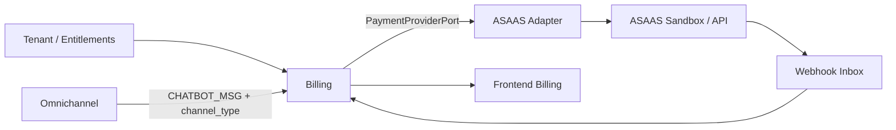
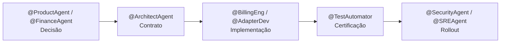
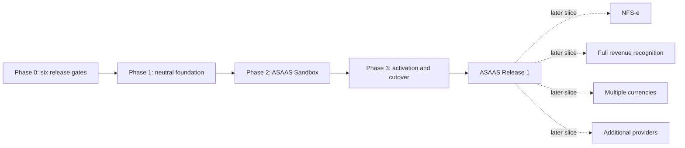

# TP-00011 — Billing ASAAS First Release

**Document ID:** `TP-00011`  
**Primary Nature:** `Plano`  
**Objective:** Coordenar o primeiro release de Billing com ASAAS, preservando integridade financeira e distinguindo decisões aceitas de evidências que ainda bloqueiam a execução.
**Scope:** Billing backend e frontend, contrato agnóstico de pagamentos, adapter ASAAS, fatura local, cobrança, webhook, reconciliação, dunning, migração de contratos e quota conversacional.  
**Non-objectives:** NFS-e, reconhecimento completo de receita, múltiplas moedas e certificação de providers adicionais.  
**Project:** SaaS Service  
**Date:** 2026-09-12 (v2.9)
**Status:** In Progress — M1A/M1B/M1C repository-local/focused completos somente test-only; remaining activities gated
**Author / Owner:** @AgentOrchestrator / Engenharia, Produto e Financeiro  
**Keywords:** billing, ASAAS, fatura, cobrança, webhook, reconciliação, dunning, omnichannel, quota  
**Code References:** `contexts.billing`, migrations de Billing e superfícies frontend de assinatura/fatura  
**Principal Statement:** `BIL-ASAAS-HARNESS-A` e `BIL-ASAAS-TRANSPORT-B` preservam suas evidências; `BIL-ASAAS-MUTATION-SIM-M1` concluiu M1A/M1B/M1C somente como mocks/simuladores test-only. Runtime C/D/E, demais atividades, Sandbox, credenciais, chamadas externas, certificação, enablement, rollout e efeitos reais permanecem bloqueados.

**References:**
[ADR-0023 — Integração agnóstica de provedores de pagamento](../../backend/docs/adrs/ADR-0023-agnostic-payment-provider-integration.md) ·
[ADR-0024 — Segurança e tokenização de cartão recorrente](../../backend/docs/adrs/ADR-0024-seguranca-tokenizacao-cartao-recorrente.md) ·
[ADR-0025 — Suspensão do tenant por inadimplência e recuperação](../../backend/docs/adrs/ADR-0025-suspensao-tenant-inadimplencia-recuperacao.md) ·
[ADR-0026 — Escopo tenant/admin das APIs de Billing](../../backend/docs/adrs/ADR-0026-billing-api-tenant-admin-cutover.md) ·
[ADR-0027 — Catálogo global e faturamento tenant-local](../../backend/docs/adrs/ADR-0027-catalogo-global-faturamento-local.md) ·
[ADR-0048 — Fatura comercial e NFS-e](../../backend/docs/adrs/ADR-0048-separacao-fatura-comercial-documento-fiscal-nfse.md) ·
[ADR-0050 — RBAC, SoD e aprovações](../../backend/docs/adrs/ADR-0050-rbac-sod-aprovacoes-financeiras.md) ·
[ADR-0051 — SLO, capacidade e rollout](../../backend/docs/adrs/ADR-0051-slo-capacidade-rollout-billing.md) ·
[ADR-0010 — Parametrização de planos](../../backend/docs/adrs/ADR-0010-tenant-plan-parametrization.md) ·
[ADR-0015 — Integração Telegram/Omnichannel](../../backend/docs/adrs/ADR-0015-telegram-integration.md) ·
[REQ-00011 — Limites de uso do chatbot](../../product/requirements/REQ-00011-chatbot-usage-limits-and-billing.md) ·
[REQ-00034 — Billing, assinatura e uso](../../product/requirements/REQ-00034-phase2-billing-subscription-usage.md) ·
[REQ-00042 — Billing corporativo multitenant](../../product/requirements/REQ-00042-enterprise-multitenant-billing-invoicing.md) ·
[UC-00022 — Chatbot quota enforcement](../../product/use-cases/UC-00022-chatbot-quota-enforcement.md) ·
[UC-00040 — Usage, rating e fechamento](../../product/use-cases/UC-00040-billing-usage-rating-invoice-close.md) ·
[UC-00042 — Payment, reconciliation e dunning](../../product/use-cases/UC-00042-billing-payment-reconciliation-dunning.md).

---

> **Binding `D-00.11 — 2026-09-12`:** o owner humano autorizou somente o primeiro
> filho atômico `BIL-ASAAS-HARNESS-A`: harness/simuladores repository-local que
> exercitam o mesmo contrato provider-neutral e derivam suas fixtures da
> documentação oficial, começando pelo ASAAS. Esta autorização não alcança
> transporte HTTP, bean/wiring runtime, demais filhos, Sandbox, produção, rede
> externa, credenciais, dados reais, registro de webhook, certificação,
> enablement, rollout ou efeito financeiro. Toda afirmação anterior de freeze
> total é histórico da versão 2.1 apenas para esse filho.

> **Binding `D-00.12 — 2026-09-12`:** o owner humano autorizou o segundo filho
> atômico `BIL-ASAAS-TRANSPORT-B` sob o [IP-BE-11.2.6-asaas-read-only-hermetic-transport](../../backend/docs/specs/IP-BE-11.2.6-asaas-read-only-hermetic-transport.md):
> transporte ASAAS não registrado, somente GET sem body e exclusivamente para
> endereço literal de loopback/WireMock, com token sintético e guardrails
> herméticos `2s/8s/10s`, três attempts, backoff exponencial `250ms` + jitter,
> body `1MiB`, page 100 e concorrência local 10. Esses valores não são SLO do
> provider. Bean/wiring, implementação de port, rede externa, mutação, segredo,
> Sandbox, certificação, enablement e efeito financeiro continuam bloqueados.

> **Binding `D-00.13 — 2026-09-12`:** o owner humano autorizou exclusivamente o
> filho `BIL-ASAAS-MUTATION-SIM-M1` sob o
> [IP-BE-11.2.7-asaas-hermetic-mutation-simulator](../../backend/docs/specs/IP-BE-11.2.7-asaas-hermetic-mutation-simulator.md):
> mocks/simuladores test-only provider-neutral, ASAAS-first, para
> criação/lookup de customer, criação/consulta de payment, fence/reconciliação
> após timeout e webhook at-least-once. Somente loopback/WireMock, token/dados
> sintéticos e fixtures derivadas das fontes oficiais são permitidos. A decisão
> não autoriza `BIL-ASAAS-RUNTIME-C`, `BIL-ASAAS-MUTATION-D` ou
> `BIL-ASAAS-OPERATIONS-E`, nem main source, POM, configuração, banco, segredo,
> rede externa, Sandbox, registro real, certificação, enablement ou efeito.

# 1. Overview

Este plano coordena o primeiro release de Billing que mantém assinatura, uso e
fatura como fontes locais e usa o ASAAS como provider primário para executar a
cobrança. A entrega está organizada em quatro fases. Os seis itens da Fase 0
continuam gates do release, mas não são todos decisões abertas: o baseline
arquitetural/comercial foi fechado e agora deve ser distinguido de contratos,
attestations, homologações e evidências executáveis ainda ausentes.

O recorte também alinha a quota conversacional ao contexto Omnichannel: o recurso
canônico é `max_chatbot_msg_daily`, com enforcement independente por canal de
conversação, conforme o REQ-00011. O plano coordena essa entrega, sem substituir os
requisitos ou ADRs que definem seu comportamento.

O baseline `D-08` usa Pix Cobrança, boleto e cartão hosted avulso ASAAS. Checkout
hospedado `RECURRENT` para base fixa foi aceito arquiteturalmente, mas permanece
`OFF` até PCI, capability da merchant account, Sandbox e rollout; componentes
variáveis usam checkout avulso por fatura. CVV jamais é retido e o Hub guarda
somente mandato/referências opacas tenant-scoped. `D-09` fixa grace de sete dias,
notices e restrição financeira recuperável sem bloquear pagamento, webhook,
reconciliação ou recuperação.

## 1.1 Proveniência da reconciliação decisória

| Pacote | Fonte canônica | Proveniência | Revisão humana | Efeito neste TP |
|---|---|---|---|---|
| `D-08` | ADR-0023 v3.0 e ADR-0024 v2.0 | `AI_DELEGATED` — Codex, `AUTH-BILLING-2026-08-25-001` | `NOT_PERFORMED`; `OPEN` | Rails/semântica aceitos; merchant, PCI e Sandbox não atestados. |
| `D-09` | ADR-0025 v2.0 | `AI_DELEGATED` — Codex, mesma autoridade | `NOT_PERFORMED`; `OPEN` | Grace/dunning/recovery aceitos; copy final, entrega e runtime não provados. |
| `D-13` | ADR-0050 | `AI_DELEGATED` — Codex, mesma autoridade | `NOT_PERFORMED`; `OPEN` | SoD/MFA/approval aceitos; roles, pessoas e controles não configurados. |
| `D-14` | ADR-0051 | `AI_DELEGATED` — Codex, mesma autoridade | `NOT_PERFORMED`; `OPEN` | Targets/rollout aceitos; capacidade, backup, SLO e piloto não provados. |

`Accepted` é baseline normativo sob delegação, não aprovação humana nem evidência
de implementação. Em 2026-08-25, o solicitante humano, proprietário declarado,
registrou: “D-00 liberado para implementação local dos planos do TP-00013,
incluindo backend, frontend, DDL, migrations e testes. Esta liberação não autoriza
chamadas externas, Sandbox ASAAS, piloto BP Farias ou produção, que permanecem
sujeitos aos respectivos gates de evidência.” O escopo é exclusivo do
TP-00013: nenhum código, DDL, migration, teste, Sandbox, comunicação, alteração
externa, piloto ou produção do TP-00011 foi iniciado ou autorizado por esse evento.

Essa última frase descreve exclusivamente a decisão de 2026-08-25. Os bindings
`D-00.11/D-00.12/D-00.13`, aprovados pelo mesmo owner em 2026-09-12, supersedem
o freeze somente para `BIL-ASAAS-HARNESS-A`, `BIL-ASAAS-TRANSPORT-B` e
`BIL-ASAAS-MUTATION-SIM-M1` em seus envelopes atômicos, preservando o bloqueio
dos demais filhos e de qualquer externalidade. Os três usam documentação ASAAS
consultada em 2026-09-12 e dados sintéticos; suítes reutilizáveis provam que o
contrato acima do fixture não depende de tipos ASAAS.

---

# 2. Execution Tracking Matrix

> **Legend:** ⬜ Pending · 🔄 In Progress · ✅ Done · ⏸️ Blocked · ❌ Cancelled

## Phase 0 — Decision and Evidence Gate

Os seis gates abaixo continuam bloqueando runtime, tráfego externo, demais filhos,
Sandbox, certificação, enablement, cutover, rollout e efeitos reais. Pelos bindings
`D-00.11/D-00.12/D-00.13`, eles são `N/A` exclusivamente para A, para o
transporte B e para M1 não registrados/loopback-only, cujos contratos provam que
não dependem desses parâmetros externos.

| # | Activity | Agent | Status | Notes |
|---|---|---|:---:|---|
| 0.1 | Materializar e provar critérios de ativação, cutover e contingência ASAAS | @ArchitectAgent + @BillingEng | ⏸️ | `D-08`/`D-14` fecharam o baseline; faltam contracts, runbook, Sandbox, kill-switch/rollback e evidence bundle |
| 0.2 | Definir entidade vendedora, regime tributário e município aplicável | @FinanceAgent + @ComplianceAgent | ⏸️ | `D-03` aprovou GV Software representando o Contador Fiscal e o tenant como único pagador; faltam identificação legal/fiscal formal, município/regime e vínculo da merchant account |
| 0.3 | Materializar o escopo comercial inicial aceito e comprovar capabilities | @ProductAgent + @FinanceAgent | ⏸️ | BRL/pricing/lifecycle e rails foram decididos; faltam catálogo/valores publicados, merchant/capabilities/tarifas, PCI e Sandbox |
| 0.4 | Materializar e provar o evento financeiro de ativação/renovação | @ProductAgent + @BillingEng | ⏸️ | `D-08` fixou somente `PAYMENT_EFFECTIVE`; faltam contrato executável, allocation/reconcile e testes por rail |
| 0.5 | Materializar e provar grace, dunning e restrição financeira | @ProductAgent + @FinanceAgent | ⏸️ | `D-09` fixou sete dias, notices D+0/+3/+6, apenas `RESTRICTED`, encargos zero e recovery por `PAYMENT_EFFECTIVE`; runtime/copy/evidência/runbook ausentes |
| 0.6 | Aprovar migração versionada das rotas e DTOs atuais | @ArchitectAgent + @FrontendAgent | ⏸️ | `D-01`/ADR-0026 aprovaram namespaces e cutover sem aliases; OpenAPI e schemas exatos dos DTOs permanecem bloqueadores |

## Phase 1 — Provider-neutral Foundation

| # | Activity | Agent | Status | Notes |
|---|---|---|:---:|---|
| 1.1 | Inventariar contratos, campos, endpoints e configuração Stripe do baseline | @ArchitectAgent | ⬜ | Depende de 0.6 |
| 1.2 | Especificar migrations aditivas, command journal, referências e webhook inbox | @DataModelAgent | 🔄 | Foundation Zero de command journal existe; inbox/reference/effect restantes exigem child `READY` |
| 1.3 | Especificar portas, commands, results e eventos normalizados | @CleanArchitecture | ✅ | Porta/registry/modelos neutros existentes; 31/31 testes focais verdes em 2026-09-12 |
| 1.4 | Especificar quota `max_chatbot_msg_daily` por `tenant_id + channel_type + dia` | @BillingEng | ⬜ | REQ-00011; sem pool agregado entre canais |
| 1.5 | Preparar contratos frontend versionados e estratégia de compatibilidade | @FrontendAgent | ⬜ | Depende de 0.6 e 1.3 |

## Phase 2 — ASAAS harness and hermetic transport; Sandbox/payment flow gated

| # | Activity | Agent | Status | Notes |
|---|---|---|:---:|---|
| 2.1 | Implementar harness A e transporte B loopback-only; adapter/config runtime permanecem gated | @AdapterDev | 🔄 | A completo; B implementado/testado com focais 28/28, impactados 86/86, arquitetura 29/29 e QG focused verdes; QG PR agregado pendente por três suítes externas; C–E e externalidade bloqueados |
| 2.1/M1 | Implementar simulador hermético de mutações e webhook | @AdapterDev + @TestAutomator | ✅ | M1A/M1B/M1C repository-local/focused completos: M1A 17/99/29/QG 17, M1B 28/118/29/QG 28 e M1C 27/160/arquitetura compartilhada 29/QG PASS; zero provider externo e sem liberar C/D/E |
| 2.2 | Implementar customer, cobrança e hosted payment para os rails aprovados | @BillingEng | ⬜ | Pix Cobrança, boleto e cartão hosted avulso são o slice; `RECURRENT` fixed-base permanece `OFF` até PCI/merchant/Sandbox/rollout |
| 2.3 | Implementar webhook autenticado, inbox durável e processamento idempotente | @AdapterDev | ⬜ | Depende de 1.2 e 2.1 |
| 2.4 | Implementar reconciliação de resultado ambíguo e divergências | @BillingEng | ⬜ | Depende de 2.2 e 2.3 |
| 2.5 | Certificar Pix, boleto e/ou cartão no Sandbox conforme matriz aprovada | @TestAutomator | ⏸️ | Exige autorização externa separada; não integra o slice hermético |

## Phase 3 — Activation, Dunning and Cutover

| # | Activity | Agent | Status | Notes |
|---|---|---|:---:|---|
| 3.1 | Implementar ativação/renovação idempotente no evento aprovado | @BillingEng | ⬜ | Depende de 0.4 e Fase 2 |
| 3.2 | Implementar política aprovada de grace, dunning e restrição | @BillingEng | ⬜ | Depende da evidência 0.5; aplicar `FINANCIAL_ACCESS_RESTRICTION` e preservar recovery plane conforme ADR-0025 |
| 3.3 | Executar backfill e compatibilidade de rotas/DTOs | @DataModelAgent + @FrontendAgent | ⬜ | Depende de 0.6 e Fase 2 |
| 3.4 | Executar rollout progressivo, reconciliação e rollback ensaiado | @SREAgent | ⏸️ | Depende de 3.1–3.3 e autorização operacional separada |
| 3.5 | Obter aceite operacional, financeiro e de segurança | @AgentOrchestrator | ⏸️ | Gate final externo, fora da autorização `D-00.11` |

## Summary

| Phase | Total Activities | ⬜ Pending | 🔄 In Progress | ⏸️ Blocked | ✅ Done | Progress |
|---|:---:|:---:|:---:|:---:|:---:|---|
| **Phase 0 — Decision and Evidence Gate** | 6 | 0 | 0 | 6 | 0 | External gates open |
| **Phase 1 — Foundation** | 5 | 3 | 1 | 0 | 1 | Neutral foundation proven |
| **Phase 2 — ASAAS** | 6 | 3 | 1 | 1 | 1 | M1A/M1B/M1C focused complete; runtime/externality gated |
| **Phase 3 — Cutover** | 5 | 3 | 0 | 2 | 0 | Not started |
| **TOTAL** | **22** | **9** | **2** | **9** | **2** | **Repository-local lane in progress** |

## Granularity / Decomposition Review

- **Outcome:** Decomposed
- **Rationale:** O release reúne resultados, dependências, autorizações e ciclos
  independentes; cada unidade vertical conserva código, testes e evidência no IP
  filho. M1 é um coordenador test-only decomposto; M1A, M1B e M1C estão
  repository-local/focused completos e nenhum filho integra uma parte liberada de D.
- **Children:** `IP-BE-11.2.1-asaas-adapter-and-environment-config`,
  `IP-BE-11.2.6-asaas-read-only-hermetic-transport`,
  `IP-BE-11.2.7-asaas-hermetic-mutation-simulator`,
  `IP-BE-11.2.7.1-asaas-hermetic-customer-mutation-fence`,
  `IP-BE-11.2.7.2-asaas-hermetic-payment-mutation-fence`,
  `IP-BE-11.2.7.3-asaas-hermetic-webhook-inbox`
- **Reviewed on:** 2026-09-12

## Implementation-plan decomposition

Cada atividade implementável possui plano próprio. Os bindings
`D-00.11/D-00.12/D-00.13` autorizam somente `BIL-ASAAS-HARNESS-A`,
`BIL-ASAAS-TRANSPORT-B` e `BIL-ASAAS-MUTATION-SIM-M1`, depois de registrar
`READY` para versões e paths exatos. Todos os outros filhos permanecem sujeitos a
autorização/readiness próprios e aos gates `0.1`–`0.6` aplicáveis.

| Activity | Implementation plan | Area | Initial state | Authorization dependency |
|---|---|---|:---:|---|
| 1.1 | [IP-BE-11.1.1-billing-provider-coupling-inventory — Billing provider coupling inventory](../../backend/docs/specs/IP-BE-11.1.1-billing-provider-coupling-inventory.md) | Backend/architecture | ⬜ | 0.6 |
| 1.2 | [IP-BE-11.1.2-billing-provider-journal-references-inbox — Billing provider journal, references and inbox](../../backend/docs/specs/IP-BE-11.1.2-billing-provider-journal-references-inbox.md) | Backend/data | ⬜ | 0.1 and 1.1 |
| 1.3 | [IP-BE-11.1.3-payment-provider-neutral-contract — Payment-provider-neutral contract](../../backend/docs/specs/IP-BE-11.1.3-payment-provider-neutral-contract.md) | Backend/architecture | ⬜ | 0.1 and 1.1 |
| 1.4 | [IP-BE-11.1.4-chatbot-quota-per-channel — Chatbot quota per channel](../../backend/docs/specs/IP-BE-11.1.4-chatbot-quota-per-channel.md) | Backend/Omnichannel | ⬜ | REQ-00011 approval and section 8 sequencing |
| 1.5 | [IP-FE-11.1.5-billing-neutral-api-compatibility — Billing neutral API compatibility](../../frontend/docs/specs/IP-FE-11.1.5-billing-neutral-api-compatibility.md) | Frontend/contracts | ⬜ | 0.6 and 1.3 |
| 2.1 | [IP-BE-11.2.1-asaas-adapter-and-environment-config — ASAAS adapter and environment configuration](../../backend/docs/specs/IP-BE-11.2.1-asaas-adapter-and-environment-config.md) | Backend/integration | 🔄 A done/B implemented | Phase 1; B aguarda QG PR agregado; C–E permanecem gated |
| 2.1/B | [IP-BE-11.2.6-asaas-read-only-hermetic-transport — ASAAS read-only hermetic transport](../../backend/docs/specs/IP-BE-11.2.6-asaas-read-only-hermetic-transport.md) | Backend/integration testing | 🔄 Implemented/tested; PR gate pending | Harness A + `D-00.12`; somente GET loopback/WireMock não registrado |
| 2.1/M1 | [IP-BE-11.2.7-asaas-hermetic-mutation-simulator — ASAAS hermetic mutation simulator](../../backend/docs/specs/IP-BE-11.2.7-asaas-hermetic-mutation-simulator.md) | Backend/integration testing | ✅ Completed coordinator | `D-00.13`; M1A/M1B/M1C completos e zero path executável no pai |
| 2.1/M1A | [IP-BE-11.2.7.1-asaas-hermetic-customer-mutation-fence](../../backend/docs/specs/IP-BE-11.2.7.1-asaas-hermetic-customer-mutation-fence.md) | Backend/integration testing | 🔄 Repository-local/focused complete; PR/global pending | Customer test-only; nove paths próprios; 17/99/29/QG focused verdes, zero skip |
| 2.1/M1B | [IP-BE-11.2.7.2-asaas-hermetic-payment-mutation-fence](../../backend/docs/specs/IP-BE-11.2.7.2-asaas-hermetic-payment-mutation-fence.md) | Backend/integration testing | 🔄 Repository-local/focused complete; PR/global pending | Payment test-only; nove paths próprios; 28/118/29/QG focused verdes, zero skip |
| 2.1/M1C | [IP-BE-11.2.7.3-asaas-hermetic-webhook-inbox](../../backend/docs/specs/IP-BE-11.2.7.3-asaas-hermetic-webhook-inbox.md) | Backend/integration testing | ✅ Repository-local/focused complete | Webhook test-only; 11 paths próprios; 27/160/arquitetura compartilhada 29/QG PASS; zero provider externo |
| 2.2 | [IP-BE-11.2.2-asaas-customer-charge-hosted-payment — ASAAS customer, charge and hosted payment](../../backend/docs/specs/IP-BE-11.2.2-asaas-customer-charge-hosted-payment.md) | Backend/integration | ⬜ | 0.3 and 2.1 |
| 2.3 | [IP-BE-11.2.3-asaas-webhook-durable-inbox — ASAAS durable webhook inbox](../../backend/docs/specs/IP-BE-11.2.3-asaas-webhook-durable-inbox.md) | Backend/integration | ⬜ | 1.2 and 2.1 |
| 2.4 | [IP-BE-11.2.4-payment-reconciliation-divergence-queue — Payment reconciliation and divergence queue](../../backend/docs/specs/IP-BE-11.2.4-payment-reconciliation-divergence-queue.md) | Backend/operations | ⬜ | 2.2 and 2.3 |
| 2.5 | [IP-BE-11.2.5-asaas-sandbox-capability-certification — ASAAS Sandbox capability certification](../../backend/docs/specs/IP-BE-11.2.5-asaas-sandbox-capability-certification.md) | Backend/testing | ⬜ | 0.3 and 2.2–2.4 |
| 3.1 | [IP-BE-11.3.1-payment-entitlement-activation — Payment entitlement activation](../../backend/docs/specs/IP-BE-11.3.1-payment-entitlement-activation.md) | Backend/domain | ⬜ | 0.4 and Phase 2 |
| 3.2 | [IP-BE-11.3.2-dunning-grace-and-suspension — Dunning, grace and suspension](../../backend/docs/specs/IP-BE-11.3.2-dunning-grace-and-suspension.md) | Backend/domain | ⬜ | 0.5 and 3.1 |
| 3.3 | [IP-FE-11.3.3-billing-api-compatibility-and-ui-cutover — Billing API compatibility and UI cutover](../../frontend/docs/specs/IP-FE-11.3.3-billing-api-compatibility-and-ui-cutover.md) | Frontend/data migration | ⬜ | 0.6 and Phase 2 |
| 3.4 | [IP-BE-11.3.4-asaas-progressive-rollout-and-rollback — ASAAS progressive rollout and rollback](../../backend/docs/specs/IP-BE-11.3.4-asaas-progressive-rollout-and-rollback.md) | Backend/SRE | ⬜ | 3.1–3.3 |
| 3.5 | [IP-BE-11.3.5-billing-release-readiness-and-acceptance — Billing release readiness and acceptance](../../backend/docs/specs/IP-BE-11.3.5-billing-release-readiness-and-acceptance.md) | Cross-functional | ⬜ | 3.4 and all final gates |

## Documentation maturity and current execution boundary

Em 2026-08-21, as quinze atividades implementáveis foram decompostas em planos
filhos detalhados e submetidas a uma segunda passagem de enriquecimento. Essa
maturidade é exclusivamente do **blueprint**: não altera o status das atividades,
não constitui evidência de software e não satisfaz os gates da Fase 0.

O freeze total da versão 2.1 foi superseded em 2026-09-12 somente para
`BIL-ASAAS-HARNESS-A`, `BIL-ASAAS-TRANSPORT-B` e
`BIL-ASAAS-MUTATION-SIM-M1`. A está completo; B foi implementado/testado somente
com GET loopback/WireMock; em M1, M1A, M1B e M1C estão
repository-local/focused completos. M1C passou focal `27/27`, suíte impactada
`160/160`, arquitetura compartilhada `29/29` e Quality Gate `PASS`, sem provider
externo.
Runtime C/D/E, demais filhos, Sandbox, rede externa, credenciais,
cadastro externo, certificação, enablement e rollout continuam bloqueados. Cada outra jornada
executável exige, cumulativamente:

1. autorização explícita própria e `READY` vigente para task, versões e paths exatos;
2. evidência de saída e rastreabilidade dos gates `0.1–0.6` que forem aplicáveis;
3. reconciliação das fontes superiores com os ADRs aceitos, sem transformar
   evidência pendente em decisão aberta ou false green;
4. execução na ordem/dependências deste TP e dos planos filhos;
5. testes e evidências previstos em cada plano, sem false green.

| Activity | Implementation plan ID | Blueprint maturity | Execution state in this TP | Immediate authorization dependency |
|---|---|---|---|---|
| 1.1 | `IP-BE-11.1.1-billing-provider-coupling-inventory` | Detailed, reviewable and evidence-oriented | ⬜ Pending; reauditar estado atual | autorização/readiness próprios; 0.6 se alterar wire |
| 1.2 | `IP-BE-11.1.2-billing-provider-journal-references-inbox` | Detailed, reviewable and evidence-oriented | 🔄 Foundation Zero existente; restante não iniciado | autorização/readiness próprios; 0.1 quando externalidade aplicável |
| 1.3 | `IP-BE-11.1.3-payment-provider-neutral-contract` | Detailed, reviewable and evidence-oriented | ✅ Fundação neutra existente; 31/31 testes focais verdes em 2026-09-12 | Evidência histórica; reauditar antes de mudança de assinatura |
| 1.4 | `IP-BE-11.1.4-chatbot-quota-per-channel` | Detailed, reviewable and evidence-oriented | ⬜ Pending | REQ-00011 + autorização/readiness próprios |
| 1.5 | `IP-FE-11.1.5-billing-neutral-api-compatibility` | Detailed, reviewable and evidence-oriented | ⬜ Pending | 0.6, 1.3 + autorização/readiness próprios |
| 2.1 | `IP-BE-11.2.1-asaas-adapter-and-environment-config` | Detailed, reviewable and evidence-oriented | 🔄 A completo; B implementado/testado; M1A/M1B/M1C focused completos | Fundação neutra + `D-00.11/D-00.12/D-00.13`; C–E exigem autorização/readiness próprios |
| 2.1/B | `IP-BE-11.2.6-asaas-read-only-hermetic-transport` | Atomic, reviewable and evidence-oriented | 🔄 14 paths implementados; focais/impactados/arquitetura/QG focused verdes; PR agregado pendente | Harness A + `D-00.12`; somente os 14 paths exatos do filho |
| 2.1/M1 | `IP-BE-11.2.7-asaas-hermetic-mutation-simulator` | Decomposed coordinator | ✅ Completed; sem software próprio | `D-00.13`; M1A/M1B/M1C completos |
| 2.1/M1A | `IP-BE-11.2.7.1-asaas-hermetic-customer-mutation-fence` | Atomic, reviewable and evidence-oriented | 🔄 Repository-local/focused completo; PR/global pendente | Nove paths customer test-only; 17/99/29/QG focused verdes, zero skip |
| 2.1/M1B | `IP-BE-11.2.7.2-asaas-hermetic-payment-mutation-fence` | Atomic, reviewable and evidence-oriented | 🔄 Repository-local/focused completo; PR/global pendente | Nove paths payment test-only; 28/118/29/QG focused verdes, zero skip |
| 2.1/M1C | `IP-BE-11.2.7.3-asaas-hermetic-webhook-inbox` | Atomic, reviewable and evidence-oriented | ✅ Repository-local/focused completo | 11 paths webhook test-only; 27/160/arquitetura compartilhada 29/QG PASS; zero provider externo |
| 2.2 | `IP-BE-11.2.2-asaas-customer-charge-hosted-payment` | Detailed, reviewable and evidence-oriented | ⬜ Pending | 0.3, 2.1 + autorização/readiness próprios |
| 2.3 | `IP-BE-11.2.3-asaas-webhook-durable-inbox` | Detailed, reviewable and evidence-oriented | ⬜ Pending | 1.2, 2.1 + autorização/readiness próprios; registro externo bloqueado |
| 2.4 | `IP-BE-11.2.4-payment-reconciliation-divergence-queue` | Detailed, reviewable and evidence-oriented | ⬜ Pending | 2.2, 2.3 + autorização/readiness próprios; consulta externa bloqueada |
| 2.5 | `IP-BE-11.2.5-asaas-sandbox-capability-certification` | Detailed, reviewable and evidence-oriented | ⬜ Pending; not initiated by this documentation cycle | 0.3, 2.2–2.4 + future implementation authorization |
| 3.1 | `IP-BE-11.3.1-payment-entitlement-activation` | Detailed, reviewable and evidence-oriented | ⬜ Pending | 0.4, Phase 2 + autorização/readiness próprios |
| 3.2 | `IP-BE-11.3.2-dunning-grace-and-suspension` | Detailed, reviewable and evidence-oriented | ⬜ Pending | 0.5, 3.1 + autorização/readiness próprios |
| 3.3 | `IP-FE-11.3.3-billing-api-compatibility-and-ui-cutover` | Detailed, reviewable and evidence-oriented | ⬜ Pending | 0.6, Phase 2 + autorização/readiness próprios |
| 3.4 | `IP-BE-11.3.4-asaas-progressive-rollout-and-rollback` | Detailed, reviewable and evidence-oriented | ⬜ Pending; no rollout/rehearsal initiated | 3.1–3.3, 0.1 + explicit operational authorization |
| 3.5 | `IP-BE-11.3.5-billing-release-readiness-and-acceptance` | Detailed, reviewable and evidence-oriented | ⬜ Pending; no gate/evidence execution initiated | 3.4, G0–G14 evidence + named sign-offs |

### Blueprint completeness contract

Cada plano filho deve manter, antes de qualquer execução futura:

- guardrail de escopo, não objetivos e condição de autorização;
- baseline AS-IS com paths/símbolos recapturáveis;
- desenho TO-BE, contratos, estados, invariantes e ownership de tenant;
- matriz de artefatos `[NEW]`/`[MODIFY]`/`[PRESERVE]`;
- tratamento de idempotência, concorrência, falhas ambíguas e recuperação;
- segurança, privacidade, observabilidade e thresholds ligados a owner/gate;
- slices com critérios de entrada/saída, testes e comandos planejados;
- rollout/rollback/kill switches, evidências, dependências e handoffs;
- baseline decisório e lacunas de evidência rastreáveis, sem defaults
  comerciais/financeiros inventados;
- Definition of Done e Change Log que não confundam plano com implementação.

Qualquer alteração futura que mude decisão, contrato ou escopo deve atualizar o
plano filho e esta matriz antes do patch de software correspondente.

---

# 3. Context and Constraints

## 3.1 First-release Decision Boundary

Produto confirmou em 2026-08-21 que os itens 1, 2, 3, 5, 6 e 9 da análise de
readiness são bloqueadores do primeiro release ASAAS. A numeração foi preservada
na Fase 0 para manter rastreabilidade com essa decisão.

As capabilities abaixo ficam em slices posteriores. A automação em si não entra
no release, mas attestations legais/fiscais/contábeis aplicáveis podem continuar
como gates do ambiente pago:

| Deferred capability | First-release treatment | Re-entry gate |
|---|---|---|
| Automação NFS-e e demais documentos fiscais | Não implementar nem acoplar ao estado da fatura; invoice comercial e NFS-e permanecem eixos distintos | ADR-0048 + owner attestation da obrigação; processo manual válido se aplicável, ou adapter/layout/Sandbox certificados |
| Reconhecimento estatutário de receita e ERP | Limitar a entrega à fatura, pagamento, reconciliação e subledger gerencial aceito no ADR-0049 | Política/plano de contas/parecer contábil e integração próprios |
| Múltiplas moedas | Primeiro release restrito a BRL; não implementar FX | Regras de moeda, arredondamento, países e contabilidade aprovadas |
| Providers adicionais | ASAAS é o único provider novo certificado neste release; Stripe permanece legado/contingência desligada até certificação | Contract tests, runbook, segurança e aprovação operacional por provider |

Adiar essas capacidades não autoriza remover extensibilidade, moeda explícita,
separação entre fatura e documento fiscal ou o contrato agnóstico do ADR-0023.

### 3.1.1 Product directions recorded on 2026-08-22 and 2026-08-23

| Subject | Recorded direction | What remains blocking |
|---|---|---|
| Commercial relationship | Venda direta B2B: GV Software representa o Contador Fiscal como entidade cobradora; o tenant contratante é customer/billing account/payer e seus clientes contábeis não integram a cobrança do Hub. | Razão social/CNPJ formais, município/UF, inscrição municipal quando aplicável, regime tributário e titularidade da merchant account ASAAS. |
| Billing API cutover | ADR-0026: tenant em `/api/v1/tenants/{tenantId}/billing/**`, global em `/api/v1/admin/billing/**`, sem alias `/api/v1/billing/**` e sem MSW em runtime. | OpenAPI, DTOs, nullability, enums, paginação e sentinels de contrato de cada slice. |
| Catalog and invoice placement | ADR-0027: catálogo seller-owned da GV Software em `saas_platform`; snapshot contratado e invoice/lines/sequence/idempotência/journal/outbox no banco dedicado do tenant, uma transação local por tenant. | DDL, materialização contratual, demais decisões D-04, PostgreSQL e gates cross-stack; nenhuma implementação foi liberada. |
| Payment rails e evento efetivo | Pix Cobrança, boleto e cartão hosted avulso no primeiro slice; somente `PAYMENT_EFFECTIVE` local, reconciliado e alocado, ativa/renova/recupera. Redirect, callback e status de subscription não ativam. | Merchant/capabilities/tarifas ASAAS, contratos executáveis, webhook/reconcile e Sandbox por rail. |
| Recurring card | Checkout ASAAS hospedado `CREDIT_CARD + RECURRENT` é aceito apenas para base fixa, mas capability fica `OFF`; domínio/APIs/stores não aceitam nem persistem PAN, validade, CVV ou `creditCardToken`, e eventual campo sensível encontrado no ingress é descartado antes de qualquer persistência/telemetria. Variável usa hosted avulso por fatura. | PCI aplicável, capability da merchant account, termos, Sandbox e gate ADR-0051. |
| Delinquency grace | ADR-0025 fixa sete dias corridos desde `overdueAt`, policy versionada, sem override tenant no primeiro slice; juros, multa e desconto antecipado são zero. | Implementação, copy jurídica final, evidência de notices e testes temporais/operacionais. |
| Restriction scope | Após grace e evidência obrigatória, aplica somente `FINANCIAL_ACCESS_RESTRICTION=RESTRICTED` a novas operações pagas/de custo; escalada automática `SUSPENDED` fica `OFF`. | Matriz executável por capability, controles ADR-0050, observabilidade e testes in-flight. |
| Recovery plane | Billing, faturas, hosted action, webhooks/inbox, reconciliação, recovery, auditoria, suporte e admin read/export permanecem operáveis; somente `PAYMENT_EFFECTIVE` + allocation + saldo elegível zero recupera. | UX/copy, contracts, SLO/runbook e evidência E2E/Sandbox. |

Essas decisões estão aceitas sob as proveniências canônicas e, com
`D-00.11/D-00.12/D-00.13`, liberam somente A, B e M1 nos envelopes locais herméticos definidos
pelos respectivos `READY`; não mudam os gates de evidência de externalidade. Merchant/capabilities,
PCI, Sandbox, contracts, copy/legal, SLO/backup, controles e readiness continuam
sob responsabilidade de seus owners; nenhuma liberação local se estende a
Sandbox, certificação, enablement ou rollout.

## 3.2 Billing and Omnichannel Boundary

- `CHATBOT_MSG` é a métrica conversacional comum a WhatsApp, Telegram e futuros canais.
- `max_chatbot_msg_daily` é o limite canônico do plano para cada canal conversacional.
- A chave de enforcement é `tenant_id + channel_type + billing_day`; o consumo de um canal não reduz a franquia diária de outro.
- Relatórios e a fatura podem agregar canais, mas devem preservar `channel_type` para auditoria, rating e reconciliação.
- Overrides por canal, se oferecidos, usam a dimensão `channel_type`; não criam colunas como `max_whatsapp_*` ou `max_telegram_*`.
- A migração do legado deve ser aditiva, compatível e testada; este plano não declara a alteração já implementada.

## 3.3 Architectural and Operational Constraints

- Billing é a autoridade sobre assinatura, uso, entitlement, itens e total da fatura.
- O ASAAS executa cobrança e informa fatos externos; não calcula o total canônico.
- Cartão recorrente usa checkout hospedado; referências externas ficam em projeção
  server-side tenant-scoped e nunca no browser/configuração livre do cliente.
- Toda mutação externa usa persist-before-call e chave idempotente.
- Não há fallback automático entre providers após resultado ambíguo.
- Webhook só recebe ACK após autenticação, parse tolerante, sanitização em envelope
  allowlisted e persistência durável desse envelope; body bruto e campos de cartão,
  holder ou `creditCardToken` nunca entram na inbox, DLQ, replay ou telemetria.
- Mandato, obrigação, projeção financeira e referências ligadas ao contrato/payer
  ficam no store tenant-scoped de Billing. O catálogo seller-owned é a exceção
  global explícita do ADR-0027 e reside em `saas_platform`, sem invoice ou PII
  tenant-scoped. O ADR-0023 fixa apenas o placement mínimo do índice de roteamento
  e da inbox sanitizada pré-tenant; a atividade `1.2` ainda deve materializar e
  provar DDL, minimização, retention, constraints e routing. Não há datasource
  default nem varredura de tenants.
- Nenhum teste usa endpoint, credencial ou dado de produção.
- PAN/CVV não transitam pela aplicação; checkout hospedado/tokenização seguem capabilities aprovadas.
- Logs e métricas não expõem chaves, tokens, payloads sensíveis ou cardinalidade por tenant.
- Suspensão financeira não desativa `Tenant.active`, realm, credenciais de canal ou
  configuração de integração; aplica entitlement próprio e remove somente o bloqueio
  do `DunningCase` causal quando houver recuperação elegível. Enquanto existir
  outro effect financeiro ativo ou saldo residual elegível, o business plane
  permanece restrito.
- “Parar integrações” significa impedir novas ações do business plane. Ingressos que
  exigem ACK seguro, pagamentos, reconciliação, recovery, auditoria e suporte não
  podem ser desligados, sob pena de impedir a própria regularização.

## 3.4 Bounded Contexts / Modules

| # | Module | Database/Store | Description |
|---|---|---|---|
| 1 | **Billing** | Banco dedicado do tenant; store pré-tenant sujeito ao gate 1.2 | Assinatura, quota, uso, fatura, commands/effects tenant-scoped e reconciliação |
| 2 | **Tenant** | `saas_tenant` | Identidade do tenant e consumo de entitlements expostos pelo Billing |
| 3 | **Omnichannel** | `saas_whatsapp`/configuração de canais | Origem do uso conversacional com dimensão `channel_type` |
| 4 | **ASAAS adapter** | Referências opacas no store aprovado pela atividade 1.2 | Tradução entre contrato neutro e API/webhooks ASAAS, com roteamento pré-tenant seguro |
| 5 | **Frontend** | N/A | Checkout hospedado, faturas e estados canônicos sem DTO proprietário |

---

# 4. Phase Details

## Phase 0 — Decision and Evidence Gate

> Objective: provar cada gate por decisão rastreada, artefato executável e evidência adequada antes de editar contratos, schema ou software; decisão aceita sozinha não satisfaz o gate.

### 0.1 Commercial, Legal and Financial Decisions

| # | Activity | Agent | Dep. | Deliverable |
|---|---|---|---|---|
| 0.1 | Materializar ativação, cutover e contingência | @ArchitectAgent + @BillingEng | — | Baseline ADR-0023/ADR-0051 + matriz executável, rollback ensaiado e evidence bundle |
| 0.2 | Definir entidade vendedora e enquadramento | @FinanceAgent + @ComplianceAgent | — | Registro da entidade, município, regime e responsáveis |
| 0.3 | Materializar escopo comercial do release | @ProductAgent + @FinanceAgent | 0.2 | Baseline BRL/rails/lifecycle/pricing aceito + catálogo, merchant/capabilities/tarifas e Sandbox comprovados |
| 0.4 | Materializar evento de ativação por rail | @ProductAgent + @BillingEng | 0.3 | `PAYMENT_EFFECTIVE` do ADR-0023 em contrato executável + testes/reconcile por rail |
| 0.5 | Materializar inadimplência e restrição | @ProductAgent + @FinanceAgent | 0.3 | `DunningPolicy` do ADR-0025 em schema/runtime, notices/evidence, matriz por capability, in-flight e recovery testados |
| 0.6 | Definir migração API/frontend | @ArchitectAgent + @FrontendAgent | — | Contrato versionado, compat window e sunset aprovados |

**Acceptance Criteria:**

- Cada decisão possui owner/proveniência, data, versão e fonte documental; decisões
  de IA nunca são rotuladas como aprovação humana.
- Não restam valores ou estados financeiros implícitos nos contracts executáveis;
  evidence gaps permanecem explicitamente fail-closed.
- Critérios de rollback impedem dupla cobrança e perda de eventos.
- O status deste plano só muda para `Approved` após os seis itens saírem de `Blocked`.
- A policy de 0.5 materializa o ADR-0025; nenhum default oculto de três dias ou
  `updated_at` pode substituir os sete dias desde `overdueAt`.

## Phase 1 — Provider-neutral Foundation

> Objective: tornar o baseline provider-neutral e preparar persistência segura antes da primeira chamada ao ASAAS.

### 1.1 Contracts, Persistence and Quotas

| # | Activity | Agent | Dep. | Deliverable |
|---|---|---|---|---|
| 1.1 | Inventariar acoplamentos Stripe | @ArchitectAgent | 0.6 | Inventário verificável e plano de compatibilidade |
| 1.2 | Modelar persistência aditiva | @DataModelAgent | 0.1, 1.1 | Migrations e rollback lógico revisados |
| 1.3 | Modelar contrato neutro | @CleanArchitecture | 0.1, 1.1 | Ports, commands, results e eventos canônicos |
| 1.4 | Dimensionar quota conversacional | @BillingEng | REQ-00011 | Schema/API para `max_chatbot_msg_daily` por canal |
| 1.5 | Versionar API e frontend | @FrontendAgent | 0.6, 1.3 | OpenAPI, DTOs neutros e compatibilidade temporária |

**Acceptance Criteria:**

- Domain e application não importam tipos ASAAS ou Stripe.
- Migrations são aditivas, repetíveis em ambiente limpo e compatíveis com rollback lógico.
- Uma mesma mensagem não pode consumir duas vezes a quota por retry.
- Testes provam limites independentes para WhatsApp e Telegram no mesmo tenant e dia.
- O frontend não escolhe provider nem recebe segredo ou payload proprietário.

## Phase 2 — ASAAS Hermetic A/B/M1; Runtime, Sandbox and Payment Flow C–E blocked

> Objective: certificar o adapter primário em Sandbox com cobrança, webhook e reconciliação idempotentes.
>
> Este bloco preserva o target futuro dos filhos C–E. O trabalho corrente é o
> transporte B, governado pelo IP-BE-11.2.6-asaas-read-only-hermetic-transport,
> já implementado/testado e limitado a GET loopback/WireMock não registrado; ele
> não constitui adapter/wiring de runtime nem Sandbox. O filho M1 acrescenta
> somente simulação test-only das mutações e webhooks, sob
> `IP-BE-11.2.7-asaas-hermetic-mutation-simulator`; não é o
> filho D de dispatch/runtime e não comprova efeito financeiro.

### 2.1 Adapter and Certification

| # | Activity | Agent | Dep. | Deliverable |
|---|---|---|---|---|
| 2.1 | Implementar transporte B e, futuramente, adapter/configuração C | @AdapterDev | Harness A + autorizações B/C | B implementado/testado somente para GET loopback/WireMock e pendente do QG PR agregado; wiring/runtime C permanece bloqueado |
| 2.1/M1 | Implementar simulador hermético de mutações e webhook | @AdapterDev + @TestAutomator | Harness A/B + D-00.13 | ✅ M1A/M1B/M1C completos: test kit neutro, ASAAS loopback e segundo fake `OFF`; zero runtime/externalidade |
| 2.2 | Implementar customer/cobrança/hosted payment | @BillingEng | 0.3, 2.1 | Pix Cobrança, boleto e cartão hosted avulso; recurrence fixed-base somente como capability `OFF` até certificação própria |
| 2.3 | Implementar webhook inbox | @AdapterDev | 1.2, 2.1 | Autenticação, dedupe, ACK e processamento assíncrono |
| 2.4 | Implementar reconciliação | @BillingEng | 2.2, 2.3 | Job com cursor, retry seguro e fila de divergência |
| 2.5 | Executar certificação Sandbox | @TestAutomator | 2.2–2.4 | Evidências de contract/integration tests por capability |

**Acceptance Criteria:**

- Uma chave lógica produz no máximo uma cobrança ativa.
- Webhook duplicado ou fora de ordem não duplica ativação, receita ou notificação.
- Timeout após mutação resulta em reconciliação, nunca em fallback automático.
- Credenciais de Sandbox vêm de secret store/ambiente e não são persistidas no repositório.
- Capabilities não testáveis no Sandbox são explicitamente bloqueadas ou verificadas por procedimento aprovado.
- Certificação do primeiro slice prova correlação
  `tenant -> customer -> checkout/charge -> payment`, zero PAN/CVV/token e
  fallback seguro por invoice. Se recorrência fixed-base for promovida em slice
  posterior, ela exige evidência adicional
  `tenant -> customer -> checkout -> subscription -> payment`, PCI e merchant gate.

## Phase 3 — Activation, Dunning and Cutover

> Objective: ativar o provider primário de forma controlada e manter recuperação segura diante de falha ou inadimplência.

### 3.1 Business Effects and Rollout

| # | Activity | Agent | Dep. | Deliverable |
|---|---|---|---|---|
| 3.1 | Aplicar efeito do pagamento | @BillingEng | 0.4, Fase 2 | Transição idempotente de payment/subscription/entitlement |
| 3.2 | Aplicar dunning e suspensão | @BillingEng | 0.5, 3.1 | State machine, entitlement cross-module e recovery plane auditáveis |
| 3.3 | Migrar contratos e dados | @DataModelAgent + @FrontendAgent | 0.6, Fase 2 | Backfill, dual-read/compatibilidade e retirada planejada |
| 3.4 | Executar rollout/rollback | @SREAgent | 3.1–3.3 | Runbook ensaiado e rollout progressivo |
| 3.5 | Registrar aceite | @AgentOrchestrator | 3.4 | Evidências e aprovações finais |

**Acceptance Criteria:**

- O evento aprovado ativa ou renova exatamente uma vez por obrigação paga.
- Dunning e suspensão seguem política aprovada, sem derivar diretamente de status proprietário.
- Suspensão bloqueia o business plane coberto sem impedir login administrativo
  mínimo, Billing, checkout, webhooks, reconciliação, recovery, auditoria e suporte.
- Pagamento elegível durante grace evita suspensão; após suspensão remove exatamente
  uma vez somente a restrição `PAYMENT_DELINQUENCY`, preservando bloqueios administrativos
  ou de segurança independentes.
- Eventos do provider anterior continuam sendo ingeridos enquanto houver pendências.
- Rollback pausa novas mutações sem trocar o provider de cobranças já criadas.
- Financeiro consegue reconciliar fatura, cobrança, pagamento, taxa e divergência por IDs canônicos.

---

# 5. Agent Chain per Module

1. **@ProductAgent / @FinanceAgent** — revisam o baseline aceito e produzem as
   attestations/evidências comerciais e financeiras sob sua competência.
2. **@ArchitectAgent** — transforma regras aprovadas em contratos e boundaries verificáveis.
3. **@BillingEng / @AdapterDev** — implementam domínio, persistência e integração.
4. **@TestAutomator** — certifica comportamento canônico, Sandbox e regressão.
5. **@SecurityAgent / @SREAgent** — validam segredos, operação, observabilidade e rollout.

---

# 6. Dependency Diagram

---

# 7. Agent Responsibility Matrix

| Agent | Phase 0 | Phase 1 | Phase 2 | Phase 3 |
|---|---|---|---|---|
| **@ProductAgent** | Revisão/evidência de escopo, ativação e inadimplência | Review | — | Aceite funcional |
| **@FinanceAgent** | Attestations de entidade, pricing e política financeira | Review de modelo | Reconciliação | Aceite financeiro |
| **@ComplianceAgent** | Enquadramento legal/tributário | Review de dados | — | Aceite de controles |
| **@ArchitectAgent** | Cutover e contratos | Boundaries e API | Review | Migração |
| **@BillingEng** | Viabilidade e regras | Domínio/quota | Cobrança/reconciliação | Ativação/dunning |
| **@AdapterDev** | Capabilities | Contratos | Adapter/webhook | Suporte ao rollout |
| **@FrontendAgent** | Migração de API | DTOs/UI | Fluxos hosted | Compatibilidade |
| **@TestAutomator** | Critérios testáveis | Testes de arquitetura/integração | Sandbox/contract | E2E/regressão |
| **@SecurityAgent** | Aprovação de riscos | Threat model | Segredos/webhook | Gate de segurança |
| **@SREAgent** | Targets aceitos; evidence gates de SLO/backup/readiness | Métricas/alertas | Runbooks | Rollout/rollback |

---

# 8. Coordination Rules (@AgentOrchestrator)

1. **Sequencing:** `D-00.11/D-00.12/D-00.13` autorizam exclusivamente A, B e M1, sujeitos aos
   respectivos `READY` do IP-BE-11.2.1-asaas-adapter-and-environment-config e
   IPs `IP-BE-11.2.6-asaas-read-only-hermetic-transport` e
   `IP-BE-11.2.7-asaas-hermetic-mutation-simulator`. B é somente transporte GET e M1 somente
   simulação de mutation/webhook, ambos loopback/WireMock e não registrados. C/D/E continuam
   bloqueados até autorização/readiness próprios; o mesmo vale para runtime,
   acesso externo, Sandbox, certificação, enablement e rollout.
2. **Parallelism:** decisões 0.1, 0.2 e 0.6 podem avançar em paralelo; Foundation só paraleliza após resolver suas dependências explícitas.
3. **Scope gate:** NFS-e, reconhecimento completo de receita, múltiplas moedas e providers adicionais não entram incidentalmente neste release.
4. **Quality gate:** cada fase exige testes focalizados, suíte impactada, contract tests, migrations em base limpa e `validate-docs.sh` quando houver documentação.
5. **Financial integrity gate:** nenhum caminho pode duplicar cobrança, pagamento, ativação, allocation ou evento de uso.
6. **Security gate:** habilitação ASAAS exige secret handling, autenticação de webhook, redaction, autorização operacional e auditoria aprovados.
7. **Compliance gate:** entidade vendedora e política financeira precisam de aceite de Financeiro/Jurídico antes de qualquer cobrança real.
8. **Rollout gate:** Sandbox ASAAS também exige autorização separada; produção exige autorização explícita adicional, runbook ensaiado e aceite 3.5.
9. **Documentation gate:** plano coordena; ADR-0023, ADR-0024, ADR-0025,
   ADR-0048, ADR-0050, ADR-0051, REQ-00042 e REQ-00011 continuam sendo as fontes
   de decisão/requisito; este TP não transforma baseline em evidence.

---

# 9. Verification

## Automated Tests

- `./backend/mvnw -f backend/pom.xml test` — suíte backend impactada.
- Testes de arquitetura — ausência de SDK/DTO de provider em domain/application.
- Testes de migration — instalação limpa, upgrade do baseline, backfill e compatibilidade.
- Contract tests do `PaymentProviderPort` — mesmo comportamento canônico para adapters certificados.
- Testes herméticos M1 — dois perfis neutros, protocolo ASAAS loopback,
  timeout-after-effect sem segundo POST e webhook persist-before-ACK/dedupe/reorder.
- Testes de integração ASAAS Sandbox — customer, cobrança, rails aprovados, webhook, refund quando incluído e reconciliação.
- Testes de quota — WhatsApp e Telegram possuem contadores diários independentes, deduplicados e tenant-scoped.
- `npm --prefix frontend test` e `npm --prefix frontend run build` — contratos e fluxo hosted payment.
- `./infra/scripts/validate-docs.sh` — contrato documental e links locais.

Os comandos concretos devem ser confirmados contra o reactor e os scripts vigentes
antes da execução; este plano não autoriza acesso a produção nem o uso de segredos reais.

## Manual Verification

- Validar a matriz dos seis bloqueadores com Produto, Financeiro, Jurídico, Arquitetura e Segurança.
- Conferir uma fatura local até cobrança, webhook, pagamento, entitlement e reconciliação no Sandbox.
- Certificar Pix Cobrança, boleto e cartão hosted avulso sem PAN/CVV/token no Hub.
  Recorrência fixed-base só entra em verificação quando sua capability sair de
  `OFF` após PCI/merchant/Sandbox autorizados.
- Repetir webhooks e simular timeout ambíguo para verificar idempotência e fila de reconciliação.
- Consumir o limite diário em WhatsApp e confirmar que a franquia Telegram permanece disponível, e vice-versa.
- Ensaiar rollback sem trocar provider de uma cobrança já criada e sem parar a ingestão de pendências.
- Ensaiar grace, suspensão e recovery com business plane bloqueado e Billing,
  webhook/reconciliação e ação de regularização ainda acessíveis.
- Ensaiar duas obrigações/effects simultâneos e pagamento parcial: recuperar um case
  não libera o tenant enquanto outro effect ou saldo residual elegível permanecer.
- Confirmar que funcionalidades deferred não aparecem como implementadas, habilitadas ou implicitamente suportadas.

---

# 10. Change Log

| Version | Date | Author | Changes |
|---|---|---|---|
| 2.9 | 2026-09-12 | Codex / TestAutomator using quality-gate | Reconcilia M1C como repository-local/focused completo após 27/27 focais, 160/160 impactados, arquitetura compartilhada 29/29 e Quality Gate PASS; fecha o coordenador M1 sem liberar runtime C/D/E, externalidade ou F-BIL-009 integral. |
| 2.8 | 2026-09-12 | Codex / TestAutomator using quality-gate | Reconcilia M1B como repository-local/focused completo após 28/28 focais, 118/118 impactados, arquitetura 29/29 e Quality Gate focused 28/28, zero skip; M1C, PR/global, runtime e externalidade permanecem pendentes. |
| 2.7 | 2026-09-12 | Codex / TestAutomator using quality-gate | Reconcilia M1A como repository-local/focused completo após 17/17 focais, 99/99 impactados, arquitetura 29/29 e Quality Gate focused 17/17, zero skip; M1B/M1C, PR/global, runtime e externalidade permanecem pendentes. |
| 2.6 | 2026-09-12 | Proprietário do SaaS / Codex using implementation-readiness | Materializa `D-00.13`, decompõe o coordenador `BIL-ASAAS-MUTATION-SIM-M1` nos filhos atômicos M1A/M1B/M1C e registra seus IRGs READY somente para mocks/simuladores test-only provider-neutral ASAAS-first; preserva runtime C/D/E, externalidade, Sandbox, certificação e efeitos bloqueados. |
| 2.5 | 2026-09-12 | Codex / TestAutomator using quality-gate | Reconcilia `BIL-ASAAS-TRANSPORT-B` como implementado/testado nos 14 paths: focais 28/28, impactados 86/86, arquitetura 29/29 e QG focused verdes; mantém o filho em progresso porque o QG PR agregado falhou em três suítes externas e não gerou JaCoCo. |
| 2.4 | 2026-09-12 | Proprietário do SaaS / Codex using implementation-readiness | Registra `D-00.12`, decompõe e deixa `BIL-ASAAS-TRANSPORT-B` READY pelo IP-BE-11.2.6-asaas-read-only-hermetic-transport para GET loopback/WireMock não registrado com limites herméticos; preserva runtime, mutações, rede externa, Sandbox, certificação e enablement bloqueados. |
| 2.3 | 2026-09-12 | Codex / TestAutomator | Registra `BIL-ASAAS-HARNESS-A` completo no repositório com 59/59 testes próprios, 80/80 impactados e 29/29 arquiteturais; mantém o parent 2.1 e toda externalidade bloqueados. |
| 2.2 | 2026-09-12 | Solicitante humano, proprietário declarado / Codex na materialização documental | Registra `D-00.11 = HUMAN_EXPLICIT` exclusivamente para `BIL-ASAAS-HARNESS-A`: simuladores repository-local sobre harness provider-neutral e fixtures oficiais ASAAS-first. Mantém transporte/runtime, demais filhos, rede, segredo, dado real, Sandbox, cadastro externo, certificação, enablement, rollout e efeitos reais bloqueados. |
| 2.1 | 2026-08-25 | Solicitante humano, proprietário declarado / Codex (`AI_AGENT`) na materialização documental | Registra a manifestação “D-00 liberado para implementação local dos planos do TP-00013, incluindo backend, frontend, DDL, migrations e testes. Esta liberação não autoriza chamadas externas, Sandbox ASAAS, piloto BP Farias ou produção, que permanecem sujeitos aos respectivos gates de evidência.” e explicita que ela é `HUMAN_EXPLICIT — TP-00013 local-only`, não autoriza o TP-00011 nem altera seu status `Proposed`, seus seis gates, evidências pendentes, capabilities `OFF`, `AUTH-BILLING-2026-08-25-001` ou proveniência `AI_DELEGATED`. |
| 2.0 | 2026-08-25 | Codex (IA), sob `AUTH-BILLING-2026-08-25-001` | Reconcilia `D-08`, `D-09`, `D-13` e `D-14` como decisões `AI_DELEGATED`, revisão humana `NOT_PERFORMED`/`OPEN`: primeiro slice Pix Cobrança/boleto/cartão hosted avulso; recurrence fixed-base `OFF`; `PAYMENT_EFFECTIVE`; dunning de sete dias/`RESTRICTED`; SoD/MFA e rollout targets. Mantém TP `Proposed`, os seis gates bloqueados por artifacts/evidências, recurring/produção `OFF` e `D-00` `ACTIVE`; não afirma merchant, PCI, Sandbox, fiscal/legal, SLO/backup, piloto ou implementação. |
| 1.6 | 2026-08-23 | Responsável pelo produto / @AgentOrchestrator / Arquitetura | Materializa D-04.1/ADR-0027: catálogo seller-owned no control plane e cobrança iniciada somente após invoice/outbox tenant-local; distingue essa autoridade global do índice/inbox pré-tenant ainda bloqueados. |
| 1.5 | 2026-08-23 | Responsável pelo produto / @AgentOrchestrator / Arquitetura | Materializa `D-01` e `D-03`: namespaces/cutover governados pelo ADR-0026 e venda direta B2B pela GV Software ao tenant; clientes do tenant ficam fora da cobrança. Gates 0.2 e 0.6 continuam bloqueados somente pelas evidências legais/fiscais e contratos DTO ainda ausentes. |
| 1.4 | 2026-08-22 | @AgentOrchestrator / Arquitetura / Segurança | Fecha ordem de sanitização pré-inbox, limita o gate de placement ao índice/envelope pré-tenant mínimo, explicita CVV jamais retido e torna recovery causal por effect sem liberar tenant com dívida residual ou outro case ativo; mantém ADRs/gates pendentes e o freeze de implementação. |
| 1.3 | 2026-08-22 | @AgentOrchestrator / Produto | Registra hosted recurrence sem custódia local como caminho preferencial, boundary de referências tenant-scoped e decisão parcial de grace parametrizável com suspensão do business plane e recovery plane obrigatório; mantém os gates e o freeze de implementação. |
| 1.2 | 2026-08-21 | @AgentOrchestrator | Registra a maturidade detalhada dos 15 blueprints, o contrato mínimo de completude, o gate de placement pré-tenant da atividade 1.2 e o freeze explícito: nenhuma implementação backend/frontend, Sandbox ou rollout foi iniciada ou autorizada neste ciclo. |
| 1.1 | 2026-08-21 | @AgentOrchestrator | Decompõe as 15 atividades implementáveis em planos filhos backend/frontend, explicita seus gates de autorização e registra que a preparação documental não libera mudanças de software. |
| 1.0 | 2026-08-21 | @AgentOrchestrator | Plano inicial; itens 1, 2, 3, 5, 6 e 9 definidos como bloqueadores do release ASAAS; NFS-e, reconhecimento completo de receita, múltiplas moedas e providers adicionais adiados; quota Omnichannel alinhada a `max_chatbot_msg_daily` por canal. |
