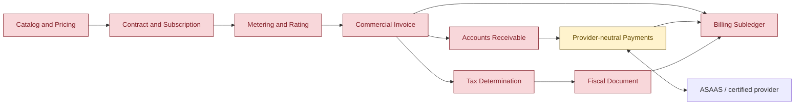
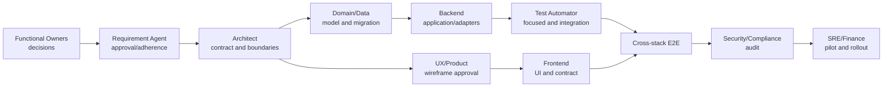
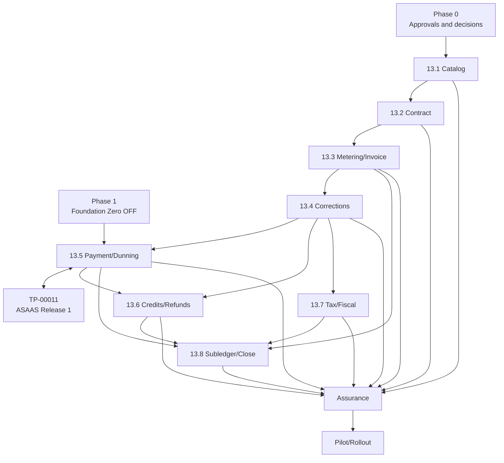

# TP-00013 — Enterprise Billing Implementation

**Document ID:** `TP-00013`
**Primary Nature:** `Plano`
**Objective:** Coordenar a implementação incremental, segura e verificável do Billing enterprise definido pelos UC-00038 a UC-00045.
**Scope:** Backend, frontend, contratos, persistência, segurança, observabilidade, integrações, testes, migração, rollout e handoffs dos oito workstreams enterprise de Billing.
**Non-objectives:** Implementar ou habilitar capabilities por força deste fechamento; atestar identidade legal, regras fiscais/contábeis, PCI, merchant/capabilities ASAAS, Sandbox, SLO, backup, piloto ou produção; substituir o REQ-00042, os UCs, os ADRs ou o primeiro release ASAAS do TP-00011.
**Project:** SaaS Service — Contador Fiscal
**Date:** 2026-09-12 (v4.22)
**Status:** In Progress — `D-00 = RELEASED_WITH_SCOPE — HUMAN_EXPLICIT — TP-00013 local-only`; S1–S6 puros de pricing, o cutover read-only Billing e os kernels FLAG/QUANTITY foram validados localmente; implementação enterprise global continua `NOT_PROVEN` e runtime/rollout dependem de evidências e autorizações próprias
**Author / Owner:** Codex / @AgentOrchestrator / Engenharia, Produto, Financeiro e Arquitetura
**Keywords:** billing, catálogo, pricing, promoção, contrato, assinatura, metering, rating, invoice, payment, refund, NFS-e, subledger, multitenancy
**Related Files:** REQ-00042; UC-00038–UC-00045; TP-00011; cutover de leitura `IP-BE-13.0.1-billing-read-api-cutover`/`IP-FE-13.0.1-billing-read-api-cutover`; kernels atômicos `IP-BE-13.1.3-flag-entitlement-decision-kernel` e `IP-BE-13.1.4-quantity-entitlement-decision-kernel`; oito planos backend `IP-BE-13.1.1-billing-catalog-pricing-promotions`–`IP-BE-13.8.1-billing-financial-close-reporting`; oito planos frontend `IP-FE-13.1.1-billing-catalog-pricing-promotions`–`IP-FE-13.8.1-billing-financial-close-reporting`
**Code References:** `backend/src/main/java/br/com/duoset/saas_service/contexts/billing/`, `backend/src/main/resources/db/migration/billing/`, target ainda inexistente `backend/src/main/resources/db/migration/billing-platform/`, `frontend/src/`, contratos planejados em `docs/contracts/`
**Principal Statement:** O Release 0 provider-neutral permanece no recorte já implementado. Todas as decisões `D-01` a `D-14` estão fechadas no registro da Section 4.4; `D-04.4-D` tem proveniência humana explícita e `D-04.4-E` a `D-14` preservam proveniência `AI_DELEGATED`. Em 2026-08-25, o solicitante humano, proprietário declarado, liberou `D-00` exclusivamente para implementação local dos planos do TP-00013, incluindo backend, frontend, DDL, migrations e testes herméticos; chamadas externas, Sandbox ASAAS, piloto BP Farias, produção, flags `ON` e efeitos reais continuam excluídos.

**References:**
[Product Vision](../../product/business/product-vision.md) ·
[REQ-00005 — Plan Feature Matrix](../../product/requirements/REQ-00005-plan-feature-matrix.md) ·
[REQ-00011 — Chatbot Usage Limits and Billing](../../product/requirements/REQ-00011-chatbot-usage-limits-and-billing.md) ·
[REQ-00029 — Architecture Enforcement Gates](../../product/requirements/REQ-00029-backend-architecture-enforcement-gates.md) ·
[REQ-00030 — Multitenancy Isolation](../../product/requirements/REQ-00030-multitenancy-isolation-verification.md) ·
[REQ-00034 — Billing AS-IS Baseline](../../product/requirements/REQ-00034-phase2-billing-subscription-usage.md) ·
[REQ-00042 — Enterprise Billing](../../product/requirements/REQ-00042-enterprise-multitenant-billing-invoicing.md) ·
[ADR-0000 — Documentation Governance](../../../harness/governance/decisions/ADR-0000-governanca-do-harness-documental.md) ·
[ADR-0001 — Technology and Architecture](../../backend/docs/adrs/ADR-0001-technology-stack-and-architecture.md) ·
[ADR-0006 — Audit and Compliance](../../backend/docs/adrs/ADR-0006-audit-compliance.md) ·
[ADR-0009 — Dynamic RBAC](../../backend/docs/adrs/ADR-0009-dynamic-rbac-evolution.md) ·
[ADR-0010 — Tenant Plan Parametrization](../../backend/docs/adrs/ADR-0010-tenant-plan-parametrization.md) ·
[ADR-0011 — Resilience](../../backend/docs/adrs/ADR-0011-resilience-retry-circuit-breaker.md) ·
[ADR-0012 — Error Handling and Observability](../../backend/docs/adrs/ADR-0012-error-handling-observability.md) ·
[ADR-0013 — Frontend Architecture](../../frontend/docs/adrs/ADR-0013-frontend-architecture-state-management.md) ·
[ADR-0019 — Database per Tenant](../../backend/docs/adrs/ADR-0019-database-per-tenant.md) ·
[ADR-0023 — Provider-neutral Payments](../../backend/docs/adrs/ADR-0023-agnostic-payment-provider-integration.md) ·
[ADR-0024 — Hosted Card Security](../../backend/docs/adrs/ADR-0024-seguranca-tokenizacao-cartao-recorrente.md) ·
[ADR-0025 — Financial Delinquency and Recovery](../../backend/docs/adrs/ADR-0025-suspensao-tenant-inadimplencia-recuperacao.md) ·
[ADR-0026 — Billing API Tenant/Admin Cutover](../../backend/docs/adrs/ADR-0026-billing-api-tenant-admin-cutover.md) ·
[ADR-0027 — Global Catalog and Tenant-local Billing](../../backend/docs/adrs/ADR-0027-catalogo-global-faturamento-local.md) ·
[ADR-0028 — Versioned Entitlements and Tenant-local Contract Snapshots](../../backend/docs/adrs/ADR-0028-entitlements-versionados-tenant-local.md) ·
[ADR-0029 — Typed Entitlement Grants and Restrictions](../../backend/docs/adrs/ADR-0029-taxonomia-tipificada-entitlements.md) ·
[ADR-0030 — Deterministic Entitlement Composition and Enforcement](../../backend/docs/adrs/ADR-0030-composicao-deterministica-enforcement-entitlements.md) ·
[ADR-0032 — Versioned Entitlement Adoption and Grandfathering](../../backend/docs/adrs/ADR-0032-adocao-versionada-grandfathering-entitlements.md) ·
[ADR-0034 — Non-destructive Entitlement Transition Effects](../../backend/docs/adrs/ADR-0034-efeitos-transicao-nao-destrutiva-entitlements.md) ·
[ADR-0035 — Evidence-first Legacy Entitlement Migration](../../backend/docs/adrs/ADR-0035-migracao-evidence-first-entitlements-legados.md) ·
[ADR-0036 — Entitlement Cache, LKG and Fail-safe](../../backend/docs/adrs/ADR-0036-cache-lkg-fail-safe-entitlements.md) ·
[ADR-0037 — Physical Entitlement Boundary in Billing](../../backend/docs/adrs/ADR-0037-boundary-fisico-entitlements-billing.md) ·
[ADR-0038 — Typed Pricing, Currency and Cadence](../../backend/docs/adrs/ADR-0038-pricing-tipado-moeda-cadencia.md) ·
[ADR-0039 — Typed Promotion Benefit Taxonomy](../../backend/docs/adrs/ADR-0039-taxonomia-beneficios-promocionais.md) ·
[ADR-0040 — Promotion Eligibility and Coupon Security](../../backend/docs/adrs/ADR-0040-elegibilidade-promocional-seguranca-cupons.md) ·
[ADR-0041 — Deterministic Promotion Stacking and Waterfall](../../backend/docs/adrs/ADR-0041-stacking-waterfall-promocional-deterministico.md) ·
[ADR-0042 — Promotion Capacity and Redemption](../../backend/docs/adrs/ADR-0042-capacidade-redemption-promocional-concorrente.md) ·
[ADR-0043 — Promotion Lifecycle and Governance](../../backend/docs/adrs/ADR-0043-governanca-lifecycle-promocional.md) ·
[ADR-0044 — Contract Lifecycle and Proration](../../backend/docs/adrs/ADR-0044-lifecycle-contratual-proration-assinaturas.md) ·
[ADR-0045 — Metering, Rating and Invoice Close](../../backend/docs/adrs/ADR-0045-metering-rating-fechamento-fatura.md) ·
[ADR-0046 — Invoice Correction and Reissue](../../backend/docs/adrs/ADR-0046-correcao-cancelamento-reemissao-fatura.md) ·
[ADR-0047 — Credits, Refunds, Disputes and Write-off](../../backend/docs/adrs/ADR-0047-ledger-creditos-refunds-disputas-writeoff.md) ·
[ADR-0048 — Commercial Invoice and NFS-e](../../backend/docs/adrs/ADR-0048-separacao-fatura-comercial-documento-fiscal-nfse.md) ·
[ADR-0049 — Tenant-local Subledger and MRR](../../backend/docs/adrs/ADR-0049-subledger-tenant-local-mrr-normalizado.md) ·
[ADR-0050 — Billing RBAC, SoD and Approvals](../../backend/docs/adrs/ADR-0050-rbac-sod-aprovacoes-financeiras.md) ·
[ADR-0051 — Billing SLO, Capacity and Rollout](../../backend/docs/adrs/ADR-0051-slo-capacidade-rollout-billing.md) ·
[TP-00011 — Billing ASAAS First Release](TP-00011-billing-asaas-first-release-task-plan.md) ·
[Software Engineering Lifecycle](../../agents/standards/software-engineering-lifecycle.md) ·
[Security Standard](../../agents/standards/security-standard.md) ·
[Backend Testing Standard](../agents/standards/backend-testing-standard.md) ·
[Frontend Testing Standard](../agents/standards/frontend-testing-standard.md).

---

# 1. Overview

Este plano coordena oito workstreams funcionais e vinte e três planos técnicos:
dezesseis ligados diretamente aos UCs, dois do cutover de leitura, três corretivos
de quota e dois kernels atômicos de entitlement. Eles levam o Billing do baseline mínimo do
REQ-00034 ao modelo enterprise aprovado no REQ-00042. A execução é organizada por
gates, e não por promessa de calendário. A fase decisória está completa; contratos
executáveis, evidências técnicas e attestations de Produto, Financeiro,
Jurídico/Tributário, Segurança, Controladoria e Operações ainda impedem afirmar
readiness, estimar com confiança ou habilitar os slices de negócio.

O recorte inicialmente elegível era o **Foundation Zero** do
`IP-BE-13.5.1-billing-payment-reconciliation-dunning`. A liberação humana escopada
de 2026-08-25 amplia o envelope apenas para implementação local dos dezesseis
child IPs por UC e dos dois IPs transversais deste TP, incluindo backend,
frontend, DDL, migrations e testes herméticos. Toda capability permanece
desabilitada por padrão, sem chamada
externa, Sandbox ASAAS, piloto BP Farias, produção ou efeito real. Esse envelope
produz artefatos e evidência executável sem converter implementação local em
readiness ou rollout.

O [TP-00011](TP-00011-billing-asaas-first-release-task-plan.md) continua sendo o
plano do **Release 1 ASAAS**. Este TP-00013 governa o domínio enterprise e os
contratos canônicos; o TP-00011 governa adapter, certificação Sandbox, cutover e
operação do primeiro provider. NFS-e, subledger completo, multimoeda e providers
adicionais permanecem fora do Release 1, embora seus boundaries sejam preservados
desde a fundação.

## 1.1 Outcomes

Ao término integral deste plano, sujeito às aprovações e evidências:

1. catálogo, preço, promoção, contrato e assinatura serão versionados e reproduzíveis;
2. uso, rating, billing run e invoice terão lineage até fatos e versões de cálculo;
3. correções preservarão documentos finalizados por mecanismos compensatórios;
4. cobranças, pagamentos, allocations, dunning, créditos, refunds e disputes serão
   provider-neutral e reconciliáveis;
5. fatura comercial, NFS-e, recebimento e subledger manterão estados independentes;
6. frontend e backend compartilharão contrato versionado, RBAC e erros verificáveis;
7. todos os fluxos serão tenant-scoped, auditáveis, idempotentes e operáveis;
8. rollout e rollback impedirão dupla cobrança, perda de fatos ou corrupção histórica.

## 1.2 Planning Horizon

Não há estimativa de sprint aprovada. O plano usa **ondas sequenciais**; estimativas
de release somente poderão ser registradas após resolver os gates de
artefato/evidência da Section 4. `D-00` já permite implementar localmente os child
IPs, mas não prova prazo, completude, readiness ou elegibilidade operacional. Cada
child IP deverá decompor sua onda em entregas pequenas, reversíveis e comprováveis.

---

# 2. Authority, Scope Guard and Execution Envelope

## 2.1 Authority Status

| Source | Status | Effect on this plan |
|---|---|---|
| ADR-0023 | `Accepted` | Autoriza arquitetura de pagamento provider-neutral, ASAAS primário e Stripe como contingência controlada. |
| ADR-0024 | `Accepted — AI_DELEGATED` | Aceita o boundary de cartão hosted e mantém recorrência card-on-file desabilitada até PCI/capability/Sandbox comprovados. |
| ADR-0025 | `Accepted — AI_DELEGATED` | Separa `FINANCIAL_ACCESS_RESTRICTION` de risco, fixa grace/recovery e mantém escaladas não comprovadas desligadas. |
| ADR-0026 | `Accepted` | Congela namespaces tenant/admin, elimina aliases globais pre-producao e proibe MSW como fallback de runtime. |
| ADR-0027 | `Accepted` | Congela o catálogo seller-owned em `saas_platform` e snapshots/invoices no banco dedicado do tenant, sem transação distribuída. |
| ADR-0028 | `Accepted` | Congela `EntitlementBundleVersion` global imutável, `ContractEntitlementSnapshot` completo tenant-local e avaliação por projeção local derivada; restringe defaults vivos, `COALESCE`, enums e fallbacks como autoridade. |
| ADR-0029 | `Accepted` | Congela a taxonomia tipada de base comercial, add-on, promoção, exceção operacional e restrição de segurança/abuso/compliance; separa uso observado e proíbe override genérico. |
| ADR-0030 | `Accepted` | Congela tipos/operadores fechados, grants comutativos, restrição dominante, unlimited explícito, estados e modos de enforcement; separa uso e rating. |
| ADR-0032 | `Accepted` | Congela contrato pinned por default e adoção somente por policy aceita, versão exata, nova revisão e snapshot tenant-local; proíbe latest, fan-out e repricing implícito. |
| ADR-0034 | `Accepted` | Congela efeitos não destrutivos: revisão all-or-nothing, dívida de capacidade, policies de dados sem auto-delete, admission lease bounded e segmentação prospectiva sem retroatividade. |
| ADR-0035 | `Accepted` | Congela migração evidence-first por tenant: inventário/fingerprint, manifest exato, backfill/shadow sem efeitos, cutover fenced, single authority e BP Farias somente com attestation. |
| ADR-0036 | `Accepted` | Congela cache/LKG derivados, classes de operação, TTLs/epochs/invalidação e fail-safe para quota, custo, financeiro, administração, provider e risco. |
| ADR-0037 | `Accepted` | Congela Entitlements dentro de `contexts.billing`, APIs públicas estreitas, adapters platform/tenant, stores e migrations separados, marker/outbox/cache derivados e tenant guard sem fallback compartilhado. |
| ADR-0038 | `Accepted` | Congela o núcleo de pricing tipado, determinístico e versionado: BRL no primeiro slice, cadências/modelos allowlisted, aritmética decimal exata, `PriceVersion` imutável/pinned e simulação pura sem fórmula arbitrária ou provider. |
| ADR-0039 | `Accepted` | Congela a taxonomia fechada e as fronteiras de autoridade dos benefícios promocionais, separando efeito monetário, grant de entitlement e crédito financeiro sem adjustment genérico ou provider. |
| ADR-0040 | `Accepted` | Congela eligibility promocional por policy imutável, fatos/predicados fechados e tri-state fail-closed; cupons usam quatro modos, HMAC sem plaintext, anti-enumeration, tenant scope e reavaliação, sem antecipar redemption. |
| ADR-0041 | `Accepted` | Congela combinação promocional stateless por policy imutável, pacote atômico, três grupos, exclusividade/prioridade, waterfall, best price, caps/allocation e hash determinísticos, sem antecipar budget/redemption. |
| ADR-0042 | `Accepted — HUMAN_EXPLICIT` | Congela capacidade/redemption promocional concorrente no PostgreSQL da plataforma e saga idempotente tenant-local. |
| ADR-0043 | `Accepted — AI_DELEGATED` | Congela lifecycle/governança promocional, publicação, pause/revoke, SoD handoff e capacidade compensatória. |
| ADR-0044 | `Accepted — AI_DELEGATED` | Congela lifecycle contratual, activation, trial, amendment, proration, pause e cancelamento. |
| ADR-0045 | `Accepted — AI_DELEGATED` | Congela metering append-only, quota/admission PostgreSQL, rating pinned, late events e close tenant-local. |
| ADR-0046 | `Accepted — AI_DELEGATED` | Congela taxonomia de resend/regenerate/void/replacement/credit/debit e artifacts imutáveis. |
| ADR-0047 | `Accepted — AI_DELEGATED` | Congela ledger de créditos/unapplied cash, refund, dispute/chargeback e write-off. |
| ADR-0048 | `Accepted — AI_DELEGATED` | Separa fatura comercial/NFS-e e mantém automação fiscal OFF até owner attestation. |
| ADR-0049 | `Accepted — AI_DELEGATED` | Congela subledger gerencial tenant-local, BRL e `MRR_V1`; capabilities estatutárias permanecem OFF. |
| ADR-0050 | `Accepted — AI_DELEGATED` | Congela authorities finas, tenant/purpose scope, four-eyes sem threshold, MFA e break-glass restrito. |
| ADR-0051 | `Accepted — AI_DELEGATED` | Congela targets de SLO/capacidade/RPO/RTO e rollout dark-to-GA, sem declarar readiness medida. |
| REQ-00034 | `Approved` | Define e protege o baseline AS-IS durante a migração. |
| REQ-00042 | `Approved — AI_DELEGATED / Not Implemented` | Congela o alvo funcional; não habilita capability nem substitui evidência externa. |
| UC-00038–UC-00045 | `Approved — AI_DELEGATED / Not Implemented` | Congelam fluxos-alvo com revisão humana aberta e efeitos desligados até os gates aplicáveis. |
| TP-00011 | `Proposed` | Coordena o Release 1 ASAAS e mantém seis blockers explícitos. |
| Solicitação de 2026-08-21 | `Execution request` | Autoriza criar os planos e iniciar somente o Foundation Zero seguro definido abaixo. |
| Solicitação de 2026-08-22 | `Execution request with delegated decisions` | Autoriza resolver escolhas de custo/arquitetura pré-produção e implementar a fatura recorrente real, backend e frontend, sem MSW, no recorte congelado de `IP-BE-13.3.1-billing-usage-rating-invoice-close` e `IP-FE-13.3.1-billing-usage-rating-invoice-close` v1.1. |
| Solicitações de 2026-08-23 e 2026-08-24 | `Decision-only request` | Congelam nova implementação até concluir `D-01` a `D-14`; aprovam `D-01`, `D-02`, `D-03`, `D-04.1`, incrementalmente `D-04.2-A` a `D-04.2-H — opção A`, `D-04.3 — opção A` e `D-04.4-A` a `D-04.4-C — opção A`, exigindo materialização em Markdown. |
| Solicitação de 2026-08-25 — `D-04.4-D` | `Human explicit decision` | Aprova diretamente `D-04.4-D — opção A`; sua proveniência permanece `HUMAN_EXPLICIT` e não integra o lote decidido pela IA. |
| `AUTH-BILLING-2026-08-25-001` | `Owner-delegated decision authority` | Delega ao Codex a seleção e materialização autônoma de `D-04.4-E` até o encerramento das decisões de Billing, exigindo proveniência `AI_DELEGATED` e revisão humana futura identificável. Não delega implementação, acesso externo ou attestations. |
| Solicitação de 2026-08-25 — `D-00` | `Human explicit scoped implementation release` | O solicitante humano, proprietário declarado, libera somente a implementação local dos planos do TP-00013; não autoriza chamadas externas, Sandbox ASAAS, piloto BP Farias ou produção. |

Este Task Plan não promove requisito ou UC. A exceção controlada do Foundation Zero
é estritamente técnica: nenhum cliente, operador, job ou integração consegue
acioná-la enquanto as flags permanecerem `OFF` e não existir adapter registrado.

As solicitações explícitas do usuário em 2026-08-21 aprovaram a transição
`Proposed → Approved → In Progress` do Foundation Zero e, na solicitação mais
recente, autorizaram sua continuação pelo lote F0-B, com revisão prévia de
arquitetura, segurança e lições aprendidas. Naquele checkpoint, essa aprovação não
alterava o então estado `Draft` do REQ-00042/UCs, não aprovava decisões de negócio
e não autorizava nenhum dos
32 itens originalmente marcados como bloqueados, exceto o Release 0 de invoice
expressamente delimitado na Section 2.5 e em
`IP-BE-13.3.1-billing-usage-rating-invoice-close` v1.4 e
`IP-FE-13.3.1-billing-usage-rating-invoice-close` v1.4.

### 2.1.1 Delegated Billing decision authority

| Field | Recorded value |
| --- | --- |
| Authority ID | `AUTH-BILLING-2026-08-25-001` |
| Grantor | Solicitante, declarado proprietário do SaaS; a identidade e a titularidade não foram verificadas criptograficamente pelo repositório. |
| Granted at | `2026-08-25`, timezone `America/Recife` |
| Decision agent | `AI_AGENT — Codex (OpenAI)` |
| Included scope | Selecionar, aceitar documentalmente e reconciliar as decisões de Billing de `D-04.4-E` a `D-14`, além de classificar os gates depois dessas decisões. |
| Explicitly excluded | `D-04.4-D`, já decidido diretamente pelo humano; código, DDL, migrations, configuração, Git, chamadas externas, Sandbox, rollout, produção, segredos e qualquer movimentação financeira/fiscal. |
| Attestations not delegated | Identidade legal/fiscal da GV Software, merchant/capabilities/tarifas ASAAS, PCI/SAQ/QSA, obrigação/layout NFS-e, alíquotas/retenções/IBS-CBS, política contábil estatutária, capacidade/SLO medidos, backup/restore e aceite de piloto/produção. |
| Human substantive review | `NOT_PERFORMED` para cada decisão `AI_DELEGATED`, até registro posterior individual. |
| Reviewability | `OPEN`; um humano pode ratificar, emendar ou superseder cada decisão, mas nunca apagar sua origem de IA. |

O lifecycle `Accepted` de um ADR sob esta autoridade significa que a decisão é
normativa para o planejamento do projeto, e não que houve aprovação humana. Cada
ADR do lote deve repetir a proveniência, o ator, a authority ID, o status de
revisão humana e a reviewability. Evidência externa ausente é classificada como
`Pending Evidence` com owner; a IA não a substitui por suposição nem a chama de
decisão aberta.

### 2.1.2 D-00 scoped local implementation release

| Field | Recorded value |
| --- | --- |
| Disposition | `RELEASED_WITH_SCOPE — HUMAN_EXPLICIT — TP-00013 local-only` |
| Actor | Solicitante humano, proprietário declarado; identidade e titularidade não verificadas criptograficamente pelo repositório. |
| Recorded at | `2026-08-25`, timezone `America/Recife` |
| Recorded wording | “D-00 liberado para implementação local dos planos do TP-00013, incluindo backend, frontend, DDL, migrations e testes. Esta liberação não autoriza chamadas externas, Sandbox ASAAS, piloto BP Farias ou produção, que permanecem sujeitos aos respectivos gates de evidência.” |
| Included scope | Implementação local dos child IPs do TP-00013, agora incluindo os dois planos transversais `IP-BE-13.0.1-billing-read-api-cutover`/`IP-FE-13.0.1-billing-read-api-cutover`: backend, frontend, contratos executáveis necessários, DDL, migrations e testes herméticos locais. |
| Explicitly excluded | Chamadas externas; qualquer ambiente ou credencial ASAAS, inclusive Sandbox; piloto ou exercício tenant-specific BP Farias; produção; deploy/rollout operacional; flags habilitadas/default-on; dados, credenciais, movimentações ou efeitos financeiros, fiscais e comerciais reais. |
| Evidence effect | Nenhum gate de artefato/evidência é satisfeito por esta autorização. Implementation e readiness permanecem `NOT_PROVEN`, evidências `PENDING` e capabilities/efeitos `OFF` até comprovação e autorização próprias. |
| Relationship to delegated authority | Evento humano independente; não altera `AUTH-BILLING-2026-08-25-001`, a proveniência `AI_DELEGATED`, `Human substantive review: NOT_PERFORMED` ou `Reviewability: OPEN` das decisões D-04.4-E a D-14. |

## 2.2 Scoped Local Implementation — Allowed Work

A liberação humana de `D-00` permite executar localmente os planos backend e
frontend do TP-00013, inclusive contratos, DDL, migrations e testes herméticos,
desde que as dependências normativas de cada IP sejam respeitadas e todas as
capabilities permaneçam `OFF`. O Foundation Zero abaixo continua sendo um
subconjunto seguro e já delimitado desse envelope:

1. value objects e contratos provider-neutral que não codifiquem preço, rail,
   prazo, alíquota, multa, grace, entitlement ou política de ativação;
2. `PaymentProviderPort` sem implementação ativa e sem import de SDK externo em
   domain/application;
3. capability registry que falhe fechado quando nenhum provider/capability estiver
   explicitamente habilitado;
4. aggregate/state machine técnico de `ProviderCommand`, sem aplicar efeito em
   invoice, payment, subscription, entitlement ou ledger;
5. command journal tenant-scoped cuja identidade e evidência são imutáveis, com
   lifecycle técnico monotônico, chave lógica única por tenant/provider mesmo após
   rotação de account alias, fingerprint, referências opacas/códigos sanitizados,
   versionamento otimista, timestamps e estados reproduzíveis; uma timeline
   append-only separada somente será criada quando seu contrato de auditoria for
   aprovado;
6. migration exclusivamente aditiva para o journal, sem backfill, sem alteração de
   coluna existente e sem valor de negócio implícito;
7. feature flags desligadas por default em todos os ambientes;
8. testes unitários, PostgreSQL/Testcontainers, tenancy A/B, concorrência, Modulith,
   ArchUnit e regressão do baseline;
9. métricas técnicas de baixa cardinalidade, logs sanitizados e audit metadata sem
   payload financeiro ou segredo;
10. documentação e contract sentinels necessários para provar que o código dormente
    não altera contratos ou comportamento AS-IS;
11. artefatos locais dos demais child IPs, inclusive backend, frontend, DDL,
    migrations e testes, sem habilitação de capability nem efeito real.

## 2.3 Explicitly Forbidden in the Scoped Local Release

Mesmo quando modelados e testados hermeticamente em ambiente local, é proibido:

- chamar ASAAS, Stripe, autoridade fiscal, banco, ERP ou qualquer endpoint externo;
- acessar ambiente, credencial ou dado ASAAS, inclusive Sandbox;
- receber webhook externo ou usar payload, conta, segredo ou dado real;
- executar piloto, backfill, cutover ou exercício tenant-specific com BP Farias;
- acessar, implantar ou executar em produção ou em qualquer ambiente externo;
- habilitar flag por default ou colocá-la `ON` em ambiente compartilhado;
- criar ou aplicar cobrança, allocation, dunning, credit memo, refund, write-off,
  dispute, NFS-e, posting, reconhecimento de receita, fechamento ou KPI com efeito
  real;
- publicar preço, promoção, contrato, fatura, comunicação ou mudança comercial
  para usuário/tenant real;
- reutilizar resultado ambíguo para fallback automático entre providers.

Entidades e estados sintéticos correspondentes podem ser modelados, persistidos e
exercitados em testes herméticos locais. Isso não configura capability ativa,
evidência Sandbox, piloto, rollout ou efeito financeiro/fiscal/comercial.

## 2.4 Exit Rule for Foundation Zero

Foundation Zero estará concluído apenas quando:

- todas as flags novas estiverem comprovadamente `OFF` por default;
- zero bean novo de adapter externo estiver registrado no perfil default;
- nenhuma rota, job, webhook ou consumidor da fundação nova estiver acessível;
- migrations passarem em instalação limpa e upgrade do baseline;
- concorrência provar uma chave lógica/fingerprint sem duplicação;
- tenant A não conseguir observar ou conflitar com command de tenant B;
- testes arquiteturais impedirem tipos ASAAS/Stripe nas camadas neutras;
- a suíte impactada e os gates globais estiverem verdes;
- o diff comprovar ausência de mudança de comportamento do REQ-00034.

Essas alegações são deliberadamente limitadas à fundação nova. O checkout,
webhook, scheduler, `PaymentGatewayPort` e adapter Stripe do REQ-00034 são legado
AS-IS, não são desligados pela flag F0-B e exigem kill switch e validação tenant
antes de qualquer implementação externa real. Concluir Foundation Zero **não**
desbloqueia automaticamente nenhum outro slice.

## 2.5 Invoice Release 0 — Allowed Work

Somente o recorte abaixo é adicionalmente autorizado pela solicitação de
`2026-08-22`; as decisões e o contrato completos estão nos
[IP-BE-13.3.1-billing-usage-rating-invoice-close v1.4](../../backend/docs/specs/IP-BE-13.3.1-billing-usage-rating-invoice-close.md)
e
[IP-FE-13.3.1-billing-usage-rating-invoice-close v1.4](../../frontend/docs/specs/IP-FE-13.3.1-billing-usage-rating-invoice-close.md):

1. uma fatura comercial recorrente por tenant e competência mensal, baseada
   somente no plano e price book internos congelados;
2. aggregate/tabelas novos e provider-neutral, sem ampliar o modelo legado Stripe;
3. número comercial distinguível globalmente por prefixo do tenant, sem natureza
   fiscal nem promessa gapless;
4. linhas, snapshot/hash, idempotência, journal técnico balanceado e outbox no
   mesmo commit do banco tenant;
5. APIs `POST/GET` tenant-scoped, `ROLE_TENANT_ADMIN`, BOLA fail-closed, paginação
   limitada e respostas `no-store`;
6. tela de emitir/listar integrada ao backend real, sem cálculo financeiro no
   browser e sem dependência do handler Billing do MSW;
7. testes unitários, de contrato, persistência PostgreSQL, concorrência,
   isolamento A/B, arquitetura e backend-real proporcionais ao risco;
8. feature disponível somente de forma dormente para desenvolvimento e testes
   locais sintéticos, com flags `OFF`; nenhum piloto ou exercício BP Farias está
   autorizado por esta execução.

Continuam proibidos no Release 0: usage overage, desconto/promoção, proration,
correção/reemissão, cross-tenant payer, cobrança/provider, pagamento, dunning,
NFS-e, refund/dispute, reconhecimento de receita e reporting contábil. A conclusão
do Release 0 não promove o UC-00040 inteiro nem desbloqueia UC-00041–UC-00045.

---

# 3. Child Implementation Plan Portfolio

Cada workstream possui um owner técnico por área. Um IP backend não autoriza UI;
um IP frontend não autoriza endpoint. O contrato entre as áreas deve ser aprovado e
testado antes de execução paralela. O portfólio possui `23` planos: `16` planos
filhos diretamente associados aos oito UCs, dois planos transversais do cutover
read-only, três corretivos de quota e dois kernels atômicos de entitlement abaixo.

| Transversal | Backend Implementation Plan | Frontend Implementation Plan | Current Gate |
|---|---|---|---|
| `13.0` — Billing read API cutover | [IP-BE-13.0.1-billing-read-api-cutover](../../backend/docs/specs/IP-BE-13.0.1-billing-read-api-cutover.md) | [IP-FE-13.0.1-billing-read-api-cutover](../../frontend/docs/specs/IP-FE-13.0.1-billing-read-api-cutover.md) | `In Progress / Local implementation present / Effects OFF`: código e gates locais focalizados existem; PostgreSQL real e E2E autenticado continuam abertos. |
| `13.1-A` — FLAG decision kernel | [IP-BE-13.1.3-flag-entitlement-decision-kernel](../../backend/docs/specs/IP-BE-13.1.3-flag-entitlement-decision-kernel.md) | N/A — domínio interno sem UI | `Done — repository-local v1.2`; não conclui F-BIL-002 integral nem cria runtime. |
| `13.1-B` — QUANTITY decision kernel | [IP-BE-13.1.4-quantity-entitlement-decision-kernel](../../backend/docs/specs/IP-BE-13.1.4-quantity-entitlement-decision-kernel.md) | N/A — domínio interno sem UI | `Done — repository-local v1.1`; três paths puros, focal `30/30`, impactada `78/78`, arquitetura `29/29` e Quality Gate `107/107`, todos zero-skip; sem API, store, provider ou efeito. |
| `13.1-C` — LEVEL decision kernel | [IP-BE-13.1.5-level-entitlement-decision-kernel](../../backend/docs/specs/IP-BE-13.1.5-level-entitlement-decision-kernel.md) | N/A — domínio interno sem UI | `Done v1.0`; LEVEL_MAX, LEVEL_CAP/DENY, freshness, lineage e hash; focal `4/4`, sem API, store, provider ou efeito. |
| `13.1-D` — VOLUME_TIER pricing kernel | [IP-BE-13.1.7-volume-tier-pricing-kernel](../../backend/docs/specs/IP-BE-13.1.7-volume-tier-pricing-kernel.md) | N/A — domínio interno sem UI | `Done v1.0`; seleção por quantidade total, decimal exato e HALF_EVEN; focal `3/3`, sem API, store, provider ou efeito. |
| `13.3-A` — Chatbot atomic admission | [IP-BE-13.3.4-chatbot-quota-atomic-admission](../../backend/docs/specs/IP-BE-13.3.4-chatbot-quota-atomic-admission.md) | N/A — não há entrega de UI | Backend repository-local em progresso; Quality Gate PR bloqueado pelo baseline JaCoCo. |
| `13.3-B` — Chatbot quota KPI | [IP-BE-13.3.5-chatbot-quota-kpi-read-model](../../backend/docs/specs/IP-BE-13.3.5-chatbot-quota-kpi-read-model.md) | [IP-FE-13.3.5-chatbot-quota-kpi-inbound-usage](../../frontend/docs/specs/IP-FE-13.3.5-chatbot-quota-kpi-inbound-usage.md) | Implementação repository-local concluída; PostgreSQL/HTTP/UI/focused/build verdes, com gates PR amplos bloqueados apenas pelos baselines globais documentados. |

Os `16` planos por UC são:

| Workstream | Use Case | Backend Implementation Plan | Frontend Implementation Plan | Initial Gate |
|---|---|---|---|---|
| `13.1` | [UC-00038 — Catalog, Pricing and Promotions](../../product/use-cases/UC-00038-billing-catalog-pricing-promotions.md) | [IP-BE-13.1.1-billing-catalog-pricing-promotions](../../backend/docs/specs/IP-BE-13.1.1-billing-catalog-pricing-promotions.md) | [IP-FE-13.1.1-billing-catalog-pricing-promotions](../../frontend/docs/specs/IP-FE-13.1.1-billing-catalog-pricing-promotions.md) | `Decision-complete / Local implementation authorized / Effects OFF`: OpenAPI/DDL/UI/testes podem ser produzidos localmente; evidência e habilitação continuam pendentes. |
| `13.2` | [UC-00039 — Contracts and Subscription Amendments](../../product/use-cases/UC-00039-billing-contract-subscription-amendments.md) | [IP-BE-13.2.1-billing-contract-subscription-amendments](../../backend/docs/specs/IP-BE-13.2.1-billing-contract-subscription-amendments.md) | [IP-FE-13.2.1-billing-contract-subscription-amendments](../../frontend/docs/specs/IP-FE-13.2.1-billing-contract-subscription-amendments.md) | `Decision-complete / Local implementation authorized / Effects OFF`: contratos, migrations, UI e testes podem ser produzidos localmente; runtime continua bloqueado. |
| `13.3` | [UC-00040 — Usage, Rating and Invoice Close](../../product/use-cases/UC-00040-billing-usage-rating-invoice-close.md) | [IP-BE-13.3.1-billing-usage-rating-invoice-close](../../backend/docs/specs/IP-BE-13.3.1-billing-usage-rating-invoice-close.md) | [IP-FE-13.3.1-billing-usage-rating-invoice-close](../../frontend/docs/specs/IP-FE-13.3.1-billing-usage-rating-invoice-close.md) | `Release 0 In Progress / Enterprise local implementation authorized / Effects OFF`: PostgreSQL e E2E herméticos locais permanecem evidência pendente. |
| `13.4` | [UC-00041 — Invoice Correction and Reissue](../../product/use-cases/UC-00041-billing-invoice-correction-reissue.md) | [IP-BE-13.4.1-billing-invoice-correction-reissue](../../backend/docs/specs/IP-BE-13.4.1-billing-invoice-correction-reissue.md) | [IP-FE-13.4.1-billing-invoice-correction-reissue](../../frontend/docs/specs/IP-FE-13.4.1-billing-invoice-correction-reissue.md) | `Decision-complete / Local implementation authorized / Effects OFF`: artefatos, contratos e testes locais podem avançar; integração externa exige gate próprio. |
| `13.5` | [UC-00042 — Payment, Reconciliation and Dunning](../../product/use-cases/UC-00042-billing-payment-reconciliation-dunning.md) | [IP-BE-13.5.1-billing-payment-reconciliation-dunning](../../backend/docs/specs/IP-BE-13.5.1-billing-payment-reconciliation-dunning.md) | [IP-FE-13.5.1-billing-payment-reconciliation-dunning](../../frontend/docs/specs/IP-FE-13.5.1-billing-payment-reconciliation-dunning.md) | `Foundation Zero In Progress / Local implementation authorized / Effects OFF`: merchant, PCI, Sandbox e provider continuam bloqueando qualquer efeito ou chamada. |
| `13.6` | [UC-00043 — Credits, Refunds and Disputes](../../product/use-cases/UC-00043-billing-credits-refunds-disputes.md) | [IP-BE-13.6.1-billing-credits-refunds-disputes](../../backend/docs/specs/IP-BE-13.6.1-billing-credits-refunds-disputes.md) | [IP-FE-13.6.1-billing-credits-refunds-disputes](../../frontend/docs/specs/IP-FE-13.6.1-billing-credits-refunds-disputes.md) | `Decision-complete / Local implementation authorized / Effects OFF`: provider/contábil/fiscal e evidências continuam gates de capability. |
| `13.7` | [UC-00044 — Tax and Fiscal Documents](../../product/use-cases/UC-00044-billing-tax-fiscal-documents.md) | [IP-BE-13.7.1-billing-tax-fiscal-documents](../../backend/docs/specs/IP-BE-13.7.1-billing-tax-fiscal-documents.md) | [IP-FE-13.7.1-billing-tax-fiscal-documents](../../frontend/docs/specs/IP-FE-13.7.1-billing-tax-fiscal-documents.md) | `Architecture accepted / Local implementation authorized / Capability OFF`: modelos e testes locais sintéticos podem avançar; dados/obrigação/layout/provider/Sandbox continuam `PENDING_EVIDENCE` e nenhuma automação fiscal pode produzir efeito. |
| `13.8` | [UC-00045 — Financial Close and Reporting](../../product/use-cases/UC-00045-billing-financial-close-reporting.md) | [IP-BE-13.8.1-billing-financial-close-reporting](../../backend/docs/specs/IP-BE-13.8.1-billing-financial-close-reporting.md) | [IP-FE-13.8.1-billing-financial-close-reporting](../../frontend/docs/specs/IP-FE-13.8.1-billing-financial-close-reporting.md) | `Management baseline accepted / Local implementation authorized / Statutory OFF`: artefatos e testes gerenciais locais podem avançar; accounts/ERP/revenue recognition/hard close continuam `PENDING_EVIDENCE`. |

## 3.1 Portfolio Dependency Rules

1. `13.1` precede `13.2`, pois contrato deve congelar versões de oferta e preço.
2. `13.1` e `13.2` precedem `13.3`, pois rating exige meter, price version,
   entitlement e timeline contratual.
3. `13.3` precede `13.4`, pois correção só opera sobre documentos emitidos por um
   pipeline reproduzível.
4. `13.4` e Foundation Zero de `13.5` precedem efeitos de cobrança.
5. `13.6` depende de invoice, payment/allocation e correction chain.
6. `13.7` depende do snapshot comercial/fiscal de `13.3` e da correction chain de
   `13.4`; pode evoluir apenas em implementação/testes herméticos locais em
   paralelo a `13.5/13.6`. Sandbox exige autorização separada.
7. `13.8` depende dos fatos canônicos de `13.3`–`13.7`; não pode reconstruir
   silenciosamente fatos ausentes.
8. Frontend de cada workstream depende de wireframe aprovado, OpenAPI/schema
   congelado, RBAC definido e fixtures derivadas do contrato backend.

---

# 4. Decision and Readiness Gates

## 4.1 Gate Catalog

| Gate | Required Evidence | Current disposition | Blocks |
|---|---|---|---|
| `G-REQ` | REQ-00042 e UC-00038–UC-00045 aprovados e rastreáveis. | `DECISION BASELINE SATISFIED`: aprovação `AI_DELEGATED`, implementação `Not Implemented`, revisão humana aberta. | Reabre por mudança normativa. |
| `G-ADH` | Análise versionada entre visão, REQ, ADR, UCs, TP/IPs e AS-IS. | `PASS`: [ANL-00045](../../analysis/ANL-00045-req-00042-billing-decision-adherence-analysis.md); implementation/runtime `NOT_PROVEN`. | Reabre após mudança normativa ou implementação material. |
| `G-COM` | Pricing, promoção, contrato, proration, uso, late events, invoice e correções. | `DECISION BASELINE SATISFIED`: ADR-0038 a ADR-0047; implementação local autorizada. | Evidência executável, validação e habilitação de capability. |
| `G-ACT` | Evento efetivo de ativação/renovação por rail e efeito sobre entitlement. | `DECISION BASELINE SATISFIED`: `PAYMENT_EFFECTIVE` no ADR-0023; Hosted recurrence permanece `OFF`. | Merchant/capability, PCI, Sandbox e reconcile E2E. |
| `G-COL` | Grace, comunicação, encargos, restrição e recuperação. | `DECISION BASELINE SATISFIED`: ADR-0025. | Templates, scheduler, fatos provider e testes operacionais. |
| `G-SOD` | Papéis, scopes, alçadas, four-eyes, MFA, seal e break-glass. | `DECISION BASELINE SATISFIED`: ADR-0050. | Contratos/enforcement Keycloak, backend/frontend e testes negativos. |
| `G-API` | Contrato versionado, rotas/DTOs/eventos/erros e sunset. | `PENDING EXECUTABLE EVIDENCE`; namespace foi decidido no ADR-0026 e artefatos podem ser implementados localmente. | Habilitação, compatibilidade comprovada e release; não bloqueia produção local do artefato. |
| `G-DATA` | Ownership, placement, migrations, retenção, legal hold e rollback. | `PARTIAL`: ownership e invariantes aceitos; DDL/migrations/rehearsal podem ser produzidos localmente e continuam pendentes até evidência. | Efeito real, cutover, backfill e release; não bloqueia DDL/migration hermética local. |
| `G-UI` | Wireframes, estados, acessibilidade e fluxos aprovados. | `PENDING`; decisão funcional não substitui UX, mas frontend local com estados sintéticos está autorizado. | Habilitação e release; não bloqueia implementação local default-off. |
| `G-TAX` | Identidade legal, município, regime, tax point, códigos, provider/layout e contingência. | `ARCHITECTURE ACCEPTED / CAPABILITY OFF`: ADR-0048; attestations `PENDING_EVIDENCE`. | UC-00044 e efeitos fiscais. |
| `G-ACC` | Posting rules, close, FX, materialidade, KPI e ERP. | `MANAGEMENT BASELINE ACCEPTED`: ADR-0049; contabilidade estatutária/ERP/FX `OFF`. | Capability estatutária de 13.8. |
| `G-NFR` | SLO, volumes, cardinalidade, dataset, carga e tolerâncias. | `TARGETS ACCEPTED / NOT MEASURED`: ADR-0051. | Performance sign-off e piloto. |
| `G-REL` | Segurança, reconciliação, runbooks, backup/restore, rollback, piloto e on-call. | `BLOCKED / NOT EXECUTED`; nenhuma autorização operacional foi inferida. | Qualquer rollout além do desenvolvimento local permitido. |

## 4.2 Decision Disposition by Workstream

| Workstream | Accepted decision baseline | Remaining execution/evidence boundary | Status |
|---|---|---|---|
| `13.1` | ADR-0027 a ADR-0043 e ADR-0050/ADR-0051. | OpenAPI, DDL, UI, approval enforcement, concorrência/carga e evidência. | `DECISION-COMPLETE / LOCAL IMPLEMENTATION AUTHORIZED / EFFECTS OFF` |
| `13.2` | ADR-0028 a ADR-0037, ADR-0044, ADR-0050 e ADR-0051. | Contracts/events, migrations, calendário/timezone, UI e testes. | `DECISION-COMPLETE / LOCAL IMPLEMENTATION AUTHORIZED / EFFECTS OFF` |
| `13.3` | ADR-0030, ADR-0036/ADR-0037, ADR-0045, ADR-0049 a ADR-0051. | Event schemas, meters, DDL, PostgreSQL, replay, precisão, performance e close E2E. | `DECISION-COMPLETE / LOCAL IMPLEMENTATION AUTHORIZED / RELEASE 0 IN PROGRESS / EFFECTS OFF` |
| `13.4` | ADR-0046, ADR-0048, ADR-0050 e ADR-0051. | Artifact store, reason catalog, fiscal sync, approvals e E2E. | `DECISION-COMPLETE / LOCAL IMPLEMENTATION AUTHORIZED / EFFECTS OFF` |
| `13.5` | ADR-0023 a ADR-0025, ADR-0050 e ADR-0051. | Merchant/capabilities/taxas ASAAS, PCI, Sandbox, webhooks e reconciliation E2E. | `DECISION-COMPLETE / LOCAL IMPLEMENTATION AUTHORIZED / FOUNDATION ZERO IN PROGRESS / EFFECTS OFF` |
| `13.6` | ADR-0047, ADR-0048, ADR-0050 e ADR-0051. | Provider capability, posting/fiscal treatment, contracts, approvals e failure tests. | `DECISION-COMPLETE / LOCAL IMPLEMENTATION AUTHORIZED / EFFECTS OFF` |
| `13.7` | ADR-0048, ADR-0050 e ADR-0051. | Dados e regras legais/fiscais, provider/layout, contingência e certificação. | `DECISION-COMPLETE / LOCAL IMPLEMENTATION AUTHORIZED / CAPABILITY OFF` |
| `13.8` | ADR-0049 a ADR-0051. | Posting estatutário, ERP/FX, dataset, métricas, close e restore. | `DECISION-COMPLETE / LOCAL IMPLEMENTATION AUTHORIZED / STATUTORY OFF` |

## 4.3 Gate Transition Rules

- `Blocked → Pending`: somente após evidência versionada e owner responsável.
- `Pending → In Progress`: child IP existe, está revisado e todos os gates upstream
  aplicáveis estão verdes.
- `In Progress → Done locally`: deliverables e testes do IP estão verdes, mas isso
  não implica release.
- `Done locally → Release candidate`: contract/E2E, segurança, reconciliação,
  observabilidade e rollback do slice estão verdes.
- `Release candidate → Enabled`: exige `G-REL`, flag explícita por ambiente/tenant e
  autorização operacional; nunca ocorre por merge ou deploy automaticamente.

---

## 4.4 Incremental Decision Approval Register

Este registro é a referência central de acompanhamento solicitada pelo responsável
do produto. Ele preserva a disposição, a proveniência e a fonte canônica de cada
decisão. O registro coordena rastreabilidade; não substitui requisito, ADR ou caso
de uso. O fechamento decisório, isoladamente, não liberou software. O evento
humano separado registrado na Section 2.1.2 liberou `D-00` somente para
implementação local dos planos do TP-00013, sem habilitação, efeito externo ou
rollout.

### 4.4.1 Checklist

| ID | Decision package | Status | Canonical materialization / remaining boundary |
| --- | --- | --- | --- |
| `D-00` | Congelar implementação durante a fase de decisões | `RELEASED_WITH_SCOPE — HUMAN_EXPLICIT` | Em 2026-08-25, o solicitante humano, proprietário declarado, autorizou backend, frontend, DDL, migrations e testes herméticos locais dos planos do TP-00013. Chamadas externas, Sandbox ASAAS, piloto BP Farias, produção, flags `ON` e efeitos reais continuam excluídos; implementation/readiness seguem `NOT_PROVEN` e evidências `PENDING`. |
| `D-01` | Contrato de rotas, escopo tenant e migracao sem MSW | `Approved` | [ADR-0026](../../backend/docs/adrs/ADR-0026-billing-api-tenant-admin-cutover.md); OpenAPI/DTOs exatos continuam evidencia de `G-API`, nao decisao de namespace. |
| `D-02` | Escopo e sequencia dos releases | `Approved` | Section 4.4.3 e dependency rules da Section 3.1. |
| `D-03` | Entidade cobradora e modelo comercial | `Approved with explicit condition` | GV Software representa o Hub Contabil, tenant e o pagador, clientes do tenant ficam fora; dados legais/fiscais formais continuam evidencia bloqueadora. |
| `D-04` | Catálogo, preços, promoções e grandfathering | `Approved / Complete` | ADR-0027 a ADR-0043. `D-04.4-D` foi decidida diretamente pelo humano no ADR-0042; `D-04.4-E` foi decidida pela IA delegada no ADR-0043. |
| `D-05` | Assinaturas, amendments, proration e cancelamento | `Approved — AI_DELEGATED` | [ADR-0044](../../backend/docs/adrs/ADR-0044-lifecycle-contratual-proration-assinaturas.md); trial e pause iniciam `OFF`. |
| `D-06` | Uso, rating, quotas e fechamento da fatura | `Approved — AI_DELEGATED` | [ADR-0045](../../backend/docs/adrs/ADR-0045-metering-rating-fechamento-fatura.md). |
| `D-07` | Correção, cancelamento e reemissão | `Approved — AI_DELEGATED` | [ADR-0046](../../backend/docs/adrs/ADR-0046-correcao-cancelamento-reemissao-fatura.md). |
| `D-08` | Meios de pagamento ASAAS e evento efetivo | `Approved — AI_DELEGATED` | [ADR-0023](../../backend/docs/adrs/ADR-0023-agnostic-payment-provider-integration.md) e [ADR-0024](../../backend/docs/adrs/ADR-0024-seguranca-tokenizacao-cartao-recorrente.md); card-on-file `OFF`. |
| `D-09` | Inadimplência, grace, comunicação e restrição | `Approved — AI_DELEGATED` | [ADR-0025](../../backend/docs/adrs/ADR-0025-suspensao-tenant-inadimplencia-recuperacao.md); suspensão automática `OFF`. |
| `D-10` | Créditos, refunds, disputas e write-off | `Approved — AI_DELEGATED` | [ADR-0047](../../backend/docs/adrs/ADR-0047-ledger-creditos-refunds-disputas-writeoff.md). |
| `D-11` | NFS-e, tributação e contingência fiscal | `Approved — AI_DELEGATED / CAPABILITY OFF` | [ADR-0048](../../backend/docs/adrs/ADR-0048-separacao-fatura-comercial-documento-fiscal-nfse.md); automação depende de attestations externas. |
| `D-12` | Subledger, MRR, métricas e fechamento contábil | `Approved — AI_DELEGATED / PARTIAL CAPABILITY OFF` | [ADR-0049](../../backend/docs/adrs/ADR-0049-subledger-tenant-local-mrr-normalizado.md); `MRR_V1` gerencial aceito, estatutário/ERP/FX `OFF`. |
| `D-13` | RBAC, alçadas, four-eyes, MFA e auditoria | `Approved — AI_DELEGATED` | [ADR-0050](../../backend/docs/adrs/ADR-0050-rbac-sod-aprovacoes-financeiras.md). |
| `D-14` | SLO, rollout, reconciliação, rollback e piloto | `Approved — AI_DELEGATED / TARGETS NOT MEASURED` | [ADR-0051](../../backend/docs/adrs/ADR-0051-slo-capacidade-rollout-billing.md). |

`D-04.4-E` a `D-14` foram aceitas pelo `AI_AGENT — Codex (OpenAI)` sob
`AUTH-BILLING-2026-08-25-001`, com revisão humana substantiva `NOT_PERFORMED` e
`Reviewability: OPEN`. PostgreSQL/Testcontainers, E2E autenticado do BP Farias,
dados legais/fiscais e certificação Sandbox ASAAS são evidências futuras, não
pacotes decisórios; elas não ficam verdes por aprovação documental.

### 4.4.2 D-01 — Billing API scope and cutover

**Approved on:** 2026-08-23.
**Authority:** responsavel do produto.
**Canonical decision:** [ADR-0026](../../backend/docs/adrs/ADR-0026-billing-api-tenant-admin-cutover.md).

- tenant: `/api/v1/tenants/{tenantId}/billing/**`;
- plataforma: `/api/v1/admin/billing/**`;
- nenhum alias `/api/v1/billing/**` no projeto pre-producao;
- path tenant igual ao contexto efetivo antes do repository;
- MSW permitido somente em teste isolado, nunca como fallback de runtime;
- `usage` dummy nao constitui entrega;
- MRR governado por `D-12`/ADR-0049; artefatos locais podem ser implementados sob
  a Section 2.1.2, mas disponibilidade depende de evidências e habilitação própria;
- cutover futuro atomico entre contrato, backend, frontend e testes.

**Gate effect:** a escolha de namespace esta fechada; `G-API` permanece bloqueado
pelos schemas OpenAPI/DTO, versionamento e sentinels de contrato ainda ausentes.

### 4.4.3 D-02 — Release scope and sequencing

**Approved on:** 2026-08-23.  
**Authority:** responsavel do produto.

Ordem aprovada para a implementacao futura, somente apos o checklist decisorio:

1. certificar o Invoice Release 0 existente;
2. executar UC-00038 — catalogo, precos e promocoes;
3. executar UC-00039 — contratos e assinaturas;
4. executar UC-00040 — uso, rating e fechamento;
5. executar UC-00041 — correcao e reemissao;
6. executar UC-00042 — pagamentos, ASAAS e dunning;
7. executar UC-00043 — creditos, refunds e disputas;
8. executar UC-00044 — fiscal e NFS-e;
9. executar UC-00045 — fechamento e reporting;
10. concluir piloto e rollout progressivo.

Os marcos sao `RC-1 Commercial Billing` (UC-00038 a UC-00041),
`RC-2 Accounts Receivable` (UC-00042 e UC-00043) e
`RC-3 Fiscal and Finance` (UC-00044 e UC-00045). O TP-00013 e autoridade do
dominio canonico; o TP-00011 e owner do adapter/certificacao/cutover ASAAS. Nenhum
merge ou conclusao local habilita capability automaticamente.

### 4.4.4 D-03 — Billing entity and commercial relationship

**Approved on:** 2026-08-23.  
**Authority:** responsavel do produto.  
**Approval condition:** a cobranca deve ser realizada pela entidade que representa
o Hub Contabil, identificada comercialmente como **GV Software**, contra o
**tenant contratante**, e nunca contra clientes contabeis cadastrados pelo tenant.

Boundary aprovado:

- modelo inicial de venda direta B2B;
- GV Software representa o Hub Contabil como `sellerLegalEntity`/entidade cobradora;
- tenant e `customerAccount`, `billingAccount` e `payer` da obrigacao;
- no piloto, BP Farias ocupa o papel de tenant/pagador, nunca de seller por inferencia;
- os clientes internos do tenant nao entram na relacao comercial, fatura, cobranca,
  provider customer ou fallback de payer do Hub;
- primeiro release possui um seller, um billing account principal e um payer
  principal por tenant, em BRL, sem consolidacao cross-tenant;
- marketplace, reseller, white-label, split, multiplos sellers ou payer compartilhado
  exigem requisito e slice futuros proprios;
- merchant account e resolvida server-side por ambiente + seller + moeda + meio e
  nunca escolhida pelo frontend ou tenant;
- fatura preserva snapshot imutavel de seller e payer.

**Remaining evidence, not an implicit default:** razao social/CNPJ formais da GV
Software, municipio/UF, inscricao municipal quando aplicavel, regime tributario e
titularidade/mapeamento da merchant account ASAAS. O UUID placeholder
`00000000-0000-0000-0000-000000000001` nao satisfaz esse gate fora de testes.

**Gate effect:** o modelo comercial e o payer boundary estao fechados; `G-TAX` e
TP-00011 `0.2` continuam bloqueados pelas evidencias legais/fiscais acima.

### 4.4.5 D-04.1 — Global catalog and tenant-local billing

**Approved on:** 2026-08-23.

**Authority:** responsavel do produto.

**Canonical decision:**
[ADR-0027](../../backend/docs/adrs/ADR-0027-catalogo-global-faturamento-local.md).

Texto aprovado:

> O catalogo comercial canonico pertence a GV Software e reside no control plane
> `saas_platform`. Cada contratacao materializa um snapshot imutavel no banco
> exclusivo do tenant. Toda fatura, linha, sequencia, journal, idempotencia e
> outbox e gerada e persistida no banco do respectivo tenant, contendo a GV
> Software como seller e o tenant como payer.

Boundary aprovado:

- `contexts.billing` e o owner logico tanto do catalogo quanto dos fatos locais,
  usando ports/adapters e transaction managers explicitamente separados;
- Product/Offer/Price/Promotion versions seller-owned sao canonicas em
  `saas_platform`, sem replica integral em cada tenant;
- contratacao/amendment persiste version ref, schema, `sourceCatalogHash`,
  `contractSnapshotHash` e snapshot canonico no banco dedicado do tenant antes de
  qualquer faturamento;
- rating/invoice usa o snapshot local e nunca o catalogo vivo;
- o codigo executa na aplicacao, mas cada unidade financeira abre uma unica
  transacao no datasource do tenant resolvido server-side;
- invoice, lines, sequence, idempotency journal, control journal e outbox committam
  ou revertem juntos no banco daquele tenant;
- batch/scheduler e coordenacao compartilhada, mas processa unidades isoladas por
  tenant, sem join, FK ou transacao distribuida entre bancos;
- provider/ASAAS so recebe efeito posterior ao commit local, usando merchant da GV
  Software; falha externa nao reabre nem transfere a invoice;
- control plane indisponivel bloqueia nova contratacao dependente de catalogo, mas
  nao impede fechar contrato cujo snapshot ja foi materializado;
- cliente contabil do tenant permanece fora de catalogo contratado, payer,
  invoice, provider customer e cobranca.

**Gate effect:** ownership/placement do catalogo esta fechado. `G-DATA` permanece
parcialmente bloqueado por DDL, retention, migration/rollback e demais stores;
`G-COM` e `G-SOD` permanecem bloqueados. A autoridade e o versionamento de
entitlements foram posteriormente reconciliados por `D-04.2-A`/ADR-0028, a
taxonomia por `D-04.2-B`/ADR-0029, a composicao/enforcement por
`D-04.2-C`/ADR-0030, a adocao versionada/grandfathering por
`D-04.2-D`/ADR-0032 e os efeitos nao destrutivos de transicao por
`D-04.2-E`/ADR-0034; migração/cutover legado foi posteriormente fechado por
`D-04.2-F`/ADR-0035, a resiliência por `D-04.2-G`/ADR-0036 e o boundary físico por
`D-04.2-H`/ADR-0037. O núcleo de pricing, moeda e cadência foi posteriormente
fechado por `D-04.3`/ADR-0038, e a taxonomia/boundaries dos benefícios
promocionais por `D-04.4-A`/ADR-0039, e eligibility/segurança de cupons por
`D-04.4-B`/ADR-0040, e stacking/waterfall stateless por
`D-04.4-C`/ADR-0041. Budgets/concorrência, lifecycle/alçadas e APIs continuam
fora do aceite.

### 4.4.6 D-04.2-A — Versioned entitlement authority and tenant-local snapshot

**Approved on:** 2026-08-23.

**Authority:** responsavel do produto.

**Canonical decision:**
[ADR-0028](../../backend/docs/adrs/ADR-0028-entitlements-versionados-tenant-local.md).

Texto aprovado:

> Entitlements publicados pertencem a uma `EntitlementBundleVersion` global e
> imutavel. Cada contratacao ou amendment materializa um
> `ContractEntitlementSnapshot` completo no banco dedicado do tenant. A avaliacao
> operacional usa somente uma projecao tenant-local derivada desse snapshot, sem
> consultar catalogo/default vivo, `COALESCE` legado, enum de plano ou fallback
> hardcoded como autoridade.

Boundary aprovado:

- `EntitlementBundleVersion` publicada reside no catalogo seller-owned em
  `saas_platform`; alterar conteudo material exige uma nova versao;
- o `ContractEntitlementSnapshot` completo, imutavel e tenant-local e a autoridade
  dos direitos daquele contrato;
- `EffectiveEntitlementProjection` e apenas read model local, reconstruivel e
  vinculado a identidade/versao/hash do snapshot;
- publicar nova versao global nao executa fan-out e nao altera contrato existente;
- ausencia, corrupcao ou indisponibilidade local nunca autoriza enum, default vivo,
  constante ou fallback permissivo; o ADR-0030 fixa estados indeterminados e o
  ADR-0036 fecha degraded mode/cache/last-known-good com policy fail-safe;
- `plan_default_limits`, `tenant_resource_overrides`, `TenantSettings`, `Plan` e
  `SubscriptionPlan` nao podem ser promovidos a autoridade viva do modelo-alvo;
- entitlement nao chama ASAAS nem cria cobranca externa;
- este aceite original nao definiu taxonomia/composicao/adoção/efeitos;
  `D-04.2-B` foi posteriormente aceita no ADR-0029, `D-04.2-C` no ADR-0030,
  `D-04.2-D` no ADR-0032, `D-04.2-E` no ADR-0034, `D-04.2-F` no ADR-0035 e
  `D-04.2-G` no ADR-0036 e `D-04.2-H` no ADR-0037, enquanto DDL, APIs, valores,
  rollout e implementação permanecem fora do aceite.

**Gate effect:** a autoridade, taxonomia e semantica dos entitlements dentro de
`G-COM/G-DATA` estão fechadas conceitualmente pelos ADR-0028 a ADR-0037. O núcleo
de pricing foi posteriormente fechado pelo ADR-0038 e a taxonomia/boundaries dos
benefícios promocionais pelo ADR-0039 e eligibility/segurança de cupons pelo
ADR-0040, e combinação stateless pelo ADR-0041; os gates permanecem bloqueados
por detalhes executáveis, DDL, OpenAPI, enforcement RBAC e evidências. `D-04.4-D`
e `D-04.4-E` foram posteriormente fechadas nos ADR-0042/ADR-0043. A implementação
local agora segue o release escopado de `D-00` da Section 2.1.2; effects e rollout
continuam bloqueados.

### 4.4.7 D-04.2-B — Typed grants and restrictions

**Approved on:** 2026-08-23.

**Approved option:** A.

**Authority:** responsavel do produto.

**Canonical decision:**
[ADR-0029](../../backend/docs/adrs/ADR-0029-taxonomia-tipificada-entitlements.md).

Texto aprovado:

> Entitlements usam fontes tipadas, nunca um override numerico generico:
> `COMMERCIAL_BASE`, `COMMERCIAL_ADD_ON`, `PROMOTIONAL_GRANT`,
> `OPERATIONAL_EXCEPTION` e `RISK_RESTRICTION`. Uso observado permanece fato de
> consumo, nao entitlement.

Boundary aprovado:

- `COMMERCIAL_BASE` nasce do contrato e da `EntitlementBundleVersion`
  materializada no snapshot;
- `COMMERCIAL_ADD_ON` e cobravel e exige `SubscriptionItem`, preco/moeda explicitos
  e `Amendment` aceito; edicao administrativa nunca cria add-on;
- `PROMOTIONAL_GRANT` referencia a versao da promocao, o termo/snapshot aplicavel e
  sua vigencia; desconto sem grant continua pricing;
- `OPERATIONAL_EXCEPTION` e somente concessiva, temporaria, expira, exige motivo,
  evidencia e aprovacao, nao altera contrato e nunca cobra implicitamente;
- `RISK_RESTRICTION` e somente restritiva, limitada a seguranca, abuso ou
  compliance; nunca amplia direito, reescreve contrato ou cria cobranca;
- inadimplencia e `PAYMENT_DELINQUENCY` nao foram classificadas e permanecem em
  `D-09`;
- `USAGE_OBSERVATION` e fato idempotente e nunca fonte de direito;
- toda entrada preserva source type/id/version, scope, vigencia, reason, evidencia,
  approval, correlation e referencia ao snapshot/contrato;
- natureza ausente/desconhecida e invalida e nunca concede direito; a resposta
  resulta em estado indeterminado conforme ADR-0030 e segue a policy
  cache/LKG/fail-safe do ADR-0036;
- composicao, precedencia, hard/soft/overage/unlimited e enforcement foram
  posteriormente aceitos em `D-04.2-C`/ADR-0030, grandfathering/adoção em
  `D-04.2-D`/ADR-0032, efeitos de mudança em `D-04.2-E`/ADR-0034 e migração
  legada em `D-04.2-F`/ADR-0035 e failure/cache/LKG em
  `D-04.2-G`/ADR-0036 e boundary físico em `D-04.2-H`/ADR-0037.

**Gate effect:** `G-COM/G-DATA` passam a ter taxonomia conceitual fechada; o
ADR-0030 fecha posteriormente composicao/enforcement, ADR-0032 adoção e ADR-0034
efeitos de mudança, o ADR-0035 fecha posteriormente o cutover legado, o ADR-0036
fecha failure/cache/LKG e o ADR-0037 fecha o boundary físico, mas os gates continuam bloqueados por evidências de DDL, APIs e RBAC/alçadas. `D-00` permite código,
migration e configuração herméticos locais do TP-00013; Sandbox, flags `ON`,
efeitos e rollout continuam proibidos.

### 4.4.8 D-04.2-C — Deterministic composition and enforcement

**Approved on:** 2026-08-23.

**Approved option:** A, conforme a alternativa recomendada imediatamente antes do
aceite.

**Authority:** responsavel do produto.

**Canonical decision:**
[ADR-0030](../../backend/docs/adrs/ADR-0030-composicao-deterministica-enforcement-entitlements.md).

Texto aprovado:

> Cada capability usa tipo e operador fechados pela versao publicada. Grants
> elegiveis sao compostos deterministicamente e restricoes de risco sao aplicadas
> em uma segunda fase dominante. `UNLIMITED` e explicito, estados indeterminados
> nunca concedem implicitamente e enforcement permanece separado de uso, rating e
> cobranca.

Boundary aprovado:

- tipos canônicos: `FLAG`, `QUANTITY`, `SET` e `LEVEL`;
- operadores de grant: `BOOLEAN_OR`, `SUM` ou `MAXIMUM`, `SET_UNION` e
  `LEVEL_MAX`, conforme tipo e policy versionada;
- somente grants ja elegiveis/materializados entram na algebra; eligibility,
  stacking, exclusividade, waterfall e budget promocional permanecem fora;
- grants sao comutativos e independem da ordem de persistencia; nao existe
  `last-write-wins`, `REPLACE`, subtracao por grant, script ou DSL arbitraria;
- `RISK_RESTRICTION` aplica depois dos grants por `DENY`, `CAP`, `SET_REMOVE` ou
  `LEVEL_CAP`; deny domina e promo/excecao nunca neutraliza risco;
- `UNLIMITED` e tagged value explicito; `NULL`, `-1`, zero, ausencia ou sentinela
  nao o representam; `FINITE(0)` permanece distinto;
- resultados: `GRANTED(value)`, `NOT_GRANTED`, `INDETERMINATE_MISSING`,
  `INDETERMINATE_UNAVAILABLE`, `INDETERMINATE_CORRUPT` ou
  `INDETERMINATE_CONFLICT`;
- contribuicao aplicavel invalida torna toda a capability indeterminada e nunca e
  ignorada, especialmente se for uma restricao;
- fonte opcional ausente/nao vigente apenas nao contribui; snapshot, capability ou
  policy obrigatorios ausentes produzem `INDETERMINATE_MISSING`;
- modos: `NO_QUOTA`, `HARD_LIMIT`, `SOFT_LIMIT` e `OVERAGE_ALLOWED`; `NO_QUOTA`
  ainda respeita deny/not-granted, soft nao significa overage e overage nao
  calcula preco;
- hard/overage exigem admissao/reserva atomica quando consumirem franquia; reserva
  e `USAGE_OBSERVATION` alteram saldo, nunca o entitlement concedido;
- `D-06` continua dono de metering, billability, rating e preco; `D-09` continua
  dono de inadimplencia; degraded mode/cache/last-known-good segue o ADR-0036;
- nenhuma atribuicao concreta de modo aos planos/ofertas foi aprovada;
- `D-04.2-D` foi posteriormente fechada no ADR-0032, `D-04.2-E` no ADR-0034,
  `D-04.2-F` no ADR-0035, `D-04.2-G` no ADR-0036 e `D-04.2-H` no ADR-0037; esta
  decisão, isoladamente, não autorizou código. A implementação local posterior é
  governada pela Section 2.1.2.

**Gate effect:** a semantica conceitual de composicao, precedencia, estados e
enforcement está fechada. O ADR-0032 fecha posteriormente grandfathering/adoção,
o ADR-0034 efeitos de mudança, o ADR-0035 cutover legado, o ADR-0036
failure/cache/LKG e o ADR-0037 boundary físico; `G-COM/G-DATA` continuam
incompletos até evidência de DDL, APIs e RBAC/alçadas. Esta decisão, isoladamente,
não autorizou código; a Section 2.1.2 governa a implementação local posterior.

### 4.4.9 D-04.2-D — Versioned adoption and grandfathering

**Approved on:** 2026-08-23.

**Approved option:** A, conforme a alternativa recomendada imediatamente antes do
aceite.

**Authority:** responsavel do produto.

**Canonical decision:**
[ADR-0032](../../backend/docs/adrs/ADR-0032-adocao-versionada-grandfathering-entitlements.md).

Texto aprovado:

> Contratos canônicos permanecem pinned por default. Adoção de outra
> `EntitlementBundleVersion` exige policy contratual aceita, versão-alvo exata,
> nova revisão e novo snapshot tenant-local; publicação, coorte e `latest` nunca
> alteram contrato existente.

Boundary aprovado:

- default conceitual `PINNED_UNTIL_EXPLICIT_AMENDMENT`;
- `ADOPT_AT_RENEWAL` somente quando o termo de adoção já foi aceito; a preparação
  do renewal sela versão/hash exatos, diff e preview/notice;
- `SCHEDULED_TRANSITION` somente com target e `effectiveAt` exatos e aceite
  contratual aplicável;
- publicação/depreciação pode afetar elegibilidade de novas intenções conforme
  policy aplicável, nunca revisão, snapshot, projeção ou preço já materializado;
- coorte pode selecionar candidatos e produzir propostas, nunca mutar contratos;
- toda adoção cria nova revisão e `ContractEntitlementSnapshot` completo no banco
  daquele tenant, preservando source/target version/hash, diff, termo, notice,
  approval, reason, correlation e idempotency identity;
- ativação local de revisão, termos nela incluídos e snapshot forma uma única
  fronteira de consistência; não existe revisão nova com snapshot antigo;
- adoção não reprifica por inferência; se preço e entitlement mudarem juntos, a
  mesma revisão declara ambos e mantém `effectiveAt` coerente, enquanto proration,
  notice e condição de ativação permanecem em `D-05`;
- cancelamento pré-efeito preserva evidência; retorno pós-efeito exige nova revisão
  compensatória, nunca overwrite ou pointer rollback;
- expiração effective-dated de promoção/exceção/ramp reavalia a projeção e não
  constitui adoção de bundle;
- contenção emergencial usa `RISK_RESTRICTION`, não migração forçada;
- transição redutora/incompatível segue posteriormente `D-04.2-E`/ADR-0034:
  redução compatível preserva dados e usa dívida de capacidade, enquanto
  incompatibilidade bloqueia a revisão até remediação;
- tenants legados, inclusive piloto ainda sem snapshot canônico, foram tratados
  posteriormente por `D-04.2-F`/ADR-0035; esta decisão não cria backfill por inferência;
- ASAAS não escolhe versão nem é autoridade de entitlement; qualquer efeito
  financeiro posterior segue commit local, outbox e decisões `D-05`/`D-08`;
- `D-04.2-E` foi posteriormente fechada no ADR-0034, `D-04.2-F` no ADR-0035 e
  `D-04.2-G` no ADR-0036 e `D-04.2-H` no ADR-0037; esta decisão, isoladamente,
  não autorizou código. A implementação local posterior é governada pela Section
  2.1.2.

**Gate effect:** grandfathering e mecanismo de adoção entre versões canônicas
estão fechados. O ADR-0034 fecha posteriormente os efeitos não destrutivos e o
ADR-0035 fecha migração/cutover legado, o ADR-0036 fecha failure/cache/LKG e o
ADR-0037 fecha boundary físico. `G-COM/G-DATA` continuam incompletos até evidência
de DDL, APIs, RBAC/alçadas e lifecycle. Esta decisão, isoladamente, não autorizou
código; a Section 2.1.2 governa a implementação local posterior.

### 4.4.10 D-04.2-E — Non-destructive transition effects

**Approved on:** 2026-08-23.

**Approved option:** A, conforme a alternativa recomendada imediatamente antes do
aceite.

**Authority:** responsavel do produto.

**Canonical decision:**
[ADR-0034](../../backend/docs/adrs/ADR-0034-efeitos-transicao-nao-destrutiva-entitlements.md).

Texto aprovado:

> A revisão de entitlement é ativada all-or-nothing. Reduções preservam dados e
> ocupação existentes, representam excesso como dívida de capacidade e restringem
> somente novas admissões conforme o target; operação já admitida pode terminar
> uma vez por lease curta/versionada, sem reset, auto-delete ou retroatividade.

Boundary aprovado:

- delta por capability usa `ADD_OR_INCREASE`, `UNCHANGED`, `DECREASE`, `REMOVE`,
  `MODE_CHANGE` ou `INCOMPATIBLE`;
- a revisão inteira é `NON_REDUCTIVE`, `REDUCTIVE_COMPATIBLE` ou
  `INCOMPATIBLE_REQUIRES_REMEDIATION` e nunca ativa parcialmente;
- ocupação acima do novo limite gera `overLimitBy`/dívida de capacidade, sem
  excluir recursos existentes;
- em `HARD_LIMIT`, leitura/exportação e operações neutras ou redutoras podem
  continuar sob RBAC/risco; aumento líquido acima da capacidade é negado;
- `UNLIMITED -> FINITE` segue a mesma dívida; `FINITE -> UNLIMITED` é somente
  prospectivo e não cria crédito;
- policy de dados usa o conjunto fechado `NO_STORED_DATA`, `PRESERVE_READ_ONLY`,
  `PRESERVE_DORMANT`, `EXPORT_REQUIRED_BEFORE_EFFECT` ou
  `MIGRATION_REQUIRED_BEFORE_EFFECT`; nenhuma autoriza auto-delete;
- exportação, migração ou incompatibilidade pendente bloqueia a revisão inteira;
- operação efetivamente admitida antes do cutoff pode terminar uma vez por
  admission lease curta, bounded, tenant-scoped e vinculada a revisão/snapshot,
  hashes, unidades/reserva, tempos, idempotência e correlação;
- fila ainda não admitida, retry após expiração, nova etapa e recorrência usam o
  target efetivo; lease não renova implicitamente;
- tenant isolation, RBAC e `RISK_RESTRICTION` prevalecem também durante o lease;
- cutoff usa conceitualmente generation/epoch, source revision esperada e CAS,
  sem mixed revision;
- contadores/uso não resetam nem transferem; período cruzando `effectiveAt` é
  segmentado e não há reclassificação/rating retroativo;
- preview mostra diff, ocupação, uso, reservas/leases, debt, data policy, impactos,
  versões/hashes, blockers e reversibilidade; drift no efeito bloqueia sem parcial;
- retorno pós-efeito exige nova revisão/snapshot compensatórios;
- `D-05`/`D-08` continuam donos de timing/condição financeira, `D-06` de
  metering/rating, `D-13` de alçadas e `D-14` de rollout;
- legado/BP Farias foi fechado posteriormente em `D-04.2-F`/ADR-0035 e
  failure/cache/LKG em `D-04.2-G`/ADR-0036 e boundary físico em
  `D-04.2-H`/ADR-0037; implementação local posterior segue a liberação escopada
  de `D-00`, sem efeito real.

**Gate effect:** os efeitos operacionais conceituais de upgrade/downgrade entre
revisões canônicas estão fechados; migração legada foi fechada posteriormente no
ADR-0035, failure/cache/LKG pelo ADR-0036 e boundary físico pelo ADR-0037.
`G-COM/G-DATA` continuam incompletos até evidência de pricing/lifecycle, DDL,
OpenAPI e RBAC/alçadas. Esta decisão, isoladamente, não autorizou código; a
Section 2.1.2 governa a implementação local posterior.

### 4.4.11 D-04.2-F — Evidence-first legacy migration and cutover

**Approved on:** 2026-08-23.

**Approved option:** A, conforme a alternativa recomendada imediatamente antes do
aceite.

**Authority:** responsável do produto.

**Canonical decision:**
[ADR-0035](../../backend/docs/adrs/ADR-0035-migracao-evidence-first-entitlements-legados.md).

Texto aprovado:

> Cada tenant legado é migrado isoladamente por evidência verificável, manifest
> imutável com target exato, backfill tenant-local e shadow sem efeitos. O cutover
> fenced só ocorre sem divergência material inexplicada e termina com uma única
> autoridade canônica, sem fallback ao legado e sem participação do ASAAS.

Boundary aprovado:

- a população legada é identificada antes do rollout; antes do corte, o legado é
  a única autoridade e o shadow nunca decide runtime;
- cada tenant recebe inventário/fingerprint das fontes, schemas e instante
  observados, sem copiar segredo ou PII desnecessária;
- fatos são classificados como evidência contratual, observação consistente,
  default/seed técnico, fato financeiro, conflito, ausente ou não suportado;
- enum, settings, defaults, invoices, preço configurado e provider ID podem
  corroborar/conflitar, mas nunca concedem entitlement automaticamente;
- ambiguidade, conflito ou evidência obrigatória ausente produz quarentena, não
  default permissivo;
- manifest imutável fixa version/hash, fontes, normalização, regra de conflito,
  bundle target exato, capability/tipo/operador/unidade/janela/modo, natureza,
  lineage, data policy e aprovações; nunca usa `latest`;
- limite customizado sem origem tipada comprovada não vira override genérico;
- baseline candidato cria revisão inicial e `ContractEntitlementSnapshot`
  completos no banco dedicado do tenant, com source/manifest/target hashes;
- sem evidência exata, `effectiveAt` começa no cutover e não se inventa contrato,
  dimensão, uso ou vigência histórica;
- backfill é idempotente, resumível e transacional em exatamente um tenant;
  origem alterada invalida o candidato e falha A não contamina B;
- shadow compara capability, valor, modo, estado, versão/hash e lineage, sem negar,
  reservar, medir, faturar, chamar provider ou escrever autoridade;
- cutover exige zero divergência material inexplicada e reconcilia datasource,
  fingerprint, manifest, snapshot, policies, ocupação/debt, uso e invoices intactas;
- corte bloqueia mutações legadas do tenant, drena operações, revalida tudo, ativa
  autoridade canônica em commit local e só então confirma;
- resposta ambígua mantém fence e reconcilia antes de retry; nunca alterna
  autoridade por tentativa;
- antes do commit é possível abortar preservando evidência; depois dele não há
  pointer rollback nem retorno ao enum/settings, apenas nova revisão corretiva;
- runtime pós-cutover não lê legado como fallback; cleanup físico e cutover real
  exigem gate destrutivo/operacional separado de `D-14` e não integram o release
  local de `D-00`;
- BP Farias usa o mesmo processo, requer attestation explícita com bundle
  version/hash, será candidato ao primeiro cohort e mantém invoices Release 0
  imutáveis; sem attestation permanece em quarentena;
- ASAAS não participa de inventário, mapping, backfill, shadow ou cutover;
- `D-13` continua dono de SoD/MFA/alçadas, `D-14` de cohorts/janela/rollout,
  o ADR-0036 governa failure/cache/LKG, o ADR-0037 fecha a representação física de
  `D-04.2-H` e a Section 2.1.2 governa a autorização local de implementar.

**Gate effect:** migração, backfill, shadow, reconciliação e cutover conceituais do
legado estão fechados; failure/cache/LKG foi fechado no ADR-0036 e boundary físico
no ADR-0037. `G-COM/G-DATA` continuam bloqueados por DDL/OpenAPI, alçadas,
rollout e evidências. Nenhum tenant foi
migrado e nenhum código foi autorizado.

### 4.4.12 D-04.2-G — Derived cache, bounded LKG and fail-safe

**Approved on:** 2026-08-23.

**Approved option:** A, conforme a alternativa recomendada imediatamente antes do
aceite.

**Authority:** responsável do produto.

**Canonical decision:**
[ADR-0036](../../backend/docs/adrs/ADR-0036-cache-lkg-fail-safe-entitlements.md).

Texto aprovado:

> O snapshot tenant-local permanece autoridade e cache/LKG são derivados. Somente
> indisponibilidade técnica comprovada pode considerar LKG positivo, por policy
> explícita de operação de baixo risco; ausência, corrupção e conflito nunca
> concedem direito, e quota, custo, financeiro, administração, provider e risco
> exigem estado atual e falham de modo seguro.

Boundary aprovado:

- resultados válidos distinguem `GRANTED`/`NOT_GRANTED` de
  `INDETERMINATE_UNAVAILABLE`, `MISSING`, `CORRUPT` e `CONFLICT`;
- somente `UNAVAILABLE` pode selecionar LKG positivo; missing/corrupt/conflict
  bloqueiam e podem gerar quarentena/incidente, sem grant;
- leitura/status pode exibir stale read-only, com idade/origem/motivo, mas jamais
  alimentar admission ou escrita;
- operação positiva por LKG exige allowlist versionada e ausência comprovada de
  quota, custo, mutação ampliativa, efeito externo irreversível ou risco;
- admission com quota/capacidade/custo exige projeção atual e contador/reserva
  autoritativos; `max_chatbot_msg_daily` possui allowlist LKG positiva inicial zero;
- rating, fechamento, invoice, cobrança e ASAAS nunca usam LKG; comando externo já
  comprometido pode continuar somente por journal/outbox idempotentes, se não
  exigir nova decisão de entitlement;
- mutação administrativa/contratual e write ampliativo nunca usam stale; operação
  previamente admitida só termina pela admission lease do ADR-0034;
- entrada derivada vincula tenant, capability, classe de operação,
  revision/snapshot/bundle/projection hashes, `contractEpoch`, `riskEpoch`, versões
  de schema/policy/evaluator, lineage e boundaries temporais;
- TTL inicial: cache fresco default 30 s/máximo 60 s; LKG positivo low-risk máximo
  5 min; quota/financeiro/admin zero; leitura stale máximo 60 min; deny restritivo
  máximo 5 min; `riskEpoch` atual máximo 30 s;
- TTL é absoluto e não deslizante; leitura, cópia ou falha repetida nunca o renova,
  e `expiresAt` respeita a menor effective/expiry/window/restriction boundary;
- invalidação ocorre após commit confiável para revision/snapshot/projection,
  effective/expiry, risco/suspensão, cutover, schema/policy/evaluator, divergência,
  quarentena e invalidação administrativa; consumidor preserva a maior epoch;
- cold start valida integridade, tenant, hashes, schema/evaluator, epochs e tempo;
  nunca usa Redis por mera existência da chave nem recorre a enum/settings/default;
- rebuild/readiness/retry são tenant-local, single-flight e bounded; falha A não
  degrada B e tenant ausente nunca usa datasource compartilhado;
- recovery restaura autoridade, reconstrói/reconcilia, publica somente epoch mais
  nova por CAS, invalida corrupção e revalida filas sem replay cego;
- payload não contém PII, segredo, credencial ou payload ASAAS; RBAC e risco são
  revalidados e cache poisoning/replay/substituição cross-tenant são rejeitados;
- `D-04.2-H` foi posteriormente aceita no ADR-0037 e fixa packages, ports, stores,
  migrations, marker, outbox e keyspace; `D-13` continua dona de alçadas, `D-14`
  de rollout/limites menores e a Section 2.1.2 da autorização local de implementar.

**Gate effect:** failure/cache/LKG/degraded mode conceituais estão fechados.
`G-COM/G-DATA` continuam bloqueados por DDL/OpenAPI,
pricing/lifecycle, RBAC/alçadas, rollout e evidências. O AS-IS não foi alterado e
nenhum código, migration, configuração, tenant ou chamada ASAAS foi autorizado.

---

### 4.4.13 D-04.2-H — Physical ownership, module boundary and adapters

**Approved on:** 2026-08-24.

**Approved option:** A, conforme a alternativa recomendada imediatamente antes do
aceite.

**Authority:** responsável do produto.

**Canonical decision:**
[ADR-0037](../../backend/docs/adrs/ADR-0037-boundary-fisico-entitlements-billing.md).

Texto aprovado:

> Entitlements permanece um subdomínio coeso dentro do único módulo
> `contexts.billing`, com APIs públicas estreitas e internals organizados por Clean
> Architecture. O catálogo seller-owned usa adapter de plataforma explícito; a
> autoridade contratual, projeção, migração, marker e outbox permanecem no banco
> dedicado de cada tenant; Redis é somente derivação descartável. Não se cria agora
> novo módulo, microserviço, banco físico, transação distribuída ou fallback para o
> datasource compartilhado.

Boundary modular aprovado:

- o inventário AS-IS permanece em 13 módulos Spring Modulith; não nasce
  `contexts.entitlement`, serviço remoto ou ownership comercial em `shared`;
- as superfícies públicas planejadas são `EntitlementDecisionApi` para decisão e
  status tipificados e `EntitlementAdmissionApi` para reservar, confirmar ou
  liberar capacidade; `boolean`, `Optional.empty`, default e fail-open não são
  contratos canônicos;
- os DTOs públicos carregam estado, modo, valor, origem, freshness, reason,
  revision/hash e epochs; backfill, shadow, reconcile, cutover e rebuild são
  operações internas;
- eventos públicos só existem para fatos genuinamente intermodulares e permanecem
  na named interface `events`; consumidores não acessam `internal`, repositórios,
  tabelas, keyspace nem recompõem a álgebra;
- antes de criar dependência reversa Fiscal/Tenant → Billing, os contratos atuais
  devem ser invertidos ou removidos para manter o grafo acíclico;
- o layout planejado preserva as camadas existentes:
  `internal/domain/entitlement`,
  `internal/application/{model,port/in,port/out,usecase,service}/entitlement`,
  `internal/infrastructure/{persistence/platform,persistence/tenant,cache,messaging}/entitlement`
  e `internal/presentation/rest/entitlement`;
- domínio não importa Spring, JPA, Jackson, Redis, segurança web ou DTO de provider;
  application depende somente do domínio e de ports, e adapters implementam ports.

Placement e migrations aprovados:

| Store lógico | Target físico planejado | Conteúdo aprovado | Migration boundary |
| --- | --- | --- | --- |
| Plataforma | datasource/transaction manager de plataforma AS-IS, atualmente conectado fisicamente ao banco `saas_tenant`; `saas_platform` permanece nome lógico, sem criar sexto banco agora | catálogo seller-owned, bundles/versionamento e manifest de migração, sem tenant PII, invoice ou payload de provider | nova location `classpath:db/migration/billing-platform` e histórico `flyway_schema_history_billing_platform`; nunca executar catálogo global em cada tenant |
| Tenant | banco dedicado resolvido pelo tenant efetivo | revisões, snapshots, contribuições, projeções/entries, epochs, debt/lease, evidência de migração, marker e outbox | preservar `classpath:db/migration/billing` e `flyway_schema_history_billing`; não mover nem reescrever migrations já aplicadas |
| Cache | Redis por adapter interno de Billing | decisão/projeção/LKG derivados, íntegros e expirantes | nenhuma migration SQL e nenhuma segunda autoridade |

Famílias físicas planejadas na plataforma:

- `billing_entitlement_capabilities`;
- `billing_entitlement_bundles`;
- `billing_entitlement_bundle_versions`;
- `billing_entitlement_bundle_entries`;
- `billing_entitlement_migration_manifests`;
- `billing_platform_outbox`.

Famílias físicas planejadas em cada banco tenant:

- `billing_contract_revisions`;
- `billing_contract_entitlement_snapshots`;
- `billing_contract_entitlement_contributions`;
- `billing_effective_entitlement_projections`;
- `billing_effective_entitlement_entries`;
- `billing_entitlement_epochs`;
- `billing_entitlement_capacity_debts` e
  `billing_entitlement_admission_leases`, sem assumir a autoridade de uso/rating
  que continua em `D-06`;
- `billing_entitlement_migration_runs`,
  `billing_entitlement_migration_evidence` e
  `billing_entitlement_shadow_differences`;
- `billing_entitlement_authority`;
- `billing_entitlement_outbox`.

Invariantes de dados aprovados:

- tabelas tenant-local carregam `tenant_id` também como defesa em profundidade, e
  constraints/uniques/FKs locais incluem o tenant;
- não existe FK, join, query federada ou XA entre plataforma e tenant;
- bundle versions, contract revisions e snapshots são append-only e imutáveis;
  projeção mutável avança somente por compare-and-set/version/hash;
- campos normalizados cobrem busca e invariantes; JSONB é permitido somente para
  valor tipificado/lineage versionado, bounded e validado, nunca como EAV aberto;
- IDs usam UUID, instantes usam `TIMESTAMPTZ`, valores monetários não usam
  `float/double` e todo envelope registra versão de schema.

Marker e fronteiras transacionais aprovados:

- `billing_entitlement_authority` possui estado finito `LEGACY`, `SHADOW`,
  `CANONICAL` ou `QUARANTINED`, generation/fence token, expected previous state,
  fingerprint legado, versões/hashes de manifest, bundle, snapshot e projection,
  `contractEpoch`, `riskEpoch`, timestamps de cutover/reconciliação e versão CAS;
- publicação global grava bundle/version/entries/hash/outbox numa única transação
  do transaction manager de plataforma;
- materialização/cutover lê e verifica antes o artefato global imutável e então
  grava revision/snapshot/projection/marker/epochs/outbox numa única transação do
  banco dedicado do tenant;
- não há distributed transaction, commit em dois bancos, FK cross-store ou rollback
  de ponteiro; commit ambíguo é resolvido relendo o marker tenant-local;
- backfill executa uma unidade idempotente por tenant/datasource, com checkpoint,
  isolamento de falha e forward repair; BP Farias segue a mesma trilha;
- cada fato autoritativo usa um único mecanismo confiável: outbox do contexto e
  despacho after-commit; o mesmo fato não é duplicado no outbox e no registro
  persistente de eventos Modulith;
- mensagens carregam identidade/fence/epoch mínimos e consumidores refazem leitura
  autoritativa; evento público não distribui grant completo, PII ou payload ASAAS.

Cache e keyspace aprovados:

```text
billing:entitlement:decision:v1:{tenantId}:{capability}:{operationClass}
billing:entitlement:lkg:v1:{tenantId}:{capability}:{operationClass}
billing:entitlement:risk-epoch:v1:{tenantId}
```

- `EntitlementDecisionCachePort` pertence ao application boundary de Billing e o
  adapter Redis fica em infrastructure; o cache genérico compartilhado não vira
  autoridade do domínio;
- o envelope vincula tenant, capability, classe de operação, hashes, epochs,
  schema/policy/evaluator, state/value/source, timestamps, effective boundary e
  integridade autenticada;
- escrita aceita somente epoch não regressiva por CAS, TTL é absoluto e não
  deslizante e falha/perda/restart de Redis não muda a decisão autoritativa;
- não haverá L1 inicialmente nem tabela SQL de LKG; quota nunca inclui uso/reserva
  cacheado e continua com LKG positivo zero pelo ADR-0036.

Segurança e isolamento aprovados:

- um scope guard valida tenant autenticado, solicitado e efetivo antes de abrir
  qualquer transação tenant-local; tenant ausente ou divergente falha antes do
  router e jamais cai no datasource compartilhado;
- jobs, listeners, replay e rebuild instalam/restauram `TenantContext` em escopo
  estruturado e limpam o contexto ao terminar; tenant ID no payload não autoriza;
- usuário não escolhe datasource, database slug, store, cache key ou provider;
- platform admin e operação tenant usam portas, authorization e auditoria
  segregadas; o baseline de alçadas segue `D-13`/ADR-0050 e seu enforcement
  concreto permanece pendente;
- catálogo, cache e eventos não armazenam PII, segredo, credencial, token ou
  request/response ASAAS;
- BP Farias não recebe branch, ID, plano, entitlement ou migration hardcoded; sua
  habilitação futura depende da mesma attestation e dos mesmos gates.

**Gate effect:** ownership modular, packages, ports, stores, migrations, famílias
de tabela, marker, transaction boundaries, outbox e cache keyspace de Entitlements
estão fechados conceitualmente no ADR-0037. O núcleo de pricing foi posteriormente
fechado em `D-04.3`/ADR-0038, e a taxonomia/boundaries dos benefícios
promocionais em `D-04.4-A`/ADR-0039 e eligibility/segurança de cupons em
`D-04.4-B`/ADR-0040, e combinação stateless em `D-04.4-C`/ADR-0041. Neste
checkpoint, `D-04.4-D` a `D-14` ainda estavam abertas; foram posteriormente
fechadas nas Sections 4.4.18–4.4.29. `G-DATA` e `G-API` continuam parciais até
DDL/OpenAPI/testes concretos. Esta aprovação, isoladamente, não criou package,
classe, tabela, migration, configuração, cache, evento, endpoint, tenant ou
chamada ASAAS; a implementação local posterior segue a Section 2.1.2.

---

### 4.4.14 D-04.3 — Typed pricing core, currency and cadence

**Approved on:** 2026-08-24.

**Approved option:** A, conforme a alternativa recomendada apresentada para
aprovação.

**Authority:** responsável do produto.

**Canonical decision:**
[ADR-0038](../../backend/docs/adrs/ADR-0038-pricing-tipado-moeda-cadencia.md).

Texto aprovado:

> O primeiro slice usa um núcleo de pricing composável, tipado, determinístico e
> versionado, sem fórmula executável arbitrária. Somente BRL pode ser publicada e
> faturada inicialmente, embora toda quantia carregue moeda ISO explícita. As
> cadências publicáveis são mensal, anual e cobrança única, com timing antecipado,
> vencido ou híbrido por componente. Modelos pertencem a uma allowlist fechada,
> versões publicadas são imutáveis, contratos fixam a versão aceita e a simulação
> é pura, reproduzível e sem efeito em provider.

Moeda, cadência e timing aprovados:

- `BRL` é a única moeda `PUBLISHABLE` e `BILLABLE` no primeiro slice; qualquer
  outra moeda é rejeitada por capability explícita, nunca convertida ou assumida;
- todo `Money`, componente, resultado e snapshot carrega código ISO 4217; estar
  currency-ready não habilita FX, moeda funcional, moeda de apresentação ou
  settlement multimoeda, que permanecem desabilitados pelo baseline
  `D-12`/ADR-0049;
- totais monetários persistidos/transportados usam inteiro na menor unidade;
  taxas, quantidades, percentuais e resultados intermediários usam decimal exato
  com escala e limites versionados; `float` e `double` são proibidos;
- as cadências inicialmente publicáveis são `MONTHLY`, `ANNUAL` e `ONE_TIME`;
  uma representação `CUSTOM` pode existir no schema futuro, mas permanece
  não publicável e não faturável até o contrato executável materializar o
  calendário, anchors, vigência, proration e transições de `D-05`/ADR-0044 antes
  de qualquer publicação/habilitação;
- o timing é tipado por componente como `IN_ADVANCE`, `IN_ARREARS` ou `HYBRID`;
  `HYBRID` exige componentes separados e explícitos, nunca uma linha ambígua;
- calendário, timezone, quantidade de períodos, dias parciais, trial, pause,
  renewal e cancelamento não são inferidos pelo modelo de preço e seguem a
  autoridade aceita de `D-05`/ADR-0044.

Allowlist inicial de modelos:

| Modelo | Semântica fechada nesta decisão | Boundary preservado |
| --- | --- | --- |
| `FIXED` | Valor fixo do componente no período aplicável. | Período aplicável vem do contrato/lifecycle. |
| `PER_SEAT` | Quantidade inteira elegível multiplicada pela taxa publicada. | Fonte e cutoff de seats exigem contrato/meter aprovado. |
| `PER_UNIT` | Quantidade decimal ou inteira compatível com a unidade publicada. | Fato de uso e billability pertencem a `D-06`. |
| `PACKAGE_BLOCK` | Preço por pacote/bloco e regra explícita de arredondamento da quantidade de blocos. | Excedente não é presumido. |
| `STAIRSTEP` | A faixa alcançada seleciona um valor total fechado. | Bounds inclusivos/exclusivos são versionados. |
| `VOLUME_TIER` | A faixa final seleciona a taxa aplicável à quantidade elegível inteira. | Não se confunde com graduated tier. |
| `GRADUATED_TIER` | Cada intervalo de quantidade recebe sua própria taxa. | Intervalos não podem ter gap/overlap inválido. |
| `ALLOWANCE_OVERAGE` | Separa franquia e candidato a excedente acima dela. | Medição, rating e cobrança real do excedente ficam em `D-06`. |
| `MIN_MAX` | Aplica piso e/ou teto no estágio explicitamente publicado do componente. | Não representa budget, desconto ou alçada. |
| `MINIMUM_COMMITMENT` | Calcula compromisso mínimo contratual comparável ao valor elegível. | Reconciliação/true-up e invoice close ficam em `D-06`. |
| `SETUP_ONE_TIME` | Componente único de setup com vigência e idempotência contratuais. | Cobrança/provider e correção ficam fora desta decisão. |
| `PREPAID_CREDIT_CALCULATION_ONLY` | Calcula somente o preço de aquisição de um crédito pré-pago. | Ledger, saldo, consumo, top-up, expiração e refund continuam em `D-10`/`D-12`. |

Composição e aritmética aprovadas:

- uma `PriceVersion` contém componentes tipados e dimensões provenientes de
  schema/allowlist versionados; nome de classe, expressão ou coluna fornecida pelo
  usuário nunca seleciona comportamento executável;
- o pipeline interno do núcleo valida schema/moeda/unidade, normaliza quantidade,
  avalia cada componente, aplica allowance/tier/clamp no estágio declarado, executa
  os pontos de rounding publicados e soma os componentes em ordem canônica;
- limites de tier declaram valor, unidade, inclusividade e continuidade; não há
  gap, overlap, bound implícito ou comparação por ponto flutuante;
- cada `RoundingPolicyVersion` fixa modo, escala e pontos de aplicação; arredondar
  somente o total ou cada tier são policies distintas e nunca escolha implícita;
- o mesmo snapshot, input normalizado, instante efetivo e versões produzem os
  mesmos valores em menor unidade e o mesmo hash, independentemente de nó, retry,
  locale ou ordem de serialização;
- promoção, cupom, crédito, imposto, proration e FX não são componentes escondidos
  desse pipeline. Seus waterfalls e authorities exigem decisões próprias.

Versionamento e preço negociado aprovados:

- `PriceVersion` em draft pode evoluir sob optimistic concurrency; publicada é
  materialmente imutável e qualquer alteração de valor, modelo, dimensão, tier,
  currency, cadence, timing ou rounding cria nova versão/hash;
- intervalos de vigência incompatíveis para a mesma chave de seleção são
  rejeitados; publicação nova não reprecifica contrato nem invoice existente;
- quote/contrato/amendment materializa a identidade, versão, hash, moeda, cadência,
  timing, componentes, tier schema e rounding policy exatos que foram aceitos;
- contratos não seguem `latest`; renovação ou transição de preço exige intenção e
  revisão contratual governadas por `D-05`;
- preço negociado somente existe como `PriceVersion` contratual imutável, aprovada
  e auditável. Override decimal, ajuste livre ou edição direta no snapshot são
  proibidos;
- entitlement e pricing permanecem autoridades separadas: entitlement decide
  direito/modo; não fornece centavos, e um modelo de preço não cria grant.

Simulação e segurança aprovadas:

- a simulação é função pura sobre versões e inputs explícitos; não publica versão,
  não altera contrato, não reserva uso, não grava invoice/outbox, não consome
  crédito e não chama ASAAS ou qualquer provider;
- o resultado contém versões/hashes, instante efetivo, input normalizado,
  breakdown por componente/tier, regras aplicadas e rejeitadas, rounding aplicado,
  subtotal/total/moeda e hash determinístico; ausência ou incompatibilidade produz
  erro tipado, nunca zero/default silencioso;
- frontend somente coleta inputs permitidos e apresenta o resultado do backend;
  não reimplementa tiers, rounding, total, elegibilidade ou fallback;
- DSL, SpEL, JavaScript, SQL, template executável, reflection dinâmica e fórmula
  textual arbitrária são proibidos. Quantidade de componentes/tiers/dimensões,
  escala decimal e tamanho de payload terão limites verificáveis antes da API;
- catálogo de preço não armazena PII, segredo, credencial ou payload de provider.

Boundaries que permaneceram abertos após esta decisão:

- a taxonomia/boundaries de benefício foi posteriormente fechada por
  `D-04.4-A`/ADR-0039, eligibility/segurança de cupons por
  `D-04.4-B`/ADR-0040 e stacking/waterfall stateless por
  `D-04.4-C`/ADR-0041; `D-04.4-D` e `D-04.4-E` preservam
  budgets/concorrência e lifecycle/alçadas;
- `D-05`: lifecycle contratual, anchors, proration, trial, pause, renewal e
  transição efetiva de preço;
- `D-06`: meters, uso autoritativo, billability, rating, overage, true-up e close;
- `D-08`: cobrança, payment rail, provider e evento de confirmação;
- `D-10`: ledger/saldo/expiração/top-up/refund de crédito pré-pago;
- `D-11`: imposto e fiscal; `D-12`: FX, moedas funcionais/apresentação e subledger;
- `D-13`: RBAC, SoD e alçadas; `D-14`: SLO, rollout e piloto;
- `D-00`: esta decisão, isoladamente, não autorizou implementação; a liberação
  local posterior é a da Section 2.1.2.

**Gate effect naquele checkpoint:** moeda inicial, cadências publicáveis, timing, modelos, aritmética,
rounding, imutabilidade/pinning e simulação do núcleo de pricing estão fechados
conceitualmente no ADR-0038. `D-04.4` a `D-06` foram posteriormente fechadas nos
ADRs sucessores; `G-SOD` ganhou baseline no ADR-0050, enquanto `G-API`, `G-DATA`
executável, `G-NFR` medido e `G-REL` continuam bloqueados. Esta
aprovação não cria código, DDL, OpenAPI, valor comercial, promoção, contrato,
invoice, crédito, provider ou habilitação de tenant.

---

### 4.4.15 D-04.4-A — Typed promotion benefit taxonomy and authority boundaries

**Approved on:** 2026-08-24.

**Approved option:** A, conforme a alternativa recomendada apresentada para
aprovação.

**Authority:** responsável do produto.

**Canonical decision:**
[ADR-0039](../../backend/docs/adrs/ADR-0039-taxonomia-beneficios-promocionais.md).

Texto aprovado:

> Promoções usam `PromotionVersion` seller-owned, publicada, imutável,
> effective-dated e rastreável. Seus benefícios pertencem a uma taxonomia fechada
> que separa efeito monetário, grant de entitlement e crédito financeiro. A
> flexibilidade vem da composição de tipos seguros, não de adjustment, linha
> negativa, fórmula ou override genérico. A GV Software permanece seller/credora
> e o tenant permanece payer; funding atribuído a parceiro não altera as partes da
> relação comercial.

Autoridade e versionamento aprovados:

- `PromotionVersion` pertence ao catálogo global seller-owned da GV Software
  governado pelo ADR-0027; draft pode evoluir com concorrência otimista, mas versão
  publicada é materialmente imutável e identificada por ID, versão e hash;
- toda versão declara período efetivo, alvo e escopo tipados, reason/provenance e
  origem de funding. Alterar benefício, parâmetro, alvo, vigência ou funding cria
  nova versão, nunca edição retroativa;
- quote, contrato ou amendment futuro fixará a `PromotionVersion` exata e seu
  snapshot junto à `PriceVersion` aceita. Expiração ou retirada posterior não
  reescreve snapshot já aceito nem documento histórico;
- os clientes do tenant não são seller, payer ou devedor desta promoção. A relação
  continua sendo venda direta B2B da GV Software ao tenant conforme `D-03`;
- funding de parceiro é attribution/provenance para reconciliação futura; não
  transforma o parceiro em seller/credor, não transforma o cliente do tenant em
  payer e não cria settlement, crédito ou lançamento contábil por si só;
- eligibility e segurança de cupons foram posteriormente fechadas pelo ADR-0040,
  e stacking/waterfall stateless pelo ADR-0041, sem liberar emissão ou uso real;
  redemption, pause, retirement e aplicação efetiva continuam bloqueados pelos
  gates de capability/evidência e pelas exclusões da Section 2.1.2.

Taxonomia monetária fechada:

- toda `PromotionVersion` exige ao menos um benefício aprovado; zero benefício
  monetário só é válido quando existir `PROMOTIONAL_ENTITLEMENT_GRANT`, e versão
  completamente vazia não pode ser publicada;

| Benefit type | Semântica fechada em `D-04.4-A` | Boundary preservado |
| --- | --- | --- |
| `PERCENTAGE_DISCOUNT` | Percentual decimal explícito no intervalo fechado de zero a cem sobre alvo monetário tipado. | Eligibility/base candidata segue o ADR-0040; caps stateless, ordem e combinação seguem o ADR-0041. |
| `FIXED_AMOUNT_DISCOUNT` | Quantia não negativa em `BRL`, compatível com o alvo e limitada ao valor elegível. | Não cria saldo remanescente, crédito de conta ou refund. |
| `PROMOTIONAL_PRICE` | Seleciona referência exata a preço promocional publicado/versionado. | Não muta a `PriceVersion` base, não usa amount/rate livre e não segue `latest`. |
| `FREE_QUANTITY` | Concede quantidade gratuita não negativa, unidade e alvo explícitos, com limites de schema. | Metering, billability, overage e valuation real continuam em `D-06`. |
| `FREE_PERIOD` | Concede quantidade finita e limitada de períodos na cadência compatível declarada. | Anchor, trial, pause, proration, renewal e calendário continuam em `D-05`. |
| `FEE_WAIVER` | Isenta somente componente de fee explicitamente identificado e elegível. | Não isenta imposto, dívida, saldo, fee de provider ou componente não declarado por inferência. |

Benefício não monetário fechado:

- `PROMOTIONAL_ENTITLEMENT_GRANT` declara um benefício de direito separado e
  vinculado à mesma `PromotionVersion`/vigência;
- quando futuramente elegível e materializado, ele produz contribuição com
  `sourceType=PROMOTIONAL_GRANT` sob a taxonomia do ADR-0029 e a composição do
  ADR-0030, preservando source ID, scope, período efetivo, reason, evidence e
  approval refs aplicáveis;
- o grant não altera `PriceVersion`, subtotal ou invoice por inferência; o benefício
  monetário não concede capability, quota ou modo por inferência;
- `RISK_RESTRICTION` continua dominante e uma promoção nunca a neutraliza;
- uma `PromotionVersion` pode declarar benefícios monetários e grants, mas seus
  outputs permanecem independentes. Ordem, combinação, exclusividade e best price
  foram posteriormente fechados no ADR-0041 sem monetizar grants.

Fronteiras financeiras aprovadas:

- account credit, crédito pré-pago, saldo, goodwill credit, credit memo, refund,
  dispute e write-off não são `PromotionBenefit`; permanecem sob autoridades e
  decisões financeiras próprias, especialmente `D-10`/ADR-0047 e
  `D-12`/ADR-0049;
- desconto nunca é persistido como adjustment genérico nem como linha negativa
  arbitrária. O resultado conceitual preserva benefit type/ID, versão/hash,
  base-alvo, valor calculado, moeda e lineage;
- um benefício isolado não pode reduzir seu alvo elegível abaixo de zero. A
  combinação do ADR-0041 preserva piso global zero, ordem canônica e somente caps
  stateless; budgets e counters stateful seguem `D-04.4-D`/ADR-0042;
- `BRL` permanece a única moeda publicável/faturável do primeiro slice e não há
  conversão, FX ou funding settlement implícito;
- classificação fiscal pode ser registrada como metadata tipada e versionada,
  mas não calcula tributo nem define base fiscal; natureza fiscal e lifecycle
  seguem, respectivamente, `D-11`/ADR-0048 e `D-04.4-E`/ADR-0043.

Validação e segurança aprovadas:

- cada benefício exige discriminador allowlisted e schema/version próprios;
  payload desconhecido, target incompatível, currency/cadence incompatível ou
  parâmetro fora de limite falha antes da publicação/aplicação;
- quantias, percentuais, quantidades e períodos usam inteiro/decimal exato com
  escala e bounds controlados; `float`/`double`, coerção por locale e default zero
  silencioso são proibidos;
- `PROMOTIONAL_PRICE` referencia artefato publicado e compatível; não contém rate,
  amount, tier, moeda ou fórmula livre que contorne o ADR-0038;
- DSL, SpEL, JavaScript, SQL, template executável, linha negativa livre e
  `genericAdjustment` são proibidos;
- simulação futura retorna applied/rejected benefit refs e breakdown reproduzível,
  mas não reserva budget/cupom, não cria grant/credit/invoice/outbox e não chama
  ASAAS ou qualquer provider enquanto os gates correspondentes estiverem abertos;
- frontend não calcula desconto, preço promocional, período gratuito, fee waiver
  ou grant autoritativo; apenas coleta inputs permitidos e apresenta resultado do
  backend após contrato aprovado.

Boundary posteriormente fechado:

- `D-04.4-B`: eligibility, audiences/segments e emissão/verificação segura de
  cupons foram fechadas pelo ADR-0040; ele não reserva nem consome redemption.

Boundary posteriormente fechado:

- `D-04.4-C`: stacking, exclusividade, precedência, waterfall, best price, caps
  stateless e interação com preço negociado foram fechados pelo ADR-0041.

Boundaries preservados neste checkpoint histórico, posteriormente fechados nas
Sections 4.4.18–4.4.29:

- `D-04.4-D`: budgets, limites de uso, reservation/consume/release, concorrência,
  idempotência e consistência;
- `D-04.4-E`: lifecycle operacional, pause/retire/revoke, approvals, alçadas, SoD,
  tax/accounting attribution e evidência, em conjunto com `D-11` a `D-13`;
- `D-05`, `D-06`, `D-08`, `D-10`, `D-11`, `D-12`, `D-13` e `D-14` preservam
  lifecycle, rating, cobrança, crédito, fiscal, contábil, segurança e rollout;
- `D-00`: esta aprovação, isoladamente, não autorizou implementação; a liberação
  local posterior é a da Section 2.1.2.

**Gate effect naquele checkpoint:** a taxonomia e as fronteiras de autoridade dos benefícios
promocionais estão fechadas conceitualmente no ADR-0039, e eligibility/segurança
de cupons no ADR-0040 e stacking/waterfall stateless no ADR-0041. `G-COM`
foi posteriormente fechado pelos ADR-0042 a ADR-0045; `G-SOD`, `G-TAX`, `G-ACC`
e `G-NFR` receberam baselines nos ADR-0048 a ADR-0051, enquanto `G-API`,
`G-DATA` executável e `G-REL` continuam bloqueados. Esta aprovação não
cria promoção aplicável, cupom, regra de eligibility, waterfall, budget, crédito,
grant materializado, código, DDL, OpenAPI, provider ou habilitação de tenant.

---

### 4.4.16 D-04.4-B — Versioned promotion eligibility and secure coupon verification

**Approved on:** 2026-08-24.

**Approved option:** A, conforme a alternativa recomendada apresentada para
aprovação.

**Authority:** responsável do produto.

**Canonical decision:**
[ADR-0040](../../backend/docs/adrs/ADR-0040-elegibilidade-promocional-seguranca-cupons.md).

Texto aprovado:

> Cada `PromotionVersion` referencia uma policy de eligibility publicada,
> imutável e reproduzível. Somente predicados fechados sobre facts tipados e
> derivados pelo servidor podem produzir `ELIGIBLE`; ausência, conflito ou fonte
> não confiável produz `INDETERMINATE` e falha fechada. Cupons são identificadores
> opacos, nunca autenticação, e sua emissão/verificação usa HMAC sem plaintext,
> tenant scope, anti-enumeration e reavaliação antes de qualquer efeito futuro.

Autoridade e gramática aprovadas:

- cada `PromotionVersion` fixa uma
  `PromotionEligibilityPolicyVersion` por identidade, versão, schema version e
  hash; versões publicadas são effective-dated e materialmente imutáveis, e
  correção exige nova versão sem `latest`, default vivo ou reescrita histórica;
- a árvore finita aceita apenas `ALL_OF` com um ou mais filhos, `ANY_OF` com um ou
  mais filhos e `NOT` com exatamente um filho. Nó vazio, aridade inválida,
  discriminador desconhecido ou limite excedido impede publicação e avaliação;
- profundidade, quantidade de nós, aridade, literais, payload e candidatos devem
  possuir bounds finitos congelados no contrato antes de uso em runtime; avaliação não
  pode varrer todas as promoções nem executar consulta por predicado;
- folhas não usam comparador universal. Cada família possui schema e operadores
  próprios, sem coerção, campo dinâmico, regex arbitrária, reflection, SQL,
  JSONPath, SpEL, JavaScript, DSL, callback ou configuração viva.

Famílias fechadas de facts:

| Fact family | Fonte confiável exigida | Boundary |
| --- | --- | --- |
| Tenant e billing account | Principal/contexto autenticado e snapshot comercial, com IDs opacos coincidentes. | Nunca aceita tenant/account escolhido por cupom ou browser. |
| Segmento | Membership materializada para `SegmentVersion` exata, com versão/hash. | Não usa segmento `latest`, consulta livre ou PII raw. |
| Catálogo | Produto, oferta, plano, add-on e `PriceVersion` exatos. | Somente refs publicadas/versionadas. |
| Movimento comercial | Compra inicial, renewal, upgrade ou downgrade canônico. | Enum fechado derivado do intent. |
| Contrato | Estado e cadence da revisão/snapshot aplicável. | Sem leitura de default vivo. |
| Quantidade comercial | Quantity, seats ou commitment do intent canônico. | Decimal, escala, range e limites explícitos. |
| Local/canal | Workflow autenticado e códigos canônicos de canal, região e país. | Header, claim arbitrária e endereço raw não são autoridade. |
| Tempo | Instante confiável injetado e janela explícita. | Sem relógio implícito; calendário/proration continuam em `D-05`. |
| Histórico contratual | Fato materializado até cutoff explícito, com revisão/hash. | Sem leitura futura ou consulta genérica. |

Semântica tri-state e fail-closed:

| Operador | Resultado normativo |
| --- | --- |
| `ALL_OF` | `INELIGIBLE` se qualquer filho for `INELIGIBLE`; `ELIGIBLE` somente se todos forem `ELIGIBLE`; caso restante é `INDETERMINATE`. |
| `ANY_OF` | `ELIGIBLE` se qualquer filho for `ELIGIBLE`; `INELIGIBLE` somente se todos forem `INELIGIBLE`; caso restante é `INDETERMINATE`. |
| `NOT` | Inverte `ELIGIBLE`/`INELIGIBLE` e preserva `INDETERMINATE`. |

- somente `ELIGIBLE` produz candidato para a combinação futura;
  `INELIGIBLE`/`INDETERMINATE` não concedem benefício, entitlement, fallback ou
  reservation;
- fatos ausentes, stale, corrompidos, conflitantes, incompatíveis, desconhecidos
  ou não confiáveis produzem `INDETERMINATE`, que nunca vira sucesso por `NOT`,
  retry permissivo, frontend ou default;
- filhos de operadores comutativos, reason codes e hashes são canonicalizados;
  mesmos inputs, versões e instante produzem o mesmo estado, razões ordenadas e
  hash, sem depender da ordem do banco ou da requisição.

Snapshot e proveniência aprovados:

- `EligibilityContextSnapshot` registra seller GV Software, tenant/account
  opacos, purpose, intent/quote/revision, versões/hashes da promoção, policy,
  catálogo e segmento, facts com source revision/hash/cutoff/effective boundary,
  `evaluatedAt`, evaluator/schema/normalization versions e `contextHash`;
- facts são materializados server-side. Campo enviado pelo cliente não ganha
  autoridade apenas por possuir formato válido;
- o snapshot usa minimização: não recebe nome, e-mail, telefone, documento,
  endereço, cliente contábil do tenant, segredo, raw coupon, digest ou payload
  ASAAS/provider;
- preview é efêmero. `PromotionEligibilityDecision` aceita para
  intent/quote/contrato é materializada somente no banco dedicado do tenant e
  permanece ligada às referências exatas.

Triggers e modos de cupom aprovados:

- toda `PromotionVersion` declara exatamente `AUTOMATIC` ou `COUPON_REQUIRED`;
  em `COUPON_REQUIRED`, cupom verificado restringe a eligibility, nunca amplia a
  policy, escolhe benefício livre, troca tenant/account ou substitui autenticação;
- `CouponBatchVersion` é seller-owned, effective-dated, publicada, imutável e
  ligada à `PromotionVersion` e à policy exatas;

| Coupon mode | Semântica fechada |
| --- | --- |
| `PUBLIC_SHARED` | Código público e compartilhável; posse não é segredo nem identidade. |
| `PRIVATE_SHARED` | Código compartilhado em audiência restrita e de alta entropia; posse ainda não autentica. |
| `UNIQUE_ASSIGNED` | Código único ligado previamente ao tenant e billing account opacos exatos. |
| `BATCH_UNIQUE` | Cada artefato possui segredo único; assignment prévio é opcional, mas o uso continua tenant/account-scoped e autenticado. |

- cada registro verificável fixa modo, batch, promoção, policy e bindings. Código
  não carrega amount, percentual, grant, claim editável ou regra executável;
- `UNIQUE_ASSIGNED` nunca aponta para cliente contábil interno do tenant: GV
  Software continua seller/credora e o tenant continua payer.

Segurança de emissão e verificação aprovada:

- raw coupon privado/único não é persistido. O registry conserva somente digest
  HMAC keyed e metadata mínima, com algoritmo/version, `keyId` opaco, domain
  separation, normalization version, modo, locator/batch e assignment quando
  aplicável;
- segredo HMAC dedicado reside fora do banco, código e configuração versionada,
  em secret store/KMS aprovado. Lookup por locator/key version é bounded, sem
  scan de todas as chaves; miss percorre caminho equivalente e resposta/timing
  normalizados;
- input privado/único é gerado em perfil ASCII fechado, com tamanho validado antes
  de trabalho caro e alfabeto sem caracteres ambíguos. NFKC permissivo,
  transliteração e Unicode confusable são rejeitados;
- raw coupon entra somente por body autenticado, nunca URL/path/query. Redaction
  ocorre antes de log, trace, metric, event, audit payload público, analytics,
  APM, WAF capture, referrer, cache ou browser storage;
- código privado/único é exibido uma vez em resposta `no-store`; recuperação
  significa revogar/reemitir, não revelar. Serviços internos recebem somente
  referência verificada, nunca raw/digest;
- autenticação e `TenantScopeGuard` antecedem lookup e avaliação cara. Principal,
  path, contexto, tenant, billing account e assignment precisam coincidir sem
  fallback para datasource compartilhado;
- inexistência, modo/batch inválido, expiração, assignment divergente,
  `INELIGIBLE` ou `INDETERMINATE` usam a mesma resposta pública
  `PROMOTION_NOT_APPLICABLE`. `401`/`403` antecedem o cupom e throttling pode usar
  `429` genérico, sempre sem ecoar ou confirmar o código;
- rate limiting é multidimensional por ator, tenant/account e sinais de rede
  minimizados, sem raw/digest na chave. Falha do limiter em `COUPON_REQUIRED`
  falha fechada e não degrada outro tenant; promoção `AUTOMATIC` não depende do
  limiter de cupons.

Placement, arquitetura e reavaliação aprovados:

- policy, segmento, batch e registry verificável pertencem ao catálogo/control
  plane seller-owned `saas_platform`; não contêm PII raw, plaintext, segredo,
  invoice ou provider payload;
- `EligibilityContextSnapshot` e `PromotionEligibilityDecision` aceitos pertencem
  ao banco dedicado do tenant. Publicação platform e aceite tenant-local são commits independentes,
  sem XA, FK, join, dual-write atômico ou fallback por catálogo vivo;
- domínio futuro contém AST, álgebra tri-state, canonicalização e evaluator puro,
  sem Spring, JPA, Jackson, Redis, relógio implícito, rede ou provider. Application
  orquestra scope guard, facts, policy lookup, rate limit e coupon verification
  por ports; adapters isolam persistência, crypto, secrets, auditoria e transporte;
- frontend somente coleta código e apresenta resposta sanitizada; não normaliza
  para autoridade, calcula HMAC, avalia facts ou seleciona promoção;
- eligibility é avaliada em preview sem efeito, novamente antes do binding a
  quote/termo/amendment e outra vez no futuro commit de aplicação. Evidência fica
  bound a tenant/account/purpose/intent/context/versions/tempo; snapshot stale não
  é bearer credential;
- `D-04.4-B` não reserva, consome, libera, contabiliza ou reconcilia redemption.
  No commit futuro, B reavalia os facts atuais, C/ADR-0041 recomputa a combinação
  e somente D poderá reservar/aplicar o conjunto stateful; falha não permite
  aplicação parcial, consumo implícito ou reaproveitamento do preview;
- nenhum fluxo de emissão, verificação ou eligibility chama ASAAS/provider.

Boundary posteriormente fechado:

- `D-04.4-C`: stacking, exclusividade, prioridade, waterfall, best price,
  allocation, ordem e caps stateless foram fechados pelo ADR-0041.

Boundaries que permanecem abertos:

- `D-04.4-D`: budgets, limites globais/por conta/código,
  reservation/consume/release, idempotência, concorrência, reconciliação e estorno;
- `D-04.4-E`: lifecycle operacional, pause/retire/revoke, publicação governada,
  alçadas, SoD, auditoria operacional, funding accounting e tax;
- `D-05`, `D-06`, `D-10`, `D-11`, `D-12`, `D-13` e `D-14` preservam lifecycle
  contratual, rating, ledger, fiscal/accounting, RBAC e rollout;
- `D-00`: esta aprovação, isoladamente, não autorizou implementação; a liberação
  local posterior é a da Section 2.1.2.

**Gate effect naquele checkpoint:** policy/facts de eligibility, tri-state fail-closed, triggers,
quatro modos, HMAC sem plaintext, anti-enumeration, tenant scope, placement e
reavaliação estão fechados conceitualmente no ADR-0040, e a combinação stateless
no ADR-0041. `G-COM` foi posteriormente fechado pelos ADR-0042 a ADR-0045 e
`G-SOD`/`G-NFR` receberam baselines nos ADR-0050/ADR-0051; `G-API`, `G-DATA`
executável e `G-REL` continuam bloqueados. Este aceite não cria policy, segmento,
batch, cupom, chave, benefício aplicável, redemption, código, DDL, OpenAPI, tela,
evento, cache, provider ou habilitação de tenant.

---

### 4.4.17 D-04.4-C — Deterministic promotion stacking, waterfall and stateless caps

**Approved on:** 2026-08-24.

**Approved option:** A, conforme a alternativa recomendada apresentada para
aprovação.

**Authority:** responsável do produto.

**Canonical decision:**
[ADR-0041](../../backend/docs/adrs/ADR-0041-stacking-waterfall-promocional-deterministico.md).

Texto aprovado:

> A combinação promocional usa `PromotionCombinationPolicyVersion` seller-owned,
> publicada, effective-dated e imutável. Somente candidatas `ELIGIBLE` concorrem;
> cada `PromotionVersion` é pacote atômico selecionado ou rejeitado. Grupos,
> exclusividade, prioridades, best price, waterfall, caps stateless, allocation,
> aritmética e rounding são fechados e determinísticos. O resultado é puro,
> bounded, explicável e hashable, sem budget, redemption, provider ou frontend
> como autoridade.

Autoridade, input e atomicidade aprovados:

- toda avaliação fixa `PromotionCombinationPolicyVersion` por identidade, versão,
  schema version e hash. A policy é global/seller-owned, effective-dated e
  materialmente imutável quando publicada; alteração material cria nova versão,
  nunca `latest`, default vivo ou reescrita histórica;
- o combiner é a função pura `combine(PricingResult pinned, eligible candidates,
  policy) -> PromotionCombinationResult`;
- o `PricingResult` preserva `PriceVersion`, BRL, componentes, tiers, precisão e
  rounding do ADR-0038. Somente decisões `ELIGIBLE` atuais e íntegras do ADR-0040
  compõem o conjunto de candidatas;
- cada candidata representa a `PromotionVersion` inteira. O pacote é selecionado
  ou rejeitado sem cherry-picking de benefícios, target ou parâmetros;
- contribuições monetárias e `PROMOTIONAL_ENTITLEMENT_GRANT` continuam separadas.
  Grant não recebe preço fictício, desconto não cria entitlement/crédito e o
  clipping explícito por cap/piso não divide o pacote.

Grupos, exclusividade e ordem aprovados:

| Group mode | Semântica fechada |
| --- | --- |
| `STACK_ALL` | Seleciona todas as candidatas estruturalmente compatíveis em ordem canônica. |
| `EXCLUSIVE_PRIORITY` | Seleciona uma vencedora por prioridade e desempate canônico. |
| `EXCLUSIVE_BEST_PRICE` | Seleciona uma vencedora pelo menor resultado comercial monetário em BRL sobre a mesma base; empate usa prioridade e chave canônica. |

- groups, candidates, targets e benefícios são bounded. Não há matriz arbitrária,
  script, callback, power-set nem optimizer global; best price é local ao grupo;
- grupo somente não monetário usa `EXCLUSIVE_PRIORITY`, pois entitlement não pode
  ser convertido em dinheiro. Grupo misto compara somente seu efeito monetário e
  conserva os grants do pacote vencedor;
- a chave total é estágio canônico, group priority, promotion priority,
  promotion identity, version e hash. Menor inteiro possui maior precedência; as
  partes textuais usam comparação canônica bytewise, nunca locale;
- request order, query order, coleção, mapa, thread ou frontend não participam.
  Permutar candidatas preserva selected/rejected, breakdown e hash;
- exclusividade `GLOBAL` impede coexistência no resultado; `TARGET` impede
  coexistência somente em targets sobrepostos. Overlap sem grupo resolutivo ou
  grafo ambíguo invalida a avaliação inteira, sem escolha acidental;
- toda candidata declara `ALLOW_WITH_NEGOTIATED_PRICE` ou
  `DENY_WITH_NEGOTIATED_PRICE`; ausência falha fechado. Preço negociado não é
  editado, e incompatibilidade é rejeição tipada;
- no máximo um `PROMOTIONAL_PRICE` vence por target; conflito é resolvido antes do
  waterfall, sem overwrite sequencial ou amount/rate livre.

Waterfall canônico aprovado:

| Stage | Transformação |
| --- | --- |
| `1` | Fixar `PricingResult`, inclusive base padrão ou negociada já aceita. |
| `2` | Validar eligibility, bindings, versões/hashes, targets, moeda e compatibilidades. |
| `3` | Resolver groups, priorities e global/target exclusivity. |
| `4` | Aplicar no máximo um `PROMOTIONAL_PRICE` por target. |
| `5` | Aplicar `FREE_QUANTITY` e `FREE_PERIOD` como transformação comercial tipada, sem antecipar calendário/rating. |
| `6` | Aplicar `FEE_WAIVER` somente ao fee target elegível explícito. |
| `7` | Aplicar percentuais e valores fixos pelo perfil obrigatório. |
| `8` | Aplicar caps exclusivamente stateless e allocation. |
| `9` | Impor piso zero, rounding e residual allocation do ADR-0038. |
| `10` | Emitir separadamente os grants dos pacotes selecionados. |

- cada policy declara exatamente `PERCENT_THEN_FIXED` ou
  `FIXED_THEN_PERCENT`; não há default;
- o bloco percentual declara exatamente `ADDITIVE_CAPPED` ou
  `SEQUENTIAL_REMAINDER`. O primeiro soma taxas decimais e aplica o cap antes de
  calcular; o segundo aplica cada percentual canonicamente sobre o remainder;
- valores fixos sempre são sequenciais na ordem canônica e limitados ao
  remainder. Excesso não vira crédito, saldo, refund, carry-forward nem outro
  target;
- `FREE_PERIOD` não decide calendário/proration, cuja autoridade é
  `D-05`/ADR-0044, e `FREE_QUANTITY` não decide usage/billability/rating, cuja
  autoridade é `D-06`/ADR-0045.

Best price, caps e allocation aprovados:

- `EXCLUSIVE_BEST_PRICE` simula cada pacote sobre o mesmo estado de entrada e
  compara o resultado comercial completo em `BRL`, pre-tax, pre-credit/prepaid,
  pre-invoice/ledger/provider. Menor total vence;
- empate segue promotion priority, identity, version e hash. Entitlement, funding,
  tax estimado e conveniência não entram na função objetivo;
- somente caps stateless por benefit, promotion, target, application e result
  amount/percentage são admitidos. Budget/counter/lifetime/stateful capacity
  pertencem exclusivamente a `D-04.4-D`;
- toda allocation declara `PRIORITY_WATERFALL` ou
  `PRO_RATA_LARGEST_REMAINDER`. O segundo trunca para minor units e distribui
  resíduos pelos maiores restos, com desempate canônico;
- soma alocada é exatamente o menor entre cap e valor elegível. Base zero aloca
  zero; overflow nunca cruza target ou vira crédito/carry-forward;
- decimal, precisão, rounding e minor units seguem o ADR-0038. Target e total
  final nunca ficam abaixo de zero; clipping é evidência, não linha negativa.

Resultado, placement e consumo downstream aprovados:

- `PromotionCombinationResult` registra pricing/promotion/eligibility/combination
  versions e hashes, candidatas selected/rejected, reason codes, groups,
  priorities, ordem, before/after por stage/target, contribuições, caps,
  allocation, rounding/residue, grants separados, total comercial final pre-tax
  em BRL e hash determinístico;
- `resultHash` cobre somente o resultado canônico e se repete para os mesmos
  inputs/permutations; o snapshot aceito acrescenta seller/tenant/account opacos,
  purpose, intent/quote/revision, bindings e boundary canônicos, e seu
  `snapshotHash` só se repete quando esse envelope integral também é idêntico;
- problema estrutural — mismatch, perfil desconhecido, overlap ambíguo, overflow
  ou policy/input inválido — falha toda a avaliação. Perdedores comerciais por
  exclusividade, prioridade, best price, compatibility ou cap ficam registrados,
  nunca silenciosamente ignorados;
- policy/bindings pertencem ao catálogo seller-owned `saas_platform`; preview e
  `PromotionCombinationResult` puro isolado são efêmeros; somente o
  `AcceptedPromotionCombinationSnapshot`, contendo o resultado, pertence ao banco
  dedicado do tenant, ligado ao intent/quote/contrato e sem raw coupon, digest,
  referência interna do código, PII, segredo ou payload provider;
- publicação platform e aceite tenant-local são commits independentes, sem XA,
  FK, join, dual-write atômico ou fallback por catálogo vivo;
- rating/invoice close futuro consome somente o snapshot aceito e, após D,
  aplicado/reservado. Não reavalia cupom/policy, não recombina catálogo vivo e não
  escolhe novo best price.

Pipeline, arquitetura e falhas aprovados:

1. B/ADR-0040 reavalia eligibility com facts atuais imediatamente antes do commit.
2. C/ADR-0041 recomputa a combinação sobre o conjunto `ELIGIBLE` atual.
3. D/ADR-0042 reserva/aplica atomicamente o conjunto stateful selecionado.

- se D reportar candidata indisponível, não existe drop parcial/silencioso. Uma
  recombinação C poderá ocorrer de forma bounded com exclusões exatas e confiáveis
  retornadas por D; idempotência, número de tentativas e término ficam em D, e
  loop infinito já é proibido;
- domínio contém somente tipos, comparadores, waterfall, caps, allocation e
  canonicalização. Não depende de Spring, JPA, Jackson, Redis, I/O, relógio,
  frontend, provider ou ASAAS;
- application resolve versões/snapshots por ports e valida tenant scope antes de
  acesso; adapters isolam stores/audit/transport. Frontend apenas apresenta
  resultado sanitizado, sem calculator, selector, best-price ou hash autoritativo;
- custo é bounded por schema e não contém busca exponencial.

Boundaries que permanecem abertos:

- `D-04.4-D`: budget/counters stateful, limites global/tenant/account/código,
  reservation/consume/release, lease, idempotência, concorrência, consistência,
  reconciliação e estorno;
- `D-04.4-E`: lifecycle operacional, pause/retire/revoke, publicação governada,
  alçadas, SoD, auditoria operacional, funding accounting e tax;
- `D-05`, `D-06`, `D-10`, `D-11`, `D-12`, `D-13` e `D-14` preservam lifecycle,
  rating, ledger/crédito, fiscal/accounting, segurança e rollout;
- `D-00`: esta aprovação, isoladamente, não autorizou implementação; a liberação
  local posterior é a da Section 2.1.2.

**Gate effect naquele checkpoint:** combinação stateless, stacking, exclusividade,
prioridade, waterfall, best price, caps/allocation e snapshot foram fechados
conceitualmente no ADR-0041. As decisões posteriores fecharam `G-COM` e os
baselines de `G-SOD`/`G-TAX`/`G-ACC`/`G-NFR`; `G-API`, `G-DATA` executável e
`G-REL` continuam bloqueados. Este aceite não cria policy/promoção real, budget,
redemption, código, DDL, OpenAPI, UI, job, evento, cache, provider, chamada ASAAS
ou habilitação de tenant.

### 4.4.18 D-04.4-D — Stateful promotion capacity and redemption

**Decision:** `Approved — Option A` no
[ADR-0042](../../backend/docs/adrs/ADR-0042-capacidade-redemption-promocional-concorrente.md).

**Provenance:** `HUMAN_EXPLICIT`. O solicitante aprovou diretamente esta opção
em 2026-08-25; ela não pertence ao lote autônomo decidido pela IA.

- budget e counters seller-owned ficam no PostgreSQL da plataforma;
- o conjunto selecionado por B/C é reservado atomicamente, sem decisão parcial;
- estados e transições de reserve/consume/release/expire são idempotentes e
  fenced; resultado ambíguo entra em reconciliation/quarantine;
- platform reservation e aceite tenant-local formam saga sem XA, join ou FK;
- após a tentativa inicial, ocorrem no máximo duas recombinações adicionais com
  exclusões exatas e confiáveis, totalizando no máximo três attempts;
- Redis, cache e projeção não são autoridade de capacidade.

**Gate effect:** fecha concorrência/redemption de `G-COM`; DDL, testes hot-key e
outbox/reconcile podem ser implementados localmente sob a Section 2.1.2, enquanto
evidência, alçadas e efeitos permanecem fora do aceite.

### 4.4.19 D-04.4-E — Promotion lifecycle and governance

**Decision:** `Approved — Option A` no
[ADR-0043](../../backend/docs/adrs/ADR-0043-governanca-lifecycle-promocional.md).

**Provenance:** `AI_DELEGATED`; `AI_AGENT — Codex (OpenAI)`, autoridade
`AUTH-BILLING-2026-08-25-001`, revisão humana `NOT_PERFORMED`, revisão futura
`OPEN`.

- versões publicadas permanecem imutáveis; draft/publish/effective/end/retire são
  distintos e effective-dated;
- pause/revoke não reescreve contratos nem documentos passados;
- somente reservation com `COMMIT_GRANTED` pode concluir durante transição;
  `RESERVED` comum expira/libera e ambiguidade entra em quarantine;
- capacidade não retorna por default; retorno exige policy explícita e
  compensação confirmada;
- publicação, retomada, mudança retroativa e exceção exigem SoD do ADR-0050.

**Gate effect:** completa `D-04`; workflow local pode ser implementado sob a
Section 2.1.2, mas funding/tax/posting reais, evidência e habilitação continuam
pendentes.

### 4.4.20 D-05 — Contract and subscription lifecycle

**Decision:** `Approved — Option A` no
[ADR-0044](../../backend/docs/adrs/ADR-0044-lifecycle-contratual-proration-assinaturas.md), sob a
mesma proveniência `AI_DELEGATED` e revisão humana aberta.

- timeline de revisões imutáveis no banco do tenant, com eixos independentes de
  agreement, collection, entitlement e provider;
- UTC para instantes, timezone IANA explícito para calendário; mensal evergreen
  default e anual com notice inicial de 30 dias;
- base recorrente antecipada e uso em atraso; quote expira em sete dias;
- upgrade imediato com proration segundo-a-segundo; downgrade/cancelamento no
  próximo período; backdate somente em período aberto/não finalizado;
- trial começa `OFF` (default recomendado 14 dias, máximo 30), pause começa `OFF`;
  um payer por tenant no primeiro slice.

**Gate effect:** fecha baseline de `G-COM` e calendário de `G-ACT`; contratos,
calendário e UI podem ser implementados/testados localmente, enquanto notice real,
evidência e habilitação permanecem gates.

### 4.4.21 D-06 — Metering, rating, quota and invoice close

**Decision:** `Approved — Option A` no
[ADR-0045](../../backend/docs/adrs/ADR-0045-metering-rating-fechamento-fatura.md),
`AI_DELEGATED`, revisão humana `OPEN`.

- ledger de uso append-only, idempotência por identidade+hash e conflito
  explícito; dimensions allowlisted;
- `COUNT` e `SUM` formam o primeiro slice; quota/admission autoritativas ficam no
  PostgreSQL tenant-local, nunca em Redis/LKG;
- quota esgotada referencia template/version/locale server-side, com customização
  tenant `OFF`; `OPT_OUT/EXIT`, `HUMAN_HANDOFF` e `SECURITY/CONSENT` somente
  server-classified permanecem admitidos e não billable sob anti-abuse separado;
- rating consome versões pinned; late event de período fechado vira adjustment
  prospectivo;
- close ocorre por tenant em uma transação, com invoice/lines/journal/outbox
  atômicos; numeração monotônica pode conter gaps;
- zero statement é observacional e não gera cobrança.

**Gate effect:** fecha decisões comerciais de uso/close e as Q1/Q2 legadas do
UC-00022; event contracts, DDL, PostgreSQL, replay, precisão e testes podem ser
produzidos localmente, mas templates/idiomas reais, performance comprovada,
evidência e habilitação continuam pendentes.

### 4.4.22 D-07 — Invoice correction, cancellation and reissue

**Decision:** `Approved — Option A` no
[ADR-0046](../../backend/docs/adrs/ADR-0046-correcao-cancelamento-reemissao-fatura.md),
`AI_DELEGATED`, revisão humana `OPEN`.

- documento finalizado é imutável; resend preserva o artefato exato e regenerate
  cria nova representação identificada;
- `VOID` só é válido antes de efeito downstream; depois disso usam-se replacement,
  credit memo ou debit memo, sem fatura negativa;
- período fechado recebe correção forward-only; holds impedem automação insegura;
- artifacts são acessados por port; primeiro storage proposto é PostgreSQL `bytea`
  com limite de 5 MiB, sujeito a evidência de `G-DATA`.

**Gate effect:** fecha a taxonomia de correção; storage, reason catalog e testes
podem ser produzidos localmente, enquanto fiscal sync, approvals reais, retenção
comprovada e habilitação permanecem gates.

### 4.4.23 D-08 — ASAAS rails and effective payment fact

**Decision:** `Approved — Option A` nos
[ADR-0023](../../backend/docs/adrs/ADR-0023-agnostic-payment-provider-integration.md) e
[ADR-0024](../../backend/docs/adrs/ADR-0024-seguranca-tokenizacao-cartao-recorrente.md),
`AI_DELEGATED`, revisão humana `OPEN`.

- invoice comercial local precede collection; ASAAS é primeiro adapter para Pix
  Cobrança, boleto e cartão one-off hospedado;
- recorrência hosted de base fixa é o boundary aceito, mas capability começa `OFF`
  até PCI, merchant/capability e Sandbox; parcela variável continua por invoice;
- Pix Automático, split/subconta, antecipação, checkout transparente, token local,
  pagamento manual/offline e failover automático ficam fora do primeiro slice;
- redirect, browser callback e status de subscription não ativam acesso;
  `PAYMENT_EFFECTIVE` exige evento autenticado, reconciliado e alocado;
- command journal usa persist-before-call, `UNKNOWN` e reconciliation.

**Gate effect:** fecha `G-ACT` conceitual; nenhuma chamada ASAAS, credencial,
merchant, PCI, Sandbox ou produção foi aprovada.

### 4.4.24 D-09 — Delinquency and recovery

**Decision:** `Approved — Option A` no
[ADR-0025](../../backend/docs/adrs/ADR-0025-suspensao-tenant-inadimplencia-recuperacao.md),
`AI_DELEGATED`, revisão humana `OPEN`.

- `FINANCIAL_ACCESS_RESTRICTION` é eixo distinto de risco/entitlement;
- grace default de sete dias corridos a partir do vencimento, com avisos in-app e
  e-mail em D+0, D+3 e D+6;
- evidência obrigatória ausente gera `ON_HOLD`, nunca restrição presumida;
- D+7 permite `RESTRICTED`; suspensão automática começa `OFF`;
- restrição bloqueia novas operações pagas/de custo externo, preservando admin
  read/export, Billing/pagamento, webhook, reconcile, segurança e suporte;
- juros, multa e desconto antecipado começam zero/OFF; recovery exige
  `PAYMENT_EFFECTIVE` e saldo elegível zerado.

**Gate effect:** fecha `G-COL` normativo; scheduler, observabilidade e testes
herméticos podem ser produzidos localmente, enquanto templates reais, provider
facts, evidência e habilitação permanecem pendentes.

### 4.4.25 D-10 — Credits, refunds, disputes and write-off

**Decision:** `Approved — Option A` no
[ADR-0047](../../backend/docs/adrs/ADR-0047-ledger-creditos-refunds-disputas-writeoff.md),
`AI_DELEGATED`, revisão humana `OPEN`.

- ledger operacional tenant-local append-only, distinto de promoção, invoice e
  contabilidade estatutária;
- credit memo, créditos tipados e `UnappliedCash` são distintos, com allocation
  determinística; overpayment permanece não alocado;
- goodwill/promo não é sacável nem transferível; wallets, prepaid top-up,
  transferência, saque e marketplace começam `OFF`;
- refund é bounded e retorna pelo rail original; persist-before-call e
  reconciliation tratam ambiguidade;
- dispute/chargeback cria hold e compensação, sem apagar fatos; representment
  automática começa `OFF`; write-off não equivale a pagamento/cancel/refund.

**Gate effect:** fecha comportamento de ajustes; workflow e testes de falha podem
ser produzidos localmente, enquanto provider, posting/fiscal, approvals reais,
evidência e habilitação continuam gates.

### 4.4.26 D-11 — Commercial invoice versus fiscal document

**Decision:** `Approved — Option A` no
[ADR-0048](../../backend/docs/adrs/ADR-0048-separacao-fatura-comercial-documento-fiscal-nfse.md),
`AI_DELEGATED`, revisão humana `OPEN`.

- fatura comercial e NFS-e são documentos e state machines independentes;
- Billing integra o contexto público `contexts.fiscal` por port neutra, sem criar
  microserviço e sem acoplar domínio a provider municipal;
- regra fiscal é effective-dated/versionada e fail-closed;
- automação começa `OFF`, em `NOT_REQUESTED`/`REVIEW_REQUIRED`;
- ambiente pago permanece bloqueado até owner fiscal atestar entidade legal,
  município, inscrição/regime, serviço/códigos, alíquotas/retenções, layout,
  provider, cancelamento/substituição e transição IBS/CBS.

**Gate effect:** arquitetura de `G-TAX` aceita; capability e readiness continuam
bloqueados por evidência humana/externa não delegada.

### 4.4.27 D-12 — Tenant-local subledger and normalized MRR

**Decision:** `Approved — Option A` no
[ADR-0049](../../backend/docs/adrs/ADR-0049-subledger-tenant-local-mrr-normalizado.md),
`AI_DELEGATED`, revisão humana `OPEN`.

- subledger gerencial double-entry append-only por tenant, BRL-only no primeiro
  slice; não representa livro estatutário nem revenue recognition;
- analytics global consome outbox e projeção mínima na plataforma, sem scans nos
  bancos de tenants;
- `MRR_V1` normaliza recorrência pre-tax: anual/12 e desconto contratual
  recorrente entram; one-off, uso/overage, imposto, créditos/refunds, provider
  fees, juros e prepaid ficam fora; `ARR = 12 × MRR`;
- FX, ERP, hard close e capacidade estatutária começam `OFF`.

**Gate effect:** baseline gerencial de `G-ACC` aceita; artefatos e datasets
sintéticos locais podem ser implementados, enquanto posting estatutário, chart of
accounts, ERP/FX, close real, evidência e habilitação permanecem pendentes.

### 4.4.28 D-13 — RBAC, SoD and financial approvals

**Decision:** `Approved — Option A` no
[ADR-0050](../../backend/docs/adrs/ADR-0050-rbac-sod-aprovacoes-financeiras.md),
`AI_DELEGATED`, revisão humana `OPEN`.

- authorities finas no Keycloak/static mapping; sem policy engine dinâmico no
  primeiro slice; superadmin não recebe acesso financeiro cross-tenant implícito;
- tenant efetivo e purpose são obrigatórios; approval seal vincula payload,
  versão e contexto e é invalidado por drift;
- maker nunca é checker; four-eyes sem threshold monetário cobre publicação de
  preço/promo, retroatividade, correção, manual payment, refund, write-off,
  provider switch, fiscal e close/reopen;
- reads, resend, dry-run e reconcile seguro não exigem four-eyes, mas auditam;
- MFA protege aprovação/provider/break-glass; break-glass não movimenta dinheiro;
  sem segunda pessoa a operação fica `OFF`.

**Gate effect:** baseline de `G-SOD` aceita; contratos Keycloak, enforcement,
audit sink local e testes negativos podem ser implementados, enquanto configuração
real, evidência e habilitação continuam pendentes.

### 4.4.29 D-14 — SLO, capacity, recovery and rollout

**Decision:** `Approved — Option A` no
[ADR-0051](../../backend/docs/adrs/ADR-0051-slo-capacidade-rollout-billing.md),
`AI_DELEGATED`, revisão humana `OPEN`.

- topologia inicial permanece VPS única; 4 GB serve desenvolvimento/Sandbox e
  mínimo recomendado de 8 GB é candidato ao piloto pago, nunca prova de capacidade;
- targets: disponibilidade 99,5%; reads p95 500 ms/p99 1,5 s; writes locais p95
  1 s; durable webhook ACK p99 2 s; worker p95 60 s; recovery financeiro p95
  5 min/p99 15 min;
- qualificação mínima: 50 tenants, 100 sessões, 10 eventos de uso/s, 1 milhão por
  mês, invoice até 1.000 linhas, batch 100/concurrency 4 e hot promotion 20;
- RPO target <=15 min via WAL/offsite e RTO <=4 h com restore drill; backup duas
  vezes ao dia, isoladamente, não satisfaz o RPO;
- rollout dark → ambiente local hermético → Sandbox autorizado → shadow → BP
  Farias por allowlist sem hardcode → progressivo → GA; somente os dois primeiros
  estados, sem capability habilitada, integram o envelope atual; rollback é
  forward-only;
- kill switch de mutação externa não desliga ingress, reconciliation ou recovery.

**Gate effect:** targets de `G-NFR` e desenho de `G-REL` aceitos, porém todas as
medições, backup/restore, piloto, on-call e autorização operacional permanecem
`NOT_PROVEN / NOT_GRANTED`.

### 4.4.30 Post-decision provenance and release boundary

O lote `D-04.4-E` a `D-14` foi selecionado pela IA sob delegação limitada. Cada
ADR correspondente registra `Decision Provenance: AI_DELEGATED`, actor, authority
ID, ausência de revisão humana e reviewability. `Accepted` significa baseline
normativa para o planejamento; não significa ratificação humana.

A [ANL-00045](../../analysis/ANL-00045-req-00042-billing-decision-adherence-analysis.md)
classifica a completude documental como `PASS` e implementation/runtime como
`NOT_PROVEN`. `D-00` não possuía cláusula de auto-release; a manifestação humana
explícita de 2026-08-25 agora permite apenas a implementação local da Section
2.1.2, sem alterar esses vereditos nem autorizar operação.

---

# 5. Execution Tracking Matrix

> **Legend:** ⬜ Pending · 🔄 In Progress · ✅ Done · ⏸️ Blocked · ❌ Cancelled

## Cross-cutting — Billing Read API Cutover

| # | Activity | Agent / Owner | Status | Notes |
|---|---|---|:---:|---|
| T.1 | Executar IP-BE-13.0.1-billing-read-api-cutover. | @BillingEng / @SecurityAgent | 🔄 | Rotas tenant-scoped, ports/use cases, boundary fail-closed, adapters e testes locais implementados; PostgreSQL real/`EXPLAIN` e E2E autenticado permanecem abertos. |
| T.2 | Executar IP-FE-13.0.1-billing-read-api-cutover. | @FrontendWeb | 🔄 | Overview read-only integrado ao contrato tenant-scoped, sem MSW/MRR; E2E autenticado backend-real permanece aberto e a tela administrativa de tenant é dívida separada. |

## Phase 0 — Governance and Decisions

| # | Activity | Agent / Owner | Status | Notes |
|---|---|---|:---:|---|
| 0.1 | Aprovar REQ-00042 e matriz de escopo por release. | Produto + Financeiro + Arquitetura | ✅ | `Approved — AI_DELEGATED / Not Implemented`; revisão humana aberta. |
| 0.2 | Aprovar UC-00038–UC-00045 ou registrar deferimento explícito por UC. | Owners funcionais | ✅ | Oito UCs `Approved — AI_DELEGATED / Not Implemented`. |
| 0.3 | Produzir análise de aderência do REQ-00042. | @RequirementAgent / @CodeGuardian | ✅ | [ANL-00045](../../analysis/ANL-00045-req-00042-billing-decision-adherence-analysis.md): decision completeness `PASS`, runtime `NOT_PROVEN`. |
| 0.4 | Resolver decisões comerciais/contratuais. | Produto + Financeiro + Legal | ✅ | `D-01` a `D-12` fechadas; evidências legais/fiscais continuam não delegadas. |
| 0.5 | Aprovar baseline RBAC, scopes, SoD, MFA e alçadas. | Financeiro + Segurança | ✅ | ADR-0050; enforcement e testes permanecem `G-SOD` executável. |
| 0.6 | Produzir ownership/placement e contrato API/data executável. | Arquitetura + Backend + Frontend | 🔄 | Ownership/placement aceitos; OpenAPI, DDL, migrations e demais evidências de `G-API`/`G-DATA` permanecem pendentes. |
| 0.7 | Aprovar wireframes por workstream frontend. | Produto + UX | ⏸️ | `G-UI`; não foi delegado nem produzido. |
| 0.8 | Qualificar políticas fiscais, contábeis, NFRs e rollout. | Fiscal + Controladoria + SRE | ⏸️ | ADR-0048/ADR-0049/ADR-0051 aceitam baselines; attestations, métricas e `G-REL` continuam bloqueados. |

## Phase 1 — Foundation Zero

| # | Activity | Agent / Owner | Status | Notes |
|---|---|---|:---:|---|
| 1.1 | Congelar inventário AS-IS de ports, Stripe coupling, rotas, DTOs, migrations e testes. | @ArchitectAgent | ✅ | Auditoria read-only concluída antes do F0-B; stubs legados continuam classificados como não funcionais. |
| 1.2 | Implementar VOs e contratos provider-neutral internos. | @DomainExpert | ✅ | F0-A concluído: 15 VOs/commands/results neutros; sem regra comercial ou dependência de provider. |
| 1.3 | Implementar `PaymentProviderPort` e capability registry fail-closed. | @CleanArchitecture | ✅ | F0-A concluído: port + registry explícito; nenhum bean, adapter, fallback ou runtime ativo. |
| 1.4 | Implementar `ProviderCommand` e state machine técnica. | @ImplementerCore | ✅ | Evidência tipada, claim de despacho distinto de replay terminal, clock monotônico e manual review terminal para automação. |
| 1.5 | Implementar command journal tenant-scoped e migration aditiva. | @DataModelAgent | 🔄 | Unique tenant/provider/logical key não muda com account alias; sem backfill. |
| 1.6 | Configurar flags `OFF`, ausência de novo executor/provider/entrypoint e sentinels contra ativação. | @AdapterDev + @SecurityAgent | ✅ | Guard fail-closed, wiring positivo e sentinela sobre toda a aplicação; journal/serviço locais são intencionais e o legado está fora da alegação. |
| 1.7 | Testar domínio, PostgreSQL, concorrência, tenant A/B e arquitetura. | @TestAutomator | 🔄 | PostgreSQL em perfil Failsafe obrigatório; ausência de Docker não conta como sucesso. |
| 1.8 | Auditar diff, baseline, segurança, documentação e handoff. | @CodeGuardian | 🔄 | Três revisões read-only concluídas; evidências e blockers sendo reconciliados. |

## Phase 2 — Catalog and Contract Core

| # | Activity | Agent / Owner | Status | Notes |
|---|---|---|:---:|---|
| 2.1 | Executar IP-BE-13.1.1-billing-catalog-pricing-promotions. | @DomainExpert / @ImplementerCore | 🔄 | S1–S6 puros implementados: FIXED legado preservado, V2 multi-cadência, `PER_SEAT`, `PER_UNIT` decimal, `PACKAGE_BLOCK` e `STAIRSTEP` componíveis em BRL/in-advance; demais modelos, promoções, DDL, persistência e APIs permanecem pendentes, efeitos `OFF`. |
| 2.1.1 | Executar [IP-BE-13.1.3-flag-entitlement-decision-kernel](../../backend/docs/specs/IP-BE-13.1.3-flag-entitlement-decision-kernel.md). | @DomainExpert / @ImplementerCore | ✅ | `Done — repository-local v1.2`: kernel puro/autocontido `FLAG + BOOLEAN_OR + DENY`; focal `15/15`, arquitetura `29/29` e Quality Gate focused `PASS`, sem wiring, store, API pública, LKG, default ou provider. Não conclui F-BIL-002 integral nem remove hardcodes legados. |
| 2.1.2 | Executar [IP-BE-13.1.4-quantity-entitlement-decision-kernel](../../backend/docs/specs/IP-BE-13.1.4-quantity-entitlement-decision-kernel.md). | @DomainExpert / @ImplementerCore | ✅ | `Done — repository-local v1.1`: `QUANTITY + SUM|MAXIMUM + CAP|DENY` em BigInteger, estados/freshness/lineage/hash nos três paths; focal `30/30`, impactada `78/78`, arquitetura `29/29` e Quality Gate `107/107`, todos zero-skip. Zero API, store, resolver, provider ou efeito; F-BIL-002/F-BIL-005 permanecem incompletas. |
| 2.2 | Executar IP-FE-13.1.1-billing-catalog-pricing-promotions. | @FrontendWeb | ⬜ | Implementação local autorizada; respeitar contrato e `G-API/G-UI`, sem habilitação. |
| 2.3 | Executar IP-BE-13.2.1-billing-contract-subscription-amendments. | @DomainExpert / @ImplementerCore | ⬜ | Implementação local autorizada; depende 2.1 e preserva effects `OFF`. |
| 2.4 | Executar IP-FE-13.2.1-billing-contract-subscription-amendments. | @FrontendWeb | ⬜ | Implementação local autorizada; depende do contrato 2.3, sem runtime real. |

## Phase 3 — Metering, Invoice and Corrections

| # | Activity | Agent / Owner | Status | Notes |
|---|---|---|:---:|---|
| 3.1 | Executar IP-BE-13.3.1-billing-usage-rating-invoice-close. | @BillingEng / @DataModelAgent | 🔄 | Release 0 recorrente implementado e hardened na v1.4; PostgreSQL, piloto backend-real e metering/rating enterprise permanecem abertos. |
| 3.2 | Executar IP-FE-13.3.1-billing-usage-rating-invoice-close. | @FrontendWeb | 🔄 | Emissão/listagem sem MSW e suíte frontend global 587/587 verdes; ensaio autenticado e preview/run UI permanecem abertos. |
| 3.3 | Executar IP-BE-13.3.4-chatbot-quota-atomic-admission. | @BillingEng / @ImplementerCore | 🔄 | Implementação local concluída; lifecycle 46/46 e focused 100/100 verdes; PR bloqueia por JaCoCo global, sem fechar entitlement diário nem autorizar rollout. |
| 3.4 | Executar IP-BE-13.3.5-chatbot-quota-kpi-read-model. | @BillingEng | 🔄 | Implementação local v1.3: reconciliação confirmada, HTTP e testes verdes; PR bloqueado pelo JaCoCo global ausente. |
| 3.5 | Executar IP-FE-13.3.5-chatbot-quota-kpi-inbound-usage. | @FrontendWeb | 🔄 | Implementação local v1.4: KPI inbound-only e metadados Billing coerentes; PR amplo bloqueado por regressões/formatação globais fora do recorte. |
| 3.6 | Executar IP-BE-13.4.1-billing-invoice-correction-reissue. | @BillingEng / @FinanceAgent | ⬜ | Implementação local autorizada; depende 3.1 e mantém effects `OFF`. |
| 3.7 | Executar IP-FE-13.4.1-billing-invoice-correction-reissue. | @FrontendWeb | ⬜ | Implementação local autorizada; four-eyes e estados devem vir do contrato. |

## Phase 4 — Accounts Receivable, Collections and Adjustments

| # | Activity | Agent / Owner | Status | Notes |
|---|---|---|:---:|---|
| 4.1 | Continuar IP-BE-13.5.1-billing-payment-reconciliation-dunning além do Foundation Zero. | @BillingEng / @AdapterDev | ⬜ | Implementação hermética local autorizada; merchant/PCI/Sandbox, TP-00011 e chamadas/efeitos permanecem bloqueados. |
| 4.2 | Executar IP-FE-13.5.1-billing-payment-reconciliation-dunning. | @FrontendWeb | ⬜ | Implementação local autorizada, sem payload/segredo proprietário nem provider. |
| 4.3 | Executar IP-BE-13.6.1-billing-credits-refunds-disputes. | @BillingEng / @FinanceAgent | ⬜ | Implementação local autorizada; depende 3.3 e 4.1, sem efeito financeiro real. |
| 4.4 | Executar IP-FE-13.6.1-billing-credits-refunds-disputes. | @FrontendWeb | ⬜ | Implementação local autorizada; operações reais continuam bloqueadas. |

## Phase 5 — Tax, Fiscal Documents and Financial Close

| # | Activity | Agent / Owner | Status | Notes |
|---|---|---|:---:|---|
| 5.1 | Executar IP-BE-13.7.1-billing-tax-fiscal-documents. | @FiscalAgent / @AdapterDev | ⬜ | Implementação sintética local autorizada; capability `OFF`, `G-TAX`, provider e efeitos permanecem bloqueados. |
| 5.2 | Executar IP-FE-13.7.1-billing-tax-fiscal-documents. | @FrontendWeb | ⬜ | Implementação local autorizada; estado fiscal independente e sem operação real. |
| 5.3 | Executar IP-BE-13.8.1-billing-financial-close-reporting. | @AccountingAgent / @BillingEng | ⬜ | Implementação gerencial local autorizada; estatutário/ERP/FX `OFF` e `G-ACC` externo pendente. |
| 5.4 | Executar IP-FE-13.8.1-billing-financial-close-reporting. | @FrontendWeb | ⬜ | Implementação local autorizada; métricas versionadas e dados sintéticos. |

## Phase 6 — Assurance, Pilot and Rollout

| # | Activity | Agent / Owner | Status | Notes |
|---|---|---|:---:|---|
| 6.1 | Executar contract gates Java/OpenAPI/TypeScript/Zod/MSW. | @TestAutomator | ⬜ | Testes herméticos locais autorizados; contrato canônico sem drift. |
| 6.2 | Executar migrations clean/upgrade/backfill/rollback rehearsal. | @DataModelAgent | ⬜ | Rehearsal hermético local autorizado; expand-contract e nenhum dado real. |
| 6.3 | Executar matriz tenant A/B, BOLA, RBAC, SoD e audit trail. | @SecurityAgent | ⬜ | Testes herméticos locais autorizados com identidades/dados sintéticos. |
| 6.4 | Executar E2E backend-real, concorrência, replay e resiliência. | @TestAutomator | ⬜ | Somente stack local hermética; zero rede externa e MSW não prova integração real. |
| 6.5 | Certificar providers/autoridades somente em Sandbox autorizado. | @AdapterDev + @ComplianceAgent | ⏸️ | Sem credenciais ou dados de produção. |
| 6.6 | Ensaiar reconciliation, backup, rollback e disaster recovery. | @SREAgent | ⏸️ | Preservar commands e fatos recebidos. |
| 6.7 | Executar piloto tenant-scoped com flags e limites aprovados. | @SREAgent + Financeiro | ⏸️ | Exige `G-REL` e autorização separada. |
| 6.8 | Registrar sign-off e rollout progressivo. | @AgentOrchestrator | ⏸️ | Merge/deploy não habilita feature. |

## Summary

| Phase | Total | Pending | Blocked | In Progress | Done | Progress |
|---|---:|---:|---:|---:|---:|---:|
| Cross-cutting — Billing Read | 2 | 0 | 0 | 2 | 0 | 0% |
| Phase 0 — Governance | 8 | 0 | 2 | 1 | 5 | 63% |
| Phase 1 — Foundation Zero | 8 | 0 | 0 | 3 | 5 | 63% |
| Phase 2 — Catalog/Contract | 4 | 3 | 0 | 1 | 0 | 0% |
| Phase 3 — Metering/Invoice | 5 | 2 | 0 | 3 | 0 | 0% |
| Phase 4 — AR/Adjustments | 4 | 4 | 0 | 0 | 0 | 0% |
| Phase 5 — Fiscal/Close | 4 | 4 | 0 | 0 | 0 | 0% |
| Phase 6 — Assurance/Rollout | 8 | 4 | 4 | 0 | 0 | 0% |
| **TOTAL** | **43** | **17** | **6** | **10** | **10** | **23%** |

## F0-A Execution Evidence — 2026-08-21

| Evidence | Result | Scope boundary |
|---|---|---|
| Focused domain/contract/registry suite | `32` tests, `0` failures, `0` errors, `0` skips | Six new test classes; no external provider or database. |
| Architecture suite | `29` tests, `0` failures, `0` errors, `0` skips | Modulith structure plus Clean Architecture rules/contracts. |
| Billing impacted suite | `66` tests, `0` failures, `0` errors, `0` skips | Twenty-one selected Billing test classes, including all six F0-A classes. |
| Static activation sentinel | Pass | No provider name, Spring/JPA annotation, adapter, route, migration, job, webhook, network code or legacy Billing modification in the new main sources. |

F0-A delivered 17 additive main-source files and six test classes. That evidence
closed activities 1.2 and 1.3. The subsequent architecture/security audit closed
1.1 and froze F0-B without authorizing any financial slice.

## F0-B Local Execution Evidence — 2026-08-21

| Evidence | Result | Scope boundary |
|---|---|---|
| Main compilation after final hardening | `914` main sources compiladas | O perfil canônico recompilou domínio, serviço, adapter, configuração e dispatch claim tipado antes dos ITs; não constitui aceite PostgreSQL. |
| Full test compilation after final hardening | `314` test sources compiladas | O perfil canônico alcançou os dois ITs finais após compilar todas as fontes concorrentes presentes às 18:59. |
| Focused F0-B after final hardening | `55` tests, `0` failures/errors/skips | Inclui configuração positiva e sentinela de ativação sobre toda a aplicação. |
| Spring context regression | `7` tests, `0` failures/errors/skips | Removeu `final` do adapter para compatibilidade com proxy CGLIB e provou os contextos que falhavam. |
| Architecture after final hardening | `29` tests, `0` failures/errors/skips | Modulith e Clean Architecture verdes; o sentinela global adicional está nos `55` focalizados. |
| PostgreSQL profile | `2` ITs selecionados, `2` errors, `0` failures, `0` skips | Reexecução canônica às 18:59 alcançou exclusivamente os dois ITs; `/var/run/docker.sock` não estava disponível e o gate falhou fechado, logo migration/Hibernate/CAS PostgreSQL continuam sem aceite. |
| Full backend suite | `1455` tests, `2` failures, `42` errors, `60` skips; `BUILD FAILURE` | Recompilou `914` main/`315` test sources. As classes F0-B atuais passaram; os reports não verdes produzidos nessa execução pertencem a Fiscal/Omnichannel e o console registrou classes externas desaparecendo durante mutações concorrentes. Nenhuma alegação de regressão global verde é feita. |

O lote materializa domínio puro, estado monotônico, evidências write-once,
idempotência estável sob rotação de account, CAS tenant-scoped, flag default-off,
sentinela global e job CI PostgreSQL que rejeita report ausente/skip. Atividades
1.5, 1.7 e 1.8 permanecem abertas até PostgreSQL real, full suite, validação
documental e handoff. Nenhum
efeito financeiro, rota, webhook, scheduler, listener ou provider adapter novo foi
autorizado ou criado.

## Catalog/Pricing S1–S6 Local Execution Evidence — 2026-08-25

| Evidence | Result | Scope boundary |
|---|---|---|
| Pure pricing focused suite | `130` tests, `0` failures, `0` errors, `0` skips | Preserva S1–S5 e cobre policy, tiers, catálogo, input, evaluator, resultado, bounds, máximo, forgery e pureza do S6 `STAIRSTEP`, sem I/O. |
| S3 canonical evidence | Schema `BILLABLE_SEATS_V1` `8c3e25…3208`; goldens PER_SEAT `5e76d5…5634` / `42da4c…24ab` / `f064ef…0142`; misto `4a722c…5800` / `8330f5…9179` / `dd2ba8…7225` | Conteúdo, input e resultado são pinados; não prova origem autoritativa da quantidade nem efeito financeiro. |
| S4 schema/policy evidence | `CONTRACTED_UNITS_V1` `266bda…f923`; `PER_UNIT_MINOR_RATE_V1` `19b9d7…9226`; `PER_COMPONENT_HALF_EVEN_MINOR_UNIT_V1` `01c46f…7259` | Pina unidade, precisão, escala, bounds, normalização e algoritmo de rounding; não define meter/rating. |
| S4 canonical evidence | PER_UNIT `9f75b9…1580` / `52b748…3c90` / `3875b3…8839`, total `2_457`; misto `b5ce74…93a1` / `e6dd5b…103d` / `443976…d298`, total `19_947` | Prova cálculo decimal exato e composição; não cria contrato, invoice ou efeito financeiro. |
| S5 policy evidence | `CEILING_PARTIAL_BLOCK_V1` `a93679…1f4d3`, com normalização exata pelo schema dimensional | Pina divisão/resto, zero, ceiling parcial, representação e capacidade/sobra; não cria allowance ou overage. |
| S5 canonical evidence | PACKAGE_BLOCK `2fea88…faf6` / `40c7ef…3066` / `7b1fd7…4ff6`, total `1_497`; misto `87fbad…4cb4` / `de4b30…7a60` / `20744a…edd4`, total `19_982` | Prova composição `FIXED + PACKAGE_BLOCK + PER_SEAT + PER_UNIT`; não cria contrato, invoice ou efeito financeiro. |
| S5 maximum evidence | `999999999.999 / 0.001`, preço `1`: `999_999_999_999` blocos e total idêntico | Fluxo completo publicação → input → evaluator → resultado, com resto/sobra zero e sem overflow. |
| S6 tier-policy evidence | `STAIRSTEP_TOTAL_QUANTITY_SELECTION_V1` `dd2033…c53` | Pina tiers contíguos `[lower,upper)`, primeiro lower zero, último unbounded, seleção exactly-one inclusive em zero, amount flat, máximo de `128` tiers e ausência de monotonicidade implícita. |
| S6 canonical evidence | STAIRSTEP `32bbc1…d39e` / `b13e24…7a91` / `16f397…1cee`, total `5_990`; misto `e6954c…b433` / `f2bf5b…60c` / `38ffc6…1f1f`, total `22_972` | Prova composição `FIXED + PER_SEAT + PER_UNIT + PACKAGE_BLOCK + STAIRSTEP`; a quantidade continua entrada comercial explícita, não meter/rating autoritativo. |
| Architecture regression | `29` tests, `0` failures, `0` errors, `0` skips | `6` Modulith + `7` contratos Clean Architecture + `16` regras ArchUnit. |
| Final combined post-review gate | `381` tests, `0` failures, `0` errors, `1` skip preexistente (`Billing Module - Standalone`) | Billing impactado e `29` arquiteturais foram recapturados juntos em `5:33` sobre cópia isolada e byte-equivalente do snapshot final, após recompilar `1_090` fontes main; não equivale a full backend, CI ou PostgreSQL. |
| Independent code review | S3: duas revisões `GO`; S4: reauditoria `GO`; S5: duas reauditorias pós-fix `GO`; S6: revisão independente `GO`; nenhum achado Critical, High, Medium ou Low remanescente | Normalização/hash, goldens literais, roteamento fail-closed, overflow, máximo end-to-end, tiers e resultado não forjável foram verificados antes da captura final. |
| Foundation Zero focused regression | `53` tests, `0` failures, `0` errors, `0` skips | Confirma preservação do boundary provider-neutral local. |
| PostgreSQL provider-foundation profile | `3` ITs selecionados, `0` skips; bloqueado antes da execução por falta de acesso a `/var/run/docker.sock` | Gate permanece aberto e falha fechado; nenhuma alegação de migration/upgrade PostgreSQL verde. |
| External-effects sentinel | Nenhuma chamada externa executada | ASAAS Sandbox, Stripe real, BP Farias, produção, flags `ON` e efeitos financeiros continuam excluídos. |

Os gates finais usaram cópia isolada do mesmo snapshot de fontes para impedir que
builds concorrentes no `backend/target` corrompessem a evidência. Essa medida é
somente higiene do build local e não substitui CI, PostgreSQL, backend-real ou
qualquer gate de rollout.

## Billing Read API Cutover Local Execution Evidence — 2026-08-25

| Evidence | Result | Scope boundary |
|---|---|---|
| Backend compile | `BUILD SUCCESS`; `1.090` fontes main | Snapshot local isolado; sem banco ou runtime externo. |
| Backend focused suite | `106` testes, `0` falhas, `0` erros, `0` skips | Rotas, DTOs, guards, use cases, adapters, filtros reais, BOLA A→B, claims, no-store e MDC. |
| Backend architecture | `29` testes, `0` falhas, `0` erros, `0` skips | `6` Modulith + `7` contratos Clean Architecture + `16` regras ArchUnit. |
| Backend broad impacted gate | `400` testes, `0` falhas, `0` erros, `1` skip preexistente (`BillingModuleTest` standalone); `BUILD SUCCESS` em `02:24` | `66` reports; Billing, contexto tenant e segurança selecionados. Não equivale à full suite do monorepo. |
| Snapshot provenance | workspace = snapshot no SHA-256 `939c4d883b3f80ed0b5b9c6cd85314b85ba68fb3ae4c3b41da85d23a5ae9a268`; comparação byte a byte vazia | `target`, `.git` e `node_modules` excluídos; tentativa concorrente compartilhada descartada. |
| Frontend focused/impacted suites | `66/66` focalizados; `134/134` impactados; revalidação schema/service `40/40`; zero falhas/skips | Contrato Zod, service, hooks e overview read-only; não substitui HTTP autenticado. |
| Frontend static/build | TypeScript verde; build Next.js hermético verde com `39` páginas; lint focal sem warnings e global com `0` erros/`58` warnings preexistentes fora do corte | Endpoints sintéticos `.invalid`; nenhuma chamada ao backend/provider. |
| Independent security review | `GO` técnico local, sem finding High ou Medium remanescente | BOLA antes do lookup/port, Super Admin/free header negados, claims canônicos, falha de catálogo sanitizada e logs sem email no corte. |
| PostgreSQL/Failsafe | `NOT_EXECUTED / NOT_PROVEN`; IT e perfil foram test-compiled, sem report Failsafe | Binding `Instant`, `SUM(BIGINT) → NUMERIC`, tenant A/B e migration ainda exigem execução PostgreSQL. |
| Representative-volume `EXPLAIN` | `NOT_EXECUTED / NOT_PROVEN` | O índice `(tenant_id, period_start)` ainda precisa de evidência operacional. |
| Authenticated frontend → backend-real E2E | `NOT_EXECUTED` | Keycloak/backend/banco herméticos não foram preparados; MSW não foi usado como substituto. |
| External-effects sentinel | Nenhuma chamada externa executada | ASAAS Sandbox, Stripe real, BP Farias, produção, flags `ON` e efeitos financeiros continuam excluídos. |

O corte local publica somente
`/api/v1/tenants/{tenantId}/billing/{subscription,usage}`; o namespace legado
`/api/v1/billing/**` e MRR não foram criados. A tela Billing não possui handler
MSW, mas a tela administrativa de detalhe do tenant ainda usa a rota/handler
legados de subscription e requer plano companion separado. Antes de produção,
o bloqueio de usuário também deve migrar do email mutável para identidade estável
`tenant + JWT sub`, com política active-only definida. Esses débitos não são
convertidos em aceite por esta evidência.

## Invoice Release 0 Local Execution Evidence — 2026-08-22

| Evidence | Result | Scope boundary |
|---|---|---|
| Backend focused Release 0 + security | `74` tests, `0` failures/errors/skips | Domain, deterministic hashes/due replay, scope/BOLA, sanitized denial audit, close orchestration, JDBC shape, MVC/RBAC/RFC 7807, 401 headers and CORS. |
| Backend persistence shape | `2` tests, `0` failures/errors/skips | Rejects non-BRL, non-fixed, non-positive, adjusted or otherwise non-Release-0 aggregates before native persistence. |
| Billing impacted regression | `175` tests, `0` failures/errors/skips | Tests matched under `contexts.billing.internal` in this checkout, including legacy checkout, portal and Stripe webhook boundaries. |
| Architecture regression | `29` tests, `0` failures/errors/skips | `6` Modulith + `7` Clean Architecture contracts + `16` ArchUnit rules over `953` production sources. |
| Frontend affected selections | `60`, `37` and `21` tests, all green | Service, hooks, UI, route/menu/RBAC and exact `NUMERIC(38,9)` parity without an invoice MSW handler. |
| Frontend static/production gates | ESLint, TypeScript, Prettier (`28` affected files) and Next.js build pass; `39` pages | `/billing/invoices` builds against the canonical tenant-scoped client with synthetic non-secret endpoints. |
| Session timeout regression | `2` tests, `0` failures | The test advances the registered finite timer instead of duplicating a stale timeout value. |
| Full frontend unit suite | `587` tests, `0` failures, `0` skipped | All `106` Vitest files passed after the deterministic session-timeout test drift was reconciled. |
| Compose interpolation | Pass | Development overlay and default configuration resolve with synthetic values; containers were not started and no runtime claim is made. |
| PostgreSQL/Failsafe | `1` IT class selected, `1` environment error, `0` skips | Testcontainers recebeu `permission denied` em `/var/run/docker.sock` antes dos sete métodos, inclusive após repetição com permissão elevada; migration, rollback, replay, boundary JPA, concorrência forçada e A/B não têm aceite PostgreSQL neste runner. |
| Backend-real Playwright | `4` skipped, `0` failed | Backend URL and authenticated tenant A/B storage states were absent; write remains separately opt-in. No pilot acceptance is claimed. |
| Documentation governance | Pass | `./infra/scripts/validate-docs.sh` completed successfully after the canonical-ID and evidence updates. |

The local code slice is implemented and its focused/impacted Billing regressions
plus the global frontend suite are green, but Release 0 remains `In Progress`.
The PostgreSQL IT and authenticated browser gate remain required evidence for any
future BP Farias write pilot, but are not sufficient: the current `D-00` release
does not authorize that pilot, which requires a separate human authorization.
Neither MSW nor H2 is accepted as a substitute.

The final hardening ties due date to the exclusive competence end rather than the
retry day, declares `READ_COMMITTED`, prevents completion timestamps from moving
behind reservation/finalization, records filter-level BOLA as sanitized `DENIED`,
normalizes invoice errors as RFC 7807 and makes 401 responses explicitly bearer
and `no-store`. The mandatory PostgreSQL IT now forces lock overlap, exercises a
proxied service with a production-equivalent `JpaTransactionManager`, and has an
explicit fail-closed report sentinel in CI.

---

# 6. Context and Architectural Constraints

## 6.1 Domain Boundaries



Os eixos abaixo nunca são sinônimos:

- **commercial billing:** obrigação, linhas, competência, desconto e saldo devido;
- **collection/payment:** instrução, autorização, confirmação, settlement e allocation;
- **fiscal:** determinação tributária, NFS-e, protocolo e eventos fiscais;
- **subledger:** lançamentos balanceados, período, reconciliação e export;
- **entitlement:** direito de uso decidido por policy própria, nunca por status bruto
  do provider.

## 6.2 Module and Data Placement

| Module / Area | Store | Responsibility | Constraint |
|---|---|---|---|
| `contexts.billing` — catálogo seller-owned planejado | store lógico `saas_platform`, usando inicialmente o datasource/transaction manager de plataforma AS-IS | Product/Offer/Price/Promotion versions, benefícios tipados, policies/segments/batches de eligibility, registry verificável sem plaintext, `PromotionCombinationPolicyVersion`/bindings, `EntitlementBundleVersion`, capabilities e manifests canônicos da GV Software. | ADR-0027, ADR-0028, ADR-0037, ADR-0038, ADR-0039, ADR-0040 e ADR-0041; adapter explícito, location `db/migration/billing-platform` e history próprios; versões publicadas são imutáveis, pricing inicial é BRL e tipado, sem PII, invoice, raw coupon, segredo HMAC ou payload provider. Ainda não implementado. |
| `contexts.billing` — fatos tenant-scoped | banco dedicado do tenant | Revisões contratuais, `ContractEntitlementSnapshot`, `EligibilityContextSnapshot`, `AcceptedPromotionCombinationSnapshot` contendo o resultado puro, transições de adoção, projeção/cache/LKG derivados, marker/epochs/outbox, classificação/debt/leases e baseline/backfill/cutover conceituais, uso, rating, invoice, AR, commands e subledger planejados. | Snapshot local é autoridade; eligibility e combinação aceitas preservam versões/hashes, facts/reasons e breakdown mínimos, sem raw coupon/digest/ref interna; o `PromotionCombinationResult` puro isolado não é persistido como autoridade e rating/close não recombina catálogo vivo. Scope guard precede transação; sem shared fallback, XA, join ou FK cross-store. DDL e implementação continuam abertos. |
| `contexts.tenant` | plataforma/tenant conforme ownership vigente | Identidade, provisionamento e contratos públicos de tenant. | Billing não importa `internal`; limites, overrides, enums e settings legados são apenas evidência pré-cutover pelo ADR-0035, nunca autoridade/fallback. ADR-0036 rege failure policy e ADR-0037 mantém Entitlements dentro de Billing, sem nova aresta para Tenant. |
| `contexts.omnichannel` | banco dedicado do tenant | Produtor de fatos conversacionais. | Evento consumer-owned e source ID estável; sem dependência reversa. |
| `contexts.fiscal` | banco dedicado do tenant | Gateway e operação fiscal quando aprovados. | Sem misturar NFS-e com invoice comercial. |
| `contexts.notification` | banco dedicado do tenant | Entrega de avisos e documentos autorizados. | Payload mínimo, redaction e retry idempotente. |
| `frontend` | browser/cache controlado | Operação e consulta por contrato HTTP. | Sem segredo, cálculo financeiro autoritativo ou provider selection. |
| ingress técnico de webhook | plataforma, somente se aprovado | Persistir evento antes da resolução tenant. | Não entra no Foundation Zero e exige ameaça/ADR/retention próprios. |

Qualquer nova aresta de módulo, API pública ou named interface exige atualização do
module registry e dos testes estruturais no mesmo conjunto de mudanças.

## 6.3 Financial Integrity Invariants

1. Totais monetários usam inteiro em menor unidade e moeda explícita; taxas,
   quantidades e intermediários usam decimal exato com escala controlada; nunca
   `float`/`double`.
2. Cálculo preserva inputs, versões, policy, timezone, tiers e rounding aplicados.
3. Documento finalizado é imutável; correção usa documento/movimento compensatório.
4. Todo command mutável possui chave idempotente, fingerprint e outcome conciliável.
5. Resultado ambíguo bloqueia nova tentativa/fallback até reconciliação.
6. Webhook duplicado, atrasado ou fora de ordem não duplica efeito.
7. Cada movimento financeiro tem tenant, entidade, currency, correlation e source.
8. Lançamentos financeiros e subledger são append-only; o provider command preserva
   identidade/evidência imutáveis e avança apenas por lifecycle monotônico; saldo é
   derivado, não editado manualmente.
9. Four-eyes impede que solicitante aprove a própria exceção acima da alçada.
10. Nenhum status do provider é exposto como estado canônico sem normalização.

## 6.4 Security and Privacy Constraints

- autenticação e tenant scope são resolvidos antes de qualquer repository/use case;
- path tenant e claim/token devem coincidir, salvo operação global explicitamente
  autorizada e auditada;
- PAN/CVV nunca transitam ou são armazenados; hosted/tokenized flow é obrigatório;
- secrets vêm do mecanismo de configuração aprovado e nunca entram em arquivo/log;
- logs não registram payload bruto, documento, email, endereço, token, URL assinada
  ou external reference completa;
- exports exigem purpose, RBAC, audit, retenção e proteção contra formula injection;
- métricas não usam tenant ID, invoice ID, command ID ou external ID como label;
- operations bulk exigem preview, contagem, impacto, approval e resultado por item;
- break-glass, se aprovado, é temporário, justificado, MFA-protected e revisado.

## 6.5 Capability Profiles Governed by D-13

| Profile | Intended authority | Prohibited by default |
|---|---|---|
| Product/Pricing Admin | Preparar catálogo, oferta e promoção. | Autoaprovar exceção acima da alçada. |
| Billing Admin | Operar contratos, runs, invoices e correction requests. | Payment/refund/fiscal posting irrestrito. |
| Finance Operator | Allocation, reconciliation, credit/refund request. | Aprovar a própria solicitação. |
| Finance Approver | Aprovar exceções dentro da alçada. | Alterar evidência ou histórico. |
| Collections Agent | Dunning, promise, hold e recovery aprovados. | Definir política ou write-off unilateral. |
| Fiscal Operator | Tax review, issue/cancel/substitute request. | Alterar invoice comercial finalizada. |
| Controller/Accounting | Reconciliation, close, mappings e export. | Reabrir período por edição. |
| Tenant Billing Admin | Consultar e executar ações permitidas do próprio tenant. | Acessar outro tenant ou configuração global. |
| Auditor | Consulta e export auditado. | Qualquer mutação. |

Esses perfis são agrupadores conceituais. O ADR-0050 já fechou as authorities,
tenant/purpose scope, maker-checker, MFA e approval seal; `G-SOD` executável ainda
deve mapear nomes Keycloak, backend scopes e frontend gates e comprovar negações
antes de endpoint ou menu ser habilitado.

---

# 7. Phase Details and Deliverables

## Phase 0 — Governance and Decisions

> Objective: converter cada comportamento aberto em decisão versionada, testável e
> atribuída a um owner antes de criar defaults no software.

### Deliverables

- REQ-00042 e UCs aprovados com status `Not Implemented` e provenance explícita;
- [ANL-00045](../../analysis/ANL-00045-req-00042-billing-decision-adherence-analysis.md);
- decision baselines de commercial policy, activation, collection, SoD, tax,
  accounting e rollout nos ADR-0023 a ADR-0025 e ADR-0027 a ADR-0051;
- contrato API/data executável, wireframes e datasets como entregas ainda
  pendentes, sem confundi-los com decisões;
- ledger de attestations externas e capabilities `OFF` até evidência.

### Acceptance Criteria

- nenhum comportamento de produto fica “a definir durante implementação”;
  fatos legais/fiscais/operacionais desconhecidos ficam `PENDING_EVIDENCE`;
- cada decisão possui fonte, proveniência, actor, data, versão e reviewability;
- conflitos com REQ-00034, ADR-0010, ADR-0019 e ADR-0023 estão reconciliados;
- child IP distingue decisão completa, implementação, capability state e evidência;
- o fechamento da fase decisória, isoladamente, não liberou `D-00` nem autorizou
  efeito externo; a liberação humana posterior limita-se à Section 2.1.2.

## Phase 1 — Foundation Zero

> Objective: criar somente a fundação técnica neutra necessária para comandos
> externos seguros, sem expor comportamento ou escolher política de negócio.

### Deliverables

- VOs/commands/results provider-neutral;
- `PaymentProviderPort` e capability registry fail-closed;
- aggregate/state machine `ProviderCommand`;
- repository port e adapter PostgreSQL do command journal;
- migration aditiva tenant-scoped com unique key/fingerprint;
- feature flags default-off e ausência comprovada de adapter/route/job;
- testes focados, integração PostgreSQL, concorrência, tenancy e arquitetura;
- evidence/handoff no `IP-BE-13.5.1-billing-payment-reconciliation-dunning`.

### Acceptance Criteria

- zero chamada ASAAS/Stripe e zero dependência de SDK nas camadas neutras;
- replay igual retorna o mesmo command; fingerprint diferente na mesma chave falha;
- duas transações concorrentes não criam dois commands lógicos;
- states inválidos são rejeitados sem alterar histórico;
- tenant A/B permanece isolado inclusive em unique constraints e queries nativas;
- desligar flags restaura integralmente o comportamento baseline;
- nenhuma migration destrutiva ou backfill é executado.

## Phase 2 — Catalog and Contract Core

> Objective: depois de `G-COM`, implementar versões comerciais e timeline
> contratual imutáveis antes de qualquer rating ou cobrança.

`D-04.2-A` fixa a futura cadeia
`EntitlementBundleVersion → ContractEntitlementSnapshot → EffectiveEntitlementProjection`.
`D-04.2-B` fixa as fontes tipadas e proíbe override genérico. `D-04.2-C` fixa
tipos/operadores, grants comutativos, restrição dominante, estados e modos.
`D-04.2-D` fixa contrato pinned e adoção por versão exata/nova revisão/snapshot.
`D-04.2-E` fixa classificação all-or-nothing, debt não destrutiva, data policies,
admission lease e cutoff prospectivo. `D-04.2-F` fixa inventário/manifest,
backfill/shadow e cutover legacy evidence-first por tenant. `D-04.2-G` fixa
cache/LKG derivados, failure states, TTLs/epochs, invalidação, cold start e
fail-safe por classe de operação. `D-04.2-H` fixa o subdomínio dentro de
`contexts.billing`, APIs públicas estreitas, adapters platform/tenant, migrations,
stores, marker, outbox, keyspace e tenant guard. `D-04.3` fixa BRL, cadências,
timing, allowlist de modelos, aritmética/rounding, `PriceVersion` imutável/pinned e
simulação pura. `D-04.4-A` fixa a taxonomia e as fronteiras dos benefícios
promocionais, `D-04.4-B` fixa eligibility e segurança de cupons, `D-04.4-C`
fixa combinação stateless, grupos, waterfall, caps e allocation, `D-04.4-D`
fecha capacidade/redemption concorrente e `D-04.4-E` fecha lifecycle/governança.
O ADR-0044 fecha lifecycle contratual. A completude dessas decisões, isoladamente,
não liberou a fase; a Section 2.1.2 agora permite produzir artefatos executáveis
locais, enquanto evidências, capabilities e efeitos continuam pendentes/
desligados.

### Deliverables

- product/offer/price/promotion versions, `EntitlementBundleVersion` publicada e
  imutável e deterministic preview;
- implementação da allowlist aprovada de modelos, aritmética decimal, tiers,
  rounding e simulação determinística do ADR-0038;
- implementação local da taxonomia de `PromotionVersion`/benefícios, policy de
  eligibility/verificação, combiner, budget, reservation/redemption, lifecycle e
  approval workflow conforme ADR-0039 a ADR-0043 e ADR-0050, com artefatos e
  evidências produzidos incrementalmente e efeitos mantidos `OFF`;
- quote/agreement/order/subscription/amendment timeline com
  `ContractEntitlementSnapshot` completo tenant-local e projeção operacional
  somente derivada;
- policy de adoção pinned/renewal/scheduled, versão-alvo exata, diff, transição,
  cancelamento pré-efeito e revisão compensatória, sem `latest` ou fan-out;
- classificação de delta/revisão, debt de capacidade, data policy sem auto-delete,
  admission lease bounded, preview/revalidation e cutoff sem mixed revision;
- inventário/fingerprint, manifest versionado, baseline/backfill idempotente,
  shadow sem efeitos, reconciliação, cutover fenced e single authority sem
  fallback, inclusive BP Farias somente com attestation;
- cache fresco derivado, LKG positivo somente para `UNAVAILABLE` e operação
  low-risk allowlisted, TTL absoluto, epochs/invalidação, cold start/recovery
  tenant-local e bloqueio seguro para quota, custo, financeiro, admin e provider;
- APIs públicas `EntitlementDecisionApi`/`EntitlementAdmissionApi`, internals
  layer-first, adapters explícitos de plataforma/tenant, migration
  `billing-platform`, marker fenced, outbox único e Redis derivado conforme
  `D-04.2-H`, sem novo módulo ou transação distribuída;
- fontes `COMMERCIAL_BASE`, `COMMERCIAL_ADD_ON`, `PROMOTIONAL_GRANT`,
  `OPERATIONAL_EXCEPTION` e `RISK_RESTRICTION` com lineage, mantendo
  `USAGE_OBSERVATION` fora de entitlement;
- capabilities `FLAG`, `QUANTITY`, `SET` ou `LEVEL`, operador fechado, grants
  comutativos, restrição em segunda fase e modos `NO_QUOTA`, `HARD_LIMIT`,
  `SOFT_LIMIT` ou `OVERAGE_ALLOWED`, sem inferir sua atribuição concreta;
- proration, trial, pause, renewal, cancel/reactivate conforme policy aprovada;
- APIs, DTOs, UI, i18n, accessibility e contract fixtures;
- migration legada testada conforme `D-04.2-F` e grandfathering canônico conforme
  ADR-0032, preservando efeitos do ADR-0034.

### Acceptance Criteria

- publicar versão não altera contrato ou documento histórico;
- renewal/schedule usa versão-alvo exata e nova revisão/snapshot; coorte não muta
  contrato e repricing nunca é implícito;
- runtime de entitlement não consulta catálogo/default vivo, `COALESCE`, enum ou
  fallback hardcoded como autoridade;
- permutações das mesmas contribuições produzem o mesmo resultado/hash;
- contribuição aplicável inválida torna a capability indeterminada, restrição
  nunca é ignorada e `NULL`/sentinela nunca significa `UNLIMITED`;
- `NO_QUOTA` respeita deny/not-granted, `SOFT_LIMIT` não vira overage e
  `OVERAGE_ALLOWED` não calcula preço;
- preview é reproduzível e explica cada componente do preço/desconto;
- catálogo rejeita moeda diferente de BRL no primeiro slice, cadência não
  publicável, modelo/dimensão fora da allowlist, tier inválido e fórmula arbitrária;
- `FIXED`, `PER_SEAT`, `PER_UNIT`, `PACKAGE_BLOCK`, `STAIRSTEP`, `VOLUME_TIER`,
  `GRADUATED_TIER`, `ALLOWANCE_OVERAGE`, `MIN_MAX`, `MINIMUM_COMMITMENT`,
  `SETUP_ONE_TIME` e `PREPAID_CREDIT_CALCULATION_ONLY` possuem golden vectors e
  o mesmo snapshot/input produz os mesmos centavos e hash;
- contrato pinna `PriceVersion`/hash/currency/cadence/timing/rounding exatos e
  preço negociado nunca usa override livre;
- approval/SoD e optimistic concurrency impedem edição perdida;
- downgrade/upgrade preserva before/after, vigência e impacto; ocupação 47 sob
  target 3 mantém os recursos, registra debt 44 e nega somente aumento líquido em
  hard limit;
- operação admitida antes do cutoff termina uma vez por lease bounded; fila, retry
  expirado e nova recorrência usam o target, sem bypass de tenant/RBAC/risco;
- policy de dados nunca auto-deleta e incompatibilidade/export/migration pendente
  bloqueia a revisão inteira; drift no efeito não produz mixed revision;
- missing/corrupt/conflict nunca selecionam LKG; stale read não alimenta admission
  ou escrita, e quota/rating/invoice/cobrança/provider exigem estado atual;
- cache hit não renova TTL, `riskEpoch` atual domina grant antigo, cold start não
  usa enum/settings/default e recovery não reduz epoch nem faz replay cego;
- UI não calcula total autoritativo nem inventa enum ausente.

## Phase 3 — Metering, Invoice and Corrections

> Objective: transformar fatos idempotentes em invoice reproduzível e preservar a
> cadeia corretiva sem reescrever documento finalizado.

### Deliverables

- admissão mensal legada atômica/idempotente antes de efeitos, sem autoridade de
  cache ou do listener assíncrono;
- meter definitions, source-event dedupe e append-only usage facts;
- aggregation/rating snapshots, late-event/rerating e quota decisions;
- billing run dry-run/review/finalize com lease/checkpoint;
- invoice lines, sequence, representations e delivery evidence;
- resend/reprint/draft revision/void/replacement/credit/debit taxonomy;
- APIs/UI/contract tests e lineage drill-down.

### Acceptance Criteria

- evento-fonte é cobrado no máximo uma vez e conflito de payload é detectado;
- cálculo pode ser reproduzido com as versões congeladas;
- concorrência de close gera uma invoice/sequence/journal batch;
- fatura finalizada não é editada;
- reenvio preserva número/hash e replacement cria vínculo explícito;
- late event segue policy aprovada, nunca altera período fechado silenciosamente.

## Phase 4 — Accounts Receivable, Collections and Adjustments

> Objective: converter obrigação em cobrança e recebimento conciliáveis, tratar
> inadimplência e reversões sem acoplar domínio ao provider.

### Deliverables

- payment instruction, attempts, confirmations, settlement e allocations;
- overpayment/unapplied cash, reconciliation e divergence queue;
- dunning policy/case, promise, hold, payment plan e entitlement event;
- credit/debit memo, account credit, refund, dispute, chargeback e write-off;
- adapter ASAAS/certificação/cutover coordenados pelo TP-00011;
- APIs/UI/runbooks, contract tests e approval evidence.

### Acceptance Criteria

- uma chave lógica gera no máximo uma cobrança ativa;
- timeout ambíguo reconcilia antes de retry ou qualquer fallback;
- pagamentos parciais/múltiplos/excedentes fecham centavos sem perda;
- dunning segue policy versionada e não deriva de status bruto do gateway;
- refund respeita saldo elegível, provider outcome, reversal/allocation e journal;
- requester não aprova o próprio credit/refund/write-off acima da alçada.

## Phase 5 — Tax, Fiscal and Financial Close

> Objective: após decisões especializadas, materializar tax determination,
> documentos fiscais e subledger sem misturar autoridades.

### Deliverables

- tax rules effective-dated e explainable tax snapshot;
- fiscal request/events/protocol/artifact, reconciliation, cancel/substitute;
- balanced journal entries, trial balance, close/adjustment workflow;
- aging, MRR/ARR/NRR e demais metrics com definition version;
- safe global projection e reconciliable accounting export;
- APIs/UI/retention/security/runbooks por operação.

### Acceptance Criteria

- autorização fiscal não implica payment e payment não implica autorização fiscal;
- layout/regra efetiva fica congelado com o fato;
- outage segue fila/SLA legal aprovado e nunca produz sucesso falso;
- batch financeiro soma zero por entidade/moeda/policy;
- período fechado recebe somente compensação no período permitido;
- KPI e export possuem lineage, definition version e reconciliação até a fonte.

## Phase 6 — Assurance and Rollout

> Objective: comprovar integridade cross-stack, segurança e recuperação antes de
> qualquer exposição progressiva.

### Acceptance Criteria

- suites focalizadas, impactadas e globais passam sem skip crítico;
- OpenAPI, Java, TypeScript, Zod e MSW possuem parity executável;
- E2E backend-real prova payloads e roles; MSW é apenas teste isolado;
- migration clean/upgrade/backfill/rollback rehearsal passa;
- reconciliation e replay recuperam falhas sem duplicar efeito;
- tenant A/B, BOLA, SoD, redaction e export security passam;
- Sandbox/certification, dashboards, alertas e runbooks são aceitos somente em
  ciclo futuro separadamente autorizado;
- piloto conciliado, também sob autorização separada, e rollback ensaiado precedem
  rollout progressivo.

---

# 8. TP-00011 Release 1 Relationship

## 8.1 Ownership Matrix

| Concern | TP-00013 | TP-00011 |
|---|---|---|
| Enterprise domain and canonical state | Owner | Consumer/subset |
| Catalog, contract, rating and invoice policies | Owner after approval | Uses only approved Release 1 subset |
| Neutral payment command contract | Owner, beginning with Foundation Zero | Must conform |
| ASAAS adapter and capability certification | Defines invariants | Owner |
| Webhook inbox and reconciliation implementation | Defines canonical outcome/tenancy requirements | Owner for Release 1 |
| Activation, dunning and entitlement effect | Defines target behavior after decision | Owner for Release 1 execution |
| Cutover and provider operational rollback | Constraints/no-auto-fallback | Owner |
| NFS-e | Workstream 13.7 | Explicitly deferred |
| Full subledger/revenue/accounting export | Workstream 13.8 | Explicitly deferred |
| Multicurrency/additional providers | Future approved slices | Explicitly deferred |

## 8.2 Anti-duplication Rules

1. TP-00011 não cria segundo contrato de payment paralelo ao `IP-BE-13.5.1-billing-payment-reconciliation-dunning`.
2. TP-00013 não implementa diretamente adapter ASAAS ou cutover fora do TP-00011.
3. Command/provider events usam IDs canônicos e mappings opacos definidos pelo ADR-0023.
4. Uma cobrança criada por um provider permanece com esse provider até resolução;
   rollback não migra obligation em voo automaticamente.
5. Sign-off do Release 1 não aprova UC-00044/UC-00045 nem funcionalidades enterprise
   que tenham permanecido fora do recorte.

---

# 9. Agent Chain per Workstream



1. **Functional owners** resolvem regra e alçada; agentes não escolhem defaults.
2. **RequirementAgent/CodeGuardian** confirma aprovação e aderência.
3. **ArchitectAgent** congela boundary, OpenAPI/event schema, data ownership e
   compatibility antes de implementação distribuída.
4. **DomainExpert/DataModelAgent** entrega invariantes e migration expand-only.
5. **ImplementerCore/AdapterDev** implementa backend sem escapar das ports.
6. **UX/Product + FrontendWeb** implementam somente após wireframe/contract gate.
7. **TestAutomator** mantém evidence matrix de AC/BR/FR a testes executáveis.
8. **Security/Compliance** avaliam tenant isolation, SoD, dados, fiscal e provider.
9. **SRE/Finance** conciliam piloto, rollback e operação antes de habilitação.

---

# 10. Dependency Diagram



Foundation Zero pode avançar sem `G0` apenas dentro do envelope da Section 2.2.
As setas de negócio originadas em `G0` permanecem bloqueadas.

---

# 11. Agent Responsibility Matrix

| Agent / Owner | Governance | Foundation | Domain Slices | Assurance | Rollout |
|---|---|---|---|---|---|
| @AgentOrchestrator | Estado, sequência e handoffs | Scope enforcement | Dependency coordination | Evidence accounting | Sign-off coordination |
| Produto | Commercial decisions | Review only | Catalog/contract/UX acceptance | Functional acceptance | Pilot approval |
| Financeiro | Pricing, collection, alçadas | Integrity review | Invoice/payment/credit policies | Reconciliation | Financial sign-off |
| Jurídico/Tributário | Legal/fiscal decisions | Data review | Contract/refund/fiscal policy | Compliance evidence | Fiscal sign-off |
| Controladoria/Accounting | Accounting decisions | Journal boundary review | Subledger/KPI/export | Trial balance/reconciliation | Close sign-off |
| @ArchitectAgent | ADR/contract/data boundary | Neutral ports | Module/API/event design | Architecture gates | Cutover review |
| @DomainExpert | Invariants review | VOs/ProviderCommand | Aggregates/state machines | Unit/property tests | — |
| @DataModelAgent | Placement/retention | Command journal | Migrations/backfill/lineage | DB/concurrency evidence | Data rollback |
| @ImplementerCore | — | Foundation services | Application use cases | Focused tests | — |
| @AdapterDev | Provider boundary | No-op/absence sentinels | Persistence/external adapters | Contract/Sandbox tests | Provider support |
| @FrontendWeb | Contract review | No UI work | UI per approved IP | Vitest/Playwright/a11y | Frontend telemetry |
| @TestAutomator | AC mapping | Foundation evidence | Test pyramid per slice | Cross-stack/full suite | Smoke tests |
| @SecurityAgent | RBAC/SoD/retention | Fail-closed review | BOLA/redaction/secrets | Security audit | Security sign-off |
| @SREAgent | SLO/rollout policy | Technical metrics | Jobs/queues/dashboards | Load/recovery drills | Flags/pilot/rollback |
| @CodeGuardian | Adherence | Diff review | Code review | Quality gate | Final evidence review |

---

# 12. Coordination Rules (@AgentOrchestrator)

1. **Source precedence:** ADRs e requisitos aprovados vencem plano; plano nunca
   transforma questão aberta em regra.
2. **Foundation-only start:** enquanto `G-REQ` estiver vermelho, somente Section
   2.2 pode gerar código e apenas pelo `IP-BE-13.5.1-billing-payment-reconciliation-dunning`.
3. **No plan, no code:** todo arquivo alterado deve estar listado em um child IP
   existente e revisado antes da edição.
4. **No hidden activation:** nova capability nasce `OFF`; config ausente equivale a
   `OFF`; merge/deploy não muda estado.
5. **Contract first:** backend/frontend só paralelizam depois de schema, estados,
   erros, paginação, auth e compatibility estarem congelados.
6. **UI gate:** nenhum React/Tailwind novo antes de wireframe aprovado.
7. **Database safety:** expand-only antes de contract; migration em base limpa e
   upgrade; rollback lógico não apaga fato financeiro.
8. **Tenant safety:** cada repository, job, unique constraint, cache e export possui
   tenant scope explícito e teste A/B.
9. **Financial safety:** persist-before-call, idempotência, fingerprint, optimistic
   locking e reconciliation antes de retry/fallback.
10. **Parallelism:** documentação e implementação hermética local dos `18` IPs
    (`16` por UC + `2` transversais) podem avançar conforme suas dependências;
    efeitos de `13.7` só avançam após `13.4` e `G-TAX`, e efeitos de `13.8`
    aguardam fatos upstream.
11. **TP-00011 boundary:** adapter/certificação/cutover ASAAS ficam no TP-00011;
    canonical domain e child IPs enterprise ficam aqui.
12. **Evidence accounting:** PASS focado não equivale a full suite, CI, Sandbox,
    piloto ou release; cada nível é registrado separadamente.
13. **No production/external environment:** no envelope atual, implementação e
    testes usam apenas dados sintéticos e ambiente local hermético; Sandbox e
    produção exigem autorizações externas separadas a este plano.
14. **Dirty worktree:** preservar mudanças concorrentes e não sobrescrever arquivo
    sem confirmar ownership.
15. **Documentation:** qualquer artefato novo atualiza seu README imediato na
    integração; paths/IDs/links passam no validador documental.
16. **Stop conditions:** tenant leak, duplicate financial effect, unbalanced batch,
    unresolved provider outcome, missing audit ou broken rollback interrompem avanço.

---

# 13. API, Events and Compatibility Strategy

## 13.1 Contract Rules

- contrato canônico será versionado em `docs/contracts/` antes de API nova;
- schemas fechados, enums/versioning/nullability e money/date/time serão explícitos;
- RFC 7807/error codes permanecerão coerentes com ADR-0012;
- mutações exigirão idempotency key e retornarão outcome canônico, nunca DTO do provider;
- listagens serão paginadas, tenant-scoped e protegidas contra sort/filter injection;
- downloads terão autorização, expiração, cache policy e audit definidos;
- Java, OpenAPI, TypeScript, Zod e fixtures compartilharão sentinels de drift;
- MSW simula contrato aprovado, mas não prova backend real.

## 13.2 AS-IS Compatibility

O drift atual entre `/api/v1/tenants/{tenantId}/billing/*` e chamadas frontend sem
tenant prefix deve ser resolvido em `G-API`; este plano não escolhe silenciosamente
uma rota. A estratégia aprovada deverá especificar:

1. versão canônica e ownership do tenant no path/token;
2. janela de compatibilidade e consumidores conhecidos;
3. dual-read/adapter temporário, se necessário;
4. telemetry de uso e critérios de sunset;
5. resposta para `/mrr`, hoje inexistente no backend;
6. remoção somente após zero consumidor e rollback ensaiado.

## 13.3 Event Rules

- eventos cross-module pertencem ao consumidor e usam named interface pública;
- source event ID, occurred/received time, tenant e schema version são explícitos;
- payload não expõe entity interna nem external provider DTO;
- replay é seguro e medido; schema evolution é backward-compatible;
- publication/outbox failure não gera sucesso financeiro falso.

---

# 14. Data Migration and Rollback Strategy

## 14.1 Migration Waves

| Wave | Treatment | Rollback |
|---|---|---|
| Foundation Zero | Nova tabela/constraints do command journal, não utilizada por fluxo AS-IS. | Desligar flags e reverter aplicação; tabela permanece dormente até cleanup aprovado. |
| Domain expand | Novas tabelas/colunas nullable e versionadas. | Voltar aplicação; manter dados novos sem destructive down migration. |
| Backfill | Job idempotente, checkpointed, preview/diff e tenant batch. | Pausar/reexecutar; compensar, nunca apagar fato emitido. |
| Dual compatibility | Dual-read/write somente se aprovado e observado. | Voltar leitura para baseline e manter reconciliation queue. |
| Contract/sunset | Remover legado após evidência de zero consumo. | Só após janela; rollback por versão anterior sem reintroduzir dupla escrita insegura. |

## 14.2 Mandatory Migration Tests

- instalação limpa em PostgreSQL suportado;
- upgrade de snapshot do baseline;
- execução repetida de backfill sem duplicação;
- concorrência entre job e request;
- tenant A/B e native query constraints;
- timezone, currency/rounding e boundary dates;
- rollback de app com schema expandido;
- backup/restore e reconciliation count/hash.

---

# 15. Feature Flags and Rollout

## 15.1 Flag Principles

Os nomes finais serão definidos nos IPs, mas toda capability seguirá:

- default `false` em código e configuração;
- ausência de flag = disabled;
- escopo por ambiente e, quando aprovado, allowlist tenant;
- leitura auditável e cache com invalidação controlada;
- kill switch separado para mutação externa e jobs;
- flag não substitui RBAC, validação, idempotência ou decision gate;
- frontend não exibe ação que backend rejeitaria; backend continua autoridade.

## 15.2 Rollout Levels

| Level | Exposure | Entry Gate | Exit / Rollback |
|---|---|---|---|
| `L0 Dark / Local hermetic` | Código dormente e testes locais sintéticos, nenhum usuário/provider/rede externa. | Liberação escopada de `D-00` + focused/architecture tests. | Flags OFF; application rollback. |
| `L1 Sandbox` | Provider Sandbox somente após autorização separada. | Contract/security/migration gates + autorização externa explícita. | Stop mutation, preserve journal, reconcile. |
| `L2 Shadow` | Cálculo/preview sem efeito, comparação com baseline. | Determinism and privacy review. | Discard projection, keep evidence; no customer effect. |
| `L3 Internal Pilot` | Tenants internos/allowlisted, rails aprovados. | Finance/Security/SRE sign-off. | Kill switch, no cross-provider fallback. |
| `L4 Progressive` | Percentual/segmento controlado. | Reconciliation/SLO green. | Freeze expansion; rollback cohort. |
| `L5 General Availability` | Escopo aprovado. | Final `G-REL` and support readiness. | Runbook, incident command and compensating actions. |

Somente `L0 Dark / Local hermetic` está autorizado. Sandbox, shadow operacional,
piloto BP Farias, rollout progressivo e GA permanecem fora do envelope atual.

---

# 16. Verification

## 16.1 Documentation

```bash
./infra/scripts/validate-docs.sh
git diff --check
```

Expected:

- IDs, nomes, links e índices imediatos coerentes na integração final;
- os 21 IPs localizáveis e vinculados individualmente: 16 por UC, dois
  transversais de cutover Billing read e três corretivos de quota;
- nenhuma referência trata REQ-00042/UCs como implementados antes da evidência.

## 16.2 Foundation Zero — Backend

Os nomes exatos das classes serão congelados no `IP-BE-13.5.1-billing-payment-reconciliation-dunning`. O gate mínimo é:

```bash
cd backend
./mvnw -B -Dtest='ProviderCodeTest,ProviderCapabilitiesTest,PaymentProviderContractRecordsTest,PaymentProviderNeutralContractTest,ProviderCommandValueObjectsTest,ProviderCommandTest,ProviderCommandBoundaryTest,ProviderCommandJournalServiceTest,PaymentProviderSensitiveRecordRedactionTest,BillingPaymentFoundationConfigurationTest,ProviderCommandFoundationActivationBoundaryTest' test
./mvnw -B -Pbilling-provider-foundation-gate verify
./mvnw -B -Dtest='ModuleStructureVerificationTest,CleanArchitectureRulesTest,CleanArchitectureRuleContractTest' test
./mvnw -B clean test
```

Expected:

- focused tests sem failure/error/critical skip;
- Testcontainers/PostgreSQL prova constraints e concorrência ou o bloqueio de
  ambiente é reportado sem substituir a evidência;
- module graph e Clean Architecture permanecem verdes;
- full suite não perde cobertura baseline;
- nenhum teste chama rede/provider real.

## 16.3 Slice Verification Pyramid

Cada child IP deve mapear FR/BR/AC do REQ-00042/UC correspondente a:

1. unit/property tests de VOs, formulas, state machines e policies;
2. repository/migration tests em PostgreSQL real compatível;
3. transaction, locking, concurrency, replay e idempotency tests;
4. module/ArchUnit and public API tests;
5. OpenAPI/event contract and negative drift sentinels;
6. controller security, RBAC, BOLA e tenant A/B tests;
7. adapter contract tests comuns a providers;
8. Sandbox tests somente em ciclo separadamente autorizado e para capabilities
   especificamente habilitadas nesse ciclo;
9. frontend schema/component/a11y/i18n tests;
10. Playwright/MSW isolado e Playwright backend-real claramente separados;
11. load/noisy-tenant/cardinality tests com dataset aprovado;
12. reconciliation, rollback e disaster-recovery rehearsal.

## 16.4 Frontend Commands for Authorized Local Execution

```bash
cd frontend
npm test
npm run lint
npm run format:check
npm run build
```

Executar também o projeto Playwright aplicável do `package.json`. Build deve usar
configuração segura e isolada; MSW não pode mascarar ausência de rota backend.

## 16.5 Manual and Operational Verification

- provar ausência de rota/job/adapter no Foundation Zero;
- revisar diff de flags em todos os profiles;
- reproduzir calculation/lineage a partir de inputs congelados;
- repetir command/webhook e simular timeout/out-of-order;
- exercitar request de tenant A com ID de tenant B;
- conferir approval requester versus approver;
- reconciliar invoice, payment, allocation, fiscal link e journals por IDs canônicos;
- ensaiar kill switch e app rollback sem apagar command/event;
- validar dashboard/alerta sem PII e alta cardinalidade;
- obter aceite formal dos owners antes de cada rollout level.

---

# 17. Observability and Operations

## 17.1 Required Signals

| Area | Metrics / Evidence |
|---|---|
| Commands | created, duplicate, conflict, pending, ambiguous, reconciled, age; sem ID em label. |
| Usage/rating | accepted, duplicate, conflict, late, rerated, delta, duration. |
| Billing run | preview/finalize count, duration, failed items, lease contention. |
| Invoice | finalized, delivery, correction type, outstanding balance buckets. |
| Payment | attempts/outcomes by canonical rail/status, settlement lag, reconciliation divergence. |
| Dunning | cases/stages/recovery/suspension events por agregados permitidos. |
| Fiscal | queued/authorized/rejected/timeout/reconciled e lag por authority class permitida. |
| Subledger | unbalanced sentinel, close blockers, export/reconciliation lag. |
| Security | denied cross-tenant, SoD violation, break-glass, reveal/export audit. |

## 17.2 Operational Queues

Todo slice que puder produzir ambiguidade deve definir fila operacional com:

- reason/status/owner/age/SLA;
- safe retry/reconcile action;
- immutable attempt history;
- tenant/entity/provider scope;
- permission and approval requirements;
- metric/alert and escalation path;
- resolution/compensation evidence.

---

# 18. Risk Register

| Risk | Impact | Preventive Control | Stop / Recovery |
|---|---|---|---|
| Feature flag habilitada acidentalmente | Crítico | Default false, bean absence, config sentinels. | Kill switch, rollback app, audit config. |
| Dupla cobrança por retry/fallback | Crítico | Logical key, fingerprint, persist-before-call, no auto-fallback. | Bloquear command e reconciliar provider. |
| Tenant leak/BOLA | Crítico | Context first, path/claim match, A/B tests, scoped uniques. | Desabilitar feature, incident/LGPD process. |
| Mutação de invoice/journal finalizado | Crítico | Immutability and compensating documents. | Freeze operation, reconcile and compensate. |
| Resultado externo ambíguo | Alto | Command journal and reconciliation queue. | Sem retry/fallback até resolution. |
| Fórmula/preço não reproduzível | Alto | Versioned models, snapshots, deterministic preview. | Block publish/finalize, rerate dry-run. |
| Rounding/FX incorreto | Alto | Minor units, explicit currency/policy/version. | Block close, compensating adjustment. |
| Regra fiscal incorreta/desatualizada | Crítico | Effective dates, owner approval, layout version, Sandbox. | Queue/reject; não declarar autorização. |
| Approval bypass | Alto | Four-eyes, cumulative thresholds, MFA/audit. | Reverse by approved compensating flow. |
| Migration/backfill corrupto | Crítico | Expand-contract, preview, checkpoint, clean/upgrade tests. | Pause, app rollback, reconcile snapshot. |
| Frontend/MSW esconde drift | Alto | Exact contract sentinels + backend-real E2E. | Block release. |
| Métrica com cardinalidade/PII | Alto | Label allowlist and redaction tests. | Disable metric/log pipeline, rotate exposure. |
| Noisy tenant afeta fechamento | Alto | Scoped batches, leases, rate/size limits. | Pause tenant batch, preserve checkpoints. |
| KPI contábil diverge do subledger | Alto | Definition version, lineage, reconciliation. | Retract projection, restatement version. |
| TP-00011 e TP-00013 divergem | Alto | Ownership matrix and shared canonical contract. | Stop provider rollout; reconcile plans/contracts. |

---

# 19. Definition of Done

## 19.1 Plan Definition of Ready

- [x] ADR-0023 está Accepted e provider ownership está definido.
- [x] REQ-00034 registra baseline AS-IS.
- [x] REQ-00042 e UC-00038–UC-00045 existem e são rastreáveis.
- [x] Os 23 IPs possuem IDs/paths reservados neste plano: 16 por UC, dois
  transversais de cutover Billing read, três corretivos de quota e dois kernels
  atômicos de entitlement.
- [x] Foundation Zero está explicitamente delimitado e feature-disabled.
- [x] REQ-00042 e UCs aplicáveis estão `Approved — AI_DELEGATED / Not Implemented`.
- [x] ANL-00045 existe e registra decision completeness `PASS`.
- [x] Decisões de produto/arquitetura `D-01` a `D-14` estão resolvidas, com
  proveniência humana/IA separada e revisão humana futura aberta.
- [x] Baselines de ownership/data e RBAC/SoD estão aceitas nos ADRs.
- [ ] OpenAPI/events/errors, DDL/migrations e mapeamento RBAC executável estão aprovados.
- [ ] Wireframes frontend estão aprovados.
- [ ] Attestations legais/fiscais/contábeis, ASAAS/PCI/Sandbox e evidências NFR/release existem.
- [x] `D-00 = RELEASED_WITH_SCOPE — HUMAN_EXPLICIT — TP-00013 local-only`, por
  manifestação de 2026-08-25 do solicitante humano, proprietário declarado;
  backend, frontend, DDL, migrations e testes herméticos locais estão permitidos,
  sem chamadas externas, Sandbox ASAAS, piloto BP Farias ou produção.

## 19.2 Foundation Zero Done

- [x] `IP-BE-13.5.1-billing-payment-reconciliation-dunning` revisado antes do primeiro edit de código.
- [x] VOs, port, registry, command aggregate e journal implementados dentro do envelope.
- [ ] Migration aditiva passa em clean/upgrade e não executa backfill.
- [x] Flags OFF e ausência de novo executor/provider/route/job/call comprovadas;
  journal e serviço locais são componentes intencionais da fundação.
- [ ] Focused, PostgreSQL, concurrency, tenancy, architecture e full-suite gates verdes.
- [ ] Code References, index, module registry e documentação impactada reconciliados.
- [ ] Handoff registra comandos, resultados, skips, limitações e próximos blockers.

## 19.3 Enterprise Plan Completed

- [ ] Dezesseis child IPs estão Done com evidence rastreável.
- [ ] Todos os FR/BR/AC aplicáveis possuem teste executado.
- [ ] Contrato backend/frontend e E2E backend-real estão verdes.
- [ ] Fiscal e accounting owners aceitaram os slices 13.7/13.8.
- [ ] Security, privacy, resilience, reconciliation e rollback gates passam.
- [ ] Piloto tenant-scoped está conciliado sem incidente crítico.
- [ ] TP-00011 e TP-00013 possuem statuses/evidências consistentes.
- [ ] Rollout progressivo e sign-off foram registrados sem acesso não autorizado.

## 19.4 Invoice Release 0 Done

- [ ] Fatura recorrente é criada somente de fonte server-side e uma vez por competência.
- [ ] Invoice, linha, número, journal balanceado, outbox e idempotência committam atomicamente.
- [ ] Tenant A/B, path/context mismatch, 401/403 e paginação limitada passam.
- [ ] Frontend com dados sintéticos locais emite e lista pela rota tenant-scoped
  sem MSW; nenhum ensaio ou piloto BP Farias integra este gate.
- [x] O caminho de emissão não depende de port provider/fiscal e inicia collection/fiscal como `NOT_INSTRUCTED`/`NOT_REQUESTED`.
- [ ] O ensaio backend-real confirma ausência de tráfego ASAAS/Stripe/NFS-e.
- [x] Testes focados, impactados, arquitetura e validação documental foram registrados.
- [ ] PostgreSQL e evidência backend-real estão verdes e registradas.

---

# 20. Handoff Contract

Cada atividade concluída deve informar:

1. files created/modified e ownership;
2. requirement/UC/ADR/IP mapping;
3. decisões aplicadas e decisões ainda abertas;
4. migrations, feature flags e rollback;
5. comandos executados e resultado numérico;
6. failures/skips/environment limitations;
7. evidence level: focused, impacted, full, Sandbox, CI, pilot ou release;
8. security/tenant/financial integrity checks;
9. riscos e operational queues restantes;
10. downstream IPs liberados ou ainda bloqueados.

Nenhum handoff pode usar “implementado” para capability apenas documentada,
mockada, feature-disabled ou não certificada.

---

## Granularity / Decomposition Review

- **Outcome:** Decomposed
- **Rationale:** O TP coordena Billing Enterprise, enquanto cada entrega possui outcome, owner, dependências, paths e gate próprios; o corretivo de quota separa enforcement, read model Billing e apresentação frontend, e os kernels `FLAG`/`QUANTITY` separam composições puras de materialização, API, cache e admission.
- **Children:** Os 23 IPs da Seção 3, incluindo `IP-BE-13.1.3-flag-entitlement-decision-kernel`, `IP-BE-13.1.4-quantity-entitlement-decision-kernel`, `IP-BE-13.3.4-chatbot-quota-atomic-admission`, `IP-BE-13.3.5-chatbot-quota-kpi-read-model` e `IP-FE-13.3.5-chatbot-quota-kpi-inbound-usage`.
- **Reviewed on:** 2026-09-12

---

# 21. Change Log

| Version | Date | Author | Changes |
|---|---|---|---|
| `4.22` | 2026-09-12 | Codex (`AI_AGENT`), sob `D-00` | Registra `IP-BE-13.1.4-quantity-entitlement-decision-kernel` v1.1 `Done — repository-local`: três paths abaixo dos limites, focal `30/30`, impactada `78/78`, arquitetura `29/29` e Quality Gate focused `107/107`, todos sem falha, erro ou skip; não promove F-BIL-002/F-BIL-005, API, store, resolver, admission, provider ou efeito. |
| `4.21` | 2026-09-12 | Codex (`AI_AGENT`), sob `D-00` | Decompõe `BILLING-ENT-QUANTITY-KERNEL` em `IP-BE-13.1.4-quantity-entitlement-decision-kernel` v1.0, congela três paths para `QUANTITY + SUM|MAXIMUM + CAP|DENY`, BigInteger, estado/freshness/lineage/hash e registra IRG `READY`; sem código, API, store, provider, efeito ou fechamento integral de F-BIL-002/F-BIL-005. |
| `4.20` | 2026-09-12 | Codex (`AI_AGENT`), sob `D-00` | Registra `IP-BE-13.1.3-flag-entitlement-decision-kernel` v1.2 `Done — repository-local`: focal `15/15`, arquitetura `29/29` e Quality Gate focused `PASS`; não promove F-BIL-002 integral, API pública, store, LKG, cutover ou hardcodes legados. |
| `4.19` | 2026-09-12 | Codex (`AI_AGENT`), sob `D-00` | Decompõe o primeiro kernel de entitlement em `IP-BE-13.1.3-flag-entitlement-decision-kernel`: entrada FLAG autocontida com proveniência, composição `BOOLEAN_OR`, restrição `DENY`, estados/freshness tipados e IRG `READY`; preserva store, wiring, API pública, LKG, hardcodes legados e efeitos fora do escopo. |
| `4.18` | 2026-09-10 | Codex | Registra a implementação repository-local do read model e KPI inbound-only, evidências PostgreSQL/HTTP/UI/build/focused verdes e blockers globais dos gates PR sem falso fechamento. |
| `4.17` | 2026-09-10 | Solicitante humano / Codex | Registra Billing Usage v1 Active 1.0.0 e promove os IPs backend/frontend do KPI inbound-only a In Progress com IRG READY. |
| `4.16` | 2026-09-10 | Solicitante humano / Codex | Registra a decisão inbound-only, separa read model Billing e apresentação frontend em `IP-BE-13.3.5-chatbot-quota-kpi-read-model` e `IP-FE-13.3.5-chatbot-quota-kpi-inbound-usage`, bloqueados pelo contrato Draft, e documenta a decomposição semântica do TP. |
| `4.15` | 2026-09-09 | Codex (`AI_AGENT`), sob `D-00` | Registra lifecycle canônico 46/46 e Quality Gate focused 100/100 PASS da admissão atômica; PR permanece BLOCKED por JaCoCo global e rollout segue não autorizado. |
| `4.14` | 2026-09-09 | Codex (`AI_AGENT`), sob `D-00` | Registra a implementação repository-local da admissão mensal atômica, 46/46 testes focais e o impedimento externo do `testCompile`; rollout, produção e conclusão canônica permanecem abertos. |
| `4.13` | 2026-09-09 | Codex (`AI_AGENT`), sob `D-00` | Registra IP-BE-13.3.4-chatbot-quota-atomic-admission v1.1 como IRG READY e inicia somente a implementação repository-local autorizada. |
| `4.12` | 2026-09-09 | Solicitante humano / Codex (`AI_AGENT`), sob `D-00` | Adiciona o IP-BE-13.3.4-chatbot-quota-atomic-admission local-only para corrigir read-then-act, atraso do reporte assíncrono e fail-open na quota mensal do chatbot; preserva o cutover diário canônico, rollout, produção e efeitos externos fora do escopo. |
| `4.11` | 2026-09-04 | Codex (`AI_AGENT`), sob `D-00` | Rastreia o `403 TENANT_ROLE_REQUIRED` observado em `/billing/invoices`, a reabertura docs-first do `IP-BE-13.3.2-billing-super-admin-impersonation-access` e a correção repository-local dos testes MVC full-chain. O código de produção permanece fail-closed e inalterado; `44/44` MVC, `97/97` backend combinados, `167/167` frontend impactados e TypeScript passaram. Imagem backend defasada é a hipótese principal; rebuild/recreate canônico e smoke autenticado permanecem `PENDING/NOT_PROVEN`. |
| `4.10` | 2026-08-25 | Codex (`AI_AGENT`), sob liberação humana explícita | Fecha a evidência local do cutover read-only BE/FE: rotas tenant-scoped sem alias/MRR/MSW, hardening BOLA/claims/no-store/MDC, `106/106` backend focalizados, `29/29` arquiteturais, `400` amplos com um skip legado, hash byte-equivalente, `134/134` frontend impactados, build verde e review `GO`. PostgreSQL/`EXPLAIN` e E2E autenticado ficam `NOT_EXECUTED/NOT_PROVEN`; ASAAS, BP Farias, produção e efeitos seguem não autorizados. Também rastreia explicitamente os `18` IPs (`16` por UC + `2` transversais). |
| `4.9` | 2026-08-25 | Codex (`AI_AGENT`), sob liberação humana explícita | Registra a conclusão local do S6 `STAIRSTEP`: tiers contíguos `[lower,upper)`, terminal unbounded, seleção exactly-one inclusive em zero, amount flat, policy/hash próprios, evaluator V4 e conteúdo/resultado V5, preservando S1–S5. Evidências: `130/130` focados, `29/29` arquiteturais e `381` Billing+arquitetura com `1` skip preexistente e revisão independente `GO`; uso autoritativo, banco, provider, piloto e rollout permanecem fora do recorte. |
| `4.8` | 2026-08-25 | Codex (`AI_AGENT`), sob liberação humana explícita | Materializa o corte transversal `IP-BE-13.0.1-billing-read-api-cutover`/`IP-FE-13.0.1-billing-read-api-cutover`: assinatura e uso observacional nas rotas tenant-scoped, guard antes da persistência, ambiguidade de assinatura em fail-closed, Zod/tenant efetivo/no-store e remoção de MSW/MRR da jornada. Os detalhes são `AI_DELEGATED`, revisáveis; MRR, backfill BP Farias, provider, Sandbox, piloto, produção e efeitos permanecem OFF. |
| `4.7` | 2026-08-25 | Codex (`AI_AGENT`), sob liberação humana explícita | Registra a conclusão local do S5 `PACKAGE_BLOCK`: policy de contagem e hash próprios, ceiling decimal exato, conteúdo/resultado V4, input V3 deliberadamente reutilizado, máximo end-to-end e composição FIXED+PACKAGE_BLOCK+PER_SEAT+PER_UNIT. Evidências: `87/87` focados, `268` Billing + `29` arquitetura = `297` combinados com `1` skip preexistente e duas reauditorias pós-fix `GO`; meter/rating, banco, provider, piloto e rollout permanecem fora do recorte. |
| `4.6` | 2026-08-25 | Codex (`AI_AGENT`), sob liberação humana explícita | Registra a conclusão local do S4 `PER_UNIT` decimal com schemas versionados de quantidade/rate, rounding `HALF_EVEN`, layouts V3, composição FIXED+PER_SEAT+PER_UNIT, overflow fail-closed e compatibilidade literal S1–S3. Evidências: `63/63` focados, `244` Billing + `29` arquitetura = `273` combinados com `1` skip preexistente e reauditoria independente `GO`; meter/rating, persistência, provider, piloto e rollout permanecem fora do recorte. |
| `4.5` | 2026-08-25 | Codex (`AI_AGENT`), sob liberação humana explícita | Registra a conclusão local do S3 `PER_SEAT` puro, com schema dimensional versionado, componentes/basis selados, input V2, composição FIXED+PER_SEAT, hashes canônicos fail-closed e goldens legados preservados. Evidências: `44/44` focados, `225` Billing + `29` arquitetura = `254` combinados com `1` skip preexistente e duas revisões independentes `GO`; persistência, provider, piloto e rollout permanecem fora do recorte. |
| `4.4` | 2026-08-25 | Codex (`AI_AGENT`), sob liberação humana explícita | Fecha o hardening/review S2 local: allowlist explícita de cadências, lifecycle avaliável restrito a `PUBLISHED`/`RETIRED` e overflow bloqueado antes da publicação. Review `GO` sem achados; gate final combinado `234` testes, `0` falhas/erros e `1` skip preexistente. Não altera o status em progresso do IP nem autoriza persistência, provider, piloto ou rollout. |
| `4.3` | 2026-08-25 | Codex (`AI_AGENT`), sob liberação humana explícita | Registra S2 puro de pricing: `FixedPricingProfile`, V1 monthly-only sem alteração dos goldens e V2 para `MONTHLY`, `ANNUAL` e `ONE_TIME`, sempre BRL/in-advance e sem calendário ou efeito. Evidências: `24/24` focados, `29/29` arquiteturais e `205` Billing com `1` skip preexistente. Mantém `IP-BE-13.1.1-billing-catalog-pricing-promotions` em progresso, PostgreSQL, DDL, API e todo tráfego externo ou rollout fora do recorte. |
| `4.2` | 2026-08-25 | Codex (`AI_AGENT`), sob liberação humana explícita | Registra a primeira execução local sob D-00: S1 puro de pricing com moeda/expoente/política monetária pinados, lifecycle/hash imutáveis, cardinalidade bounded e resultado autovalidado. Evidências: `18/18` focados, `29/29` arquiteturais, `199` Billing com `1` skip preexistente e `53/53` Foundation Zero. Mantém PostgreSQL não aceito por indisponibilidade do Docker e nenhum tráfego externo, ASAAS Sandbox, piloto BP Farias, produção ou efeito real autorizado. |
| `4.1` | 2026-08-25 | Solicitante humano, proprietário declarado / Codex (`AI_AGENT`) na materialização documental | Registra `D-00 = RELEASED_WITH_SCOPE — HUMAN_EXPLICIT — TP-00013 local-only` com a manifestação exata “D-00 liberado para implementação local dos planos do TP-00013, incluindo backend, frontend, DDL, migrations e testes. Esta liberação não autoriza chamadas externas, Sandbox ASAAS, piloto BP Farias ou produção, que permanecem sujeitos aos respectivos gates de evidência.”; mantém flags/capabilities/efeitos reais `OFF`, implementação/readiness `NOT_PROVEN`, evidências `PENDING`, `AUTH-BILLING-2026-08-25-001` e proveniência `AI_DELEGATED` inalterados. |
| `4.0` | 2026-08-25 | Codex (`AI_AGENT`) sob `AUTH-BILLING-2026-08-25-001` / solicitante para D-04.4-D | Registra `D-04.4-D — Option A` como `HUMAN_EXPLICIT`; materializa e reconcilia `D-04.4-E` a `D-14` como `AI_DELEGATED` nos ADR-0023 a ADR-0025 e ADR-0043 a ADR-0051; fecha Q1/Q2 legadas de quota por emenda D-06; promove REQ/UCs como baseline documental `Not Implemented`; cria a aderência ANL-00045; separa decisão, capability, evidência e readiness; mantém revisão humana `OPEN`, todas as attestations externas pendentes e `D-00 ACTIVE`, sem implementação nova. |
| `3.4` | 2026-08-24 | Responsável pelo produto / Arquitetura / Financeiro / Segurança / Codex | Materializa `D-04.4-C — opção A` no ADR-0041: `PromotionCombinationPolicyVersion` imutável, promoção como pacote atômico, três grupos, exclusividade/prioridade, compatibilidade com preço negociado, waterfall/perfis fechados, best price local, caps stateless, allocation/rounding, resultado/snapshot hashable e pipeline B → C → D; mantém budgets/redemption em `D-04.4-D`, lifecycle/governança em `D-04.4-E`, demais gates e `D-00` abertos, sem código, DDL, OpenAPI, policy real ou provider. |
| `3.3` | 2026-08-24 | Responsável pelo produto / Arquitetura / Segurança / Codex | Materializa `D-04.4-B — opção A` no ADR-0040: `PromotionEligibilityPolicyVersion` imutável, predicados/facts fechados, tri-state fail-closed, triggers e quatro modos de cupom, HMAC sem plaintext, normalização/anti-enumeration, tenant scope, placement platform/tenant e reavaliação; preserva redemption em `D-04.4-D`, mantém `D-04.4-C` a `D-04.4-E`, demais gates e `D-00` abertos e não cria código, DDL, OpenAPI, chave, cupom ou provider. |
| `3.2` | 2026-08-24 | Responsável pelo produto / Arquitetura / Codex | Materializa `D-04.4-A — opção A` no ADR-0039: `PromotionVersion` seller-owned, publicada/effective-dated/imutável, taxonomia fechada com seis benefícios monetários e `PROMOTIONAL_ENTITLEMENT_GRANT` separado, boundaries entre desconto, entitlement e crédito financeiro, seller GV/payer tenant, BRL/floor zero e proibição de adjustment/linha negativa/fórmula; mantém `D-04.4-B` a `D-04.4-E`, demais gates e `D-00` abertos, sem código, DDL, OpenAPI ou provider. |
| `3.1` | 2026-08-24 | Responsável pelo produto / Arquitetura / Codex | Materializa `D-04.3 — opção A` no ADR-0038: pricing composável/tipado/determinístico, BRL inicial, cadências/timing e modelos allowlisted, aritmética decimal e rounding versionados, `PriceVersion` publicada imutável/pinned e simulação pura sem fórmula arbitrária ou provider; mantém `D-04.4`, demais gates e `D-00` abertos, sem código, DDL ou API. |
| `3.0` | 2026-08-24 | Responsável pelo produto / Arquitetura / Codex | Materializa `D-04.2-H — opção A` no ADR-0037: Entitlements permanece em `contexts.billing`, com APIs públicas estreitas, internals layer-first, adapters/migrations platform e tenant separados, marker/fence/CAS/outbox, Redis derivado, scope guard sem fallback compartilhado e BP Farias sem hardcode; mantém `D-04.3`, demais decisões e `D-00` abertos, sem código, DDL ou API. |
| `2.9` | 2026-08-23 | Responsável pelo produto / Arquitetura / Codex | Materializa `D-04.2-G — opção A` no ADR-0036: cache/LKG derivados, LKG positivo somente para indisponibilidade e operação low-risk allowlisted, TTLs/epochs/invalidação, cold start/recovery e fail-safe para quota, custo, financeiro, administração, provider e risco; mantém `D-04.2-H` e o freeze abertos. |
| `2.8` | 2026-08-23 | Responsável pelo produto / Arquitetura / Codex | Materializa `D-04.2-F — opção A` no ADR-0035: inventário/fingerprint, manifest com target exato, baseline/backfill tenant-local, shadow sem efeitos, cutover fenced sem fallback, forward repair e BP Farias somente com attestation; mantém `D-04.2-G`, `D-04.2-H` e o freeze abertos. |
| `2.7` | 2026-08-23 | Responsável pelo produto / Arquitetura / Codex | Materializa `D-04.2-E — opção A` no ADR-0034: revisão all-or-nothing, dívida de capacidade sem exclusão, policies de dados sem auto-delete, admission lease bounded, cutoff versionado, segmentação sem retroatividade e drift block; mantém `D-04.2-F` a `D-04.2-H` e o freeze abertos. |
| `2.6` | 2026-08-23 | Responsável pelo produto / Arquitetura / Codex | Materializa `D-04.2-D — opção A` no ADR-0032: contratos pinned por default, renewal/schedule sob termo aceito e versão exata, nova revisão/snapshot tenant-local, sem latest, fan-out ou repricing implícito; mantém `D-04.2-E` a `D-04.2-H` e o freeze abertos. |
| `2.5` | 2026-08-23 | Responsável pelo produto / Arquitetura / Codex | Materializa `D-04.2-C — opção A` no ADR-0030: álgebra tipada determinística, grants comutativos, restrições dominantes, unlimited explícito, estados e modos de enforcement separados de uso/rating; mantém `D-04.2-D` a `D-04.2-H` e o freeze abertos. |
| `2.4` | 2026-08-23 | Responsável pelo produto / Arquitetura / Codex | Materializa `D-04.2-B — opção A` no ADR-0029: taxonomia tipada de base comercial, add-on, grant promocional, exceção operacional e restrição de segurança/abuso/compliance; separa uso observado, proíbe override genérico e mantém `D-04.2-C` a `D-04.2-H` e o freeze abertos. |
| `2.3` | 2026-08-23 | Responsável pelo produto / Arquitetura / Codex | Materializa `D-04.2-A` no ADR-0028: `EntitlementBundleVersion` global imutável, `ContractEntitlementSnapshot` completo tenant-local e avaliação por projeção local derivada, sem catálogo/default vivo, `COALESCE`, enum ou fallback como autoridade; mantém `D-04.2-B` a `D-04.2-H`, demais gates e freeze abertos. |
| `2.2` | 2026-08-23 | Responsável pelo produto / Arquitetura / Codex | Materializa `D-04.1` no ADR-0027: catálogo canônico da GV Software em `saas_platform`, snapshot contratual e todos os fatos de invoice no banco dedicado do tenant; mantém `D-04.2` em diante, gates e freeze de implementação abertos. |
| `2.1` | 2026-08-23 | Responsável pelo produto / Codex / @AgentOrchestrator | Cria o registro incremental solicitado e materializa `D-01` a `D-03`: ADR-0026 para APIs tenant/admin, sequência UC-00038 a UC-00045 e venda direta B2B pela GV Software ao tenant, excluindo clientes do tenant; preserva freeze de implementação e evidências ainda bloqueadoras. |
| `2.0` | 2026-08-22 | Codex / @AgentOrchestrator | Hardening final do Release 0: replay/due date estáveis, visibilidade/timestamps transacionais explícitos, RFC 7807/401, auditoria BOLA, IT PostgreSQL com lock sobreposto + `JpaTransactionManager` e sentinela CI; registra 74 focados, 175 Billing, 29 arquiteturais e mantém PostgreSQL/piloto autenticado como blockers. |
| `1.9` | 2026-08-22 | Codex / @AgentOrchestrator | Reconciles the finite session-timeout test and records the full frontend suite green at 587/587; PostgreSQL and authenticated backend-real remain the pilot gates. |
| `1.8` | 2026-08-22 | Codex / @AgentOrchestrator | Consolida a evidência local do Invoice Release 0 (49 focados, 2 de shape, 165 impactados e 29 arquiteturais), registra 585/587 na suíte frontend global e mantém PostgreSQL, full npm e backend-real como condições obrigatórias do piloto. |
| `1.7` | 2026-08-22 | Codex / @AgentOrchestrator | Registra o Release 0 implementado localmente, os planos `IP-BE-13.3.1-billing-usage-rating-invoice-close` e `IP-FE-13.3.1-billing-usage-rating-invoice-close` v1.2, o boundary sem MSW e mantém o piloto backend-real e as capacidades enterprise fora do recorte como pendências explícitas. |
| `1.6` | 2026-08-22 | Codex / @AgentOrchestrator | Autoriza e delimita Invoice Release 0 real, congela decisões em `IP-BE-13.3.1-billing-usage-rating-invoice-close` e `IP-FE-13.3.1-billing-usage-rating-invoice-close` v1.1 e mantém cobrança/fiscal/enterprise restante bloqueados. |
| `1.5` | 2026-08-21 | Codex / @AgentOrchestrator | F0-B implementado localmente com claim de despacho tipado, clock skew seguro, IDs opacos portáveis, paridade DDL/domínio, índice de recovery, sentinela global, wiring positivo e job CI PostgreSQL fail-closed; aceite PostgreSQL/full suite permanece aberto e sem overclaim. |
| `1.4` | 2026-08-21 | Codex / @AgentOrchestrator | Review de implementação F0-B tornou a identidade estável sob rotação de account, exige evidência tipada/replay terminal idempotente, separa o guard da fundação do Stripe legado e congela um gate PostgreSQL/Failsafe que não transforma Docker ausente em sucesso. |
| `1.3` | 2026-08-21 | Codex / @AgentOrchestrator | Solicitação explícita mais recente autoriza a continuação estrita do Foundation Zero em F0-B; auditorias de arquitetura, persistência, segurança e lições aprendidas fecharam 1.1 e congelaram ownership, semântica monotônica do journal e tenant-scoped uniqueness antes do código. |
| `1.2` | 2026-08-21 | Codex / @AgentOrchestrator | F0-A concluído nas atividades 1.2–1.3: contratos/port/registry neutros e dormentes, com 32 testes focados, 29 de arquitetura e 66 da suíte Billing impactada verdes; F0-B e 32 atividades de negócio permanecem não iniciadas/bloqueadas. |
| `1.1` | 2026-08-21 | Codex / @AgentOrchestrator | Transição formal para `In Progress` exclusivamente no lote Foundation Zero F0-A (atividades 1.2–1.3), por solicitação explícita do usuário; 32 atividades de negócio permanecem bloqueadas. |
| `1.0` | 2026-08-21 | Codex / @AgentOrchestrator | Plano coordenador criado para UC-00038–UC-00045, com 16 child IPs, gates, relação com TP-00011, Foundation Zero restrito, fases, segurança, verificação, rollout e handoff. |
