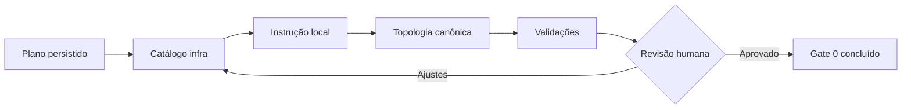

# TP-00014 — Marco zero da governança de infraestrutura

## 1. Overview

Este plano implementa somente a Etapa 0 da evolução de governança de
infraestrutura. Ele torna `infra/` descobrível pela topologia canônica e pela
cadeia de instruções dos agentes, define responsáveis por função e registra os
guardrails que antecedem análise AS-IS, decisões de IaC ou mudanças operacionais.

As etapas posteriores exigem planos e gates próprios. Este documento não aprova
ferramenta, layout novo, rename, acesso a ambiente nem execução contra produção.

## 2. Fontes e autoridade

- [ADR-0000](../../../harness/governance/decisions/ADR-0000-governanca-do-harness-documental.md) governa
  taxonomia, precedência, descoberta progressiva e controle de mudanças.
- [ADR-0016](../../backend/docs/adrs/ADR-0016-infrastructure-environment-provisioning.md) fornece
  contexto histórico e decisões ainda vigentes, respeitando suas partes
  explicitamente superseded.
- [Manifesto de módulos e pacotes](../../architecture/module-registry.md) é a
  topologia canônica usada por humanos e agentes.
- [Software Engineering Lifecycle](../../agents/standards/software-engineering-lifecycle.md)
  define gates humanos e sequência documental.
- A solicitação humana de 2026-08-23 autoriza exclusivamente a implementação
  deste marco zero e a inclusão explícita de `infra/` na topologia canônica.

### 2.1 Aplicabilidade do lifecycle

Business Context, requisito, análise de aderência, caso de uso e Implementation
Plan são `N/A` neste incremento: ele altera apenas governança documental e
adaptadores de instrução, sem introduzir comportamento de produto, configuração
executável ou mudança de ambiente. O trabalho deriva do ADR-0000 e da solicitação
humana. Qualquer incremento operacional ou de software posterior deve reiniciar o
lifecycle com os artefatos aplicáveis e um plano próprio.

## 3. Papéis e autoridade humana

| Papel | Responsabilidade | Autoridade neste marco |
| --- | --- | --- |
| **Maintainer Humano de Infraestrutura** | Pessoa que ocupa o papel responsável na revisão corrente, identificada pela aprovação registrada na conversa ou no PR. | Decisão final de escopo, aceite do Gate 0 e autorização de qualquer etapa posterior. |
| **Arquitetura** | Preservar ADR-0000, topologia, fronteiras e fontes canônicas. | Revisão obrigatória de mudanças estruturais ou decisões. |
| **DevOps** | Manter Compose, automações, configuração operacional e evidências. | Revisão obrigatória de comandos, pipelines e runbooks. |
| **Segurança** | Revisar secrets, identidades, rede, TLS, permissões e operações sensíveis. | Gate obrigatório quando a mudança tocar esses assuntos. |
| **Dados** | Revisar bancos, volumes, backup, restore e migração stateful. | Gate obrigatório quando a mudança tocar dados persistentes. |
| **Agentes de IA** | Inspecionar, propor patches pequenos, validar e registrar evidência. | Não aprovam gates humanos, não acessam produção e não ampliam o escopo implicitamente. |

O papel humano é durável; a pessoa que o ocupa deve ficar identificada na evidência
da revisão, sem codificar no repositório um nome pessoal que possa se tornar
obsoleto.

## 4. Execution Tracking Matrix

> Legenda: `Pending` · `In Progress` · `Done` · `Blocked` · `Cancelled`.

| ID | Atividade | Owner | Status | Decisão/evidência |
| --- | --- | --- | --- | --- |
| `G0.1` | Persistir owner humano e revisores por função | Arquitetura / DevOps | Done | Section 3 deste plano. |
| `G0.2` | Estabelecer tracker, estados e gates incrementais | AgentOrchestrator | Done | Sections 4 e 7 deste plano. |
| `G0.3` | Congelar rename, reorganização e operações externas | Maintainer Humano | Done | Guardrails da Section 5 e ADR-0031. |
| `G0.4` | Criar catálogo e ponto de entrada de `infra/` | DevOps | Done | [`infra/README.md`](../../../infra/README.md). |
| `G0.5` | Criar instruções locais enxutas para agentes | Arquitetura / DevOps | Done | [`infra/AGENTS.md`](../../../../infra/AGENTS.md) e [`infra/CLAUDE.md`](../../../../infra/CLAUDE.md). |
| `G0.6` | Ligar `infra/` diretamente à topologia canônica | Arquitetura | Done | [`docs/architecture/module-registry.md`](../../architecture/module-registry.md). |
| `G0.7` | Executar gates documentais e estruturais aplicáveis | Qualidade | Done | Gates registrados na Section 8. |
| `G0.8` | Revisar o conjunto e aprovar o Gate 0 | Maintainer Humano | Done | Aprovação explícita “Gate 0 aprovado” registrada em 2026-08-23; decisões promovidas ao ADR-0031. |

## 5. Guardrails vigentes

1. `infra/` mantém o nome e a função de pacote operacional umbrella durante este
   marco; não será criado um diretório raiz `iac/`.
2. Nenhum arquivo existente será movido ou reclassificado neste marco.
3. Cada mudança posterior deve possuir escopo coeso, diff pequeno e revisão humana
   antes de avançar ao próximo gate.
4. Produção, HML, provedores, dados reais, secrets e recursos externos estão fora
   do escopo; nenhuma ferramenta pode ser apontada para esses ambientes.
5. Operações Git que alterem índice, histórico ou remoto continuam dependendo de
   autorização explícita.
6. Decisão normativa nova exige sua fonte canônica; plano, README ou instrução de
   agente não substituem ADR, requisito, standard ou runbook.
7. O Gate 0 somente será concluído após o Maintainer Humano registrar aprovação ou
   solicitar ajustes sobre este conjunto de arquivos.

## 6. Incrementos e dependências

Os incrementos são sequenciais para que a topologia nunca aponte definitivamente
para um ponto de entrada não validado. A revisão humana pode devolver o trabalho
ao catálogo, às instruções ou à matriz de responsabilidade sem liberar etapas
posteriores.

## 7. Critérios de aceite do Gate 0

- `TP-00014` está indexado e mantém o gate humano visível.
- `infra/README.md` cataloga escopo, subáreas, owners e fontes de verdade sem se
  declarar IaC completo.
- `infra/AGENTS.md` especializa somente a subárvore e preserva ADR-0000 e a
  instrução global; `infra/CLAUDE.md` importa a mesma especialização.
- `docs/architecture/module-registry.md` aponta diretamente para catálogo e
  adaptadores de `infra/` e distingue o pacote operacional do módulo Java
  `infrastructure`.
- Nenhum artefato existente foi movido, renomeado ou executado contra ambiente.
- Os validadores aplicáveis passam ou as falhas preexistentes ficam separadas das
  falhas causadas por esta mudança.
- O Maintainer Humano revisa o diff e registra `Approved` ou solicita ajustes.

## 8. Verificação e evidência

| Verificação | Objetivo | Resultado |
| --- | --- | --- |
| `./infra/scripts/validate-docs.sh` | Validar contrato documental, índices, IDs e links. | Executado: passou em um snapshot anterior; no re-run final, o gate global terminou com exit `1` apenas por referências concorrentes fora do marco a `IP-BE-11.1.4-chatbot-quota-per-channel`, em `../../backend/docs/specs/IP-BE-3.1.19-chatbot-quota-enforcement.md` e `phase-3-backend-specification-index.md`. Nenhuma falha aponta para os artefatos da Etapa 0; os checks focados passaram. |
| `git diff --check` e checks focados de newline/whitespace | Detectar patch malformado, inclusive nos arquivos novos. | Passed. |
| Resolução dos links relativos dos entrypoints | Provar que catálogo e instruções locais não possuem rotas quebradas. | Passed: todos os alvos relativos de `infra/README.md` e `infra/AGENTS.md` existem. |
| Busca dos links para os três entrypoints no manifesto e no índice | Provar descoberta pela topologia canônica. | Passed: catálogo, adaptadores e `TP-00014` estão publicados. |
| Soma de `AGENTS.md` raiz + local | Evitar truncamento no limite padrão de instruções do Codex. | Passed: `4.992` bytes no repositório, abaixo do limite padrão de `32 KiB`. |
| Nova execução efêmera do Codex, `-C infra`, sandbox read-only | Confirmar a cadeia raiz → instrução local e os guardrails carregados. | Passed: carregou `AGENTS.md` raiz e `infra/AGENTS.md`, nessa ordem, e confirmou autorização explícita e gate humano. |
| Inspeção de `infra/CLAUDE.md` | Confirmar a paridade com o padrão local do Claude Code. | Passed: conteúdo único `@AGENTS.md`. |
| Revisão humana do diff | Confirmar owner, escopo, guardrails e Gate 0. | Passed: Gate 0 aprovado explicitamente em 2026-08-23 (`G0.8`). |

Não há teste de software ou execução de Compose aplicável: este marco altera apenas
documentação, catálogo de pacote e instruções de agentes. A execução efêmera acima
valida somente a descoberta das instruções; não faz alegação sobre runtime da
plataforma.

## 9. Handoff e abertura da Etapa 1

O Gate 0 foi aprovado e suas decisões foram promovidas ao
[ADR-0031](../../backend/docs/adrs/ADR-0031-governanca-topologia-infraestrutura.md). A Etapa 1 foi
aberta pelo
[TP-00015](TP-00015-infrastructure-as-is-gap-analysis.md) para produzir a
[ANL-00042](../../analysis/ANL-00042-infrastructure-as-is-iac-gap-analysis.md).

Permanecem bloqueados até decisão posterior:

- correção do drift documental ou executável já identificado;
- escolha de Terraform/OpenTofu, Ansible, Pulumi ou equivalente;
- criação de `infra/iac/` ou `infra/provisioning/`;
- reorganização de `infra/scripts/`;
- automação ou importação brownfield de HML/produção;
- mudanças em state, DNS, TLS, firewall, GitHub, backup, IAM ou secrets.

## 10. Change Log

| Version | Date | Owner | Change |
| --- | --- | --- | --- |
| 1.2 | 2026-08-23 | Maintainer Humano de Infraestrutura / Arquitetura / DevOps | Registra aprovação do Gate 0, promove decisões ao ADR-0031, conclui o plano e abre a Etapa 1 pelo TP-00015. |
| 1.1 | 2026-08-23 | Arquitetura e DevOps | Adiciona paridade Claude, explicita aplicabilidade do lifecycle e registra progresso e evidências do Gate 0. |
| 1.0 | 2026-08-23 | Arquitetura e DevOps | Criação do marco zero, tracker, papéis humanos, guardrails e Gate 0 incremental. |
