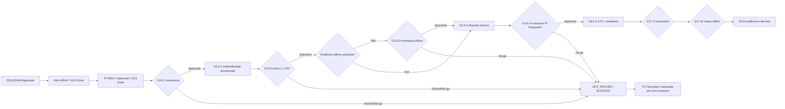

# TP-00017 — Planejamento do POC IaC hermético

> [!IMPORTANT]
> O `G3.5` aprovou este TP somente como baseline de planejamento. `G3.6.1-A`–`D`
> materializou apenas a taxonomia genérica. O `G3.6.2-F` ativou o
> [standard open-source-first de supply chain](../agents/standards/iac-supply-chain-standard.md)
> e fechou `L-007` somente quanto à existência/aprovação da policy. `G3.6.3`
> possui agora desenho e direção econômica aprovados pelo Maintainer: VPS única
> primeiro, AWS workload somente após triggers e tooling open-source-first.
> Em 2026-08-25, o Maintainer autorizou a disposição automática documental dos
> itens restantes e determinou a conclusão da demanda. O resultado fail-closed
> é `Cancelled — Controlled Administrative Closure`: a primeira entrada
> OpenTofu e todas as demais dependências permanecem `Deferred / Pending /
> NOT_PROVEN`, nenhum byte foi recebido e a allowlist continua vazia. Pesquisa,
> IP, `infra/iac/`, tooling, rede, provider, ambiente e comandos não foram
> iniciados nem aprovados por inferência.
>
> As frases acima são o snapshot terminal deste ciclo em 2026-08-25. O sucessor
> [TP-00018](TP-00018-opentofu-offline-manifest-correction.md) revisou depois um
> único intake OpenTofu e terminou `Completed — Artifact Not Eligible`: integridade
> e vínculo leaf `PASS`, mas trust/provenance, licença completa, libc e
> elegibilidade `NOT_PROVEN`. Essa evidência posterior não reabre este TP, não
> satisfaz o POC e não concede allowlist ou autoridade operacional.

## 1. Overview

O [REQ-00044](../../product/requirements/REQ-00044-infrastructure-iac-hermetic-poc.md)
define um futuro POC limitado a protocolo e schema. A
[ANL-00044](../../analysis/ANL-00044-req-00044-iac-hermetic-poc-adherence-analysis.md)
concluiu `PASS` arquitetural, `NOT_PROVEN` para readiness e `BLOCKED` para
execução. O ciclo terminou por no-go administrativo antes de pesquisa, IP,
aquisição ou replay; isso conclui a demanda de governança sem satisfazer o POC.

O TP coordenou a transformação dos gaps em controles e gates verificáveis. Ele
não selecionou ferramentas/versões, não criou configuração e não constituiu
autorização operacional. Uma retomada deverá ocorrer por reabertura versionada
ou plano sucessor, com evidência e autoridade próprias; nada é herdado deste
ciclo encerrado.

O [TP-00018](TP-00018-opentofu-offline-manifest-correction.md) é o sucessor
documental somente da primeira linha de intake OpenTofu. Seu resultado melhora a
evidência histórica dessa linha sem alterar o fechamento `Cancelled` deste POC:
o artefato continuou inelegível e `REQ-00044` permaneceu não satisfeito.

## 2. Fontes, autoridade e lifecycle

- [ADR-0033](../../backend/docs/adrs/ADR-0033-arquitetura-alvo-iac-segura.md) preserva `infra/`
  como umbrella, OpenTofu condicional, Terraform fallback humano e Ansible adiado.
- [REQ-00044](../../product/requirements/REQ-00044-infrastructure-iac-hermetic-poc.md) é a
  fonte dos acceptance criteria, classificações e proibições.
- [ANL-00044](../../analysis/ANL-00044-req-00044-iac-hermetic-poc-adherence-analysis.md)
  é a baseline do ledger e dos gaps `G3-GAP-002`–`006`.
- [ANL-00042](../../analysis/ANL-00042-infrastructure-as-is-iac-gap-analysis.md) e
  [ANL-00043](../../analysis/ANL-00043-infrastructure-iac-options-security-analysis.md)
  preservam risco residual, fronteiras e hipótese de compatibilidade.
- [TP-00016](TP-00016-infrastructure-iac-target-architecture.md) é histórico e
  não concede autorização de piloto.
- [TP-00018](TP-00018-opentofu-offline-manifest-correction.md) sucede somente a
  correção do manifesto OpenTofu e conclui no-go do artefato, sem reabrir este
  plano ou conceder autoridade operacional.

O fallback Terraform é somente uma opção arquitetural. Nenhuma versão fica
elegível por essa menção: a versão exata deverá satisfazer integralmente o
standard `Active`; software fechado ou apenas source-available exigirá mudança
versionada da policy e novo gate humano.

Estados deste TP:

- `Proposed`: revisão documental; estado histórico anterior ao `G3.5`;
- `Approved`: baseline de planejamento aceita no `G3.5`; estado histórico
  anterior ao início dos workstreams documentais de `G3.6`;
- `In Progress`: workstreams documentais de `G3.6` iniciados, ainda sem operação;
- `Completed`: evidência e decisão final aceitas no `G3.8`;
- `Cancelled`: no-go humano ou perda das precondições, sem fallback automático.

O Maintainer delegou as alçadas funcionais separadamente no `G3.4` e no `G3.5`.
Cada delegação expirou com o respectivo gate. `G3.6.1` foi aprovado diretamente
pelo Maintainer, sem alegar representação separada de Arquitetura ou Qualidade.
Todo gate seguinte deve identificar novamente pessoas ou alçadas; nenhuma
representação é herdada.

No `G3.6.2-A`–`D`, o Maintainer autorizou apenas descoberta local read-only e uma
proposta condicionada ao lifecycle `Proposed`; como a coleção canônica aceita
`Draft`, a condição não permitiu criar o arquivo. O `G3.6.2-E` corrigiu somente
esse mismatch e materializou o Draft. No `G3.6.2-F`, o Maintainer aprovou as
regras, determinou baseline open-source-first com elegibilidade inicial somente
open source, promoveu a policy para `Active` e fechou `L-007` separadamente.
SecurityAgent e DevOps-Agent emitiram revisões técnicas read-only `Approved`, sem
delegação nova. Nenhuma autoridade é herdada pelo próximo gate.

Em 2026-08-25, o Maintainer Humano autorizou o AgentOrchestrator,
exclusivamente neste handoff, a decidir e registrar a disposição dos checkpoints
documentais restantes com base nas evidências locais. `AUTO aprovação` significou
aprovar somente o que já possuía critérios comprovados; lacuna, conflito ou
precondição ausente permaneceu `Deferred / NOT_PROVEN`, nunca `PASS`. Essa
autorização sustentou o no-go e o fechamento administrativo, não renovou alçadas
técnicas e expira no handoff final. Ela não concedeu objeto/escopo exatos para
rede, IP, tooling, aquisição, replay ou execução.

## 3. Baseline obrigatória

### 3.1 Ledger

O ledger integral da
[ANL-00044](../../analysis/ANL-00044-req-00044-iac-hermetic-poc-adherence-analysis.md)
§6 é normativo e está reproduzido abaixo. A evidência registrada comprova somente a
decisão documental do `G3.4`, não o fechamento operacional dos riscos. Qualquer
divergência entre os dois documentos bloqueia a progressão até reconciliação; o
TP não pode ampliar owner, validade ou boundary por resumo ou inferência.

| ID / origem | Classe | Disposição aceita | Owner funcional | Evidência de decisão | Validade aceita | Boundary e trigger de reabertura | Estado após G3.4 |
| --- | --- | --- | --- | --- | --- | --- | --- |
| `L-001` — `GAP-001`–`GAP-004` | P0 | `Accepted Risk — Repo-only`; usar somente ADR-0033/REQ-00044, sem modelar topologia/runtime histórica. | Arquitetura + DevOps + Dados | ANL-00044 §10, `G3.4-B`; manifestação explícita do Maintainer. | Até o relatório do POC ou mudança de escopo. | Somente documentos canônicos; relatório do POC ou qualquer ampliação reabre a linha. | `Accepted — G3.4; repo-only` |
| `L-002` — `SEC-004` / `GAP-008` | P0 | `Accepted Risk — Repo-only`; zero credencial, home real, `.env`, `.deploy` ou mount sensível. | Segurança + DevOps + Maintainer | ANL-00044 §10, `G3.4-B`; manifestação explícita do Maintainer. | Somente enquanto o POC permanecer sem credenciais e sem ambiente. | Credencial, home real, arquivo de ambiente, `.deploy` ou mount sensível reabre a linha. | `Accepted — G3.4; repo-only` |
| `L-003` — `SEC-022` / `GAP-013` | P0 global | `Not Applicable — Repo-only`; não há CI hospedado, preview, apply ou identidade. | Arquitetura + Segurança + DevOps | ANL-00044 §10, `G3.4-B`; manifestação explícita do Maintainer. | Até surgir workflow, credencial, sandbox externa ou apply. | Qualquer CI, identidade, preview, sandbox externa ou apply reabre a linha. | `Accepted — G3.4; repo-only` |
| `L-004` — `GAP-015` | P1 | `Not Applicable — Repo-only`; não iniciar Compose, DinD, daemon ou porta e negar egress. | DevOps + Segurança | ANL-00044 §10, `G3.4-B`; manifestação explícita do Maintainer. | Até qualquer uso de Docker, daemon, bind ou porta. | Docker, daemon, bind ou porta reabre a linha; replay futuro exige egress negado. | `Accepted — G3.4; repo-only` |
| `L-005` — `GAP-005`, `006`, `009`, `011`, `014` | P1 no POC; P0/P1 externo | `Not Applicable — Repo-only`; sem resource, backend, state, backup, HML ou brownfield. | DevOps + Dados + Segurança + Qualidade | ANL-00044 §10, `G3.4-B`; manifestação explícita do Maintainer. | Somente no POC repo-only; não vale para fases externas. | Resource, backend, state, backup, HML, brownfield ou sandbox externa reabre a linha. | `Accepted — G3.4; repo-only` |
| `L-006` — `SEC-002`, `SEC-008`, `GAP-007` | P0 boundary | `Closed for scope`; ADR-0033 mantém DB, Flyway, DataSource e realm sob o backend. | Arquitetura + Tenant + Dados + Segurança | ANL-00044 §10, `G3.4-B`; manifestação explícita do Maintainer. | Enquanto a fixture não contiver resources nem onboarding. | DB, Flyway, DataSource, realm, resource ou onboarding reabre a linha. | `Confirmed — G3.4; scope closed` |
| `L-007` — `SEC-021` / `AC-011` | P0 | `Closed — Policy boundary`; standard versionado `Active`, open-source-first, com elegibilidade inicial somente open source, e fail-closed. | Segurança + DevOps + Maintainer | ANL-00044 §10.4, `G3.6.2-F`; aprovação explícita do Maintainer Humano e revisões técnicas read-only `Approved` de SecurityAgent e DevOps-Agent. | Enquanto a policy permanecer `Active` e o boundary não mudar. | Mudança de licença, threshold, cobertura, ferramenta fechada ou enfraquecimento reabre `L-007`; aquisição ainda exige `G3.7-A`. | `Closed — G3.6.2-F; no operational authority` |

Qualquer trigger de expiração retorna a linha afetada para `Blocking` antes de
ampliar o plano. O aceite repo-only não fecha o risco externo do RPT-0004.

### 3.2 Controles P0 e P1

| ID | Classe | Controle obrigatório | Exit condition documental |
| --- | --- | --- | --- |
| `TP-C00` | P0 | Lifecycle/authority: policy e arquitetura permanecem vigentes, mas o ciclo do POC terminou em no-go; nenhuma atividade operacional fica em `Allowed Now`. | Retomada somente por ciclo versionado/sucessor, com evidência e autoridade próprias. |
| `TP-C01` | P0 | Ledger: owners, validade, boundary e triggers de expiração permanecem rastreáveis. | Nenhuma disposição é ampliada por inferência. |
| `TP-C02` | P0 | `L-007`: policy `Active` open-source-first, com elegibilidade inicial somente open source, cobre malware, licenças, CVEs/advisories, thresholds, cobertura/falha de scanners e exceções temporárias. | `Satisfied — G3.6.2-F` para policy; aquisição e evidência continuam em gates próprios. |
| `TP-C03` | P0 | Acquisition e replay são trust boundaries, work packages, allowlists, evidências e autorizações independentes. | Nenhum gate concede ambas implicitamente. |
| `TP-C04` | P0 | Handoff selado: mirror packed read-only, lock gerado/não editado, manifesto, plataforma, hashes/signers/scans e digest ligado a revisão/atestação imutável. | Divergência=`FAIL`; provenance/cobertura ausente=`NOT_PROVEN`; ambos bloqueiam. |
| `TP-C05` | P0 | Sandbox futura sem privilégio/capabilities, rootfs read-only, scratch limitado, env do zero, sem home/repo/socket/SSH agent, com recursos limitados e egress/DNS negados. | Teste sintético de egress separado do replay real. |
| `TP-C06` | P0 | Contrato de processo exato: executable digest, `argv[]`, cwd/paths canônicos, env allowlist e timeout; sem shell, `eval`, interpolation, symlink ou traversal. | Acquisition/replay possuem contratos distintos e fail-closed. |
| `TP-C07` | P0 | Zero state/secrets/effects: proibir backend, plan, API, auth, resource/data/provider config, módulo remoto, import, provisioner e `TF_ACC`. | Dados e Segurança confirmam ausência de ownership/efeito. |
| `TP-C08` | P0 | Classificação determinística: `PASS` documental não é `PROTOCOL_SCHEMA_PASS`; `FAIL`, `NOT_PROVEN` e `BLOCKED` seguem REQ-00044. | Nenhuma promoção por intenção ou ausência de evidência. |
| `TP-C09` | P0 | Cleanup/evidência: baseline filesystem imutável antes/depois, repo read-only, busca de state/plan/cache/binário/log/secret e somente resumo sanitizado. | Conferência Git é humana e externa ao harness. |
| `TP-C10` | P0 | Fallback Hostinger/OpenTofu depende de decisão humana; nunca automático. | `FAIL` abre decisão, não troca engine/mirror/lock. |
| `TP-C11` | P0 | Review registra pessoa/alçada, papel, decisão, data, validade e ressalva por ID. | Ausência de representação mantém o gate `Blocking`. |
| `TP-C12` | P1 → P0 antes da aquisição | Matriz de dependências exata para CLI, três providers, scanners e qualquer runtime/image. | Source completo, plataforma, endpoints/redirects, SHA-256, signer, licença e manutenção aprovados; sem range/latest. |
| `TP-C13` | P1 → P0 antes do replay | Fixture/schema: três providers isolados, somente `required_version`/`required_providers`, identidade completa e allowlist de `format_version`/schemas mínimos. | Nenhum tipo instanciado, backend ou provider config. |
| `TP-C14` | P1 → P0 antes do replay | Testes/evidência mapeiam AC-001–015 e TS-001–011, casos positivos/negativos, exit codes, canonicalização e limitações. | Matriz revisada por Qualidade e Segurança. |
| `TP-C15` | P1 | Traceability/DoD: cada atividade liga ADR, REQ, ANL, ledger e AC/TS. | `Planned`/`NOT_PROVEN` nunca aparece como `Done`/`PASS`. |

## 4. Owners e responsabilidades

| Papel | Responsabilidade neste plano |
| --- | --- |
| Arquitetura | Escopo, authority, precedência, fallback e mudanças que exigem ADR. |
| DevOps | Matriz técnica, aquisição/replay, manifesto, paths e operabilidade do harness. |
| Segurança | Veto e aceite de `L-007`, supply chain, sandbox, egress e evidência sanitizada. |
| Dados | Confirmar exclusão de backend/state/backup/dados e ausência de efeito stateful. |
| Qualidade | Mapear AC/TS, resultados determinísticos, testes negativos e cleanup. |
| Tenant | Confirmar que fixture e IaC não assumem provisioning runtime. |
| Maintainer Humano | Aprovar cada gate e conceder, separadamente, eventual efeito operacional. |
| Agentes de IA | Propor/validar documentação; não representar owner humano nem autoaprovar gate. |

Autor e revisor humano de controle crítico devem ser identificados. A disposição
repo-only de `L-003` não elimina revisão independente nos gates posteriores.

## 5. Execution Tracking Matrix

> Legenda: `Pending` · `In Progress` · `Done` · `Blocked` · `Cancelled`.

| ID | Atividade | Owner | Status | Decisão/evidência de saída |
| --- | --- | --- | --- | --- |
| `G3.4` | Aprovar aderência e ledger limitado | Maintainer + alçadas delegadas | Done | ANL-00044 v1.2; `L-001`–`006` limitados e `L-007 Blocking`. |
| `G3.5.0` | Publicar TP-00017 como `Proposed` | Arquitetura / DevOps | Done | Este documento e índice imediato; zero configuração/efeito. |
| `G3.5.1` | Revisar escopo, P0/P1, owners, gates e verificações | Arquitetura / DevOps / Segurança / Dados / Qualidade / Tenant | Done | `G3.5-A`–`D` aprovados; seis alçadas representadas somente neste gate. |
| `G3.5.2` | Aprovar/rejeitar TP como baseline documental | Maintainer Humano | Done | `Proposed → Approved` em 2026-08-24; nenhuma autorização operacional. |
| `G3.6.1` | Instituir coleção/convenção `IP-INFRA` e adaptar validator/índices | Arquitetura / Qualidade | Done | `G3.6.1-A`–`D` aprovado pelo Maintainer Humano em 2026-08-24 e materializado sem alocar IP específico; comandos não executados. |
| `G3.6.2-A–E` | Descobrir a coleção canônica e preparar policy como `Draft` | Maintainer + Segurança / DevOps temporariamente delegados | Done | `G3.6.2-E` corrigiu somente o lifecycle e materializou o standard Draft, não normativo; a delegação expirou naquele handoff. |
| `G3.6.2` | Preparar, revisar e ativar a policy; decidir `L-007` separadamente | Segurança / DevOps / Maintainer | Done | Policy ativada em v1.0 e atualmente v1.1 `Active`; baseline open-source-first, `AC-011 PASS` documental e `L-007 Closed`, sem autoridade operacional. |
| `G3.6.2-F` | Aprovar o Draft e decidir a disposição de `L-007` | Maintainer Humano, com revisões técnicas read-only de Segurança / DevOps | Done | `Draft → Active` e `L-007 → Closed` aprovados separadamente em 2026-08-24; allowlist concreta vazia e aquisição não autorizada. |
| `G3.6.3-A` | Autorizar, somente se necessária, pesquisa read-only em fontes oficiais | Maintainer / Segurança / DevOps | Cancelled | `Not Used in This Cycle`: não houve autorização específica de domínios/consultas/duração nem pesquisa. |
| `G3.6.3` | Congelar matriz de dependências, threat model, fixture/schema, sandbox, allowlists e evidência | DevOps / Segurança / Qualidade / Dados / Tenant | Cancelled | Desenho baseline aprovado; conclusão técnica cancelada e estacionada como `Deferred / NOT_PROVEN` por ausência de evidência exata. |
| `G3.6.4-A` | Autorizar exclusivamente a materialização do IP-INFRA como `Proposed` | Maintainer + owners aplicáveis | Cancelled | `Deferred`: precondição G3.6.3 não atendida; nenhum ID/path ou autoridade de IP foi concedido. |
| `G3.6.4` | Criar/revisar IP-INFRA do POC como `Proposed` | DevOps / Segurança / Qualidade | Cancelled | `Not Started`: nenhum IP-INFRA específico foi criado. |
| `G3.6.5` | Aprovar readiness documental do IP | Maintainer + owners aplicáveis | Cancelled | `Readiness NOT_PROVEN`: não existe IP para revisão. |
| `G3.7-A` | Autorizar aquisição controlada | Maintainer + Segurança | Cancelled | `Deferred`: faltam matriz, endpoints, artefatos, paths, argv e validade exatos; nenhuma aquisição. |
| `G3.7-B` | Autorizar replay offline | Maintainer + Segurança + Qualidade | Cancelled | `Deferred`: não existe handoff selado; nenhum replay. |
| `G3.8` | Revisar evidência, cleanup, classificação e fallback/encerramento | Maintainer + owners aplicáveis | Cancelled | `Not Reached`: sem WP-7, execução, relatório ou cleanup runtime; classificação técnica permanece `NOT_PROVEN`. |

O TP passou a `In Progress` quando os workstreams documentais começaram e agora
termina em `Cancelled` pela rota canônica de no-go. Não é `Completed`: `G3.8` e
seus predecessores não foram executados, e nenhum acceptance criterion técnico
foi promovido por ausência de evidência.

## 6. Work packages e dependências

| WP | Entrega | Dependência | Gate de saída |
| --- | --- | --- | --- |
| `WP-0` | Baseline do plano e revisão multidisciplinar. | G3.4 | G3.5 |
| `WP-6` | Taxonomia `IP-INFRA`, sem criar o IP. | G3.5 | G3.6.1 |
| `WP-1` | Draft, revisão/ativação da policy e decisão separada de `L-007`. | G3.6.1 | G3.6.2-F |
| `WP-2` | Matriz exata de dependências e provenance a partir de evidência autorizada. | WP-1; se necessária rede, G3.6.3-A | G3.6.3 |
| `WP-3` | Fixture/schema e threat model sem resource/API. | WP-1 | G3.6.3 |
| `WP-4` | Sandbox, duas allowlists e handoff selado. | WP-1–3 | G3.6.3 |
| `WP-5` | Testes, classificações, evidência e cleanup. | WP-2–4 | G3.6.3 |
| `WP-6A` | Gate humano para autorizar somente o IP `Proposed`. | WP-1–6 | G3.6.4-A |
| `WP-6B` | IP do POC em revisão e readiness documental. | WP-6A | G3.6.4–5 |
| `WP-7` | Autorizações independentes de acquisition/replay. | WP-6B | G3.7-A/B |
| `WP-8` | Evidência e decisão final. | WP-7 | G3.8 |

Disposição terminal dos work packages: `WP-0`, `WP-6` e `WP-1` permanecem
concluídos; `WP-2`–`WP-5` preservam somente o desenho produzido e terminam
`Cancelled / Deferred / NOT_PROVEN`; `WP-6A`–`WP-8` terminam `Cancelled / Not
Started`. Não existe handoff implícito entre esses grupos.

## 7. Regras de coordenação

1. Atividade `Blocked` não começa por conveniência ou paralelismo.
2. Work packages documentais podem ser preparados em paralelo somente depois do
   gate predecessor e sem criar artefato executável.
3. `L-007` foi fechado somente para a policy; acquisition continua bloqueada por
   matriz/IP/readiness e `G3.7-A`, e evidência adquirida não autoriza replay.
4. Mudança de boundary invalida o aceite repo-only e retorna ao ledger/ADR.
5. Segurança possui veto sobre supply chain, sandbox, egress e material sensível;
   Dados sobre state/backend/dados; Tenant sobre provisioning runtime.
6. Falha Hostinger/OpenTofu retorna ao humano; fallback nunca é automático.
7. Cada handoff registra o que passou, falhou, não foi provado e permanece
   proibido.

## 8. Gate G3.5 — revisão humana do plano

| Decisão | Estado | Pergunta de aceite |
| --- | --- | --- |
| `G3.5-A` — escopo/authority | `Approved` | O TP coordena somente readiness documental e preserva todos os non-objectives. |
| `G3.5-B` — P0/P1 e gates | `Approved` | Controles `TP-C00`–`C15`, work packages e gates separados foram aceitos. |
| `G3.5-C` — owners/ledger | `Approved — delegated authorities` | Maintainer representou/delegou Arquitetura, DevOps, Segurança, Dados, Qualidade e Tenant exclusivamente neste gate; `L-001`–`006` seguem repo-only e `L-007 Blocking`. |
| `G3.5-D` — autoridade negativa | `Approved — no operational authority` | Aceite não autoriza pesquisa externa, artefato IP-INFRA, `infra/iac/`, tooling, download, rede, registry/provider/ambiente ou comando. |

O Maintainer aprovou cumulativamente `G3.5-A`–`D` em 2026-08-24 e identificou
novamente as seis alçadas aplicáveis. Essa representação expirou com o registro.
Veredito naquele checkpoint: **TP approved as planning baseline; readiness
NOT_PROVEN; L-007, acquisition e replay BLOCKED**.

### 8.1 Checkpoint concluído — G3.6.1

Os itens abaixo foram aprovados e materializados somente no plano documental,
sem criar um IP específico:

| Decisão | Estado | Evidência registrada |
| --- | --- | --- |
| `G3.6.1-A` — coleção e identidade | `Approved` | Criada somente `docs/delivery/plans/implementation_plans/infra/` com índice próprio; convenção `IP-INFRA-X.Y.Z[.N]-short-title.md` e `Document ID` igual ao nome completo sem `.md`. Nenhum IP alocado. |
| `G3.6.1-B` — lifecycle | `Approved` | Instituídos `Proposed`, `Approved`, `In Progress`, `Completed`, `Cancelled`; todo IP inicia `Proposed` somente após gate humano que autorize sua materialização. |
| `G3.6.1-C` — descoberta e enforcement | `Approved` | Atualizados índice pai, template genérico e validator; criado teste focal do contrato de nomes/índices, sem criar IP do POC e sem executar comandos. |
| `G3.6.1-D` — autoridade negativa | `Approved` | O aceite autorizou somente a coleção/convenção genérica e seus testes; não alocou ID/path de IP, conteúdo IP, policy/L-007, `infra/iac/`, tooling IaC, rede ou comando. |

A aprovação de `G3.6.1-A`–`D` materializou apenas essa taxonomia. A etapa
seguinte preparou o Draft em `G3.6.2-E`; ativação e disposição de `L-007` foram
depois decididas separadamente em `G3.6.2-F`.

### 8.2 Checkpoint concluído — G3.6.2

| Decisão | Estado | Evidência e limite |
| --- | --- | --- |
| `G3.6.2-A` — descoberta local | `Approved / Done` | Autorizou somente comandos locais read-only, validação documental e teste focal, sem Git, rede, download, registry/provider ou ambiente. |
| `G3.6.2-B` — coleção existente | `Approved with condition / Done` | Autorizou apenas `Proposed` na coleção existente; como standards usam `Draft`, a condição fail-closed impediu materialização até correção humana. |
| `G3.6.2-C` — alçadas temporárias | `Approved / Expired` | Maintainer representou a própria alçada e delegou Segurança/DevOps somente para preparar/revisar a proposta; a delegação expirou naquela devolução. |
| `G3.6.2-D` — conteúdo e autoridade negativa | `Approved / Preserved` | Exigiu origem, pinning, lockfile, checksum/assinatura, cache/mirror, provenance, offline, quarentena e fail-closed; não autorizou IP, tooling, aquisição ou execução. |
| `G3.6.2-E` — correção de lifecycle | `Approved / Done` | Autorizou [../agents/standards/iac-supply-chain-standard.md](../agents/standards/iac-supply-chain-standard.md) somente como `Draft`, seu índice e rastreabilidade; renovou Segurança/DevOps apenas para este incremento. |
| `G3.6.2-F` — ativação e ledger | `Approved / Done` | Maintainer Humano aprovou os controles, adotou baseline open-source-first com elegibilidade inicial somente open source, decidiu explicitamente `Draft → Active` e registrou separadamente `L-007 → Closed`; SecurityAgent e DevOps-Agent emitiram revisões técnicas read-only `Approved`, sem delegação nova ou aquisição autorizada. |

Veredito após `G3.6.2-F`: **policy Active; AC-011 PASS documental; L-007 Closed
no policy boundary; readiness NOT_PROVEN; execução BLOCKED**. Nenhuma alçada ou
autoridade segue para `G3.6.3` por herança.

### 8.3 G3.6.3 — baseline histórica; evidência técnica deferida

> [!NOTE]
> Todo o conteúdo desta seção preserva o estado conhecido no fechamento do
> `TP-00017`, em 2026-08-25. A evidência posterior do intake OpenTofu está no
> [TP-00018](TP-00018-opentofu-offline-manifest-correction.md) e não deve ser
> usada para reescrever retroativamente este snapshot.

O Maintainer Humano autorizou iniciar este workstream usando somente evidência
local, offline ou fornecida por ele. Delegou DevOps, Segurança, Qualidade, Dados
e Tenant exclusivamente para preparar e revisar a proposta; Arquitetura não foi
delegada e o ADR-0033 foi apenas preservado. Essa delegação expirou no handoff
anterior e não foi renovada.

Na revisão humana subsequente, o Maintainer aprovou o desenho como baseline e
determinou a direção econômica: VPS única de baixo custo primeiro, AWS workload
somente depois e ferramentas open-source-first. A mensagem autorizou decidir e
materializar essa direção dentro do desenho, não fechar o gate nem abrir outro.

`G3.6.3-A` não foi autorizado. Não houve pesquisa externa, criação de IP-INFRA,
`infra/iac/`, tooling, download, rede, registry/provider, ambiente ou execução.
As fontes foram classificadas como `REPO_DOCUMENT`, `HUMAN_DECISION`,
`HUMAN_PROVIDED_METADATA`, `HUMAN_OFFLINE` ou `MISSING`. A prioridade econômica
é `HUMAN_DECISION`. Em 2026-08-25 foi fornecido um primeiro preenchimento de
metadata do OpenTofu, mas nenhum arquivo, byte, checksum autenticado ou
assinatura verificável foi entregue. A correção foi adiada por decisão humana.

#### 8.3.1 Baseline de produto e matriz de evidência

Nesta tabela, **baseline de produto** significa direção estratégica aprovada,
não versão ou dependência elegível. **Candidato** significa item a investigar.
Nenhuma das duas labels significa allowlist, aquisição, compatibilidade ou
execução. O repositório não contém `.tf`, `.tfvars`, `.hcl`, `.tofu` ou
`.terraform.lock.hcl` do POC.

| Classe | Candidato ou identidade observada | Evidência de versão local | Disposição atual |
| --- | --- | --- | --- |
| Engine primária | OpenTofu CLI | Entrada humana declarou `1.0.0`/Linux amd64, porém origem, arquivo, hash, assinatura e licença não formam cadeia de custódia verificável; nenhum byte foi recebido. | `Strategic product baseline approved / Pending / NOT_PROVEN`; sem versão aprovada ou allowlist. |
| Provider Hostinger | `registry.opentofu.org/hostinger/hostinger` | Identidade lógica conhecida; versão e artefato ausentes. | Prioridade 1 da prova de protocolo/schema pela estratégia VPS-first; `NOT_PROVEN`. |
| Provider GitHub | `registry.opentofu.org/integrations/github` | Identidade lógica conhecida; versão e artefato ausentes. | Prioridade 2, transversal à governança do repositório; `NOT_PROVEN`. |
| Provider AWS | `registry.opentofu.org/hashicorp/aws` | Identidade lógica conhecida; versão e artefato ausentes. | Prioridade 3 da prova e segunda fase de hospedagem; `NOT_PROVEN`. |
| Engine fallback | Terraform CLI | Somente o range histórico Hostinger `>= 1.3`; range não é pin e licença da versão exata não foi provada. | `Fallback only / not eligible now`; redução de escopo precede qualquer revisão da policy ou troca humana. |
| Configuração de host | Ansible | Nenhuma versão; uso adiado pelo ADR-0033. | `Deferred / out of POC`. |
| Vulnerabilidade/configuração | Trivy | Wrapper `aquasecurity/trivy-action` fixado por SHA, comentado como `v0.30.0`; não prova o binário, base ou dependências transitivas. | Lead primário de menor custo, condicionado à prova open source e de cobertura; `NOT_PROVEN`. |
| SBOM/SPDX | Anchore SBOM Action | Wrapper fixado por SHA, comentado como `v0`; engine e transitivos desconhecidos. | Lead preferido para o papel de SBOM; engine/licença/cobertura `NOT_PROVEN`. |
| Scanner secundário de advisories | Grype | Apenas menção genérica nos agentes; sem versão ou execução corrente. | Opcional somente para fechar lacuna de cobertura; `NOT_PROVEN`. |
| Sanitização de segredos | Gitleaks | Wrapper fixado por SHA, comentado como `v2`; fluxo atual usa hosted Action/token. | Lead preferido, condicionado a replay local hermético; `NOT_PROVEN`. |
| Integridade | SHA-256 / verificador a selecionar | Uso conceitual e precedentes de `sha256sum`, sem versão/digest do verificador. | Controle obrigatório; ferramenta `NOT_PROVEN`. |
| Assinatura/provenance | GPG/atestação a selecionar | Obrigação documental, sem verifier, trust root, fingerprint ou revogação concretos. | `MISSING / BLOCKING`. |
| Malware | Nenhum candidato comprovado localmente | Ausente. | `MISSING / BLOCKING`. |
| Licença | Nenhum scanner completo comprovado localmente | Ausente; geração de SPDX isolada é insuficiente. | `MISSING / BLOCKING`. |
| Sandbox/egress | One-shot OCI via Docker/Compose é apenas experiência local parcial | Sem versão/imagem dedicada; o one-shot existente usa root/capabilities e não cumpre integralmente usuário sem privilégio, memória, timeout e prova de egress. | Candidato de menor custo por reuso, não selecionado; `NOT_PROVEN` e seu uso reabriria `L-004`. |

A label de uma Action ou constraint de compatibilidade não é versão candidata do
executável. Para cada linha futura ainda faltam versão exata, plataforma,
origem/redirects, arquivo, SHA-256, signer, provenance, licença, manutenção e
freshness dos scanners. A allowlist concreta permanece vazia.

##### Registro histórico — OpenTofu intake #1, 2026-08-25

Este registro é append-only e serve apenas como memória de triagem. Ele não é
manifesto operacional, lockfile, allowlist, aprovação de versão ou evidência de
aquisição. Uma correção futura será acrescentada como nova tentativa, sem apagar
esta linha do tempo.

| Campo recebido | Triagem preservada |
| --- | --- |
| Produto | Intenção aceita como `OpenTofu CLI`; produto não comprovado por bytes. |
| Versão `1.0.0` | Valor declarado; existência, manutenção e vínculo com uma release não verificados. |
| Plataforma `Linux amd64` | Formato plausível; suporte do artefato exato não comprovado. |
| Origem informada | Apontava para `djmarcellopedrosa/saas-service` no Docker Hub, semanticamente incompatível com uma release/ZIP do OpenTofu; o link recebido também separava `:1` de `.0.0`. Rejeitada como origem do OpenTofu. |
| Arquivo `tofu_1.0.0_linux_amd64.zip` | Nome declarado, sem bytes, tamanho, URL imutável ou vínculo com a origem. |
| SHA-256 | Sequência de 64 letras `a`, tratada como placeholder e rejeitada como âncora de confiança. |
| Assinatura/provenance | Nome de `.sig` e fingerprint contendo `EXEMPLO`; signer, fingerprint completa, chave, algoritmo, validade, revogação e verificador ausentes. |
| Licença `MPL-2.0` | Identificador permitido pela policy, mas apenas declarado; falta prova de que o texto/licença cobre o artefato exato. |
| Data `2026-08-25T10:30:00-03:00` | Timestamp declarado do preenchimento, não aquisição, verificação ou selamento. |

Disposição agregada: **`Deferred / Pending / NOT_PROVEN / Resume on exact
offline evidence`**. Fonte: `HUMAN_PROVIDED_METADATA`; bytes recebidos: nenhum;
quarentena: não aplicável, pois nada foi adquirido; allowlist concreta: vazia.
Não há `FAIL` técnico porque nenhum artefato concreto foi avaliado. Se a origem
incompatível fosse proposta para uso operacional, o fluxo deveria falhar antes
de persistir ou interpretar conteúdo.

#### 8.3.2 Threat model e controles de desenho

| Ameaça | Controle documental obrigatório | Estado |
| --- | --- | --- |
| Origem mutável, redirect hostil ou pacote trocado | Origem/redirects/arquivo/plataforma exatos, TLS válido, pinning integral e proibição de branch, range ou `latest`. | Baseline aprovado; valores concretos `NOT_PROVEN`. |
| Hash, assinatura, lockfile ou provenance coerentemente adulterados | SHA-256 dos bytes, metadata autenticada independente, signer/root/revogação e vínculo source → release → artefato; selo e manifesto imutavelmente ligados. | Baseline aprovado; ferramentas/raízes `NOT_PROVEN`. |
| CLI, provider ou scanner malicioso | Toda ferramenta é dependência independente; replay sem privilégio/capabilities, rootfs/repo/mirror read-only, scratch e recursos limitados. | Baseline aprovado; mecanismo `NOT_PROVEN`. |
| Scanner comprometido, parcial ou stale | Scanner/config/base pinados; cobertura, exclusões, timestamps e exit code; base até 24h; erro, timeout, exclusão ou formato não suportado = `NOT_PROVEN`. | Baseline aprovado; matriz de scanners incompleta. |
| Archive bomb, traversal, symlink ou device | Inspecionar packed e unpacked em scratch dedicado/no-exec, paths canônicos e limites de bytes, arquivos, profundidade e tempo. | Baseline proposto; implementação futura. |
| Segredo/configuração do host herdados | Ambiente nasce vazio; sem home real, `.env`, `.deploy`, socket, SSH agent, proxy, metadata ou variáveis de provider. | Boundary aprovado; runtime `NOT_PROVEN`. |
| Aquisição e replay se misturarem | Gates, rede, executáveis, digests, allowlists e evidências separados; replay usa apenas mirror selado, sem DNS/egress/`direct`. | Baseline aprovado; contratos exatos dependem de IP futuro. |
| Cache, quarentena ou mirror trocados | Três zonas separadas; conteúdo não confiável nunca executa; selo revalidado antes de interpretar fixture/plugin; replay read-only. | Baseline aprovado; artefatos inexistentes. |
| State, API, dado ou tenant entrarem no POC | Fixture sem backend, provider config, resource, data, módulo, credencial, conta, tenant ou ambiente real; nenhum DB/Flyway/realm/onboarding/backup. | Dados/Tenant aprovaram o desenho; ausência em runtime `NOT_PROVEN`. |
| Evidência stale, output enganoso ou resíduo no filesystem | Manifesto sanitizado/canônico, classificação por provider, inventário before/after, limites de output e busca de state/plan/cache/binário/log/secret. | Qualidade aprovou o desenho; testes `PLANNED / NOT_RUN`. |
| Exceção, fallback ou consumo de recursos abusivos | Exceções restritas pela policy; fallback nunca automático; PID/CPU/RAM/scratch/output/tempo limitados; timeout = `NOT_PROVEN`. | Baseline aprovado; parâmetros exatos pendentes. |

#### 8.3.3 Fixture, sandbox, allowlists e evidência

- **Fixture:** três unidades futuras isoladas, uma por provider, contendo somente
  `required_version` e `required_providers` com as identidades completas. Não
  haverá provider config, backend, resource, data, output, variable/local,
  módulo, tfvars, import/moved/removed ou provisioner.
- **Schema:** nomes podem ser inspecionados no futuro, nunca instanciados.
  `format_version` e nomes exatos do subset semântico permanecem `NOT_PROVEN` e
  não foram inventados a partir dos domínios de negócio.
- **Dados/Tenant:** nenhum identificador real de conta, organização, repositório,
  região, host, pessoa, dado fiscal, tenant, HML ou PRD. Metadata de schema não é
  chamada de data source/API.
- **Sandbox:** o contrato de capacidades está desenhado, mas nenhum runtime ou
  imagem foi selecionado. Docker/daemon ou hosted CI reabrem respectivamente
  `L-004`/`L-003` e exigem nova avaliação.
- **Allowlists:** G3.6.3 define apenas campos e separação conceitual. Digest,
  `argv`, cwd, env, paths e timeout exatos pertencem a um IP futuro autorizado;
  nenhum comando ou path executável foi materializado aqui.
- **Evidência:** distinguir `DESIGN_REVIEW` deste incremento de futura
  `RUN_EVIDENCE`. O registro futuro terá IDs/digests das dependências, selo,
  fixture, sandbox e contrato, além de tempo, exit/duração, classificação por
  provider, conjunto semântico de schema, testes e cleanup. Binários, raw logs,
  schema bruto, ambiente e secrets não são publicáveis.

Testes negativos permanecem `PLANNED / NOT_RUN` e deverão cobrir pacote,
lock/manifesto, origem/redirect, signer/revogação, scanner stale/timeout,
traversal/bomb, env/flag/path/cwd, DNS/egress/metadata, escrita, exaustão de
recursos, quarentena/exceção expirada e resíduos. Skip, timeout ou evidência
ausente nunca significam `PASS`.

#### 8.3.4 Revisões e condição de saída

| Alçada temporária | Disposição neste handoff |
| --- | --- |
| DevOps | Inventário e papéis candidatos revisados; matriz exata `NOT_PROVEN`. |
| Segurança | Threat model/controles `Approved as design baseline`; dependências, sandbox e egress concretos `NOT_PROVEN`. |
| Qualidade | Modelo de classificação, testes e cleanup aprovado como desenho; todos os testes `PLANNED / NOT_RUN`. |
| Dados | Boundary sem backend/state/DB/Flyway/backup/dado real aprovado como desenho; runtime `NOT_PROVEN`. |
| Tenant | Boundary sem tenant/realm/onboarding/configuração real aprovado como desenho; runtime `NOT_PROVEN`. |
| Maintainer Humano | `Approved` como baseline histórica: desenho e direção VPS-first/AWS-later/open-source-first; evidência técnica não foi aprovada. |

Disposição terminal: **`Cancelled / Design Baseline Preserved / Technical
Evidence Deferred / NOT_PROVEN`**. `G3.6.3` não ficou `Done`, `G3.6.4-A` não foi
aberto e a delegação temporária expirou no handoff anterior, sem renovação.

O OpenTofu está deliberadamente estacionado. O gatilho recomendado para retomada
é a instrução humana **`retomar pendência do manifesto OpenTofu`**, acompanhada
de evidência offline sanitizada e sem placeholders para o mesmo conjunto exato
de produto, versão, plataforma e arquivo. `G3.6.3-A` foi `Cancelled / Not Used`
neste ciclo; sem essa evidência e sem um novo gate próprio, a linha da engine
não pode ser congelada.

Se qualquer próximo item depender da CLI, versão, origem, assinatura,
provenance, manifesto, lockfile, schema ou compatibilidade do OpenTofu, o fluxo
deve parar e apresentar primeiro um passo a passo incremental para corrigir o
manifesto de evidência. Ausência ou inconsistência continua `NOT_PROVEN`;
divergência comprovada de bytes, hash ou assinatura será `FAIL`.

#### 8.3.5 Disposição econômica e duas ordens distintas

| Eixo | Decisão aprovada | Limite preservado |
| --- | --- | --- |
| Hospedagem da aplicação | VPS Hostinger única e Docker Compose primeiro; AWS workload somente após triggers de CPU/RAM, latência, região, compliance, SLA ou recovery. | Não altera Compose nem autoriza acesso à VPS/AWS. |
| Engine | OpenTofu é a baseline primária de produto. | Versão, artefato e elegibilidade supply-chain continuam `NOT_PROVEN`. |
| Prova hermética | Prioridade Hostinger → GitHub → AWS, mantendo as três fixtures porque schema-only não chama API nem gera consumo cloud. | Nenhuma fixture ou dependência foi criada. |
| Adoção operacional futura | Mantém a ordem segura do ADR-0033: state/recovery e sandbox antes de qualquer brownfield; VPS/DNS não são o primeiro alvo mutável. | “VPS primeiro” é ordem de hospedagem, não primeiro `apply`/import. |
| AWS de controle | S3/KMS/IAM/OIDC de state pode ser precondição futura antes da adoção real da VPS, sem representar migração do workload. | Custo, conta, bootstrap e recovery dependem de gates próprios. |
| Toolchain | Preferir os leads open source locais e excluir componente pago/fechado do baseline inicial. | Open source deve ser comprovado por versão/licença/provenance; nome do produto não basta. |
| Complexidade | Terraform continua fallback humano inelegível; Ansible continua adiado. | Não há fallback automático nem segundo control plane. |

Essa disposição especializa a prioridade do POC sem alterar ADR-0001, a parte
estratégica vigente do ADR-0016 ou ADR-0033. Baixo custo não autoriza state local,
state na própria VPS, remoção de controles, scanner incompleto, hosted runner ou
sandbox atual tratado como hermético.

#### 8.3.6 Fila deferida para eventual ciclo sucessor

| Ordem | Item | Estado no encerramento | Condição de retomada |
| ---: | --- | --- | --- |
| 1 | Manifesto de evidência do OpenTofu | `Deferred / Pending / NOT_PROVEN`. | Pacote offline exato e passo a passo guiado; bloqueia `AC-002`, `TP-C04`, `TP-C06` e `TP-C12`. |
| 2 | Metadata do provider Hostinger | `Deferred / Pending / NOT_PROVEN`. | Evidência exata; supply chain pode ser triada antes, mas compatibilidade aguarda OpenTofu comprovado. |
| 3 | Metadata dos providers GitHub e AWS | `Deferred / Pending / NOT_PROVEN`. | Evidência exata por provider; nenhuma versão entra na allowlist por nome ou intenção. |
| 4 | Scanners e verificadores open source | `Deferred / Pending / NOT_PROVEN`. | Produto, versão, cobertura, base, licença e provenance como dependências próprias. |
| 5 | Sandbox, egress, fixture e schema | `Deferred / Pending / NOT_PROVEN`; testes `PLANNED / NOT_RUN`. | Runtime/imagem/parâmetros, `format_version`, subset de schemas e testes negativos comprovados. |
| 6 | Lockfile, mirror, allowlists, harness, replay, cleanup e relatório | `Deferred / Pending / NOT_PROVEN`. | Novo plano/gates; dependem de engine/providers aprovados e nunca são produzidos manualmente por este fechamento. |

Não existe próximo intake ativo neste plano terminal. A ordem acima é memória de
retomada e não aprova linha, versão ou pesquisa. Qualquer novo ciclo exige
autoridade própria e revisores aplicáveis.

Formulário preservado para um futuro ciclo — **provider Hostinger** (intake
documental, não manifesto operacional):

| Campo | Estado inicial / preenchimento esperado |
| --- | --- |
| Produto | `Hostinger provider` — candidato; nome comercial/exato da release deve acompanhar a evidência. |
| Versão exata | `PENDING`; sem range, branch ou `latest`. |
| Plataforma | `PENDING`; informar sistema operacional, arquitetura e libc quando aplicável. |
| Identidade lógica | Candidata local: `registry.opentofu.org/hostinger/hostinger`; não é prova de origem física. |
| Origem oficial | `PENDING`; URL HTTPS imutável e redirects, fornecidos em evidência offline sanitizada. |
| Nome e tamanho do arquivo | `PENDING`; devem corresponder exatamente à origem e à plataforma. |
| SHA-256 e origem do checksum esperado | `PENDING`; digest real dos bytes e fonte autenticada independente. |
| Assinatura/provenance | `PENDING`; signer, fingerprint completa, raiz/chave, validade, revogação e verificador. |
| Revisão fonte/release | `PENDING`; vínculo entre source revision, release e artefato. |
| Licença SPDX e prova | `PENDING`; identificador, texto/notices e cobertura do artefato exato. |
| Data, coletor e revisor | `PENDING`; timestamp, identidade/alçada, validade e freshness. |
| Scans e manutenção | `PENDING`; malware, advisories/CVEs, licença, cobertura, bases e datas conforme a policy Active. |

Uma entrega parcial futura poderá ser triada campo a campo, mas não entrará na
allowlist e não provará compatibilidade. Se a triagem Hostinger exigir executar
ou interpretar o provider com OpenTofu, deverá existir novo plano e gates.

### 8.4 Decisão terminal — auto-disposição documental e no-go controlado

O Maintainer Humano determinou que os itens restantes fossem decididos
automaticamente com o contexto disponível e que toda lacuna fosse preservada
como pendência retomável. A decisão aplicada foi fail-closed:

| Eixo | Decisão terminal | Fundamentação |
| --- | --- | --- |
| Governança de infraestrutura | `Completed for the requested governance demand`. | Topologia canônica, Gate 0, diagnóstico AS-IS, arquitetura-alvo, requisito, taxonomia IP-INFRA e policy Active estão materializados e rastreáveis. |
| POC técnico deste ciclo | `Cancelled — Controlled Administrative Closure`. | Ausência de versões, artefatos, provenance, sandbox, schemas, execução e relatório impede `Completed`; o lifecycle permite no-go. |
| Readiness | `Deferred / NOT_PROVEN`. | Não houve byte, pacote válido, scanner comprovado, allowlist, fixture, lockfile, mirror ou harness. |
| Resultado dos providers | `NOT_PROVEN` para Hostinger, GitHub e AWS. | Nenhum handshake/schema foi executado; ausência não é `FAIL` nem `PASS`. |
| Cleanup/quarentena | `N/A for runtime`; registro documental preservado. | Nenhum artefato foi adquirido ou executado; não existem bytes para limpar ou quarentenar. |
| Fallback | `Not selected`. | Terraform continua opção arquitetural humana; nenhum fallback automático foi acionado. |
| Artefatos posteriores | `Cancelled / Not Started`. | Zero IP específico, `infra/iac/`, tooling, fixture, HCL, lockfile, mirror, state ou relatório. |

No snapshot terminal de 2026-08-25, o gatilho curto **`retomar pendência do
manifesto OpenTofu`** iniciava apenas o checklist da primeira dependência e
exigia decisão explícita de lifecycle, preferencialmente por um TP sucessor que
ainda não possuía ID. O TP-00018 materializou depois somente essa correção de
manifesto. Uma retomada do POC completo ainda exige outro lifecycle que revalide
ADR, policy, ledger, evidência e alçadas, sem herdar aprovação, versão, allowlist
ou autorização deste fechamento.

### 8.5 Ponte de sucessão — `TP-00018`

O comando humano de retomada materializou o
[TP-00018](TP-00018-opentofu-offline-manifest-correction.md) como ciclo sucessor
independente e limitado a um único manifesto OpenTofu. A relação entre os planos
é explícita e não retroativa:

| Aspecto | `TP-00017` | `TP-00018` | Efeito consolidado |
| --- | --- | --- | --- |
| Lifecycle | `Cancelled — Controlled Administrative Closure` | `Completed — Review Concluded / Artifact Not Eligible` | Ambos mantêm seus estados finais; conclusão documental do sucessor não reabre o POC. |
| Evidência OpenTofu | Intake #1 histórico, sem bytes, `Deferred / NOT_PROVEN` | Intake `OTF-INTAKE-001` com integridade e vínculo leaf `PASS` | O sucessor supersede somente a leitura corrente da evidência do artefato. |
| Lacunas | Engine, providers, sandbox, schemas e execução deferidos | Trust/provenance, licença completa, libc, scanners e elegibilidade `NOT_PROVEN` | O POC e `REQ-00044` continuam não satisfeitos. |
| Autoridade | Nenhuma herdada após o fechamento | Nenhuma allowlist ou operação autorizada | Qualquer novo ciclo exige gate, escopo, owners e evidência próprios. |

A fila histórica da seção 8.3.6 permanece append-only. Para decisões correntes
sobre o artefato OpenTofu, prevalece o manifesto final do `TP-00018`; para o POC,
providers e readiness operacional, prevalecem o no-go e os bloqueios deste plano.

## 9. Guardrails

1. Não tratar policy `Active` ou `L-007 Closed` como autorização para alocar
   artefato `IP-INFRA` ou criar `infra/iac/`, fixture, HCL, lockfile, mirror,
   manifesto operacional, state ou relatório de execução.
2. Não instalar, baixar ou executar OpenTofu, Terraform, provider, scanner,
   runtime ou imagem.
3. Não acessar rede, DNS, registry, GitHub, AWS, Hostinger, HML, PRD, conta, dado,
   secret, `.env`, `.deploy/`, home real ou metadata endpoint.
4. Não executar `version`, `fmt`, `init`, `validate`, `providers`, schema, `plan`,
   import, apply, destroy, state ou qualquer API de provider.
5. Não criar threshold, exceção de Segurança ou versão concreta silenciosamente
   dentro do IP.
6. Não tratar status documental como evidência técnica ou autorização operacional.

## 10. Verification

| Verificação | Objetivo | Resultado deste incremento |
| --- | --- | --- |
| `./infra/scripts/validate-docs.sh` — snapshot v1.9 | Preservar a evidência do fechamento original. | `Partial / External Failure` em 2026-08-25: a governança IP-INFRA passou com zero planos específicos; o gate global terminou apenas com erros da coleção concorrente de Billing em `docs/adrs/` — indexação imediata e referências IP abreviadas em ADRs ainda em edição. |
| `./infra/scripts/validate-docs.sh` — reconciliação v1.10 | Validar contratos, IDs, índices, links e referências após ligar o TP-00018. | `Passed`: exit `0` em 2026-08-27; 658 Markdown, 30 diretórios e 638 artefatos indexados; IP-INFRA passou com zero planos específicos e a estrutura documental foi validada. |
| Teste focal `IP-INFRA` | Contrato de nomes e índices da taxonomia. | `Not Run` neste incremento: nenhum artefato da taxonomia foi alterado e o teste não é focal para standards. |
| Inventário focal local sem Git | Confirmar arquivos IaC, pins, artefatos, ferramentas e evidência disponível. | `Passed` com `rg`/`sed`: nenhum novo manifesto operacional, lockfile ou IP-INFRA específico foi criado; intake OpenTofu permanece `NOT_PROVEN` e o formulário Hostinger contém somente campos pendentes. |
| Revisão DevOps | Avaliar candidatas e suficiência da matriz de dependências. | Inventário candidato aceito; matriz exata e aquisição permanecem `NOT_PROVEN`/`BLOCKED`. |
| Revisão Segurança | Avaliar threat model, fail-closed, isolamento e cadeia de custódia. | Desenho aceito como baseline; dependências, sandbox, aquisição e replay permanecem `NOT_PROVEN`/`BLOCKED`. |
| Revisão Qualidade | Avaliar desenho de testes, evidências, negativos e cleanup. | Desenho aceito; todos os testes operacionais permanecem `PLANNED / NOT_RUN`. |
| Revisões Dados e Tenant | Avaliar limites de dados, estado, identidade e isolamento tenant. | Boundaries documentais aceitos; ausência em runtime permanece `NOT_PROVEN` sem execução. |
| Revisão humana e direção econômica | Confirmar o design baseline e separar hospedagem, prova hermética e adoção brownfield. | `Approved`: VPS-first/AWS-later/OpenTofu/open-source-first; não fecha o gate nem aprova versão/artefato. |
| Revisões independentes locais | Conferir lifecycle, classificação e autoridade sem ampliar escopo. | Três revisões read-only convergiram em TP `Cancelled`, requisito não satisfeito, fila `Deferred / NOT_PROVEN` e ausência de auto-PASS técnico. |
| Descoberta raiz → `infra/` | Confirmar REQ/ANL/TP, standard Active e disposição terminal. | `Passed`: entry points registram governança concluída, ciclo técnico cancelado e retomada somente por ciclo próprio, sem tratar o baseline como dependência elegível ou autoridade operacional. |

Não houve teste de software, Compose ou ferramenta IaC. A validação IP-INFRA
integrada ao validator global passou com zero planos específicos; o teste unitário
focal separado não foi executado porque coleção, template e validator não
mudaram. A falha global de 2026-08-25 permanece como snapshot histórico; a
reconciliação de 2026-08-27 passou integralmente. Não houve pesquisa externa,
Git, rede, download, registry/provider, ambiente ou comando operacional; nenhum
comportamento executável é alegado.

## 11. Risks and mitigations

| Risco | Mitigação do plano |
| --- | --- |
| Status/lifecycle documental ser lido como autorização operacional | Callout, guardrails e gates G3.6/G3.7 explícitos; lifecycle vale somente para o workstream documental. |
| Policy threshold permissivo | `L-007` e `TP-C02` exigem política anterior ao IP e aceite Segurança+Maintainer. |
| Acquisition implicar replay | Gates `G3.7-A/B`, allowlists e evidências separadas. |
| Plugin executar código inesperado | Sandbox P0 e zero credencial/egress no replay. |
| Lockfile adulterado junto com pacote | Digest/manifesto ligados a revisão/atestação imutável externa. |
| Secret/state/log persistir | Repo read-only, inventário filesystem e resumo sanitizado. |
| Fallback ampliar escopo | Decisão humana e eventual revisão de ADR/REQ/TP. |
| Delegação temporária virar permanente | Nova identificação de alçadas em cada gate. |
| G3.5 inferir criação de IP | `G3.6.4-A` exige novo aceite humano limitado ao IP `Proposed`. |
| Matriz atualizada inferir acesso à rede | Evidência offline/humana ou gate separado `G3.6.3-A`; ausência mantém `NOT_PROVEN`. |
| “VPS primeiro” virar primeiro apply brownfield | Separar ordem econômica de hospedagem da ordem segura de adoção; Hostinger/VPS exige state/recovery, import zero-diff e proteção anti-delete. |
| “AWS depois” eliminar state seguro | Distinguir workload AWS futuro de eventual control plane S3/KMS/IAM/OIDC, que permanece dependente de custo, recovery e gates próprios. |
| “Open source” ser presumido pelo nome | Exigir licença SPDX permitida, source/release/provenance e artefato exatos antes de qualquer allowlist. |
| Baixo custo remover controles | Policy fail-closed, malware/licença/provenance, sandbox e separação Dados/Tenant não são negociáveis por economia. |
| Pendência OpenTofu ser esquecida ou sobrescrita | Registro histórico append-only, estado `Pending / NOT_PROVEN`, gatilho de retomada e interrupção obrigatória antes de qualquer dependência. |
| Avanço em provider parecer prova de compatibilidade | Intakes de Hostinger/GitHub/AWS são independentes; protocolo/schema/lockfile continuam bloqueados até a engine ser comprovada. |
| `Cancelled` ser interpretado como abandono da governança | Separar ciclo técnico encerrado da baseline permanente: ADR-0033 e policy seguem vigentes; fila e retomada permanecem rastreáveis. |
| Retomada herdar autoridade ou estado stale | Exigir decisão de lifecycle/plano sucessor, revalidação integral e gates próprios; nenhum artefato ou aceite é herdado. |

## 12. Handoff esperado

O ciclo do POC termina em `Cancelled — Controlled Administrative Closure`. A
demanda documental de governança está concluída; o POC não foi executado nem
satisfeito. OpenTofu, Hostinger, GitHub, AWS, scanners, verificadores, sandbox,
egress, fixture, schemas, lockfile, mirror, harness, testes e relatório ficam
`Deferred / Pending / NOT_PROVEN` no registro append-only.

Não existe checkpoint ativo, IP específico, `infra/iac/`, tooling, download,
rede, registry/provider, ambiente, aquisição ou replay. A autorização de
auto-disposição expira neste handoff, as delegações técnicas anteriores seguem
expiradas e nenhum fallback inicia automaticamente.

Retomada: usar `retomar pendência do manifesto OpenTofu` para solicitar o
checklist inicial e, antes de qualquer progressão, autorizar um ciclo sucessor ou
reabertura versionada com alçadas, escopo e evidência próprios.

Registro posterior: essa retomada ocorreu no `TP-00018` e terminou com artefato
não elegível. A instrução acima permanece apenas como memória do handoff de
2026-08-25; uma nova retomada exige outro ciclo explicitamente autorizado.

## 13. Change Log

| Version | Date | Owner | Change |
| --- | --- | --- | --- |
| 1.10 | 2026-08-27 | Maintainer Humano / AgentOrchestrator | Adiciona ponte explícita para o sucessor TP-00018, distingue o snapshot histórico de 2026-08-25 da evidência posterior, registra o no-go do artefato sem reabrir o POC ou herdar autoridade e comprova a reconciliação com o validator documental global. |
| 1.9 | 2026-08-25 | Maintainer Humano / AgentOrchestrator sob mandato terminal | Registra a auto-disposição documental fail-closed, conclui a demanda de governança, encerra o ciclo do POC como `Cancelled — Controlled Administrative Closure`, mantém todos os itens técnicos `Deferred / Pending / NOT_PROVEN` e preserva retomada por ciclo sucessor sem criar IP ou executar operação. |
| 1.8 | 2026-08-25 | Maintainer Humano | Estaciona a primeira entrada humana do OpenTofu como `Pending / NOT_PROVEN`, preserva a triagem append-only e o gatilho de retomada guiada, e move o próximo checkpoint independente para metadata offline do provider Hostinger sem fechar G3.6.3 ou autorizar pesquisa/operação. |
| 1.7 | 2026-08-24 | Maintainer Humano | Aprova a revisão do design baseline G3.6.3 e fixa VPS-first/AWS-later/OpenTofu/open-source-first; preserva versões, artefatos, sandbox e schemas NOT_PROVEN, gate In Progress e G3.6.3-A/G3.6.4-A/operação não autorizados. |
| 1.6 | 2026-08-24 | Maintainer Humano / DevOps / Segurança / Qualidade / Dados / Tenant temporariamente delegados | Inicia G3.6.3 somente com evidência local, prepara matriz candidata, threat model, fixture/sandbox/evidence boundary e registra revisões; mantém versões, sandbox e schemas exatos NOT_PROVEN, G3.6.3 não concluído e G3.6.4-A/operação bloqueados. |
| 1.5 | 2026-08-24 | Maintainer Humano, com revisões técnicas read-only de Segurança e DevOps | Registra G3.6.2-F aprovado, policy Active open-source-first com elegibilidade inicial somente open source, AC-011 PASS documental e L-007 Closed no boundary da policy; abre somente G3.6.3 repo/offline/humano e mantém pesquisa/IP/aquisição/execução bloqueados. |
| 1.4 | 2026-08-24 | Maintainer Humano / Segurança e DevOps temporariamente delegados | Registra G3.6.2-A–E, materializa exclusivamente o standard Draft não normativo, mantém AC-011/L-007 bloqueados e abre somente G3.6.2-F para ativação e ledger explícitos. |
| 1.3 | 2026-08-24 | Maintainer Humano | Registra G3.6.1-A–D aprovado, materializa somente coleção, convenção, template e enforcement genéricos, preserva ausência de IP e abre apenas a revisão de G3.6.2. |
| 1.2 | 2026-08-24 | Maintainer Humano / alçadas delegadas de Arquitetura, DevOps, Segurança, Dados, Qualidade e Tenant | Registra G3.5-A–D aprovados, promove o TP a Approved somente como baseline e abre apenas a revisão de G3.6.1-A–D; taxonomia e G3.6.2 continuam serialmente bloqueados até gate próprio, sem autorizar IP ou operação. |
| 1.1 | 2026-08-24 | Arquitetura / DevOps / Segurança | Torna o ledger integral e normativo e separa gates humanos para pesquisa oficial, criação do IP Proposed, aquisição e replay. |
| 1.0 | 2026-08-23 | Arquitetura / DevOps / Segurança / Qualidade | Cria TP Proposed, controles P0/P1, gates G3.5–G3.8 e revisão humana sem autorizar IP ou operação. |
