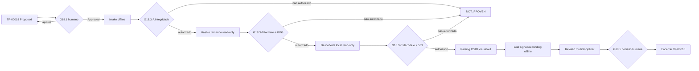

# TP-00018 — Correção offline do manifesto de evidência OpenTofu

> [!IMPORTANT]
> O Maintainer Humano aprovou `G18.1-A` a `G18.1-D` em 2026-08-25: este plano foi
> promovido `Proposed → Approved` somente como baseline documental e `G18.2` foi
> aberto para um intake textual/offline sanitizado. Depois, em gate próprio no
> mesmo dia, o Maintainer autorizou pesquisa externa read-only exclusivamente em
> fontes oficiais do OpenTofu, sem download, instalação ou execução. Essa
> autorização resolve parte da metadata do Lote 1, expira neste handoff e não abre
> `G18.3-A`. Posteriormente, o Maintainer declarou ter executado manualmente quatro
> downloads oficiais e autorizou somente preparar, sem executar, os comandos
> read-only exatos. O AgentOrchestrator confirmou apenas a existência dos quatro
> nomes no diretório externo informado. Em 2026-08-26, o Maintainer aprovou o
> bloco da seção 10.4: tamanho e hashes foram observados, o ZIP coincidiu com o
> manifesto e com o catálogo oficial, `cosign` não foi encontrado e o `.pem` não
> foi reconhecido por `openssl x509`. `G18.3-A` está `Done`. Depois, o bloco da
> seção 10.6 foi aprovado e executado: `file`, `sed` e GPG estão disponíveis; o
> `.pem` é uma linha única ASCII de 3.352 caracteres, classificada como
> `text/plain`, cujo prefixo é compatível com um envelope Base64. `G18.3-B` está
> `Done`. Ainda em 2026-08-26, o Maintainer concedeu mandato terminal contínuo
> para concluir os gates locais/offline e escolher a disposição fail-closed, sem
> ampliar rede, aquisição, instalação ou execução. `G18.3-C` comprovou por
> stdout um X.509 Sigstore com identidade do workflow oficial; `G18.3-D`
> comprovou `Verified OK` entre `.sig`, `SHA256SUMS` e a chave leaf. A revisão
> multidisciplinar encerrou o plano como `Completed — Review Concluded / Artifact
> Not Eligible`: trust chain/tlog, provenance, licença completa e libc seguem
> `NOT_PROVEN`; a allowlist concreta permanece vazia.
> O [TP-00017](TP-00017-infrastructure-iac-hermetic-poc.md) permanece `Cancelled`;
> nenhuma allowlist ou autoridade operacional é herdada. Este incremento não
> pesquisa fora das fontes e do modo autorizados, não baixa, instala, extrai ou
> executa OpenTofu, não cria IP-INFRA ou `infra/iac/` e não corrige a evidência
> por suposição. A entrada histórica continua `Deferred / Pending / NOT_PROVEN`.

## 1. Overview

Este plano retoma somente a primeira pendência registrada pelo
[REQ-00044](../../product/requirements/REQ-00044-infrastructure-iac-hermetic-poc.md): tornar
coerente e verificável o manifesto de evidência de um artefato exato do OpenTofu
CLI. São cinco fases documentais e incrementais; a aprovação do plano não atribui
sprint nem autoriza execução.

O resultado pretendido é uma decisão reproduzível sobre a evidência, não um
manifesto operacional, lockfile ou autorização de uso. Ausência ou inconsistência
permanece `NOT_PROVEN`; somente divergência comprovada de bytes, hash ou assinatura
poderá ser classificada como `FAIL`.

### 1.1 Fontes e lifecycle

- [Visão do produto](../../product/business/product-vision.md): contexto do SaaS contábil;
  não define tooling.
- [ADR-0033](../../backend/docs/adrs/ADR-0033-arquitetura-alvo-iac-segura.md): OpenTofu é
  preferência condicional e Terraform é fallback humano, sem instalação implícita.
- [REQ-00044](../../product/requirements/REQ-00044-infrastructure-iac-hermetic-poc.md):
  `Approved — Not Satisfied / Deferred`; exige versão, origem, plataforma,
  integridade, signer e licença comprováveis.
- [ANL-00044](../../analysis/ANL-00044-req-00044-iac-hermetic-poc-adherence-analysis.md):
  aderência arquitetural `PASS`, readiness `NOT_PROVEN` e execução `BLOCKED`.
- [IAC-SUPPLY-CHAIN-STANDARD](../agents/standards/iac-supply-chain-standard.md):
  policy `Active`, open-source-first e fail-closed; allowlist concreta vazia.
- [Software Engineering Lifecycle](../../agents/standards/software-engineering-lifecycle.md):
  este artefato ocupa a fase de Task Planning. Caso de uso é `N/A`, pois não há
  interação de produto. Implementation Plan é `N/A` neste escopo documental e
  continuaria obrigatório antes de qualquer configuração ou execução futura.

## 2. Execution Tracking Matrix

> Legenda: `Pending` · `In Progress` · `Done` · `Blocked` · `Cancelled`.

| ID | Atividade | Owner | Status | Evidência/condição de saída |
| --- | --- | --- | --- | --- |
| `G18.0` | Alocar `TP-00018`, criar o plano `Proposed` e indexá-lo. | AgentOrchestrator | Done | Autorização humana limitada de 2026-08-25; somente este plano e índice imediato. |
| `G18.1` | Revisar e aprovar o plano, escopo, alçadas e guardrails. | Maintainer Humano | Done | `G18.1-A` a `G18.1-D` aprovados em 2026-08-25; baseline documental `Approved`, intake textual autorizado e comandos bloqueados. |
| `G18.2` | Receber e sanear metadata de uma única release, usando somente os canais autorizados. | Humano + DevOps | Done | Quatro nomes esperados foram localizados no diretório externo informado; aquisição foi declarada pelo humano e normalizada na seção 10.3, sem leitura dos bytes. |
| `G18.3-A` | Autorizar e executar o primeiro bloco local read-only para os arquivos fornecidos. | Maintainer Humano + AgentOrchestrator | Done | Nove comandos executados em 2026-08-26: sete exit `0`, `cosign` ausente e parsing X.509 exit `1`; resultados na seção 10.5. |
| `G18.3-B` | Identificar localmente o formato do `.pem` e a disponibilidade do GPG. | Maintainer Humano + AgentOrchestrator | Done | Seis comandos executados em 2026-08-26; bloco exit `0`, resultados sanitizados na seção 10.6. |
| `G18.3-C` | Decodificar o envelope Base64 somente em stdout e inspecionar o certificado X.509 offline. | Maintainer Humano + AgentOrchestrator | Done | Pipeline exit `0`; certificado leaf, validade, fingerprint, SAN e issuer observados na seção 10.8. |
| `G18.3-D` | Verificar offline o vínculo matemático `.sig` → `SHA256SUMS` → chave leaf e inspecionar claims do certificado. | AgentOrchestrator sob mandato terminal humano | Done | ECDSA DER parseável e `Verified OK`; claims correlacionadas, sem provar trust chain/tlog. |
| `G18.3` | Verificar coerência, integridade, provenance e licença no escopo autorizado. | DevOps + Segurança + Qualidade | Done | Verificação local limitada esgotada: integridade e leaf binding `PASS`; provenance, licença completa e libc `NOT_PROVEN`. |
| `G18.4` | Revisar a classificação consolidada. | Segurança + DevOps + Qualidade | Done | `Integrity/leaf binding PASS`; nenhum `FAIL`; elegibilidade `NOT_PROVEN`, com no-go operacional. |
| `G18.5` | Decidir o manifesto e encerrar este plano. | Maintainer Humano + AgentOrchestrator sob mandato terminal | Done | `Completed — Review Concluded / Artifact Not Eligible`; allowlist vazia e lacunas deferidas. |

| Total | Done | In Progress | Pending | Blocked | Progresso administrativo |
| ---: | ---: | ---: | ---: | ---: | ---: |
| 10 | 10 | 0 | 0 | 0 | 100% |

## 3. Context and Constraints

### 3.1 Baseline histórica que não deve ser promovida

| Campo anterior | Observação preservada | Estado de entrada |
| --- | --- | --- |
| Produto | `OpenTofu CLI` foi declarado, mas nenhum artefato foi fornecido. | `NOT_PROVEN` |
| Versão | `1.0.0` possui formato exato, porém não foi ligada a uma release oficial comprovada. | `NOT_PROVEN` |
| Plataforma | `Linux amd64` é semanticamente compreensível; libc e vínculo com o arquivo não foram comprovados. | `NOT_PROVEN` |
| Origem | A URL apresentada apontava para uma imagem Docker da aplicação `saas-service`, não para a release do OpenTofu CLI. | `NOT_PROVEN / mismatch documental` |
| Arquivo | `tofu_1.0.0_linux_amd64.zip` foi apenas declarado e não foi ligado aos bytes ou à origem. | `NOT_PROVEN` |
| SHA-256 | Sessenta e quatro caracteres `a` eram placeholder, não digest observado. | `NOT_PROVEN` |
| Assinatura/provenance | Nome de assinatura e fingerprint continham marcadores de exemplo. | `NOT_PROVEN` |
| Licença | `MPL-2.0` foi declarada sem prova aplicável ao artefato exato. | `NOT_PROVEN` |
| Coleta | Data foi declarada, mas artefato, coletor/revisor e cadeia de custódia não foram comprovados. | `NOT_PROVEN` |

Essa baseline é memória append-only do diagnóstico. Uma nova tentativa não apaga
nem reescreve o que ocorreu; recebe um identificador de intake próprio dentro
deste plano após `G18.1`.

### 3.2 Contrato do novo manifesto de evidência

| Campo obrigatório | Preenchimento aceitável para revisão |
| --- | --- |
| Produto | Nome canônico `OpenTofu CLI`; não imagem da aplicação ou provider. |
| Versão exata | Sem range, branch, `latest` ou aproximação. |
| Plataforma | Sistema operacional, arquitetura e libc/formato quando aplicável. |
| Origem oficial | URL HTTPS imutável da release/arquivo e cadeia de redirects fornecidas como evidência offline sanitizada. |
| Release e fonte | Identidade da release e revisão/tag de source ligadas ao artefato. |
| Arquivo | Nome exato e tamanho em bytes correspondentes à origem e plataforma. |
| SHA-256 calculado | Digest real dos bytes fornecidos; nenhum valor de exemplo. |
| SHA-256 esperado | Valor de uma fonte autenticada independente, com sua origem evidenciada. |
| Assinatura/provenance | Formato, arquivo/atestado, signer, fingerprint completa, raiz/chave, validade, revogação e resultado do verificador. |
| Licença SPDX | Identificador e prova de licença/notices aplicáveis à release e ao artefato exatos. |
| Coleta e revisão | Data/hora com timezone, identidade funcional do coletor e revisor e validade/freshness. |
| Cadeia de custódia | Identificador do intake e registro de que os mesmos bytes sustentam hash, assinatura e demais verificações. |

Segredos, tokens, dados pessoais, caminhos de home e payload bruto não pertencem
ao manifesto. A evidência pode ser entregue parcialmente, mas o resultado geral
permanece `NOT_PROVEN` até o contrato ficar completo.

## 4. Phase Details

### Phase 0 — Proposta e gate humano

Objetivo: tornar o sucessor rastreável sem iniciar a correção técnica.

- `G18.0`: criar e indexar este plano — concluído neste incremento.
- `G18.1`: objetivo, fronteiras, alçadas e sequência aprovados em 2026-08-25.

Critério de aceite satisfeito: `TP-00018` validado documentalmente e decisão
humana explícita sobre `G18.1-A` a `G18.1-D`.

### Phase 1 — Intake offline

Objetivo: receber metadata e evidência sanitizada para um único artefato. A
pesquisa externa é proibida por padrão e somente ocorreu pela autorização humana
read-only de 2026-08-25, limitada às fontes oficiais do OpenTofu e sem download,
instalação ou execução.

Estado atual: `Done / Intake Received / NOT_PROVEN`; o intake `OTF-INTAKE-001`
contém metadata oficial para a release `v1.12.6`, o ZIP Linux amd64 e os três
acompanhantes esperados. O humano declarou a aquisição; em `G18.3-A`, tamanho e
SHA-256 dos quatro arquivos foram observados localmente, e o ZIP coincidiu com o
`SHA256SUMS` e com o catálogo oficial. Autenticidade/provenance e libc continuam
`NOT_PROVEN`.

- atribuir ID local ao intake;
- registrar cada campo como `Provided`, `Missing` ou `Conflicting`;
- rejeitar placeholders e mistura entre produto, versão, plataforma ou arquivo;
- parar para revisão humana antes de tocar qualquer arquivo fornecido.

Critério de aceite: formulário coerente e origem dos dados indicada; não implica
integridade, elegibilidade ou allowlist.

### Phase 2 — Verificação local autorizada

Objetivo: preparar primeiro e executar depois somente blocos read-only aprovados
em gates independentes, contra paths explícitos de evidência offline.

Estado final: `Done / Bounded Verification Completed`. O bloco `G18.3-A` da seção
10.4 foi aprovado e executado em 2026-08-26; a integridade do ZIP passou, mas
provenance continua `NOT_PROVEN`. O bloco complementar `G18.3-B` foi aprovado e
executado; seus resultados estão na seção 10.6. `G18.3-C` e `G18.3-D` foram
executados sob mandato terminal humano; resultados e limites estão nas seções
10.8 e 10.9.

Critério de aceite: comandos, resultados, exit codes e limitações registrados sem
executar o binário OpenTofu, acessar rede ou alterar o artefato.

### Phase 3 — Revisão multidisciplinar

Objetivo: separar suficiência documental, integridade, provenance, licença e
freshness, preservando `NOT_PROVEN` por dimensão.

Critério de aceite: DevOps, Segurança e Qualidade emitem revisão limitada ao
material observado; nenhuma alçada é presumida ou herdada.

Estado final: `Done`; a revisão separou integridade/leaf binding `PASS` de
provenance/elegibilidade `NOT_PROVEN` e recomendou no-go operacional.

### Phase 4 — Decisão e handoff

Objetivo: o Maintainer decide se o manifesto é candidato elegível, permanece
`NOT_PROVEN` ou contém `FAIL` comprovado.

Critério de aceite: decisão explícita, pendências e próximo owner registrados. O
plano termina sem IP-INFRA, provider, lockfile, fixture, POC ou execução.

Estado final: `Done`; o mandato terminal humano autorizou a disposição
fail-closed `Artifact Not Eligible`, sem promover allowlist ou operação.

## 5. Agent Chain per Module

`N/A`: não existe módulo de software ou cadeia repetível neste plano. A sequência
documental é Humano → AgentOrchestrator → DevOps/Segurança/Qualidade → Humano,
sempre condicionada aos gates acima.

## 6. Dependency Diagram



## 7. Agent Responsibility Matrix

| Papel | Proposta | Intake | Verificação | Decisão |
| --- | --- | --- | --- | --- |
| Maintainer Humano | Aprova ou ajusta `G18.1`. | Fornece/autoriza evidência. | Delimita subgates e concedeu mandato terminal local/offline em 2026-08-26. | Autoriza a disposição fail-closed e o fechamento. |
| AgentOrchestrator | Mantém ledger, sequência e limites. | Classifica completude sem inventar dados. | Registra evidência e bloqueios. | Prepara handoff; não autoaprova. |
| DevOps | Revisou o formulário sob `G18.1-C`; delegação expira neste handoff. | Avalia identidade do artefato em delegação futura. | Confere coerência técnica autorizada. | Recomenda disposição. |
| Segurança | Revisou controles do intake sob `G18.1-C`; delegação expira neste handoff. | Avalia cadeia de custódia em delegação futura. | Confere integridade e provenance. | Recomenda disposição fail-closed. |
| Qualidade | Revisou estados e rastreabilidade sob `G18.1-C`; delegação expira neste handoff. | Confere completude em delegação futura. | Confere reprodutibilidade. | Audita evidência e limitações. |

## 8. Coordination Rules

1. Cada gate humano abre somente a atividade descrita e expira no respectivo handoff.
2. Cada subgate `G18.3-*` é independente: a execução de `G18.3-A` não autorizou
   `G18.3-B`, e a execução de `G18.3-B` não autoriza `G18.3-C`; receber texto ou
   bytes não abre o gate seguinte.
   O mandato terminal posterior de 2026-08-26 cobre somente `G18.3-C`, a
   verificação leaf adicional, a revisão e o fechamento fail-closed deste plano.
3. Toda ausência, placeholder ou conflito resulta em `NOT_PROVEN`, salvo violação
   comprovada que satisfaça a definição de `FAIL` da policy Active.
4. Aprovação deste plano não aprova versão, origem, ferramenta, aquisição,
   allowlist, provider, IP-INFRA ou operação.
5. Não há fallback automático para Terraform nem atualização automática de versão.
6. O manifesto de evidência não substitui o lockfile gerado pela engine.
7. Qualquer necessidade de rede interrompe o plano e volta ao humano, salvo gate
   próprio que delimite fontes e operação read-only. Download, instalação,
   extração, execução da CLI, scanner, registry/provider ou ambiente continuam
   sempre sujeitos a autorização separada.
8. O plano é atualizado incrementalmente após cada revisão; histórico observado
   não é sobrescrito por tentativa posterior.

## 9. Verification

| Verificação | Aplicabilidade neste incremento | Resultado deste incremento |
| --- | --- | --- |
| `./infra/scripts/validate-docs.sh` | Obrigatória após atualizar plano e entrypoints. | `Passed`: exit `0` em 2026-08-26; governança documental passou para 639 Markdown/619 artefatos indexados, IP-INFRA passou com zero planos específicos e a estrutura documental foi validada. |
| `./infra/scripts/validate-docs.sh` — reconciliação narrativa | Obrigatória após rotular os snapshots e atualizar a rastreabilidade reversa. | `Passed`: exit `0` em 2026-08-27; 658 Markdown, 30 diretórios e 638 artefatos indexados; IP-INFRA passou com zero planos específicos e a estrutura documental foi validada. |
| Busca focal por `TP-00018` | Obrigatória. | `Passed` neste incremento: um arquivo canônico, um `document_id`, um H1 e uma entrada individual no índice; sem whitespace residual. |
| Busca por artefatos operacionais | Obrigatória. | `Passed` neste incremento: nenhum IP-INFRA específico ou `infra/iac/` criado; gates operacionais continuam bloqueados. |
| Pesquisa oficial read-only | Autorizada somente para `G18.2`. | `Passed / bounded`: apenas páginas oficiais do OpenTofu e do repositório `opentofu/opentofu`; nenhum asset baixado ou executado. |
| `G18.3-A` local read-only | Autorizada somente para o bloco exato da seção 10.4. | `Executed / bounded`: nove comandos; sete exit `0`, `cosign` ausente com exit `1` e parsing X.509 com exit `1`; sem rede, escrita, extração ou execução do OpenTofu. |
| `G18.3-B` local read-only | Autorizada somente para o bloco exato da seção 10.6. | `Executed / bounded`: seis comandos, bloco exit `0`; `.pem` identificado como texto ASCII em linha única e GPG disponível; sem rede, escrita, decodificação ou execução do OpenTofu. |
| `G18.3-C` local read-only | Coberta pelo mandato terminal humano. | `Executed / bounded`: pipeline exit `0`; X.509 leaf e claims públicas observados somente via stdout. |
| `G18.3-D` leaf binding | Coberta pelo mandato terminal humano. | `Passed / bounded`: assinatura ECDSA DER parseável e `Verified OK` sobre o `SHA256SUMS`; trust chain/tlog não verificados. |
| Testes de software/IaC | `N/A`. | Alteração exclusivamente documental; o OpenTofu e os artefatos não foram executados ou extraídos. |

## 10. Verificação encerrada e disposição fail-closed

| Item | Disposição registrada | Efeito |
| --- | --- | --- |
| `G18.1-A` | `Approved / Done` | `TP-00018` promovido para `Approved` somente como baseline documental. |
| `G18.1-B` | `Approved / Done` | Intake textual/offline sanitizado autorizado para um único artefato OpenTofu, sem comandos. |
| `G18.1-C` | `Approved / Expired at handoff` | DevOps, Segurança e Qualidade revisaram o formulário; a delegação expira nesta devolução. |
| `G18.1-D` | `Approved / Enforced at that gate` | Pesquisa, rede, download, tooling, IP-INFRA, `infra/iac/`, provider, ambiente e execução permaneceram bloqueados; os gates posteriores foram abertos separadamente. |
| Autorização read-only vinculada a `G18.2` | `Approved / Executed / Expired at handoff` | Exceção posterior e estrita para consultar fontes oficiais do OpenTofu. Não autorizou download, instalação, execução, verificador ou qualquer efeito operacional. |
| Aquisição manual declarada | `Human-declared / Agent not executed` | O humano declarou quatro downloads oficiais; o agente apenas localizou os nomes. Isso não comprova origem efetiva, bytes ou integridade. |
| `G18.3-A` | `Approved / Executed` | O bloco exato da seção 10.4 foi executado em 2026-08-26; resultados e limitações estão na seção 10.5. |
| `G18.3-B` | `Approved / Executed` | O bloco exato da seção 10.6 foi executado em 2026-08-26; resultados sanitizados permanecem na própria seção. |
| Mandato terminal humano | `Approved / Executed` | Autoriza concluir gates locais/offline e decidir fail-closed, sem rede, aquisição, instalação, OpenTofu, provider ou ambiente. |
| `G18.3-C` | `Approved / Executed` | Pipeline da seção 10.7 executado em uma sessão Bash; resultados na seção 10.8. |
| `G18.3-D` | `Approved by terminal mandate / Executed` | Vínculo leaf e claims do certificado verificados offline; resultados na seção 10.9. |
| `G18.4` | `Done / No-go` | Integridade e leaf binding `PASS`; elegibilidade geral `NOT_PROVEN`; nenhum `FAIL`. |
| `G18.5` | `Done / Completed` | Artefato não elegível, allowlist vazia e lacunas deferidas para eventual ciclo sucessor. |

### 10.1 Snapshot histórico do intake após `G18.3-B`

> [!NOTE]
> Esta subseção preserva o estado observado ao fim de `G18.3-B`, antes da
> decodificação X.509 e da verificação leaf de `G18.3-C/D`. Ela não representa o
> estado final do plano. As seções 10.8–10.10 a supersedem para leitura corrente:
> X.509 e vínculo criptográfico leaf passaram, enquanto trust/provenance,
> cobertura completa de licença, libc e elegibilidade permaneceram `NOT_PROVEN`.

Os estados usados naquele snapshot eram `Provided — Unverified`, `Observed
Locally`, `PASS — Integrity`, `Missing`, `Conflicting` e `Rejected Placeholder`.
`PASS — Integrity` confirmava somente coerência dos digests; não provava signer
ou provenance. Ausência de verificador ou formato ainda não identificado não era
`FAIL`, e o resultado agregado daquele checkpoint permanecia `NOT_PROVEN`.

| Campo | Valor no checkpoint `G18.3-B` | Estado naquele checkpoint | Limite daquele checkpoint |
| --- | --- | --- | --- |
| ID do intake | `OTF-INTAKE-001` | `Assigned` | Identifica somente esta nova tentativa. |
| Modalidade | Contexto humano + pesquisa oficial read-only + aquisição manual declarada + verificação local read-only autorizada | `Observed Locally / bounded` | O agente não baixou, escreveu, extraiu ou executou os arquivos; tamanho, hashes e envelope textual do `.pem` foram lidos, sem decodificação. |
| Produto | `OpenTofu CLI` | `Provided — Unverified` | Coerente entre documentação, release e asset oficiais; a integridade foi correlacionada, mas a autenticidade não foi verificada. |
| Versão exata | `1.12.6` | `Provided — Unverified` | Inferência controlada: a documentação orienta o patch mais recente da série `1.12.x` e o GitHub oficial marca `v1.12.6` como `Latest`. Não é allowlist. |
| Plataforma | `Linux amd64`; formato `ZIP`; libc `PENDING / NOT_PROVEN` | `Provided — Unverified` | Nome do asset comprova SO, arquitetura e formato; fontes consultadas não declaram a libc. |
| Release/tag/revisão | `v1.12.6`; commit `b4305e5a5dd2fb79a27897ae30784a181d3a26cb` | `Provided — Unverified` | A página oficial mostra tag/commit e assinaturas verificadas pelo GitHub; nenhuma verificação independente ocorreu. |
| URL HTTPS exata do arquivo | `https://github.com/opentofu/opentofu/releases/download/v1.12.6/tofu_1.12.6_linux_amd64.zip` | `Provided — Unverified` | URL imutável derivada da convenção do instalador oficial e confirmada pelo catálogo da release; não acessada como download. |
| Nome e tamanho do arquivo | `tofu_1.12.6_linux_amd64.zip`; `34,644,365` bytes | `Observed Locally` | Tamanho obtido com `stat`; não houve extração ou execução. |
| SHA-256 local e esperado do ZIP | `5dc43da4f750f33873dc25e94587128709e819e544b7be9016b255316153c3a8` | `PASS — Integrity` | Digest calculado coincide com o `SHA256SUMS` local e com o catálogo oficial; não equivale a provenance. |
| Acompanhantes | `SHA256SUMS`: `3,730` bytes; `.sig`: `96` bytes; `.pem`: `3,352` bytes | `Observed Locally` | Tamanhos e hashes foram observados; signer e autenticidade continuam `NOT_PROVEN`. |
| Envelope textual do `.pem` | MIME `text/plain`; uma linha ASCII de `3,352` caracteres sem terminador; prefixo `LS0tLS1CRUdJTiBDRVJUSUZJQ0FURS0tLS0t...` | `Observed Locally / format partial` | O prefixo é compatível com Base64 de um PEM X.509, mas nenhuma decodificação ocorreu; hipótese segue `NOT_PROVEN`. |
| Fonte, coletor e data | Fontes oficiais + declaração humana de aquisição + leitura local autorizada; AgentOrchestrator; metadata em `2026-08-25` e verificação em `2026-08-26`; `America/Recife`; horários exatos não registrados | `Observed / bounded` | Prova a correlação de tamanho e digests; não conclui provenance, libc ou elegibilidade. |

Naquele checkpoint, valores textuais de assinatura, resultado de verificador,
licença ou origem sem evidência observada permaneciam alegações. `EXEMPLO`,
`TODO`, `latest`, hash repetitivo, fingerprint fictícia, valor truncado ou URL
com credencial serão `Rejected Placeholder`, sem tocar bytes.

### 10.2 Snapshot histórico do Lote 1 após `G18.3-B`

Este snapshot do primeiro lote cobria somente identidade, origem declarada e
integridade local disponível até `G18.3-B`:

```text
Intake: OTF-INTAKE-001
Produto: OpenTofu CLI — metadata oficial e integridade local correlacionadas; provenance não verificada
Versão exata: 1.12.6 — candidato, não allowlisted
Plataforma: Linux amd64; formato ZIP; libc PENDING / NOT_PROVEN
Release/tag/revisão de origem: v1.12.6 / b4305e5a5dd2fb79a27897ae30784a181d3a26cb
URL HTTPS exata do arquivo: https://github.com/opentofu/opentofu/releases/download/v1.12.6/tofu_1.12.6_linux_amd64.zip
Nome exato do arquivo: tofu_1.12.6_linux_amd64.zip
Tamanho observado em bytes: 34644365
Fonte sanitizada desta informação: páginas oficiais + aquisição manual declarada + verificação local read-only autorizada; agente não executou download
Coletor e data/hora com timezone: AgentOrchestrator; verificação em 2026-08-26; America/Recife; horário exato não registrado
```

Fontes oficiais observadas:

- [release `v1.12.6`](https://github.com/opentofu/opentofu/releases/tag/v1.12.6),
  marcada como `Latest` em 2026-08-25;
- [catálogo expandido dos assets](https://github.com/opentofu/opentofu/releases/expanded_assets/v1.12.6),
  que exibe nome, SHA-256, tamanho arredondado e timestamp do ZIP;
- [instalação standalone](https://opentofu.org/docs/intro/install/standalone/) e
  [script oficial](https://github.com/opentofu/get.opentofu.org/blob/main/static/install-opentofu.sh),
  que definem a convenção do nome/URL e o fluxo de verificação;
- [guia de upgrade](https://opentofu.org/docs/intro/upgrading/), que orienta usar
  o patch mais recente da série `1.12.x`;
- [licença da tag `v1.12.6`](https://github.com/opentofu/opentofu/blob/v1.12.6/LICENSE).

Disposição naquele checkpoint: **`Partial / Local Integrity PASS / Provenance
NOT_PROVEN`**.
Versão, release, URL, nome do arquivo e tamanho exato deixam de ser `PENDING`;
libc continua ausente. A escolha de `1.12.6` permanece inferência baseada na
orientação de upgrade e na marca `Latest`, não aprovação de uso ou allowlist.

O catálogo oficial exibe o SHA-256
`5dc43da4f750f33873dc25e94587128709e819e544b7be9016b255316153c3a8`,
os acompanhantes `.gpgsig`, `.pem` e `.sig`, e a tag traz licença `MPL-2.0`.
Em `G18.3-A`, o digest do ZIP foi recalculado e coincidiu com o `SHA256SUMS` local
e com o catálogo; os hashes dos três acompanhantes também coincidiram com o
catálogo oficial. Até `G18.3-B`, o `SHA256SUMS` ainda não tinha vínculo
criptográfico verificado com a chave leaf, e não havia provenance SLSA/in-toto
comprovada. O `.pem` havia sido identificado como texto ASCII em linha única e
GPG fora encontrado em `/usr/bin/gpg`; disponibilidade não comprovava
compatibilidade OpenPGP nem substituía o verificador canônico do formato.

Esse snapshot foi posteriormente supersedido pelas seções 10.8–10.10:
`G18.3-C/D` comprovaram parsing X.509 e `PASS — leaf binding`, mas não trust chain,
Rekor/tlog, provenance completa, cobertura integral de licença ou libc. Portanto,
o resultado final continua `Artifact Not Eligible`, sem allowlist ou autoridade
operacional.

### 10.3 Ledger sanitizado da aquisição declarada

O Maintainer informou que executou manualmente os comandos abaixo. O registro é
`Human-declared / Not replayed by agent`: os escapes introduzidos pela conversa
foram normalizados, os destinos pessoais foram substituídos por um alias e as
URLs foram preservadas. O bloco não é autorização para replay.

```bash
OTF_INTAKE_DIR="<EXTERNAL_INTAKE_DIR_REDACTED>"

curl --proto '=https' --tlsv1.2 --fail --location \
  --output "${OTF_INTAKE_DIR}/tofu_1.12.6_linux_amd64.zip" \
  https://github.com/opentofu/opentofu/releases/download/v1.12.6/tofu_1.12.6_linux_amd64.zip

curl --proto '=https' --tlsv1.2 --fail --location \
  --output "${OTF_INTAKE_DIR}/tofu_1.12.6_SHA256SUMS" \
  https://github.com/opentofu/opentofu/releases/download/v1.12.6/tofu_1.12.6_SHA256SUMS

curl --proto '=https' --tlsv1.2 --fail --location \
  --output "${OTF_INTAKE_DIR}/tofu_1.12.6_SHA256SUMS.sig" \
  https://github.com/opentofu/opentofu/releases/download/v1.12.6/tofu_1.12.6_SHA256SUMS.sig

curl --proto '=https' --tlsv1.2 --fail --location \
  --output "${OTF_INTAKE_DIR}/tofu_1.12.6_SHA256SUMS.pem" \
  https://github.com/opentofu/opentofu/releases/download/v1.12.6/tofu_1.12.6_SHA256SUMS.pem
```

Evidência observada pelo agente: quatro nomes exatos presentes e, após aprovação
de `G18.3-A`, tamanho e SHA-256 dos quatro arquivos. Não foram observados redirect
final, códigos HTTP, timestamps de aquisição, conteúdo extraído ou assinatura
válida.

### 10.4 Bloco exato de `G18.3-A` — aprovado e executado em 2026-08-26

O alias abaixo representa exclusivamente o path externo fornecido pelo humano na
conversa. Na execução autorizada, o AgentOrchestrator o resolveu para esse path
exato; o valor pessoal não é persistido no repositório.

```bash
OTF_INTAKE_DIR="<HUMAN_PROVIDED_EXTERNAL_DIR>"

command -v stat
command -v sha256sum
command -v awk
command -v openssl
command -v cosign

stat --format='%n|%s' \
  "${OTF_INTAKE_DIR}/tofu_1.12.6_linux_amd64.zip" \
  "${OTF_INTAKE_DIR}/tofu_1.12.6_SHA256SUMS" \
  "${OTF_INTAKE_DIR}/tofu_1.12.6_SHA256SUMS.sig" \
  "${OTF_INTAKE_DIR}/tofu_1.12.6_SHA256SUMS.pem"

sha256sum \
  "${OTF_INTAKE_DIR}/tofu_1.12.6_linux_amd64.zip" \
  "${OTF_INTAKE_DIR}/tofu_1.12.6_SHA256SUMS" \
  "${OTF_INTAKE_DIR}/tofu_1.12.6_SHA256SUMS.sig" \
  "${OTF_INTAKE_DIR}/tofu_1.12.6_SHA256SUMS.pem"

awk '$2 == "tofu_1.12.6_linux_amd64.zip" { print $1, $2 }' \
  "${OTF_INTAKE_DIR}/tofu_1.12.6_SHA256SUMS"

openssl x509 \
  -in "${OTF_INTAKE_DIR}/tofu_1.12.6_SHA256SUMS.pem" \
  -noout -subject -issuer -serial -dates -fingerprint -sha256 -ext subjectAltName
```

Escopo executado: capability discovery, tamanho exato, digest calculado dos quatro
arquivos, digest esperado do ZIP e tentativa de leitura de metadata não secreta
do `.pem`. Não houve rede, download, escrita, extração, `unzip`, OpenTofu,
provider, registry, ambiente ou verificação Cosign. `cosign` não estava disponível
e `openssl x509` não reconheceu o `.pem` como certificado X.509.

### 10.5 Resultados observados de `G18.3-A`

| Comando/capacidade | Resultado | Exit code |
| --- | --- | ---: |
| `command -v stat` | `/usr/bin/stat` | `0` |
| `command -v sha256sum` | `/usr/bin/sha256sum` | `0` |
| `command -v awk` | `/usr/bin/awk` | `0` |
| `command -v openssl` | `/usr/bin/openssl` | `0` |
| `command -v cosign` | Sem saída; capacidade ausente. | `1` |
| `stat` dos quatro arquivos | Tamanhos lidos com sucesso. | `0` |
| `sha256sum` dos quatro arquivos | Digests calculados com sucesso. | `0` |
| `awk` no `SHA256SUMS` | Entrada exata do ZIP encontrada. | `0` |
| `openssl x509` no `.pem` | `Could not read certificate`; formato X.509 não comprovado. | `1` |

| Arquivo sanitizado | Tamanho (bytes) | SHA-256 calculado localmente |
| --- | ---: | --- |
| `tofu_1.12.6_linux_amd64.zip` | 34,644,365 | `5dc43da4f750f33873dc25e94587128709e819e544b7be9016b255316153c3a8` |
| `tofu_1.12.6_SHA256SUMS` | 3,730 | `6988e0cb8f4e9ebfa3b0999e44841549741b22d9b38873cb5b89074f1cddcb1c` |
| `tofu_1.12.6_SHA256SUMS.sig` | 96 | `94258620139d5d0be0f70fc4eff71fef175b13c4482b1216eaf4bd9437f245df` |
| `tofu_1.12.6_SHA256SUMS.pem` | 3,352 | `9d1b7905d07cf7e7cac42197f1dd36bc424f16a530c1e4de7cc3baf9e0fcb1f7` |

Os quatro hashes calculados coincidem com o catálogo oficial de assets da release
`v1.12.6`. A entrada do ZIP no `SHA256SUMS` local também contém exatamente o hash
calculado do ZIP.

| Dimensão | Classificação | Justificativa limitada |
| --- | --- | --- |
| Presença e tamanho | `PASS` | Quatro arquivos esperados foram lidos por nome e tamanho. |
| Arquivos locais × catálogo oficial | `PASS — Integrity` | Os quatro digests locais coincidem com os digests publicados no catálogo oficial. |
| ZIP × `SHA256SUMS` local | `PASS — Integrity` | Digest calculado e entrada esperada são idênticos. |
| Formato X.509 do `.pem` | `NOT_PROVEN` | `openssl x509` retornou exit `1`; isso não prova corrupção do artefato. |
| Assinatura/autenticidade/provenance | `NOT_PROVEN` | `cosign` está ausente e nenhum verificador canônico foi executado. |
| Elegibilidade geral | `NOT_PROVEN` | Integridade isolada não satisfaz signer, provenance, libc, licença vinculada e revisão final. |

Nenhum `FAIL` do artefato foi concluído: a falha de parsing caracteriza ausência
de prova no verificador tentado, não divergência comprovada dos bytes oficiais.

### 10.6 Bloco e resultados de `G18.3-B` — executado em 2026-08-26

O bloco abaixo foi aprovado e executado somente para identificar o formato local
do `.pem` e descobrir se o GPG, alternativa open source, estava disponível. O
alias foi resolvido para o path exato fornecido na conversa; o valor pessoal não
é persistido no repositório.

```bash
OTF_INTAKE_DIR="<HUMAN_PROVIDED_EXTERNAL_DIR>"

command -v file
command -v sed
command -v gpg

file --brief --mime-type \
  "${OTF_INTAKE_DIR}/tofu_1.12.6_SHA256SUMS.pem"
file --brief \
  "${OTF_INTAKE_DIR}/tofu_1.12.6_SHA256SUMS.pem"
sed -n '1,5p' \
  "${OTF_INTAKE_DIR}/tofu_1.12.6_SHA256SUMS.pem"
```

O bloco terminou com exit `0`. Não incluiu `gpg --version`, verificação de
assinatura, rede, download, instalação, escrita, decodificação, extração, execução
do OpenTofu, provider, registry ou ambiente.

| Observação | Resultado sanitizado |
| --- | --- |
| `command -v file` | `/usr/bin/file` |
| `command -v sed` | `/usr/bin/sed` |
| `command -v gpg` | `/usr/bin/gpg` |
| MIME do `.pem` | `text/plain` |
| Descrição do `.pem` | Texto ASCII, linha única de `3,352` caracteres e sem terminador de linha. |
| Prefixo observado | `LS0tLS1CRUdJTiBDRVJUSUZJQ0FURS0tLS0t...` |

Como o arquivo não possui terminadores, `sed -n '1,5p'` retornou a única linha
completa; o payload não é reproduzido neste manifesto. O prefixo é compatível com
Base64 de `-----BEGIN CERTIFICATE-----`, mas isso é uma inferência sem
decodificação. O formato X.509 permaneceu `NOT_PROVEN` até `G18.3-C`, cujo
resultado está na seção 10.8.

GPG disponível não significa assinatura OpenPGP compatível. Nenhuma verificação
com GPG deve ser proposta sem antes identificar o formato canônico da `.sig` e a
cadeia de confiança esperada.

### 10.7 Bloco exato de `G18.3-C` — executado em 2026-08-26

Este bloco decodificou o envelope Base64 somente em stdout e entregou os bytes
diretamente ao `openssl x509` por pipe. `-noout` limita a saída à metadata pública
solicitada e evita imprimir o certificado; nenhum arquivo temporário ou
persistente foi criado.

```bash
OTF_INTAKE_DIR="<HUMAN_PROVIDED_EXTERNAL_DIR>"

command -v base64
command -v openssl

set -o pipefail
base64 --decode "${OTF_INTAKE_DIR}/tofu_1.12.6_SHA256SUMS.pem" \
  | openssl x509 -inform PEM -noout \
      -subject -issuer -serial -dates -sha256 -fingerprint \
      -ext subjectAltName
```

`pipefail` impediu que um sucesso do OpenSSL escondesse falha no decodificador.
Mesmo com exit `0`, o resultado prova somente que o envelope contém um certificado
X.509 interpretável. Fingerprint, subject, issuer, validade e SAN não validam
isoladamente cadeia de confiança, transparência ou provenance.

### 10.8 Resultados observados de `G18.3-C`

| Campo | Resultado sanitizado |
| --- | --- |
| `command -v base64` | `/usr/bin/base64` |
| `command -v openssl` | `/usr/bin/openssl` |
| Pipeline | exit `0` |
| Subject | Vazio, conforme certificado keyless observado. |
| Issuer declarado | `O = sigstore.dev, CN = sigstore-intermediate` |
| Serial | `0E5A95B67FF7DBC7B2DDBC1E2AEE3996443FA7EF` |
| Validade leaf | `2026-08-19T11:27:28Z` a `2026-08-19T11:37:28Z` |
| Fingerprint SHA-256 | `6A:92:4B:73:FB:CF:EB:69:68:CC:94:0A:62:1A:0C:8F:AD:EE:4C:23:17:EF:26:9A:CE:92:F2:6C:05:03:A9:49` |
| SAN crítica | `URI:https://github.com/opentofu/opentofu/.github/workflows/release.yml@refs/heads/v1.12` |

Disposição: **`PASS — X.509 envelope/leaf parse only`**. A curta validade é
compatível com certificado keyless efêmero, mas o instante confiável da assinatura
não foi provado por tlog/bundle offline; não se usa a validade atual como rejeição.

### 10.9 `G18.3-D` — vínculo criptográfico leaf e claims

Sob o mandato terminal humano, o AgentOrchestrator executou os blocos read-only
abaixo. Process substitutions usam descritores `/dev/fd`; nenhum arquivo
temporário ou persistente foi criado.

```bash
OTF_INTAKE_DIR="<HUMAN_PROVIDED_EXTERNAL_DIR>"

set -o pipefail
base64 --decode "${OTF_INTAKE_DIR}/tofu_1.12.6_SHA256SUMS.sig" \
  | openssl asn1parse -inform DER -i

openssl dgst -sha256 \
  -verify <(base64 --decode "${OTF_INTAKE_DIR}/tofu_1.12.6_SHA256SUMS.pem" \
    | openssl x509 -inform PEM -pubkey -noout) \
  -signature <(base64 --decode \
    "${OTF_INTAKE_DIR}/tofu_1.12.6_SHA256SUMS.sig") \
  "${OTF_INTAKE_DIR}/tofu_1.12.6_SHA256SUMS"

set -o pipefail
base64 --decode "${OTF_INTAKE_DIR}/tofu_1.12.6_SHA256SUMS.pem" \
  | openssl x509 -inform PEM -noout -text
```

Resultados:

- a `.sig` decodificou como sequência DER ECDSA com dois inteiros de 32 bytes;
- `openssl dgst -sha256` retornou **`Verified OK`**, exit `0`, para o
  `SHA256SUMS` local e a chave P-256 do certificado;
- o certificado declara `Digital Signature`, `Code Signing`, issuer OIDC
  `https://token.actions.githubusercontent.com`, workflow `release`, repositório
  `opentofu/opentofu`, commit
  `b4305e5a5dd2fb79a27897ae30784a181d3a26cb` e ref `refs/heads/v1.12`;
- existe SCT embutido com timestamp `2026-08-19T11:27:28.789Z`, mas sua assinatura
  e inclusão não foram validadas offline.

Disposição: **`PASS — cryptographic leaf binding and claim correlation`**. Isso
prova `.sig` → `SHA256SUMS` → chave leaf e a presença de claims coerentes; não
prova confiança na raiz/intermediária Fulcio, revogação, Rekor/tlog, instante
autenticado, provenance SLSA/in-toto ou canonicidade completa Cosign.

### 10.10 Manifesto final e decisão

| Campo | Evidência final | Classificação |
| --- | --- | --- |
| Produto/versão | `OpenTofu CLI 1.12.6`; release `v1.12.6`; commit `b4305e5a5dd2fb79a27897ae30784a181d3a26cb`. | `PASS — identity correlation` |
| Plataforma | `Linux amd64`, formato ZIP; libc/static linkage não inspecionados. | `Partial / libc NOT_PROVEN` |
| Origem | URL oficial imutável e catálogo oficial observados; aquisição foi humana e redirects não foram capturados. | `Partial` |
| Arquivo | `tofu_1.12.6_linux_amd64.zip`, `34,644,365` bytes. | `PASS` |
| Integridade | ZIP coincide com `SHA256SUMS` local e catálogo oficial; quatro digests locais coincidem com o catálogo. | `PASS` |
| Assinatura leaf | `.sig` ECDSA verifica o `SHA256SUMS` com a chave P-256 do certificado. | `PASS — leaf binding` |
| Identidade declarada | SAN, OIDC issuer, workflow, repo, commit e ref coerentes. | `PASS — claim correlation` |
| Trust/provenance | Roots/intermediárias aprovadas, revogação, Rekor/tlog e bundle Cosign não fornecidos. | `NOT_PROVEN` |
| Licença | Tag oficial declara `MPL-2.0`, presente na allowlist de licenças; componentes/notices do ZIP não foram inspecionados. | `NOT_PROVEN — incomplete coverage` |
| Malware/advisories/freshness | Nenhum scanner ou corpus offline aprovado foi fornecido. | `NOT_PROVEN` |
| Coleta | AgentOrchestrator; `2026-08-26T21:02:47-03:00`; evidência externa permanece sanitizada. | `Recorded` |
| Elegibilidade geral | Evidência insuficiente para cumprir integralmente a policy Active. | `NOT_PROVEN / Artifact Not Eligible` |

Veredito `G18.4`: **`Integrity and leaf binding PASS / provenance and eligibility
NOT_PROVEN / no artifact FAIL observed`**.

Decisão `G18.5`: **`Completed — Review Concluded / Artifact Not Eligible`**. A
allowlist concreta permanece vazia; `REQ-00044` segue `Approved — Not Satisfied /
Deferred`; a policy permanece `Active`; `L-007` continua fechado somente no eixo
documental. Qualquer trust bundle, Cosign, scanner, mirror, lockfile, sandbox,
provider, POC ou execução pertence a ciclo sucessor explicitamente autorizado.

## 11. Risks and Mitigations

| Risco | Mitigação |
| --- | --- |
| Reutilizar a entrada histórica como prova | Preservá-la `NOT_PROVEN` e criar intake novo. |
| URL e arquivo pertencerem a produtos diferentes | Exigir identidade única e vínculo source → release → arquivo. |
| Hash ou fingerprint parecerem válidos por formato | Exigir valor observado, fonte e resultado verificável; placeholders são ausência. |
| Tratar `PASS` de hash/leaf como `PASS` de provenance | Separar integridade, vínculo leaf, confiança da cadeia e transparência; elegibilidade permanece `NOT_PROVEN`. |
| Tratar GPG disponível como verificador compatível | GPG exigiria o asset `.gpgsig`, ausente do intake; não usar GPG para o par Sigstore `.sig` + `.pem`. |
| Validar certificado efêmero contra o relógio atual | Exigir instante autenticado por tlog/bundle; expiração atual isolada não é `FAIL`. |
| “Open source” ser inferido pelo nome | Exigir SPDX, texto/notices e provenance do artefato exato. |
| Aprovação documental virar permissão operacional | Gates separados, callout e non-objectives explícitos. |
| Versão antiga ser promovida sem manutenção comprovada | Manter freshness/advisories `NOT_PROVEN` até evidência própria. |

## 12. Handoff

Estado final: `TP-00018 Completed — Review Concluded / Artifact Not Eligible`;
dez atividades `Done`, progresso administrativo `100%`. Integridade, parsing
X.509 e vínculo criptográfico leaf estão `PASS`; trust chain/tlog, provenance,
licença completa, libc, scanners e elegibilidade permanecem `NOT_PROVEN`. Nenhum
`FAIL` do artefato foi observado. A allowlist concreta segue vazia e nenhum
OpenTofu, provider, ambiente ou artefato foi executado.

O fechamento é administrativo e fail-closed: lacunas foram classificadas e
deferidas, não apagadas nem convertidas em aprovação operacional. O próximo owner
é o Maintainer Humano somente se decidir abrir ciclo sucessor para trust bundle,
Cosign/scanners offline ou elegibilidade; não existe ação ativa herdada.

## 13. Change Log

| Version | Date | Owner | Change |
| --- | --- | --- | --- |
| 1.7 | 2026-08-27 | Maintainer Humano / AgentOrchestrator | Reconcilia a narrativa temporal das seções 10.1/10.2 como snapshots históricos supersedidos por 10.8–10.10, corrige o escopo concluído e registra validator global aprovado, sem alterar `Completed`, o no-go, a allowlist vazia ou as classificações finais. |
| 1.6 | 2026-08-26 | Maintainer Humano / AgentOrchestrator sob mandato terminal, com revisões independentes de Segurança/DevOps/Qualidade | Executa `G18.3-C` e `G18.3-D`, comprova X.509 e leaf binding, encerra `G18.3`–`G18.5` com no-go, marca o plano `Completed` e mantém trust/provenance/licença/libc/elegibilidade `NOT_PROVEN`, sem allowlist ou operação. |
| 1.5 | 2026-08-26 | Maintainer Humano / AgentOrchestrator | Materializa `G18.3-B`: `.pem` como texto ASCII de linha única com envelope Base64 aparente e GPG disponível, sem inferir compatibilidade; prepara `G18.3-C` sem execução. |
| 1.4 | 2026-08-26 | Maintainer Humano / AgentOrchestrator | Materializa `G18.3-A`: tamanhos e hashes dos quatro arquivos, integridade do ZIP `PASS`, `cosign` ausente e parsing X.509 inconclusivo; prepara `G18.3-B` sem execução e mantém provenance, libc e elegibilidade `NOT_PROVEN`. |
| 1.3 | 2026-08-25 | Maintainer Humano / AgentOrchestrator | Materializa o ledger sanitizado dos quatro downloads declarados, confirma somente os nomes externos, conclui `G18.2`, prepara `G18.3-A` sem execução e mantém bytes, integridade, assinatura, libc e elegibilidade `NOT_PROVEN`. |
| 1.2 | 2026-08-25 | Maintainer Humano / AgentOrchestrator | Registra a autorização externa read-only limitada às fontes oficiais do OpenTofu, identifica `v1.12.6`, commit e ZIP Linux amd64, preserva tamanho exato/libc/verificação como `NOT_PROVEN`, expira a exceção no handoff e mantém `G18.3-A` bloqueado. |
| 1.1 | 2026-08-25 | Maintainer Humano / AgentOrchestrator | Preenche `OTF-INTAKE-001` apenas com o contexto local disponível, classifica o Lote 1 como `Partial / NOT_PROVEN`, mantém versão/release/origem/arquivo/tamanho `PENDING` e preserva `G18.3-A`/operação bloqueados. |
| 1.0 | 2026-08-25 | Maintainer Humano / DevOps / Segurança / Qualidade temporariamente delegados | Registra `G18.1-A` a `G18.1-D` aprovados, promove o plano para `Approved`, abre `G18.2` aguardando o Lote 1 textual de `OTF-INTAKE-001`, expira as delegações no handoff e mantém `G18.3-A`/operação bloqueados. |
| 0.1 | 2026-08-25 | Maintainer Humano / AgentOrchestrator | Cria o sucessor `Proposed` autorizado, limitado à correção offline e incremental do manifesto de evidência OpenTofu, sem pesquisa, aquisição, IP ou execução. |
