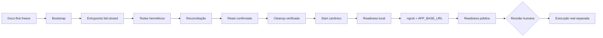

# TP-00019 — Bootstrap do host de desenvolvimento local

## 1. Overview

Este plano executa o [REQ-00045](../../product/requirements/REQ-00045-local-development-host-bootstrap.md)
em sete fases: documentação normativa, bootstrap, integração dos entrypoints,
verificação, correção do health check, reset-to-ready e preflight incremental não
disruptivo. As solicitações humanas de 2026-08-25 e 2026-08-26 aprovaram os dois
primeiros incrementos; a de 2026-09-05 aprovou análise, plano e implementação do
corretivo de lifecycle. Nenhuma execução real de `sudo`, `usermod` ou Docker foi
necessária para concluir o recorte repository-local.

O caso de uso é `N/A`, pois não existe fluxo de produto. O gap foi observado
historicamente no contexto do
[IP-BE-8.3.2-conversation-audit-operations-and-rollout](../../backend/docs/specs/IP-BE-8.3.2-conversation-audit-operations-and-rollout.md),
mas o incremento reset-to-ready é governado integralmente por este TP-00019. Um
novo `IP-INFRA` não pode ser inferido sem o gate de alocação específico de sua
coleção.

## 2. Execution Tracking Matrix

| ID | Activity | Owner | Status | Exit evidence |
| --- | --- | --- | --- | --- |
| `19.1` | Persistir requisito, análise, decisão local, plano e guia canônico. | Arquitetura / DevOps | Done | Novos artefatos/indexes e diff-check focal verdes; gate global isolou somente erros concorrentes em `IP-BE-3.1.17.1-ephemeral-webhook-diagnostics`, `IP-FE-3.8.11-webhook-traffic-inspector-secure-diagnostics` e REQ-00036, sem apontamento deste incremento. |
| `19.2` | Implementar bootstrap root-only, idempotente e transacional. | DevOps / Segurança | Done | Script sem secrets/rede, associação aditiva, lock, fresh-session check e compensação inclusive após aplicação parcial. |
| `19.3` | Remover fallbacks sudo dos caminhos Docker DEV. | DevOps | Done | Start/stop/reset, health e recovery Keycloak usam preflight compartilhado com Docker direto ou falham antes do Compose. |
| `19.4` | Implementar testes herméticos e seleção CI. | TestAutomator / DevOps | Done | Positivos, negativos, idempotência, rollback, allowlist e contrato PRD passam sem alteração real do host; CI seleciona o gate. |
| `19.5` | Executar gates e reconciliar documentação. | Qualidade / AgentOrchestrator | Done | Bash, quatro suítes shell, scan proibido, Compose dummy, docs e diff-check registrados; ShellCheck e falhas documentais concorrentes qualificados. |
| `19.6` | Corrigir o abort prematuro dos contadores do health check sob `set -e`. | DevOps / TestAutomator | Done | Três atribuições status-safe, regressão estática, sintaxe e suíte focal verdes. |
| `19.7` | Tornar o reset total determinístico até rebuild, startup e readiness do dev-bot. | DevOps / TestAutomator | Done | Reset confirmado delega uma vez ao start após cleanup verificado; testes provam propagação exata, opt-out, build host fail-closed, continuidade bundled e readiness pública. |
| `19.8` | Separar preparação e cutover para preservar uma stack DEV saudável quando build ou verifier falhar. | DevOps / Segurança / TestAutomator | Done | IP-BE-1.7.1.1-start-dev-bot-non-disruptive-preflight implementado; credenciais stateful, ordem completa, falhas pré-gate e cleanup pós-gate passaram na suíte hermética. |

## 3. Context and Constraints

- O bootstrap de produção já usa `usermod -aG` e `runuser`; deve permanecer
  funcional e ganhar somente regressão repo-only.
- O grupo `docker` é root-equivalent, portanto usuário e modo são explícitos.
- A execução real do bootstrap permanece uma operação humana posterior; este
  incremento implementa e testa somente o artefato versionado.
- Nenhum teste lê `.env`, `.dev-secrets`, dump, backup ou credencial.
- Nenhum processo altera grupos suplementares do processo-pai. O modo de
  continuação resolve a subida imediata por uma sessão-filho nova e sanitizada.
- Docker Snap/Desktop existente não é removido nem migrado.
- Revisão humana de Infraestrutura e Segurança continua aplicável antes do merge
  e de qualquer execução real.

## 4. Phase Details

### Phase 1 — Documentation freeze

- publicar REQ-00045 e ANL-00046;
- emendar somente a decisão local vigente do ADR-0016;
- publicar o guia de bootstrap e superseder a receita Audit hardcoded;
- registrar neste plano e no
  `IP-BE-8.3.2-conversation-audit-operations-and-rollout` o algoritmo, alvos e gates.

Acceptance: documentação validada antes da primeira edição executável.

### Phase 2 — Host bootstrap

- criar `infra/scripts/bootstrap-development-host.sh`;
- validar root, `SUDO_USER`, NSS/UID, opt-in, Docker/Compose, endpoint, grupo e
  metadata do socket antes da mutação;
- preservar grupos, adquirir lock e validar com `runuser`;
- compensar apenas associação recém-criada se a pós-condição falhar;
- permitir continuação apenas para entrypoints DEV allowlisted, com ambiente
  mínimo e identidade sem root.

Acceptance: todos os branches são fail-closed e nenhum secret é carregado.

### Phase 3 — Entrypoint integration

- remover `sudo docker compose`, `sudo -E` e seus testes de compatibilidade;
- executar preflight direto antes do primeiro Compose nos três starts;
- fazer parada/reset falharem com orientação canônica quando Docker não estiver
  acessível ao usuário;
- aplicar o mesmo boundary ao health check e recovery local do Keycloak, sem
  iniciar ou recuperar a stack por sudo;
- preservar `--prepare-env-only` e staging owner-only como operações sem Docker.

Acceptance: nenhum entrypoint executa Docker com sudo.

### Phase 4 — Verification and reconciliation

- teste focal novo com ferramentas falsas e diretório temporário;
- regressões `start-dev-bot` e `reset-dev-bot`;
- sintaxe dos scripts impactados e CI selecionando o novo gate;
- Compose renderizado apenas com configuração dummy explícita;
- validação documental e whitespace/diff.

Acceptance: todos os gates repo-only passam; execução real continua separada.

### Phase 5 — Final health-check counter correction

A revisão pós-integração identificou que `((PASS++))`, `((FAIL++))` e
`((WARN++))` retornam status `1` quando o valor anterior é zero; sob `set -e`, o
health check pode encerrar na primeira contabilização. Antes do patch fica
obrigatório usar incremento com status de sucesso e adicionar ao teste hermético
um gate que proíba os três pós-incrementos inseguros.

Acceptance: sintaxe, regressão focal e diff passam sem executar Docker real.

### Phase 6 — Deterministic reset-to-ready lifecycle

O incidente local de 2026-08-26 mostrou que um reset destrutivo concluído pode ser
interpretado como ambiente novamente inicializado, embora o contrato antigo apenas
imprimisse uma orientação para executar o start em uma segunda etapa. O corretivo
deve permanecer cirúrgico: o reset não replica comandos Compose de build/up nem
implementa lógica própria de webhook. Depois de verificar a remoção dos recursos e
limpar somente o overlay transitório, ele delega ao `start-dev-bot.sh`, cuja sequência
constrói o backend antes do gate, prepara dependências sem recriação forçada,
executa o cutover stateless, aguarda o backend e inicializa o ngrok.

- o comportamento padrão após confirmação é reset + rebuild + startup + readiness;
- `--no-start` preserva o uso explícito de teardown-only;
- `--dry-run` não toca Docker e mostra tanto a remoção quanto a continuação prevista;
- o start deve existir e ser executável antes da destruição;
- fora do wrapper empacotado, uma variável ambiente residual não pode aplicar o
  overlay `docker-compose.dev-bot-image.yml`, remover `backend.build` e trocar o
  código atual por uma imagem bundled; o modo host deve preservar o build local;
- as chaves internas de seleção host/bundled não podem ser importadas de dotenv;
  somente o modo explicitamente selecionado pelo entrypoint Docker-in-Docker root,
  com state e overlay canônicos, pode usar essa composição;
- no wrapper bundled, o cleanup deve preservar as imagens empacotadas que não
  possuem build local e são necessárias para a continuação imediata;
- após descobrir o túnel, o start deve confirmar a origem configurada e a
  readiness pública do backend, sem chamar Telegram ou ler token tenant-scoped;
- qualquer falha do start deve manter status não zero e impedir mensagem final de
  ambiente pronto;
- a regressão shell deve provar invocação única, ordem pós-cleanup, propagação de
  falha e ausência de start nos modos dry-run/no-start.

Acceptance: o usuário não precisa repetir manualmente a composição de build/up
depois do reset padrão; o único owner da recriação continua sendo o start canônico,
que só conclui após a URL ngrok corresponder a `APP_BASE_URL` e a readiness pública
responder `UP`.

### Phase 7 — Non-disruptive incremental preflight

O incidente de `2026-09-05T04:21Z` demonstrou que o comando único de build e
recriação pode enviar `SIGTERM` ao backend e recriar Redis antes de descobrir que
o initializer Keycloak não conclui. A correção detalhada no
[IP-BE-1.7.1.1-start-dev-bot-non-disruptive-preflight](../../backend/docs/specs/IP-BE-1.7.1.1-start-dev-bot-non-disruptive-preflight.md)
deve construir e validar a cadeia base antes do gate, preservar processos
existentes em falha de Prepare e limitar o Commit ao gate, keyring e backend. A
readiness local inicia o Verify, seguido por ngrok, ativação, provas efetivas,
coerência/readiness pública e liberação do frontend.

Acceptance: testes herméticos provam zero comando disruptivo antes do verifier
verde, zero force-recreate stateful e preservação integral do cleanup fail-closed
depois do início do Commit.

## 5. Dependency Diagram



## 6. Responsibility Matrix

| Role | Responsibility |
| --- | --- |
| AgentOrchestrator | Sequência, rastreabilidade, preservação do escopo e handoff. |
| DevOps | Script, integração dos entrypoints e procedimento operacional. |
| Segurança | Identidade, endpoint/socket, least privilege, rollback e ambiente sanitizado. |
| TestAutomator | Fakes herméticos, negativos e prova de zero mutação do host. |
| Maintainer Humano de Infraestrutura | Revisão final e autorização separada para executar no host. |

## 7. Verification Commands

```bash
bash -n reset-dev-bot.sh start-dev-bot.sh infra/docker/dev-bot-entrypoint.sh \
  infra/scripts/tests/reset-dev-bot-test.sh \
  infra/scripts/tests/start-dev-bot-outbound-keyring-test.sh
bash infra/scripts/tests/bootstrap-development-host-test.sh
bash infra/scripts/tests/start-dev-bot-outbound-keyring-test.sh
bash infra/scripts/tests/reset-dev-bot-test.sh
bash infra/scripts/tests/conversation-audit-backfill-safety-test.sh
./infra/scripts/validate-docs.sh
```

Comandos Git pertencem ao mantenedor humano e não foram executados pelo agente.

A renderização Compose usou `docker compose --env-file /dev/null -f
docker-compose.yml -f docker-compose.override.yml config --quiet`, precedido por
valores dummy explícitos para todas as variáveis obrigatórias; nenhum `.env` real
foi consultado. A primeira tentativa expôs apenas a ausência do dummy
`KEYCLOAK_PROVISIONING_CLIENT_SECRET` no fixture de validação; a repetição com o
contrato dummy completo passou sem `up`, `run` ou `exec`.

Checkpoint docs-first de 2026-08-25: `git diff --check` focal passou. O
`validate-docs.sh` não apontou erro nos artefatos REQ-00045/ANL-00046/TP-00019,
mas terminou `1` por três falhas concorrentes fora do escopo: metadata de
`IP-BE-3.1.17.1-ephemeral-webhook-diagnostics`, metadata de
`IP-FE-3.8.11-webhook-traffic-inspector-secure-diagnostics` e referências
abreviadas aos dois IDs no REQ-00036. Essas falhas não são promovidas a verde nem
autorizam editar o trabalho concorrente.

Evidência pós-implementação de 2026-08-25:

| Gate | Resultado |
| --- | --- |
| `bash -n` nos scripts e testes impactados | PASS |
| `bootstrap-development-host-test.sh` | PASS, inclusive rollback de `usermod` parcialmente aplicado |
| `start-dev-bot-outbound-keyring-test.sh` | PASS |
| `reset-dev-bot-test.sh` | PASS |
| executable bits, seleção CI e scan dos sete caminhos Docker DEV governados | PASS |
| Compose base+DEV com ambiente dummy explícito | PASS |
| `shellcheck` | SKIP qualificado: binário não instalado no ambiente |
| `validate-docs.sh` | FAIL global (`exit 1`, três erros): metadata dos dois planos concorrentes de diagnóstico webhook e suas referências abreviadas no REQ-00036; nenhum erro deste incremento após a correção do checkpoint canônico |
| execução real de `sudo`/Docker/grupos/host | NOT EXECUTED, por desenho |

Evidência do reset-to-ready de 2026-08-26:

| Gate | Resultado |
| --- | --- |
| `bash -n` em reset/start e nas duas suítes impactadas | PASS |
| `reset-dev-bot-test.sh` | PASS: cleanup verificado, start único e ordenado, status `37` propagado, dry-run/no-start, guard host e continuidade bundled sem remoção das imagens |
| `start-dev-bot-outbound-keyring-test.sh` | PASS: isolamento dotenv, env persistido bundled, contrato de pacotes do Dockerfile, overlay Compose canônico, descoberta ngrok limitada e readiness pública fail-closed |
| `bootstrap-development-host-test.sh` e `conversation-audit-backfill-safety-test.sh` | PASS |
| Compose base+DEV com ambiente dummy explícito | PASS, sem `up`, `run` ou `exec` |
| `validate-docs.sh` e `git diff --check` | PASS |
| `shellcheck` | SKIP qualificado: binário não instalado no ambiente |
| reset/start/Docker real | NOT EXECUTED; o runtime já funcional foi preservado |

Evidência do preflight incremental não disruptivo de 2026-09-05:

| Gate | Resultado |
| --- | --- |
| `bash -n` no launcher e nas três suítes shell selecionadas | PASS |
| `start-dev-bot-outbound-keyring-test.sh` | PASS: ordem completa, credenciais PostgreSQL/Redis via stdin, nove falhas Prepare preservadas, sync/revalidação positiva somente com consumidor parado, stop do frontend comprovado e cleanup fail-closed em keyring/backend/readiness/ngrok |
| `reset-dev-bot-test.sh` | PASS: reset continua delegando ao start canônico após cleanup verificado |
| `bootstrap-development-host-test.sh` | PASS |
| `conversation-audit-backfill-safety-test.sh` | PASS |
| `validate-docs.sh` | PASS após a reconciliação final: 720 Markdown, 30 diretórios e 700 artefatos indexados |
| `shellcheck` | SKIP qualificado: binário não instalado no ambiente; `bash -n` e regressões shell permaneceram obrigatórios e verdes |
| Docker/runtime/ngrok real, secrets e ambientes externos | NOT EXECUTED; testes foram herméticos e repository-local |

## 8. Rollback

- Repo: reverter somente os arquivos deste incremento por patch revisado; nenhuma
  operação Git destrutiva é autorizada.
- Reset executado: após o cleanup confirmado, volumes e dados não são recuperáveis
  novamente `./start-dev-bot.sh`; não alegue rollback dos volumes nem repita o
  reset desnecessariamente.
- Host futuro: o script compensa automaticamente uma associação criada na mesma
  execução quando a validação fresh-session falha. Remoção posterior de uma
  associação já consolidada exige decisão humana, pois pode interromper workloads.

## 9. Change Log

| Version | Date | Owner | Change |
| --- | --- | --- | --- |
| 1.10 | 2026-09-05 | AgentOrchestrator / DevOps / Segurança / Qualidade | Conclui 19.8: Prepare valida imagem, dependências e credenciais antes do gate; Commit substitui somente backend/ngrok stateless e toda falha pós-gate fecha a exposição anterior de forma comprovada. |
| 1.9 | 2026-09-05 | AgentOrchestrator / DevOps / Segurança / Qualidade | Reabre para 19.8 e vincula o IP-BE-1.7.1.1-start-dev-bot-non-disruptive-preflight antes do patch, após comprovar que o shutdown foi cutover Compose seguido de falha do initializer, não inatividade. |
| 1.8 | 2026-08-26 | AgentOrchestrator / DevOps / Segurança / Qualidade | Concluído repo-only o reset-to-ready: delegação canônica, build host fail-closed, continuidade bundled, identidade ngrok e readiness pública comprovados sem execução real. |
| 1.7 | 2026-08-26 | AgentOrchestrator / DevOps / Segurança / Qualidade | Reaberto docs-first para tornar o reset padrão um ciclo determinístico até rebuild/readiness por delegação ao start canônico, preservando `--no-start`; implementação e evidência pendentes neste checkpoint. |
| 1.6 | 2026-08-25 | AgentOrchestrator / DevOps / Segurança / Qualidade | Corrigidos e comprovados os três contadores status-safe do health check; plano novamente concluído repo-only. |
| 1.5 | 2026-08-25 | AgentOrchestrator / DevOps / Segurança / Qualidade | Reaberto docs-first somente para corrigir o abort preexistente dos contadores do health check sob `set -e`; patch e evidência ainda pendentes neste checkpoint. |
| 1.4 | 2026-08-25 | AgentOrchestrator / DevOps / Segurança / Qualidade | Reconciliado o patch final dos sete caminhos DEV e a regressão Keycloak; software repo-only concluído, com host real e validator global qualificados separadamente. |
| 1.3 | 2026-08-25 | AgentOrchestrator / DevOps / Segurança / Qualidade | Revisão final ampliou o preflight direto ao health check e recovery Keycloak locais antes do patch, sem misturar o fluxo separado de publicação DockerHub. |
| 1.2 | 2026-08-25 | AgentOrchestrator / DevOps / Segurança / Qualidade | Plano concluído no repositório com bootstrap, preflight compartilhado, cinco entrypoints sem elevação, regressões herméticas e gates repo-only; execução real permanece separada. |
| 1.1 | 2026-08-25 | AgentOrchestrator / Qualidade | Fecha o freeze documental antes do código, com diff focal verde e três falhas globais concorrentes explicitamente isoladas. |
| 1.0 | 2026-08-25 | AgentOrchestrator / DevOps / Segurança | Plano docs-first aprovado e iniciado pela solicitação humana; nenhuma execução live autorizada. |
