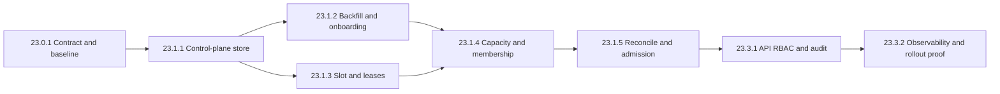

# TP-00023 — Administração de política de pool por tenant

## References

[ADR-0000 — Governança documental](../../../harness/governance/decisions/ADR-0000-governanca-do-harness-documental.md) ·
[ADR-0009 — RBAC](../../backend/docs/adrs/ADR-0009-dynamic-rbac-evolution.md) ·
[ADR-0012 — Erros e observabilidade](../../backend/docs/adrs/ADR-0012-error-handling-observability.md) ·
[ADR-0019 — Database per tenant](../../backend/docs/adrs/ADR-0019-database-per-tenant.md) ·
[ADR-0052 — Pools por tenant](../../backend/docs/adrs/ADR-0052-parametros-pool-conexao-por-tenant.md) ·
[REQ-00003 — Matriz de perfis](../../product/requirements/REQ-00003-rbac-profile-responsibility-matrix.md) ·
[REQ-00004 — Mapeamento de segurança](../../product/requirements/REQ-00004-rbac-security-mapping.md) ·
[REQ-00030 — Isolamento multitenancy](../../product/requirements/REQ-00030-multitenancy-isolation-verification.md) ·
[REQ-00031 — Lifecycle Tenant](../../product/requirements/REQ-00031-phase2-tenant-lifecycle-and-access.md) ·
[REQ-00046 — Starvation do pool](../../product/requirements/REQ-00046-chatbot-tenant-pool-starvation-resilience.md) ·
[REQ-00047 — Administração do pool](../../product/requirements/REQ-00047-super-admin-tenant-pool-policy-administration.md) ·
[REQ-00048 — Cache da política de pool](../../product/requirements/REQ-00048-tenant-pool-policy-cache-isolation-resilience.md) ·
[ANL-00048 — Aderência AS-IS](../../analysis/ANL-00048-req-00047-tenant-pool-policy-adherence.md) ·
[UC-00046 — Fluxo administrativo assíncrono](../../product/use-cases/UC-00046-super-admin-tenant-pool-policy-management.md) ·
[Module Registry](../../architecture/module-registry.md) ·
[Software Engineering Lifecycle](../../agents/standards/software-engineering-lifecycle.md) ·
[Backend Testing Standard](../agents/standards/backend-testing-standard.md) ·
[Security Standard](../../agents/standards/security-standard.md).

---

# 1. Overview

Este plano coordena oito Implementation Plans backend persistidos para materializar,
em fatias reversíveis, a política versionada por tenant, o lifecycle lease-aware,
o orçamento de conexões, o reconciliador multi-instância, a API exclusiva de
`ROLE_SUPER_ADMIN` e a prova local de rollout. O sequenciamento é governado por
gates, não por estimativa de sprint.

Em 2026-08-27 o solicitante humano autorizou explicitamente o **planejamento e a
implementação backend local** deste recorte, incluindo código, migrations
aditivas, configuração default-off, testes herméticos/Testcontainers e
documentação correspondente. ADR-0052, RF REQ-00047, NFR REQ-00048 e as matrizes REQ-00003 e REQ-00004
foram aprovados separadamente pelos respectivos owners sob o mesmo envelope
local; o status deste TP não os promove por inferência. Instrução humana posterior
autorizou o frontend local sob o TP-00024; este TP permanece backend-only e não
governa sua implementação. A autorização não aprova valores de capacidade nem
mudança em `infra/`, download, sistema
externo, deploy, HML, PRD, produção ou dados reais.

O estado `Completed` encerra o envelope repository-local com os oito IPs
implementados, observabilidade, cache e E2E concluídos. A auditoria final corrigiu
o `AC-032` com teto 8, valor derivado e V69. O teste PostgreSQL específico
foi executado em shell root com `2/2 PASS`, zero falhas, erros ou skips, em
2026-08-28.

## 1.1 Outcomes locais

Ao fim do recorte local, sem inferir readiness operacional:

1. cada tenant terá snapshot completo e objetos runtime exclusivos;
2. a autoridade persistente ficará no control plane e o registry será projeção;
3. o cache opcional da política será projeção tenant/revision-aware, nunca autoridade;
4. swaps preservarão aquisições e transações em voo por lease e drain;
5. toda ampliação ou redução será condicionada ao orçamento e à admissão;
6. somente `ROLE_SUPER_ADMIN` alcançará a API de plataforma;
7. auditoria e telemetria permanecerão sem segredo, PII ou label de identidade;
8. o baseline poderá ser provado em shadow antes de qualquer cutover;
9. gates externos ou de ambiente continuarão marcados `NOT PROVEN`.

## 1.2 Child Implementation Plans planejados

Os arquivos abaixo foram criados e indexados antes da primeira edição de código.
O estado de cada um governa seu início individual; os três primeiros recortes
e os slices de slot/lease e capacidade/membership estão concluídos. `23.1.5`
foi relido, reconciliado com o código entregue e promovido individualmente.

| Ordem | Implementation Plan planejado | Entrega principal | Estado inicial |
| ---: | --- | --- |:---:|
| 1 | `IP-BE-23.0.1-tenant-pool-policy-contract-and-baseline` | Contrato executável, caracterização AS-IS, bounds e gates congelados | ✅ Done |
| 2 | `IP-BE-23.1.1-tenant-pool-policy-control-plane-store` | Kernel tipado e store versionado dark no banco da plataforma | ✅ Done |
| 3 | `IP-BE-23.1.2-tenant-pool-policy-backfill-and-onboarding` | Baseline efetivo, backfill/shadow e onboarding ordenado | ✅ Done |
| 4 | `IP-BE-23.1.3-tenant-pool-registry-slot-and-leases` | Slot estável, geração e lease em paridade comportamental | ✅ Done |
| 5 | `IP-BE-23.1.4-tenant-pool-capacity-and-runtime-membership` | Allocator durável, fencing e contrato local de membership | ✅ Done |
| 6 | `IP-BE-23.1.5-tenant-pool-blue-green-reconcile-and-admission` | Reconcile blue/green e admission control tenant/revision-aware | ✅ Done — PostgreSQL V69 2/2 PASS |
| 7 | `IP-BE-23.3.1-tenant-pool-policy-super-admin-api-and-audit` | API de plataforma, RBAC, idempotência e audit por intent | ✅ Done |
| 8 | `IP-BE-23.3.2-tenant-pool-policy-observability-and-rollout` | Telemetria agregada, gates, ensaios e handoff de rollout | ✅ Done |

---

# 2. Execution Tracking Matrix

> **Legend:** ⬜ Pending · 🔄 In Progress · ✅ Done · ⏸️ Blocked · ❌ Cancelled

| # | Activity | Responsible agent | Status | Dependency / note |
| --- | --- | --- |:---:| --- |
| 23.0.1 | Criar e executar o IP de contrato e baseline | `@CleanArchitecture` | ✅ | PostgreSQL 7/7 e gate de isolamento 29/29 aprovados |
| 23.1.1 | Criar e executar o IP do control-plane store dark | `@ImplementerCore` | ✅ | V64 store/cache e V67 terminal-audit substrate concluídos |
| 23.1.2 | Criar e executar o IP de backfill/onboarding | `@AdapterDev` | ✅ | Backfill/shadow e onboarding ordenado concluídos com gates locais |
| 23.1.3 | Criar e executar o IP de slot/leases | `@ImplementerCore` | ✅ | Slot estável, lease exata e drain sem force-close concluídos |
| 23.1.4 | Criar e executar o IP de capacidade/membership | `@AdapterDev` | ✅ | V65, serialização, fencing e release conservador provados em PostgreSQL |
| 23.1.5 | Criar e executar o IP de reconcile/admission | `@ImplementerCore` | ✅ | AC-032/V69 implementados; teste PostgreSQL 2/2 PASS em shell root |
| 23.3.1 | Criar e executar o IP de API/RBAC/audit | `@SecurityAgent` | ✅ | API platform-only e audit V67 concluídos; mutações continuam off |
| 23.3.2 | Criar e executar o IP de observabilidade/rollout local | `@ObservabilityDev` | ✅ | Telemetria/cache/failure matrix/runbook/E2E concluídos; flags OFF |

## Summary

| Wave | Total | Pending | In Progress | Done | Progress |
| --- | ---: | ---: | ---: | ---: | ---: |
| **23.0 — Contrato e baseline** | 1 | 0 | 0 | 1 | 100% |
| **23.1 — Fundação e lifecycle** | 5 | 0 | 0 | 5 | 100% |
| **23.3 — Administração e assurance** | 2 | 0 | 0 | 2 | 100% |
| **TOTAL** | **8** | **0** | **0** | **8** | **100%** |

---

# 3. Context and Constraints

## 3.1 Authority and lifecycle gates

| Fonte/gate | Estado reconciliado em 2026-08-28 | Efeito |
| --- | --- | --- |
| Autorização humana deste TP | `HUMAN_EXPLICIT — repository local`; TP `Completed v3.4` | Os oito checkpoints foram concluídos; a V69 root-only foi aceita como exceção não executada |
| ADR-0052 | `Accepted v1.7 — backend/frontend local` | Congela bounds/seeds, rollback, admission, topologia e retenção sem autorizar ambiente ou cutover |
| REQ-00047 | `Implemented v1.7 — repository local` | AC-032 entregue; AC-020 confirmado por PostgreSQL V69 2/2 PASS |
| REQ-00048 | `Implemented v1.3 — repository local` | Redis sem L1, chave/TTL/eviction/rebuild/breaker concluídos; habilitação não local não é inferida |
| REQ-00003/REQ-00004 | `Approved v2.8/v1.9` com capability registrada | Congelam `ROLE_SUPER_ADMIN`, namespace e default deny |
| Análise de aderência / UC assíncrono | ANL-00048 `Current v1.7`; UC-00046 `Implemented v1.6` | Entrega local fechada com 33/33 ACs satisfeitos; flags permanecem default-off |
| REQ-00030 e REQ-00046 | `Approved` | Preservam isolamento A/B e piso atual de capacidade/admission |
| Frontend local | Governado pelo TP-00024 | Não altera a ordem nem satisfaz predecessores deste TP |
| Infraestrutura externa | Fora do envelope | Exige plano e autorização separados |

`23.0.1` verificou as versões aprovadas sem reabri-las ou promover qualquer outro
gate por inferência. A implementação dark materializou os seams locais; escrita
administrativa, autoridade dinâmica da nova policy, candidate apply e cutover
permanecem desabilitados fora do ambiente de teste local.

## 3.2 Roles

| Role | Direito neste plano |
| --- | --- |
| `ROLE_SUPER_ADMIN` | Única autoridade humana planejada para GET, PUT e rollback |
| `ROLE_TENANT_ADMIN` | Negado |
| `ROLE_TENANT_AUDIT` | Negado |
| Demais identidades ou request anônimo | Negado |
| Reconciliador interno | Capability técnica fenced; não reutiliza token/impersonação do usuário |

## 3.3 Module and data boundaries

- `contexts.tenant` possui policy, head, intent, audit e persistência de control
  plane pelo `platformTransactionManager`;
- `contexts.tenant` também possui a porta de cache opcional da policy; a fonte
  durável continua autoritativa e eviction/rebuild permanecem tenant-scoped;
- `config.persistence.routing` possui tradução Hikari, slot, candidate, swap,
  drain e reconcile;
- `shared.tenancy` expõe somente contrato técnico estreito, sem
  `HikariConfig`/`HikariDataSource` bruto;
- admission controllers consomem projeção tenant/revision-aware sem introduzir
  dependência cíclica;
- operação de plataforma não usa `TenantRoutingDataSource`; workload tenant sem
  contexto ou LKG válido falha fechado somente depois do gate de cutover;
- policy, config, pool, slot, geração, intent e rollback pertencem a exatamente
  um `tenantId`, ainda que valores numéricos sejam iguais.

## 3.4 Default-off contract

Os IPs deverão separar switches conceituais para: aceitar mutações, tornar policy
persistida autoritativa, preparar candidatos, habilitar o cache derivado e
habilitar o cutover fail-closed.
Todos nascem `OFF`. Paridade lease-aware de `23.1.3` pode ser exercitada com o
baseline global vigente, mas não autoriza swap administrativo. Um kill switch
interrompe novas intenções/prepares sem abandonar reconcile já committed ou drain
em andamento.

O cache segue uma configuração operacional global, não editável pelo Super Admin:

```properties
app.tenant-pool-policy.cache-enabled=false
app.tenant-pool-policy.cache.provider=REDIS
app.tenant-pool-policy.cache.ttl=PT5M
app.tenant-pool-policy.cache.ttl-jitter-percent=10
app.tenant-pool-policy.cache.operation-timeout=PT0.2S
app.tenant-pool-policy.cache.rebuild-wait-timeout=PT2S
app.tenant-pool-policy.cache.maximum-entry-bytes=8192
```

O porte altera somente o snapshot Hikari. Cada tenant ocupa no máximo uma entrada
committed; habilitação não local ainda exige medir overhead e provar consumo de
até 25% do budget Redis aprovado.

---

# 4. Phase Details

## Wave 23.0 — Contrato executável e baseline

### `23.0.1` — Contract and baseline

**Deliverables:** caracterização dos consumidores diretos de `DataSource`,
fallback, onboarding, Hikari efetivo, precedentes de cache e admission control; contratos de policy,
binding, runtime e estados; matriz de feature flags; estratégia de auditoria e
rollback; lista reproduzível de gates.

**Acceptance criteria:**

- ADR/requisito/RBAC/análise/UC possuem status verificável ou blocker explícito;
- RF REQ-00047 e NFR REQ-00048 possuem fronteiras e critérios sem governança geral de cache;
- bounds Hikari incluem semântica de zero, relações e versão da biblioteca;
- membership, fencing, budget por cluster e prova de terminação têm contrato sem
  alegar integração externa;
- intent mutável e audit append-only têm exatamente uma semântica canônica;
- política de concorrência/admission e piso abaixo de `6` estão decididos;
- janela e contabilização `old + new` do rollback estão congeladas;
- o IP correspondente está criado, indexado e aprovado antes de qualquer código.

## Wave 23.1 — Fundação e lifecycle

### `23.1.1` — Control-plane store dark

**Depends on:** `23.0.1`.

Cria migrations aditivas, snapshots imutáveis, head/CAS, intent/idempotência,
canonicalização/hash, porta de cache opcional tenant/revision-aware e contrato
público estreito Tenant → Config. Não muda o pool efetivo, não expõe mutação e
não torna cache autoritativo.

### `23.1.2` — Backfill and onboarding

**Depends on:** `23.1.1`; pode executar em paralelo com `23.1.3`.

Materializa getters efetivos do ambiente em rotina limitada e reiniciável,
executa shadow/readiness e ordena metadata/revisão antes da publicação no
onboarding. SQL não deduz override ambiental e nenhuma ausência vira
fail-closed nesta etapa.

### `23.1.3` — Registry slot and leases

**Depends on:** `23.1.1`; pode executar em paralelo com `23.1.2`.

Introduz slot estável e geração lease-aware sob a configuração efetiva atual,
migra consumidores que hoje recebem `DataSource` bruto e prova aquisição/swap
sob o mesmo protocolo. Não habilita candidate apply administrativo.

### `23.1.4` — Capacity and runtime membership

**Depends on:** `23.1.2` e `23.1.3`.

Cria allocator transacional por cluster, reserva fenced, aplicações por runtime,
preflight de `replicasMax` e ports para identidade/terminação. Somente adapters
sintéticos/locais e PostgreSQL Testcontainers estão autorizados; integração com
orquestrador ou infraestrutura real permanece fora do escopo e bloqueia apply.

### `23.1.5` — Blue/green reconcile and admission

**Depends on:** `23.1.4`.

Implementa prepare/probe sem Flyway, READY, commit CAS, SWAPPED, drain, DRAINED,
polling/fencing e limiter tenant/revision-aware. Redução aplica gate menor antes
do commit; aumento só amplia o gate depois do pool maior. O primeiro ensaio é
revisão no-op em tenant sintético; nenhuma flag é promovida.

## Wave 23.3 — Administração, assurance e handoff

### `23.3.1` — Super Admin API and audit

**Depends on:** `23.1.5`.

Implementa API de plataforma, matcher explícito e `@PreAuthorize`, rejeição de
contexto/header conflitante, `If-Match`, idempotência, reason, Problem Details e
audit único por intent. O request usa apenas o persistence unit de plataforma e
as mutações permanecem default-off.

### `23.3.2` — Observability and local rollout proof

**Depends on:** `23.3.1`.

Implementa métricas agregadas, remoção de séries aposentadas, diagnóstico
protegido, testes de falha/crash/drain/rollback e documentação de handoff. Prova
somente rollout local dark/shadow/no-op; dashboards externos, alertas implantados,
canary de ambiente, deploy e produção continuam `NOT PROVEN`.

---

# 5. Dependency Diagram



Sequência normativa:

```text
23.0.1 -> 23.1.1 -> {23.1.2, 23.1.3} -> 23.1.4 -> 23.1.5 -> 23.3.1 -> 23.3.2
```

---

# 6. Responsibility Matrix

| Agent/owner | Responsibility |
| --- | --- |
| `@AgentOrchestrator` | Sequência, status, handoffs e preservação do envelope autorizado |
| `@CleanArchitecture` | Contratos, ownership, dependências Modulith e linearização |
| `@ImplementerCore` | Modelo, slot/lease, reconcile e admission control |
| `@AdapterDev` | Migrations, persistência, Hikari factory, capacity allocator e REST |
| `@SecurityOAuth` / `@SecurityAgent` | Issuer/RBAC, contexto técnico, audit, redaction e abuse controls |
| `@TestAutomator` | Concorrência determinística, PostgreSQL, A/B e multi-instância sintética |
| `@CodeGuardian` | Revisão de corretude, compatibilidade, lifecycle e manutenção |
| `@ObservabilityDev` | Métricas finitas, diagnóstico protegido e gates de telemetria local |
| Owners humanos de Produto/Arquitetura/DBA-SRE | Aprovar fontes, bounds, capacidade, rollback e qualquer expansão operacional |

---

# 7. Coordination Rules

1. **IP antes de código:** cada `IP-BE-23.*` deve ser criado via template,
   indexado no README backend e colocado explicitamente `In Progress` sob o
   envelope aprovado antes de sua implementação.
2. **Sequência:** somente `23.1.2` e `23.1.3` podem executar em paralelo; nenhuma
   etapa consome evidência apenas planejada do predecessor.
3. **Dark by default:** store, shadow e status não tornam policy autoritativa;
   mutação, candidate apply e cutover permanecem desligados.
4. **No aliasing:** testes devem provar identidades distintas de snapshot,
   Hikari config, pool, slot e geração entre A e B.
5. **Capacidade:** toda revisão, inclusive redução/no-op/timeout, usa allocator
   autoritativo; heartbeat isolado nunca libera reserva.
6. **Admission:** valor abaixo do piso atual `6` é bloqueado até o limiter
   tenant/revision-aware e o inventário de `C + R + O` passarem.
7. **Auditoria:** o mecanismo genérico best-effort não satisfaz sozinho o audit
   canônico do intent; falha de audit obrigatória deve falhar fechado.
8. **Rollback:** rollback cria nova revisão e reserva `old + new` durante janela
   aprovada; migrations são forward-only e não apagam histórico.
9. **Observabilidade:** tenant, UUID, slug, database, revision e pool name não são
   labels; detalhe por tenant fica em canal administrativo protegido.
10. **Escopo:** nenhuma etapa modifica frontend ou `infra/`, chama sistema externo,
    executa deploy ou acessa HML/PRD/produção/dados reais.

---

# 8. Pending Technical Gates

| Gate | Evidência exigida antes da habilitação correspondente |
| --- | --- |
| Bounds Hikari | Valores por ambiente aprovados, versão/BOM registrada, relações e getters efetivos reproduzíveis |
| Membership/capacidade | `clusterId`, `replicasMax`, deployment/runtime identity, budget/reservas e prova confiável de terminação/sessões |
| Auditoria/intents | Estado operacional separado de audit, unicidade por `intent_id`, persistência atômica e retenção/legal hold aprovados |
| Concorrência/admission | Limiter tenant/revision-aware, inventário `C + R + O`, ordem segura de aumento/redução e testes de starvation |
| Rollback | Janela aprovada, transferência atômica da reserva `old + new`, failure injection e preservação do LKG |
| Cache da policy | Política de configuração fechada no REQ-00048 v1.2; antes de habilitar faltam adapter/provas A/B locais e, fora do local, overhead medido dentro de 25% do budget Redis aprovado |
| Segurança | Versões aprovadas de ADR/REQ/RBAC congeladas; matcher + método, issuer admin, conflito de contexto e payload/redaction testados |
| Cutover | Backfill 100%, shadow sem drift, no-op multi-instância, zero skip obrigatório e sign-off humano separado |

Nenhum seed `SMALL`, `STANDARD` ou `ROBUST` é capacidade de produção. Ausência de
budget/membership real mantém apply e scale-out readiness operacionalmente
ineligíveis, ainda que o adapter local e seus testes estejam completos.

---

# 9. Verification

## 9.1 Documentation gate desta criação

```bash
./infra/scripts/validate-docs.sh
```

## 9.2 Gates futuros por child IP

```bash
cd backend
./mvnw -B -Dtest=TenantDatabaseRegistryTest test
./mvnw -B -Ptenant-isolation-gate verify
./mvnw -B -Dtest=ModuleStructureVerificationTest test
./mvnw -B -Dtest=CleanArchitectureRulesTest,CleanArchitectureRuleContractTest test
./mvnw -B clean test
```

Cada IP adicionará seus seletores focais para policy/store, migrations, lease,
cache tenant-scoped, allocator, multi-instância, API/security, audit e métricas. Teste PostgreSQL
obrigatório indisponível será `NOT EXECUTED`, nunca `PASS`.

## 9.3 Manual review

- confirmar que todas as flags de efeito continuam `OFF`;
- provar que request administrativo não abre datasource tenant;
- revisar que nenhuma resposta/log/audit/métrica contém segredo ou identidade
  proibida;
- conferir que alteração/falha de A não muda policy, pool, conexão ou
  disponibilidade de B;
- conferir que put/get/evict/rebuild/failure do cache de A não altera B e não usa clear/scan global;
- distinguir `repository complete` de `runtime/deploy/production ready` em todo
  handoff.

## 9.4 Implementation checkpoint — 2026-08-27

Somente a caracterização de baseline do
`IP-BE-23.0.1-tenant-pool-policy-contract-and-baseline` foi concluído:

- `TenantDatabaseRegistryTest`, `TenantRoutingDataSourceTest` e
  `DataSourceConfigTest`: `11/11 PASS`, sem failure, error ou skip;
- pools de A/B possuem identidades distintas e os contextos de A reutilizam
  somente o pool de A;
- replace/remove de A preservam identidade e disponibilidade de B, documentando
  o fechamento imediato AS-IS do pool anterior de A;
- fallback legado sem contexto e rejeição fail-closed de tenant desconhecido
  possuem cobertura focal hermética;
- snapshot efetivo congelado para HikariCP `7.0.2`: `minimumIdle=0`, máximo `6`,
  connection `30s`, validation `5s`, idle `30s`, lifetime `5min`, keepalive `2min`;
- gates `ModuleStructureVerificationTest`, `CleanArchitectureRulesTest` e
  `CleanArchitectureRuleContractTest`: `29/29 PASS`, sem failure, error ou skip,
  na execução atual;
- `TenantDatabaseRoutingIsolationIT`: `7/7 PASS` com PostgreSQL 16.14 efêmero;
- `./mvnw -B -Ptenant-isolation-gate verify`: `29/29 PASS`, distribuídos em
  Keycloak realm 7, HTTP context 8, Hibernate/PostgreSQL 7 e database routing 7;
- o Docker foi iniciado pelo usuário e a associação ao grupo foi atualizada
  somente no subprocesso de teste via `sg docker`, sem bypass do socket;
- `./mvnw -B clean test`: `FAIL` com 2.212 testes, 4 failures, 4 errors e 102
  skipped na execução anterior ao Docker; os errors eram Testcontainers sem
  Docker e as failures ficam em Omnichannel/Security, fora dos arquivos
  alterados neste slice; a suíte completa ainda não foi reexecutada;
- produção, propriedades, flags, UI, infraestrutura e ambientes permaneceram
  inalterados.

Este checkpoint conclui `23.0.1` e libera `23.1.1`, que foi promovido a
`In Progress` antes da edição do store. UC-00046 e OQ-POOL-002–005 estão
resolvidos. Adapter externo, promoção de flags e produção permanecem gates
posteriores fora do envelope.

## 9.5 Implementation checkpoint — control-plane store — 2026-08-28

O `IP-BE-23.1.1-tenant-pool-policy-control-plane-store` foi concluído como store
**dark**:

- migration `V64` forward-only cria revision/head/intent com chaves e FKs
  compostas tenant-scoped, bounds, CAS e idempotency hash;
- domínio, canonicalização, serviço transacional e catálogo público estreito
  foram materializados no contexto Tenant;
- cache Redis derivado usa chave exata tenant/binding/revision, `UNLINK` exato,
  TTL com jitter, payload limitado, timeout, breaker, single-flight e limiter;
- adapter no-op e os cinco switches `false` preservam o runtime atual;
- testes focais de domínio/store/config: `11/11 PASS`; cache final: `7/7 PASS`;
- PostgreSQL de migration/store: `2/2 PASS`; store + registry: `6/6 PASS`;
- Flyway multibanco/slug: `4/4 PASS`; arquitetura combinada: zero
  failure/error em 49 testes, com um skip standalone preexistente.

Nenhum controller, scheduler, pool, router, UI, `infra/`, deploy ou ambiente
externo foi habilitado. `23.1.2` e `23.1.3` ficam liberados para promoção
documental individual antes de suas respectivas edições.

## 9.6 Implementation checkpoint — backfill and onboarding — 2026-08-28

O `IP-BE-23.1.2-tenant-pool-policy-backfill-and-onboarding` foi concluído:

- parâmetros Hikari efetivos são capturados em cópia neutra, imutável e
  tenant-bound, com hash canônico e factory única;
- backfill inclui tenants ativos/inativos, é reiniciável, não sobrescreve drift
  e isola falha de captura ou store por tenant;
- shadow compara os sete campos e hash sem alterar routing;
- onboarding opcional persiste metadata/revision/head antes de build, Flyway e
  publicação, com compensação guardada; o caminho legado continua default;
- todos os três switches permanecem literalmente `false` por padrão e os runners
  foram provados ausentes no contexto default;
- PostgreSQL/Testcontainers focais, routing `7/7` e isolation gate `29/29`
  passaram;
- a suíte completa registrou `1.866` testes, com `6` failures, `2` errors e `5`
  skips exclusivamente fora deste recorte (Omnichannel/Testcontainers). O gate
  global permanece vermelho e explicitamente não foi mascarado.

O recorte não habilita leitura autoritativa, mutações administrativas, candidate
apply, fail-closed, deploy ou ambiente externo. `23.1.3` fica liberado somente
para promoção documental antes de sua implementação.

## 9.7 Implementation checkpoint — registry slot and leases — 2026-08-28

O `IP-BE-23.1.3-tenant-pool-registry-slot-and-leases` foi concluído:

- o registry publica um `TenantPoolSlot` estável por tenant e encapsula cada
  Hikari em `TenantPoolGeneration` exclusiva;
- lease é criada sob a mesma trava antes do I/O JDBC e liberada uma vez em
  close/abort/falha, inclusive por facades de Statement/ResultSet/metadata;
- duplicate registration não substitui active; remoção revoga novas aquisições e
  drena as existentes sem timeout force-close;
- candidate/swap package-private foi provado por corrida determinística, mas não
  possui scheduler nem ligação à policy;
- focais finais `13/13`, PostgreSQL routing/onboarding `8/8`, arquitetura `29/29`
  e isolation gate `29/29 PASS`.

Nenhum Hikari é exposto por port/unwrap e nenhuma flag dinâmica foi promovida.
`23.1.4` está liberado apenas para promoção documental individual.

## 9.8 Implementation checkpoint — capacity and membership — 2026-08-28

O `IP-BE-23.1.4-tenant-pool-capacity-and-runtime-membership` foi concluído:

- a migration V65 cria ledger de capacidade, reservas, membership e aplicações
  de runtime com constraints, CAS e fencing monotônico;
- a fórmula exata serializada por cluster contabiliza permanente e old+new em
  todas as réplicas, rejeitando overflow e overcommit;
- heartbeat expirado apenas quarentena e nunca libera capacidade; release exige
  acks `DRAINED` suficientes;
- dois allocators concorrentes no PostgreSQL admitiram exatamente um intent
  quando apenas um cabia no orçamento;
- focais `8/8`, PostgreSQL multi-instância `1/1` e arquitetura `29/29 PASS`.

Flags autoritativas e integração externa continuam `OFF`. O checkpoint liberou
`23.1.5` somente para promoção documental individual, realizada em seguida.

## 9.9 Promotion checkpoint — blue-green reconcile — 2026-08-28

O `IP-BE-23.1.5-tenant-pool-blue-green-reconcile-and-admission` foi relido e
promovido após os gates do predecessor. O inventário confirmou o slot/candidate
package-private, a factory Hikari única, o catálogo público de policy e V65 como
head; a extensão de acknowledgements foi alocada como V66. Todos os switches
continuam `false` durante a implementação e os planos `23.3.*` permanecem
pendentes.

## 9.10 Implementation checkpoint — blue-green reconcile — 2026-08-28

O `IP-BE-23.1.5-tenant-pool-blue-green-reconcile-and-admission` foi concluído:

- V66 completa a tupla imutável de acknowledgement com intent, hash e binding;
- candidate/probe não executa Flyway, commit global é CAS e o slot troca active
  sob a mesma trava usada por aquisição;
- fencing local sem I/O bloqueia novas conexões antes de criar lease; conexões
  existentes continuam até drain natural;
- o gate estável de workload é tenant/revision-aware, aplica redução antes do
  swap e aumento somente depois do novo pool ativo;
- focais lifecycle/hot-path passaram, PostgreSQL multi-instância `3/3`, routing
  real `8/8`, arquitetura `29/29` e contexto Spring `1/1`;
- todos os efeitos continuam `OFF` e nenhum adapter externo/deploy foi usado.

O checkpoint libera `23.3.1` apenas para reconciliação e promoção documental
individual, sem ligar a API ou qualquer efeito runtime.

## 9.11 Corrective store checkpoint — terminal audit substrate — 2026-08-28

A reconciliação integral de `23.3.1` confirmou que V64 garante idempotência do
intent, mas não possui a unicidade/FK exigida para o audit terminal. O próprio IP
downstream determina retorno ao predecessor nesse caso. Por isso `23.1.1` foi
reaberto, o próximo número livre V67 foi alocado e `23.3.1` permanece `Pending`.

A correção é estritamente aditiva e local: ledger terminal tenant/intent-bound,
FK deferred ao `audit_log`, append-only e teste PostgreSQL. Controller,
terminalizer, RBAC e flags continuam fora deste checkpoint.

V67 foi então aplicada no histórico completo de 68 migrations e o teste
PostgreSQL passou `2/2`, incluindo os casos negativos. `23.1.1` voltou a `Done`;
`23.3.1` foi relido integralmente, reconciliado com os símbolos finais e
promovido individualmente a `In Progress` antes do código da API.

## 9.12 Implementation checkpoint — Super Admin API and terminal audit — 2026-08-28

O `IP-BE-23.3.1-tenant-pool-policy-super-admin-api-and-audit` foi concluído:

- as três rotas platform-only possuem matcher e method security para
  `ROLE_SUPER_ADMIN`, rejeitam `X-Tenant-ID`/contexto tenant e nunca abrem o
  datasource dedicado;
- ETag, idempotência, strict JSON, rate limit, Problem Details e terminalização
  auditável por intent foram materializados sobre o store e V67;
- focais aplicação/HTTP/security `75/75`, PostgreSQL `4/4`, contexto Spring
  `1/1`, Modulith `6/6`, Clean Architecture `26/26` e isolamento `30/30`
  passaram;
- a suíte completa executou `2304` testes e permaneceu vermelha por `7` falhas e
  `1` erro exclusivamente em módulos fora deste recorte; nenhuma ocorrência de
  tenant pool foi ocultada ou flexibilizada;
- todas as flags de API, mutação, autoridade, apply e cutover continuam `false`.

O checkpoint libera `23.3.2` somente para leitura integral e promoção documental
individual. Observabilidade externa, canary, deploy e produção seguem fora do
escopo e `NOT PROVEN`.

## 9.13 Promotion checkpoint — observability and local rollout — 2026-08-28

O `IP-BE-23.3.2-tenant-pool-policy-observability-and-rollout` foi relido em suas
581 linhas após o fechamento documental de `23.3.1`. A reconciliação confirmou
os seams reais de slot/generation/reconciler em Config, store/cache/API em Tenant
e flags default-off em `application.yml`; não há necessidade de novo ADR,
requisito, caso de uso ou plano.

O IP foi promovido individualmente a `In Progress` antes do código. A promoção
abrange somente telemetria finita, failure injection, runbook e ensaios locais
D0–D5; não liga flags nem autoriza infraestrutura externa, deploy ou produção.

## 9.14 Assurance final e corretivo AC-032 — 2026-08-28

O `23.3.2` foi concluído com `57/57` focais, `4/4` Redis/PostgreSQL, gates de
segurança/isolamento/arquitetura, runbook e E2E backend-real `1/1`. A suíte backend
global foi executada e permaneceu vermelha por `7` failures e `2` errors fora da
capability; esses resultados não foram ocultados nem convertidos em sucesso.

A reconciliação final encontrou que `23.1.5` calculava a admissão sem o teto 8 e
não persistia o valor derivado exigido pelo `AC-032`. O corretivo adicionou V69,
coluna gerada e teto no reconciliador. Focais e arquitetura passaram `39/39`; o
teste PostgreSQL foi executado em shell root; o log fornecido pelo owner confirma
`2/2 PASS`, zero falhas, erros ou skips e `BUILD SUCCESS`.

---

# 10. Risks and Rollback

| Risk | Mitigation |
| --- | --- |
| Fonte aprovada ou artefato de aderência sofrer drift | `23.0.1` congela versões e bloqueia etapas afetadas até nova reconciliação |
| Pool maior exaurir PostgreSQL | Budget serializado por cluster/réplica, headroom e rejeição sem clamp |
| Pool antigo interromper transação | Slot estável, lease anterior ao `getConnection`, drain e teste de corrida |
| Runtime zumbi servir revisão stale | Fencing em readiness e aquisição; sem prova de terminação, reserva não é liberada |
| Audit duplicar ou desaparecer | Intent idempotente, ID determinístico e persistência obrigatória |
| Redução superar admission control | Sequência gate-before-decrease e piso `6` até prova contrária |
| Cutover revelar fallback oculto | Backfill, shadow, coorte/no-op e remoção somente no último gate |
| Kill switch deixar rollout parcial | Bloquear apenas novas intenções/prepares; continuar committed reconcile/drain |
| Cache de A invalidar B ou stale autorizar capacidade | REQ-00048, envelope tenant/revision/binding-aware, store autoritativo e testes negativos A/B |

Rollback da entrega é forward-only: desligar aceitação/preparo de novas revisões,
preservar store/audit e servir a última geração committed segura do mesmo tenant.
Não há down migration destrutiva; correções de schema ou policy usam migration ou
revisão nova. Nenhum rollback local autoriza operação externa.

---

# 11. Completion and Handoff

Este TP está `Completed` no recorte **repository local**: os oito IPs existem,
estão indexados e seus deliverables foram implementados; documentação, focais e
gates aplicáveis estão válidos. O skip root-only da V69 foi explicitamente
classificado e aceito pelo owner, sem conversão em sucesso. Isso não declara
deploy, capacity proof de ambiente, canary ou produção.

Cada IP concluído deve atualizar esta matriz com evidência reproduzível, arquivos,
comandos/resultados, skips, riscos residuais e handoff. Mudança inesperada de
fronteira, API pública ou dependência exige atualização do module registry e dos
gates estruturais na mesma alteração.

---

# 12. Change Log

| Version | Date | Author | Changes |
| --- | --- | --- | --- |
| 3.5 | 2026-08-28 | Owner humano / Codex | Registra a execução root do PostgreSQL V69 com 2/2 PASS, zero falhas/erros/skips, encerrando a exceção anterior. |
| 3.4 | 2026-08-28 | Owner humano / Codex | Conclui 8/8 IPs por aceite explícito da limitação root-only da V69; preserva 2/2 SKIPPED como NOT EXECUTED, não PASS, e mantém efeitos externos OFF/NOT PROVEN. |
| 3.3 | 2026-08-28 | Codex | Conclui 23.3.2 e E2E local; reabre somente 23.1.5 para o corretivo AC-032 já implementado, mantendo pendente a prova PostgreSQL sem skip da V69. |
| 3.2 | 2026-08-28 | Codex | Promove 23.3.2 após leitura integral e reconciliação dos símbolos entregues por todos os sete predecessores, mantendo efeitos e integrações externas fora do escopo. |
| 3.1 | 2026-08-28 | Codex | Conclui 23.3.1 com API Super Admin platform-only, RBAC, idempotência, rate limit e audit terminal V67; registra gates impactados verdes e baseline global vermelho fora do recorte. |
| 3.0 | 2026-08-28 | Codex | Conclui a correção V67 de 23.1.1 em PostgreSQL 2/2 e promove 23.3.1 após reconciliação integral dos contratos finais. |
| 2.9 | 2026-08-28 | Codex | Reabre 23.1.1 de forma corretiva e aloca V67 para fechar o substrato relacional de audit terminal exigido antes da API 23.3.1. |
| 2.8 | 2026-08-28 | Codex | Conclui 23.1.5 com V66, reconcile blue-green, fencing no hot path, admission revision-aware e gates PostgreSQL/arquitetura/contexto. |
| 2.7 | 2026-08-28 | Codex | Promove 23.1.5 após concluir 23.1.4, reconcilia os artefatos reais e aloca V66 antes do código. |
| 2.6 | 2026-08-28 | Codex | Conclui 23.1.4 com V65, capacidade serializada, membership/fencing, release conservador e gates PostgreSQL/arquitetura; mantém 23.1.5 Pending. |
| 2.5 | 2026-08-28 | Codex | Promove 23.1.4 após concluir slot/lease, reconcilia packages do control plane e aloca a migration V65 antes do código. |
| 2.4 | 2026-08-28 | Codex | Conclui 23.1.3 com slot estável, leases, drain e gates PostgreSQL/arquitetura/isolamento; mantém 23.1.4 Pending até promoção própria. |
| 2.3 | 2026-08-28 | Codex | Promove 23.1.3 após concluir 23.1.2 e reconcilia o plano para reutilizar a factory Hikari única e o snapshot tenant-bound já existentes. |
| 2.2 | 2026-08-28 | Codex | Conclui 23.1.2 com backfill/shadow, onboarding ordenado e gates locais; registra a suíte global vermelha fora do recorte e mantém sucessores Pending. |
| 2.1 | 2026-08-28 | Codex | Promove somente 23.1.2 a In Progress após leitura integral do IP e fechamento do predecessor; 23.1.3 permanece Pending. |
| 2.0 | 2026-08-28 | Codex | Conclui 23.1.1 com V64, store dark, cache tenant-scoped e gates PostgreSQL/Flyway/arquitetura; libera 23.1.2 e 23.1.3 sem promover flags. |
| 1.9 | 2026-08-28 | Codex | Registra PostgreSQL 7/7 e `tenant-isolation-gate` 29/29, conclui 23.0.1 e promove somente 23.1.1 a In Progress. |
| 1.8 | 2026-08-28 | Codex | Revalida o gate Docker/PostgreSQL, identifica serviço Snap parado/socket stale e não usa credencial ou bypass; frontend local avança, mas 23.0.1 e sucessores permanecem bloqueados. |
| 1.7 | 2026-08-27 | Owner humano / Codex | Registra UC-00046 aprovado e fechamento das decisões normativas locais; preserva o gate PostgreSQL imediato e todos os efeitos externos/default-off. |
| 1.6 | 2026-08-27 | Owner humano / Codex | Reconcilia a autorização frontend posterior e aponta TP-00024 como plano separado, sem liberar nenhum predecessor ou efeito do runtime backend. |
| 1.5 | 2026-08-27 | Codex | Registra a caracterização ampliada 11/11, gates arquiteturais 29/29, bloqueio Docker/PostgreSQL e suíte completa vermelha; mantém 23.0.1 parcial e os sete sucessores bloqueados pela governança. |
| 1.4 | 2026-08-27 | Codex, sob delegação humana explícita para decidir | Congela a configuração do cache Redis default-off e remove TTL/provider/single-flight da lista de decisões abertas; implementação/provas e budget de memória não local permanecem gates. |
| 1.3 | 2026-08-27 | Owner humano / Codex | Incorpora o NFR REQ-00048 aos mesmos oito IPs: cache opcional da política fica tenant-scoped, default-off e não autoritativo, sem novo ADR ou parâmetro de cache por porte. |
| 1.2 | 2026-08-27 | Codex / @TestAutomator | Registra o primeiro checkpoint focal 3/3 e os gates arquiteturais 29/29; mantém 23.0.1 em andamento e todos os efeitos OFF. |
| 1.1 | 2026-08-27 | Codex / autorização humana explícita | Indexa os oito IPs e inicia somente o checkpoint de caracterização 23.0.1; demais slices e efeitos continuam Pending/OFF. |
| 1.0 | 2026-08-27 | Codex / autorização humana explícita | Cria o coordenador aprovado para oito IPs backend locais, todos ainda pendentes e default-off. |
