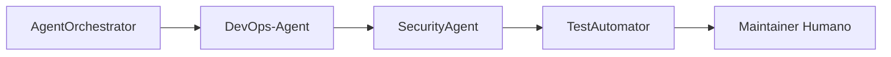
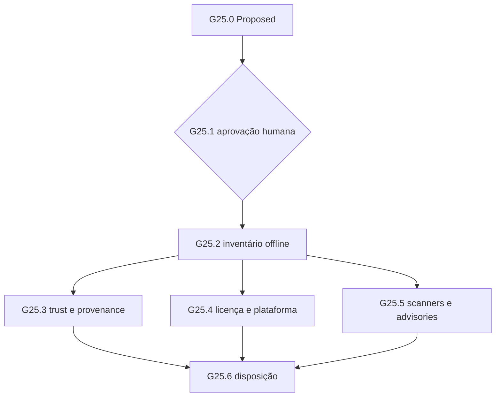

# TP-00025 — Elegibilidade do artefato OpenTofu 1.12.6

> [!IMPORTANT]
> O Maintainer Humano aprovou `G25.1` e `G25.2`; os quatro inputs originais foram
> correlacionados e o digest exato do ZIP foi revalidado. `G25.3-A` definiu a
> política de identidade e cinco lotes, e o intake inicial recebeu `0/5`. Depois,
> `G25.3-A-RESEARCH` consultou somente fontes oficiais OpenTofu/Sigstore e produziu
> a lista aprovada da seção 4.7. No gate `G25.3-A-ACQUIRE`, quinze arquivos do lote
> `OTF-TRUST-001` foram adquiridos e inventariados no diretório externo autorizado:
> a leitura textual observou root `15`, timestamp `767`, snapshot `165`, targets
> `14` e os seis targets coincidiram com os SHA-256 publicados. Isso ainda não
> verifica assinaturas TUF nem torna o lote confiável. Um desvio de sequenciamento
> foi identificado: o bloco literal não estava materializado antes desses comandos,
> como exige a regra 8.1. A execução foi pausada antes de Cosign e Rekor; a seção
> 4.9 foi posteriormente aprovada e executada: os seis assets Cosign retornaram
> primeiro hop HTTP `302` para `release-assets.githubusercontent.com`, sem seguir
> o redirect, e o Rekor retornou HTTP `200`, JSON de `85` bytes e SHA-256
> `46d5f48d28d84acd3128543789317e66646f37193aea561bb9f2d14d587414c5`.
> O parser da seção 4.10 foi depois aprovado e executado com exit `0`:
> `VALID_SINGLE`, um UUID lowercase de `80` hex, mesmo SHA-256 aprovado e ação
> `BLOCK_GET_PENDING_HUMAN_GATE`. Isso prova apenas estrutura, não inclusão ou
> assinatura. O Maintainer escolheu a opção A da seção 4.11 somente como desenho
> de compromisso exato e delegou Segurança até este handoff. O primeiro bloco
> aprovado de `G25.3-A-LOCATION-COMMIT` terminou em exit `2` por erro sintático
> local antes de qualquer HEAD: criou somente o subdiretório externo vazio
> `cosign-v3.1.3-locations-20260828T183211Z`, modo `0700`, e não criou arquivos,
> capturou Locations ou produziu compromissos. No retry autorizado, a revisão
> `v2` terminou exit `0`: os seis HEADs retornaram `302`, host, path, schema e
> janelas temporais passaram sem drift, e seis Locations foram preservadas
> externamente sob o capture ID `20260828T215907Z` e comprometidas por SHA-256.
> Nenhum redirect foi seguido e nenhum asset foi adquirido; a policy de URL com
> credencial mantém GET e elegibilidade bloqueados. Sob
> `G25.3-A-REDIRECT-POLICY-PROPOSAL`, Segurança e DevOps prepararam na seção 4.13
> somente uma proposta não normativa para o perfil estreito
> `EPHEMERAL_PUBLIC_ASSET_REDIRECT`. O standard `Active` não foi alterado, a rota
> de exceção operacional não se aplica e as Locations expiradas não ganharam
> validade retroativa. Em `G25.3-A-REDIRECT-POLICY-DECISION`, o Maintainer
> selecionou `AUTHORIZE_SEPARATE_STANDARD_DRAFT`; a seção 4.14 agora preserva o
> texto normativo exato, a matriz, o lifecycle e o checklist. Em
> `G25.3-A-REDIRECT-POLICY-ACTIVATION`, o Maintainer aprovou
> `APPROVE_DRAFT_TO_ACTIVE`; após controle de drift sem divergência, o bloco
> 4.14.1 foi incorporado literalmente à Section 4.1 do standard `Active` v1.3,
> sem intervalo de desativação. A ativação não aprovou origem, matriz concreta,
> Location anterior, captura, rede, GET, download, allowlist ou execução.
> `validate-docs` terminou exit `0`; o checklist de ativação está `11/11 PASS`.
> Em `G25.3-A-COSIGN-REDIRECT-MATRIX-DRAFT`, foi preparada somente a matriz
> candidata `EAR-MATRIX-COSIGN-001` da seção 4.15. Em
> `G25.3-A-COSIGN-REDIRECT-MATRIX-REVIEW`, o Maintainer Humano selecionou
> `ACKNOWLEDGE_BASELINE_WITH_PENDING`: reconheceu somente a baseline documental
> incompleta e seus gaps, sem aprovar campo, asset, origem, readiness, validade
> ou autoridade operacional. O estado naquele gate era `Reviewed with gaps /
> ACKNOWLEDGED_BASELINE_ONLY / INCOMPLETE / NOT_APPROVED / NO AUTHORITY`; a
> matriz mantém `0/6` assets aprovados, os compromissos históricos continuam
> expirados e nenhum efeito foi liberado.
> Em `G25.3-A-COSIGN-RELEASE-METADATA-RESEARCH`, consultas read-only somente a
> páginas e metadata oficiais Sigstore/Cosign correlacionaram a release/tag
> `v3.1.3` ao commit candidato
> `11926fa5bbbbde47e88fc006b625a17769b743b2`, confirmaram os seis nomes e digests,
> registraram tamanhos de exibição arredondados e identificaram o desenho oficial
> de build, checksum, bundles e SBOM. Nenhum asset, HEAD, redirect ou Location foi
> acessado. No review seguinte, o Maintainer selecionou
> `ADOPT_AS_DRAFT_2_WITH_PENDING` e incorporou somente o commit candidato completo,
> as fontes oficiais, a licença-fonte `Apache-2.0`, os papéis, os tamanhos
> arredondados e os timestamps documentados na seção 4.15.8. Essa adoção é
> exclusivamente documental: não aprova campo, asset, origem, readiness ou
> autoridade operacional. Bytes exatos, conteúdo, autenticação criptográfica,
> licença dos artefatos, notices, SBOM/provenance, tooling, owners e validade
> continuam `PENDING / NOT_PROVEN`; os estados `EAR-001`–`EAR-012`, `0/6
> APPROVED` e todos os bloqueios permanecem inalterados. O estado atual é
> `draft-2 / Reviewed with gaps / ADOPTED_WITH_PENDING / INCOMPLETE /
> NOT_APPROVED / NO AUTHORITY`.
> Em `G25.3-A-COSIGN-PRECAPTURE-EVIDENCE-PLAN`, Segurança e DevOps, sob
> delegação temporária, fecharam somente o checklist e a sequência documental da
> seção 4.15.10. Os seis lotes pre-Capture começam `PENDING / NOT_PROVEN`; nenhum
> dado novo, owner durável, reviewer, validade, evidência ou `PASS` foi criado.
> A delegação expira neste handoff. Como o gate proibiu todo comando,
> `validate-docs` e testes focais não foram executados e permanecem pendentes de
> autorização própria.
> Em `G25.3-A-COSIGN-PRECAPTURE-AUTHORITY-VALIDITY-INTAKE`, foi materializado
> `AUTHORITY-VALIDITY-LEDGER-001`: DevOps é owner/preparador proposto, Segurança
> é reviewer independente proposta e o Maintainer é autoridade final proposta.
> Rótulos não identificam principals duráveis; `collected_at`, `valid_from`,
> `valid_until`, TTL, renewal lead time e aceite continuam `PENDING / NOT_PROVEN`.
> A delegação atual cobre somente a preparação/revisão deste ledger e expira no
> handoff; não fecha `EAR-PC-06`, não cria autoridade operacional nem altera
> `0/6` lotes em `PASS` ou `0/6` assets aprovados.
> Em `G25.3-A-COSIGN-PRECAPTURE-AUTHORITY-VALIDITY-REVIEW`, o Maintainer
> selecionou `ADOPT_MODEL_AS_BASELINE_WITH_PENDING_IDENTITIES_AND_TERMS`.
> A segregação DevOps/Segurança/Maintainer e as regras temporais, de renovação e
> revogação agora são baseline documental. Principals estáveis, timestamps, TTL,
> `policy_ref`, renewal lead time e aceite operacional continuam `PENDING /
> NOT_PROVEN`; a decisão não fecha `EAR-PC-06`, não cria autoridade operacional e
> mantém `0/6` lotes em `PASS` e `0/6` assets aprovados.
> Em `G25.3-A-COSIGN-PRECAPTURE-OFFICIAL-METADATA-INTAKE`, somente a metadata
> sanitizada já existente nas seções 4.15.2, 4.15.3 e 4.15.8 foi transcrita para
> `OFFICIAL-METADATA-LEDGER-001`. Nenhum payload offline novo foi fornecido: há
> seis linhas materializadas, mas `0/6` completas, `0/6` autenticadas e `0/6`
> aprovadas. Bytes exatos, fonte autenticadora, licença/notices dos artefatos,
> SBOM/provenance comprovada e coleta original permanecem `PENDING / NOT_PROVEN`.
> Em 2026-08-31, o Maintainer Humano delegou ao AgentOrchestrator as decisões
> restantes para encerrar rapidamente a atividade. A opção fail-closed foi
> adotada: o intake parcial foi reconhecido sem aprovação; gates dependentes de
> evidência, rede, download, instalação ou execução foram concluídos como
> `NOT_PROVEN / NOT_EXECUTED`; `G25.6-C` encerrou o plano como **`Completed —
> Review Concluded / Artifact Not Eligible`**. Isso conclui a revisão, não
> qualifica o artefato, não satisfaz o REQ-00044 e não autoriza allowlist,
> OpenTofu, provider, ambiente, IP-INFRA ou `infra/iac/`.
> Instalação, extração, verifier/scanner, provider,
> ambiente, IP-INFRA, `infra/iac/` e execução do OpenTofu continuam bloqueados. O
> [TP-00018](TP-00018-opentofu-offline-manifest-correction.md) permanece terminal
> como `Completed — Review Concluded / Artifact Not Eligible`.

**References:**
[ADR-0033](../../backend/docs/adrs/ADR-0033-arquitetura-alvo-iac-segura.md) ·
[REQ-00044](../../product/requirements/REQ-00044-infrastructure-iac-hermetic-poc.md) ·
[ANL-00044](../../analysis/ANL-00044-req-00044-iac-hermetic-poc-adherence-analysis.md) ·
[TP-00017](TP-00017-infrastructure-iac-hermetic-poc.md) ·
[TP-00018](TP-00018-opentofu-offline-manifest-correction.md) ·
[IaC Supply Chain Standard](../agents/standards/iac-supply-chain-standard.md) ·
[Software Engineering Lifecycle](../../agents/standards/software-engineering-lifecycle.md)

## 1. Overview

Este plano coordena a retomada estrita das evidências que impediram a elegibilidade
do OpenTofu CLI `1.12.6` para Linux amd64. Ele não repete a correlação de identidade,
SHA-256, parsing X.509 ou vínculo criptográfico leaf já registrada no TP-00018;
esses resultados são entradas limitadas, não uma aprovação herdada.

O trabalho possui seis fases após a criação do plano. Cada fase depende de gate
humano próprio e pode terminar em `PASS`, `FAIL` ou `NOT_PROVEN`. A conclusão
administrativa deste plano não obriga resultado elegível: ausência de evidência
mantém o artefato bloqueado e nenhuma troca automática de versão ou ferramenta é
permitida.

### 1.1 Resultado permitido

| Resultado técnico | Condição | Efeito neste plano |
| --- | --- | --- |
| `PASS` | Todos os controles aplicáveis possuem evidência íntegra, atual, reproduzível e revisada. | Preparar recomendação de elegibilidade para decisão humana separada; não materializar allowlist nem executar. |
| `FAIL` | Existe divergência ou violação comprovada de integridade, confiança, licença, malware ou threshold. | Recomendar rejeição/quarentena e encerrar sem execução. |
| `NOT_PROVEN` | Evidência, ferramenta, trust root, cobertura ou freshness é insuficiente. | Manter o artefato bloqueado e registrar exatamente o que faltou. |

## 2. Execution Tracking Matrix

> Legenda: `Pending` · `In Progress` · `Done` · `Blocked` · `Cancelled`.

| ID | Atividade | Owner | Status | Condição de saída |
| --- | --- | --- | --- | --- |
| `G25.0` | Alocar `TP-00025`, criar o plano `Proposed` e indexá-lo. | AgentOrchestrator | Done | Plano e índice válidos; nenhuma evidência técnica produzida. |
| `G25.1` | Revisar e aprovar baseline, fronteiras, alçadas e próximo bloco. | Maintainer Humano | Done | `G25.1-A`–`D` aprovados em 2026-08-28; plano `Approved`, somente preparação de comandos autorizada. |
| `G25.2` | Revalidar o intake e inventariar somente evidência e ferramentas locais/offline. | DevOps-Agent | Done | `G25.2-B` exit `0`; `G25.2-C` registra integridade limitada `PASS` e elegibilidade `NOT_PROVEN`. |
| `G25.3` | Avaliar trust chain, transparência, revogação e provenance offline. | SecurityAgent | Done | `NOT_PROVEN`: intake parcial reconhecido; trust, tlog, revogação, provenance, tooling e autoridade operacional insuficientes; nenhum comando restante executado. |
| `G25.4` | Avaliar licença/notices e plataforma/libc/linkage sem executar OpenTofu. | DevOps-Agent | Done | `NOT_PROVEN`: licença declarada não cobre conteúdo/notices e Linux amd64 não prova formato/libc/linkage. |
| `G25.5` | Avaliar scanners, bases, advisories, thresholds e freshness. | SecurityAgent | Done | `NOT_PROVEN`: scanner/base elegível, cobertura e freshness não foram fornecidos; nenhuma execução ocorreu. |
| `G25.6` | Revisar evidências e decidir a disposição final do artefato. | Maintainer Humano, decisão delegada ao AgentOrchestrator | Done | `Completed — Review Concluded / Artifact Not Eligible`; bloqueio e allowlist vazia preservados. |

| Total | Done | In Progress | Pending | Blocked | Progresso administrativo |
| ---: | ---: | ---: | ---: | ---: | ---: |
| 7 | 7 | 0 | 0 | 0 | 100% |

## 3. Context and Constraints

### 3.1 Evidência herdada apenas como entrada

| Eixo | Resultado terminal do TP-00018 | Uso no TP-00025 |
| --- | --- | --- |
| Produto, release e commit | `PASS — identity correlation` | Revalidar coerência; não repetir pesquisa por padrão. |
| ZIP Linux amd64 e tamanho | `PASS` | Confirmar que os mesmos bytes continuam sendo o intake. |
| SHA-256 | `PASS` | Preservar digest e cadeia de custódia. |
| Certificado X.509 | `PASS — envelope/leaf parse only` | Entrada para a prova de confiança, não prova de trust chain. |
| Assinatura do `SHA256SUMS` | `PASS — leaf binding` | Entrada para provenance; não prova root, revogação ou tlog. |
| Claims de identidade | `PASS — claim correlation` | Exigir política de identidade e confiança verificáveis. |

Nenhum `PASS` acima autoriza carregar o binário. Se os bytes, metadata ou cadeia
de custódia não puderem ser correlacionados novamente, o eixo correspondente
retorna a `NOT_PROVEN` ou `FAIL` conforme a policy.

### 3.2 Lacunas que este plano pode fechar

| ID | Lacuna terminal | Evidência mínima esperada |
| --- | --- | --- |
| `ELG-001` | Origem e cadeia de redirects da aquisição estão somente `Partial`. | Metadata oficial offline autenticada que ligue URL imutável, redirects, release, commit, arquivo e digest. |
| `ELG-002` | Trust roots/intermediárias e revogação `NOT_PROVEN`. | Bundle oficial offline, identidade/digests das roots, validade no instante autenticado e resultado de verificador pinado. |
| `ELG-003` | SCT/Rekor/tlog e instante confiável `NOT_PROVEN`. | Bundle/entrada offline verificável, inclusão e assinatura do log, ou classificação explícita de ausência. |
| `ELG-004` | Provenance source → release → artefato incompleta. | Atestação oficial offline, subject digest, source revision, builder/workflow e política de identidade correlacionados. |
| `ELG-005` | Licença do conteúdo/notices `NOT_PROVEN`. | SPDX, texto e notices aplicáveis ao source e aos componentes efetivamente presentes no ZIP. |
| `ELG-006` | libc/static linkage e formato completo `NOT_PROVEN`. | Inspeção não executável do ELF, arquitetura, interpreter/dynamic dependencies ou evidência de static linkage. |
| `ELG-007` | Malware, SBOM, advisories e freshness `NOT_PROVEN`. | Scanners/verificadores e bases elegíveis, pinados, offline, com cobertura, timestamps, resultados e exit codes. |

### 3.3 Fronteira de autoridade

Neste estado `In Progress`, manutenção documental e validadores documentais são
permitidos. Pesquisa, rede, escrita externa ou comando sobre artefatos dependem de
gate humano próprio e de bloco literal previamente materializado. Autorizações
históricas não são reutilizáveis e não criam allowlist operacional.

Permanecem bloqueados durante todo o plano, salvo novo gate humano que altere
explicitamente o escopo:

- pesquisa externa, rede, download ou instalação;
- execução do binário `tofu`, inclusive `version`, `fmt`, `init` ou `validate`;
- execução, carregamento ou consulta de provider, registry, conta ou ambiente;
- criação de IP-INFRA, `infra/iac/`, HCL, fixture, lockfile, mirror, state ou
  allowlist operacional;
- leitura de segredos, credenciais, dados reais, home não sanitizada ou metadata
  de cloud;
- extração persistente ou escrita fora de scratch efêmero explicitamente
  autorizado em gate próprio.

O diretório do intake deve ser representado como
`<HUMAN_PROVIDED_EXTERNAL_DIR>` na documentação. Evidência bruta, certificados,
assinaturas, binários, bases de scanners e paths pessoais não serão versionados.

## 4. Phase Details

### Phase 0 — Proposta documental (`G25.0`–`G25.1`)

Objetivo: estabelecer um ciclo novo sem reabrir os planos terminais.

| ID | Atividade | Responsável | Dependência | Entregável |
| --- | --- | --- | --- | --- |
| `G25.0` | Criar e indexar o plano. | AgentOrchestrator | Autorização humana de 2026-08-28 | TP-00025 `Proposed`. |
| `G25.1` | Revisar escopo, gates, owners e proibições. | Maintainer Humano | `G25.0` | Baseline `Approved` em 2026-08-28; somente preparação autorizada. |

Critérios de aceite:

- TP-00017 e TP-00018 continuam com seus estados terminais;
- nenhuma autorização, allowlist ou elegibilidade é herdada;
- o próximo bloco termina antes de qualquer comando não aprovado.

### Phase 1 — Inventário offline (`G25.2`)

Objetivo: provar quais arquivos e ferramentas já existem localmente antes de
propor qualquer verificação.

| ID | Atividade | Responsável | Dependência | Entregável |
| --- | --- | --- | --- | --- |
| `G25.2-A` | Preparar comandos read-only exatos para nomes, tipos, tamanhos, digests e inventário de evidências adicionais. | DevOps-Agent | `G25.1` | Bloco para revisão, ainda não executado. |
| `G25.2-B` | Executar somente o bloco aprovado e registrar resultados sanitizados. | AgentOrchestrator | Gate humano sobre `G25.2-A` | Ledger local/offline reproduzível. |
| `G25.2-C` | Classificar suficiência de trust bundle, licença, plataforma e scanners. | SecurityAgent | `G25.2-B` | Matriz de entradas presentes, ausentes ou incompatíveis. |

Critérios de aceite:

- os quatro arquivos do intake são correlacionados sem imprimir payload bruto;
- toda evidência adicional possui origem declarada e digest próprio;
- ferramenta ausente ou não pinada permanece `NOT_PROVEN`.

#### 4.1 Bloco exato de `G25.2-A` — preparado, não executado

O alias abaixo deve ser resolvido no momento de eventual execução exclusivamente
para o diretório externo já fornecido pelo Maintainer. A documentação preserva o
path sanitizado. O bloco não enumera outros arquivos do diretório, não extrai o
ZIP, rejeita symlinks, não segue nomes oriundos do manifesto, não imprime payload
e não executa scanner, verifier ou OpenTofu.

```bash
OTF_INTAKE_DIR="<HUMAN_PROVIDED_EXTERNAL_DIR>"

set -o pipefail
export LC_ALL=C

if [ -L "${OTF_INTAKE_DIR}" ] || [ ! -d "${OTF_INTAKE_DIR}" ]; then
  printf 'intake_dir_status=NOT_FOUND_OR_SYMLINK\n'
  exit 2
fi

otf_missing=0
otf_probe_error=0
otf_zip_sha=''
for otf_name in \
  tofu_1.12.6_linux_amd64.zip \
  tofu_1.12.6_SHA256SUMS \
  tofu_1.12.6_SHA256SUMS.sig \
  tofu_1.12.6_SHA256SUMS.pem
do
  otf_path="${OTF_INTAKE_DIR}/${otf_name}"
  printf 'artifact=%s\n' "${otf_name}"

  if [ -L "${otf_path}" ]; then
    printf 'status=REJECTED_SYMLINK\n'
    otf_missing=1
    continue
  fi

  if [ ! -f "${otf_path}" ] || [ ! -r "${otf_path}" ]; then
    printf 'status=MISSING_OR_UNREADABLE_REGULAR_FILE\n'
    otf_missing=1
    continue
  fi

  printf 'status=PRESENT_READABLE\n'

  if otf_stat="$(
    stat --format='size_bytes=%s type=%F mode=%a' -- \
      "${otf_path}" 2>/dev/null
  )"; then
    printf '%s\n' "${otf_stat}"
  else
    printf 'stat_status=ERROR\n'
    otf_probe_error=1
  fi

  if otf_mime="$(
    file --brief --mime-type -- "${otf_path}" 2>/dev/null
  )"; then
    printf 'mime_type=%s\n' "${otf_mime}"
  else
    printf 'mime_status=ERROR\n'
    otf_probe_error=1
  fi

  if otf_sha_line="$(sha256sum -- "${otf_path}" 2>/dev/null)"; then
    otf_sha="${otf_sha_line%% *}"
    if [[ "${otf_sha}" =~ ^[[:xdigit:]]{64}$ ]]; then
      otf_sha="${otf_sha,,}"
      printf 'sha256=%s\n' "${otf_sha}"
      if [ "${otf_name}" = 'tofu_1.12.6_linux_amd64.zip' ]; then
        otf_zip_sha="${otf_sha}"
      fi
    else
      printf 'sha256_status=INVALID_FORMAT\n'
      otf_probe_error=1
    fi
  else
    printf 'sha256_status=ERROR\n'
    otf_probe_error=1
  fi
done

printf 'manifest_check=START\n'
otf_manifest_status=0
if [ "${otf_missing}" -ne 0 ] || [ "${otf_probe_error}" -ne 0 ]; then
  otf_manifest_status=1
  printf 'manifest_status=SKIPPED_INPUT_NOT_PROVEN\n'
elif otf_expected_sha="$(
  awk '
    $2 == "tofu_1.12.6_linux_amd64.zip" {
      total += 1
      if (NF == 2 && length($1) == 64 && $1 !~ /[^[:xdigit:]]/) {
        valid += 1
        digest = tolower($1)
      }
    }
    END {
      if (total == 1 && valid == 1) {
        print digest
      } else {
        exit 1
      }
    }
  ' "${OTF_INTAKE_DIR}/tofu_1.12.6_SHA256SUMS" 2>/dev/null
)"; then
  if [ "${otf_expected_sha}" = "${otf_zip_sha}" ]; then
    printf 'manifest_status=PASS_EXACT_ZIP_DIGEST\n'
  else
    otf_manifest_status=1
    printf 'manifest_status=DIGEST_MISMATCH\n'
  fi
else
  otf_manifest_status=1
  printf 'manifest_status=EXACT_ENTRY_NOT_PROVEN\n'
fi
printf 'manifest_check=END\n'

for otf_tool in \
  stat file sha256sum awk base64 openssl unzip zipinfo \
  readelf objdump strings cosign syft grype trivy gitleaks
do
  if command -v "${otf_tool}" >/dev/null 2>&1; then
    printf 'tool=%s status=AVAILABLE\n' "${otf_tool}"
  else
    printf 'tool=%s status=NOT_FOUND\n' "${otf_tool}"
  fi
done

if [ "${otf_missing}" -ne 0 ]; then
  exit 3
fi

if [ "${otf_probe_error}" -ne 0 ]; then
  exit 5
fi

if [ "${otf_manifest_status}" -ne 0 ]; then
  exit 4
fi
```

Interpretação prevista:

- exit `0`: quatro arquivos legíveis, hashes recalculados e a entrada exata do
  ZIP no manifesto válida; isso revalida integridade, não confiança/provenance;
- exit `2`: diretório não encontrado ou alvo final é symlink;
- exit `3`: ao menos um arquivo ausente, ilegível, não regular ou symlink
  rejeitado;
- exit `4`: o manifesto não confirmou os arquivos disponíveis; o resultado exige
  revisão antes de distinguir `FAIL` de `NOT_PROVEN`;
- exit `5`: ao menos uma leitura de metadata ou cálculo de hash foi inconclusivo;
- outro exit não zero: comando ou verificação inconclusiva; classificar
  `NOT_PROVEN` até revisão;
- `AVAILABLE` prova somente descoberta no `PATH`; não prova versão, digest,
  licença, provenance, cobertura ou elegibilidade da ferramenta;
- `cosign`, `syft`, `grype`, `trivy` e `gitleaks` são apenas consultados por
  `command -v`; nenhum deles é executado.

#### 4.2 Resultados de `G25.2-B` — executado e aprovado

O Maintainer autorizou o bloco literal da seção 4.1 com o alias resolvido somente
em runtime para o diretório externo já fornecido. O bloco terminou com exit `0`;
nenhum path pessoal, payload bruto ou conteúdo do ZIP foi persistido.

| Artefato | Estado | Tamanho | MIME | SHA-256 |
| --- | --- | ---: | --- | --- |
| `tofu_1.12.6_linux_amd64.zip` | Regular, legível, modo `664` | `34,644,365` | `application/zip` | `5dc43da4f750f33873dc25e94587128709e819e544b7be9016b255316153c3a8` |
| `tofu_1.12.6_SHA256SUMS` | Regular, legível, modo `664` | `3,730` | `text/plain` | `6988e0cb8f4e9ebfa3b0999e44841549741b22d9b38873cb5b89074f1cddcb1c` |
| `tofu_1.12.6_SHA256SUMS.sig` | Regular, legível, modo `664` | `96` | `text/plain` | `94258620139d5d0be0f70fc4eff71fef175b13c4482b1216eaf4bd9437f245df` |
| `tofu_1.12.6_SHA256SUMS.pem` | Regular, legível, modo `664` | `3,352` | `text/plain` | `9d1b7905d07cf7e7cac42197f1dd36bc424f16a530c1e4de7cc3baf9e0fcb1f7` |

`manifest_status=PASS_EXACT_ZIP_DIGEST`: a única entrada válida e exata do ZIP
Linux amd64 no `SHA256SUMS` coincide com o hash recalculado. Isso revalida os
mesmos bytes no instante da leitura; não prova origem autenticada, trust ou
provenance.

| Descoberta | Resultado |
| --- | --- |
| Metadata e inspeção estática | `stat`, `file`, `sha256sum`, `awk`, `base64`, `openssl`, `unzip`, `zipinfo`, `readelf`, `objdump` e `strings` disponíveis no `PATH`. |
| Verifier dedicado | `cosign` não encontrado no `PATH`; nenhuma execução ocorreu. |
| SBOM/licença/advisories | `syft`, `grype` e `trivy` não encontrados no `PATH`; nenhuma execução ocorreu. |
| Sanitização de segredos | `gitleaks` não encontrado no `PATH`; nenhuma execução ocorreu. |

Disponibilidade no `PATH` não prova versão, digest, licença, provenance ou
elegibilidade da ferramenta. Ausência no `PATH` não prova inexistência no host;
prova somente indisponibilidade para este bloco.

#### 4.3 Classificação documental de `G25.2-C`

| Controle | Evidência observada | Classificação | Razão/efeito |
| --- | --- | --- | --- |
| Identidade dos quatro inputs | Nomes exatos, arquivos regulares e tamanhos coerentes com TP-00018. | `PASS — local intake correlation` | Correlaciona o intake; não autentica sua origem. |
| Integridade do ZIP | SHA-256 recalculado coincide com a entrada única e exata do manifesto. | `PASS — exact ZIP digest` | Preserva o PASS limitado; não prova signer/trust. |
| Cadeia de custódia local | Todos os arquivos estão em modo `664`; owner e grupo podem escrever. | `NOT_PROVEN — mutable local copy` | Recalcular antes de todo uso; selamento/imutabilidade continuam ausentes. |
| `ELG-001` origem/redirects | Nenhuma nova metadata autenticada foi fornecida ou lida. | `NOT_PROVEN` | Origem permanece somente `Partial`. |
| `ELG-002` roots/revogação | Nenhum trust bundle/root/intermediária/revogação foi inventariado; `cosign` não está no `PATH`. | `NOT_PROVEN / Blocking` | Leaf binding não estabelece confiança. |
| `ELG-003` tlog/instante | Nenhum bundle/entrada Rekor verificável foi fornecido. | `NOT_PROVEN / Blocking` | SCT presente historicamente continua sem inclusão/assinatura verificadas. |
| `ELG-004` provenance | Nenhuma atestação source → release → asset foi fornecida. | `NOT_PROVEN / Blocking` | Claims correlacionadas não substituem provenance completa. |
| `ELG-005` licença/notices | ZIP e conteúdo não foram inspecionados; nenhum SBOM/texto/notices foi fornecido. | `NOT_PROVEN / Blocking` | `MPL-2.0` declarada não prova cobertura do artefato. |
| `ELG-006` libc/linkage | Ferramentas estáticas existem, mas não foram executadas sobre o conteúdo. | `NOT_PROVEN / Blocking` | Linux amd64/ZIP não prova libc ou static linkage. |
| `ELG-007` scanners/advisories | Scanners não foram encontrados no `PATH`, não foram executados e nenhuma base offline foi fornecida. | `NOT_PROVEN / Blocking` | Malware, SBOM, CVEs, coverage e freshness permanecem sem evidência. |

Veredito de `G25.2-C`: **`Inventory PASS / exact ZIP integrity PASS / artifact
eligibility NOT_PROVEN / execution BLOCKED`**. Nenhum `FAIL` do artefato foi
observado neste bloco, mas nenhuma lacuna `ELG-001`–`ELG-007` foi fechada. O modo
`664` não invalida o hash observado; impede tratar a cópia local como selada ou
imutável sem controle adicional.

### Phase 2 — Confiança e provenance (`G25.3`)

Objetivo: distinguir assinatura matematicamente válida de identidade confiável e
provenance verificável.

| ID | Atividade | Responsável | Dependência | Entregável |
| --- | --- | --- | --- | --- |
| `G25.3-A` | Definir política de identidade e checklist exato de evidência offline. | SecurityAgent | `G25.2-C` | Política candidata e cinco lotes preparados nas seções 4.4–4.5, sem comando. |
| `G25.3-A-INTAKE` | Receber metadata e arquivos offline sanitizados dos lotes aprovados. | Maintainer Humano | Gate próprio após `G25.3-A` | Intake inicial concluído com `0/5` lotes. |
| `G25.3-A-RESEARCH` | Identificar candidatos somente em fontes oficiais OpenTofu/Sigstore. | SecurityAgent | Gate humano read-only | Lista de aquisição da seção 4.7, sem tratar metadata online como evidência offline. |
| `G25.3-A-ACQUIRE` | Adquirir somente artefatos allowlisted e consultar Rekor sob gate literal. | AgentOrchestrator | Lista aprovada e gates humanos específicos | Aquisição TUF parcial registrada; Cosign/Rekor pausados pelo controle de sequenciamento/redirect. |
| `G25.3-A-REDIRECT-TLOG` | Descobrir primeiro hop Cosign sem segui-lo e consultar o índice Rekor. | AgentOrchestrator | Bloco literal da seção 4.9 aprovado | Seis respostas `302` e uma resposta Rekor recebida sem interpretação ou GET. |
| `G25.3-A-REKOR-STRUCTURE` | Validar somente a estrutura da resposta Rekor já fixada. | AgentOrchestrator | Bloco literal da seção 4.10 aprovado | `VALID_SINGLE`, um UUID de 80 hex; nenhuma prova de inclusão e GET bloqueado. |
| `G25.3-A-LOCATION-COMMIT` | Capturar primeiros hops atuais e fixar cada Location externa por SHA-256. | AgentOrchestrator | Opção A aceita e bloco literal da seção 4.12 aprovado | Retry `v2` exit `0`; seis compromissos externos `0600`, nenhum drift nos campos fixados e nenhum asset adquirido; GET bloqueado. |
| `G25.3-A-REDIRECT-POLICY-PROPOSAL` | Preparar perfil candidato para redirect efêmero assinado de asset público. | SecurityAgent / DevOps-Agent | Gate humano exclusivamente documental | Proposta `NON_NORMATIVE / NO AUTHORITY` na seção 4.13; standard `Active` intocado e GET bloqueado. |
| `G25.3-A-REDIRECT-POLICY-DECISION` | Escolher bloqueio, draft normativo separado ou revisão da proposta. | Maintainer Humano / Segurança | Proposta da seção 4.13 | `AUTHORIZE_SEPARATE_STANDARD_DRAFT` selecionado; nenhuma alteração do standard autorizada. |
| `G25.3-A-REDIRECT-POLICY-DRAFT` | Materializar no TP o texto normativo exato, matriz, lifecycle e checklist. | SecurityAgent / DevOps-Agent | Decisão humana acima | Seção 4.14 `Draft / NOT_EFFECTIVE`; standard e índice de standards byte-for-byte fora do escopo. |
| `G25.3-A-REDIRECT-POLICY-ACTIVATION` | Decidir promoção do draft e eventual transposição literal ao standard. | Maintainer Humano / Segurança / DevOps | Checklist da seção 4.14 revisado | `Done`: emenda incorporada ao standard `Active` v1.3, checklist `11/11 PASS` e nenhum efeito operacional autorizado. |
| `G25.3-A-COSIGN-REDIRECT-MATRIX-DRAFT` | Preparar uma matriz concreta candidata para seis assets Cosign v3.1.3. | AgentOrchestrator | Gate documental aprovado e standard v1.3 | Seção 4.15 `Draft / INCOMPLETE / NOT_APPROVED / NO AUTHORITY`; `0/6` assets aprovados e todos os efeitos bloqueados. |
| `G25.3-A-COSIGN-REDIRECT-MATRIX-REVIEW` | Revisar somente a baseline candidata e seus blockers. | Maintainer Humano | Seção 4.15 materializada | `Done`: `ACKNOWLEDGE_BASELINE_WITH_PENDING`; baseline revisada com gaps, `0/6 APPROVED` e nenhum efeito autorizado. |
| `G25.3-A-COSIGN-RELEASE-METADATA-RESEARCH` | Obter metadata pública candidata para os gaps pre-Capture somente em fontes oficiais Sigstore/Cosign. | SecurityAgent / DevOps-Agent | Gate humano específico aprovado | `Done`: conjunto candidato materializado sem asset/HEAD/redirect/Location; focal e núcleo integrado passam, mas `validate-docs` final fica bloqueado por três categorias de erro em artefatos omnichannel concorrentes. |
| `G25.3-A-COSIGN-RELEASE-METADATA-REVIEW` | Revisar o conjunto candidato e decidir sua incorporação como nova revisão documental incompleta. | Maintainer Humano | Resultado da seção 4.15.8 | `Done`: `ADOPT_AS_DRAFT_2_WITH_PENDING`; somente a metadata autorizada foi incorporada, sem novo `PASS`, aprovação de asset ou efeito operacional. |
| `G25.3-A-COSIGN-PRECAPTURE-EVIDENCE-PLAN` | Ordenar documentalmente os lotes e evidências ainda necessários antes de qualquer Capture. | SecurityAgent / DevOps-Agent | `EAR-MATRIX-COSIGN-001 / draft-2` revisada com gaps | `Done`: seis lotes e sequência fail-closed na seção 4.15.10; nenhuma evidência ou aprovação criada; validação `NOT_RUN_BY_GATE`. |
| `G25.3-A-COSIGN-PRECAPTURE-AUTHORITY-VALIDITY-INTAKE` | Propor owners, segregação de reviewers, autoridade humana, validade e gatilhos de revalidação. | Maintainer Humano / SecurityAgent / DevOps-Agent | Checklist da seção 4.15.10 e gate humano específico | `Done`: ledger proposto na seção 4.15.11; identidades, TTLs e aceite pendentes; nenhuma autoridade operacional criada; `validate-docs` exit `0`. |
| `G25.3-A-COSIGN-PRECAPTURE-AUTHORITY-VALIDITY-REVIEW` | Revisar modelo, principals duráveis, TTLs e renewal lead times por lote. | Maintainer Humano / SecurityAgent / DevOps-Agent | `AUTHORITY-VALIDITY-LEDGER-001` | `Done`: modelo/regras adotados como baseline documental; principals e termos exatos permanecem pendentes; nenhum efeito liberado. |
| `G25.3-A-COSIGN-PRECAPTURE-OFFICIAL-METADATA-INTAKE` | Receber metadata textual/offline sanitizada dos seis assets. | Maintainer Humano / DevOps-Agent / SecurityAgent | Baseline de autoridade/validade da seção 4.15.12 | `Done`: `OFFICIAL-METADATA-LEDGER-001` na seção 4.15.13; seis linhas, `0/6 COMPLETE`, `0/6 AUTHENTICATED`, sem aprovação ou efeito. |
| `G25.3-A-COSIGN-PRECAPTURE-OFFICIAL-METADATA-REVIEW` | Revisar o intake parcial sem inferir ou aprovar campos ausentes. | Maintainer Humano, decisão delegada ao AgentOrchestrator | Ledger da seção 4.15.13 | `Done`: `ACKNOWLEDGE_PARTIAL_INTAKE_WITH_PENDING`; fotografia reconhecida sem aprovação de campo, asset, origem ou evidência. |
| `G25.3-B` | Preparar e revisar comandos offline, sem executá-los. | DevOps-Agent | Lotes mínimos classificados e política de redirect resolvida | `Done / NOT_APPLICABLE_AFTER_NO_GO`: precondições não fecharam; nenhum bloco adicional foi preparado. |
| `G25.3-C` | Executar somente após gate próprio e classificar cada controle. | AgentOrchestrator | Aprovação humana do bloco | `Done / NOT_EXECUTED / NOT_PROVEN`: execução dispensada pelo encerramento fail-closed. |

Critérios de aceite:

- trust root não é aceita apenas por aparecer no certificado leaf;
- validade é avaliada no instante autenticado da assinatura, não pelo relógio
  atual isolado;
- ausência de bundle, revogação, log ou verifier produz `NOT_PROVEN`, nunca PASS
  por inferência.

#### 4.4 Política de identidade candidata de `G25.3-A`

A política usa os valores abaixo somente como **tuple candidata observada** no
TP-00018. Eles não são trust anchors e precisam ser confirmados por metadata de
release, trust bundle, tlog e provenance independentes e autenticados.

| Campo de identidade | Valor candidato observado | Regra de aceitação futura |
| --- | --- | --- |
| Produto/repositório | `OpenTofu CLI` / `opentofu/opentofu` | Igualdade exata; fork, owner ou repositório diferente resulta em `FAIL`. |
| Release | `v1.12.6` | Deve ser ligada ao source commit e ao asset exato por metadata/provenance confiável. |
| Source commit | `b4305e5a5dd2fb79a27897ae30784a181d3a26cb` | Igualdade exata entre release, attestation e claims; ausência é `NOT_PROVEN`. |
| Asset | `tofu_1.12.6_linux_amd64.zip` | Nome e subject digest devem coincidir exatamente com o intake. |
| SHA-256 do asset | `5dc43da4f750f33873dc25e94587128709e819e544b7be9016b255316153c3a8` | Igualdade exata em manifesto, tlog/bundle e provenance. |
| OIDC issuer | `https://token.actions.githubusercontent.com` | Igualdade exata e validação pela cadeia confiável; string presente na leaf não basta. |
| Workflow | `.github/workflows/release.yml` no repositório `opentofu/opentofu` | Igualdade exata de owner/repo/path; workflow diferente resulta em `FAIL`. |
| Workflow ref observado | `refs/heads/v1.12` | Deve ser confirmado pela provenance e ligado à tag `v1.12.6`; branch isolada é insuficiente. |
| Uso da chave | `Digital Signature` e `Code Signing` observados | Deve ser validado na cadeia e no instante autenticado da assinatura. |

Controles cumulativos:

1. A root/intermediária somente é aceita se vier de trust bundle oficial offline,
   autenticado e pinado por versão e SHA-256; a issuer declarada pela leaf não
   cria confiança.
2. A cadeia deve ser validada no instante autenticado do tlog/bundle, incluindo
   validade, constraints, key usage e status de revogação aplicável.
3. A assinatura do `SHA256SUMS`, sua leaf e o ZIP devem permanecer ligados aos
   mesmos digests registrados; qualquer divergência comprovada é `FAIL`.
4. A entrada de transparência deve provar log ID, integrated time, body, inclusão
   e checkpoint/assinatura com chave pinada; SCT presente sem verificação não
   satisfaz o controle.
5. A provenance deve declarar como subject o SHA-256 exato do ZIP e ligar source,
   commit, release, builder e workflow à tuple candidata.
6. O verifier também é dependência de supply chain: produto, versão, plataforma,
   artefato, digest, licença, origem e provenance precisam de evidência própria.
7. Nenhuma wildcard de owner, repositório, workflow ou asset é permitida. Ausência
   de prova resulta em `NOT_PROVEN`; mismatch criptográfico ou de identidade
   comprovado resulta em `FAIL`.

#### 4.5 Checklist exato de evidências offline

Todo lote deve declarar: ID, nome original do arquivo, formato/media type,
tamanho em bytes, SHA-256 calculado e esperado, URL HTTPS oficial declarada,
cadeia de redirects declarada, release/tag/commit relacionado, fonte offline,
coletor, data/hora com timezone, validade/freshness, licença SPDX e restrições de
redistribuição. Valores ausentes permanecem `PENDING / NOT_PROVEN`; arquivos não
devem ser renomeados para parecerem oficiais.

| Lote | Conteúdo offline necessário | Critério mínimo antes de preparar comandos |
| --- | --- | --- |
| `OTF-TRUST-001` | Trust bundle oficial no formato original; roots e intermediárias Fulcio; chaves Rekor/CT/checkpoint aplicáveis; versão e metadata autenticadora do bundle. | Todos os arquivos possuem nome/tamanho/SHA-256/origem declarados e a validade cobre o instante alegado da assinatura. |
| `OTF-REV-001` | Evidência offline de revogação/status aplicável à cadeia no instante autenticado; resposta, lista ou snapshot assinado e cadeia do emissor correspondente. | Mecanismo, período de validade, signer e freshness identificados; ausência ou formato não verificável fica `NOT_PROVEN`. |
| `OTF-TLOG-001` | Bundle ou entrada Rekor correspondente à assinatura: body, log ID, log index/UUID, integrated time, inclusion proof e checkpoint assinado no formato original. | Subject/signature/certificate digests correlacionáveis e chave do log presente em `OTF-TRUST-001`. |
| `OTF-PROV-001` | Attestation/provenance oficial no formato original e sua assinatura/bundle: subject digest, source URI, commit, tag/ref, builder e workflow. | Subject é exatamente o ZIP e a tuple candidata pode ser verificada sem inferir campos ausentes. |
| `OTF-VERIFIER-001` | Candidato open source de verificação offline, com artefato, versão, plataforma, checksum/assinatura, source revision, licença SPDX, provenance e dependências. | Nenhum executável é considerado disponível ou elegível somente pelo nome; aquisição/instalação/execução continuam em gates separados. |

Cada lote é independente. Um lote completo não compensa outro ausente. Não são
aceitos screenshot, texto copiado sem metadata autenticadora, link mutável,
placeholder, `latest`, hash sem bytes correspondentes, trust root extraída apenas
da própria leaf ou resultado de serviço online sem bundle verificável offline.

Disposição de `G25.3-A`: **`Identity policy/checklist prepared / five offline
lots PENDING / trust and provenance NOT_PROVEN / no command authorized`**.

#### 4.6 Ledger de `G25.3-A-INTAKE`

O intake textual inicial terminou com `0/5` lotes. O gate posterior de pesquisa
não alterou esse número, pois metadata online não equivale a bytes offline. O gate
de aquisição seguinte recebeu parcialmente o lote de confiança; os demais lotes
continuam sem bytes. Paths pessoais e payloads externos não são versionados.

| Lote | Arquivos recebidos | Metadata recebida | Estado | Efeito |
| --- | ---: | --- | --- | --- |
| `OTF-TRUST-001` | `15` | URLs oficiais, tamanhos, MIME, SHA-256 observado e seis digests publicados. | `RECEIVED_UNVERIFIED / NOT_PROVEN` | Há material para preparar verificação offline, mas nenhuma assinatura TUF, chain ou validade foi verificada. |
| `OTF-REV-001` | `0` | Nenhuma. | `NOT_RECEIVED / PENDING / NOT_PROVEN` | Status de revogação e validade no instante autenticado permanecem desconhecidos. |
| `OTF-TLOG-001` | `1` | Resposta Rekor fixada; parser aprovou array com um UUID lowercase de 80 hex. | `PARTIAL / STRUCTURE_VALID / RECEIVED_UNVERIFIED / NOT_PROVEN` | UUID inequívoco; body, integrated time, inclusão, checkpoint e assinatura continuam sem prova; GET bloqueado. |
| `OTF-PROV-001` | `0` | Nenhuma. | `NOT_RECEIVED / PENDING / NOT_PROVEN` | Source, commit, release, workflow e subject digest não possuem attestation verificável. |
| `OTF-VERIFIER-001` | `0` | Cosign `v3.1.3`; `draft-2` referencia seis lotes e a baseline documental de `AUTHORITY-VALIDITY-LEDGER-001`, sem principals ou termos exatos. | `AUTHORITY_VALIDITY_MODEL_BASELINE_ADOPTED / PRINCIPAL_IDENTITIES_AND_EXACT_TERMS_PENDING / EAR_PC_06_NOT_PROVEN / PRECAPTURE_PLAN_DOCUMENTED / DRAFT_2_ADOPTED_WITH_PENDING / INCOMPLETE / NOT_APPROVED / REDIRECTS_EXPIRED / NOT_RECEIVED / NOT_PROVEN` | `0/6` assets aprovados; metadata offline, principals/termos, bytes exatos, autenticação, licença/notices, acesso e tooling bloqueiam qualquer captura ou aquisição. |

Resumo atual: **`2/5 lots with some bytes received / 0 lots proven / 16 files /
trust, transparency, revocation and provenance NOT_PROVEN / G25.3-B BLOCKED`**.

O recebimento não fecha qualquer `ELG`, não altera os PASS limitados do
TP-00018/G25.2 e não autoriza carregar bytes em processo. `G25.3-B` somente poderá
ser preparado após regularizar a aquisição e revisar a suficiência dos lotes.

#### 4.7 Resultado de `G25.3-A-RESEARCH` e lista aprovada

A pesquisa read-only de 2026-08-28 foi limitada a páginas e metadata pública
oficial do OpenTofu e Sigstore. Os itens abaixo são candidatos de aquisição, não
trust anchors nem allowlist operacional.

| Lote | Resultado oficial identificado | Estado após pesquisa |
| --- | --- | --- |
| `OTF-TRUST-001` | Sigstore TUF: bootstrap root `10`, roots sequenciais `11`–`15`, timestamp `767`, snapshot `165`, targets `14`, `trusted_root.json`, roots Fulcio e chaves Rekor/CT. | Lista aprovada; autenticidade ainda depende de verificação TUF offline. |
| `OTF-REV-001` | Snapshot `165` referencia `revocation.json` versão `2`, SHA-256 `6f60848ba8fb0955a02abfd1232fb3845dc9ee9f418bf03521a7ddb48217e040`. | Não incluído no gate de aquisição; mecanismo/cobertura para a assinatura OpenTofu continuam `NOT_PROVEN`. |
| `OTF-TLOG-001` | Rekor API oficial permite busca pelo SHA-256 do `SHA256SUMS`: `6988e0cb8f4e9ebfa3b0999e44841549741b22d9b38873cb5b89074f1cddcb1c`. | Consulta executada em gate posterior; resposta recebida, ainda não interpretada ou verificada. |
| `OTF-PROV-001` | Nenhuma attestation source → release → ZIP suficiente foi comprovada pela metadata consultada. | `NOT_PUBLISHED / NOT_PROVEN`; não inferir provenance da assinatura do manifesto. |
| `OTF-VERIFIER-001` | Cosign `v3.1.3` Linux amd64 e cinco evidências auxiliares publicadas no release oficial; projeto sob Apache-2.0. | Lista aprovada, mas bytes/redirects/licença ligada ao artefato ainda `NOT_PROVEN`. |

Metadata TUF aprovada:

| Arquivo | Origem HTTPS inicial | Papel/versão |
| --- | --- | --- |
| `10.root.json` | `https://raw.githubusercontent.com/sigstore/root-signing/refs/heads/main/metadata/root_history/10.root.json` | Bootstrap root `10`. |
| `11.root.json`–`15.root.json` | `https://tuf-repo-cdn.sigstore.dev/<N>.root.json` | Atualizações sequenciais; root esperado `15`. |
| `timestamp.json` | `https://tuf-repo-cdn.sigstore.dev/timestamp.json` | Timestamp observado `767`, apontando para snapshot `165`. |
| `165.snapshot.json` | `https://tuf-repo-cdn.sigstore.dev/165.snapshot.json` | Snapshot `165`, apontando para targets `14`. |
| `14.targets.json` | `https://tuf-repo-cdn.sigstore.dev/14.targets.json` | Targets `14` e digests publicados. |

Targets TUF aprovados, todos por URL content-addressed:

| Arquivo | Prefixo SHA-256 da URL e digest esperado |
| --- | --- |
| `trusted_root.json` | `6494e21ea73fa7ee769f85f57d5a3e6a08725eae1e38c755fc3517c9e6bc0b66` |
| `fulcio_v1.crt.pem` | `f989aa23def87c549404eadba767768d2a3c8d6d30a8b793f9f518a8eafd2cf5` |
| `fulcio_intermediate_v1.crt.pem` | `f8cbecf186db7714624a5f4e99da31a917cbef70a94dd6921f5c3ca969dfe30a` |
| `rekor.pub` | `dce5ef715502ec9f3cdfd11f8cc384b31a6141023d3e7595e9908a81cb6241bd` |
| `ctfe_2022.pub` | `270488a309d22e804eeb245493e87c667658d749006b9fee9cc614572d4fbbdc` |
| `artifact.pub` | `59ebf97a9850aecec4bc39c1f5c1dc46e6490a6b5fd2a6cacdcac0c3a6fc4cbf` |

Assets Cosign aprovados sob a origem inicial imutável
`https://github.com/sigstore/cosign/releases/download/v3.1.3/`:

| Arquivo | SHA-256 publicado |
| --- | --- |
| `cosign-linux-amd64` | `4629c757b7618056f8ddd7e2625ae9fdd94c0372a65049520bc7d9df9efc7f71` |
| `cosign-linux-amd64.sigstore.json` | `e16547fbee348eb23bd7e5a4d542b540395faea2e7bb1d18da01bbc3cc74d57d` |
| `cosign-linux-amd64-kms.sigstore.json` | `9c0e569b65883ac5ccf6e079989355832a3ee083b8cb991b3482d963e97896d9` |
| `cosign_checksums.txt` | `aec2a6f68d307b09ae196e388dc691a146fa8bdba7fcce9ca4ca41b918adfa63` |
| `cosign_checksums.txt.sigstore.json` | `976bcb216e45ed0274e464e2e16d81e84cc85a69b3ed6e3488c1e7cda116379a` |
| `cosign-linux-amd64_3.1.3_linux_amd64.sbom.json` | `d4a7d1a4f3cb5f4f87a01e81e511abb5f6f99c2e2bb7b929bde608a1ccfd14c3` |

#### 4.8 Resultado parcial de `G25.3-A-ACQUIRE`

O diretório externo foi resolvido em runtime como
`<HUMAN_PROVIDED_EXTERNAL_DIR>/g25.3-a`; o path pessoal real não é persistido.
Todos os arquivos abaixo eram regulares, modo `664`, owner/grupo do usuário local.

A consulta da URL não versionada `root.json` retornou HTTP `404` e não criou
arquivo. A consulta versionada confirmou textualmente root `15`; timestamp `767`
apontou para snapshot `165`; snapshot `165` apontou para targets `14`; targets
`14` publicou o digest esperado de `trusted_root.json`. Não foi observado drift
nessa leitura. Como nenhuma assinatura TUF foi validada, o resultado é
`TEXTUAL_BASELINE_MATCH / CRYPTOGRAPHIC_TRUST NOT_PROVEN`.

| Metadata TUF | Bytes | MIME | SHA-256 observado localmente |
| --- | ---: | --- | --- |
| `10.root.json` | `6,911` | `application/json` | `836bff947925edfc23eb9ce17af66fb1e43bb5e2bdd240520985ae52b585eae9` |
| `11.root.json` | `5,697` | `application/json` | `641adcaddce7b4af7d7ce81d8b58fa5dc871f13af48097dbf543597677702587` |
| `12.root.json` | `5,413` | `application/json` | `5fe1e509a47277183a004745942c0a116379297da9f1cca529774320f1a5dfab` |
| `13.root.json` | `5,730` | `application/json` | `39277f1fbd482f84d924b6cb77748f62ab0f031b3b5b9b29e681dae056c32250` |
| `14.root.json` | `5,490` | `application/json` | `c8c41ec13f06ccabf5b48541ee2550098b4c7b5349e1d180390c29a7d5c2642c` |
| `15.root.json` | `5,630` | `application/json` | `73747011d0857ada15479a16c4cae0f3ed03aac698b523b97e1de314ac9d9ca8` |
| `timestamp.json` | `449` | `application/json` | `4ff23717922daf90cce7db9776f46f697c10b1c8a396396c83e3babfeed001e5` |
| `165.snapshot.json` | `1,760` | `application/json` | `8f784ab614ec62bfdd5f568eb2a2e3011668449ba235ed4eb7befa99f8469933` |
| `14.targets.json` | `4,942` | `application/json` | `6a697f7f8908c8ab26c11786ecb490b54acec97fa8c802e399f065f8a0cc1acd` |

| Target TUF | Bytes | MIME | Verificação do SHA-256 publicado |
| --- | ---: | --- | --- |
| `trusted_root.json` | `6,787` | `application/json` | `PASS — 6494e21e…0b66` |
| `fulcio_v1.crt.pem` | `740` | `text/plain` | `PASS — f989aa23…2cf5` |
| `fulcio_intermediate_v1.crt.pem` | `789` | `text/plain` | `PASS — f8cbecf1…e30a` |
| `rekor.pub` | `178` | `text/plain` | `PASS — dce5ef71…41bd` |
| `ctfe_2022.pub` | `178` | `text/plain` | `PASS — 270488a3…bbdc` |
| `artifact.pub` | `177` | `text/plain` | `PASS — 59ebf97a…4cbf` |

O perfil executado usou somente `mkdir`, `curl` HTTPS, `stat`, `file` e
`sha256sum`, com falha HTTP, limite de redirects HTTPS, timeouts, remoção em erro
e proteção contra sobrescrita. Nenhum arquivo foi extraído ou interpretado por
verifier. Ao fim deste gate inicial, nenhum asset Cosign havia sido baixado e a
API Rekor ainda não havia sido consultada; o gate posterior está na seção 4.9.

> [!CAUTION]
> A regra de sequenciamento da seção 8 exige materialização e aprovação literal
> antes da execução. Os comandos TUF foram executados sob autorização humana de
> escopo/allowlist, mas antes de o bloco literal constar neste plano. Este desvio
> processual não altera os hashes observados, porém impede promover o lote ou
> reutilizar os comandos como autoridade. A execução foi interrompida assim que
> o desvio e a cadeia de redirect ainda não materializada do Cosign foram
> identificados.

#### 4.9 Bloco literal de `G25.3-A-REDIRECT-TLOG` — executado e aprovado

O bloco aprovado descobriu, em stdout, somente o primeiro hop dos seis assets
Cosign sem segui-lo e realizou a busca Rekor autorizada pelo hash. Ele não
adquiriu Cosign, não selecionou UUID, não fez GET e não executou qualquer binário.

```bash
OTF_ACQUIRE_DIR="<HUMAN_PROVIDED_EXTERNAL_DIR>/g25.3-a"

stat --format='type=%F mode=%a uid=%u gid=%g path=%n' -- "${OTF_ACQUIRE_DIR}"

curl --disable --proto '=https' --tlsv1.2 --fail --silent --show-error \
  --head --max-redirs 0 \
  https://github.com/sigstore/cosign/releases/download/v3.1.3/cosign-linux-amd64
curl --disable --proto '=https' --tlsv1.2 --fail --silent --show-error \
  --head --max-redirs 0 \
  https://github.com/sigstore/cosign/releases/download/v3.1.3/cosign-linux-amd64.sigstore.json
curl --disable --proto '=https' --tlsv1.2 --fail --silent --show-error \
  --head --max-redirs 0 \
  https://github.com/sigstore/cosign/releases/download/v3.1.3/cosign-linux-amd64-kms.sigstore.json
curl --disable --proto '=https' --tlsv1.2 --fail --silent --show-error \
  --head --max-redirs 0 \
  https://github.com/sigstore/cosign/releases/download/v3.1.3/cosign_checksums.txt
curl --disable --proto '=https' --tlsv1.2 --fail --silent --show-error \
  --head --max-redirs 0 \
  https://github.com/sigstore/cosign/releases/download/v3.1.3/cosign_checksums.txt.sigstore.json
curl --disable --proto '=https' --tlsv1.2 --fail --silent --show-error \
  --head --max-redirs 0 \
  https://github.com/sigstore/cosign/releases/download/v3.1.3/cosign-linux-amd64_3.1.3_linux_amd64.sbom.json

curl --disable --proto '=https' --tlsv1.2 --fail --silent --show-error \
  --request POST --header 'Content-Type: application/json' \
  --data-binary '{"hash":"sha256:6988e0cb8f4e9ebfa3b0999e44841549741b22d9b38873cb5b89074f1cddcb1c"}' \
  --location --max-redirs 0 --proto-redir '=https' --remove-on-error \
  --connect-timeout 15 --max-time 60 --no-clobber \
  --write-out 'http=%{http_code} bytes=%{size_download} type=%{content_type} final=%{url_effective}\n' \
  --output "${OTF_ACQUIRE_DIR}/OTF-TLOG-001-rekor-index.response.json" \
  https://rekor.sigstore.dev/api/v1/index/retrieve

stat --format='type=%F mode=%a uid=%u gid=%g size=%s path=%n' -- \
  "${OTF_ACQUIRE_DIR}/OTF-TLOG-001-rekor-index.response.json"
file --brief --mime-type -- \
  "${OTF_ACQUIRE_DIR}/OTF-TLOG-001-rekor-index.response.json"
sha256sum --binary -- \
  "${OTF_ACQUIRE_DIR}/OTF-TLOG-001-rekor-index.response.json"
```

O bloco terminou com exit `0`. O diretório externo era `directory`, modo `775`,
owner/grupo do usuário local. Os seis HEAD retornaram HTTP `302`, HTTPS, sem seguir
o primeiro hop e sem baixar corpo. Todos apontaram para
`release-assets.githubusercontent.com/github-production-release-asset/335952417/`,
com um objeto distinto por asset:

| Asset | Objeto do primeiro hop | Query observada |
| --- | --- | --- |
| `cosign-linux-amd64` | `ce533772-8c42-44e7-af00-a5115f4e27d7` | Assinada e temporária; expiração observada `2026-08-28T16:09:28Z`; valor bruto não versionado. |
| `cosign-linux-amd64.sigstore.json` | `c3b19f3e-f606-4701-b921-4603d858a87e` | Assinada e temporária; expiração observada `2026-08-28T16:06:16Z`; valor bruto não versionado. |
| `cosign-linux-amd64-kms.sigstore.json` | `6effeba7-7938-40fc-bc69-d2f4bf08da5e` | Assinada e temporária; expiração observada `2026-08-28T16:06:21Z`; valor bruto não versionado. |
| `cosign_checksums.txt` | `38aeccff-3db3-4bef-84e4-1859ce74c1b7` | Assinada e temporária; expiração observada `2026-08-28T15:56:13Z`; valor bruto não versionado. |
| `cosign_checksums.txt.sigstore.json` | `e80addf5-f9a6-440d-8a51-a0a137b71740` | Assinada e temporária; expiração observada `2026-08-28T15:52:52Z`; valor bruto não versionado. |
| `cosign-linux-amd64_3.1.3_linux_amd64.sbom.json` | `66c66133-5092-41dd-8402-8592769a0aeb` | Assinada e temporária; expiração observada `2026-08-28T16:08:26Z`; valor bruto não versionado. |

Isso prova somente o primeiro hop observado naquele instante. Não prova cadeia
completa, conteúdo final, autenticidade ou estabilidade da query. Todas as URLs
temporárias estão expiradas para replay e não são reutilizáveis.

| Resultado Rekor | Valor observado |
| --- | --- |
| Endpoint/final URL | `https://rekor.sigstore.dev/api/v1/index/retrieve`, sem redirect. |
| HTTP/media type | `200` / `application/json`. |
| Arquivo | Regular, modo `664`, `85` bytes. |
| SHA-256 | `46d5f48d28d84acd3128543789317e66646f37193aea561bb9f2d14d587414c5`. |
| Interpretação | Corpo não lido; array/UUID/quantidade `NOT_PROVEN`; nenhum GET autorizado. |

Disposição: **`FIRST_HOPS OBSERVED / COSIGN NOT ACQUIRED / REKOR RESPONSE
RECEIVED_UNVERIFIED / TLOG NOT_PROVEN / GET BLOCKED`**.

#### 4.10 Parser estrutural Rekor — executado e materializado

O bloco abaixo foi aprovado e releu somente a resposta cujo SHA-256 estava
fixado. Ele limita a `4 KiB`, rejeita symlink, NUL/leitura incompleta, JSON fora do formato esperado,
UUID diferente de `80` hex lowercase, duplicata ou múltiplos resultados. O corpo
bruto não é impresso. Mesmo `VALID_SINGLE` apenas prepara outro gate humano; nunca
autoriza GET automaticamente.

```bash
OTF_ACQUIRE_DIR="<HUMAN_PROVIDED_EXTERNAL_DIR>/g25.3-a"
OTF_REKOR_RESPONSE="${OTF_ACQUIRE_DIR}/OTF-TLOG-001-rekor-index.response.json"
OTF_REKOR_EXPECTED_SHA256="46d5f48d28d84acd3128543789317e66646f37193aea561bb9f2d14d587414c5"
OTF_REKOR_MAX_BYTES=4096
export LC_ALL=C

otf_rekor_reject() {
  printf 'rekor_structure=REJECT reason=%s action=BLOCK_GET\n' "$1"
  exit "$2"
}

[[ -f "${OTF_REKOR_RESPONSE}" && ! -L "${OTF_REKOR_RESPONSE}" ]] \
  || otf_rekor_reject 'not_regular_or_symlink' 40

OTF_REKOR_SIZE="$(stat --format='%s' -- "${OTF_REKOR_RESPONSE}")" \
  || otf_rekor_reject 'stat_failed' 41
[[ "${OTF_REKOR_SIZE}" =~ ^[0-9]+$ ]] \
  || otf_rekor_reject 'invalid_size' 42
(( OTF_REKOR_SIZE <= OTF_REKOR_MAX_BYTES )) \
  || otf_rekor_reject 'response_too_large' 43

OTF_REKOR_RAW=
IFS= read -r -d '' OTF_REKOR_RAW < "${OTF_REKOR_RESPONSE}" || :
(( ${#OTF_REKOR_RAW} == OTF_REKOR_SIZE )) \
  || otf_rekor_reject 'nul_or_incomplete_read' 44

OTF_REKOR_HASH_LINE="$(
  printf '%s' "${OTF_REKOR_RAW}" | sha256sum --binary
)" || otf_rekor_reject 'sha256_failed' 45
OTF_REKOR_SHA256="${OTF_REKOR_HASH_LINE%% *}"
[[ "${OTF_REKOR_SHA256}" == "${OTF_REKOR_EXPECTED_SHA256}" ]] \
  || otf_rekor_reject 'approved_response_digest_drift' 46

OTF_REKOR_POS=0
OTF_REKOR_LEN=${#OTF_REKOR_RAW}
OTF_REKOR_DUPLICATE=0
declare -a OTF_REKOR_UUIDS=()
declare -A OTF_REKOR_SEEN=()

otf_rekor_skip_ws() {
  local otf_rekor_char
  while (( OTF_REKOR_POS < OTF_REKOR_LEN )); do
    otf_rekor_char="${OTF_REKOR_RAW:OTF_REKOR_POS:1}"
    case "${otf_rekor_char}" in
      ' '|$'\t'|$'\r'|$'\n') (( OTF_REKOR_POS += 1 )) ;;
      *) break ;;
    esac
  done
}

otf_rekor_skip_ws
[[ "${OTF_REKOR_RAW:OTF_REKOR_POS:1}" == '[' ]] \
  || otf_rekor_reject 'expected_array' 47
(( OTF_REKOR_POS += 1 ))
otf_rekor_skip_ws

if [[ "${OTF_REKOR_RAW:OTF_REKOR_POS:1}" == ']' ]]; then
  (( OTF_REKOR_POS += 1 ))
else
  while :; do
    [[ "${OTF_REKOR_RAW:OTF_REKOR_POS:1}" == '"' ]] \
      || otf_rekor_reject 'expected_uuid_string' 48
    (( OTF_REKOR_POS += 1 ))

    OTF_REKOR_UUID=
    while (( OTF_REKOR_POS < OTF_REKOR_LEN )); do
      OTF_REKOR_CHAR="${OTF_REKOR_RAW:OTF_REKOR_POS:1}"
      [[ "${OTF_REKOR_CHAR}" == '"' ]] && break
      [[ "${OTF_REKOR_CHAR}" == [0-9a-f] ]] \
        || otf_rekor_reject 'uuid_not_lowercase_hex' 49
      OTF_REKOR_UUID+="${OTF_REKOR_CHAR}"
      (( OTF_REKOR_POS += 1 ))
    done

    [[ "${OTF_REKOR_RAW:OTF_REKOR_POS:1}" == '"' ]] \
      || otf_rekor_reject 'unterminated_uuid' 50
    (( OTF_REKOR_POS += 1 ))
    (( ${#OTF_REKOR_UUID} == 80 )) \
      || otf_rekor_reject 'uuid_length_not_80' 51

    if [[ -n "${OTF_REKOR_SEEN[${OTF_REKOR_UUID}]+present}" ]]; then
      OTF_REKOR_DUPLICATE=1
    fi
    OTF_REKOR_SEEN["${OTF_REKOR_UUID}"]=1
    OTF_REKOR_UUIDS+=("${OTF_REKOR_UUID}")

    otf_rekor_skip_ws
    case "${OTF_REKOR_RAW:OTF_REKOR_POS:1}" in
      ',') (( OTF_REKOR_POS += 1 )); otf_rekor_skip_ws ;;
      ']') (( OTF_REKOR_POS += 1 )); break ;;
      *) otf_rekor_reject 'expected_comma_or_array_end' 52 ;;
    esac
  done
fi

otf_rekor_skip_ws
(( OTF_REKOR_POS == OTF_REKOR_LEN )) \
  || otf_rekor_reject 'trailing_content' 53

OTF_REKOR_COUNT=${#OTF_REKOR_UUIDS[@]}
if (( OTF_REKOR_COUNT == 0 )); then
  printf 'rekor_structure=VALID_EMPTY uuid_count=0 sha256=%s action=BLOCK_GET\n' \
    "${OTF_REKOR_SHA256}"
  exit 0
fi
if (( OTF_REKOR_COUNT > 1 )); then
  (( OTF_REKOR_DUPLICATE == 1 )) \
    && otf_rekor_reject 'duplicate_or_multiple_uuids' 54
  otf_rekor_reject 'multiple_uuids' 55
fi

printf 'rekor_structure=VALID_SINGLE uuid_count=1 uuid=%s sha256=%s action=BLOCK_GET_PENDING_HUMAN_GATE\n' \
  "${OTF_REKOR_UUIDS[0]}" "${OTF_REKOR_SHA256}"
```

Interpretação: exits `40`–`46` rejeitam input/cadeia de custódia; exits `47`–`55`
rejeitam estrutura/seleção. `VALID_EMPTY` mantém `OTF-TLOG-001 NOT_PROVEN`;
`VALID_SINGLE` comprova apenas sintaxe e preserva o GET bloqueado.

Resultado literal sanitizado, exit `0`:

```text
rekor_structure=VALID_SINGLE uuid_count=1 uuid=108e9186e8c5677a02d304af314df792baf5709310ab8eaec07cf2171d9856dfe9c239c2f444db94 sha256=46d5f48d28d84acd3128543789317e66646f37193aea561bb9f2d14d587414c5 action=BLOCK_GET_PENDING_HUMAN_GATE
```

Classificação: **`ONE SYNTACTICALLY VALID REKOR UUID / BODY, INTEGRATED TIME,
INCLUSION PROOF, CHECKPOINT AND SIGNATURE NOT_PROVEN / GET BLOCKED`**. O UUID
inequívoco permite preparar um GET futuro, mas não lhe concede autoridade.

#### 4.11 Opções fail-closed para redirects temporários do GitHub

O Maintainer escolheu a opção A e, neste gate, delegou Segurança apenas para
aceitar o mecanismo de representação exata da query por compromisso SHA-256.
Essa delegação expira neste handoff. As opções B/C não foram escolhidas e o
standard Active não foi alterado.

| Opção | Desenho | Conformidade/custo | Disposição |
| --- | --- | --- | --- |
| **A — compromisso exato em dois gates** | Refazer HEAD sem seguir; preservar a `Location` bruta somente no diretório externo; registrar no TP SHA-256 da `Location`, host/path, schema e expiração sanitizados; obter aprovação humana do compromisso exato; no gate seguinte, reavaliar a possibilidade de GET direto, sem novo redirect, seguido de SHA-256 do asset. | Sem custo monetário e adequado a poucos upgrades; exige resposta humana dentro do TTL. Segurança + Maintainer aceitaram o SHA-256 como representação exata, sem aprovar aquisição. | **Escolhida somente como desenho de captura/compromisso**; expiração ou drift reinicia no HEAD. |
| **B — perfil normativo parametrizado** | Alterar o standard em gate separado para permitir origem inicial, host/path e schema fechado de query/TTL, validados em memória antes de qualquer byte. | Custo documental inicial médio e operação recorrente barata; hoje não é conforme sem revisão `Draft → Active`. | Usar somente se upgrades frequentes justificarem a mudança normativa. |
| **C — manter bloqueado** | Não adquirir Cosign; preservar apenas metadata e digests já publicados. | Zero efeito e conformidade estrita, mas não fecha `OTF-VERIFIER-001`. | OpenTofu continua `Artifact Not Eligible`. |

Após uma aquisição integralmente verificada, um mirror content-addressed e selado
pode reduzir o custo recorrente em gate futuro próprio; ele não resolve o
bootstrap, não está autorizado neste plano e não deve receber bytes ainda.

> [!CAUTION]
> A query assinada é uma credencial temporária segundo o vocabulário canônico do
> repositório e colide com a proibição de URL com credencial da Section 4.1 do
> standard. A opção A autoriza somente coleta protegida de metadata e compromisso
> exato. Mesmo após a captura, o estado será `CREDENTIAL_URL POLICY CONFLICT` e o
> GET continuará bloqueado até clarificação ou revisão normativa humana própria.

#### 4.12 Bloco de `G25.3-A-LOCATION-COMMIT` — tentativa `v1` bloqueada; retry `v2` executado

A tentativa aprovada em 2026-08-28 terminou com exit `2` e a mensagem sanitizada
`line 74: unexpected argument 'newline' to conditional binary operator`. O Bash
executou somente o preflight anterior ao primeiro erro: criou o subdiretório
externo `cosign-v3.1.3-locations-20260828T183211Z`, modo `0700`, que permaneceu
vazio. O erro ocorreu antes da definição/execução dos loops de rede; portanto o
resultado foi `0/6 HEAD`, `0/6 Location`, `0/6 arquivos` e `0/6 compromissos`.
Nenhuma query existiu em stdout ou em arquivo. O diretório vazio foi preservado
como evidência e não há autorização de cleanup.

A causa foi exclusivamente local: duas comparações `[[ ... == ... ]]` quebravam
linha imediatamente após `==`. O bloco integral abaixo é a revisão `v2` e difere
da revisão `v1` somente por manter o operando direito na mesma linha nessas duas
comparações. Antes do retry, sua verificação de parse read-only com `bash -n`
terminou exit `0`; a execução posterior ocorreu somente sob
`G25.3-A-LOCATION-COMMIT-RETRY`.

Este bloco faz somente HEAD nas seis origens literais, sem seguir redirects ou
receber assets. A Location canônica — valor do header após exigir e remover
exatamente um SP inicial e o CRLF de framing — permanece exclusivamente em
subdiretório externo `0700`, arquivo `0600`, sem newline final. O stdout contém
apenas metadata sanitizada e SHA-256. A Location completa e os valores
credenciais `sig`/`jwt` nunca são passados em argv de processo externo; somente
os timestamps sanitizados `se`/`skt`/`ske` são fornecidos ao `date`.

O bloco usa Bash, `curl`, `date`, `mkdir`, `stat` e `sha256sum`. Ele fixa os paths
dos seis objetos já observados, exige o schema ordenado de 17 campos, TTL entre
15 minutos e 2 horas, ausência de drift e igualdade do hash antes/depois da
persistência. A captura é evidência protegida; não resolve o conflito normativo
de URL com credencial e não autoriza GET.

```bash
OTF_ACQUIRE_DIR="<HUMAN_PROVIDED_EXTERNAL_DIR>/g25.3-a"
OTF_MIN_REMAINING_SECONDS=900
OTF_MAX_REMAINING_SECONDS=7200
OTF_CLOCK_SKEW_SECONDS=300
OTF_MAX_LOCATION_BYTES=8192

set +x
set -euo pipefail
set -o noclobber
umask 077
export LC_ALL=C
export TZ=UTC

OTF_CURRENT_ASSET="preflight"

otf_location_reject() {
  printf 'cosign_location=REJECT asset=%s reason=%s action=BLOCK_ALL\n' \
    "${OTF_CURRENT_ASSET}" "$1"
  exit "$2"
}

for OTF_REQUIRED_COMMAND in curl date mkdir sha256sum stat; do
  command -v "${OTF_REQUIRED_COMMAND}" >/dev/null 2>&1 \
    || otf_location_reject "missing_command_${OTF_REQUIRED_COMMAND}" 60
done

[[ "${OTF_ACQUIRE_DIR}" == /* ]] \
  || otf_location_reject 'acquire_dir_not_absolute' 61
[[ -d "${OTF_ACQUIRE_DIR}" && ! -L "${OTF_ACQUIRE_DIR}" ]] \
  || otf_location_reject 'acquire_dir_not_directory_or_symlink' 62

OTF_PARENT_META="$(
  stat --dereference --format='%u|%a|%d:%i' -- "${OTF_ACQUIRE_DIR}"
)" || otf_location_reject 'acquire_dir_stat_failed' 63
IFS='|' read -r OTF_PARENT_OWNER OTF_PARENT_MODE OTF_PARENT_ID \
  <<< "${OTF_PARENT_META}"
[[ "${OTF_PARENT_OWNER}" == "${EUID}" ]] \
  || otf_location_reject 'acquire_dir_owner_mismatch' 64
[[ "${OTF_PARENT_MODE}" =~ ^[0-7]{3,4}$ ]] \
  || otf_location_reject 'acquire_dir_mode_invalid' 65
OTF_PARENT_MODE_NUMBER=$((8#${OTF_PARENT_MODE}))
(( (OTF_PARENT_MODE_NUMBER & 0002) == 0 )) \
  || otf_location_reject 'acquire_dir_world_writable' 66

exec {OTF_PARENT_FD}< "${OTF_ACQUIRE_DIR}" \
  || otf_location_reject 'acquire_dir_open_failed' 67
OTF_PARENT_ANCHOR="/proc/self/fd/${OTF_PARENT_FD}"
OTF_PARENT_FD_ID="$(
  stat --dereference --format='%d:%i' -- "${OTF_PARENT_ANCHOR}"
)" || otf_location_reject 'acquire_dir_fd_stat_failed' 68
[[ "${OTF_PARENT_ID}" == "${OTF_PARENT_FD_ID}" ]] \
  || otf_location_reject 'acquire_dir_identity_drift' 69

OTF_CAPTURE_ID="$(date --utc '+%Y%m%dT%H%M%SZ')" \
  || otf_location_reject 'capture_time_failed' 70
[[ "${OTF_CAPTURE_ID}" =~ ^[0-9]{8}T[0-9]{6}Z$ ]] \
  || otf_location_reject 'capture_id_invalid' 71
OTF_CAPTURE_NAME="cosign-v3.1.3-locations-${OTF_CAPTURE_ID}"
OTF_CAPTURE_PATH="${OTF_ACQUIRE_DIR}/${OTF_CAPTURE_NAME}"
OTF_CAPTURE_ANCHORED_PATH="${OTF_PARENT_ANCHOR}/${OTF_CAPTURE_NAME}"

[[ ! -e "${OTF_CAPTURE_ANCHORED_PATH}" &&
   ! -L "${OTF_CAPTURE_ANCHORED_PATH}" ]] \
  || otf_location_reject 'capture_dir_already_exists_or_symlink' 72
mkdir --mode=0700 -- "${OTF_CAPTURE_ANCHORED_PATH}" \
  || otf_location_reject 'capture_dir_create_failed' 73

OTF_CAPTURE_META="$(
  stat --dereference --format='%F|%a|%u|%d:%i' -- \
    "${OTF_CAPTURE_ANCHORED_PATH}"
)" || otf_location_reject 'capture_dir_stat_failed' 74
IFS='|' read -r OTF_CAPTURE_TYPE OTF_CAPTURE_MODE OTF_CAPTURE_OWNER \
  OTF_CAPTURE_IDENTITY <<< "${OTF_CAPTURE_META}"
[[ "${OTF_CAPTURE_TYPE}|${OTF_CAPTURE_MODE}|${OTF_CAPTURE_OWNER}" == "directory|700|${EUID}" ]] \
  || otf_location_reject 'capture_dir_metadata_mismatch' 75

exec {OTF_CAPTURE_FD}< "${OTF_CAPTURE_ANCHORED_PATH}" \
  || otf_location_reject 'capture_dir_open_failed' 76
OTF_CAPTURE_ANCHOR="/proc/self/fd/${OTF_CAPTURE_FD}"
OTF_CAPTURE_FD_IDENTITY="$(
  stat --dereference --format='%d:%i' -- "${OTF_CAPTURE_ANCHOR}"
)" || otf_location_reject 'capture_dir_fd_stat_failed' 77
[[ "${OTF_CAPTURE_IDENTITY}" == "${OTF_CAPTURE_FD_IDENTITY}" ]] \
  || otf_location_reject 'capture_dir_identity_drift' 78

OTF_ASSETS=(
  "cosign-linux-amd64"
  "cosign-linux-amd64.sigstore.json"
  "cosign-linux-amd64-kms.sigstore.json"
  "cosign_checksums.txt"
  "cosign_checksums.txt.sigstore.json"
  "cosign-linux-amd64_3.1.3_linux_amd64.sbom.json"
)

OTF_SOURCES=(
  "https://github.com/sigstore/cosign/releases/download/v3.1.3/cosign-linux-amd64"
  "https://github.com/sigstore/cosign/releases/download/v3.1.3/cosign-linux-amd64.sigstore.json"
  "https://github.com/sigstore/cosign/releases/download/v3.1.3/cosign-linux-amd64-kms.sigstore.json"
  "https://github.com/sigstore/cosign/releases/download/v3.1.3/cosign_checksums.txt"
  "https://github.com/sigstore/cosign/releases/download/v3.1.3/cosign_checksums.txt.sigstore.json"
  "https://github.com/sigstore/cosign/releases/download/v3.1.3/cosign-linux-amd64_3.1.3_linux_amd64.sbom.json"
)

OTF_EXPECTED_PATHS=(
  "/github-production-release-asset/335952417/ce533772-8c42-44e7-af00-a5115f4e27d7"
  "/github-production-release-asset/335952417/c3b19f3e-f606-4701-b921-4603d858a87e"
  "/github-production-release-asset/335952417/6effeba7-7938-40fc-bc69-d2f4bf08da5e"
  "/github-production-release-asset/335952417/38aeccff-3db3-4bef-84e4-1859ce74c1b7"
  "/github-production-release-asset/335952417/e80addf5-f9a6-440d-8a51-a0a137b71740"
  "/github-production-release-asset/335952417/66c66133-5092-41dd-8402-8592769a0aeb"
)

OTF_EXPECTED_ASSET_SHA256=(
  "4629c757b7618056f8ddd7e2625ae9fdd94c0372a65049520bc7d9df9efc7f71"
  "e16547fbee348eb23bd7e5a4d542b540395faea2e7bb1d18da01bbc3cc74d57d"
  "9c0e569b65883ac5ccf6e079989355832a3ee083b8cb991b3482d963e97896d9"
  "aec2a6f68d307b09ae196e388dc691a146fa8bdba7fcce9ca4ca41b918adfa63"
  "976bcb216e45ed0274e464e2e16d81e84cc85a69b3ed6e3488c1e7cda116379a"
  "d4a7d1a4f3cb5f4f87a01e81e511abb5f6f99c2e2bb7b929bde608a1ccfd14c3"
)

OTF_EXPECTED_QUERY_KEYS=(
  sp sv sr spr se rscd rsct skoid sktid skt ske sks skv sig jwt
  response-content-disposition response-content-type
)
OTF_EXPECTED_QUERY_SCHEMA="sp,sv,sr,spr,se,rscd,rsct,skoid,sktid,skt,ske,sks,skv,sig,jwt,response-content-disposition,response-content-type"

declare -a OTF_LOCATIONS=()
declare -a OTF_RESPONSE_DATES=()
declare -a OTF_EXPIRIES=()
declare -a OTF_EXPIRY_EPOCHS=()
declare -a OTF_LOCATION_FILES=()
declare -a OTF_LOCATION_HASHES=()
declare -a OTF_LOCATION_SIZES=()

otf_capture_head_location() {
  local otf_source="$1"
  local otf_head_raw otf_line otf_header_name otf_header_value
  local otf_location="" otf_response_date=""
  local otf_status_count=0 otf_location_count=0 otf_date_count=0

  if ! otf_head_raw="$(
    curl --disable --proto '=https' --tlsv1.2 \
      --fail --silent --show-error \
      --head --max-redirs 0 --proto-redir '=https' \
      --connect-timeout 15 --max-time 60 \
      --dump-header - --output /dev/null \
      -- "${otf_source}"
  )"; then
    otf_location_reject 'head_failed' 79
  fi
  (( ${#otf_head_raw} <= 65536 )) \
    || otf_location_reject 'headers_too_large' 80

  while IFS= read -r otf_line || [[ -n "${otf_line}" ]]; do
    [[ "${otf_line}" != *$'\r' ]] || otf_line="${otf_line%$'\r'}"
    [[ "${otf_line}" != *$'\r'* ]] \
      || otf_location_reject 'embedded_carriage_return' 81
    [[ -z "${otf_line}" ]] && continue
    [[ "${otf_line:0:1}" != ' ' && "${otf_line:0:1}" != $'\t' ]] \
      || otf_location_reject 'obsolete_header_folding' 82

    if [[ "${otf_line}" == HTTP/* ]]; then
      (( otf_status_count += 1 ))
      [[ "${otf_line}" =~ ^HTTP/(1\.0|1\.1|2|3)[[:space:]]+302([[:space:]].*)?$ ]] \
        || otf_location_reject 'http_status_not_302' 83
      continue
    fi

    [[ "${otf_line}" == *:* ]] || continue
    otf_header_name="${otf_line%%:*}"
    otf_header_value="${otf_line#*:}"
    [[ "${otf_header_value}" == ' '* ]] \
      || otf_location_reject 'header_missing_single_ows' 84
    otf_header_value="${otf_header_value:1}"

    case "${otf_header_name,,}" in
      location)
        (( otf_location_count += 1 ))
        otf_location="${otf_header_value}"
        ;;
      date)
        (( otf_date_count += 1 ))
        otf_response_date="${otf_header_value}"
        ;;
    esac
  done <<< "${otf_head_raw}"

  (( otf_status_count == 1 )) \
    || otf_location_reject 'unexpected_response_chain' 85
  (( otf_location_count == 1 && otf_date_count == 1 )) \
    || otf_location_reject 'location_or_date_count_not_one' 86
  (( ${#otf_location} > 0 && ${#otf_location} <= OTF_MAX_LOCATION_BYTES )) \
    || otf_location_reject 'location_size_invalid' 87

  OTF_CAPTURED_LOCATION="${otf_location}"
  OTF_CAPTURED_RESPONSE_DATE="${otf_response_date}"
}

otf_validate_location() {
  local otf_asset="$1" otf_location="$2" otf_expected_path="$3"
  local otf_response_date="$4"
  local otf_prefix otf_query otf_pair otf_key otf_value otf_index
  local -a otf_pairs=()
  local otf_se="" otf_skt="" otf_ske=""
  local otf_expected_rscd="attachment%3B+filename%3D${otf_asset}"
  local otf_expected_response_disposition="attachment%3B%20filename%3D${otf_asset}"
  local otf_time_regex='^[0-9]{4}-[0-9]{2}-[0-9]{2}T[0-9]{2}%3A[0-9]{2}%3A[0-9]{2}Z$'
  local otf_url_regex='^https://[-A-Za-z0-9./?&=%_+~:]+$'
  local otf_value_regex='^[-A-Za-z0-9._~%+]+$'
  local otf_se_plain otf_skt_plain otf_ske_plain
  local otf_now_epoch otf_date_epoch otf_se_epoch otf_skt_epoch otf_ske_epoch
  local otf_ttl_seconds otf_clock_delta

  [[ "${otf_location}" =~ ${otf_url_regex} ]] \
    || otf_location_reject 'location_non_ascii_or_unexpected_character' 88
  [[ "${otf_location}" != *'#'* && "${otf_location}" != *'@'* ]] \
    || otf_location_reject 'location_fragment_or_userinfo' 89

  otf_prefix="https://release-assets.githubusercontent.com${otf_expected_path}?"
  [[ "${otf_location}" == "${otf_prefix}"* ]] \
    || otf_location_reject 'scheme_host_port_or_path_drift' 90
  otf_query="${otf_location#"${otf_prefix}"}"
  [[ -n "${otf_query}" && "${otf_query}" != '&'* &&
     "${otf_query}" != *'&' && "${otf_query}" != *'&&'* &&
     "${otf_query}" != *'?'* && "${otf_query}" != *'#'* ]] \
    || otf_location_reject 'query_boundary_invalid' 91

  IFS='&' read -r -a otf_pairs <<< "${otf_query}"
  (( ${#otf_pairs[@]} == ${#OTF_EXPECTED_QUERY_KEYS[@]} )) \
    || otf_location_reject 'query_field_count_drift' 92

  for ((otf_index = 0;
        otf_index < ${#OTF_EXPECTED_QUERY_KEYS[@]};
        otf_index += 1)); do
    otf_pair="${otf_pairs[otf_index]}"
    [[ "${otf_pair}" == *=* ]] \
      || otf_location_reject 'query_field_without_equals' 93
    otf_key="${otf_pair%%=*}"
    otf_value="${otf_pair#*=}"
    [[ -n "${otf_value}" && "${otf_value}" != *=* &&
       "${otf_value}" =~ ${otf_value_regex} ]] \
      || otf_location_reject 'query_value_invalid' 94
    [[ "${otf_key}" == "${OTF_EXPECTED_QUERY_KEYS[otf_index]}" ]] \
      || otf_location_reject 'query_key_or_order_drift' 95

    case "${otf_key}" in
      sp) [[ "${otf_value}" == r ]] \
        || otf_location_reject 'sp_drift' 96 ;;
      sv|skv) [[ "${otf_value}" == 2018-11-09 ]] \
        || otf_location_reject "${otf_key}_drift" 97 ;;
      sr|sks) [[ "${otf_value}" == b ]] \
        || otf_location_reject "${otf_key}_drift" 98 ;;
      spr) [[ "${otf_value}" == https ]] \
        || otf_location_reject 'spr_not_https' 99 ;;
      se) [[ "${otf_value}" =~ ${otf_time_regex} ]] \
        || otf_location_reject 'se_format_drift' 100; otf_se="${otf_value}" ;;
      rscd) [[ "${otf_value}" == "${otf_expected_rscd}" ]] \
        || otf_location_reject 'rscd_filename_drift' 101 ;;
      rsct|response-content-type)
        [[ "${otf_value}" == application%2Foctet-stream ]] \
          || otf_location_reject "${otf_key}_drift" 102 ;;
      skoid) [[ "${otf_value}" == 96c2d410-5711-43a1-aedd-ab1947aa7ab0 ]] \
        || otf_location_reject 'skoid_drift' 103 ;;
      sktid) [[ "${otf_value}" == 398a6654-997b-47e9-b12b-9515b896b4de ]] \
        || otf_location_reject 'sktid_drift' 104 ;;
      skt) [[ "${otf_value}" =~ ${otf_time_regex} ]] \
        || otf_location_reject 'skt_format_drift' 105; otf_skt="${otf_value}" ;;
      ske) [[ "${otf_value}" =~ ${otf_time_regex} ]] \
        || otf_location_reject 'ske_format_drift' 106; otf_ske="${otf_value}" ;;
      sig)
        [[ "${otf_value}" =~ ^([A-Za-z0-9_-]|%2B|%2F|%3D)+$ ]] \
          || otf_location_reject 'sig_encoding_drift' 107
        ;;
      jwt)
        [[ "${otf_value}" =~ ^[A-Za-z0-9_-]+\.[A-Za-z0-9_-]+\.[A-Za-z0-9_-]+$ ]] \
          || otf_location_reject 'jwt_format_drift' 108
        ;;
      response-content-disposition)
        [[ "${otf_value}" == "${otf_expected_response_disposition}" ]] \
          || otf_location_reject 'response_disposition_drift' 109
        ;;
      *) otf_location_reject 'query_key_not_allowlisted' 110 ;;
    esac
  done

  otf_se_plain="${otf_se//%3A/:}"
  otf_skt_plain="${otf_skt//%3A/:}"
  otf_ske_plain="${otf_ske//%3A/:}"
  otf_now_epoch="$(date --utc '+%s')" \
    || otf_location_reject 'now_parse_failed' 111
  otf_date_epoch="$(date --utc --date="${otf_response_date}" '+%s' 2>/dev/null)" \
    || otf_location_reject 'response_date_invalid' 112
  otf_se_epoch="$(date --utc --date="${otf_se_plain}" '+%s' 2>/dev/null)" \
    || otf_location_reject 'se_calendar_invalid' 113
  otf_skt_epoch="$(date --utc --date="${otf_skt_plain}" '+%s' 2>/dev/null)" \
    || otf_location_reject 'skt_calendar_invalid' 114
  otf_ske_epoch="$(date --utc --date="${otf_ske_plain}" '+%s' 2>/dev/null)" \
    || otf_location_reject 'ske_calendar_invalid' 115

  otf_clock_delta=$((otf_now_epoch - otf_date_epoch))
  (( otf_clock_delta < 0 )) && otf_clock_delta=$((-otf_clock_delta))
  (( otf_clock_delta <= OTF_CLOCK_SKEW_SECONDS )) \
    || otf_location_reject 'response_date_clock_skew' 116
  otf_ttl_seconds=$((otf_se_epoch - otf_date_epoch))
  (( otf_ttl_seconds >= OTF_MIN_REMAINING_SECONDS &&
     otf_ttl_seconds <= OTF_MAX_REMAINING_SECONDS )) \
    || otf_location_reject 'ttl_out_of_policy' 117
  (( otf_skt_epoch <= otf_date_epoch + OTF_CLOCK_SKEW_SECONDS &&
     otf_date_epoch - otf_skt_epoch <= OTF_MAX_REMAINING_SECONDS &&
     otf_ske_epoch - otf_skt_epoch <= OTF_MAX_REMAINING_SECONDS &&
     otf_date_epoch < otf_se_epoch && otf_se_epoch <= otf_ske_epoch )) \
    || otf_location_reject 'delegation_window_mismatch' 118

  OTF_VALIDATED_RESPONSE_DATE="${otf_response_date}"
  OTF_VALIDATED_EXPIRY="${otf_se_plain}"
  OTF_VALIDATED_EXPIRY_EPOCH="${otf_se_epoch}"
  OTF_VALIDATED_TTL_SECONDS="${otf_ttl_seconds}"
}

for ((OTF_INDEX = 0;
      OTF_INDEX < ${#OTF_ASSETS[@]};
      OTF_INDEX += 1)); do
  OTF_CURRENT_ASSET="${OTF_ASSETS[OTF_INDEX]}"
  otf_capture_head_location "${OTF_SOURCES[OTF_INDEX]}"
  otf_validate_location \
    "${OTF_CURRENT_ASSET}" \
    "${OTF_CAPTURED_LOCATION}" \
    "${OTF_EXPECTED_PATHS[OTF_INDEX]}" \
    "${OTF_CAPTURED_RESPONSE_DATE}"

  OTF_LOCATIONS[OTF_INDEX]="${OTF_CAPTURED_LOCATION}"
  OTF_RESPONSE_DATES[OTF_INDEX]="${OTF_VALIDATED_RESPONSE_DATE}"
  OTF_EXPIRIES[OTF_INDEX]="${OTF_VALIDATED_EXPIRY}"
  OTF_EXPIRY_EPOCHS[OTF_INDEX]="${OTF_VALIDATED_EXPIRY_EPOCH}"
  OTF_LOCATION_FILES[OTF_INDEX]="${OTF_CURRENT_ASSET}.location.sensitive"
done

OTF_COMMIT_NOW_EPOCH="$(date --utc '+%s')" \
  || otf_location_reject 'commit_time_failed' 119
for OTF_EXPIRY_EPOCH in "${OTF_EXPIRY_EPOCHS[@]}"; do
  (( OTF_EXPIRY_EPOCH - OTF_COMMIT_NOW_EPOCH >=
     OTF_MIN_REMAINING_SECONDS )) \
    || otf_location_reject 'ttl_expired_before_commit' 120
done

for ((OTF_INDEX = 0;
      OTF_INDEX < ${#OTF_ASSETS[@]};
      OTF_INDEX += 1)); do
  OTF_CURRENT_ASSET="${OTF_ASSETS[OTF_INDEX]}"
  OTF_LOCATION_TARGET="${OTF_CAPTURE_ANCHOR}/${OTF_LOCATION_FILES[OTF_INDEX]}"
  OTF_LOCATION_VALUE="${OTF_LOCATIONS[OTF_INDEX]}"
  [[ ! -e "${OTF_LOCATION_TARGET}" && ! -L "${OTF_LOCATION_TARGET}" ]] \
    || otf_location_reject 'location_file_preexists_or_symlink' 121

  OTF_MEMORY_HASH_LINE="$(
    printf '%s' "${OTF_LOCATION_VALUE}" | sha256sum --binary
  )" || otf_location_reject 'memory_sha256_failed' 122
  OTF_MEMORY_HASH="${OTF_MEMORY_HASH_LINE%% *}"
  [[ "${OTF_MEMORY_HASH}" =~ ^[0-9a-f]{64}$ ]] \
    || otf_location_reject 'memory_sha256_invalid' 123

  exec {OTF_LOCATION_FD}> "${OTF_LOCATION_TARGET}" \
    || otf_location_reject 'location_create_failed' 124
  printf '%s' "${OTF_LOCATION_VALUE}" >&"${OTF_LOCATION_FD}" \
    || otf_location_reject 'location_write_failed' 125
  exec {OTF_LOCATION_FD}>&- \
    || otf_location_reject 'location_close_failed' 126

  OTF_LOCATION_META="$(
    stat --format='%F|%a|%u|%h|%s' -- "${OTF_LOCATION_TARGET}"
  )" || otf_location_reject 'location_stat_failed' 127
  [[ "${OTF_LOCATION_META}" == "regular file|600|${EUID}|1|${#OTF_LOCATION_VALUE}" ]] \
    || otf_location_reject 'location_metadata_mismatch' 128

  OTF_FILE_HASH_LINE="$(sha256sum --binary -- "${OTF_LOCATION_TARGET}")" \
    || otf_location_reject 'location_file_sha256_failed' 129
  OTF_FILE_HASH="${OTF_FILE_HASH_LINE%% *}"
  [[ "${OTF_FILE_HASH}" == "${OTF_MEMORY_HASH}" ]] \
    || otf_location_reject 'location_persistence_digest_drift' 130

  OTF_LOCATION_HASHES[OTF_INDEX]="${OTF_FILE_HASH}"
  OTF_LOCATION_SIZES[OTF_INDEX]="${#OTF_LOCATION_VALUE}"
done

OTF_FINAL_CAPTURE_IDENTITY="$(
  stat --dereference --format='%d:%i' -- "${OTF_CAPTURE_PATH}"
)" || otf_location_reject 'capture_dir_missing_after_write' 131
[[ "${OTF_FINAL_CAPTURE_IDENTITY}" == "${OTF_CAPTURE_IDENTITY}" ]] \
  || otf_location_reject 'capture_dir_replaced_after_write' 132

for ((OTF_INDEX = 0;
      OTF_INDEX < ${#OTF_ASSETS[@]};
      OTF_INDEX += 1)); do
  printf '%s\n' \
    "capture_id=${OTF_CAPTURE_ID}" \
    "asset=${OTF_ASSETS[OTF_INDEX]}" \
    "http=302" \
    "scheme=https" \
    "host=release-assets.githubusercontent.com" \
    "path=${OTF_EXPECTED_PATHS[OTF_INDEX]}" \
    "query_schema=${OTF_EXPECTED_QUERY_SCHEMA}" \
    "response_date=${OTF_RESPONSE_DATES[OTF_INDEX]}" \
    "expiry=${OTF_EXPIRIES[OTF_INDEX]}" \
    "location_file=${OTF_CAPTURE_NAME}/${OTF_LOCATION_FILES[OTF_INDEX]}" \
    "location_bytes=${OTF_LOCATION_SIZES[OTF_INDEX]}" \
    "location_sha256=${OTF_LOCATION_HASHES[OTF_INDEX]}" \
    "expected_asset_sha256=${OTF_EXPECTED_ASSET_SHA256[OTF_INDEX]}" \
    "credential_url_policy=CONFLICT" \
    "action=BLOCK_GET_PENDING_NORMATIVE_GATE"
done

unset 'OTF_LOCATIONS[@]' OTF_CAPTURED_LOCATION OTF_LOCATION_VALUE
exec {OTF_CAPTURE_FD}<&-
exec {OTF_PARENT_FD}<&-

printf '%s\n' \
  'cosign_locations=CAPTURED_AND_COMMITTED' \
  'raw_queries=EXTERNAL_ONLY_NOT_PRINTED' \
  'cosign_assets=NOT_ACQUIRED' \
  'credential_url_policy=CONFLICT' \
  'action=BLOCK_GET_PENDING_NORMATIVE_GATE'
```

Qualquer exit não zero deixa o conjunto `BLOCKED`; eventual captura parcial fica
quarentenada no subdiretório protegido e não autoriza retry, cleanup ou GET.

Resultado sanitizado de `G25.3-A-LOCATION-COMMIT-RETRY`, exit `0`, capture ID
`20260828T215907Z`:

| Asset | Objeto fixado | Response date UTC | Expiração UTC | Bytes da Location | Compromisso SHA-256 da Location |
| --- | --- | --- | --- | ---: | --- |
| `cosign-linux-amd64` | `ce533772-8c42-44e7-af00-a5115f4e27d7` | `2026-08-28T21:59:08Z` | `2026-08-28T22:40:00Z` | 916 | `d280deaed549ecc1b8a6f84c37c43a293ad08906a81b5ddafca2b1904217d07a` |
| `cosign-linux-amd64.sigstore.json` | `c3b19f3e-f606-4701-b921-4603d858a87e` | `2026-08-28T21:59:09Z` | `2026-08-28T22:39:23Z` | 942 | `54c766704d5a0aa7e7ad802257c2acd14419fb627e76d38a169cecafe8639e27` |
| `cosign-linux-amd64-kms.sigstore.json` | `6effeba7-7938-40fc-bc69-d2f4bf08da5e` | `2026-08-28T21:59:10Z` | `2026-08-28T22:39:48Z` | 950 | `a6bd185ca689ef416e9cd211443126aa564e6f64d8609d7a193b10ad37708d59` |
| `cosign_checksums.txt` | `38aeccff-3db3-4bef-84e4-1859ce74c1b7` | `2026-08-28T21:59:10Z` | `2026-08-28T22:37:20Z` | 918 | `b4fa051940a4efae5180ae35683a882862f509959aaae4944c4eac76e507fe22` |
| `cosign_checksums.txt.sigstore.json` | `e80addf5-f9a6-440d-8a51-a0a137b71740` | `2026-08-28T21:59:11Z` | `2026-08-28T22:37:51Z` | 950 | `9c6ffd06951b7fd204b252d816c53e11858a8c8dcefec20ae68457d8f4a4e465` |
| `cosign-linux-amd64_3.1.3_linux_amd64.sbom.json` | `66c66133-5092-41dd-8402-8592769a0aeb` | `2026-08-28T21:59:12Z` | `2026-08-28T22:37:34Z` | 970 | `dacc182b4a79d77c6ff498109e18f7276cf147d327806227f5041b86e87fc7ea` |

Os seis primeiros hops foram HTTP `302`, com scheme/host/path e schema ordenado
de 17 campos iguais ao perfil fixado. Timestamps, TTL e identidade da delegação
também passaram; não houve drift nos campos sujeitos ao bloco. Cada hash em
memória coincidiu com o arquivo externo `0600`, e o diretório vazio da tentativa
`v1` permaneceu intocado. A variação temporal da query e de seu hash é esperada
e não equivale a estabilidade de origem. A classificação final deste retry é
**`REDIRECT_COMMITTED / NO FIXED-FIELD DRIFT / CREDENTIAL_URL POLICY CONFLICT /
COSIGN NOT_ACQUIRED / NOT_PROVEN / GET BLOCKED`**.

#### 4.13 Proposta não normativa `EPHEMERAL_PUBLIC_ASSET_REDIRECT`

> [!WARNING]
> Estado: **`PROPOSED / NON_NORMATIVE / NO AUTHORITY / GET BLOCKED`**. Esta seção
> não altera, interpreta retroativamente nem supera a Section 4.1 do
> [IaC Supply Chain Standard](../agents/standards/iac-supply-chain-standard.md).
> O standard `Active` continua proibindo URL com credencial. As Locations da
> seção 4.12 expiraram e servem apenas como evidência de desenho.

A query assinada é uma credencial temporária pelo vocabulário canônico. A rota de
`APPROVED_EXCEPTION` da Section 11 não pode contornar esse controle: o baseline
admite como candidatas somente licença open source fora da allowlist ou advisory
médio plenamente identificado. Se o projeto decidir consumir redirects assinados,
isso exigirá revisão versionada do standard e lifecycle humano próprio.

##### 4.13.1 Disposições candidatas

| Disposição | Efeito | Avaliação da proposta |
| --- | --- | --- |
| `MAINTAIN_BLOCK` | Preserva a proibição absoluta; Cosign não é adquirido por essa rota. | Conforme hoje, mas mantém `OTF-VERIFIER-001` sem bytes. |
| `AUTHORIZE_SEPARATE_STANDARD_DRAFT` | Autoriza em gate posterior criar um draft normativo do perfil abaixo, sem ativá-lo nem adquirir. | **Recomendação conjunta de Segurança e DevOps**, sujeita à decisão humana. |
| `REVISE_PROPOSAL` | Devolve controles, escopo ou redação para nova revisão documental. | Nenhuma autoridade operacional é criada. |

Uma origem estável ou mirror organizacional poderia evitar a credencial efêmera,
mas não há evidência ou autorização atual para essa alternativa. Ela não constitui
fallback automático e dependeria de ciclo próprio de supply chain.

##### 4.13.2 Escopo cumulativo do perfil candidato

O nome candidato é `EPHEMERAL_PUBLIC_ASSET_REDIRECT`. Ele seria um perfil
normativo cumulativo, não uma exceção de artefato. Todos os critérios abaixo
precisariam ser verdadeiros:

1. o asset é público, pertence a projeto open source e a release de versão exata,
   sem login, cookie, header `Authorization`, secret do operador ou conta;
2. produto, versão, plataforma, filename, URL HTTPS inicial e source revision
   estão fixados; eventual tag versionada é somente locator e deve estar ligada a
   objeto imutável e digest autenticado;
3. a URL inicial produz no máximo um `302` durante HEAD autorizado, sem body nem
   follow; scheme, host, porta e path de destino são literais por asset, sem
   wildcard;
4. o destino concede somente leitura de um objeto, possui TTL curto e schema de
   query fechado; não permite listagem, escrita ou troca de asset;
5. tamanho e SHA-256 esperados vêm de metadata separada e autenticada; a assinatura
   da URL nunca conta como autenticidade, provenance ou elegibilidade do arquivo;
6. a aplicação inicial fica limitada ao bootstrap de verificadores open source
   explicitamente enumerados. Provider, registry, módulo, imagem, release privada,
   alias mutável e artefato account-bound permanecem excluídos.

O perfil não cria allowlist concreta, não aprova GitHub/CDN genericamente e não
aprova Cosign, OpenTofu ou qualquer Location observada neste plano.

##### 4.13.3 Controles candidatos por estágio

| Estágio | Controles cumulativos | Saída máxima |
| --- | --- | --- |
| **Capture** | HEAD TLS sem follow/body; exatamente um status `302`, um `Date` e uma `Location`; limites de headers/Location; HTTPS e host/porta/path exatos; ASCII sem CRLF/NUL/userinfo/fragment; query obrigatória, ordenada, sem campo duplicado/extra/vazio, com percent-encoding e invariantes aprovados. | Location sensível em memória e compromisso candidato; nenhum GET. |
| **Protect** | `sig`/`jwt` nunca em docs, Git, stdout/stderr, telemetry, ambiente ou argv externo; Location canônica somente fora do repositório, diretório `0700`, arquivo regular `0600`, owner local, no-clobber, sem symlink; SHA-256 antes/depois da persistência e metadata sanitizada. | Hash, bytes, host/path/schema, `Date` e expiry revisáveis. |
| **Approve** | `Date` do mesmo response; clock skew máximo `300s`; TTL total entre `900s` e `7200s`; Segurança e Maintainer aprovam o compromisso individual antes do menor expiry. Refresh, expiração ou novo HEAD reiniciam Capture e aprovação; nenhuma autoridade é herdada. | Compromisso exato e temporário; GET ainda depende de gate operacional próprio. |
| **Acquire** | Revalidar type/owner/mode/size/SHA, host/path/schema e pelo menos `600s` restantes; entregar a URL ao cliente por stdin/config protegido, nunca por argv/env/log; GET direto, sem redirect, retry, proxy, netrc, cookie ou credencial herdada; destino novo `0600`, no-clobber e não confiável. | Bytes somente em quarentena; nunca carregar, interpretar ou executar. |
| **Verify** | Exigir HTTP `200`, tamanho declarado e SHA-256 esperado de metadata autenticada; redirect adicional, truncamento ou mismatch bloqueiam. Sucesso de transporte não substitui assinatura, provenance, revogação, tlog, licença ou scanner. | No máximo `RECEIVED_UNVERIFIED`; nunca `PASS` ou elegibilidade automática. |
| **Retain/Cleanup** | Preservar apenas evidência sanitizada no repositório; a credencial bruta segue proteção externa e cleanup autorizado após tentativa/expiração. Conteúdo parcial ou divergente permanece em quarentena até disposição própria. | Nenhuma signed URL entra em mirror/replay; somente conteúdo posteriormente selado poderia avançar. |

##### 4.13.4 Fail-closed e ameaças

- status, host, path, schema, compromisso, permissão, TTL ou relógio divergente;
  redirect extra, timeout ou evidência ausente resultam em
  `NOT_PROVEN / BLOCKED`, sem fallback, refresh ou retry automático;
- troca comprovada de origem/asset, bytes ou SHA-256 divergentes resultam em
  `FAIL / QUARANTINE`;
- captura parcial nunca autoriza GET; aquisição parcial nunca autoriza execução,
  mirror ou replay;
- pins literais e schema fechado mitigam open redirect, host confusion, path
  normalization, query smuggling e asset swap;
- stdin/config protegido, `set +x`, ausência de logs e storage restrito mitigam
  vazamento em process list, ambiente, telemetria e repositório;
- compromisso individual, TTL e nova aprovação após refresh mitigam replay,
  expiração e TOCTOU entre HEAD e GET;
- digest autenticado e gates restantes impedem tratar o transport token como
  assinatura do publisher ou provenance.

##### 4.13.5 Redação-base candidata — não vigente

> URLs com credencial permanecem proibidas. Excepcionalmente como perfil
> normativo cumulativo — não como exceção de artefato — uma Location efêmera
> assinada para asset público e imutável poderá ser consumida somente quando
> todos os controles de `EPHEMERAL_PUBLIC_ASSET_REDIRECT` e uma matriz concreta
> aprovada forem satisfeitos. Qualquer condição ausente mantém `BLOCKED`.

Parecer sob a delegação deste gate:

- **Segurança:** `APPROVE DESIGN DIRECTION WITH REQUIRED CONTROLS /
  NON_NORMATIVE / GET REMAINS BLOCKED`;
- **DevOps:** `FEASIBLE WITH CAPTURE → APPROVE → ACQUIRE GATES / EXACT COMMANDS
  AND TOOLING NOT PREPARED`.

Esses pareceres expiram neste handoff. A próxima decisão humana deve escolher
`MAINTAIN_BLOCK`, `AUTHORIZE_SEPARATE_STANDARD_DRAFT` ou `REVISE_PROPOSAL`.
Mesmo a segunda opção apenas autoriza outro gate a criar um draft; não modifica
nem ativa o standard e não autoriza rede, nova captura, GET ou download.

#### 4.14 Emenda normativa exata — `EPHEMERAL_PUBLIC_ASSET_REDIRECT`

> [!IMPORTANT]
> Identidade da emenda: `EAR-DRAFT-001`. Estado: **`ACTIVE / INCORPORATED IN
> STANDARD v1.3 / NO CONCRETE MATRIX / GET BLOCKED`**. O texto abaixo permanece
> no plano como proveniência literal da decisão; a fonte normativa vigente é a
> Section 4.1 do standard. A ativação não cria allowlist e não valida
> retroativamente Location, compromisso ou byte observado anteriormente.

##### 4.14.1 Texto literal incorporado à Section 4.1

Em `G25.3-A-REDIRECT-POLICY-ACTIVATION`, o bloco Markdown abaixo substituiu
integral e literalmente a Section 4.1 do standard v1.2. Qualquer mudança material
futura exige retorno a `Draft` e nova revisão; não é permitido editar
silenciosamente esta cópia de proveniência.

```markdown
### 4.1 Origem permitida

Uma origem somente será permitida quando uma matriz futura, versionada e
aprovada registrar exatamente:

- produto e classe da dependência;
- URL HTTPS inicial, host, porta, path e nome do artefato;
- toda a cadeia esperada de redirects, com destino exato;
- versão imutável, sistema operacional e arquitetura;
- metadata de checksum/assinatura e sua origem independente;
- owner, data de aprovação e validade.

Redirecionamento, host, path, query, artefato ou protocolo não previsto DEVE
falhar antes de persistir ou interpretar o conteúdo. Certificado TLS inválido,
bypass de validação, transporte em texto claro, URL com credencial, branch, tag
mutável e alias como `latest` são proibidos por padrão. A única classe tipificada
que PODE tratar uma credencial efêmera de transporte é
`EPHEMERAL_PUBLIC_ASSET_REDIRECT`, exclusivamente quando todos os controles da
Section 4.1.1 e uma matriz concreta aprovada forem satisfeitos. Condição ausente,
ambígua ou expirada mantém `NOT_PROVEN / BLOCKED`.

#### 4.1.1 Perfil `EPHEMERAL_PUBLIC_ASSET_REDIRECT`

URL que contenha credencial humana, de workload ou de conta — incluindo userinfo,
cookie, header de autorização, secret, token fornecido pelo operador ou URL de
asset privado — NÃO DEVE ser usada. Uma `Location` assinada e efêmera emitida por
uma origem pública DEVE ser tratada como credencial temporária mesmo quando
conceder somente leitura de um asset público.

A captura e o consumo dessa `Location` PODEM ocorrer exclusivamente pelo perfil
cumulativo `EPHEMERAL_PUBLIC_ASSET_REDIRECT`. A ativação do perfil, isoladamente,
NÃO autoriza origem, produto, versão, asset, ferramenta, captura, rede ou
aquisição. Cada uso DEVE possuir matriz concreta versionada, gates humanos
próprios e todos os controles abaixo.

##### Elegibilidade cumulativa

Um uso do perfil DEVE satisfazer simultaneamente:

1. o asset é publicamente acessível sem login, cookie, `Authorization`, conta ou
   secret do operador, pertence a projeto open source e corresponde a release de
   versão exata;
2. produto, classe, versão, source revision imutável, licença SPDX, plataforma e
   filename estão fixados;
3. a URL HTTPS inicial, host, porta e path são literais; tag versionada é somente
   locator e DEVE estar ligada a source revision imutável, objeto de release e
   digest autenticado;
4. o HEAD autorizado produz exatamente um `302` e no máximo um hop; destino
   HTTPS, host, porta e path são literais por asset, sem wildcard, alias ou
   normalização permissiva;
5. o destino concede somente leitura de um objeto e não concede listagem,
   escrita, troca de asset ou acesso account-bound;
6. tamanho e SHA-256 esperados provêm de metadata separada e autenticada; a
   assinatura da URL NÃO DEVE ser tratada como checksum, assinatura do publisher,
   provenance ou elegibilidade do conteúdo;
7. o perfil é usado somente para bootstrap de verificador open source
   explicitamente enumerado. Provider, registry, módulo, imagem, asset privado,
   alias mutável e origem account-bound NÃO DEVEM usar este perfil.

##### Fluxo obrigatório

`Capture → Protect → Approve → Acquire → Verify → Retain/Cleanup` DEVE ser
sequencial. Nenhum estágio PODE herdar autorização, resultado ou credencial de
outra versão, asset, plataforma, tentativa ou refresh.

- **Capture:** o cliente DEVE executar HEAD TLS sem follow e sem body, com
  configuração global, proxy, netrc, cookies e credenciais herdadas desabilitados.
  Deve existir exatamente um status `302`, um `Date` e uma `Location`. Headers e
  Location DEVEM possuir limites de tamanho. A Location DEVE ser ASCII, sem
  CR/LF/NUL, fragmento ou userinfo, e corresponder exatamente ao scheme, host,
  porta e path aprovados. A query DEVE ser obrigatória, ter schema ordenado
  fechado, chaves únicas, valores não vazios, percent-encoding válido e
  invariantes aprovados. Campo extra, ausente, duplicado ou reordenado DEVE
  bloquear antes de qualquer GET.
- **Protect:** a representação canônica integral da Location NÃO DEVE aparecer
  em documentação, Git, stdout/stderr, telemetry, ambiente ou argv de processo
  externo. `sig`, `jwt` e equivalentes DEVEM permanecer secretos. A representação
  canônica DEVE existir apenas em storage externo dedicado e protegido, fora do
  repositório e do cache/mirror, em diretório `0700` e arquivo regular `0600`,
  owner esperado, no-clobber e sem symlink. Tamanho e SHA-256 DEVEM ser calculados
  antes e depois da persistência e coincidir. Somente hash, bytes, URL inicial,
  host/porta/path, schema, `Date`, expiry, owner e reviewers sanitizados PODEM ser
  versionados.
- **Approve:** `Date` DEVE vir do mesmo response; diferença para o relógio local
  NÃO DEVE exceder `300s`. O TTL total DEVE ficar entre `900s` e `7200s`.
  Segurança e Maintainer DEVEM aprovar individualmente o compromisso SHA-256 de
  cada Location antes do menor expiry. A aprovação DEVE expirar com a Location.
  Novo HEAD, refresh, hash diferente ou expiry DEVEM reiniciar Capture e Approve;
  refresh automático NÃO DEVE ocorrer.
- **Acquire:** imediatamente antes do GET, type, owner, mode, size e SHA-256 da
  Location, além de host, path, schema e TTL, DEVEM ser revalidados. Devem restar
  pelo menos `600s`. A URL DEVE ser entregue ao cliente por canal protegido de
  stdin/config que não permita injeção; NÃO DEVE ir em argv, ambiente ou log. O
  GET DEVE ser direto ao destino aprovado, com TLS, exatamente zero redirects,
  zero retry/fallback, proxy/netrc/cookies/credenciais herdadas desabilitados,
  timeout e limite de bytes. O destino DEVE ser arquivo novo `0600`, no-clobber,
  em cache de aquisição não confiável conforme a Section 7. Bytes NÃO DEVEM ser
  carregados, interpretados ou executados.
- **Verify:** o response DEVE ser HTTP `200`; tamanho e SHA-256 dos bytes DEVEM
  coincidir com os valores autenticados da matriz. Redirect adicional, resposta
  parcial, excesso de tamanho ou truncamento DEVEM bloquear. Sucesso de
  transporte permite no máximo `RECEIVED_UNVERIFIED`; assinatura, trust chain,
  tlog, revogação, provenance, licença, malware e advisories continuam
  obrigatórios e independentes.
- **Retain/Cleanup:** a credencial bruta DEVE ser invalidada logicamente ao
  concluir a tentativa ou expirar e removida somente em cleanup autorizado;
  apenas o compromisso sanitizado PODE permanecer. Bytes parciais, divergentes ou
  ainda não provados DEVEM permanecer em quarentena até disposição própria.
  Signed URL NÃO DEVE integrar mirror, manifesto de replay ou Git; somente
  conteúdo posteriormente verificado e selado poderá avançar.

##### Matriz concreta obrigatória

Antes de Capture, a matriz versionada DEVE registrar: profile revision;
produto/classe; versão/source revision/licença; plataforma/filename; URL inicial
completa sem credencial; status e hop count; destination scheme/host/porta/path
por asset; schema ordenado, invariantes e campos secretos da query; limites de
header/Location, clock skew e TTL; tamanho/SHA-256 esperado e origem autenticada
dessa metadata; cliente de aquisição e demais ferramentas com versão/digest/
licença/provenance; owner, Segurança, Maintainer, data e validade. Depois de
Capture/Approve, a matriz DEVE ligar cada asset ao tamanho e SHA-256 da Location
canônica sem registrar seus valores secretos.

##### Matriz de decisão fail-closed

| Condição | Resultado obrigatório | Efeito |
| --- | --- | --- |
| Autorização, matriz, ferramenta ou evidência ausente; timeout/erro; clock/TTL não provado; status/host/path/schema/permissão/compromisso divergente; redirect adicional; Location expirada. | `NOT_PROVEN / BLOCKED` | Não capturar novamente, não seguir, não adquirir e não aplicar fallback/retry automático. |
| Location, `sig` ou `jwt` exposto em log, argv, ambiente, Git ou storage não autorizado. | `FAIL / CREDENTIAL_COMPROMISED` | Invalidar a captura, bloquear GET, registrar incidente sanitizado e aguardar cleanup/disposição própria. |
| Origem ou asset comprovadamente trocado; resposta excedente/parcial usada; tamanho ou SHA-256 divergente. | `FAIL / QUARANTINE` | Interromper, não carregar/executar e isolar os bytes. |
| HEAD/captura parcial. | `NOT_PROVEN / BLOCKED` | Nenhuma Location do conjunto autoriza GET; retry exige gate e nova captura. |
| GET HTTP `200`, tamanho e SHA-256 coincidentes. | `RECEIVED_UNVERIFIED` | Permite somente controles posteriores já autorizados; não constitui `PASS`, allowlist, mirror ou elegibilidade. |

##### Limites de autoridade

Este perfil NÃO DEVE:

- criar allowlist por domínio, organização, CDN ou wildcard;
- autorizar genericamente GitHub, `release-assets.githubusercontent.com` ou
  qualquer outro host;
- herdar aprovação entre assets, versões, plataformas, queries, refreshes ou
  produtos;
- aceitar credencial do usuário, workload ou conta, asset privado,
  provider/registry, módulo ou imagem;
- permitir branch, `latest`, resolução automática, redirect adicional, fallback
  de host, retry ou refresh automático;
- substituir pinning, checksum autenticado, assinatura, provenance, revogação,
  tlog, licença, scans, quarentena, mirror ou gates de execução;
- tornar aplicável a rota `APPROVED_EXCEPTION` da Section 11 a qualquer controle
  deste perfil;
- validar retroativamente captura, Location ou bytes anteriores à versão Active
  e à matriz concreta aprovada.

A existência do perfil mantém a allowlist concreta vazia. Cada matriz e aquisição
continuam exigindo aprovação própria. Qualquer caso fora dos requisitos
cumulativos permanece sujeito à proibição geral de URL com credencial e DEVE
ficar `BLOCKED`.

Endereço lógico de provider não autoriza automaticamente o endpoint físico de
download. Registry, release host, CDN e mirror organizacional DEVEM aparecer como
trust boundaries distintas. Um cache local ou artefato fornecido offline somente
PODE ser origem de replay depois de ligado a aquisição e manifesto aprovados.

Este standard Active não contém entradas concretas de origem. Portanto, a
allowlist de artefatos/origens permanece deliberadamente vazia.
```

##### 4.14.2 Matriz de controles da emenda ativa

| ID | Controle verificável | Evidência mínima para ativação | Falha obrigatória |
| --- | --- | --- | --- |
| `EAR-001` | Asset público, open source, versionado e sem autenticação de operador. | Tuple produto/release/source/licença/plataforma/filename. | `NOT_PROVEN / BLOCKED`. |
| `EAR-002` | URL inicial e destino literal por asset, sem wildcard. | URL inicial, um `302`, scheme/host/porta/path e object ID. | `NOT_PROVEN / BLOCKED`. |
| `EAR-003` | Query fechada e somente leitura. | Schema ordenado, invariantes, campos secretos e escopo do objeto. | `NOT_PROVEN / BLOCKED`. |
| `EAR-004` | Janela temporal autenticada. | `Date`, skew `<=300s`, TTL `900–7200s`, restante pré-GET `>=600s`. | `NOT_PROVEN / BLOCKED`. |
| `EAR-005` | Credencial não aparece em canais observáveis. | Revisão de stdout/stderr, Git, logs, env, argv e telemetry. | `FAIL / CREDENTIAL_COMPROMISED`. |
| `EAR-006` | Persistência externa protegida e compromisso exato. | Diretório `0700`, arquivo `0600`, owner/type/no-clobber/no-symlink, bytes e SHA-256 iguais em memória/disco. | `NOT_PROVEN / BLOCKED`. |
| `EAR-007` | Aprovação individual antes do expiry. | Maintainer + Segurança, asset/hash/bytes/expiry e validade. | `NOT_PROVEN / BLOCKED`. |
| `EAR-008` | GET direto sem novo transporte implícito. | stdin/config protegido, TLS, zero redirect/retry/proxy/netrc/cookie e status `200`. | `NOT_PROVEN / BLOCKED`. |
| `EAR-009` | Conteúdo novo e isolado. | Destino `0600`, no-clobber, limite, timeout e quarentena. | `FAIL / QUARANTINE` quando houver bytes divergentes. |
| `EAR-010` | Integridade independente da signed URL. | Tamanho e SHA-256 de metadata separada/autenticada. | `FAIL / QUARANTINE` em mismatch. |
| `EAR-011` | Sucesso de transporte não promove confiança. | Estado máximo `RECEIVED_UNVERIFIED`; demais controles continuam abertos. | Bloquear `PASS`, mirror, execução e elegibilidade. |
| `EAR-012` | Escopo não generalizável nem retroativo. | Matriz concreta, verifier enumerado, versão Active e ausência de provider/registry/private asset. | `NOT_PROVEN / BLOCKED`. |

##### 4.14.3 Lifecycle da emenda

| Estado | Entrada | Autoridade e efeito | Saída permitida |
| --- | --- | --- | --- |
| `Draft` — histórico | Texto literal, matriz e checklist preservados no TP. | Foi não normativo; o standard v1.2 continuou `Active` e GET/allowlist permaneceram bloqueados. | Revisão conjunta de Segurança, DevOps e Maintainer. |
| `Draft Reviewed` — histórico | Texto sem mudança material e checklist revisado. | Não produziu efeito antes da promoção. | Gate humano de ativação executado em 2026-08-28. |
| `Active` — vigente | Aceite explícito e transposição literal no mesmo incremento versionado. | Emenda incorporada ao standard v1.3; não autoriza matriz concreta, captura ou GET. | Gates próprios de matriz, captura, compromisso e aquisição. |
| `Revised` | Qualquer mudança material após revisão. | Retorna a `Draft`; pareceres e aprovações anteriores expiram. | Nova revisão completa. |
| `Rejected/Blocked` | Conflito ou checklist incompleto em revisão futura. | A mudança candidata não entra em vigor; a última versão Active permanece. | Novo gate humano, sem fallback automático. |

A promoção foi atômica: a versão v1.2 permaneceu vigente até o gate, e este
incremento transpôs literalmente a emenda, manteve o documento em estado `Active`
como v1.3 e atualizou seu índice imediato. Não houve intervalo em que o baseline
deixasse de estar ativo. A ativação normativa está materializada e
`validate-docs` passou.

##### 4.14.4 Checklist de ativação

| ID | Verificação obrigatória no gate de ativação | Estado atual |
| --- | --- | --- |
| `EAR-ACT-01` | Maintainer e Segurança aprovam explicitamente `Draft → Active`; DevOps revisa operabilidade. | `PASS — gate humano explícito e delegações limitadas ao handoff` |
| `EAR-ACT-02` | Baseline canônica ainda é standard `Active` v1.2 e não sofreu drift concorrente. | `PASS — auditoria pré-ativação sem drift material` |
| `EAR-ACT-03` | A Section 4.1 é substituída literalmente pelo bloco 4.14.1, sem mudança material silenciosa. | `PASS — transposição literal conferida focalmente` |
| `EAR-ACT-04` | Metadata do standard registra v1.3, data/review, TP-00025 relacionado e allowlist ainda vazia. | `PASS — standard v1.3, review 2026-08-28 e relação registrada` |
| `EAR-ACT-05` | Sections 13–15 registram ativação, matriz ativa e changelog sem alegar aquisição ou elegibilidade. | `PASS — ativação e limites registrados` |
| `EAR-ACT-06` | README imediato de standards inventaria a revisão e permanece coerente com estado `Active`. | `PASS — índice v1.8 atualizado` |
| `EAR-ACT-07` | Section 11 continua sem waiver para credencial/egress e a proibição geral permanece default. | `PASS — Section 11 inalterada e perfil exclui waiver` |
| `EAR-ACT-08` | Nenhuma Location/commitment expirado ganha grandfathering ou validade retroativa. | `PASS — Locations anteriores permanecem expiradas` |
| `EAR-ACT-09` | A ativação não autoriza origem, matriz concreta, rede, HEAD, GET, download, execução ou allowlist. | `PASS — efeito estritamente normativo` |
| `EAR-ACT-10` | TP-00025 e índices afetados registram decisão, owners, versões e próxima fronteira. | `PASS — TP v1.11 e índices reconciliados` |
| `EAR-ACT-11` | `./infra/scripts/validate-docs.sh` passa após o futuro patch normativo. | `PASS — exit 0; Documentation structure validation passed` |

Pareceres da ativação:

- **Segurança:** `NO MATERIAL DRIFT / PROFILE ACTIVE / NO RETROACTIVITY / GET
  BLOCKED`;
- **DevOps:** `PROFILE OPERATIONALLY SPECIFIC / NO CONCRETE MATRIX / EXACT
  COMMANDS NOT PREPARED / TOOLING AND ACQUISITION NOT AUTHORIZED`.

As delegações expiram neste handoff. A fronteira seguinte exige gate próprio
para qualquer matriz concreta; nenhuma autoridade operacional é herdada.

#### 4.15 Matriz concreta candidata Cosign v3.1.3 — `EAR-MATRIX-COSIGN-001`

> [!IMPORTANT]
> Estado: **`EAR-MATRIX-COSIGN-001 / draft-2 / Reviewed with gaps /
> ADOPTED_WITH_PENDING / INCOMPLETE /
> NOT_APPROVED / NO AUTHORITY / 0 OF 6 APPROVED`**. “Concreta” significa apenas
> que os seis assets e seus campos
> candidatos estão enumerados literalmente. Esta matriz não é allowlist, não
> aprova origem, produto, asset ou ferramenta e não autoriza Capture, recaptura,
> HEAD, GET, download, instalação ou execução. As Locations da seção 4.12
> expiraram antes desta matriz e permanecem somente como evidência histórica,
> sem grandfathering.

O gate `G25.3-A-COSIGN-REDIRECT-MATRIX-DRAFT` autorizou somente usar evidência
sanitizada já materializada no repositório. Nenhuma alçada técnica foi delegada
neste gate e nenhum campo ausente foi inferido. A fonte normativa permanece a
Section 4.1.1 do standard v1.3.

No review posterior, o Maintainer Humano selecionou
`ACKNOWLEDGE_BASELINE_WITH_PENDING`. Esse reconhecimento alcança exclusivamente
a existência de seis linhas revisáveis, seus valores candidatos e seus gaps
explícitos. Não atesta a veracidade atual de qualquer valor, não aprova campo,
asset, origem, matriz, revision, readiness, validade ou autoridade operacional,
não nomeia reviewer e não satisfaz qualquer controle `EAR-001`–`EAR-012`.
Nenhuma alçada técnica foi delegada ou herdada nesse review.

A pesquisa posterior autorizada produziu somente o conjunto candidato da seção
4.15.8. No review seguinte, o Maintainer Humano selecionou
`ADOPT_AS_DRAFT_2_WITH_PENDING` e versionou a baseline como
`EAR-MATRIX-COSIGN-001 / draft-2`. Entraram somente o commit candidato completo,
as fontes oficiais, a licença-fonte `Apache-2.0`, os papéis, os tamanhos
arredondados e os timestamps. A adoção registra candidatos documentais; não
atesta valor, não aprova campo, asset, origem, readiness ou autoridade, não
satisfaz controle `EAR` e não transforma tamanho arredondado em bytes exatos.
`draft-1` permanece histórico e foi sucedido somente como revisão documental.

##### 4.15.1 Identidade, autoridade e tuple comum

| Campo obrigatório | Valor candidato | Estado da evidência |
| --- | --- | --- |
| Identidade/revisão da matriz | `EAR-MATRIX-COSIGN-001 / draft-2` | `DOCUMENTED / ADOPTED_WITH_PENDING`; revisão documental incompleta, não aprovada. |
| Perfil normativo | `IAC-SUPPLY-CHAIN-STANDARD v1.3`, Section 4.1.1, `EPHEMERAL_PUBLIC_ASSET_REDIRECT` | `PASS` somente como regra vigente; não autoriza esta matriz. |
| Produto/classe | Sigstore Cosign; bootstrap candidato de verifier open source. | `CANDIDATE / NOT_APPROVED`; escopo compatível com o perfil, produto ainda não elegível. |
| Release | `v3.1.3` | `OFFICIAL_PAGE_CORRELATED / PARTIAL / NOT_CRYPTOGRAPHICALLY_VERIFIED`; tag e assets candidatos, sem vínculo autenticado aos bytes. |
| Source revision imutável candidata | `11926fa5bbbbde47e88fc006b625a17769b743b2` | `OFFICIAL_METADATA_CANDIDATE / NOT_LOCALLY_AUTHENTICATED / ASSET_BINDING_NOT_PROVEN`; o valor completo foi adotado, não verificado como pin operacional. |
| Licença SPDX | `Apache-2.0`, somente para o source identificado na tag/revisão candidata. | `PARTIAL / NOT_PROVEN`; licença dos artefatos, notices, dependências e vínculo aos bytes permanecem pendentes. |
| Fontes oficiais documentais | Release/tag, commit, assets expandidos, configuração GoReleaser e `LICENSE` enumerados na seção 4.15.8. | `DOCUMENTED_CANDIDATE / NOT_OPERATIONAL_ORIGIN_APPROVED`; páginas oficiais não substituem autenticação independente ou origem operacional aprovada. |
| Origem exata da metadata de checksum/assinatura | Release oficial e configuração GoReleaser da seção 4.15.8, com mecanismos declarados de checksum, bundle keyless e bundle KMS. | `DOCUMENTED_CANDIDATE / NOT_AUTHENTICATED / NOT_PROVEN`; conteúdo dos arquivos e ligações criptográficas não foram verificados. |
| Plataforma | Binário Linux `amd64`; bundles, checksum e SBOM associados pelos papéis candidatos de cada linha. | `PARTIAL`; a configuração oficial sustenta os papéis candidatos, mas formato, conteúdo, libc/linkage e aplicabilidade nos bytes não foram verificados. |
| Data do draft | `2026-08-29`, `America/Recife` | Data documental; não inicia validade operacional. |
| Owner/preparador da matriz | DevOps, como papel adotado na baseline documental. | `ROLE_BASELINE_ADOPTED / STABLE_PRINCIPAL_ID_PENDING / OPERATIONAL_ACCEPTANCE_PENDING`; não cria owner operacional durável. |
| Reviewer independente / autoridade final | Segurança reviewer e Maintainer Humano autoridade final, como papéis adotados na baseline. | `ROLE_BASELINE_ADOPTED / DISTINCT_PRINCIPALS_NOT_PROVEN / OPERATIONAL_ACCEPTANCE_PENDING`; a delegação atual expira no handoff e não aprova a matriz. |
| Validade | `collected_at`, `valid_from`, `valid_until` e TTL `PENDING / NOT_PROVEN`. | Não existe janela de Capture/Approve/Acquire; a data documental não substitui instante de coleta ou aprovação. |

##### 4.15.2 Identidade literal dos seis assets

A origem inicial candidata comum usa scheme `https`, host `github.com`, porta
`443` e release path versionado candidato. Cada URL abaixo não contém credencial
textual; publicidade, ausência de autenticação herdada e acesso sem conta ainda
precisam ser provados em gate futuro. O HEAD histórico não concede essa prova.
Os papéis/plataformas abaixo foram incorporados ao `draft-2` a partir da
configuração oficial indicada na seção 4.15.8, mas conteúdo, formato e vínculo
com os bytes continuam `NOT_PROVEN`.

| ID | Filename | Papel/plataforma candidata | URL HTTPS inicial exata |
| --- | --- | --- | --- |
| `EAR-COS-01` | `cosign-linux-amd64` | Executável verifier; Linux amd64. | `https://github.com/sigstore/cosign/releases/download/v3.1.3/cosign-linux-amd64` |
| `EAR-COS-02` | `cosign-linux-amd64.sigstore.json` | Bundle/metadata de assinatura do binário; Linux amd64. | `https://github.com/sigstore/cosign/releases/download/v3.1.3/cosign-linux-amd64.sigstore.json` |
| `EAR-COS-03` | `cosign-linux-amd64-kms.sigstore.json` | Bundle KMS auxiliar do binário; Linux amd64. | `https://github.com/sigstore/cosign/releases/download/v3.1.3/cosign-linux-amd64-kms.sigstore.json` |
| `EAR-COS-04` | `cosign_checksums.txt` | Manifesto de checksums; plataforma candidata agnóstica. | `https://github.com/sigstore/cosign/releases/download/v3.1.3/cosign_checksums.txt` |
| `EAR-COS-05` | `cosign_checksums.txt.sigstore.json` | Bundle de assinatura do manifesto; plataforma candidata agnóstica. | `https://github.com/sigstore/cosign/releases/download/v3.1.3/cosign_checksums.txt.sigstore.json` |
| `EAR-COS-06` | `cosign-linux-amd64_3.1.3_linux_amd64.sbom.json` | SBOM do binário; Linux amd64. | `https://github.com/sigstore/cosign/releases/download/v3.1.3/cosign-linux-amd64_3.1.3_linux_amd64.sbom.json` |

##### 4.15.3 Destinos e digests candidatos

O destino comum candidato usa scheme `https`, host
`release-assets.githubusercontent.com` e porta `443`. Os paths abaixo foram
observados historicamente sem follow e são candidatos literais, não destinos
aprovados. Os SHA-256 foram publicados na metadata oficial consultada, mas sua
origem independente/autenticada e os bytes dos assets permanecem sem prova. O
`draft-2` incorpora as strings arredondadas de tamanho e os timestamps exibidos
pela plataforma somente como metadata documental; eles não substituem a contagem
exata em bytes exigida por esta matriz.

| ID | Destination path literal candidato | SHA-256 esperado candidato | Exibição oficial arredondada | Upload UTC documentado | Bytes exatos esperados | Estado |
| --- | --- | --- | --- | --- | --- | --- |
| `EAR-COS-01` | `/github-production-release-asset/335952417/ce533772-8c42-44e7-af00-a5115f4e27d7` | `4629c757b7618056f8ddd7e2625ae9fdd94c0372a65049520bc7d9df9efc7f71` | `135 MB` | `2026-08-06T01:04:40Z` | `PENDING / NOT_PROVEN` | `PUBLISHED_DIGEST_UNAUTHENTICATED / BLOCKED` |
| `EAR-COS-02` | `/github-production-release-asset/335952417/c3b19f3e-f606-4701-b921-4603d858a87e` | `e16547fbee348eb23bd7e5a4d542b540395faea2e7bb1d18da01bbc3cc74d57d` | `6.26 KB` | `2026-08-06T01:06:13Z` | `PENDING / NOT_PROVEN` | `PUBLISHED_DIGEST_UNAUTHENTICATED / BLOCKED` |
| `EAR-COS-03` | `/github-production-release-asset/335952417/6effeba7-7938-40fc-bc69-d2f4bf08da5e` | `9c0e569b65883ac5ccf6e079989355832a3ee083b8cb991b3482d963e97896d9` | `3.53 KB` | `2026-08-06T01:06:09Z` | `PENDING / NOT_PROVEN` | `PUBLISHED_DIGEST_UNAUTHENTICATED / BLOCKED` |
| `EAR-COS-04` | `/github-production-release-asset/335952417/38aeccff-3db3-4bef-84e4-1859ce74c1b7` | `aec2a6f68d307b09ae196e388dc691a146fa8bdba7fcce9ca4ca41b918adfa63` | `3.81 KB` | `2026-08-06T01:06:09Z` | `PENDING / NOT_PROVEN` | `PUBLISHED_DIGEST_UNAUTHENTICATED / BLOCKED` |
| `EAR-COS-05` | `/github-production-release-asset/335952417/e80addf5-f9a6-440d-8a51-a0a137b71740` | `976bcb216e45ed0274e464e2e16d81e84cc85a69b3ed6e3488c1e7cda116379a` | `6.26 KB` | `2026-08-06T01:06:18Z` | `PENDING / NOT_PROVEN` | `PUBLISHED_DIGEST_UNAUTHENTICATED / BLOCKED` |
| `EAR-COS-06` | `/github-production-release-asset/335952417/66c66133-5092-41dd-8402-8592769a0aeb` | `d4a7d1a4f3cb5f4f87a01e81e511abb5f6f99c2e2bb7b929bde608a1ccfd14c3` | `423 KB` | `2026-08-06T01:06:04Z` | `PENDING / NOT_PROVEN` | `PUBLISHED_DIGEST_UNAUTHENTICATED / BLOCKED` |

##### 4.15.4 Compromissos históricos expirados

O capture ID `20260828T215907Z` comprovou somente persistência protegida da
Location e estabilidade dos campos fixados naquele instante. `Bytes da
Location` não é tamanho do asset. Nenhum compromisso abaixo é reutilizável.

| ID | Response Date UTC | Expiração UTC | Bytes da Location | SHA-256 da Location histórica | Efeito atual |
| --- | --- | --- | ---: | --- | --- |
| `EAR-COS-01` | `2026-08-28T21:59:08Z` | `2026-08-28T22:40:00Z` | 916 | `d280deaed549ecc1b8a6f84c37c43a293ad08906a81b5ddafca2b1904217d07a` | `EXPIRED / EVIDENCE_ONLY / NO_GRANDFATHERING` |
| `EAR-COS-02` | `2026-08-28T21:59:09Z` | `2026-08-28T22:39:23Z` | 942 | `54c766704d5a0aa7e7ad802257c2acd14419fb627e76d38a169cecafe8639e27` | `EXPIRED / EVIDENCE_ONLY / NO_GRANDFATHERING` |
| `EAR-COS-03` | `2026-08-28T21:59:10Z` | `2026-08-28T22:39:48Z` | 950 | `a6bd185ca689ef416e9cd211443126aa564e6f64d8609d7a193b10ad37708d59` | `EXPIRED / EVIDENCE_ONLY / NO_GRANDFATHERING` |
| `EAR-COS-04` | `2026-08-28T21:59:10Z` | `2026-08-28T22:37:20Z` | 918 | `b4fa051940a4efae5180ae35683a882862f509959aaae4944c4eac76e507fe22` | `EXPIRED / EVIDENCE_ONLY / NO_GRANDFATHERING` |
| `EAR-COS-05` | `2026-08-28T21:59:11Z` | `2026-08-28T22:37:51Z` | 950 | `9c6ffd06951b7fd204b252d816c53e11858a8c8dcefec20ae68457d8f4a4e465` | `EXPIRED / EVIDENCE_ONLY / NO_GRANDFATHERING` |
| `EAR-COS-06` | `2026-08-28T21:59:12Z` | `2026-08-28T22:37:34Z` | 970 | `dacc182b4a79d77c6ff498109e18f7276cf147d327806227f5041b86e87fc7ea` | `EXPIRED / EVIDENCE_ONLY / NO_GRANDFATHERING` |

##### 4.15.5 Schema, invariantes e limites candidatos

| Controle | Valor candidato documentado | Estado / lacuna |
| --- | --- | --- |
| Status e hops | Exatamente um HTTP `302` e no máximo um hop; HEAD TLS sem follow/body. | Observado historicamente; nova prova depende de gate próprio. |
| Schema ordenado | `sp,sv,sr,spr,se,rscd,rsct,skoid,sktid,skt,ske,sks,skv,sig,jwt,response-content-disposition,response-content-type` | `HISTORICAL / CANDIDATE`: 17 chaves foram observadas como únicas e ordenadas; nova Capture deve provar novamente. |
| Invariantes fixos | `sp=r`; `sv=2018-11-09`; `sr=b`; `spr=https`; `sks=b`; `skv=2018-11-09`; `skoid=96c2d410-5711-43a1-aedd-ab1947aa7ab0`; `sktid=398a6654-997b-47e9-b12b-9515b896b4de`. | Observados sem drift; escopo criptográfico somente leitura ainda `NOT_PROVEN`. |
| Campos ligados ao asset | `rscd` e `response-content-disposition` devem fixar o filename da linha; `rsct` e `response-content-type` devem fixar `application/octet-stream`. | Candidato literal; deve ser revalidado por asset. |
| Campos temporais | `se`, `skt` e `ske` no formato UTC observado e relações temporais da Section 4.1.1. | Valores históricos expiraram; novos valores não existem. |
| Campos secretos | `sig` e `jwt`; valores brutos proibidos em documentação, Git, stdout/stderr, telemetry, ambiente e argv. | Somente nomes/formato podem ser revisados; valores permanecem externos. |
| Limites | Headers `<=65536` bytes; Location `<=8192` bytes; skew `<=300s`; TTL `900–7200s`; restante pré-GET `>=600s`. | Normativo/candidato; não existe janela vigente. |
| Proteção | Set atômico `6/6`; diretório externo `0700`; arquivo regular `0600`; owner esperado; no-clobber; sem symlink; hash em memória = disco. | Observada na captura histórica pré-matriz; não constitui `PASS` de `EAR-006` nem é herdável. |
| Permissão do destino | Somente leitura de um objeto, sem listagem, escrita, troca de asset ou acesso account-bound. | `PENDING / NOT_PROVEN`; invariantes da query não são prova criptográfica de escopo. |
| Transporte de aquisição | GET direto, TLS, zero redirect/retry/fallback/proxy/netrc/cookies/credenciais herdadas; destino novo `0600`, limite e timeout. | `PENDING`; cliente, canal protegido e comando não foram selecionados ou preparados. |

##### 4.15.6 Tooling, owners e validade

| Dependência/autoridade | Evidência atual | Estado bloqueante |
| --- | --- | --- |
| Bash, `curl`, `date`, `mkdir`, `stat`, `sha256sum` | Somente nomes historicamente usados no fluxo de Capture. | Versão, binário/digest, licença SPDX, source revision e provenance `PENDING / NOT_PROVEN`. |
| Cliente de Acquire | Nenhum cliente/configuração aprovado; nenhum comando preparado. | `PENDING / BLOCKED`. |
| Cosign verifier | É o próprio conjunto candidato e possui `0` bytes recebidos. | `NOT_RECEIVED / NOT_PROVEN`; não pode validar a si próprio por confiança circular. |
| Trust material Sigstore | Quinze arquivos TUF recebidos; digests publicados coincidiram textualmente. | Assinaturas TUF, chain, revogação e provenance continuam `NOT_PROVEN`. |
| Owner/preparador operacional | DevOps adotado como papel na baseline de `AUTHORITY-VALIDITY-LEDGER-001`; principal estável não identificado ou aceito. | `ROLE_BASELINE_ADOPTED / IDENTITY_PENDING / NO_OPERATIONAL_AUTHORITY`. |
| Reviewer e autoridade final | Segurança reviewer e Maintainer Humano autoridade final adotados como papéis; principals distintos ainda não provados. | `ROLE_BASELINE_ADOPTED / SEGREGATION_NOT_INSTANTIATED / OPERATIONAL_ACCEPTANCE_PENDING`; delegações históricas não são herdadas. |
| Data/validade operacional | Formato futuro fixado em RFC3339 UTC; valores, TTL, renewal lead time e policy reference ausentes. | `PENDING / NOT_PROVEN / NOT_STARTED`; qualquer futura validade termina no menor expiry aplicável. |

##### 4.15.7 Matriz de suficiência `EAR-001`–`EAR-012`

| Controle | Estado desta matriz candidata | Motivo / efeito |
| --- | --- | --- |
| `EAR-001` | `PARTIAL / NOT_PROVEN` | Produto/release/filenames, source revision candidata e licença-fonte foram incorporados documentalmente ao `draft-2`, mas autenticação, vínculo criptográfico e licença dos artefatos faltam. |
| `EAR-002` | `PARTIAL / HISTORICAL` | URLs e paths são literais; status/hop/destino não possuem prova atual nem aprovação. |
| `EAR-003` | `PARTIAL / NOT_PROVEN` | Schema e invariantes estão fixados; permissão somente leitura não foi autenticada. |
| `EAR-004` | `EXPIRED / NOT_PROVEN` | Datas e TTL satisfizeram os thresholds do bloco histórico, sem `PASS` atual; nenhuma janela vigente existe. |
| `EAR-005` | `PARTIAL / NOT_PROVEN` | Credenciais não foram versionadas; cobertura de logs/env/argv/telemetry futura não existe. |
| `EAR-006` | `HISTORICAL_OBSERVATION_ONLY / EXPIRED / NOT_PROVEN` | Proteção `0700/0600` e hashes foram observados antes da matriz; o controle atual não foi avaliado e nada é herdado. |
| `EAR-007` | `PENDING / NOT_PROVEN` | O modelo de papéis foi adotado documentalmente, mas principals/aceite/TTL e aprovação individual vigente de Maintainer e Segurança por asset/commitment não existem. |
| `EAR-008` | `PENDING / BLOCKED` | GET, canal protegido e cliente exato não foram preparados ou autorizados. |
| `EAR-009` | `PENDING / BLOCKED` | Destino, limites de bytes, timeout e quarentena de conteúdo não foram materializados. |
| `EAR-010` | `PARTIAL / NOT_PROVEN` | Há SHA-256 e tamanhos arredondados publicados, mas bytes exatos e origem autenticada/independente faltam. |
| `EAR-011` | `DOCUMENTED_CONSTRAINT / NOT_TESTED / NOT_APPLICABLE_PRE_GET` | O estado máximo permanece abaixo de `RECEIVED_UNVERIFIED`; nenhum transporte ocorreu. |
| `EAR-012` | `DOCUMENTED_BOUNDARY_ONLY / NOT_APPROVED` | O draft é restrito aos seis assets, não generalizável e não retroativo; isso não aprova a matriz. |

Disposição consolidada: **`DRAFT-2 / REVIEWED METADATA INCORPORATED /
ADOPTED WITH PENDING / INCOMPLETE / NOT_APPROVED / NO AUTHORITY /
MATERIAL GAPS / 0 OF 6 APPROVED / ALL EFFECTS BLOCKED`**. Qualquer
campo `PENDING`, drift, refresh ou nova Location mantém o conjunto inteiro
`NOT_PROVEN / BLOCKED`, sem fallback automático.

##### 4.15.8 Conjunto candidato de `G25.3-A-COSIGN-RELEASE-METADATA-RESEARCH`

Estado: **`RESEARCH COMPLETE / ADOPTED INTO DRAFT-2 AS CANDIDATE METADATA /
OFFICIAL METADATA ONLY / NO ASSET ACCESSED / NOT AUTHENTICATED / NOT PROVEN`**.

No gate `G25.3-A-COSIGN-RELEASE-METADATA-REVIEW`, o Maintainer selecionou
`ADOPT_AS_DRAFT_2_WITH_PENDING`. Foram incorporados somente o commit candidato
completo, as fontes oficiais, a licença-fonte `Apache-2.0`, os papéis, os
tamanhos arredondados e os timestamps abaixo. A adoção não valida esses valores,
não autentica release, commit, digests ou conteúdo e não aprova campo, asset,
origem, readiness, validade ou autoridade operacional.

A consulta oficial correlacionou a página da release/tag `v3.1.3` ao commit
candidato completo `11926fa5bbbbde47e88fc006b625a17769b743b2`. A interface
oficial exibe a tag como assinada e o commit como `Verified`, com fingerprint SSH
`ZJmEJziSaDOAh945+gfnh55LtM2wipvfyF5gBXYDueU` e GPG key ID
`B5690EEEBB952194`. Esses valores são metadata apresentada pelo GitHub; nenhuma
assinatura do objeto tag/commit foi validada localmente, e a correlação não prova
o vínculo criptográfico dos seis assets ao source.

| ID | Tamanho exibido pela release | Upload UTC exibido | Reconciliação do SHA-256 já candidato |
| --- | --- | --- | --- |
| `EAR-COS-01` | `135 MB` | `2026-08-06T01:04:40Z` | `MATCH / OFFICIAL DISPLAY / NOT AUTHENTICATED` |
| `EAR-COS-02` | `6.26 KB` | `2026-08-06T01:06:13Z` | `MATCH / OFFICIAL DISPLAY / NOT AUTHENTICATED` |
| `EAR-COS-03` | `3.53 KB` | `2026-08-06T01:06:09Z` | `MATCH / OFFICIAL DISPLAY / NOT AUTHENTICATED` |
| `EAR-COS-04` | `3.81 KB` | `2026-08-06T01:06:09Z` | `MATCH / OFFICIAL DISPLAY / NOT AUTHENTICATED` |
| `EAR-COS-05` | `6.26 KB` | `2026-08-06T01:06:18Z` | `MATCH / OFFICIAL DISPLAY / NOT AUTHENTICATED` |
| `EAR-COS-06` | `423 KB` | `2026-08-06T01:06:04Z` | `MATCH / OFFICIAL DISPLAY / NOT AUTHENTICATED` |

Os tamanhos acima são strings arredondadas da interface oficial, não contagens
exatas em bytes. Os seis SHA-256 publicados coincidiram textualmente com os
valores já registrados na seção 4.15.3, sem drift observado; isso não autentica
os digests nem prova o conteúdo correspondente.

A configuração de release fixada na tag `v3.1.3` sustenta os seguintes papéis
candidatos:

| Evidência oficial de configuração | Papel candidato sustentado | Limite |
| --- | --- | --- |
| build `linux`, binário `cosign-linux-{{ .Arch }}`, `GOOS=linux`, `GOARCH` incluindo `amd64`, `CGO_ENABLED=0` | `EAR-COS-01` é o binário Linux amd64 candidato. | Configuração não prova formato, linkage ou bytes produzidos. |
| assinatura keyless de `artifacts: binary` para `${artifact}.sigstore.json` | `EAR-COS-02` é o bundle keyless candidato do binário. | Identidade, issuer, subject, tlog e assinatura efetivos não foram inspecionados. |
| assinatura KMS de `artifacts: binary` para `${artifact}-kms.sigstore.json` | `EAR-COS-03` é o bundle KMS candidato do binário. | Chave, subject e assinatura efetivos não foram verificados. |
| checksum `cosign_checksums.txt` e assinatura keyless de `artifacts: checksum` | `EAR-COS-04` é o manifesto candidato e `EAR-COS-05` seu bundle candidato. | Conteúdo do manifesto e vínculo bundle → manifesto não foram acessados. |
| `sboms: artifacts: binary` e nome de asset contendo versão/plataforma | `EAR-COS-06` é o SBOM candidato do binário Linux amd64. | Formato, subject, cobertura, dependências e digest interno não foram inspecionados. |

O arquivo `LICENSE` da árvore fixada em `v3.1.3` contém Apache License 2.0, e a
mesma árvore enumera `COPYRIGHT.txt`. Isso sustenta `Apache-2.0` somente como
licença candidata do source dessa revisão; conteúdo completo de copyright/notices,
licenças de dependências e vínculo jurídico com os seis assets permanecem
`PENDING / NOT_PROVEN`. A lista oficial contém o SBOM candidato, mas não foi
identificado entre os seis assets um artefato explicitamente nomeado como
provenance ou attestation; provenance executada permanece `NOT_PROVEN`.

Fontes oficiais consultadas:

- [release `v3.1.3`](https://github.com/sigstore/cosign/releases/tag/v3.1.3);
- [commit candidato completo](https://github.com/sigstore/cosign/commit/11926fa5bbbbde47e88fc006b625a17769b743b2);
- [metadata expandida dos assets](https://github.com/sigstore/cosign/releases/expanded_assets/v3.1.3);
- [configuração GoReleaser em `v3.1.3`](https://github.com/sigstore/cosign/blob/v3.1.3/.goreleaser.yml);
- [LICENSE em `v3.1.3`](https://github.com/sigstore/cosign/blob/v3.1.3/LICENSE); e
- [orientação oficial de verificação de releases](https://github.com/sigstore/docs/blob/main/content/en/cosign/system_config/installation.md).

A orientação atual do Sigstore descreve, para Cosign v3, bundle KMS verificado
com `artifact.pub` obtido por TUF e bundle keyless com identidade
`keyless@projectsigstore.iam.gserviceaccount.com` e issuer
`https://accounts.google.com`. Como essa página está em `main` e nenhum bundle
foi aberto, esses valores são política candidata de verificação, não evidência
histórica da release `v3.1.3`.

Nenhum dos seis links de asset foi aberto, nenhum HEAD/GET de asset, redirect ou
Location ocorreu e nenhum byte foi recebido. A tentativa de obter tamanhos exatos
pela API pública foi recusada pelo filtro da ferramenta; não houve fallback.
Portanto, bytes exatos, media types, publicidade sem autenticação, conteúdo,
assinaturas, provenance e licença dos artefatos permanecem `PENDING / NOT_PROVEN`.

##### 4.15.9 Lifecycle e encerramento

| Estado | Entrada | Efeito | Saída permitida |
| --- | --- | --- | --- |
| `Draft-1` — histórico | Seis linhas e gaps materializados no TP e reconhecidos como baseline incompleta. | Sucedido documentalmente por `draft-2`; nunca foi aprovado e não deixou autoridade operacional. | Preservado como proveniência no changelog. |
| `Draft-2 / Partial metadata intake` — histórico final | Maintainer selecionou `ADOPT_AS_DRAFT_2_WITH_PENDING`, adotou o modelo da seção 4.15.12 e autorizou o intake parcial da seção 4.15.13. | Terminou `0/6 COMPLETE`, `0/6 AUTHENTICATED` e `0/6 APPROVED`; nunca autorizou Capture. | Preservado como evidência do no-go. |
| `Completed — Review Concluded / Artifact Not Eligible` — atual | Revisão delegada consolidou todas as lacunas como `NOT_PROVEN`. | Encerra o plano, mantém execução bloqueada e allowlist vazia. | Eventual retomada exige novo plano/gate e evidência nova. |
| `Ready for Capture Gate` — futuro | Todos os campos pre-Capture provados, matriz versionada e aprovada por Maintainer e Segurança. | Ainda não executa Capture; apenas permite solicitar gate operacional separado. | Preparar bloco literal e obter nova autorização. |
| `Revised` | Qualquer alteração material de produto, versão, asset, rota, schema, tooling ou controle. | Retorna a `Draft`; revisões anteriores expiram. | Nova revisão integral. |
| `Blocked/Expired` | Gap, drift, erro, captura parcial ou validade expirada. | Nenhum asset pode avançar; sem herança ou retry automático. | Nova evidência e novo gate humano. |

O plano pre-Capture foi fechado na seção 4.15.10, o intake do ledger foi
preservado na seção 4.15.11, seu modelo foi adotado como baseline documental na
seção 4.15.12 e o intake parcial de metadata foi normalizado na seção 4.15.13.
Isso não promove a matriz para `Ready for Capture Gate`: nenhum lote possui
`PASS`; evidências técnicas, principals duráveis, TTLs e aceite operacional
permanecem pendentes.

##### 4.15.10 Checklist fechado e sequência pre-Capture

> [!IMPORTANT]
> Estado: **`PLAN DOCUMENTED / AUTHORITY MODEL BASELINE ADOPTED / VALIDATION PASS /
> 0 OF 6 LOTS PASS / 0 OF 6 ASSETS APPROVED / CAPTURE BLOCKED / ALLOWLIST EMPTY /
> NO AUTHORITY`**.
> Este checklist define suficiência futura; não incorpora evidência, não altera
> `EAR-001`–`EAR-012` e não autoriza pesquisa, comando, rede ou efeito.

Regras cumulativas e fail-closed:

1. Cada lote técnico aplica-se individualmente aos seis assets de
   `EAR-MATRIX-COSIGN-001 / draft-2`; evidência parcial não fecha o lote.
2. `PASS` significa somente evidência pre-Capture suficiente e vigente. Não
   significa asset aprovado, origem autorizada, allowlist criada ou Capture.
3. Campo obrigatório ausente, expirado, não autenticado ou não revisado resulta
   em `PENDING / NOT_PROVEN`; divergência material comprovada resulta em `FAIL`.
4. Um lote somente fecha quando todos os seus controles obrigatórios passam para
   `6/6`, salvo o lote global de autoridade, que exige cobertura explícita dos
   seis assets e de todos os lotes.
5. Preparador não aprova a própria evidência. Segurança revisa os controles de
   confiança; DevOps revisa reprodutibilidade; o Maintainer decide autoridade.
6. Mesmo com todos os lotes em `PASS`, Capture depende de gate humano separado;
   `Capture`, `Approve` e `Acquire` nunca compartilham autorização implícita.

| Lote fechado | Evidência mínima obrigatória | Critério futuro de `PASS` | Estado inicial e disposição fail-closed | Dependência / único efeito permitido |
| --- | --- | --- | --- | --- |
| `EAR-PC-01 — EXACT_BYTES_AND_AUTH_CHECKSUM` | Para cada asset: ID/nome exato, inteiro de bytes esperado, URL e timestamp da metadata oficial, SHA-256 de 64 hex, manifesto oficial separado, assinatura/bundle/certificado do manifesto, identidade/issuer, trust root, revogação/tlog/instante e resultado reproduzível de verifier pinado. | `6/6` tamanhos exatos e digests autenticados se ligam univocamente aos nomes, sem drift de identidade, tempo ou trust chain. | `PENDING / NOT_PROVEN`: há somente tamanhos arredondados e digests publicados não autenticados. Mismatch de nome, bytes, digest, assinatura ou identidade produz `FAIL`. | Depende de `EAR-PC-02` e `EAR-PC-05`; pode marcar somente `EXPECTED_BYTES_AND_AUTHENTICATED_DIGEST_EVIDENCE_READY`. |
| `EAR-PC-02 — SOURCE_RELEASE_ASSET_BINDING` | Tag exata, commit completo, release/asset IDs imutáveis, seis nomes/digests, configuração de build na mesma revisão e provenance/attestation ligando source, workflow e outputs. | Cadeia autenticada e inequívoca `tag → commit → release → build → seis subjects/digests`. | `PARTIAL / NOT_PROVEN`: commit e papéis candidatos existem, sem attestation ou vínculo criptográfico. Qualquer elo divergente produz `FAIL`. | Depende dos digests de `EAR-PC-01` e do verifier de `EAR-PC-05`; pode marcar somente `SOURCE_RELEASE_ASSET_BINDING_EVIDENCE_READY`. |
| `EAR-PC-03 — ARTIFACT_LICENSE_AND_NOTICES` | `LICENSE`, `NOTICE/COPYRIGHT`, SPDX e obrigações na revisão exata; vínculo aos binários, bundles, checksum e SBOM; notices distribuídos e licenças/dependências efetivas do SBOM. | Licenças e notices aplicáveis cobrem os seis artefatos, com obrigações identificadas e atendíveis, sem conflito no conteúdo. | `PARTIAL / NOT_PROVEN`: apenas `Apache-2.0` do source está documentada. Notice ausente, licença incompatível ou obrigação não atendível produz `FAIL`. | Depende de `EAR-PC-02` e revisão humana de compliance; pode marcar somente `LICENSE_NOTICE_EVIDENCE_READY`. |
| `EAR-PC-04 — PUBLIC_READONLY_ACCESS` | Origem HTTPS oficial, host/path/schema fixos, método somente leitura, prova de acesso sem conta/token/cookie, redirect conforme standard v1.3, TTL/expiração e proteção/compromisso da Location. | Os seis objetos são públicos, read-only e acessíveis sem autenticação, com rota, schema, TTL e proteção conformes e vigentes. | `PARTIAL / STALE / NOT_PROVEN`: os HEADs e Locations são históricos/expirados. Credencial exigida, método mutável, host/path/schema inesperado ou query exposta produz `FAIL`. | Depende de `EAR-PC-02`, autoridade vigente e gate próprio de probe; pode apenas habilitar proposta futura de Capture. |
| `EAR-PC-05 — PINNED_OFFLINE_TOOLING` | Inventário de todo executável: produto/função, versão, plataforma/libc/formato, arquivo, bytes, digest, origem, assinatura/provenance, SPDX, trust root, schema/config; bootstrap independente, sandbox offline e comandos literais fail-closed. | Todo componente é imutavelmente pinado, elegível pela supply chain, compatível, determinístico, sem auto-update/rede e sem confiança circular. | `PENDING / NOT_PROVEN`: nomes históricos não provam tooling elegível. Versão flutuante, digest/origem/licença ausente, rede inevitável ou self-bootstrap produz bloqueio ou `FAIL`. | Gates próprios devem adquirir, qualificar, preparar e executar; este lote pode aprovar somente o desenho documental do fluxo. |
| `EAR-PC-06 — AUTHORITY_REVIEW_VALIDITY` | Owner durável por lote/asset; preparador DevOps e reviewer Segurança segregados; autoridade final do Maintainer; UTC de coleta, `valid_from`, `valid_until`, TTL, eventos de revogação/recaptura e responsável pela renovação. | Todos os lotes e assets têm responsáveis identificáveis, reviews independentes, autoridade vigente e validade determinística ainda ativa. | `PENDING / NOT_PROVEN`: a delegação deste gate expira no handoff. Placeholder, self-review, alçada ausente ou validade expirada mantém bloqueio; aprovação sem alçada produz `FAIL`. | Nenhuma evidência técnica substitui este lote; pode marcar somente `GOVERNANCE_EVIDENCE_READY`. |

Registro mínimo obrigatório de cada evidência futura:

- lote e asset cobertos, fonte oficial, arquivo/formato e contagem exata de bytes;
- SHA-256 esperado e observado, mecanismo autenticador e cadeia de confiança;
- coletor, data/hora UTC, revisão source/release e validade/freshness;
- owner, preparador, reviewer independente, decisão e referência do gate;
- dependências, estado `PASS`/`FAIL`/`NOT_PROVEN` e motivo reproduzível.

Gatilhos que invalidam a disposição e exigem novo gate: alteração de versão,
tag, commit, release/asset ID, nome, bytes, digest, trust root, identidade/issuer,
workflow, licença/notices, SBOM/provenance, ferramenta/schema, host/path/policy de
redirect, owner/reviewer ou expiração. O lote afetado e a readiness do conjunto
retornam a `NOT_PROVEN`; não existe retry, fallback ou herança automática.

| Ordem | Gate futuro | Entrada | Saída documental permitida | Bloqueio preservado |
| ---: | --- | --- | --- | --- |
| 1 | `G25.3-A-COSIGN-PRECAPTURE-AUTHORITY-VALIDITY-INTAKE` — concluído | Modelo inicial de papéis, segregação, temporalidade e gatilhos. | `AUTHORITY-VALIDITY-LEDGER-001 / PROPOSED`; identities, TTLs e aceite pendentes; validação documental exit `0`. | Sem autoridade operacional, evidência técnica, pesquisa, rede ou efeito. |
| 2 | `G25.3-A-COSIGN-PRECAPTURE-AUTHORITY-VALIDITY-REVIEW` — concluído | Ledger proposto, principals duráveis e termos candidatos. | Modelo/regras adotados como baseline; principals e termos mantidos `PENDING`. | Sem autoridade operacional, evidência técnica, pesquisa, rede ou efeito. |
| 3 | `G25.3-A-COSIGN-PRECAPTURE-OFFICIAL-METADATA-INTAKE` — concluído | Metadata offline sanitizada de IDs, bytes, digests, release/commit, acesso, licença/notices e SBOM/provenance. | `OFFICIAL-METADATA-LEDGER-001`: seis linhas, intake parcial e todos os gaps explícitos. | Sem comando, rede, inferência, autenticação ou aprovação. |
| 4 | `G25.3-A-COSIGN-PRECAPTURE-OFFICIAL-METADATA-REVIEW` — concluído | Ledger parcial da seção 4.15.13. | `ACKNOWLEDGE_PARTIAL_INTAKE_WITH_PENDING`; nenhum campo ou asset aprovado. | Sem autoridade ou efeito operacional. |
| 5 | `G25.3-A-COSIGN-PRECAPTURE-GAP-RESEARCH` — encerrado sem execução | Gaps do intake. | `NOT_EXECUTED / NOT_PROVEN`; encerramento adotou no-go. | Rede e pesquisa não foram usadas. |
| 6 | `G25.3-A-COSIGN-PRECAPTURE-TRUST-TOOLING-REVIEW` — encerrado sem execução | Metadata e tooling incompletos. | `NOT_EXECUTED / NOT_PROVEN`; não há pinning elegível. | Nenhuma aquisição, instalação ou execução. |
| 7 | Gates de aquisição/qualificação — encerrados sem execução | Precondições incompletas. | `NOT_APPLICABLE_AFTER_NO_GO`. | Nenhum artefato adquirido. |
| 8 | `G25.3-A-COSIGN-PRECAPTURE-PUBLIC-ACCESS-PROBE` — encerrado sem execução | Autoridade e matriz incompletas. | `NOT_EXECUTED / NOT_PROVEN`. | Nenhum HEAD, GET ou Capture. |
| 9 | `G25.3-A-COSIGN-PRECAPTURE-READINESS-REVIEW` — concluído | Seis lotes com gaps bloqueantes. | `NOT_READY / 0 OF 6 LOTS PASS / 0 OF 6 ASSETS APPROVED`. | Não cria allowlist. |
| 10 | `Capture → Approve → Acquire` — não alcançado | Readiness `NOT_READY`. | `NOT_APPLICABLE_AFTER_NO_GO`. | Todos os efeitos bloqueados. |

Disposição final: **`PRECAPTURE PLAN COMPLETE / AUTHORITY MODEL BASELINE ADOPTED /
OFFICIAL METADATA INTAKE PARTIAL / 6 OF 6 ROWS MATERIALIZED / 0 OF 6 COMPLETE /
0 OF 6 AUTHENTICATED / PRINCIPAL IDENTITIES AND EXACT TERMS PENDING / 0 OF 6
LOTS PASS / 0 OF 6 ASSETS APPROVED / NOT_READY / G25.3-B NOT_EXECUTED / CAPTURE
NOT_REACHED / ALL EFFECTS BLOCKED / REVIEW CONCLUDED`**.

Não há próximo gate neste TP. Eventual retomada exige novo plano ou gate
explicitamente autorizado; nenhuma delegação sobrevive ao encerramento.

##### 4.15.11 `AUTHORITY-VALIDITY-LEDGER-001` — intake textual proposto

> [!IMPORTANT]
> Estado: **`AUTHORITY MODEL PROPOSED / ACCEPTANCE PENDING / TEMPORAL FIELDS
> PENDING / EAR-PC-06 NOT PROVEN / NO OPERATIONAL AUTHORITY`**. A delegação
> deste gate permite preparar/revisar este texto e expira no handoff; ela não
> aceita papéis duráveis, não prova segregação futura e não autoriza efeito.

Boundary do ledger:

- escopo exclusivo: `EAR-MATRIX-COSIGN-001 / draft-2`, Cosign `v3.1.3`, os seis
  assets `EAR-COS-01`–`EAR-COS-06` e os seis lotes `EAR-PC-01`–`EAR-PC-06`;
- DevOps pode acumular owner e preparador, mas não reviewer ou autoridade final;
- preparador, reviewer Segurança e autoridade Maintainer devem ser principals
  distintos e identificáveis antes de qualquer aceite;
- role label, agente temporário ou delegação expirada não é principal durável;
- conflito, identidade ambígua ou self-review resulta em `INVALID / NOT_PROVEN`.

| Escopo | Owner/preparador proposto | Reviewer independente proposto | Autoridade final proposta | `collected_at` | `valid_from` | `valid_until` / TTL | Renovação / revogação | Estado |
| --- | --- | --- | --- | --- | --- | --- | --- | --- |
| Matriz agregada e `EAR-COS-01`–`06` | DevOps / DevOps | Segurança | Maintainer Humano | `PENDING / NOT_PROVEN` | `PENDING / NOT_PROVEN` | `PENDING / NOT_PROVEN` | Nova revisão integral; HOLD imediato permitido | `MODEL_PROPOSED / IDENTITIES_AND_TERMS_PENDING / NO_AUTHORITY` |
| `EAR-PC-01` — bytes/checksum | DevOps / DevOps | Segurança | Maintainer Humano | `PENDING / NOT_PROVEN` | `PENDING / NOT_PROVEN` | `PENDING / NOT_PROVEN` | Recoleta e reautenticação; revogar em qualquer drift de bytes/digest/trust | `PENDING / NOT_PROVEN` |
| `EAR-PC-02` — source/release/assets | DevOps / DevOps | Segurança | Maintainer Humano | `PENDING / NOT_PROVEN` | `PENDING / NOT_PROVEN` | `PENDING / NOT_PROVEN` | Recorrelação integral; revogar em drift tag/commit/release/asset/provenance | `PARTIAL / NOT_PROVEN` |
| `EAR-PC-03` — licença/notices | DevOps / DevOps | Segurança | Maintainer Humano | `PENDING / NOT_PROVEN` | `PENDING / NOT_PROVEN` | `PENDING / NOT_PROVEN` | Nova revisão jurídica; revogar em licença/notice/SBOM incompatível ou alterado | `PARTIAL / NOT_PROVEN` |
| `EAR-PC-04` — acesso público read-only | DevOps / DevOps | Segurança | Maintainer Humano | `PENDING / NOT_PROVEN` | `PENDING / NOT_PROVEN` | `PENDING / NOT_PROVEN` | Novo probe/commitment; revogar em expiry ou drift host/path/schema/TTL/acesso | `PARTIAL / STALE / NOT_PROVEN` |
| `EAR-PC-05` — tooling pinado | DevOps / DevOps | Segurança | Maintainer Humano | `PENDING / NOT_PROVEN` | `PENDING / NOT_PROVEN` | `PENDING / NOT_PROVEN` | Requalificação independente; revogar em versão/digest/provenance/bootstrap drift | `PENDING / NOT_PROVEN` |
| `EAR-PC-06` — autoridade/validade | DevOps / DevOps | Segurança | Maintainer Humano | `PENDING / NOT_PROVEN` | `PENDING / NOT_PROVEN` | TTL e renewal lead time `PENDING / NOT_PROVEN` | Nova decisão humana; nunca auto-renew ou desrevogação do registro antigo | `ROLE_MODEL_PROPOSED / ACCEPTANCE_PENDING / NOT_PROVEN` |

Regras temporais determinísticas:

1. Todo instante futuro usa RFC3339 UTC, com segundos e sufixo `Z`.
   `source_published_at` permanece separado e nunca substitui `collected_at`.
2. `collected_at` é o instante real de intake do último componente obrigatório
   do lote. Componente ausente mantém o campo `PENDING`; data do documento, mtime
   ou timestamp upstream não podem ser usados como substitutos.
3. `reviewed_at` e `approved_at` são eventos distintos. `valid_from` somente pode
   ser igual ao `approved_at` do Maintainer depois de coleta completa e review
   independente vigente; caso contrário permanece `PENDING`.
4. TTL futuro exige duração ISO-8601 e `policy_ref` aprovadas. Sem ambas,
   `valid_until` permanece `PENDING / NOT_PROVEN`; este gate não inventa duração.
5. `valid_until` é o menor valor entre `valid_from + TTL` e todas as expirações
   de dependências, trust metadata, certificado/revogação e Location aplicáveis.
   A readiness global usa a interseção dos seis intervalos.
6. `renew_by` exige `renewal_lead_time` aprovado. Renovação não estende a revisão
   antiga: exige nova coleta, review independente, decisão humana e novo ledger.
7. DevOps, Segurança ou Maintainer podem impor `HOLD / REVOKED` imediatamente.
   O registro guarda `revoked_at`, `revoked_by`, motivo e escopo; restauração
   somente ocorre em nova revisão aprovada, nunca apagando a revogação anterior.

Gatilhos cumulativos de revalidação/revogação:

- expiry, ausência ou inconsistência de timestamp/TTL/policy reference;
- mudança ou mismatch de nome, path, asset ID, bytes, digest, tag, commit ou release;
- drift de checksum, assinatura, identity/issuer, trust root, revogação, Rekor/tlog,
  workflow, provenance ou SBOM;
- licença/notice alterado ou incompatível;
- mudança/comprometimento de tooling, versão, digest, schema ou bootstrap;
- mudança de host/path/policy/TTL, perda de acesso público ou Location expirada;
- troca, indisponibilidade, conflito ou self-review de owner/reviewer/autoridade;
- incidente, advisory relevante ou suspeita de comprometimento.

Qualquer gatilho retorna o lote afetado e a readiness agregada a `NOT_PROVEN /
BLOCKED`. HOLD/revogação propagam aos dependentes. Não há grace period,
grandfathering, extensão automática, retry implícito ou fallback de autoridade.

Disposição do intake: **`LEDGER MATERIALIZED / ROLE MODEL PROPOSED / STABLE
PRINCIPALS PENDING / TTL AND RENEWAL TERMS PENDING / EAR-PC-06 NOT PROVEN /
0 OF 6 LOTS PASS / 0 OF 6 ASSETS APPROVED / NO AUTHORITY / ALL EFFECTS BLOCKED`**.

##### 4.15.12 Review de `AUTHORITY-VALIDITY-LEDGER-001`

> [!IMPORTANT]
> Decisão: **`ADOPT_MODEL_AS_BASELINE_WITH_PENDING_IDENTITIES_AND_TERMS`**.
> Estado: **`MODEL_ACCEPTANCE ADOPTED / DOCUMENTARY BASELINE ONLY / OPERATIONAL
> ACCEPTANCE PENDING / STABLE PRINCIPALS AND EXACT TERMS PENDING / EAR-PC-06 NOT
> PROVEN / NO OPERATIONAL AUTHORITY`**.

O Maintainer adotou somente o desenho do ledger: papéis, segregação, regras
temporais, renovação, revogação e gatilhos. A revisão não instancia pessoas ou
service principals, não cria prazo, não aceita evidência e não concede alçada
operacional. A distinção obrigatória é:

- `MODEL_ACCEPTANCE=ADOPTED`: o desenho é a baseline documental vigente; e
- `OPERATIONAL_ACCEPTANCE=PENDING`: nenhuma instância do desenho pode atuar ou
  aprovar até principals e termos exatos receberem gate próprio.

| Elemento revisado | Baseline documental adotada | Continua pendente | Efeito atual |
| --- | --- | --- | --- |
| Papéis | DevOps owner/preparador; Segurança reviewer independente; Maintainer Humano autoridade final. | IDs estáveis, aceite individual e disponibilidade dos principals. | `ROLE_BASELINE_ADOPTED / NO_OPERATIONAL_AUTHORITY`. |
| Segregação | Preparador não pode ser reviewer ou autoridade final; principals devem ser distintos. | Prova factual das identidades e da separação na execução futura. | Self-review ou ambiguidade continua `INVALID / NOT_PROVEN`. |
| Instantes | RFC3339 UTC com segundos e `Z`; eventos de coleta, review e aprovação são distintos. | `collected_at`, `reviewed_at`, `approved_at` e `valid_from`. | Data documental não cria validade. |
| Termos | TTL exige duração ISO-8601 e `policy_ref`; `valid_until` usa o menor expiry aplicável. | TTL/policy por lote, `valid_until`, renewal lead time e `renew_by`. | Sem termo computável, `PENDING / NOT_PROVEN`. |
| Renovação | Nova coleta, review independente, decisão humana e nova revisão; sem auto-renew. | Principals responsáveis e prazos concretos. | Revisão expirada nunca é estendida. |
| Revogação | `HOLD / REVOKED` imediato, propagação aos dependentes e registro imutável do motivo/escopo. | Principals instanciados, timestamps e eventual revisão substituta. | Não existe desrevogação do registro antigo. |
| Gatilhos | Drift, expiry, incidente, mudança de identidade/artefato/tooling/policy ou conflito de função retorna a `NOT_PROVEN`. | Evidência e decisão de cada ocorrência real. | Sem grace period, grandfathering, fallback ou retry implícito. |

Os estados técnicos de `EAR-PC-01`–`EAR-PC-05` não mudam. `EAR-PC-06` permanece
**`ROLE_MODEL_BASELINE_ADOPTED / PRINCIPAL_IDENTITIES_AND_EXACT_TERMS_PENDING /
OPERATIONAL_ACCEPTANCE_PENDING / NOT_PROVEN`**. A validade agregada continua sem
intervalo calculável e nenhuma linha da matriz recebe `PASS` ou aprovação.

Disposição do review: **`AUTHORITY MODEL BASELINE ADOPTED / STABLE PRINCIPALS,
TIMESTAMPS, TTL, POLICY_REF AND RENEWAL LEAD TIMES PENDING / EAR-PC-06 NOT PROVEN /
0 OF 6 LOTS PASS / 0 OF 6 ASSETS APPROVED / ALLOWLIST EMPTY / G25.3-B BLOCKED /
CAPTURE BLOCKED / NO AUTHORITY / ALL EFFECTS BLOCKED`**.

##### 4.15.13 `OFFICIAL-METADATA-LEDGER-001` — intake offline parcial

> [!IMPORTANT]
> Estado: **`PARTIAL INTAKE / EXISTING SANITIZED DOCUMENTARY METADATA ONLY /
> 6 OF 6 ROWS MATERIALIZED / 0 OF 6 COMPLETE / 0 OF 6 AUTHENTICATED / 0 OF 6
> APPROVED / NOT_PROVEN / NO AUTHORITY`**.

O gate aceitou intake parcial, mas não trouxe payload offline novo. Este ledger
somente normaliza a metadata sanitizada já preservada nas seções 4.15.2, 4.15.3
e 4.15.8. A transcrição pelo AgentOrchestrator em `2026-08-29`, timezone
`America/Recife`, é um evento documental; não é o `collected_at` da fonte nem
autentica os valores. Campos ausentes não foram inferidos.

Valores comuns às seis linhas:

- produto/release candidatos: Sigstore Cosign `v3.1.3`;
- source revision candidata: `11926fa5bbbbde47e88fc006b625a17769b743b2`;
- origem inicial candidata: release HTTPS oficial documentada na seção 4.15.2;
- licença: `Apache-2.0` somente para o source; cobertura dos artefatos, notices e
  dependências permanece `PENDING / NOT_PROVEN`;
- fonte deste intake: metadata sanitizada anteriormente materializada no próprio
  TP; fonte offline original, coletor original e cadeia autenticadora não foram
  fornecidos neste gate.

| ID | Nome e papel candidato | Bytes exatos | SHA-256 publicado / autenticação | Upload UTC documentado | Licença/notices do artefato | SBOM/provenance e vínculo | Estado da linha |
| --- | --- | --- | --- | --- | --- | --- | --- |
| `EAR-COS-01` | `cosign-linux-amd64`; verifier Linux amd64 | `PENDING / NOT_PROVEN` | `4629c757b7618056f8ddd7e2625ae9fdd94c0372a65049520bc7d9df9efc7f71`; fonte autenticadora `PENDING` | `2026-08-06T01:04:40Z` | `PENDING / NOT_PROVEN` | Bundles `EAR-COS-02`/`03` e SBOM `EAR-COS-06` são apenas candidatos; vínculo não provado | `PARTIAL / NOT_AUTHENTICATED / NOT_PROVEN` |
| `EAR-COS-02` | `cosign-linux-amd64.sigstore.json`; bundle keyless candidato | `PENDING / NOT_PROVEN` | `e16547fbee348eb23bd7e5a4d542b540395faea2e7bb1d18da01bbc3cc74d57d`; fonte autenticadora `PENDING` | `2026-08-06T01:06:13Z` | `PENDING / NOT_PROVEN` | Subject, issuer, assinatura, tlog e vínculo ao binário `PENDING` | `PARTIAL / NOT_AUTHENTICATED / NOT_PROVEN` |
| `EAR-COS-03` | `cosign-linux-amd64-kms.sigstore.json`; bundle KMS candidato | `PENDING / NOT_PROVEN` | `9c0e569b65883ac5ccf6e079989355832a3ee083b8cb991b3482d963e97896d9`; fonte autenticadora `PENDING` | `2026-08-06T01:06:09Z` | `PENDING / NOT_PROVEN` | Chave, subject, assinatura e vínculo ao binário `PENDING` | `PARTIAL / NOT_AUTHENTICATED / NOT_PROVEN` |
| `EAR-COS-04` | `cosign_checksums.txt`; manifesto candidato | `PENDING / NOT_PROVEN` | `aec2a6f68d307b09ae196e388dc691a146fa8bdba7fcce9ca4ca41b918adfa63`; fonte autenticadora `PENDING` | `2026-08-06T01:06:09Z` | `PENDING / NOT_PROVEN` | Conteúdo e cobertura dos seis assets; vínculo ao bundle `EAR-COS-05` `PENDING` | `PARTIAL / NOT_AUTHENTICATED / NOT_PROVEN` |
| `EAR-COS-05` | `cosign_checksums.txt.sigstore.json`; bundle do manifesto candidato | `PENDING / NOT_PROVEN` | `976bcb216e45ed0274e464e2e16d81e84cc85a69b3ed6e3488c1e7cda116379a`; fonte autenticadora `PENDING` | `2026-08-06T01:06:18Z` | `PENDING / NOT_PROVEN` | Subject, issuer, assinatura, tlog e vínculo ao manifesto `PENDING` | `PARTIAL / NOT_AUTHENTICATED / NOT_PROVEN` |
| `EAR-COS-06` | `cosign-linux-amd64_3.1.3_linux_amd64.sbom.json`; SBOM candidato | `PENDING / NOT_PROVEN` | `d4a7d1a4f3cb5f4f87a01e81e511abb5f6f99c2e2bb7b929bde608a1ccfd14c3`; fonte autenticadora `PENDING` | `2026-08-06T01:06:04Z` | `PENDING / NOT_PROVEN` | Formato, subject, cobertura, dependências e provenance `PENDING` | `PARTIAL / NOT_AUTHENTICATED / NOT_PROVEN` |

Matriz de suficiência do intake:

| Campo | Cobertura documental | Cobertura comprovada | Disposição |
| --- | ---: | ---: | --- |
| ID, nome, papel, release/tag e commit candidato | `6/6` | `0/6` autenticada | `PARTIAL / NOT_PROVEN` |
| URL HTTPS inicial candidata e upload UTC documentado | `6/6` | `0/6` com acesso público vigente provado | `PARTIAL / STALE / NOT_PROVEN` |
| SHA-256 publicado candidato | `6/6` | `0/6` com fonte autenticadora verificada | `PARTIAL / NOT_AUTHENTICATED` |
| Bytes exatos | `0/6` | `0/6` | `PENDING / NOT_PROVEN` |
| Licença/notices aplicáveis ao artefato | `0/6`; há apenas licença do source | `0/6` | `PENDING / NOT_PROVEN` |
| SBOM/provenance e vínculo criptográfico | papéis candidatos documentados | `0/6` | `PENDING / NOT_PROVEN` |
| Fonte offline original, coletor e instante de coleta | `0/6` | `0/6` | `PENDING / NOT_PROVEN` |

Nenhum valor candidato foi promovido para `PASS`. O encerramento reconheceu a
baseline com `ACKNOWLEDGE_PARTIAL_INTAKE_WITH_PENDING`; `EAR-PC-01`–`EAR-PC-06`,
`EAR-001`–`EAR-012`, `0/6 APPROVED`, allowlist vazia e todos os bloqueios
permanecem inalterados. Não existe aprovação operacional herdável.

### Phase 3 — Licença e plataforma (`G25.4`)

Objetivo: comprovar direitos open source e características do binário sem
executar o OpenTofu.

| ID | Atividade | Responsável | Dependência | Entregável |
| --- | --- | --- | --- | --- |
| `G25.4-A` | Inventariar conteúdo/licenças/notices por leitura não persistente aprovada. | DevOps-Agent | `G25.2-C` | `Done / NOT_EXECUTED`: conteúdo não inventariado; cobertura `NOT_PROVEN`. |
| `G25.4-B` | Inspecionar formato ELF, arquitetura e linkage sem carregar o binário. | DevOps-Agent | `G25.2-C` | `Done / NOT_EXECUTED`: formato/libc/linkage `NOT_PROVEN`. |
| `G25.4-C` | Revisar cobertura e obrigações da licença. | SecurityAgent | `G25.4-A` | `Done / NOT_PROVEN`: declaração `MPL-2.0` não prova conteúdo, notices ou obrigações. |

Critérios de aceite:

- `MPL-2.0` declarada por nome não basta sem texto, notices e vínculo ao artefato;
- inspeção de headers não executa o programa nem resolve bibliotecas do host;
- `ldd` não será usado sobre o binário não confiável; linkage deve ser obtido por
  inspeção estática explicitamente aprovada;
- conteúdo ausente, conflito de scanners ou `NOASSERTION` permanece bloqueante.

### Phase 4 — Scanners e advisories (`G25.5`)

Objetivo: comprovar cobertura, versão, licença, provenance e freshness dos
próprios verificadores antes de confiar em seus resultados.

| ID | Atividade | Responsável | Dependência | Entregável |
| --- | --- | --- | --- | --- |
| `G25.5-A` | Inventariar scanners/verificadores e bases offline disponíveis. | SecurityAgent | `G25.2-C` | `Done / NOT_PROVEN`: nenhum scanner/base elegível foi fornecido. |
| `G25.5-B` | Preparar sandbox, argumentos, limites e testes negativos somente no papel. | TestAutomator | `G25.5-A` | `Done / NOT_APPLICABLE`: ausência de tooling pinado impede bloco reproduzível. |
| `G25.5-C` | Executar scanners somente se ferramenta, base e comando forem aprovados. | AgentOrchestrator | Gate humano específico | `Done / NOT_EXECUTED / NOT_PROVEN`: nenhuma execução autorizada ou necessária após no-go. |

Critérios de aceite:

- scanner, dependências e base possuem versão/digest/licença/provenance;
- base de advisories satisfaz o freshness exigido pela policy;
- erro, timeout, cobertura desconhecida ou resultado divergente é
  `NOT_PROVEN` ou `FAIL` conforme o standard.

### Phase 5 — Revisão e disposição (`G25.6`)

Objetivo: consolidar evidências sem confundir recomendação técnica com autorização
operacional.

| ID | Atividade | Responsável | Dependência | Entregável |
| --- | --- | --- | --- | --- |
| `G25.6-A` | Revisar matriz completa e reprodutibilidade. | TestAutomator | `G25.3-C`, `G25.4-C`, `G25.5-C` | `Done`: sete controles classificados; reprodutibilidade insuficiente. |
| `G25.6-B` | Emitir parecer conjunto de DevOps e Segurança. | SecurityAgent | `G25.6-A` | `Done`: recomendação `NOT_PROVEN / Artifact Not Eligible`. |
| `G25.6-C` | Decidir disposição e lifecycle do plano. | Maintainer Humano, decisão delegada ao AgentOrchestrator | `G25.6-B` | `Done`: `Completed — Review Concluded / Artifact Not Eligible`. |

Critérios de aceite:

- cada `ELG-001`–`ELG-007` possui estado e evidência;
- `PASS` integral apenas prepara gate de allowlist separado;
- `FAIL` ou `NOT_PROVEN` mantém execução bloqueada;
- o plano pode terminar `Completed — Review Concluded` mesmo com artefato não
  elegível, desde que não declare o REQ-00044 satisfeito.

#### 4.16 Encerramento acelerado delegado

O pedido humano de 2026-08-31 autorizou o AgentOrchestrator a adotar as decisões
restantes para concluir a atividade. A decisão escolhida foi fail-closed:
reconhecer evidências existentes, não inferir campos e não ampliar uma frase
genérica para rede, download, instalação ou execução externa.

| Controle | Disposição final | Evidência determinante |
| --- | --- | --- |
| `ELG-001` origem/redirects | `NOT_PROVEN / Blocking` | Origem candidata documentada; acesso público e redirect vigente não provados. |
| `ELG-002` roots/revogação | `NOT_PROVEN / Blocking` | Material TUF parcial não teve cadeia/assinaturas/revogação verificadas. |
| `ELG-003` tlog/instante | `NOT_PROVEN / Blocking` | UUID Rekor estrutural sem prova de inclusão ou assinatura. |
| `ELG-004` provenance | `NOT_PROVEN / Blocking` | Ausente vínculo autenticado source → release → asset. |
| `ELG-005` licença/notices | `NOT_PROVEN / Blocking` | Licença declarada não cobre ZIP, conteúdo, notices e dependências. |
| `ELG-006` libc/linkage | `NOT_PROVEN / Blocking` | Plataforma nominal não prova formato, libc ou linkage. |
| `ELG-007` scanners/advisories | `NOT_PROVEN / Blocking` | Scanner/base pinados, coverage e freshness ausentes. |

Parecer de Qualidade: matriz classificável, mas não reproduzível para
elegibilidade. Parecer de DevOps e Segurança: não incluir em allowlist, não
carregar e não executar. Decisão final delegada: **`Completed — Review Concluded
/ Artifact Not Eligible`**. Não foi observado `FAIL` novo; a inelegibilidade
decorre de sete controles `NOT_PROVEN` bloqueantes.

## 5. Agent Chain



1. **AgentOrchestrator** coordena gates, registra evidências e interrompe em toda
   fronteira não autorizada.
2. **DevOps-Agent** identifica artefatos, formatos, ferramentas e comandos sem
   transformar proposta em execução.
3. **SecurityAgent** aplica o standard, revisa trust, provenance, licença,
   scanners e disposição fail-closed.
4. **TestAutomator** verifica cobertura, reprodutibilidade e testes negativos.
5. **Maintainer Humano** aprova blocos e decide a disposição; nenhuma delegação
   é presumida por este plano.

## 6. Dependency Diagram



## 7. Agent Responsibility Matrix

| Agente | Inventário | Trust/provenance | Licença/plataforma | Scanners | Disposição |
| --- | --- | --- | --- | --- | --- |
| AgentOrchestrator | Coordena/registra | Executa bloco aprovado | Coordena | Executa bloco aprovado | Registra handoff |
| DevOps-Agent | Responsável | Prepara comandos | Responsável | Apoia | Parecer técnico |
| SecurityAgent | Revisa | Responsável | Revisa licença | Responsável | Parecer técnico |
| TestAutomator | Revisa evidência | Reprodutibilidade | Reprodutibilidade | Testes/cobertura | Parecer de Qualidade |
| Maintainer Humano | Aprova gate | Aprova gate | Aprova gate | Aprova gate | Decide |

## 8. Coordination Rules

1. **Sequenciamento:** nenhum bloco é executado antes de ser materializado no
   plano e aprovado exatamente pelo humano.
2. **Autoridade:** TP-00017 e TP-00018 fornecem evidência histórica, não
   autoridade; permissões expiram em cada handoff.
3. **Menor privilégio:** priorizar leitura de metadata/stdout; escrita temporária,
   extração ou scanner exigem justificativa e gate próprios.
4. **Fail-closed:** ausência de evidência, tooling ou cobertura mantém
   `NOT_PROVEN`; não buscar alternativa online automaticamente.
5. **Sanitização:** não registrar payload bruto, path pessoal, chave privada,
   token, secret, binário, base de scanner ou dado externo no repositório.
6. **Paralelismo:** `G25.3`, `G25.4` e `G25.5` podem ser preparados em paralelo
   somente após o inventário, mas cada execução possui gate independente.
7. **Separação de efeitos:** elegibilidade da CLI não prova compatibilidade de
   provider, não fecha o POC e não autoriza `infra/iac/`.

## 9. Verification

### 9.1 Verificação deste incremento documental

- `./infra/scripts/validate-docs.sh` — exit `0`; governança passou com `677`
  Markdown, `30` diretórios e `657` artefatos indexados; IP-INFRA passou com
  zero planos específicos; estrutura documental passou.
- inspeção focal read-only de TP-00025 e do índice confirma v2.0, índice v3.71,
  lifecycle `Completed`, `ELG-001`–`ELG-007` em `NOT_PROVEN / Blocking`,
  `0/6 APPROVED`, allowlist vazia e ausência de próximo gate neste TP.

### 9.2 Verificação técnica futura

Cada bloco técnico deverá registrar antes da execução:

- comando e binário exatos, versão/digest e origem da ferramenta;
- entradas identificadas por nome/tamanho/SHA-256;
- cwd, ambiente permitido, rede, escrita e limites;
- stdout/stderr sanitizados, exit code, duração e timestamp com timezone;
- classificação por controle e cleanup/inventário final aplicável.

O comando `tofu` não pertence à allowlist deste plano.

## 10. Decisões de `G25.1`–`G25.6-C` e encerramento

O Maintainer Humano aprovou cumulativamente em 2026-08-28:

- `G25.1-A`: baseline aprovada e `Proposed → Approved`;
- `G25.1-B`: preparação, sem execução, do bloco local read-only de `G25.2-A`;
- `G25.1-C`: representação/delegação de DevOps, Segurança e Qualidade somente
  até este handoff;
- `G25.1-D`: manutenção integral dos bloqueios operacionais.

### 10.1 Decisão de `G25.2`

O Maintainer aprovou `G25.2-B`, autorizou somente o bloco literal da seção 4.1 e
aprovou posteriormente seus resultados. Em gate separado, autorizou materializar
os resultados e executar somente a classificação documental `G25.2-C`, com
DevOps, Segurança e Qualidade representados/delegados até este handoff. `G25.2`
está `Done — Inventory Classified / Eligibility NOT_PROVEN`; nenhuma autoridade
é herdada para a fase seguinte.

### 10.2 Decisão de `G25.3-A`

O Maintainer aprovou a matriz de `G25.2-C`, reconheceu `G25.2` como `Done` e
autorizou exclusivamente a preparação documental da política de identidade e do
checklist exato de evidências offline. DevOps, Segurança e Qualidade foram
representados/delegados somente até este handoff. Nenhum lote foi recebido,
nenhuma ferramenta foi selecionada e nenhum comando foi preparado ou executado.

### 10.3 Decisão de `G25.3-A-INTAKE`

O Maintainer aprovou a política/checklist e autorizou somente o recebimento
textual/offline sanitizado dos cinco lotes, aceitando intake parcial. Nenhum lote
ou campo concreto foi fornecido; o ledger registra zero entradas e mantém
`G25.3-B` bloqueado. DevOps, Segurança e Qualidade foram
representados/delegados somente até este handoff.

### 10.4 Decisão de `G25.3-A-RESEARCH`

O Maintainer aprovou o ledger vazio e autorizou pesquisa externa read-only apenas
em fontes oficiais OpenTofu/Sigstore, com rede limitada a páginas e metadata
pública. A pesquisa produziu a lista da seção 4.7, sem download ou execução, e
manteve ferramentas, trust e provenance como `NOT_PROVEN`.

### 10.5 Decisão e resultado parcial de `G25.3-A-ACQUIRE`

O Maintainer aprovou a lista, autorizou um diretório externo exclusivo, aquisição
somente de `OTF-TRUST-001` e `OTF-VERIFIER-001`, consulta Rekor pelo hash exato e
os comandos `mkdir`, `curl`, `stat`, `file`, `sha256sum` e `validate-docs`.

A parte TUF foi executada: quinze arquivos foram recebidos, os seis targets
coincidiram com os digests publicados e a baseline textual não divergiu de root
`15`, snapshot `165` ou targets `14`. A ausência do bloco literal prévio e da
cadeia exata de redirects do GitHub foi detectada antes do Cosign/Rekor. Por isso,
o restante foi pausado e nenhuma autoridade do gate é presumida no handoff.

### 10.6 Decisão e resultado de `G25.3-A-REDIRECT-TLOG`

O Maintainer aprovou somente o bloco literal da seção 4.9, resolvendo o alias para
o diretório externo já fornecido. Os seis HEAD retornaram primeiro hop `302` para
o mesmo host HTTPS de entrega, sem seguir redirect. O POST Rekor terminou HTTP
`200`, sem redirect, e preservou um JSON de `85` bytes com SHA-256 fixado. O corpo
não foi lido, nenhum UUID foi selecionado e nenhum GET/download ocorreu.

Em gate posterior, o Maintainer aprovou materializar esses resultados, atualizar
o índice e preparar sem executar o parser estrutural e as opções de redirect das
seções 4.10–4.11. Essa autorização não aprova qualquer opção nem cria autoridade
para comando adicional.

### 10.7 Decisão e resultado de `G25.3-A-REKOR-STRUCTURE`

O Maintainer autorizou somente o parser literal da seção 4.10. O bloco terminou
exit `0`, confirmou o mesmo digest e encontrou exatamente um UUID lowercase de
80 hex. `VALID_SINGLE` prova estrutura/seleção inequívoca, não body, integrated
time, inclusão, checkpoint ou assinatura; o GET permanece bloqueado.

No mesmo gate, o Maintainer escolheu a opção A e delegou Segurança somente para
aceitar SHA-256 da Location externa, junto de metadata sanitizada, como
representação exata da query temporária. A auditoria posterior identificou que a
query também é credencial temporária pelo vocabulário canônico. Assim, o aceite
cobre captura/compromisso, não reclassifica a URL nem autoriza aquisição. A
delegação de Segurança expira neste handoff.

### 10.8 Decisão e resultado de `G25.3-A-LOCATION-COMMIT`

O Maintainer aprovou o bloco literal `v1` da seção 4.12, resolveu o alias para o
diretório externo fornecido e autorizou somente Bash, `curl`, `date`, `mkdir`,
`stat`, `sha256sum`, seis HEADs sem follow, um subdiretório protegido e até seis
arquivos `0600`. Segurança foi delegada somente até este handoff.

A execução terminou exit `2` por erro sintático local na primeira comparação com
newline após `==`. Antes do erro, criou somente o subdiretório externo sanitizado
`cosign-v3.1.3-locations-20260828T183211Z`, modo `0700`; a inspeção read-only
confirmou zero entradas. O resultado é **`LOCAL_SYNTAX_ERROR / EMPTY CAPTURE DIR
PRESERVED / 0 HEAD / 0 LOCATION / 0 COMMITMENT / GET BLOCKED`**. Como nenhuma
requisição ocorreu, drift remoto não foi avaliado e não pode ser declarado
ausente ou presente. Nenhuma query foi recebida ou revelada.

As duas quebras inválidas foram corrigidas no bloco `v2` da seção 4.12. A análise
local read-only do bloco integral com `bash -n` terminou exit `0`; isso prova
somente sintaxe Bash e não autoriza ou simula HEAD, captura, persistência ou GET.
A delegação temporária de Segurança expira neste handoff.

### 10.9 Decisão e resultado de `G25.3-A-LOCATION-COMMIT-RETRY`

O Maintainer reconheceu a tentativa bloqueada, aprovou o bloco literal `v2` da
seção 4.12 e renovou Segurança somente até este handoff. A autorização limitou a
rede aos seis HEADs HTTPS literais, sem follow, e permitiu somente Bash, `curl`,
`date`, `mkdir`, `stat`, `sha256sum`, um novo subdiretório `0700` e até seis
arquivos externos `0600`; GET e aquisição permaneceram proibidos.

O preflight confirmou parse válido e seis origens. O bloco terminou exit `0`,
criou o capture ID `20260828T215907Z` e comprometeu as seis Locations pelos
SHA-256 da seção 4.12. Todos os primeiros hops foram `302`; scheme, host, paths,
schema, identidades fixas e janelas temporais passaram sem drift. Nenhum redirect
foi seguido, nenhum asset foi adquirido, nenhuma query foi impressa e o diretório
vazio da tentativa anterior permaneceu intocado.

Esse sucesso prova somente a captura exata dos redirects temporários. Os hashes
não aprovam as credenciais efêmeras, não verificam os digests esperados dos assets
e expiram com as Locations entre `2026-08-28T22:37:20Z` e
`2026-08-28T22:40:00Z`. O conflito com a Section 4.1 do standard permanece; GET,
Cosign e elegibilidade continuam bloqueados. A delegação temporária de Segurança
expira neste handoff.

### 10.10 Decisão e resultado de `G25.3-A-REDIRECT-POLICY-PROPOSAL`

O Maintainer reconheceu os seis compromissos e autorizou somente preparar no
TP-00025 uma proposta não normativa de reconciliação da Section 4.1. Segurança e
DevOps foram representados/delegados até este handoff; o standard `Active`, seu
índice e sua allowlist não foram alterados.

A seção 4.13 classifica a query como credencial temporária, rejeita waiver pela
Section 11 e propõe o perfil estreito `EPHEMERAL_PUBLIC_ASSET_REDIRECT`. O desenho
preserva origem oficial, pins por asset, schema/TTL, storage protegido, ausência
de logs, digest autenticado, `Capture → Approve → Acquire` e fail-closed. Ele se
limita inicialmente a verificadores open source enumerados e exclui provider,
registry, private release e credencial do operador.

Segurança aprovou somente a direção com os controles obrigatórios; DevOps
classificou o fluxo como praticável, sem preparar comando ou tooling. O resultado
é **`POLICY PROFILE PROPOSED / NON_NORMATIVE / STANDARD UNCHANGED / GET BLOCKED`**.
As delegações temporárias expiram neste handoff.

### 10.11 Decisão de `G25.3-A-REDIRECT-POLICY-DECISION`

O Maintainer selecionou `AUTHORIZE_SEPARATE_STANDARD_DRAFT` e autorizou somente
materializar no TP-00025 o texto normativo exato, matriz, lifecycle e checklist.
Segurança e DevOps foram representados/delegados até este handoff. O gate proibiu
alterar ou promover o standard `Active`, criar documento/standard novo e realizar
qualquer efeito operacional.

### 10.12 Resultado de `G25.3-A-REDIRECT-POLICY-DRAFT`

A seção 4.14 preserva `EAR-DRAFT-001`, um replacement literal autocontido da
Section 4.1, doze controles `EAR`, lifecycle e onze itens de ativação. O draft
mantém a proibição geral, cria apenas um perfil cumulativo para bootstrap de
verificador open source enumerado e rejeita wildcard, herança, provider/registry,
asset privado, retroatividade e waiver pela Section 11.

Segurança classificou os controles como completos para revisão humana de
ativação; DevOps confirmou especificidade operacional sem preparar comandos ou
tooling. Naquele handoff, todos os itens `EAR-ACT` estavam `PENDING`, pois a
revisão não era promoção. O resultado histórico foi **`DRAFT PREPARED /
NOT_EFFECTIVE / STANDARD v1.2 UNCHANGED / ALLOWLIST EMPTY / GET BLOCKED`**.
Esse estado foi sucedido somente pela decisão da seção 10.13.

### 10.13 Decisão e resultado de `G25.3-A-REDIRECT-POLICY-ACTIVATION`

O Maintainer selecionou `APPROVE_DRAFT_TO_ACTIVE`, aprovou `EAR-DRAFT-001` como
texto normativo exato e representou/delegou Segurança e DevOps somente até este
handoff. A auditoria prévia confirmou **`PASS / NO MATERIAL DRIFT / STANDARD
v1.2 ACTIVE`**.

O bloco 4.14.1 foi transposto literalmente para a Section 4.1; a emenda foi
incorporada ao standard já `Active`, versionado atomicamente de v1.2 para v1.3,
sem intervalo de desativação. Metadata, Sections 13–15, índices e este TP foram
reconciliados. O perfil ativo mantém a proibição geral como default, a allowlist
vazia e as Locations anteriores expiradas, sem grandfathering.

O resultado é **`EAR-DRAFT-001 INCORPORATED / STANDARD ACTIVE v1.3 / NO
CONCRETE MATRIX / NO RETROACTIVITY / ALLOWLIST EMPTY / GET BLOCKED /
VALIDATION PASS`**. O gate
não aprovou origem, matriz concreta, captura, rede, HEAD, recaptura, GET,
download, instalação, execução, provider, registry, ambiente, IP-INFRA,
`infra/iac/` ou allowlist. `validate-docs` terminou exit `0`; as delegações
expiram neste handoff.

### 10.14 Decisão e resultado de `G25.3-A-COSIGN-REDIRECT-MATRIX-DRAFT`

O Maintainer autorizou somente preparar no TP-00025 uma matriz concreta
candidata para seis assets Cosign v3.1.3, usando evidências sanitizadas já
materializadas. Nenhuma alçada técnica foi delegada, nenhum comando foi
preparado ou executado e nenhum campo ausente foi inferido.

A seção 4.15 materializa `EAR-MATRIX-COSIGN-001`: identidade/revisão, tuple
global, seis URLs iniciais, seis destination paths históricos, SHA-256
publicados, compromissos expirados, schema de 17 campos, invariantes, limites,
tooling/owners pendentes, ledger `EAR-001`–`EAR-012` e lifecycle fail-closed.

Source revision, vínculo tag→commit→release, licença ligada aos artefatos,
tamanhos, autenticidade independente dos digests, plataforma dos auxiliares,
provenance/dependências, tooling elegível, owner, reviewers e validade continuam
`PENDING / NOT_PROVEN`. O resultado é **`MATRIX DRAFTED / INCOMPLETE /
NOT_APPROVED / NO AUTHORITY / 0 OF 6 APPROVED / ALL EFFECTS BLOCKED`**.

O gate não autorizou rede, recaptura, HEAD, GET, download, instalação, execução,
allowlist, provider, registry, ambiente, IP-INFRA ou `infra/iac/`.

### 10.15 Decisão e resultado de `G25.3-A-COSIGN-REDIRECT-MATRIX-REVIEW`

O Maintainer Humano selecionou `ACKNOWLEDGE_BASELINE_WITH_PENDING` e reconheceu
`EAR-MATRIX-COSIGN-001` somente como baseline documental incompleta. O aceite
reconhece que as seis linhas, os valores candidatos e os blockers estão
materializados para revisão; ele não aprova campo, asset, origem, matriz,
revision, readiness, validade ou autoridade operacional.

Nenhuma alçada técnica foi delegada, nenhum controle `EAR-001`–`EAR-012` mudou
de estado, nenhum comando foi preparado ou executado e nenhuma evidência externa
foi recebida. O resultado consolidado é **`BASELINE ACKNOWLEDGED / REVIEWED WITH
GAPS / INCOMPLETE / NOT_APPROVED / NO AUTHORITY / 0 OF 6 APPROVED / ALL EFFECTS
BLOCKED`**. Permanecem proibidos Capture, recaptura, HEAD, GET, download,
instalação, execução, allowlist, provider, registry, ambiente, IP-INFRA e
`infra/iac/`.

### 10.16 Decisão e resultado de `G25.3-A-COSIGN-RELEASE-METADATA-RESEARCH`

O Maintainer Humano autorizou pesquisa externa read-only exclusivamente em
fontes oficiais Sigstore/Cosign e a materialização de metadata sanitizada. Não
houve delegação de alçada técnica ou autorização para aprovar campos da matriz.

A seção 4.15.8 registra o resultado: release/tag `v3.1.3` correlacionada pela
página oficial ao commit candidato completo
`11926fa5bbbbde47e88fc006b625a17769b743b2`; seis nomes e SHA-256 sem drift
textual; tamanhos oficiais somente na forma arredondada; configuração da release
declarando Linux amd64, checksum, bundles KMS/keyless e SBOM; `LICENSE` Apache
2.0 fixado na tag; e nenhuma provenance explícita identificada entre os seis
assets.

Nenhum asset, HEAD, redirect ou Location foi acessado e nenhum byte foi recebido.
Bytes exatos, conteúdo, media types, assinaturas, identidade efetiva, vínculo
criptográfico source → release → asset, notices, licença dos artefatos, SBOM e
provenance permanecem `PENDING / NOT_PROVEN`. A baseline `draft-1` e todos os
estados `EAR-001`–`EAR-012` foram preservados naquele gate, pois o conjunto
candidato ainda não havia recebido review humano. Esse estado histórico foi
sucedido somente pela decisão da seção 10.17. O resultado da pesquisa foi
**`RESEARCH COMPLETE / OFFICIAL
METADATA ONLY / CANDIDATE NOT ADOPTED / NO ASSET ACCESSED / 0 OF 6 APPROVED /
ALL EFFECTS BLOCKED`**.

A validação focal de contrato e links de TP-00025 e de seu índice terminou exit
`0`. A primeira tentativa do núcleo integrado observou uma referência ausente no
ADR-0054; ela foi corrigida em paralelo por seu fluxo proprietário, sem edição
deste gate, e a repetição do núcleo passou com `677` Markdown, `30` diretórios e
`657` artefatos indexados. O gate IP-INFRA também passou com zero planos
específicos.

O `validate-docs` completo terminou exit `1` por três categorias de erro surgidas
em artefatos omnichannel concorrentes e fora deste incremento: identidade interna
do `../../backend/docs/specs/IP-BE-3.2.12-omnichannel-durable-inbound-processing.md` divergente do filename;
labels de links que omitem o ID canônico no ADR-0054 e LL-BE-00093; e referências
textuais que abreviam o slug canônico nesses mesmos documentos. Nenhum erro foi
atribuído a TP-00025 ou ao índice de Task Plans, e esses artefatos externos não
foram alterados por este gate.

### 10.17 Decisão e resultado de `G25.3-A-COSIGN-RELEASE-METADATA-REVIEW`

O Maintainer Humano selecionou `ADOPT_AS_DRAFT_2_WITH_PENDING` e autorizou
incorporar em `EAR-MATRIX-COSIGN-001 / draft-2` somente o commit candidato
completo, as fontes oficiais, a licença-fonte `Apache-2.0`, os papéis, os
tamanhos arredondados e os timestamps documentados na seção 4.15.8.

Bytes exatos, conteúdo, autenticação criptográfica, licença dos artefatos,
notices, SBOM/provenance, tooling, owners e validade continuam `PENDING /
NOT_PROVEN`. Nenhum estado `EAR-001`–`EAR-012` ganhou `PASS`; nenhum campo,
asset, origem, readiness ou autoridade operacional foi aprovado. A allowlist
permanece vazia, `0/6 APPROVED` e todos os efeitos continuam bloqueados.

Este incremento foi exclusivamente documental. Não houve nova pesquisa, rede,
asset, HEAD, GET, download, instalação, execução, allowlist, provider, registry,
ambiente, IP-INFRA, `infra/iac/` ou Git. O resultado é **`DRAFT-2 ADOPTED WITH
PENDING / REVIEWED WITH GAPS / INCOMPLETE / NOT_APPROVED / NO AUTHORITY / 0 OF
6 APPROVED / ALL EFFECTS BLOCKED`**.

### 10.18 Decisão e resultado de `G25.3-A-COSIGN-PRECAPTURE-EVIDENCE-PLAN`

O Maintainer Humano aprovou um incremento exclusivamente documental para fechar
o checklist e a sequência de evidências pre-Capture. Representou/delegou
Segurança e DevOps somente até este handoff e proibiu comandos, pesquisa, rede,
recaptura, HEAD, GET, download, instalação, execução, allowlist, provider,
registry, ambiente, IP-INFRA, `infra/iac/` e Git.

A seção 4.15.10 materializa seis lotes cumulativos: bytes exatos/checksum
autenticado; vínculo source/release/assets; licença/notices; acesso público
read-only; tooling pinado; e autoridade/review/validade. Cada lote possui inputs,
critério futuro de `PASS`, disposições `NOT_PROVEN`/`FAIL`, dependências e único
efeito permitido. A sequência preserva gates distintos para autoridade,
metadata, pesquisa eventual, tooling/trust, aquisição/qualificação, probe,
readiness e `Capture → Approve → Acquire`.

Nenhum lote recebeu evidência ou `PASS`, nenhum owner durável/reviewer/validade
foi aceito, nenhum asset foi aprovado e `G25.3-B` continua bloqueado. Como o gate
proibiu todo comando, `validate-docs` e testes focais estão
**`NOT_RUN — BLOCKED_BY_EXPLICIT_GATE_SCOPE`**. O resultado é **`PRECAPTURE PLAN
COMPLETE / 0 OF 6 LOTS PASS / 0 OF 6 ASSETS APPROVED / ALLOWLIST EMPTY / NO
AUTHORITY / ALL EFFECTS BLOCKED`**. As delegações expiram neste handoff.

### 10.19 Decisão e resultado de `G25.3-A-COSIGN-PRECAPTURE-AUTHORITY-VALIDITY-INTAKE`

O Maintainer Humano autorizou preparar e materializar o ledger textual usando
como proposta inicial DevOps como owner/preparador, Segurança como reviewer
independente e o Maintainer como autoridade final, sem self-review. Segurança e
DevOps foram representados/delegados somente até este handoff. Campos sem decisão
suficiente permanecem `PENDING / NOT_PROVEN`.

A seção 4.15.11 materializa `AUTHORITY-VALIDITY-LEDGER-001`: boundary dos seis
assets/lotes, papéis propostos, segregação, campos temporais, renovação,
revogação e gatilhos fail-closed. Role labels não foram convertidos em principals
duráveis. `collected_at` não usa a data documental; `valid_from` depende de
review e decisão futuros; TTL e renewal lead time não foram inventados;
`valid_until` futuro será o menor expiry aplicável.

O resultado é **`LEDGER MATERIALIZED / AUTHORITY MODEL PROPOSED / ACCEPTANCE,
STABLE PRINCIPALS AND TERMS PENDING / EAR-PC-06 NOT PROVEN / 0 OF 6 LOTS PASS /
0 OF 6 ASSETS APPROVED / NO OPERATIONAL AUTHORITY / ALL EFFECTS BLOCKED`**.
Nenhuma evidência técnica foi recebida ou aprovada. Não houve pesquisa, rede,
asset, HEAD, GET, download, instalação, tooling, execução operacional, allowlist,
provider, registry, ambiente, IP-INFRA, `infra/iac/` ou Git. As delegações
expiram neste handoff. `validate-docs` terminou exit `0`: governança, IP-INFRA e
estrutura documental passaram; a inspeção focal também terminou exit `0`.

### 10.20 Decisão e resultado de `G25.3-A-COSIGN-PRECAPTURE-AUTHORITY-VALIDITY-REVIEW`

O Maintainer selecionou
`ADOPT_MODEL_AS_BASELINE_WITH_PENDING_IDENTITIES_AND_TERMS`. A seção 4.15.12
adota como baseline documental os papéis DevOps/Segurança/Maintainer, a
segregação sem self-review e as regras temporais, de renovação, revogação e
revalidação. A adoção do modelo não instancia principals nem concede alçada.

Principals estáveis, aceite individual, `collected_at`, `reviewed_at`,
`approved_at`, `valid_from`, TTL, `policy_ref`, `valid_until`, renewal lead time
e `renew_by` permanecem `PENDING / NOT_PROVEN`. `EAR-PC-06` não fecha, nenhum
lote recebe `PASS`, nenhum asset é aprovado e nenhuma autoridade operacional é
criada.

### 10.21 Decisão e resultado de `G25.3-A-COSIGN-PRECAPTURE-OFFICIAL-METADATA-INTAKE`

O Maintainer autorizou receber e materializar metadata textual/offline
sanitizada dos seis assets, aceitando intake parcial. Nenhum payload novo foi
fornecido. Por isso, a seção 4.15.13 normaliza somente valores candidatos já
preservados no TP, sem atribuir autenticidade, origem offline ou coleta que não
tenham sido demonstradas.

O resultado é **`PARTIAL INTAKE / 6 OF 6 ROWS MATERIALIZED / 0 OF 6 COMPLETE /
0 OF 6 AUTHENTICATED / 0 OF 6 APPROVED / NOT_PROVEN / NO AUTHORITY`**. Bytes
exatos, fonte autenticadora, licença/notices dos artefatos, SBOM/provenance
comprovada, fonte offline original e coletor original continuam ausentes. Não
houve pesquisa, rede, HEAD, GET, download, instalação, execução, allowlist,
provider, ambiente, IP-INFRA, `infra/iac/` ou Git.

### 10.22 Decisão de `G25.3-A-COSIGN-PRECAPTURE-OFFICIAL-METADATA-REVIEW`

Sob a delegação humana de encerramento, o AgentOrchestrator selecionou
`ACKNOWLEDGE_PARTIAL_INTAKE_WITH_PENDING`. O ledger foi reconhecido somente como
fotografia documental: nenhum campo, asset, origem ou evidência recebeu
aprovação. A opção de complemento não foi escolhida porque exigiria nova
evidência e possivelmente rede/download sob escopo explícito inexistente.

### 10.23 Decisão consolidada de `G25.3-B`–`G25.6-C`

As precondições para comandos de trust, inspeção de conteúdo e scanners não
foram satisfeitas. Assim, nenhum bloco adicional foi preparado ou executado:
`G25.3`, `G25.4` e `G25.5` terminam `Done / NOT_PROVEN / NOT_EXECUTED` nos
controles dependentes. Qualidade classificou a matriz como completa para decisão,
mas insuficiente para elegibilidade; DevOps e Segurança recomendam no-go.

Decisão final delegada de `G25.6-C`: **`Completed — Review Concluded / Artifact
Not Eligible`**. `ELG-001`–`ELG-007` permanecem `NOT_PROVEN / Blocking`; a
allowlist permanece vazia; OpenTofu, provider, ambiente, IP-INFRA, `infra/iac/`
e REQ-00044 não são autorizados ou satisfeitos. Não há próximo gate neste TP.

## 11. Risks and Mitigations

| Risco | Mitigação |
| --- | --- |
| Tratar os PASS do TP-00018 como elegibilidade | Reaplicar todos os controles e manter allowlist vazia até decisão separada. |
| Confiar na leaf ou em claims autoapresentadas | Exigir root/intermediária, política de identidade, revogação e transparência verificáveis. |
| Executar acidentalmente o binário durante inspeção | Permitir somente leitura de archive/headers e excluir `tofu` dos blocos. |
| Licença declarada não cobrir componentes reais | Correlacionar source, ZIP, SBOM, texto e notices. |
| Scanner introduzir risco maior que o artefato | Qualificar scanner, dependências e base como supply chain própria. |
| Query assinada do GitHub expirar, mudar ou ser usada como credencial implícita | Capturar somente em diretório externo protegido, fixar por SHA-256, não imprimir/seguir e manter GET bloqueado até decisão normativa sobre URL com credencial. |
| Erro local do bloco produzir efeito parcial antes da rede | Preservar o diretório vazio como evidência, classificar fail-closed, validar a revisão integral com `bash -n` e exigir novo gate antes do retry. |
| Cópia histórica do plano ser confundida com fonte normativa | Tratar a Section 4.1 do standard v1.3 como fonte vigente e preservar 4.14.1 somente como proveniência literal. |
| Revisão futura divergir da emenda aprovada | Exigir novo ciclo `Draft`, revisão focal, gate humano e checklist integral antes de nova versão Active. |
| `draft-2` adotado com pendências ser confundido com origem ou allowlist aprovada | Marcar `Reviewed with gaps / ADOPTED_WITH_PENDING / INCOMPLETE / NOT_APPROVED / NO AUTHORITY`, manter `0/6 APPROVED` e exigir evidências e aprovação em gates separados. |
| Papel adotado na baseline ser confundido com principal durável ou alçada aceita | Manter `ROLE_BASELINE_ADOPTED / IDENTITY_PENDING / OPERATIONAL_ACCEPTANCE_PENDING`; a delegação atual expira no handoff e self-review é inválido. |
| Metadata já documentada ser confundida com novo intake offline autenticado | Registrar a proveniência interna da transcrição, manter fonte/coletor originais ausentes e usar `0/6 AUTHENTICATED`. |
| Data documental ser confundida com coleta ou início de validade | Exigir eventos RFC3339 UTC reais; `collected_at`, `valid_from`, TTL e `valid_until` ausentes permanecem `PENDING / NOT_PROVEN`. |
| Base offline estar obsoleta | Aplicar freshness do standard; base vencida retorna `NOT_PROVEN`. |
| Plano documental ser confundido com POC | Proibir provider, fixture, lockfile, state, conta e ambiente em metadata, gates e handoff. |

## 12. Handoff

Estado final: **`TP-00025 Completed — Review Concluded / Artifact Not
Eligible`**; `G25.0`–`G25.6` estão administrativamente `Done`, com resultados
técnicos fail-closed. Os PASS limitados de correlação do intake e integridade do
ZIP permanecem históricos, mas não superam `ELG-001`–`ELG-007`, todos
`NOT_PROVEN / Blocking`.

`OTF-TRUST-001` permanece parcialmente recebido e não verificado;
`OTF-TLOG-001` tem somente UUID estrutural; `OTF-REV-001`, `OTF-PROV-001` e
`OTF-VERIFIER-001` não ficaram completos. A matriz Cosign termina `0/6 COMPLETE`,
`0/6 AUTHENTICATED` e `0/6 APPROVED`. Não houve nova pesquisa, rede, HEAD, GET,
download, instalação, scanner/verifier, extração ou execução. Nenhum código,
standard, IP-INFRA, `infra/iac/`, provider, registry ou ambiente foi alterado.

A allowlist continua vazia; OpenTofu `1.12.6` não deve ser carregado ou executado.
O REQ-00044 não está satisfeito. A delegação humana deste encerramento expira
neste handoff. Não há pendência ou próximo gate dentro do TP-00025; eventual
retomada exige um novo plano/gate com evidências e permissões explícitas.

## 13. Change Log

| Version | Date | Owner | Change |
| --- | --- | --- | --- |
| 2.0 | 2026-08-31 | Maintainer Humano, decisão delegada / AgentOrchestrator | Executa a disposição acelerada fail-closed: reconhece o intake parcial sem aprovação, encerra etapas dependentes sem execução como `NOT_PROVEN`, classifica `ELG-001`–`ELG-007` bloqueantes e conclui `TP-00025` como `Completed — Review Concluded / Artifact Not Eligible`, sem allowlist ou efeito operacional. |
| 1.19 | 2026-08-31 | Maintainer Humano / AgentOrchestrator | Materializa `OFFICIAL-METADATA-LEDGER-001` somente a partir da metadata sanitizada já existente: seis linhas, `0/6 COMPLETE`, `0/6 AUTHENTICATED`, `0/6 APPROVED`; mantém bytes exatos, autenticação, licença/notices, SBOM/provenance e coleta original pendentes, sem efeito operacional. |
| 1.18 | 2026-08-29 | Maintainer Humano / Segurança e DevOps sob delegação temporária / AgentOrchestrator | Registra `ADOPT_MODEL_AS_BASELINE_WITH_PENDING_IDENTITIES_AND_TERMS`: adota papéis, segregação e regras temporais como baseline documental; mantém principals, termos exatos, aceite operacional e `EAR-PC-06` pendentes, sem autoridade ou efeito. |
| 1.17 | 2026-08-29 | Maintainer Humano / Segurança e DevOps sob delegação temporária / AgentOrchestrator | Materializa `AUTHORITY-VALIDITY-LEDGER-001`: propõe DevOps owner/preparador, Segurança reviewer independente e Maintainer autoridade final; fixa segregação, temporalidade, renovação, revogação e gatilhos sem inventar principals ou TTLs; mantém `EAR-PC-06 NOT_PROVEN`, `0/6` lotes em `PASS`, `0/6 APPROVED`, allowlist vazia e todos os efeitos bloqueados; `validate-docs` exit `0`. |
| 1.16 | 2026-08-29 | Maintainer Humano / Segurança e DevOps sob delegação temporária / AgentOrchestrator | Materializa `G25.3-A-COSIGN-PRECAPTURE-EVIDENCE-PLAN`: fecha seis lotes, critérios fail-closed, gatilhos e sequência até readiness/Capture; mantém `0/6` lotes em `PASS`, `0/6 APPROVED`, allowlist vazia e todos os efeitos bloqueados; validadores `NOT_RUN` pela proibição explícita de comandos. |
| 1.15 | 2026-08-29 | Maintainer Humano / AgentOrchestrator | Registra `ADOPT_AS_DRAFT_2_WITH_PENDING`: incorpora em `EAR-MATRIX-COSIGN-001 / draft-2` somente commit candidato completo, fontes oficiais, licença-fonte `Apache-2.0`, papéis, tamanhos arredondados e timestamps; mantém todos os `EAR` sem novo `PASS`, `0/6 APPROVED`, allowlist vazia e todos os efeitos bloqueados; validação inicial exit `0` e revalidação final bloqueada somente por referências omnichannel concorrentes. |
| 1.14 | 2026-08-29 | Maintainer Humano / AgentOrchestrator | Materializa `G25.3-A-COSIGN-RELEASE-METADATA-RESEARCH`: correlaciona metadata oficial da release ao commit completo candidato, seis nomes/digests, tamanhos arredondados, papéis, licença-fonte e desenho de bundles/SBOM; preserva `draft-1`, `0/6 APPROVED`, todos os `EAR` e bloqueios, sem acessar assets; focal/núcleo passam e `validate-docs` final fica bloqueado por erros omnichannel concorrentes. |
| 1.13 | 2026-08-29 | Maintainer Humano / AgentOrchestrator | Registra `ACKNOWLEDGE_BASELINE_WITH_PENDING`: reconhece `EAR-MATRIX-COSIGN-001` somente como baseline documental incompleta e revisada com gaps, sem aprovar campo, asset, origem, readiness ou autoridade; mantém `0/6 APPROVED`, Locations expiradas e todos os efeitos bloqueados. |
| 1.12 | 2026-08-29 | Maintainer Humano / AgentOrchestrator | Materializa `EAR-MATRIX-COSIGN-001` como matriz concreta candidata incompleta para seis assets Cosign v3.1.3, usando somente evidência sanitizada existente; registra `0/6 APPROVED`, gaps materiais, Locations expiradas e bloqueio integral de Capture/HEAD/GET/download/execução. |
| 1.11 | 2026-08-28 | Maintainer Humano / Segurança e DevOps sob delegação temporária / AgentOrchestrator | Registra `APPROVE_DRAFT_TO_ACTIVE`: transpõe literalmente `EAR-DRAFT-001` para a Section 4.1, reconcilia o standard Active v1.3/índices e fecha `EAR-ACT` em `11/11 PASS`; mantém Locations expiradas sem retroatividade, allowlist vazia e GET bloqueado. |
| 1.10 | 2026-08-28 | Maintainer Humano / Segurança e DevOps sob delegação temporária / AgentOrchestrator | Registra `AUTHORIZE_SEPARATE_STANDARD_DRAFT` e materializa `EAR-DRAFT-001` no TP: replacement literal da Section 4.1, matriz EAR, lifecycle, checklist e pareceres; mantém standard v1.2/índice intocados, draft não efetivo, allowlist vazia e GET bloqueado. |
| 1.9 | 2026-08-28 | Maintainer Humano / Segurança e DevOps sob delegação temporária / AgentOrchestrator | Materializa `G25.3-A-REDIRECT-POLICY-PROPOSAL`: perfil candidato `EPHEMERAL_PUBLIC_ASSET_REDIRECT`, controles Capture→Approve→Acquire, opções humanas e pareceres; mantém standard Active/allowlist intocados, Locations expiradas, GET bloqueado e expira as delegações. |
| 1.8 | 2026-08-28 | Maintainer Humano / Segurança sob delegação temporária / AgentOrchestrator | Materializa `G25.3-A-LOCATION-COMMIT-RETRY` exit 0: seis HEADs 302 sem follow, seis Locations externas `0600` comprometidas por SHA-256, nenhum drift nos campos fixados e nenhum asset/GET; corrige duas descrições de sanitização, mantém o conflito de URL com credencial e encaminha proposta normativa separada. |
| 1.7 | 2026-08-28 | Maintainer Humano / Segurança sob delegação temporária / AgentOrchestrator | Materializa a tentativa `G25.3-A-LOCATION-COMMIT`: exit 2 por erro sintático local, um subdiretório externo `0700` vazio, zero HEAD/Location/compromisso e nenhuma query; preserva a evidência parcial, corrige duas comparações, valida somente o parse `v2` e exige gate próprio para retry. |
| 1.6 | 2026-08-28 | Maintainer Humano / Segurança sob delegação temporária / AgentOrchestrator | Materializa `G25.3-A-REKOR-STRUCTURE` exit 0/`VALID_SINGLE`, mantém GET bloqueado, registra escolha da opção A somente para compromisso exato, explicita o conflito de URL com credencial, prepara sem executar `G25.3-A-LOCATION-COMMIT` e expira a delegação. |
| 1.5 | 2026-08-28 | Maintainer Humano / AgentOrchestrator | Materializa `G25.3-A-REDIRECT-TLOG`: registra seis primeiros hops Cosign sem follow/download, resposta Rekor HTTP 200/JSON/85 bytes/SHA-256 ainda não interpretada, prepara sem executar parser estrutural e três opções fail-closed, mantendo GET, aquisição e elegibilidade bloqueados. |
| 1.4 | 2026-08-28 | Maintainer Humano / AgentOrchestrator | Materializa `G25.3-A-RESEARCH`, lista aprovada e aquisição TUF parcial: registra quinze arquivos, baseline textual 15/767/165/14 e seis digests publicados coincidentes; documenta o desvio de sequenciamento, pausa Cosign/Rekor, prepara sem executar a seção 4.9 e mantém elegibilidade `NOT_PROVEN`. |
| 1.3 | 2026-08-28 | Maintainer Humano / DevOps / Segurança / Qualidade sob delegação temporária / AgentOrchestrator | Registra `G25.3-A-INTAKE` autorizado e tecnicamente vazio, materializa ledger `0/5`, mantém todos os lotes `PENDING / NOT_PROVEN`, bloqueia `G25.3-B` e expira as alçadas sem pesquisa, comando ou efeito operacional. |
| 1.2 | 2026-08-28 | Maintainer Humano / DevOps / Segurança / Qualidade sob delegação temporária / AgentOrchestrator | Registra a aprovação de `G25.2-C`, inicia `G25.3-A` somente no eixo documental, prepara a política de identidade e cinco lotes offline `PENDING`, mantém trust/provenance `NOT_PROVEN` e expira as alçadas sem comando ou efeito operacional. |
| 1.1 | 2026-08-28 | Maintainer Humano / DevOps / Segurança / Qualidade sob delegação temporária / AgentOrchestrator | Materializa `G25.2-B` exit `0`, registra quatro inputs e `PASS_EXACT_ZIP_DIGEST`, conclui `G25.2-C` como `Inventory PASS / Eligibility NOT_PROVEN`, promove o lifecycle factual para `In Progress` e expira as alçadas, sem novo comando técnico ou autoridade operacional. |
| 1.0 | 2026-08-28 | Maintainer Humano / DevOps / Segurança / Qualidade sob delegação temporária / AgentOrchestrator | Registra `G25.1-A`–`D`, promove `Proposed → Approved`, prepara sem executar o bloco local read-only de `G25.2-A` e expira as alçadas no handoff, preservando todos os bloqueios operacionais. |
| 0.1 | 2026-08-28 | Maintainer Humano / AgentOrchestrator | Cria o sucessor `Proposed` limitado às lacunas de trust/provenance, licença/notices, libc/linkage, scanners e elegibilidade do OpenTofu 1.12.6, sem herdar allowlist ou autoridade operacional. |
