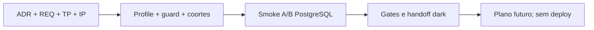

# TP-00027 — Rollout autorizado de teste da política de pool por tenant

**Document ID:** `TP-00027`  
**Primary Nature:** `Plano`  
**Project:** SaaS Service  
**Status:** `Completed — repository-local only`  
**Owner:** Engenharia, Backend, Arquitetura e SRE/DBA  
**Author:** Codex (OpenAI), sob aprovação humana explícita

**References:**
[ADR-0052](../../backend/docs/adrs/ADR-0052-parametros-pool-conexao-por-tenant.md) ·
[REQ-00049](../../product/requirements/REQ-00049-tenant-pool-policy-authorized-test-rollout.md) ·
[UC-00046](../../product/use-cases/UC-00046-super-admin-tenant-pool-policy-management.md) ·
[IP-BE-23.4.1-tenant-pool-policy-authorized-test-enablement](../../backend/docs/specs/IP-BE-23.4.1-tenant-pool-policy-authorized-test-enablement.md) ·
[runbook](../../backend/docs/onboarding/tenant-pool-policy-authorized-test-rollout-runbook.md).

## 1. Overview

Este plano fecha os cinco próximos passos solicitados sem ultrapassar a autoridade
local: ativação opt-in, smoke com A/B sintéticos, prova de alteração/isolamento/
rollback/drain, envelope de capacidade e plano de rollout posterior. O UC-00046 e
a UI já existem; não há implementação frontend nova.

## 2. Execution Tracking Matrix

> Legenda: ⬜ Pending · 🔄 In Progress · ✅ Done · ⏸️ Blocked

| # | Activity | Agent | Status | Evidence |
| ---: | --- | --- | :---: | --- |
| 1.1 | Versionar ADR-0052 v1.8 e REQ-00049 | Architecture | ✅ | ADR, requisito e índices persistidos |
| 1.2 | Persistir TP, IP backend e runbook | Backend/Architecture | ✅ | especificação anterior ao código e validação documental inicial verde |
| 2.1 | Criar profile opt-in e guard fail-closed | Backend | ✅ | binding Spring ACTIVE/DRAIN_ONLY/DARK e guard testados |
| 2.2 | Aplicar coortes read A/B e mutate A | Backend/Security | ✅ | service/reconciler/candidate com defesa em profundidade |
| 2.3 | Aplicar teto ambiental `10` | Backend/SRE | ✅ | autoridade exata, budget esperado e recheck sob lock |
| 3.1 | Provar upgrade, A/B, lease e drain reais | QA/Backend | ✅ | `TenantDatabaseRoutingIsolationIT` root-only `8/8 PASS`, zero falhas/erros/skips |
| 3.2 | Provar rollback como nova geração | QA/Backend | ✅ | `SMALL -> ROBUST -> SMALL`, B preservado e drains por lease aprovados no mesmo `8/8` |
| 4.1 | Executar gates focais, arquitetura e docs | QA | ✅ | suíte PostgreSQL final `5/5`, isolation gate dedicado `30/30` e documentação sem falhas/erros/skips |
| 4.2 | Fechar evidência e matriz ambiental | SRE/Architecture | ✅ | handoff `DARK`; ambientes externos `BLOCKED/NOT_CONFIGURED` e rollout não autorizado |
| 5.1 | Planejar rollout controlado futuro | Architecture/SRE | ✅ | fases e go/no-go documentados, sem execução externa |

### Summary

| Phase | Total | Pending | Blocked | In Progress | Done | Progress |
| --- | ---: | ---: | ---: | ---: | ---: | ---: |
| Governança | 2 | 0 | 0 | 0 | 2 | 100% |
| Implementação | 3 | 0 | 0 | 0 | 3 | 100% |
| Smoke | 2 | 0 | 0 | 0 | 2 | 100% |
| Gates/handoff | 2 | 0 | 0 | 0 | 2 | 100% |
| Rollout futuro | 1 | 0 | 0 | 0 | 1 | 100% |
| **Total** | **10** | **0** | **0** | **0** | **10** | **100%** |

## 3. Context and Constraints

- ADR-0052 permanece a única decisão; REQ-00049 é seu componente NFR/técnico.
- `application.yml` continua dark; somente `dev|test + tenant-pool-smoke` ativa.
- A é mutável, B somente leitura e C indisponível.
- `80/1/10/5/15` e teto 10 valem apenas no smoke local.
- `ACTIVE` e `DRAIN_ONLY` são derivados de matrizes completas de flags; híbridos
  falham no startup e não existe propriedade `phase` paralela.
- runtime, cluster/membership persistido e envelope coincidem no startup; o
  allocator repete o budget esperado sob lock.
- mudança transversal docs/backend já possui este plano persistido antes do código.
- o profile de isolamento usa build directory próprio, irmão de `target`, e um
  único writer durante todo o gate; `clean` não é mecanismo de exclusão mútua.
- não editar `frontend/` ou `infra/` neste recorte.

## 4. Phase Details

### Phase 1 — Specification gate

Entregas: ADR v1.8, REQ-00049, este TP,
IP-BE-23.4.1-tenant-pool-policy-authorized-test-enablement, runbook e índices.

Aceite: `validate-docs.sh` verde antes da primeira edição Java/YAML.

### Phase 2 — Authorized enablement

Entregas: profile, coortes, startup guard, gates tenant-aware, teto local,
classificação ACTIVE/DRAIN_ONLY, autoridade persistida exata, recheck sob lock e
defesa-em-profundidade no candidate/reconciler.

Aceite: dark por default; boot inválido fora do profile; A/B/C conforme requisito.

### Phase 3 — Physical smoke

Entregas: extensão do IT PostgreSQL/Hikari existente para `6 -> 10 -> 6`, com B
inalterado e leases antigas drenadas somente após release.

Aceite: assertions de banco físico, snapshot, geração, rollback e drain.

### Phase 4 — Verification and handoff

Entregas: testes focais, suíte impactada, gates Modulith/Clean/isolation, docs,
output integral dedicado do profile e registro explícito de skips/falhas. O V69
`2/2 PASS` informado pelo usuário é evidência anterior válida, não substitui os
novos testes. Qualquer run com classes removidas, discovery incompleto ou reports
de snapshots diferentes é descartado integralmente.

### Phase 5 — Controlled rollout plan only

1. medir `max_connections`, uso plataforma, sessões externas e pico por tenant;
2. aprovar envelope do ambiente com SRE/DBA e owner;
3. habilitar observabilidade e leitura para coorte sintética;
4. habilitar uma coorte mutável mínima e observar janela definida;
5. expandir somente após go/no-go; em falha, kill switch e rollback por revisão.

DEV compartilhado, HML e PRD permanecem bloqueados até novo plano/autorização.

## 5. Dependency Diagram



## 6. Agent Responsibility Matrix

| Agent | Responsibility |
| --- | --- |
| Architecture | ADR, limites de autoridade e rollout futuro. |
| Backend | Configuração, coorte, validação e lifecycle. |
| QA | Testes focais, A/B, regressão e evidência. |
| Security | Fail-closed, RBAC e não alcance de C. |
| SRE/DBA | Fórmula e classificação dos ambientes. |

## 7. Coordination Rules

1. documentação e validação precedem código;
2. menor teste focal precede suítes maiores;
3. falha ou skip obrigatório bloqueia conclusão;
4. kill switch preserva drain committed;
5. nenhum resultado local será chamado de production readiness;
6. apenas um `tenant-isolation-gate` escreve no build directory dedicado por vez;
   builds Maven/IDE normais permanecem em `backend/target`.

## 8. Readiness Gates

| Environment | Capacity values | Capability | Gate |
| --- | --- | --- | --- |
| repository `LOCAL_SMOKE` | `80/1/10/5/15`, tenant max `10` | Authorized | Spec + tests + Docker local |
| DEV compartilhado | Não configurado | Blocked | inventário, benchmark, IP ambiental e aprovação |
| HML | Não configurado | Blocked | todos os gates DEV + plano/deploy autorizado |
| PRD/produção | Não configurado | Blocked | todos os gates anteriores + canary/rollback aprovados |

## 9. Verification

```bash
./infra/scripts/validate-docs.sh
cd backend
./mvnw -B -Dtest=TenantPoolPolicyFeatureFlagTest,TenantPoolPolicyPropertiesTest,TenantPoolLifecyclePropertiesTest,TenantPoolPolicyAuthorizedTestEnvironmentGuardTest,TenantPoolPolicyAuthorizedTestProfileContextTest,TenantPoolPolicyAdministrationFeatureGateAdapterTest,TenantPoolPolicyAdministrationServiceTest,TenantPoolCandidatePreparerTest,TenantPoolReconcilerTest,TenantPoolPolicyCapacityReservationAdapterTest,TenantPoolCapacityAllocatorTest test
./mvnw -B -Dtest=TenantPoolPolicyControlPlaneMigrationPostgresTest,TenantPoolCapacityEnvironmentControlPlanePostgresTest,TenantPoolBlueGreenMultiInstancePostgresTest,TenantPoolCapacityMultiInstancePostgresTest,TenantPoolPolicyIntentAuditPostgresTest,TenantDatabaseRoutingIsolationIT test
./mvnw -B -Dtest=SaasServiceApplicationTests test
./mvnw -B -Dtest=ModuleStructureVerificationTest,CleanArchitectureRulesTest,CleanArchitectureRuleContractTest test
./mvnw -B clean -Ptenant-isolation-gate verify
```

Suíte impactada/completa será executada conforme custo e ambiente; qualquer
limitação será registrada de forma reproduzível. O profile grava classes,
test-classes, JAR e relatórios em `backend/build/tenant-isolation-gate`; outro run
do mesmo profile deve aguardar o término do primeiro.

## 10. Risks and Rollback

- Config inválida: startup falha antes de efeitos.
- C fora da coorte: API e runtime não o tocam.
- Budget excedido: mutação rejeitada antes de persistir/apply.
- Durante incidente: mutações/candidate `OFF`, terminar committed drain, depois
  authority/scheduler/API `OFF`; reiniciar sem profile.
- `DRAIN_ONLY` bloqueia uncommitted, mas revision apply recupera e converge somente
  target já committed; matriz híbrida é rejeitada.
- cluster nunca é escolhido por cardinalidade: somente `runtime.cluster-id` exato.

## 11. Completion and Handoff

Concluir somente com documentação atualizada, testes reportados, base dark e
ambientes externos ainda bloqueados. Planejar rollout não o autoriza nem executa.

### 11.1 Estado de handoff em 2026-08-31

- implementação e testes não Docker: concluídos;
- base default-off e contexto Spring dark: provados;
- autoridade por `runtime.cluster-id`, sem enumeração/fallback: implementada;
- convergência committed: `DRAINED -> RELEASABLE -> RELEASED` na mesma transação;
- `clean -Ptenant-isolation-gate verify` foi executado pelo operador, mas a
  evidência foi rejeitada: Keycloak `7/7 PASS`, HTTP com `8` erros e Hibernate/
  Routing sem discovery; outro writer alterou `backend/target` durante o gate;
- POM e workflows agora usam `backend/build/tenant-isolation-gate`; model
  evaluation, compile/testCompile/JAR (`1229/496`) e YAML passaram sem Docker;
- o primeiro rehearsal no output dedicado descobriu os quatro selectors, mas foi
  rejeitado com dois timeouts de startup Keycloak, Hibernate `7/7 PASS` e Routing
  `8` executados com `1` erro de proveniência `CUSTOM/ROBUST`;
- a fixture agora materializa `SMALL -> ROBUST -> SMALL` com hashes coerentes, e
  o probe OIDC conserva HTTP `200` com timeout explícito de cinco minutos;
- a tentativa focal posterior compilou o backend/testes, mas foi classificada
  `NOT_EXECUTED / ENVIRONMENT BLOCKED`: o dockerd recebeu SERVFAIL de
  `127.0.0.53` ao buscar `testcontainers/ryuk:0.13.0`; Ryuk/PostgreSQL e os oito
  cenários não iniciaram;
- consultas posteriores a Docker Hub registry/auth e Quay passaram; inspeção e
  pull do cache permanecem bloqueados ao agente porque o sudo exige prompt humano;
- o operador repetiu `TenantDatabaseRoutingIsolationIT` em shell root: `8/8 PASS`,
  zero falhas/erros/skips e `BUILD SUCCESS`; o smoke prova A/B exclusivos,
  `SMALL -> ROBUST -> SMALL`, leases e drain;
- as migrations `certificate` chegaram à versão 8 nos bancos A e B; o `ERROR`
  final é a exceção esperada do cenário `missingdatabase`, que mantém o alvo fora
  do routing, e não uma falha silenciosa;
- o isolation gate exclusivo no output dedicado terminou `30/30 PASS`: Keycloak
  `7/7`, HTTP `8/8`, Hibernate PostgreSQL `7/7` e Routing `8/8`, sem falhas,
  erros ou skips, com `BUILD SUCCESS`;
- a suíte PostgreSQL final do control plane terminou `5/5 PASS`, zero falhas,
  erros ou skips e `BUILD SUCCESS` às 20:59:47 -03:00: CapacityEnvironment
  `2/2`, BlueGreenMultiInstance `1/1`, CapacityMultiInstance `1/1` e IntentAudit
  `1/1`;
- V69/migration anterior: resultado do operador `2/2 PASS`, aceito apenas para
  esse teste e não como substituto dos novos ITs;
- qualquer ambiente externo: `BLOCKED/NOT_CONFIGURED`, sem execução.

O plano termina com configuração versionada e handoff documentado em `DARK`, e
está concluído somente no repositório/host local. Nenhuma evidência autoriza DEV
compartilhado, HML, PRD, deploy, produção ou rollout real.

## 12. Change Log

| Version | Date | Author | Changes |
| --- | --- | --- | --- |
| 1.0 | 2026-08-28 | Codex (OpenAI), sob aprovação humana explícita | Cria plano local para os cinco passos solicitados. |
| 1.1 | 2026-08-28 | Codex (OpenAI), sob aprovação humana explícita | Acrescenta matrizes ACTIVE/DRAIN_ONLY e autoridade persistida/recheck de capacidade antes das correções de código. |
| 1.2 | 2026-08-28 | Codex (OpenAI), sob aprovação humana explícita | Atualiza execução para 60%, registra gates verdes, release durável e bloqueia fechamento até o rehearsal Docker root-only. |
| 1.3 | 2026-08-29 | Codex (OpenAI), sob aprovação humana explícita | Incorpora o run root-only rejeitado e planeja output integral dedicado/single-writer antes de repetir o gate, mantendo progresso e rollout externo inalterados. |
| 1.4 | 2026-08-29 | Codex (OpenAI), sob aprovação humana explícita | Registra hardening implementado/provado sem Docker e mantém 4.1/4.2 abertos somente para o rerun dedicado e handoff final. |
| 1.5 | 2026-08-29 | Codex (OpenAI), sob aprovação humana explícita | Registra o rehearsal dedicado negativo e as correções de proveniência, baseline SMALL completo e readiness Keycloak; mantém smoke e handoff abertos até novo gate root-only. |
| 1.6 | 2026-08-31 | Codex (OpenAI), sob aprovação humana explícita | Registra o bloqueio pré-teste por DNS/pull do Ryuk sem reclassificá-lo como falha funcional; mantém 3.1/3.2 bloqueados e 4.1/4.2 em progresso. |
| 1.7 | 2026-08-31 | Codex (OpenAI), sob aprovação humana explícita | Aceita smoke físico `8/8` e isolation gate dedicado `30/30`, eleva o plano a 80% e restringe a pendência à suíte PostgreSQL do control plane e ao handoff DARK. |
| 1.8 | 2026-08-31 | Codex (OpenAI), sob aprovação humana explícita | Aceita a suíte PostgreSQL final `5/5`, conclui gates/handoff em `DARK` e encerra o plano em 100% no recorte repository-local, sem promoção ambiental. |
