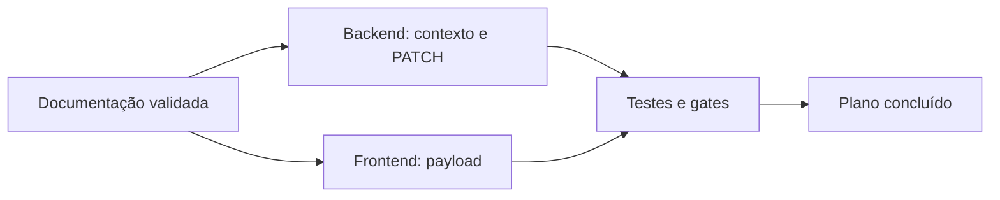

# TP-00033 — Recuperação de plano e cota conversacional

## 1. Visão geral

Este plano coordena uma correção transversal entre a tela administrativa, o
contrato REST de Tenant e o fluxo conversacional omnichannel. O limite continua
sendo consultado na autoridade durável; a correção não introduz cache nem eviction.

## 2. Matriz de execução

| # | Atividade | Responsável | Status | Evidência esperada |
| --- | --- | --- | :---: | --- |
| 1 | Registrar plano e lição aprendida agnóstica | Engenharia | ✅ | Artefatos indexados e gate documental verde |
| 2 | Preservar auditoria e cortar do prompt o bloqueio operacional encerrado | Backend | ✅ | Teste de regressão bloqueio → liberação → contexto limpo |
| 3 | Completar o round-trip de `planId` no PATCH de Tenant | Frontend + Backend | ✅ | Testes de service, controller/use case e persistência |
| 4 | Executar testes focalizados e gates impactados | Qualidade | ✅ | Comandos reproduzíveis sem falhas ou skips não explicados |
| 5 | Atualizar este plano para `Completed` | Engenharia | ✅ | Matriz, resumo e changelog reconciliados |

| Total | Pendentes | Em andamento | Concluídas | Progresso |
| ---: | ---: | ---: | ---: | ---: |
| 5 | 0 | 0 | 5 | 100% |

## 3. Contexto e restrições

- `TenantApi.getChatbotLimit` permanece uma leitura durável; esta tarefa não cria
  cache funcional nem endpoint de limpeza.
- Mensagens de bloqueio continuam persistidas como evidência de auditoria.
- O contexto enviado à LLM deve possuir fronteira durável independente da
  retenção das mensagens canônicas.
- A mudança do plano usa o método de domínio existente e não cria dependência
  nova entre módulos.
- A alteração é local ao repositório; rede, serviços externos, dados reais,
  deploy e produção estão excluídos.

## 4. Fases e critérios de aceite

### Fase 1 — Documentação

1. Criar e indexar este plano.
2. Criar e indexar a lição `LL-BE-00099`.
3. Executar `./infra/scripts/validate-docs.sh` antes da edição de software.

Critério: o gate documental retorna código zero.

### Fase 2 — Correção backend

1. Disponibilizar operação de domínio que avance apenas a fronteira do contexto
   LLM, sem apagar mensagens, documento autenticado ou estado de workflow.
2. Após registrar uma negativa de admissão, avançar a fronteira até a última
   mensagem operacional persistida.
3. Aceitar `plan` no PATCH e aplicar `Tenant.changePlan` quando fornecido.
4. Cobrir manutenção do plano quando o campo estiver ausente e alteração quando
   presente.

Critérios:

- o aviso de quota permanece auditável, mas não integra prompts posteriores;
- a próxima mensagem após liberação pode continuar a conversa autenticada;
- `plan` e limites retornados pelo PATCH refletem a alteração persistida;
- nenhuma alteração parcial é salva quando o plano é inválido.

### Fase 3 — Correção frontend

1. Mapear `planId` para `plan` no payload de atualização.
2. Atualizar teste do service para exigir o campo no contrato.
3. Preservar a invalidação pontual das queries existentes.

Critério: mudar o seletor do plano produz PATCH compatível com o backend.

### Fase 4 — Verificação e encerramento

Executar:

- `./mvnw -B -Dtest=ChatbotQuotaEnforcementTest,LlmConversationHandlerTest,ChatbotSessionTest,UpdateTenantUseCaseTest,TenantControllerTest,JpaTenantRepositoryAdapterTest test`;
- `./mvnw -B -Dtest=ModuleStructureVerificationTest test`;
- `./mvnw -B -Dtest=CleanArchitectureRulesTest,CleanArchitectureRuleContractTest test`;
- testes frontend focalizados do service e formulário;
- `npm run lint` e `npm run format:check` no frontend;
- `./infra/scripts/validate-docs.sh` após reconciliar o plano.

Se uma classe focalizada não existir, o comando deve ser ajustado ao teste de
contrato equivalente e o desvio registrado no handoff.

## 5. Dependências

## 6. Responsabilidades e coordenação

| Área | Responsabilidade |
| --- | --- |
| Backend | Autoridade de Tenant, fronteira do contexto e testes de regressão |
| Frontend | Contrato de envio e testes do service/formulário |
| Qualidade | Testes focalizados, gates arquiteturais e evidência final |
| Documentação | Índices, lição, estado do plano e gate ADR-0000 |

As mudanças backend e frontend só começam após o gate documental inicial. A
conclusão exige todos os testes focalizados disponíveis e os gates estruturais
afetados; falhas externas ao escopo permanecem explícitas, sem bypass.

## 7. Riscos e rollback

- Uma fronteira ampla demais pode remover contexto necessário para respostas
  curtas; o teste deve provar que somente mensagens anteriores ao bloqueio deixam
  o prompt e que o estado autenticado é preservado.
- Persistir plano sem limites coerentes pode produzir combinação comercial
  inesperada; este fluxo mantém os valores enviados explicitamente pela tela e
  não recalcula defaults no backend.
- O rollback de código consiste em remover a nova operação de fronteira e o campo
  do PATCH; não há migration nem alteração destrutiva de dados.

## 8. Change log

| Versão | Data | Autor | Mudança |
| --- | --- | --- | --- |
| 1.1 | 2026-09-04 | Codex | Conclui contrato PATCH, fronteira do contexto LLM, testes e gates; registra indisponibilidade ambiental do Docker. |
| 1.0 | 2026-09-04 | Codex | Plano criado e iniciado antes da implementação transversal. |

## 9. Resultado e evidências

- O PATCH administrativo agora transporta `planId` como `plan`, aceita o campo
  no controller/comando e aplica `Tenant.changePlan` depois da validação dos
  limites. Campo ausente preserva o plano vigente e entrada inválida não salva
  mutação parcial.
- A negativa de admissão continua no ledger da conversa, mas sua persistência
  avança uma fronteira monotônica do contexto LLM. Identidade autenticada,
  workflow e demais dados da sessão permanecem intactos.
- Testes backend focalizados: `59` executados, zero falhas, erros ou skips.
- Suíte backend completa: `2.573` executados, zero falhas de asserção,
  `121` skips e quatro erros de Testcontainers porque o ambiente não permite
  acesso ao Docker. Os gates de estrutura modular (`6`), contratos de Clean
  Architecture (`7`) e regras ArchUnit (`16`) passaram nessa mesma execução.
- Frontend: `10` testes focalizados e `1.010` testes da suíte completa passaram;
  lint terminou com zero erros e `55` avisos preexistentes; build de produção e
  TypeScript passaram.
- O `format:check` global foi interrompido porque percorreu artefatos gerados
  preexistentes em `.next-e2e-audit`; o check Prettier focalizado nos dois
  arquivos alterados passou.
- Não houve migration, acesso a produção, eviction de cache nem alteração dos
  contadores de uso.
