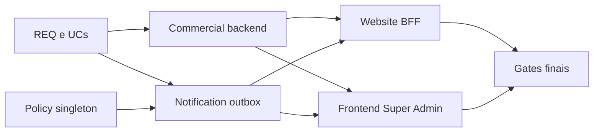

# TP-00036 — Integração de contatos comerciais

References: [REQ-00055](../../product/requirements/REQ-00055-commercial-contact-capture-management.md) ·
[UC-00051](../../product/use-cases/UC-00051-commercial-contact-intake-notification.md) ·
[UC-00052](../../product/use-cases/UC-00052-super-admin-commercial-contact-management.md) ·
[ADR-0022](../../backend/docs/adrs/ADR-0022-notification-center-architecture.md) ·
[Module Registry](../../architecture/module-registry.md)

## 1. Overview

Este plano conclui a migração da área Comercial para uma navegação raiz e introduz
o perfil global Comercial. A extensão v2.1 separa Contatos, Equipe e Configurações
em rotas próprias, preserva Parâmetros como a primeira aba de Configurações e
restringe as duas últimas rotas a Super Admin.

## 2. Execution Tracking Matrix

Legend: ⬜ Pending · 🔄 In Progress · ✅ Done · ⏸️ Blocked

| # | Activity | Owner | Status | Evidence |
| --- | --- | --- | :---: | --- |
| 1 | Especificar e indexar requisito, casos de uso e plano do baseline | Documentação | ✅ | REQ-00055 v1.1, UC-00051 v1.1, UC-00052 v1.1, TP-00036 v1.1 e índices |
| 2 | Criar módulo Commercial, domínio, APIs e persistence de plataforma | Backend | ✅ | 42 testes focais; contratos HTTP, domínio, use cases e JDBC |
| 3 | Criar destinatários, template e outbox na Central de Notificações | Backend | ✅ | V79/V80, worker, unicidade, lease e limite rígido de três tentativas |
| 4 | Integrar POST same-origin do website ao backend | Website | ✅ | 23 testes, lint, typecheck, format e build Next verdes |
| 5 | Criar Comercial > Contatos e abas Super Admin | Frontend | ✅ | 71 testes focais de RBAC, grid, filtros, detalhe, status e destinatários |
| 6 | Executar suítes e gates impactados | Quality | ✅ | evidências e limitações ambientais registradas na seção 8 |
| 7 | Reconciliar manifesto, documentação e evidências | Engenharia | ✅ | module registry e índices atualizados; validate-docs verde |
| 8 | Materializar extensão reply/cadência e validar docs antes do código | Documentação | ✅ | REQ/UCs/TP v1.2 e índices; validate-docs verde em 2026-09-07 |
| 9 | Implementar migrations, enqueue dual, policy, claim e monitoramento | Backend | ✅ | V84/V85; reply único; policy por relógio PostgreSQL; 18/18 focais, incluindo 7/7 PostgreSQL |
| 10 | Implementar aba de intervalo e monitoramento por audiência | Frontend | ✅ | contratos/UI/mocks; 22/22 testes, ESLint, Prettier e typecheck de `src` verdes |
| 11 | Executar regressões/gates e reconciliar o estado final | Quality | ✅ | backend 79 testes sem falhas, website 23+2, frontend 22, revisão independente e validate-docs; limites ambientais abaixo |
| 12 | Especificar e implementar HTML completo de MSG_NEW_CONTATO | Backend/Docs | ✅ | V86, renderer seguro, 23 testes focais e 32 testes PostgreSQL/arquitetura verdes |
| 13 | Explicitar e provar MSG_NEW_CONTATO_REPLY no fluxo temporizado | Backend/Docs | ✅ | reply PENDING/slot futuro/avanço da policy; 8/8 PostgreSQL e 27/27 regressão do fluxo |
| 14 | Validar HTML de /contate e criar edição/exclusão de destinatários | Backend/Frontend/Docs | ✅ | V86 validada; V87, APIs PUT/DELETE, UI, 25 testes backend e 7 frontend verdes |
| 15 | Migrar Comercial para menu raiz e rotas Contatos/Equipe/Configurações | Frontend | ✅ | rotas raiz, redirect legado, menu e guards testados |
| 16 | Introduzir ROLE_COMMERCIAL e segregar endpoints por capacidade | Backend/IAM | ✅ | V88, Keycloak, matcher global e guards de método testados |
| 17 | Permitir provisionar perfil Comercial em admin/users | Backend/Frontend | ✅ | perfil tipado persistido, provisionado e selecionável na UI |
| 18 | Reconciliar matriz RBAC, configurações Keycloak e gates | Engenharia/Quality | ✅ | matriz, realms e documentação validados |
| 19 | Remover item expansível Comercial e manter links diretos | Frontend/Docs | ✅ | wrapper removido; menu 21/21, sidebar 13/13, lint, typecheck e format verdes |
| 20 | Autorizar Dashboard para toda role web reconhecida | Frontend/Docs | 🔄 | software verde; validate-docs bloqueado por referências IP-BE-50.1.1-tenant-first-login-mfa-toggle externas ao escopo |
| 21 | Ajustar ícones de Contatos e Configurações no menu Comercial | Frontend/Docs | 🔄 | implementação focal 1/1, lint, format e typecheck verdes; suíte impactada falha em 2 asserts preexistentes de Dashboard; build bloqueado por `.env.local` |
| 22 | Provar acesso de ROLE_COMMERCIAL aos dados e status de Contatos cadastrados | Backend/Frontend/Docs | ✅ | controller 4/4, segurança HTTP 8/8, frontend 4/4, lint/format e docs verdes |
| 23 | Aplicar verde ao toggle ativo da Equipe comercial | Frontend/Docs | ✅ | classe local success; focal 2/2, suíte Commercial 17/17, lint, format e typecheck verdes |
| 24 | Impedir stream tenant no perfil Comercial e remover credenciais do SSE Bearer | Frontend/Docs | ✅ | regressões focais 9/9, lint/format e docs verdes; typecheck amplo bloqueado fora do escopo |
| 25 | Exibir Informações e autorizar `/informacoes` para ROLE_COMMERCIAL | Frontend/Docs | ✅ | focais 20/20, ESLint/Prettier focais e typecheck verdes; PR amplo FAIL/BLOCKED pelo baseline |
| 26 | Remover restrições de role de Meus Dados e Informações | Frontend/Docs | ✅ | focais 20/20 e checks focais verdes; PR amplo 1307/1310 com três asserts históricos |

| Total | Pending | In Progress | Done | Progress |
| ---: | ---: | ---: | ---: | ---: |
| 26 | 0 | 2 | 24 | 92% |

## 3. Context and Constraints

- O REQ-00055 v1.3 e os dois casos de uso estão implementados no repositório; a
  execução canônica em Java 25, SMTP real e deploy seguem fora da evidência local.
- O novo contexto Commercial possui dados globais no saas_tenant e não reutiliza
  contatos tenant-scoped do contexto Client.
- Para preservar o grafo acíclico, Commercial declara contratos consumer-owned
  para enfileirar/consultar notificações; Notification os implementa e depende da
  API pública de Commercial, sem import de internal.
- Contato e fan-out da outbox usam platformTransactionManager na mesma transação.
- O website mantém BFF same-origin por CSP e segredo server-side; o navegador não
  recebe URL interna nem credencial.
- A navegação usa `/commercial/**`; as APIs mantêm `/api/v1/admin/commercial/**`
  por serem recursos globais. Contatos aceita Commercial/Super Admin e os demais
  recursos continuam somente Super Admin, sempre fora de personificação.
- Nenhuma rede, instalação, Git, produção ou credencial real integra o escopo.
- `ROLE_COMMERCIAL` segue a convenção de realm roles globais existente e não
  é composta: concede somente Contatos. `ROLE_SUPER_ADMIN` continua autorizado
  em toda a área Comercial sem depender de herança implícita no frontend.
- O intervalo é global ao contexto Commercial, inteiro de 1–3600 segundos, default
  30, e representa o mínimo entre inícios de tentativas de ambos os templates.
- A reserva de slot e o claim são atômicos; SMTP acontece depois do commit e sem lock.

## 4. Phase Details

### Phase 1 — Contract and data

| # | Activity | Dependency | Deliverable |
| --- | --- | --- | --- |
| 1.1 | Fixar contratos REST, estados e paginação | REQ/UC | DTOs e schemas simétricos |
| 1.2 | Criar migrations de contatos, histórico, destinatários, outbox e template | 1.1 | Flyway tenant incremental |
| 1.3 | Implementar domínio/use cases e ports | 1.1 | regras sem framework no domínio |

Acceptance: NEW obrigatório, observação 10–1000, destinatário normalizado, chave
idempotente e limite rígido de três tentativas automatizadas.

### Phase 2 — Adapters and delivery

| # | Activity | Dependency | Deliverable |
| --- | --- | --- | --- |
| 2.1 | Implementar JPA/JDBC e endpoints técnico/admin | Phase 1 | persistência, filtros e RBAC |
| 2.2 | Implementar claim/lease/backoff do outbox | Phase 1 | worker multi-instância seguro |
| 2.3 | Reutilizar template/provider Notification | 2.2 | envio SMTP centralizado e auditável |

Acceptance: commit não depende de SMTP; SENT e FAILED são terminais; ausência de
configuração é visível; nenhum lock permanece durante I/O.

### Phase 3 — Web applications

| # | Activity | Dependency | Deliverable |
| --- | --- | --- | --- |
| 3.1 | Integrar website BFF com Idempotency-Key e copy correta | Phase 2 contract | contato registrado sem promessa síncrona de e-mail |
| 3.2 | Criar rota/menu/RBAC/serviço/query hooks no frontend | Phase 2 contract | navegação global Super Admin |
| 3.3 | Criar grid, filtros, detalhe, status e aba de destinatários | 3.2 | UX completa, responsiva e acessível |

Acceptance: nenhum fetch em componente, nenhum texto visível hardcoded, estados
loading/error/empty/success, modais e menu operáveis por teclado.

### Phase 4 — Verification and reconciliation

| # | Activity | Dependency | Deliverable |
| --- | --- | --- | --- |
| 4.1 | Testes focalizados e suites backend | Phases 1–2 | testes + gates Modulith/Clean |
| 4.2 | Testes e gates website/frontend | Phase 3 | Vitest, lint, typecheck, format, build |
| 4.3 | Atualizar manifesto/status/evidências e validar docs | 4.1–4.2 | documentação coerente e gate zero |

### Phase 5 — Extensão reply e cadência (v1.2)

| # | Activity | Dependency | Deliverable |
| --- | --- | --- | --- |
| 5.1 | Congelar REQ/UCs/TP e índices | autorização do solicitante | documentação completa e validate-docs verde antes do fonte |
| 5.2 | Evoluir schema da outbox e semear template HTML | 5.1 | V84 aditiva e V85 idempotente |
| 5.3 | Enfileirar CONTACT_REPLY + COMMERCIAL_TEAM atomicamente | 5.2 | uma reply + N itens internos, sem retroação histórica |
| 5.4 | Serializar claims pela policy singleton | 5.2 | intervalo comum, multi-instância e sem lock no SMTP |
| 5.5 | Expor policy e monitoramento seguro | 5.3–5.4 | GET/PUT Super Admin e deliveries tipadas |
| 5.6 | Criar terceira aba e detalhe por audiência | 5.5 | UI acessível, i18n, schemas, mocks e testes |
| 5.7 | Executar gates e reconciliar documentos | 5.2–5.6 | evidência repository-local e status sem falso fechamento |

Acceptance: a migration V85 cria MSG_NEW_CONTATO_REPLY ativo/EMAIL/HTML sem
sobrescrever customização; contato novo cria um reply e N itens internos no mesmo
commit; replay não duplica; claims de qualquer template respeitam a cadência; cada
item possui no máximo três tentativas; detalhe separa as audiências; somente Super
Admin global altera o intervalo.

### Phase 6 — HTML completo da notificação interna (v1.4)

| # | Activity | Dependency | Deliverable |
| --- | --- | --- | --- |
| 6.1 | Documentar placeholders e segurança de renderização | baseline v1.3 | REQ/UC/TP e índices validados |
| 6.2 | Criar migration evolutiva do MSG_NEW_CONTATO | 6.1 | HTML autocontido com seis campos |
| 6.3 | Projetar dados completos e renderizar com escape | 6.1 | contrato público Commercial e renderer Notification |
| 6.4 | Executar testes e reconciliar documentação | 6.2–6.3 | evidência reproduzível e status final |

Acceptance: migrations aplicadas não são alteradas; o template interno apresenta
nome, e-mail, telefone, plano, escritório e mensagem; todos os valores são escapados,
as quebras da mensagem são preservadas com segurança e o reply continua compatível.

### Phase 7 — Reply obrigatoriamente temporizado (v1.6)

| # | Activity | Dependency | Deliverable |
| --- | --- | --- | --- |
| 7.1 | Explicitar ausência de envio direto e slot compartilhado | baseline v1.5 | REQ/UC/TP e índices validados |
| 7.2 | Provar reply bloqueado por next_dispatch_at e consumo do slot | 7.1 | regressão PostgreSQL dedicada |
| 7.3 | Repetir gates afetados e reconciliar documentação | 7.2 | evidência e status final |

### Phase 8 — Gestão completa de destinatários (v1.8)

| # | Activity | Dependency | Deliverable |
| --- | --- | --- | --- |
| 8.1 | Validar MSG_NEW_CONTATO contra os seis campos de /contate | baseline V86 | contrato e regressão de migration/renderer |
| 8.2 | Criar exclusão lógica e alteração de e-mail Super Admin | 8.1 | migration V87, API e persistence auditável |
| 8.3 | Separar Status/Ação e criar formulários/dialog | 8.2 | UX acessível, i18n, mocks e queries |
| 8.4 | Executar gates e reconciliar documentação | 8.2–8.3 | evidência repository-local |

### Phase 9 — Menu raiz e perfil Comercial (v2.0)

| # | Activity | Dependency | Deliverable |
| --- | --- | --- | --- |
| 9.1 | Congelar requisito, plano e matriz RBAC antes do software | autorização do solicitante | contrato docs-first validado |
| 9.2 | Criar rotas raiz Contatos, Equipe e Configurações | 9.1 | menu Comercial fora de Administração |
| 9.3 | Manter Parâmetros como aba inicial de Configurações | 9.2 | contêiner extensível de configurações |
| 9.4 | Adicionar perfil/role Comercial no mirror global e no IAM | 9.1 | migration aditiva e provisioning tipado |
| 9.5 | Segregar contatos de destinatários/parâmetros no backend | 9.4 | contatos para Comercial/Super Admin; demais somente Super Admin |
| 9.6 | Executar testes focais, suites impactadas e gates | 9.2–9.5 | evidência reproduzível e reconciliação final |

Acceptance: `ROLE_COMMERCIAL` é uma realm role global independente; seu usuário
vê e acessa somente Comercial > Contatos, sem tenant; Super Admin vê Contatos,
Equipe e Configurações; URL legada redireciona sem manter item duplicado; APIs
repetem a mesma separação; admin/users cria o perfil selecionado e lista seu perfil.

### Phase 10 — Navegação direta do grupo Comercial (v2.2)

| # | Activity | Dependency | Deliverable |
| --- | --- | --- | --- |
| 10.1 | Remover o wrapper `nav-commercial` | Phase 9 concluída | Contatos, Equipe e Configurações diretamente em `group-commercial.items` |
| 10.2 | Atualizar regressões de visibilidade e sidebar | 10.1 | ausência do botão/ícone redundante e RBAC preservado |
| 10.3 | Executar quality gate e reconciliar documentação | 10.2 | evidência focal e documental atual |

Acceptance: o texto Comercial aparece somente como título do grupo; não existe
botão, ícone ou chevron intermediário; Comercial vê apenas Contatos e Super Admin
vê Contatos, Equipe e Configurações, todos como links diretos.

## 4.1 Implementation Readiness — tarefa 19

### Gate Audit

| Controle | Evidência |
| --- | --- |
| Fontes superiores | REQ-00055 v2.2 e UC-00052 v2.1 em Approved; ADR-0022 permanece aplicável sem mudança arquitetural. |
| User Story View | Como operador Comercial/Super Admin, quero acessar diretamente os links da seção Comercial para evitar navegação duplicada; coberto por AC-041. |
| Assumptions / Open Questions | Nenhuma assumption Proposed, pergunta Open, TBD ou decisão implícita nas fontes selecionadas. |
| Dependências | Phase 9 concluída; rotas e RBAC existentes serão reutilizados sem alteração. |
| Escopo | What: retirar somente o wrapper visual; Where: `frontend/src/lib/menu-config.ts` e testes de menu/sidebar. |

### Acceptance Tests

| Critério | Fluxo | Evidência planejada |
| --- | --- | --- |
| AC-041 | UC-00052 Extension 0a | `menu-utils.test.ts` e `Sidebar.rbac.test.tsx`: links diretos e ausência do botão Comercial. |

### Prohibited

- Não alterar rotas, permissões, conteúdo das páginas, backend, IAM ou contexto global.
- Não remover o título do grupo Comercial nem relaxar filtros de role.

### Mandatory

- Reutilizar `group-commercial`, `PATHS` e roles existentes.
- Atualizar testes focais e executar o quality gate frontend focused.
- Validar a documentação após a reconciliação final.

### Definition of Done

- `nav-commercial` não existe no menu configurado nem na sidebar renderizada.
- Contatos, Equipe e Configurações são itens diretos e preservam o RBAC atual.
- Testes focais, lint/format dos arquivos alterados e gate documental retornam código 0.

### Result

`READY` — auditado por Codex em 2026-09-08 para REQ-00055 v2.2, UC-00052 v2.1
e paths `frontend/src/lib/menu-config.ts`, `frontend/src/lib/__tests__/menu-utils.test.ts`
e `frontend/src/components/layout/__tests__/Sidebar.rbac.test.tsx`; sem blockers.

### Quality Gate Result

- A1 Test: `PASS` — quality gate focused de menu 21/21 e sidebar 13/13.
- A2 Quality: `PASS` — ESLint focal, Prettier focal e typecheck canônico retornaram código 0.
- A3 Audit: `PASS` — AC-041 preserva links, roles, contexto global e semântica de navegação.

### Phase 11 — Dashboard para todos os perfis web (v2.4)

What: liberar o shell `/dashboard` e seu item de menu para todas as roles em
`ROLES`, sem executar hooks globais/tenant para perfis sem capability.

Where: `frontend/src/lib/menu-config.ts`, `frontend/src/lib/protected-routes.ts`,
`frontend/src/app/(dashboard)/dashboard/page.tsx` e respectivos testes.

Depends on/Reuses: `ProtectedRoute`, `ROLES`, `PATHS.DASHBOARD` e os views existentes.

Requirements: REQ-00003 v2.12 AC-015 e REQ-00004 v1.17 AC-017.

Gate Audit: fontes Approved; solicitação humana resolve o escopo; cliente WhatsApp
sem login permanece fora; nenhuma assumption Proposed, pergunta Open, TBD ou
dependência ausente. ACs mapeiam para testes de rota, sidebar e página.

Acceptance Tests: todas as roles percorrem `canAccessRoute`; Commercial vê o link;
a página Commercial renderiza fallback e nenhum hook protegido é chamado.

Prohibited: liberar APIs/métricas, alterar backend/IAM ou permissões de outras rotas.

Mandatory: preservar autenticação, RBAC dos widgets, i18n, testes focais, lint,
typecheck, format e gate documental.

Definition of Done: as três evidências de aceite passam e todos os gates retornam 0.

Result: `READY`, auditado por Codex em 2026-09-09 para os paths e versões acima;
sem blockers.

### Phase 12 — Ícones do menu Comercial (v2.6)

**What:** mostrar o ícone de aperto de mãos em Contatos e uma engrenagem em
Configurações, sem qualquer outra mudança de navegação.

**Where:** `frontend/src/lib/menu-config.ts`, seu teste focal em
`frontend/src/lib/__tests__/menu-utils.test.ts` e
`../../frontend/docs/specs/IP-FE-36.1.1-commercial-menu-icons.md`.

**Depends on:** Phase 10 concluída. **Reuses:** `Handshake`, `Settings`,
`menuConfig`, `group-commercial`, `PATHS` e roles existentes. **Requirements:**
REQ-00055 v2.4 AC-042, UC-00052 v2.2, standards frontend/testing/a11y e ADR-0000.

#### Gate Audit

| Controle | Evidência |
| --- | --- |
| Fontes superiores | REQ-00055 v2.4 está Approved por solicitação humana explícita; UC-00052 v2.2 permanece aplicável e sem conflito; não há nova decisão arquitetural. |
| User Story View / aceite | Como usuário do menu Comercial, quero ícones coerentes com Contatos e Configurações para reconhecer cada destino; coberto por AC-042. |
| Assumptions / Open Questions | Nenhuma assumption Proposed, pergunta Open, TBD ou escolha implícita; o anexo define a troca exata. |
| Dependências e escopo | Menu direto existente e Lucide disponíveis; somente configuração e regressão focal autorizadas. |

#### Acceptance Tests

| Critério | Fluxo | Evidência planejada |
| --- | --- | --- |
| AC-042 | Renderização do grupo Comercial | Teste focal confirma `Handshake` em Contatos, `Settings` em Configurações e `Users` em Equipe. |

#### Prohibited

- Não alterar textos, layout, rotas, ordem, permissões, contexto ou comportamento de navegação.
- Não instalar dependências nem criar ícone próprio.

#### Mandatory

- Usar exclusivamente ícones já fornecidos por `lucide-react`.
- Executar teste focal, suíte impactada, lint, typecheck, format, build seguro e validação documental.

#### Definition of Done

- O teste focal prova os três ícones do grupo Comercial e retorna código 0.
- O quality gate frontend PR e o gate documental retornam código 0, ou qualquer bloqueio externo é registrado sem falso verde.

#### Result

`READY` — auditado por Codex em 2026-09-09 para REQ-00055 v2.4 e os paths acima;
sem blockers.

#### Quality Gate Result

- A1 focal: `PASS` — teste dos ícones `1/1`; 24 testes não selecionados.
- A1 suíte impactada: `FAIL` — `23/25`; dois asserts anteriores ainda esperam
  ausência de Dashboard para Commercial e Tenant Audit, em conflito com a Phase 11.
- A2 focal: `PASS` — ESLint, Prettier e typecheck retornaram código 0.
- A2 build: `BLOCKED` — `frontend/.env.local` existe; conteúdo não foi lido e o
  standard proíbe o build canônico nesse checkout.
- Documentação agregada: `FAIL` por quatro referências abreviadas preexistentes de
  `IP-BE-50.1.1-tenant-first-login-mfa-toggle` fora do escopo; contrato estrutural passou 24/24.

Quality Gate: `PASS` — rota/sidebar/página 35/35; executor canônico focused 6/6;
ESLint focal, typecheck canônico e Prettier focal retornaram código 0. O fallback
global sem tenant não monta nenhum hook de métrica protegida.

### Phase 14 — Contatos cadastrados para ROLE_COMMERCIAL (v2.7)

What: assegurar que o perfil Comercial carregue a listagem, abra o detalhe e
atualize o status em `/commercial/contacts`, sem receber capacidades de equipe ou
configurações.

Where: guards e testes do controller/segurança em `backend/` e regressão RBAC da
página em `frontend/`; o serviço frontend mantém `tenantContext: platform`.

Depends on/Reuses: `ROLE_COMMERCIAL`, matcher global de Commercial, guards
`hasAnyRole('SUPER_ADMIN', 'COMMERCIAL')`, hooks tipados e modal de status existentes.

Requirements: REQ-00055 v2.6 AC-010, AC-015, AC-016, AC-039 e AC-044; UC-00052
v2.3 passos 1–6.

Gate Audit: fontes Approved; a solicitação humana define ator, rota, seção e
operações; nenhuma assumption Proposed, pergunta Open, TBD ou dependência ausente.

Acceptance Tests: controller prova o mesmo guard em list/detail/status; segurança
HTTP prova GET e PATCH para token global `ROLE_COMMERCIAL` e negação em recursos
Super Admin; frontend prova que o perfil recebe linhas e alcança “Atualizar status”.

Prohibited: liberar Equipe/Configurações, aceitar tenant/personificação, alterar
regras de status ou fazer fetch fora do serviço tipado.

Mandatory: preservar contexto global, observação mínima de dez caracteres,
auditoria pelo servidor e executar gates focais backend/frontend/documental.

Definition of Done: AC-044 possui prova reproduzível nas duas camadas; testes
focais e verificações de qualidade dos arquivos alterados passam; documentação é
reconciliada sem mascarar bloqueios agregados externos.

Result: `READY`, auditado por Codex em 2026-09-09 para
`CommercialContactAdminControllerContractTest.java`, `SecurityConfigTest.java` e
`CommercialContactsPage.rbac.test.tsx`; sem blockers.

Quality Gate: `PASS` — contrato do controller 4/4, grupo HTTP Admin 8/8 e RBAC da
página 4/4; ESLint/Prettier focais e governança documental retornaram código 0.
O comando `surefire:test` direto falhou por não resolver o placeholder do javaagent;
a execução canônica pelo lifecycle `test` foi repetida e terminou `BUILD SUCCESS`.

### Phase 15 — Corretivo CORS/SSE para ROLE_COMMERCIAL (v2.9)

Gate Audit: a evidência do navegador identifica a chamada exata; REQ-00055 v2.7
e UC-00052 v2.4 estão Approved; não há assumption Proposed, pergunta Open, TBD ou
dependência ausente.

Acceptance Tests: TopBar não lista nem conecta SSE para `ROLE_COMMERCIAL`; o
serviço SSE mantém Authorization Bearer e não define `credentials: include`.

Prohibited: habilitar cookies no CORS global, liberar wildcard, alterar endpoints
de contatos ou habilitar notificações tenant para identidades globais.

Mandatory: preservar notificações dos perfis tenant, encerramento abortável do
stream e o contrato de contatos em contexto platform.

Definition of Done: regressões de TopBar e notificationService passam, lint,
typecheck, format e documentação retornam código 0.

Result: `READY`, auditado por Codex em 2026-09-09 para
`frontend/src/components/layout/TopBar.tsx`, seus testes RBAC,
`frontend/src/services/notificationService.ts` e seu teste focal; sem blockers.

Quality Gate: Teste focal `PASS` 9/9; ESLint e Prettier focais `PASS`; documentação
`PASS`. O typecheck amplo está `FAIL` por símbolo ausente em
`conversationAuditRetentionPolicyService.ts:109`, arquivo concorrente e fora deste
escopo; nenhum arquivo do corretivo CORS/SSE aparece no diagnóstico.

### Phase 16 — Informações da sessão para ROLE_COMMERCIAL (v3.0)

What: fazer `ROLE_COMMERCIAL` visualizar “Informações” no menu pessoal e acessar
`/informacoes`, sem liberar “Meus Dados” ou qualquer capacidade tenant/admin.

Where: `frontend/src/components/layout/TopBar.tsx`,
`frontend/src/components/layout/__tests__/TopBar.rbac.test.tsx`,
`frontend/src/lib/protected-routes.ts` e seu teste focal.

Depends on/Reuses: página `/informacoes`, `PATHS.INFORMATION`, `ROLES.COMMERCIAL`,
`ProtectedRoute` e helpers de autenticação existentes.

Requirements: REQ-00055 v2.8 AC-046; UC-00052 v2.5 extensão 0c; standards de
frontend, testes, qualidade e readiness vigentes.

Gate Audit: fontes aprovadas pela decisão humana de 2026-09-09; ator, capacidade,
fronteiras e evidências são inequívocos; nenhuma assumption Proposed, pergunta
Open, `TBD`, conflito ou dependência ausente.

Acceptance Tests: TopBar prova que Commercial vê “Informações”, não vê “Meus
Dados” e mantém logout; `protected-routes` prova acesso de Commercial a
`/informacoes`; regressões existentes preservam auditor isolado e perfis atuais.

Prohibited: expor o token bruto, persistir token, liberar `/profile`, notificações
tenant, Equipe/Configurações, backend ou IAM.

Mandatory: reutilizar a página existente, alterar link e boundary juntos, manter
testes RBAC e executar quality gate focused e PR do frontend em ambiente seguro.

Definition of Done: AC-046 coberto por testes verdes; lint, typecheck, format e
build aplicáveis executados; documentação validada; falhas/skips reportados.

Result: `READY`, auditado por Codex em 2026-09-09 para os quatro paths frontend
listados; sem blockers.

Quality Gate: `PASS` nos dois executores focused, com TopBar 5/5 e protected
routes 15/15; ESLint e Prettier dos quatro paths retornaram código 0; typecheck do
gate PR retornou código 0. O nível PR amplo terminou `FAIL/BLOCKED`: cobertura teve
1304/1310 testes verdes, três asserts históricos de Dashboard/Audit/Commercial e
três timeouts fora dos paths alterados; format global encontrou baseline extenso e
um JSON UTF-16 inválido; build foi corretamente bloqueado pela existência de
`frontend/.env.local`, cujo conteúdo não foi lido.

### Phase 17 — Autogestão universal no menu pessoal (v3.2)

What: exibir “Meus Dados” e “Informações” e autorizar `/profile` e `/informacoes`
para toda role reconhecida em `ALL_WEB_ROLES`.

Where: `TopBar.tsx`, seu teste RBAC, `protected-routes.ts` e seu teste focal.

Depends on/Reuses: UC-00036 v1.4, REQ-00003 v2.13, `ALL_WEB_ROLES`, as duas
páginas existentes e o boundary autenticado do grupo dashboard.

Requirements: REQ-00003 AC-016; UC-00036 BR-001/BR-001A e extensão 1a;
REQ-00055 v3.0 AC-046; standards vigentes de frontend, testes e qualidade.

Gate Audit: decisão humana materializada; nenhuma assumption Proposed, pergunta
Open, `TBD`, conflito ou dependência ausente. Não há mudança visual nova.

Acceptance Tests: iterar `ALL_WEB_ROLES` e provar os dois itens e as duas rotas;
preservar logout, autenticação e restrições de notificações/módulos.

Prohibited: tornar rotas públicas, expor token bruto, alterar páginas, backend,
IAM, notificações ou permissões de módulos.

Mandatory: remover filtros por role nos dois itens, usar `ALL_WEB_ROLES` nas duas
rotas, atualizar regressões e executar gates focused/PR e documentação.

Definition of Done: todas as roles web passam nos testes de menu e rota; checks
focais e documentação verdes; resultado PR amplo registrado sem falso verde.

Result: `READY`, auditado por Codex em 2026-09-09 para os quatro paths frontend
e fontes listados; sem blockers.

Quality Gate: executores focused `PASS` com 5/5 e 15/15; ESLint e Prettier dos
quatro paths `PASS`; typecheck `PASS`. O PR amplo terminou `FAIL` em 1307/1310 por
três asserts históricos de Dashboard em `auth-return-to`/`menu-utils`, fora do
escopo. Build permanece `BLOCKED` porque `frontend/.env.local` existe; seu conteúdo
não foi lido.

## 5. Dependency Diagram

No grafo de módulos Java a dependência compilável é Notification → Commercial,
pois Notification implementa os contratos consumer-owned definidos por Commercial.

## 6. Agent Responsibility Matrix

| Area | Contract | Code | Tests | Documentation |
| --- | :---: | :---: | :---: | :---: |
| Architecture/Docs | X |  |  | X |
| Backend | X | X | X | X |
| Website | X | X | X | X |
| Frontend | X | X | X | X |
| Quality |  |  | X | X |

## 7. Coordination Rules

1. Persistir este plano antes de qualquer edição transversal de software.
2. Estabilizar wire contracts e migrations antes dos consumidores web.
3. Trabalhos de website e frontend podem avançar em paralelo após o contrato.
4. Corrigir primeiro falhas focalizadas causadas pela mudança e então repetir gates.
5. Não enfraquecer teste, RBAC, validação ou outbox para obter resultado verde.

## 8. Verification

- backend: testes focalizados; ModuleStructureVerificationTest;
  CleanArchitectureRulesTest e CleanArchitectureRuleContractTest; suíte impactada.
- website: npm test, npm run lint, npm run typecheck, npm run format:check e npm run build.
- frontend: npm test, npm run lint, npm run format:check e npm run build; E2E focalizado
  somente quando o ambiente local necessário estiver disponível.
- documentação: ./infra/scripts/validate-docs.sh.

Resultado da migração v2.1 em 2026-09-07:

- backend: `SecurityConfigTest` 39/39, regressão IAM/domínio/controller/migration
  36/36 e estrutura modular 6/6, sem falhas, erros ou skips, usando o override diagnóstico Java 21; o
  baseline canônico continua Java 25 e falha neste host com `release version 25 not supported`;
- frontend: typecheck de todo `src` sem erros, ESLint global sem erros (52 warnings
  preexistentes), testes focais funcionais verdes; dois testes excederam cinco
  segundos apenas na execução concorrente e passaram isoladamente 15/15;
- o build Next compilou os fontes e parou no typecheck por sintaxe corrompida já
  existente em `.next-e2e-audit/dev/types`, fora da mudança;
- Keycloak: três realms JSON válidos, dois scripts com sintaxe válida e contrato
  de realm/token verde com `ROLE_COMMERCIAL` independente;
- nenhum deploy, volume persistido, IAM externo, dado real ou produção foi acessado.

Provas adicionais da v1.2:

- migration e template HTML ativo, idempotente, sem recurso remoto e com variável escapada;
- contato + um reply + N team atômicos; N=0 e e-mail coincidente cobertos;
- replay idempotente, três tentativas independentes e recuperação de lease;
- concorrência de claim entre instâncias/templates respeitando o intervalo persistido;
- atualização da policy, fail-closed sem policy e monitoramento sem corpo/erro bruto;
- APIs 400/401/403 e UI da terceira aba com teclado, loading, erro e sucesso.

Verificação manual externa, SMTP real e deploy não são necessários nem autorizados;
a revisão visual pode ser feita por componentes/testes repository-local.

Resultado repository-local da extensão em 2026-09-07:

- a v1.7 confirmou que o código já persistia MSG_NEW_CONTATO_REPLY como
  CONTACT_REPLY/PENDING na mesma outbox e que não existe transporte direto;
- uma regressão PostgreSQL dedicada comprova bloqueio quando next_dispatch_at está
  no futuro e avanço de 30 segundos do slot após o claim do reply; 8/8 testes do
  adapter e 27/27 testes do fluxo Commercial/Gateway/Worker/PostgreSQL passaram;
- MSG_NEW_CONTATO foi evoluído pela V86 sem alterar a V80 já aplicada; a migration
  completa o HTML autocontido com os seis placeholders e ativa is_html;
- renderer/worker/Commercial e migrations: 23/23 testes focais, zero falhas;
- Flyway PostgreSQL 17 aplicou 87 migrations e alcançou V86; a suíte combinada com
  ModuleStructureVerification e os dois gates Clean Architecture passou 32/32;
- o host permaneceu em JDK 21: o comando canônico Java 25 falhou antes dos testes
  com `release version 25 not supported`, e as provas locais usaram somente o
  override diagnóstico `-Djava.version=21` sem rebaixar o baseline.
- a V87 adicionou exclusão lógica auditável dos destinatários; alteração de e-mail,
  restauração e preservação das entregas históricas foram comprovadas em PostgreSQL;
- Flyway aplicou 88 migrations e alcançou V87; a regressão backend passou 25/25 e
  os testes frontend de schema/componente passaram 7/7, com ESLint focal verde;
- o typecheck global do frontend foi impedido por arquivos gerados previamente
  corrompidos em `.next-e2e-audit/dev/types`, fora dos fontes alterados.

- documentação foi materializada e validada antes do fonte: `validate-docs.sh`
  aprovou 740 Markdown, 30 diretórios e 721 artefatos indexados;
- backend focal após hardening: 18/18 testes, zero falhas/erros/skips, incluindo
  7/7 em PostgreSQL 17 real para reply sem destinatário, unicidade, três tentativas,
  vínculo audiência/template, policy ausente, slot preservado e claim concorrente;
- repetição isolada com acesso estável ao socket: 10/10 testes PostgreSQL/Flyway,
  zero falhas/erros/skips; a trilha completa aplicou 86 migrations e alcançou V85;
- contrato do scheduler: 1/1, confirmando polling default de 1 segundo para não
  reduzir a efetividade do menor intervalo configurável;
- backend ampliado com módulos Commercial/Notification, migrations e gates:
  79 testes, zero falhas/erros e 10 skips por indisponibilidade intermitente do
  socket Docker nessa segunda JVM; `ModuleStructureVerificationTest` 6/6 e
  `CleanArchitectureRulesTest` 16/16;
- como o host oferece JDK 21, os testes backend usaram `-Djava.version=21` apenas
  como diagnóstico. O comando canônico sem override parou antes dos testes com
  `release version 25 not supported`; nenhum requisito de Java 25 foi rebaixado;
- frontend: 22/22 testes focais, ESLint e Prettier dos arquivos impactados e
  typecheck de todo `src` sem erros. O `tsc --noEmit` canônico é bloqueado somente
  por sintaxe já corrompida em `.next-e2e-audit/dev/types/routes.d.ts` e
  `validator.ts`, fora desta implementação;
- website sem alteração funcional: 23/23 testes Vitest e 2/2 testes Node verdes;
- revisão independente final não encontrou achado bloqueante; SMTP real, deploy,
  dados reais e produção não foram acessados.

Resultado repository-local em 2026-09-05:

- backend focal: 42 testes, zero falhas/erros e um skip ambiental do Testcontainers
  por indisponibilidade do socket Docker;
- arquitetura: ModuleStructureVerificationTest 6/6 e
  CleanArchitectureRuleContractTest 7/7; CleanArchitectureRulesTest 15/16, com a
  única falha preexistente fora de Commercial em Billing (`ManageBillingRunsUseCase` →
  `BillingInvoiceProperties`);
- um lifecycle backend isolado sem exclusões parou no `testCompile` por quatro
  incompatibilidades de assinatura em dois testes de Billing; a repetição dos
  gates excluiu somente esses dois testes no POM temporário, sem editar o repositório;
- website: 23/23 testes, lint, typecheck, format e build Next verdes em staging sem
  arquivos `.env`; `build:html` não materializa a rota server-side `/api/contact`;
- frontend: 71/71 testes focais, ESLint/Prettier focais, typecheck e build de
  produção verdes, com `/admin/commercial/contacts` no manifesto; o lint global
  mantém um erro fora de Commercial em `useBillingManagementQueries.ts` e o
  format global encontra arquivos antigos fora do padrão;
- PostgreSQL real, SMTP real e deploy externo não foram executados. O teste JDBC
  PostgreSQL da transição retry→FAILED existe e ficou skipped sem Docker;
- ativação requer token server-side compartilhado, URL interna do backend, provider
  SMTP/destinatários cadastrados e CIDR exato do proxy confiável. O website deve ser
  servido com runtime Next/serverless ou adaptador server-side equivalente. O rate
  limit atual forma o bucket pela origem de rede desse runtime BFF, não pelo visitante.
- infraestrutura: sintaxe dos quatro scripts, Compose PRD/HML e o teste focal de
  deploy passaram; as asserções comerciais de geração/reparo do token passaram no
  teste do launcher, que depois falhou em um cenário preexistente de supervisão
  resistente a TERM, fora do fluxo Comercial.

### Phase 13 — Toggle verde da Equipe comercial (v2.8)

What: usar o token `success` no estado ativo do toggle de destinatários em
`/commercial/team`, mantendo inativo e demais telas inalterados.

Where: `frontend/src/components/commercial/CommercialNotificationRecipientsTab.tsx`,
seu teste focal e `IP-FE-36.1.2-commercial-team-green-toggle`.

Depends on/Reuses: componente `Switch`, token `success`, AC-034 e fluxo de toggle
existentes. Requirements: REQ-00055 v2.6 AC-043, UC-00052 v2.3 e standards de
frontend, testes e acessibilidade.

Gate Audit: requisito Approved por solicitação humana explícita; nenhuma assumption
Proposed, pergunta Open, TBD, conflito ou dependência ausente. Escopo limitado à
classe local do Switch, sem alterar o primitive compartilhado.

Acceptance Tests: o teste focal comprova `data-[state=checked]:bg-success` no toggle
da Equipe e preserva a mutação existente.

Prohibited: alterar o Switch global, o estado inativo, comportamento, API, texto,
layout ou toggles de outras telas.

Mandatory: reutilizar token semântico, atualizar regressão focal e executar gates
frontend/documental aplicáveis.

Definition of Done: classe verde local presente; teste focal, lint, format e
typecheck retornam código 0; bloqueios amplos preexistentes são registrados.

Result: `READY` — Codex, 2026-09-09, REQ-00055 v2.6, paths acima, sem blockers.

Quality Gate: `PASS` — executor focused `2/2`; suíte impactada `17/17`; teste do
grid repetido isoladamente `1/1` após timeout transitório na primeira execução
concorrente; ESLint, Prettier e typecheck retornaram código 0.

## 9. Risks and Rollback

| Risk | Control / Rollback |
| --- | --- |
| Migração incompatível | DDL aditivo e teste PostgreSQL; rollback por migration corretiva. |
| Duplicidade | Idempotency-Key + constraints únicas + estados terminais. |
| Evento externo no lock | claim e finalização em transações curtas separadas. |
| Contrato web divergente | Zod/DTO e fixtures com mesmos valores canônicos. |
| Acesso indevido | URL + @PreAuthorize + ProtectedRoute/menu + testes negativos. |
| Reply duplicado fisicamente após timeout SMTP | Garantia exactly-once lógica, estado terminal e ressalva explícita da ausência de transação distribuída. |
| XSS/rastreamento no HTML | Escape de variáveis, HTML autocontido e sem recursos remotos. |
| Backlog por intervalo alto | Limite 3600, ordem estável e explicação operacional na aba. |
| Outbox legada incompatível | Backfill COMMERCIAL_TEAM e DDL aditivo; sem reply retroativa. |
| Escalada do perfil Comercial | Role independente, allowlist por endpoint, guards por rota e testes 403. |
| Links legados quebrados | Redirect da rota administrativa antiga para Contatos sem duplicar navegação. |

## 10. Change Log

| Version | Date | Author | Changes |
| --- | --- | --- | --- |
| 3.3 | 2026-09-09 | Codex | Conclui autogestão universal com 20/20 focais e checks focais verdes; preserva três falhas históricas e build bloqueado no PR amplo. |
| 3.2 | 2026-09-09 | Codex | Materializa e audita como READY a remoção de filtros de role de Meus Dados e Informações para todo perfil web autenticado. |
| 3.1 | 2026-09-09 | Codex | Conclui Informações para ROLE_COMMERCIAL com 20/20 focais e checks focais verdes, mantendo explícitos FAIL/BLOCKED do PR amplo. |
| 3.0 | 2026-09-09 | Codex | Reabre com REQ-00055 v2.8, UC-00052 v2.5 e IRG READY para liberar “Informações” e `/informacoes` a ROLE_COMMERCIAL, mantendo “Meus Dados” e capacidades tenant/admin negados. |
| 2.8 | 2026-09-09 | Codex | Reabre com IRG READY para aplicar o token verde success somente ao toggle ativo da Equipe comercial. |
| 2.6 | 2026-09-09 | Codex | Reabre com READY para trocar os ícones de Contatos e Configurações conforme solicitação visual explícita. |
| 2.5 | 2026-09-09 | Codex | Implementa Dashboard para todas as roles web; gates frontend verdes e gate documental agregado bloqueado por TP-00050 fora do escopo. |
| 2.4 | 2026-09-09 | Codex | Reabre com READY para Dashboard de toda role web, sem ampliar métricas protegidas. |
| 2.3 | 2026-09-08 | Codex | Conclui a remoção do wrapper Comercial com RBAC preservado e quality gates verdes. |
| 2.2 | 2026-09-08 | Codex | Reabre com gate READY para remover o item expansível Comercial e preservar links/RBAC diretamente no grupo. |
| 2.1 | 2026-09-07 | Codex | Conclui menu raiz, rotas, ROLE_COMMERCIAL, perfil em admin/users, guards backend, realms e regressões repository-local. |
| 2.0 | 2026-09-07 | Codex | Reabre o plano antes do software para menu Comercial raiz, submenus separados, ROLE_COMMERCIAL e provisioning por perfil. |
| 1.9 | 2026-09-07 | Codex | Conclui HTML completo e gestão de destinatários com V87, APIs/UI e regressões verdes. |
| 1.8 | 2026-09-07 | Codex | Reabre o plano antes do código para edição e exclusão lógica de destinatários e validação do HTML de /contate. |
| 1.7 | 2026-09-07 | Codex | Conclui a explicitação e a regressão PostgreSQL do MSG_NEW_CONTATO_REPLY na mesma outbox, claim e cadência global. |
| 1.6 | 2026-09-07 | Codex | Reabre o plano para explicitar e provar que MSG_NEW_CONTATO_REPLY não possui bypass e aguarda a mesma outbox temporizada. |
| 1.5 | 2026-09-07 | Codex | Conclui a extensão do MSG_NEW_CONTATO com V86, seis campos escapados e gates focal, PostgreSQL e arquitetura verdes. |
| 1.4 | 2026-09-07 | Codex | Reabre o plano para evoluir MSG_NEW_CONTATO por migration, projetar todos os campos do formulário e validar a renderização HTML segura. |
| 1.3 | 2026-09-07 | Codex | Conclui a extensão repository-local com reply HTML, policy global pelo relógio PostgreSQL, monitoramento por audiência, terceira aba, testes PostgreSQL/concorrência e limitações ambientais explícitas. |
| 1.2 | 2026-09-07 | Codex | Reabre o plano docs-first para reply HTML, policy singleton, monitoramento por audiência, terceira aba e regressões. |
| 1.1 | 2026-09-05 | Codex | Conclui a implementação repository-local, reconcilia 7/7 atividades e registra gates e pré-requisitos ambientais. |
| 1.0 | 2026-09-05 | Codex | Plano criado em In Progress antes das edições transversais de software. |
