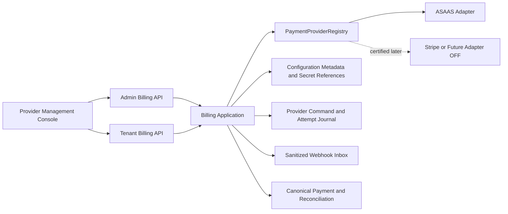
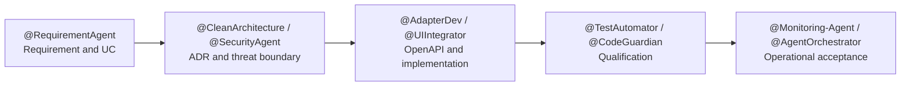
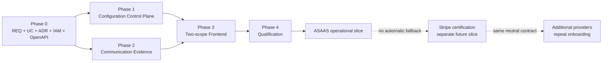

# TP-00039 — Gestão e observabilidade de provedores de pagamento

**Document ID:** `TP-00039`  
**Primary Nature:** `Plano`  
**Objective:** Coordenar a documentação e a implementação de uma superfície
provider-neutral para configurar provedores de pagamento e acompanhar comunicações,
transações e falhas de integração.  
**Scope:** Contratos documentais, backend e frontend dos escopos
`Configuração` e `Comunicações e Transações`, começando por ASAAS e preservando
extensibilidade controlada.  
**Non-objectives:** Recriar Billing comercial, implementar o adapter ASAAS,
certificar Stripe, escolher provider no browser/tenant, guardar segredo ou dado de
cartão, executar chamada externa ou habilitar ambiente por força deste plano.  
**Project:** SaaS Service — Contador Fiscal
**Date:** 2026-09-06  
**Version:** 1.5  
**Status:** In Progress — control plane, projeção, APIs e frontend repository-local
implementados; publishers upstream, E2E autenticado backend-real e certificação
externa permanecem pendentes/bloqueados  
**Owner:** Engenharia, Produto, Billing, Operações e Segurança  
**Author:** @AgentOrchestrator  
**Keywords:** billing, payment provider, ASAAS, Stripe, Conecta, configuração,
comunicações, transações, webhook, reconciliação, observabilidade  
**Code References:** implementação provider-neutral em
`backend/src/main/java/br/com/duoset/saas_service/contexts/billing/`, migration
`V83__create_payment_provider_console.sql`, rotas frontend
`/admin/conecta/payments` e `/billing/payment-provider-interactions`, services,
schemas e testes associados.  
**Principal Statement:** O TP-00039 coordena o console operacional
provider-neutral; o TP-00011 continua responsável pelo adapter e certificação
ASAAS, e o TP-00013 continua responsável pelos fatos financeiros canônicos.

**References:**  
[ADR-0023 — Integração agnóstica de provedores de pagamento](../../backend/docs/adrs/ADR-0023-agnostic-payment-provider-integration.md) ·
[ADR-0024 — Segurança e tokenização de cartão recorrente](../../backend/docs/adrs/ADR-0024-seguranca-tokenizacao-cartao-recorrente.md) ·
[ADR-0026 — Escopo tenant/admin das APIs de Billing](../../backend/docs/adrs/ADR-0026-billing-api-tenant-admin-cutover.md) ·
[ADR-0050 — RBAC, SoD e aprovações financeiras](../../backend/docs/adrs/ADR-0050-rbac-sod-aprovacoes-financeiras.md) ·
[ADR-0051 — SLO, capacidade e rollout de Billing](../../backend/docs/adrs/ADR-0051-slo-capacidade-rollout-billing.md) ·
[REQ-00042 — Billing enterprise multitenant](../../product/requirements/REQ-00042-enterprise-multitenant-billing-invoicing.md) ·
[UC-00042 — Payment, reconciliation and dunning](../../product/use-cases/UC-00042-billing-payment-reconciliation-dunning.md) ·
[TP-00011 — Primeiro release ASAAS](TP-00011-billing-asaas-first-release-task-plan.md) ·
[TP-00013 — Enterprise Billing](TP-00013-enterprise-billing-implementation-task-plan.md) ·
[TP-00035 — Gestão Super Admin unificada de Billing](TP-00035-super-admin-unified-billing-management.md) ·
[Documentação central ASAAS](https://central.ajuda.asaas.com/hc/pt-br/sections/32107364983451).

---

# 1. Overview

No baseline anterior não existia uma tela única para administrar provedores de
pagamento ou inspecionar a cadeia de comunicação financeira. Esta execução criou
o control plane, a projeção sanitizada, APIs e as duas experiências frontend como
capacidade coesa. Os publishers que alimentam a projeção a partir do command journal,
inbox e fatos financeiros continuam pertencendo aos TP-00011/TP-00013; portanto a
tela opera honestamente vazia/partial até receber evidência por seu port interno.

Por possuir objetivo, autorização, RBAC/MFA, handoffs e ciclo de evolução próprios,
esta capacidade recebe um plano separado. O primeiro slice apresenta o ASAAS; o
modelo também representa Stripe e providers futuros sem afirmar que estejam
certificados ou disponíveis. A execução possui cinco fases e 29 atividades. Os
contratos, cinco IPs e implementação repository-local foram materializados; não há
compromisso de calendário para publishers upstream, identidade E2E, Sandbox ou rollout.

## 1.1 Resultado da verificação de sobreposição

| Artefato existente | O que já possui | O que não deve ser duplicado pelo TP-00039 |
| --- | --- | --- |
| [TP-00011](TP-00011-billing-asaas-first-release-task-plan.md) | Adapter, configuração técnica, cobrança, webhook, reconciliação, certificação e cutover do primeiro release ASAAS. | O TP-00039 consome readiness e dados operacionais; não implementa nem certifica o adapter. |
| [TP-00013](TP-00013-enterprise-billing-implementation-task-plan.md) e `13.5` | Payment, allocation, reconciliation, dunning e fatos financeiros canônicos. | O console projeta esses fatos; não cria uma segunda verdade de pagamento ou saldo. |
| [IP-FE-13.5.1-billing-payment-reconciliation-dunning](../../frontend/docs/specs/IP-FE-13.5.1-billing-payment-reconciliation-dunning.md) | Experiência tenant-facing de recebíveis, pagamentos, reconciliação e cobrança. | A nova superfície administrativa reutiliza contratos/read models e preserva a projeção tenant existente. |
| [TP-00035](TP-00035-super-admin-unified-billing-management.md) | Catálogo, PriceVersion, contrato, rating e fatura no Super Admin. | Provider é non-objective desse plano; não será anexado ao catálogo/preço. |
| [ADR-0023](../../backend/docs/adrs/ADR-0023-agnostic-payment-provider-integration.md) | Seleção provider-neutral, ASAAS primário, Stripe contingencial, commands, inbox, reconciliação e observabilidade. | O TP-00039 materializa a operação sem redefinir domínio, seleção ou fallback. |

Conclusão: não há plano a ser simplesmente renomeado ou ampliado sem misturar
lifecycles. O TP-00039 é o coordenador da superfície operacional e mantém handoffs
explícitos com os planos acima.

## 1.2 Dois escopos funcionais da superfície

Os nomes abaixo foram formalizados pelo
[REQ-00056](../../product/requirements/REQ-00056-payment-provider-management-observability.md),
[UC-00053](../../product/use-cases/UC-00053-manage-payment-provider-configuration.md),
[UC-00054](../../product/use-cases/UC-00054-inspect-payment-provider-interactions.md) e
[ADR-0055](../../backend/docs/adrs/ADR-0055-payment-provider-operational-control-plane.md) e
materializados na experiência. “Aba” descreve a organização do console global;
a audiência tenant recebe rota dedicada e não enxerga o control plane.

| Escopo / aba | Objetivo | Conteúdo mínimo planejado | Ações condicionais | Limites obrigatórios herdados |
| --- | --- | --- | --- | --- |
| **Configuração** | Compreender e administrar o estado operacional de cada provider, conta e ambiente. | Provider code, papel primário/contingência/futuro, ambiente, merchant account alias opaco, capabilities, readiness, versão da configuração, saúde da referência de segredo, webhook e kill switches. | Habilitar, pausar, alterar configuração ou papel somente se o novo ADR autorizar uma fonte mutável e o ADR-0050 for satisfeito. | Nenhum valor de segredo; nenhuma escolha por tenant/browser; mudança não migra cobrança existente; ASAAS primeiro e demais `OFF`. |
| **Comunicações e Transações** | Reconstruir com segurança o que ocorreu entre Billing e o provider. | Command, tentativa outbound, resultado, webhook/inbox, evento normalizado, payment/collection, reconciliação, divergência, latência, correlation e audit IDs. | Reconsultar, reprocessar ou replay bounded somente quando o requisito classificar a ação como segura e autorizada. | Sem request/response/body/header bruto, PAN, CVV, token, stack trace ou retry cego; estado `UNKNOWN` exige reconciliação. |

## 1.3 Duas dimensões de acesso

As abas não eliminam a fronteira entre plataforma e tenant:

| Audiência | Configuração | Comunicações e Transações |
| --- | --- | --- |
| Plataforma / operador autorizado | Visão por provider, ambiente e merchant alias; comandos administrativos conforme authority, MFA e approval. | Visão agregada sanitizada; detalhe tenant-scoped somente após contexto válido; ações operacionais bounded. |
| Financeiro / reconciliação | Leitura de readiness necessário à operação; sem acesso a segredo. | Fatos financeiros, divergências, allocations e resolução conforme SoD. |
| Segurança / auditoria | Metadados de alteração, ator, approval e saúde de rotação. | Evidência sanitizada, negações, replay/reconcile e trilha imutável. |
| Tenant Billing Admin | Não escolhe provider nem edita merchant/secret/webhook; pode ver apenas completude do próprio payer/customer mapping quando o requisito aprovar. | Somente obrigações e interações do próprio tenant, sem visão cross-tenant ou payload proprietário. |

## 1.4 Decisões já fechadas e gates ainda necessários

| Tipo | Tema | Disposição |
| --- | --- | --- |
| Fechado | Provider inicial e extensibilidade | ASAAS é primário; Stripe é contingência desligada; providers futuros entram por adapters e certificação próprios. |
| Fechado | Seleção | Configuração da plataforma; não vem do frontend, header arbitrário ou parâmetro do tenant. |
| Fechado | Fallback | Não existe fallback automático entre providers, sobretudo após resultado ambíguo. |
| Fechado | Dados de cartão e segredos | Checkout hosted; PAN/CVV não transitam nem são guardados; segredo não entra em UI, API de negócio, log ou timeline. |
| Fechado | Segurança administrativa | Configurar/habilitar/trocar/pausar provider, merchant ou webhook exige controles do ADR-0050, incluindo MFA quando aplicável e maker-checker para efeitos classificados. |
| Fechado por ADR-0055 | `G39-01` Escopo da primeira Configuração | Control plane mutável repository-local, versionado e fail-closed; nenhuma revisão supera o kill switch externo. |
| Fechado por ADR-0055 | `G39-02` Fonte da verdade da configuração | Metadata canônica no control plane, CAS, hash/baseline, maker-checker, ApprovalSeal, rollback lógico e secret references opacas. |
| Fechado por UC-00053 e UC-00054 | `G39-03` Arquitetura de informação | `Conecta > Pagamentos` possui Configuração e Comunicações e Transações; tenant recebe rota Billing própria e não enxerga control plane. |
| Fechado por ADR-0055/REQ-00056 | `G39-04` Evidência operacional | Allowlist sem raw/cartão/segredo, thread/eventos append-only, retenção finita, purge fail-closed e métricas bounded. Export/legal hold operacional fica fora do slice. |
| Fechado por ADR-0055 | `G39-05` Ações operacionais | Console oferece configuração governada e refresh local; retry/replay/probe/reconcile remoto/provider switch ficam sem endpoint até contrato próprio. |
| Fechado por ADR-0055/UC-00053 | `G39-06` Mutação local e custódia do seal | `PAYMENT_PROVIDER_CONTROL_PLANE_MUTATIONS_ENABLED` nasce `OFF`; replay terminal precede o gate. Approval persiste `seal_key_id`/digest/binding, nunca seal raw/ciphertext, e a chave histórica permanece custodiada enquanto qualquer approval ou operação idempotente persistida puder referenciá-la. Ausência/drift falha com 503 e bloqueia rollout. |

---

# 2. Execution Tracking Matrix

> **Legend:** ⬜ Pending · 🔄 In Progress · ✅ Done · ⏸️ Blocked · ❌ Cancelled

## Phase 0 — Documentation, Decisions and Contracts

| # | Activity | Agent | Status | Notes |
| --- | --- | --- | :---: | --- |
| 0.1 | Auditar AS-IS e sobreposição com TP-00011, TP-00013, TP-00035 e IPs existentes | @AgentOrchestrator | ✅ | Conclusão na Section 1.1; baseline não possuía console integrado. |
| 0.2 | Criar e aprovar requisito específico da gestão operacional de providers | @RequirementAgent | ✅ | [REQ-00056](../../product/requirements/REQ-00056-payment-provider-management-observability.md) v1.8 especializa REQ-00042 sem redefini-lo. |
| 0.3 | Criar caso de uso, jornadas, wireframes e arquitetura de informação dos dois escopos | @RequirementAgent + @WebDesigner | ✅ | [UC-00053](../../product/use-cases/UC-00053-manage-payment-provider-configuration.md) e [UC-00054](../../product/use-cases/UC-00054-inspect-payment-provider-interactions.md) fecham jornadas/admin/tenant e estados. |
| 0.4 | Emendar ADR-0023 ou criar ADR do control plane mutável | @CleanArchitecture + @SecurityAgent | ✅ | [ADR-0055](../../backend/docs/adrs/ADR-0055-payment-provider-operational-control-plane.md) Accepted fecha fonte, mutabilidade e externalidade. |
| 0.5 | Congelar matriz de authorities, MFA, SoD, ApprovalSeal e contexto tenant | @SecurityOAuth + @SecurityAgent | ✅ | Seis authorities finas declaradas; role isolada não autoriza, grants reais não foram atribuídos. |
| 0.6 | Congelar contrato de minimização, retenção, purge e exportação de evidência | @ComplianceAgent + @ObservabilityDev | ✅ | Allowlist, thread/evento, 30–365 dias, legal hold fail-closed e zero raw/cartão/segredo. |
| 0.7 | Congelar OpenAPI/read models, reservar IPs filhos e estimar execução | @AgentOrchestrator + @AdapterDev + @UIIntegrator | ✅ | OpenAPI v1.7.0 e cinco IPs criados/indexados antes do software transversal. |

## Phase 1 — Provider Configuration Control Plane

| # | Activity | Agent | Status | Notes |
| --- | --- | --- | :---: | --- |
| 1.1 | Modelar registration, role, environment, merchant alias, capability e readiness provider-neutral | @DomainExpert | ✅ | Records/enums neutros; domínio/application não importam ASAAS/Stripe. |
| 1.2 | Materializar configuração metadata versionada e fail-closed | @Data-Agent + @AdapterDev | ✅ | Migration V83, revisões, pointers, decisões, operações e stores sem secret value. |
| 1.3 | Integrar secret references, rotação e health metadata | @AdapterDev + @SecurityAgent | ✅ | Referências seguem gramática/catálogo fechado; health adapter local falha fechado. |
| 1.4 | Implementar queries e commands administrativos idempotentes | @AdapterDev | ✅ | APIs ADR-0026 com CAS, hash, ETag, no-store, idempotência e RFC 9457. |
| 1.5 | Aplicar autorização, MFA, approval, auditoria e concorrência | @SecurityOAuth + @ImplementerCore | ✅ | Guards server-side, identidade humana nas mutações, SoD, ApprovalSeal HMAC e audit independente. |
| 1.6 | Projetar ASAAS como primeiro profile e providers não certificados como `OFF` | @AdapterDev | ✅ | ASAAS PRIMARY/SANDBOX e Stripe CONTINGENCY são perfis locais; ambos sem execução/certificação externa. |

## Phase 2 — Communication and Transaction Evidence

| # | Activity | Agent | Status | Notes |
| --- | --- | --- | :---: | --- |
| 2.1 | Modelar tentativas append-only e correlação ponta a ponta | @DomainExpert + @Data-Agent | ✅ | Thread estável, evento imutável, effective monotônico, `arrivalSequence`, duplicate/reorder e zero raw. |
| 2.2 | Construir projeção de commands e outcomes | @ImplementerCore | 🔄 | Recorder/projetor neutro está pronto; publisher durável do journal é handoff TP-00011/TP-00013. |
| 2.3 | Construir projeção de webhook inbox, quarentena e DLQ sanitizadas | @AdapterDev + @Data-Agent | ⏸️ | Schema/port aceitam quarentena mínima; publisher depende do [IP-BE-11.2.3-asaas-webhook-durable-inbox](../../backend/docs/specs/IP-BE-11.2.3-asaas-webhook-durable-inbox.md) ainda não entregue. |
| 2.4 | Correlacionar evento normalizado, cobrança, payment, allocation e reconciliation case | @ImplementerCore | ⏸️ | IDs e timeline estão prontos; publishers dependem dos fatos canônicos UC-00042/TP-00013. |
| 2.5 | Implementar consultas, detalhes e ações operacionais bounded | @AdapterDev + @SecurityOAuth | ✅ | Summary/list/detail admin e list/detail tenant; somente leitura/refresh, sem mutação externa. |
| 2.6 | Instrumentar métricas, alertas, auditoria, retenção e purge | @ObservabilityDev + @Monitoring-Agent | 🔄 | Métricas allowlisted, audit e purge fail-closed implementados; alertas/runbook ambiental aguardam rollout. |

## Phase 3 — Frontend: Two-scope Console

| # | Activity | Agent | Status | Notes |
| --- | --- | --- | :---: | --- |
| 3.1 | Implementar shell, navegação e guards da superfície | @FrontendWeb | ✅ | Rotas/menu `Conecta > Pagamentos`, boundaries e guards globais/tenant. |
| 3.2 | Implementar o escopo `Configuração` | @FrontendWeb + @UIIntegrator | ✅ | Catálogo, detalhe, readiness, capabilities, diff e workflow sem material secreto. |
| 3.3 | Implementar `Comunicações e Transações` | @FrontendWeb + @UIIntegrator | ✅ | Summary, lista e timeline sanitizadas, paginadas e server-authoritative. |
| 3.4 | Implementar filtros, detalhe correlacionado e estados operacionais | @FrontendWeb | ✅ | URL state e estados loading/empty/stale/partial/forbidden/conflict/pending/error. |
| 3.5 | Integrar a projeção tenant-scoped sem expor control plane | @UIIntegrator + @SecurityOAuth | ✅ | Rota tenant própria, contexto Billing/purpose, DTO minimizado e BOLA-safe. |

## Phase 4 — Qualification and Controlled Release

| # | Activity | Agent | Status | Notes |
| --- | --- | --- | :---: | --- |
| 4.1 | Executar testes backend, migrations e contract suite provider-neutral | @TestAutomator + @CodeGuardian | 🔄 | Focal pós-regressão `93/93`; suíte ampla sem cinco classes Docker selecionou `2.797` testes, com zero falha/erro e `133` skips. A migration V83 em PostgreSQL real permanece `3/3 skipped` por indisponibilidade de `/var/run/docker.sock`. |
| 4.2 | Executar gates BOLA, RBAC, MFA, SoD, redaction e privacy | @SecurityAgent + @ComplianceAgent | 🔄 | Parecer local encontrou zero blocker reproduzível; HTTP/IAM, seal, BOLA, métricas e scans de artifacts passaram. DB, inbox/DLQ reais, traces e scan multi-sink ambiental completo ainda não foram provados. |
| 4.3 | Executar testes frontend, a11y e E2E backend-real | @TestAutomator + @FrontendWeb | 🔄 | Vitest focal `84/84`, suíte completa `187 arquivos/1.163 testes`, TypeScript, lint e build de 52 páginas passaram; os quatro cenários Playwright TP-00039 foram pulados sem stack/identidades autenticadas. |
| 4.4 | Certificar a jornada ASAAS em Sandbox autorizado | @AdapterDev + @TestAutomator | ⏸️ | Depende de TP-00011, merchant/capabilities/PCI e autorização externa específica. |
| 4.5 | Ensaiar kill switch/rollback, obter aceite e registrar onboarding futuro | @AgentOrchestrator + @Monitoring-Agent | ⬜ | Novas mutações pausam sem desligar webhook/reconcile/recovery; Stripe requer certificação própria. |

## Summary

| Phase | Total Activities | ⬜ Pending | 🔄 In Progress | ✅ Done | ⏸️ Blocked | Progress |
| --- | :---: | :---: | :---: | :---: | :---: | ---: |
| **Phase 0 — Documentation and Contracts** | 7 | 0 | 0 | 7 | 0 | 100% |
| **Phase 1 — Configuration Control Plane** | 6 | 0 | 0 | 6 | 0 | 100% |
| **Phase 2 — Communication Evidence** | 6 | 0 | 2 | 2 | 2 | 33% |
| **Phase 3 — Frontend Console** | 5 | 0 | 0 | 5 | 0 | 100% |
| **Phase 4 — Qualification** | 5 | 1 | 3 | 0 | 1 | 0% |
| **TOTAL** | **29** | **1** | **5** | **20** | **3** | **69%** |

---

# 3. Context and Constraints

## 3.1 Baseline AS-IS verified before implementation

- Não existe rota, menu ou página frontend de gestão de provedores de pagamento.
- Não existe API administrativa para provider, merchant, credential reference,
  capability, readiness, teste de conexão ou inspeção financeira correlacionada.
- `PaymentProviderPort` e `PaymentProviderRegistry` oferecem uma fundação neutra,
  mas a execução permanece deliberadamente desabilitada e fail-closed.
- A migration `V5__create_provider_command_journal.sql` materializa o journal
  tenant-scoped, mas ainda não há executor, inbox, reconciler ou consulta
  operacional completa.
- O `StripePaymentAdapter` legado é parcial/simulado e não constitui contingência
  certificada.
- Logs genéricos de observabilidade não são uma fonte de verdade financeira nem
  substituem a timeline sanitizada.

### 3.1.1 Current repository-local delta

- Existem rotas globais `/admin/conecta/payments` e tenant
  `/billing/payment-provider-interactions`, conectadas a services HTTP reais e sem
  fallback MSW em runtime.
- Existem APIs admin/tenant, domínio, control plane JDBC, projeção append-only,
  audit, métricas, retenção/purge e migration V83; o código não possui cliente HTTP
  de ASAAS/Stripe nem valor de segredo.
- O port interno de gravação aceita evidência sanitizada e os reads chegam ao
  frontend; publishers do journal, inbox e fatos financeiros ainda são handoffs
  explícitos, de modo que o runtime local não fabrica transações.
- ASAAS e Stripe aparecem somente como registrations locais fail-closed. IAM
  declara/scopa authorities, sem conceder roles/composites reais por este plano.

## 3.2 Architectural, financial and security invariants

1. Billing é autoridade de invoice, obligation, payment, allocation, saldo,
   reconciliation e efeitos de acesso; provider apenas executa/informa fatos.
2. O console lê e aciona casos de uso canônicos; não grava estado financeiro
   diretamente nem deriva “pago” de redirect, checkout ou status proprietário.
3. Configuração de provider é platform-scoped. Roteamento por tenant/produto exige
   requisito e decisão futuros; não entra incidentalmente neste plano.
4. Toda mutação externa segue persist-before-call e idempotência. Resultado
   ambíguo permanece `UNKNOWN` até consulta/reconciliação.
   Nas mutações do control plane, replay exato usa namespace
   ator/operação/digest da key e fence transacional bounded: overlap relê e
   reproduz a resposta terminal original sem segundo efeito/evento/seal;
   divergência de payload/provider retorna `409`, e timeout pré-terminal retorna
   `503` com `Retry-After` sem resultado fabricado.
5. Troca de provider não reenvia mutação ambígua e não altera provider de uma
   cobrança já criada. Ingress/reconcile do provider anterior continua ativo.
6. Valores de API key, token/secret de webhook, assinatura, bearer token, PAN,
   CVV, validade, portador, `creditCardToken` e payload bruto nunca entram em
   domínio, banco de negócio, API operacional, navegador, log, trace, audit,
   quarentena, DLQ, export ou replay.
7. IDs externos são opacos e minimizados; métricas evitam tenant e identificadores
   de alta cardinalidade em labels.
8. Suspensão financeira pode parar novas ações do business plane, mas nunca o
   recovery plane: Billing, checkout, webhook, inbox, reconciliação, regularização,
   auditoria e suporte continuam acessíveis conforme policy.
9. A superfície administrativa exige sessão autenticada, boundary global sem
   impersonação e a authority fina correspondente. `ROLE_SUPER_ADMIN` isolada não
   autoriza e também não é requisito cumulativo; contexto tenant, MFA, purpose,
   ApprovalSeal e maker-checker continuam obrigatórios quando aplicáveis.
10. O status visual de Stripe/provider futuro deve comunicar `NOT_CERTIFIED/OFF`;
    presença no catálogo da UI não prova disponibilidade.

## 3.3 Roles / capability families

Este plano não cria nomes finais de roles. A atividade `0.5` deriva authorities
finas das famílias do ADR-0050:

| Capability family | Uso neste plano | Controle mínimo |
| --- | --- | --- |
| Provider configuration read | Consultar registration, capabilities e readiness. | Scope de plataforma, auditoria e redaction. |
| Provider operate | Habilitar/pausar, alterar merchant/webhook ou executar comando operacional. | Authority específica, MFA e, quando aplicável, maker-checker/ApprovalSeal. |
| Collection read/reconcile | Consultar timeline e convergir fatos já observados. | Tenant/purpose scope, idempotência e auditoria. |
| Replay/reprocess | Reprocessar envelope/command já persistido sem inventar nova mutação. | Ação bounded, reason, MFA/approval conforme risco e dedupe. |
| Tenant billing read | Consultar fatos do próprio tenant. | Tenant resolvido server-side e BOLA fail-closed. |
| Audit/compliance read | Consultar evidência sanitizada e histórico de decisão. | Least privilege, retenção e export policy. |

## 3.4 Bounded Contexts / Modules

| Module | Owner / source | Responsibility in TP-00039 |
| --- | --- | --- |
| Billing domain/application | TP-00013 / UC-00042 | Fatos canônicos e casos de uso; sem tipos de provider. |
| Provider adapters | TP-00011 / ADR-0023 | Executar e normalizar integrações; ASAAS primeiro. |
| Configuration control plane | TP-00039 | Metadata/readiness e comandos administrativos governados; sem segredo. |
| Operational evidence projection | TP-00039 | Correlacionar journal, attempts, inbox, fatos e reconciliação sanitizados. |
| Frontend console | TP-00039 | Duas abas/escopos e projeções por audiência. |
| Catalog/contracts/invoices admin | TP-00035 / TP-00013 | Continua separado; apenas links autorizados para entidades relacionadas. |

---

# 4. Phase Details

## Phase 0 — Documentation, Decisions and Contracts

> Objective: transformar a intenção de produto em requisito, caso de uso, decisão
> de control plane, contrato de segurança e OpenAPI antes de editar software.

| # | Activity | Agent | Dep. | Deliverable |
| --- | --- | --- | --- | --- |
| 0.1 | Auditoria AS-IS/overlap | @AgentOrchestrator | — | Matriz da Section 1.1 |
| 0.2 | Requisito específico | @RequirementAgent | 0.1 | REQ aprovado, FR/BR/NFR/AC e non-objectives |
| 0.3 | Caso de uso e UX | @RequirementAgent + @WebDesigner | 0.2 | Atores, fluxos, exceções, wireframes e IA |
| 0.4 | Decisão de control plane | @CleanArchitecture + @SecurityAgent | 0.2–0.3 | ADR aceito/emenda aceita e migration/cutover boundary |
| 0.5 | Matriz de acesso | @SecurityOAuth + @SecurityAgent | 0.2, 0.4 | Verbo × scope × MFA × approval × audit |
| 0.6 | Governança de evidência | @ComplianceAgent + @ObservabilityDev | 0.2–0.4 | Allowlist, retention, purge e export contract |
| 0.7 | Contratos e decomposição | @AgentOrchestrator + @AdapterDev + @UIIntegrator | 0.3–0.6 | OpenAPI, schemas, cinco IPs e sizing |

**Acceptance Criteria:**

- O requisito diferencia provider configuration, evidência técnica e fato
  financeiro; nenhum deles vira sinônimo.
- A opção read-only ou mutável e sua fonte de verdade estão explicitamente
  decididas; ausência da decisão mantém commands administrativos `OFF`.
- A matriz separa plataforma, operador financeiro, auditor e tenant.
- OpenAPI usa namespaces do ADR-0026, paginação, filtros bounded, RFC 9457,
  `Cache-Control: no-store` e nenhum DTO proprietário ou secreto.
- Os cinco implementation plans da Section 11 são criados e indexados antes de
  qualquer mudança transversal de software.

## Phase 1 — Provider Configuration Control Plane

> Objective: expor e, se autorizado, administrar configuração/readiness
> provider-neutral com versionamento, auditoria e falha fechada.

| # | Activity | Agent | Dep. | Deliverable |
| --- | --- | --- | --- | --- |
| 1.1 | Modelo canônico | @DomainExpert | 0.4, 0.7 | Registration/capability/readiness contracts |
| 1.2 | Persistência metadata | @Data-Agent + @AdapterDev | 1.1 | Migration aditiva e repository |
| 1.3 | Secret-reference boundary | @AdapterDev + @SecurityAgent | 1.1 | Port e health projection sem valor |
| 1.4 | API admin | @AdapterDev | 1.2–1.3 | Queries/commands idempotentes |
| 1.5 | IAM/audit/concurrency | @SecurityOAuth + @ImplementerCore | 0.5, 1.4 | Guards, approval e expectedVersion |
| 1.6 | Provider profiles | @AdapterDev | 1.4–1.5, TP-00011 | ASAAS observado; demais `OFF` |

**Acceptance Criteria:**

- Habilitar provider sem configuração/capability/readiness obrigatória falha
  fechado antes de uma chamada externa.
- API e UI nunca recebem secret value; rotação é representada somente por estado,
  versão, timestamps e referência opaca autorizada.
- Escritas concorrentes exigem expected version e geram audit before/after
  sanitizado, sem sobrescrita silenciosa.
- Replay exato, inclusive concorrente, preserva status, body/snapshot,
  `ETag`/`Location`, correlation ID e timestamps originais sem novo efeito;
  payload/provider divergente conflita e fence indisponível pré-terminal retorna
  `503` + `Retry-After`.
- Mudança de role/primary afeta apenas novas operações elegíveis e nunca promove
  fallback automático.
- O primeiro slice não cria provider routing por tenant.

## Phase 2 — Communication and Transaction Evidence

> Objective: produzir uma timeline financeira operacional correlacionável,
> append-only e sanitizada, sem transformar logs genéricos em autoridade.

| # | Activity | Agent | Dep. | Deliverable |
| --- | --- | --- | --- | --- |
| 2.1 | Attempts e correlation model | @DomainExpert + @Data-Agent | 0.6–0.7 | Schema/event model append-only |
| 2.2 | Command projection | @ImplementerCore | 2.1, TP-00013 F0 | Read model de commands/outcomes |
| 2.3 | Webhook projection | @AdapterDev + @Data-Agent | 2.1, IP-BE-11.2.3-asaas-webhook-durable-inbox | Inbox/quarantine/DLQ read model |
| 2.4 | Financial correlation | @ImplementerCore | 2.2–2.3, UC-00042 | Timeline até payment/allocation/reconcile |
| 2.5 | Operational API/actions | @AdapterDev + @SecurityOAuth | 0.5, 2.2–2.4 | List/detail e actions allowlisted |
| 2.6 | Telemetry and lifecycle | @ObservabilityDev + @Monitoring-Agent | 0.6, 2.5 | Metrics, alerts, retention/purge evidence |

**Acceptance Criteria:**

- Um operador reconstrói `invoice -> command -> attempts -> provider reference ->
  webhook/query -> normalized event -> payment/allocation -> reconciliation` por
  IDs canônicos e opacos.
- Timeout-after-send aparece como `UNKNOWN`; a interface não oferece retry cego
  nem troca automática de provider.
- Evento duplicado ou fora de ordem é visível sem duplicar/regredir efeito.
- Quarentena pré-tenant nunca escolhe datasource default nem expõe body bruto.
- Replay/reprocessamento aponta para o artefato original, usa dedupe, reason e
  trilha de auditoria; não permite editar payload.
- Retenção/purge/export seguem o contrato aprovado e preservam evidência mínima
  exigida sem retenção ilimitada por omissão.

## Phase 3 — Frontend: Two-scope Console

> Objective: tornar configuração e operação compreensíveis sem transferir
> autoridade financeira, segredo ou decisão de provider ao navegador.

| # | Activity | Agent | Dep. | Deliverable |
| --- | --- | --- | --- | --- |
| 3.1 | Shell e navegação | @FrontendWeb | 0.3, 0.5, 0.7 | Route/menu/guards |
| 3.2 | Configuração | @FrontendWeb + @UIIntegrator | Phase 1 | Cards/form/readiness/actions |
| 3.3 | Comunicações e Transações | @FrontendWeb + @UIIntegrator | Phase 2 | Grid/timeline/detail |
| 3.4 | Operação detalhada | @FrontendWeb | 3.2–3.3 | Filtros, pagination e correlation |
| 3.5 | Projeção tenant | @UIIntegrator + @SecurityOAuth | 3.3–3.4, IP-FE-13.5.1-billing-payment-reconciliation-dunning | Visão própria sem control plane |

**Acceptance Criteria:**

- Navegação, heading, tabs e ações refletem permissions efetivas e continuam
  protegidos server-side; esconder botão não é autorização.
- A aba Configuração distingue `ACTIVE`, `PAUSED`, `OFF`,
  `NOT_CERTIFIED`, `DEGRADED` e `MISCONFIGURED` conforme contrato, sem inventar
  disponibilidade.
- A aba operacional pagina no servidor e preserva filtros na URL; nenhum payload
  bruto, secret ou dado de cartão entra no DOM, state, cache ou analytics.
- `202` de submit permanece `PENDING_APPROVAL` até decisão humana e admite somente
  refresh explícito; reject da proposta e activate bem-sucedidos retornam `200`;
  `409` força refresh de versão; `401/403`,
  vazio, stale, timeout e falha parcial possuem estados explícitos.
- A experiência é responsiva, acessível por teclado/leitor de tela e coberta por
  i18n pt-BR conforme os standards do frontend.

## Phase 4 — Qualification and Controlled Release

> Objective: provar isolamento, integridade, segurança e operabilidade antes de
> qualquer ativação externa.

| # | Activity | Agent | Dep. | Deliverable |
| --- | --- | --- | --- | --- |
| 4.1 | Backend/DB/contracts | @TestAutomator + @CodeGuardian | Phases 1–2 | Test evidence bundle |
| 4.2 | Security/privacy | @SecurityAgent + @ComplianceAgent | 4.1 | Negative and redaction evidence |
| 4.3 | Frontend/backend-real | @TestAutomator + @FrontendWeb | Phase 3, 4.1–4.2 | Component/a11y/E2E evidence |
| 4.4 | ASAAS Sandbox | @AdapterDev + @TestAutomator | TP-00011, 4.1–4.3 | Authorized certification evidence |
| 4.5 | Operational acceptance | @AgentOrchestrator + @Monitoring-Agent | 4.4 | Drill, runbook, approvals and handoff |

**Acceptance Criteria:**

- Contract suite é executada para cada adapter certificado; provider registrado
  porém não certificado permanece `OFF`.
- Testes BOLA A→B, authority, purpose, MFA, maker-checker, optimistic concurrency
  e no-store falham fechado.
- Sentinelas provam ausência de PAN, CVV, validade, portador, token de cartão,
  API key, webhook secret/token e body bruto em API, banco, log, trace, inbox,
  quarentena, DLQ, export e frontend.
- Playwright backend-real valida as duas abas sem usar MSW como evidência
  integrada.
- Kill switch pausa novas mutações, mas preserva webhooks, inbox, reconcile,
  regularização e recovery.
- O drill comprova `PAYMENT_PROVIDER_CONTROL_PLANE_MUTATIONS_ENABLED=OFF` por
  default, replay terminal anterior ao gate e `422` sem write/efeito para uma
  intenção nova; execution e purge continuam flags independentes.
- O rollout permanece bloqueado até existir custódia e remoção segura das chaves
  de seal históricas: `seal_key_id`/digest/binding persistidos, reemissão
  determinística sem raw/ciphertext e retenção enquanto qualquer approval ou
  operação idempotente persistida puder referenciar a chave. O journal atual não
  possui TTL; chave ausente ou divergente retorna `503` fail-closed.
- Sandbox ASAAS e qualquer ambiente externo exigem autorização específica; este
  documento não a concede.

---

# 5. Agent Chain per Workstream

1. **@RequirementAgent / @WebDesigner** — formalizam atores, comportamentos,
   exceções, duas abas e estados observáveis.
2. **@CleanArchitecture / @SecurityAgent** — congelam autoridade de configuração,
   boundaries, threat model e redaction.
3. **@AdapterDev / @ImplementerCore / @Data-Agent** — implementam control plane e
   evidência operacional sem duplicar adapters/fatos.
4. **@FrontendWeb / @UIIntegrator** — derivam UI do OpenAPI e das permissions.
5. **@TestAutomator / @CodeGuardian** — qualificam contratos, regressão e
   segurança.
6. **@ObservabilityDev / @Monitoring-Agent** — materializam métricas, alertas e
   runbooks.
7. **@AgentOrchestrator** — valida gates, dependências, evidências e handoffs.

---

# 6. Dependency Diagram

TP-00011 entrega o adapter/certificação ASAAS para `C`, `E` e `Q`. TP-00013
entrega fatos financeiros/read models para `E`. Nenhuma seta autoriza chamada
externa ou implica fallback.

---

# 7. Agent Responsibility Matrix

| Agent | Phase 0 | Phase 1 | Phase 2 | Phase 3 | Phase 4 |
| --- | --- | --- | --- | --- | --- |
| @AgentOrchestrator | Ownership e decomposição | Coordenação | Handoffs | Coordenação | Aceite |
| @RequirementAgent / @WebDesigner | REQ, UC, IA e UX | Review | Review | Critérios | Aceite funcional |
| @CleanArchitecture / @DomainExpert | ADR e boundaries | Modelo neutro | Correlação | Review | Arquitetura |
| @AdapterDev / @ImplementerCore | OpenAPI | Backend control plane | Backend operacional | Suporte | Sandbox/runbook |
| @Data-Agent | Data contract | Config metadata | Attempts/projections | — | Migration evidence |
| @SecurityOAuth / @SecurityAgent | IAM/threat model | Enforcement | Actions seguras | Guards | Testes negativos |
| @ComplianceAgent | Data policy | Review | Retention/export | Review | Privacy evidence |
| @FrontendWeb / @UIIntegrator | Wireframe/contract | Handoff | Handoff | Duas abas | UI/E2E |
| @ObservabilityDev / @Monitoring-Agent | Evidence contract | Readiness | Metrics/alerts | Telemetry UI | Drills |
| @TestAutomator / @CodeGuardian | Test map | Tests | Tests | Tests | Gates/review |

---

# 8. Coordination Rules (@AgentOrchestrator)

1. **Sequencing:** software do TP-00039 só inicia após `0.2–0.7` concluídos,
   plano aprovado e autorização explícita; a autorização local do TP-00013 não é
   herdada.
2. **Cross-plan ownership:** TP-00011 possui adapters/certificação/cutover;
   TP-00013 possui verdade financeira; TP-00035 possui catálogo/contrato/fatura;
   TP-00039 possui o control plane e a projeção operacional.
3. **Parallelism:** depois do OpenAPI, Phase 1 e o modelo append-only de Phase 2
   podem avançar em paralelo; frontend só integra contratos estabilizados.
4. **Provider gate:** ASAAS é o único provider do primeiro slice. Stripe e
   providers futuros podem aparecer como `OFF/NOT_CERTIFIED`, sem adapter,
   credencial, tráfego ou promessa operacional.
5. **Mutation gate:** `G39-01/G39-02` autorizam o código repository-local, mas
   `PAYMENT_PROVIDER_CONTROL_PLANE_MUTATIONS_ENABLED` permanece `OFF` por default.
   Replay terminal é lido antes da flag; intenção nova recebe 422 sem write,
   efeito, evento ou seal. Habilitar ambiente continua fora deste plano.
6. **Financial integrity gate:** nenhuma ação da UI altera payment/allocation,
   repete command `UNKNOWN` ou muda provider sem o caso de uso canônico e as
   provas exigidas pelo ADR-0023.
7. **Security gate:** autoridade server-side, tenant/purpose scope, MFA, SoD,
   approval, no-store, redaction e audit são critérios de entrada, não hardening
   posterior.
8. **Evidence gate:** log genérico, resposta raw do provider, screenshot isolado,
   mock ou cadastro visual não comprovam reconciliação nem integração.
9. **Environment gate:** credencial, chamada externa, Sandbox, piloto e produção
   requerem autorização separada e nunca são inferidos deste plano.
10. **Documentation gate:** requisito, caso de uso e ADR permanecem fontes
    superiores; o TP coordena e não cria silenciosamente regra ou comportamento.

---

# 9. Verification

## Automated Tests

- `./infra/scripts/validate-docs.sh` — contrato documental, IDs, links e índices.
- `./backend/mvnw -f backend/pom.xml -Dtest='<focused-tests>' test` — domínio,
  application, web, IAM e redaction focalizados; nomes serão fechados nos IPs.
- Testes PostgreSQL/Testcontainers — instalação limpa, upgrade, constraints,
  paginação, concorrência e isolamento tenant.
- ArchUnit/Spring Modulith — domínio/application não importam SDK, DTO ou adapter
  ASAAS/Stripe e nenhum módulo contorna `BillingApi`.
- Contract suite `PaymentProviderPort` — mesmas invariantes para cada provider
  certificado.
- `npm --prefix frontend test`, `npm --prefix frontend run lint` e
  `npm --prefix frontend run build` — componentes, schema, guards e regressão.
- `npm --prefix frontend run test:e2e:backend-real` — jornada autenticada das duas
  abas sem MSW como substituto de integração.
- Scanner de artefatos/PII — sentinelas de segredo, PAN/CVV/token/payload em
  screenshots, traces e relatórios E2E.

Os comandos focalizados exatos e o perfil PostgreSQL serão congelados nos
implementation plans; produção, dados reais e segredos reais permanecem proibidos.

## Evidence captured on 2026-09-06

| Gate | Resultado observado | Limite preservado |
| --- | --- | --- |
| Backend focal e regressões | `93/93`, zero falha/erro/skip; os regressivos de composição, naming ArchUnit, IAM e semântica tenant `403/503` foram corrigidos. | Não substitui PostgreSQL real. |
| Backend amplo sem as cinco classes Docker inviáveis | `2.797` testes, zero falha/erro, `133` skips, `BUILD SUCCESS`. | Exclusões e skips estão explícitos; a execução canônica continua bloqueada pelo Docker deste host. |
| PostgreSQL TP-00039 | `PaymentProviderConsoleMigrationPostgresTest`: `3/3 skipped`, inclusive após tentativa com elevação, porque `/var/run/docker.sock` permaneceu sem acesso. | Migration V83 não recebe status `PASS` em PostgreSQL. |
| Frontend | Focal `84/84`; full Vitest `187 arquivos/1.163 testes`; TypeScript, lint sem erros e build de 52 páginas passaram. | Lint manteve 52 warnings preexistentes; backend-real não foi promovido por testes de componente. |
| OpenAPI, IAM, documentos e empacotamento local | YAML sem chaves duplicadas, `355` referências resolvidas, três gates IAM verdes, documentação `739 Markdown/720 indexados` válida e Compose renderizado com valores fictícios. | Nenhuma role foi concedida e nenhum container/provider foi iniciado. |
| E2E e privacidade de artifacts | Scans de `test-results` e `playwright-report` passaram; os quatro cenários TP-00039 ficaram skipped sem stack/identidades. | Backend-real autenticado segue `NOT RUN`; sem screenshot/mock como prova financeira. |
| Segurança | Revisão final: zero blocker repository-local reproduzível, inclusive BOLA, MFA/SoD, ApprovalSeal, redaction e outage `403` legado versus `503` TP-00039. | Purge, keyring e encoded-path hardening continuam gates/follow-ups registrados. |
| Externalidade | Nenhum segredo real, chamada ASAAS/Stripe, Sandbox, HML, produção ou Git foi usado. | Adapter, certificação e rollout continuam fora desta execução. |

## Manual Verification

- Confirmar que ASAAS aparece como primário somente quando readiness/certificação
  o suportarem e que Stripe/futuros aparecem explicitamente indisponíveis.
- Percorrer um command bem-sucedido, rejeitado e `UNKNOWN` até webhook/query,
  payment/allocation e reconciliation case.
- Simular evento duplicado, fora de ordem, assinatura inválida e referência
  pré-tenant desconhecida; conferir dedupe/quarentena sem vazamento.
- Exercitar MFA, maker-checker, versão concorrente, acesso cross-tenant negado e
  auditoria de uma ação administrativa.
- Pausar novas mutações e comprovar que webhook, inbox, reconciliação, checkout de
  regularização e recovery continuam funcionais.
- Verificar estados de carregamento, vazio, stale, falha parcial, 401/403, 409,
  422 somente no control plane, 503 e timeout nas duas abas em desktop e mobile.
  Rate limiting/429 não pertence ao contrato V1 e exige slice futuro explícito.

---

# 10. Risks and Mitigations

| Risk | Impact | Mitigation / gate |
| --- | --- | --- |
| Console virar segunda fonte de verdade financeira | Saldo/pagamento divergentes | Somente projections e casos de uso do TP-00013; sem update direto. |
| UI permitir selecionar provider por cobrança/tenant | Quebra ADR-0023 e risco de dupla cobrança | Platform configuration, APIs sem selector arbitrário e testes negativos. |
| Expor secrets ou dado de cartão para “debug” | Incidente de segurança/PCI | Allowlist anterior à persistência, sentinelas e zero raw payload. |
| Confundir Stripe listado com fallback pronto | Promessa operacional falsa | Badge `OFF/NOT_CERTIFIED` e gate de certificação próprio. |
| Retry/replay duplicar cobrança | Perda financeira | Persist-before-call, logical key, `UNKNOWN` + reconcile e ações bounded. |
| Agregação Super Admin causar fan-out em tenants | Exaustão e quebra de isolamento | Projeção administrativa própria; detalhe com contexto tenant explícito. |
| Retenção indefinida da timeline | Excesso de dados e custo | Policy versionada de retention/purge/export antes do schema. |
| Kill switch parar recovery plane | Tenant incapaz de regularizar | Separar mutation plane de ingress/reconcile/payment/recovery e testar drill. |
| Chave histórica de ApprovalSeal ser removida enquanto ainda referenciada | Replay exato deixa de ser reproduzível ou induz resposta insegura | Persistir `seal_key_id`, reter a chave enquanto qualquer approval/journal idempotente a referenciar e retornar 503 fail-closed em ausência/drift; como o journal não possui TTL, não presumir janela curta para remoção. |
| Colisão do nome “Conecta” com integração fiscal | Navegação ambígua | `G39-03` fechado: usar `Conecta > Pagamentos`, breadcrumbs/heading próprios e manter a integração fiscal em rota e rótulo distintos. |

---

# 11. Implementation-plan Decomposition

Os cinco planos foram criados e indexados antes das edições transversais. Seus
checklists registram a implementação repository-local e separam dela os handoffs
upstream, a evidência backend-real e qualquer autorização ambiental:

| Implementation plan | Area | Scope | Depends on |
| --- | --- | --- | --- |
| [IP-BE-39.1.1-payment-provider-control-plane](../../backend/docs/specs/IP-BE-39.1.1-payment-provider-control-plane.md) | Backend | Modelo, persistência, secret refs, queries/commands, IAM e audit da Configuração. | REQ/UC, ADR-0055, OpenAPI |
| [IP-BE-39.2.1-provider-interaction-timeline](../../backend/docs/specs/IP-BE-39.2.1-provider-interaction-timeline.md) | Backend | Thread/eventos, recorder, correlação, consultas, freshness e lifecycle. | Data/redaction contract, TP-00011/TP-00013 |
| [IP-FE-39.3.1-payment-provider-console-configuration](../../frontend/docs/specs/IP-FE-39.3.1-payment-provider-console-configuration.md) | Frontend | Shell/route e aba Configuração provider-neutral. | IP-BE-39.1.1-payment-provider-control-plane / OpenAPI |
| [IP-FE-39.3.2-payment-provider-console-communications](../../frontend/docs/specs/IP-FE-39.3.2-payment-provider-console-communications.md) | Frontend | Aba Comunicações e Transações, timeline, filtros e detalhes admin/tenant. | IP-BE-39.2.1-provider-interaction-timeline / OpenAPI |
| [IP-BE-39.4.1-payment-provider-console-assurance](../../backend/docs/specs/IP-BE-39.4.1-payment-provider-console-assurance.md) | Cross-functional/backend index | Contract/security/DB/E2E/Sandbox/readiness e handoff operacional. | Quatro IPs anteriores e TP-00011 |

---

# 12. Change Log

| Version | Date | Author | Changes |
| --- | --- | --- | --- |
| 1.5 | 2026-09-06 | @AgentOrchestrator / fechamento de evidência local | Registra frontend full/lint/build, backend focal e amplo sem Docker, OpenAPI/IAM/Compose/scans, corrige os status da Fase 4 e preserva PostgreSQL, E2E autenticado, Sandbox e rollout como não provados. |
| 1.4 | 2026-09-06 | @AgentOrchestrator / hardening de contrato e evidência | Atualiza a baseline para REQ-00056 v1.8, UCs v1.8/v1.6 e OpenAPI v1.7.0; reconcilia status reais das 29 atividades, detalha o kill switch local default OFF, contrato HTTP/frontend estrito, custódia de `seal_key_id` sem TTL presumido e mantém PostgreSQL, E2E autenticado, Sandbox e rollout sem falsa conclusão. |
| 1.3 | 2026-09-06 | @AgentOrchestrator / revisão de concorrência e contrato | Atualiza a baseline para REQ-00056 v1.7/OpenAPI v1.6.2 e torna explícito o replay idempotente exato concorrente, com fence bounded, resposta terminal original, 409 para divergência e 503/Retry-After pré-terminal. |
| 1.2 | 2026-09-06 | @AgentOrchestrator / revisão de paridade | Alinha a superfície administrativa à authority fina em boundary global não impersonado, sem exigir cumulativamente `ROLE_SUPER_ADMIN`; normaliza `arrivalSequence` e separa submit 202, reject 200 e activate 200; preserva os gates tenant, MFA, purpose, SoD e approval. |
| 1.1 | 2026-09-06 | @AgentOrchestrator / implementação e revisão | Cria/aprova REQ, UCs, ADR, OpenAPI e cinco IPs; implementa control plane, projeção, APIs e frontend repository-local; registra publishers upstream, E2E autenticado, alertas/runbook, Sandbox e rollout como pendências explícitas, sem fabricar integração externa. |
| 1.0 | 2026-09-06 | @AgentOrchestrator | Cria o plano após auditoria de TP-00011, TP-00013, TP-00035 e IPs; separa Configuração de Comunicações e Transações, define ASAAS-first/multi-provider `OFF`, registra cinco gates documentais, 29 atividades e cinco IPs candidatos, sem iniciar software ou acesso externo. |
