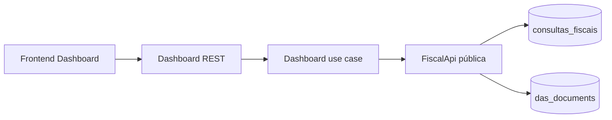
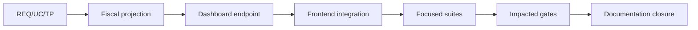

# TP-00040 — Visão fiscal do Dashboard tenant

**Document ID:** `TP-00040`  
**Primary Nature:** `Plano`  
**Objective:** Entregar gráfico fiscal de sete dias e Últimas Movimentações reais no Dashboard do escritório.  
**Scope:** `docs/`, módulos backend Dashboard/Fiscal, frontend Dashboard, migrations de índice se necessárias e testes.  
**Non-objectives:** Dashboard global, nova fonte de verdade, mudança nos fluxos fiscais, Keycloak/sessão/transporte, externalidades e deploy.  
**Project:** SaaS Service — Contador Fiscal
**Date:** 2026-09-06  
**Version:** 1.3  
**Status:** In Progress — implementação repository-local concluída; Assurance PR bloqueado por controles preexistentes  
**Owner:** Engenharia, Produto, Fiscal e Qualidade  
**Author:** @AgentOrchestrator  
**Keywords:** dashboard, tenant, situação fiscal, DAS, sete dias, movimentações  
**Code References:** endpoint `GET /api/v1/dashboard/fiscal-overview`, API pública Fiscal, controller/use case Dashboard e widgets/frontend.  
**Principal Statement:** O backend possui o recorte temporal, a agregação e o escopo tenant; o frontend possui apenas a representação acessível e responsiva.

**References:**  
[REQ-00057 — Visão fiscal do Dashboard do escritório](../../product/requirements/REQ-00057-tenant-dashboard-fiscal-overview.md) ·
[UC-00001 — Dashboard](../../product/use-cases/UC-00001-dashboard-view.md) ·
[UC-00021 — Histórico Situação Fiscal](../../product/use-cases/UC-00021-serpro-conecta-grid.md) ·
[UC-00023 — Histórico DAS](../../product/use-cases/UC-00023-frontend-das-cobranca.md) ·
[ADR-0005 — Multitenancy](../../backend/docs/adrs/ADR-0005-multi-tenancy-architecture.md) ·
[ADR-0013 — Arquitetura e contexto tenant no frontend](../../frontend/docs/adrs/ADR-0013-frontend-architecture-state-management.md) ·
[RPT-0004 — Cibersegurança frontend/backend](../reports/RPT-0004-frontend-backend-cibersecurity.md) ·
[TP-00002 — Frontend Next.js](TP-00002-frontend-nextjs-task-plan.md).

---

# 1. Overview

Este plano coordena um slice transversal curto em quatro fases: congelamento
documental, projeção backend, integração frontend e qualificação. A entrega usa as
tabelas de histórico existentes e elimina os dois endpoints mock-only atualmente
consumidos pelo bloco fiscal do Dashboard.

O escopo é exclusivamente tenant: Tenant Admin nativo e Super Admin com escritório
explicitamente personificado. O Dashboard global não renderiza nem consulta esse
snapshot.

---

# 2. Execution Tracking Matrix

> **Legend:** ⬜ Pending · 🔄 In Progress · ✅ Done · ⏸️ Blocked · ❌ Cancelled

| # | Activity | Agent | Status | Notes |
| --- | --- | --- | :---: | --- |
| 1.1 | Auditar fontes, contratos, UI e lacunas AS-IS | @AgentOrchestrator | ✅ | Endpoints existentes apenas no MSW; históricos reais confirmados. |
| 1.2 | Aprovar REQ-00057 e atualizar UC-00001 | @RequirementAgent | ✅ | Contrato de sete dias e quatro movimentos congelado e reconciliado. |
| 2.1 | Expor projeção mínima pela API pública Fiscal | @ImplementerCore | ✅ | `FiscalApi.DashboardFiscalData`; nenhum import de `fiscal.internal` no Dashboard. |
| 2.2 | Implementar queries tenant/range/origin e índice DAS se necessário | @AdapterDev | ✅ | Queries bounded e migration V23, sem full scan ou tabela analítica. |
| 2.3 | Implementar use case e endpoint tenant-scoped no Dashboard | @ImplementerCore | ✅ | Clock/zona explícitos, sete buckets zero-filled, RBAC e `no-store`. |
| 2.4 | Cobrir unidade, persistência, HTTP e arquitetura | @TestAutomator | ✅ | `28/28` focalizados; teste PostgreSQL compilado e persistido. |
| 3.1 | Migrar types/service/hook para o contrato único | @FrontendWeb | ✅ | Erro não vira `[]`; sem polling e chave isolada por contexto. |
| 3.2 | Ajustar gráfico e Últimas Movimentações ao layout | @UIIntegrator | ✅ | 70/30 desktop; empilhado; a11y e pt-BR. |
| 3.3 | Atualizar mocks, unitários e E2E tenant/global | @TestAutomator | ✅ | Sete pontos; ausência global/Tenant User e personificação cobertas. |
| 4.1 | Executar testes focalizados e suites impactadas | @CodeGuardian | ✅ | Slice verde; falhas agregadas externas ao slice estão na seção 9. |
| 4.2 | Reconciliar planos, registry e índices documentais | @AgentOrchestrator | ✅ | REQ, UC, RBAC, planos, registry e índices reconciliados. |
| 4.3 | Executar o gate documental | @DocumentationAgent | ✅ | Validação final executada após o fechamento. |

## Amendment v1.5 — Dashboard por plano e perfis tenant

A decisão de 2026-09-11 amplia a visualização a `ROLE_TENANT_ADMIN`,
`ROLE_TENANT_USER` e `ROLE_TENANT_AUDIT`, preservando Super Admin somente sob
personificação. START/BUSINESS usam `BASIC_DASHBOARD`; PREMIUM usa
`ADVANCED_DASHBOARD` com o conteúdo BASIC real enquanto seus KPIs próprios não
forem definidos. Valores simulados devem ser removidos.

O handoff foi decomposto em [IP-BE-3.7.3-dashboard-tenant-role-access](../../backend/docs/specs/IP-BE-3.7.3-dashboard-tenant-role-access.md)
para contrato/autorização e [IP-FE-3.7.9-basic-dashboard-real-kpis](../../frontend/docs/specs/IP-FE-3.7.9-basic-dashboard-real-kpis.md)
para capability gating e apresentação. Ambos permanecem `BLOCKED`: PRD-00004
está `In Review`, o contrato Dashboard v0.3.0 está `Draft` e o frontend depende
do handoff backend. A implementação exige nova auditoria `READY` dos paths exatos.

## Summary

| Phase | Total | ⬜ Pending | 🔄 In Progress | ✅ Done | Progress |
| --- | :---: | :---: | :---: | :---: | ---: |
| Documentation | 2 | 0 | 0 | 2 | 100% |
| Backend | 4 | 0 | 0 | 4 | 100% |
| Frontend | 3 | 0 | 0 | 3 | 100% |
| Qualification | 3 | 0 | 0 | 3 | 100% |
| **TOTAL** | **12** | **0** | **0** | **12** | **100%** |

---

# 3. Context and Constraints

## Roles / Profiles

| Role / Context | Access |
| --- | --- |
| `ROLE_TENANT_ADMIN` com claim tenant | Próprio escritório. |
| `ROLE_SUPER_ADMIN` com personificação válida | Escritório selecionado; filtro materializa o contexto efetivo. |
| `ROLE_SUPER_ADMIN` global | Sem acesso ao endpoint e sem widget. |
| Demais papéis | Não são adicionados por inferência neste plano. |

## Bounded Contexts / Modules

- O módulo Dashboard já possui dependência permitida de Fiscal.
- O Fiscal preserva ownership dos dados e retorna DTO público mínimo.
- A janela civil usa `app.fiscal.business-zone`, sem depender do timezone do host/browser.
- A lista possui quatro itens de todo o histórico; somente o gráfico é limitado a sete dias.
- Nenhuma chamada SERPRO ou outra externalidade participa da leitura.
- O recorte aplica SEC-001/002/013/019/020 do RPT-0004: contexto tenant
  autoritativo, dados mínimos, `no-store`, falha fechada e erro do widget sem
  invalidar a sessão.

---

# 4. Phase Details

## Phase 1 — Documentation and Contract

**Acceptance Criteria:**

- REQ-00057 aprovado e UC-00001 sem referências a DARF/30 dias para este bloco;
- endpoint, campos, período, status, RBAC e estados UI definidos;
- plano e índices passam no validador antes de código.

## Phase 2 — Backend Projection

**Acceptance Criteria:**

- FiscalApi expõe somente projeções mínimas e nenhuma entidade interna;
- consultas filtram `tenant_id`, intervalo semiaberto e origem `BUSINESS`;
- resposta contém sete buckets, quatro movimentos, ordenação e status determinísticos;
- endpoint falha fechado sem contexto tenant e não aceita tenant por parâmetro;
- testes focalizados, arquitetura e migration aplicável passam.

## Phase 3 — Frontend Integration

**Acceptance Criteria:**

- uma única query alimenta gráfico e lista na visão tenant;
- gráfico exibe duas séries, sete datas `dd/MM`, Y inteiro e alternativa acessível;
- lista segue o padrão de ponto, operação, identificação, chip e divisor;
- loading, empty e error são distintos; não há botão inerte nem polling;
- Dashboard global não dispara a query.

## Phase 4 — Qualification and Documentation Closure

**Acceptance Criteria:**

- testes unitários e suites impactadas passam;
- frontend lint/typecheck/build e backend gates aplicáveis passam ou possuem falha explicada;
- UC, requisito, planos, module registry e índices refletem somente o comprovado;
- validação documental final passa.

---

# 5. Agent Chain per Module

1. **@RequirementAgent** — congela comportamento e aceite.
2. **@ImplementerCore / @AdapterDev** — implementam contrato e persistência bounded.
3. **@FrontendWeb / @UIIntegrator** — consomem e representam o snapshot.
4. **@TestAutomator / @CodeGuardian** — qualificam comportamento e arquitetura.
5. **@AgentOrchestrator** — reconcilia evidência e documentação.

---

# 6. Dependency Diagram

---

# 7. Agent Responsibility Matrix

| Agent | Documentation | Backend | Frontend | Qualification |
| --- | --- | --- | --- | --- |
| @AgentOrchestrator | Owner | Review | Review | Handoff |
| @RequirementAgent | REQ/UC | — | — | Traceability |
| @ImplementerCore | Contract | Use case/API | — | Unit/HTTP |
| @AdapterDev | — | Persistence/index | — | Integration |
| @FrontendWeb | — | — | Service/hook/widgets | Unit/build |
| @TestAutomator | Criteria | Tests | Tests | Suites/gates |

---

# 8. Coordination Rules (@AgentOrchestrator)

1. Nenhuma edição de software começa antes deste plano persistido e validado.
2. Backend e frontend podem evoluir em paralelo somente depois do schema de resposta congelado.
3. O Dashboard não importa `fiscal.internal`; qualquer violação bloqueia a entrega.
4. Falha de API não pode ser normalizada como estado vazio.
5. Nenhuma concessão para `TENANT_USER` ou Super Admin global é inferida.
6. Não são executados Git, rede, sistema externo, produção ou dados reais.
7. O status final depende das evidências reproduzíveis listadas na seção 9.

---

# 9. Verification

## Automated Tests

- Backend focalizado: `28/28` testes aprovados, distribuídos entre use case (3),
  HTTP/RBAC (8), API Fiscal (11) e adapter JPA (6).
- A regra arquitetural afetada e `modules.verify` passaram após mover a exceção
  para dentro do use case; a compilação focal dos fontes e do teste PostgreSQL
  também passou.
- Frontend focalizado: quatro arquivos, `26/26` testes aprovados; ESLint focal,
  typecheck e build de produção via Webpack aprovados.
- Playwright: desktop `3/3`; viewport 320 px `2/2`, com um skip esperado do
  seletor desktop; scans de artefatos sem PII aprovados.
- Suite frontend agregada: `1087/1092`; as cinco falhas pertencem somente aos
  serviços concorrentes de Payment Provider.
- `./infra/scripts/validate-docs.sh` executado no fechamento documental.

## Limitations Recorded

- A compilação Maven limpa permanece bloqueada por erros preexistentes e
  concorrentes de `PaymentProviderConfigurationUseCase` no módulo Billing.
- Dois testes arquiteturais agregados dependem de classes Billing ausentes no
  `target`; a regra afetada pelo Dashboard passou isoladamente.
- `FiscalDashboardProjectionPostgresTest` está compilado, usa PostgreSQL 16.14 e
  verifica o índice V23, mas não foi executado porque requer Docker.
- O build Next/Turbopack encontrou uma limitação ambiental de abertura de porta;
  o build equivalente via Webpack concluiu bundles, TypeScript e 52 páginas.

## Manual Verification

- Tenant Admin: sete datas, duas séries e até quatro movimentos.
- Super Admin global: bloco ausente e nenhuma request fiscal-overview.
- Super Admin personificado: somente dados do escritório selecionado.
- Desktop e viewport estreito: split 70/30 e empilhamento gráfico antes da lista.

---

# 11. Change Task — Últimas Movimentações v1.2

## What / Where / Depends on / Reuses / Requirements

| Field | Contract |
| --- | --- |
| **What** | Exibir operação integral, CNPJ completo/CPF mascarado e indicador de status com descrição acessível nas Últimas Movimentações. |
| **Where** | `FiscalApiAdapter`, seus testes; `RecentMovementsList`, mensagens, mocks e testes Dashboard; REQ-00057, UC-00001 e IP-FE-3.7.1. |
| **Depends on** | Snapshot tenant v1.1 implementado; endpoint `no-store`; isolamento e RBAC existentes. |
| **Reuses** | `DashboardRecentMovement.subjectLabel`, normalização `SUCCESS/PENDING/ERROR`, Card, i18n e suíte Dashboard atuais. |
| **Requirements** | REQ-00057 v1.2; UC-00001 v1.10; ADR-0005 v1.1 Accepted; ADR-0013 Accepted; RPT-0004. |

## Gate Audit

| Control | Evidence |
| --- | --- |
| Fontes superiores | REQ-00057 v1.2 `Approved`; UC-00001 v1.10 `Approved`; ADR-0005/ADR-0013 `Accepted`. |
| User Story View | REQ-00057 §2.1 ligada a AC-009/014/016. |
| Use Case | AC-009/014/016 ligados ao fluxo 7c.4–7c.5 e aos testes planejados. |
| Assumptions | A-001 `Validated` no REQ-00057 v1.2. |
| Open Questions | Q-001/Q-002 `Resolved` no REQ-00057 v1.2; Q-005 `Resolved` no UC-00001 v1.10. |
| Dependências e escopo | Endpoint, DTO, estados e componentes existentes; nenhum serviço externo, migration ou mudança de RBAC. |

## Acceptance Tests

| Acceptance criterion | Evidence planned |
| --- | --- |
| AC-009 | Teste backend diferencia CNPJ completo formatado, CPF mascarado e fallback; teste React verifica duas linhas e ausência de truncamento. |
| AC-014/AC-016 | Teste React verifica nome acessível/tooltip nos três status e que cor não é o único indicador. |
| Regressão tenant | Testes HTTP/RBAC existentes e E2E focal do Dashboard. |

## Prohibited

- Expor CPF integral, payload fiscal ou Documento em logs/métricas/tracing.
- Ampliar RBAC, alterar sessão/Keycloak/transporte ou enviar histórico completo ao browser.
- Remover `PENDING`, isolamento tenant, `no-store`, limite de quatro itens ou executar Git/rede/produção.

## Mandatory

- Formatar CNPJ no backend; manter CPF mascarado e fallback protegido.
- Operação sem `truncate`; indicador focável com tooltip localizado e nome acessível.
- Atualizar testes backend/frontend, executar gates focalizados e suites impactadas.
- Reconciliar documentos/índices e executar `validate-docs.sh` no estado final.

## Definition of Done

- [x] AC-009, AC-014 e AC-016 possuem testes atuais aprovados.
- [x] Backend retorna CNPJ formatado, CPF mascarado e fallback sem alterar escopo tenant.
- [x] Frontend apresenta exatamente o formato de duas linhas e tooltip acessível.
- [ ] Quality gates aplicáveis e governança documental possuem evidência final registrada.

## Implementation Readiness Result

`READY` — auditado por Codex em 2026-09-09 para os paths e versões desta seção;
nenhuma assumption proposta, Open Question aberta, dependência ausente, `TBD` ou
DoD subjetiva permanece. O resultado autoriza apenas a mudança repository-local
descrita neste task, sem externalidades ou deploy.

## Assurance Evidence v1.3

| Subgate | Result | Evidence |
| --- | --- | --- |
| A1 — Test Gate | `PASS` focal/impactado | Backend `19/19`; frontend focal `9/9`; frontend impactado `26/26`. |
| A2 — Quality Gate | `PASS` parcial / `BLOCKED` PR | Arquitetura backend `29/29`, ESLint/Prettier focal e typecheck passam; gate canônico bloqueia backend sem JaCoCo/check e build frontend com `.env.local`. |
| A3 — Security/Compliance | `PASS` focal | CNPJ somente no DTO tenant-scoped `no-store`; CPF/fallback minimizados; HTTP/RBAC integra os `19/19`. |
| Governança | `PASS` | `validate-docs.sh`: 24/24 controles centrais, inventário e estrutura aprovados. |

O `format:check` global também falhou em `use-permission-result.json` UTF-16 e em
arquivos preexistentes fora do slice. Os cinco arquivos frontend alterados passaram
no Prettier focal. Build e E2E não foram executados para não permitir que Next
carregasse `.env.local`; nenhum conteúdo desse arquivo foi lido.

---

# 12. Change Task — Nome do cliente v1.4

## What / Where / Depends on / Reuses / Requirements

| Field | Contract |
| --- | --- |
| **What** | Substituir CPF/CNPJ pelo nome completo do cliente na segunda linha; usar `Cliente não identificado` quando não houver correspondência no tenant. |
| **Where** | API pública Fiscal, `GetTenantFiscalOverviewUseCase`, DTO HTTP, descriptor Modulith Dashboard, tipos/mocks/componentes/testes frontend e documentos REQ/UC/IP. |
| **Depends on** | `ClientApi.findRazaoSocialByDocumentoAndTenantId`, snapshot tenant existente, endpoint `no-store` e limite de quatro movimentos. |
| **Reuses** | Documento canônico interno da movimentação, API pública Client, duas linhas e indicadores acessíveis já implementados. |
| **Requirements** | REQ-00057 v1.4; UC-00001 v1.11; ADR-0005/ADR-0013 Accepted; RPT-0004. |

## Gate Audit

| Control | Evidence |
| --- | --- |
| Fontes superiores | REQ-00057 v1.4 e UC-00001 v1.11 aprovados pela decisão humana desta conversa. |
| Assumptions | Nenhuma proposta: associação usa documento + tenant pela API pública existente. |
| Open Questions | Q-006 resolvida pelo solicitante: ausência usa exatamente `Cliente não identificado`. |
| Dependências | `ClientApi` existente; a aresta Dashboard → Client será explícita no descriptor Modulith. |

## Acceptance Tests

- Backend comprova resolução tenant-scoped, fallback e ausência de Documento no JSON.
- Frontend comprova nome integral, fallback, limite de quatro e layout acessível existente.
- Gate arquitetural comprova somente dependência Dashboard → API pública Client.

## Prohibited

- Retornar CPF/CNPJ no DTO HTTP de movimentações ou consultar cliente sem `tenantId`.
- Importar `client.internal`, alterar RBAC/sessão ou remover indicadores acessíveis.

## Mandatory

- Renomear o campo HTTP para `clientName`, atualizar consumidores e testes.
- Usar a API pública Client e fallback aprovado, sem chamada frontend adicional.
- Executar gates focalizados backend/frontend, arquitetura e documentação.

## Definition of Done

- [x] Nome integral/fallback aparecem na segunda linha e Documento não integra a resposta HTTP.
- [x] Testes focalizados e impactados passam.
- [x] Governança documental passa.

**Implementation Readiness Result:** `READY`, auditado por Codex em 2026-09-09 para REQ-00057 v1.4, UC-00001 v1.11 e os paths exatos desta seção; sem assumption proposta, pergunta aberta, TBD ou dependência ausente.

**Execution evidence:** backend focal do conjunto executou Dashboard use case
`3/3` e HTTP/RBAC `8/8`; após corrigir uma expectativa de teste obsoleta, Fiscal
passou `11/11`. A repetição pelo wrapper foi bloqueada no `testCompile` por três
erros concorrentes e externos em `BillingElevatedContextMfaPolicyPort`. Frontend
focal `9/9`, suíte impactada `26/26`, arquitetura `29/29`, typecheck, ESLint e
Prettier focal aprovados. Build/E2E continuam omitidos pelo bloqueio preexistente
de `.env.local`, sem leitura de seu conteúdo.

# 10. Change Log

| Version | Date | Author | Changes |
| --- | --- | --- | --- |
| 1.4 | 2026-09-09 | Solicitante humano / Codex | Registra mudança para nome do cliente, fallback aprovado e IRG READY antes da implementação. |
| 1.3 | 2026-09-09 | Codex | Implementa a melhoria, registra A1/A3 focalizados verdes e mantém o plano em Assurance porque A2 PR está bloqueado por configuração/artefatos preexistentes. |
| 1.2 | 2026-09-09 | Solicitante humano / Codex | Reabre o plano para melhorar Últimas Movimentações e registra contrato atômico e IRG READY para CNPJ completo, CPF mascarado, operação integral e indicador acessível. |
| 1.1 | 2026-09-06 | Codex | Conclui o slice repository-local, registra implementação backend/frontend, 28 testes backend, 26 testes frontend, E2E desktop/mobile, build e limitações agregadas externas. |
| 1.0 | 2026-09-06 | @AgentOrchestrator | Cria o plano transversal antes das edições de software e congela contrato, segurança e gates. |
