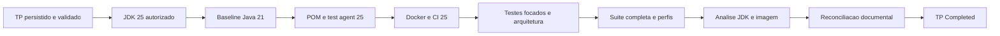

# TP-00041 — Migracao do backend para Java 25

**Document ID:** `TP-00041`  
**Primary Nature:** `Plano`  
**Objective:** Migrar toolchain e runtime do backend de Java 21 para Java 25 com
evidencia reproduzivel de compatibilidade.  
**Scope:** Maven, JDK, bytecode, tests agents, Docker, CI, documentacao AS-IS e
gates de todos os modulos backend.  
**Non-objectives:** Ativacao ampla de virtual threads, tuning de pools/GC/heap,
slimming, alteracao funcional, deploy ou ambiente real.  
**Project:** SaaS Service — Contador Fiscal
**Date:** 2026-09-06  
**Version:** 1.3  
**Status:** Completed — instalação, compilação e compatibilidade 100% comprovadas  
**Owner:** Engenharia, Backend, Arquitetura, Qualidade e SRE  
**Author:** @AgentOrchestrator  
**Keywords:** Java 25, Maven, compatibilidade, Spring Boot, Spring Modulith,
Docker, CI e testes  
**Related Files:** ADR-0053, ANL-00050, ADR-0052, REQ-00001, TP-00022,
TP-00029 e module registry.  
**Code References:** `backend/pom.xml`, `backend/Dockerfile`, `backend/.mvn/`,
`backend/src/test/`, workflows backend/security e adaptadores ativos.  
**Principal Statement:** O cutover somente e concluido quando todo gate aplicavel
executar em Java 25 e o repositorio deixar de publicar Java 21 como baseline
operacional ativo.

**References:**  
[ADR-0053 — Java 25, virtual threads e eficiencia](../../backend/docs/adrs/ADR-0053-adocao-java-25-backend.md) ·
[ANL-00050 — analise de impacto Java 25](../../analysis/ANL-00050-java-25-backend-impact-analysis.md) ·
[ADR-0052 — pools por tenant](../../backend/docs/adrs/ADR-0052-parametros-pool-conexao-por-tenant.md) ·
[REQ-00001 — envelope WhatsApp](../../product/requirements/REQ-00001-whatsapp-business-integration.md) ·
[TP-00022 — starvation do pool tenant](TP-00022-chatbot-tenant-pool-starvation-remediation.md) ·
[TP-00029 — runtime gerenciado dos pools](TP-00029-tenant-pool-policy-managed-runtime-environments.md) ·
[Module registry](../../architecture/module-registry.md) ·
[Java standard](../agents/standards/java-standard.md) ·
[Modulith standard](../agents/standards/modulith-standard.md) ·
[Backend testing standard](../agents/standards/backend-testing-standard.md).

---

# 1. Overview

Este plano executa o ADR-0053 em cinco fases: baseline, provisionamento controlado
do JDK, cutover coordenado, qualificacao completa e reconciliacao documental. A
migracao nao altera comportamento de dominio nem fronteiras dos catorze modulos.

O primeiro corte usa Java 25 com platform threads. A ativacao de virtual threads
fica fora deste plano porque TP-00022 e TP-00029 ainda possuem aceite/runtime
pendente e porque a capacidade finita de Hikari deve governar a concorrencia.

O host observado no inicio possui somente OpenJDK 21.0.12. Instalacao, download,
consulta de manifests remotos ou pull de imagem exigem aprovacao explicita e
escopo limitado; indisponibilidade desses recursos bloqueia a execucao, nunca
autoriza declarar compatibilidade por inspecao estatica.

---

# 2. Execution Tracking Matrix

> **Legend:** ⬜ Pending · 🔄 In Progress · ✅ Done · ⏸️ Blocked · ❌ Cancelled

| # | Activity | Agent | Status | Notes |
| --- | --- | --- | :---: | --- |
| 0.1 | Reconciliar ADR, ANL, requisito, pools, registry e standards | @AgentOrchestrator | ✅ | Fontes selecionadas e limites identificados. |
| 0.2 | Inventariar JDK, Maven, POM, Docker e CI AS-IS | @CodeGuardian | ✅ | Host/Javac 21.0.12; Maven 3.9.12; seis setups CI e dois stages Docker em 21. |
| 0.3 | Persistir/indexar este plano e validar governanca antes do software | @DocumentationAgent | ✅ | Plano e colecoes reconciliados conforme ADR-0000. |
| 1.1 | Obter JDK 25 autorizado e registrar vendor/patch | @DevOpsAgent | ✅ | OpenJDK Ubuntu `25.0.4+7-1-24.04` instalado em `/usr/lib/jvm/java-25-openjdk-amd64`. |
| 1.2 | Executar baseline limpo Java 21 e guardar contagens | @TestAutomator | ✅ | Baseline anterior distinguido; mutacao concorrente de `target` mitigada com snapshots imutaveis. |
| 1.3 | Confirmar suporte da combinacao Maven/plugins/processors | @CodeGuardian | ✅ | Maven 3.9.12, Boot 4.0.3, processors e plugins executados em 25. |
| 2.1 | Migrar POM para `release 25` e impedir runtime incorreto | @ImplementerCore | ✅ | Bytecode major 69, sem preview/incubator. |
| 2.2 | Configurar Mockito como `-javaagent` em Surefire/Failsafe | @TestAutomator | ✅ | Agent explicito aplicado aos dois plugins. |
| 2.3 | Migrar builder/JRE Docker juntos e preservar usuario nao-root | @DevOpsAgent | ✅ | Builder/JRE Temurin 25 pinados; imagem inspecionada como nao-root. |
| 2.4 | Migrar todos os jobs Java dos workflows para 25 | @DevOpsAgent | ✅ | Quatro setups backend e dois security convergem em 25. |
| 2.5 | Adicionar/atualizar teste do baseline de runtime 25 | @TestAutomator | ✅ | Teste dedicado passa em Java 25.0.4. |
| 3.1 | Corrigir erros de compilacao, reflection, processors ou test agent | @ImplementerCore | ✅ | Incompatibilidades reproduzidas corrigidas sem quebra modular. |
| 3.2 | Executar testes focados e gates arquiteturais | @TestAutomator | ✅ | Modulith, Clean Architecture e testes focados verdes. |
| 3.3 | Executar suite Maven completa e perfis PostgreSQL/isolamento | @TestAutomator | ✅ | 2.836 testes, 0 falhas, 0 erros, 9 skips nao criticos; gates PostgreSQL verdes. |
| 3.4 | Executar `jdeps`, `jdeprscan`, package e validar bytecode 69 | @CodeGuardian | ✅ | Package verde; major 69; nenhum achado bloqueante no codigo proprio. |
| 4.1 | Construir e realizar smoke da imagem Java 25 | @DevOpsAgent | ✅ | Imagem Java 25 construida/inspecionada; Dockerfile final sem warnings. |
| 4.2 | Reconciliar baseline ativo e evidencias documentais | @AgentOrchestrator | ✅ | ADR, ANL, requisitos, registry, standards e adaptadores reconciliados. |
| 4.3 | Executar validacao documental final e handoff | @DocumentationAgent | ✅ | Evidencias consolidadas; gate documental executado no fechamento. |

## Summary

| Phase | Total | Pending | In Progress | Blocked | Done | Progress |
| --- | :---: | :---: | :---: | :---: | :---: | ---: |
| Baseline documental | 3 | 0 | 0 | 0 | 3 | 100% |
| Instalação e baseline executável | 3 | 0 | 0 | 0 | 3 | 100% |
| Cutover coordenado | 5 | 0 | 0 | 0 | 5 | 100% |
| Compatibilidade | 4 | 0 | 0 | 0 | 4 | 100% |
| Imagem e fechamento | 3 | 0 | 0 | 0 | 3 | 100% |
| **TOTAL** | **18** | **0** | **0** | **0** | **18** | **100%** |

---

# 3. Context and Constraints

## 3.1 Architectural invariants

- Spring Boot 4.0.3, Spring Modulith 2.0.3 e Maven 3.9.12 permanecem neste corte.
- Os catorze modulos, APIs publicas, named interfaces e dependencias permitidas
  permanecem inalterados.
- O bytecode alvo e Java 25 (`major version 69`) e deve executar em JRE 25.
- Nao usar `--enable-preview`, incubator, Compact Object Headers, GC diferente,
  AOT, CDS customizado ou `jlink` neste experimento.
- Rollback e o par completo de artefato e imagem Java 21; JAR 25 nao roda em 21.
- Nao acessar producao, tenants, dados, secrets ou APIs reais.

## 3.2 Pools and concurrency boundary

- TP-00023 esta concluido repository-local, mas TP-00022 e TP-00029 ainda
  registram pendencias; TP-00030 nao autoriza rollout ambiental.
- Java 25 com platform threads pode ser qualificado sem ampliar concorrencia.
- `spring.threads.virtual.enabled` permanece ausente/desativado.
- Nenhum pool Hikari, fila, executor, semaphore ou timeout muda neste plano.
- Ativacao de virtual threads dependera de plano posterior, metricas Hikari e
  aceite dos gates de pool aplicaveis.

## 3.3 Compatibility surfaces

| Surface | Required evidence |
| --- | --- |
| Compiler/Lombok | `release 25`, annotation processing e package verdes. |
| Mockito/Byte Buddy | Agent explicito; mocks, spies e instrumentacao verdes. |
| Spring/Modulith/ArchUnit | Startup e ambos os gates estruturais verdes. |
| JPA/Flyway/Hikari/PostgreSQL | Perfis Failsafe e migrations com fixtures sinteticas. |
| Keycloak/Jackson/JAXB | Isolation/profile tests e startup sem illegal access. |
| TLS/JCA/PDFBox/mail | Testes existentes e smoke sintetico aplicavel. |
| Redis/Reactor/Netty | Suite existente, lifecycle e shutdown sem regressao. |
| Docker Alpine | Builder/runtime 25, healthcheck e usuario nao-root. |

---

# 4. Phase Details

## Phase 0 — Governed baseline

**Acceptance Criteria:**

- plano persistido e entrada individual no indice antes da primeira edicao de
  software;
- Java/POM/Docker/CI/pools inventariados sem comando Git;
- `validate-docs.sh` verde.

## Phase 1 — Authorized Java 25 environment

**Acceptance Criteria:**

- `java -version`, `javac -version` e Maven reportam Java feature 25;
- vendor e patch do JDK ficam registrados como evidencia;
- baseline Java 21 e distinguido de qualquer falha causada pelo cutover;
- nenhuma dependencia e atualizada apenas para antecipar erro nao reproduzido.

## Phase 2 — Atomic toolchain and runtime cutover

**Acceptance Criteria:**

- POM compila com `release 25` e o teste de runtime passa somente em JVM 25;
- Surefire e todos os Failsafe profiles recebem o Mockito agent sem sobrescrever
  outros argumentos JVM;
- builder e runtime Docker usam Java 25 e digest valido da mesma linha suportada;
- os seis setups Java dos workflows ativos usam 25;
- busca final nao encontra baseline operacional Java 21 nos alvos ativos; texto
  historico permanece preservado.

## Phase 3 — All-module compatibility qualification

**Acceptance Criteria:**

- testes focalizados de runtime/agent passam;
- `ModuleStructureVerificationTest`, `CleanArchitectureRulesTest` e
  `CleanArchitectureRuleContractTest` passam;
- `clean test` executa a suite completa em Java 25 sem falha ou erro;
- os perfis `tenant-isolation-gate`, `billing-read-api-postgres-gate` e
  `billing-provider-foundation-gate` passam com relatórios nao vazios;
- o seletor PostgreSQL de Conversation Audit do workflow passa;
- skips sao zero nos gates que os proibem; qualquer skip restante e inventariado
  e nao pode cobrir superficie critica de compatibilidade;
- `jdeps --jdk-internals` e `jdeprscan` nao apresentam achado bloqueante;
- o JAR e bytecode de producao sao Java 25, sem preview.

## Phase 4 — Image, reconciliation and closure

**Acceptance Criteria:**

- imagem constroi, inicia como usuario nao-root, reporta Java 25, fica healthy e
  encerra graciosamente com configuracao sintetica;
- nenhuma alteracao de API, schema ou dependencia entre modulos foi introduzida;
- module registry, standards e adaptadores ativos passam a descrever Java 25
  somente depois da prova executavel;
- ADR-0053/ANL-00050 registram o cutover comprovado sem apagar historia;
- validacao documental final passa;
- plano somente muda para `Completed` com todas as atividades concluidas e
  resultados, contagens, falhas corrigidas e skips documentados.

---

# 5. Agent Chain per Module

Nao ha cadeia por bounded context porque o codigo de dominio nao deve mudar. A
cadeia transversal e unica:

1. **@AgentOrchestrator** — governa sequencia, escopo e evidencias.
2. **@DevOpsAgent** — fornece toolchain/imagem/CI coerentes.
3. **@ImplementerCore** — corrige apenas incompatibilidades reproduzidas.
4. **@TestAutomator** — executa testes de todos os modulos e perfis.
5. **@CodeGuardian** — verifica bytecode, dependencias e fronteiras.
6. **@DocumentationAgent** — reconcilia fontes AS-IS e valida governanca.

---

# 6. Dependency Diagram



---

# 7. Agent Responsibility Matrix

| Agent | Baseline | Cutover | Compatibility | Closure |
| --- | --- | --- | --- | --- |
| @AgentOrchestrator | Owner | Sequencia | Triagem | Handoff |
| @DevOpsAgent | Toolchain | Docker/CI | Smoke | Runtime evidence |
| @ImplementerCore | Inventario | POM/correcoes | Compile/runtime | Review |
| @TestAutomator | Contagens 21 | Agent/teste 25 | Suites/perfis | Reports |
| @CodeGuardian | Riscos | Bytecode | Modulith/ArchUnit/JDK analysis | Audit |
| @DocumentationAgent | Plano/indice | — | Evidencia | Fontes e gate final |

---

# 8. Coordination Rules (@AgentOrchestrator)

1. Nenhuma edicao de software precede o plano validado.
2. Uma variavel muda por etapa: JDK, depois eventuais correcoes; pools, GC,
   virtual threads e slimming nao podem contaminar o diagnostico.
3. Falha reproduzida primeiro e comparada ao baseline Java 21 antes da correcao.
4. Correcao nao pode alterar API publica, named interface, schema ou comportamento
   sem nova fonte superior e escopo humano.
5. Gates menores executam antes da suite completa; todo gate vermelho causado
   pela migracao e corrigido e repetido.
6. Testes Docker usam somente fixtures sinteticas e daemon local autorizado.
7. Rede, instalacao, imagem remota ou sistema externo exigem aprovacao explicita.
8. Nenhum comando Git, deploy, HML, PRD, segredo ou dado real e executado.
9. Resultado parcial permanece `In Progress` ou `Blocked`; nunca `Completed`.

---

# 9. Verification

## 9.1 Automated tests and analysis

```bash
cd backend
java -version
javac -version
./mvnw -version
./mvnw -B -Dtest=JavaRuntimeCompatibilityTest test
./mvnw -B -Dtest=ModuleStructureVerificationTest test
./mvnw -B -Dtest=CleanArchitectureRulesTest,CleanArchitectureRuleContractTest test
./mvnw -B clean test
./mvnw -B clean -Ptenant-isolation-gate verify
./mvnw -B -Pbilling-read-api-postgres-gate verify
./mvnw -B -Pbilling-provider-foundation-gate verify
./mvnw -B package
jdeps --jdk-internals target/saas-service-1.0.0.jar
jdeprscan --release 25 target/saas-service-1.0.0.jar
```

Executar tambem o seletor PostgreSQL canonico de Conversation Audit declarado em
``, seus validadores de relatorio e os scripts
de contrato usados pelos jobs backend/security. Comandos Docker devem usar a
imagem pinada do plano e nao podem acessar producao.

## 9.2 Evidence rules

- registrar JDK/Maven, comando, exit code, total, failures, errors e skips;
- preservar output suficiente para reproduzir a falha e sua correcao;
- diferenciar indisponibilidade ambiental de incompatibilidade Java 25;
- nao somar duas execucoes parciais como se fossem uma suite completa;
- executar novamente o gate completo afetado depois da ultima correcao;
- finalizar com `./infra/scripts/validate-docs.sh` na raiz.

## 9.3 Rollback

- manter identificada a ultima combinacao Java 21 de JAR e imagem;
- se compile, teste, analise ou smoke falhar sem correcao segura, interromper o
  cutover e restaurar a combinacao inteira em uma mudanca humana posterior;
- nunca executar JAR de bytecode 69 em JRE 21;
- nao usar flag de permissao, skip ou relaxamento de gate como correcao.

## 9.4 Initial execution evidence — 2026-09-06

| Evidence | Result |
| --- | --- |
| Host/toolchain | OpenJDK/Javac `21.0.12`; Maven Wrapper `3.9.12`; nenhum JDK 25 instalado. |
| JDK 25 package discovery | Ubuntu publica candidato `openjdk-25-jdk-headless 25.0.4+7-1~24.04`; nenhuma instalacao ou download foi executado. |
| Explicit authorization | Pedido escalado de instalacao foi recusado ate o usuario autorizar explicitamente download e alteracao do sistema. |
| Java 21 first gate | `./mvnw -B -Dtest=ModuleStructureVerificationTest test` falhou em `testCompile` com `.class` ausente em `target`. |
| Java 21 clean retry | `./mvnw -B -Dtest=ModuleStructureVerificationTest clean test` voltou a observar `NoSuchFileException` em arquivos gerados. |
| Compilation isolation check | `./mvnw -B -DskipTests test` concluiu `BUILD SUCCESS` e compilou 1.433 fontes + 572 testes. |
| Concurrent mutation proof | Logo depois, `surefire:test` reportou `No tests to run`; `target/test-classes` havia desaparecido e `target/classes` fora recriado durante a execucao. Nenhuma correcao de codigo pode ser atribuida a esse resultado. |
| Documentation gate | Governanca de metadados passou para 739 Markdown/720 artefatos; estrutura agregada falhou por cinco referencias abreviadas preexistentes no TP-00039 durante a execucao, fora deste escopo. |

Os bloqueios iniciais foram superados com autorização explícita e snapshots
imutáveis. Posteriormente, a instalação do JDK 25 no host também foi confirmada
em 2026-09-08.

## 9.5 Final execution evidence — 2026-09-07

| Evidence | Result |
| --- | --- |
| Toolchain | OpenJDK `25.0.4`, Javac 25, Maven Wrapper `3.9.12`, `release 25`. |
| Full suite | `2.836` testes; `0` failures; `0` errors; `9` skips inventariados; `BUILD SUCCESS` em 20m23s. |
| Concurrent delta | Estado posterior recompilado (`1.436` fontes e `576` testes); scheduler/outbox comercial: `8/8` verdes. |
| Architecture/modules | Modulith e Clean Architecture verdes; todos os módulos compilados e cobertos pela suíte. |
| PostgreSQL gates | Tenant isolation, Billing provider/read API e Conversation Audit verdes com Testcontainers sintéticos. |
| Artifact | Fat JAR gerado; classe principal em major version `69`; sem preview. |
| JDK analysis | `jdeprscan --release 25` sem API removida no código próprio; achados `jdeps` restritos a terceiros monitorados. |
| Docker | Builder/JRE 25 pinados, imagem construída e inspecionada em Java 25/non-root; `docker build --check` sem warnings. |
| Scope boundary | Platform threads mantidas; pools/GC/heap/slimming não alterados; performance não benchmarkada. |

Skips: `EventPublicationIntegrationTest` (4) e um teste modular opcional de cada
contexto Billing, Certificate, Fiscal, Omnichannel e Tenant (5). Nenhum deles
encobre o teste de runtime, compilação, isolamento tenant ou contrato alterado.

## 9.6 Host installation and architecture compilation evidence — 2026-09-08

Evidência fornecida pelo operador após a instalação definitiva no host:

```text
JAVA_HOME=/usr/lib/jvm/java-25-openjdk-amd64
openjdk version "25.0.4" 2026-07-21
OpenJDK Runtime Environment (build 25.0.4+7-1-24.04-Ubuntu)
OpenJDK 64-Bit Server VM (build 25.0.4+7-1-24.04-Ubuntu, mixed mode, sharing)
javac 25.0.4
Apache Maven 3.9.12
Java version: 25.0.4, vendor: Ubuntu
BUILD SUCCESS
Tests run: 29, Failures: 0, Errors: 0, Skipped: 0
```

Os 29 testes compreendem `Module Structure Verification` (`6/6`), contratos de
Clean Architecture (`7/7`) e regras ArchUnit de Clean Architecture (`16/16`).
Isso confirma instalação, seleção de `JAVA_HOME`, execução do Maven Wrapper,
compilação e preservação das fronteiras dos módulos no JDK instalado.

O `cd backend` retornou `No such file or directory` porque o shell já estava no
diretório `backend`; o `./mvnw -version` subsequente executou corretamente nesse
mesmo diretório. Portanto, a mensagem é um erro de navegação redundante, não uma
falha de instalação, compilação ou compatibilidade.

---

# 10. Change Log

| Version | Date | Author | Changes |
| --- | --- | --- | --- |
| 1.3 | 2026-09-08 | Owner humano / Codex (OpenAI) | Registra a instalação definitiva do OpenJDK/Javac 25.0.4 no host, Maven 3.9.12 usando esse runtime e gate arquitetural 29/29 verde; classifica o `cd backend` redundante como erro de navegação sem impacto. |
| 1.2 | 2026-09-07 | Owner humano / Codex (OpenAI) | Conclui o plano com toolchain Java 25 isolada, 2.836 testes integrais verdes, delta concorrente validado, gates PostgreSQL/arquitetura, package major 69, análise JDK e imagem Docker qualificadas; virtual threads e benchmark permanecem fora do escopo. |
| 1.1 | 2026-09-06 | Codex (OpenAI) | Registra ausencia de JDK 25, aprovacao explicita pendente, mutacao concorrente de `target` que impede baseline confiavel e falha documental externa no TP-00039; mantem o plano aberto sem editar software. |
| 1.0 | 2026-09-06 | Owner humano / Codex (OpenAI) | Cria e inicia o plano docs-first para migracao Java 25, com fronteira de pools/virtual threads, cutover atomico, suites de todos os modulos, imagem, rollback e conclusao condicionada a evidencia integral. |
