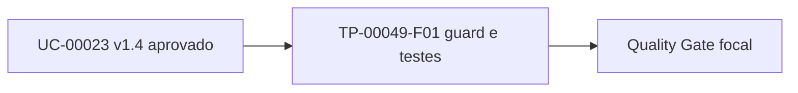

# TP-00049 — Aba LLM durante personificação Super Admin

**Referências:**
[REQ-00003](../../product/requirements/REQ-00003-rbac-profile-responsibility-matrix.md) ·
[UC-00023](../../product/use-cases/UC-00023-frontend-das-cobranca.md) ·
[ADR-0013](../../frontend/docs/adrs/ADR-0013-frontend-architecture-state-management.md) ·
[Implementation Readiness](../../agents/standards/implementation-readiness-standard.md) ·
[Qualidade](../../agents/standards/software-quality-standard.md)

## 1. Overview

Corrigir exclusivamente a visibilidade da aba `Extração LLM` em
`/fiscal/das-cobranca`: a personificação troca os papéis efetivos do Super Admin
pelos papéis do workspace tenant, mas não remove sua credencial global. O fluxo
DAS Regular e o chatbot permanecem inalterados.

## 2. Implementation Readiness Gate

### 2.1 Gate Audit

| Control | Required state | Observed evidence | Result |
|---|---|---|---|
| Requirements | `Approved` | REQ-00003 v2.10 define Super Admin global e governança LLM | PASS |
| ADRs | `Accepted` | ADR-0013 v1.2 separa identidade global, contexto efetivo e personificação | PASS |
| Use Cases | `Approved` | UC-00023 v1.4, aprovado pelo owner humano em 2026-09-09, AC-10 | PASS |
| Adherence analysis | Passing | `hasEffectiveRole(SUPER_ADMIN)` retorna falso por desenho durante personificação; `hasRole(SUPER_ADMIN)` preserva a credencial global | PASS |
| Assumptions | Todas encerradas | Nenhuma assumption; o comportamento foi confirmado pelo solicitante | PASS |
| Open Questions | Todas resolvidas | Modalidade resolvida como DAS Regular; renomeação futura separada | PASS |
| Dependencies | Disponíveis | `useAuth().hasRole`, fixture e teste de página existentes | PASS |

### 2.2 Acceptance Tests

| Acceptance criterion | Planned test/evidence | Owner | Expected result |
|---|---|---|---|
| AC-LLM-01 / UC-00023 AC-10 | Teste de componente com role bruta Super Admin e papel efetivo Tenant Admin | Frontend | Aba Extração LLM visível durante personificação |
| AC-LLM-02 | Teste de componente com Tenant Admin sem credencial Super Admin | Frontend | Aba Extração LLM ausente |
| AC-LLM-03 | Suíte focal, typecheck, lint e format check | Qualidade | Todos retornam código 0 |

### 2.3 Prohibited

- Alterar payload, endpoint, adapter SERPRO, modalidade emitida ou fluxo do chatbot.
- Alterar `resolveEffectiveRoles` ou conceder a aba a perfis tenant.
- Executar Git, acessar produção, instalar dependências ou usar rede.

### 2.4 Mandatory

- Usar a credencial bruta somente para identificar a feature exclusiva global.
- Preservar `hasEffectiveRole` para emissão e demais capacidades tenant-scoped.
- Adicionar regressões positiva e negativa e executar o Quality Gate focal.

### 2.5 Result

| Field | Value |
|---|---|
| **Readiness Result** | READY |
| **Auditor** | `@AgentOrchestrator using implementation-readiness` |
| **Source Versions** | REQ-00003 v2.10; UC-00023 v1.4; ADR-0013 v1.2 |
| **Scope Authorized** | TP-00049-F01; página e teste DAS listados no frontmatter |
| **Blockers / Decision Owner** | N/A — aprovação e modalidade resolvidas pelo solicitante humano em 2026-09-09 |

## 3. Execution Tracking Matrix

| # | Activity | Agent | Status | Notes |
|---|---|---|:---:|---|
| F01 | Corrigir guard da aba e adicionar regressão de personificação | Frontend | ✅ | Guard mínimo e matriz RBAC 6/6 verdes |
| F02 | Executar gates documental e frontend | Qualidade | ⏸️ | Focal PASS; PR FAIL/BLOCKED por timeouts externos e `.env.local` |

| Phase | Total | Pending | In Progress | Done | Progress |
|---|---:|---:|---:|---:|---:|
| Correção focal | 2 | 0 | 0 | 1 | 50% — 1 bloqueada |

## 4. Context and Constraints

`hasEffectiveRole` remove `ROLE_SUPER_ADMIN` durante personificação para impedir
que funcionalidades globais vazem ao workspace tenant. A aba técnica é exceção
explicitamente autorizada pelo UC-00023: sua visibilidade identifica a pessoa
Super Admin pela role bruta, enquanto as chamadas tenant-scoped continuam sob o
contexto efetivo.

## 5. Phase Details

### Task TP-00049-F01 — Atomic Execution Contract

| Field | Required content |
|---|---|
| **What** | Renderizar Extração LLM para Super Admin personificado e ocultá-la dos demais perfis |
| **Where** | `frontend/src/app/(dashboard)/fiscal/das-cobranca/page.tsx` e `frontend/src/components/fiscal/__tests__/DasCobrancaPage.test.tsx` |
| **Depends on** | UC-00023 v1.4 aprovado e decisão DAS Regular materializada |
| **Reuses** | `useAuth().hasRole`, `hasEffectiveRole` e fixture Vitest existentes |
| **Requirements** | REQ-00003 v2.10, UC-00023 v1.4, ADR-0013 v1.2 |
| **Agent** | Frontend |

**Gate Audit:** READY conforme seção 2 para os dois paths exatos.

**Acceptance Tests:** AC-LLM-01, AC-LLM-02 e AC-LLM-03 da seção 2.2.

**Prohibited:** alterar backend, chatbot, contrato DAS ou resolver global de roles.

**Mandatory:** teste positivo personificado, negativo Tenant Admin e gates focalizados.

**Definition of Done:**

- [x] Guard usa role bruta apenas na aba LLM — Evidência: revisão focal.
- [x] Testes positivo e negativo passam — Evidência: Vitest `6/6`.
- [x] Typecheck, lint, format e Quality Gate focal retornam código 0 — Evidência: comandos da seção 10.
- [x] Governança documental retorna código 0 — Evidência: `validate-docs.sh`, `24/24`.
- [ ] Quality Gate `pr` integral passa — Evidência pendente: cobertura teve três timeouts externos, processo terminou `143` e build foi bloqueado pela presença de `.env.local`.

## 6. Agent Chain per Module

Não aplicável: uma única correção frontend focal, sem cadeia multiagente.

## 7. Dependency Diagram



## 8. Agent Responsibility Matrix

| Agent | Documentação | Implementação | Verificação |
|---|---|---|---|
| Frontend | Consulta fontes aprovadas | Guard e teste focal | Vitest, typecheck, lint e format |
| Qualidade | Audita evidências | N/A | Quality Gate e governança documental |

## 9. Coordination Rules

1. Implementar somente após o READY da seção 2.
2. Não paralelizar edições no mesmo arquivo.
3. Achado fora do escopo vira pendência separada.
4. Não declarar conclusão sem comandos reproduzíveis.

## 10. Verification

| Escopo | Nível | A1 — Test Gate | A2 — Quality Gate | A3 — Security/Compliance | Owner | Resultado |
|---|---|---|---|---|---|---|
| Frontend DAS | focused | Vitest `6/6`; suíte fiscal `15/15` | typecheck, lint e format retornaram 0 | matriz positiva/negativa coberta | Qualidade | PASS |
| Frontend completo | pr | cobertura encontrou três timeouts fora de DAS e terminou 143 | build não executado por `.env.local` | warnings preexistentes fora do recorte | Qualidade | FAIL / BLOCKED |

```bash
cd frontend
npm test -- --run src/components/fiscal/__tests__/DasCobrancaPage.test.tsx
npm run typecheck
npm run lint -- --file 'src/app/(dashboard)/fiscal/das-cobranca/page.tsx' --file src/components/fiscal/__tests__/DasCobrancaPage.test.tsx
npm run format:check
cd ..
./infra/scripts/validate-quality-gates.sh --scope frontend --level focused --focus src/components/fiscal/__tests__/DasCobrancaPage.test.tsx
./infra/scripts/validate-docs.sh
```

Verificação manual opcional: personificar um tenant com uma sessão Super Admin de
teste e confirmar as três abas sem executar emissão ou extração.

## 11. Change Log

| Version | Date | Author | Changes |
|---|---|---|---|
| 1.1 | 2026-09-09 | Codex | Implementa o guard e a regressão focal; registra A1/A3 focais verdes e preserva o PR gate amplo como FAIL/BLOCKED sem falso verde. |
| 1.0 | 2026-09-09 | Solicitante humano / Codex | Persiste decisão, IRG READY, escopo mínimo e evidências exigidas antes da correção. |
